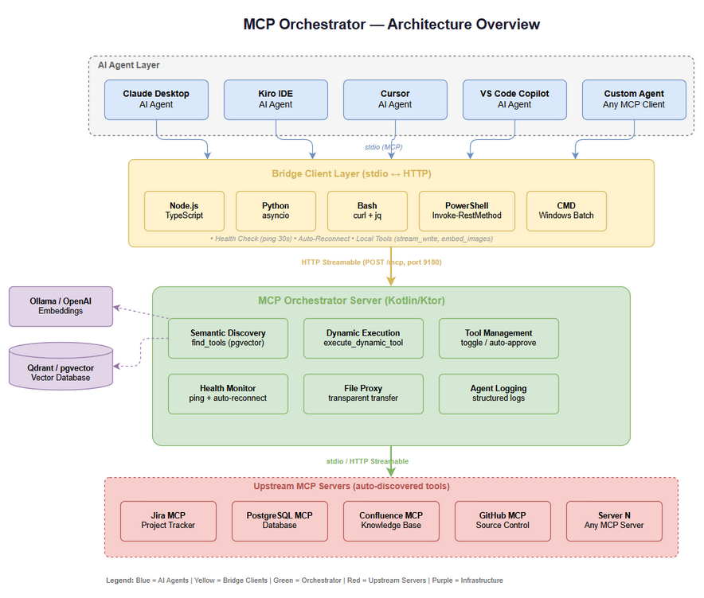
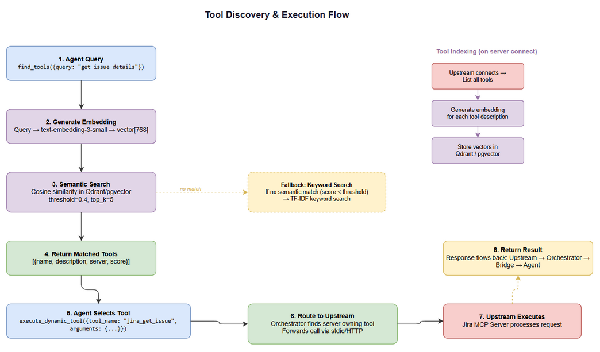
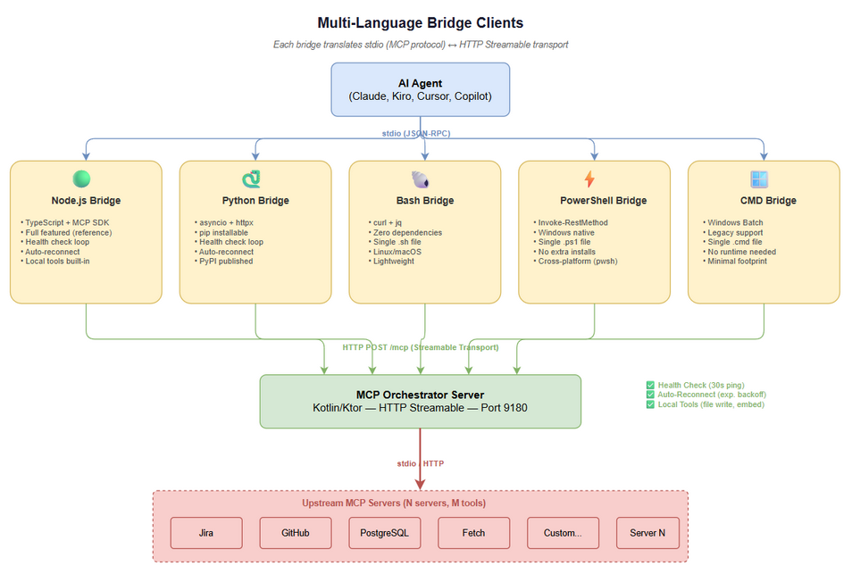

<p align="center">
  <h1 align="center">🎯 MCP Orchestrator</h1>
  <p align="center">
    <strong>Multi-server MCP orchestrator with semantic tool discovery, dynamic execution, and multi-language bridge clients</strong>
  </p>
  <p align="center">
    <a href="https://github.com/dnguyenminh/MCPOrchestration/releases"></a>
    <a href="https://github.com/dnguyenminh/MCPOrchestration/blob/main/LICENSE"></a>
    <a href="https://github.com/dnguyenminh/MCPOrchestration/actions"></a>
    
    
    
  </p>
</p>

---

**MCP Orchestrator** aggregates multiple upstream MCP servers into a single endpoint. AI agents discover tools by natural language, and the orchestrator routes execution to the correct server automatically.

No more hardcoding tool names. No more managing 10 separate MCP server configs. One orchestrator, all your tools.

### The Problem

You have 5 MCP servers (Jira, GitHub, PostgreSQL, Docs, Custom). Your AI agent needs to know every tool name, which server it belongs to, and how to call it. Add a new server? Update every agent's config.

### The Solution

Connect all servers to the orchestrator. Your agent only needs 2 tools: `find_tools` (describe what you need) and `execute_dynamic_tool` (run it). The orchestrator handles discovery, routing, health monitoring, and reconnection — across any number of servers.

---

## ✨ Features

| | Feature | Description |
|---|---------|-------------|
| 🔍 | **Semantic Tool Discovery** | Find tools by natural language query using vector embeddings (Qdrant/pgvector + Ollama/OpenAI) |
| 🔀 | **Multi-Server Aggregation** | Connect N upstream MCP servers, expose all tools through one endpoint |
| ⚡ | **Dynamic Execution** | Route tool calls to the correct upstream server automatically |
| 🏥 | **Health Monitoring** | Periodic ping (30s), auto-reconnect with exponential backoff |
| 🌐 | **5 Bridge Clients** | Node.js, Python, Bash, PowerShell, CMD — pick your platform |
| 📁 | **File Proxy** | Transparent file transfer for tools that accept file content |
| 🔒 | **Tool Management** | Enable/disable tools per session, persistent auto-approve lists |
| 📊 | **Agent Logging** | Structured execution logs for multi-agent workflows |
| 🔄 | **Keyword Fallback** | TF-IDF keyword search when semantic match is below threshold |

---

## 🏗️ Architecture



The orchestrator sits between your AI agent and upstream MCP servers. A lightweight bridge client translates stdio (what your IDE speaks) into HTTP Streamable transport (what the orchestrator speaks).

**Key flow:**
1. AI Agent ↔ Bridge Client (stdio/JSON-RPC)
2. Bridge Client ↔ Orchestrator Server (HTTP POST `/mcp`, port 9180)
3. Orchestrator Server ↔ Upstream MCP Servers (stdio or HTTP)

---

## 🔍 How Tool Discovery Works



Instead of knowing exact tool names, agents describe what they need:

```json
{
  "tool": "find_tools",
  "arguments": {
    "query": "get issue details from project tracker"
  }
}
```

The orchestrator:
1. Generates a vector embedding of the query
2. Searches the vector database for similar tool descriptions
3. Returns top-K matches with similarity scores
4. Agent picks the best match and calls `execute_dynamic_tool`

**Fallback:** If no semantic match exceeds the threshold, TF-IDF keyword search kicks in automatically.

---

## 🚀 Quick Start

### Prerequisites

- **Java 21+** (for the orchestrator server)
- **Qdrant** or **PostgreSQL + pgvector** (vector database)
- **Ollama** or **OpenAI API key** (for embeddings)
- One of: Node.js 20+, Python 3.10+, Bash, PowerShell, or CMD (for bridge client)

### 1. Download

```bash
# Option A: Clone and build
git clone https://github.com/dnguyenminh/MCPOrchestration.git
cd MCPOrchestration
./gradlew :orchestrator-server:shadowJar

# Option B: Download release JAR
curl -LO https://github.com/dnguyenminh/MCPOrchestration/releases/latest/download/mcp-orchestrator-all.jar
```

### 2. Configure

```bash
cp orchestrator-server/src/main/resources/application.yml ./application.yml
```

Edit `application.yml`:

```yaml
orchestrator:
  server:
    port: 9180
    transport: http

  embedding:
    provider: openai          # or "ollama"
    model: text-embedding-3-small
    api_key: ${EMBEDDING_API_KEY}
    dimensions: 768

  vector_db:
    provider: qdrant          # or "postgres"
    host: localhost
    port: 6333
    collection_name: mcp_tools

  health:
    check_interval_seconds: 30
    auto_reconnect: true
    max_reconnect_attempts: 5
```

### 3. Define Upstream Servers

Create `mcp-servers.json`:

```json
{
  "mcpServers": {
    "jira": {
      "command": "npx",
      "args": ["-y", "@anthropic/jira-mcp-server"],
      "env": {
        "JIRA_URL": "https://your-instance.atlassian.net",
        "JIRA_TOKEN": "your-token"
      }
    },
    "github": {
      "command": "npx",
      "args": ["-y", "@modelcontextprotocol/server-github"],
      "env": {
        "GITHUB_TOKEN": "ghp_xxx"
      }
    },
    "postgres": {
      "command": "npx",
      "args": ["-y", "@modelcontextprotocol/server-postgres", "postgresql://localhost/mydb"]
    },
    "remote-server": {
      "transport": "http-streamable",
      "url": "http://other-host:8081/mcp"
    }
  }
}
```

### 4. Run

```bash
java -jar mcp-orchestrator-all.jar --config ./mcp-servers.json
```

The server starts on port **9180** and connects to all configured upstream servers.

---

## 🖥️ MCP Client Configuration



Add the orchestrator to your IDE's MCP configuration. Pick the bridge client that matches your environment.

### Kiro IDE

`.kiro/settings/mcp.json`:

```json
{
  "mcpServers": {
    "orchestrator": {
      "command": "node",
      "args": [
        "/path/to/MCPOrchestration/mcp-client-bridge/dist/index.js",
        "--url", "http://localhost:9180"
      ]
    }
  }
}
```

### Claude Desktop

`claude_desktop_config.json`:

```json
{
  "mcpServers": {
    "orchestrator": {
      "command": "node",
      "args": [
        "/path/to/MCPOrchestration/mcp-client-bridge/dist/index.js",
        "--url", "http://localhost:9180"
      ]
    }
  }
}
```

### Cursor

`.cursor/mcp.json`:

```json
{
  "mcpServers": {
    "orchestrator": {
      "command": "node",
      "args": [
        "/path/to/MCPOrchestration/mcp-client-bridge/dist/index.js",
        "--url", "http://localhost:9180"
      ]
    }
  }
}
```

### VS Code (GitHub Copilot)

`.vscode/mcp.json`:

```json
{
  "servers": {
    "orchestrator": {
      "command": "node",
      "args": [
        "/path/to/MCPOrchestration/mcp-client-bridge/dist/index.js",
        "--url", "http://localhost:9180"
      ]
    }
  }
}
```

### Windsurf / Cline / Other MCP Clients

Any MCP-compatible client works. Point it to the bridge client with `--url http://localhost:9180`.

---

## 🌐 Multi-Language Bridge Clients

Choose the bridge client that fits your environment. All bridges provide the same functionality:

| Bridge | Language | Install | Best For |
|--------|----------|---------|----------|
| **Node.js** | TypeScript | `npm ci && npm run build` | Full-featured, reference implementation |
| **Python** | Python 3.10+ | `pip install mcp-bridge` | Python-native environments |
| **Bash** | Shell | Single file, no install | Linux/macOS, minimal footprint |
| **PowerShell** | PS 5.1+ | Single file, no install | Windows native |
| **CMD** | Batch | Single file, no install | Legacy Windows |

### Node.js Bridge (Recommended)

```json
{
  "command": "node",
  "args": ["/path/to/mcp-client-bridge/dist/index.js", "--url", "http://localhost:9180"]
}
```

Build from source:
```bash
cd mcp-client-bridge
npm ci
npm run build
```

### Python Bridge

```json
{
  "command": "python",
  "args": ["-m", "mcp_bridge", "--url", "http://localhost:9180"]
}
```

Install:
```bash
pip install mcp-bridge
# or from source:
cd mcp-bridge-python && pip install -e .
```

### Bash Bridge

```json
{
  "command": "bash",
  "args": ["/path/to/mcp-bridge-bash/mcp-bridge.sh", "--url", "http://localhost:9180"]
}
```

Requirements: `curl` + `jq` (pre-installed on most Linux/macOS systems).

### PowerShell Bridge

```json
{
  "command": "pwsh",
  "args": ["-NoProfile", "-File", "/path/to/mcp-bridge-powershell/mcp-bridge.ps1", "-Url", "http://localhost:9180"]
}
```

Works with both Windows PowerShell 5.1 and cross-platform PowerShell 7+.

### CMD Bridge (Windows)

```json
{
  "command": "cmd",
  "args": ["/c", "C:\\path\\to\\mcp-bridge-cmd\\mcp-bridge.cmd", "--url", "http://localhost:9180"]
}
```

---

## 🛠️ Available Tools

The orchestrator exposes **only 2 core tools** to your AI agent — that's all it needs to access hundreds of upstream tools:

### Core Tools

| Tool | What It Solves |
|------|----------------|
| `find_tools` | **"I don't know what tools exist."** — Describe what you need in plain English. The orchestrator searches across ALL connected servers using vector similarity and returns the best matches with confidence scores. No more memorizing tool names or reading docs. |
| `execute_dynamic_tool` | **"I found the tool, now run it."** — Pass the tool name + arguments. The orchestrator knows which server owns it, routes the call, handles timeouts, and returns the result. Zero config per tool. |

### Management Tools

| Tool | What It Solves |
|------|----------------|
| `toggle_tool` | **"This tool keeps getting called but I don't want it right now."** — Disable any tool or entire server for the current session. Re-enable anytime. Useful when a server is flaky or a tool produces unwanted side effects. |
| `reset_tools` | **"I disabled too many things, start fresh."** — One call restores all tools to their default enabled state. |
| `manage_auto_approve` | **"I trust these tools, stop asking me every time."** — Add tools to the auto-approve list so your IDE won't prompt for confirmation. Persists across restarts. |

### Utility Tools (run locally on bridge, zero latency)

| Tool | What It Solves |
|------|----------------|
| `agent_log` | **"I need to track what my multi-agent pipeline is doing."** — Write structured logs (ticket, agent, step, status, message) for observability. Essential for debugging complex AI workflows with multiple agents. |
| `stream_write_file` | **"I need to write a file but the server is remote."** — Writes directly to your local disk from the bridge process. No network round-trip, no base64 encoding, no size limits. Supports write/append/create modes. |
| `embed_images` | **"My markdown has local image paths but I need base64 for export."** — Reads a markdown file, finds all `` references, replaces them with inline base64 data URIs. Pure file I/O, no AI tokens consumed. |

**Plus:** Every tool from your connected upstream servers (Jira, GitHub, PostgreSQL, etc.) becomes discoverable via `find_tools` — no additional configuration needed.

### Example: From Question to Answer in 2 Calls

```
# Step 1: "What can search Jira issues?"
Agent → find_tools(query="search issues with JQL in project tracker")
       ← [{name: "jira_search", server: "atlassian", score: 0.94, 
            description: "Search Jira issues using JQL"}]

# Step 2: "Run it."
Agent → execute_dynamic_tool(tool_name="jira_search", 
                             arguments={jql: "project = MTO AND status = 'In Progress'"})
       ← {issues: [{key: "MTO-42", summary: "Python Bridge Client", ...}]}
```

No hardcoded tool names. No per-tool configuration. The agent discovers and uses tools dynamically.

---

## 🏥 Health Check & Auto-Reconnect

The orchestrator monitors all upstream server connections:

- **Periodic ping** every 30 seconds (configurable)
- **Auto-reconnect** with exponential backoff on connection loss
- **Max retry attempts** before marking server as unavailable
- **Graceful degradation** — other servers continue working if one goes down

Bridge clients also implement health checks against the orchestrator server itself, ensuring the full chain stays connected.

```yaml
orchestrator:
  health:
    check_interval_seconds: 30
    auto_reconnect: true
    max_reconnect_attempts: 5
    backoff_multiplier: 2.0
```

---

## ⚙️ Upstream Server Configuration

### Supported Transports

| Transport | Config Key | Use Case |
|-----------|-----------|----------|
| **stdio** | `command` + `args` | Local MCP servers (spawned as child process) |
| **HTTP Streamable** | `url` | Remote MCP servers |

### Full Example (`mcp-servers.json`)

```json
{
  "mcpServers": {
    "local-stdio-server": {
      "command": "uvx",
      "args": ["my-mcp-tool"],
      "env": {
        "API_KEY": "secret"
      }
    },
    "remote-http-server": {
      "transport": "http-streamable",
      "url": "http://192.168.1.100:8081/mcp"
    },
    "node-server": {
      "command": "node",
      "args": ["./my-server/dist/index.js"],
      "env": {}
    }
  }
}
```

### Environment Variable Resolution

Config values support `${ENV_VAR}` syntax:

```yaml
orchestrator:
  embedding:
    api_key: ${OPENAI_API_KEY}
```

---

## 🔧 Development

### Build from Source

```bash
git clone https://github.com/dnguyenminh/MCPOrchestration.git
cd MCPOrchestration

# Build server
./gradlew :orchestrator-server:shadowJar

# Build Node.js bridge
cd mcp-client-bridge && npm ci && npm run build

# Run tests
./gradlew test
```

### Project Structure

```
MCPOrchestration/
├── orchestrator-server/     # Main server (Kotlin/Ktor)
├── orchestrator-core/       # Shared core library
├── orchestrator-client/     # Client SDK
├── orchestrator-bridge/     # Bridge utilities
├── kb-server/               # Knowledge base server
├── mcp-client-bridge/       # Node.js bridge (TypeScript)
├── mcp-bridge-python/       # Python bridge
├── mcp-bridge-bash/         # Bash bridge
├── mcp-bridge-powershell/   # PowerShell bridge
├── mcp-bridge-cmd/          # Windows CMD bridge
└── docs/                    # Documentation
```

### Tech Stack

| Component | Technology |
|-----------|-----------|
| Server | Kotlin 2.3 + Ktor 3.4 (Netty) |
| Protocol | MCP Kotlin SDK 0.12 |
| DI | Koin 4.1 |
| Serialization | kotlinx.serialization + kaml (YAML) |
| Vector DB | Qdrant (primary) / FAISS (local fallback) |
| Embeddings | OpenAI / Ollama (any OpenAI-compatible API) |
| Testing | Kotest + MockK + Testcontainers |
| Bridge (Node) | TypeScript + MCP SDK |
| Bridge (Python) | asyncio + httpx |

---

## 🤝 Contributing

Contributions are welcome! Here's how to get started:

1. Fork the repository
2. Create a feature branch: `git checkout -b feature/my-feature`
3. Make your changes
4. Run tests: `./gradlew test`
5. Submit a pull request

### Areas for Contribution

- Additional bridge client languages (Go, Rust, C#)
- New vector database backends
- Performance optimizations
- Documentation improvements
- Bug fixes

---

## 📄 License

This project is licensed under the [MIT License](LICENSE).

---

## 🔗 Links

- **GitHub:** [github.com/dnguyenminh/MCPOrchestration](https://github.com/dnguyenminh/MCPOrchestration)
- **Releases:** [Latest Release](https://github.com/dnguyenminh/MCPOrchestration/releases/latest)
- **MCP Specification:** [modelcontextprotocol.io](https://modelcontextprotocol.io)

---

<p align="center">
  Built with ❤️ for the MCP ecosystem
</p>
