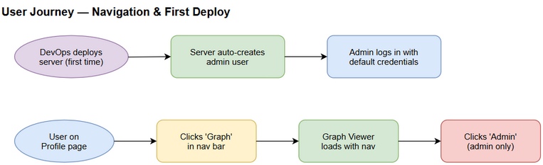

# BRD — MTO-102: Shared Navigation Bar + Default Admin User Seeding

## 1. Business Context

MCP Orchestrator server có nhiều trang web (Graph Viewer, Sync Dashboard, Profile, Admin Schemas) nhưng không có navigation chung. User phải nhớ URL để di chuyển giữa các trang. Ngoài ra, khi deploy lần đầu, admin phải tạo user bằng SQL thủ công — quá phức tạp cho deployment.

## 2. Business Requirements

### BR-1: Shared Navigation Bar
- **Mô tả:** Tất cả trang web phải có navigation bar chung ở top, hiển thị links đến các trang chính.
- **Rationale:** Cải thiện UX, giảm friction khi navigate giữa các features.
- **Priority:** High

### BR-2: Auth-Aware Navigation
- **Mô tả:** Nav bar phải hiển thị/ẩn links dựa trên auth state và user role.
- **Rationale:** Admin-only pages không nên hiện cho regular users.
- **Priority:** High

### BR-3: Default Admin User on First Deploy
- **Mô tả:** Server tự tạo admin user khi bảng users trống (first deploy).
- **Rationale:** Loại bỏ bước SQL thủ công, đơn giản hóa deployment.
- **Priority:** Critical

## 3. Stakeholders

| Role | Interest |
|------|----------|
| DevOps | Deployment đơn giản, không cần SQL |
| End Users | Navigate dễ dàng giữa các trang |
| Admin | Truy cập admin features nhanh |

## 4. Success Criteria

- [ ] User có thể navigate giữa tất cả trang mà không cần nhớ URL
- [ ] Admin link chỉ hiện cho users có role LEADER/SYSTEM_OWNER
- [ ] First deploy: login được ngay với default credentials
- [ ] Default credentials có thể override qua environment variables

## 5. Out of Scope

- Server-side route protection (sẽ là ticket riêng)
- User registration UI
- Password change UI
