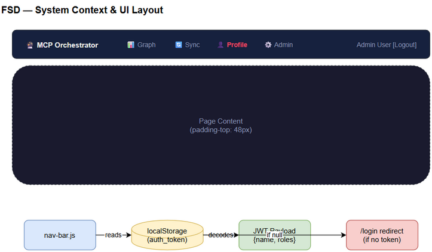

# FSD — MTO-102: Shared Navigation Bar + Default Admin User Seeding

## 1. Overview

Implement shared navigation bar (`nav-bar.js`) và default admin user seeding trong `AuthMigration`.

## 2. Functional Specifications



### FS-1: Navigation Bar Component

**File:** `orchestrator-server/src/main/resources/static/nav-bar.js`

**Behavior:**
- Auto-inject vào `<body>` khi DOM ready
- Không hiện trên `/login` page
- Redirect về `/login` nếu chưa authenticated (no `localStorage.auth_token`)
- Parse JWT token để lấy user name và roles
- Hiển thị links: Graph, Sync, Profile, Admin (admin-only)
- Highlight active page dựa trên `window.location.pathname`
- Logout button: clear localStorage → redirect `/login`
- Inject CSS với `body { padding-top: 48px }` để không che content

**Integration:** Mỗi HTML page include `<script src="/static/nav-bar.js"></script>` trong `<head>`.

### FS-2: Default Admin User Seeding

**File:** `orchestrator-server/src/main/kotlin/com/orchestrator/mcp/auth/AuthMigration.kt`

**Behavior:**
- Chạy trong `migrate()` sau `migrateUsersTable()` và `createBridgeTokensTable()`
- Check `SELECT COUNT(*) FROM users` — nếu > 0 thì skip
- Tạo user với:
  - email: env `ADMIN_EMAIL` hoặc `admin@localhost`
  - password: bcrypt hash của env `ADMIN_PASSWORD` hoặc `admin123`
  - display_name: env `ADMIN_NAME` hoặc `Administrator`
  - role: `SYSTEM_OWNER`
  - active: true, auth_mode: `local`
- Log warning khi tạo (hiện email + password trong log)

## 3. UI Specifications

### Nav Bar Layout

```
┌─────────────────────────────────────────────────────────────┐
│ 🔮 MCP Orchestrator  📊 Graph  🔄 Sync  👤 Profile  ⚙️ Admin │  User Name  [Logout] │
└─────────────────────────────────────────────────────────────┘
```

- Height: 48px, fixed top
- Background: #16213e, border-bottom: #30363d
- Links: #8892b0, hover: #eaeaea, active: #e94560
- z-index: 9999

## 4. Pages Modified

| Page | File | Change |
|------|------|--------|
| Profile | `static/profile.html` | Add nav-bar.js script |
| Graph Viewer | `static/graph-viewer.html` | Add nav-bar.js script |
| Sync Dashboard | `static/sync-dashboard.html` | Add nav-bar.js script |
| Admin Schemas | `static/admin-schemas.html` | Add nav-bar.js script |
| Login | `static/login.html` | No change (nav-bar skips) |

## 5. Configuration

| Env Variable | Default | Description |
|---|---|---|
| `ADMIN_EMAIL` | `admin@localhost` | Default admin email |
| `ADMIN_PASSWORD` | `admin123` | Default admin password |
| `ADMIN_NAME` | `Administrator` | Default admin display name |
