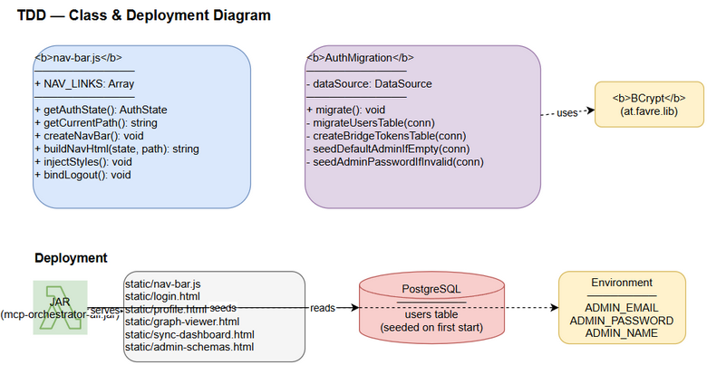

# TDD — MTO-102: Shared Navigation Bar + Default Admin User Seeding

## 1. Architecture

### Component Diagram

```
Browser → nav-bar.js → localStorage (auth_token)
                     → JWT decode (roles, name)
                     → DOM inject (nav element)

Server Startup → AuthMigration.migrate()
              → seedDefaultAdminIfEmpty()
              → PostgreSQL (users table)
```

### Technology Stack

| Component | Technology |
|-----------|-----------|
| Nav Bar | Vanilla JavaScript (no framework) |
| CSS | Inline styles via `<style>` injection |
| Admin Seeding | Kotlin + BCrypt + JDBC |
| Database | PostgreSQL |

## 2. Implementation Details



### 2.1 nav-bar.js

**Pattern:** Self-executing IIFE, no global pollution.

**Functions:**
- `getAuthState()` — decode JWT from localStorage, return `{loggedIn, isAdmin, name}`
- `getCurrentPath()` — `window.location.pathname`
- `createNavBar()` — orchestrate: check auth → build HTML → inject → bind events
- `buildNavHtml(state, currentPath)` — generate nav HTML string
- `injectStyles()` — create `<style>` element with nav CSS
- `bindLogout()` — attach click handler to logout button

**Security:** Token chỉ decode (không verify signature) — server-side verification là responsibility của API endpoints.

### 2.2 AuthMigration.seedDefaultAdminIfEmpty()

**Flow:**
1. `SELECT COUNT(*) FROM users` → if > 0, return
2. Read env vars (ADMIN_EMAIL, ADMIN_PASSWORD, ADMIN_NAME)
3. BCrypt hash password (cost factor 12)
4. `INSERT INTO users (id, email, role, display_name, active, password_hash, auth_mode)`
5. Log warning with credentials

**Idempotency:** Only runs when table is empty — safe to call on every startup.

## 3. Database Changes

### New row in `users` table (conditional)

| Column | Value |
|--------|-------|
| id | `gen_random_uuid()` |
| email | env or `admin@localhost` |
| role | `SYSTEM_OWNER` |
| display_name | env or `Administrator` |
| active | true |
| password_hash | bcrypt($password) |
| auth_mode | `local` |

No schema changes — uses existing `users` table structure.

## 4. Testing

### Manual QA (completed)

| Test | Result |
|------|--------|
| Login page — no nav bar | ✅ Pass |
| Profile page — nav bar visible | ✅ Pass |
| Graph page — "Graph" highlighted | ✅ Pass |
| Sync page — "Sync" highlighted | ✅ Pass |
| Admin link visible for SYSTEM_OWNER | ✅ Pass |
| Logout redirects to /login | ✅ Pass |
| First deploy — admin user created | ✅ Pass |
| Second deploy — no duplicate user | ✅ Pass |

## 5. Risks & Mitigations

| Risk | Mitigation |
|------|-----------|
| Default password in production | Log warning; override via env vars |
| Nav bar blocks content | `body { padding-top: 48px }` |
| JWT decode without verification | Acceptable for UI display; API endpoints verify server-side |
