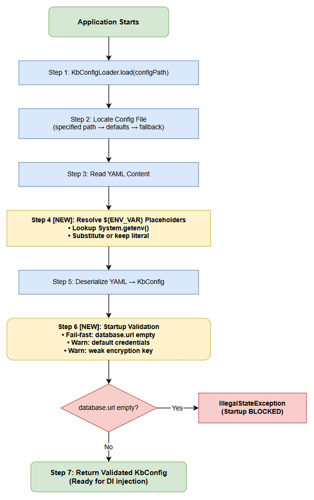

# Business Requirements Document (BRD)

## KB-Server — MTO-103: Refactor database config — remove dead fields, add env var support, startup validation

---

## Document Information

| Field | Value |
|-------|-------|
| Jira Ticket | MTO-103 |
| Title | [KB-Server] Refactor database config — remove dead fields, add env var support, startup validation |
| Author | BA Agent |
| Version | 1.0 |
| Date | 2026-05-14 |
| Status | Draft |

---

## Author Tracking

| Role | Name - Position | Responsibility |
|------|-----------------|----------------|
| Author | BA Agent – Business Analyst | Create document |
| Peer Reviewer | Duc Nguyen – Tech Lead | Review document |

---

## Revision History

| Version | Date | Author | Changes |
|---------|------|--------|---------|
| 1.0 | 2026-05-14 | BA Agent | Initiate document — auto-generated from Jira ticket MTO-103 |

---

## Sign-Off

| Name | Signature and date |
|------|--------------------|
| | ☐ I agree and confirm all criteria on this BRD as expected requirements |
| | ☐ I agree and confirm all criteria on this BRD as expected requirements |

---

## 1. Introduction

### 1.1 Scope

This change request covers the refactoring of the KB-Server database configuration module to address three categories of technical debt:

1. **Dead config fields removal** — Remove unused `host`, `port`, `user`, `password`, `database` fields from `KbVectorDbConfig` that are silently ignored at runtime
2. **Environment variable support** — Add `${ENV_VAR}` substitution syntax in `KbConfigLoader` for sensitive fields (credentials, encryption keys)
3. **Startup validation** — Add fail-fast validation for required fields and security warnings for default/weak credentials

The refactoring targets the `kb-server` module's configuration subsystem (`com.orchestrator.mcp.kb.config` package) and the runtime config template (`kb-server.yml`).

### 1.2 Out of Scope

- Changes to `PgKbVectorClient` or `DatabaseFactory` (they use DI-injected DataSource, unaffected)
- Migration of existing databases or schema changes
- Changes to embedding, segmentation, masking, queue, sync, or audit configuration sections
- Production deployment automation (CI/CD pipeline changes)
- UI/frontend changes (kb-server is a backend-only module)

### 1.3 Preliminary Requirements

- Existing `kb-server.yml` files in production/staging environments must continue to parse without errors (backward compatibility via `strictMode = false`)
- Kotlin serialization library (`kotlinx.serialization`) and `kaml` YAML parser already available in project dependencies
- No additional external dependencies required

---

## 2. Business Requirements

### 2.1 High Level Process Map

The refactoring addresses configuration lifecycle from YAML file loading through runtime validation:

1. Developer writes/updates `kb-server.yml` with configuration values
2. `KbConfigLoader` reads YAML file at application startup
3. **NEW**: Environment variable placeholders (`${VAR}`) are resolved before deserialization
4. YAML is deserialized into `KbConfig` data class hierarchy
5. **NEW**: Startup validator checks required fields and logs security warnings
6. Application proceeds with validated configuration

### 2.2 List of User Stories / Use Cases

| # | Story / Use Case | Priority | Source Ticket |
|---|------------------|----------|---------------|
| 1 | As a developer, I want dead config fields removed from `KbVectorDbConfig` so that the config schema accurately reflects what the system actually uses | MUST HAVE | MTO-103 (AC1) |
| 2 | As a DevOps engineer, I want to use environment variables for sensitive config values so that credentials are not stored in plaintext YAML files | MUST HAVE | MTO-103 (AC2) |
| 3 | As a developer, I want the application to fail fast on missing required config so that misconfigurations are caught immediately at startup | MUST HAVE | MTO-103 (AC3) |
| 4 | As a developer, I want config defaults aligned with production conventions so that the codebase is consistent and predictable | SHOULD HAVE | MTO-103 (AC4) |

---

### 2.3 Details of User Stories

---

#### Business Flow

**Step 1:** Application starts and `KbConfigLoader.load(configPath)` is called

**Step 2:** Config file is located (specified path → default locations → fallback to defaults)

**Step 3:** YAML content is read from file

**Step 4:** **NEW** — Environment variable placeholders (`${VAR_NAME}`) are resolved:
- For each `${VAR_NAME}` pattern found in the YAML content
- Look up `System.getenv("VAR_NAME")`
- If env var exists → substitute its value
- If env var does not exist → keep the original YAML literal value (fallback for local dev)

**Step 5:** Resolved YAML is deserialized into `KbConfig` data class

**Step 6:** **NEW** — Startup validation runs:
- Check `database.url` is not empty → fail-fast with clear error if empty
- Check `database.username` / `database.password` → log WARNING if using defaults (`postgres/postgres`)
- Check `security.encryption_key` → log WARNING if empty or matches known default value

**Step 7:** Validated `KbConfig` is returned to the application for DI injection

> **Note:** Steps 4 and 6 are the new additions. The existing flow (Steps 1-3, 5, 7) remains unchanged for backward compatibility.

---

#### STORY 1: Cleanup KbVectorDbConfig — Remove Dead Fields

> As a developer, I want dead config fields removed from `KbVectorDbConfig` so that the config schema accurately reflects what the system actually uses.

**Requirement Details:**

1. Remove `host` field from `KbVectorDbConfig` data class (currently defaults to `"localhost"`)
2. Remove `port` field from `KbVectorDbConfig` data class (currently defaults to `6333` — Qdrant port, inconsistent with pgvector provider)
3. Keep only `provider` and `collectionName` fields in `KbVectorDbConfig`
4. Update the runtime config template (`kb-server.yml`) to remove `host`, `port`, `user`, `password`, `database` from `vector_db` section
5. Existing YAML files with these dead fields must still parse without error (ensured by `strictMode = false` in kaml configuration)

**Current State (KbVectorDbConfig):**

| Field | Type | Default | Actually Used? |
|-------|------|---------|----------------|
| provider | String | "pgvector" | ✅ Yes |
| collectionName | String | "kb_entries" | ✅ Yes |
| host | String | "localhost" | ❌ No — PgKbVectorClient uses shared HikariDataSource |
| port | Int | 6333 | ❌ No — Qdrant default, inconsistent with pgvector |

**Target State (KbVectorDbConfig):**

| Field | Type | Default | Notes |
|-------|------|---------|-------|
| provider | String | "pgvector" | Retained |
| collectionName | String | "kb_entries" | Retained |

**Acceptance Criteria:**

1. `KbVectorDbConfig` data class contains only `provider` and `collectionName` fields
2. Runtime config template `vector_db` section contains only `provider` and `collection_name`
3. Existing YAML files with old fields (`host`, `port`, `user`, `password`, `database`) still parse without error
4. `PgKbVectorClient` continues to function correctly (no code changes needed — it uses DI-injected DataSource)
5. Unit tests pass with both old-format and new-format YAML

**Validation Rules:**

- `provider` must be a non-empty string (currently only "pgvector" is supported)
- `collectionName` must be a non-empty string matching PostgreSQL table naming conventions

---

#### STORY 2: Environment Variable Support

> As a DevOps engineer, I want to use environment variables for sensitive config values so that credentials are not stored in plaintext YAML files.

**Requirement Details:**

1. Add environment variable resolution in `KbConfigLoader` supporting `${ENV_VAR_NAME}` syntax
2. Resolution happens on raw YAML string BEFORE deserialization (simple string replacement)
3. Apply to sensitive fields: `database.username`, `database.password`, `security.encryption_key`, `security.br_encryption_key`
4. If environment variable is not set, fall back to the literal YAML value (enables local dev without env vars)
5. Support the syntax `${VAR_NAME}` — standard shell-style variable reference

**Data Fields:**

| Field | Env Var Example | YAML Example | Fallback |
|-------|----------------|--------------|----------|
| database.username | `DB_USERNAME` | `username: "${DB_USERNAME}"` | YAML literal value |
| database.password | `DB_PASSWORD` | `password: "${DB_PASSWORD}"` | YAML literal value |
| security.encryption_key | `KB_ENCRYPTION_KEY` | `encryption_key: "${KB_ENCRYPTION_KEY}"` | YAML literal value |
| security.br_encryption_key | `KB_BR_ENCRYPTION_KEY` | `br_encryption_key: "${KB_BR_ENCRYPTION_KEY}"` | YAML literal value |

**Acceptance Criteria:**

1. `KbConfigLoader` resolves `${VAR_NAME}` patterns in YAML content before parsing
2. When env var `DB_PASSWORD=secret123` is set and YAML has `password: "${DB_PASSWORD}"`, the parsed config has `password = "secret123"`
3. When env var is NOT set and YAML has `password: "${DB_PASSWORD}"`, the parsed config has `password = "${DB_PASSWORD}"` (literal fallback) OR the YAML literal value if a non-placeholder value is provided
4. Resolution applies to ALL string fields in the YAML (not limited to specific fields) — the mechanism is generic
5. Nested/partial substitution is NOT required (e.g., `jdbc:postgresql://${DB_HOST}:5432/db` is NOT in scope — only full-value substitution)
6. No new external dependencies added

**Error Handling:**

- Malformed placeholder (e.g., `${`, `${}`, `${VAR NAME}`) → treated as literal string, no error
- Env var value contains special YAML characters → must be properly handled (value is substituted into quoted string context)

---

#### STORY 3: Startup Validation

> As a developer, I want the application to fail fast on missing required config so that misconfigurations are caught immediately at startup.

**Requirement Details:**

1. After config is loaded and env vars resolved, validate critical fields
2. **Fail-fast** (throw exception, prevent startup) if:
   - `database.url` is empty or blank
3. **Log WARNING** (allow startup to continue) if:
   - `database.username` is `"postgres"` AND `database.password` is `"postgres"` (default credentials)
   - `security.encryption_key` is empty or matches a known default/example value
   - `security.br_encryption_key` is empty
4. Validation runs AFTER env var resolution (validates final resolved values)

**Acceptance Criteria:**

1. Application throws `IllegalStateException` with clear message if `database.url` is empty after config loading
2. Application logs `WARN` message: "Using default database credentials (postgres/postgres). This is insecure for production." when default credentials detected
3. Application logs `WARN` message: "Encryption key is empty or using default value. PII data will not be properly encrypted." when encryption key is weak
4. Validation does NOT prevent startup for warnings — only for critical errors (empty database URL)
5. Validation messages include the field path (e.g., "kb.database.url") for easy debugging

**Error Handling:**

- `database.url` empty → `IllegalStateException("Required config 'kb.database.url' is empty. Cannot start without database connection.")`
- Default credentials → WARNING log only, startup continues
- Empty encryption key → WARNING log only, startup continues

---

#### STORY 4: Align Config Defaults

> As a developer, I want config defaults aligned with production conventions so that the codebase is consistent and predictable.

**Requirement Details:**

1. Update `KbDatabaseConfig` default values to match production conventions:
   - `url`: keep as `"jdbc:postgresql://localhost:5432/mcp_orchestrator"` (already correct)
   - `schema`: change default from `"kb"` to `"kb"` (already correct — matches production intent)
   - `username`: keep as `"kb_app"` (already correct — production convention)
   - `password`: keep as `""` (empty — forces env var usage in production)
2. Document in the runtime config template that it requires env var setup
3. Add comment header to YAML template explaining the purpose and env var usage

**Current vs Target Defaults:**

| Field | Current Code Default | Config Template — Current | Config Template — Target | Notes |
|-------|---------------------|--------------------------|--------------------------|-------|
| url | `mcp_orchestrator` | `jira_assistant` (hardcoded) | `${DB_URL}` | Placeholder required |
| schema | `kb` | `public` (hardcoded) | `${DB_SCHEMA}` | Placeholder required |
| username | `kb_app` | `postgres` (hardcoded) | `${DB_USERNAME}` | Placeholder required |
| password | `""` (empty) | `postgres` (hardcoded) | `${DB_PASSWORD}` | Placeholder required |
| encryption_key | `""` (empty) | hardcoded base64 | `${KB_ENCRYPTION_KEY}` | Placeholder required |
| br_encryption_key | `""` (empty) | hardcoded base64 | `${KB_BR_ENCRYPTION_KEY}` | Placeholder required |

> **⛔ Quy tắc:** Config templates KHÔNG được hardcode credentials. Tất cả sensitive values phải dùng `${ENV_VAR}` placeholder.

**Acceptance Criteria:**

1. `KbDatabaseConfig` defaults remain as-is (they already match production conventions)
2. Runtime config template (`kb-server.yml`) has a comment header explaining env var setup
3. Config template uses `${ENV_VAR}` placeholders for ALL sensitive values (credentials, encryption keys)
4. Config template includes env var setup instructions in comments
5. No hardcoded credentials in any config template file

---

## 3. Dependencies

| Dependency | Type | Related Ticket | Description |
|------------|------|----------------|-------------|
| kaml YAML parser | System | N/A | Already in project — provides `strictMode = false` for backward compatibility |
| kotlinx.serialization | System | N/A | Already in project — data class serialization |
| HikariCP | System | N/A | Connection pool — unaffected by this change |
| PostgreSQL + pgvector | Infrastructure | N/A | Database — config points to it, no DB changes needed |

---

## 4. Stakeholders

| Role | Name / Team | Responsibility | Source |
|------|-------------|----------------|--------|
| Reporter / Tech Lead | Duc Nguyen | Identified issues, defined acceptance criteria | Jira reporter |
| Developer | TBD | Implement changes | Jira assignee |
| DevOps | TBD | Validate env var support in deployment | Consulted |

---

## 5. Risks and Assumptions

### 5.1 Risks

| Risk | Impact | Likelihood | Mitigation |
|------|--------|------------|------------|
| Existing YAML files with dead fields fail to parse after changes | High | Low | `strictMode = false` ensures unknown fields are ignored; add regression test |
| Env var resolution breaks YAML parsing for edge cases | Medium | Low | Only resolve `${VAR}` pattern in quoted strings; comprehensive unit tests |
| Startup validation too strict — blocks legitimate dev setups | Medium | Medium | Only fail-fast on truly critical fields (database.url); use warnings for others |
| Developers forget to set env vars in new environments | Low | Medium | Clear error messages with field paths; document required env vars |

### 5.2 Assumptions

- `strictMode = false` in kaml configuration will continue to silently ignore unknown YAML fields (backward compatibility guarantee)
- `PgKbVectorClient` does NOT read from `KbVectorDbConfig.host` or `KbVectorDbConfig.port` — it uses the shared `HikariDataSource` injected via DI
- Environment variable resolution is needed only for full-value substitution (not partial/nested)
- The runtime config template (`kb-server.yml`) is used for local development and testing

---

## 6. Non-Functional Requirements

| Category | Requirement | Details |
|----------|-------------|---------|
| Performance | No startup time regression | Env var resolution and validation add negligible overhead (< 10ms) |
| Security | Credentials not in plaintext | Env var support enables secure credential management in production |
| Security | Weak config detection | Startup warnings alert developers to insecure configurations |
| Maintainability | Config schema matches runtime usage | Removing dead fields reduces confusion for new developers |
| Backward Compatibility | Existing YAML files continue to work | `strictMode = false` ensures old fields are silently ignored |
| Observability | Clear startup logging | Validation warnings use structured logging with field paths |

---

## 7. Related Tickets

| Ticket Key | Summary | Status | Type | Relationship |
|------------|---------|--------|------|--------------|
| MTO-103 | [KB-Server] Refactor database config — remove dead fields, add env var support, startup validation | Docs Review | Task | Main ticket |

---

## 8. Appendix

### Glossary

| Term | Definition |
|------|------------|
| KbVectorDbConfig | Kotlin data class holding vector database configuration (provider, collection name) |
| KbConfigLoader | Singleton object responsible for loading and parsing YAML configuration |
| HikariDataSource | JDBC connection pool — shared across relational and vector queries |
| strictMode | kaml YAML parser setting — when `false`, unknown YAML fields are silently ignored |
| pgvector | PostgreSQL extension for vector similarity search |
| DI | Dependency Injection — pattern used to provide DataSource to clients |

### Reference Documents

| Document | Link / Location |
|----------|-----------------|
| KbConfigSections.kt | `kb-server/src/main/kotlin/com/orchestrator/mcp/kb/config/KbConfigSections.kt` |
| KbConfig.kt | `kb-server/src/main/kotlin/com/orchestrator/mcp/kb/config/KbConfig.kt` |
| KbConfigLoader.kt | `kb-server/src/main/kotlin/com/orchestrator/mcp/kb/config/KbConfigLoader.kt` |
| kb-server.yml (config template) | Runtime config — currently at `TempRelease/kb-server.yml` (may relocate) |

### Diagram Index

| # | Diagram | Image | Source (editable) |
|---|---------|-------|-------------------|
| 1 | Business Flow | [business-flow.png](diagrams/business-flow.png) | [business-flow.drawio](diagrams/business-flow.drawio) |
| 2 | Use Case Diagram | [use-case.png](diagrams/use-case.png) | [use-case.drawio](diagrams/use-case.drawio) |
