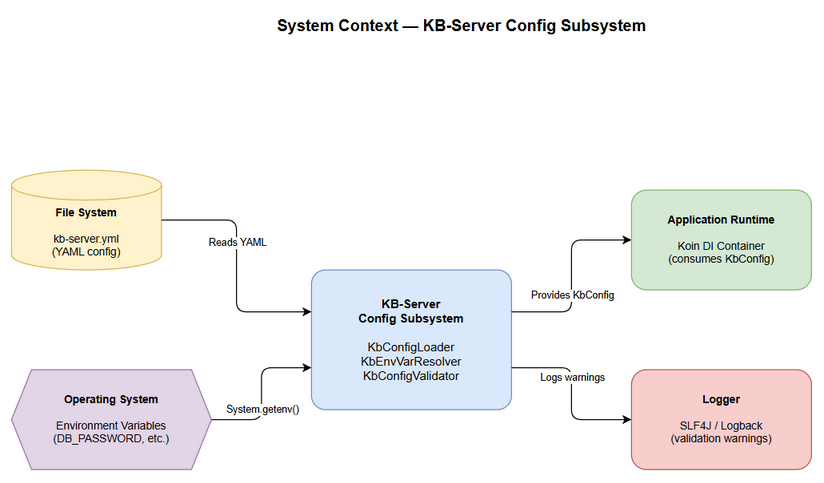
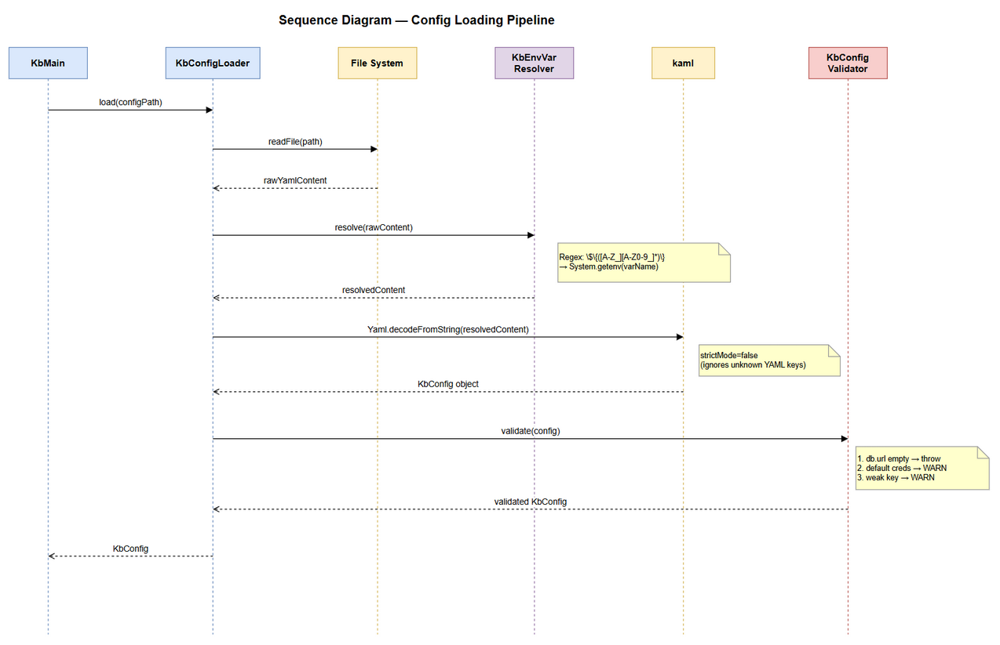
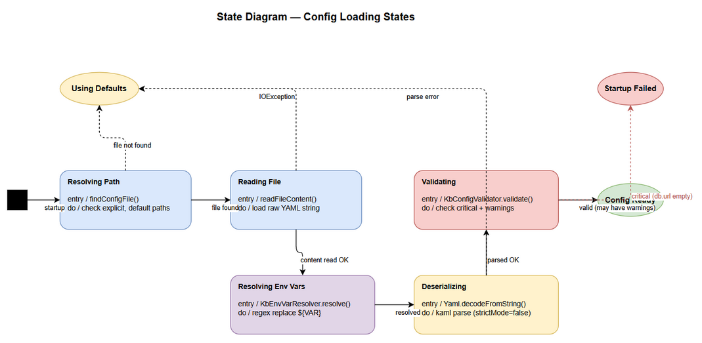

# Functional Specification Document (FSD)

## KB-Server — MTO-103: Refactor database config — remove dead fields, add env var support, startup validation

---

## Document Information

| Field | Value |
|-------|-------|
| Jira Ticket | MTO-103 |
| Title | [KB-Server] Refactor database config — remove dead fields, add env var support, startup validation |
| Author | BA Agent + TA Agent |
| Version | 1.0 |
| Date | 2026-05-14 |
| Status | Draft |
| Related BRD | BRD-v1-MTO-103.docx |

---

## Revision History

| Version | Date | Author | Changes |
|---------|------|--------|---------|
| 1.0 | 2026-05-14 | BA Agent | Initiate document — functional specification from BRD |
| 1.0 | 2026-05-14 | TA Agent | Technical enrichment — API contracts, pseudocode, integration specs |

---

## 1. Introduction

### 1.1 Purpose

This FSD specifies the functional behavior of the KB-Server configuration refactoring. It defines how the config loading pipeline will work after changes: dead field removal, environment variable resolution, and startup validation.

### 1.2 Scope

- Modification of `KbVectorDbConfig` data class (remove dead fields)
- Enhancement of `KbConfigLoader` (add env var resolution step)
- New `KbConfigValidator` component (startup validation + warnings)
- Update of runtime config template (`kb-server.yml`)

### 1.3 Definitions & Acronyms

| Term | Definition |
|------|------------|
| Env Var | Environment Variable — OS-level key-value pair |
| DI | Dependency Injection — Koin framework provides instances |
| HikariCP | JDBC connection pool library |
| kaml | Kotlin YAML parser library |
| strictMode | kaml setting — when false, unknown YAML keys are silently ignored |
| pgvector | PostgreSQL extension for vector similarity search |

### 1.4 References

| Document | Location |
|----------|----------|
| BRD | BRD-v1-MTO-103.docx |
| KbConfigSections.kt | `kb-server/src/main/kotlin/com/orchestrator/mcp/kb/config/KbConfigSections.kt` |
| KbConfig.kt | `kb-server/src/main/kotlin/com/orchestrator/mcp/kb/config/KbConfig.kt` |
| KbConfigLoader.kt | `kb-server/src/main/kotlin/com/orchestrator/mcp/kb/config/KbConfigLoader.kt` |

---

## 2. System Overview

### 2.1 System Context Diagram



The KB-Server config subsystem interacts with:
- **File System** — reads `kb-server.yml` YAML configuration file
- **Operating System** — reads environment variables via `System.getenv()`
- **Application Runtime** — provides validated `KbConfig` to Koin DI container
- **Logger** — outputs validation warnings via SLF4J/Logback

### 2.2 System Architecture

The config subsystem is a pipeline with 4 stages:

```
[YAML File] → [Read] → [Env Var Resolution] → [Deserialize] → [Validate] → [KbConfig]
```

Components involved:
- `KbConfigLoader` — orchestrates the pipeline (existing, enhanced)
- `KbEnvVarResolver` — new component for `${VAR}` substitution
- `KbConfigValidator` — new component for startup validation
- `KbConfig` / `KbVectorDbConfig` — data classes (modified)

---

## 3. Functional Requirements

### 3.1 Feature: Dead Field Removal (AC1)

**Source:** BRD Story 1

#### 3.1.1 Description

Remove unused `host` and `port` fields from `KbVectorDbConfig`. These fields are never read by `PgKbVectorClient` (which uses a shared `HikariDataSource` from DI). The YAML template is also cleaned up.

#### 3.1.2 Use Case

**Use Case ID:** UC-1
**Actor:** Developer
**Preconditions:** Developer has a `kb-server.yml` file (old or new format)
**Postconditions:** Application starts successfully regardless of whether YAML contains old dead fields

**Main Flow:**

| Step | Actor | System | Description |
|------|-------|--------|-------------|
| 1 | Developer | | Provides YAML config file (new format without dead fields) |
| 2 | | KbConfigLoader | Reads YAML, deserializes into KbVectorDbConfig with only `provider` + `collectionName` |
| 3 | | Application | Starts normally with clean config |

**Alternative Flows:**

| ID | Condition | Steps |
|----|-----------|-------|
| AF-1 | YAML contains old fields (host, port, user, password, database) | kaml `strictMode=false` silently ignores unknown fields; application starts normally |

**Exception Flows:**

| ID | Condition | Steps |
|----|-----------|-------|
| EF-1 | YAML is malformed (invalid syntax) | KbConfigLoader catches exception, logs error, falls back to defaults |

#### 3.1.3 Business Rules

| Rule ID | Rule | Source |
|---------|------|--------|
| BR-1 | `KbVectorDbConfig` must contain only `provider` and `collectionName` fields | AC1 |
| BR-2 | Old YAML files with dead fields must still parse without error | AC1 (backward compat) |
| BR-3 | `provider` must default to `"pgvector"` | Existing behavior |
| BR-4 | `collectionName` must default to `"kb_entries"` | Existing behavior |

#### 3.1.4 Data Specifications

**KbVectorDbConfig (Target State):**

| Field | Type | Required | Default | Validation |
|-------|------|----------|---------|------------|
| provider | String | Yes | "pgvector" | Non-empty, one of: "pgvector", "qdrant", "faiss" |
| collectionName | String | Yes | "kb_entries" | Non-empty, valid PostgreSQL identifier |

---

### 3.2 Feature: Environment Variable Resolution (AC2)

**Source:** BRD Story 2

#### 3.2.1 Description

Add a pre-processing step in `KbConfigLoader` that resolves `${ENV_VAR_NAME}` placeholders in the raw YAML content before deserialization. This enables secure credential management without storing secrets in config files.

#### 3.2.2 Use Case

**Use Case ID:** UC-2
**Actor:** DevOps Engineer
**Preconditions:** YAML file contains `${VAR}` placeholders; environment variables may or may not be set
**Postconditions:** Config values reflect resolved env var values (or fallback to YAML literals)

**Main Flow:**

| Step | Actor | System | Description |
|------|-------|--------|-------------|
| 1 | DevOps | | Sets environment variables: `DB_PASSWORD=secret123`, `KB_ENCRYPTION_KEY=base64key` |
| 2 | DevOps | | Writes YAML: `password: "${DB_PASSWORD}"` |
| 3 | | KbConfigLoader | Reads raw YAML content |
| 4 | | KbEnvVarResolver | Finds `${DB_PASSWORD}` pattern, looks up `System.getenv("DB_PASSWORD")` |
| 5 | | KbEnvVarResolver | Env var found → replaces `${DB_PASSWORD}` with `secret123` |
| 6 | | KbConfigLoader | Deserializes resolved YAML → `password = "secret123"` |

**Alternative Flows:**

| ID | Condition | Steps |
|----|-----------|-------|
| AF-1 | Env var NOT set | `${DB_PASSWORD}` remains as literal string in YAML; kaml deserializes it as-is |
| AF-2 | YAML value is not a placeholder (e.g., `password: "postgres"`) | No substitution occurs; value used as-is |
| AF-3 | Multiple placeholders in file | Each `${VAR}` is resolved independently |

**Exception Flows:**

| ID | Condition | Steps |
|----|-----------|-------|
| EF-1 | Malformed placeholder: `${`, `${}`, `${VAR NAME}` | Treated as literal string, no error thrown |
| EF-2 | Env var value contains YAML special chars (`:`, `#`, `{`) | Value is substituted within quoted context; YAML remains valid |

#### 3.2.3 Business Rules

| Rule ID | Rule | Source |
|---------|------|--------|
| BR-5 | Pattern `${VAR_NAME}` triggers env var lookup where VAR_NAME matches `[A-Z_][A-Z0-9_]*` | AC2 |
| BR-6 | If env var is set → substitute its value | AC2 |
| BR-7 | If env var is NOT set → keep original text (including `${...}` literal) | AC2 (fallback) |
| BR-8 | Resolution is generic — applies to ALL string values in YAML, not just specific fields | AC2 |
| BR-9 | Only full-value substitution supported (not partial like `jdbc:${HOST}:5432`) | AC2 scope |
| BR-10 | No new external dependencies allowed | AC2 |

#### 3.2.4 Data Specifications

**Input (Raw YAML content):**

| Pattern | Regex | Example |
|---------|-------|---------|
| Env var placeholder | `\$\{([A-Z_][A-Z0-9_]*)\}` | `${DB_PASSWORD}` |

**Processing Logic (Pseudocode):**

```kotlin
fun resolveEnvVars(yamlContent: String): String {
    val pattern = Regex("""\$\{([A-Z_][A-Z0-9_]*)\}""")
    return pattern.replace(yamlContent) { match ->
        val varName = match.groupValues[1]
        System.getenv(varName) ?: match.value  // fallback to literal
    }
}
```

#### 3.2.5 API Contract (Internal)

**Function:** `KbEnvVarResolver.resolve(content: String): String`

**Input:**

| Parameter | Type | Required | Description |
|-----------|------|----------|-------------|
| content | String | Yes | Raw YAML file content |

**Output:**

| Field | Type | Description |
|-------|------|-------------|
| result | String | YAML content with env vars resolved |

**Business Error Scenarios:**

| Scenario | Behavior | Trigger |
|----------|----------|---------|
| Malformed placeholder | No substitution, no error | `${`, `${}`, `${123}` |
| Env var not found | Keep literal `${VAR}` text | Var not in environment |

---

### 3.3 Feature: Startup Validation (AC3)

**Source:** BRD Story 3

#### 3.3.1 Description

After config loading and env var resolution, validate the final `KbConfig` object. Critical missing fields cause fail-fast (exception). Insecure configurations produce warnings but allow startup.

#### 3.3.2 Use Case

**Use Case ID:** UC-3a (Fail-fast)
**Actor:** Application (startup)
**Preconditions:** Config loaded and env vars resolved
**Postconditions:** Application fails to start with clear error message

**Main Flow (Fail-fast):**

| Step | Actor | System | Description |
|------|-------|--------|-------------|
| 1 | | KbConfigValidator | Checks `config.kb.database.url` |
| 2 | | KbConfigValidator | URL is empty/blank → throws `IllegalStateException` |
| 3 | | Application | Startup aborted with error message in logs |

---

**Use Case ID:** UC-3b (Warning)
**Actor:** Application (startup)
**Preconditions:** Config loaded with default/weak credentials
**Postconditions:** Application starts with warning messages in logs

**Main Flow (Warning):**

| Step | Actor | System | Description |
|------|-------|--------|-------------|
| 1 | | KbConfigValidator | Checks `database.username` + `database.password` |
| 2 | | KbConfigValidator | Detects `postgres/postgres` → logs WARNING |
| 3 | | KbConfigValidator | Checks `security.encryption_key` |
| 4 | | KbConfigValidator | Key is empty → logs WARNING |
| 5 | | Application | Startup continues normally |

**Alternative Flows:**

| ID | Condition | Steps |
|----|-----------|-------|
| AF-1 | All fields valid, no defaults | No warnings, no errors — silent success |
| AF-2 | Only encryption_key is weak | Single warning logged, startup continues |

**Exception Flows:**

| ID | Condition | Steps |
|----|-----------|-------|
| EF-1 | `database.url` is empty | `IllegalStateException` thrown — application cannot start |

#### 3.3.3 Business Rules

| Rule ID | Rule | Source |
|---------|------|--------|
| BR-11 | `database.url` empty → fail-fast (IllegalStateException) | AC3 |
| BR-12 | `database.username == "postgres" AND database.password == "postgres"` → WARNING | AC3 |
| BR-13 | `security.encryption_key` empty or known default → WARNING | AC3 |
| BR-14 | `security.br_encryption_key` empty → WARNING | AC3 |
| BR-15 | Validation runs AFTER env var resolution (validates final values) | AC3 |
| BR-16 | Warnings do NOT prevent startup | AC3 |

#### 3.3.4 Data Specifications

**Validation Rules:**

| Field Path | Check | Severity | Message |
|------------|-------|----------|---------|
| `kb.database.url` | Not empty/blank | CRITICAL (fail-fast) | "Required config 'kb.database.url' is empty. Cannot start without database connection." |
| `kb.database.username` + `kb.database.password` | Not both "postgres" | WARNING | "Using default database credentials (postgres/postgres). This is insecure for production." |
| `kb.security.encryption_key` | Not empty, not known default | WARNING | "Encryption key is empty or using default value. PII data will not be properly encrypted." |
| `kb.security.br_encryption_key` | Not empty | WARNING | "BR encryption key is empty. Business rule masking will not function correctly." |

#### 3.3.5 API Contract (Internal)

**Function:** `KbConfigValidator.validate(config: KbConfig): KbConfig`

**Input:**

| Parameter | Type | Required | Description |
|-----------|------|----------|-------------|
| config | KbConfig | Yes | Fully resolved config object |

**Output:**

| Field | Type | Description |
|-------|------|-------------|
| result | KbConfig | Same config (pass-through if valid) |

**Business Error Scenarios:**

| Scenario | Behavior | Trigger |
|----------|----------|---------|
| Empty database URL | Throw `IllegalStateException` | `config.kb.database.url.isBlank()` |
| Default credentials | Log WARNING, return config | username="postgres" AND password="postgres" |
| Weak encryption | Log WARNING, return config | encryption_key is empty or matches default |

---

### 3.4 Feature: Align Config Defaults & Documentation (AC4)

**Source:** BRD Story 4

#### 3.4.1 Description

Ensure `KbDatabaseConfig` code defaults match production conventions. Update the runtime config template (`kb-server.yml`) to use `${ENV_VAR}` placeholders for ALL sensitive values — config files must NOT contain hardcoded credentials.

#### 3.4.2 Use Case

**Use Case ID:** UC-4
**Actor:** Developer
**Preconditions:** Developer needs to run kb-server locally for testing
**Postconditions:** Developer sets env vars and runs server with resolved config

**Main Flow:**

| Step | Actor | System | Description |
|------|-------|--------|-------------|
| 1 | Developer | | Opens runtime config template (`kb-server.yml`) |
| 2 | Developer | | Reads comment header explaining env var setup |
| 3 | Developer | | Sets required env vars (`DB_URL`, `DB_USERNAME`, `DB_PASSWORD`, etc.) |
| 4 | | KbEnvVarResolver | Resolves `${VAR}` placeholders at startup |
| 5 | Developer | | Server starts with resolved config |

#### 3.4.3 Business Rules

| Rule ID | Rule | Source |
|---------|------|--------|
| BR-17 | `KbDatabaseConfig` defaults: url=`mcp_orchestrator`, schema=`kb`, username=`kb_app`, password=`""` | AC4 |
| BR-18 | Runtime config template must have comment header explaining env var setup | AC4 |
| BR-19 | Config template must use `${ENV_VAR}` placeholders for ALL sensitive values (no hardcoded credentials) | AC4 |
| BR-20 | YAML template must include env var setup instructions in comments | AC4 |
| BR-21 | No hardcoded credentials allowed in any config template file | AC4 |

---

## 4. Data Model

### 4.1 Configuration Data Classes (Logical Model)

**Entity: KbConfig (root)**

| Attribute | Type | Required | Description |
|-----------|------|----------|-------------|
| kb | KbSettings | Yes | Root settings container |

**Entity: KbSettings**

| Attribute | Type | Required | Description |
|-----------|------|----------|-------------|
| server | KbServerConfig | Yes | Server port + transport |
| database | KbDatabaseConfig | Yes | Database connection settings |
| embedding | KbEmbeddingConfig | Yes | Embedding provider settings |
| vectorDb | KbVectorDbConfig | Yes | Vector DB settings (simplified) |
| segmentation | KbSegmentationConfig | Yes | Content segmentation settings |
| masking | KbMaskingConfig | Yes | PII masking settings |
| security | KbSecurityConfig | Yes | Security + encryption settings |
| queue | KbQueueConfig | Yes | Queue processing settings |
| sync | KbSyncConfig | Yes | Sync batch settings |
| audit | KbAuditConfig | Yes | Audit trail settings |

**Entity: KbVectorDbConfig (MODIFIED — dead fields removed)**

| Attribute | Type | Required | Default | Description |
|-----------|------|----------|---------|-------------|
| provider | String | Yes | "pgvector" | Vector DB provider name |
| collectionName | String | Yes | "kb_entries" | Collection/table name for vectors |

**Entity: KbDatabaseConfig (unchanged)**

| Attribute | Type | Required | Default | Description |
|-----------|------|----------|---------|-------------|
| url | String | Yes | "jdbc:postgresql://localhost:5432/mcp_orchestrator" | JDBC connection URL |
| schema | String | Yes | "kb" | Database schema name |
| username | String | Yes | "kb_app" | Database username |
| password | String | Yes | "" | Database password (use env var in prod) |
| pool | KbPoolConfig | Yes | (defaults) | Connection pool settings |

---

## 5. Integration Specifications

### 5.1 External System: Operating System (Environment Variables)

| Attribute | Value |
|-----------|-------|
| Purpose | Provide sensitive configuration values securely |
| Direction | Inbound (OS → Application) |
| Data Format | String key-value pairs |
| Frequency | On-demand (at startup) |

**Data Exchange:**

| Our Data | External Data | Direction | Business Rule |
|----------|--------------|-----------|---------------|
| database.password | `DB_PASSWORD` env var | Receive | BR-6: substitute if set |
| database.username | `DB_USERNAME` env var | Receive | BR-6: substitute if set |
| security.encryption_key | `KB_ENCRYPTION_KEY` env var | Receive | BR-6: substitute if set |
| security.br_encryption_key | `KB_BR_ENCRYPTION_KEY` env var | Receive | BR-6: substitute if set |

### 5.2 External System: File System (YAML Config)

| Attribute | Value |
|-----------|-------|
| Purpose | Provide application configuration |
| Direction | Inbound (File → Application) |
| Data Format | YAML |
| Frequency | Once at startup |

---

## 6. Processing Logic

### 6.1 Config Loading Pipeline

**Trigger:** Application startup (`KbMain.kt` → `KbConfigLoader.load()`)
**Schedule:** Once at startup
**Input:** Config file path (optional), environment variables
**Output:** Validated `KbConfig` instance

**Processing Steps:**

| Step | Description | Error Handling |
|------|-------------|----------------|
| 1 | Resolve config file path (explicit → default locations → null) | If not found → use defaults |
| 2 | Read file content as String | IOException → log error, use defaults |
| 3 | **NEW:** Resolve `${VAR}` placeholders via `KbEnvVarResolver` | Malformed patterns → keep literal |
| 4 | Deserialize YAML → `KbConfig` via kaml | Parse error → log error, use defaults |
| 5 | **NEW:** Validate via `KbConfigValidator` | Critical → throw; Warning → log |
| 6 | Return validated `KbConfig` | — |

**Sequence Diagram:**



### 6.2 Environment Variable Resolution Algorithm

**Pseudocode:**

```kotlin
object KbEnvVarResolver {
    private val ENV_VAR_PATTERN = Regex("""\$\{([A-Z_][A-Z0-9_]*)\}""")

    fun resolve(content: String): String {
        return ENV_VAR_PATTERN.replace(content) { matchResult ->
            val varName = matchResult.groupValues[1]
            val envValue = System.getenv(varName)
            envValue ?: matchResult.value  // keep literal if not found
        }
    }
}
```

### 6.3 Startup Validation Algorithm

**Pseudocode:**

```kotlin
object KbConfigValidator {
    private val logger = LoggerFactory.getLogger(KbConfigValidator::class.java)
    private val KNOWN_DEFAULT_KEYS = setOf(
        "sMARARO7oHOnD6W2bCPYNSk2F552azl2d1dyVHLG6+w="
    )

    fun validate(config: KbConfig): KbConfig {
        val db = config.kb.database
        val security = config.kb.security

        // Critical: fail-fast
        require(db.url.isNotBlank()) {
            "Required config 'kb.database.url' is empty. Cannot start without database connection."
        }

        // Warnings: log but continue
        if (db.username == "postgres" && db.password == "postgres") {
            logger.warn("Using default database credentials (postgres/postgres). This is insecure for production.")
        }

        if (security.encryptionKey.isBlank() || security.encryptionKey in KNOWN_DEFAULT_KEYS) {
            logger.warn("Encryption key is empty or using default value. PII data will not be properly encrypted.")
        }

        if (security.brEncryptionKey.isBlank()) {
            logger.warn("BR encryption key is empty. Business rule masking will not function correctly.")
        }

        return config
    }
}
```

---

## 7. Security Requirements

### 7.1 Data Sensitivity Classification

| Data Type | Classification | Business Requirement |
|-----------|---------------|---------------------|
| Database password | Confidential | Must not be stored in plaintext in config files |
| Encryption keys | Restricted | Must not be stored in plaintext; env var required in production |
| Database URL | Internal | Contains hostname/port — not secret but not public |
| Provider name | Public | No sensitivity |

### 7.2 Audit Trail

| Event | Logged Fields | Retention | Business Reason |
|-------|--------------|-----------|-----------------|
| Config loaded | File path, resolved field count | Application lifetime | Debugging |
| Validation warning | Field path, warning type | Application lifetime | Security awareness |
| Validation failure | Field path, error message | Application lifetime | Incident investigation |

---

## 8. Non-Functional Requirements

| Category | Business Requirement | Acceptance Criteria |
|----------|---------------------|---------------------|
| Performance | Config loading < 100ms | Env var resolution + validation adds < 10ms overhead |
| Backward Compatibility | Old YAML files work | `strictMode=false` ignores unknown fields |
| Maintainability | Clean config schema | Only used fields in data classes |
| Security | No plaintext secrets in prod | Env var substitution available for all sensitive fields |
| Observability | Clear startup diagnostics | Validation warnings include field paths |

---

## 9. Error Handling

### 9.1 Error Scenarios

| Scenario | Severity | Message | Expected Behavior |
|----------|----------|---------|-------------------|
| Empty database URL | Critical | "Required config 'kb.database.url' is empty..." | Application fails to start |
| Default credentials | Warning | "Using default database credentials..." | Log warning, continue |
| Empty encryption key | Warning | "Encryption key is empty or using default..." | Log warning, continue |
| Config file not found | Info | "No config file found, using defaults" | Use code defaults |
| YAML parse error | Error | "Failed to load config: {message}" | Use code defaults |

---

## 10. Testing Considerations

### 10.1 Test Scenarios

| ID | Scenario | Input | Expected Output | Priority |
|----|----------|-------|-----------------|----------|
| TC-1 | Load config with new format (no dead fields) | Clean YAML | KbVectorDbConfig has only provider + collectionName | High |
| TC-2 | Load config with old format (has dead fields) | Old YAML with host/port/user/password/database | Parses successfully, dead fields ignored | High |
| TC-3 | Env var set → substituted | `DB_PASSWORD=secret` + YAML `${DB_PASSWORD}` | password = "secret" | High |
| TC-4 | Env var not set → literal fallback | No env var + YAML `${DB_PASSWORD}` | password = "${DB_PASSWORD}" | High |
| TC-5 | Empty database URL → fail-fast | YAML with `url: ""` | IllegalStateException thrown | High |
| TC-6 | Default credentials → warning | username=postgres, password=postgres | WARNING logged, startup continues | Medium |
| TC-7 | Empty encryption key → warning | encryption_key="" | WARNING logged, startup continues | Medium |
| TC-8 | Malformed placeholder → no error | YAML with `${`, `${}` | Treated as literal, no crash | Medium |
| TC-9 | Multiple env vars in same file | Multiple `${VAR}` patterns | All resolved independently | Medium |
| TC-10 | Config file missing → defaults | No file at any location | KbConfig() with code defaults | Low |

---

## 11. Appendix

### State Diagram — Config Loading States



### Diagram Index

| # | Diagram | Image | Source (editable) |
|---|---------|-------|-------------------|
| 1 | System Context | [system-context.png](diagrams/system-context.png) | [system-context.drawio](diagrams/system-context.drawio) |
| 2 | Sequence — Config Loading | [sequence-config-loading.png](diagrams/sequence-config-loading.png) | [sequence-config-loading.drawio](diagrams/sequence-config-loading.drawio) |
| 3 | State — Config Loading | [state-config-loading.png](diagrams/state-config-loading.png) | [state-config-loading.drawio](diagrams/state-config-loading.drawio) |

### Change Log from BRD

- No deviations from BRD. All 4 acceptance criteria mapped to functional use cases.
- Added pseudocode for env var resolution and validation algorithms (TA enrichment).
- Clarified that env var resolution uses regex on raw YAML string (not on parsed objects).
