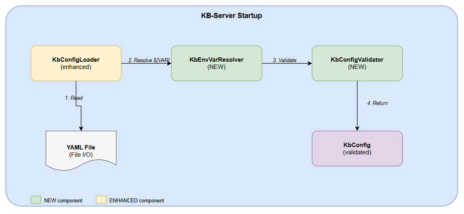
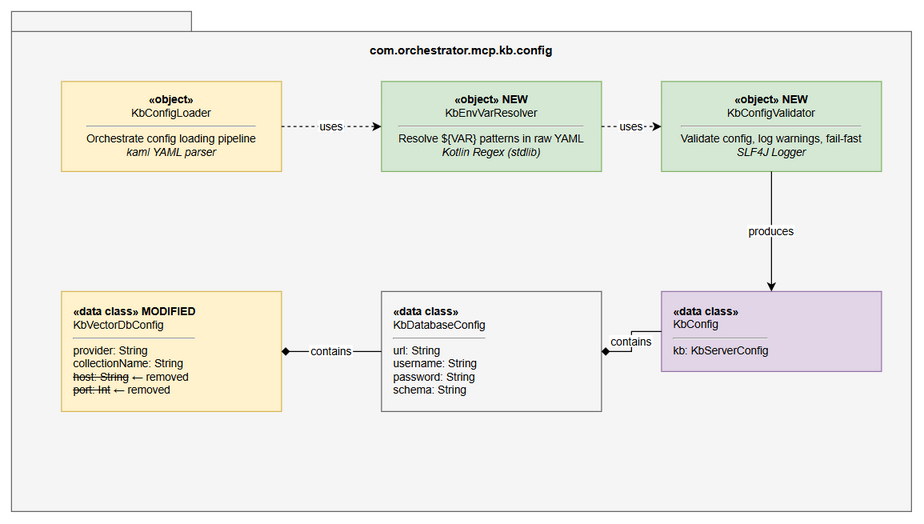
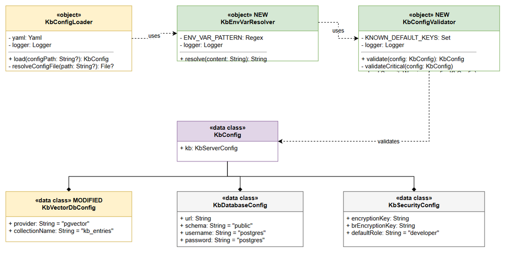

# Technical Design Document (TDD)

## KB-Server — MTO-103: Refactor database config — remove dead fields, add env var support, startup validation

---

## Document Information

| Field | Value |
|-------|-------|
| Jira Ticket | MTO-103 |
| Title | [KB-Server] Refactor database config — remove dead fields, add env var support, startup validation |
| Author | SA Agent |
| Version | 1.0 |
| Date | 2026-05-14 |
| Status | Draft |
| Related BRD | BRD-v1-MTO-103.docx |
| Related FSD | FSD-v1-MTO-103.docx |

---

## Revision History

| Version | Date | Author | Changes |
|---------|------|--------|---------|
| 1.0 | 2026-05-14 | SA Agent | Initiate document — technical design for config refactoring |

---

## 1. Introduction

### 1.1 Purpose

This TDD specifies the technical implementation of the KB-Server configuration refactoring: removing dead fields from `KbVectorDbConfig`, adding environment variable resolution to `KbConfigLoader`, and implementing startup validation via a new `KbConfigValidator` component.

### 1.2 Scope

- Modify `KbConfigSections.kt` — remove `host` and `port` from `KbVectorDbConfig`
- Create `KbEnvVarResolver.kt` — new utility for `${VAR}` substitution
- Create `KbConfigValidator.kt` — new component for startup validation
- Modify `KbConfigLoader.kt` — integrate resolver and validator into loading pipeline
- Update runtime config template (`kb-server.yml`) — remove dead fields, replace hardcoded credentials with `${ENV_VAR}` placeholders, add documentation header

### 1.3 Technology Stack

| Layer | Technology | Version |
|-------|-----------|---------|
| Language | Kotlin | 2.3.20 |
| Platform | JVM | 21 |
| YAML Parser | kaml | 0.77.0 |
| Serialization | kotlinx.serialization | 1.8.1 |
| Logging | SLF4J + Logback | 1.5.18 |
| DI | Koin | 4.1.1 |
| Testing | JUnit 5 + MockK | 5.11.4 / 1.14.2 |

### 1.4 Design Principles

- **Backward Compatibility** — existing YAML files must continue to work without modification
- **Single Responsibility** — each new component has one clear purpose
- **Fail-Fast** — critical misconfigurations detected immediately at startup
- **Defense in Depth** — warnings for non-critical security issues
- **No New Dependencies** — use only stdlib + existing project libraries

### 1.5 Constraints

- `strictMode = false` in kaml must remain (backward compat for old YAML files)
- Env var resolution must happen BEFORE YAML deserialization (operates on raw string)
- Only full-value substitution (not partial like `jdbc:${HOST}:5432/db`)
- Max file size: 200 lines per file (project code standard)
- Max function size: 20 lines (project code standard)

### 1.6 References

| Document | Location |
|----------|----------|
| BRD | BRD-v1-MTO-103.docx |
| FSD | FSD-v1-MTO-103.docx |
| Code Standards | `.kiro/steering/kotlin-code-standards.md` |

---

## 2. System Architecture

### 2.1 Architecture Overview

The config subsystem is a linear pipeline within the `kb-server` module. No new services, APIs, or external integrations are introduced — this is purely internal refactoring.



```
┌─────────────────────────────────────────────────────────────┐
│                    KB-Server Startup                          │
│                                                              │
│  ┌──────────────┐    ┌────────────────┐    ┌─────────────┐ │
│  │ KbConfigLoader│───▶│KbEnvVarResolver│───▶│KbConfigValid.│ │
│  │  (enhanced)   │    │    (NEW)       │    │   (NEW)     │ │
│  └──────────────┘    └────────────────┘    └─────────────┘ │
│         │                                         │          │
│         ▼                                         ▼          │
│  ┌──────────────┐                         ┌─────────────┐  │
│  │  YAML File   │                         │  KbConfig    │  │
│  │  (File I/O)  │                         │  (validated) │  │
│  └──────────────┘                         └─────────────┘  │
└─────────────────────────────────────────────────────────────┘
```

### 2.2 Component Diagram



| Component | Responsibility | Technology |
|-----------|---------------|------------|
| KbConfigLoader | Orchestrate config loading pipeline | kaml YAML parser |
| KbEnvVarResolver | Resolve `${VAR}` patterns in raw YAML string | Kotlin Regex (stdlib) |
| KbConfigValidator | Validate loaded config, log warnings, fail-fast on critical errors | SLF4J Logger |
| KbVectorDbConfig | Hold vector DB config (provider + collectionName only) | kotlinx.serialization |
| KbDatabaseConfig | Hold database connection config | kotlinx.serialization |

---

## 3. API Design

> **Note:** This ticket has NO external API changes. All modifications are internal to the config loading pipeline. No new endpoints, no request/response changes.

### 3.1 Internal API: KbConfigLoader (Enhanced)

```kotlin
object KbConfigLoader {
    fun load(configPath: String?): KbConfig
}
```

**Behavior change:** Now calls `KbEnvVarResolver.resolve()` on raw YAML content before deserialization, and `KbConfigValidator.validate()` on the deserialized config before returning.

### 3.2 Internal API: KbEnvVarResolver (New)

```kotlin
object KbEnvVarResolver {
    fun resolve(content: String): String
}
```

**Contract:**
- Input: Raw YAML file content (String)
- Output: YAML content with `${VAR}` patterns resolved
- Side effects: None (pure function)
- Thread safety: Yes (stateless)

### 3.3 Internal API: KbConfigValidator (New)

```kotlin
object KbConfigValidator {
    fun validate(config: KbConfig): KbConfig
}
```

**Contract:**
- Input: Deserialized `KbConfig` object
- Output: Same `KbConfig` (pass-through)
- Side effects: Logs warnings via SLF4J; throws `IllegalStateException` on critical errors
- Thread safety: Yes (stateless)

---

## 4. Database Design

> **Note:** No database schema changes. This ticket modifies only the config loading code. The database connection parameters are configured via YAML/env vars but the schema itself is unchanged.

---

## 5. Class / Module Design

### 5.1 Package Structure

```
com.orchestrator.mcp.kb.config/
├── KbConfig.kt              # Root config data class (unchanged)
├── KbConfigSections.kt      # Config section data classes (KbVectorDbConfig MODIFIED)
├── KbConfigLoader.kt        # Config loading orchestrator (ENHANCED)
├── KbEnvVarResolver.kt      # NEW — env var resolution
└── KbConfigValidator.kt     # NEW — startup validation
```

### 5.2 Class Diagram



### 5.3 Detailed Implementation

#### 5.3.1 KbVectorDbConfig (Modified)

**Before:**
```kotlin
@Serializable
data class KbVectorDbConfig(
    val provider: String = "pgvector",
    @SerialName("collection_name")
    val collectionName: String = "kb_entries",
    val host: String = "localhost",    // DEAD — remove
    val port: Int = 6333              // DEAD — remove
)
```

**After:**
```kotlin
@Serializable
data class KbVectorDbConfig(
    val provider: String = "pgvector",
    @SerialName("collection_name")
    val collectionName: String = "kb_entries"
)
```

#### 5.3.2 KbEnvVarResolver (New)

```kotlin
package com.orchestrator.mcp.kb.config

import org.slf4j.LoggerFactory

/**
 * Resolves ${ENV_VAR} placeholders in raw YAML content.
 * Falls back to literal text if env var is not set.
 */
object KbEnvVarResolver {

    private val logger = LoggerFactory.getLogger(KbEnvVarResolver::class.java)
    private val ENV_VAR_PATTERN = Regex("""\$\{([A-Z_][A-Z0-9_]*)\}""")

    fun resolve(content: String): String {
        var resolvedCount = 0
        val result = ENV_VAR_PATTERN.replace(content) { matchResult ->
            val varName = matchResult.groupValues[1]
            val envValue = System.getenv(varName)
            if (envValue != null) {
                resolvedCount++
                envValue
            } else {
                matchResult.value  // keep literal ${VAR} if not found
            }
        }
        if (resolvedCount > 0) {
            logger.info("Resolved $resolvedCount environment variable(s) in config")
        }
        return result
    }
}
```

#### 5.3.3 KbConfigValidator (New)

```kotlin
package com.orchestrator.mcp.kb.config

import org.slf4j.LoggerFactory

/**
 * Validates KbConfig at startup. Fails fast on critical errors,
 * logs warnings for insecure configurations.
 */
object KbConfigValidator {

    private val logger = LoggerFactory.getLogger(KbConfigValidator::class.java)

    private val KNOWN_DEFAULT_KEYS = setOf(
        "sMARARO7oHOnD6W2bCPYNSk2F552azl2d1dyVHLG6+w="
    )

    fun validate(config: KbConfig): KbConfig {
        validateCritical(config)
        checkSecurityWarnings(config)
        return config
    }

    private fun validateCritical(config: KbConfig) {
        val db = config.kb.database
        require(db.url.isNotBlank()) {
            "Required config 'kb.database.url' is empty. " +
                "Cannot start without database connection."
        }
    }

    private fun checkSecurityWarnings(config: KbConfig) {
        val db = config.kb.database
        val security = config.kb.security

        if (db.username == "postgres" && db.password == "postgres") {
            logger.warn(
                "Using default database credentials (postgres/postgres). " +
                    "This is insecure for production."
            )
        }

        if (security.encryptionKey.isBlank() ||
            security.encryptionKey in KNOWN_DEFAULT_KEYS
        ) {
            logger.warn(
                "Encryption key is empty or using default value. " +
                    "PII data will not be properly encrypted."
            )
        }

        if (security.brEncryptionKey.isBlank()) {
            logger.warn(
                "BR encryption key is empty. " +
                    "Business rule masking will not function correctly."
            )
        }
    }
}
```

#### 5.3.4 KbConfigLoader (Enhanced)

```kotlin
package com.orchestrator.mcp.kb.config

import com.charleskorn.kaml.Yaml
import com.charleskorn.kaml.YamlConfiguration
import org.slf4j.LoggerFactory
import java.io.File

/**
 * Loads KB server configuration from YAML file.
 * Pipeline: read → resolve env vars → deserialize → validate.
 */
object KbConfigLoader {

    private val logger = LoggerFactory.getLogger(KbConfigLoader::class.java)

    private val yaml = Yaml(
        configuration = YamlConfiguration(strictMode = false)
    )

    fun load(configPath: String?): KbConfig {
        val file = resolveConfigFile(configPath)
        if (file == null) {
            logger.info("No config file found, using defaults")
            return KbConfigValidator.validate(KbConfig())
        }

        return try {
            logger.info("Loading config from: ${file.absolutePath}")
            val rawContent = file.readText()
            val resolvedContent = KbEnvVarResolver.resolve(rawContent)
            val config = yaml.decodeFromString(
                KbConfig.serializer(), resolvedContent
            )
            KbConfigValidator.validate(config)
        } catch (e: IllegalStateException) {
            throw e  // re-throw validation failures (fail-fast)
        } catch (e: Exception) {
            logger.error("Failed to load config: ${e.message}, using defaults")
            KbConfigValidator.validate(KbConfig())
        }
    }

    private fun resolveConfigFile(configPath: String?): File? {
        if (configPath != null) {
            val file = File(configPath)
            if (file.exists()) return file
            logger.warn("Specified config not found: $configPath")
        }

        val defaultLocations = listOf(
            "application.yml",
            "config/application.yml",
            "kb-server/src/main/resources/application.yml"
        )

        return defaultLocations
            .map { File(it) }
            .firstOrNull { it.exists() }
    }
}
```

### 5.4 Design Patterns

| Pattern | Where Used | Rationale |
|---------|-----------|-----------|
| Pipeline | KbConfigLoader | Sequential processing: read → resolve → deserialize → validate |
| Singleton (object) | All config components | Stateless utilities, no need for multiple instances |
| Fail-Fast | KbConfigValidator | Critical errors detected immediately, not at first DB query |
| Strategy (implicit) | ENV_VAR_PATTERN regex | Pattern matching is configurable if needed later |

### 5.5 Error Handling

| Exception | Thrown By | When | Recovery |
|-----------|----------|------|----------|
| IllegalStateException | KbConfigValidator | `database.url` is empty | None — application cannot start |
| Exception (any) | KbConfigLoader | YAML parse error, file I/O error | Fall back to defaults + validate |

---

## 6. Integration Design

> **Note:** No external system integrations are added or modified. The only "integration" is with the OS environment variables via `System.getenv()`, which is a JVM stdlib call.

### 6.1 OS Environment Variables

| Attribute | Value |
|-----------|-------|
| Protocol | JVM System.getenv() |
| Endpoint | OS environment |
| Authentication | N/A (same process) |
| Timeout | N/A (instant) |
| Retry Policy | N/A |

---

## 7. Security Design

### 7.1 Credential Protection

| Data | Before (Current) | After (Target) |
|------|-----------------|----------------|
| DB password | Plaintext in YAML | `${DB_PASSWORD}` → resolved from env var |
| Encryption key | Plaintext in YAML | `${KB_ENCRYPTION_KEY}` → resolved from env var |
| BR encryption key | Plaintext in YAML | `${KB_BR_ENCRYPTION_KEY}` → resolved from env var |

### 7.2 Security Warnings

| Condition | Warning Message | Log Level |
|-----------|----------------|-----------|
| Default credentials (postgres/postgres) | "Using default database credentials..." | WARN |
| Empty/default encryption key | "Encryption key is empty or using default..." | WARN |
| Empty BR encryption key | "BR encryption key is empty..." | WARN |

### 7.3 Input Validation

| Input | Validation | Sanitization |
|-------|-----------|--------------|
| YAML content | kaml parser validates syntax | N/A (trusted local file) |
| Env var values | None (trusted OS environment) | N/A |
| Regex pattern | Compile-time constant | N/A |

---

## 8. Performance & Scalability

### 8.1 Performance Impact

| Operation | Added Overhead | Measurement |
|-----------|---------------|-------------|
| Env var resolution (regex replace) | < 1ms | Single regex pass over ~2KB YAML |
| Startup validation (field checks) | < 1ms | 4 string comparisons + 3 log calls |
| Total pipeline overhead | < 5ms | Negligible vs application startup time |

### 8.2 No Scalability Concerns

This is a one-time startup operation. No runtime performance impact.

---

## 9. Monitoring & Observability

### 9.1 Logging

| Log Event | Level | Fields | When |
|-----------|-------|--------|------|
| Config file loaded | INFO | file path | Startup |
| Env vars resolved | INFO | count of resolved vars | Startup (if any resolved) |
| Config file not found | INFO | — | Startup (using defaults) |
| Specified config not found | WARN | config path | Startup |
| Default credentials detected | WARN | — | Startup |
| Weak encryption key | WARN | — | Startup |
| Empty BR encryption key | WARN | — | Startup |
| Config parse error | ERROR | error message | Startup (fallback to defaults) |
| Critical validation failure | ERROR | field path, message | Startup (application exits) |

---

## 10. Deployment Considerations

### 10.1 Environment Configuration

| Property | DEV (local) | STAGING | PRODUCTION |
|----------|-------------|---------|------------|
| database.url | `${DB_URL}` | `${DB_URL}` | `${DB_URL}` |
| database.username | `${DB_USERNAME}` | `${DB_USERNAME}` | `${DB_USERNAME}` |
| database.password | `${DB_PASSWORD}` | `${DB_PASSWORD}` | `${DB_PASSWORD}` |
| database.schema | `${DB_SCHEMA}` | `${DB_SCHEMA}` | `${DB_SCHEMA}` |
| security.encryption_key | `${KB_ENCRYPTION_KEY}` | `${KB_ENCRYPTION_KEY}` | `${KB_ENCRYPTION_KEY}` |
| security.br_encryption_key | `${KB_BR_ENCRYPTION_KEY}` | `${KB_BR_ENCRYPTION_KEY}` | `${KB_BR_ENCRYPTION_KEY}` |

> **⛔ Quy tắc:** Config templates KHÔNG được hardcode credentials — tất cả sensitive values phải dùng `${ENV_VAR}` placeholder.

### 10.2 Required Environment Variables (Production)

| Variable | Required | Description |
|----------|----------|-------------|
| DB_URL | Yes (if not in YAML) | JDBC connection URL |
| DB_USERNAME | Recommended | Database username |
| DB_PASSWORD | Recommended | Database password |
| KB_ENCRYPTION_KEY | Recommended | PII encryption key (base64) |
| KB_BR_ENCRYPTION_KEY | Recommended | Business rule encryption key (base64) |

### 10.3 Rollback Strategy

1. **Code rollback:** Revert the 4 modified/created files to previous version
2. **Config rollback:** No YAML changes needed — old YAML files still work with new code (strictMode=false)
3. **Zero-downtime:** This change has no runtime impact on existing deployments until restart
4. **Risk:** Low — backward compatible, no DB migrations, no API changes

### 10.4 Migration Notes

- **No migration required** — existing YAML files continue to work unchanged
- **Optional:** Teams can update their YAML to use `${VAR}` syntax at their own pace
- **Optional:** Teams can remove dead `vector_db` fields from their YAML (not required)

---

## 11. Implementation Checklist

### Files to Create

| # | File | Lines (est.) | Description |
|---|------|-------------|-------------|
| 1 | `KbEnvVarResolver.kt` | ~25 | Env var resolution utility |
| 2 | `KbConfigValidator.kt` | ~50 | Startup validation |

### Files to Modify

| # | File | Change | Lines Changed (est.) |
|---|------|--------|---------------------|
| 1 | `KbConfigSections.kt` | Remove `host` and `port` from `KbVectorDbConfig` | -2 lines |
| 2 | `KbConfigLoader.kt` | Add resolver + validator calls in `load()` | ~10 lines changed |
| 3 | Runtime config template (`kb-server.yml`) | Remove dead fields, replace hardcoded credentials with `${ENV_VAR}` placeholders, add header comment | ~20 lines |

### Test Files to Create

| # | File | Tests | Description |
|---|------|-------|-------------|
| 1 | `KbEnvVarResolverTest.kt` | 6 | Env var resolution scenarios |
| 2 | `KbConfigValidatorTest.kt` | 5 | Validation scenarios |
| 3 | `KbConfigLoaderIntegrationTest.kt` | 4 | End-to-end loading with env vars |

---

## 12. Appendix

### Diagram Index

| # | Diagram | Image | Source (editable) |
|---|---------|-------|-------------------|
| 1 | Architecture — Config Pipeline | [architecture-config.png](diagrams/architecture-config.png) | [architecture-config.drawio](diagrams/architecture-config.drawio) |
| 2 | Component — Config Components | [component-config.png](diagrams/component-config.png) | [component-config.drawio](diagrams/component-config.drawio) |
| 3 | Class — Config Classes | [class-config.png](diagrams/class-config.png) | [class-config.drawio](diagrams/class-config.drawio) |

### Open Questions

| # | Question | Status | Answer |
|---|----------|--------|--------|
| 1 | Should partial env var substitution be supported in future? | Resolved | No — only full-value substitution per AC2 scope |
| 2 | Should validation be configurable (disable warnings)? | Resolved | No — keep simple; warnings are always useful |
