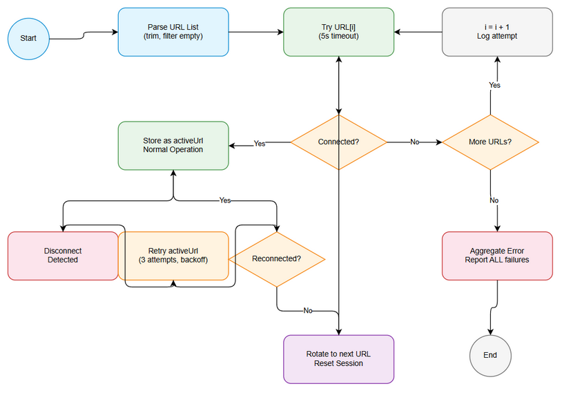
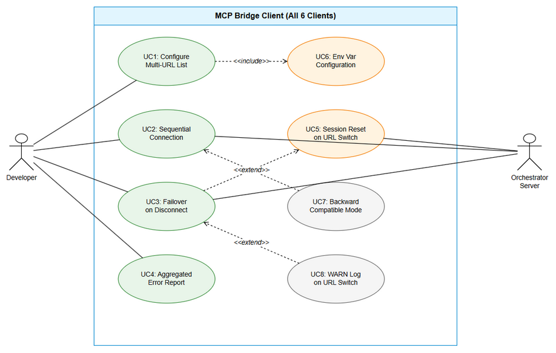

# Business Requirements Document (BRD)

## MCP Orchestration — MTO-104: [Bridge] Multi-URL Fallback — Sequential Connection with Failover Across All Bridge Clients

---

## Document Information

| Field | Value |
|-------|-------|
| Jira Ticket | MTO-104 |
| Title | [Bridge] Multi-URL Fallback — Sequential Connection with Failover |
| Author | BA Agent |
| Version | 1.0 |
| Date | 2026-05-14 |
| Status | Draft |

---

## Author Tracking

| Role | Name - Position | Responsibility |
|------|-----------------|----------------|
| Author | BA Agent – Business Analyst | Create document |
| Peer Reviewer | TA Agent – Technical Analyst | Review document |

---

## Revision History

| Version | Date | Author | Changes |
|---------|------|--------|---------|
| 1.0 | 2026-05-14 | BA Agent | Initiate document — auto-generated from Jira ticket MTO-104 |

---

## Sign-Off

| Name | Signature and date |
|------|--------------------|
| | ☐ I agree and confirm all criteria on this BRD as expected requirements |
| | ☐ I agree and confirm all criteria on this BRD as expected requirements |

---

## 1. Introduction

### 1.1 Scope

This change request adds multi-URL fallback capability to all MCP Bridge clients (Node.js, Python, Kotlin, Bash, PowerShell, CMD). Currently, each bridge client accepts a single `--url` parameter and fails immediately if that server is unavailable. This feature enables the `--url` parameter to accept a comma-separated list of URLs, with the bridge attempting sequential connection to each URL until one succeeds. On disconnect, the bridge retries the active URL before rotating to the next URL in the list.

### 1.2 Out of Scope

- Load balancing across multiple URLs (round-robin, weighted, etc.)
- Parallel/concurrent connection attempts to multiple URLs simultaneously
- URL health scoring or preference learning
- Dynamic URL discovery (DNS-based, service registry)
- Changes to the Orchestrator server itself
- WebSocket transport (only HTTP Streamable transport is affected)

### 1.3 Preliminary Requirement

- All 6 bridge clients must be functional with single-URL mode (current state — already met)
- MCP Orchestrator server must support the existing HTTP Streamable transport at `/mcp` endpoint
- Each bridge client must have existing reconnection logic (already implemented via `ReconnectionManager`)

---

## 2. Business Requirements

### 2.1 High Level Process Map

The multi-URL fallback feature introduces a connection strategy layer between the bridge client's configuration and its HTTP client. When a bridge starts, it parses the URL list, attempts connection sequentially, and maintains an active URL reference. On disconnection, it follows a retry-then-rotate strategy before exhausting all options.



### 2.2 List of User Stories / Use Cases

| # | Story / Use Case | Priority | Source Ticket |
|---|------------------|----------|---------------|
| 1 | As a developer, I want the bridge to accept multiple URLs so that it can automatically connect to the first available Orchestrator instance | MUST HAVE | MTO-104 |
| 2 | As a developer, I want the bridge to failover to the next URL on disconnect so that my workflow is not interrupted by a single server failure | MUST HAVE | MTO-104 |
| 3 | As a developer, I want clear error reporting when all URLs fail so that I can diagnose connectivity issues | MUST HAVE | MTO-104 |
| 4 | As a developer, I want backward compatibility with single-URL usage so that existing configurations continue to work | MUST HAVE | MTO-104 |
| 5 | As a developer, I want environment variable support for multiple URLs so that I can configure failover without CLI args | SHOULD HAVE | MTO-104 |
| 6 | As a developer, I want session reset on URL switch so that the new server starts with a clean state | MUST HAVE | MTO-104 |

---

### 2.3 Details of User Stories

---

#### Business Flow

**Step 1:** User configures bridge with comma-separated URLs via `--url` CLI arg or `ORCHESTRATOR_URLS` env var

**Step 2:** Bridge parses URL string into ordered list, trimming whitespace and filtering empty segments

**Step 3:** Bridge attempts connection to first URL with 5-second timeout

**Step 4:** If connection succeeds → store as activeUrl, proceed with normal operation

**Step 5:** If connection fails → log attempt, move to next URL in list

**Step 6:** Repeat Step 3-5 for each URL until one succeeds or all fail

**Step 7:** If all URLs fail → report aggregated error (each URL + its error) and exit/retry based on reconnect settings

**Step 8:** During operation, if disconnect detected → retry activeUrl 3 times with existing backoff

**Step 9:** If activeUrl retries exhausted → rotate to next URL, perform session reset, attempt connection

**Step 10:** Log WARN when switching to a different URL

> **Note:** Single URL usage (no comma) follows the exact same code path but with a list of length 1, ensuring backward compatibility.

---

#### STORY 1: Multi-URL Parsing

> As a developer, I want the bridge to accept multiple URLs so that it can automatically connect to the first available Orchestrator instance without manual reconfiguration.

**Requirement Details:**

1. The `--url` CLI argument accepts a comma-separated string of URLs
2. Each URL is trimmed of leading/trailing whitespace
3. Empty segments (from trailing commas or double commas) are filtered out
4. A new environment variable `ORCHESTRATOR_URLS` (plural) is supported for comma-separated URLs
5. Config priority: `--url` CLI arg > `ORCHESTRATOR_URLS` env > `ORCHESTRATOR_URL` env (single) > default (`http://localhost:8080`)
6. Single URL input works identically to current behavior (list of length 1)

**Data Fields:**

| Field | Type | Required | Description | Example |
|-------|------|----------|-------------|---------|
| urls | string (comma-separated) | Yes | One or more Orchestrator URLs | `http://localhost:9180,http://staging:9180` |
| activeUrl | string | Runtime | Currently connected URL | `http://localhost:9180` |
| urlIndex | integer | Runtime | Index of active URL in list (0-based) | `0` |

**Acceptance Criteria:**

1. `--url "http://a:9180,http://b:9180"` is parsed into list `["http://a:9180", "http://b:9180"]`
2. `--url "http://a:9180"` (single URL) works exactly as before — no behavioral change
3. `--url " http://a:9180 , http://b:9180 "` trims whitespace correctly
4. `--url "http://a:9180,,http://b:9180,"` filters empty segments → `["http://a:9180", "http://b:9180"]`
5. `ORCHESTRATOR_URLS=http://a:9180,http://b:9180` env var is recognized
6. CLI `--url` overrides both `ORCHESTRATOR_URLS` and `ORCHESTRATOR_URL` env vars

**Validation Rules:**

- Each URL must start with `http://` or `https://`
- At least one valid URL must be present after parsing
- Maximum 10 URLs in the list (prevent misconfiguration)

**Error Handling:**

- No valid URLs after parsing: Bridge exits with error message listing invalid entries
- All URLs have invalid format: Bridge exits with clear error about URL format requirements

---

#### STORY 2: Sequential Connection with Failover

> As a developer, I want the bridge to failover to the next URL on disconnect so that my workflow is not interrupted by a single server failure.

**Requirement Details:**

1. On initial connection, URLs are tried sequentially (left to right, index 0 to N-1)
2. Per-URL connection timeout: 5 seconds
3. First successful connection stores that URL as `activeUrl`
4. On disconnect, retry `activeUrl` first (3 attempts with existing exponential backoff)
5. If `activeUrl` retries exhausted → advance to next URL in list (wrapping around)
6. If all URLs exhausted in rotation → continue backoff on original `activeUrl`
7. Log each connection attempt: `Trying URL {index+1}/{total}: {url}`
8. Log WARN when switching to a different URL than the previous `activeUrl`

**Acceptance Criteria:**

1. URLs are tried in order (left to right) on initial connection
2. Per-URL timeout is 5 seconds (not the general request timeout)
3. First success stores as activeUrl and stops trying others
4. After disconnect, activeUrl is retried 3 times before rotating
5. URL rotation wraps around (after last URL, goes back to first)
6. WARN log emitted when switching to a different URL
7. Each attempt is logged with URL index and total count

**Error Handling:**

- Connection refused: Log error, move to next URL
- Timeout (5s): Log timeout, move to next URL
- TLS/SSL error: Log error, move to next URL
- DNS resolution failure: Log error, move to next URL

---

#### STORY 3: Aggregated Error Reporting

> As a developer, I want clear error reporting when all URLs fail so that I can diagnose connectivity issues.

**Requirement Details:**

1. When all URLs fail on initial connection, report ALL errors in a structured format
2. Each URL's specific error is preserved and displayed
3. Error format shows URL and its specific failure reason
4. Error output goes to stderr (consistent with existing logging)

**Acceptance Criteria:**

1. When all URLs fail, output shows each URL with its specific error:
   ```
   All URLs failed:
     - http://localhost:9180: Connection refused
     - http://staging:9180: Timeout after 5000ms
   ```
2. Individual URL errors are not lost — each is reported
3. Error message clearly indicates this is a total failure (not partial)

**Error Handling:**

- All URLs fail on initial connect: Aggregate error report → exit (or enter reconnect loop if enabled)
- All URLs fail during reconnection: Aggregate error logged → continue backoff loop

---

#### STORY 4: Backward Compatibility

> As a developer, I want backward compatibility with single-URL usage so that existing configurations continue to work.

**Requirement Details:**

1. `--url "http://localhost:8080"` (single URL, no comma) behaves identically to current implementation
2. `ORCHESTRATOR_URL` (singular) env var still works as before
3. Default URL (`http://localhost:8080`) still applies when no URL is configured
4. No changes to other CLI arguments or their behavior
5. No changes to the MCP protocol communication (JSON-RPC format unchanged)

**Acceptance Criteria:**

1. Single URL via `--url` works exactly as current version — no timeout change, no extra logging
2. `ORCHESTRATOR_URL` env var (singular, existing) still works
3. Default `http://localhost:8080` still applies when nothing configured
4. All existing tests pass without modification (or with minimal adaptation)
5. No breaking changes to bridge server's stdio MCP interface

---

#### STORY 5: Environment Variable Support

> As a developer, I want environment variable support for multiple URLs so that I can configure failover without CLI args.

**Requirement Details:**

1. New env var: `ORCHESTRATOR_URLS` (plural, comma-separated)
2. Priority: `--url` CLI > `ORCHESTRATOR_URLS` env > `ORCHESTRATOR_URL` env > default
3. `ORCHESTRATOR_URLS` follows same parsing rules as CLI (trim, filter empty)

**Acceptance Criteria:**

1. `ORCHESTRATOR_URLS=http://a:9180,http://b:9180` is recognized and parsed
2. `--url` CLI arg overrides `ORCHESTRATOR_URLS` env
3. `ORCHESTRATOR_URLS` overrides `ORCHESTRATOR_URL` (singular)
4. If both `ORCHESTRATOR_URLS` and `ORCHESTRATOR_URL` are set, plural wins

---

#### STORY 6: Session Reset on URL Switch

> As a developer, I want session reset on URL switch so that the new server starts with a clean state.

**Requirement Details:**

1. When switching to a different URL (not retrying same URL), perform full session reset
2. Session reset includes: clear session ID, reset request ID counter, perform new MCP initialize handshake
3. Previous session state is completely cleared
4. New session ID is obtained from the new server's response headers

**Acceptance Criteria:**

1. Switching URL triggers `resetSession()` before `initialize()`
2. Old session ID is not sent to new server
3. New MCP initialize handshake is performed with new server
4. If initialize fails on new URL → move to next URL (don't retry initialize on same URL)
5. Successful initialize on new URL → store as new activeUrl

---

## 3. Dependencies

| Dependency | Type | Related Ticket | Description |
|------------|------|----------------|-------------|
| MCP Orchestrator Server | System | N/A | Must be running at one or more of the configured URLs |
| curl (Bash/CMD) | Infrastructure | N/A | Required for HTTP requests in shell-based bridges |
| jq (Bash/CMD) | Infrastructure | N/A | Required for JSON parsing in shell-based bridges |
| httpx (Python) | System | N/A | Python HTTP client library used by Python bridge |
| Ktor Client (Kotlin) | System | N/A | Kotlin HTTP client used by Kotlin bridge |
| Node.js fetch API | System | N/A | Built-in HTTP client used by Node.js bridge |

---

## 4. Stakeholders

| Role | Name / Team | Responsibility | Source |
|------|-------------|----------------|--------|
| Reporter | Duc Nguyen | Requirements definition, acceptance | Jira reporter |
| Developer | Development Team | Implementation across all 6 clients | Assigned team |
| QA | QA Team | Test all clients, failover scenarios | QA team |

---

## 5. Risks and Assumptions

### 5.1 Risks

| Risk | Impact | Likelihood | Mitigation |
|------|--------|------------|------------|
| CMD batch limitations with arrays | Medium | High | Best-effort implementation; CMD uses string splitting instead of arrays |
| Inconsistent behavior across 6 clients | High | Medium | Shared test scenarios; same acceptance criteria for all clients |
| 5-second per-URL timeout may be too short for slow networks | Medium | Low | Document as configurable in future; current spec is fixed at 5s |
| Session state leakage between URL switches | High | Low | Explicit resetSession() call before switching; clear all state |
| Race condition in health check vs reconnection | Medium | Medium | Use state machine to prevent concurrent reconnection attempts |

### 5.2 Assumptions

- All Orchestrator instances at different URLs are functionally equivalent (same version, same tools)
- Network connectivity issues are transient — at least one URL will eventually become available
- The 5-second per-URL timeout is sufficient for initial TCP + TLS + HTTP handshake
- CMD bridge has `jq` available for full functionality (best-effort without it)
- All bridge clients share the same MCP protocol version (2025-03-26)

---

## 6. Non-Functional Requirements

| Category | Requirement | Details |
|----------|-------------|---------|
| Performance | Connection timeout per URL: 5 seconds | Sequential attempts, not parallel — worst case N×5s for N URLs |
| Performance | No performance impact during normal operation | Multi-URL logic only activates during connection/reconnection |
| Reliability | Automatic failover on disconnect | Retry active URL 3 times, then rotate to next |
| Reliability | Graceful degradation | Single URL mode identical to current behavior |
| Compatibility | Backward compatible | Existing single-URL configs work without changes |
| Logging | WARN level on URL switch | Clear indication when failover occurs |
| Logging | INFO level for each connection attempt | Visibility into connection sequence |
| Maintainability | Consistent implementation pattern | Same algorithm across all 6 clients |
| Security | Token sent to all URLs | Same auth token used regardless of which URL is active |

---

## 7. Related Tickets

| Ticket Key | Summary | Status | Type | Relationship |
|------------|---------|--------|------|--------------|
| MTO-104 | [Bridge] Multi-URL fallback — sequential connection with failover across all bridge clients | To Do | Story | Main ticket |

---

## 8. Appendix

### Glossary

| Term | Definition |
|------|------------|
| Bridge Client | A lightweight MCP proxy that connects to the Orchestrator server and exposes tools locally via stdio |
| activeUrl | The URL currently being used for communication with the Orchestrator |
| URL Rotation | The process of moving to the next URL in the list after the current one fails |
| Session Reset | Clearing all session state (session ID, request counter) before connecting to a new URL |
| Exponential Backoff | Retry delay that doubles with each attempt (1s, 2s, 4s, 8s, 15s max) |
| HTTP Streamable | The transport protocol used by bridges — simple POST /mcp with JSON-RPC |

### Reference Documents

| Document | Link / Location |
|----------|-----------------|
| Node.js Bridge Source | mcp-client-bridge/src/ |
| Python Bridge Source | mcp-bridge-python/src/mcp_bridge/ |
| Kotlin Bridge Source | orchestrator-bridge/src/main/kotlin/com/orchestrator/mcp/bridge/ |
| Bash Bridge Source | mcp-bridge-bash/mcp-bridge.sh |
| PowerShell Bridge Source | mcp-bridge-powershell/mcp-bridge.ps1 |
| CMD Bridge Source | mcp-bridge-cmd/mcp-bridge.cmd |

### Config Priority Diagram



### Diagram Index

| # | Diagram | Image | Source (editable) |
|---|---------|-------|-------------------|
| 1 | Business Flow | [business-flow.png](diagrams/business-flow.png) | [business-flow.drawio](diagrams/business-flow.drawio) |
| 2 | Use Case Diagram | [use-case.png](diagrams/use-case.png) | [use-case.drawio](diagrams/use-case.drawio) |
