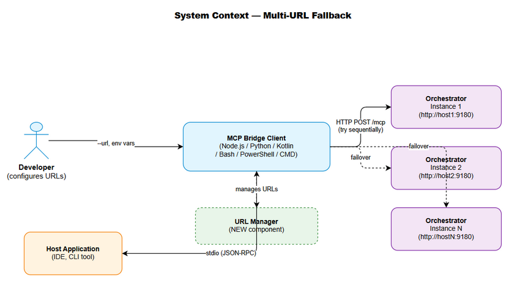
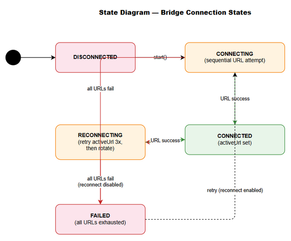
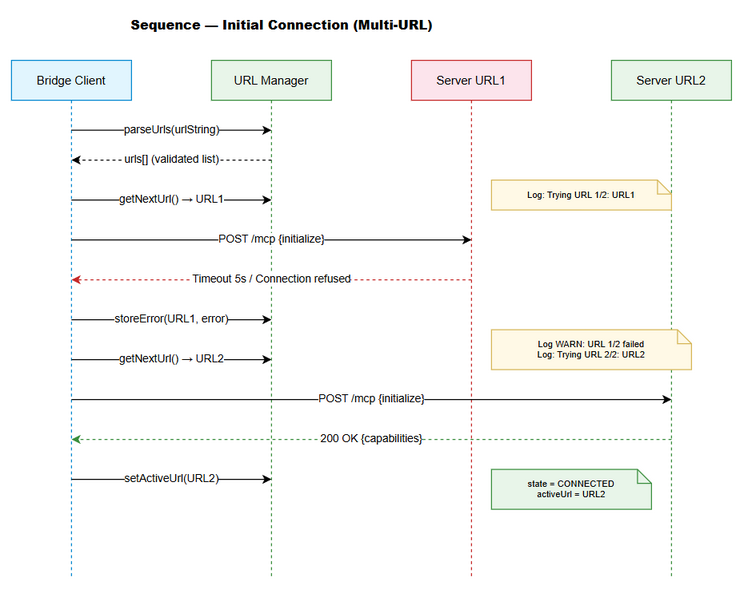
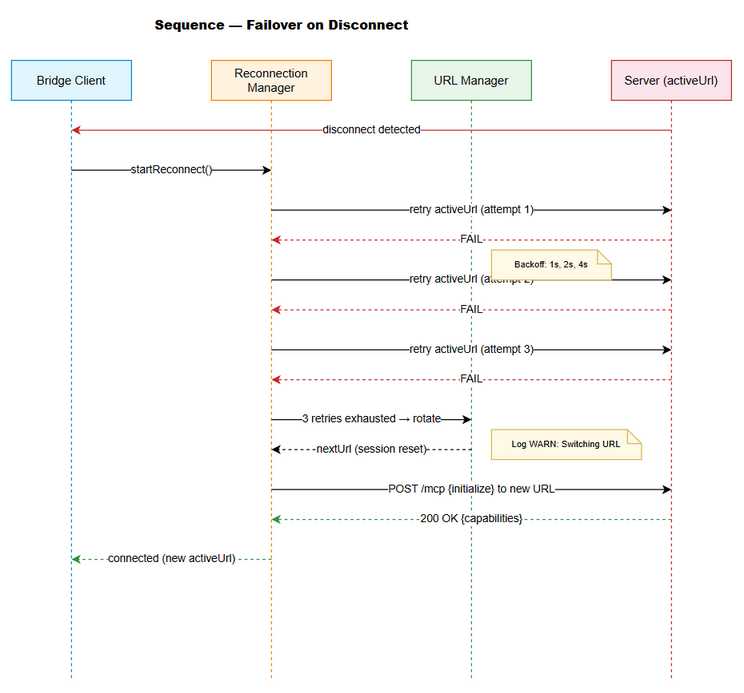

# Functional Specification Document (FSD)

## MCP Orchestration — MTO-104: [Bridge] Multi-URL Fallback — Sequential Connection with Failover Across All Bridge Clients

---

## Document Information

| Field | Value |
|-------|-------|
| Jira Ticket | MTO-104 |
| Title | [Bridge] Multi-URL Fallback — Sequential Connection with Failover |
| Author | BA Agent |
| Version | 1.0 |
| Date | 2026-05-14 |
| Status | Draft |
| Related BRD | BRD-v1-MTO-104.docx |

---

## Revision History

| Version | Date | Author | Changes |
|---------|------|--------|---------|
| 1.0 | 2026-05-14 | BA Agent | Initiate document — auto-generated from BRD MTO-104 |

---

## 1. Introduction

### 1.1 Purpose

This FSD specifies the functional behavior of the Multi-URL Fallback feature across all 6 MCP Bridge clients. It defines use cases, business rules, data specifications, and integration requirements for implementing sequential connection with failover.

### 1.2 Scope

- URL parsing and validation logic for all bridge clients
- Sequential connection strategy with per-URL timeout
- Failover and reconnection behavior on disconnect
- Session reset on URL switch
- Aggregated error reporting
- Environment variable and CLI argument handling
- Backward compatibility with single-URL mode

### 1.3 Definitions & Acronyms

| Term | Definition |
|------|------------|
| Bridge Client | Lightweight MCP proxy connecting to Orchestrator via HTTP Streamable transport |
| activeUrl | The URL currently being used for communication |
| URL Rotation | Moving to the next URL in the list after current one fails |
| Session Reset | Clearing session ID, request counter, performing new MCP initialize handshake |
| Exponential Backoff | Retry delay doubling each attempt (1s, 2s, 4s, 8s, max 15s) |
| HTTP Streamable | Transport protocol — POST /mcp with JSON-RPC payload |

### 1.4 References

| Document | Location |
|----------|----------|
| BRD | BRD-v1-MTO-104.docx |
| Node.js Bridge Source | mcp-client-bridge/src/ |
| Python Bridge Source | mcp-bridge-python/src/mcp_bridge/ |
| Kotlin Bridge Source | orchestrator-bridge/src/main/kotlin/com/orchestrator/mcp/bridge/ |

---

## 2. System Overview

### 2.1 System Context Diagram



The Multi-URL Fallback feature sits between the bridge client's configuration layer and its HTTP transport layer. External actors include:
- **Developer** — configures URLs via CLI or environment variables
- **MCP Orchestrator instances** — one or more servers at different URLs
- **Host application** — communicates with bridge via stdio (unchanged)

### 2.2 System Architecture

The feature introduces a **URL Manager** component within each bridge client that:
1. Parses and validates the URL list from configuration
2. Manages the active URL index and rotation logic
3. Coordinates with the Reconnection Manager for failover decisions
4. Triggers session reset when switching URLs

---

## 3. Functional Requirements

### 3.1 Feature: URL Parsing and Configuration

**Source:** BRD Story 1, Story 5

#### 3.1.1 Description

All bridge clients must parse a comma-separated URL string into an ordered list, supporting both CLI arguments and environment variables with defined priority.

#### 3.1.2 Use Case

**Use Case ID:** UC-01
**Actor:** Developer
**Preconditions:** Bridge client is being started
**Postconditions:** URL list is parsed and validated; bridge has ordered list of URLs to attempt

**Main Flow:**

| Step | Actor | System | Description |
|------|-------|--------|-------------|
| 1 | Developer | | Provides `--url "http://a:9180,http://b:9180"` via CLI |
| 2 | | Bridge | Reads CLI argument value |
| 3 | | Bridge | Splits string by comma delimiter |
| 4 | | Bridge | Trims whitespace from each segment |
| 5 | | Bridge | Filters out empty segments |
| 6 | | Bridge | Validates each URL format (http:// or https://) |
| 7 | | Bridge | Stores as ordered list: `["http://a:9180", "http://b:9180"]` |
| 8 | | Bridge | Sets urlIndex = 0, activeUrl = urls[0] |

**Alternative Flows:**

| ID | Condition | Steps |
|----|-----------|-------|
| AF-01 | No `--url` CLI arg provided | Check `ORCHESTRATOR_URLS` env var → if set, parse same way |
| AF-02 | No `ORCHESTRATOR_URLS` env | Check `ORCHESTRATOR_URL` env var → treat as single-URL list |
| AF-03 | No env vars set | Use default `http://localhost:8080` as single-URL list |
| AF-04 | Single URL provided (no comma) | Create list of length 1 — identical behavior to current |

**Exception Flows:**

| ID | Condition | Steps |
|----|-----------|-------|
| EF-01 | All URLs have invalid format | Log error with invalid entries → exit with code 1 |
| EF-02 | URL list exceeds 10 entries | Log warning, truncate to first 10 URLs |
| EF-03 | URL list is empty after filtering | Log error "No valid URLs configured" → exit with code 1 |

#### 3.1.3 Business Rules

| Rule ID | Rule | Source |
|---------|------|--------|
| BR-01 | Config priority: `--url` CLI > `ORCHESTRATOR_URLS` env > `ORCHESTRATOR_URL` env > default | BRD Story 5 |
| BR-02 | Each URL must start with `http://` or `https://` | BRD Story 1 |
| BR-03 | Maximum 10 URLs allowed in list | BRD Story 1 |
| BR-04 | Whitespace around commas is trimmed | BRD AC1 |
| BR-05 | Empty segments (double commas, trailing comma) are filtered | BRD AC1 |
| BR-06 | Single URL input creates list of length 1 (backward compatible) | BRD Story 4 |

#### 3.1.4 Data Specifications

**Input Data:**

| Field | Type | Required | Validation | Description |
|-------|------|----------|------------|-------------|
| urlString | string | Yes | Non-empty after parsing | Comma-separated URL string from CLI or env |

**Output Data:**

| Field | Type | Description |
|-------|------|-------------|
| urls | string[] | Ordered list of validated URLs |
| urlCount | integer | Number of URLs in list (1-10) |

#### 3.1.5 API Contract (Functional View)

> Not applicable — this is a CLI/config feature, not an API endpoint.

---

### 3.2 Feature: Sequential Connection

**Source:** BRD Story 2

#### 3.2.1 Description

On initial startup, the bridge attempts connection to each URL in order (left to right) with a 5-second timeout per URL. The first successful connection becomes the active URL.

#### 3.2.2 Use Case

**Use Case ID:** UC-02
**Actor:** Bridge Client (automated)
**Preconditions:** URL list is parsed and validated (UC-01 complete)
**Postconditions:** Bridge is connected to one URL, or all URLs have failed

**Main Flow:**

| Step | Actor | System | Description |
|------|-------|--------|-------------|
| 1 | | Bridge | Set urlIndex = 0 |
| 2 | | Bridge | Log INFO: `Trying URL 1/{total}: {urls[0]}` |
| 3 | | Bridge | Attempt HTTP POST to `{urls[0]}/mcp` with initialize request, timeout 5s |
| 4 | | Bridge | Receive successful response (HTTP 200 with JSON-RPC result) |
| 5 | | Bridge | Store activeUrl = urls[0], state = CONNECTED |
| 6 | | Bridge | Log INFO: `Connected to {activeUrl}` |

**Alternative Flows:**

| ID | Condition | Steps |
|----|-----------|-------|
| AF-01 | URL at index N fails (timeout/refused/error) | Log WARN: `URL {N+1}/{total} failed: {error}` → increment urlIndex → try next URL |
| AF-02 | Last URL in list fails | All URLs exhausted → go to Exception Flow EF-01 |

**Exception Flows:**

| ID | Condition | Steps |
|----|-----------|-------|
| EF-01 | All URLs fail on initial connect | Aggregate all errors → log ERROR with aggregated report → if reconnect enabled: enter reconnect loop; else: exit with code 1 |

#### 3.2.3 Business Rules

| Rule ID | Rule | Source |
|---------|------|--------|
| BR-07 | Per-URL connection timeout: 5 seconds | BRD AC2 |
| BR-08 | URLs tried sequentially, left to right (index 0 to N-1) | BRD AC2 |
| BR-09 | First successful connection stops further attempts | BRD AC2 |
| BR-10 | Each attempt logged with index and total count | BRD AC2 |

#### 3.2.4 Data Specifications

**Runtime State:**

| Field | Type | Description |
|-------|------|-------------|
| activeUrl | string | Currently connected URL |
| urlIndex | integer | Index of active URL in list (0-based) |
| connectionTimeout | integer | 5000ms per URL attempt |

---

### 3.3 Feature: Failover on Disconnect

**Source:** BRD Story 2

#### 3.3.1 Description

When the active connection is lost, the bridge first retries the active URL (3 attempts with exponential backoff), then rotates to the next URL in the list if retries are exhausted.

#### 3.3.2 Use Case

**Use Case ID:** UC-03
**Actor:** Bridge Client (automated)
**Preconditions:** Bridge was connected (state = CONNECTED), disconnect detected
**Postconditions:** Bridge reconnected to same or different URL, or in reconnect loop

**Main Flow:**

| Step | Actor | System | Description |
|------|-------|--------|-------------|
| 1 | | Bridge | Detect disconnect (request fails, ping timeout, etc.) |
| 2 | | Bridge | Set state = RECONNECTING |
| 3 | | Bridge | Retry activeUrl attempt 1 (with backoff delay) |
| 4 | | Bridge | Retry activeUrl attempt 2 (with backoff delay) |
| 5 | | Bridge | Retry activeUrl attempt 3 (with backoff delay) |
| 6 | | Bridge | All 3 retries failed → advance urlIndex to next URL |
| 7 | | Bridge | Log WARN: `Switching to URL {urlIndex+1}/{total}: {urls[urlIndex]}` |
| 8 | | Bridge | Perform session reset (UC-05) |
| 9 | | Bridge | Attempt connection to new URL with 5s timeout |
| 10 | | Bridge | If success → store as new activeUrl, state = CONNECTED |

**Alternative Flows:**

| ID | Condition | Steps |
|----|-----------|-------|
| AF-01 | ActiveUrl retry succeeds (step 3, 4, or 5) | Reset attempt counter, state = CONNECTED, stop |
| AF-02 | New URL also fails | Continue to next URL in list (wrap around) |
| AF-03 | All URLs exhausted in rotation | Loop back to original activeUrl, continue backoff |

**Exception Flows:**

| ID | Condition | Steps |
|----|-----------|-------|
| EF-01 | Reconnect disabled (`--no-reconnect`) | Log ERROR, exit with code 1 |

#### 3.3.3 Business Rules

| Rule ID | Rule | Source |
|---------|------|--------|
| BR-11 | Retry active URL 3 times before rotating | BRD AC3 |
| BR-12 | Use existing exponential backoff for retries (1s, 2s, 4s, max 15s) | BRD AC3 |
| BR-13 | URL rotation wraps around (after last → back to first) | BRD AC3 |
| BR-14 | Log WARN when switching to different URL | BRD AC3 |
| BR-15 | Reset attempt counter on successful reconnection | BRD AC3 |

---

### 3.4 Feature: Aggregated Error Reporting

**Source:** BRD Story 3

#### 3.4.1 Description

When all URLs fail (either on initial connect or during reconnection), the bridge produces a structured error report showing each URL and its specific failure reason.

#### 3.4.2 Use Case

**Use Case ID:** UC-04
**Actor:** Bridge Client (automated)
**Preconditions:** All URLs in the list have been attempted and failed
**Postconditions:** Aggregated error report is output to stderr

**Main Flow:**

| Step | Actor | System | Description |
|------|-------|--------|-------------|
| 1 | | Bridge | Collect error for each URL: `{url: string, error: string}` |
| 2 | | Bridge | Format aggregated report |
| 3 | | Bridge | Output to stderr |

**Output Format:**

```
All URLs failed:
  - http://localhost:9180: Connection refused
  - http://staging:9180: Timeout after 5000ms
```

#### 3.4.3 Business Rules

| Rule ID | Rule | Source |
|---------|------|--------|
| BR-16 | Each URL's specific error is preserved | BRD AC4 |
| BR-17 | Error output goes to stderr | BRD AC4 |
| BR-18 | Format clearly indicates total failure | BRD AC4 |

#### 3.4.4 Data Specifications

**Error Collection:**

| Field | Type | Description |
|-------|------|-------------|
| errors | Array<{url: string, error: string}> | Per-URL error details |

---

### 3.5 Feature: Session Reset on URL Switch

**Source:** BRD Story 6

#### 3.5.1 Description

When the bridge switches to a different URL (not retrying the same URL), it performs a full session reset before attempting connection to the new server.

#### 3.5.2 Use Case

**Use Case ID:** UC-05
**Actor:** Bridge Client (automated)
**Preconditions:** Bridge is switching from one URL to a different URL
**Postconditions:** Session state is cleared, new MCP initialize handshake performed

**Main Flow:**

| Step | Actor | System | Description |
|------|-------|--------|-------------|
| 1 | | Bridge | Clear session ID (set to null) |
| 2 | | Bridge | Reset request ID counter to 0 |
| 3 | | Bridge | Clear any cached server capabilities |
| 4 | | Bridge | Perform MCP initialize handshake with new URL |
| 5 | | Bridge | Store new session ID from response headers |
| 6 | | Bridge | Update activeUrl to new URL |

**Alternative Flows:**

| ID | Condition | Steps |
|----|-----------|-------|
| AF-01 | Initialize fails on new URL | Do NOT retry initialize on same URL → move to next URL |

#### 3.5.3 Business Rules

| Rule ID | Rule | Source |
|---------|------|--------|
| BR-19 | Session reset clears: session ID, request counter, cached capabilities | BRD AC5 |
| BR-20 | Old session ID is never sent to new server | BRD AC5 |
| BR-21 | If initialize fails on new URL, move to next (don't retry initialize) | BRD AC5 |

---

### 3.6 Feature: Backward Compatibility

**Source:** BRD Story 4

#### 3.6.1 Description

Single-URL usage must behave identically to the current implementation. The multi-URL feature is transparent when only one URL is configured.

#### 3.6.2 Use Case

**Use Case ID:** UC-06
**Actor:** Developer
**Preconditions:** Bridge configured with single URL (no comma in value)
**Postconditions:** Bridge behaves identically to pre-feature implementation

**Main Flow:**

| Step | Actor | System | Description |
|------|-------|--------|-------------|
| 1 | Developer | | Provides `--url "http://localhost:8080"` |
| 2 | | Bridge | Parses into list of length 1: `["http://localhost:8080"]` |
| 3 | | Bridge | Connects to single URL (same as current behavior) |
| 4 | | Bridge | On disconnect: retries same URL with existing backoff (no rotation) |

#### 3.6.3 Business Rules

| Rule ID | Rule | Source |
|---------|------|--------|
| BR-22 | Single URL = list of length 1, same code path | BRD Story 4 |
| BR-23 | `ORCHESTRATOR_URL` (singular) env var still works | BRD Story 4 |
| BR-24 | Default URL `http://localhost:8080` unchanged | BRD Story 4 |
| BR-25 | No changes to stdio MCP interface | BRD Story 4 |

---

## 4. Data Model

> No database changes required. This feature operates entirely in-memory within bridge client processes.

### 4.1 In-Memory State Model

#### Entity: UrlManager State

| Attribute | Type | Required | Business Rule | Description |
|-----------|------|----------|---------------|-------------|
| urls | string[] | Yes | BR-01 to BR-06 | Ordered list of validated URLs |
| activeUrl | string | Yes | BR-09 | Currently connected URL |
| urlIndex | integer | Yes | BR-08 | Index of active URL (0-based) |
| urlCount | integer | Yes | BR-03 | Total URLs in list (1-10) |
| errors | Map<string, string> | No | BR-16 | Per-URL error collection |

#### Entity: Connection State (existing, modified)

| Attribute | Type | Required | Business Rule | Description |
|-----------|------|----------|---------------|-------------|
| state | BridgeState enum | Yes | — | DISCONNECTED, CONNECTING, CONNECTED, RECONNECTING |
| retryCount | integer | Yes | BR-11 | Current retry count for active URL (0-3) |
| sessionId | string | No | BR-19 | Current MCP session ID |
| requestIdCounter | integer | Yes | BR-19 | JSON-RPC request ID counter |

---

## 5. Integration Specifications

### 5.1 External System: MCP Orchestrator Server

| Attribute | Value |
|-----------|-------|
| Purpose | Provides MCP tools and resources to bridge clients |
| Direction | Outbound (bridge → server) |
| Data Format | JSON-RPC 2.0 over HTTP |
| Frequency | Real-time (on-demand per tool call) |

**Data Exchange:**

| Our Data | External Data | Direction | Business Rule |
|----------|--------------|-----------|---------------|
| initialize request | Server capabilities + session ID | Send/Receive | BR-19, BR-20 |
| tools/call request | Tool execution result | Send/Receive | — |
| ping request | pong response | Send/Receive | Health check |

---

## 6. Processing Logic

### 6.1 URL Parsing Process

**Trigger:** Bridge client startup
**Input:** Raw URL string from CLI or environment
**Output:** Validated, ordered URL list

**Processing Steps:**

| Step | Description | Error Handling |
|------|-------------|----------------|
| 1 | Read `--url` CLI arg | If not present, fall through to env vars |
| 2 | If no CLI, read `ORCHESTRATOR_URLS` env | If not set, fall through |
| 3 | If no plural env, read `ORCHESTRATOR_URL` env | If not set, use default |
| 4 | Split value by comma | — |
| 5 | Trim whitespace from each segment | — |
| 6 | Filter empty segments | — |
| 7 | Validate each URL starts with http:// or https:// | Remove invalid, log warning |
| 8 | Check at least 1 valid URL remains | If 0 valid → exit with error |
| 9 | Truncate to max 10 URLs | Log warning if truncated |

### 6.2 Sequential Connection Process

**Trigger:** Bridge startup after URL parsing
**Input:** Validated URL list
**Output:** Connected state with activeUrl set

**State Diagram:**



**Processing Steps:**

| Step | Description | Error Handling |
|------|-------------|----------------|
| 1 | Set urlIndex = 0, state = CONNECTING | — |
| 2 | Log INFO: `Trying URL {urlIndex+1}/{total}: {url}` | — |
| 3 | POST to `{url}/mcp` with initialize, timeout 5s | On timeout/error → step 5 |
| 4 | Success → set activeUrl, state = CONNECTED, return | — |
| 5 | Store error for this URL | — |
| 6 | Increment urlIndex | — |
| 7 | If urlIndex < total → go to step 2 | — |
| 8 | All failed → output aggregated error | Exit or enter reconnect loop |

### 6.3 Failover Process

**Trigger:** Disconnect detected while in CONNECTED state
**Input:** Current activeUrl, URL list, retry count
**Output:** Reconnected to same or different URL

**Processing Steps:**

| Step | Description | Error Handling |
|------|-------------|----------------|
| 1 | Set state = RECONNECTING, retryCount = 0 | — |
| 2 | Calculate backoff delay | — |
| 3 | Wait backoff delay | — |
| 4 | Attempt reconnect to activeUrl | On fail → step 5 |
| 5 | Increment retryCount | — |
| 6 | If retryCount < 3 → go to step 2 | — |
| 7 | retryCount >= 3 → advance urlIndex (wrap around) | — |
| 8 | Log WARN: `Switching to URL {urlIndex+1}/{total}` | — |
| 9 | Perform session reset | — |
| 10 | Attempt connect to new URL (5s timeout) | On fail → go to step 7 |
| 11 | Success → set activeUrl, state = CONNECTED | — |

---

## 7. Security Requirements

### 7.1 Authentication & Authorization

| Role | Permissions | Features |
|------|-------------|----------|
| Developer | Configure URLs | CLI args, env vars |
| Bridge Client | Connect to any configured URL | HTTP requests with JWT token |

### 7.2 Data Sensitivity

| Data Type | Classification | Business Requirement |
|-----------|---------------|---------------------|
| JWT Token | Confidential | Same token sent to all configured URLs — all URLs must be trusted |
| URL List | Internal | May contain internal hostnames/IPs |

### 7.3 Security Considerations

- **Token exposure**: The same JWT token is sent to ALL configured URLs. All URLs in the list MUST be trusted Orchestrator instances.
- **No URL validation beyond format**: Bridge does not verify server identity beyond TLS certificate (if https://).
- **Logging**: URLs are logged at INFO level. Token is NEVER logged.

---

## 8. Non-Functional Requirements

| Category | Business Requirement | Acceptance Criteria |
|----------|---------------------|---------------------|
| Performance | Initial connection worst case: N × 5s | With 3 URLs, max 15s to determine all failed |
| Performance | No overhead during normal operation | Multi-URL logic only active during connect/reconnect |
| Reliability | Automatic failover within 20s | 3 retries (backoff) + 1 URL switch < 20s |
| Compatibility | Zero breaking changes | All existing single-URL configs work unchanged |
| Consistency | Same algorithm across all 6 clients | Identical behavior regardless of language |

---

## 9. Error Handling (User-Facing)

### 9.1 Error Scenarios

| Scenario | Severity | User Message | Expected Behavior |
|----------|----------|-------------|-------------------|
| All URLs fail on startup | Critical | Aggregated error report to stderr | Exit with code 1 (or reconnect loop) |
| Active URL disconnects | Warning | Log WARN with retry info | Auto-retry then rotate |
| URL switch occurs | Warning | Log WARN: "Switching to URL X/N" | Session reset + reconnect |
| Invalid URL format in config | Error | "Invalid URL: {url} — must start with http:// or https://" | Skip invalid, use remaining valid URLs |
| No valid URLs after parsing | Critical | "No valid URLs configured" | Exit with code 1 |
| URL list exceeds 10 | Warning | "URL list truncated to 10 entries" | Use first 10, ignore rest |

---

## 10. Testing Considerations

### 10.1 Test Scenarios

| ID | Scenario | Input | Expected Output | Priority |
|----|----------|-------|-----------------|----------|
| TC-01 | Parse comma-separated URLs | `"http://a:9180,http://b:9180"` | List of 2 URLs | High |
| TC-02 | Trim whitespace | `" http://a:9180 , http://b:9180 "` | Trimmed list of 2 | High |
| TC-03 | Filter empty segments | `"http://a:9180,,http://b:9180,"` | List of 2 (no empties) | High |
| TC-04 | Single URL (backward compat) | `"http://localhost:8080"` | List of 1, same behavior | High |
| TC-05 | Sequential connection — first succeeds | URLs: [up, down] | Connect to first | High |
| TC-06 | Sequential connection — first fails | URLs: [down, up] | Connect to second | High |
| TC-07 | All URLs fail | URLs: [down, down] | Aggregated error | High |
| TC-08 | Failover after disconnect | Connected to URL1, disconnect | Retry URL1 3x, then URL2 | High |
| TC-09 | Session reset on switch | Switch from URL1 to URL2 | New session ID, fresh state | High |
| TC-10 | Env var ORCHESTRATOR_URLS | Env set, no CLI | Parse from env | Medium |
| TC-11 | CLI overrides env | Both set | CLI value used | Medium |
| TC-12 | Max 10 URLs | 15 URLs provided | Truncated to 10 | Low |
| TC-13 | Invalid URL format | `"ftp://bad,http://good"` | Skip ftp, use http | Medium |
| TC-14 | URL rotation wraps around | 2 URLs, both fail, retry | Wraps back to first | High |

---

## 11. Client-Specific Considerations

### 11.1 Node.js Bridge (`mcp-client-bridge`)

| Aspect | Current | After Change |
|--------|---------|--------------|
| Config field | `orchestratorUrl: string` | `orchestratorUrls: string[]` + `activeUrl: string` |
| URL parsing | `parseUrl()` returns single string | `parseUrls()` returns string array |
| Connection | Direct initialize to single URL | Sequential attempt through URL list |
| Reconnection | Retry same URL with backoff | Retry 3x → rotate → session reset |

**Files to modify:** `bridge-config.ts`, `reconnection-manager.ts`, `http-streamable-client.ts`

### 11.2 Python Bridge (`mcp-bridge-python`)

| Aspect | Current | After Change |
|--------|---------|--------------|
| Config field | `orchestrator_url: str` | `orchestrator_urls: list[str]` + `active_url: str` |
| URL parsing | Single URL from argparse | Parse comma-separated into list |
| Connection | Direct initialize | Sequential attempt |
| Reconnection | Retry same URL | Retry 3x → rotate → session reset |

**Files to modify:** `config.py`, `models.py`, `reconnection.py`, `http_client.py`

### 11.3 Kotlin Bridge (`orchestrator-bridge`)

| Aspect | Current | After Change |
|--------|---------|--------------|
| Config field | `orchestratorUrl: String` | `orchestratorUrls: List<String>` + `activeUrl: String` |
| URL parsing | `parseUrl()` returns single String | `parseUrls()` returns List<String> |
| Connection | Direct initialize | Sequential attempt with coroutines |
| Reconnection | Retry same URL | Retry 3x → rotate → session reset |

**Files to modify:** `BridgeConfig.kt`, `ReconnectionManager.kt`, `HttpStreamableClient.kt`

### 11.4 Bash Bridge (`mcp-bridge-bash`)

| Aspect | Current | After Change |
|--------|---------|--------------|
| Config | Single `$URL` variable | `$URLS` array (IFS split) |
| Connection | Single curl attempt | Loop through array |
| Reconnection | Retry same URL | Retry 3x → rotate |

**Files to modify:** `mcp-bridge.sh`

### 11.5 PowerShell Bridge (`mcp-bridge-powershell`)

| Aspect | Current | After Change |
|--------|---------|--------------|
| Config | Single `$Url` variable | `$Urls` array (split by comma) |
| Connection | Single Invoke-RestMethod | Loop through array |
| Reconnection | Retry same URL | Retry 3x → rotate |

**Files to modify:** `mcp-bridge.ps1`

### 11.6 CMD Bridge (`mcp-bridge-cmd`) — Best Effort

| Aspect | Current | After Change |
|--------|---------|--------------|
| Config | Single `%URL%` variable | String splitting with FOR loop |
| Limitation | No native arrays | Use delimited string + FOR /F parsing |
| Connection | Single curl attempt | Loop through parsed URLs |

**Files to modify:** `mcp-bridge.cmd`

---

## 12. Appendix

### Sequence Diagram — Initial Connection



### Sequence Diagram — Failover



### State Diagram — Connection States


### Diagram Index

| # | Diagram | Image | Source (editable) |
|---|---------|-------|-------------------|
| 1 | System Context | [system-context.png](diagrams/system-context.png) | [system-context.drawio](diagrams/system-context.drawio) |
| 2 | Sequence — Initial Connection | [sequence-initial-connection.png](diagrams/sequence-initial-connection.png) | [sequence-initial-connection.drawio](diagrams/sequence-initial-connection.drawio) |
| 3 | Sequence — Failover | [sequence-failover.png](diagrams/sequence-failover.png) | [sequence-failover.drawio](diagrams/sequence-failover.drawio) |
| 4 | State — Connection States | [state-connection.png](diagrams/state-connection.png) | [state-connection.drawio](diagrams/state-connection.drawio) |
