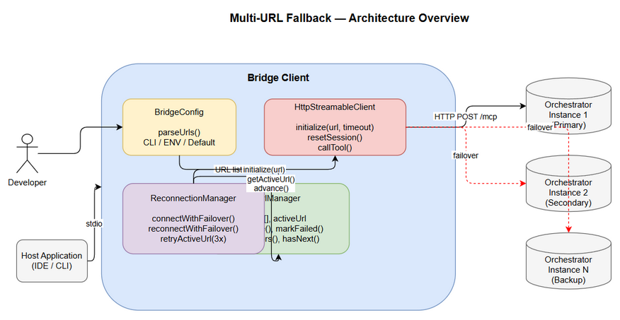
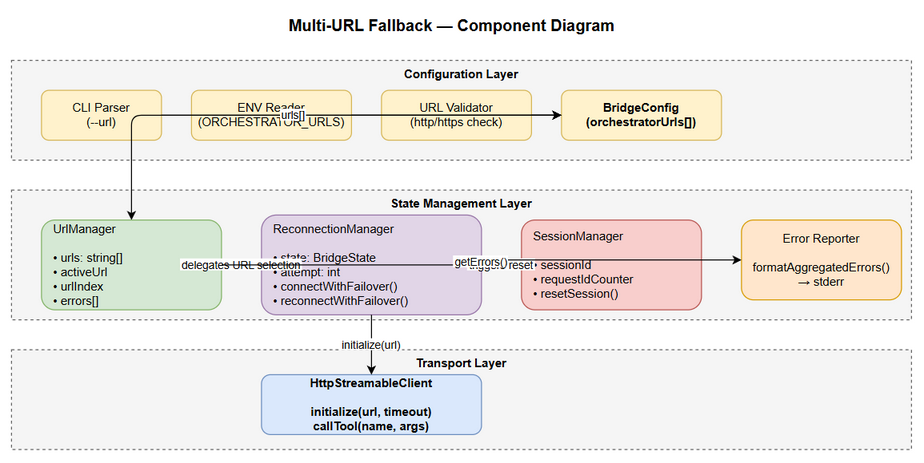

# Technical Design Document (TDD)

## MCP Orchestration — MTO-104: [Bridge] Multi-URL Fallback — Sequential Connection with Failover Across All Bridge Clients

---

## Document Information

| Field | Value |
|-------|-------|
| Jira Ticket | MTO-104 |
| Title | [Bridge] Multi-URL Fallback — Sequential Connection with Failover |
| Author | SA Agent |
| Version | 1.0 |
| Date | 2026-05-14 |
| Status | Draft |
| Related BRD | BRD-v1-MTO-104.docx |
| Related FSD | FSD-v1-MTO-104.docx |

---

## Author Tracking

| Role | Name - Position | Responsibility |
|------|-----------------|----------------|
| Author | SA Agent – Solution Architect | Create document |
| Peer Reviewer | TA Agent – Technical Analyst | Review document |

---

## Revision History

| Version | Date | Author | Changes |
|---------|------|--------|---------|
| 1.0 | 2026-05-14 | SA Agent | Initial TDD — architecture and implementation design for multi-URL fallover |

---

## Sign-Off

| Name | Signature and date |
|------|--------------------|
| | ☐ I agree and confirm the technical design in this TDD |
| | ☐ I agree and confirm the technical design in this TDD |

---

## 1. Introduction

### 1.1 Purpose

This TDD specifies the technical implementation of the Multi-URL Fallback feature across all 6 MCP Bridge clients (Node.js, Python, Kotlin, Bash, PowerShell, CMD). It defines the architecture, class design, algorithms, and implementation patterns needed to add sequential connection with failover capability.

### 1.2 Scope

- **UrlManager** component design for URL parsing, validation, and rotation
- Modifications to existing **ReconnectionManager** for multi-URL failover
- Modifications to existing **BridgeConfig** for multi-URL configuration
- Session reset logic on URL switch
- Aggregated error reporting
- Implementation across 6 language-specific bridge clients
- Backward compatibility with single-URL mode

### 1.3 Technology Stack

| Layer | Technology | Version |
|-------|-----------|---------|
| Node.js Bridge | TypeScript | 5.x |
| Python Bridge | Python | 3.11+ |
| Kotlin Bridge | Kotlin | 2.3.20 |
| Bash Bridge | Bash | 4.0+ |
| PowerShell Bridge | PowerShell | 7.0+ |
| CMD Bridge | Windows CMD | 10.0+ |
| Build (Node) | npm | 10.x |
| Build (Python) | pip / pyproject.toml | — |
| Build (Kotlin) | Gradle (Kotlin DSL) | 8.x |

### 1.4 Design Principles

- **Single Responsibility**: UrlManager handles URL state; ReconnectionManager handles retry logic
- **Open/Closed**: New URL strategies can be added without modifying existing connection code
- **Interface Segregation**: UrlManager exposes minimal interface (getNext, markFailed, reset)
- **Backward Compatibility**: Single URL = list of length 1, identical code path
- **Consistent Behavior**: All 6 clients implement the same algorithm with language-appropriate idioms

### 1.5 Constraints

- Per-URL connection timeout hardcoded at 5 seconds (not configurable)
- Maximum 10 URLs in list (truncate with warning)
- CMD bridge has limited array support — best-effort implementation
- No persistent state — URL rotation resets on bridge restart
- No health-check probing of inactive URLs (only try on failover)

### 1.6 References

| Document | Location |
|----------|----------|
| BRD | BRD-v1-MTO-104.docx |
| FSD | FSD-v1-MTO-104.docx |
| Node.js Bridge Source | mcp-client-bridge/src/ |
| Python Bridge Source | mcp-bridge-python/src/mcp_bridge/ |
| Kotlin Bridge Source | orchestrator-bridge/src/main/kotlin/com/orchestrator/mcp/bridge/ |
| Bash Bridge Source | mcp-bridge-bash/mcp-bridge.sh |
| PowerShell Bridge Source | mcp-bridge-powershell/mcp-bridge.ps1 |
| CMD Bridge Source | mcp-bridge-cmd/mcp-bridge.cmd |

---

## 2. System Architecture

### 2.1 Architecture Overview

The Multi-URL Fallback feature introduces a **UrlManager** component that sits between the configuration layer and the connection layer in each bridge client. It manages an ordered list of URLs and coordinates with the ReconnectionManager to implement failover logic.



**Key architectural decisions:**

1. **New component (UrlManager)** rather than modifying BridgeConfig — separates URL state management from static configuration
2. **ReconnectionManager delegates URL selection** to UrlManager — keeps retry logic in one place, URL rotation in another
3. **Session reset triggered by UrlManager** when URL changes — ensures clean state on new server

### 2.2 Component Diagram



| Component | Responsibility | Technology |
|-----------|---------------|------------|
| BridgeConfig | Parse CLI/env, produce URL list + settings | Per-language config parser |
| UrlManager | Track active URL, rotate on failure, collect errors | Per-language state class |
| ReconnectionManager | Retry active URL (3x), delegate to UrlManager for rotation | Per-language async/coroutine |
| HttpStreamableClient | HTTP POST to /mcp endpoint, session management | Per-language HTTP client |
| SessionManager | Clear session ID, reset request counter on URL switch | Embedded in HttpStreamableClient |

### 2.3 Communication Patterns

| From | To | Protocol | Pattern | Description |
|------|----|----------|---------|-------------|
| BridgeConfig | UrlManager | In-process | Constructor injection | Pass parsed URL list |
| ReconnectionManager | UrlManager | In-process | Method call | getActiveUrl(), advance(), markFailed() |
| ReconnectionManager | HttpStreamableClient | In-process | Async call | initialize(), resetSession() |
| HttpStreamableClient | Orchestrator | HTTP POST | Sync request-response | JSON-RPC over /mcp |

---

## 3. Detailed Design — UrlManager

### 3.1 Interface Definition

All bridge clients implement the same logical interface (adapted to language idioms):

```
interface UrlManager {
    urls: string[]              // Ordered URL list (immutable after construction)
    activeUrl: string           // Current URL being used (read-only property)
    urlIndex: number            // Current index (read-only)
    urlCount: number            // Total URLs (read-only)
    
    advance(): string           // Move to next URL, return new activeUrl
    reset(): void               // Reset to first URL (index 0)
    markFailed(url, error): void // Record failure for a URL
    getErrors(): UrlError[]     // Get all collected errors
    clearErrors(): void         // Clear error collection
    hasNext(): boolean          // Are there more URLs to try?
}
```

### 3.2 URL Rotation Algorithm

```
ALGORITHM: Sequential URL Rotation with Wrap-Around

INPUT: urls[] (ordered list, length N)
STATE: urlIndex (0-based), errors[]

advance():
    urlIndex = (urlIndex + 1) % N
    return urls[urlIndex]

hasNext():
    // True if we haven't tried all URLs in current rotation
    return errors.length < N
```

**Key behavior:**
- Rotation wraps around (after last URL → back to first)
- `hasNext()` returns false only when ALL URLs have been tried in current cycle
- `clearErrors()` resets the cycle — allows re-trying all URLs

### 3.3 Implementation — Node.js (TypeScript)

**New file:** `mcp-client-bridge/src/url-manager.ts`

```typescript
/**
 * Manages ordered URL list with rotation and error tracking.
 * Implements sequential failover per FSD UC-01 through UC-05.
 */
export interface UrlError {
  url: string;
  error: string;
  timestamp: number;
}

export class UrlManager {
  private readonly _urls: string[];
  private _urlIndex: number = 0;
  private _errors: UrlError[] = [];

  constructor(urls: string[]) {
    if (urls.length === 0) {
      throw new Error('No valid URLs configured');
    }
    this._urls = [...urls];
  }

  get activeUrl(): string { return this._urls[this._urlIndex]; }
  get urlIndex(): number { return this._urlIndex; }
  get urlCount(): number { return this._urls.length; }

  advance(): string {
    this._urlIndex = (this._urlIndex + 1) % this._urls.length;
    return this.activeUrl;
  }

  markFailed(url: string, error: string): void {
    this._errors.push({ url, error, timestamp: Date.now() });
  }

  getErrors(): UrlError[] { return [...this._errors]; }
  clearErrors(): void { this._errors = []; }
  hasNext(): boolean { return this._errors.length < this._urls.length; }

  reset(): void {
    this._urlIndex = 0;
    this._errors = [];
  }
}
```

### 3.4 Implementation — Python

**New file:** `mcp-bridge-python/src/mcp_bridge/url_manager.py`

```python
"""URL manager — sequential rotation with error tracking."""

from dataclasses import dataclass, field
import time


@dataclass
class UrlError:
    url: str
    error: str
    timestamp: float = field(default_factory=time.time)


class UrlManager:
    """Manages ordered URL list with rotation and error tracking."""

    def __init__(self, urls: list[str]) -> None:
        if not urls:
            raise ValueError("No valid URLs configured")
        self._urls = list(urls)
        self._url_index = 0
        self._errors: list[UrlError] = []

    @property
    def active_url(self) -> str:
        return self._urls[self._url_index]

    @property
    def url_index(self) -> int:
        return self._url_index

    @property
    def url_count(self) -> int:
        return len(self._urls)

    def advance(self) -> str:
        self._url_index = (self._url_index + 1) % len(self._urls)
        return self.active_url

    def mark_failed(self, url: str, error: str) -> None:
        self._errors.append(UrlError(url=url, error=error))

    def get_errors(self) -> list[UrlError]:
        return list(self._errors)

    def clear_errors(self) -> None:
        self._errors.clear()

    def has_next(self) -> bool:
        return len(self._errors) < len(self._urls)

    def reset(self) -> None:
        self._url_index = 0
        self._errors.clear()
```

### 3.5 Implementation — Kotlin

**New file:** `orchestrator-bridge/src/main/kotlin/com/orchestrator/mcp/bridge/UrlManager.kt`

```kotlin
package com.orchestrator.mcp.bridge

import org.slf4j.LoggerFactory

/**
 * Manages ordered URL list with rotation and error tracking.
 * Thread-safe via synchronized access to mutable state.
 */
class UrlManager(urls: List<String>) {
    private val logger = LoggerFactory.getLogger(UrlManager::class.java)
    private val _urls: List<String> = urls.toList()
    private var _urlIndex: Int = 0
    private val _errors: MutableList<UrlError> = mutableListOf()

    init {
        require(_urls.isNotEmpty()) { "No valid URLs configured" }
    }

    val activeUrl: String get() = _urls[_urlIndex]
    val urlIndex: Int get() = _urlIndex
    val urlCount: Int get() = _urls.size

    @Synchronized
    fun advance(): String {
        _urlIndex = (_urlIndex + 1) % _urls.size
        return activeUrl
    }

    @Synchronized
    fun markFailed(url: String, error: String) {
        _errors.add(UrlError(url, error, System.currentTimeMillis()))
    }

    fun getErrors(): List<UrlError> = _errors.toList()
    fun clearErrors() { _errors.clear() }
    fun hasNext(): Boolean = _errors.size < _urls.size

    @Synchronized
    fun reset() {
        _urlIndex = 0
        _errors.clear()
    }
}

data class UrlError(
    val url: String,
    val error: String,
    val timestamp: Long
)
```


---

## 4. Detailed Design — BridgeConfig Modifications

### 4.1 URL Parsing Logic

All bridge clients modify their config parsing to support comma-separated URLs with the following priority:

```
Priority: --url CLI > ORCHESTRATOR_URLS env > ORCHESTRATOR_URL env > default
```

**Parsing algorithm (all clients):**

```
FUNCTION parseUrls(args, env):
    raw = null
    
    // 1. CLI arg (highest priority)
    IF "--url" in args:
        raw = args["--url"]
    
    // 2. ORCHESTRATOR_URLS env (plural — new)
    ELSE IF env.ORCHESTRATOR_URLS exists:
        raw = env.ORCHESTRATOR_URLS
    
    // 3. ORCHESTRATOR_URL env (singular — existing)
    ELSE IF env.ORCHESTRATOR_URL exists:
        raw = env.ORCHESTRATOR_URL
    
    // 4. Default
    ELSE:
        raw = "http://localhost:8080"
    
    // Parse comma-separated
    urls = raw.split(",")
              .map(trim)
              .filter(nonEmpty)
              .filter(startsWithHttpOrHttps)
    
    IF urls.isEmpty():
        LOG ERROR "No valid URLs configured"
        EXIT 1
    
    IF urls.length > 10:
        LOG WARN "URL list truncated to 10 entries"
        urls = urls.slice(0, 10)
    
    RETURN urls
```

### 4.2 Node.js — BridgeConfig Changes

**Modified file:** `mcp-client-bridge/src/bridge-config.ts`

```typescript
export interface BridgeConfig {
  orchestratorUrls: string[];       // NEW: replaces orchestratorUrl
  orchestratorUrl: string;          // KEPT: alias for urls[0] (backward compat)
  reconnectEnabled: boolean;
  maxReconnectDelayMs: number;
  baseReconnectDelayMs: number;
  requestTimeoutMs: number;
  connectionTimeoutMs: number;      // NEW: 5000ms per-URL timeout
  maxRetryBeforeRotate: number;     // NEW: 3 retries before URL rotation
  enableLocalStreamWrite: boolean;
  pingIntervalMs: number;
  pingTimeoutMs: number;
  token: string | null;
}
```

**New function `parseUrls`:**

```typescript
function parseUrls(args: string[]): string[] {
  const idx = args.indexOf('--url');
  let raw: string;
  if (idx >= 0 && idx + 1 < args.length) {
    raw = args[idx + 1];
  } else {
    raw = process.env.ORCHESTRATOR_URLS
      ?? process.env.ORCHESTRATOR_URL
      ?? 'http://localhost:8080';
  }

  const urls = raw
    .split(',')
    .map(u => u.trim())
    .filter(u => u.length > 0)
    .filter(u => u.startsWith('http://') || u.startsWith('https://'));

  if (urls.length === 0) {
    console.error('[mcp-bridge] No valid URLs configured');
    process.exit(1);
  }
  if (urls.length > 10) {
    console.error('[mcp-bridge] URL list truncated to 10 entries');
    return urls.slice(0, 10);
  }
  return urls;
}
```

### 4.3 Python — BridgeConfig Changes

**Modified file:** `mcp-bridge-python/src/mcp_bridge/models.py`

```python
@dataclass
class BridgeConfig:
    orchestrator_urls: list[str] = field(default_factory=lambda: ["http://localhost:8080"])
    orchestrator_url: str = "http://localhost:8080"  # Alias for urls[0]
    request_timeout_ms: int = 30_000
    connection_timeout_ms: int = 5_000              # NEW
    max_retry_before_rotate: int = 3                # NEW
    ping_interval_ms: int = 30_000
    ping_timeout_ms: int = 5_000
    base_reconnect_delay_ms: int = 1_000
    max_reconnect_delay_ms: int = 15_000
    enable_local_tools: bool = True
    reconnect_enabled: bool = True
    token: str | None = None
```

**Modified file:** `mcp-bridge-python/src/mcp_bridge/config.py` — add `parse_urls()` function.

### 4.4 Kotlin — BridgeConfig Changes

**Modified file:** `orchestrator-bridge/src/main/kotlin/com/orchestrator/mcp/bridge/BridgeConfig.kt`

```kotlin
data class BridgeConfig(
    val orchestratorUrls: List<String>,              // NEW: replaces orchestratorUrl
    val orchestratorUrl: String = orchestratorUrls.first(), // Alias
    val reconnectEnabled: Boolean = true,
    val maxReconnectDelayMs: Long = 15_000,
    val baseReconnectDelayMs: Long = 1_000,
    val requestTimeoutMs: Long = 30_000,
    val connectionTimeoutMs: Long = 5_000,          // NEW
    val maxRetryBeforeRotate: Int = 3,              // NEW
    val enableLocalStreamWrite: Boolean = true,
    val pingIntervalMs: Long = 30_000,
    val pingTimeoutMs: Long = 5_000,
    val token: String? = null
)
```

**New function in companion object:**

```kotlin
private fun parseUrls(args: Array<String>): List<String> {
    val idx = args.indexOf("--url")
    val raw = when {
        idx >= 0 && idx + 1 < args.size -> args[idx + 1]
        System.getenv("ORCHESTRATOR_URLS") != null -> System.getenv("ORCHESTRATOR_URLS")
        System.getenv("ORCHESTRATOR_URL") != null -> System.getenv("ORCHESTRATOR_URL")
        else -> "http://localhost:8080"
    }
    val urls = raw.split(",")
        .map { it.trim() }
        .filter { it.isNotEmpty() }
        .filter { it.startsWith("http://") || it.startsWith("https://") }

    if (urls.isEmpty()) {
        logger.error("No valid URLs configured")
        System.exit(1)
    }
    if (urls.size > 10) {
        logger.warn("URL list truncated to 10 entries")
        return urls.take(10)
    }
    return urls
}
```

### 4.5 Bash — Config Changes

**Modified section in:** `mcp-bridge-bash/mcp-bridge.sh`

```bash
# === URL Parsing ===
parse_urls() {
    local raw=""
    if [[ -n "${ORCHESTRATOR_URL_RAW:-}" ]]; then
        raw="$ORCHESTRATOR_URL_RAW"
    elif [[ -n "${ORCHESTRATOR_URLS:-}" ]]; then
        raw="$ORCHESTRATOR_URLS"
    elif [[ -n "${ORCHESTRATOR_URL:-}" ]]; then
        raw="$ORCHESTRATOR_URL"
    else
        raw="http://localhost:8080"
    fi

    IFS=',' read -ra URL_LIST <<< "$raw"
    URLS=()
    for url in "${URL_LIST[@]}"; do
        url=$(echo "$url" | xargs)  # trim
        [[ -z "$url" ]] && continue
        [[ "$url" != http://* && "$url" != https://* ]] && continue
        URLS+=("$url")
    done

    if [[ ${#URLS[@]} -eq 0 ]]; then
        log "ERROR: No valid URLs configured"
        exit 1
    fi
    if [[ ${#URLS[@]} -gt 10 ]]; then
        log "WARN: URL list truncated to 10"
        URLS=("${URLS[@]:0:10}")
    fi
    URL_COUNT=${#URLS[@]}
    URL_INDEX=0
    ACTIVE_URL="${URLS[0]}"
}
```

### 4.6 PowerShell — Config Changes

**Modified section in:** `mcp-bridge-powershell/mcp-bridge.ps1`

```powershell
# === URL Parsing ===
function Parse-Urls {
    param([string]$RawUrl)
    
    if (-not $RawUrl) {
        $RawUrl = $env:ORCHESTRATOR_URLS
    }
    if (-not $RawUrl) {
        $RawUrl = $env:ORCHESTRATOR_URL
    }
    if (-not $RawUrl) {
        $RawUrl = "http://localhost:8080"
    }

    $script:Urls = $RawUrl -split ',' |
        ForEach-Object { $_.Trim() } |
        Where-Object { $_ -ne '' } |
        Where-Object { $_ -match '^https?://' }

    if ($script:Urls.Count -eq 0) {
        Write-Log "ERROR: No valid URLs configured"
        exit 1
    }
    if ($script:Urls.Count -gt 10) {
        Write-Log "WARN: URL list truncated to 10"
        $script:Urls = $script:Urls[0..9]
    }
    $script:UrlIndex = 0
    $script:UrlCount = $script:Urls.Count
    $script:ActiveUrl = $script:Urls[0]
}
```

### 4.7 CMD — Config Changes (Best-Effort)

**Modified section in:** `mcp-bridge-cmd/mcp-bridge.cmd`

CMD limitations:
- No native array support — use numbered variables (`URL_1`, `URL_2`, etc.)
- No string split by delimiter — use `for /f` with `delims=,`
- Maximum 10 URLs (hardcoded loop limit)

```batch
:parse_urls
set URL_COUNT=0
set "RAW_URL=%~1"
if "%RAW_URL%"=="" set "RAW_URL=%ORCHESTRATOR_URLS%"
if "%RAW_URL%"=="" set "RAW_URL=%ORCHESTRATOR_URL%"
if "%RAW_URL%"=="" set "RAW_URL=http://localhost:8080"

for %%u in ("%RAW_URL:,=" "%") do (
    set /a URL_COUNT+=1
    call set "URL_%%URL_COUNT%%=%%~u"
)
set URL_INDEX=1
call set "ACTIVE_URL=%%URL_1%%"
goto :eof
```

---

## 5. Detailed Design — ReconnectionManager Modifications

### 5.1 Modified Connection Flow

The ReconnectionManager is modified to support multi-URL failover:

**Initial Connection (startup):**

```
FUNCTION connectWithFailover(urlManager, client):
    urlManager.clearErrors()
    
    FOR EACH url IN urlManager.urls (starting from index 0):
        LOG INFO "Trying URL {index+1}/{total}: {url}"
        
        TRY:
            success = client.initialize(url, timeout=5000ms)
            IF success:
                LOG INFO "Connected to {url}"
                RETURN true
        CATCH error:
            urlManager.markFailed(url, error.message)
            LOG WARN "URL {index+1}/{total} failed: {error.message}"
        
        IF urlManager.hasNext():
            urlManager.advance()
        ELSE:
            BREAK
    
    // All URLs failed
    reportAggregatedErrors(urlManager.getErrors())
    RETURN false
```

**Reconnection (after disconnect):**

```
FUNCTION reconnectWithFailover(urlManager, client, config):
    IF NOT config.reconnectEnabled:
        RETURN
    
    // Phase 1: Retry active URL (3 attempts with backoff)
    retryCount = 0
    WHILE retryCount < config.maxRetryBeforeRotate:
        delay = calculateBackoff(retryCount)
        SLEEP(delay)
        
        client.resetSession()
        IF client.initialize(urlManager.activeUrl, timeout=5000ms):
            LOG INFO "Reconnected to {urlManager.activeUrl}"
            RETURN
        
        retryCount++
        LOG WARN "Retry {retryCount}/{config.maxRetryBeforeRotate} failed for {urlManager.activeUrl}"
    
    // Phase 2: Rotate to other URLs
    IF urlManager.urlCount > 1:
        urlManager.clearErrors()
        urlManager.markFailed(urlManager.activeUrl, "Exhausted retries")
        
        WHILE urlManager.hasNext():
            nextUrl = urlManager.advance()
            LOG WARN "Switching to URL {urlManager.urlIndex+1}/{urlManager.urlCount}: {nextUrl}"
            
            client.resetSession()  // Session reset on URL switch (BR-19)
            IF client.initialize(nextUrl, timeout=5000ms):
                LOG INFO "Connected to {nextUrl}"
                RETURN
            
            urlManager.markFailed(nextUrl, "Connection failed")
        
        // All URLs exhausted — loop back with continued backoff
        LOG ERROR "All URLs exhausted, continuing backoff on original"
        urlManager.reset()
    
    // Continue infinite reconnect loop (existing behavior)
    reconnectLoop()  // existing backoff loop on active URL
```

### 5.2 Node.js — ReconnectionManager Changes

**Modified file:** `mcp-client-bridge/src/reconnection-manager.ts`

```typescript
export class ReconnectionManager {
  private attempt = 0;
  state: BridgeState = BridgeState.DISCONNECTED;

  constructor(
    private readonly config: BridgeConfig,
    private readonly client: HttpStreamableClient,
    private readonly urlManager: UrlManager,          // NEW
  ) {}

  async connectWithFailover(): Promise<boolean> {
    this.state = BridgeState.CONNECTING;
    this.urlManager.clearErrors();

    for (let i = 0; i < this.urlManager.urlCount; i++) {
      const url = this.urlManager.activeUrl;
      const idx = this.urlManager.urlIndex;
      console.error(
        `[mcp-bridge] Trying URL ${idx + 1}/${this.urlManager.urlCount}: ${url}`
      );

      try {
        if (await this.client.initialize(url)) {
          this.state = BridgeState.CONNECTED;
          this.attempt = 0;
          console.error(`[mcp-bridge] Connected to ${url}`);
          return true;
        }
      } catch (err: unknown) {
        const msg = err instanceof Error ? err.message : String(err);
        this.urlManager.markFailed(url, msg);
        console.error(
          `[mcp-bridge] URL ${idx + 1}/${this.urlManager.urlCount} failed: ${msg}`
        );
      }

      if (this.urlManager.hasNext()) {
        this.urlManager.advance();
      }
    }

    this.reportErrors();
    this.state = BridgeState.DISCONNECTED;
    return false;
  }

  async reconnectWithFailover(): Promise<void> {
    if (!this.config.reconnectEnabled) return;
    this.state = BridgeState.RECONNECTING;

    // Phase 1: Retry active URL
    for (let i = 0; i < this.config.maxRetryBeforeRotate; i++) {
      const delay = this.calculateBackoff(i);
      console.error(
        `[mcp-bridge] Retry ${i + 1}/${this.config.maxRetryBeforeRotate} ` +
        `for ${this.urlManager.activeUrl} in ${delay}ms`
      );
      await this.sleep(delay);

      this.client.resetSession();
      if (await this.client.initialize(this.urlManager.activeUrl)) {
        this.state = BridgeState.CONNECTED;
        this.attempt = 0;
        return;
      }
    }

    // Phase 2: Rotate URLs
    if (this.urlManager.urlCount > 1) {
      this.urlManager.clearErrors();
      this.urlManager.markFailed(this.urlManager.activeUrl, 'Exhausted retries');

      while (this.urlManager.hasNext()) {
        const nextUrl = this.urlManager.advance();
        console.error(
          `[mcp-bridge] WARN: Switching to URL ` +
          `${this.urlManager.urlIndex + 1}/${this.urlManager.urlCount}: ${nextUrl}`
        );

        this.client.resetSession();
        if (await this.client.initialize(nextUrl)) {
          this.state = BridgeState.CONNECTED;
          this.attempt = 0;
          return;
        }
        this.urlManager.markFailed(nextUrl, 'Connection failed');
      }

      this.reportErrors();
      this.urlManager.reset();
    }

    // Fall back to infinite reconnect loop
    await this.reconnectLoop();
  }

  private reportErrors(): void {
    const errors = this.urlManager.getErrors();
    const lines = errors.map(e => `  - ${e.url}: ${e.error}`);
    console.error(`[mcp-bridge] All URLs failed:\n${lines.join('\n')}`);
  }

  // ... existing methods (reconnectLoop, calculateBackoff, sleep)
}
```

### 5.3 Kotlin — ReconnectionManager Changes

**Modified file:** `orchestrator-bridge/src/main/kotlin/com/orchestrator/mcp/bridge/ReconnectionManager.kt`

```kotlin
class ReconnectionManager(
    private val config: BridgeConfig,
    private val client: HttpStreamableClient,
    private val urlManager: UrlManager              // NEW
) {
    private val logger = LoggerFactory.getLogger(ReconnectionManager::class.java)
    private var attempt = 0
    var state: BridgeState = BridgeState.DISCONNECTED

    suspend fun connectWithFailover(): Boolean {
        state = BridgeState.CONNECTING
        urlManager.clearErrors()

        repeat(urlManager.urlCount) {
            val url = urlManager.activeUrl
            val idx = urlManager.urlIndex
            logger.info("Trying URL ${idx + 1}/${urlManager.urlCount}: $url")

            try {
                if (client.initialize(url, config.connectionTimeoutMs)) {
                    state = BridgeState.CONNECTED
                    attempt = 0
                    logger.info("Connected to $url")
                    return true
                }
            } catch (e: Exception) {
                urlManager.markFailed(url, e.message ?: "Unknown error")
                logger.warn("URL ${idx + 1}/${urlManager.urlCount} failed: ${e.message}")
            }

            if (urlManager.hasNext()) urlManager.advance()
        }

        reportErrors()
        state = BridgeState.DISCONNECTED
        return false
    }

    suspend fun reconnectWithFailover() {
        if (!config.reconnectEnabled) return
        state = BridgeState.RECONNECTING

        // Phase 1: Retry active URL
        repeat(config.maxRetryBeforeRotate) { i ->
            val delayMs = RetryUtils.calculateBackoff(
                i, config.baseReconnectDelayMs, config.maxReconnectDelayMs
            )
            logger.warn("Retry ${i + 1}/${config.maxRetryBeforeRotate} " +
                "for ${urlManager.activeUrl} in ${delayMs}ms")
            delay(delayMs)

            client.resetSession()
            if (client.initialize(urlManager.activeUrl, config.connectionTimeoutMs)) {
                state = BridgeState.CONNECTED
                attempt = 0
                return
            }
        }

        // Phase 2: Rotate URLs
        if (urlManager.urlCount > 1) {
            urlManager.clearErrors()
            urlManager.markFailed(urlManager.activeUrl, "Exhausted retries")

            while (urlManager.hasNext()) {
                val nextUrl = urlManager.advance()
                logger.warn("Switching to URL ${urlManager.urlIndex + 1}" +
                    "/${urlManager.urlCount}: $nextUrl")

                client.resetSession()
                if (client.initialize(nextUrl, config.connectionTimeoutMs)) {
                    state = BridgeState.CONNECTED
                    attempt = 0
                    return
                }
                urlManager.markFailed(nextUrl, "Connection failed")
            }

            reportErrors()
            urlManager.reset()
        }

        // Fall back to infinite reconnect loop
        reconnectLoop()
    }

    private fun reportErrors() {
        val errors = urlManager.getErrors()
        val report = errors.joinToString("\n") { "  - ${it.url}: ${it.error}" }
        logger.error("All URLs failed:\n$report")
    }

    // ... existing reconnectLoop() method unchanged
}
```

### 5.4 Python — ReconnectionManager Changes

**Modified file:** `mcp-bridge-python/src/mcp_bridge/reconnection.py`

Same pattern as Node.js/Kotlin — add `connect_with_failover()` and `reconnect_with_failover()` methods that delegate URL selection to `UrlManager`.

### 5.5 Bash/PowerShell/CMD — Reconnection Changes

Shell scripts implement the same algorithm using language-appropriate constructs:
- **Bash**: Functions with global variables (`URLS`, `URL_INDEX`, `ACTIVE_URL`)
- **PowerShell**: Script-scoped variables (`$script:Urls`, `$script:UrlIndex`)
- **CMD**: Numbered variables (`URL_1`, `URL_2`, `URL_INDEX`)


---

## 6. Detailed Design — HttpStreamableClient Modifications

### 6.1 Interface Changes

The `initialize()` method is modified to accept a URL parameter (overriding the config URL):

**Node.js:**
```typescript
async initialize(url?: string): Promise<boolean> {
  const targetUrl = url ?? this.config.orchestratorUrl;
  // ... existing logic with targetUrl instead of this.config.orchestratorUrl
}
```

**Kotlin:**
```kotlin
suspend fun initialize(
    url: String = config.orchestratorUrl,
    timeoutMs: Long = config.requestTimeoutMs
): Boolean {
    // ... existing logic with url parameter and custom timeout
}
```

**Python:**
```python
async def initialize(self, url: str | None = None, timeout_ms: int | None = None) -> bool:
    target_url = url or self._config.orchestrator_url
    timeout = (timeout_ms or self._config.request_timeout_ms) / 1000
    # ... existing logic
```

### 6.2 Session Reset

The `resetSession()` method clears all session state (per BR-19):

```typescript
resetSession(): void {
  this.sessionId = null;
  this.requestIdCounter = 0;
  this._connected = false;
  // Clear any cached server capabilities
}
```

This method already exists in all clients. No changes needed — it already clears session ID and resets state.

### 6.3 Connection Timeout

A new per-URL connection timeout (5000ms) is used during failover, separate from the general request timeout (30000ms):

| Timeout | Value | Used For |
|---------|-------|----------|
| connectionTimeoutMs | 5000 | Initial connection attempt per URL |
| requestTimeoutMs | 30000 | Normal tool call requests after connected |
| pingTimeoutMs | 5000 | Health check ping |

---

## 7. Detailed Design — Aggregated Error Reporting

### 7.1 Error Format

When all URLs fail, the bridge outputs a structured error report to stderr:

```
[mcp-bridge] All URLs failed:
  - http://localhost:9180: Connection refused
  - http://staging:9180: Timeout after 5000ms
  - http://backup:9180: DNS resolution failed
```

### 7.2 Implementation

Error aggregation is handled by `UrlManager.getErrors()` — each failed attempt calls `markFailed(url, error)`. The ReconnectionManager formats and outputs the report.

**Node.js:**
```typescript
private reportErrors(): void {
  const errors = this.urlManager.getErrors();
  const lines = errors.map(e => `  - ${e.url}: ${e.error}`);
  console.error(`[mcp-bridge] All URLs failed:\n${lines.join('\n')}`);
}
```

**Kotlin:**
```kotlin
private fun reportErrors() {
    val errors = urlManager.getErrors()
    val report = errors.joinToString("\n") { "  - ${it.url}: ${it.error}" }
    logger.error("All URLs failed:\n$report")
}
```

**Python:**
```python
def _report_errors(self) -> None:
    errors = self._url_manager.get_errors()
    lines = [f"  - {e.url}: {e.error}" for e in errors]
    self._log(f"All URLs failed:\n" + "\n".join(lines))
```

**Bash:**
```bash
report_errors() {
    log "All URLs failed:"
    for i in "${!URL_ERRORS[@]}"; do
        log "  - ${URLS[$i]}: ${URL_ERRORS[$i]}"
    done
}
```

---

## 8. Detailed Design — Session Reset on URL Switch

### 8.1 Trigger Condition

Session reset occurs ONLY when switching to a **different** URL (not when retrying the same URL):

```
IF newUrl != previousActiveUrl:
    client.resetSession()    // Clear session ID, reset counter
    client.initialize(newUrl) // New MCP handshake
```

### 8.2 What Gets Reset

| State | Action | Reason |
|-------|--------|--------|
| Session ID | Set to null | New server doesn't know old session |
| Request ID counter | Reset to 0 | New session starts fresh |
| Cached capabilities | Clear | New server may have different capabilities |
| Connection state | Set to CONNECTING | Starting fresh connection |

### 8.3 What Does NOT Reset

| State | Action | Reason |
|-------|--------|--------|
| URL list | Preserved | Configuration is static |
| URL index | Updated to new position | Tracks rotation progress |
| Error collection | Preserved (until clearErrors) | Needed for aggregated report |
| Reconnect settings | Preserved | Configuration is static |

---

## 9. Security Design

### 9.1 Token Handling on URL Switch

When switching URLs, the same authentication token is used for all URLs in the list. This assumes all URLs point to instances of the same orchestrator cluster.

**Security considerations:**
- Token is NOT cleared on URL switch (same trust domain)
- If URLs point to different trust domains, this is a security risk — documented as limitation
- Token validation happens server-side; client just sends it

### 9.2 URL Validation

All URLs are validated at parse time:
- Must start with `http://` or `https://`
- No path injection (URL is used as base, `/mcp` is appended)
- No credential embedding in URL (use `--token` instead)

### 9.3 Logging Security

- URLs are logged in full (no credential masking needed — credentials are in separate `--token`)
- Error messages from failed connections are logged as-is (may contain server info)
- No sensitive data in aggregated error report

---

## 10. Performance & Scalability

### 10.1 Connection Timing

| Scenario | Best Case | Worst Case |
|----------|-----------|------------|
| Single URL, success | < 5s | 5s (timeout) |
| 3 URLs, first succeeds | < 5s | 5s |
| 3 URLs, second succeeds | 5-10s | 10s |
| 3 URLs, all fail | 15s | 15s |
| 10 URLs, all fail | 50s | 50s |
| Reconnect (retry active 3x) | 1s + 2s + 4s = 7s | 7s |
| Reconnect + rotate (3 URLs) | 7s + 15s = 22s | 22s |

### 10.2 Memory Impact

| Component | Memory | Notes |
|-----------|--------|-------|
| URL list (10 URLs) | ~1 KB | String array |
| Error collection (10 errors) | ~2 KB | URL + error message per entry |
| UrlManager total | < 5 KB | Negligible |

### 10.3 No Background Probing

This design does NOT implement background health probing of inactive URLs. Rationale:
- Keeps implementation simple across 6 clients
- Avoids unnecessary network traffic
- Bridge is lightweight — no background threads/coroutines for probing
- Failover latency (5s per URL) is acceptable for the use case

---

## 11. Monitoring & Observability

### 11.1 Logging

| Log Event | Level | Format | When |
|-----------|-------|--------|------|
| Trying URL | INFO | `Trying URL {i}/{N}: {url}` | Each connection attempt |
| Connected | INFO | `Connected to {url}` | Successful connection |
| URL failed | WARN | `URL {i}/{N} failed: {error}` | Single URL failure |
| Switching URL | WARN | `Switching to URL {i}/{N}: {url}` | URL rotation during reconnect |
| All URLs failed | ERROR | `All URLs failed:\n  - {url}: {error}\n...` | Complete failure |
| Retry active | WARN | `Retry {i}/{max} for {url} in {delay}ms` | Retrying same URL |
| Reconnected | INFO | `Reconnected to {url}` | Successful reconnection |

### 11.2 State Transitions

```
DISCONNECTED → CONNECTING → CONNECTED (happy path)
CONNECTED → RECONNECTING → CONNECTED (reconnect success)
CONNECTED → RECONNECTING → DISCONNECTED (all URLs fail, no reconnect)
CONNECTED → RECONNECTING → RECONNECTING → ... (infinite loop with backoff)
```

---

## 12. Testing Strategy

### 12.1 Unit Tests

| Test Case | Description | Client |
|-----------|-------------|--------|
| Parse single URL | `--url "http://a:9180"` → list of 1 | All |
| Parse multiple URLs | `--url "http://a,http://b"` → list of 2 | All |
| Trim whitespace | `"http://a , http://b "` → trimmed | All |
| Filter empty | `"http://a,,http://b"` → 2 URLs | All |
| Filter invalid | `"ftp://a,http://b"` → 1 URL | All |
| Truncate > 10 | 15 URLs → first 10 | All |
| Empty after filter | `"ftp://a,ftp://b"` → exit 1 | All |
| Env priority | ORCHESTRATOR_URLS > ORCHESTRATOR_URL | All |
| CLI priority | --url > env vars | All |
| UrlManager advance | Index wraps around | All |
| UrlManager markFailed | Errors collected | All |
| UrlManager hasNext | False when all tried | All |

### 12.2 Integration Tests

| Test Case | Description | Setup |
|-----------|-------------|-------|
| First URL succeeds | Connect to first URL | Mock server on port A |
| First fails, second succeeds | Failover to second URL | No server on A, mock on B |
| All fail | Aggregated error report | No servers |
| Reconnect same URL | Retry 3x then succeed | Kill/restart server |
| Reconnect rotate | Retry 3x fail, rotate succeeds | Kill A, start B |
| Session reset on switch | New session ID after rotation | Two mock servers |
| Backward compat | Single URL works as before | One mock server |

### 12.3 Test Infrastructure

- **Node.js**: Jest + mock HTTP server (nock or custom)
- **Python**: pytest + asyncio + aiohttp test server
- **Kotlin**: JUnit 5 + MockK + Ktor test server
- **Bash/PowerShell**: Manual testing with netcat/mock endpoints

---

## 13. Implementation Checklist

### 13.1 Files to Create

| # | File | Client | Description |
|---|------|--------|-------------|
| 1 | `mcp-client-bridge/src/url-manager.ts` | Node.js | UrlManager class |
| 2 | `mcp-bridge-python/src/mcp_bridge/url_manager.py` | Python | UrlManager class |
| 3 | `orchestrator-bridge/src/main/kotlin/.../UrlManager.kt` | Kotlin | UrlManager class |

### 13.2 Files to Modify

| # | File | Client | Changes |
|---|------|--------|---------|
| 1 | `mcp-client-bridge/src/bridge-config.ts` | Node.js | Add parseUrls(), orchestratorUrls field |
| 2 | `mcp-client-bridge/src/reconnection-manager.ts` | Node.js | Add UrlManager, connectWithFailover, reconnectWithFailover |
| 3 | `mcp-client-bridge/src/http-streamable-client.ts` | Node.js | initialize(url?) parameter |
| 4 | `mcp-client-bridge/src/index.ts` | Node.js | Wire UrlManager into startup |
| 5 | `mcp-bridge-python/src/mcp_bridge/models.py` | Python | Add orchestrator_urls, connection_timeout_ms |
| 6 | `mcp-bridge-python/src/mcp_bridge/config.py` | Python | Add parse_urls() |
| 7 | `mcp-bridge-python/src/mcp_bridge/reconnection.py` | Python | Add UrlManager, failover methods |
| 8 | `mcp-bridge-python/src/mcp_bridge/http_client.py` | Python | initialize(url?) parameter |
| 9 | `mcp-bridge-python/src/mcp_bridge/__main__.py` | Python | Wire UrlManager |
| 10 | `orchestrator-bridge/.../BridgeConfig.kt` | Kotlin | Add parseUrls(), orchestratorUrls |
| 11 | `orchestrator-bridge/.../ReconnectionManager.kt` | Kotlin | Add UrlManager, failover methods |
| 12 | `orchestrator-bridge/.../HttpStreamableClient.kt` | Kotlin | initialize(url, timeout) params |
| 13 | `orchestrator-bridge/.../BridgeApplication.kt` | Kotlin | Wire UrlManager |
| 14 | `mcp-bridge-bash/mcp-bridge.sh` | Bash | Add parse_urls, connect_with_failover, reconnect_with_failover |
| 15 | `mcp-bridge-powershell/mcp-bridge.ps1` | PowerShell | Add Parse-Urls, Connect-WithFailover, Reconnect-WithFailover |
| 16 | `mcp-bridge-cmd/mcp-bridge.cmd` | CMD | Add :parse_urls, :connect_failover (best-effort) |

### 13.3 Implementation Order

| Phase | Tasks | Estimated Hours |
|-------|-------|-----------------|
| 1 | UrlManager (all 3 typed clients) | 3h |
| 2 | BridgeConfig changes (all 6 clients) | 4h |
| 3 | ReconnectionManager changes (Node.js first) | 4h |
| 4 | ReconnectionManager changes (Python, Kotlin) | 4h |
| 5 | HttpStreamableClient changes (all 3) | 2h |
| 6 | Shell scripts (Bash, PowerShell, CMD) | 4h |
| 7 | Unit tests (all typed clients) | 4h |
| 8 | Integration tests | 3h |
| **Total** | | **28h** |

---

## 14. Backward Compatibility

### 14.1 Guaranteed Behaviors

| Scenario | Before | After | Status |
|----------|--------|-------|--------|
| `--url "http://localhost:8080"` | Connects to URL | Connects to URL (list of 1) | ✅ Identical |
| `ORCHESTRATOR_URL=http://...` | Uses env var | Uses env var (list of 1) | ✅ Identical |
| No URL configured | Uses default | Uses default (list of 1) | ✅ Identical |
| Reconnect on disconnect | Retries same URL | Retries same URL (3x) then rotates | ✅ Compatible |
| `--no-reconnect` | Exits on failure | Exits on failure | ✅ Identical |

### 14.2 Breaking Changes

**None.** The feature is purely additive:
- New env var `ORCHESTRATOR_URLS` (plural) — does not conflict with existing `ORCHESTRATOR_URL`
- Comma in `--url` value triggers multi-URL mode — previously invalid input
- All existing single-URL configurations work identically

---

## 15. Deployment Considerations

### 15.1 Configuration Examples

**Single URL (existing behavior):**
```bash
java -jar orchestrator-bridge-all.jar --url "http://localhost:8080"
```

**Multiple URLs (new):**
```bash
java -jar orchestrator-bridge-all.jar --url "http://primary:8080,http://secondary:8080,http://backup:8080"
```

**Environment variable (new):**
```bash
export ORCHESTRATOR_URLS="http://primary:8080,http://secondary:8080"
java -jar orchestrator-bridge-all.jar
```

### 15.2 Rollback Strategy

Since this is a client-side change with no server modifications:
- Rollback = deploy previous bridge version
- No database migrations to revert
- No server-side state to clean up
- Users can immediately revert by using single URL

---

## 16. Appendix

### 16.1 Glossary

| Term | Definition |
|------|------------|
| activeUrl | The URL currently being used for communication |
| URL rotation | Moving to the next URL in the list after current one fails |
| Session reset | Clearing session ID, request counter, performing new MCP initialize |
| Exponential backoff | Retry delay doubling each attempt (1s, 2s, 4s, 8s, max 15s) |
| Connection timeout | 5s timeout for initial connection attempt per URL |
| Request timeout | 30s timeout for normal tool call requests |

### 16.2 Open Questions

| # | Question | Status | Answer |
|---|----------|--------|--------|
| 1 | Should inactive URLs be probed in background? | Resolved | No — keep simple, probe only on failover |
| 2 | Should URL order be randomized? | Resolved | No — sequential (left to right) per spec |
| 3 | Should failed URLs be temporarily blacklisted? | Resolved | No — always try all URLs on each rotation cycle |
| 4 | Per-URL timeout configurable? | Resolved | No — hardcoded 5s per decision |
| 5 | Max URLs limit? | Resolved | 10 URLs max, truncate with warning |

### 16.3 Diagram Index

| # | Diagram | Image | Source (editable) |
|---|---------|-------|-------------------|
| 1 | Architecture Overview | [architecture-multiurl.png](diagrams/architecture-multiurl.png) | [architecture-multiurl.drawio](diagrams/architecture-multiurl.drawio) |
| 2 | Component Diagram | [component-multiurl.png](diagrams/component-multiurl.png) | [component-multiurl.drawio](diagrams/component-multiurl.drawio) |
| 3 | Class Diagram | [class-diagram-multiurl.png](diagrams/class-diagram-multiurl.png) | [class-diagram-multiurl.drawio](diagrams/class-diagram-multiurl.drawio) |
| 4 | Sequence — Initial Connection | [sequence-initial-connection.png](diagrams/sequence-initial-connection.png) | [sequence-initial-connection.drawio](diagrams/sequence-initial-connection.drawio) |
| 5 | Sequence — Failover Reconnect | [sequence-failover.png](diagrams/sequence-failover.png) | [sequence-failover.drawio](diagrams/sequence-failover.drawio) |
| 6 | State — Connection States | [state-connection.png](diagrams/state-connection.png) | [state-connection.drawio](diagrams/state-connection.drawio) |

