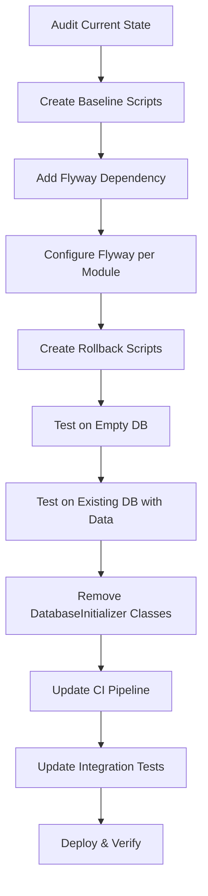

# Business Requirements Document (BRD)

## MCP Tool Orchestration — MTO-108: [Infra] Implement Flyway Database Migration — Replace DatabaseInitializer Pattern

---

## Document Information

| Field | Value |
|-------|-------|
| Jira Ticket | MTO-108 |
| Title | [Infra] Implement Flyway Database Migration — Replace DatabaseInitializer Pattern |
| Author | BA Agent |
| Version | 1.0 |
| Date | 2026-05-14 |
| Status | Draft |
| Type | Infrastructure / Tech Debt |
| Priority | High |
| Labels | infrastructure, database, tech-debt |

---

## Author Tracking

| Role | Name - Position | Responsibility |
|------|-----------------|----------------|
| Author | BA Agent – Business Analyst | Create document |
| Peer Reviewer | SA Agent – Solution Architect | Review technical feasibility |

---

## Revision History

| Version | Date | Author | Changes |
|---------|------|--------|---------|
| 1.0 | 2026-05-14 | BA Agent | Initiate document — auto-generated from Jira ticket MTO-108 and codebase analysis |

---

## Sign-Off

| Name | Signature and date |
|------|--------------------|
| | ☐ I agree and confirm all criteria on this BRD as expected requirements |
| | ☐ I agree and confirm all criteria on this BRD as expected requirements |

---

## 1. Introduction

### 1.1 Scope

This change request covers the migration from the current ad-hoc `DatabaseInitializer` pattern to the Flyway database migration framework across all MCP Orchestration modules that have database access.

**Current State (Problem):**
The project currently has **9 separate DatabaseInitializer/Migration classes** spread across 3 deployable modules. Each class independently manages its own schema by executing DDL statements directly during application startup. This approach has critical limitations:

- **No version tracking** — impossible to know which schema version is deployed
- **No migration ordering** — DDL execution order depends on Koin DI resolution order
- **No ALTER TABLE support** — only `CREATE TABLE IF NOT EXISTS` is used; schema evolution requires manual intervention
- **No rollback capability** — if a migration fails mid-way, the database is left in an inconsistent state
- **No backward compatibility guarantees** — breaking changes cannot be managed across releases
- **No CI/CD validation** — no way to verify migration state in pipelines
- **No audit trail** — no record of when schema changes were applied

**Target State (Solution):**
Replace all DatabaseInitializer classes with Flyway migration scripts, providing versioned, ordered, auditable, and rollback-capable database schema management.

**Affected Modules:**
- `orchestrator-server` (7 initializer classes, connects to orchestrator database)
- `orchestrator-client` (1 initializer class, connects to client/bridge database)
- `kb-server` (1 initializer class, connects to KB database)

### 1.2 Out of Scope

- Data migration between databases (e.g., moving tables from one DB to another)
- Database engine migration (PostgreSQL remains the target)
- Application logic changes (only schema management infrastructure changes)
- pgvector extension installation/upgrade (handled separately by DBA)
- Changes to HikariCP connection pooling configuration
- ORM introduction (project continues with raw SQL + DataSource pattern)

### 1.3 Preliminary Requirements

1. **PostgreSQL 14+** must be available in all environments (dev, staging, production)
2. **Flyway Community Edition** must be compatible with Kotlin/Gradle ecosystem
3. **Existing databases must NOT be wiped** — baseline migration must recognize existing schemas
4. **All 9 DatabaseInitializer classes** must be cataloged with their exact DDL statements before migration
5. **Steering rule** `.antigravity/steering/database-migration-rule.md` defines Flyway conventions for this project

---

## 2. Business Requirements

### 2.1 High Level Process Map

The migration follows a phased approach to ensure zero data loss and backward compatibility:



**Phase 1: Baseline** — Create Flyway migration scripts that match the current schema exactly (V1 scripts = current DDL).

**Phase 2: Integration** — Add Flyway dependency, configure auto-migration on startup, verify with both empty and populated databases.

**Phase 3: Cleanup** — Remove all DatabaseInitializer/Migration classes from production code. Update tests to use Flyway + Testcontainers.

**Phase 4: CI/CD** — Add `flywayValidate` step to CI pipeline. Add `flywayInfo` reporting.

### 2.2 List of User Stories / Use Cases

| # | Story / Use Case | Priority | Source |
|---|-----------------|----------|--------|
| 1 | As a Developer, I want database schema changes managed through versioned migration scripts so that I can track, review, and rollback schema changes | MUST HAVE | MTO-108 (AC1, AC2) |
| 2 | As a Developer, I want Flyway to run automatically on application startup so that schema is always up-to-date without manual intervention | MUST HAVE | MTO-108 (AC4) |
| 3 | As a DevOps Engineer, I want rollback scripts for every migration so that I can revert schema changes if a deployment fails | MUST HAVE | MTO-108 (AC6) |
| 4 | As a Developer, I want existing databases to migrate seamlessly without data loss so that production deployments are safe | MUST HAVE | MTO-108 (AC7, AC8) |
| 5 | As a DevOps Engineer, I want Flyway validation in the CI pipeline so that broken migrations are caught before deployment | MUST HAVE | MTO-108 (AC10) |
| 6 | As a Developer, I want integration tests to use Flyway with Testcontainers so that tests validate the actual migration path | SHOULD HAVE | MTO-108 (AC9) |
| 7 | As a DBA, I want clear migration ordering across modules so that cross-module dependencies are handled correctly | SHOULD HAVE | MTO-108 |
| 8 | As a Developer, I want all legacy DatabaseInitializer classes removed so that there is a single source of truth for schema management | MUST HAVE | MTO-108 (AC3) |

---

### 2.3 Details of User Stories

---

#### Business Flow

**Step 1:** Developer adds Flyway dependency to `build.gradle.kts` (root + per-module).

**Step 2:** Developer creates baseline migration scripts (`V1__*.sql`) by extracting DDL from existing DatabaseInitializer classes — one script per logical group.

**Step 3:** Developer creates corresponding rollback scripts (`U1__*.sql`) for each baseline migration.

**Step 4:** Developer configures Flyway in each module's application startup (HikariCP DataSource → Flyway.configure().dataSource(ds).load().migrate()).

**Step 5:** Developer runs Flyway against an existing database with `baseline-on-migrate=true` to mark V1 as already applied.

**Step 6:** Developer runs Flyway against an empty database to verify full schema creation from scratch.

**Step 7:** Developer removes all DatabaseInitializer/Migration classes from production code.

**Step 8:** Developer updates integration tests to use Flyway + Testcontainers instead of calling DatabaseInitializer directly.

**Step 9:** DevOps adds `./gradlew flywayValidate` step to CI workflow.

**Step 10:** Team verifies `./gradlew flywayInfo` shows correct migration state for all modules.

> **Note:** Steps 5 and 6 are critical validation gates. If either fails, the migration scripts must be corrected before proceeding.

---

#### STORY 1: Versioned Migration Scripts

> As a Developer, I want database schema changes managed through versioned migration scripts so that I can track, review, and rollback schema changes.

**Requirement Details:**

1. All existing DDL from the 9 DatabaseInitializer classes must be extracted into Flyway-compatible SQL scripts
2. Scripts must follow the naming convention defined in `.antigravity/steering/database-migration-rule.md`
3. Each module has its own migration directory: `{module}/src/main/resources/db/migration/`
4. Version numbering follows the steering rule ranges:
   - `orchestrator-server` core: V1–V99
   - `orchestrator-server` sync: V100–V199
   - `orchestrator-server` security: V200–V299
   - `orchestrator-server` user-mgmt: V300–V399
   - `kb-server`: V1–V99 (separate DB)
   - `orchestrator-client`: V1–V99 (separate DB)

**Current DatabaseInitializer Inventory:**

| # | Module | Class | Tables Created | Target Version |
|---|--------|-------|---------------|----------------|
| 1 | orchestrator-client | `DatabaseInitializer` | server_config, tool_toggle_state | V1 |
| 2 | orchestrator-server | `JiraSyncDatabaseInitializer` | jira_sync_state, jira_ticket_cache, jira_ticket_graph, jira_attachment_queue | V100 |
| 3 | orchestrator-server | `RlsDatabaseInitializer` | RLS policies, roles, security barrier views | V200 |
| 4 | orchestrator-server | `UserManagementMigration` | users, user_projects, role_permissions, approval_log | V300 |
| 5 | orchestrator-server | `FileProxyMigration` | file_proxy_* tables | V1 |
| 6 | orchestrator-server | `CredentialMigration` | credential_* tables | V2 |
| 7 | orchestrator-server | `SsoMigration` | sso_* tables | V3 |
| 8 | orchestrator-server | `AuthMigration` | auth_* tables | V4 |
| 9 | kb-server | `KbDatabaseInitializer` | kb_entries, pii_mapping, kb_audit_log, kb_entry_embeddings | V1 |

**Acceptance Criteria:**

1. ✅ AC1: Flyway dependency added to all modules with database access (`orchestrator-server`, `orchestrator-client`, `kb-server`)
2. ✅ AC2: Baseline migration scripts created for ALL existing tables — one `.sql` file per logical group
3. Every migration script includes a header comment with: author, ticket key, description
4. Migration scripts use `IF NOT EXISTS` / `IF EXISTS` for idempotency where applicable
5. `./gradlew flywayInfo` shows all migrations in correct order with status "Success" or "Baseline"

**Validation Rules:**

- Migration file names MUST match pattern: `V{version}__{description}.sql` (double underscore)
- Rollback file names MUST match pattern: `U{version}__{description}.sql`
- No two migrations within the same module may have the same version number
- SQL scripts must be valid PostgreSQL syntax
- Scripts must not contain application-specific logic (no Kotlin, no conditional branching beyond SQL)

---

#### STORY 2: Auto-Migration on Startup

> As a Developer, I want Flyway to run automatically on application startup so that schema is always up-to-date without manual intervention.

**Requirement Details:**

1. Each deployable module (`orchestrator-server`, `orchestrator-client/bridge`, `kb-server`) must configure Flyway to run `migrate()` during application startup
2. Flyway must use the same HikariCP DataSource already configured for the module
3. Migration must run BEFORE any repository or service attempts to access the database
4. If migration fails, the application must fail to start (fail-fast behavior)
5. Migration logs must be visible in application startup logs (INFO level)

**Configuration Requirements:**

| Parameter | Value | Rationale |
|-----------|-------|-----------|
| `baselineOnMigrate` | `true` (first deploy only) | Allows existing DBs to be baselined |
| `baselineVersion` | `0` | Baseline at version 0, so V1 scripts run on existing DBs |
| `locations` | `classpath:db/migration` | Standard Flyway location |
| `validateOnMigrate` | `true` | Detect tampered migrations |
| `cleanDisabled` | `true` | Prevent accidental `flyway clean` in production |
| `outOfOrder` | `false` | Enforce strict ordering |
| `table` | `flyway_schema_history` | Default Flyway metadata table |

**Acceptance Criteria:**

1. ✅ AC4: Flyway runs automatically on application startup for all 3 deployable modules
2. Application startup fails immediately if any migration fails
3. Flyway migration runs before Koin DI resolves any repository beans
4. Startup logs show: `Successfully applied N migrations to schema "public"`
5. No DatabaseInitializer code executes after Flyway is integrated

**Error Handling:**

- Migration failure → application exits with non-zero code + error log with failed script name and SQL error
- Connection failure → standard HikariCP timeout applies, then fail
- Checksum mismatch (tampered migration) → application refuses to start, logs which migration was modified

---

#### STORY 3: Rollback Scripts

> As a DevOps Engineer, I want rollback scripts for every migration so that I can revert schema changes if a deployment fails.

**Requirement Details:**

1. Every forward migration (`V{N}__*.sql`) must have a corresponding undo migration (`U{N}__*.sql`)
2. Rollback scripts must reverse the forward migration completely (DROP what was CREATEd, etc.)
3. Rollback scripts must be tested — applying V then U must leave the database in the pre-V state
4. Rollback scripts for baseline migrations must handle the case where tables contain data (use `CASCADE` or explicit data backup)

**Acceptance Criteria:**

1. ✅ AC6: Rollback scripts exist for each migration in `{module}/src/main/resources/db/migration/`
2. Running `flyway undo` successfully reverts the last applied migration
3. Rollback scripts are idempotent (safe to run multiple times)
4. Rollback of baseline migrations includes `DROP TABLE IF EXISTS ... CASCADE`

**Validation Rules:**

- Rollback scripts MUST NOT delete data without explicit backup/export step for production use
- Rollback scripts for tables with foreign keys must drop in correct dependency order
- Rollback of RLS policies must revoke roles before dropping policies

---

#### STORY 4: Seamless Migration of Existing Databases

> As a Developer, I want existing databases to migrate seamlessly without data loss so that production deployments are safe.

**Requirement Details:**

1. Existing databases (with data) must be recognized by Flyway as "already at baseline"
2. The `flyway_schema_history` table must be created and populated with baseline entries
3. No existing table must be dropped, altered, or have data modified during the initial Flyway adoption
4. After baseline, subsequent migrations (V2+) must apply cleanly on top of existing schema
5. Empty databases (new environments) must be fully initialized by running all migrations from V1

**Acceptance Criteria:**

1. ✅ AC7: Existing databases with data migrate successfully — zero data loss verified
2. ✅ AC8: Empty databases initialize correctly via Flyway — all tables created, all indexes present
3. `flyway_schema_history` table exists after first startup with Flyway
4. Running `flywayInfo` on existing DB shows V1 as "Baseline" (not "Pending")
5. Running `flywayInfo` on empty DB shows all versions as "Success"

**Error Handling:**

- If baseline detection fails (schema doesn't match expected V1 state) → application logs detailed diff and exits
- If partial schema exists (some tables present, others missing) → manual intervention required, documented in runbook

---

#### STORY 5: CI Pipeline Validation

> As a DevOps Engineer, I want Flyway validation in the CI pipeline so that broken migrations are caught before deployment.

**Requirement Details:**

1. CI workflow (`.github/workflows/ci.yml`) must include a Flyway validation step
2. Validation must check: script syntax, version ordering, checksum integrity
3. Validation must run against a fresh PostgreSQL instance (Testcontainers or service container)
4. Failed validation must block the PR from merging

**Acceptance Criteria:**

1. ✅ AC10: CI pipeline includes Flyway validation step
2. `./gradlew flywayValidate` runs successfully in CI
3. `./gradlew flywayInfo` output is logged in CI for visibility
4. PR with invalid migration script fails CI check
5. PR with duplicate version number fails CI check

---

#### STORY 6: Integration Tests with Flyway + Testcontainers

> As a Developer, I want integration tests to use Flyway with Testcontainers so that tests validate the actual migration path.

**Requirement Details:**

1. All existing integration tests that call `DatabaseInitializer.initialize()` must be refactored
2. Tests must use Testcontainers PostgreSQL + Flyway to set up schema (same path as production)
3. Test utilities/helpers should be provided for common setup patterns
4. Tests must verify both "fresh DB" and "migrated DB" scenarios

**Acceptance Criteria:**

1. ✅ AC9: Integration tests use Flyway (Testcontainers + Flyway) instead of DatabaseInitializer
2. No test file imports or references any DatabaseInitializer class
3. Test execution time does not increase by more than 20% (Testcontainers reuse)
4. A shared test utility class provides Flyway-initialized DataSource for tests

---

#### STORY 7: Multi-Module Migration Ordering

> As a DBA, I want clear migration ordering across modules so that cross-module dependencies are handled correctly.

**Requirement Details:**

1. Each module manages its own `flyway_schema_history` table (separate databases = separate histories)
2. For `orchestrator-server` (single database, multiple logical groups), version ranges prevent conflicts:
   - Core tables: V1–V99
   - Jira Sync tables: V100–V199
   - Security/RLS: V200–V299
   - User Management: V300–V399
3. Within a version range, migrations execute in numeric order
4. Cross-range dependencies must be documented (e.g., RLS V200 depends on User Management V300 tables existing)

**Acceptance Criteria:**

1. No version number conflicts exist within any module
2. `flywayInfo` shows all migrations in correct numeric order
3. Dependency documentation exists for cross-range references
4. New developers can understand the versioning scheme from the steering rule

---

#### STORY 8: Remove Legacy DatabaseInitializer Classes

> As a Developer, I want all legacy DatabaseInitializer classes removed so that there is a single source of truth for schema management.

**Requirement Details:**

1. All 9 DatabaseInitializer/Migration classes must be deleted from production source code
2. All Koin DI bindings for these classes must be removed
3. All startup code that calls `.initialize()` or `.migrate()` on these classes must be removed
4. Compilation must succeed with zero references to removed classes
5. Test code that directly tests DatabaseInitializer behavior should be converted to Flyway migration tests

**Classes to Remove:**

| File Path | Class |
|-----------|-------|
| `orchestrator-client/.../vectordb/DatabaseInitializer.kt` | `DatabaseInitializer` |
| `orchestrator-server/.../sync/JiraSyncDatabaseInitializer.kt` | `JiraSyncDatabaseInitializer` |
| `orchestrator-server/.../security/RlsDatabaseInitializer.kt` | `RlsDatabaseInitializer` |
| `orchestrator-server/.../security/RlsMigrationSql.kt` | `RlsMigrationSql` (SQL constants) |
| `orchestrator-server/.../usermanagement/migration/UserManagementMigration.kt` | `UserManagementMigration` |
| `orchestrator-server/.../fileproxy/FileProxyMigration.kt` | `FileProxyMigration` |
| `orchestrator-server/.../credentials/CredentialMigration.kt` | `CredentialMigration` |
| `orchestrator-server/.../auth/sso/SsoMigration.kt` | `SsoMigration` |
| `orchestrator-server/.../auth/AuthMigration.kt` | `AuthMigration` |
| `kb-server/.../store/database/KbDatabaseInitializer.kt` | `KbDatabaseInitializer` |

**DI Bindings to Remove (AppModule.kt, SecurityModule.kt, etc.):**

- `single { DatabaseInitializer(get()) }`
- `single { JiraSyncDatabaseInitializer(get()) }`
- `single { RlsDatabaseInitializer(get()) }`
- `single { UserManagementMigration(get()) }`
- `single { FileProxyMigration(get()) }`
- `single { KbDatabaseInitializer(get()) }`

**Startup Code to Remove (Application.kt, HttpStreamableServer.kt):**

- `dbInitializer.initialize()`
- `jiraSyncDbInitializer.initialize()`
- `fileProxyMigration.migrate()`
- `migration.migrate()` (UserManagement)
- `authMigration?.migrate()`
- `ssoMigration?.migrate()`
- `credentialMigration?.migrate()`
- `rlsInitializer.initialize()`

**Acceptance Criteria:**

1. ✅ AC3: All DatabaseInitializer / *Migration classes removed from production code
2. Project compiles successfully with zero references to removed classes
3. No DDL strings exist in Kotlin source code (all DDL lives in `.sql` files only)
4. `grep -r "CREATE TABLE" --include="*.kt" src/main/` returns zero results

---

## 3. Dependencies

| Dependency | Type | Description |
|------------|------|-------------|
| Flyway Core Library | External Library | `org.flywaydb:flyway-core` — must be added to Gradle dependencies |
| Flyway PostgreSQL Plugin | External Library | `org.flywaydb:flyway-database-postgresql` — PostgreSQL dialect support |
| Flyway Gradle Plugin | Build Tool | `org.flywaydb.flyway` Gradle plugin for CLI commands (`flywayInfo`, `flywayValidate`) |
| PostgreSQL 14+ | Infrastructure | Required for Flyway compatibility; already in use |
| Testcontainers | Testing | Already in use; must be configured to work with Flyway |
| HikariCP DataSource | Infrastructure | Already in use; Flyway will consume the same DataSource |
| CI Pipeline (GitHub Actions) | Infrastructure | `.github/workflows/ci.yml` must be updated |

---

## 4. Stakeholders

| Role | Name / Team | Responsibility | Source |
|------|-------------|----------------|--------|
| Developer | Dev Team | Implement migration scripts, remove legacy code, update tests | MTO-108 assignee |
| Solution Architect | SA Agent | Design migration strategy, version numbering, dependency ordering | Technical review |
| DevOps Engineer | DevOps Team | Update CI pipeline, deployment procedures, rollback runbooks | AC10 |
| DBA | Database Team | Verify migration scripts, validate rollback procedures, production deployment | AC7 |
| QA Engineer | QA Team | Validate integration tests, verify no regression | AC9 |

---

## 5. Risks and Assumptions

### 5.1 Risks

| Risk | Impact | Likelihood | Mitigation |
|------|--------|------------|------------|
| Baseline migration doesn't match actual production schema | High | Medium | Run `flywayInfo` against production DB copy before deployment; compare DDL output |
| Data loss during migration on existing databases | Critical | Low | Baseline migrations are CREATE IF NOT EXISTS only; no ALTER/DROP in V1; test on production clone |
| Version number conflicts between developers | Medium | Medium | Steering rule defines ranges; CI validates no duplicates; PR review catches conflicts |
| Flyway startup adds latency to application boot | Low | Low | Flyway checks are fast (< 1s for baseline check); only runs pending migrations |
| RLS policies depend on tables from other version ranges | High | High | Document cross-range dependencies; ensure V200 (RLS) runs after V300 (users) by using `dependsOn` or reordering |
| Testcontainers + Flyway increases test execution time | Medium | Medium | Use Testcontainers reuse mode (`testcontainers.reuse.enable=true`); share containers across test classes |
| Flyway Community Edition lacks `undo` command | High | Certain | Flyway Teams/Enterprise required for `flyway undo`; alternative: manual rollback scripts executed via custom Gradle task |

### 5.2 Assumptions

- All environments (dev, staging, production) run PostgreSQL 14 or higher
- The project will use Flyway Community Edition (free) unless `undo` is critical, in which case Flyway Teams license is needed
- Each deployable module connects to its own logical database (or schema), so migration histories are independent
- The `orchestrator-server` module uses a single database with version ranges to separate logical groups
- Existing production databases have schemas that exactly match the DDL in current DatabaseInitializer classes
- No other team or process modifies the database schema outside of this project's codebase
- The `pgvector` extension is pre-installed and will not be managed by Flyway (requires superuser)

---

## 6. Non-Functional Requirements

| Category | Requirement | Details |
|----------|-------------|---------|
| Performance | Migration execution time < 30 seconds | Baseline migrations on existing DB should complete in < 5s (no-op). Full migration on empty DB < 30s |
| Performance | Application startup overhead < 2 seconds | Flyway schema check adds minimal latency when no pending migrations exist |
| Reliability | Zero data loss during migration | Baseline migrations must not modify existing data; verified by integration tests |
| Reliability | Fail-fast on migration error | Application must not start if any migration fails; prevents serving requests with inconsistent schema |
| Maintainability | Single source of truth for DDL | All schema definitions live in `.sql` files under `db/migration/`; no DDL in Kotlin code |
| Maintainability | Clear versioning scheme | Version ranges per module/feature area; documented in steering rule |
| Testability | Migration path tested in CI | Every PR validates migrations against fresh PostgreSQL via Testcontainers |
| Security | No credentials in migration scripts | Database connection credentials come from environment variables / config, not from SQL scripts |
| Security | RLS policies preserved | Row-Level Security policies must be correctly migrated and functional after Flyway adoption |
| Backward Compatibility | Rolling deployment support | Migrations must be additive (no breaking changes in V1 baseline); old application version can still run against new schema |

---

## 7. Related Tickets

| Ticket Key | Summary | Type | Relationship |
|------------|---------|------|--------------|
| MTO-108 | [Infra] Implement Flyway database migration — replace DatabaseInitializer pattern | Story | Main ticket |
| MTO-95 | Auth module implementation | Story | Related — AuthMigration class to be replaced |
| MTO-96 | Credential management module | Story | Related — CredentialMigration class to be replaced |
| MTO-101 | SSO module implementation | Story | Related — SsoMigration class to be replaced |
| MTO-47 | Multi-dimensional Jira sync pipeline | Story | Related — sync-pipeline module uses DB tables managed by JiraSyncDatabaseInitializer |

---

## 8. Appendix

### Migration Script Directory Structure

```
orchestrator-server/src/main/resources/db/migration/
├── V1__core_file_proxy_tables.sql
├── V2__core_credential_tables.sql
├── V3__core_sso_tables.sql
├── V4__core_auth_tables.sql
├── V100__sync_jira_tables.sql
├── V200__security_rls_policies.sql
├── V300__usermgmt_tables.sql
├── U1__core_file_proxy_tables.sql
├── U2__core_credential_tables.sql
├── U3__core_sso_tables.sql
├── U4__core_auth_tables.sql
├── U100__sync_jira_tables.sql
├── U200__security_rls_policies.sql
└── U300__usermgmt_tables.sql

orchestrator-client/src/main/resources/db/migration/
├── V1__client_server_config.sql
└── U1__client_server_config.sql

kb-server/src/main/resources/db/migration/
├── V1__kb_entries_and_embeddings.sql
└── U1__kb_entries_and_embeddings.sql
```

### Flyway Configuration Example (Kotlin)

```kotlin
// In module startup, BEFORE Koin DI resolution
val flyway = Flyway.configure()
    .dataSource(hikariDataSource)
    .locations("classpath:db/migration")
    .baselineOnMigrate(true)
    .baselineVersion("0")
    .validateOnMigrate(true)
    .cleanDisabled(true)
    .load()

flyway.migrate()
```

### Gradle Plugin Configuration

```kotlin
// build.gradle.kts (per module)
plugins {
    id("org.flywaydb.flyway") version "10.x.x"
}

flyway {
    url = "jdbc:postgresql://localhost:5432/mcp_orchestrator"
    user = System.getenv("DB_USER") ?: "postgres"
    password = System.getenv("DB_PASSWORD") ?: "postgres"
    locations = arrayOf("classpath:db/migration")
}
```

### Glossary

| Term | Definition |
|------|------------|
| Flyway | Open-source database migration tool that manages versioned SQL scripts |
| Baseline | The initial state of an existing database; Flyway marks it as "already applied" |
| Forward Migration | A `V{N}__*.sql` script that applies a schema change |
| Undo/Rollback Migration | A `U{N}__*.sql` script that reverses a forward migration |
| Schema History Table | `flyway_schema_history` — Flyway's metadata table tracking applied migrations |
| DatabaseInitializer | Legacy pattern in this project where Kotlin classes execute DDL on startup |
| Version Range | Reserved numeric ranges per feature area to prevent version conflicts |
| Idempotent | A migration that can be safely run multiple times without side effects |

### Reference Documents

| Document | Link / Location |
|----------|-----------------|
| Flyway Documentation | https://documentation.red-gate.com/flyway |
| Database Migration Steering Rule | `.antigravity/steering/database-migration-rule.md` |
| Project Structure | `.analysis/code-intelligence/project-structure.md` |
| CI Workflow | `.github/workflows/ci.yml` |
| Flyway Gradle Plugin | https://documentation.red-gate.com/flyway/flyway-cli-and-api/usage/gradle-task |

### Rollback Strategy Decision

> **Important:** Flyway Community Edition does NOT support the `flyway undo` command. The team must decide:
>
> **Option A:** Use Flyway Teams (paid license) for native `undo` support.
>
> **Option B:** Create manual rollback scripts (`U{N}__*.sql`) and execute them via a custom Gradle task or direct `psql` execution. This is the recommended approach for this project given the infrastructure/open-source nature.
>
> **Recommendation:** Option B — custom Gradle task that reads `U{N}` scripts and applies them in reverse order. This keeps the project on the free tier while still providing rollback capability.
