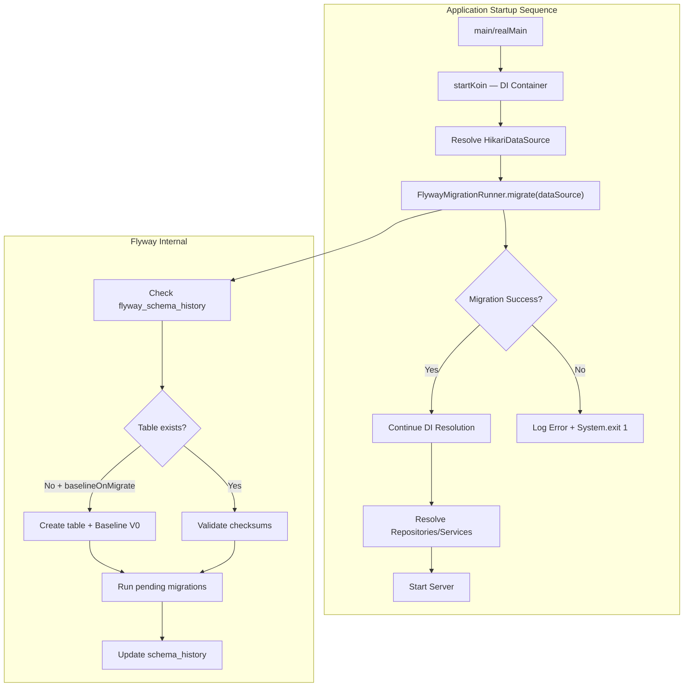
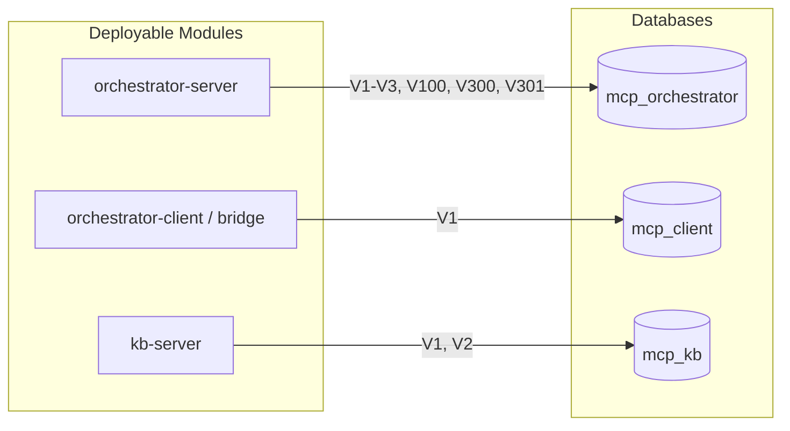
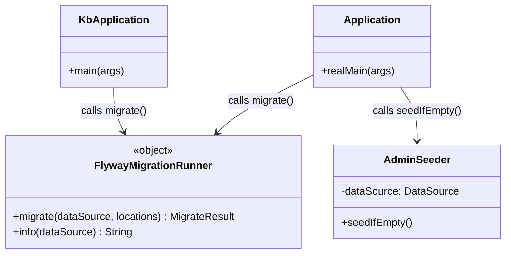

# Technical Design Document (TDD)

## MCP Tool Orchestration — MTO-108: [Infra] Implement Flyway Database Migration — Replace DatabaseInitializer Pattern

---

## Document Information

| Field | Value |
|-------|-------|
| Jira Ticket | MTO-108 |
| Title | [Infra] Implement Flyway Database Migration — Replace DatabaseInitializer Pattern |
| Author | SA Agent |
| Version | 1.0 |
| Date | 2026-07-06 |
| Status | Draft |
| Related BRD | documents/MTO-108/BRD.md |
| Type | Infrastructure / Tech Debt |

---

## Revision History

| Version | Date | Author | Changes |
|---------|------|--------|---------|
| 1.0 | 2026-07-06 | SA Agent | Initial TDD — Flyway migration design from BRD + codebase analysis |

---

## 1. Introduction

### 1.1 Purpose

This TDD specifies the technical implementation for replacing all 9 `DatabaseInitializer`/`*Migration` classes with Flyway-managed SQL migration scripts. It covers Flyway configuration, migration script content (extracted verbatim from existing code), rollback strategy, CI/CD integration, and test infrastructure changes.

### 1.2 Scope

| In Scope | Out of Scope |
|----------|-------------|
| Flyway dependency addition (core + PostgreSQL plugin) | pgvector extension management |
| Migration scripts for all 3 databases | Data migration between databases |
| Custom Gradle rollback task | Flyway Teams/Enterprise license |
| CI pipeline validation step | ORM introduction |
| Testcontainers + Flyway test utilities | Application logic changes |
| Removal of 9 legacy classes | HikariCP configuration changes |

### 1.3 Technology Stack

| Layer | Technology | Version |
|-------|-----------|---------|
| Language | Kotlin | 2.3.20 |
| Framework | Ktor | 3.4.0 |
| DI | Koin | 4.1.1 |
| Database | PostgreSQL | 14+ (pgvector/pgvector:pg16 in CI) |
| Connection Pool | HikariCP | 5.1.0 |
| Migration Tool | **Flyway (NEW)** | 10.22.0 |
| Build Tool | Gradle (Kotlin DSL) | Version catalog |
| CI/CD | GitHub Actions | — |
| Testing | Testcontainers | 1.21.4 |

### 1.4 Design Principles

- **Single Source of Truth** — All DDL lives in `.sql` files under `db/migration/`; zero DDL in Kotlin code
- **Fail-Fast** — Application refuses to start if migration fails
- **Idempotent Baseline** — Existing databases are baselined without modification
- **Backward Compatible** — V1 baseline scripts use `CREATE TABLE IF NOT EXISTS` for safety
- **Auditable** — `flyway_schema_history` tracks every migration with timestamp and checksum

### 1.5 Constraints

- Flyway Community Edition (free) — NO `flyway undo` command available
- Custom Gradle task required for rollback (reads `U{N}__*.sql` scripts)
- `pgvector` extension NOT managed by Flyway (requires superuser privileges)
- `baselineOnMigrate=true` for first deployment on existing databases
- `cleanDisabled=true` always (prevent accidental data wipe)
- PostgreSQL 14+ required in all environments

### 1.6 References

| Document | Location |
|----------|----------|
| BRD | `documents/MTO-108/BRD.md` |
| Database Migration Steering Rule | `.antigravity/steering/database-migration-rule.md` |
| Project Structure | `.analysis/code-intelligence/project-structure.md` |

---

## 2. System Architecture

### 2.1 Architecture Overview — Flyway Integration

Flyway integrates into the application startup sequence **before** Koin DI resolves any repository or service beans. Each deployable module runs Flyway against its own database independently.



### 2.2 Module-Database Mapping



Each database has its own independent `flyway_schema_history` table.

### 2.3 Migration Script Organization

```
orchestrator-server/src/main/resources/db/migration/
├── V1__core_file_proxy_tables.sql          (Core: V1–V99)
├── V2__core_credential_tables.sql
├── V3__core_sso_config.sql
├── V100__sync_jira_tables.sql              (Sync: V100–V199)
├── V300__usermgmt_tables.sql               (User Mgmt: V300–V399)
├── V301__auth_columns_and_bridge_tokens.sql
├── U1__core_file_proxy_tables.sql          (Rollback scripts)
├── U2__core_credential_tables.sql
├── U3__core_sso_config.sql
├── U100__sync_jira_tables.sql
├── U300__usermgmt_tables.sql
└── U301__auth_columns_and_bridge_tokens.sql

orchestrator-client/src/main/resources/db/migration/
├── V1__client_server_config.sql
└── U1__client_server_config.sql

kb-server/src/main/resources/db/migration/
├── V1__kb_entries_and_embeddings.sql
├── V2__security_rls_policies.sql
├── U1__kb_entries_and_embeddings.sql
└── U2__security_rls_policies.sql
```

### 2.4 Dependency Ordering (Critical)

**Problem:** The original BRD assigns V200 (RLS) to `orchestrator-server`, but RLS policies reference `kb_entries` and `pii_mapping` tables which exist in the **kb-server database**. Also, V4 (Auth) adds columns to `users` table created by V300.

**Resolution:**
1. Move RLS migration from orchestrator-server to **kb-server as V2** (correct database)
2. Renumber Auth migration from V4 to **V301** (must run after V300 creates `users` table)

**Final orchestrator-server execution order:**
1. V1 → file_proxy_registry
2. V2 → credential_schemas, user_credentials
3. V3 → sso_config
4. V100 → jira sync tables (4 tables)
5. V300 → users, user_projects, role_permissions, approval_log
6. V301 → ALTER users (auth columns) + bridge_tokens

**Final kb-server execution order:**
1. V1 → kb_entries, pii_mapping, kb_audit_log, kb_entry_embeddings
2. V2 → RLS roles, policies, security barrier views

---

## 3. API Design (Gradle Tasks)

### 3.1 Gradle Tasks Overview

| # | Task | Command | Description |
|---|------|---------|-------------|
| 1 | flywayInfo | `./gradlew :{module}:flywayInfo` | Show migration status |
| 2 | flywayMigrate | `./gradlew :{module}:flywayMigrate` | Apply pending migrations |
| 3 | flywayValidate | `./gradlew :{module}:flywayValidate` | Validate checksums |
| 4 | flywayBaseline | `./gradlew :{module}:flywayBaseline` | Baseline existing DB |
| 5 | **flywayUndo** | `./gradlew :{module}:flywayUndo -PundoVersion=N` | **Custom** — rollback |

### 3.2 Custom Gradle Task: `flywayUndo`

Since Flyway Community Edition does not support `flyway undo`, a custom Gradle task reads `U{N}__*.sql` rollback scripts and executes them.

```kotlin
// Per-module build.gradle.kts
tasks.register("flywayUndo") {
    group = "flyway"
    description = "Execute rollback script for specified version (Community Edition workaround)"
    doLast {
        val version = project.findProperty("undoVersion")?.toString()
            ?: throw GradleException("Usage: ./gradlew flywayUndo -PundoVersion=300")

        val migrationDir = file("src/main/resources/db/migration")
        val undoScript = migrationDir.listFiles()
            ?.find { it.name.startsWith("U${version}__") && it.extension == "sql" }
            ?: throw GradleException("Rollback script U${version}__*.sql not found")

        val dbUrl = System.getenv("DB_URL")
            ?: flyway.url ?: "jdbc:postgresql://localhost:5432/mcp_orchestrator"
        val dbUser = System.getenv("DB_USER") ?: flyway.user ?: "postgres"
        val dbPassword = System.getenv("DB_PASSWORD") ?: flyway.password ?: "postgres"

        java.sql.DriverManager.getConnection(dbUrl, dbUser, dbPassword).use { conn ->
            conn.autoCommit = false
            try {
                conn.createStatement().use { it.execute(undoScript.readText()) }
                conn.createStatement().use {
                    it.execute("DELETE FROM flyway_schema_history WHERE version = '$version'")
                }
                conn.commit()
                println("✅ Rollback V$version applied: ${undoScript.name}")
            } catch (e: Exception) {
                conn.rollback()
                throw GradleException("❌ Rollback failed: ${e.message}", e)
            }
        }
    }
}
```

**Usage:**
```bash
./gradlew :orchestrator-server:flywayUndo -PundoVersion=301
./gradlew :kb-server:flywayUndo -PundoVersion=2
```

---

## 4. Database Design

### 4.1 Schema Overview

#### orchestrator-server database (`mcp_orchestrator`)

| Version | Tables | Source Class |
|---------|--------|-------------|
| V1 | file_proxy_registry | FileProxyMigration |
| V2 | credential_schemas, user_credentials | CredentialMigration |
| V3 | sso_config | SsoMigration |
| V100 | jira_sync_state, jira_ticket_cache, jira_ticket_graph, jira_attachment_queue | JiraSyncDatabaseInitializer |
| V300 | users, user_projects, role_permissions, approval_log | UserManagementMigration |
| V301 | ALTER users + bridge_tokens | AuthMigration |

#### orchestrator-client database (`mcp_client`)

| Version | Tables | Source Class |
|---------|--------|-------------|
| V1 | server_config, tool_toggle_state | DatabaseInitializer |

#### kb-server database (`mcp_kb`)

| Version | Tables | Source Class |
|---------|--------|-------------|
| V1 | kb_entries, pii_mapping, kb_audit_log, kb_entry_embeddings | KbDatabaseInitializer |
| V2 | RLS roles, policies, security barrier views | RlsDatabaseInitializer |


### 4.2 DDL Scripts — Full Migration Content

#### 4.2.1 orchestrator-server: `V1__core_file_proxy_tables.sql`

```sql
-- V1__core_file_proxy_tables.sql
-- Author: SA Agent (extracted from FileProxyMigration.kt)
-- Ticket: MTO-108
-- Description: File proxy registry table for tracking file transfers

CREATE TABLE IF NOT EXISTS file_proxy_registry (
    file_id UUID PRIMARY KEY,
    session_id UUID NOT NULL,
    file_path VARCHAR(500) NOT NULL,
    file_name VARCHAR(255),
    file_size BIGINT,
    real_tool_name VARCHAR(255),
    upstream_server VARCHAR(255),
    direction VARCHAR(10) NOT NULL DEFAULT 'INPUT',
    status VARCHAR(20) NOT NULL DEFAULT 'PENDING',
    created_at TIMESTAMP NOT NULL DEFAULT NOW(),
    processed_at TIMESTAMP,
    CONSTRAINT chk_direction CHECK (direction IN ('INPUT', 'OUTPUT')),
    CONSTRAINT chk_status CHECK (status IN ('PENDING', 'PROCESSED', 'FAILED', 'EXPIRED'))
);

CREATE INDEX IF NOT EXISTS idx_file_proxy_session ON file_proxy_registry(session_id);
CREATE INDEX IF NOT EXISTS idx_file_proxy_status ON file_proxy_registry(status);
CREATE INDEX IF NOT EXISTS idx_file_proxy_created ON file_proxy_registry(created_at);
```

#### 4.2.2 orchestrator-server: `V2__core_credential_tables.sql`

```sql
-- V2__core_credential_tables.sql
-- Author: SA Agent (extracted from CredentialMigration.kt)
-- Ticket: MTO-108
-- Description: Credential schema definitions and encrypted user credentials

CREATE TABLE IF NOT EXISTS credential_schemas (
    id TEXT PRIMARY KEY,
    server_name TEXT NOT NULL,
    field_key TEXT NOT NULL,
    field_label TEXT NOT NULL,
    field_type TEXT NOT NULL DEFAULT 'text',
    field_required BOOLEAN NOT NULL DEFAULT true,
    field_description TEXT,
    field_placeholder TEXT,
    display_order INTEGER NOT NULL DEFAULT 0,
    created_at TEXT NOT NULL DEFAULT to_char(NOW(), 'YYYY-MM-DD"T"HH24:MI:SS"Z"'),
    updated_at TEXT NOT NULL DEFAULT to_char(NOW(), 'YYYY-MM-DD"T"HH24:MI:SS"Z"'),
    CONSTRAINT uq_credential_schemas_server_key UNIQUE (server_name, field_key),
    CONSTRAINT chk_field_type CHECK (field_type IN ('url', 'email', 'secret', 'text', 'number'))
);

CREATE INDEX IF NOT EXISTS idx_credential_schemas_server ON credential_schemas(server_name);

CREATE TABLE IF NOT EXISTS user_credentials (
    id TEXT PRIMARY KEY,
    user_id TEXT NOT NULL,
    server_name TEXT NOT NULL,
    credentials_encrypted TEXT NOT NULL,
    created_at TEXT NOT NULL DEFAULT to_char(NOW(), 'YYYY-MM-DD"T"HH24:MI:SS"Z"'),
    updated_at TEXT NOT NULL DEFAULT to_char(NOW(), 'YYYY-MM-DD"T"HH24:MI:SS"Z"'),
    CONSTRAINT uq_user_credentials_user_server UNIQUE (user_id, server_name)
);

CREATE INDEX IF NOT EXISTS idx_user_credentials_user ON user_credentials(user_id);
CREATE INDEX IF NOT EXISTS idx_user_credentials_server ON user_credentials(server_name);

-- Ensure mcp_servers has unique name index
CREATE UNIQUE INDEX IF NOT EXISTS idx_mcp_servers_name ON mcp_servers(name);
```

#### 4.2.3 orchestrator-server: `V3__core_sso_config.sql`

```sql
-- V3__core_sso_config.sql
-- Author: SA Agent (extracted from SsoMigration.kt)
-- Ticket: MTO-108
-- Description: SSO configuration singleton table

CREATE TABLE IF NOT EXISTS sso_config (
    id INTEGER PRIMARY KEY DEFAULT 1,
    config_json TEXT NOT NULL,
    updated_at TEXT NOT NULL,
    CONSTRAINT sso_config_singleton CHECK (id = 1)
);
```

#### 4.2.4 orchestrator-server: `V100__sync_jira_tables.sql`

```sql
-- V100__sync_jira_tables.sql
-- Author: SA Agent (extracted from JiraSyncDatabaseInitializer.kt)
-- Ticket: MTO-108
-- Description: Jira sync state, ticket cache, graph, and attachment queue

CREATE TABLE IF NOT EXISTS jira_sync_state (
    project_key VARCHAR(50) PRIMARY KEY,
    last_sync_at TIMESTAMPTZ,
    last_offset INTEGER NOT NULL DEFAULT 0,
    total_issues INTEGER NOT NULL DEFAULT 0,
    synced_issues INTEGER NOT NULL DEFAULT 0,
    status VARCHAR(20) NOT NULL DEFAULT 'IDLE',
    error_message TEXT,
    updated_at TIMESTAMPTZ NOT NULL DEFAULT NOW(),
    CONSTRAINT chk_sync_status CHECK (status IN ('IDLE','RUNNING','PAUSED','COMPLETED','FAILED')),
    CONSTRAINT chk_offset_non_negative CHECK (last_offset >= 0),
    CONSTRAINT chk_total_non_negative CHECK (total_issues >= 0),
    CONSTRAINT chk_synced_non_negative CHECK (synced_issues >= 0)
);

CREATE TABLE IF NOT EXISTS jira_ticket_cache (
    ticket_key VARCHAR(50) PRIMARY KEY,
    project_key VARCHAR(50) NOT NULL,
    summary TEXT NOT NULL,
    issue_type VARCHAR(50) NOT NULL,
    status VARCHAR(50) NOT NULL,
    priority VARCHAR(20),
    parent_key VARCHAR(50),
    epic_key VARCHAR(50),
    labels JSONB,
    created_at TIMESTAMPTZ,
    updated_at_jira TIMESTAMPTZ NOT NULL,
    synced_at TIMESTAMPTZ NOT NULL DEFAULT NOW(),
    content_hash VARCHAR(64) NOT NULL,
    description TEXT,
    comments_json JSONB,
    kb_ingested BOOLEAN NOT NULL DEFAULT FALSE
);

CREATE TABLE IF NOT EXISTS jira_ticket_graph (
    source_key VARCHAR(50) NOT NULL,
    target_key VARCHAR(50) NOT NULL,
    link_type VARCHAR(100) NOT NULL,
    category VARCHAR(20) NOT NULL,
    PRIMARY KEY (source_key, target_key, link_type),
    CONSTRAINT chk_graph_category CHECK (category IN ('INWARD','OUTWARD','SUBTASK','EPIC'))
);

CREATE TABLE IF NOT EXISTS jira_attachment_queue (
    id SERIAL PRIMARY KEY,
    ticket_key VARCHAR(50) NOT NULL,
    attachment_id VARCHAR(50) NOT NULL,
    filename VARCHAR(500) NOT NULL,
    mime_type VARCHAR(100),
    size_bytes BIGINT,
    download_url TEXT NOT NULL,
    status VARCHAR(20) NOT NULL DEFAULT 'PENDING',
    retry_count INTEGER NOT NULL DEFAULT 0,
    error_message TEXT,
    created_at TIMESTAMPTZ NOT NULL DEFAULT NOW(),
    processed_at TIMESTAMPTZ,
    CONSTRAINT chk_attachment_status CHECK (status IN ('PENDING','DOWNLOADING','PROCESSING','DONE','FAILED')),
    CONSTRAINT chk_retry_non_negative CHECK (retry_count >= 0),
    CONSTRAINT uq_ticket_attachment UNIQUE (ticket_key, attachment_id)
);

CREATE INDEX IF NOT EXISTS idx_ticket_cache_project ON jira_ticket_cache (project_key);
CREATE INDEX IF NOT EXISTS idx_ticket_cache_updated ON jira_ticket_cache (updated_at_jira);
CREATE INDEX IF NOT EXISTS idx_ticket_cache_not_ingested ON jira_ticket_cache (kb_ingested) WHERE kb_ingested = FALSE;
CREATE INDEX IF NOT EXISTS idx_ticket_cache_labels ON jira_ticket_cache USING GIN (labels);
CREATE INDEX IF NOT EXISTS idx_ticket_graph_source ON jira_ticket_graph (source_key);
CREATE INDEX IF NOT EXISTS idx_ticket_graph_target ON jira_ticket_graph (target_key);
CREATE INDEX IF NOT EXISTS idx_attachment_queue_status ON jira_attachment_queue (status);
CREATE INDEX IF NOT EXISTS idx_attachment_queue_ticket ON jira_attachment_queue (ticket_key);
CREATE INDEX IF NOT EXISTS idx_attachment_queue_pending ON jira_attachment_queue (status, created_at) WHERE status = 'PENDING';
```

#### 4.2.5 orchestrator-server: `V300__usermgmt_tables.sql`

```sql
-- V300__usermgmt_tables.sql
-- Author: SA Agent (extracted from UserManagementMigration.kt)
-- Ticket: MTO-108
-- Description: User management — users, projects, permissions, approval log

CREATE TABLE IF NOT EXISTS users (
    id UUID PRIMARY KEY DEFAULT gen_random_uuid(),
    email VARCHAR(255) NOT NULL UNIQUE,
    jira_token_encrypted TEXT NOT NULL DEFAULT '',
    role VARCHAR(20) NOT NULL,
    display_name VARCHAR(100) NOT NULL,
    created_by UUID REFERENCES users(id),
    active BOOLEAN NOT NULL DEFAULT true,
    created_at TIMESTAMPTZ NOT NULL DEFAULT NOW(),
    updated_at TIMESTAMPTZ NOT NULL DEFAULT NOW()
);

CREATE INDEX IF NOT EXISTS idx_users_email ON users(email);
CREATE INDEX IF NOT EXISTS idx_users_role ON users(role);
CREATE INDEX IF NOT EXISTS idx_users_active ON users(active);

CREATE TABLE IF NOT EXISTS user_projects (
    id UUID PRIMARY KEY DEFAULT gen_random_uuid(),
    user_id UUID NOT NULL REFERENCES users(id) ON DELETE CASCADE,
    project_key VARCHAR(20) NOT NULL,
    granted_by UUID NOT NULL REFERENCES users(id),
    granted_at TIMESTAMPTZ NOT NULL DEFAULT NOW(),
    UNIQUE(user_id, project_key)
);

CREATE INDEX IF NOT EXISTS idx_user_projects_user ON user_projects(user_id);
CREATE INDEX IF NOT EXISTS idx_user_projects_project ON user_projects(project_key);

CREATE TABLE IF NOT EXISTS role_permissions (
    id UUID PRIMARY KEY DEFAULT gen_random_uuid(),
    role VARCHAR(20) NOT NULL,
    document_type VARCHAR(20) NOT NULL,
    can_view BOOLEAN NOT NULL DEFAULT true,
    can_approve BOOLEAN NOT NULL DEFAULT false,
    UNIQUE(role, document_type)
);

CREATE INDEX IF NOT EXISTS idx_role_permissions_role ON role_permissions(role);

CREATE TABLE IF NOT EXISTS approval_log (
    id UUID PRIMARY KEY DEFAULT gen_random_uuid(),
    ticket_key VARCHAR(20) NOT NULL,
    document_type VARCHAR(20) NOT NULL,
    document_version INTEGER NOT NULL,
    user_id UUID NOT NULL REFERENCES users(id),
    decision VARCHAR(10) NOT NULL,
    comment TEXT,
    jira_synced BOOLEAN NOT NULL DEFAULT false,
    created_at TIMESTAMPTZ NOT NULL DEFAULT NOW()
);

CREATE INDEX IF NOT EXISTS idx_approval_log_ticket ON approval_log(ticket_key, document_type);
CREATE INDEX IF NOT EXISTS idx_approval_log_user ON approval_log(user_id);
CREATE INDEX IF NOT EXISTS idx_approval_log_pending ON approval_log(jira_synced) WHERE jira_synced = false;
```

#### 4.2.6 orchestrator-server: `V301__auth_columns_and_bridge_tokens.sql`

```sql
-- V301__auth_columns_and_bridge_tokens.sql
-- Author: SA Agent (extracted from AuthMigration.kt)
-- Ticket: MTO-108
-- Description: Auth columns on users table + bridge_tokens table
-- Depends on: V300 (users table must exist)

ALTER TABLE users ADD COLUMN IF NOT EXISTS password_hash TEXT;
ALTER TABLE users ADD COLUMN IF NOT EXISTS auth_mode TEXT NOT NULL DEFAULT 'local';
ALTER TABLE users ADD COLUMN IF NOT EXISTS failed_login_attempts INTEGER NOT NULL DEFAULT 0;
ALTER TABLE users ADD COLUMN IF NOT EXISTS locked_until TEXT;

CREATE TABLE IF NOT EXISTS bridge_tokens (
    id TEXT PRIMARY KEY,
    user_id TEXT NOT NULL,
    token_hash TEXT NOT NULL,
    expires_at TEXT NOT NULL,
    revoked BOOLEAN NOT NULL DEFAULT false,
    created_at TEXT NOT NULL DEFAULT to_char(NOW(), 'YYYY-MM-DD"T"HH24:MI:SS"Z"')
);

CREATE INDEX IF NOT EXISTS idx_bridge_tokens_hash ON bridge_tokens(token_hash);
CREATE INDEX IF NOT EXISTS idx_bridge_tokens_user ON bridge_tokens(user_id);
CREATE INDEX IF NOT EXISTS idx_bridge_tokens_active ON bridge_tokens(user_id, revoked) WHERE revoked = false;
```

> **Note:** Admin user seeding (from AuthMigration.kt) is NOT in migration scripts — it depends on env vars and BCrypt. Moved to `AdminSeeder.kt` (see Section 5.3).

#### 4.2.7 orchestrator-client: `V1__client_server_config.sql`

```sql
-- V1__client_server_config.sql
-- Author: SA Agent (extracted from orchestrator-client DatabaseInitializer.kt)
-- Ticket: MTO-108
-- Description: Server config and tool toggle state for client/bridge

CREATE TABLE IF NOT EXISTS server_config (
    server_name VARCHAR(255) PRIMARY KEY,
    transport VARCHAR(50) NOT NULL,
    command TEXT,
    args JSONB,
    env_keys JSONB,
    url TEXT,
    disabled BOOLEAN DEFAULT FALSE,
    tool_filter JSONB,
    auto_approve JSONB,
    is_active BOOLEAN DEFAULT TRUE,
    synced_at TIMESTAMPTZ DEFAULT NOW()
);

CREATE TABLE IF NOT EXISTS tool_toggle_state (
    id SERIAL PRIMARY KEY,
    session_id VARCHAR(255) NOT NULL,
    tool_name VARCHAR(255),
    server_name VARCHAR(255),
    enabled BOOLEAN NOT NULL,
    updated_at TIMESTAMPTZ DEFAULT NOW()
);

CREATE UNIQUE INDEX IF NOT EXISTS idx_uq_session_tool ON tool_toggle_state (session_id, tool_name) WHERE tool_name IS NOT NULL;
CREATE UNIQUE INDEX IF NOT EXISTS idx_uq_session_server ON tool_toggle_state (session_id, server_name) WHERE server_name IS NOT NULL;
```

#### 4.2.8 kb-server: `V1__kb_entries_and_embeddings.sql`

```sql
-- V1__kb_entries_and_embeddings.sql
-- Author: SA Agent (extracted from KbDatabaseInitializer.kt)
-- Ticket: MTO-108
-- Description: KB core tables — entries, PII mapping, audit log, vector embeddings
-- Note: pgvector extension must be pre-installed by DBA (requires superuser)

CREATE EXTENSION IF NOT EXISTS vector;

CREATE TABLE IF NOT EXISTS kb_entries (
    id UUID PRIMARY KEY DEFAULT gen_random_uuid(),
    issue_key VARCHAR(50) NOT NULL UNIQUE,
    project_key VARCHAR(20) NOT NULL,
    public_content TEXT,
    technical_content TEXT,
    business_rules BYTEA,
    masked_full TEXT,
    br_sensitivity_level INTEGER NOT NULL DEFAULT 2,
    content_hash VARCHAR(64) NOT NULL,
    created_at TIMESTAMPTZ NOT NULL DEFAULT NOW(),
    updated_at TIMESTAMPTZ NOT NULL DEFAULT NOW(),
    last_synced_at TIMESTAMPTZ
);

CREATE TABLE IF NOT EXISTS pii_mapping (
    id UUID PRIMARY KEY DEFAULT gen_random_uuid(),
    issue_key VARCHAR(50) NOT NULL,
    placeholder VARCHAR(100) NOT NULL,
    original_value BYTEA NOT NULL,
    mapping_type VARCHAR(30) NOT NULL,
    created_at TIMESTAMPTZ NOT NULL DEFAULT NOW()
);

CREATE TABLE IF NOT EXISTS kb_audit_log (
    id BIGSERIAL PRIMARY KEY,
    event_type VARCHAR(30) NOT NULL,
    user_id VARCHAR(100),
    issue_key VARCHAR(50),
    action VARCHAR(100),
    success BOOLEAN NOT NULL DEFAULT TRUE,
    metadata TEXT,
    timestamp TIMESTAMPTZ NOT NULL DEFAULT NOW()
);

CREATE TABLE IF NOT EXISTS kb_entry_embeddings (
    id UUID PRIMARY KEY DEFAULT gen_random_uuid(),
    issue_key VARCHAR(50) NOT NULL,
    project_key VARCHAR(20) NOT NULL,
    content_hash VARCHAR(64),
    embedding vector(768) NOT NULL,
    search_text TEXT,
    created_at TIMESTAMPTZ NOT NULL DEFAULT NOW(),
    updated_at TIMESTAMPTZ NOT NULL DEFAULT NOW(),
    CONSTRAINT uq_kb_embeddings_issue UNIQUE (issue_key)
);

CREATE INDEX IF NOT EXISTS idx_kb_entries_project ON kb_entries (project_key);
CREATE INDEX IF NOT EXISTS idx_kb_entries_hash ON kb_entries (project_key, content_hash);
CREATE INDEX IF NOT EXISTS idx_pii_mapping_issue ON pii_mapping (issue_key);
CREATE INDEX IF NOT EXISTS idx_audit_log_type ON kb_audit_log (event_type);
CREATE INDEX IF NOT EXISTS idx_audit_log_issue ON kb_audit_log (issue_key);
CREATE INDEX IF NOT EXISTS idx_audit_log_timestamp ON kb_audit_log (timestamp);
CREATE INDEX IF NOT EXISTS idx_kb_embeddings_hnsw ON kb_entry_embeddings USING hnsw (embedding vector_cosine_ops) WITH (m = 16, ef_construction = 64);
CREATE INDEX IF NOT EXISTS idx_kb_embeddings_project ON kb_entry_embeddings (project_key);
```

#### 4.2.9 kb-server: `V2__security_rls_policies.sql`

```sql
-- V2__security_rls_policies.sql
-- Author: SA Agent (extracted from RlsDatabaseInitializer.kt + RlsMigrationSql.kt)
-- Ticket: MTO-108
-- Description: Row-Level Security — roles, policies, security barrier views
-- Depends on: V1 (kb_entries and pii_mapping must exist)

DO $$
BEGIN
    IF NOT EXISTS (SELECT FROM pg_roles WHERE rolname = 'kb_developer') THEN
        CREATE ROLE kb_developer NOLOGIN;
    END IF;
    IF NOT EXISTS (SELECT FROM pg_roles WHERE rolname = 'kb_admin') THEN
        CREATE ROLE kb_admin NOLOGIN;
    END IF;
    IF NOT EXISTS (SELECT FROM pg_roles WHERE rolname = 'kb_viewer') THEN
        CREATE ROLE kb_viewer NOLOGIN;
    END IF;
END
$$;

GRANT USAGE ON SCHEMA public TO kb_developer, kb_admin, kb_viewer;

ALTER TABLE kb_entries ENABLE ROW LEVEL SECURITY;
ALTER TABLE kb_entries FORCE ROW LEVEL SECURITY;

DO $$
BEGIN
    IF NOT EXISTS (SELECT 1 FROM pg_policies WHERE policyname = 'policy_kb_admin_all') THEN
        CREATE POLICY policy_kb_admin_all ON kb_entries FOR ALL TO kb_admin USING (true) WITH CHECK (true);
    END IF;
    IF NOT EXISTS (SELECT 1 FROM pg_policies WHERE policyname = 'policy_kb_developer_select') THEN
        CREATE POLICY policy_kb_developer_select ON kb_entries FOR SELECT TO kb_developer USING (true);
    END IF;
    IF NOT EXISTS (SELECT 1 FROM pg_policies WHERE policyname = 'policy_kb_viewer_select') THEN
        CREATE POLICY policy_kb_viewer_select ON kb_entries FOR SELECT TO kb_viewer USING (true);
    END IF;
END
$$;

CREATE OR REPLACE VIEW kb_entries_developer_view WITH (security_barrier = true) AS
SELECT id, issue_key, public_content, technical_content, masked_full, created_at, updated_at FROM kb_entries;
GRANT SELECT ON kb_entries_developer_view TO kb_developer;

CREATE OR REPLACE VIEW kb_entries_admin_view WITH (security_barrier = true) AS
SELECT * FROM kb_entries;
GRANT SELECT, INSERT, UPDATE, DELETE ON kb_entries_admin_view TO kb_admin;

CREATE OR REPLACE VIEW kb_entries_viewer_view WITH (security_barrier = true) AS
SELECT id, issue_key, masked_full FROM kb_entries;
GRANT SELECT ON kb_entries_viewer_view TO kb_viewer;

ALTER TABLE pii_mapping ENABLE ROW LEVEL SECURITY;
ALTER TABLE pii_mapping FORCE ROW LEVEL SECURITY;

DO $$
BEGIN
    IF NOT EXISTS (SELECT 1 FROM pg_policies WHERE policyname = 'policy_pii_admin_only') THEN
        CREATE POLICY policy_pii_admin_only ON pii_mapping FOR ALL TO kb_admin USING (true) WITH CHECK (true);
    END IF;
END
$$;

GRANT SELECT, INSERT, UPDATE ON pii_mapping TO kb_admin;
```

### 4.3 Rollback Scripts

#### `U1__core_file_proxy_tables.sql` (orchestrator-server)

```sql
DROP INDEX IF EXISTS idx_file_proxy_created;
DROP INDEX IF EXISTS idx_file_proxy_status;
DROP INDEX IF EXISTS idx_file_proxy_session;
DROP TABLE IF EXISTS file_proxy_registry CASCADE;
```

#### `U2__core_credential_tables.sql` (orchestrator-server)

```sql
DROP INDEX IF EXISTS idx_user_credentials_server;
DROP INDEX IF EXISTS idx_user_credentials_user;
DROP TABLE IF EXISTS user_credentials CASCADE;
DROP INDEX IF EXISTS idx_credential_schemas_server;
DROP TABLE IF EXISTS credential_schemas CASCADE;
DROP INDEX IF EXISTS idx_mcp_servers_name;
```

#### `U3__core_sso_config.sql` (orchestrator-server)

```sql
DROP TABLE IF EXISTS sso_config CASCADE;
```

#### `U100__sync_jira_tables.sql` (orchestrator-server)

```sql
DROP INDEX IF EXISTS idx_attachment_queue_pending;
DROP INDEX IF EXISTS idx_attachment_queue_ticket;
DROP INDEX IF EXISTS idx_attachment_queue_status;
DROP INDEX IF EXISTS idx_ticket_graph_target;
DROP INDEX IF EXISTS idx_ticket_graph_source;
DROP INDEX IF EXISTS idx_ticket_cache_labels;
DROP INDEX IF EXISTS idx_ticket_cache_not_ingested;
DROP INDEX IF EXISTS idx_ticket_cache_updated;
DROP INDEX IF EXISTS idx_ticket_cache_project;
DROP TABLE IF EXISTS jira_attachment_queue CASCADE;
DROP TABLE IF EXISTS jira_ticket_graph CASCADE;
DROP TABLE IF EXISTS jira_ticket_cache CASCADE;
DROP TABLE IF EXISTS jira_sync_state CASCADE;
```

#### `U300__usermgmt_tables.sql` (orchestrator-server)

```sql
-- WARNING: Deletes all user data!
DROP INDEX IF EXISTS idx_approval_log_pending;
DROP INDEX IF EXISTS idx_approval_log_user;
DROP INDEX IF EXISTS idx_approval_log_ticket;
DROP TABLE IF EXISTS approval_log CASCADE;
DROP INDEX IF EXISTS idx_role_permissions_role;
DROP TABLE IF EXISTS role_permissions CASCADE;
DROP INDEX IF EXISTS idx_user_projects_project;
DROP INDEX IF EXISTS idx_user_projects_user;
DROP TABLE IF EXISTS user_projects CASCADE;
DROP INDEX IF EXISTS idx_users_active;
DROP INDEX IF EXISTS idx_users_role;
DROP INDEX IF EXISTS idx_users_email;
DROP TABLE IF EXISTS users CASCADE;
```

#### `U301__auth_columns_and_bridge_tokens.sql` (orchestrator-server)

```sql
DROP INDEX IF EXISTS idx_bridge_tokens_active;
DROP INDEX IF EXISTS idx_bridge_tokens_user;
DROP INDEX IF EXISTS idx_bridge_tokens_hash;
DROP TABLE IF EXISTS bridge_tokens CASCADE;
ALTER TABLE users DROP COLUMN IF EXISTS locked_until;
ALTER TABLE users DROP COLUMN IF EXISTS failed_login_attempts;
ALTER TABLE users DROP COLUMN IF EXISTS auth_mode;
ALTER TABLE users DROP COLUMN IF EXISTS password_hash;
```

#### `U1__client_server_config.sql` (orchestrator-client)

```sql
DROP INDEX IF EXISTS idx_uq_session_server;
DROP INDEX IF EXISTS idx_uq_session_tool;
DROP TABLE IF EXISTS tool_toggle_state CASCADE;
DROP TABLE IF EXISTS server_config CASCADE;
```

#### `U1__kb_entries_and_embeddings.sql` (kb-server)

```sql
-- WARNING: Deletes all KB data!
DROP INDEX IF EXISTS idx_kb_embeddings_project;
DROP INDEX IF EXISTS idx_kb_embeddings_hnsw;
DROP INDEX IF EXISTS idx_audit_log_timestamp;
DROP INDEX IF EXISTS idx_audit_log_issue;
DROP INDEX IF EXISTS idx_audit_log_type;
DROP INDEX IF EXISTS idx_pii_mapping_issue;
DROP INDEX IF EXISTS idx_kb_entries_hash;
DROP INDEX IF EXISTS idx_kb_entries_project;
DROP TABLE IF EXISTS kb_entry_embeddings CASCADE;
DROP TABLE IF EXISTS kb_audit_log CASCADE;
DROP TABLE IF EXISTS pii_mapping CASCADE;
DROP TABLE IF EXISTS kb_entries CASCADE;
```

#### `U2__security_rls_policies.sql` (kb-server)

```sql
REVOKE ALL ON kb_entries_viewer_view FROM kb_viewer;
REVOKE ALL ON kb_entries_admin_view FROM kb_admin;
REVOKE ALL ON kb_entries_developer_view FROM kb_developer;
REVOKE SELECT, INSERT, UPDATE ON pii_mapping FROM kb_admin;
DROP VIEW IF EXISTS kb_entries_viewer_view;
DROP VIEW IF EXISTS kb_entries_admin_view;
DROP VIEW IF EXISTS kb_entries_developer_view;
DROP POLICY IF EXISTS policy_pii_admin_only ON pii_mapping;
DROP POLICY IF EXISTS policy_kb_viewer_select ON kb_entries;
DROP POLICY IF EXISTS policy_kb_developer_select ON kb_entries;
DROP POLICY IF EXISTS policy_kb_admin_all ON kb_entries;
ALTER TABLE pii_mapping DISABLE ROW LEVEL SECURITY;
ALTER TABLE kb_entries DISABLE ROW LEVEL SECURITY;
REVOKE USAGE ON SCHEMA public FROM kb_developer, kb_admin, kb_viewer;
DROP ROLE IF EXISTS kb_viewer;
DROP ROLE IF EXISTS kb_admin;
DROP ROLE IF EXISTS kb_developer;
```

### 4.4 Flyway Configuration

| Parameter | Value | Rationale |
|-----------|-------|-----------|
| `baselineOnMigrate` | `true` | First deploy on existing DB |
| `baselineVersion` | `0` | So V1+ scripts run on existing DBs |
| `validateOnMigrate` | `true` | Detect tampered scripts |
| `cleanDisabled` | `true` | Prevent accidental wipe |
| `outOfOrder` | `false` | Strict numeric ordering |
| `connectRetries` | `3` | Retry on transient failures |
| `table` | `flyway_schema_history` | Default metadata table |


---

## 5. Class / Module Design

### 5.1 New Class: `FlywayMigrationRunner`

**Location:** `orchestrator-core/src/main/kotlin/com/orchestrator/mcp/core/migration/FlywayMigrationRunner.kt`

```kotlin
package com.orchestrator.mcp.core.migration

import org.flywaydb.core.Flyway
import org.flywaydb.core.api.output.MigrateResult
import org.slf4j.LoggerFactory
import javax.sql.DataSource

/**
 * Centralized Flyway migration runner.
 * Must be called BEFORE any repository or service accesses the database.
 */
object FlywayMigrationRunner {

    private val logger = LoggerFactory.getLogger(javaClass)

    fun migrate(
        dataSource: DataSource,
        locations: List<String> = listOf("classpath:db/migration")
    ): MigrateResult {
        logger.info("Starting Flyway migration (locations: {})", locations)
        val flyway = Flyway.configure()
            .dataSource(dataSource)
            .locations(*locations.toTypedArray())
            .baselineOnMigrate(true)
            .baselineVersion("0")
            .validateOnMigrate(true)
            .cleanDisabled(true)
            .outOfOrder(false)
            .connectRetries(3)
            .load()
        val result = flyway.migrate()
        logger.info(
            "Flyway migration completed: {} applied, version: {}",
            result.migrationsExecuted, result.targetSchemaVersion
        )
        return result
    }

    fun info(dataSource: DataSource): String {
        val flyway = Flyway.configure()
            .dataSource(dataSource)
            .locations("classpath:db/migration")
            .baselineOnMigrate(true)
            .baselineVersion("0")
            .cleanDisabled(true)
            .load()
        val info = flyway.info()
        return "applied=${info.applied().size}, pending=${info.pending().size}, current=${info.current()?.version ?: "none"}"
    }
}
```

### 5.2 Modified: Application Startup

#### orchestrator-server `Application.kt` — Replace:

```kotlin
// BEFORE (remove these lines):
val dbInitializer = koin.get<DatabaseInitializer>()
val jiraSyncDbInitializer = koin.get<JiraSyncDatabaseInitializer>()
val fileProxyMigration = koin.get<FileProxyMigration>()
try { dbInitializer.initialize() } catch (e: Exception) { ... }
try { jiraSyncDbInitializer.initialize() } catch (e: Exception) { ... }
try { fileProxyMigration.migrate() } catch (e: Exception) { ... }

// AFTER (add this BEFORE any service resolution):
import com.orchestrator.mcp.core.migration.FlywayMigrationRunner
val dataSource = koin.get<HikariDataSource>()
try {
    FlywayMigrationRunner.migrate(dataSource)
} catch (e: Exception) {
    logger.error("FATAL: Database migration failed", e)
    System.exit(1)
}
```

#### orchestrator-server `HttpStreamableServer.kt` — Remove from `runUserManagementStartup()`:

```kotlin
// REMOVE all of these:
migration.migrate()
authMigration?.migrate()
ssoMigration?.migrate()
credentialMigration?.migrate()

// KEEP (data seeding, not schema):
permissionService.seedIfEmpty()
```

### 5.3 New Class: `AdminSeeder`

**Location:** `orchestrator-server/src/main/kotlin/com/orchestrator/mcp/auth/AdminSeeder.kt`

Extracted from `AuthMigration.kt` — seeds default admin user when `users` table is empty. Called after Flyway migration, not inside SQL scripts (depends on env vars + BCrypt).

```kotlin
package com.orchestrator.mcp.auth

import at.favre.lib.crypto.bcrypt.BCrypt
import org.slf4j.LoggerFactory
import javax.sql.DataSource

class AdminSeeder(private val dataSource: DataSource) {
    private val logger = LoggerFactory.getLogger(javaClass)

    fun seedIfEmpty() {
        dataSource.connection.use { conn ->
            val count = conn.createStatement().use { stmt ->
                stmt.executeQuery("SELECT COUNT(*) FROM users")
                    .use { rs -> rs.next(); rs.getInt(1) }
            }
            if (count > 0) return

            val email = System.getenv("ADMIN_EMAIL") ?: "admin@localhost"
            val password = System.getenv("ADMIN_PASSWORD") ?: "admin123"
            val name = System.getenv("ADMIN_NAME") ?: "Administrator"
            val hash = BCrypt.withDefaults().hashToString(12, password.toCharArray())

            conn.prepareStatement("""
                INSERT INTO users (id, email, role, display_name, active, password_hash, auth_mode, jira_token_encrypted)
                VALUES (gen_random_uuid(), ?, 'SYSTEM_OWNER', ?, true, ?, 'local', '')
            """.trimIndent()).use { stmt ->
                stmt.setString(1, email)
                stmt.setString(2, name)
                stmt.setString(3, hash)
                stmt.executeUpdate()
            }
            logger.warn("Seeded default admin: email={}", email)
        }
    }
}
```

### 5.4 Deleted Classes (10 files)

| # | File | Replacement |
|---|------|-------------|
| 1 | `orchestrator-client/.../vectordb/DatabaseInitializer.kt` | V1__client_server_config.sql |
| 2 | `orchestrator-server/.../sync/JiraSyncDatabaseInitializer.kt` | V100__sync_jira_tables.sql |
| 3 | `orchestrator-server/.../security/RlsDatabaseInitializer.kt` | kb-server V2__security_rls_policies.sql |
| 4 | `orchestrator-server/.../security/RlsMigrationSql.kt` | kb-server V2__security_rls_policies.sql |
| 5 | `orchestrator-server/.../usermanagement/migration/UserManagementMigration.kt` | V300__usermgmt_tables.sql |
| 6 | `orchestrator-server/.../fileproxy/FileProxyMigration.kt` | V1__core_file_proxy_tables.sql |
| 7 | `orchestrator-server/.../credentials/CredentialMigration.kt` | V2__core_credential_tables.sql |
| 8 | `orchestrator-server/.../auth/sso/SsoMigration.kt` | V3__core_sso_config.sql |
| 9 | `orchestrator-server/.../auth/AuthMigration.kt` | V301 + AdminSeeder.kt |
| 10 | `kb-server/.../store/database/KbDatabaseInitializer.kt` | V1__kb_entries_and_embeddings.sql |

### 5.5 DI Module Changes (`AppModule.kt`)

```kotlin
// REMOVE:
single { DatabaseInitializer(get()) }
single { JiraSyncDatabaseInitializer(get()) }
single { RlsDatabaseInitializer(get()) }
single { UserManagementMigration(get()) }
single { FileProxyMigration(get()) }
single { CredentialMigration(get()) }
single { SsoMigration(get()) }
single { AuthMigration(get()) }

// ADD:
single { AdminSeeder(get()) }
```

### 5.6 Class Diagram



---

## 6. Integration Test Design

### 6.1 Test Utility: `FlywayTestSupport`

**Location:** `orchestrator-core/src/test/kotlin/com/orchestrator/mcp/core/test/FlywayTestSupport.kt`

```kotlin
package com.orchestrator.mcp.core.test

import com.orchestrator.mcp.core.migration.FlywayMigrationRunner
import com.zaxxer.hikari.HikariConfig
import com.zaxxer.hikari.HikariDataSource
import org.testcontainers.containers.PostgreSQLContainer
import org.testcontainers.utility.DockerImageName

object FlywayTestSupport {

    private val pgImage = DockerImageName.parse("pgvector/pgvector:pg16")
        .asCompatibleSubstituteFor("postgres")

    fun createMigratedDataSource(
        locations: List<String> = listOf("classpath:db/migration")
    ): HikariDataSource {
        val container = PostgreSQLContainer(pgImage)
            .withDatabaseName("test_db")
            .withUsername("test")
            .withPassword("test")
            .withReuse(true)
        container.start()

        val ds = HikariDataSource(HikariConfig().apply {
            jdbcUrl = container.jdbcUrl
            username = container.username
            password = container.password
            maximumPoolSize = 5
        })
        FlywayMigrationRunner.migrate(ds, locations)
        return ds
    }
}
```

### 6.2 Migration Validation Test

```kotlin
class FlywayMigrationTest : FunSpec({
    test("all migrations apply on empty database") {
        val ds = FlywayTestSupport.createMigratedDataSource()
        val flyway = Flyway.configure().dataSource(ds)
            .locations("classpath:db/migration").load()
        flyway.info().pending().size shouldBe 0
        flyway.info().failed().size shouldBe 0
    }
})
```

---

## 7. CI/CD Integration

### 7.1 Updated `.github/workflows/ci.yml`

Add after "Build all modules" step:

```yaml
      # Flyway validation
      - name: Validate Flyway migrations
        run: ./gradlew :orchestrator-server:flywayValidate
        env:
          DB_URL: jdbc:postgresql://localhost:5432/mcp_test
          DB_USER: postgres
          DB_PASSWORD: postgres

      - name: Flyway info
        run: ./gradlew :orchestrator-server:flywayInfo
        env:
          DB_URL: jdbc:postgresql://localhost:5432/mcp_test
          DB_USER: postgres
          DB_PASSWORD: postgres
```

### 7.2 CI Checks

| Check | Failure Behavior |
|-------|-----------------|
| `flywayValidate` — syntax, checksums, ordering | Blocks PR merge |
| `./gradlew test` — Testcontainers migration tests | Blocks PR merge |
| `flywayInfo` — migration status | Advisory (logged) |

---

## 8. Deployment

### 8.1 First Deployment (Existing Database)

1. Deploy new application version with Flyway
2. Flyway detects no `flyway_schema_history` → creates it, baselines at V0
3. Runs V1–V301 — all use `IF NOT EXISTS` (no-op on existing schema)
4. Records all as "Success" in history
5. Verify: `./gradlew flywayInfo` shows all versions as Success/Baseline

### 8.2 New Environment (Empty Database)

1. Create databases: `mcp_orchestrator`, `mcp_client`, `mcp_kb`
2. Install pgvector: `psql -d mcp_kb -c "CREATE EXTENSION IF NOT EXISTS vector;"`
3. Deploy application — Flyway creates all tables from scratch

### 8.3 Rollback Procedure

```bash
./gradlew :orchestrator-server:flywayUndo -PundoVersion=301
./gradlew :orchestrator-server:flywayInfo  # verify
# Deploy previous application version
```

### 8.4 Environment Configuration

| Property | DEV | CI | PROD |
|----------|-----|-----|------|
| `DB_URL` | localhost:5432/mcp_orchestrator | localhost:5432/mcp_test | vault |
| `baselineOnMigrate` | true | true | true (first deploy) |
| `cleanDisabled` | true | true | true |

---

## 9. Monitoring & Observability

### 9.1 Logging

| Event | Level | Pattern |
|-------|-------|---------|
| Migration start | INFO | `Starting Flyway migration (locations: [...])` |
| Migration success | INFO | `Flyway migration completed: N applied, version: X` |
| Migration failure | ERROR | `FATAL: Database migration failed` |

### 9.2 Health Check

Add to `/health` endpoint: `FlywayMigrationRunner.info(dataSource)` → `"applied=7, pending=0, current=V301"`

---

## 10. Gradle Dependency Changes

### 10.1 Version Catalog (`gradle/libs.versions.toml`)

```toml
[versions]
flyway = "10.22.0"

[libraries]
flyway-core = { module = "org.flywaydb:flyway-core", version.ref = "flyway" }
flyway-postgresql = { module = "org.flywaydb:flyway-database-postgresql", version.ref = "flyway" }

[plugins]
flyway = { id = "org.flywaydb.flyway", version.ref = "flyway" }
```

### 10.2 `orchestrator-core/build.gradle.kts`

```kotlin
dependencies {
    api(libs.flyway.core)
    api(libs.flyway.postgresql)
}
```

### 10.3 Per-module `build.gradle.kts` (orchestrator-server, orchestrator-client, kb-server)

```kotlin
plugins {
    alias(libs.plugins.flyway)
}

flyway {
    url = System.getenv("DB_URL") ?: "jdbc:postgresql://localhost:5432/{db_name}"
    user = System.getenv("DB_USER") ?: "postgres"
    password = System.getenv("DB_PASSWORD") ?: "postgres"
    locations = arrayOf("classpath:db/migration")
    baselineOnMigrate = true
    baselineVersion = "0"
    cleanDisabled = true
}

buildscript {
    dependencies {
        classpath(libs.flyway.postgresql)
        classpath(libs.postgresql)
    }
}
```

---

## 11. Implementation Checklist

### Phase 1: Baseline

- [ ] Add Flyway to version catalog
- [ ] Add `flyway-core` + `flyway-postgresql` to `orchestrator-core`
- [ ] Create `FlywayMigrationRunner` in `orchestrator-core`
- [ ] Create all V{N}__.sql scripts (9 files across 3 modules)
- [ ] Create all U{N}__.sql rollback scripts (9 files)
- [ ] Verify on empty DB: all tables created
- [ ] Verify on existing DB: baseline applied, no-op

### Phase 2: Integration

- [ ] Modify `Application.kt` — add Flyway, remove legacy calls
- [ ] Modify `HttpStreamableServer.kt` — remove migration calls
- [ ] Modify KB server startup — add Flyway
- [ ] Modify client/bridge startup — add Flyway
- [ ] Create `AdminSeeder.kt`
- [ ] Verify application starts on both empty and existing DBs

### Phase 3: Cleanup

- [ ] Delete 10 legacy files
- [ ] Remove Koin DI bindings
- [ ] Remove startup migration calls
- [ ] Verify: `grep -r "CREATE TABLE" --include="*.kt" src/main/` = 0 results
- [ ] Verify: project compiles cleanly

### Phase 4: CI/CD

- [ ] Add `flywayValidate` to CI workflow
- [ ] Add `flywayUndo` custom task to all modules
- [ ] Update integration tests to use `FlywayTestSupport`
- [ ] Verify CI passes

---

## 12. Appendix

### 12.1 Open Questions

| # | Question | Status | Answer |
|---|----------|--------|--------|
| 1 | RLS migration in orchestrator-server or kb-server? | Resolved | kb-server (V2) — policies reference KB tables |
| 2 | Admin seeding in SQL or Kotlin? | Resolved | Kotlin (AdminSeeder) — depends on env vars + BCrypt |
| 3 | Auth migration version number? | Resolved | V301 (after V300 users table) |
| 4 | `mcp_servers` table migration? | Open | Currently created by ConfigDbSyncService — may need V5 |

### 12.2 Risk Mitigation

| Risk | Mitigation |
|------|-----------|
| V4 runs before V300 | Renumbered to V301 |
| pgvector CREATE EXTENSION fails | Pre-requisite; IF NOT EXISTS prevents error |
| Existing DB doesn't match V1 | All scripts use IF NOT EXISTS |
| `mcp_servers` not in migration | IF NOT EXISTS on index; table from ConfigDbSyncService |

