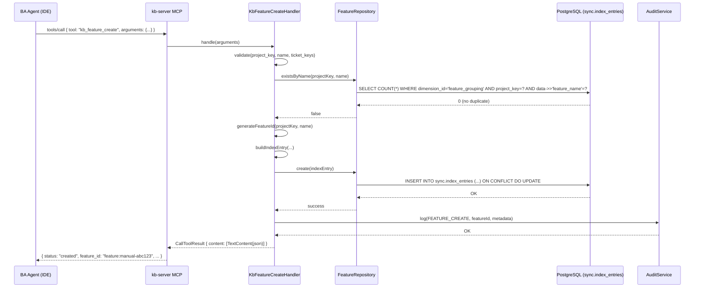
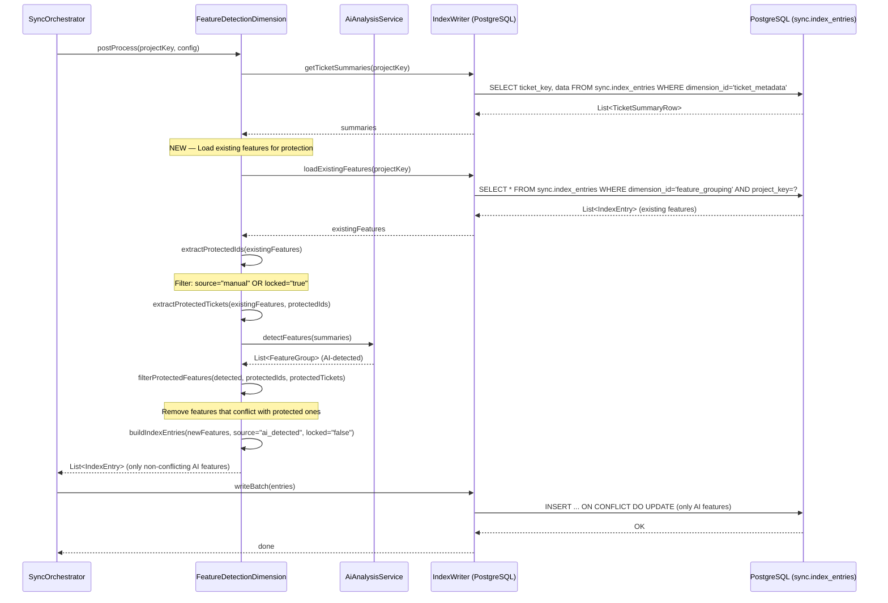
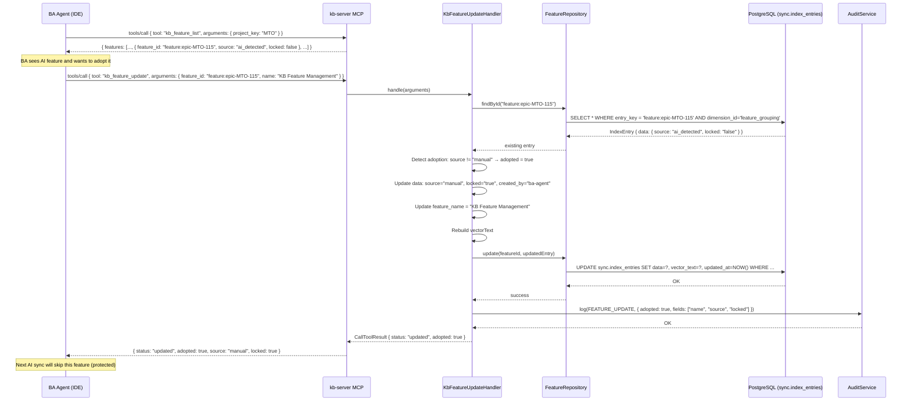

# Functional Specification Document (FSD)

## KB-Server — MTO-116: Feature CRUD Tools — BA + AI Collaborative Feature Management

---

## Document Information

| Field | Value |
|-------|-------|
| Jira Ticket | MTO-116 |
| Title | [KB-Server] Feature CRUD Tools — BA + AI Collaborative Feature Management |
| Author | TA Agent |
| Version | 1.0 |
| Date | 2026-07-08 |
| Status | Draft |
| Related BRD | documents/MTO-116/BRD.md (v1.0) |

---

## Revision History

| Version | Date | Author | Changes |
|---------|------|--------|---------|
| 1.0 | 2026-07-08 | TA Agent | Initial FSD — system design from BRD v1.0 |

---

## 1. System Overview

### 1.1 Purpose

This FSD specifies the technical design for five new MCP tools in `kb-server` that enable Business Analysts to manage project features collaboratively with AI-powered feature detection. It also specifies the AI protection algorithm changes in `sync-pipeline`.

### 1.2 Module Structure

```
kb-server/
└── src/main/kotlin/com/orchestrator/mcp/kb/
    ├── protocol/handlers/
    │   ├── feature/                          ← NEW package
    │   │   ├── KbFeatureListHandler.kt       ← kb_feature_list tool
    │   │   ├── KbFeatureCreateHandler.kt     ← kb_feature_create tool
    │   │   ├── KbFeatureUpdateHandler.kt     ← kb_feature_update tool
    │   │   ├── KbFeatureAssignHandler.kt     ← kb_feature_assign tool
    │   │   └── KbFeatureDeleteHandler.kt     ← kb_feature_delete tool
    │   └── HandlerUtils.kt                   (existing — shared utilities)
    ├── feature/                               ← NEW package
    │   ├── FeatureRepository.kt              ← Interface — feature CRUD operations
    │   ├── FeatureRepositoryImpl.kt          ← PostgreSQL implementation
    │   └── FeatureValidation.kt             ← Shared validation logic
    └── di/KbDiModule.kt                      (existing — add new bindings)

sync-pipeline/
└── src/main/kotlin/com/orchestrator/mcp/sync/pipeline/
    └── dimension/builtin/
        └── FeatureDetectionDimension.kt      ← MODIFIED — add AI protection
```

### 1.3 Tech Stack (Relevant)

| Component | Technology | Version |
|-----------|-----------|---------|
| Language | Kotlin | 2.3.20 |
| MCP SDK | io.modelcontextprotocol:kotlin-sdk-server | 0.12.0 |
| DI | Koin | 4.1.1 |
| Database | PostgreSQL (sync.index_entries) | — |
| Connection Pool | HikariCP | — |
| Serialization | kotlinx.serialization-json | 1.8.1 |
| Coroutines | kotlinx.coroutines | 1.10.2 |

### 1.4 Definitions & Acronyms

| Term | Definition |
|------|------------|
| Feature | Logical grouping of Jira tickets representing a business capability |
| Manual Feature | Feature created by BA via CRUD tools (source="manual") |
| AI-Detected Feature | Feature discovered by AI during sync (source="ai_detected") |
| Locked | Protection flag preventing AI from modifying a feature |
| Adoption | BA updates an AI feature → converts to manual/locked |
| IndexEntry | Universal record in sync.index_entries table |
| Dimension | Category of indexed data (e.g., "feature_grouping") |

### 1.5 References

| Document | Location |
|----------|----------|
| BRD | documents/MTO-116/BRD.md |
| IndexEntry Model | sync-pipeline/.../model/IndexEntry.kt |
| KbIngestHandler (pattern) | kb-server/.../protocol/handlers/KbIngestHandler.kt |
| FeatureDetectionDimension | sync-pipeline/.../dimension/builtin/FeatureDetectionDimension.kt |
| PostgresIndexWriter | sync-pipeline/.../storage/PostgresIndexWriter.kt |

---

## 2. System Architecture

### 2.1 Component Interaction

```
┌─────────────────────────────────────────────────────────────────┐
│                         MCP Client (IDE)                         │
│                    (BA Agent via Kiro/VS Code)                   │
└───────────────────────────────┬─────────────────────────────────┘
                                │ MCP Protocol (stdio/HTTP)
                                ▼
┌─────────────────────────────────────────────────────────────────┐
│                          kb-server                               │
│  ┌──────────────────────────────────────────────────────────┐   │
│  │ KbMcpServerFactory → KbToolRegistrar                      │   │
│  │   ├── KbFeatureListHandler                                │   │
│  │   ├── KbFeatureCreateHandler                              │   │
│  │   ├── KbFeatureUpdateHandler                              │   │
│  │   ├── KbFeatureAssignHandler                              │   │
│  │   └── KbFeatureDeleteHandler                              │   │
│  └──────────────────────────┬───────────────────────────────┘   │
│                             │                                    │
│  ┌──────────────────────────▼───────────────────────────────┐   │
│  │ FeatureRepository (Interface)                             │   │
│  │   └── FeatureRepositoryImpl (PostgreSQL)                  │   │
│  └──────────────────────────┬───────────────────────────────┘   │
│                             │                                    │
│  ┌──────────────────────────▼───────────────────────────────┐   │
│  │ AuditService (existing)                                   │   │
│  └──────────────────────────────────────────────────────────┘   │
└─────────────────────────────┬───────────────────────────────────┘
                              │ SQL (HikariCP)
                              ▼
┌─────────────────────────────────────────────────────────────────┐
│                    PostgreSQL Database                            │
│                  sync.index_entries table                         │
│            (dimension_id = 'feature_grouping')                   │
└─────────────────────────────────────────────────────────────────┘
                              ▲
                              │ SQL (HikariCP)
┌─────────────────────────────┴───────────────────────────────────┐
│                       sync-pipeline                               │
│  ┌──────────────────────────────────────────────────────────┐   │
│  │ FeatureDetectionDimension (MODIFIED)                      │   │
│  │   ├── loadExistingFeatures() ← NEW                        │   │
│  │   ├── filterProtectedFeatures() ← NEW                    │   │
│  │   └── postProcess() ← MODIFIED (add protection logic)    │   │
│  └──────────────────────────────────────────────────────────┘   │
└─────────────────────────────────────────────────────────────────┘
```


---

## 3. Functional Requirements

### 3.1 Feature: List All Features (kb_feature_list)

**Source:** BRD Story 1

#### 3.1.1 API Contract

| Property | Value |
|----------|-------|
| Tool Name | `kb_feature_list` |
| MCP Method | `tools/call` |
| Handler Class | `KbFeatureListHandler` |

**Input Schema:**

```json
{
  "type": "object",
  "properties": {
    "project_key": {
      "type": "string",
      "description": "Jira project key (e.g., 'MTO')",
      "pattern": "^[A-Z][A-Z0-9_]+$"
    }
  },
  "required": ["project_key"]
}
```

**Output Schema:**

```json
{
  "type": "object",
  "properties": {
    "features": {
      "type": "array",
      "items": {
        "type": "object",
        "properties": {
          "feature_id": { "type": "string" },
          "feature_name": { "type": "string" },
          "source": { "type": "string", "enum": ["manual", "ai_detected", "epic_hierarchy"] },
          "ticket_keys": { "type": "array", "items": { "type": "string" } },
          "description": { "type": "string", "nullable": true },
          "locked": { "type": "boolean" },
          "created_by": { "type": "string", "nullable": true },
          "detection_method": { "type": "string", "nullable": true },
          "confidence": { "type": "number", "nullable": true }
        }
      }
    },
    "total_count": { "type": "integer" },
    "project_key": { "type": "string" }
  }
}
```

#### 3.1.2 Business Logic (Pseudocode)

```
handle(arguments):
  1. projectKey = extractAndValidate(arguments, "project_key")
  2. Validate: projectKey matches [A-Z][A-Z0-9_]+
  3. entries = featureRepository.listByProject(projectKey)
  4. features = entries.map { toFeatureResponse(it) }
  5. Sort: manual first, then alphabetical by name
  6. auditService.log(FEATURE_LIST, projectKey)
  7. Return { features, total_count, project_key }
```

#### 3.1.3 Integration Points

| Component | Method | Purpose |
|-----------|--------|---------|
| FeatureRepository | `listByProject(projectKey)` | Query sync.index_entries |
| AuditService | `log(AuditEvent)` | Audit trail |

---

### 3.2 Feature: Create Feature (kb_feature_create)

**Source:** BRD Story 2

#### 3.2.1 API Contract

| Property | Value |
|----------|-------|
| Tool Name | `kb_feature_create` |
| MCP Method | `tools/call` |
| Handler Class | `KbFeatureCreateHandler` |

**Input Schema:**

```json
{
  "type": "object",
  "properties": {
    "project_key": {
      "type": "string",
      "description": "Target Jira project key",
      "pattern": "^[A-Z][A-Z0-9_]+$"
    },
    "name": {
      "type": "string",
      "description": "Feature name (max 200 chars)",
      "maxLength": 200
    },
    "ticket_keys": {
      "type": "array",
      "items": { "type": "string", "pattern": "^[A-Z]+-\\d+$" },
      "minItems": 1,
      "description": "Jira ticket keys belonging to this feature"
    },
    "description": {
      "type": "string",
      "description": "Optional feature description (max 2000 chars)",
      "maxLength": 2000
    }
  },
  "required": ["project_key", "name", "ticket_keys"]
}
```

**Output Schema:**

```json
{
  "type": "object",
  "properties": {
    "status": { "type": "string", "enum": ["created"] },
    "feature_id": { "type": "string" },
    "feature_name": { "type": "string" },
    "ticket_keys": { "type": "array", "items": { "type": "string" } },
    "source": { "type": "string", "const": "manual" },
    "locked": { "type": "boolean", "const": true }
  }
}
```

#### 3.2.2 Business Logic (Pseudocode)

```
handle(arguments):
  1. projectKey = validate(arguments, "project_key")
  2. name = validate(arguments, "name", maxLen=200)
  3. ticketKeys = validate(arguments, "ticket_keys", minSize=1, pattern=[A-Z]+-\d+)
  4. description = optional(arguments, "description", maxLen=2000)
  5. Check duplicate: featureRepository.existsByName(projectKey, name)
     → if exists: throw FEATURE_DUPLICATE_ERROR
  6. featureId = generateFeatureId(projectKey, name)
     → "feature:manual-" + sha256(projectKey + name).take(12)
  7. entryKey = "feature:$featureId"
  8. id = UUID.nameUUIDFromBytes(entryKey.toByteArray())
  9. Build IndexEntry:
     - dimensionId = "feature_grouping"
     - projectKey = projectKey
     - ticketKey = null
     - entryKey = entryKey
     - sourceRef = SourceRef(type="manual", path="manual:feature/$featureId", syncedAt=now())
     - data = { source="manual", created_by="ba-agent", locked="true",
                feature_id=featureId, feature_name=name,
                ticket_keys=ticketKeys.joinToString(","),
                description=description, detection_method="manual", confidence=null }
     - vectorText = "Feature: $name. Tickets: ${ticketKeys.joinToString(", ")}"
  10. featureRepository.create(entry)
  11. auditService.log(FEATURE_CREATE, featureId)
  12. Return success response
```

#### 3.2.3 Feature ID Generation

```kotlin
private fun generateFeatureId(projectKey: String, name: String): String {
    val input = "$projectKey:$name"
    val hash = MessageDigest.getInstance("SHA-256")
        .digest(input.toByteArray(Charsets.UTF_8))
        .joinToString("") { "%02x".format(it) }
        .take(12)
    return "manual-$hash"
}
```


---

### 3.3 Feature: Update Feature (kb_feature_update)

**Source:** BRD Story 3

#### 3.3.1 API Contract

| Property | Value |
|----------|-------|
| Tool Name | `kb_feature_update` |
| MCP Method | `tools/call` |
| Handler Class | `KbFeatureUpdateHandler` |

**Input Schema:**

```json
{
  "type": "object",
  "properties": {
    "feature_id": {
      "type": "string",
      "description": "Feature ID to update (e.g., 'feature:manual-abc123')"
    },
    "name": {
      "type": "string",
      "description": "New feature name (max 200 chars)",
      "maxLength": 200
    },
    "ticket_keys": {
      "type": "array",
      "items": { "type": "string", "pattern": "^[A-Z]+-\\d+$" },
      "minItems": 1,
      "description": "Replace ticket list"
    },
    "description": {
      "type": "string",
      "description": "New description (max 2000 chars)",
      "maxLength": 2000
    }
  },
  "required": ["feature_id"]
}
```

**Output Schema:**

```json
{
  "type": "object",
  "properties": {
    "status": { "type": "string", "enum": ["updated"] },
    "feature_id": { "type": "string" },
    "updated_fields": { "type": "array", "items": { "type": "string" } },
    "source": { "type": "string" },
    "locked": { "type": "boolean" },
    "adopted": { "type": "boolean", "description": "true if AI feature was adopted by BA" }
  }
}
```

#### 3.3.2 Business Logic (Pseudocode)

```
handle(arguments):
  1. featureId = validate(arguments, "feature_id")
  2. name = optional(arguments, "name", maxLen=200)
  3. ticketKeys = optional(arguments, "ticket_keys", pattern=[A-Z]+-\d+)
  4. description = optional(arguments, "description", maxLen=2000)
  5. Validate: at least one of (name, ticketKeys, description) must be provided
  6. existing = featureRepository.findById(featureId)
     → if null: throw FEATURE_NOT_FOUND
  7. If name provided and name != existing.name:
     → Check duplicate: featureRepository.existsByName(projectKey, name)
     → if exists: throw FEATURE_DUPLICATE_ERROR
  8. Determine adoption:
     adopted = existing.data["source"] != "manual"
  9. Build updated data map:
     - Merge existing.data with new values
     - If adopted: set source="manual", locked="true", created_by="ba-agent"
     - Update feature_name if name provided
     - Update ticket_keys if ticketKeys provided
     - Update description if description provided
  10. Rebuild vectorText if name or ticketKeys changed
  11. featureRepository.update(featureId, updatedEntry)
  12. auditService.log(FEATURE_UPDATE, featureId, { adopted, updatedFields })
  13. Return success response with updated_fields list
```

#### 3.3.3 Adoption Flow

When a BA updates an AI-detected feature:
1. `source` changes from "ai_detected"/"epic_hierarchy" → "manual"
2. `locked` changes from "false" → "true"
3. `created_by` changes from "ai-sync" → "ba-agent"
4. Feature is now protected from AI modification on subsequent syncs

---

### 3.4 Feature: Assign Ticket (kb_feature_assign)

**Source:** BRD Story 4

#### 3.4.1 API Contract

| Property | Value |
|----------|-------|
| Tool Name | `kb_feature_assign` |
| MCP Method | `tools/call` |
| Handler Class | `KbFeatureAssignHandler` |

**Input Schema:**

```json
{
  "type": "object",
  "properties": {
    "feature_id": {
      "type": "string",
      "description": "Target feature ID"
    },
    "ticket_key": {
      "type": "string",
      "description": "Ticket to assign (e.g., 'MTO-120')",
      "pattern": "^[A-Z]+-\\d+$"
    }
  },
  "required": ["feature_id", "ticket_key"]
}
```

**Output Schema:**

```json
{
  "type": "object",
  "properties": {
    "status": { "type": "string", "enum": ["assigned"] },
    "feature_id": { "type": "string" },
    "ticket_key": { "type": "string" },
    "ticket_keys": { "type": "array", "items": { "type": "string" } },
    "removed_from": { "type": "string", "nullable": true, "description": "Feature ID ticket was removed from" }
  }
}
```

#### 3.4.2 Business Logic (Pseudocode)

```
handle(arguments):
  1. featureId = validate(arguments, "feature_id")
  2. ticketKey = validate(arguments, "ticket_key", pattern=[A-Z]+-\d+)
  3. targetFeature = featureRepository.findById(featureId)
     → if null: throw FEATURE_NOT_FOUND
  4. Extract projectKey from targetFeature
  5. Check if ticket already in target feature (idempotent):
     → if already present: return success (no-op)
  6. Find other feature containing this ticket in same project:
     oldFeature = featureRepository.findByTicketKey(projectKey, ticketKey)
  7. If oldFeature exists and oldFeature.id != targetFeature.id:
     → Remove ticketKey from oldFeature.data["ticket_keys"]
     → Update oldFeature in DB
  8. Add ticketKey to targetFeature.data["ticket_keys"]
  9. If targetFeature.data["source"] != "manual":
     → Set source="manual", locked="true" (adoption via assign)
  10. Rebuild vectorText
  11. featureRepository.update(featureId, updatedEntry)
  12. auditService.log(FEATURE_ASSIGN, { featureId, ticketKey, removedFrom })
  13. Return success with updated ticket list
```


---

### 3.5 Feature: Delete Feature (kb_feature_delete)

**Source:** BRD Story 5

#### 3.5.1 API Contract

| Property | Value |
|----------|-------|
| Tool Name | `kb_feature_delete` |
| MCP Method | `tools/call` |
| Handler Class | `KbFeatureDeleteHandler` |

**Input Schema:**

```json
{
  "type": "object",
  "properties": {
    "feature_id": {
      "type": "string",
      "description": "Feature ID to delete"
    }
  },
  "required": ["feature_id"]
}
```

**Output Schema:**

```json
{
  "type": "object",
  "properties": {
    "status": { "type": "string", "enum": ["deleted"] },
    "feature_id": { "type": "string" },
    "feature_name": { "type": "string" },
    "source": { "type": "string" },
    "warning": { "type": "string", "nullable": true, "description": "Warning if AI feature may be re-created" }
  }
}
```

#### 3.5.2 Business Logic (Pseudocode)

```
handle(arguments):
  1. featureId = validate(arguments, "feature_id")
  2. existing = featureRepository.findById(featureId)
     → if null: throw FEATURE_NOT_FOUND
  3. featureRepository.delete(featureId)
  4. Determine warning:
     if existing.data["source"] in ["ai_detected", "epic_hierarchy"]:
       warning = "AI-detected feature may be re-created on next sync"
     else:
       warning = null
  5. auditService.log(FEATURE_DELETE, featureId)
  6. Return { status="deleted", feature_id, feature_name, source, warning }
```

---

### 3.6 Feature: AI Sync Protection (FeatureDetectionDimension Modification)

**Source:** BRD Story 6 & 7

#### 3.6.1 Modified postProcess() Algorithm

```kotlin
override suspend fun postProcess(
    projectKey: String,
    config: DimensionConfig
): List<IndexEntry> {
    val summaries = loadTicketSummaries(projectKey)
    if (summaries.isEmpty()) return emptyList()

    // NEW: Load existing features for protection check
    val existingFeatures = loadExistingFeatures(projectKey)
    val protectedIds = extractProtectedIds(existingFeatures)
    val protectedTickets = extractProtectedTickets(existingFeatures, protectedIds)

    // Detect features via AI (unchanged)
    val detectedFeatures = aiService.detectFeatures(summaries)
    logger.info("Detected {} features for project {}", detectedFeatures.size, projectKey)

    // NEW: Filter out conflicts with protected features
    val newFeatures = filterProtectedFeatures(detectedFeatures, protectedIds, protectedTickets)
    logger.info("After protection filter: {} features to write", newFeatures.size)

    return newFeatures.map { feature ->
        buildIndexEntry(feature, projectKey)
    }
}
```

#### 3.6.2 Protection Helper Methods (Pseudocode)

```
loadExistingFeatures(projectKey):
  SQL: SELECT * FROM sync.index_entries
       WHERE dimension_id = 'feature_grouping' AND project_key = ?
  Return: List<IndexEntry>

extractProtectedIds(features):
  Return: features
    .filter { it.data["source"] == "manual" || it.data["locked"] == "true" }
    .map { it.id }
    .toSet()

extractProtectedTickets(features, protectedIds):
  Return: features
    .filter { it.id in protectedIds }
    .flatMap { it.data["ticket_keys"]?.split(",") ?: emptyList() }
    .map { it.trim() }
    .toSet()

filterProtectedFeatures(detected, protectedIds, protectedTickets):
  Return: detected.filter { feature ->
    val featureEntryKey = "feature:${feature.featureId}"
    val featureUuid = deterministicId(featureEntryKey)
    // Skip if this feature ID is protected
    featureUuid !in protectedIds &&
    // Skip if any ticket in this feature belongs to a protected feature
    feature.ticketKeys.none { it in protectedTickets }
  }
```

#### 3.6.3 Backward Compatibility

- Existing features without `source` field → treated as `source = "ai_detected"`
- Existing features without `locked` field → treated as `locked = "false"`
- This ensures AI can update its own legacy features but never touches manual ones

#### 3.6.4 Data Map Changes (IndexEntry.data)

New fields added to the `data: Map<String, String?>` for `dimension_id = "feature_grouping"`:

| Key | Type | Values | Default (if missing) | Description |
|-----|------|--------|---------------------|-------------|
| source | String | "manual" / "ai_detected" / "epic_hierarchy" | "ai_detected" | Origin of feature |
| created_by | String | "ba-agent" / "ai-sync" | "ai-sync" | Creator identity |
| locked | String | "true" / "false" | "false" | AI protection flag |

Existing fields (unchanged):

| Key | Type | Description |
|-----|------|-------------|
| feature_id | String | Unique feature identifier |
| feature_name | String | Human-readable name |
| ticket_keys | String | Comma-separated ticket keys |
| description | String? | Feature description |
| detection_method | String? | "epic_hierarchy" / "ai_analysis" / "manual" |
| confidence | String? | AI confidence (0.0-1.0), null for manual |
| epic_key | String? | Source epic key (if epic_hierarchy) |


---

## 4. Sequence Diagrams

### 4.1 BA Creates Feature



### 4.2 AI Sync with Protection



### 4.3 BA Adopts AI Feature




---

## 5. Error Handling Matrix

| Tool | Error Code | Condition | HTTP Equiv | User Message |
|------|-----------|-----------|------------|--------------|
| All | `FEATURE_VALIDATION_ERROR` | Invalid input (missing field, bad format) | 400 | `{field} is required` / `invalid {field} format` |
| All | `FEATURE_INTERNAL_ERROR` | Database/system failure | 500 | `Failed to {operation} feature` |
| kb_feature_create | `FEATURE_DUPLICATE_ERROR` | Feature name already exists in project | 409 | `Feature '{name}' already exists in project {project_key}` |
| kb_feature_update | `FEATURE_NOT_FOUND` | Feature ID does not exist | 404 | `Feature '{feature_id}' does not exist` |
| kb_feature_update | `FEATURE_DUPLICATE_ERROR` | Updated name conflicts with existing | 409 | `Feature '{name}' already exists in project {project_key}` |
| kb_feature_update | `FEATURE_VALIDATION_ERROR` | No fields provided for update | 400 | `at least one field must be provided for update` |
| kb_feature_assign | `FEATURE_NOT_FOUND` | Target feature does not exist | 404 | `Feature '{feature_id}' does not exist` |
| kb_feature_delete | `FEATURE_NOT_FOUND` | Feature ID does not exist | 404 | `Feature '{feature_id}' does not exist` |

### Error Response Format

All errors follow the existing `HandlerUtils.errorResult()` pattern:

```json
{
  "content": [
    {
      "type": "text",
      "text": "{\"error_code\": \"FEATURE_NOT_FOUND\", \"message\": \"Feature 'feature:manual-abc' does not exist\"}"
    }
  ],
  "isError": true
}
```

### Exception Hierarchy

```kotlin
// Reuse existing KB exception classes
class KbValidationException(message: String) : KbException(message)  // → FEATURE_VALIDATION_ERROR
class KbNotFoundException(message: String) : KbException(message)    // → FEATURE_NOT_FOUND
class KbDuplicateException(message: String) : KbException(message)  // → FEATURE_DUPLICATE_ERROR (NEW)
```

> **Note:** `KbDuplicateException` is a new exception class to be added to `KbExceptions.kt`.

---

## 6. Database Queries

### 6.1 FeatureRepository SQL Queries

#### List features by project

```sql
-- FeatureRepository.listByProject(projectKey)
SELECT id, dimension_id, project_key, ticket_key, entry_key,
       source_type, source_path, content_hash, derived_from,
       data, vector_text, synced_at, updated_at
FROM sync.index_entries
WHERE dimension_id = 'feature_grouping'
  AND project_key = $1
ORDER BY 
  CASE WHEN data->>'source' = 'manual' THEN 0 ELSE 1 END,
  data->>'feature_name' ASC;
```

#### Find feature by ID (entry_key lookup)

```sql
-- FeatureRepository.findById(featureId)
SELECT id, dimension_id, project_key, ticket_key, entry_key,
       source_type, source_path, content_hash, derived_from,
       data, vector_text, synced_at, updated_at
FROM sync.index_entries
WHERE dimension_id = 'feature_grouping'
  AND entry_key = $1;
```

#### Check duplicate name

```sql
-- FeatureRepository.existsByName(projectKey, name)
SELECT EXISTS(
  SELECT 1 FROM sync.index_entries
  WHERE dimension_id = 'feature_grouping'
    AND project_key = $1
    AND data->>'feature_name' = $2
);
```

#### Find feature containing a ticket

```sql
-- FeatureRepository.findByTicketKey(projectKey, ticketKey)
SELECT id, dimension_id, project_key, ticket_key, entry_key,
       source_type, source_path, content_hash, derived_from,
       data, vector_text, synced_at, updated_at
FROM sync.index_entries
WHERE dimension_id = 'feature_grouping'
  AND project_key = $1
  AND data->>'ticket_keys' LIKE '%' || $2 || '%';
```

> **Note:** The LIKE query is acceptable because feature count per project is < 500. For exact matching, the application layer splits `ticket_keys` by comma and checks membership.

#### Create feature (upsert)

```sql
-- FeatureRepository.create(entry) — reuses PostgresIndexWriter.UPSERT_SQL
INSERT INTO sync.index_entries 
    (id, dimension_id, project_key, ticket_key, entry_key, 
     source_type, source_path, content_hash, derived_from, data, vector_text)
VALUES ($1::uuid, $2, $3, $4, $5, $6, $7, $8, $9::jsonb, $10::jsonb, $11)
ON CONFLICT (dimension_id, entry_key) DO UPDATE SET
    data = EXCLUDED.data,
    vector_text = EXCLUDED.vector_text,
    content_hash = EXCLUDED.content_hash,
    synced_at = NOW(),
    updated_at = NOW();
```

#### Update feature

```sql
-- FeatureRepository.update(entryKey, data, vectorText)
UPDATE sync.index_entries
SET data = $2::jsonb,
    vector_text = $3,
    updated_at = NOW()
WHERE dimension_id = 'feature_grouping'
  AND entry_key = $1;
```

#### Delete feature

```sql
-- FeatureRepository.delete(entryKey)
DELETE FROM sync.index_entries
WHERE dimension_id = 'feature_grouping'
  AND entry_key = $1
RETURNING id, data;
```

### 6.2 AI Protection Query (FeatureDetectionDimension)

```sql
-- loadExistingFeatures(projectKey) — new method on IndexWriter
SELECT id, dimension_id, project_key, ticket_key, entry_key,
       source_type, source_path, content_hash, derived_from,
       data, vector_text
FROM sync.index_entries
WHERE dimension_id = 'feature_grouping'
  AND project_key = $1;
```

### 6.3 Required Index (already exists)

```sql
-- Existing composite index on sync.index_entries
CREATE INDEX IF NOT EXISTS idx_index_entries_dimension_project
ON sync.index_entries (dimension_id, project_key);

-- Existing unique constraint
CREATE UNIQUE INDEX IF NOT EXISTS idx_index_entries_dimension_entrykey
ON sync.index_entries (dimension_id, entry_key);
```

No schema migration needed — all new data is stored in the existing JSONB `data` column.


---

## 7. Integration Specifications

### 7.1 FeatureRepository → IndexWriter Relationship

The `FeatureRepository` is a **new interface** specific to feature CRUD operations. It does NOT extend `IndexWriter` — it is a separate abstraction that operates on the same table but with feature-specific query patterns.

| Aspect | IndexWriter | FeatureRepository |
|--------|-------------|-------------------|
| Purpose | Batch write during sync | Single-record CRUD for BA tools |
| Consumer | sync-pipeline (FeatureDetectionDimension) | kb-server (Feature handlers) |
| Operations | writeBatch, deleteByDimension | create, findById, update, delete, listByProject |
| Concurrency | Batch (during sync) | Single-request (on-demand) |

### 7.2 IndexWriter Extension (sync-pipeline)

A new method is needed on `IndexWriter` for the AI protection logic:

```kotlin
interface IndexWriter {
    // ... existing methods ...

    /** Load existing features for AI protection check. */
    suspend fun getFeatureEntries(projectKey: String): List<IndexEntry>  // NEW
}
```

Implementation in `PostgresIndexWriter`:

```kotlin
override suspend fun getFeatureEntries(projectKey: String): List<IndexEntry> {
    return withContext(Dispatchers.IO) {
        dataSource.connection.use { conn ->
            conn.prepareStatement(FEATURES_SQL).use { stmt ->
                stmt.setString(1, projectKey)
                val rs = stmt.executeQuery()
                buildList { while (rs.next()) add(mapIndexEntry(rs)) }
            }
        }
    }
}

companion object {
    private const val FEATURES_SQL = """
        SELECT id, dimension_id, project_key, ticket_key, entry_key,
               source_type, source_path, content_hash, derived_from, data, vector_text
        FROM sync.index_entries
        WHERE dimension_id = 'feature_grouping' AND project_key = ?
    """
}
```

### 7.3 AuditService Integration

All feature handlers log audit events using the existing `AuditService` pattern:

```kotlin
auditService.log(AuditEvent(
    eventType = AuditEventType.FEATURE_CRUD,  // NEW enum value
    issueKey = null,
    action = "kb_feature_create",  // or update/delete/assign/list
    success = true,
    metadata = mapOf(
        "feature_id" to featureId,
        "project_key" to projectKey,
        "caller" to "ba-agent"
    )
))
```

### 7.4 DI Registration (KbDiModule)

New bindings in `kbHandlersModule()`:

```kotlin
fun kbHandlersModule() = module {
    // ... existing handlers ...

    // Feature CRUD handlers (NEW)
    single { FeatureRepositoryImpl(get()) } bind FeatureRepository::class
    single { KbFeatureListHandler(get(), get()) } bind KbToolHandler::class
    single { KbFeatureCreateHandler(get(), get()) } bind KbToolHandler::class
    single { KbFeatureUpdateHandler(get(), get()) } bind KbToolHandler::class
    single { KbFeatureAssignHandler(get(), get()) } bind KbToolHandler::class
    single { KbFeatureDeleteHandler(get(), get()) } bind KbToolHandler::class
}
```

Handler constructor signatures:

```kotlin
class KbFeatureListHandler(
    private val featureRepository: FeatureRepository,
    private val auditService: AuditService
) : KbToolHandler

class KbFeatureCreateHandler(
    private val featureRepository: FeatureRepository,
    private val auditService: AuditService
) : KbToolHandler

class KbFeatureUpdateHandler(
    private val featureRepository: FeatureRepository,
    private val auditService: AuditService
) : KbToolHandler

class KbFeatureAssignHandler(
    private val featureRepository: FeatureRepository,
    private val auditService: AuditService
) : KbToolHandler

class KbFeatureDeleteHandler(
    private val featureRepository: FeatureRepository,
    private val auditService: AuditService
) : KbToolHandler
```

---

## 8. Non-Functional Specifications

### 8.1 Performance Targets

| Operation | Target | Condition | Rationale |
|-----------|--------|-----------|-----------|
| kb_feature_list | < 500ms | ≤ 500 features per project | Single indexed query |
| kb_feature_create | < 1s | Single insert + duplicate check | Two queries max |
| kb_feature_update | < 1s | Single read + update | Two queries max |
| kb_feature_assign | < 1.5s | Read + find old feature + 2 updates | Up to 4 queries |
| kb_feature_delete | < 500ms | Single delete with RETURNING | One query |
| AI protection check | < 2s | ≤ 500 features loaded | Single query + in-memory filter |
| Full AI postProcess | < 10s | Including AI call + protection | AI timeout = 30s (existing config) |

### 8.2 Concurrency Handling

| Scenario | Strategy | Implementation |
|----------|----------|----------------|
| BA creates while AI syncs | Optimistic — last writer wins via UPSERT | `ON CONFLICT DO UPDATE` ensures no data loss |
| Two BA calls simultaneously | Serialized at DB level | PostgreSQL row-level locking on UPDATE |
| AI reads features while BA updates | Read committed isolation | AI reads consistent snapshot |
| BA deletes feature AI is about to write | AI's UPSERT recreates it | BA must delete again (acceptable for v1) |

**Design Decision:** For v1, we accept eventual consistency between BA and AI operations. The `locked` field provides hard protection — even if AI's UPSERT fires after BA delete, the AI entry will have `locked="false"` and BA can delete it again.

### 8.3 Scalability

| Metric | Target | Notes |
|--------|--------|-------|
| Features per project | ≤ 500 | No pagination needed for v1 |
| Tickets per feature | ≤ 100 | Stored as comma-separated in JSONB |
| Concurrent BA users | 1 (single BA agent) | No multi-user locking for v1 |
| Projects | Unlimited | Filtered by project_key index |

### 8.4 Data Integrity

| Rule | Enforcement |
|------|-------------|
| Feature name unique per project | Application-level check + DB constraint (dimension_id, entry_key) |
| Ticket belongs to one feature | Application-level enforcement in kb_feature_assign |
| Manual features never modified by AI | `locked="true"` + AI protection algorithm |
| Atomic create/update/delete | Single SQL statement per operation |
| Idempotent operations | UPSERT for create; no-op for duplicate assign |


---

## 9. Security & Audit

### 9.1 Access Control

| Tool | Required Role | Enforcement |
|------|--------------|-------------|
| kb_feature_list | Any authenticated | kb-server RLS (existing) |
| kb_feature_create | BA role | kb-server RLS (existing) |
| kb_feature_update | BA role | kb-server RLS (existing) |
| kb_feature_assign | BA role | kb-server RLS (existing) |
| kb_feature_delete | BA role | kb-server RLS (existing) |

### 9.2 Audit Events

| Action | Event Type | Logged Fields |
|--------|-----------|---------------|
| List features | FEATURE_LIST | project_key, result_count, caller |
| Create feature | FEATURE_CREATE | feature_id, project_key, name, ticket_count, caller |
| Update feature | FEATURE_UPDATE | feature_id, updated_fields, adopted (bool), caller |
| Assign ticket | FEATURE_ASSIGN | feature_id, ticket_key, removed_from, caller |
| Delete feature | FEATURE_DELETE | feature_id, feature_name, source, caller |

---

## 10. FeatureRepository Interface

```kotlin
package com.orchestrator.mcp.kb.feature

import com.orchestrator.mcp.sync.pipeline.model.IndexEntry

/**
 * Repository for feature CRUD operations on sync.index_entries.
 * Operates on entries with dimension_id = "feature_grouping".
 */
interface FeatureRepository {

    /** List all features for a project, sorted by source (manual first) then name. */
    suspend fun listByProject(projectKey: String): List<IndexEntry>

    /** Find a feature by its entry_key. Returns null if not found. */
    suspend fun findById(entryKey: String): IndexEntry?

    /** Check if a feature with the given name exists in the project. */
    suspend fun existsByName(projectKey: String, name: String): Boolean

    /** Find the feature containing a specific ticket in the project. */
    suspend fun findByTicketKey(projectKey: String, ticketKey: String): IndexEntry?

    /** Create a new feature entry (upsert). */
    suspend fun create(entry: IndexEntry)

    /** Update feature data and vectorText by entry_key. */
    suspend fun update(entryKey: String, data: Map<String, String?>, vectorText: String?)

    /** Delete a feature by entry_key. Returns the deleted entry or null. */
    suspend fun delete(entryKey: String): IndexEntry?
}
```

---

## 11. FeatureValidation Utility

```kotlin
package com.orchestrator.mcp.kb.feature

/**
 * Shared validation logic for feature CRUD operations.
 */
object FeatureValidation {

    private val PROJECT_KEY_PATTERN = Regex("^[A-Z][A-Z0-9_]+$")
    private val TICKET_KEY_PATTERN = Regex("^[A-Z]+-\\d+$")
    const val MAX_NAME_LENGTH = 200
    const val MAX_DESCRIPTION_LENGTH = 2000

    fun validateProjectKey(value: String?): String {
        if (value.isNullOrBlank()) throw KbValidationException("project_key is required")
        if (!PROJECT_KEY_PATTERN.matches(value)) {
            throw KbValidationException("invalid project_key format: $value")
        }
        return value
    }

    fun validateFeatureName(value: String?): String {
        if (value.isNullOrBlank()) throw KbValidationException("name is required")
        if (value.length > MAX_NAME_LENGTH) {
            throw KbValidationException("name exceeds $MAX_NAME_LENGTH characters")
        }
        return value
    }

    fun validateTicketKeys(keys: List<String>?): List<String> {
        if (keys.isNullOrEmpty()) throw KbValidationException("ticket_keys is required (min 1)")
        keys.forEach { key ->
            if (!TICKET_KEY_PATTERN.matches(key)) {
                throw KbValidationException("invalid ticket_key format: $key")
            }
        }
        return keys
    }

    fun validateTicketKey(key: String?): String {
        if (key.isNullOrBlank()) throw KbValidationException("ticket_key is required")
        if (!TICKET_KEY_PATTERN.matches(key)) {
            throw KbValidationException("invalid ticket_key format: $key")
        }
        return key
    }

    fun validateDescription(value: String?): String? {
        if (value != null && value.length > MAX_DESCRIPTION_LENGTH) {
            throw KbValidationException("description exceeds $MAX_DESCRIPTION_LENGTH characters")
        }
        return value
    }

    fun validateFeatureId(value: String?): String {
        if (value.isNullOrBlank()) throw KbValidationException("feature_id is required")
        return value
    }
}
```

---

## 12. Testing Considerations

### 12.1 Unit Test Scenarios

| ID | Scenario | Tool | Priority |
|----|----------|------|----------|
| UT-1 | List features returns empty for unknown project | kb_feature_list | High |
| UT-2 | List features returns sorted (manual first) | kb_feature_list | High |
| UT-3 | Create feature with valid inputs | kb_feature_create | High |
| UT-4 | Create feature rejects duplicate name | kb_feature_create | High |
| UT-5 | Create feature validates ticket_key format | kb_feature_create | High |
| UT-6 | Update feature partial (name only) | kb_feature_update | High |
| UT-7 | Update AI feature triggers adoption | kb_feature_update | High |
| UT-8 | Update non-existent feature returns NOT_FOUND | kb_feature_update | High |
| UT-9 | Assign ticket moves from old feature | kb_feature_assign | High |
| UT-10 | Assign ticket idempotent (already assigned) | kb_feature_assign | Medium |
| UT-11 | Delete manual feature succeeds | kb_feature_delete | High |
| UT-12 | Delete AI feature shows warning | kb_feature_delete | Medium |
| UT-13 | AI protection skips manual features | FeatureDetectionDimension | High |
| UT-14 | AI protection skips locked features | FeatureDetectionDimension | High |
| UT-15 | AI protection skips tickets in protected features | FeatureDetectionDimension | High |
| UT-16 | Backward compat: missing source treated as ai_detected | FeatureDetectionDimension | High |

### 12.2 Integration Test Scenarios

| ID | Scenario | Priority |
|----|----------|----------|
| IT-1 | Full CRUD lifecycle: create → list → update → delete | High |
| IT-2 | AI sync after BA creates manual feature (protection verified) | High |
| IT-3 | BA adopts AI feature → next sync skips it | High |
| IT-4 | Assign ticket from AI feature to manual feature | High |
| IT-5 | Concurrent create + AI sync (no data loss) | Medium |


---

## 13. Implementation Plan

### 13.1 File Creation Order

| # | File | Module | Depends On |
|---|------|--------|------------|
| 1 | `KbDuplicateException.kt` | kb-server | — |
| 2 | `FeatureValidation.kt` | kb-server | KbValidationException |
| 3 | `FeatureRepository.kt` (interface) | kb-server | IndexEntry model |
| 4 | `FeatureRepositoryImpl.kt` | kb-server | FeatureRepository, HikariDataSource |
| 5 | `KbFeatureListHandler.kt` | kb-server | FeatureRepository, AuditService |
| 6 | `KbFeatureCreateHandler.kt` | kb-server | FeatureRepository, AuditService |
| 7 | `KbFeatureUpdateHandler.kt` | kb-server | FeatureRepository, AuditService |
| 8 | `KbFeatureAssignHandler.kt` | kb-server | FeatureRepository, AuditService |
| 9 | `KbFeatureDeleteHandler.kt` | kb-server | FeatureRepository, AuditService |
| 10 | `KbDiModule.kt` (modify) | kb-server | All handlers + repository |
| 11 | `IndexWriter.kt` (modify) | sync-pipeline | — |
| 12 | `PostgresIndexWriter.kt` (modify) | sync-pipeline | IndexWriter |
| 13 | `FeatureDetectionDimension.kt` (modify) | sync-pipeline | IndexWriter |

### 13.2 Package Structure (Final)

```
kb-server/src/main/kotlin/com/orchestrator/mcp/kb/
├── KbExceptions.kt                    ← ADD KbDuplicateException
├── feature/
│   ├── FeatureRepository.kt          ← NEW (interface)
│   ├── FeatureRepositoryImpl.kt      ← NEW (PostgreSQL impl)
│   └── FeatureValidation.kt          ← NEW (validation utility)
├── protocol/handlers/feature/
│   ├── KbFeatureListHandler.kt       ← NEW
│   ├── KbFeatureCreateHandler.kt     ← NEW
│   ├── KbFeatureUpdateHandler.kt     ← NEW
│   ├── KbFeatureAssignHandler.kt     ← NEW
│   └── KbFeatureDeleteHandler.kt     ← NEW
└── di/KbDiModule.kt                   ← MODIFY (add bindings)

sync-pipeline/src/main/kotlin/com/orchestrator/mcp/sync/pipeline/
├── storage/
│   ├── IndexWriter.kt                 ← MODIFY (add getFeatureEntries)
│   └── PostgresIndexWriter.kt         ← MODIFY (implement getFeatureEntries)
└── dimension/builtin/
    └── FeatureDetectionDimension.kt   ← MODIFY (add protection logic)
```

---

## 14. Appendix

### 14.1 Changes from BRD

No discrepancies found between BRD v1.0 and this FSD. All requirements are implementable as specified.

**Clarifications added:**
- FeatureRepository is a separate interface from IndexWriter (not an extension)
- `findByTicketKey` uses LIKE query with application-level verification (acceptable for < 500 features)
- AI protection uses in-memory filtering after loading all features (not per-feature DB queries)
- `KbDuplicateException` is a new exception class (not in existing codebase)

### 14.2 Assumptions Validated

| Assumption (from BRD) | Validated | Notes |
|------------------------|-----------|-------|
| sync.index_entries supports JSONB data map | ✅ | Confirmed in PostgresIndexWriter — `data` is `?::jsonb` |
| IndexWriter supports read operations | ✅ | `getTicketSummaries()` exists; `getFeatureEntries()` follows same pattern |
| kb-server has access to sync.index_entries | ✅ | Same HikariDataSource, same database |
| Handler pattern via KbToolHandler interface | ✅ | Confirmed in KbIngestHandler |
| DI via Koin `bind KbToolHandler::class` | ✅ | Confirmed in kbHandlersModule() |
| AuditService available for logging | ✅ | Injected in existing handlers |
| deterministicId uses UUID.nameUUIDFromBytes | ✅ | Confirmed in TicketMetadataDimension |

### 14.3 Open Questions for DEV

1. **AuditEventType enum** — Does `FEATURE_CRUD` need to be added, or should we use separate values (FEATURE_CREATE, FEATURE_UPDATE, etc.)?
2. **findByTicketKey precision** — Should we add a GIN index on `data->'ticket_keys'` for exact array containment, or is LIKE + app-level check sufficient for v1?
3. **MTO-117 coordination** — Confirm `source` field enum values are aligned between both tickets.

---

*End of Document*
