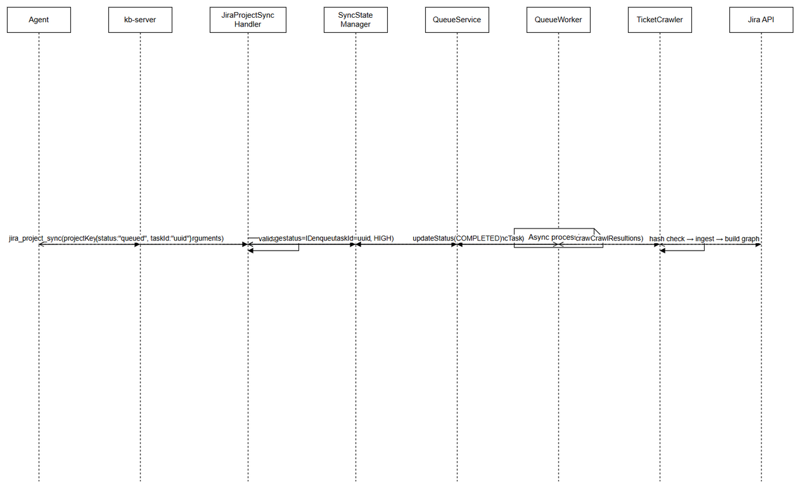
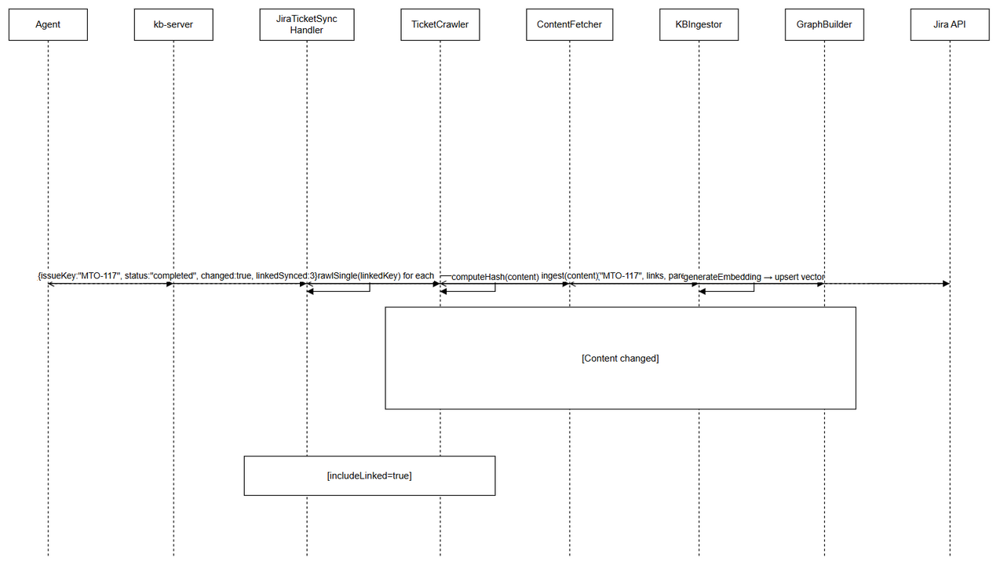
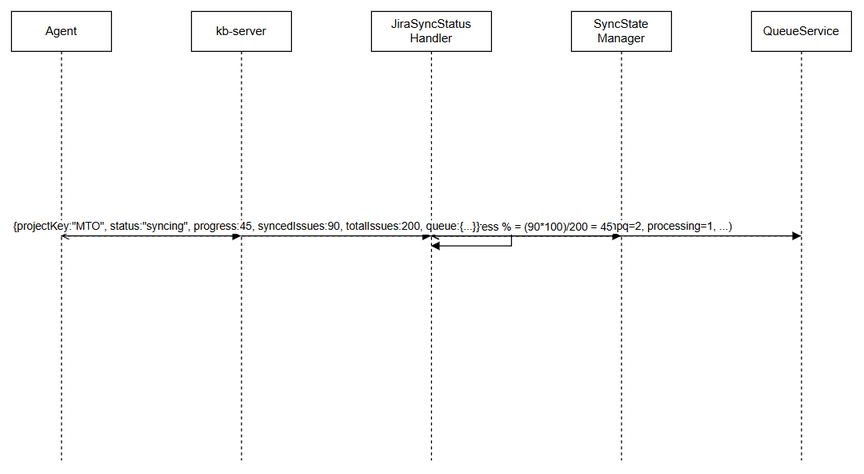

# Functional Specification Document (FSD)

## KB-Server — MTO-117: Migrate Sync Tools from Orchestrator-Server

---

## Document Information

| Field | Value |
|-------|-------|
| Jira Ticket | MTO-117 |
| Title | Migrate Sync Tools — Move jira_project_sync, jira_sync_status, jira_ticket_graph from Orchestrator |
| Author | TA Agent |
| Version | 1.1 |
| Date | 2025-07-19 |
| Status | Draft |
| Related BRD | documents/MTO-117/BRD.md |
| Parent Epic | MTO-115 — KB-Server Consolidation |

---

## Revision History

| Version | Date | Author | Changes |
|---------|------|--------|---------|
| 1.0 | 2025-07-19 | TA Agent | Initial FSD — architecture design, migration plan, handler specs |
| 1.1 | 2026-05-15 | TA Agent | Added §3.7: Content Hash Skip Optimization — processTicket checks hash before dimension processing |

---

## 1. Introduction

### 1.1 Purpose

This FSD specifies the technical design for migrating sync-related MCP tools (`jira_project_sync`, `jira_sync_status`, `jira_ticket_graph`) and their supporting modules (crawler, graph builder, KB ingestor) from `orchestrator-server` to `kb-server`. The goal is to establish `kb-server` as the single source of truth for all knowledge base synchronization operations.

### 1.2 Scope

- Unify `jira_project_sync` + `kb_sync_trigger` into one tool on kb-server
- Unify `jira_sync_status` + `kb_sync_status` into one tool on kb-server
- Migrate `jira_ticket_graph` to kb-server (merge with existing `kb_graph`)
- Migrate crawler module (TicketCrawlerImpl, KBIngestor, ContentFetcher, GraphBuilder, AttachmentQueuer)
- Migrate sync dashboard HTTP routes (`/sync/*`)
- Add new `jira_ticket_sync` tool (nice-to-have)
- Backward compatibility via config update strategy (recommended)

### 1.3 Definitions & Acronyms

| Term | Definition |
|------|------------|
| MCP | Model Context Protocol — communication protocol between AI agents and tool servers |
| SSE | Server-Sent Events — HTTP-based unidirectional real-time event streaming |
| BFS | Breadth-First Search — graph traversal algorithm for subgraph extraction |
| HPQ | High Priority Queue — queue for urgent sync tasks |
| NPQ | Normal Priority Queue — queue for standard sync tasks |
| KbToolHandler | Interface in kb-server for registering MCP tools with standardized error handling |
| SyncOrchestrator | Core interface in sync-pipeline module that coordinates the sync process |

### 1.4 References

| Document | Location |
|----------|----------|
| BRD | documents/MTO-117/BRD.md |
| Project Structure | .analysis/code-intelligence/project-structure.md |
| sync-pipeline module | sync-pipeline/src/main/kotlin/com/orchestrator/mcp/sync/pipeline/ |
| MTO-15 BRD (Database) | documents/MTO-15/BRD.md |

---

## 2. System Overview

### 2.1 Current Architecture (Before Migration)

```
┌─────────────────────────────────────────────────────────────────┐
│                        AI Agents                                 │
└──────────┬──────────────────────────────────┬───────────────────┘
           │ MCP calls                        │ MCP calls
           ▼                                  ▼
┌──────────────────────────┐    ┌──────────────────────────────┐
│   orchestrator-server    │    │         kb-server             │
│                          │    │                               │
│  • jira_project_sync     │    │  • kb_sync_trigger            │
│  • jira_sync_status      │    │  • kb_sync_status             │
│  • jira_ticket_graph     │    │  • kb_graph                   │
│                          │    │  • kb_ingest, kb_search       │
│  ┌────────────────────┐  │    │                               │
│  │ synctools/          │  │    │  ┌─────────────────────────┐  │
│  │  SyncToolHandler    │  │    │  │ queue/                   │  │
│  │  StatusToolHandler  │  │    │  │  SyncTaskHandler         │  │
│  │  GraphToolHandler   │  │    │  │  QueueWorker             │  │
│  │  SyncToolRegistrar  │  │    │  └─────────────────────────┘  │
│  └────────────────────┘  │    │                               │
│  ┌────────────────────┐  │    │  ┌─────────────────────────┐  │
│  │ crawler/            │  │    │  │ graph/                   │  │
│  │  TicketCrawlerImpl  │  │    │  │  GraphService            │  │
│  │  KBIngestorImpl     │  │    │  │  GraphRoutes             │  │
│  │  ContentFetcher     │  │    │  └─────────────────────────┘  │
│  │  GraphBuilder       │  │    └──────────────────────────────┘
│  │  AttachmentQueuer   │  │
│  └────────────────────┘  │
│  ┌────────────────────┐  │
│  │ dashboard/          │  │
│  │  SyncDashboard      │  │
│  │  SSE EventBus       │  │
│  └────────────────────┘  │
└──────────────────────────┘
           │
           ▼
┌──────────────────────────┐
│  sync-pipeline (shared)  │
│  SyncOrchestrator        │
│  SyncStateTracker        │
│  IndexDimension          │
└──────────────────────────┘
```

**Problems with current architecture:**
1. Tool duplication: `jira_project_sync` vs `kb_sync_trigger` do the same thing
2. Tool duplication: `jira_sync_status` vs `kb_sync_status` return partial data each
3. Crawler lives in orchestrator-server but ingests into KB (cross-server concern)
4. Agents must know which server to call for sync operations
5. Graph data split: `jira_ticket_graph` on orchestrator, `kb_graph` on kb-server


### 2.2 Target Architecture (After Migration)

```
┌─────────────────────────────────────────────────────────────────┐
│                        AI Agents                                 │
└──────────────────────────────────┬──────────────────────────────┘
                                   │ MCP calls (all sync tools)
                                   ▼
┌──────────────────────────┐    ┌──────────────────────────────────┐
│   orchestrator-server    │    │           kb-server               │
│                          │    │                                   │
│  • find_tools            │    │  • jira_project_sync (unified)    │
│  • execute_dynamic_tool  │    │  • jira_sync_status (unified)     │
│  • agent_log             │    │  • jira_ticket_graph (unified)    │
│  • embed_images          │    │  • jira_ticket_sync (new)         │
│  • stream_write_file     │    │  • kb_ingest, kb_search           │
│  • export_drawio         │    │                                   │
│                          │    │  ┌─────────────────────────────┐  │
│  (sync tools REMOVED)    │    │  │ synctools/ (NEW package)     │  │
│                          │    │  │  JiraProjectSyncHandler      │  │
│                          │    │  │  JiraSyncStatusHandler       │  │
│                          │    │  │  JiraTicketGraphHandler      │  │
│                          │    │  │  JiraTicketSyncHandler       │  │
│                          │    │  └─────────────────────────────┘  │
│                          │    │  ┌─────────────────────────────┐  │
│                          │    │  │ crawler/ (MIGRATED)          │  │
│                          │    │  │  TicketCrawlerImpl           │  │
│                          │    │  │  KBIngestorImpl              │  │
│                          │    │  │  ContentFetcher              │  │
│                          │    │  │  GraphBuilder                │  │
│                          │    │  │  AttachmentQueuer            │  │
│                          │    │  └─────────────────────────────┘  │
│                          │    │  ┌─────────────────────────────┐  │
│                          │    │  │ dashboard/ (MIGRATED)        │  │
│                          │    │  │  SyncDashboardRoutes         │  │
│                          │    │  │  SyncEventBus                │  │
│                          │    │  └─────────────────────────────┘  │
└──────────────────────────┘    └──────────────────────────────────┘
                                   │
                                   ▼
                        ┌──────────────────────────┐
                        │  sync-pipeline (shared)  │
                        │  SyncOrchestrator        │
                        │  SyncStateTracker        │
                        └──────────────────────────┘
```

**Key design decisions:**
1. All sync tools consolidated under `kb-server` — single source of truth
2. Tool names preserved (`jira_project_sync`, `jira_sync_status`, `jira_ticket_graph`) for backward compatibility
3. Crawler module moved to kb-server (natural home — it ingests into KB)
4. Dashboard routes moved to kb-server (co-located with sync logic)
5. `kb_sync_trigger`, `kb_sync_status`, `kb_graph` removed (merged into unified tools)
6. New `jira_ticket_sync` tool added for single-ticket on-demand sync

---

## 3. Functional Requirements

### 3.1 Feature: Unified Project Sync Tool (`jira_project_sync`)

**Source:** BRD Story 1

#### 3.1.1 Tool API Contract

| Property | Value |
|----------|-------|
| Tool Name | `jira_project_sync` |
| Server | kb-server |
| Handler Class | `JiraProjectSyncHandler` |
| Package | `com.orchestrator.mcp.kb.synctools` |
| Implements | `KbToolHandler` |

**Input Schema:**

```json
{
  "type": "object",
  "properties": {
    "projectKey": {
      "type": "string",
      "description": "Jira project key (e.g., MTO)"
    },
    "fullSync": {
      "type": "boolean",
      "default": false,
      "description": "Force full re-sync ignoring last sync timestamp"
    },
    "priority": {
      "type": "string",
      "default": "normal",
      "enum": ["high", "normal"],
      "description": "Queue priority for the sync task"
    }
  },
  "required": ["projectKey"]
}
```

**Success Response:**

```json
{
  "status": "queued",
  "taskId": "uuid-string",
  "projectKey": "MTO",
  "priority": "normal",
  "fullSync": false,
  "message": "Sync task queued for processing"
}
```

**Error Responses:**

| Condition | Error Message | isError |
|-----------|--------------|---------|
| Missing projectKey | `{"error": "projectKey is required"}` | true |
| Invalid format | `{"error": "Invalid project key format"}` | true |
| Already running | `{"error": "Sync already running for {projectKey}"}` | true |
| Internal failure | `{"error": "Failed to start sync: {message}"}` | true |


#### 3.1.2 Handler Implementation Spec

```kotlin
// Package: com.orchestrator.mcp.kb.synctools
// File: JiraProjectSyncHandler.kt

class JiraProjectSyncHandler(
    private val queueService: QueueService,
    private val syncStateManager: SyncStateManager,
    private val auditService: AuditService
) : KbToolHandler {
    override val toolName = "jira_project_sync"
    // Merges: SyncToolHandler (orchestrator) + KbSyncTriggerHandler (kb-server)
    // Strategy: Queue-based (from KbSyncTriggerHandler) + duplicate detection (from SyncToolHandler)
}
```

**Merge strategy:**
- From `SyncToolHandler` (orchestrator): Duplicate sync detection via `SyncStateManager`
- From `KbSyncTriggerHandler` (kb-server): Queue-based dispatch with priority support
- Combined: Validate → Check duplicate → Enqueue with priority → Audit log → Return task ID

**Validation logic:**
1. `projectKey` must match regex `^[A-Z]{1,10}$`
2. `priority` normalized to lowercase, must be "high" or "normal"
3. Check `SyncStateManager` — if status is `SYNCING` for this project, return error

---

### 3.2 Feature: Unified Sync Status Tool (`jira_sync_status`)

**Source:** BRD Story 2

#### 3.2.1 Tool API Contract

| Property | Value |
|----------|-------|
| Tool Name | `jira_sync_status` |
| Server | kb-server |
| Handler Class | `JiraSyncStatusHandler` |
| Package | `com.orchestrator.mcp.kb.synctools` |
| Implements | `KbToolHandler` |

**Input Schema:**

```json
{
  "type": "object",
  "properties": {
    "projectKey": {
      "type": "string",
      "description": "Filter status by project key (optional)"
    }
  }
}
```

**Success Response (with projectKey):**

```json
{
  "projectKey": "MTO",
  "status": "syncing",
  "progress": 45,
  "syncedIssues": 90,
  "totalIssues": 200,
  "lastSyncTime": "2025-07-19T10:30:00Z",
  "queue": {
    "hpqDepth": 0,
    "npqDepth": 2,
    "processing": 1,
    "completedToday": 15,
    "failedToday": 0
  }
}
```

**Success Response (without projectKey — global metrics only):**

```json
{
  "status": "idle",
  "queue": {
    "hpqDepth": 0,
    "npqDepth": 0,
    "processing": 0,
    "completedToday": 42,
    "failedToday": 1
  }
}
```

#### 3.2.2 Handler Implementation Spec

```kotlin
// Package: com.orchestrator.mcp.kb.synctools
// File: JiraSyncStatusHandler.kt

class JiraSyncStatusHandler(
    private val syncStateManager: SyncStateManager,
    private val queueService: QueueService
) : KbToolHandler {
    override val toolName = "jira_sync_status"
    // Merges: StatusToolHandler (orchestrator) + KbSyncStatusHandler (kb-server)
    // Combined response: progress data + queue metrics
}
```

**Merge strategy:**
- From `StatusToolHandler` (orchestrator): Project-specific progress (%, synced/total, lastSyncTime)
- From `KbSyncStatusHandler` (kb-server): Queue metrics (HPQ/NPQ depth, processing, completed/failed)
- Combined: Single response with both progress AND queue data

---

### 3.3 Feature: Unified Ticket Graph Tool (`jira_ticket_graph`)

**Source:** BRD Story 3

#### 3.3.1 Tool API Contract

| Property | Value |
|----------|-------|
| Tool Name | `jira_ticket_graph` |
| Server | kb-server |
| Handler Class | `JiraTicketGraphHandler` |
| Package | `com.orchestrator.mcp.kb.synctools` |
| Implements | `KbToolHandler` |

**Input Schema:**

```json
{
  "type": "object",
  "properties": {
    "projectKey": {
      "type": "string",
      "description": "Jira project key"
    },
    "issueKey": {
      "type": "string",
      "description": "Center issue for subgraph traversal (optional)"
    },
    "depth": {
      "type": "integer",
      "default": 2,
      "minimum": 1,
      "maximum": 5,
      "description": "BFS traversal depth from center issue"
    }
  },
  "required": ["projectKey"]
}
```

**Success Response:**

```json
{
  "nodes": [
    { "key": "MTO-15", "summary": "...", "status": "Done", "issueType": "Story", "labels": [], "createdAt": "..." }
  ],
  "edges": [
    { "source": "MTO-15", "target": "MTO-16", "type": "blocks", "category": "dependency" }
  ],
  "metadata": {
    "totalNodes": 42,
    "totalEdges": 67,
    "projectKey": "MTO",
    "centerIssue": "MTO-15",
    "depth": 2
  }
}
```


#### 3.3.2 Handler Implementation Spec

```kotlin
// Package: com.orchestrator.mcp.kb.synctools
// File: JiraTicketGraphHandler.kt

class JiraTicketGraphHandler(
    private val graphRepository: TicketGraphRepository,
    private val ticketCacheRepository: TicketCacheRepository
) : KbToolHandler {
    override val toolName = "jira_ticket_graph"
    // Migrated from: GraphToolHandler (orchestrator-server)
    // BFS traversal logic preserved exactly
    // Node limit: 1000
}
```

**Design notes:**
- This handler replaces both `GraphToolHandler` (orchestrator) and `KbGraphHandler` (kb-server)
- `kb_graph` tool is removed — `jira_ticket_graph` becomes the canonical graph tool
- The existing `GraphService` in kb-server's `graph/` package is reused for HTTP routes
- The MCP tool handler uses repositories directly (same pattern as original `GraphToolHandler`)

---

### 3.4 Feature: Single Ticket Sync Tool (`jira_ticket_sync`) — Nice-to-Have

**Source:** BRD Story 6

#### 3.4.1 Tool API Contract

| Property | Value |
|----------|-------|
| Tool Name | `jira_ticket_sync` |
| Server | kb-server |
| Handler Class | `JiraTicketSyncHandler` |
| Package | `com.orchestrator.mcp.kb.synctools` |
| Implements | `KbToolHandler` |

**Input Schema:**

```json
{
  "type": "object",
  "properties": {
    "issueKey": {
      "type": "string",
      "description": "Jira issue key to sync (e.g., MTO-117)"
    },
    "includeLinked": {
      "type": "boolean",
      "default": true,
      "description": "Also sync directly linked tickets (1-hop)"
    }
  },
  "required": ["issueKey"]
}
```

**Success Response:**

```json
{
  "issueKey": "MTO-117",
  "status": "completed",
  "changed": true,
  "ingested": true,
  "linkedSynced": 3,
  "duration": "2.4s"
}
```

#### 3.4.2 Handler Implementation Spec

```kotlin
// Package: com.orchestrator.mcp.kb.synctools
// File: JiraTicketSyncHandler.kt

class JiraTicketSyncHandler(
    private val ticketCrawler: TicketCrawler
) : KbToolHandler {
    override val toolName = "jira_ticket_sync"
    // Uses TicketCrawler.crawlSingle(issueKey) for immediate sync
    // Does NOT go through queue — synchronous execution
}
```

---

### 3.5 Feature: Backward Compatibility Strategy

**Source:** BRD Story 5

#### 3.5.1 Recommended Strategy: Config Update (Option B)

**Rationale for choosing Config Update over Tool Forwarding:**

| Criteria | Option A (Forwarding) | Option B (Config Update) |
|----------|----------------------|--------------------------|
| Complexity | High — proxy handlers, HTTP forwarding, error mapping | Low — update JSON config files |
| Latency | Added hop (orchestrator → kb-server) | Direct call to kb-server |
| Maintenance | Must maintain forwarding stubs until removal | One-time config change |
| Risk of duplication | Possible if forwarding logic has bugs | Zero — tools only exist on one server |
| Rollback | Complex — must keep both implementations | Simple — revert config |

**Implementation:**

1. Deploy new tools on kb-server first (tools available on both servers temporarily)
2. Update agent MCP configurations (`mcp-servers.json`) to route sync tools to kb-server
3. Verify all agents work correctly with new routing
4. Remove sync tools from orchestrator-server
5. Remove `kb_sync_trigger`, `kb_sync_status`, `kb_graph` from kb-server (merged into unified tools)

**Config change example:**

```json
// Before (in mcp-servers.json):
{
  "orchestrator": {
    "tools": ["find_tools", "execute_dynamic_tool", "jira_project_sync", "jira_sync_status", "jira_ticket_graph", ...]
  }
}

// After:
{
  "orchestrator": {
    "tools": ["find_tools", "execute_dynamic_tool", "agent_log", ...]
  },
  "kb-server": {
    "tools": ["kb_ingest", "kb_search", "jira_project_sync", "jira_sync_status", "jira_ticket_graph", "jira_ticket_sync"]
  }
}
```

#### 3.5.2 Transition Period Safety

During the transition period (tools on both servers):
- `SyncStateManager` uses the same database — prevents duplicate sync execution
- Queue deduplication: `QueueService.enqueue()` checks for existing pending task with same project key
- Audit logging on both servers helps identify which path agents are using

---

### 3.7 Feature: Content Hash Skip Optimization

**Source:** BRD Story 7

#### 3.7.1 Overview

The sync pipeline currently processes ALL tickets returned by JQL (incremental filter), even if their content hasn't changed. This wastes CPU/GPU on dimension processing and embedding regeneration. The optimization adds a hash comparison step before `DimensionProcessor.process()`.

#### 3.7.2 Modified `SyncOrchestratorImpl.processTicket()` Logic

```
processTicket(ticket, options, stats):
  1. IF options.fullSync == true → SKIP hash check, process normally
  2. existingHash = indexWriter.getContentHash(ticket.key, "ticket_metadata")
  3. IF existingHash == ticket.contentHash → stats.skipped++; RETURN (skip)
  4. ELSE → proceed with full processing:
     entries = dimensionProcessor.process(ticket, options.dimensions)
     batchWriter.writeBatch(entries)
     vectorWriter.queue(entries with vectorText)
     stats.processed++
```

#### 3.7.3 New Method on IndexWriter

```kotlin
interface IndexWriter {
    // ... existing methods ...

    /** Get stored content hash for a ticket in a specific dimension. */
    suspend fun getContentHash(ticketKey: String, dimensionId: String): String?
}
```

**SQL:**
```sql
SELECT content_hash FROM sync.index_entries
WHERE ticket_key = ? AND dimension_id = ?
LIMIT 1
```

#### 3.7.4 Performance Impact

| Scenario | Before | After |
|----------|--------|-------|
| 100 tickets, 90 unchanged | Process all 100 | Process 10, skip 90 |
| Embedding calls | 100 | 10 |
| DB writes | 100 upserts | 10 upserts |
| Estimated time (100 tickets) | ~60s | ~10s |

#### 3.7.5 Fail-Safe Behavior

- If `getContentHash()` throws exception → log WARN, treat as "changed" (process ticket)
- If `fullSync=true` → bypass hash check entirely (force re-process all)
- If `contentHash` is null on ticket → treat as "changed" (process)

---

## 4. DI Wiring Changes

### 4.1 Additions to kb-server (`KbDiModule.kt`)

#### New module: `kbSyncToolsModule()`

```kotlin
fun kbSyncToolsModule() = module {
    // Sync state management (migrated from orchestrator-server)
    single<SyncStateManager> { SyncStateManagerImpl(get()) }
    single<TicketCacheRepository> { TicketCacheRepositoryImpl(get()) }
    single<TicketGraphRepository> { TicketGraphRepositoryImpl(get()) }
    single<AttachmentQueueRepository> { AttachmentQueueRepositoryImpl(get()) }

    // New unified tool handlers
    single { JiraProjectSyncHandler(get(), get(), get()) } bind KbToolHandler::class
    single { JiraSyncStatusHandler(get(), get()) } bind KbToolHandler::class
    single { JiraTicketGraphHandler(get(), get()) } bind KbToolHandler::class
    single { JiraTicketSyncHandler(get()) } bind KbToolHandler::class
}
```


#### New module: `kbCrawlerModule()`

```kotlin
fun kbCrawlerModule() = module {
    // Crawler pipeline (migrated from orchestrator-server/crawler/)
    single<ContentFetcher> { ContentFetcherImpl(get()) }
    single<ContentHasher> { ContentHasherImpl() }
    single<GraphBuilder> { GraphBuilderImpl(get()) }
    single<KBIngestor> { KBIngestorImpl(get(), get(), "kb_tickets") }
    single<AttachmentQueuer> { AttachmentQueuerImpl(get()) }
    single<TicketCrawler> {
        TicketCrawlerImpl(get(), get(), get(), get(), get(), get(), get())
    }
}
```

#### New module: `kbDashboardModule()`

```kotlin
fun kbDashboardModule() = module {
    // Sync dashboard (migrated from orchestrator-server/dashboard/)
    single { SyncEventBus() }
    single { SyncDashboardRoutes(get(), get(), get()) }
}
```

#### Update `kbAppModule()` composition:

```kotlin
fun kbAppModule(config: KbConfig): List<Module> = listOf(
    kbConfigModule(config),
    kbInfraModule(),
    kbSyncPipelineModule(config),
    kbStoreModule(),
    kbAuditModule(),
    kbMaskingModule(),
    kbQueueModule(),
    kbGraphModule,
    kbNetworkModule,
    kbSyncToolsModule(),      // ← NEW: unified sync tool handlers
    kbCrawlerModule(),        // ← NEW: migrated crawler pipeline
    kbDashboardModule(),      // ← NEW: migrated sync dashboard
    kbHandlersModule(),       // MODIFIED: remove KbSyncTriggerHandler, KbSyncStatusHandler, KbGraphHandler
    kbProtocolModule(),
    syncPipelineModule
)
```

### 4.2 Modifications to `kbHandlersModule()`

**Remove these bindings** (merged into unified tools):

```kotlin
// REMOVE:
single { KbSyncTriggerHandler(get(), get()) } bind KbToolHandler::class
single { KbSyncStatusHandler(get(), get()) } bind KbToolHandler::class
single { KbGraphHandler(get()) } bind KbToolHandler::class
```

### 4.3 Removals from orchestrator-server (`AppModule.kt`)

**Remove these bindings:**

```kotlin
// REMOVE from appModule():
single { com.orchestrator.mcp.synctools.SyncToolHandler(get()) }
single { com.orchestrator.mcp.synctools.StatusToolHandler(get()) }

// REMOVE module includes:
includes(crawlerModule)      // Crawler moved to kb-server
includes(dashboardModule)    // Dashboard moved to kb-server
includes(graphModule)        // Graph moved to kb-server

// REMOVE sync state repositories (moved to kb-server):
single<SyncStateManager> { SyncStateManagerImpl(get()) }
single<TicketCacheRepository> { TicketCacheRepositoryImpl(get()) }
single<TicketGraphRepository> { TicketGraphRepositoryImpl(get()) }
single<AttachmentQueueRepository> { AttachmentQueueRepositoryImpl(get()) }
```

**Keep in orchestrator-server** (still needed for scanner module):
- `SyncJiraClient` / `SyncJiraClientAdapter` — used by scanner
- `SyncPipelineConfig` — used by scanner
- `syncPipelineModule` — shared library, still needed
- `scannerModule` — project scanner remains in orchestrator (separate concern)

---

## 5. Sequence Diagrams

### 5.1 Unified `jira_project_sync` Flow (After Migration)



*[Edit in draw.io](diagrams/seq-project-sync-flow.drawio)*

### 5.2 Single Ticket Sync Flow (`jira_ticket_sync`)



*[Edit in draw.io](diagrams/seq-ticket-sync-flow.drawio)*


### 5.3 Sync Status Query Flow



*[Edit in draw.io](diagrams/seq-sync-status-flow.drawio)*

---

## 6. Migration Plan — Step-by-Step Order of Operations

### Phase 1: Prepare kb-server (No Breaking Changes)

| Step | Action | Risk | Verification |
|------|--------|------|--------------|
| 1.1 | Create `kb-server/src/.../synctools/` package | None | Compile |
| 1.2 | Copy sync repository interfaces + impls to kb-server (`SyncStateManager`, `TicketCacheRepository`, `TicketGraphRepository`, `AttachmentQueueRepository`) | None | Unit tests |
| 1.3 | Copy crawler module to kb-server (`TicketCrawlerImpl`, `KBIngestorImpl`, `ContentFetcher`, `GraphBuilder`, `AttachmentQueuer`) | None | Unit tests |
| 1.4 | Create `JiraProjectSyncHandler` implementing `KbToolHandler` | None | Unit tests |
| 1.5 | Create `JiraSyncStatusHandler` implementing `KbToolHandler` | None | Unit tests |
| 1.6 | Create `JiraTicketGraphHandler` implementing `KbToolHandler` | None | Unit tests |
| 1.7 | Create `JiraTicketSyncHandler` implementing `KbToolHandler` | None | Unit tests |
| 1.8 | Create `kbSyncToolsModule()` and `kbCrawlerModule()` in DI | None | Integration test |
| 1.9 | Add modules to `kbAppModule()` composition | None | Server starts |
| 1.10 | Migrate dashboard routes + static files | None | HTTP test |

### Phase 2: Transition Period (Tools on Both Servers)

| Step | Action | Risk | Verification |
|------|--------|------|--------------|
| 2.1 | Deploy kb-server with new unified tools | Low | Smoke test all 4 tools |
| 2.2 | Verify `jira_project_sync` on kb-server works end-to-end | Medium | Full sync test |
| 2.3 | Verify `jira_sync_status` returns combined data | Low | Status check |
| 2.4 | Verify `jira_ticket_graph` returns correct graph | Low | Graph query test |
| 2.5 | Verify dashboard at kb-server `/sync/dashboard` | Low | Manual UI test |
| 2.6 | Update agent MCP configs to route sync tools to kb-server | Medium | Agent workflow test |

### Phase 3: Cleanup (Remove from Orchestrator)

| Step | Action | Risk | Verification |
|------|--------|------|--------------|
| 3.1 | Remove `KbSyncTriggerHandler`, `KbSyncStatusHandler`, `KbGraphHandler` from kb-server handlers module | Low | Compile + test |
| 3.2 | Remove `SyncToolHandler`, `StatusToolHandler`, `GraphToolHandler`, `SyncToolRegistrar` from orchestrator-server | Low | Compile |
| 3.3 | Remove `crawlerModule` include from orchestrator AppModule | Low | Compile |
| 3.4 | Remove `dashboardModule` include from orchestrator AppModule | Low | Compile |
| 3.5 | Remove `graphModule` include from orchestrator AppModule | Low | Compile |
| 3.6 | Remove sync repository bindings from orchestrator AppModule | Low | Compile |
| 3.7 | Delete orchestrator-server source files (see §7 file list) | None | Compile |
| 3.8 | Run full test suite on both servers | Medium | All tests pass |

### Phase 4: Verification

| Step | Action | Verification |
|------|--------|--------------|
| 4.1 | Confirm no agent calls sync tools on orchestrator-server | Audit log analysis |
| 4.2 | Confirm dashboard accessible only from kb-server | HTTP 404 on orchestrator |
| 4.3 | Confirm graph viewer works from kb-server | Manual test |
| 4.4 | Performance test: sync 1000 tickets | < 5 min completion |

---

## 7. Files to Create / Modify / Delete

### 7.1 Files to CREATE (in kb-server)

| # | File Path | Purpose |
|---|-----------|---------|
| 1 | `kb-server/src/.../kb/synctools/JiraProjectSyncHandler.kt` | Unified project sync tool handler |
| 2 | `kb-server/src/.../kb/synctools/JiraSyncStatusHandler.kt` | Unified sync status tool handler |
| 3 | `kb-server/src/.../kb/synctools/JiraTicketGraphHandler.kt` | Unified ticket graph tool handler |
| 4 | `kb-server/src/.../kb/synctools/JiraTicketSyncHandler.kt` | New single-ticket sync tool handler |
| 5 | `kb-server/src/.../kb/synctools/di/SyncToolsModule.kt` | DI module for sync tool handlers |
| 6 | `kb-server/src/.../kb/crawler/TicketCrawlerImpl.kt` | Migrated crawler orchestrator |
| 7 | `kb-server/src/.../kb/crawler/KBIngestorImpl.kt` | Migrated KB ingestion logic |
| 8 | `kb-server/src/.../kb/crawler/ContentFetcher.kt` | Migrated content fetcher (interface + impl) |
| 9 | `kb-server/src/.../kb/crawler/ContentHasher.kt` | Migrated content hasher |
| 10 | `kb-server/src/.../kb/crawler/GraphBuilder.kt` | Migrated graph edge builder |
| 11 | `kb-server/src/.../kb/crawler/AttachmentQueuer.kt` | Migrated attachment queuer |
| 12 | `kb-server/src/.../kb/crawler/model/CrawlerModels.kt` | Crawler data models (TicketContent, CrawlResult, etc.) |
| 13 | `kb-server/src/.../kb/crawler/config/CrawlerConfig.kt` | Crawler configuration |
| 14 | `kb-server/src/.../kb/crawler/di/CrawlerModule.kt` | DI module for crawler |
| 15 | `kb-server/src/.../kb/dashboard/SyncDashboardRoutes.kt` | Migrated dashboard HTTP routes |
| 16 | `kb-server/src/.../kb/dashboard/SyncEventBus.kt` | Migrated SSE event bus |
| 17 | `kb-server/src/.../kb/dashboard/di/DashboardModule.kt` | DI module for dashboard |
| 18 | `kb-server/src/main/resources/static/sync-dashboard.html` | Migrated dashboard HTML |
| 19 | `kb-server/src/.../kb/sync/SyncStateManager.kt` | Migrated sync state interface + impl |
| 20 | `kb-server/src/.../kb/sync/TicketCacheRepository.kt` | Migrated ticket cache repository |
| 21 | `kb-server/src/.../kb/sync/TicketGraphRepository.kt` | Migrated ticket graph repository |
| 22 | `kb-server/src/.../kb/sync/AttachmentQueueRepository.kt` | Migrated attachment queue repository |
| 23 | `kb-server/src/.../kb/sync/model/SyncModels.kt` | Sync domain models |


### 7.2 Files to MODIFY

| # | File Path | Change |
|---|-----------|--------|
| 1 | `kb-server/src/.../kb/di/KbDiModule.kt` | Add new modules to `kbAppModule()`, remove old handler bindings |
| 2 | `kb-server/src/.../kb/transport/KbHttpTransport.kt` | Add `/sync/*` dashboard routes |
| 3 | `kb-server/build.gradle.kts` | Ensure sync-pipeline dependency is included (already present) |
| 4 | `orchestrator-server/src/.../di/AppModule.kt` | Remove sync tool handlers, crawler, dashboard, graph module includes |
| 5 | `orchestrator-server/src/.../protocol/McpServerFactory.kt` | Remove SyncToolRegistrar usage |
| 6 | `orchestrator-server/src/.../HttpStreamableServer.kt` | Remove `/sync/*` routes |
| 7 | Agent MCP configs (`mcp-servers.json`, `.kiro/settings/mcp.json`) | Route sync tools to kb-server |

### 7.3 Files to DELETE (from orchestrator-server)

| # | File Path | Reason |
|---|-----------|--------|
| 1 | `orchestrator-server/src/.../synctools/SyncToolHandler.kt` | Replaced by JiraProjectSyncHandler |
| 2 | `orchestrator-server/src/.../synctools/StatusToolHandler.kt` | Replaced by JiraSyncStatusHandler |
| 3 | `orchestrator-server/src/.../synctools/GraphToolHandler.kt` | Replaced by JiraTicketGraphHandler |
| 4 | `orchestrator-server/src/.../synctools/SyncToolRegistrar.kt` | kb-server uses KbToolHandler auto-registration |
| 5 | `orchestrator-server/src/.../crawler/TicketCrawlerImpl.kt` | Moved to kb-server |
| 6 | `orchestrator-server/src/.../crawler/KBIngestor.kt` | Moved to kb-server |
| 7 | `orchestrator-server/src/.../crawler/ContentFetcher.kt` | Moved to kb-server |
| 8 | `orchestrator-server/src/.../crawler/GraphBuilder.kt` | Moved to kb-server |
| 9 | `orchestrator-server/src/.../crawler/AttachmentQueuer.kt` | Moved to kb-server |
| 10 | `orchestrator-server/src/.../crawler/ContentHasher.kt` | Moved to kb-server |
| 11 | `orchestrator-server/src/.../crawler/model/*.kt` | Moved to kb-server |
| 12 | `orchestrator-server/src/.../crawler/config/CrawlerConfig.kt` | Moved to kb-server |
| 13 | `orchestrator-server/src/.../crawler/di/crawlerModule.kt` | Moved to kb-server |
| 14 | `orchestrator-server/src/.../dashboard/SyncDashboardHandler.kt` | Moved to kb-server |
| 15 | `orchestrator-server/src/.../dashboard/SyncEventBus.kt` | Moved to kb-server |
| 16 | `orchestrator-server/src/.../dashboard/di/dashboardModule.kt` | Moved to kb-server |
| 17 | `orchestrator-server/src/.../graph/GraphService.kt` | Already exists in kb-server |
| 18 | `orchestrator-server/src/.../graph/GraphDataRepository.kt` | Already exists in kb-server |
| 19 | `orchestrator-server/src/.../graph/GraphRoutes.kt` | Already exists in kb-server |
| 20 | `orchestrator-server/src/.../graph/model/*.kt` | Already exists in kb-server |
| 21 | `orchestrator-server/src/.../graph/views/*.kt` | Already exists in kb-server |
| 22 | `orchestrator-server/src/.../graph/di/graphModule.kt` | Already exists in kb-server |
| 23 | `orchestrator-server/src/main/resources/static/sync-dashboard.html` | Moved to kb-server |

### 7.4 Files to DELETE (from kb-server — merged into unified tools)

| # | File Path | Reason |
|---|-----------|--------|
| 1 | `kb-server/src/.../protocol/handlers/KbSyncTriggerHandler.kt` | Merged into JiraProjectSyncHandler |
| 2 | `kb-server/src/.../protocol/handlers/KbSyncStatusHandler.kt` | Merged into JiraSyncStatusHandler |
| 3 | `kb-server/src/.../protocol/handlers/KbGraphHandler.kt` | Merged into JiraTicketGraphHandler |

---

## 8. Database Access Patterns

### 8.1 Tables kb-server Needs Access To

kb-server already has a PostgreSQL connection pool. The following tables (currently accessed by orchestrator-server) must also be accessible from kb-server:

| Table | Current Access | After Migration | Operations |
|-------|---------------|-----------------|------------|
| `sync_state` | orchestrator-server | kb-server | READ/WRITE — sync status tracking |
| `ticket_cache` | orchestrator-server | kb-server | READ/WRITE — cached ticket data |
| `ticket_graph` | orchestrator-server | kb-server | READ/WRITE — ticket relationships |
| `attachment_queue` | orchestrator-server | kb-server | READ/WRITE — attachment processing |
| `kb_entries` | kb-server | kb-server (unchanged) | READ/WRITE — KB vector entries |
| `kb_segments` | kb-server | kb-server (unchanged) | READ/WRITE — content segments |
| `kb_queue` | kb-server | kb-server (unchanged) | READ/WRITE — async task queue |
| `kb_audit` | kb-server | kb-server (unchanged) | WRITE — audit trail |

### 8.2 Database Connection Strategy

**Option: Shared Database (Recommended)**

Both servers connect to the same PostgreSQL instance. The sync tables (`sync_state`, `ticket_cache`, `ticket_graph`, `attachment_queue`) are already in the same database as KB tables.

**No schema changes required** — BRD §1.2 explicitly states "Database schema changes (existing tables remain as-is)" is out of scope.

**Connection pool configuration:**
- kb-server's existing HikariCP pool handles additional queries
- Recommended pool size increase: from 10 → 15 connections (to handle sync + KB operations)

### 8.3 Repository Access Patterns

| Repository | Table | Key Queries |
|------------|-------|-------------|
| `SyncStateManager` | `sync_state` | `getOrCreate(projectKey)`, `updateStatus(projectKey, status)`, `updateProgress(projectKey, synced, total)` |
| `TicketCacheRepository` | `ticket_cache` | `findByProject(projectKey)`, `findByHash(projectKey, hash)`, `markIngested(issueKey)` |
| `TicketGraphRepository` | `ticket_graph` | `findAllForProject(projectKey)`, `findOutgoing(issueKey)`, `findIncoming(issueKey)`, `upsertEdge(...)` |
| `AttachmentQueueRepository` | `attachment_queue` | `enqueue(issueKey, attachments)`, `dequeue(batchSize)` |

---

## 9. Testing Strategy

### 9.1 Unit Tests (Per Handler)

| Test Class | Tests | Priority |
|------------|-------|----------|
| `JiraProjectSyncHandlerTest` | Valid sync trigger, missing projectKey, invalid format, duplicate detection, priority handling | High |
| `JiraSyncStatusHandlerTest` | With projectKey (progress + queue), without projectKey (queue only), unknown project | High |
| `JiraTicketGraphHandlerTest` | Full project graph, subgraph BFS, depth limits, node limit 1000, empty graph | High |
| `JiraTicketSyncHandlerTest` | Single ticket sync, with linked, without linked, invalid issueKey | Medium |


### 9.2 Integration Tests

| Test | Description | Verification |
|------|-------------|--------------|
| `SyncToolsIntegrationTest` | Start kb-server, call all 4 tools via MCP protocol | Tools registered, callable, return correct schema |
| `CrawlerIntegrationTest` | Trigger sync → verify tickets crawled → KB entries created | End-to-end pipeline works |
| `DashboardIntegrationTest` | Start kb-server, verify `/sync/*` routes respond | HTTP 200, correct content-type |
| `SSEIntegrationTest` | Connect to `/sync/live`, trigger sync, verify events received | SSE events delivered |
| `GraphQueryIntegrationTest` | Seed graph data, query via tool, verify BFS traversal | Correct nodes/edges returned |

### 9.3 Migration Verification Tests

| Test | Description | Pass Criteria |
|------|-------------|---------------|
| `OrchestratorNoSyncToolsTest` | After cleanup, verify orchestrator-server does NOT register sync tools | `find_tools("jira_project_sync")` returns empty |
| `KbServerSyncToolsTest` | Verify kb-server registers all 4 sync tools | Tool listing includes all 4 tools |
| `NoDuplicateToolsTest` | Verify no tool name exists on both servers | Unique tool names across servers |
| `BackwardCompatConfigTest` | With updated config, agent can call sync tools on kb-server | Successful tool invocation |
| `DashboardMigrationTest` | Dashboard HTML loads from kb-server, NOT from orchestrator | HTTP 200 from kb-server, 404 from orchestrator |

### 9.4 Performance Tests

| Test | Description | Target |
|------|-------------|--------|
| `SyncToolResponseTime` | Measure time from tool call to response (queue dispatch) | < 2 seconds |
| `GraphQueryPerformance` | Query graph for project with 1000 tickets | < 5 seconds |
| `ConcurrentSyncTest` | Trigger 3 concurrent project syncs | No interference, all complete |
| `SSELatencyTest` | Measure time from state change to SSE event delivery | < 1 second |

### 9.5 Test Data Strategy

- Use Testcontainers (PostgreSQL) for integration tests
- Seed `ticket_cache` and `ticket_graph` tables with test data
- Mock `SyncJiraClient` for unit tests (no real Jira calls)
- Use MockK for mocking dependencies in handler unit tests

---

## 10. Non-Functional Requirements

| Category | Requirement | Implementation |
|----------|-------------|----------------|
| Performance | Tool response < 2s | Queue-based dispatch (async) |
| Performance | Graph query < 5s | Node limit 1000, indexed queries |
| Performance | SSE latency < 1s | SharedFlow-based event bus |
| Reliability | No data loss | Same database, no schema migration |
| Reliability | Graceful errors | KbToolHandler standardized error format |
| Scalability | 3 concurrent syncs | ConcurrentHashMap-based lock in TicketCrawler |
| Security | Auth on HTTP routes | Existing auth middleware applied |
| Security | MCP tool auth | Existing MCP client authentication |
| Maintainability | Single source of truth | All sync logic in kb-server only |
| Observability | Audit trail | AuditService logs all tool invocations |
| Observability | Structured logging | SLF4J with project key context |

---

## 11. Risk Mitigation

| Risk | Mitigation | Owner |
|------|-----------|-------|
| Agent workflows break | Phase 2 transition period — tools on both servers | DEV + QA |
| Scanner module breaks (still in orchestrator) | Scanner uses `sync-pipeline` module directly, not crawler | TA |
| Merge conflicts with MTO-116 | Work in separate packages (`synctools/`, `crawler/`, `dashboard/`) | DEV |
| Performance regression | Connection pool size increase, performance tests | DEV |
| SSE event bus unavailable | kb-server already has SharedFlow infrastructure (queue notifications) | TA |

---

## 12. Appendix

### 12.1 Package Structure After Migration (kb-server)

```
com.orchestrator.mcp.kb/
├── KbApplication.kt
├── KbMain.kt
├── config/
├── di/KbDiModule.kt                    ← MODIFIED
├── protocol/
│   ├── KbToolHandler.kt
│   ├── KbMcpServerFactory.kt
│   └── handlers/                       ← MODIFIED (3 handlers removed)
│       ├── KbSearchHandler.kt
│       ├── KbIngestHandler.kt
│       ├── KbReadHandler.kt
│       ├── KbDeleteHandler.kt
│       ├── KbLinkHandler.kt
│       ├── KbFeedbackHandler.kt
│       ├── KbAuditHandler.kt
│       ├── KbUnmaskPiiHandler.kt
│       ├── KbUnmaskBrHandler.kt
│       ├── KbNetworkHandler.kt
│       └── HandlerUtils.kt
├── synctools/                          ← NEW PACKAGE
│   ├── JiraProjectSyncHandler.kt
│   ├── JiraSyncStatusHandler.kt
│   ├── JiraTicketGraphHandler.kt
│   ├── JiraTicketSyncHandler.kt
│   └── di/SyncToolsModule.kt
├── crawler/                            ← NEW PACKAGE (migrated)
│   ├── TicketCrawler.kt               (interface)
│   ├── TicketCrawlerImpl.kt
│   ├── ContentFetcher.kt             (interface + impl)
│   ├── ContentHasher.kt              (interface + impl)
│   ├── GraphBuilder.kt               (interface + impl)
│   ├── KBIngestor.kt                 (interface + impl)
│   ├── AttachmentQueuer.kt           (interface + impl)
│   ├── config/CrawlerConfig.kt
│   ├── model/CrawlerModels.kt
│   └── di/CrawlerModule.kt
├── sync/                               ← NEW PACKAGE (migrated)
│   ├── SyncStateManager.kt           (interface + impl)
│   ├── TicketCacheRepository.kt      (interface + impl)
│   ├── TicketGraphRepository.kt      (interface + impl)
│   ├── AttachmentQueueRepository.kt  (interface + impl)
│   └── model/SyncModels.kt
├── dashboard/                          ← NEW PACKAGE (migrated)
│   ├── SyncDashboardRoutes.kt
│   ├── SyncEventBus.kt
│   └── di/DashboardModule.kt
├── graph/                              ← EXISTING (unchanged)
│   ├── GraphService.kt
│   ├── GraphDataRepository.kt
│   ├── GraphRoutes.kt
│   └── ...
├── store/
├── queue/
├── masking/
├── audit/
├── network/
└── transport/KbHttpTransport.kt        ← MODIFIED (add /sync/* routes)
```

### 12.2 Tool Registration Summary (After Migration)

**kb-server tools (final):**

| Tool Name | Handler | Source |
|-----------|---------|--------|
| `kb_ingest` | KbIngestHandler | Existing |
| `kb_search` | KbSearchHandler | Existing |
| `kb_read` | KbReadHandler | Existing |
| `kb_delete` | KbDeleteHandler | Existing |
| `kb_link` | KbLinkHandler | Existing |
| `kb_feedback` | KbFeedbackHandler | Existing |
| `kb_audit` | KbAuditHandler | Existing |
| `kb_unmask_pii` | KbUnmaskPiiHandler | Existing |
| `kb_unmask_br` | KbUnmaskBrHandler | Existing |
| `kb_network` | KbNetworkHandler | Existing |
| `jira_project_sync` | JiraProjectSyncHandler | **NEW (unified)** |
| `jira_sync_status` | JiraSyncStatusHandler | **NEW (unified)** |
| `jira_ticket_graph` | JiraTicketGraphHandler | **NEW (unified)** |
| `jira_ticket_sync` | JiraTicketSyncHandler | **NEW** |

**Removed tools:**
- `kb_sync_trigger` → merged into `jira_project_sync`
- `kb_sync_status` → merged into `jira_sync_status`
- `kb_graph` → merged into `jira_ticket_graph`

### 12.3 Change Log from BRD

No discrepancies found between BRD v1.0 and this FSD. All requirements are addressed:
- Stories 1-4: Fully specified with handler implementations
- Story 5: Config Update strategy recommended (Option B)
- Story 6: Nice-to-have `jira_ticket_sync` included in design

---

*End of Document*
