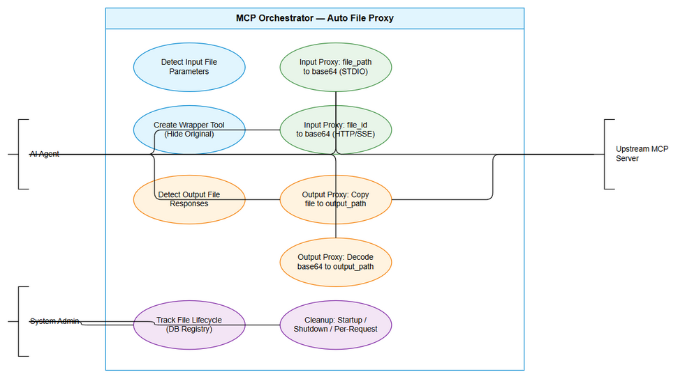
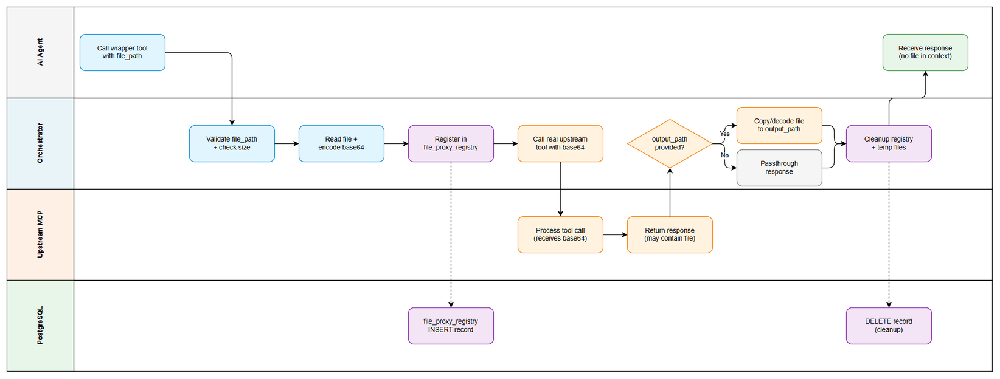
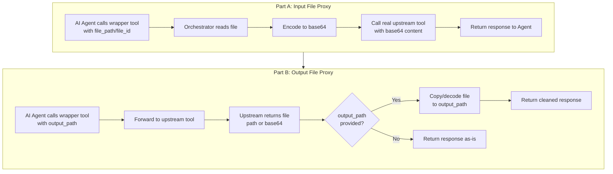
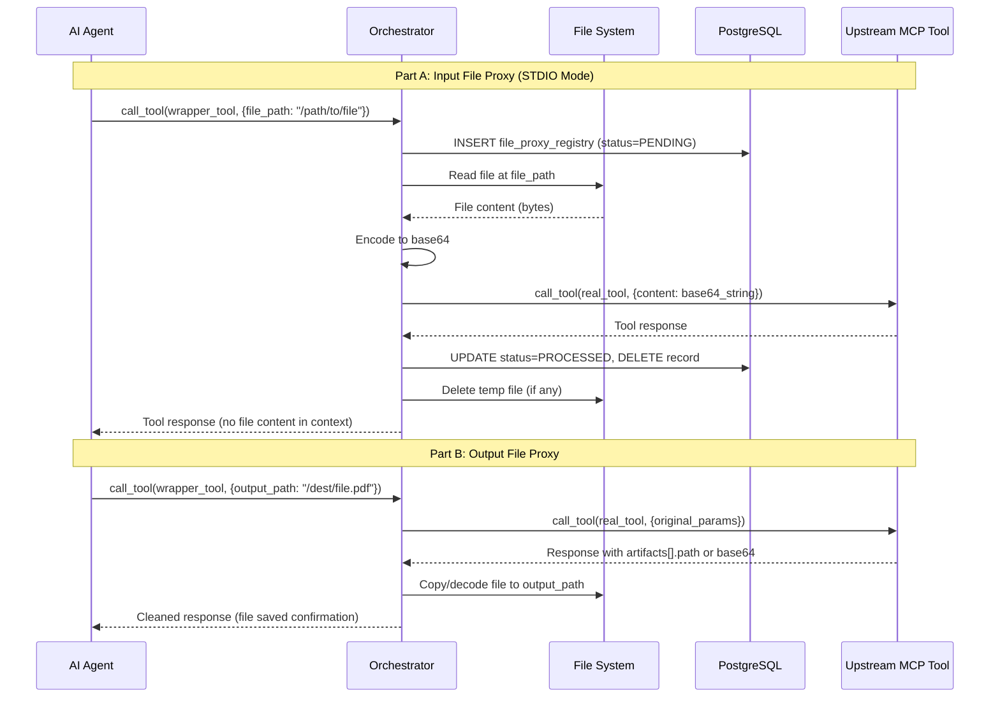

# Business Requirements Document (BRD)

## MCP Tool Orchestration — MTO-12: Auto File Proxy (Input + Output)

---

## Document Information

| Field | Value |
|-------|-------|
| Jira Ticket | MTO-12 |
| Title | Auto File Proxy - Wrapper tool tự động cho upstream MCP tools nhận/trả file |
| Author | BA Agent |
| Version | 1.0 |
| Date | 2026-05-05 |
| Status | Draft |
| Related BRD | BRD-v1.0-MTO-12.docx |

---

## Author Tracking

| Role | Name - Position | Responsibility |
|------|-----------------|----------------|
| Author | BA Agent – Business Analyst | Create document |
| Peer Reviewer | Duc Nguyen – Project Lead | Review document |

---

## Revision History

| Version | Date | Author | Changes |
|---------|------|--------|---------|
| 1.0 | 2026-05-05 | BA Agent | Initial draft — auto-generated from Jira ticket MTO-12. Covers Part A (Input File Proxy) and Part B (Output File Proxy). |

---

## Sign-Off

| Name | Signature and date |
|------|--------------------|
| Duc Nguyen | ☐ I agree and confirm all criteria on this BRD as expected requirements |
| | ☐ I agree and confirm all criteria on this BRD as expected requirements |

---

## 1. Introduction

### 1.1 Scope

This BRD covers the **Auto File Proxy** feature for the MCP Orchestrator Server, addressing two complementary capabilities:

1. **Part A: Input File Proxy** — Automatically detect upstream MCP tools that accept base64/file content parameters, create wrapper tools that accept simple `file_path` (STDIO mode) or `file_id` (HTTP/SSE mode), and handle file reading + encoding transparently. This eliminates the need for AI agents to load file content into their context window (saving 100% of file-related context usage).

2. **Part B: Output File Proxy** — Automatically detect upstream MCP tools that return file content in their response (as file paths or base64 strings), add an optional `output_path` parameter to wrapper tools, and handle file copying/decoding transparently. This allows AI agents to direct file outputs to specific locations without manual file operations.

Both parts include a **database registry** (`file_proxy_registry` table) for tracking file lifecycle with session-scoped cleanup, and comprehensive lifecycle management (startup cleanup, shutdown cleanup, per-request cleanup).

The system is a Kotlin/Ktor MCP Orchestration Server that acts as a proxy between AI clients and upstream MCP tool servers.

### 1.2 Out of Scope

- Streaming/chunked file transfer for very large files (beyond configurable max size)
- File format conversion or transformation
- Encryption of files at rest in the proxy layer
- UI for file management (proxy is fully transparent to AI agents)
- Changes to upstream MCP server tool implementations
- File compression before transfer

### 1.3 Preliminary Requirements

- MCP Orchestrator Server running (Kotlin 2.3.20, Ktor 3.4.0, Koin 4.1.1)
- PostgreSQL 16+ instance with existing database (`jira_assistant`)
- Upstream MCP servers with tools that accept/return file content (base64 parameters or file path responses)
- File system access for temporary file storage and output path writing

---

## 2. Business Requirements

### 2.1 High Level Process Map

The Auto File Proxy operates at two interception points in the MCP tool call lifecycle:

**Input Proxy Flow:**
1. AI Agent calls wrapper tool with `file_path` (STDIO) or `file_id` (HTTP/SSE)
2. Orchestrator intercepts the call, reads the file, encodes to base64
3. Orchestrator calls the real upstream tool with base64 content
4. Response returned to AI Agent (file content never enters agent context)

**Output Proxy Flow:**
1. AI Agent calls wrapper tool with optional `output_path` parameter
2. Orchestrator forwards call to real upstream tool
3. Upstream returns response containing file (path or base64)
4. Orchestrator copies/decodes file to `output_path`
5. Cleaned response returned to AI Agent


*[Edit in draw.io](diagrams/use-case.drawio)*


*[Edit in draw.io](diagrams/business-flow.drawio)*





### 2.2 List of User Stories / Use Cases

| # | Story / Use Case | Priority | Source Ticket |
|---|------------------|----------|---------------|
| 1 | As an AI Agent, I want the orchestrator to automatically detect tools requiring base64 file input so that I don't need to know which tools need file content encoding | MUST HAVE | MTO-12 |
| 2 | As an AI Agent, I want to pass a simple file_path instead of base64 content (STDIO mode) so that file content never enters my context window | MUST HAVE | MTO-12 |
| 3 | As an AI Agent, I want to upload a file and receive a file_id (HTTP/SSE mode) so that I can reference files without loading content | MUST HAVE | MTO-12 |
| 4 | As a System Administrator, I want file lifecycle tracked in a database registry so that orphan files are cleaned up automatically | MUST HAVE | MTO-12 |
| 5 | As an AI Agent, I want wrapper tools to hide original tools from discovery so that I always use the optimized proxy version | MUST HAVE | MTO-12 |
| 6 | As an AI Agent, I want to specify an output_path when calling tools that return files so that output files are saved to my desired location | MUST HAVE | MTO-12 |
| 7 | As an AI Agent, I want the orchestrator to detect tools returning file content in responses so that output proxying is automatic | MUST HAVE | MTO-12 |
| 8 | As a System Administrator, I want configurable max file size limits so that the system rejects oversized files gracefully | SHOULD HAVE | MTO-12 |
| 9 | As a System Administrator, I want automatic cleanup on server restart and shutdown so that no orphan files or stale records persist | MUST HAVE | MTO-12 |

---

### 2.3 Details of User Stories

---

#### Business Flow

**End-to-End Flow — Input File Proxy (Part A):**

**Step 1:** On server startup, Orchestrator generates a Running Session ID (UUID) and cleans up old records/orphan files from previous sessions.

**Step 2:** During tool discovery, Orchestrator scans all upstream MCP tool schemas. For each tool parameter with `type=base64` or content description indicating file content, the tool is flagged for input proxying.

**Step 3:** Orchestrator creates a wrapper tool for each flagged tool. The wrapper replaces base64 parameters with `file_path` (STDIO) or `file_id` (HTTP/SSE). The original tool is hidden from `find_tools` responses.

**Step 4:** When AI Agent calls the wrapper tool with `file_path`, Orchestrator reads the file from disk, encodes to base64, registers in `file_proxy_registry`, and calls the real upstream tool.

**Step 5:** After upstream tool responds, Orchestrator cleans up: deletes temp files, removes DB registry record, returns response to Agent.

**End-to-End Flow — Output File Proxy (Part B):**

**Step 6:** During tool discovery, Orchestrator also scans tool response schemas. Tools with `artifacts[].path`, base64 content fields, or `outputSchema` declaring file output are flagged for output proxying.

**Step 7:** Wrapper tool adds an optional `output_path` parameter to the tool's input schema.

**Step 8:** When AI Agent calls the wrapper with `output_path`, Orchestrator forwards to upstream, then intercepts the response: if response contains a file path, copies file to `output_path`; if response contains base64, decodes and saves to `output_path`.

**Step 9:** If no `output_path` is provided, response passes through unchanged (backward compatible).

> **Note:** A single tool may require BOTH input and output proxying (e.g., a PDF converter that accepts base64 input and returns a file path output). The wrapper handles both directions.

---

#### STORY 1: Auto-Detection of Input File Parameters

> As an AI Agent, I want the orchestrator to automatically detect tools requiring base64 file input so that I don't need to know which tools need file content encoding.

**Requirement Details:**

1. On tool discovery (when upstream server connects), scan each tool's `inputSchema` for parameters matching file content patterns.
2. Detection heuristics for input parameters:
   - Parameter type explicitly declared as `base64` or `binary`
   - Parameter description contains keywords: "file content", "base64 encoded", "binary content", "file data"
   - Parameter name matches patterns: `content`, `file_content`, `data`, `file_data`, `base64_content`
3. Support detection of multiple file parameters within a single tool schema.
4. Store detection results in memory for wrapper generation.

**Data Fields:**

| Field | Type | Required | Description | Example |
|-------|------|----------|-------------|---------|
| tool_name | String | Yes | Name of the detected upstream tool | `convert_pdf` |
| server_name | String | Yes | Upstream MCP server name | `pdf-tools` |
| param_name | String | Yes | Name of the base64 parameter | `file_content` |
| param_type | String | Yes | Detected parameter type | `base64` |
| detection_method | String | Yes | How the parameter was detected | `schema_type`, `description_keyword`, `name_pattern` |

**Acceptance Criteria:**

1. Orchestrator automatically detects upstream tools with base64 file content parameters without manual configuration.
2. Detection works for parameters declared with type `base64`, description keywords, and name patterns.
3. Multiple base64 parameters in the same tool are all detected.
4. Detection runs on server startup and when new upstream servers connect.

**Validation Rules:**

- At least one detection heuristic must match for a parameter to be flagged.
- False positive rate should be minimized — parameters named `content` but clearly not file content (e.g., "message content") should not be flagged if type is `string` without file-related description.

**Error Handling:**

- If upstream tool schema is malformed or missing `inputSchema`: log warning, skip tool (do not crash).
- If detection finds zero file parameters across all tools: log info, no wrappers created (system operates normally without proxy).

---

#### STORY 2: Input File Proxy — STDIO Mode (file_path)

> As an AI Agent, I want to pass a simple file_path instead of base64 content (STDIO mode) so that file content never enters my context window.

**Requirement Details:**

1. For STDIO transport mode, wrapper tool replaces each detected base64 parameter with a `file_path` parameter (type: string, description: "Absolute path to the file").
2. When wrapper is called with `file_path`:
   - Validate file exists and is readable
   - Check file size against configurable maximum
   - Read file bytes from disk
   - Encode to base64
   - Register in `file_proxy_registry` with status `PENDING`
   - Call real upstream tool with base64 content
   - On success: update status to `PROCESSED`, delete record
   - On failure: update status to `FAILED`, cleanup file reference
3. The AI Agent's context window is never loaded with file content — only the file path string is transmitted.

**Data Fields:**

| Field | Type | Required | Description | Example |
|-------|------|----------|-------------|---------|
| file_path | String | Yes | Absolute path to the input file | `/home/user/document.pdf` |
| file_id | UUID | Auto | Generated tracking ID in registry | `550e8400-e29b-41d4-a716-446655440000` |
| session_id | UUID | Auto | Current server session ID | `a1b2c3d4-...` |
| file_size | Long | Auto | File size in bytes | `1048576` |
| status | Enum | Auto | PENDING → PROCESSED / FAILED | `PENDING` |

**Acceptance Criteria:**

1. AI Agent passes only `file_path` string — orchestrator handles all file I/O and encoding.
2. File content never appears in the tool call arguments visible to the AI Agent.
3. File is registered in `file_proxy_registry` before processing begins.
4. After successful upstream call, registry record is cleaned up.
5. After failed upstream call, registry record is cleaned up and error returned to Agent.

**Validation Rules:**

- `file_path` must be an absolute path
- File must exist and be readable by the orchestrator process
- File size must not exceed configurable maximum (default: 50MB)
- File path must not contain path traversal sequences (`../`)

**Error Handling:**

- File not found: Return clear error `"File not found: {file_path}"`
- File too large: Return error `"File exceeds maximum size ({max_size}MB): {actual_size}MB"`
- File not readable (permissions): Return error `"Cannot read file: {file_path} — permission denied"`
- Upstream tool failure: Cleanup registry record, return upstream error to Agent

---

#### STORY 3: Input File Proxy — HTTP/SSE Mode (file_id)

> As an AI Agent, I want to upload a file and receive a file_id (HTTP/SSE mode) so that I can reference files without loading content.

**Requirement Details:**

1. For HTTP/SSE transport mode, provide an `upload_file` endpoint that accepts file uploads and returns a `file_id`.
2. Wrapper tool replaces base64 parameters with `file_id` parameter (type: string/UUID).
3. Upload flow:
   - Agent calls `upload_file(file_path)` → receives `file_id`
   - Agent calls wrapper tool with `file_id`
   - Orchestrator retrieves file from storage using `file_id`
   - Encodes to base64 and calls real upstream tool
4. File is stored temporarily on server until processed, then cleaned up.

**Data Fields:**

| Field | Type | Required | Description | Example |
|-------|------|----------|-------------|---------|
| file_id | UUID | Yes | Reference ID returned from upload | `550e8400-...` |
| file_path | String | Internal | Server-side storage path | `/tmp/mcp-proxy/550e8400-...` |
| file_name | String | Yes | Original filename | `report.pdf` |
| file_size | Long | Auto | Size in bytes | `2097152` |
| uploaded_at | Timestamp | Auto | Upload timestamp | `2026-05-05T10:30:00Z` |
| expires_at | Timestamp | Auto | Expiration time (configurable TTL) | `2026-05-05T11:30:00Z` |

**Acceptance Criteria:**

1. HTTP/SSE mode provides `upload_file` tool/endpoint for file upload.
2. Upload returns a `file_id` that can be used in subsequent tool calls.
3. Wrapper tool accepts `file_id` and resolves it to file content internally.
4. Uploaded files are cleaned up after processing or after TTL expiration.

**Validation Rules:**

- `file_id` must be a valid UUID format
- `file_id` must exist in registry and not be expired
- File referenced by `file_id` must still exist on disk

**Error Handling:**

- Invalid `file_id` format: Return error `"Invalid file_id format — expected UUID"`
- `file_id` not found: Return error `"File not found — file_id may have expired"`
- File expired (TTL): Return error `"File expired — please re-upload"`
- Upload fails (disk full): Return error `"Upload failed — insufficient storage"`

---

#### STORY 4: Database Registry for File Lifecycle Tracking

> As a System Administrator, I want file lifecycle tracked in a database registry so that orphan files are cleaned up automatically.

**Requirement Details:**

1. Create `file_proxy_registry` table in PostgreSQL to track all file proxy operations.
2. Each file operation (input upload or output save) creates a registry record.
3. Records are scoped to a Running Session ID (UUID generated on server startup).
4. Lifecycle states: `PENDING` → `PROCESSED` | `FAILED` | `EXPIRED`
5. Cleanup strategies:
   - **Startup cleanup**: On server start, delete all records from previous sessions and their associated temp files.
   - **Shutdown cleanup**: On graceful shutdown, delete all records from current session.
   - **Per-request cleanup**: After each tool call completes (success or failure), delete the associated record and temp file.
   - **TTL cleanup**: Background job removes expired records (configurable TTL, default: 1 hour).

**Data Fields (Database Schema):**

| Field | Type | Required | Description | Example |
|-------|------|----------|-------------|---------|
| file_id | UUID | PK | Unique file identifier | `550e8400-...` |
| session_id | UUID | Yes | Running session ID | `a1b2c3d4-...` |
| file_path | VARCHAR(500) | Yes | Path to file on disk | `/tmp/mcp-proxy/file.pdf` |
| file_name | VARCHAR(255) | No | Original filename | `report.pdf` |
| file_size | BIGINT | No | File size in bytes | `1048576` |
| real_tool_name | VARCHAR(255) | No | Upstream tool being called | `convert_pdf` |
| upstream_server | VARCHAR(255) | No | Upstream server name | `pdf-tools` |
| status | VARCHAR(20) | Yes | Current lifecycle status | `PENDING` |
| direction | VARCHAR(10) | Yes | `INPUT` or `OUTPUT` | `INPUT` |
| created_at | TIMESTAMP | Yes | Record creation time | `2026-05-05T10:30:00Z` |
| processed_at | TIMESTAMP | No | When processing completed | `2026-05-05T10:30:05Z` |

**Acceptance Criteria:**

1. Every file proxy operation (input or output) creates a registry record before processing.
2. Records are deleted after successful processing (per-request cleanup).
3. On server restart, all records from previous sessions are purged along with orphan temp files.
4. Session ID changes on every server restart (UUID generation).
5. Index on `session_id` ensures efficient cleanup queries.

**Validation Rules:**

- `session_id` must match current running session for active operations
- `status` transitions: PENDING → PROCESSED (success) or PENDING → FAILED (error)
- `file_path` must point to an existing file when status is PENDING

**Error Handling:**

- Database connection failure during registry write: Log error, proceed without registry (degraded mode — no cleanup guarantee)
- Orphan file found without registry record: Delete file during startup cleanup
- Registry record found without file on disk: Delete record during startup cleanup

---

#### STORY 5: Wrapper Tool Hiding Original Tools

> As an AI Agent, I want wrapper tools to hide original tools from discovery so that I always use the optimized proxy version.

**Requirement Details:**

1. When a wrapper tool is created for an upstream tool, the original tool is removed from `find_tools` discovery responses.
2. The wrapper tool uses the same name as the original tool (transparent replacement).
3. The wrapper tool's description is enhanced to indicate file proxy capability (e.g., appends "Accepts file_path instead of base64 content").
4. If the wrapper creation fails for any reason, the original tool remains visible (graceful degradation).
5. The `execute_dynamic_tool` endpoint routes calls to the wrapper, which internally calls the real tool.

**Acceptance Criteria:**

1. `find_tools` response shows wrapper tool instead of original tool.
2. Wrapper tool has the same name as the original — AI Agent cannot distinguish.
3. Wrapper tool description clearly indicates it accepts `file_path` or `file_id`.
4. Original tool is still callable internally by the orchestrator (not deleted, just hidden).
5. If wrapper fails to initialize, original tool remains discoverable.

**Validation Rules:**

- Wrapper tool name must exactly match original tool name
- Wrapper tool must preserve all non-file parameters from original tool schema
- Only file-related parameters are replaced; all other parameters pass through unchanged

**Error Handling:**

- Wrapper creation failure: Log error, keep original tool visible, continue normal operation
- Wrapper tool call failure (internal): Fall back to calling original tool directly with error logged

---

#### STORY 6: Output File Proxy — Save to output_path

> As an AI Agent, I want to specify an output_path when calling tools that return files so that output files are saved to my desired location.

**Requirement Details:**

1. For tools detected as returning file content in responses, wrapper adds an optional `output_path` parameter.
2. When `output_path` is provided:
   - If upstream response contains `artifacts[].path` (file path): Copy file from upstream path to `output_path`
   - If upstream response contains base64 string in a file field: Decode and save to `output_path`
   - Return modified response with `output_path` confirmation instead of raw file content
3. When `output_path` is NOT provided:
   - Response passes through unchanged (full backward compatibility)
4. Detection heuristics for output file responses:
   - Response schema declares `artifacts` array with `path` field
   - Response schema has `outputSchema` declaring file type
   - Response contains fields with base64-encoded content (detected by content pattern)

**Data Fields:**

| Field | Type | Required | Description | Example |
|-------|------|----------|-------------|---------|
| output_path | String | No | Desired output file location | `/home/user/output/result.pdf` |
| source_type | Enum | Auto | How file was received from upstream | `FILE_PATH`, `BASE64_CONTENT` |
| source_path | String | Auto | Original file path from upstream | `/tmp/upstream/artifact.pdf` |
| bytes_written | Long | Auto | Size of output file | `2097152` |

**Acceptance Criteria:**

1. Wrapper tool supports optional `output_path` parameter for output-proxied tools.
2. When upstream returns file path in response, orchestrator copies file to `output_path`.
3. When upstream returns base64 string in response, orchestrator decodes and saves to `output_path`.
4. When `output_path` is not provided, behavior is identical to calling original tool (passthrough).
5. Detection heuristic identifies tools with `artifacts[].path` or `outputSchema` declaring file.

**Validation Rules:**

- `output_path` must be an absolute path
- Parent directory of `output_path` must exist and be writable
- `output_path` must not contain path traversal sequences
- If file already exists at `output_path`: overwrite (configurable behavior)

**Error Handling:**

- `output_path` directory does not exist: Return error `"Output directory does not exist: {dir}"`
- `output_path` not writable: Return error `"Cannot write to output path: {output_path} — permission denied"`
- Upstream response does not contain expected file content: Return response as-is with warning logged
- File copy/decode failure: Return error with details, original response preserved in logs

---

#### STORY 7: Auto-Detection of Output File Responses

> As an AI Agent, I want the orchestrator to detect tools returning file content in responses so that output proxying is automatic.

**Requirement Details:**

1. During tool discovery, scan upstream tool schemas for output file indicators:
   - Tool's `outputSchema` declares a field with type `file`, `binary`, or `base64`
   - Tool's response description mentions "file path", "artifact", "output file"
   - Tool name matches patterns: `export_*`, `generate_*`, `convert_*`, `render_*`
2. Additionally, apply runtime detection:
   - After first call to a tool, inspect response structure
   - If response contains `artifacts[]` array with `path` fields → flag for output proxying
   - If response contains fields with base64-encoded content (length > 1000, valid base64 charset) → flag
3. Once detected, wrapper is updated to include `output_path` parameter for subsequent calls.

**Acceptance Criteria:**

1. Static detection (schema-based) identifies tools with file output declarations.
2. Runtime detection (response inspection) catches tools not declared in schema.
3. Detection does not produce false positives for tools returning normal string data.
4. Once a tool is flagged for output proxying, all subsequent calls offer `output_path`.

**Validation Rules:**

- Static detection runs once per tool during discovery
- Runtime detection runs on first successful call only (not on every call)
- Base64 detection threshold: field value length > 1000 characters AND matches base64 charset pattern

**Error Handling:**

- Schema parsing failure: Skip tool, log warning
- Runtime detection on error response: Do not flag tool based on error responses

---

#### STORY 8: Configurable Max File Size

> As a System Administrator, I want configurable max file size limits so that the system rejects oversized files gracefully.

**Requirement Details:**

1. Configuration property `file-proxy.max-size-mb` (default: 50MB) controls maximum allowed file size.
2. Applied to both input (file upload/read) and output (file save) operations.
3. Configurable per-server override: `file-proxy.servers.{server-name}.max-size-mb`
4. When file exceeds limit, operation is rejected immediately with clear error message.

**Data Fields:**

| Field | Type | Required | Description | Example |
|-------|------|----------|-------------|---------|
| max_size_mb | Integer | Yes | Global max file size in MB | `50` |
| server_override | Map | No | Per-server size overrides | `{"pdf-tools": 100}` |

**Acceptance Criteria:**

1. Files exceeding configured max size are rejected with clear error message before processing.
2. Default limit is 50MB, configurable via application properties.
3. Per-server overrides allow larger limits for specific upstream servers.
4. Error message includes both the limit and actual file size.

**Validation Rules:**

- `max_size_mb` must be positive integer (minimum: 1MB)
- Per-server override must reference a valid upstream server name

**Error Handling:**

- File exceeds limit: Return `"File exceeds maximum size limit ({max}MB). Actual size: {actual}MB. Configure 'file-proxy.max-size-mb' to increase."`

---

#### STORY 9: Lifecycle Cleanup (Startup, Shutdown, Per-Request)

> As a System Administrator, I want automatic cleanup on server restart and shutdown so that no orphan files or stale records persist.

**Requirement Details:**

1. **Startup Cleanup:**
   - Generate new Running Session ID (UUID)
   - Query `file_proxy_registry` for all records NOT matching current session
   - Delete associated temp files from disk
   - Delete stale DB records
   - Log cleanup summary (records deleted, files removed, space reclaimed)

2. **Shutdown Cleanup:**
   - On graceful shutdown (SIGTERM, application stop)
   - Delete all records for current session
   - Delete all temp files for current session
   - Log cleanup summary

3. **Per-Request Cleanup:**
   - After each tool call completes (success or failure)
   - Delete the specific registry record
   - Delete the associated temp file (if exists)
   - Runs in `finally` block to guarantee execution

4. **Background TTL Cleanup:**
   - Scheduled job runs every 15 minutes (configurable)
   - Deletes records older than TTL (default: 1 hour)
   - Handles edge case: record exists but file already deleted

**Acceptance Criteria:**

1. On server restart, all records from previous sessions are purged with their temp files.
2. On graceful shutdown, current session records and files are cleaned up.
3. After each tool call (success or failure), associated record and temp file are removed.
4. Background job catches any records that slip through per-request cleanup.
5. No orphan files accumulate over time.

**Validation Rules:**

- Startup cleanup must complete before server accepts new requests
- Shutdown cleanup has a timeout (default: 30 seconds) — force exit if cleanup hangs
- Per-request cleanup must not throw exceptions that mask the tool call result

**Error Handling:**

- File deletion failure (file locked): Log warning, mark record for retry by background job
- Database unavailable during cleanup: Log error, continue server operation (degraded mode)
- Cleanup timeout on shutdown: Force exit after timeout, orphan files handled on next startup

---

## 3. Dependencies

| Dependency | Type | Related Ticket | Description |
|------------|------|----------------|-------------|
| PostgreSQL 16+ | Infrastructure | N/A | Required for `file_proxy_registry` table and session tracking |
| MCP Orchestrator Core | System | MTO-10 | Base orchestrator with tool discovery, `find_tools`, and `execute_dynamic_tool` |
| Upstream MCP Servers | External | N/A | Must expose tool schemas with `inputSchema` for detection to work |
| File System Access | Infrastructure | N/A | Orchestrator needs read/write access to temp directory and output paths |
| Kotlin Coroutines | System | N/A | Async file I/O and cleanup operations |

---

## 4. Stakeholders

| Role | Name / Team | Responsibility | Source |
|------|-------------|----------------|--------|
| Project Lead | Duc Nguyen | Review and approve requirements | MTO-12 Reporter |
| Development Team | Unassigned | Implement file proxy feature | MTO-12 Assignee |
| AI Agent Users | All AI Agents | Primary consumers of file proxy wrappers | End users |
| System Administrators | DevOps Team | Configure max sizes, monitor cleanup | Operations |

---

## 5. Risks and Assumptions

### 5.1 Risks

| Risk | Impact | Likelihood | Mitigation |
|------|--------|------------|------------|
| False positive detection — non-file parameters flagged as file content | Medium | Medium | Conservative heuristics with multiple signal requirement; allow manual override in config |
| Temp file accumulation if cleanup fails | High | Low | Multiple cleanup strategies (per-request + background + startup); monitoring alerts |
| File path security — path traversal attacks | High | Low | Strict validation: absolute paths only, no `../`, whitelist allowed directories |
| Large file processing blocking event loop | Medium | Medium | Use Kotlin coroutines with IO dispatcher; configurable timeout per operation |
| Upstream tool schema changes breaking detection | Medium | Low | Re-scan on reconnection; graceful degradation (original tool remains if wrapper fails) |
| Output path conflicts — multiple agents writing same path | Low | Low | Overwrite by default (configurable); file locking not in scope |

### 5.2 Assumptions

- Upstream MCP servers provide accurate `inputSchema` declarations for their tools.
- File system has sufficient space for temporary file storage during proxy operations.
- PostgreSQL database is available and accessible from the orchestrator process.
- AI Agents have knowledge of file paths on the system where the orchestrator runs.
- Base64 encoding overhead (33% size increase) is acceptable for the proxy layer since it's internal and not exposed to agents.
- Upstream MCP servers that return file paths store files in locations accessible to the orchestrator.

---

## 6. Non-Functional Requirements

| Category | Requirement | Details |
|----------|-------------|---------|
| Performance | File proxy overhead < 100ms | Excluding actual file I/O time, the proxy layer (registry write, base64 encode/decode) should add less than 100ms latency |
| Performance | Max concurrent file operations: 50 | System should handle up to 50 simultaneous file proxy operations without degradation |
| Security | Path traversal prevention | All file paths validated against traversal attacks; absolute paths only |
| Security | Temp file permissions | Temp files created with restrictive permissions (owner read/write only) |
| Scalability | Registry table performance | Index on `session_id` and `status` for efficient cleanup queries |
| Availability | Graceful degradation | If proxy layer fails, original tools remain accessible (no single point of failure) |
| Reliability | Zero orphan file guarantee | Combination of per-request, background, startup, and shutdown cleanup ensures no permanent orphans |
| Configurability | All limits configurable | Max file size, TTL, cleanup interval, temp directory — all via application properties |

---

## 7. Related Tickets

| Ticket Key | Summary | Status | Type | Relationship |
|------------|---------|--------|------|--------------|
| MTO-12 | Auto File Proxy - Wrapper tool tự động cho upstream MCP tools nhận file base64 content | Docs Review | Story | Main ticket |
| MTO-10 | Upgrade MCP Orchestrator: Local Embedding, pgvector, Tool Management & Auto-Approve | Done | Story | Prerequisite — provides base orchestrator infrastructure |

---

## 8. Appendix

### Database Schema

```sql
CREATE TABLE file_proxy_registry (
    file_id         UUID PRIMARY KEY,
    session_id      UUID NOT NULL,
    file_path       VARCHAR(500) NOT NULL,
    file_name       VARCHAR(255),
    file_size       BIGINT,
    real_tool_name  VARCHAR(255),
    upstream_server VARCHAR(255),
    direction       VARCHAR(10) DEFAULT 'INPUT',
    status          VARCHAR(20) DEFAULT 'PENDING',
    created_at      TIMESTAMP DEFAULT NOW(),
    processed_at    TIMESTAMP
);

CREATE INDEX idx_file_proxy_session ON file_proxy_registry(session_id);
CREATE INDEX idx_file_proxy_status ON file_proxy_registry(status);
```

### Configuration Properties

```yaml
file-proxy:
  enabled: true
  max-size-mb: 50
  temp-directory: "/tmp/mcp-file-proxy"
  ttl-minutes: 60
  cleanup-interval-minutes: 15
  shutdown-timeout-seconds: 30
  servers:
    pdf-tools:
      max-size-mb: 100
    image-processor:
      max-size-mb: 200
```

### Glossary

| Term | Definition |
|------|------------|
| File Proxy | Transparent wrapper that handles file I/O on behalf of AI agents |
| Input Proxy | Converts file_path/file_id to base64 content for upstream tools |
| Output Proxy | Saves upstream file responses (path or base64) to agent-specified output_path |
| Running Session ID | UUID generated on each server startup, used to scope file registry records |
| Wrapper Tool | Proxy tool that replaces the original upstream tool in discovery responses |
| file_id | UUID reference to an uploaded file (HTTP/SSE mode only) |
| TTL | Time-To-Live — maximum age of a file registry record before automatic cleanup |

### Reference Documents

| Document | Link / Location |
|----------|-----------------|
| MTO-12 Jira Ticket | https://jiraassist.atlassian.net/browse/MTO-12 |
| MTO-10 BRD (Orchestrator Base) | documents/MTO-10/BRD.md |
| MCP Protocol Specification | https://modelcontextprotocol.io/specification |
