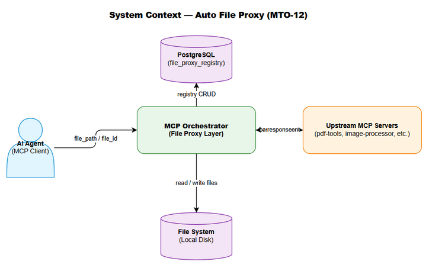
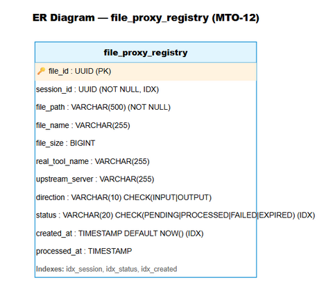
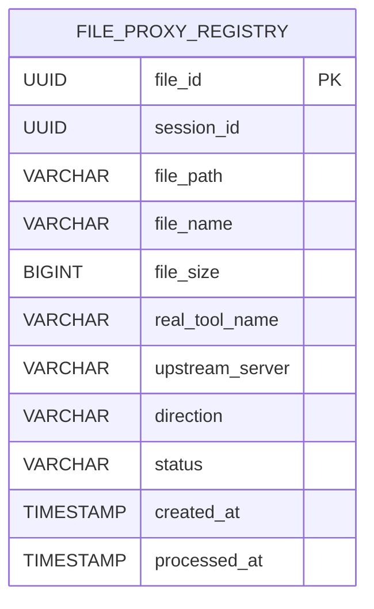
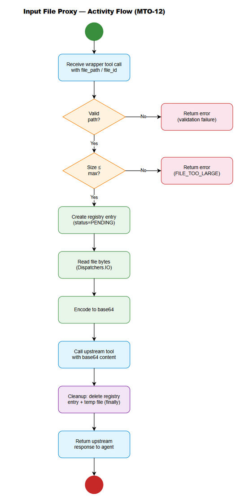
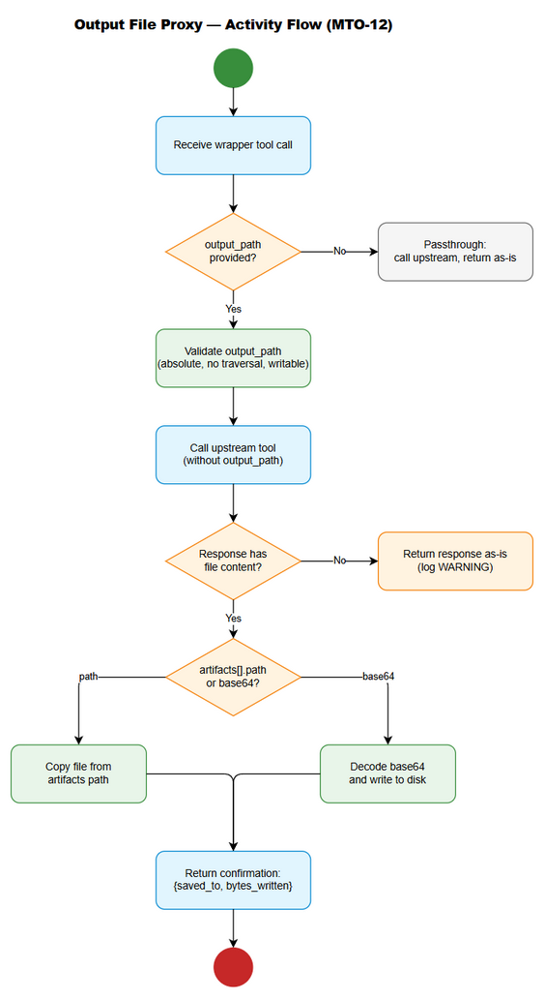

# Functional Specification Document (FSD)

## MCP Tool Orchestration — MTO-12: Auto File Proxy (Input + Output)

---

## Document Information

| Field | Value |
|-------|-------|
| Jira Ticket | MTO-12 |
| Title | Auto File Proxy — Wrapper tool tự động cho upstream MCP tools nhận/trả file |
| Author | TA Agent |
| Version | 1.0 |
| Date | 2026-05-05 |
| Status | Draft |
| Related BRD | documents/MTO-12/BRD.md |

---

## Revision History

| Version | Date | Author | Changes |
|---------|------|--------|---------|
| 1.0 | 2026-05-05 | TA Agent | Initial FSD — full technical specification for Part A (Input Proxy) and Part B (Output Proxy) |

---

## 1. Introduction

### 1.1 Purpose

This FSD specifies the complete functional and technical design for the **Auto File Proxy** feature of the MCP Orchestrator Server. It covers two complementary subsystems:

- **Part A (Input File Proxy):** Automatically detects upstream MCP tools that accept base64/file content parameters, creates transparent wrapper tools that accept `file_path` (STDIO mode) or `file_id` (HTTP/SSE mode), and handles file reading + encoding without exposing file content to the AI agent's context window.

- **Part B (Output File Proxy):** Automatically detects upstream MCP tools that return file content in responses, adds an optional `output_path` parameter to wrapper tools, and handles file copying/decoding to the agent's desired location.

This document provides sufficient detail for developers to implement the feature without additional clarification.

### 1.2 Scope

**In Scope:**
- Auto-detection of input file parameters (schema-based heuristics)
- Input proxy for STDIO mode (`file_path` → base64 encoding)
- Input proxy for HTTP/SSE mode (`file_id` → base64 encoding via upload endpoint)
- Auto-detection of output file responses (schema + runtime heuristics)
- Output proxy (`output_path` → file save from upstream response)
- Database registry (`file_proxy_registry`) for file lifecycle tracking
- Lifecycle cleanup (startup, shutdown, per-request, background TTL)
- Wrapper tool generation hiding original tools from discovery
- Configurable max file size limits (global + per-server)

**Out of Scope:**
- Streaming/chunked file transfer for very large files
- File format conversion or transformation
- Encryption of files at rest
- UI for file management
- Changes to upstream MCP server implementations
- File compression before transfer

### 1.3 Definitions & Acronyms

| Term | Definition |
|------|------------|
| File Proxy | Transparent wrapper that handles file I/O on behalf of AI agents |
| Input Proxy | Converts `file_path`/`file_id` to base64 content for upstream tools |
| Output Proxy | Saves upstream file responses (path or base64) to agent-specified `output_path` |
| Running Session ID | UUID generated on each server startup, scopes file registry records |
| Wrapper Tool | Proxy tool replacing the original upstream tool in discovery responses |
| file_id | UUID reference to an uploaded file (HTTP/SSE mode only) |
| TTL | Time-To-Live — maximum age of a file registry record before cleanup |
| MCP | Model Context Protocol |
| STDIO | Standard Input/Output transport mode |
| SSE | Server-Sent Events transport mode |
| base64 | Binary-to-text encoding scheme (RFC 4648) |

### 1.4 References

| Document | Location |
|----------|----------|
| BRD — MTO-12 | documents/MTO-12/BRD.md |
| MTO-10 BRD (Orchestrator Base) | documents/MTO-10/BRD.md |
| MCP Protocol Specification | https://modelcontextprotocol.io/specification |
| Project Structure | .analysis/code-intelligence/project-structure.md |
| Kotlin SDK for MCP | io.modelcontextprotocol:kotlin-sdk-server 0.12.0 |

---

## 2. System Overview

### 2.1 System Context Diagram



The Auto File Proxy operates as an interception layer within the MCP Orchestrator, sitting between AI Agent clients and upstream MCP tool servers. It intercepts tool calls that involve file content (input or output) and transparently handles file I/O operations.

**External Actors:**
- **AI Agent (Client):** Calls wrapper tools with `file_path`/`file_id`/`output_path` — never handles raw file content
- **Upstream MCP Servers:** Provide tools that accept/return base64 file content
- **File System:** Local disk for reading input files and writing output files
- **PostgreSQL Database:** Stores `file_proxy_registry` for lifecycle tracking

### 2.2 System Architecture

The file proxy feature integrates into the existing MCP Orchestrator architecture as a new `fileproxy` package:

```
com.orchestrator.mcp/
├── fileproxy/
│   ├── FileProxyConfig.kt              # @Serializable config data class
│   ├── FileProxyService.kt             # Interface — main proxy orchestration
│   ├── FileProxyServiceImpl.kt         # Impl — coordinates detection, wrapping, I/O
│   ├── InputFileProxyHandler.kt        # Handles input file → base64 conversion
│   ├── OutputFileProxyHandler.kt       # Handles output response → file save
│   ├── FileProxyDetector.kt            # Schema-based detection of file parameters
│   ├── WrapperToolGenerator.kt         # Generates wrapper tool definitions
│   ├── FileProxyRegistry.kt            # Interface — DB registry operations
│   ├── FileProxyRegistryImpl.kt        # Impl — PostgreSQL CRUD for file_proxy_registry
│   ├── FileProxyCleanupService.kt      # Lifecycle cleanup (startup/shutdown/TTL)
│   ├── FileUploadHandler.kt            # HTTP/SSE file upload endpoint
│   └── model/
│       ├── FileProxyEntry.kt           # Domain model for registry record
│       ├── DetectionResult.kt          # Result of schema detection
│       ├── ProxyDirection.kt           # Enum: INPUT, OUTPUT
│       └── FileProxyStatus.kt          # Enum: PENDING, PROCESSED, FAILED, EXPIRED
├── ... (existing packages unchanged)
```

**Key Integration Points:**
- `ToolDiscoveryService` → calls `FileProxyDetector` during tool discovery to identify proxy candidates
- `ToolExecutionDispatcher` → routes wrapper tool calls through `FileProxyService` before/after upstream execution
- `UpstreamServerManager` → triggers re-detection when new servers connect
- `Application.kt` → initializes `FileProxyCleanupService` on startup, registers shutdown hook

---

## 3. Functional Requirements

### 3.1 Feature: Auto-Detection of Input File Parameters

**Source:** [Implements: Story #1]

#### 3.1.1 Description

On tool discovery (when upstream MCP servers connect or reconnect), the orchestrator scans each tool's `inputSchema` for parameters that indicate file/binary content. Detection uses a multi-signal heuristic approach combining schema type declarations, description keywords, and parameter name patterns. Results are stored in memory for wrapper tool generation.

#### 3.1.2 Use Case

**Use Case ID:** UC-001  
**Actor:** System (Orchestrator — automatic on startup/reconnect)  
**Preconditions:**
- At least one upstream MCP server is connected
- Upstream server exposes tools with `inputSchema`

**Postconditions:**
- All tools with file content parameters are identified and flagged
- Detection results stored in `FileProxyDetector` memory cache

**Main Flow:**

| Step | Actor | System | Description |
|------|-------|--------|-------------|
| 1 | | Orchestrator | Upstream server connects, tools/list response received |
| 2 | | FileProxyDetector | Iterate each tool's `inputSchema.properties` |
| 3 | | FileProxyDetector | For each parameter, apply detection heuristics (type, description, name) |
| 4 | | FileProxyDetector | If ≥1 heuristic matches → flag parameter as file content |
| 5 | | FileProxyDetector | Store `DetectionResult` (tool_name, server_name, param_name, detection_method) |
| 6 | | WrapperToolGenerator | Triggered to create wrapper tools for flagged tools |

**Alternative Flows:**

| ID | Condition | Steps |
|----|-----------|-------|
| AF-1 | Tool has multiple file parameters | Detect all file params; wrapper replaces each with corresponding `file_path_N` or `file_id_N` |
| AF-2 | Tool already has a wrapper (re-detection on reconnect) | Skip if existing wrapper is still valid; regenerate if schema changed |

**Exception Flows:**

| ID | Condition | Steps |
|----|-----------|-------|
| EF-1 | Upstream tool schema is malformed/missing `inputSchema` | Log WARN, skip tool, continue with remaining tools |
| EF-2 | Zero file parameters detected across all tools | Log INFO "No file proxy candidates found", system operates normally |
| EF-3 | Detection throws unexpected exception | Log ERROR with stack trace, skip tool, do not crash server |

#### 3.1.3 Business Rules

| Rule ID | Rule | Source |
|---------|------|--------|
| BR-001 | At least one detection heuristic must match for a parameter to be flagged | BRD Story #1 |
| BR-002 | Parameters named "content" without file-related description AND type "string" must NOT be flagged (false positive prevention) | BRD Story #1 |
| BR-003 | Detection runs on server startup AND when new upstream servers connect | BRD Story #1 |
| BR-004 | Multiple file parameters in the same tool are all detected independently | BRD Story #1 |

#### 3.1.4 Data Specifications

**Input Data (Tool Schema from Upstream):**

| Field | Type | Required | Validation | Description |
|-------|------|----------|------------|-------------|
| tool.name | String | Yes | Non-empty | Upstream tool name |
| tool.inputSchema | JsonObject | Yes | Valid JSON Schema | Tool's parameter schema |
| tool.inputSchema.properties.{param}.type | String | No | — | Parameter type declaration |
| tool.inputSchema.properties.{param}.description | String | No | — | Parameter description text |

**Output Data (DetectionResult):**

| Field | Type | Description |
|-------|------|-------------|
| toolName | String | Name of the detected upstream tool |
| serverName | String | Upstream MCP server name |
| paramName | String | Name of the base64/file parameter |
| paramType | String | Detected type: `base64`, `binary`, `file_content` |
| detectionMethod | DetectionMethod | Enum: `SCHEMA_TYPE`, `DESCRIPTION_KEYWORD`, `NAME_PATTERN` |
| confidence | Float | Detection confidence score (0.0–1.0) |

#### 3.1.5 UI Specifications

Not applicable — this feature is fully automated with no UI.

#### 3.1.6 API Specifications

**Internal Service Interface — No external API endpoint.** Detection is triggered internally during tool discovery.

```kotlin
// FileProxyDetector.kt
interface FileProxyDetector {
    /**
     * Scan a tool's inputSchema for file content parameters.
     * @return List of detected file parameters (empty if none found)
     */
    suspend fun detectInputFileParams(
        toolName: String,
        serverName: String,
        inputSchema: JsonObject
    ): List<DetectionResult>

    /**
     * Scan a tool's outputSchema/response pattern for file output indicators.
     * @return true if tool is detected as producing file output
     */
    suspend fun detectOutputFileResponse(
        toolName: String,
        serverName: String,
        outputSchema: JsonObject?
    ): Boolean

    /**
     * Get all detection results for a given server.
     */
    fun getDetectionResults(serverName: String): List<DetectionResult>
}
```

**Detection Heuristics (Pseudocode):**

```kotlin
// Pseudocode for input file parameter detection [Implements: Story #1]
fun detectFileParam(paramName: String, paramSchema: JsonObject): DetectionResult? {
    val type = paramSchema["type"]?.jsonPrimitive?.content
    val description = paramSchema["description"]?.jsonPrimitive?.content ?: ""
    val descLower = description.lowercase()

    // Heuristic 1: Explicit type declaration
    if (type in listOf("base64", "binary")) {
        return DetectionResult(detectionMethod = SCHEMA_TYPE, confidence = 1.0f)
    }

    // Heuristic 2: Description keywords
    val fileKeywords = listOf("file content", "base64 encoded", "binary content", "file data", "base64-encoded")
    if (fileKeywords.any { it in descLower }) {
        return DetectionResult(detectionMethod = DESCRIPTION_KEYWORD, confidence = 0.9f)
    }

    // Heuristic 3: Parameter name patterns
    val fileNamePatterns = listOf("content", "file_content", "data", "file_data", "base64_content", "binary_data")
    if (paramName in fileNamePatterns && type != "string") {
        // Only flag if type is NOT plain "string" (prevents false positives like "message content")
        return DetectionResult(detectionMethod = NAME_PATTERN, confidence = 0.7f)
    }

    // Heuristic 3b: Name pattern WITH file-related description (even if type is string)
    if (paramName in fileNamePatterns && fileKeywords.any { it in descLower }) {
        return DetectionResult(detectionMethod = NAME_PATTERN, confidence = 0.85f)
    }

    return null // Not a file parameter
}
```

---

### 3.2 Feature: Input File Proxy — STDIO Mode (file_path)

**Source:** [Implements: Story #2]

#### 3.2.1 Description

For STDIO transport mode, the wrapper tool replaces each detected base64 parameter with a `file_path` parameter. When the wrapper is called, the orchestrator reads the file from disk, encodes it to base64, registers the operation in `file_proxy_registry`, calls the real upstream tool, and cleans up after completion. The AI agent's context window never contains file content.

#### 3.2.2 Use Case

**Use Case ID:** UC-002  
**Actor:** AI Agent  
**Preconditions:**
- Wrapper tool has been generated for the target upstream tool
- File exists at the specified `file_path` on the orchestrator's file system
- File size is within configured maximum

**Postconditions:**
- Upstream tool has been called with base64-encoded file content
- Registry record has been created and cleaned up
- AI Agent receives upstream tool response (without file content)

**Main Flow:**

| Step | Actor | System | Description |
|------|-------|--------|-------------|
| 1 | AI Agent | | Calls wrapper tool with `{file_path: "/path/to/file.pdf", ...other_params}` |
| 2 | | InputFileProxyHandler | Validate `file_path`: absolute path, no traversal, exists, readable |
| 3 | | InputFileProxyHandler | Check file size against `file-proxy.max-size-mb` |
| 4 | | FileProxyRegistry | INSERT record: status=PENDING, direction=INPUT |
| 5 | | InputFileProxyHandler | Read file bytes using `kotlinx.io` with Dispatchers.IO |
| 6 | | InputFileProxyHandler | Encode bytes to base64 string |
| 7 | | ToolExecutionDispatcher | Call real upstream tool with base64 content + other params |
| 8 | | FileProxyRegistry | UPDATE status=PROCESSED, set processed_at |
| 9 | | FileProxyRegistry | DELETE record (per-request cleanup) |
| 10 | | Orchestrator | Return upstream response to AI Agent |

**Alternative Flows:**

| ID | Condition | Steps |
|----|-----------|-------|
| AF-1 | Tool has multiple file parameters | Read and encode each file independently; all must pass validation |
| AF-2 | File path is relative (not absolute) | Resolve relative to configured `temp-directory`; log WARN |

**Exception Flows:**

| ID | Condition | Steps |
|----|-----------|-------|
| EF-1 | File not found | Return error: `"File not found: {file_path}"`, no registry record created |
| EF-2 | File exceeds max size | Return error: `"File exceeds maximum size ({max}MB). Actual: {actual}MB"` |
| EF-3 | File not readable (permissions) | Return error: `"Cannot read file: {file_path} — permission denied"` |
| EF-4 | Path traversal detected (`../`) | Return error: `"Invalid file path: path traversal not allowed"` |
| EF-5 | Upstream tool call fails | Update registry status=FAILED, cleanup record, return upstream error |
| EF-6 | Base64 encoding OOM (very large file) | Catch OutOfMemoryError, return error, cleanup |

#### 3.2.3 Business Rules

| Rule ID | Rule | Source |
|---------|------|--------|
| BR-005 | `file_path` must be an absolute path | BRD Story #2 |
| BR-006 | File size must not exceed configurable maximum (default: 50MB) | BRD Story #2 |
| BR-007 | Path must not contain `../` sequences | BRD Story #2 |
| BR-008 | File content never appears in tool call arguments visible to AI Agent | BRD Story #2 |
| BR-009 | Registry record created BEFORE processing, cleaned AFTER (success or failure) | BRD Story #2 |

#### 3.2.4 Data Specifications

**Input Data:**

| Field | Type | Required | Validation | Description |
|-------|------|----------|------------|-------------|
| file_path | String | Yes | Absolute path, no `../`, file exists, readable, size ≤ max | Path to input file |
| (other params) | Various | Per original schema | Original tool validation | Non-file parameters passed through unchanged |

**Output Data:**

| Field | Type | Description |
|-------|------|-------------|
| content | JsonArray | Upstream tool response content items |
| isError | Boolean | Whether upstream tool returned an error |

#### 3.2.5 UI Specifications

Not applicable — STDIO mode has no UI.

#### 3.2.6 API Specifications

**Wrapper Tool Schema (generated dynamically):**

```json
{
  "name": "{original_tool_name}",
  "description": "{original_description}. Accepts file_path instead of base64 content — file is read and encoded automatically.",
  "inputSchema": {
    "type": "object",
    "properties": {
      "file_path": {
        "type": "string",
        "description": "Absolute path to the input file. File will be read and base64-encoded automatically."
      }
    },
    "required": ["file_path"]
  }
}
```

**Internal Handler Interface:**

```kotlin
// InputFileProxyHandler.kt
interface InputFileProxyHandler {
    /**
     * Process an input file proxy request.
     * Reads file, encodes to base64, calls upstream tool.
     * @param toolName Original upstream tool name
     * @param serverName Upstream server name
     * @param filePath Absolute path to input file
     * @param fileParamName Name of the base64 parameter in upstream schema
     * @param otherArgs Other tool arguments (passed through unchanged)
     * @return Upstream tool response
     */
    suspend fun processInputProxy(
        toolName: String,
        serverName: String,
        filePath: String,
        fileParamName: String,
        otherArgs: JsonObject
    ): ExecuteToolResponse
}
```

**Error Codes:**

| Code | Message | Description |
|------|---------|-------------|
| FILE_NOT_FOUND | File not found: {file_path} | Specified file does not exist |
| FILE_TOO_LARGE | File exceeds maximum size ({max}MB). Actual: {actual}MB | File exceeds configured limit |
| FILE_NOT_READABLE | Cannot read file: {file_path} — permission denied | Insufficient permissions |
| INVALID_PATH | Invalid file path: path traversal not allowed | Path contains `../` |
| ENCODING_FAILED | Failed to encode file: {reason} | Base64 encoding error (OOM, IO) |

---

### 3.3 Feature: Input File Proxy — HTTP/SSE Mode (file_id)

**Source:** [Implements: Story #3]

#### 3.3.1 Description

For HTTP/SSE transport mode, the orchestrator provides an `upload_file` MCP tool that accepts a file path, stores the file temporarily on the server, and returns a `file_id` (UUID). Subsequent wrapper tool calls reference this `file_id` instead of raw file content. The orchestrator resolves `file_id` to the stored file, encodes to base64, and calls the upstream tool.

#### 3.3.2 Use Case

**Use Case ID:** UC-003  
**Actor:** AI Agent (via HTTP/SSE transport)  
**Preconditions:**
- Orchestrator is running in HTTP/SSE transport mode
- `upload_file` tool is registered and discoverable
- File exists at the path accessible to the agent

**Postconditions:**
- File is stored temporarily on orchestrator server
- `file_id` is returned to agent for subsequent use
- After tool call using `file_id`, temp file is cleaned up

**Main Flow:**

| Step | Actor | System | Description |
|------|-------|--------|-------------|
| 1 | AI Agent | | Calls `upload_file` tool with `{file_path: "/path/to/file.pdf"}` |
| 2 | | FileUploadHandler | Validate file path, check size |
| 3 | | FileUploadHandler | Generate UUID as `file_id` |
| 4 | | FileUploadHandler | Copy file to temp directory: `{temp-dir}/{file_id}` |
| 5 | | FileProxyRegistry | INSERT record: file_id, status=PENDING, direction=INPUT, expires_at |
| 6 | | FileUploadHandler | Return `{file_id: "uuid", file_name: "file.pdf", expires_in: "60m"}` |
| 7 | AI Agent | | Calls wrapper tool with `{file_id: "uuid", ...other_params}` |
| 8 | | InputFileProxyHandler | Resolve `file_id` → temp file path from registry |
| 9 | | InputFileProxyHandler | Read temp file, encode to base64 |
| 10 | | ToolExecutionDispatcher | Call real upstream tool with base64 content |
| 11 | | FileProxyRegistry | UPDATE status=PROCESSED, DELETE record |
| 12 | | FileUploadHandler | Delete temp file from disk |
| 13 | | Orchestrator | Return upstream response to AI Agent |

**Alternative Flows:**

| ID | Condition | Steps |
|----|-----------|-------|
| AF-1 | Agent calls wrapper before uploading | Return error: "File not found — file_id may have expired" |
| AF-2 | Same file_id used in multiple tool calls | After first use, file is deleted; second call returns expired error |

**Exception Flows:**

| ID | Condition | Steps |
|----|-----------|-------|
| EF-1 | Invalid file_id format (not UUID) | Return error: `"Invalid file_id format — expected UUID"` |
| EF-2 | file_id not found in registry | Return error: `"File not found — file_id may have expired"` |
| EF-3 | File expired (TTL exceeded) | Return error: `"File expired — please re-upload"` |
| EF-4 | Upload fails (disk full) | Return error: `"Upload failed — insufficient storage"` |
| EF-5 | Temp file deleted externally | Return error: `"File not found on disk — please re-upload"` |

#### 3.3.3 Business Rules

| Rule ID | Rule | Source |
|---------|------|--------|
| BR-010 | `file_id` must be a valid UUID format | BRD Story #3 |
| BR-011 | Uploaded files expire after configurable TTL (default: 60 minutes) | BRD Story #3 |
| BR-012 | `upload_file` tool is only registered when transport mode is HTTP/SSE | BRD Story #3 |
| BR-013 | Temp files stored with restrictive permissions (owner read/write only) | BRD NFR |

#### 3.3.4 Data Specifications

**Input Data (upload_file):**

| Field | Type | Required | Validation | Description |
|-------|------|----------|------------|-------------|
| file_path | String | Yes | Absolute path, exists, readable, size ≤ max | Path to file to upload |

**Output Data (upload_file response):**

| Field | Type | Description |
|-------|------|-------------|
| file_id | UUID (String) | Unique identifier for the uploaded file |
| file_name | String | Original filename extracted from path |
| file_size | Long | File size in bytes |
| expires_in | String | Human-readable TTL (e.g., "60m") |
| expires_at | String (ISO 8601) | Absolute expiration timestamp |

**Input Data (wrapper tool with file_id):**

| Field | Type | Required | Validation | Description |
|-------|------|----------|------------|-------------|
| file_id | String (UUID) | Yes | Valid UUID, exists in registry, not expired | Reference to uploaded file |

#### 3.3.5 UI Specifications

Not applicable — HTTP/SSE mode is API-only.

#### 3.3.6 API Specifications

**Tool: `upload_file`**

```json
{
  "name": "upload_file",
  "description": "Upload a file for use with tools that require file content. Returns a file_id that can be used in subsequent tool calls.",
  "inputSchema": {
    "type": "object",
    "properties": {
      "file_path": {
        "type": "string",
        "description": "Absolute path to the file to upload"
      }
    },
    "required": ["file_path"]
  }
}
```

**Response Schema (success):**

```json
{
  "content": [
    {
      "type": "text",
      "text": "{\"file_id\": \"550e8400-e29b-41d4-a716-446655440000\", \"file_name\": \"report.pdf\", \"file_size\": 1048576, \"expires_in\": \"60m\", \"expires_at\": \"2026-05-05T11:30:00Z\"}"
    }
  ]
}
```

**Wrapper Tool Schema (HTTP/SSE mode):**

```json
{
  "name": "{original_tool_name}",
  "description": "{original_description}. Accepts file_id (from upload_file) instead of base64 content.",
  "inputSchema": {
    "type": "object",
    "properties": {
      "file_id": {
        "type": "string",
        "description": "UUID returned from upload_file tool. File content will be resolved automatically."
      }
    },
    "required": ["file_id"]
  }
}
```

**Error Codes:**

| Code | Message | Description |
|------|---------|-------------|
| INVALID_FILE_ID | Invalid file_id format — expected UUID | file_id is not a valid UUID |
| FILE_ID_NOT_FOUND | File not found — file_id may have expired | No registry record for this file_id |
| FILE_EXPIRED | File expired — please re-upload | TTL exceeded |
| UPLOAD_FAILED | Upload failed — insufficient storage | Disk full or write error |
| FILE_MISSING_ON_DISK | File not found on disk — please re-upload | Temp file was deleted externally |

---

### 3.4 Feature: Database Registry for File Lifecycle Tracking

**Source:** [Implements: Story #4]

#### 3.4.1 Description

A PostgreSQL table `file_proxy_registry` tracks all file proxy operations (input uploads and output saves). Each record is scoped to a Running Session ID (UUID generated on server startup). The registry enables cleanup strategies: startup cleanup (purge previous sessions), shutdown cleanup (purge current session), per-request cleanup (delete after each tool call), and TTL cleanup (background job for expired records).

#### 3.4.2 Use Case

**Use Case ID:** UC-004  
**Actor:** System (automatic lifecycle management)  
**Preconditions:**
- PostgreSQL database is accessible
- `file_proxy_registry` table exists (created via migration)

**Postconditions:**
- Every file proxy operation has a corresponding registry record during processing
- Records are cleaned up after processing completes
- No orphan records persist across server restarts

**Main Flow:**

| Step | Actor | System | Description |
|------|-------|--------|-------------|
| 1 | | Application | On startup, generate new Running Session ID (UUID) |
| 2 | | FileProxyCleanupService | Startup cleanup: delete records from previous sessions + orphan files |
| 3 | | FileProxyRegistry | On each proxy operation: INSERT record with status=PENDING |
| 4 | | FileProxyRegistry | On operation success: UPDATE status=PROCESSED, DELETE record |
| 5 | | FileProxyRegistry | On operation failure: UPDATE status=FAILED, DELETE record |
| 6 | | FileProxyCleanupService | Background job (every 15min): delete expired records (TTL) |
| 7 | | FileProxyCleanupService | On shutdown: delete all current session records + temp files |

**Alternative Flows:**

| ID | Condition | Steps |
|----|-----------|-------|
| AF-1 | Database unavailable during registry write | Log ERROR, proceed without registry (degraded mode — no cleanup guarantee) |
| AF-2 | Record exists but file already deleted from disk | Delete orphan record during cleanup |

**Exception Flows:**

| ID | Condition | Steps |
|----|-----------|-------|
| EF-1 | Database connection failure | Log ERROR, continue operation in degraded mode |
| EF-2 | Orphan file found without registry record | Delete file during startup cleanup |
| EF-3 | Cleanup timeout on shutdown (>30s) | Force exit, orphans handled on next startup |

#### 3.4.3 Business Rules

| Rule ID | Rule | Source |
|---------|------|--------|
| BR-014 | Every file proxy operation creates a registry record BEFORE processing | BRD Story #4 |
| BR-015 | Records are deleted after successful processing (per-request cleanup) | BRD Story #4 |
| BR-016 | Session ID changes on every server restart | BRD Story #4 |
| BR-017 | Status transitions: PENDING → PROCESSED (success) or PENDING → FAILED (error) | BRD Story #4 |
| BR-018 | Startup cleanup must complete before server accepts new requests | BRD Story #9 |

#### 3.4.4 Data Specifications

**Registry Record (FileProxyEntry):**

| Field | Type | Required | Validation | Description |
|-------|------|----------|------------|-------------|
| file_id | UUID | Yes (PK) | Auto-generated | Unique file identifier |
| session_id | UUID | Yes | Must match current session for active ops | Running session ID |
| file_path | String (500) | Yes | Non-empty, valid path | Path to file on disk |
| file_name | String (255) | No | — | Original filename |
| file_size | Long | No | ≥ 0 | File size in bytes |
| real_tool_name | String (255) | No | — | Upstream tool being called |
| upstream_server | String (255) | No | — | Upstream server name |
| direction | String (10) | Yes | `INPUT` or `OUTPUT` | Proxy direction |
| status | String (20) | Yes | `PENDING`, `PROCESSED`, `FAILED`, `EXPIRED` | Lifecycle status |
| created_at | Timestamp | Yes | Auto-set | Record creation time |
| processed_at | Timestamp | No | Set on completion | Processing completion time |

#### 3.4.5 UI Specifications

Not applicable.

#### 3.4.6 API Specifications

**Internal Service Interface:**

```kotlin
// FileProxyRegistry.kt
interface FileProxyRegistry {
    suspend fun createEntry(entry: FileProxyEntry): FileProxyEntry
    suspend fun updateStatus(fileId: UUID, status: FileProxyStatus, processedAt: Instant? = null)
    suspend fun deleteEntry(fileId: UUID)
    suspend fun findByFileId(fileId: UUID): FileProxyEntry?
    suspend fun findBySessionId(sessionId: UUID): List<FileProxyEntry>
    suspend fun deleteBySessionId(sessionId: UUID): Int
    suspend fun deleteExpiredEntries(olderThan: Instant): Int
    suspend fun findOrphanEntries(currentSessionId: UUID): List<FileProxyEntry>
}
```

**SQL Migration:**

```sql
-- V2__create_file_proxy_registry.sql
CREATE TABLE file_proxy_registry (
    file_id         UUID PRIMARY KEY,
    session_id      UUID NOT NULL,
    file_path       VARCHAR(500) NOT NULL,
    file_name       VARCHAR(255),
    file_size       BIGINT,
    real_tool_name  VARCHAR(255),
    upstream_server VARCHAR(255),
    direction       VARCHAR(10) NOT NULL DEFAULT 'INPUT',
    status          VARCHAR(20) NOT NULL DEFAULT 'PENDING',
    created_at      TIMESTAMP NOT NULL DEFAULT NOW(),
    processed_at    TIMESTAMP
);

CREATE INDEX idx_file_proxy_session ON file_proxy_registry(session_id);
CREATE INDEX idx_file_proxy_status ON file_proxy_registry(status);
CREATE INDEX idx_file_proxy_created ON file_proxy_registry(created_at);
```

---

### 3.5 Feature: Wrapper Tool Hiding Original Tools

**Source:** [Implements: Story #5]

#### 3.5.1 Description

When a wrapper tool is created for an upstream tool, the original tool is removed from `find_tools` discovery responses. The wrapper uses the same name as the original (transparent replacement) with an enhanced description indicating file proxy capability. If wrapper creation fails, the original tool remains visible (graceful degradation).

#### 3.5.2 Use Case

**Use Case ID:** UC-005  
**Actor:** AI Agent (via find_tools)  
**Preconditions:**
- Upstream tool has been detected as requiring file proxy
- Wrapper tool has been successfully generated

**Postconditions:**
- `find_tools` returns wrapper tool instead of original
- Original tool is hidden but still callable internally
- Wrapper preserves all non-file parameters

**Main Flow:**

| Step | Actor | System | Description |
|------|-------|--------|-------------|
| 1 | | WrapperToolGenerator | Generate wrapper tool definition from detection results |
| 2 | | ToolRegistry | Register wrapper tool with same name as original |
| 3 | | ToolRegistry | Mark original tool as hidden (not removed from internal registry) |
| 4 | AI Agent | | Calls `find_tools` with query matching the tool |
| 5 | | ToolDiscoveryService | Returns wrapper tool (original is filtered out) |
| 6 | AI Agent | | Calls `execute_dynamic_tool` with wrapper tool name |
| 7 | | ToolExecutionDispatcher | Routes to FileProxyService (not directly to upstream) |

**Alternative Flows:**

| ID | Condition | Steps |
|----|-----------|-------|
| AF-1 | Wrapper creation fails | Log ERROR, keep original tool visible, continue normal operation |
| AF-2 | Tool requires both input AND output proxy | Single wrapper handles both directions |

**Exception Flows:**

| ID | Condition | Steps |
|----|-----------|-------|
| EF-1 | Wrapper tool call fails internally | Log ERROR, attempt fallback to original tool directly |
| EF-2 | Original tool schema changes on reconnect | Regenerate wrapper; if regeneration fails, expose original |

#### 3.5.3 Business Rules

| Rule ID | Rule | Source |
|---------|------|--------|
| BR-019 | Wrapper tool name must exactly match original tool name | BRD Story #5 |
| BR-020 | All non-file parameters preserved unchanged in wrapper schema | BRD Story #5 |
| BR-021 | Original tool remains callable internally (hidden, not deleted) | BRD Story #5 |
| BR-022 | If wrapper fails to initialize, original tool remains discoverable | BRD Story #5 |

#### 3.5.4 Data Specifications

**Wrapper Tool Definition:**

| Field | Type | Description |
|-------|------|-------------|
| name | String | Same as original tool name |
| description | String | Original description + " Accepts file_path/file_id instead of base64 content." |
| inputSchema | JsonObject | Modified schema: file params replaced, other params preserved |
| isProxy | Boolean | Internal flag: true (not exposed to agents) |
| originalToolName | String | Internal: reference to hidden original |
| proxyDirection | Set\<ProxyDirection\> | INPUT, OUTPUT, or both |

#### 3.5.5 UI Specifications

Not applicable.

#### 3.5.6 API Specifications

**WrapperToolGenerator Interface:**

```kotlin
// WrapperToolGenerator.kt
interface WrapperToolGenerator {
    /**
     * Generate a wrapper tool definition that replaces file parameters.
     * @param originalTool The original upstream tool definition
     * @param detectionResults Detected file parameters for this tool
     * @param transportMode Current transport mode (STDIO or HTTP)
     * @return Generated wrapper tool definition, or null if generation fails
     */
    fun generateWrapper(
        originalTool: ToolDefinition,
        detectionResults: List<DetectionResult>,
        transportMode: TransportType
    ): ToolDefinition?

    /**
     * Check if a tool has an active wrapper.
     */
    fun hasWrapper(toolName: String, serverName: String): Boolean

    /**
     * Get the original tool definition for a wrapper.
     */
    fun getOriginalTool(wrapperToolName: String): ToolDefinition?
}
```

**Integration with ToolRegistry:**

```kotlin
// Pseudocode for wrapper registration [Implements: Story #5]
suspend fun registerWrapperTool(
    originalTool: ToolEntry,
    wrapper: ToolDefinition
) {
    // Step 1: Mark original as hidden (internal flag)
    toolRegistry.setHidden(originalTool.name, originalTool.serverName, hidden = true)

    // Step 2: Register wrapper with same name
    val wrapperEntry = ToolEntry(
        name = wrapper.name,
        serverName = originalTool.serverName,
        definition = wrapper,
        isProxy = true,
        originalToolRef = originalTool.name
    )
    toolRegistry.registerTool(wrapperEntry)

    // Step 3: Re-index in vector DB for discovery
    toolIndexer.indexTool(wrapperEntry)
}
```

---

### 3.6 Feature: Output File Proxy — Save to output_path

**Source:** [Implements: Story #6]

#### 3.6.1 Description

For tools detected as returning file content in responses, the wrapper adds an optional `output_path` parameter. When provided, the orchestrator intercepts the upstream response, extracts file content (from `artifacts[].path` or base64 fields), and saves it to the specified `output_path`. When `output_path` is not provided, the response passes through unchanged (full backward compatibility).

#### 3.6.2 Use Case

**Use Case ID:** UC-006  
**Actor:** AI Agent  
**Preconditions:**
- Tool has been detected as returning file content in responses
- Wrapper tool includes optional `output_path` parameter
- Parent directory of `output_path` exists and is writable

**Postconditions:**
- File is saved to `output_path`
- Agent receives confirmation response (not raw file content)
- Registry record created and cleaned up

**Main Flow:**

| Step | Actor | System | Description |
|------|-------|--------|-------------|
| 1 | AI Agent | | Calls wrapper tool with `{output_path: "/dest/result.pdf", ...params}` |
| 2 | | OutputFileProxyHandler | Validate `output_path`: absolute, no traversal, parent dir exists, writable |
| 3 | | FileProxyRegistry | INSERT record: status=PENDING, direction=OUTPUT |
| 4 | | ToolExecutionDispatcher | Forward call to real upstream tool (without output_path) |
| 5 | | OutputFileProxyHandler | Inspect upstream response for file content |
| 6a | | OutputFileProxyHandler | If `artifacts[].path` found: copy file from source to `output_path` |
| 6b | | OutputFileProxyHandler | If base64 field found: decode and write to `output_path` |
| 7 | | FileProxyRegistry | UPDATE status=PROCESSED, DELETE record |
| 8 | | Orchestrator | Return cleaned response: `{saved_to: output_path, bytes_written: N}` |

**Alternative Flows:**

| ID | Condition | Steps |
|----|-----------|-------|
| AF-1 | `output_path` NOT provided | Skip output proxy; return upstream response unchanged (passthrough) |
| AF-2 | File already exists at `output_path` | Overwrite (default behavior; configurable) |
| AF-3 | Upstream returns multiple files | Save first file to `output_path`; log warning about additional files |

**Exception Flows:**

| ID | Condition | Steps |
|----|-----------|-------|
| EF-1 | Output directory does not exist | Return error: `"Output directory does not exist: {dir}"` |
| EF-2 | Output path not writable | Return error: `"Cannot write to output path: {path} — permission denied"` |
| EF-3 | Upstream response has no file content | Return response as-is with warning logged |
| EF-4 | File copy/decode failure | Return error with details; original response preserved in logs |
| EF-5 | Output file exceeds max size | Return error: `"Output file exceeds maximum size"` |

#### 3.6.3 Business Rules

| Rule ID | Rule | Source |
|---------|------|--------|
| BR-023 | `output_path` must be an absolute path | BRD Story #6 |
| BR-024 | Parent directory of `output_path` must exist and be writable | BRD Story #6 |
| BR-025 | `output_path` must not contain path traversal sequences | BRD Story #6 |
| BR-026 | When `output_path` is not provided, behavior is identical to original tool | BRD Story #6 |
| BR-027 | Existing file at `output_path` is overwritten by default | BRD Story #6 |

#### 3.6.4 Data Specifications

**Input Data:**

| Field | Type | Required | Validation | Description |
|-------|------|----------|------------|-------------|
| output_path | String | No | Absolute path, no `../`, parent dir exists, writable | Desired output location |
| (other params) | Various | Per original schema | Original tool validation | Passed through to upstream |

**Output Data (when output_path provided):**

| Field | Type | Description |
|-------|------|-------------|
| saved_to | String | Absolute path where file was saved |
| bytes_written | Long | Size of saved file in bytes |
| source_type | String | `FILE_PATH` or `BASE64_CONTENT` |
| original_response | JsonObject | Upstream response (with file content stripped) |

#### 3.6.5 UI Specifications

Not applicable.

#### 3.6.6 API Specifications

**Wrapper Tool Schema (with output_path):**

```json
{
  "name": "{original_tool_name}",
  "description": "{original_description}. Optionally specify output_path to save file output to a specific location.",
  "inputSchema": {
    "type": "object",
    "properties": {
      "output_path": {
        "type": "string",
        "description": "Optional. Absolute path where output file should be saved. If not provided, response is returned as-is."
      }
    }
  }
}
```

**OutputFileProxyHandler Interface:**

```kotlin
// OutputFileProxyHandler.kt
interface OutputFileProxyHandler {
    /**
     * Process output proxy: extract file from upstream response and save to output_path.
     * @param upstreamResponse Raw response from upstream tool
     * @param outputPath Desired output file location
     * @return Modified response with save confirmation
     */
    suspend fun processOutputProxy(
        upstreamResponse: ExecuteToolResponse,
        outputPath: String
    ): ExecuteToolResponse

    /**
     * Detect if upstream response contains file content.
     */
    fun containsFileContent(response: ExecuteToolResponse): Boolean
}
```

**Response Extraction Pseudocode:**

```kotlin
// Pseudocode for output file extraction [Implements: Story #6]
suspend fun extractAndSaveFile(response: JsonObject, outputPath: String): OutputResult {
    // Strategy 1: artifacts[].path — file path in response
    val artifacts = response["artifacts"]?.jsonArray
    if (artifacts != null) {
        val firstArtifact = artifacts.first().jsonObject
        val sourcePath = firstArtifact["path"]?.jsonPrimitive?.content
        if (sourcePath != null && File(sourcePath).exists()) {
            val bytes = File(sourcePath).copyTo(File(outputPath), overwrite = true)
            return OutputResult(savedTo = outputPath, bytesWritten = bytes.length(), sourceType = FILE_PATH)
        }
    }

    // Strategy 2: base64 content field
    val contentFields = response.entries.filter { isBase64Content(it.value) }
    if (contentFields.isNotEmpty()) {
        val base64String = contentFields.first().value.jsonPrimitive.content
        val decoded = Base64.getDecoder().decode(base64String)
        File(outputPath).writeBytes(decoded)
        return OutputResult(savedTo = outputPath, bytesWritten = decoded.size.toLong(), sourceType = BASE64_CONTENT)
    }

    // No file content found
    throw FileProxyException("Upstream response does not contain extractable file content")
}
```

**Error Codes:**

| Code | Message | Description |
|------|---------|-------------|
| OUTPUT_DIR_NOT_FOUND | Output directory does not exist: {dir} | Parent directory missing |
| OUTPUT_NOT_WRITABLE | Cannot write to output path: {path} — permission denied | Permission error |
| NO_FILE_IN_RESPONSE | Upstream response does not contain file content | Detection mismatch |
| OUTPUT_SAVE_FAILED | Failed to save output file: {reason} | I/O error during save |

---

### 3.7 Feature: Auto-Detection of Output File Responses

**Source:** [Implements: Story #7]

#### 3.7.1 Description

During tool discovery, the orchestrator scans upstream tool schemas for output file indicators (static detection). Additionally, after the first successful call to a tool, the response structure is inspected for file content patterns (runtime detection). Once detected, the wrapper is updated to include the `output_path` parameter.

#### 3.7.2 Use Case

**Use Case ID:** UC-007  
**Actor:** System (automatic detection)  
**Preconditions:**
- Upstream MCP server is connected with tools exposed
- Tools have `outputSchema` or response patterns indicating file output

**Postconditions:**
- Tools producing file output are flagged for output proxying
- Wrapper tools include optional `output_path` parameter

**Main Flow:**

| Step | Actor | System | Description |
|------|-------|--------|-------------|
| 1 | | FileProxyDetector | Static detection: scan tool's `outputSchema` for file indicators |
| 2 | | FileProxyDetector | Check tool name against output patterns (`export_*`, `generate_*`, `convert_*`, `render_*`) |
| 3 | | FileProxyDetector | If static detection matches → flag tool for output proxying |
| 4 | AI Agent | | First call to a non-flagged tool (runtime detection) |
| 5 | | FileProxyDetector | Inspect response: check for `artifacts[]` with `path` fields |
| 6 | | FileProxyDetector | Check for base64-encoded fields (length > 1000, valid charset) |
| 7 | | FileProxyDetector | If runtime detection matches → flag tool, update wrapper |

**Alternative Flows:**

| ID | Condition | Steps |
|----|-----------|-------|
| AF-1 | Tool already flagged by static detection | Skip runtime detection for this tool |
| AF-2 | Runtime detection on error response | Do NOT flag tool based on error responses |

**Exception Flows:**

| ID | Condition | Steps |
|----|-----------|-------|
| EF-1 | Schema parsing failure | Skip tool, log WARN |
| EF-2 | Runtime detection throws exception | Log ERROR, do not flag tool, continue |

#### 3.7.3 Business Rules

| Rule ID | Rule | Source |
|---------|------|--------|
| BR-028 | Static detection runs once per tool during discovery | BRD Story #7 |
| BR-029 | Runtime detection runs on first successful call only (not every call) | BRD Story #7 |
| BR-030 | Base64 detection threshold: field value length > 1000 chars AND matches base64 charset | BRD Story #7 |
| BR-031 | Tool name patterns for output: `export_*`, `generate_*`, `convert_*`, `render_*` | BRD Story #7 |
| BR-032 | Do not flag tools based on error responses | BRD Story #7 |

#### 3.7.4 Data Specifications

**Static Detection Signals:**

| Signal | Type | Weight | Example |
|--------|------|--------|---------|
| outputSchema declares file/binary/base64 type | Schema | High | `"type": "file"` |
| Response description mentions file output | Description | Medium | "returns generated PDF file" |
| Tool name matches output patterns | Name | Medium | `export_report`, `generate_pdf` |

**Runtime Detection Signals:**

| Signal | Type | Threshold | Example |
|--------|------|-----------|---------|
| Response has `artifacts[]` with `path` field | Structure | Any match | `{"artifacts": [{"path": "/tmp/out.pdf"}]}` |
| Response field with base64 content | Content | Length > 1000, valid charset | Long base64 string |

#### 3.7.5 UI Specifications

Not applicable.

#### 3.7.6 API Specifications

**Detection Pseudocode:**

```kotlin
// Pseudocode for output file detection [Implements: Story #7]
fun detectOutputFileResponse(tool: ToolDefinition): Boolean {
    // Static detection 1: outputSchema
    val outputSchema = tool.outputSchema
    if (outputSchema != null) {
        val hasFileType = outputSchema.findFieldsWithType("file", "binary", "base64")
        if (hasFileType.isNotEmpty()) return true
    }

    // Static detection 2: Tool name patterns
    val outputNamePatterns = listOf("export_", "generate_", "convert_", "render_")
    if (outputNamePatterns.any { tool.name.startsWith(it) }) return true

    // Static detection 3: Description keywords
    val outputKeywords = listOf("output file", "generated file", "artifact", "file path")
    val descLower = tool.description?.lowercase() ?: ""
    if (outputKeywords.any { it in descLower }) return true

    return false // Will be checked again at runtime
}

// Runtime detection (called after first successful tool call)
fun detectOutputFromResponse(response: JsonObject): Boolean {
    // Check for artifacts array with path
    val artifacts = response["artifacts"]?.jsonArray
    if (artifacts?.any { it.jsonObject.containsKey("path") } == true) return true

    // Check for base64 content fields
    val stringFields = response.entries
        .filter { it.value is JsonPrimitive && it.value.jsonPrimitive.isString }
        .filter { it.value.jsonPrimitive.content.length > 1000 }
    
    for (field in stringFields) {
        if (isValidBase64(field.value.jsonPrimitive.content)) return true
    }

    return false
}
```

---

### 3.8 Feature: Configurable Max File Size

**Source:** [Implements: Story #8]

#### 3.8.1 Description

A configurable maximum file size limit controls the largest file the proxy will process. The limit applies to both input (file read/upload) and output (file save) operations. A global default (50MB) can be overridden per upstream server.

#### 3.8.2 Use Case

**Use Case ID:** UC-008  
**Actor:** System Administrator  
**Preconditions:**
- Configuration file includes `file-proxy.max-size-mb` property

**Postconditions:**
- Files exceeding the limit are rejected immediately with clear error
- Per-server overrides allow larger limits for specific servers

**Main Flow:**

| Step | Actor | System | Description |
|------|-------|--------|-------------|
| 1 | Admin | | Sets `file-proxy.max-size-mb: 50` in application.yml |
| 2 | Admin | | Optionally sets per-server override: `file-proxy.servers.pdf-tools.max-size-mb: 100` |
| 3 | | ConfigurationManager | Loads and validates file proxy config on startup |
| 4 | AI Agent | | Calls wrapper tool with a file |
| 5 | | InputFileProxyHandler | Check file size against applicable limit (per-server or global) |
| 6 | | InputFileProxyHandler | If exceeds: reject immediately with error message |

**Exception Flows:**

| ID | Condition | Steps |
|----|-----------|-------|
| EF-1 | Invalid config value (negative or zero) | ConfigValidator rejects; use default 50MB with WARN log |
| EF-2 | Per-server override references unknown server | Log WARN, ignore override |

#### 3.8.3 Business Rules

| Rule ID | Rule | Source |
|---------|------|--------|
| BR-033 | Default max file size is 50MB | BRD Story #8 |
| BR-034 | `max_size_mb` must be a positive integer (minimum: 1MB) | BRD Story #8 |
| BR-035 | Per-server override takes precedence over global default | BRD Story #8 |
| BR-036 | Size check happens BEFORE file read (use file metadata, not content length) | Performance optimization |

#### 3.8.4 Data Specifications

**Configuration (FileProxyConfig):**

| Field | Type | Required | Default | Description |
|-------|------|----------|---------|-------------|
| enabled | Boolean | No | true | Enable/disable file proxy feature |
| maxSizeMb | Int | No | 50 | Global max file size in MB |
| tempDirectory | String | No | /tmp/mcp-file-proxy | Temp file storage path |
| ttlMinutes | Int | No | 60 | File TTL in minutes |
| cleanupIntervalMinutes | Int | No | 15 | Background cleanup interval |
| shutdownTimeoutSeconds | Int | No | 30 | Shutdown cleanup timeout |
| servers | Map\<String, ServerFileProxyConfig\> | No | empty | Per-server overrides |

#### 3.8.5 UI Specifications

Not applicable.

#### 3.8.6 API Specifications

**Configuration Data Class:**

```kotlin
// FileProxyConfig.kt
@Serializable
data class FileProxyConfig(
    val enabled: Boolean = true,
    @SerialName("max-size-mb")
    val maxSizeMb: Int = 50,
    @SerialName("temp-directory")
    val tempDirectory: String = "/tmp/mcp-file-proxy",
    @SerialName("ttl-minutes")
    val ttlMinutes: Int = 60,
    @SerialName("cleanup-interval-minutes")
    val cleanupIntervalMinutes: Int = 15,
    @SerialName("shutdown-timeout-seconds")
    val shutdownTimeoutSeconds: Int = 30,
    val servers: Map<String, ServerFileProxyConfig> = emptyMap()
)

@Serializable
data class ServerFileProxyConfig(
    @SerialName("max-size-mb")
    val maxSizeMb: Int? = null
)
```

**Size Validation Logic:**

```kotlin
// Pseudocode for file size validation [Implements: Story #8]
fun getMaxSizeBytes(serverName: String, config: FileProxyConfig): Long {
    val serverOverride = config.servers[serverName]?.maxSizeMb
    val effectiveMaxMb = serverOverride ?: config.maxSizeMb
    return effectiveMaxMb.toLong() * 1024 * 1024
}

fun validateFileSize(filePath: Path, serverName: String, config: FileProxyConfig) {
    val maxBytes = getMaxSizeBytes(serverName, config)
    val actualBytes = filePath.fileSize()
    if (actualBytes > maxBytes) {
        val maxMb = maxBytes / (1024 * 1024)
        val actualMb = "%.2f".format(actualBytes.toDouble() / (1024 * 1024))
        throw FileProxyException(
            "File exceeds maximum size limit (${maxMb}MB). Actual size: ${actualMb}MB. " +
            "Configure 'file-proxy.max-size-mb' to increase."
        )
    }
}
```

---

### 3.9 Feature: Lifecycle Cleanup (Startup, Shutdown, Per-Request)

**Source:** [Implements: Story #9]

#### 3.9.1 Description

The file proxy implements four cleanup strategies to ensure zero orphan files accumulate: startup cleanup (purge previous sessions), shutdown cleanup (purge current session), per-request cleanup (delete after each tool call), and background TTL cleanup (scheduled job for expired records).

#### 3.9.2 Use Case

**Use Case ID:** UC-009  
**Actor:** System (automatic)  
**Preconditions:**
- PostgreSQL database accessible
- File system accessible for temp file deletion

**Postconditions:**
- No orphan files or stale registry records persist
- System resources are reclaimed promptly

**Main Flow (Startup Cleanup):**

| Step | Actor | System | Description |
|------|-------|--------|-------------|
| 1 | | Application | Generate new Running Session ID (UUID) |
| 2 | | FileProxyCleanupService | Query registry for records NOT matching current session |
| 3 | | FileProxyCleanupService | For each stale record: delete associated temp file from disk |
| 4 | | FileProxyCleanupService | Delete all stale DB records |
| 5 | | FileProxyCleanupService | Scan temp directory for files without registry records (orphans) |
| 6 | | FileProxyCleanupService | Delete orphan files |
| 7 | | FileProxyCleanupService | Log summary: records deleted, files removed, space reclaimed |
| 8 | | Application | Server ready to accept requests |

**Main Flow (Per-Request Cleanup):**

| Step | Actor | System | Description |
|------|-------|--------|-------------|
| 1 | | FileProxyService | Tool call completes (success or failure) |
| 2 | | FileProxyRegistry | DELETE registry record for this operation |
| 3 | | FileProxyService | Delete associated temp file (if exists) |
| 4 | | FileProxyService | Runs in `finally` block — guaranteed execution |

**Main Flow (Background TTL Cleanup):**

| Step | Actor | System | Description |
|------|-------|--------|-------------|
| 1 | | CoroutineScope | Scheduled job fires every N minutes (configurable) |
| 2 | | FileProxyCleanupService | Query records with `created_at` older than TTL |
| 3 | | FileProxyCleanupService | Delete associated files and records |
| 4 | | FileProxyCleanupService | Log cleanup count |

**Exception Flows:**

| ID | Condition | Steps |
|----|-----------|-------|
| EF-1 | File deletion failure (file locked) | Log WARN, mark for retry by background job |
| EF-2 | Database unavailable during cleanup | Log ERROR, continue server operation (degraded) |
| EF-3 | Cleanup timeout on shutdown (>30s) | Force exit; orphans handled on next startup |
| EF-4 | Per-request cleanup throws exception | Catch and log; do NOT mask tool call result |

#### 3.9.3 Business Rules

| Rule ID | Rule | Source |
|---------|------|--------|
| BR-037 | Startup cleanup must complete before server accepts requests | BRD Story #9 |
| BR-038 | Shutdown cleanup has configurable timeout (default: 30s) | BRD Story #9 |
| BR-039 | Per-request cleanup must not throw exceptions that mask tool call result | BRD Story #9 |
| BR-040 | Background TTL job runs every 15 minutes (configurable) | BRD Story #9 |
| BR-041 | TTL default is 60 minutes | BRD Story #9 |

#### 3.9.4 Data Specifications

**Cleanup Summary:**

| Field | Type | Description |
|-------|------|-------------|
| recordsDeleted | Int | Number of DB records removed |
| filesDeleted | Int | Number of temp files removed |
| bytesReclaimed | Long | Total disk space freed |
| orphanFilesFound | Int | Files without registry records |
| duration | Duration | Time taken for cleanup |

#### 3.9.5 UI Specifications

Not applicable.

#### 3.9.6 API Specifications

**FileProxyCleanupService Interface:**

```kotlin
// FileProxyCleanupService.kt
interface FileProxyCleanupService {
    /**
     * Run startup cleanup: purge previous sessions' records and orphan files.
     * MUST complete before server accepts requests.
     */
    suspend fun startupCleanup(currentSessionId: UUID): CleanupSummary

    /**
     * Run shutdown cleanup: purge current session's records and files.
     * Has configurable timeout — force exit if exceeded.
     */
    suspend fun shutdownCleanup(currentSessionId: UUID, timeout: Duration): CleanupSummary

    /**
     * Start background TTL cleanup job.
     * Runs on configured interval, deletes expired records.
     */
    fun startBackgroundCleanup(scope: CoroutineScope, interval: Duration, ttl: Duration): Job

    /**
     * Per-request cleanup: delete specific record and associated file.
     * Called in finally block after each proxy operation.
     */
    suspend fun cleanupEntry(fileId: UUID)
}
```

**Startup Integration Pseudocode:**

```kotlin
// Application.kt integration [Implements: Story #9]
fun main(args: Array<String>) {
    val sessionId = UUID.randomUUID()
    
    // Startup cleanup (blocking — must complete before accepting requests)
    runBlocking {
        val summary = fileProxyCleanupService.startupCleanup(sessionId)
        logger.info("Startup cleanup: ${summary.recordsDeleted} records, ${summary.filesDeleted} files, ${summary.bytesReclaimed} bytes reclaimed")
    }

    // Start background TTL cleanup
    val cleanupJob = fileProxyCleanupService.startBackgroundCleanup(
        scope = applicationScope,
        interval = config.fileProxy.cleanupIntervalMinutes.minutes,
        ttl = config.fileProxy.ttlMinutes.minutes
    )

    // Register shutdown hook
    Runtime.getRuntime().addShutdownHook(Thread {
        runBlocking {
            withTimeoutOrNull(config.fileProxy.shutdownTimeoutSeconds.seconds) {
                fileProxyCleanupService.shutdownCleanup(sessionId, config.fileProxy.shutdownTimeoutSeconds.seconds)
            } ?: logger.warn("Shutdown cleanup timed out — orphans will be handled on next startup")
            cleanupJob.cancel()
        }
    })

    // Start server...
}
```

---

## 4. Data Model

### 4.1 Entity Relationship Diagram



The data model is minimal — a single table `file_proxy_registry` tracks all file proxy operations. The table is session-scoped and transient (records are deleted after processing).



### 4.2 Database Tables

#### Table: file_proxy_registry

| Column | Type | Nullable | Default | Description |
|--------|------|----------|---------|-------------|
| file_id | UUID | No (PK) | — | Unique file identifier, auto-generated |
| session_id | UUID | No | — | Running session ID (scopes records to server instance) |
| file_path | VARCHAR(500) | No | — | Absolute path to file on disk (temp or source) |
| file_name | VARCHAR(255) | Yes | NULL | Original filename (for display/logging) |
| file_size | BIGINT | Yes | NULL | File size in bytes |
| real_tool_name | VARCHAR(255) | Yes | NULL | Name of the upstream tool being proxied |
| upstream_server | VARCHAR(255) | Yes | NULL | Name of the upstream MCP server |
| direction | VARCHAR(10) | No | 'INPUT' | Proxy direction: `INPUT` or `OUTPUT` |
| status | VARCHAR(20) | No | 'PENDING' | Lifecycle status: `PENDING`, `PROCESSED`, `FAILED`, `EXPIRED` |
| created_at | TIMESTAMP | No | NOW() | Record creation timestamp |
| processed_at | TIMESTAMP | Yes | NULL | Processing completion timestamp |

**Indexes:**

| Index Name | Columns | Type | Purpose |
|------------|---------|------|---------|
| idx_file_proxy_session | session_id | Non-unique | Efficient startup/shutdown cleanup queries |
| idx_file_proxy_status | status | Non-unique | Filter by lifecycle status |
| idx_file_proxy_created | created_at | Non-unique | TTL cleanup (find expired records) |

**Constraints:**

| Constraint | Type | Details |
|-----------|------|---------|
| pk_file_proxy_registry | PRIMARY KEY | file_id |
| chk_direction | CHECK | direction IN ('INPUT', 'OUTPUT') |
| chk_status | CHECK | status IN ('PENDING', 'PROCESSED', 'FAILED', 'EXPIRED') |

### 4.3 Domain Models (Kotlin)

```kotlin
// FileProxyEntry.kt — Domain model
data class FileProxyEntry(
    val fileId: UUID,
    val sessionId: UUID,
    val filePath: String,
    val fileName: String? = null,
    val fileSize: Long? = null,
    val realToolName: String? = null,
    val upstreamServer: String? = null,
    val direction: ProxyDirection,
    val status: FileProxyStatus,
    val createdAt: Instant,
    val processedAt: Instant? = null
)

// ProxyDirection.kt
enum class ProxyDirection {
    INPUT, OUTPUT
}

// FileProxyStatus.kt
enum class FileProxyStatus {
    PENDING, PROCESSED, FAILED, EXPIRED
}

// DetectionResult.kt
data class DetectionResult(
    val toolName: String,
    val serverName: String,
    val paramName: String,
    val paramType: String,
    val detectionMethod: DetectionMethod,
    val confidence: Float
)

enum class DetectionMethod {
    SCHEMA_TYPE, DESCRIPTION_KEYWORD, NAME_PATTERN, RUNTIME_RESPONSE
}

// CleanupSummary.kt
data class CleanupSummary(
    val recordsDeleted: Int,
    val filesDeleted: Int,
    val bytesReclaimed: Long,
    val orphanFilesFound: Int,
    val duration: Duration
)
```

---

## 5. Integration Specifications

### 5.1 External System: PostgreSQL Database

| Attribute | Value |
|-----------|-------|
| Protocol | JDBC (PostgreSQL driver) |
| Endpoint | `jdbc:postgresql://{host}:{port}/jira_assistant` |
| Authentication | Username/password (from config, env var resolution) |
| Data Format | SQL / ResultSet |

**Connection Configuration:**

```yaml
database:
  url: "jdbc:postgresql://localhost:5432/jira_assistant"
  user: "${DB_USER}"
  password: "${DB_PASSWORD}"
  pool-size: 10
```

**Operations:**

| Operation | SQL | Frequency |
|-----------|-----|-----------|
| Create entry | `INSERT INTO file_proxy_registry (file_id, session_id, ...) VALUES (?, ?, ...)` | Per proxy request |
| Update status | `UPDATE file_proxy_registry SET status=?, processed_at=? WHERE file_id=?` | Per proxy request |
| Delete entry | `DELETE FROM file_proxy_registry WHERE file_id=?` | Per proxy request |
| Startup cleanup | `DELETE FROM file_proxy_registry WHERE session_id != ?` | On startup |
| TTL cleanup | `DELETE FROM file_proxy_registry WHERE created_at < ?` | Every 15 min |
| Find by file_id | `SELECT * FROM file_proxy_registry WHERE file_id=?` | Per HTTP/SSE request |

**Error Handling:**

| Error | Action |
|-------|--------|
| Connection timeout | Retry with exponential backoff (max 3 attempts) |
| Connection pool exhausted | Queue request, log WARN |
| SQL constraint violation | Log ERROR, return internal error to caller |
| Database unavailable | Operate in degraded mode (no registry, no cleanup guarantee) |

### 5.2 External System: File System

| Attribute | Value |
|-----------|-------|
| Protocol | Local file I/O (kotlinx.io / java.nio) |
| Endpoint | Configurable temp directory + agent-specified paths |
| Authentication | OS-level file permissions |
| Data Format | Binary (raw bytes) |

**Operations:**

| Operation | API | Context |
|-----------|-----|---------|
| Read input file | `Path.readBytes()` with Dispatchers.IO | Input proxy (STDIO) |
| Copy file to temp | `Path.copyTo(target)` | Input proxy (HTTP/SSE upload) |
| Copy file to output | `Path.copyTo(target)` | Output proxy (artifacts path) |
| Write decoded bytes | `Path.writeBytes(decoded)` | Output proxy (base64 decode) |
| Delete temp file | `Path.deleteIfExists()` | Cleanup |
| Check file exists | `Path.exists()` | Validation |
| Get file size | `Path.fileSize()` | Size validation |
| Create temp directory | `Path.createDirectories()` | Startup |

**Security Constraints:**

| Constraint | Implementation |
|-----------|----------------|
| Path traversal prevention | Reject paths containing `../`; resolve and verify canonical path |
| Absolute path requirement | Reject relative paths for both input and output |
| Temp file permissions | Create with `PosixFilePermissions.asFileAttribute("rw-------")` |
| Directory whitelist | Optional: restrict input/output to configured allowed directories |

### 5.3 External System: Upstream MCP Servers

| Attribute | Value |
|-----------|-------|
| Protocol | MCP over STDIO or HTTP/SSE |
| Endpoint | Configured per server in `upstream_servers` |
| Authentication | N/A (local process or configured per server) |
| Data Format | JSON-RPC 2.0 (MCP protocol) |

**Integration Points:**

| Point | Direction | Data |
|-------|-----------|------|
| Tool discovery (tools/list) | Orchestrator → Upstream | Request tool schemas for detection |
| Tool execution (tools/call) | Orchestrator → Upstream | Forward proxied tool calls with base64 content |
| Response handling | Upstream → Orchestrator | Receive responses for output proxy extraction |

**Data Mapping (Input Proxy):**

| Source Field (Wrapper) | Target Field (Upstream) | Transformation |
|------------------------|------------------------|----------------|
| file_path | {detected_param_name} | Read file → base64 encode |
| file_id | {detected_param_name} | Resolve file_id → read file → base64 encode |
| (other params) | (same name) | Pass through unchanged |

**Data Mapping (Output Proxy):**

| Source Field (Upstream Response) | Target Field (Agent Response) | Transformation |
|----------------------------------|-------------------------------|----------------|
| artifacts[].path | saved_to | Copy file to output_path |
| {base64_field} | saved_to | Decode base64 → write to output_path |
| (other response fields) | (same) | Pass through unchanged |

**Retry Policy:**

| Scenario | Strategy |
|----------|----------|
| Upstream tool call timeout | Use existing `ExecutionConfig.timeoutSeconds` (default: 30s) |
| Upstream server disconnected | Use existing `HealthMonitor` auto-reconnect |
| Upstream returns error | No retry — return error to agent immediately |

---

## 6. Processing Logic

### 6.1 Input File Proxy Processing

**Trigger:** AI Agent calls a wrapper tool that has input file proxy enabled  
**Input:** Tool call arguments containing `file_path` (STDIO) or `file_id` (HTTP/SSE)  
**Output:** Upstream tool response (file content stripped from agent context)

**Processing Steps:**

| Step | Description | Error Handling |
|------|-------------|----------------|
| 1 | Determine transport mode (STDIO vs HTTP/SSE) | — |
| 2 | Extract file reference (`file_path` or `file_id`) from arguments | Return INVALID_PARAMS if missing |
| 3 | Validate file reference (path validation or file_id lookup) | Return specific error per validation failure |
| 4 | Check file size against max limit | Return FILE_TOO_LARGE |
| 5 | Create registry entry (status=PENDING) | Log WARN if DB fails, continue |
| 6 | Read file bytes (Dispatchers.IO) | Return FILE_NOT_READABLE |
| 7 | Encode bytes to base64 string | Return ENCODING_FAILED on OOM |
| 8 | Build upstream tool arguments (replace file param with base64) | — |
| 9 | Call upstream tool via ToolExecutionDispatcher | Return upstream error |
| 10 | Update registry (status=PROCESSED) | Log WARN if DB fails |
| 11 | Delete registry entry + temp file (finally block) | Log WARN if cleanup fails |
| 12 | Return upstream response to agent | — |

**Activity Diagram:**



**Complete Processing Pseudocode:**

```kotlin
// FileProxyServiceImpl.kt — Input proxy processing [Implements: Story #2, #3]
suspend fun handleInputProxy(
    toolName: String,
    serverName: String,
    arguments: JsonObject,
    detectionResults: List<DetectionResult>,
    transportMode: TransportType
): ExecuteToolResponse {
    val modifiedArgs = arguments.toMutableMap()
    val registryEntries = mutableListOf<UUID>()

    try {
        for (detection in detectionResults) {
            val fileParamName = detection.paramName
            val (fileBytes, fileName, fileSize) = when (transportMode) {
                TransportType.STDIO -> {
                    val filePath = arguments[fileParamName + "_path"]?.jsonPrimitive?.content
                        ?: throw InvalidParamsException("Missing file_path for param: $fileParamName")
                    validateFilePath(filePath)
                    val path = Path(filePath)
                    validateFileSize(path, serverName, config.fileProxy)
                    Triple(path.readBytes(), path.name, path.fileSize())
                }
                TransportType.HTTP -> {
                    val fileId = arguments[fileParamName + "_id"]?.jsonPrimitive?.content
                        ?: throw InvalidParamsException("Missing file_id for param: $fileParamName")
                    val entry = fileProxyRegistry.findByFileId(UUID.fromString(fileId))
                        ?: throw ToolNotFoundException("File not found — file_id may have expired")
                    val path = Path(entry.filePath)
                    Triple(path.readBytes(), entry.fileName ?: "unknown", path.fileSize())
                }
            }

            // Register in DB
            val entryId = UUID.randomUUID()
            fileProxyRegistry.createEntry(FileProxyEntry(
                fileId = entryId,
                sessionId = currentSessionId,
                filePath = "memory", // base64 in memory, no temp file for input
                fileName = fileName,
                fileSize = fileSize,
                realToolName = toolName,
                upstreamServer = serverName,
                direction = ProxyDirection.INPUT,
                status = FileProxyStatus.PENDING,
                createdAt = Clock.System.now()
            ))
            registryEntries.add(entryId)

            // Encode and replace parameter
            val base64Content = Base64.getEncoder().encodeToString(fileBytes)
            modifiedArgs[detection.paramName] = JsonPrimitive(base64Content)
            modifiedArgs.remove(fileParamName + "_path")
            modifiedArgs.remove(fileParamName + "_id")
        }

        // Call upstream tool
        val response = toolExecutionDispatcher.execute(toolName, serverName, JsonObject(modifiedArgs))

        // Mark as processed
        registryEntries.forEach { id ->
            fileProxyRegistry.updateStatus(id, FileProxyStatus.PROCESSED, Clock.System.now())
        }

        return response
    } catch (e: Exception) {
        registryEntries.forEach { id ->
            runCatching { fileProxyRegistry.updateStatus(id, FileProxyStatus.FAILED) }
        }
        throw e
    } finally {
        // Per-request cleanup
        registryEntries.forEach { id ->
            runCatching { fileProxyRegistry.deleteEntry(id) }
        }
    }
}
```

### 6.2 Output File Proxy Processing

**Trigger:** AI Agent calls a wrapper tool with `output_path` parameter  
**Input:** Tool call arguments + `output_path`  
**Output:** Confirmation response with file save details

**Processing Steps:**

| Step | Description | Error Handling |
|------|-------------|----------------|
| 1 | Extract `output_path` from arguments | If absent, passthrough mode |
| 2 | Validate `output_path` (absolute, no traversal, parent exists, writable) | Return specific validation error |
| 3 | Remove `output_path` from arguments (not sent to upstream) | — |
| 4 | Create registry entry (status=PENDING, direction=OUTPUT) | Log WARN if DB fails |
| 5 | Call upstream tool with remaining arguments | Return upstream error |
| 6 | Inspect response for file content | If no file content, return response as-is with WARN |
| 7a | If artifacts[].path: copy file to output_path | Return OUTPUT_SAVE_FAILED |
| 7b | If base64 field: decode and write to output_path | Return OUTPUT_SAVE_FAILED |
| 8 | Update registry (status=PROCESSED) | Log WARN if DB fails |
| 9 | Delete registry entry (finally block) | Log WARN if cleanup fails |
| 10 | Return cleaned response with save confirmation | — |

**Activity Diagram:**



### 6.3 Wrapper Tool Routing

**Trigger:** `execute_dynamic_tool` called with a wrapper tool name  
**Input:** Tool name + arguments  
**Output:** Proxied response

**Processing Steps:**

| Step | Description | Error Handling |
|------|-------------|----------------|
| 1 | Look up tool in registry — check if it's a proxy wrapper | If not proxy, route normally |
| 2 | Determine proxy direction(s) for this tool | — |
| 3 | If INPUT proxy: extract file params, process input proxy | See 6.1 |
| 4 | If OUTPUT proxy AND output_path present: process output proxy | See 6.2 |
| 5 | If BOTH: process input first, then output on response | Chain both handlers |
| 6 | Return final response to agent | — |

---

## 7. Security Requirements

### 7.1 Authentication & Authorization

| Role | Permissions | Features |
|------|-------------|----------|
| AI Agent (Client) | Execute wrapper tools, upload files | All proxy operations via MCP protocol |
| System (Orchestrator) | Read/write files, access DB, call upstream tools | Internal operations |
| System Administrator | Configure limits, view logs | Configuration management |

**Note:** The MCP protocol does not define authentication between client and server. Security relies on transport-level controls (local STDIO process, or network-level access control for HTTP/SSE).

### 7.2 Data Security

| Data Type | Security Measure | Details |
|-----------|-----------------|---------|
| File content (in transit) | Memory-only processing | Base64 content held in memory only during proxy operation; never persisted to disk in encoded form |
| Temp files (HTTP/SSE uploads) | Restrictive permissions | Created with `rw-------` (owner read/write only) |
| File paths (in DB) | No sensitive content | Registry stores paths only, not file content |
| Configuration secrets | Environment variable resolution | DB credentials use `${ENV_VAR}` syntax |

### 7.3 Path Security

| Threat | Mitigation | Implementation |
|--------|-----------|----------------|
| Path traversal (`../`) | Reject paths containing `../` | Regex check + canonical path resolution |
| Symlink attacks | Resolve symlinks before validation | `Path.toRealPath()` |
| Relative path injection | Require absolute paths | Check `Path.isAbsolute()` |
| Temp directory escape | Validate temp files are within configured temp-directory | Canonical path prefix check |

**Path Validation Pseudocode:**

```kotlin
// Security: Path validation [Implements: BR-005, BR-023, BR-007, BR-025]
fun validateFilePath(filePath: String, allowedDirectories: List<String>? = null) {
    // Rule 1: Must be absolute
    val path = Path(filePath)
    require(path.isAbsolute()) { "File path must be absolute: $filePath" }

    // Rule 2: No path traversal
    require(!filePath.contains("../")) { "Path traversal not allowed: $filePath" }
    require(!filePath.contains("..\\")) { "Path traversal not allowed: $filePath" }

    // Rule 3: Resolve symlinks and verify canonical path
    val canonicalPath = path.toRealPath()
    require(!canonicalPath.toString().contains("../")) { "Resolved path contains traversal" }

    // Rule 4: Optional directory whitelist
    if (allowedDirectories != null) {
        require(allowedDirectories.any { canonicalPath.startsWith(it) }) {
            "File path not in allowed directories: $filePath"
        }
    }
}
```

### 7.4 Audit Trail

| Event | Logged Fields | Retention |
|-------|--------------|-----------|
| File proxy operation started | file_id, tool_name, server_name, direction, file_size | Application logs (30 days) |
| File proxy operation completed | file_id, status, duration_ms | Application logs (30 days) |
| File size limit exceeded | file_path, actual_size, max_size, server_name | Application logs (30 days) |
| Path validation failure | file_path, rejection_reason, client_info | Application logs (30 days) |
| Cleanup executed | records_deleted, files_deleted, bytes_reclaimed | Application logs (30 days) |
| Registry degraded mode | error_message, operation_context | Application logs (30 days) |

---

## 8. Non-Functional Specifications

| Category | Specification | Target | Measurement |
|----------|--------------|--------|-------------|
| Performance | Proxy layer overhead (excluding file I/O) | < 100ms p95 | Time from proxy intercept to upstream call dispatch |
| Performance | File read + base64 encode (10MB file) | < 500ms p95 | End-to-end encoding time |
| Performance | Max concurrent file operations | 50 simultaneous | Load test with 50 parallel proxy requests |
| Performance | Registry DB operation latency | < 10ms p95 | INSERT/UPDATE/DELETE single record |
| Throughput | File proxy requests per second | ≥ 20 req/s | Sustained throughput under normal load |
| Availability | Graceful degradation | 100% tool availability | If proxy fails, original tool remains accessible |
| Availability | Registry degraded mode | No request failures | If DB unavailable, proxy operates without registry |
| Reliability | Zero orphan file guarantee | 0 orphan files after 24h | Combination of 4 cleanup strategies |
| Reliability | Cleanup success rate | > 99.9% | Per-request cleanup in finally block |
| Scalability | Registry table size (steady state) | < 100 records | Per-request cleanup keeps table small |
| Scalability | Temp directory size (steady state) | < 500MB | TTL cleanup prevents accumulation |
| Security | Path traversal prevention | 0 successful traversals | Validation on every file path input |
| Security | Temp file permission enforcement | 100% restrictive | All temp files created with owner-only permissions |
| Configurability | All limits configurable | 100% | Max size, TTL, interval, temp dir — all via YAML |
| Startup | Cleanup completion time | < 5s (for < 1000 orphan records) | Startup cleanup before accepting requests |
| Shutdown | Graceful cleanup timeout | 30s (configurable) | Force exit if exceeded |

---

## 9. Error Handling & Logging

### 9.1 Error Codes

| Code | Severity | Message | User Action | System Action |
|------|----------|---------|-------------|---------------|
| FILE_NOT_FOUND | Error | File not found: {file_path} | Verify file path exists | Return error to agent |
| FILE_TOO_LARGE | Error | File exceeds maximum size ({max}MB). Actual: {actual}MB | Use smaller file or request config change | Reject before processing |
| FILE_NOT_READABLE | Error | Cannot read file: {file_path} — permission denied | Check file permissions | Return error to agent |
| INVALID_PATH | Error | Invalid file path: path traversal not allowed | Use absolute path without `../` | Reject with security log |
| INVALID_FILE_ID | Error | Invalid file_id format — expected UUID | Use UUID from upload_file response | Return error to agent |
| FILE_ID_NOT_FOUND | Error | File not found — file_id may have expired | Re-upload file | Return error to agent |
| FILE_EXPIRED | Error | File expired — please re-upload | Call upload_file again | Return error, cleanup record |
| UPLOAD_FAILED | Error | Upload failed — insufficient storage | Free disk space | Return error, log critical |
| ENCODING_FAILED | Critical | Failed to encode file: {reason} | Use smaller file | Return error, cleanup |
| OUTPUT_DIR_NOT_FOUND | Error | Output directory does not exist: {dir} | Create directory first | Return error to agent |
| OUTPUT_NOT_WRITABLE | Error | Cannot write to output path — permission denied | Check directory permissions | Return error to agent |
| NO_FILE_IN_RESPONSE | Warning | Upstream response does not contain file content | — | Return response as-is, log WARN |
| OUTPUT_SAVE_FAILED | Error | Failed to save output file: {reason} | Check disk space/permissions | Return error, preserve response in logs |
| REGISTRY_UNAVAILABLE | Warning | Database registry unavailable — operating in degraded mode | — | Continue without registry, log WARN |
| CLEANUP_FAILED | Warning | Cleanup failed for file_id: {id} — {reason} | — | Mark for retry, log WARN |
| DETECTION_FAILED | Warning | Schema detection failed for tool: {name} | — | Skip tool, log WARN |
| WRAPPER_CREATION_FAILED | Warning | Wrapper creation failed for tool: {name} | — | Keep original tool visible |

### 9.2 Logging Specifications

| Log Type | Level | Content | Destination |
|----------|-------|---------|-------------|
| Proxy operation start | INFO | `[FileProxy] INPUT proxy: tool={name}, server={server}, file_size={size}` | stdout (Logback) |
| Proxy operation complete | INFO | `[FileProxy] Completed: tool={name}, status={status}, duration={ms}ms` | stdout (Logback) |
| File size validation | DEBUG | `[FileProxy] Size check: file={path}, size={bytes}, max={max}` | stdout (Logback) |
| Detection result | INFO | `[FileProxy] Detected: tool={name}, param={param}, method={method}` | stdout (Logback) |
| Wrapper generated | INFO | `[FileProxy] Wrapper created: tool={name}, direction={dir}` | stdout (Logback) |
| Cleanup summary | INFO | `[FileProxy] Cleanup: records={n}, files={n}, bytes={n}` | stdout (Logback) |
| Path validation failure | WARN | `[FileProxy] SECURITY: Path rejected: path={path}, reason={reason}` | stdout (Logback) |
| Registry degraded mode | WARN | `[FileProxy] Registry unavailable: {error}. Operating in degraded mode.` | stdout (Logback) |
| Cleanup failure | WARN | `[FileProxy] Cleanup failed: file_id={id}, error={msg}` | stdout (Logback) |
| Unexpected error | ERROR | `[FileProxy] Unexpected error: {exception}` with stack trace | stdout (Logback) |

**Structured Logging Format (Logback pattern):**

```xml
<pattern>%d{ISO8601} [%thread] %-5level %logger{36} - %msg%n</pattern>
```

**MDC (Mapped Diagnostic Context) fields for file proxy:**

| MDC Key | Value | Purpose |
|---------|-------|---------|
| fileProxyId | UUID | Correlate all logs for a single proxy operation |
| sessionId | UUID | Identify server session |
| toolName | String | Tool being proxied |
| direction | INPUT/OUTPUT | Proxy direction |

---

## 10. Testing Considerations

### 10.1 Unit Test Scenarios

| ID | Scenario | Input | Expected Output | Priority |
|----|----------|-------|-----------------|----------|
| TC-001 | Detect base64 type parameter | Schema with `"type": "base64"` | DetectionResult with SCHEMA_TYPE | High |
| TC-002 | Detect description keyword | Schema with "file content" in description | DetectionResult with DESCRIPTION_KEYWORD | High |
| TC-003 | Detect name pattern | Parameter named "file_content" | DetectionResult with NAME_PATTERN | High |
| TC-004 | No false positive on "content" string param | `"content": {"type": "string", "description": "message text"}` | null (not detected) | High |
| TC-005 | Validate absolute path | `/home/user/file.pdf` | Pass validation | High |
| TC-006 | Reject relative path | `./file.pdf` | Throw InvalidParamsException | High |
| TC-007 | Reject path traversal | `/home/user/../etc/passwd` | Throw InvalidParamsException | High |
| TC-008 | File size within limit | 10MB file, limit 50MB | Pass validation | Medium |
| TC-009 | File size exceeds limit | 60MB file, limit 50MB | Throw FileProxyException | High |
| TC-010 | Per-server size override | 60MB file, server limit 100MB | Pass validation | Medium |
| TC-011 | Valid UUID file_id | `550e8400-e29b-41d4-a716-446655440000` | Pass validation | Medium |
| TC-012 | Invalid UUID format | `not-a-uuid` | Throw InvalidParamsException | Medium |
| TC-013 | Output detection — artifacts path | Response with `artifacts[].path` | Detected as output file | High |
| TC-014 | Output detection — base64 field | Response with 2000-char base64 string | Detected as output file | High |
| TC-015 | Output detection — short string (no false positive) | Response with 100-char string | Not detected | High |
| TC-016 | Wrapper preserves non-file params | Tool with 3 params (1 file, 2 normal) | Wrapper has file_path + 2 normal params | High |

### 10.2 Integration Test Scenarios

| ID | Scenario | Setup | Expected Behavior | Priority |
|----|----------|-------|-------------------|----------|
| IT-001 | End-to-end input proxy (STDIO) | Mock upstream tool, real file on disk | File read → base64 → upstream called → response returned | High |
| IT-002 | End-to-end input proxy (HTTP/SSE) | Upload file → call wrapper | Upload returns file_id → wrapper resolves → upstream called | High |
| IT-003 | End-to-end output proxy | Mock upstream returns artifacts path | File copied to output_path → confirmation returned | High |
| IT-004 | Registry lifecycle | Real PostgreSQL (Testcontainers) | Record created → processed → deleted | High |
| IT-005 | Startup cleanup | Pre-populate stale records + orphan files | All cleaned on startup | High |
| IT-006 | TTL cleanup | Create record with old timestamp | Background job deletes it | Medium |
| IT-007 | Graceful degradation (DB down) | Stop PostgreSQL during operation | Proxy continues without registry | Medium |
| IT-008 | Wrapper hides original tool | Register upstream tool → detect → wrap | find_tools returns wrapper only | High |
| IT-009 | Both input + output proxy | Tool with file input AND file output | Both directions handled in single call | High |
| IT-010 | Concurrent proxy operations | 50 parallel proxy requests | All complete without errors | Medium |

### 10.3 Performance Test Targets

| Test | Scenario | Target | Tool |
|------|----------|--------|------|
| PT-001 | Proxy overhead (no file I/O) | < 100ms p95 | Kotest + measured time |
| PT-002 | 10MB file encode | < 500ms p95 | Kotest + real file |
| PT-003 | 50 concurrent operations | All complete < 5s | Kotest + coroutines |
| PT-004 | Registry CRUD under load | < 10ms p95 per operation | Testcontainers + PostgreSQL |
| PT-005 | Startup cleanup (1000 records) | < 5s | Testcontainers + pre-populated DB |

### 10.4 Security Test Cases

| ID | Scenario | Input | Expected | Priority |
|----|----------|-------|----------|----------|
| ST-001 | Path traversal via `../` | `/home/../etc/passwd` | Rejected | Critical |
| ST-002 | Path traversal via encoded chars | `/home/%2e%2e/etc/passwd` | Rejected | Critical |
| ST-003 | Symlink to sensitive file | Symlink pointing to `/etc/shadow` | Rejected (after resolution) | High |
| ST-004 | Temp file permissions | Upload file via HTTP/SSE | File has `rw-------` permissions | High |
| ST-005 | Oversized file DoS | 1GB file upload attempt | Rejected before full read | High |

---

## 11. Appendix

### 11.1 Diagrams

| Diagram | File | Description |
|---------|------|-------------|
| System Context | [system-context.png](diagrams/system-context.png) | External actors and system boundaries |
| ER Diagram | [er-diagram.png](diagrams/er-diagram.png) | Database schema for file_proxy_registry |
| Input Proxy Flow | [input-proxy-flow.png](diagrams/input-proxy-flow.png) | Activity diagram for input file proxy processing |
| Output Proxy Flow | [output-proxy-flow.png](diagrams/output-proxy-flow.png) | Activity diagram for output file proxy processing |
| Component Architecture | [component-architecture.png](diagrams/component-architecture.png) | Package structure and component relationships |
| Sequence — STDIO Input | [sequence-stdio-input.png](diagrams/sequence-stdio-input.png) | Sequence diagram for STDIO mode input proxy |
| Sequence — HTTP Upload | [sequence-http-upload.png](diagrams/sequence-http-upload.png) | Sequence diagram for HTTP/SSE file upload + proxy |
| Sequence — Output Proxy | [sequence-output-proxy.png](diagrams/sequence-output-proxy.png) | Sequence diagram for output file proxy |

### 11.2 Configuration Sample

```yaml
# application.yml — file-proxy section
file-proxy:
  enabled: true
  max-size-mb: 50
  temp-directory: "/tmp/mcp-file-proxy"
  ttl-minutes: 60
  cleanup-interval-minutes: 15
  shutdown-timeout-seconds: 30
  servers:
    pdf-tools:
      max-size-mb: 100
    image-processor:
      max-size-mb: 200
```

### 11.3 SQL Migration Script

```sql
-- V2__create_file_proxy_registry.sql
-- Migration for MTO-12: Auto File Proxy

CREATE TABLE IF NOT EXISTS file_proxy_registry (
    file_id         UUID PRIMARY KEY,
    session_id      UUID NOT NULL,
    file_path       VARCHAR(500) NOT NULL,
    file_name       VARCHAR(255),
    file_size       BIGINT,
    real_tool_name  VARCHAR(255),
    upstream_server VARCHAR(255),
    direction       VARCHAR(10) NOT NULL DEFAULT 'INPUT'
        CHECK (direction IN ('INPUT', 'OUTPUT')),
    status          VARCHAR(20) NOT NULL DEFAULT 'PENDING'
        CHECK (status IN ('PENDING', 'PROCESSED', 'FAILED', 'EXPIRED')),
    created_at      TIMESTAMP NOT NULL DEFAULT NOW(),
    processed_at    TIMESTAMP
);

CREATE INDEX idx_file_proxy_session ON file_proxy_registry(session_id);
CREATE INDEX idx_file_proxy_status ON file_proxy_registry(status);
CREATE INDEX idx_file_proxy_created ON file_proxy_registry(created_at);

COMMENT ON TABLE file_proxy_registry IS 'Tracks file proxy operations for lifecycle management and cleanup';
COMMENT ON COLUMN file_proxy_registry.session_id IS 'Running session UUID — changes on each server restart';
COMMENT ON COLUMN file_proxy_registry.direction IS 'INPUT = file read for upstream, OUTPUT = file save from upstream';
```

### 11.4 Koin DI Module Extension

```kotlin
// AppModule.kt — additions for file proxy
fun fileProxyModule() = module {
    // Config
    single { get<OrchestratorConfig>().fileProxy }

    // Core services
    single<FileProxyDetector> { FileProxyDetectorImpl() }
    single<WrapperToolGenerator> { WrapperToolGeneratorImpl(get()) }
    single<FileProxyRegistry> { FileProxyRegistryImpl(get()) } // get() = DataSource
    single<FileProxyCleanupService> { FileProxyCleanupServiceImpl(get(), get()) }
    single<InputFileProxyHandler> { InputFileProxyHandlerImpl(get(), get(), get()) }
    single<OutputFileProxyHandler> { OutputFileProxyHandlerImpl(get(), get()) }
    single<FileProxyService> { FileProxyServiceImpl(get(), get(), get(), get(), get(), get()) }
    single<FileUploadHandler> { FileUploadHandlerImpl(get(), get()) }
}
```

### 11.5 Open Issues

| # | Issue | Owner | Target Date | Status |
|---|-------|-------|-------------|--------|
| 1 | Database driver selection: raw JDBC vs Exposed ORM vs ktorm | Dev Team | Before implementation | Open |
| 2 | Should `upload_file` be an MCP tool or a separate HTTP endpoint? | TA / Dev Team | Design review | Open |
| 3 | Directory whitelist configuration — should it be mandatory or optional? | System Admin | Configuration review | Open |
| 4 | Runtime detection caching — how long to cache negative results? | Dev Team | Implementation | Open |
| 5 | Metrics/monitoring integration (Micrometer/Prometheus) for proxy operations | DevOps | Post-MVP | Deferred |

### 11.6 Change Log from BRD

| BRD Section | FSD Deviation/Clarification |
|-------------|----------------------------|
| Story #2 (STDIO mode) | Added: relative path resolution as alternative flow (AF-2) with WARN log |
| Story #3 (HTTP/SSE mode) | Clarified: `upload_file` registered as MCP tool (not HTTP endpoint) for protocol consistency |
| Story #4 (Registry) | Added: `idx_file_proxy_created` index for TTL cleanup performance |
| Story #5 (Wrapper hiding) | Added: fallback to original tool on wrapper call failure (EF-1) |
| Story #7 (Output detection) | Added: confidence scoring for detection results |
| Story #9 (Cleanup) | Added: orphan file scan in temp directory during startup (Step 5-6 in UC-009) |
| NFR | Quantified all targets with specific p95 latency values and concurrent operation limits |

---

*End of Document*
