# Technical Design Document (TDD)

## MCP Tool Orchestration — MTO-12: Auto File Proxy (Input + Output)

---

## Document Information

| Field | Value |
|-------|-------|
| Jira Ticket | MTO-12 |
| Title | Auto File Proxy — Transparent wrapper tools for upstream MCP tools accepting/returning file content |
| Author | SA Agent |
| Version | 1.0 |
| Date | 2026-05-05 |
| Status | Draft |
| Related BRD | BRD-v1.0-MTO-12.docx |
| Related FSD | FSD-v1.0-MTO-12.docx |

---

## Author Tracking

| Role | Name - Position | Responsibility |
|------|-----------------|----------------|
| Author | SA Agent – Solution Architect | Create document |
| Peer Reviewer | Duc Nguyen – Project Lead | Review document |

---

## Revision History

| Version | Date | Author | Changes |
|---------|------|--------|---------|
| 1.0 | 2026-05-05 | SA Agent | Initial TDD — complete technical design for Part A (Input Proxy) and Part B (Output Proxy) |

---

## Sign-Off

| Name | Signature and date |
|------|--------------------|
| Duc Nguyen | ☐ I agree and confirm the technical design in this TDD |
| | ☐ I agree and confirm the technical design in this TDD |

---

## 1. Introduction

### 1.1 Purpose

This TDD provides the complete technical design for the **Auto File Proxy** feature (MTO-12) of the MCP Orchestrator Server. It covers:

- **Part A (Input File Proxy):** Auto-detection of upstream tools accepting base64/file content, transparent wrapper generation replacing file parameters with `file_path` (STDIO) or `file_id` (HTTP/SSE), and file read + encode handling.
- **Part B (Output File Proxy):** Auto-detection of upstream tools returning file content, optional `output_path` parameter injection, and file save/decode handling.
- **Lifecycle Management:** PostgreSQL-backed `file_proxy_registry` with session-scoped cleanup (startup, shutdown, per-request, background TTL).

### 1.2 Scope

| In Scope | Out of Scope |
|----------|-------------|
| Input file parameter detection (schema heuristics) | Streaming/chunked transfer for very large files |
| STDIO mode input proxy (`file_path` → base64) | File format conversion |
| HTTP/SSE mode input proxy (`file_id` → base64) | Encryption at rest |
| Output file response detection (static + runtime) | UI for file management |
| Output proxy (`output_path` → file save) | Changes to upstream MCP servers |
| Database registry (`file_proxy_registry`) | File compression |
| Lifecycle cleanup (4 strategies) | |
| Wrapper tool generation hiding originals | |
| Configurable max file size (global + per-server) | |

### 1.3 Technology Stack

| Layer | Technology | Version |
|-------|-----------|---------|
| Language | Kotlin | 2.3.20 |
| Framework | Ktor (Netty) | 3.4.0 |
| DI | Koin | 4.1.1 |
| Serialization | kotlinx.serialization-json | 1.8.1 |
| Coroutines | kotlinx.coroutines | 1.10.2 |
| IO | kotlinx.io | 0.7.0 |
| Database | PostgreSQL | 16+ |
| Connection Pool | HikariCP | (existing) |
| Build Tool | Gradle (Kotlin DSL) | 8.x |
| JVM | JDK | 21 |
| Logging | Logback Classic | 1.5.18 |
| Testing | Kotest + MockK + Testcontainers | 5.9.1 / 1.14.2 / 1.21.1 |

### 1.4 Design Principles

- **Transparency:** AI agents interact with wrapper tools identically to original tools — no behavioral change required.
- **Zero Context Pollution:** File content never enters the AI agent's context window.
- **Graceful Degradation:** If proxy fails, original tool remains accessible; if DB unavailable, proxy operates without registry.
- **Convention over Configuration:** Auto-detection via heuristics; manual config only for overrides.
- **Existing Pattern Compliance:** Follow established Interface/Impl, sealed exceptions, Koin DI, and coroutine patterns.

### 1.5 Constraints

- Single-module Gradle project — new code lives in `com.orchestrator.mcp.fileproxy` package.
- No new external dependencies — uses existing `kotlinx.io`, `HikariCP`, `kotlinx.coroutines`.
- PostgreSQL `jira_assistant` database already exists — new table via migration script.
- Base64 encoding increases payload by ~33% — acceptable for internal proxy layer.
- Maximum file size default 50MB — configurable per-server.

### 1.6 References

| Document | Location |
|----------|----------|
| BRD | documents/MTO-12/BRD.md |
| FSD | documents/MTO-12/FSD.md |
| MTO-10 BRD (Base Orchestrator) | documents/MTO-10/BRD.md |
| MCP Protocol Spec | https://modelcontextprotocol.io/specification |
| Project Structure | .analysis/code-intelligence/project-structure.md |


---

## 2. System Architecture

### 2.1 Architecture Overview

The Auto File Proxy operates as an **interception layer** within the existing MCP Orchestrator, positioned between the AI Agent client and upstream MCP tool servers. It intercepts tool calls involving file content (input or output) and transparently handles file I/O operations.

**Key architectural decisions:**
- File proxy is a **new package** (`fileproxy`) within the existing single-module application — no new modules.
- Integrates with existing `ToolRegistry`, `ToolExecutionDispatcher`, and `ToolIndexer` via Koin DI.
- Uses existing `HikariCP` DataSource for PostgreSQL access (shared with other DB operations).
- Coroutine-based async I/O using `Dispatchers.IO` for file operations.

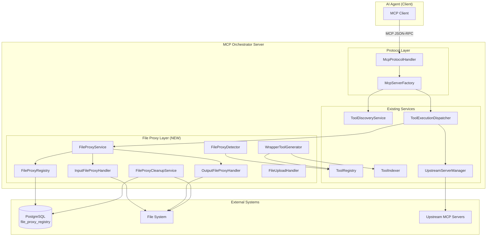

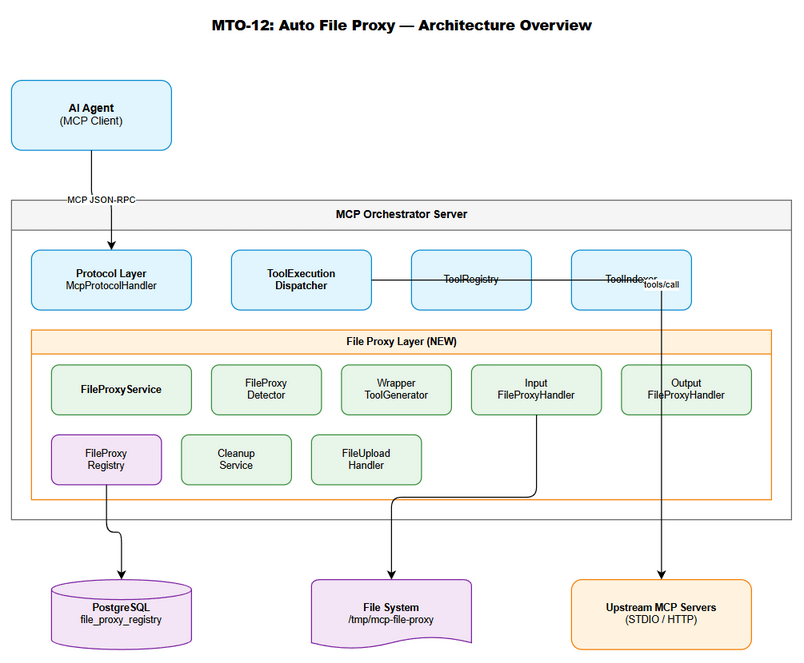
*[Edit in draw.io](diagrams/architecture.drawio)*

### 2.2 Component Diagram

| Component | Responsibility | Technology | Source |
|-----------|---------------|------------|--------|
| FileProxyService | Main orchestration — coordinates detection, wrapping, I/O | Kotlin/Coroutines | UC-002, UC-003, UC-006 |
| FileProxyDetector | Schema-based detection of file parameters (input + output) | Kotlin | UC-001, UC-007 |
| WrapperToolGenerator | Generates wrapper tool definitions hiding originals | Kotlin | UC-005 |
| InputFileProxyHandler | Handles input file → base64 conversion | Kotlin/kotlinx.io | UC-002, UC-003 |
| OutputFileProxyHandler | Handles output response → file save | Kotlin/kotlinx.io | UC-006 |
| FileProxyRegistry | PostgreSQL CRUD for file_proxy_registry table | Kotlin/HikariCP | UC-004 |
| FileProxyCleanupService | Lifecycle cleanup (startup/shutdown/TTL/per-request) | Kotlin/Coroutines | UC-009 |
| FileUploadHandler | HTTP/SSE file upload endpoint (upload_file tool) | Kotlin | UC-003 |
| FileProxyConfig | Configuration data class for file proxy settings | kotlinx.serialization | UC-008 |

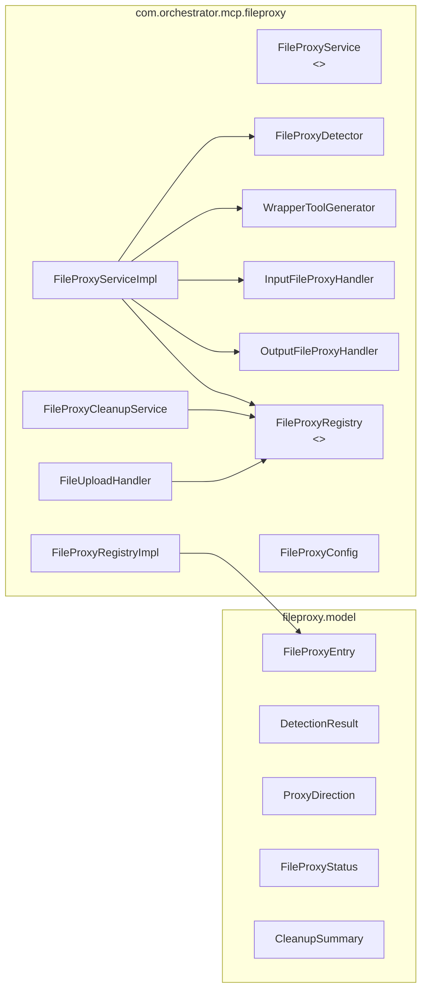

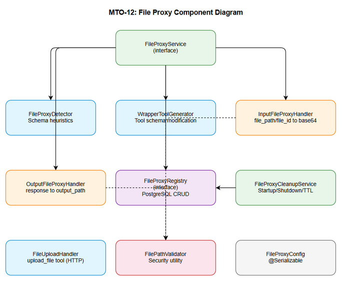
*[Edit in draw.io](diagrams/component.drawio)*

### 2.3 Deployment Architecture

The file proxy is deployed as part of the existing MCP Orchestrator fat JAR (`mcp-orchestrator-all.jar`). No additional containers or services are required.

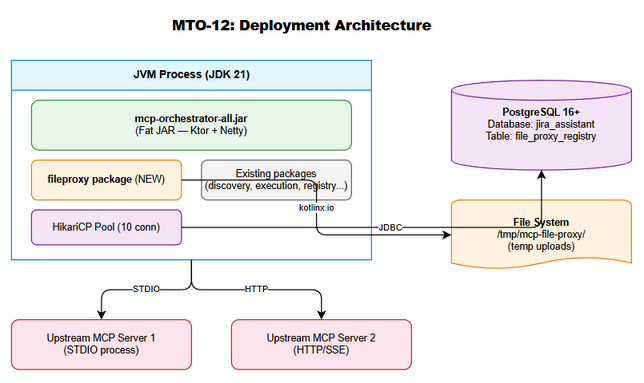
*[Edit in draw.io](diagrams/deployment.drawio)*

| Component | Deployment | Notes |
|-----------|-----------|-------|
| MCP Orchestrator | Single JVM process (fat JAR) | Includes file proxy package |
| PostgreSQL | Existing `jira_assistant` database | New `file_proxy_registry` table |
| File System | Local disk | Temp directory for HTTP/SSE uploads |
| Upstream MCP Servers | Separate processes (STDIO) or HTTP endpoints | Unchanged |

### 2.4 Communication Patterns

| From | To | Protocol | Pattern | Description |
|------|----|----------|---------|-------------|
| AI Agent | Orchestrator | MCP JSON-RPC (STDIO/HTTP) | Sync | Tool calls with file_path/file_id/output_path |
| Orchestrator | Upstream MCP | MCP JSON-RPC (STDIO/HTTP) | Sync | Forward proxied tool calls with base64 content |
| Orchestrator | PostgreSQL | JDBC (HikariCP) | Sync | Registry CRUD operations |
| Orchestrator | File System | kotlinx.io / java.nio | Sync (Dispatchers.IO) | File read/write/delete |
| CleanupService | PostgreSQL | JDBC | Async (coroutine) | Background TTL cleanup every 15min |


---

## 3. API Design

### 3.1 API Overview

The file proxy does not expose new HTTP REST endpoints. Instead, it operates through the existing MCP JSON-RPC protocol by:
1. Modifying tool schemas returned by `find_tools` (wrapper tools replace originals).
2. Intercepting `execute_dynamic_tool` calls for wrapper tools.
3. Registering a new `upload_file` MCP tool (HTTP/SSE mode only).

| # | MCP Tool | Direction | Description | Source |
|---|----------|-----------|-------------|--------|
| 1 | `{original_tool_name}` (wrapper) | Input Proxy | Replaces base64 param with `file_path` (STDIO) or `file_id` (HTTP) | UC-002, UC-003 |
| 2 | `{original_tool_name}` (wrapper) | Output Proxy | Adds optional `output_path` param | UC-006 |
| 3 | `upload_file` | Utility | Upload file and receive `file_id` (HTTP/SSE only) | UC-003 |

### 3.2 API: Wrapper Tool — Input Proxy (STDIO Mode)

**Implements:** UC-002, BR-005, BR-006, BR-007, BR-008, BR-009

| Attribute | Value |
|-----------|-------|
| Tool Name | `{original_tool_name}` (same name as upstream tool) |
| Transport | STDIO |
| Auth | N/A (local process) |

**Input Schema (generated dynamically):**

```json
{
  "name": "convert_pdf",
  "description": "Convert PDF to text. Accepts file_path instead of base64 content — file is read and encoded automatically.",
  "inputSchema": {
    "type": "object",
    "properties": {
      "file_path": {
        "type": "string",
        "description": "Absolute path to the input file. File will be read and base64-encoded automatically."
      },
      "output_format": {
        "type": "string",
        "description": "Output format (text, markdown, html)"
      }
    },
    "required": ["file_path"]
  }
}
```

**Response — Success:**

```json
{
  "content": [
    { "type": "text", "text": "Converted content here..." }
  ],
  "isError": false
}
```

**Error Responses:**

| Error Code | Message | When |
|------------|---------|------|
| FILE_NOT_FOUND | File not found: {file_path} | File does not exist |
| FILE_TOO_LARGE | File exceeds maximum size ({max}MB). Actual: {actual}MB | Size > configured limit |
| FILE_NOT_READABLE | Cannot read file: {file_path} — permission denied | Permission error |
| INVALID_PATH | Invalid file path: path traversal not allowed | Path contains `../` |
| ENCODING_FAILED | Failed to encode file: {reason} | OOM or IO error |

### 3.3 API: Wrapper Tool — Input Proxy (HTTP/SSE Mode)

**Implements:** UC-003, BR-010, BR-011, BR-012, BR-013

| Attribute | Value |
|-----------|-------|
| Tool Name | `{original_tool_name}` (same name as upstream tool) |
| Transport | HTTP/SSE |
| Auth | N/A |

**Input Schema (generated dynamically):**

```json
{
  "name": "convert_pdf",
  "description": "Convert PDF to text. Accepts file_id (from upload_file) instead of base64 content.",
  "inputSchema": {
    "type": "object",
    "properties": {
      "file_id": {
        "type": "string",
        "description": "UUID returned from upload_file tool. File content will be resolved automatically."
      },
      "output_format": {
        "type": "string",
        "description": "Output format (text, markdown, html)"
      }
    },
    "required": ["file_id"]
  }
}
```

**Error Responses:**

| Error Code | Message | When |
|------------|---------|------|
| INVALID_FILE_ID | Invalid file_id format — expected UUID | Not a valid UUID |
| FILE_ID_NOT_FOUND | File not found — file_id may have expired | No registry record |
| FILE_EXPIRED | File expired — please re-upload | TTL exceeded |
| FILE_MISSING_ON_DISK | File not found on disk — please re-upload | Temp file deleted |

### 3.4 API: upload_file Tool (HTTP/SSE Only)

**Implements:** UC-003, BR-010, BR-011, BR-012

| Attribute | Value |
|-----------|-------|
| Tool Name | `upload_file` |
| Transport | HTTP/SSE only (not registered in STDIO mode) |
| Auth | N/A |

**Input Schema:**

```json
{
  "name": "upload_file",
  "description": "Upload a file for use with tools that require file content. Returns a file_id that can be used in subsequent tool calls.",
  "inputSchema": {
    "type": "object",
    "properties": {
      "file_path": {
        "type": "string",
        "description": "Absolute path to the file to upload"
      }
    },
    "required": ["file_path"]
  }
}
```

**Response — Success:**

```json
{
  "content": [
    {
      "type": "text",
      "text": "{\"file_id\": \"550e8400-e29b-41d4-a716-446655440000\", \"file_name\": \"report.pdf\", \"file_size\": 1048576, \"expires_in\": \"60m\", \"expires_at\": \"2026-05-05T11:30:00Z\"}"
    }
  ]
}
```

**Error Responses:**

| Error Code | Message | When |
|------------|---------|------|
| FILE_NOT_FOUND | File not found: {file_path} | File does not exist |
| FILE_TOO_LARGE | File exceeds maximum size ({max}MB). Actual: {actual}MB | Size > limit |
| UPLOAD_FAILED | Upload failed — insufficient storage | Disk full |
| INVALID_PATH | Invalid file path: path traversal not allowed | Path contains `../` |

### 3.5 API: Wrapper Tool — Output Proxy

**Implements:** UC-006, BR-023, BR-024, BR-025, BR-026, BR-027

| Attribute | Value |
|-----------|-------|
| Tool Name | `{original_tool_name}` (same name as upstream tool) |
| Transport | STDIO or HTTP/SSE |
| Auth | N/A |

**Input Schema (generated dynamically — adds output_path):**

```json
{
  "name": "export_report",
  "description": "Export report to PDF. Optionally specify output_path to save file output to a specific location.",
  "inputSchema": {
    "type": "object",
    "properties": {
      "report_id": {
        "type": "string",
        "description": "Report identifier"
      },
      "output_path": {
        "type": "string",
        "description": "Optional. Absolute path where output file should be saved. If not provided, response is returned as-is."
      }
    },
    "required": ["report_id"]
  }
}
```

**Response — Success (with output_path):**

```json
{
  "content": [
    {
      "type": "text",
      "text": "{\"saved_to\": \"/home/user/output/report.pdf\", \"bytes_written\": 2097152, \"source_type\": \"FILE_PATH\"}"
    }
  ]
}
```

**Response — Success (without output_path — passthrough):**

```json
{
  "content": [
    { "type": "text", "text": "{\"artifacts\": [{\"path\": \"/tmp/report.pdf\"}]}" }
  ]
}
```

**Error Responses:**

| Error Code | Message | When |
|------------|---------|------|
| OUTPUT_DIR_NOT_FOUND | Output directory does not exist: {dir} | Parent dir missing |
| OUTPUT_NOT_WRITABLE | Cannot write to output path — permission denied | Permission error |
| NO_FILE_IN_RESPONSE | Upstream response does not contain file content | Detection mismatch |
| OUTPUT_SAVE_FAILED | Failed to save output file: {reason} | I/O error |

### 3.6 API Sequence — Input Proxy (STDIO)

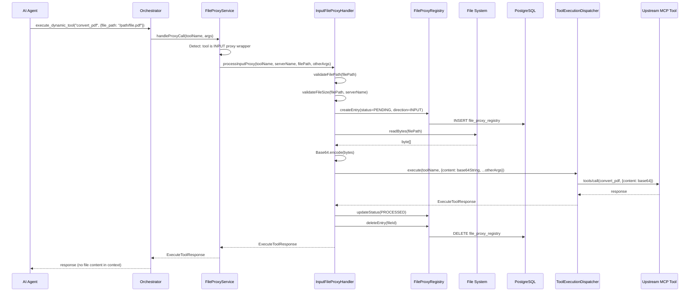

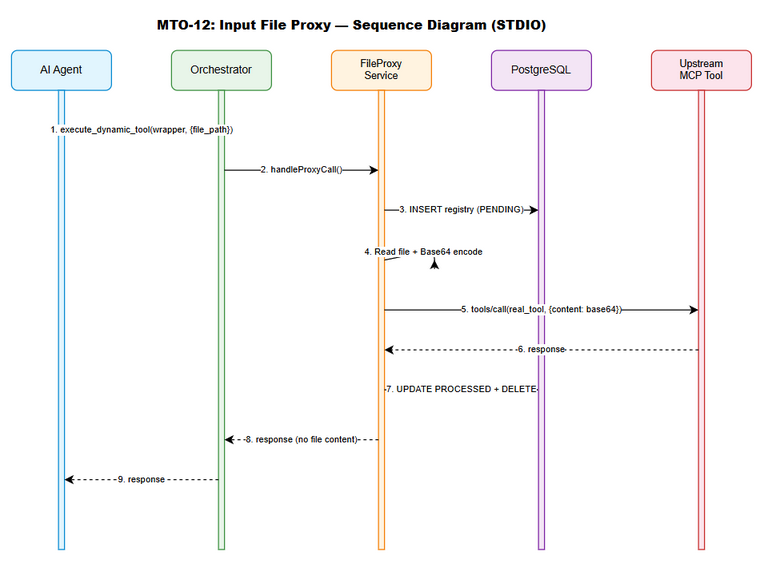
*[Edit in draw.io](diagrams/api-sequence-input-proxy.drawio)*


---

## 4. Database Design

### 4.1 Schema Overview

The file proxy requires a single new table `file_proxy_registry` in the existing `jira_assistant` PostgreSQL database. This table is **transient** — records are created before processing and deleted after completion. Steady-state size should be < 100 records.

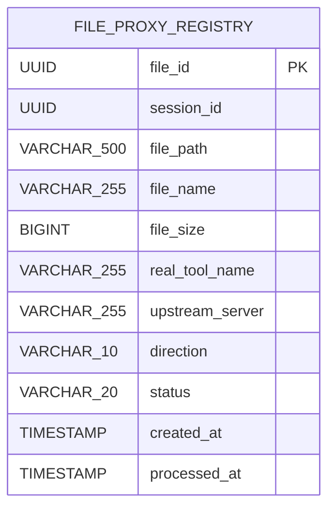

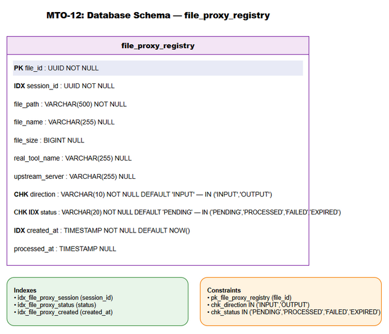
*[Edit in draw.io](diagrams/db-schema.drawio)*

### 4.2 DDL Scripts

#### Table: file_proxy_registry

```sql
-- V2__create_file_proxy_registry.sql
-- Migration: Create file proxy registry table for MTO-12

CREATE TABLE IF NOT EXISTS file_proxy_registry (
    file_id         UUID            NOT NULL,
    session_id      UUID            NOT NULL,
    file_path       VARCHAR(500)    NOT NULL,
    file_name       VARCHAR(255),
    file_size       BIGINT,
    real_tool_name  VARCHAR(255),
    upstream_server VARCHAR(255),
    direction       VARCHAR(10)     NOT NULL DEFAULT 'INPUT',
    status          VARCHAR(20)     NOT NULL DEFAULT 'PENDING',
    created_at      TIMESTAMP       NOT NULL DEFAULT NOW(),
    processed_at    TIMESTAMP,

    CONSTRAINT pk_file_proxy_registry PRIMARY KEY (file_id),
    CONSTRAINT chk_direction CHECK (direction IN ('INPUT', 'OUTPUT')),
    CONSTRAINT chk_status CHECK (status IN ('PENDING', 'PROCESSED', 'FAILED', 'EXPIRED'))
);

COMMENT ON TABLE file_proxy_registry IS 'Tracks file proxy operations for lifecycle management. Records are transient — deleted after processing.';
COMMENT ON COLUMN file_proxy_registry.session_id IS 'Running session UUID — changes on every server restart';
COMMENT ON COLUMN file_proxy_registry.direction IS 'INPUT = file read for upstream, OUTPUT = file save from upstream';
```

#### Indexes

```sql
-- Efficient startup/shutdown cleanup (query by session)
CREATE INDEX idx_file_proxy_session ON file_proxy_registry(session_id);

-- Filter by lifecycle status
CREATE INDEX idx_file_proxy_status ON file_proxy_registry(status);

-- TTL cleanup (find expired records by creation time)
CREATE INDEX idx_file_proxy_created ON file_proxy_registry(created_at);
```

#### Rollback Script

```sql
-- V2__rollback_file_proxy_registry.sql
DROP TABLE IF EXISTS file_proxy_registry;
```

### 4.3 Migration Plan

| Order | Script | Description | Estimated Time | Rollback |
|-------|--------|-------------|----------------|----------|
| 1 | V2__create_file_proxy_registry.sql | Create table + indexes + constraints | < 1s | V2__rollback_file_proxy_registry.sql |

**Migration execution:** The application will execute the migration on startup using a simple SQL script runner (no Flyway/Liquibase — consistent with existing project pattern of manual SQL execution via HikariCP DataSource).

### 4.4 Query Patterns

| Operation | SQL | Expected Performance | Frequency |
|-----------|-----|---------------------|-----------|
| Create entry | `INSERT INTO file_proxy_registry (file_id, session_id, file_path, ...) VALUES (?, ?, ?, ...)` | < 5ms | Per proxy request |
| Update status | `UPDATE file_proxy_registry SET status=?, processed_at=? WHERE file_id=?` | < 5ms | Per proxy request |
| Delete entry | `DELETE FROM file_proxy_registry WHERE file_id=?` | < 5ms | Per proxy request |
| Find by file_id | `SELECT * FROM file_proxy_registry WHERE file_id=?` | < 5ms (PK lookup) | Per HTTP/SSE request |
| Startup cleanup | `DELETE FROM file_proxy_registry WHERE session_id != ?` | < 100ms (index scan) | On startup |
| TTL cleanup | `DELETE FROM file_proxy_registry WHERE created_at < ?` | < 50ms (index scan) | Every 15 min |
| Find by session | `SELECT * FROM file_proxy_registry WHERE session_id = ?` | < 50ms | On shutdown |

### 4.5 Data Volume Estimates

| Metric | Estimate | Rationale |
|--------|----------|-----------|
| Steady-state rows | < 100 | Per-request cleanup keeps table small |
| Peak rows (burst) | ~500 | 50 concurrent ops × 10 pending each |
| Row size | ~200 bytes | UUID + VARCHAR fields |
| Table size (steady) | < 20 KB | Negligible |
| Index size | < 10 KB | 3 B-tree indexes on small table |


---

## 5. Class / Module Design

### 5.1 Package Structure

```
com.orchestrator.mcp/
├── fileproxy/                              # NEW PACKAGE — File Proxy feature
│   ├── FileProxyConfig.kt                  # @Serializable config data class
│   ├── FileProxyService.kt                 # Interface — main proxy orchestration
│   ├── FileProxyServiceImpl.kt             # Impl — coordinates detection, wrapping, I/O
│   ├── FileProxyDetector.kt                # Schema-based detection of file parameters
│   ├── WrapperToolGenerator.kt             # Generates wrapper tool definitions
│   ├── InputFileProxyHandler.kt            # Handles input file → base64 conversion
│   ├── OutputFileProxyHandler.kt           # Handles output response → file save
│   ├── FileProxyRegistry.kt               # Interface — DB registry operations
│   ├── FileProxyRegistryImpl.kt            # Impl — PostgreSQL CRUD via HikariCP
│   ├── FileProxyCleanupService.kt          # Lifecycle cleanup (startup/shutdown/TTL)
│   ├── FileUploadHandler.kt               # HTTP/SSE file upload (upload_file tool)
│   ├── FilePathValidator.kt               # Security: path validation utility
│   └── model/
│       ├── FileProxyEntry.kt              # Domain model for registry record
│       ├── DetectionResult.kt             # Result of schema detection
│       ├── ProxyDirection.kt              # Enum: INPUT, OUTPUT
│       ├── FileProxyStatus.kt            # Enum: PENDING, PROCESSED, FAILED, EXPIRED
│       ├── DetectionMethod.kt            # Enum: SCHEMA_TYPE, DESCRIPTION_KEYWORD, NAME_PATTERN, RUNTIME_RESPONSE
│       └── CleanupSummary.kt             # Cleanup operation result
├── config/
│   └── OrchestratorConfig.kt             # MODIFIED — add FileProxyConfig to orchestrator section
├── di/
│   └── AppModule.kt                      # MODIFIED — add file proxy DI bindings
├── execution/
│   └── ToolExecutionDispatcherImpl.kt    # MODIFIED — route proxy tool calls through FileProxyService
├── registry/
│   ├── ToolRegistry.kt                   # MODIFIED — add setHidden/isHidden methods
│   ├── ToolRegistryImpl.kt              # MODIFIED — implement hidden tool filtering
│   └── ToolIndexer.kt                   # MODIFIED — trigger detection after indexing
├── model/
│   ├── Exceptions.kt                    # MODIFIED — add FileProxyException subclasses
│   └── ToolDefinition.kt               # MODIFIED — add isProxy, originalToolRef fields to ToolEntry
└── protocol/
    └── McpToolRegistrar.kt              # MODIFIED — register upload_file tool in HTTP mode
```

### 5.2 Key Interfaces

```kotlin
// FileProxyService.kt — Main orchestration interface
interface FileProxyService {
    /** Initialize file proxy: run detection, generate wrappers */
    suspend fun initialize(sessionId: UUID)
    
    /** Handle a proxy tool call (input, output, or both) */
    suspend fun handleProxyCall(
        toolName: String,
        serverName: String,
        arguments: JsonObject,
        transportMode: TransportType
    ): ExecuteToolResponse
    
    /** Check if a tool name is a proxy wrapper */
    fun isProxyTool(toolName: String): Boolean
    
    /** Re-detect and regenerate wrappers for a specific server */
    suspend fun redetectServer(serverName: String)
}
```

```kotlin
// FileProxyDetector.kt — Detection interface
interface FileProxyDetector {
    /** Scan inputSchema for file content parameters */
    fun detectInputFileParams(
        toolName: String,
        serverName: String,
        inputSchema: JsonObject
    ): List<DetectionResult>
    
    /** Scan outputSchema/response for file output indicators */
    fun detectOutputFileResponse(
        toolName: String,
        serverName: String,
        outputSchema: JsonObject?
    ): Boolean
    
    /** Runtime detection from actual response */
    fun detectOutputFromResponse(toolName: String, response: JsonObject): Boolean
    
    /** Get all detection results for a server */
    fun getDetectionResults(serverName: String): List<DetectionResult>
}
```

```kotlin
// FileProxyRegistry.kt — Database registry interface
interface FileProxyRegistry {
    suspend fun createEntry(entry: FileProxyEntry): FileProxyEntry
    suspend fun updateStatus(fileId: UUID, status: FileProxyStatus, processedAt: Instant? = null)
    suspend fun deleteEntry(fileId: UUID)
    suspend fun findByFileId(fileId: UUID): FileProxyEntry?
    suspend fun findBySessionId(sessionId: UUID): List<FileProxyEntry>
    suspend fun deleteBySessionId(sessionId: UUID): Int
    suspend fun deleteExpiredEntries(olderThan: Instant): Int
    suspend fun findOrphanEntries(currentSessionId: UUID): List<FileProxyEntry>
}
```

```kotlin
// InputFileProxyHandler.kt
interface InputFileProxyHandler {
    suspend fun processInputProxy(
        toolName: String,
        serverName: String,
        filePath: String,
        fileParamName: String,
        otherArgs: JsonObject
    ): ExecuteToolResponse
}

// OutputFileProxyHandler.kt
interface OutputFileProxyHandler {
    suspend fun processOutputProxy(
        upstreamResponse: ExecuteToolResponse,
        outputPath: String
    ): ExecuteToolResponse
    
    fun containsFileContent(response: ExecuteToolResponse): Boolean
}
```

### 5.3 Class Diagram

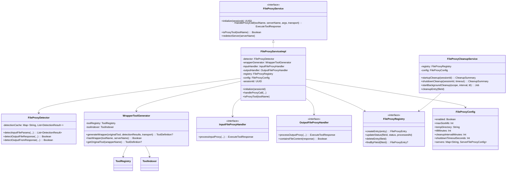

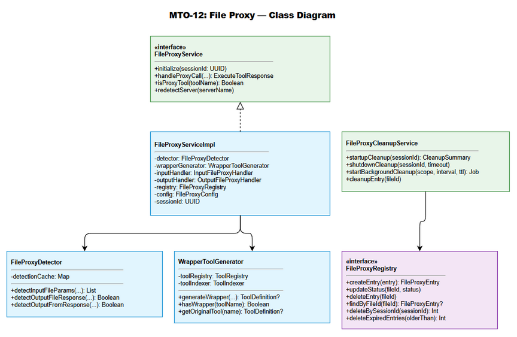
*[Edit in draw.io](diagrams/class-diagram.drawio)*

### 5.4 Design Patterns

| Pattern | Where Used | Rationale |
|---------|-----------|-----------|
| Interface/Impl | All services (FileProxyService, FileProxyRegistry, handlers) | Consistent with existing codebase; enables MockK testing |
| Strategy | InputFileProxyHandler (STDIO vs HTTP mode) | Different file resolution strategies per transport |
| Chain of Responsibility | FileProxyServiceImpl.handleProxyCall() | Input proxy → upstream call → output proxy (chained) |
| Observer | ToolIndexer → FileProxyDetector | Detection triggered after tool indexing completes |
| Template Method | FileProxyCleanupService | Common cleanup logic with strategy-specific queries |
| Sealed Exception | FileProxyException hierarchy | Type-safe error handling consistent with existing pattern |

### 5.5 Error Handling

New exceptions added to the sealed hierarchy:

```kotlin
// Added to Exceptions.kt
class FileProxyException(errorCode: String, message: String) :
    McpOrchestratorException(errorCode, message)

class FileNotFoundException(filePath: String) :
    McpOrchestratorException("FILE_NOT_FOUND", "File not found: $filePath")

class FileTooLargeException(maxMb: Int, actualMb: String) :
    McpOrchestratorException("FILE_TOO_LARGE", "File exceeds maximum size (${maxMb}MB). Actual: ${actualMb}MB")

class FileNotReadableException(filePath: String) :
    McpOrchestratorException("FILE_NOT_READABLE", "Cannot read file: $filePath — permission denied")

class InvalidFilePathException(reason: String) :
    McpOrchestratorException("INVALID_PATH", "Invalid file path: $reason")

class InvalidFileIdException(fileId: String) :
    McpOrchestratorException("INVALID_FILE_ID", "Invalid file_id format — expected UUID: $fileId")

class FileExpiredException(fileId: String) :
    McpOrchestratorException("FILE_EXPIRED", "File expired — please re-upload")

class OutputSaveFailedException(reason: String) :
    McpOrchestratorException("OUTPUT_SAVE_FAILED", "Failed to save output file: $reason")
```

| Exception | HTTP-equiv | Error Code | When Thrown |
|-----------|------------|------------|------------|
| FileNotFoundException | 404 | FILE_NOT_FOUND | File path does not exist |
| FileTooLargeException | 413 | FILE_TOO_LARGE | File exceeds max size |
| FileNotReadableException | 403 | FILE_NOT_READABLE | Permission denied |
| InvalidFilePathException | 400 | INVALID_PATH | Path traversal or relative path |
| InvalidFileIdException | 400 | INVALID_FILE_ID | Not a valid UUID |
| FileExpiredException | 410 | FILE_EXPIRED | TTL exceeded |
| OutputSaveFailedException | 500 | OUTPUT_SAVE_FAILED | I/O error during save |

### 5.6 DI Configuration (Koin additions)

```kotlin
// Added to AppModule.kt
single<FileProxyConfig> { get<OrchestratorConfig>().orchestrator.fileProxy }
single<FileProxyRegistry> { FileProxyRegistryImpl(get()) } // DataSource injected
single<FileProxyDetector> { FileProxyDetector() }
single<WrapperToolGenerator> { WrapperToolGenerator(get(), get()) } // ToolRegistry, ToolIndexer
single<InputFileProxyHandler> { InputFileProxyHandlerImpl(get(), get(), get()) } // Registry, Config, TED
single<OutputFileProxyHandler> { OutputFileProxyHandlerImpl(get(), get()) } // Registry, Config
single<FileProxyCleanupService> { FileProxyCleanupService(get(), get()) } // Registry, Config
single<FileUploadHandler> { FileUploadHandler(get(), get()) } // Registry, Config
single<FileProxyService> {
    FileProxyServiceImpl(get(), get(), get(), get(), get(), get())
}
```


---

## 6. Integration Design

### 6.1 External System: PostgreSQL Database

| Attribute | Value |
|-----------|-------|
| Protocol | JDBC (PostgreSQL driver via HikariCP) |
| Endpoint | `jdbc:postgresql://{host}:{port}/jira_assistant` |
| Authentication | Username/password (env var resolution: `${DB_USER}`, `${DB_PASSWORD}`) |
| Timeout | Connection: 5s, Query: 10s |
| Retry Policy | 3 attempts with exponential backoff (existing RetryUtils) |
| Circuit Breaker | N/A — degraded mode if DB unavailable |

**Connection Pool (shared with existing services):**

| Property | Value |
|----------|-------|
| Pool Size | 10 (existing HikariCP config) |
| Min Idle | 2 |
| Max Lifetime | 30 min |
| Idle Timeout | 10 min |

**Data Mapping:**

| Domain Model Field | DB Column | Transformation |
|-------------------|-----------|----------------|
| FileProxyEntry.fileId | file_id | UUID ↔ UUID (native PostgreSQL) |
| FileProxyEntry.sessionId | session_id | UUID ↔ UUID |
| FileProxyEntry.filePath | file_path | String ↔ VARCHAR(500) |
| FileProxyEntry.direction | direction | ProxyDirection enum ↔ VARCHAR(10) |
| FileProxyEntry.status | status | FileProxyStatus enum ↔ VARCHAR(20) |
| FileProxyEntry.createdAt | created_at | kotlinx.datetime.Instant ↔ TIMESTAMP |

**Error Handling:**

| Error | Action |
|-------|--------|
| Connection timeout | Retry 3x (RetryUtils), then operate in degraded mode |
| Pool exhausted | Log WARN, queue request (HikariCP handles internally) |
| SQL constraint violation | Log ERROR, throw FileProxyException |
| Database unavailable | Log WARN, continue without registry (no cleanup guarantee) |

### 6.2 External System: File System

| Attribute | Value |
|-----------|-------|
| Protocol | Local file I/O (kotlinx.io + java.nio.file) |
| Endpoint | Configurable temp directory + agent-specified paths |
| Authentication | OS-level file permissions |
| Timeout | N/A (blocking I/O on Dispatchers.IO) |

**Operations:**

| Operation | API | Dispatcher | Context |
|-----------|-----|-----------|---------|
| Read input file | `Path.readBytes()` | Dispatchers.IO | Input proxy |
| Copy to temp | `Files.copy(source, target)` | Dispatchers.IO | HTTP/SSE upload |
| Copy to output | `Files.copy(source, target)` | Dispatchers.IO | Output proxy (artifacts) |
| Write decoded | `Files.write(path, bytes)` | Dispatchers.IO | Output proxy (base64) |
| Delete temp | `Files.deleteIfExists(path)` | Dispatchers.IO | Cleanup |
| Check exists | `Files.exists(path)` | Dispatchers.IO | Validation |
| Get size | `Files.size(path)` | Dispatchers.IO | Size validation |

### 6.3 External System: Upstream MCP Servers

| Attribute | Value |
|-----------|-------|
| Protocol | MCP JSON-RPC 2.0 over STDIO or HTTP/SSE |
| Endpoint | Configured per server in `upstream_servers` YAML |
| Authentication | N/A (local process or per-server config) |
| Timeout | `execution.timeout_seconds` (default: 30s) |
| Retry Policy | No retry on tool call failure (return error immediately) |

**Integration Points:**

| Point | Direction | Data | Trigger |
|-------|-----------|------|---------|
| tools/list | Orch → Upstream | Request tool schemas | Server connect/reconnect |
| tools/call (proxied) | Orch → Upstream | Forward with base64 content | Wrapper tool execution |
| Response handling | Upstream → Orch | Extract file content | Output proxy |

**Data Mapping (Input Proxy):**

| Wrapper Param | Upstream Param | Transformation |
|---------------|---------------|----------------|
| `file_path` (STDIO) | `{detected_param}` | Read file → Base64.encode() |
| `file_id` (HTTP) | `{detected_param}` | Resolve UUID → read file → Base64.encode() |
| Other params | Same name | Pass through unchanged |

**Data Mapping (Output Proxy):**

| Upstream Response | Agent Response | Transformation |
|-------------------|---------------|----------------|
| `artifacts[].path` | `saved_to` | Files.copy(source, outputPath) |
| Base64 field | `saved_to` | Base64.decode() → Files.write(outputPath) |
| Other fields | Same | Pass through unchanged |


---

## 7. Security Design

### 7.1 Authentication

The MCP protocol does not define authentication between client and server. Security relies on:
- **STDIO mode:** Local process isolation — only the parent process can communicate.
- **HTTP/SSE mode:** Network-level access control (firewall, localhost binding).

No changes to existing authentication patterns are required for this feature.

### 7.2 Authorization

| Role | Operations | Scope |
|------|-----------|-------|
| AI Agent (Client) | Execute wrapper tools, upload files | All proxy operations via MCP protocol |
| System (Orchestrator) | Read/write files, access DB, call upstream | Internal operations only |
| System Administrator | Configure limits, view logs | YAML configuration |

### 7.3 Data Protection

| Data Type | At Rest | In Transit | In Logs |
|-----------|---------|------------|---------|
| File content (base64) | Memory only — never persisted in encoded form | In-process (no network for STDIO) | Excluded (never logged) |
| Temp files (HTTP/SSE) | `rw-------` permissions (owner only) | Local disk I/O | Path logged, content excluded |
| File paths | Stored in DB (VARCHAR) | In-process | Logged at INFO level |
| DB credentials | Environment variables | JDBC/TLS | Excluded from logs |

### 7.4 Path Security (Critical)

**Implementation: `FilePathValidator.kt`**

```kotlin
object FilePathValidator {
    fun validateInputPath(filePath: String) {
        val path = Path(filePath)
        
        // Rule 1: Must be absolute
        require(path.isAbsolute()) { "File path must be absolute: $filePath" }
        
        // Rule 2: No path traversal sequences
        require(!filePath.contains("..")) { "Path traversal not allowed" }
        
        // Rule 3: Resolve symlinks and verify canonical path
        val canonical = path.toRealPath()
        require(!canonical.toString().contains("..")) { "Resolved path contains traversal" }
        
        // Rule 4: File must exist and be readable
        require(Files.exists(canonical)) { "File not found: $filePath" }
        require(Files.isReadable(canonical)) { "Cannot read file: $filePath" }
    }
    
    fun validateOutputPath(outputPath: String) {
        val path = Path(outputPath)
        
        // Rule 1: Must be absolute
        require(path.isAbsolute()) { "Output path must be absolute: $outputPath" }
        
        // Rule 2: No path traversal
        require(!outputPath.contains("..")) { "Path traversal not allowed" }
        
        // Rule 3: Parent directory must exist and be writable
        val parent = path.parent
        require(parent != null && Files.exists(parent)) { "Output directory does not exist" }
        require(Files.isWritable(parent)) { "Cannot write to output directory" }
    }
    
    fun validateTempPath(filePath: String, tempDirectory: String) {
        val canonical = Path(filePath).toRealPath()
        val tempBase = Path(tempDirectory).toRealPath()
        require(canonical.startsWith(tempBase)) { "File not in temp directory" }
    }
}
```

**Threat Mitigation:**

| Threat | Mitigation | Implementation |
|--------|-----------|----------------|
| Path traversal (`../`) | Reject paths containing `..` | Regex + canonical resolution |
| Symlink attacks | Resolve symlinks before validation | `Path.toRealPath()` |
| Relative path injection | Require absolute paths | `Path.isAbsolute()` check |
| Temp directory escape | Verify canonical path starts with temp dir | Prefix check |
| Large file DoS | Size check BEFORE reading content | `Files.size()` metadata check |

### 7.5 Audit Trail

| Event | Log Level | Fields | Retention |
|-------|-----------|--------|-----------|
| Proxy operation started | INFO | file_id, tool_name, server_name, direction, file_size | 30 days |
| Proxy operation completed | INFO | file_id, status, duration_ms | 30 days |
| File size limit exceeded | WARN | file_path, actual_size, max_size | 30 days |
| Path validation failure | WARN | file_path, rejection_reason | 30 days |
| Cleanup executed | INFO | records_deleted, files_deleted, bytes_reclaimed | 30 days |
| Registry degraded mode | WARN | error_message, operation_context | 30 days |


---

## 8. Performance & Scalability

### 8.1 Caching Strategy

| Cache | What | TTL | Eviction | Technology |
|-------|------|-----|----------|------------|
| Detection results | Per-tool detection results (input/output flags) | Until server reconnect | Invalidate on reconnect | In-memory ConcurrentHashMap |
| Wrapper definitions | Generated wrapper tool schemas | Until server reconnect | Invalidate on reconnect | In-memory (ToolRegistry) |

**Note:** File content is NOT cached — each proxy operation reads fresh from disk. This ensures consistency and avoids memory pressure from large files.

### 8.2 Connection Pooling

| Resource | Min | Max | Timeout | Idle Timeout |
|----------|-----|-----|---------|-------------|
| PostgreSQL (HikariCP) | 2 | 10 | 5000ms | 600000ms |

**Shared pool:** File proxy operations share the existing HikariCP pool with other DB operations (tool management, config sync). The transient nature of registry records (INSERT → DELETE within seconds) means minimal pool contention.

### 8.3 Coroutine Dispatchers

| Operation | Dispatcher | Rationale |
|-----------|-----------|-----------|
| File read/write | Dispatchers.IO | Blocking I/O — dedicated thread pool |
| Base64 encode/decode | Dispatchers.Default | CPU-bound computation |
| DB operations | Dispatchers.IO | JDBC is blocking |
| Detection/wrapping | Dispatchers.Default | In-memory computation |
| Cleanup background job | Dedicated CoroutineScope | Long-running, cancellable |

### 8.4 Performance Targets

| Operation | Target | Measurement | Source |
|-----------|--------|-------------|--------|
| Proxy layer overhead (excl. file I/O) | < 100ms p95 | Time from intercept to upstream dispatch | FSD §8 |
| File read + base64 encode (10MB) | < 500ms p95 | End-to-end encoding time | FSD §8 |
| Max concurrent file operations | 50 simultaneous | Load test with parallel requests | FSD §8 |
| Registry DB operation | < 10ms p95 | Single INSERT/UPDATE/DELETE | FSD §8 |
| Startup cleanup (< 1000 records) | < 5s | Time before accepting requests | FSD §8 |
| Throughput | ≥ 20 req/s | Sustained proxy requests | FSD §8 |

### 8.5 File Size Optimization

- **Size check before read:** Use `Files.size()` (metadata only) before `readBytes()` to reject oversized files without loading content.
- **Streaming for large files:** For files near the limit (>10MB), consider streaming base64 encoding to avoid holding entire file + encoded string in memory simultaneously. Implementation: read in 8KB chunks, encode each chunk, append to StringBuilder.
- **Memory budget:** Peak memory per proxy operation = `file_size * 2.33` (raw bytes + base64 string). For 50MB max: ~116MB peak per operation. With 50 concurrent: ~5.8GB theoretical max — mitigated by real-world concurrency being much lower.


---

## 9. Monitoring & Observability

### 9.1 Logging

All file proxy logs use the `[FileProxy]` prefix for easy filtering. Structured logging via SLF4J/Logback with MDC context.

| Log Event | Level | Format | Destination |
|-----------|-------|--------|-------------|
| Proxy operation start | INFO | `[FileProxy] {direction} proxy: tool={name}, server={server}, file_size={size}` | stdout |
| Proxy operation complete | INFO | `[FileProxy] Completed: tool={name}, status={status}, duration={ms}ms` | stdout |
| Detection result | INFO | `[FileProxy] Detected: tool={name}, param={param}, method={method}, confidence={score}` | stdout |
| Wrapper generated | INFO | `[FileProxy] Wrapper created: tool={name}, direction={dir}` | stdout |
| Cleanup summary | INFO | `[FileProxy] Cleanup: records={n}, files={n}, bytes={n}` | stdout |
| File size validation | DEBUG | `[FileProxy] Size check: file={path}, size={bytes}, max={max}` | stdout |
| Path validation failure | WARN | `[FileProxy] SECURITY: Path rejected: path={path}, reason={reason}` | stdout |
| Registry degraded mode | WARN | `[FileProxy] Registry unavailable: {error}. Operating in degraded mode.` | stdout |
| Cleanup failure | WARN | `[FileProxy] Cleanup failed: file_id={id}, error={msg}` | stdout |
| Unexpected error | ERROR | `[FileProxy] Unexpected error: {exception}` + stack trace | stdout |

**MDC Fields:**

| Key | Value | Purpose |
|-----|-------|---------|
| fileProxyId | UUID | Correlate all logs for single proxy operation |
| sessionId | UUID | Identify server session |
| toolName | String | Tool being proxied |
| direction | INPUT/OUTPUT | Proxy direction |

### 9.2 Metrics

| Metric | Type | Description | Alert Threshold |
|--------|------|-------------|-----------------|
| `file_proxy_operations_total` | Counter | Total proxy operations (labels: direction, status) | — |
| `file_proxy_duration_ms` | Histogram | Proxy operation duration | p95 > 1000ms |
| `file_proxy_file_size_bytes` | Histogram | File sizes processed | — |
| `file_proxy_errors_total` | Counter | Error count (labels: error_code) | > 10/min |
| `file_proxy_registry_size` | Gauge | Current registry table row count | > 500 |
| `file_proxy_cleanup_duration_ms` | Histogram | Cleanup operation duration | > 10000ms |
| `file_proxy_temp_dir_size_bytes` | Gauge | Temp directory disk usage | > 500MB |

### 9.3 Health Checks

| Check | Method | Expected | Degraded |
|-------|--------|----------|----------|
| Registry DB connectivity | `SELECT 1` on HikariCP pool | < 100ms response | Log WARN, operate without registry |
| Temp directory writable | `Files.isWritable(tempDir)` | true | Log ERROR, reject uploads |
| Temp directory space | `FileStore.getUsableSpace()` | > 1GB free | Log WARN |

---

## 10. Deployment Considerations

### 10.1 Environment Configuration

```yaml
# Added to application.yml under orchestrator section
orchestrator:
  file-proxy:
    enabled: true
    max-size-mb: 50
    temp-directory: "/tmp/mcp-file-proxy"
    ttl-minutes: 60
    cleanup-interval-minutes: 15
    shutdown-timeout-seconds: 30
    servers:
      pdf-tools:
        max-size-mb: 100
      image-processor:
        max-size-mb: 200
```

| Property | DEV | PROD | Description |
|----------|-----|------|-------------|
| `file-proxy.enabled` | true | true | Feature toggle |
| `file-proxy.max-size-mb` | 50 | 50 | Global max file size |
| `file-proxy.temp-directory` | `/tmp/mcp-file-proxy` | `/var/mcp/file-proxy` | Temp storage |
| `file-proxy.ttl-minutes` | 60 | 60 | File TTL |
| `file-proxy.cleanup-interval-minutes` | 15 | 15 | Background cleanup interval |
| `file-proxy.shutdown-timeout-seconds` | 30 | 30 | Graceful shutdown timeout |

### 10.2 Feature Flags

| Flag | Default | Description |
|------|---------|-------------|
| `file-proxy.enabled` | true | Master toggle for entire file proxy feature |
| `file-proxy.input-proxy-enabled` | true | Enable/disable input proxy only |
| `file-proxy.output-proxy-enabled` | true | Enable/disable output proxy only |
| `file-proxy.runtime-detection-enabled` | true | Enable/disable runtime output detection |

When `file-proxy.enabled = false`:
- No detection runs during tool discovery
- No wrappers are generated
- Original tools remain visible and callable
- `upload_file` tool is not registered
- Zero overhead on existing functionality

### 10.3 Rollback Strategy

1. **Configuration rollback:** Set `file-proxy.enabled: false` → restart server. All wrappers removed, original tools restored.
2. **Database rollback:** Execute `V2__rollback_file_proxy_registry.sql` to drop the table.
3. **Code rollback:** Revert to previous JAR version. File proxy package is isolated — no changes to existing service interfaces.

### 10.4 Database Migration Execution

```kotlin
// DatabaseInitializer.kt — executed on startup (existing pattern)
class FileProxyMigration(private val dataSource: DataSource) {
    fun migrate() {
        dataSource.connection.use { conn ->
            conn.createStatement().use { stmt ->
                stmt.execute("""
                    CREATE TABLE IF NOT EXISTS file_proxy_registry (
                        file_id UUID PRIMARY KEY,
                        session_id UUID NOT NULL,
                        file_path VARCHAR(500) NOT NULL,
                        file_name VARCHAR(255),
                        file_size BIGINT,
                        real_tool_name VARCHAR(255),
                        upstream_server VARCHAR(255),
                        direction VARCHAR(10) NOT NULL DEFAULT 'INPUT',
                        status VARCHAR(20) NOT NULL DEFAULT 'PENDING',
                        created_at TIMESTAMP NOT NULL DEFAULT NOW(),
                        processed_at TIMESTAMP,
                        CONSTRAINT chk_direction CHECK (direction IN ('INPUT', 'OUTPUT')),
                        CONSTRAINT chk_status CHECK (status IN ('PENDING', 'PROCESSED', 'FAILED', 'EXPIRED'))
                    )
                """.trimIndent())
                stmt.execute("CREATE INDEX IF NOT EXISTS idx_file_proxy_session ON file_proxy_registry(session_id)")
                stmt.execute("CREATE INDEX IF NOT EXISTS idx_file_proxy_status ON file_proxy_registry(status)")
                stmt.execute("CREATE INDEX IF NOT EXISTS idx_file_proxy_created ON file_proxy_registry(created_at)")
            }
        }
    }
}
```


---

## 11. E2E Test Architecture

### 11.1 Framework & Language

| Attribute | Value |
|-----------|-------|
| Framework | Kotest 5.9.1 + Ktor Test Host |
| Language | Kotlin (same as project main language) |
| API test client | Ktor Test Host (in-process) + Ktor Client (for HTTP mode) |
| Mocking | MockK 1.14.2 |
| Containers | Testcontainers 1.21.1 (PostgreSQL) |

**Note:** The project uses a single-module structure with E2E tests in `src/test/kotlin/.../e2e/`. Tests run in-process using Ktor Test Host — no separate E2E module.

### 11.2 Test Module Structure

```
src/test/kotlin/com/orchestrator/mcp/
├── e2e/
│   ├── E2eFileProxyInputTest.kt       # Input proxy E2E (STDIO mode)
│   ├── E2eFileProxyHttpTest.kt        # Input proxy E2E (HTTP/SSE mode)
│   ├── E2eFileProxyOutputTest.kt      # Output proxy E2E
│   ├── E2eFileProxyCleanupTest.kt     # Lifecycle cleanup E2E
│   └── E2eFileProxyDetectionTest.kt   # Auto-detection E2E
├── it/
│   ├── FileProxyRegistryIntegrationTest.kt  # DB registry with Testcontainers
│   ├── FileProxyCleanupIntegrationTest.kt   # Cleanup with real DB
│   └── FileProxyServiceIntegrationTest.kt   # Full service integration
├── fileproxy/
│   ├── FileProxyDetectorTest.kt        # Unit: detection heuristics
│   ├── WrapperToolGeneratorTest.kt     # Unit: wrapper generation
│   ├── InputFileProxyHandlerTest.kt    # Unit: input proxy logic
│   ├── OutputFileProxyHandlerTest.kt   # Unit: output proxy logic
│   ├── FilePathValidatorTest.kt        # Unit: path security
│   └── FileProxyConfigTest.kt          # Unit: config parsing
```

### 11.3 Reusable Components

| Component | Location | Purpose |
|-----------|----------|---------|
| IntegrationTestBase | `src/test/kotlin/.../it/IntegrationTestBase.kt` | Provides test stacks (DiscoveryStack, ExecutionStack, etc.) |
| TestFixtures | `src/test/kotlin/.../it/TestFixtures.kt` | Mock data factories (mockToolEntry, mockEmbedding, etc.) |
| Testcontainers PostgreSQL | `testImplementation("org.testcontainers:postgresql:1.21.1")` | Real PostgreSQL for integration tests |

**New test utilities to create:**

```kotlin
// FileProxyTestFixtures.kt
object FileProxyTestFixtures {
    fun createTempFile(content: ByteArray, name: String = "test.pdf"): Path
    fun createLargeFile(sizeMb: Int): Path
    fun mockDetectionResult(toolName: String, paramName: String): DetectionResult
    fun mockFileProxyEntry(direction: ProxyDirection, status: FileProxyStatus): FileProxyEntry
    fun mockUpstreamToolWithBase64Param(toolName: String): ToolDefinition
    fun mockUpstreamResponseWithArtifacts(filePath: String): JsonObject
    fun mockUpstreamResponseWithBase64(content: String): JsonObject
}
```

### 11.4 E2E-API Test Design

#### E2eFileProxyInputTest.kt

| Test Case | Description | Setup | Assertion |
|-----------|-------------|-------|-----------|
| `input proxy STDIO - happy path` | File read → base64 → upstream called | Create temp file, mock upstream | Response returned, file content not in agent context |
| `input proxy STDIO - file not found` | Non-existent file path | No file on disk | FILE_NOT_FOUND error returned |
| `input proxy STDIO - file too large` | File exceeds max size | Create 60MB file, config max=50MB | FILE_TOO_LARGE error returned |
| `input proxy STDIO - path traversal` | Path with `../` | — | INVALID_PATH error returned |
| `input proxy STDIO - multiple file params` | Tool with 2 file params | Create 2 temp files | Both encoded and sent to upstream |

#### E2eFileProxyHttpTest.kt

| Test Case | Description | Setup | Assertion |
|-----------|-------------|-------|-----------|
| `upload_file - happy path` | Upload file, receive file_id | Create temp file | Valid UUID returned with metadata |
| `upload_file - file too large` | Oversized file upload | Create 60MB file | FILE_TOO_LARGE error |
| `wrapper with file_id - happy path` | Use file_id in wrapper call | Upload first, then call wrapper | Upstream receives base64 |
| `wrapper with file_id - expired` | Use expired file_id | Wait for TTL or mock expiry | FILE_EXPIRED error |
| `wrapper with file_id - invalid UUID` | Non-UUID string | — | INVALID_FILE_ID error |

#### E2eFileProxyOutputTest.kt

| Test Case | Description | Setup | Assertion |
|-----------|-------------|-------|-----------|
| `output proxy - artifacts path` | Upstream returns file path | Mock upstream with artifacts[].path | File copied to output_path |
| `output proxy - base64 content` | Upstream returns base64 | Mock upstream with base64 field | File decoded and saved |
| `output proxy - no output_path (passthrough)` | No output_path provided | — | Response unchanged |
| `output proxy - output dir not found` | Non-existent parent dir | — | OUTPUT_DIR_NOT_FOUND error |
| `output proxy - both input + output` | Tool with file input AND output | Create input file, set output_path | Both directions handled |

#### E2eFileProxyCleanupTest.kt

| Test Case | Description | Setup | Assertion |
|-----------|-------------|-------|-----------|
| `startup cleanup` | Purge previous session records | Pre-populate DB with old session records | All old records + files deleted |
| `per-request cleanup` | Record deleted after tool call | — | Registry empty after call |
| `TTL cleanup` | Background job deletes expired | Create old records | Records deleted by background job |
| `graceful degradation - DB down` | Proxy works without DB | Stop PostgreSQL container | Proxy completes, WARN logged |

### 11.5 Test Data Management

- **Temp files:** Created in `@TempDir` (JUnit) or `createTempDirectory()` — auto-cleaned after test.
- **Database:** Testcontainers PostgreSQL — fresh container per test class, `TRUNCATE` between tests.
- **Mock upstream:** MockK-based `McpConnection` returning predefined responses.


---

## 12. Implementation Plan

### 12.1 Phase Breakdown

| Phase | Scope | Stories | Estimated Effort |
|-------|-------|---------|-----------------|
| Phase 1: Foundation | Config, DB registry, cleanup, path validation | Story #4, #8, #9 | 2 days |
| Phase 2: Input Proxy | Detection, wrapper generation, STDIO proxy | Story #1, #2, #5 | 3 days |
| Phase 3: HTTP/SSE Mode | Upload handler, file_id resolution | Story #3 | 1 day |
| Phase 4: Output Proxy | Output detection, output handler | Story #6, #7 | 2 days |
| Phase 5: Integration & Testing | E2E tests, integration tests, performance | All | 2 days |

### 12.2 Phase 1: Foundation

**Files to create:**
1. `fileproxy/FileProxyConfig.kt` — Configuration data class
2. `fileproxy/model/FileProxyEntry.kt` — Domain model
3. `fileproxy/model/ProxyDirection.kt` — Enum
4. `fileproxy/model/FileProxyStatus.kt` — Enum
5. `fileproxy/model/CleanupSummary.kt` — Cleanup result
6. `fileproxy/FileProxyRegistry.kt` — Interface
7. `fileproxy/FileProxyRegistryImpl.kt` — PostgreSQL implementation
8. `fileproxy/FileProxyCleanupService.kt` — Cleanup strategies
9. `fileproxy/FilePathValidator.kt` — Path security utility

**Files to modify:**
1. `config/OrchestratorConfig.kt` — Add `fileProxy` field
2. `di/AppModule.kt` — Add file proxy DI bindings
3. `model/Exceptions.kt` — Add file proxy exceptions

**Database:**
- Execute migration `V2__create_file_proxy_registry.sql`

### 12.3 Phase 2: Input Proxy

**Files to create:**
1. `fileproxy/FileProxyDetector.kt` — Detection heuristics
2. `fileproxy/model/DetectionResult.kt` — Detection result model
3. `fileproxy/model/DetectionMethod.kt` — Enum
4. `fileproxy/WrapperToolGenerator.kt` — Wrapper generation
5. `fileproxy/InputFileProxyHandler.kt` — Interface + Impl
6. `fileproxy/FileProxyService.kt` — Interface
7. `fileproxy/FileProxyServiceImpl.kt` — Main orchestration

**Files to modify:**
1. `registry/ToolRegistry.kt` — Add `setHidden()`, `isHidden()` methods
2. `registry/ToolRegistryImpl.kt` — Implement hidden tool filtering
3. `registry/ToolIndexer.kt` — Trigger detection after indexing
4. `execution/ToolExecutionDispatcherImpl.kt` — Route proxy calls through FileProxyService
5. `model/ToolDefinition.kt` — Add `isProxy`, `originalToolRef` to ToolEntry

### 12.4 Phase 3: HTTP/SSE Mode

**Files to create:**
1. `fileproxy/FileUploadHandler.kt` — Upload file tool implementation

**Files to modify:**
1. `protocol/McpToolRegistrar.kt` — Register `upload_file` tool in HTTP mode

### 12.5 Phase 4: Output Proxy

**Files to create:**
1. `fileproxy/OutputFileProxyHandler.kt` — Interface + Impl

**Files to modify:**
1. `fileproxy/FileProxyDetector.kt` — Add output detection methods
2. `fileproxy/WrapperToolGenerator.kt` — Add `output_path` parameter injection
3. `fileproxy/FileProxyServiceImpl.kt` — Chain output proxy after upstream call

### 12.6 Phase 5: Integration & Testing

**Test files to create:**
1. `e2e/E2eFileProxyInputTest.kt`
2. `e2e/E2eFileProxyHttpTest.kt`
3. `e2e/E2eFileProxyOutputTest.kt`
4. `e2e/E2eFileProxyCleanupTest.kt`
5. `e2e/E2eFileProxyDetectionTest.kt`
6. `it/FileProxyRegistryIntegrationTest.kt`
7. `it/FileProxyCleanupIntegrationTest.kt`
8. `fileproxy/FileProxyDetectorTest.kt`
9. `fileproxy/WrapperToolGeneratorTest.kt`
10. `fileproxy/InputFileProxyHandlerTest.kt`
11. `fileproxy/OutputFileProxyHandlerTest.kt`
12. `fileproxy/FilePathValidatorTest.kt`

### 12.7 Dependency Graph

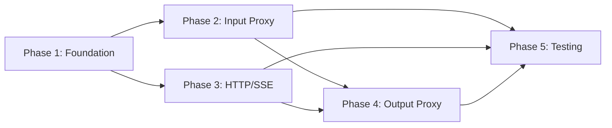

---

## 13. Appendix

### 13.1 Glossary

| Term | Definition |
|------|------------|
| File Proxy | Transparent wrapper that handles file I/O on behalf of AI agents |
| Input Proxy | Converts file_path/file_id to base64 content for upstream tools |
| Output Proxy | Saves upstream file responses to agent-specified output_path |
| Running Session ID | UUID generated on each server startup, scopes registry records |
| Wrapper Tool | Proxy tool replacing the original upstream tool in discovery |
| file_id | UUID reference to an uploaded file (HTTP/SSE mode only) |
| TTL | Time-To-Live — maximum age of a file registry record |
| Detection Heuristic | Rule-based pattern matching on tool schemas to identify file parameters |

### 13.2 Open Questions

| # | Question | Status | Answer |
|---|----------|--------|--------|
| 1 | Should runtime output detection be enabled by default? | Resolved | Yes — configurable via `runtime-detection-enabled` flag |
| 2 | Should file content be logged at DEBUG level for troubleshooting? | Resolved | No — security risk. Log file path and size only. |
| 3 | Should wrapper tools support multiple output files? | Open | FSD says save first file, log warning for additional. Confirm with PO. |
| 4 | Should there be a directory whitelist for input/output paths? | Open | FSD mentions optional whitelist. Implement as config but leave empty by default. |

### 13.3 FSD Requirement Traceability

| FSD Requirement | TDD Section | Implementation |
|----------------|-------------|----------------|
| UC-001 (Auto-detection input) | §5.2 FileProxyDetector | FileProxyDetector.detectInputFileParams() |
| UC-002 (Input proxy STDIO) | §3.2, §5.2 InputFileProxyHandler | InputFileProxyHandlerImpl.processInputProxy() |
| UC-003 (Input proxy HTTP/SSE) | §3.3, §3.4, §5.2 FileUploadHandler | FileUploadHandler + InputFileProxyHandler |
| UC-004 (DB registry) | §4.2, §5.2 FileProxyRegistry | FileProxyRegistryImpl (HikariCP + SQL) |
| UC-005 (Wrapper hiding) | §5.2 WrapperToolGenerator | WrapperToolGenerator.generateWrapper() |
| UC-006 (Output proxy) | §3.5, §5.2 OutputFileProxyHandler | OutputFileProxyHandlerImpl.processOutputProxy() |
| UC-007 (Output detection) | §5.2 FileProxyDetector | FileProxyDetector.detectOutputFileResponse() |
| UC-008 (Max file size) | §10.1, §5.2 FileProxyConfig | FileProxyConfig.maxSizeMb + per-server overrides |
| UC-009 (Lifecycle cleanup) | §5.2 FileProxyCleanupService | startupCleanup(), shutdownCleanup(), backgroundCleanup() |
| BR-001 to BR-041 | Various sections | See individual section references |

