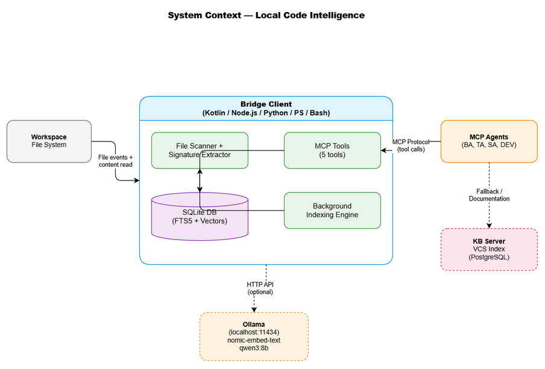
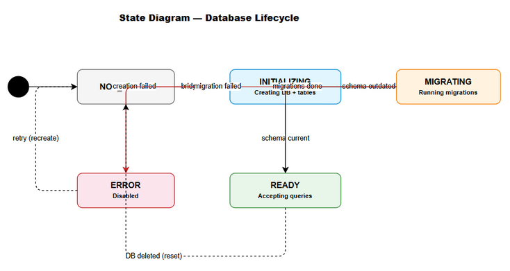
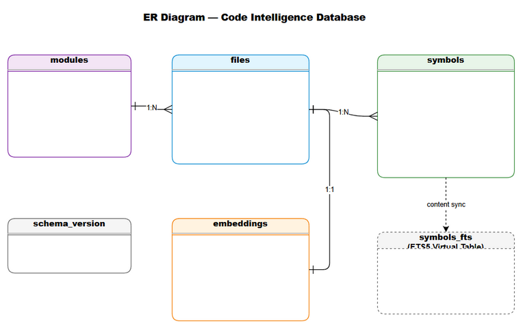
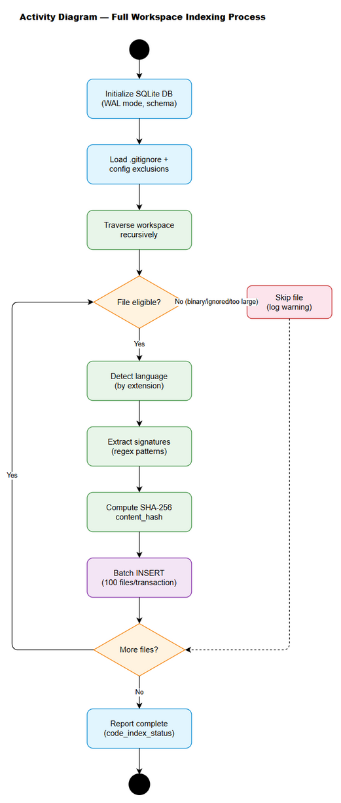
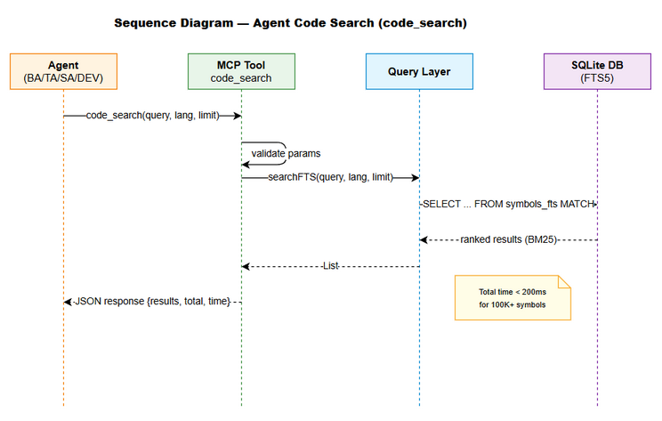
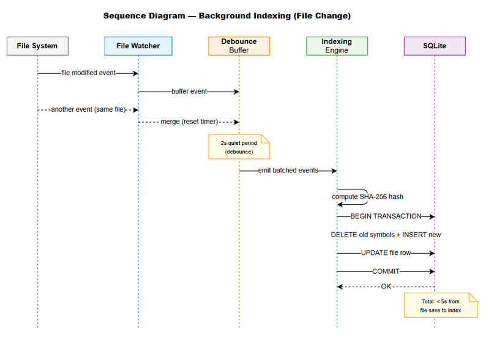
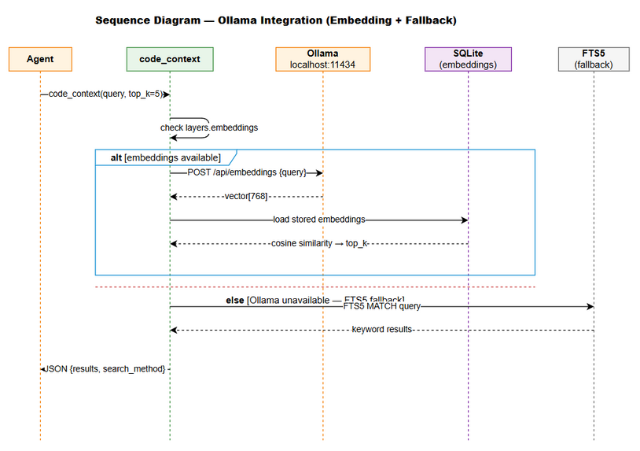
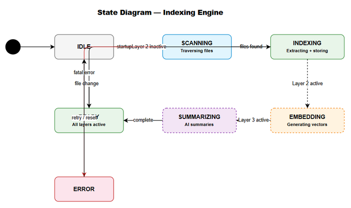

# Functional Specification Document (FSD)

## Bridge Clients — MTO-120: Local Code Intelligence — SQLite Index + Semantic Search Across All Bridge Clients

---

## Document Information

| Field | Value |
|-------|-------|
| Jira Ticket | MTO-120 |
| Title | [Bridge] Local Code Intelligence — SQLite Index + Semantic Search Across All Bridge Clients |
| Author | BA Agent |
| Enriched By | TA Agent |
| Version | 1.0 |
| Date | 2025-07-08 |
| Status | Draft |
| Related BRD | BRD-v1-MTO-120.docx |

---

## Revision History

| Version | Date | Author | Changes |
|---------|------|--------|---------|
| 1.0 | 2025-07-08 | BA Agent + TA Agent | Initial FSD — full functional specification with technical enrichment |

---

## 1. Introduction

### 1.1 Purpose

This FSD specifies the functional behavior of the **Local Code Intelligence** system — a per-workspace SQLite-based code indexing solution with FTS5 full-text search, optional Ollama-powered semantic search, and optional AI summarization. It defines use cases, data flows, API contracts, business rules, and integration specifications for implementation across 6 bridge clients.

### 1.2 Scope

The system provides:
- **Layer 1 (Core):** SQLite schema with FTS5, file scanner, signature extractor, query layer, 5 MCP tools — available in ALL bridge clients
- **Layer 2 (Optional):** Ollama embedding integration for semantic search — Tier 1 clients only (Kotlin, Node.js, Python)
- **Layer 3 (Optional):** AI-powered summarization via qwen3:8b — Tier 1 clients only
- **Background indexing** with file watching for real-time updates — all clients
- **Server-side VCS Index** complement on KB Server — for authoritative cross-team reference

### 1.3 Definitions & Acronyms

| Term | Definition |
|------|------------|
| FTS5 | Full-Text Search version 5 — SQLite extension for efficient text search with BM25 ranking |
| Bridge Client | Language-specific MCP client connecting agents to tools and workspace |
| Tier 1 | Full-capability clients (Kotlin, Node.js, Python) — all 3 layers |
| Tier 2 | Basic clients (PowerShell, Bash) — Layer 1 only |
| Layer 1 | FTS5 keyword search — always available, no external dependencies |
| Layer 2 | Ollama embedding-based semantic search — optional |
| Layer 3 | AI-powered summarization — optional |
| WAL | Write-Ahead Logging — SQLite journaling mode for concurrent reads |
| MCP | Model Context Protocol — communication protocol between agents and tools |
| Cosine Similarity | Vector distance metric for semantic search (1.0 = identical) |

### 1.4 References

| Document | Location |
|----------|----------|
| BRD | BRD-v1-MTO-120.docx |
| Project Structure | .analysis/code-intelligence/project-structure.md |
| SQLite FTS5 Docs | https://www.sqlite.org/fts5.html |
| Ollama API Docs | https://github.com/ollama/ollama/blob/main/docs/api.md |
| MCP Kotlin SDK | io.modelcontextprotocol:kotlin-sdk-server 0.12.0 |

---

## 2. System Overview

### 2.1 System Context Diagram



The Local Code Intelligence system operates within each bridge client process, interacting with:
- **Workspace filesystem** — source of code files to index
- **SQLite database** — persistent storage for index data
- **Ollama (optional)** — local AI runtime for embeddings and summarization
- **MCP Agents** — consumers of code search tools
- **KB Server VCS Index** — complementary server-side authoritative index

### 2.2 System Architecture (Layered)

The system follows a layered architecture where each layer is independently deployable:

```
┌─────────────────────────────────────────────────────────┐
│ MCP Tool Interface                                       │
│ (code_search, code_symbols, code_context,               │
│  code_modules, code_index_status)                       │
├─────────────────────────────────────────────────────────┤
│ Layer 3: AI Summarization (Optional — Tier 1 only)      │
│ qwen3:8b via Ollama → module/class summaries            │
├─────────────────────────────────────────────────────────┤
│ Layer 2: Semantic Search (Optional — Tier 1 only)       │
│ nomic-embed-text via Ollama → cosine similarity         │
├─────────────────────────────────────────────────────────┤
│ Layer 1: Core Index (Required — All clients)            │
│ SQLite FTS5 + File Scanner + Signature Extractor        │
├─────────────────────────────────────────────────────────┤
│ Background Indexing Engine                               │
│ File Watcher + Incremental Updates + Priority Queue     │
└─────────────────────────────────────────────────────────┘
```

---

## 3. Functional Requirements

### 3.1 Feature: SQLite Schema + FTS5 Setup (MTO-121)

**Source:** BRD Story 1

#### 3.1.1 Description

Define and implement a shared SQLite schema with FTS5 virtual tables that all bridge clients use as a consistent data model for code indexing. The schema includes tables for files, symbols, modules, and optional embeddings, with automatic migration support.

#### 3.1.2 Use Cases

**Use Case ID:** UC-001
**Use Case Name:** Initialize Code Intelligence Database
**Actor:** Bridge Client (on startup)
**Preconditions:** Bridge client starts with a valid workspace root path
**Postconditions:** SQLite database exists at `{workspace}/.bridge/code-index.db` with correct schema version

**Main Flow:**

| Step | Actor | System | Description |
|------|-------|--------|-------------|
| 1 | Bridge Client | | Starts up, resolves workspace root |
| 2 | | Database Manager | Check if `.bridge/` directory exists |
| 3 | | Database Manager | If not exists, create `.bridge/` directory |
| 4 | | Database Manager | Open/create SQLite database at `.bridge/code-index.db` |
| 5 | | Database Manager | Enable WAL mode: `PRAGMA journal_mode=WAL` |
| 6 | | Database Manager | Check `schema_version` table |
| 7 | | Database Manager | If version < current → run migrations sequentially |
| 8 | | Database Manager | Create FTS5 virtual table if not exists |
| 9 | | Database Manager | Report: database ready |

**Alternative Flows:**

| ID | Condition | Steps |
|----|-----------|-------|
| AF-001-1 | Database file exists but schema_version table missing | Treat as version 0, run all migrations from start |
| AF-001-2 | Database file exists with current version | Skip migrations, report ready immediately |

**Exception Flows:**

| ID | Condition | Steps |
|----|-----------|-------|
| EF-001-1 | Database creation fails (disk full, permissions) | Log error, disable code intelligence, bridge continues without indexing |
| EF-001-2 | Migration fails mid-way | Backup existing DB as `.bridge/code-index.db.bak`, delete original, recreate from scratch, log warning |
| EF-001-3 | SQLite library not available | Log error, disable code intelligence entirely |

---

**Use Case ID:** UC-002
**Use Case Name:** Reset Code Intelligence Database
**Actor:** Developer (manual action)
**Preconditions:** Database file exists
**Postconditions:** Fresh database with empty schema

**Main Flow:**

| Step | Actor | System | Description |
|------|-------|--------|-------------|
| 1 | Developer | | Deletes `.bridge/code-index.db` file |
| 2 | | Bridge Client | On next startup, detects missing DB |
| 3 | | Database Manager | Creates fresh database (UC-001) |
| 4 | | Indexing Engine | Triggers full workspace scan |


#### 3.1.3 Business Rules

| Rule ID | Rule | Source |
|---------|------|--------|
| BR-001 | Schema version MUST be tracked in `schema_version` table — migrations run automatically on version mismatch | BRD Story 1, AC 3 |
| BR-002 | Schema MUST be identical across all Tier 1 and Tier 2 clients — same DDL, same table structure | BRD Story 1, AC 4 |
| BR-003 | Database file MUST be stored at `{workspace_root}/.bridge/code-index.db` | BRD Story 1, AC 5 |
| BR-004 | WAL mode MUST be enabled for read concurrency during background indexing | BRD Story 3 |
| BR-005 | FTS5 virtual table MUST use `porter unicode61` tokenizer for language-agnostic search | BRD Story 1 |
| BR-006 | Database reset is achievable by deleting the `.bridge/code-index.db` file — no other cleanup needed | BRD Story 1, AC 5 |

#### 3.1.4 Data Specifications

**Schema — `files` table:**

| Field | Type | Required | Validation | Description |
|-------|------|----------|------------|-------------|
| id | INTEGER PK | Yes | Auto-increment | Primary key |
| path | TEXT UNIQUE | Yes | Must be relative path (no leading `/` or drive letter) | Relative path from workspace root |
| language | TEXT | Yes | Must be in supported set: kotlin, java, typescript, javascript, python, go, rust, bash, powershell | Detected programming language |
| content_hash | TEXT | Yes | Valid SHA-256 hex string (exactly 64 chars) | For change detection |
| size_bytes | INTEGER | Yes | Must be ≥ 0 | File size in bytes |
| last_indexed | TEXT | Yes | ISO-8601 format | Timestamp of last indexing |
| module_id | INTEGER FK | No | Must reference valid modules.id or NULL | Module association |

**Schema — `symbols` table:**

| Field | Type | Required | Validation | Description |
|-------|------|----------|------------|-------------|
| id | INTEGER PK | Yes | Auto-increment | Primary key |
| file_id | INTEGER FK | Yes | Must reference valid files.id, CASCADE on delete | Parent file |
| name | TEXT | Yes | Non-empty string | Symbol name |
| kind | TEXT | Yes | Must be one of: class, interface, function, method, property, enum, struct, type, object | Symbol type |
| signature | TEXT | Yes | Non-empty string | Full signature line |
| line_start | INTEGER | Yes | Must be ≥ 1 | Starting line number |
| line_end | INTEGER | No | Must be ≥ line_start if present | Ending line number |
| visibility | TEXT | No | Must be one of: public, private, internal, protected, or NULL | Access modifier |

**Schema — `modules` table:**

| Field | Type | Required | Validation | Description |
|-------|------|----------|------------|-------------|
| id | INTEGER PK | Yes | Auto-increment | Primary key |
| name | TEXT UNIQUE | Yes | Non-empty string | Module/package name |
| path | TEXT | Yes | Must be relative path | Module root path |
| description | TEXT | No | Max 500 chars | Module description |
| summary | TEXT | No | Max 500 chars | AI-generated summary (Layer 3) |
| embedding | BLOB | No | Must be 3072 bytes (768 × float32) if present | Vector embedding (Layer 2) |

**Schema — `embeddings` table (Layer 2):**

| Field | Type | Required | Validation | Description |
|-------|------|----------|------------|-------------|
| id | INTEGER PK | Yes | Auto-increment | Primary key |
| file_id | INTEGER FK | Yes | Must reference valid files.id, CASCADE on delete | Parent file |
| vector | BLOB | Yes | Must be 3072 bytes (768 × float32) | Embedding vector |
| text_summary | TEXT | Yes | Non-empty, max 8192 tokens | Text that was embedded |
| model | TEXT | Yes | Non-empty | Model used for embedding |
| created_at | TEXT | Yes | ISO-8601 format | Creation timestamp |

**Schema — `schema_version` table:**

| Field | Type | Required | Validation | Description |
|-------|------|----------|------------|-------------|
| version | INTEGER PK | Yes | Must be ≥ 1 | Schema version number |
| applied_at | TEXT | Yes | ISO-8601 format, defaults to current time | When migration was applied |

**Schema — FTS5 Virtual Table (`symbols_fts`):**

| Column | Source | Description |
|--------|--------|-------------|
| name | symbols.name | Symbol name for keyword search |
| signature | symbols.signature | Full signature for keyword search |
| file_path | files.path (denormalized) | File path for filtering |
| module_name | modules.name (denormalized) | Module name for filtering |

#### 3.1.5 API Contract (Functional View)

> This feature has no external API — it is an internal infrastructure component. The MCP tools (UC-004) provide the external interface.

#### 3.1.6 State Diagram — Database Lifecycle



*[Edit in draw.io](diagrams/database-state.drawio)*

States: `NOT_EXISTS` → `INITIALIZING` → `MIGRATING` → `READY` → `ERROR`

---

### 3.2 Feature: File Scanner + Signature Extractor (MTO-122)

**Source:** BRD Story 2

#### 3.2.1 Description

Scan workspace files recursively, detect programming languages by extension, extract code signatures using regex patterns, and compute content hashes for incremental change detection. The scanner respects `.gitignore` patterns and configurable exclusions.

#### 3.2.2 Use Cases

**Use Case ID:** UC-003
**Use Case Name:** Full Workspace Scan
**Actor:** Indexing Engine (on first startup or after DB reset)
**Preconditions:** Database is in READY state, workspace root is known
**Postconditions:** All eligible files are indexed with their symbols

**Main Flow:**

| Step | Actor | System | Description |
|------|-------|--------|-------------|
| 1 | Indexing Engine | | Triggers full scan |
| 2 | | File Scanner | Load `.gitignore` patterns from workspace root |
| 3 | | File Scanner | Load exclude patterns from config (`.bridge/code-intelligence.json`) |
| 4 | | File Scanner | Traverse workspace recursively (respecting max_depth) |
| 5 | | File Scanner | For each file: check extension → determine language |
| 6 | | File Scanner | Skip files matching ignore/exclude patterns |
| 7 | | File Scanner | Skip files exceeding max_file_size_kb |
| 8 | | File Scanner | Skip binary files (detected by null bytes in first 512 bytes) |
| 9 | | Signature Extractor | For each eligible file: apply language-specific regex patterns |
| 10 | | Signature Extractor | Extract: name, kind, signature, line_start, line_end, visibility |
| 11 | | Storage Layer | Compute SHA-256 content_hash |
| 12 | | Storage Layer | Batch insert files + symbols into SQLite (transaction per batch of 100) |
| 13 | | Indexing Engine | Update `code_index_status` progress (percentage) |
| 14 | | Indexing Engine | Report: full scan complete |

**Alternative Flows:**

| ID | Condition | Steps |
|----|-----------|-------|
| AF-003-1 | File is unreadable (permissions) | Skip file, log warning, continue scanning |
| AF-003-2 | Regex extraction times out (>100ms per file) | Skip file, log warning with path |
| AF-003-3 | File has >1000 symbols | Extract first 1000, skip remainder, log warning |
| AF-003-4 | Symlink loop detected | Skip symlink, log warning |

**Exception Flows:**

| ID | Condition | Steps |
|----|-----------|-------|
| EF-003-1 | Workspace root not accessible | Abort scan, set status to ERROR, log error |
| EF-003-2 | Database locked during write | Retry with exponential backoff (max 3 retries), then abort batch |
| EF-003-3 | Out of memory during large scan | Reduce batch size to 10, process remaining files in smaller batches |

---

**Use Case ID:** UC-003B
**Use Case Name:** Incremental Scan (Startup)
**Actor:** Indexing Engine (on subsequent startups)
**Preconditions:** Database has existing index data
**Postconditions:** Only changed files are re-indexed

**Main Flow:**

| Step | Actor | System | Description |
|------|-------|--------|-------------|
| 1 | Indexing Engine | | Triggers incremental scan |
| 2 | | File Scanner | Traverse workspace (same as full scan) |
| 3 | | Storage Layer | For each file: compute content_hash |
| 4 | | Storage Layer | Compare with stored hash in `files` table |
| 5 | | Storage Layer | If hash matches → skip (file unchanged) |
| 6 | | Storage Layer | If hash differs → delete old symbols, re-extract, insert new |
| 7 | | Storage Layer | If file not in DB → new file, extract and insert |
| 8 | | Storage Layer | If DB has file not on disk → file deleted, remove from DB |
| 9 | | Indexing Engine | Report: incremental scan complete |

#### 3.2.3 Business Rules

| Rule ID | Rule | Source |
|---------|------|--------|
| BR-007 | Scanner MUST respect `.gitignore` patterns — files ignored by git are not indexed | BRD Story 2, AC 1 |
| BR-008 | Scanner MUST detect language by file extension only (no content-based detection) | BRD Story 2 |
| BR-009 | Content hash (SHA-256) enables incremental scanning — unchanged files are skipped | BRD Story 2, AC 3 |
| BR-010 | Scanner MUST NOT block the main thread — runs in background (coroutine/worker/async) | BRD Story 2, AC 4 |
| BR-011 | Binary files and generated files (.class, .pyc, node_modules) are automatically excluded | BRD Story 2, AC 6 |
| BR-012 | Maximum symbols per file: 1000 — skip remainder with warning | BRD Story 2 |
| BR-013 | Regex extraction timeout per file: 100ms — skip file on timeout | BRD Story 2 |
| BR-014 | Default exclude patterns: `node_modules/**, build/**, dist/**, .git/**, .gradle/**, __pycache__/**` | BRD Story 2 |

#### 3.2.4 Data Specifications

**Configuration — `.bridge/code-intelligence.json`:**

| Field | Type | Required | Default | Description |
|-------|------|----------|---------|-------------|
| exclude_patterns | String[] | No | `["node_modules/**", "build/**", "dist/**", ".git/**", ".gradle/**", "__pycache__/**"]` | Glob patterns to exclude |
| max_file_size_kb | Integer | No | 500 | Skip files larger than this (KB) |
| max_depth | Integer | No | 20 | Maximum directory traversal depth |
| include_languages | String[] | No | null (all supported) | Only scan these languages |
| batch_size | Integer | No | 100 | Files per transaction batch |
| scan_timeout_ms | Integer | No | 100 | Max time per file for regex extraction |

**Language Detection Map:**

| Extensions | Language |
|-----------|----------|
| .kt, .kts | kotlin |
| .java | java |
| .ts, .tsx | typescript |
| .js, .jsx, .mjs | javascript |
| .py | python |
| .go | go |
| .rs | rust |
| .sh | bash |
| .ps1, .psm1 | powershell |

**Signature Extraction Patterns (Pseudocode):**

```
KOTLIN_PATTERNS:
  class:     /^\s*(public|private|internal|protected)?\s*(data|sealed|abstract|open|enum)?\s*class\s+(\w+)/
  interface: /^\s*(public|private|internal)?\s*interface\s+(\w+)/
  object:    /^\s*(public|private|internal)?\s*object\s+(\w+)/
  function:  /^\s*(public|private|internal|protected)?\s*(suspend|override)?\s*fun\s+(\w+)/
  property:  /^\s*(public|private|internal|protected)?\s*(val|var)\s+(\w+)/

TYPESCRIPT_PATTERNS:
  class:     /^\s*export\s+(abstract\s+)?class\s+(\w+)/
  function:  /^\s*export\s+(async\s+)?function\s+(\w+)/
  const:     /^\s*export\s+const\s+(\w+)/
  interface: /^\s*export\s+interface\s+(\w+)/
  type:      /^\s*export\s+type\s+(\w+)/
  enum:      /^\s*export\s+enum\s+(\w+)/

PYTHON_PATTERNS:
  class:     /^class\s+(\w+)/
  function:  /^(async\s+)?def\s+(\w+)/

GO_PATTERNS:
  function:  /^func\s+(\w+|(\(\w+\s+\*?\w+\))\s+\w+)/
  type:      /^type\s+(\w+)\s+(struct|interface)/

RUST_PATTERNS:
  function:  /^\s*(pub\s+)?(async\s+)?fn\s+(\w+)/
  struct:    /^\s*(pub\s+)?struct\s+(\w+)/
  enum:      /^\s*(pub\s+)?enum\s+(\w+)/
  trait:     /^\s*(pub\s+)?trait\s+(\w+)/
  impl:      /^\s*impl\s+(\w+)/
```


---

### 3.3 Feature: SQLite Storage + Query Layer (MTO-123)

**Source:** BRD Story 3

#### 3.3.1 Description

Implement a storage and query layer that efficiently manages indexed data. Provides CRUD operations for files/symbols, FTS5 search with BM25 ranking, multi-dimensional queries, incremental updates via content_hash comparison, and batch operations for initial scans.

#### 3.3.2 Use Cases

**Use Case ID:** UC-004
**Use Case Name:** FTS5 Keyword Search
**Actor:** MCP Tool (`code_search`)
**Preconditions:** Database has indexed data, FTS5 table populated
**Postconditions:** Ranked search results returned

**Main Flow:**

| Step | Actor | System | Description |
|------|-------|--------|-------------|
| 1 | Agent | | Invokes `code_search(query="authenticate", language="kotlin", limit=10)` |
| 2 | | Query Layer | Parse query, apply language filter |
| 3 | | Query Layer | Execute FTS5 MATCH query with BM25 ranking |
| 4 | | Query Layer | Join with files table for path, language info |
| 5 | | Query Layer | Join with modules table for module name |
| 6 | | Query Layer | Apply limit, format results |
| 7 | | MCP Tool | Return JSON response with results array |

**Alternative Flows:**

| ID | Condition | Steps |
|----|-----------|-------|
| AF-004-1 | No results match query | Return empty results array with total_matches=0 |
| AF-004-2 | Module filter specified | Add WHERE clause on module_name in FTS5 query |
| AF-004-3 | Query contains special FTS5 operators (AND, OR, NOT) | Pass through to FTS5 engine directly |

**Exception Flows:**

| ID | Condition | Steps |
|----|-----------|-------|
| EF-004-1 | Database locked (concurrent write) | Retry read after 50ms (WAL allows concurrent reads) |
| EF-004-2 | Query timeout (>5 seconds) | Cancel query, return error response |
| EF-004-3 | Invalid FTS5 syntax | Return validation error with message |

---

**Use Case ID:** UC-005
**Use Case Name:** Incremental File Update
**Actor:** File Watcher (on file change event)
**Preconditions:** File exists in workspace, database is READY
**Postconditions:** File and its symbols are updated atomically

**Main Flow:**

| Step | Actor | System | Description |
|------|-------|--------|-------------|
| 1 | File Watcher | | Detects file change event |
| 2 | | Storage Layer | Begin transaction |
| 3 | | Storage Layer | Compute new content_hash |
| 4 | | Storage Layer | Compare with stored hash |
| 5 | | Storage Layer | If different: DELETE old symbols for this file_id |
| 6 | | Signature Extractor | Re-extract symbols from changed file |
| 7 | | Storage Layer | INSERT new symbols |
| 8 | | Storage Layer | UPDATE files row (hash, last_indexed, size_bytes) |
| 9 | | Storage Layer | UPDATE FTS5 index (delete old, insert new) |
| 10 | | Storage Layer | Commit transaction |

**Alternative Flows:**

| ID | Condition | Steps |
|----|-----------|-------|
| AF-005-1 | Hash unchanged (false positive from watcher) | Skip update, no DB operations |
| AF-005-2 | File deleted | DELETE file row (CASCADE deletes symbols + embeddings) |
| AF-005-3 | New file (not in DB) | INSERT file + symbols (same as initial scan for single file) |

#### 3.3.3 Business Rules

| Rule ID | Rule | Source |
|---------|------|--------|
| BR-015 | FTS5 search MUST return results ranked by BM25 relevance | BRD Story 3, AC 1 |
| BR-016 | Incremental update MUST only re-index files with changed content_hash | BRD Story 3, AC 2 |
| BR-017 | Bulk insert of 10,000 symbols MUST complete in < 5 seconds | BRD Story 3, AC 3 |
| BR-018 | Single file update MUST complete in < 100ms | BRD Story 3, AC 4 |
| BR-019 | Search query MUST return results in < 200ms for 100,000+ symbols | BRD Story 3, AC 5 |
| BR-020 | File + symbols MUST be updated in single transaction (atomic) | BRD Story 3 |
| BR-021 | SQLite WAL mode for read concurrency — single writer with retry | BRD Story 3 |
| BR-022 | Corrupted database detected via `PRAGMA integrity_check` → recreate | BRD Story 3 |

#### 3.3.4 Data Specifications

**Query Interface:**

| Operation | Input | Output | Performance Target |
|-----------|-------|--------|-------------------|
| searchFTS | query: String, language?: String, module?: String, limit: Int | List\<SearchResult\> | < 200ms |
| getSymbolsByFile | filePath: String | List\<Symbol\> | < 50ms |
| getSymbolsByModule | moduleName: String | List\<Symbol\> | < 100ms |
| getFilesByLanguage | language: String | List\<File\> | < 100ms |
| getModules | — | List\<Module\> | < 50ms |
| getChangedFiles | hashes: Map\<Path, Hash\> | List\<Path\> | < 5s (full workspace) |
| getIndexStats | — | IndexStats | < 10ms |
| upsertFile | file: FileEntry, symbols: List\<Symbol\> | Unit | < 100ms |
| deleteFile | filePath: String | Unit | < 50ms |
| bulkInsert | files: List\<FileEntry\> | Unit | < 5s (10K symbols) |

**SearchResult DTO:**

| Field | Type | Description |
|-------|------|-------------|
| file | String | Relative file path |
| symbol | String | Symbol name |
| kind | String | Symbol kind |
| signature | String | Full signature |
| line | Integer | Line number |
| module | String? | Module name (nullable) |
| relevance | Float | BM25 relevance score (0.0–1.0 normalized) |

#### 3.3.5 API Contract (Functional View)

> Storage layer is internal. External API is via MCP tools (Section 3.4).

**SQL Query Patterns (Pseudocode):**

```sql
-- FTS5 Search with ranking
SELECT s.name, s.signature, s.kind, s.line_start, f.path, m.name as module_name,
       rank as relevance
FROM symbols_fts
JOIN symbols s ON symbols_fts.rowid = s.id
JOIN files f ON s.file_id = f.id
LEFT JOIN modules m ON f.module_id = m.id
WHERE symbols_fts MATCH :query
  AND (:language IS NULL OR f.language = :language)
  AND (:module IS NULL OR m.name = :module)
ORDER BY rank
LIMIT :limit;

-- Incremental change detection
SELECT path, content_hash FROM files;
-- Compare with computed hashes → identify changed/new/deleted files
```

---

### 3.4 Feature: MCP Tools (MTO-124)

**Source:** BRD Story 4

#### 3.4.1 Description

Five MCP tools exposed to all agents for querying the local code index. Tools provide keyword search, file symbol listing, semantic search (with FTS5 fallback), module browsing, and index health status. All tools return consistent JSON regardless of bridge client implementation.

#### 3.4.2 Use Cases

**Use Case ID:** UC-006
**Use Case Name:** Agent Searches Code by Keyword
**Actor:** Agent (BA, TA, SA, DEV)
**Preconditions:** Index is in READY state (or partially indexed)
**Postconditions:** Agent receives ranked search results

**Main Flow:**

| Step | Actor | System | Description |
|------|-------|--------|-------------|
| 1 | Agent | | Calls `code_search(query="processRequest", language="kotlin", limit=20)` |
| 2 | | MCP Tool Handler | Validate input parameters |
| 3 | | Query Layer | Execute FTS5 search (UC-004) |
| 4 | | MCP Tool Handler | Format response as JSON |
| 5 | | MCP Transport | Return response to agent |

---

**Use Case ID:** UC-007
**Use Case Name:** Agent Lists Symbols in File
**Actor:** Agent
**Preconditions:** File is indexed
**Postconditions:** Agent receives all symbols in the specified file

**Main Flow:**

| Step | Actor | System | Description |
|------|-------|--------|-------------|
| 1 | Agent | | Calls `code_symbols(file_path="src/main/kotlin/service/AuthService.kt")` |
| 2 | | MCP Tool Handler | Validate file_path parameter |
| 3 | | Query Layer | Query symbols table WHERE file.path = :file_path |
| 4 | | MCP Tool Handler | Format response with file info + symbols array |
| 5 | | MCP Transport | Return response to agent |

**Exception Flows:**

| ID | Condition | Steps |
|----|-----------|-------|
| EF-007-1 | File not in index | Return `{"error": "FILE_NOT_FOUND", "message": "File not in index. It may not have been scanned yet."}` |

---

**Use Case ID:** UC-008
**Use Case Name:** Agent Performs Semantic Search
**Actor:** Agent
**Preconditions:** Index is READY
**Postconditions:** Agent receives semantically relevant results

**Main Flow (Layer 2 available):**

| Step | Actor | System | Description |
|------|-------|--------|-------------|
| 1 | Agent | | Calls `code_context(query="how does authentication work", top_k=5)` |
| 2 | | MCP Tool Handler | Validate input |
| 3 | | Embedding Service | Generate query embedding via Ollama (nomic-embed-text) |
| 4 | | Query Layer | Compute cosine similarity against stored embeddings |
| 5 | | Query Layer | Return top_k results sorted by similarity |
| 6 | | MCP Tool Handler | Format response with `search_method: "embedding"` |

**Alternative Flows:**

| ID | Condition | Steps |
|----|-----------|-------|
| AF-008-1 | Ollama unavailable (Layer 2 not active) | Fall back to FTS5 keyword search, set `search_method: "fts5"` |
| AF-008-2 | No embeddings stored yet (indexing in progress) | Fall back to FTS5, set `search_method: "fts5"` |

---

**Use Case ID:** UC-009
**Use Case Name:** Agent Browses Modules
**Actor:** Agent
**Preconditions:** Index has module data
**Postconditions:** Agent receives module list with metadata

**Main Flow:**

| Step | Actor | System | Description |
|------|-------|--------|-------------|
| 1 | Agent | | Calls `code_modules()` |
| 2 | | Query Layer | SELECT all modules with file_count, symbol_count aggregates |
| 3 | | Query Layer | Include AI summaries if available (Layer 3) |
| 4 | | MCP Tool Handler | Format response |

---

**Use Case ID:** UC-010
**Use Case Name:** Agent Checks Index Health
**Actor:** Agent
**Preconditions:** Bridge client is running
**Postconditions:** Agent receives current index status

**Main Flow:**

| Step | Actor | System | Description |
|------|-------|--------|-------------|
| 1 | Agent | | Calls `code_index_status()` |
| 2 | | Index Manager | Gather stats: file count, symbol count, last indexed time |
| 3 | | Index Manager | Check layer availability (FTS5, embeddings, summaries) |
| 4 | | Index Manager | Check indexing progress (if scan in progress) |
| 5 | | Index Manager | Get database size |
| 6 | | MCP Tool Handler | Format response |

#### 3.4.3 Business Rules

| Rule ID | Rule | Source |
|---------|------|--------|
| BR-023 | All 5 tools MUST return consistent JSON schema regardless of bridge client | BRD Story 4, AC 7 |
| BR-024 | All tools MUST respond within 500ms for typical queries | BRD Story 4, AC 6 |
| BR-025 | `code_context` MUST gracefully fall back to FTS5 when embeddings unavailable | BRD Story 4, AC 3 |
| BR-026 | `code_index_status` MUST accurately report current state including layer availability | BRD Story 4, AC 5 |
| BR-027 | Tools MUST return partial results if index is still building (not block until complete) | BRD Story 4 |
| BR-028 | Empty query MUST return validation error (not empty results) | BRD Story 4 |

#### 3.4.4 Data Specifications — API Contracts

**Tool: `code_search`**

| Parameter | Type | Required | Validation | Default |
|-----------|------|----------|------------|---------|
| query | String | Yes | Non-empty, max 500 chars | — |
| language | String | No | Must be in supported language set if provided | null (all) |
| module | String | No | Must match existing module name if provided | null (all) |
| limit | Integer | No | Must be 1–100 | 20 |

**Response Schema:**

```json
{
  "results": [
    {
      "file": "string (relative path)",
      "symbol": "string (symbol name)",
      "kind": "string (class|function|interface|...)",
      "signature": "string (full signature)",
      "line": "integer (line number)",
      "module": "string|null (module name)",
      "relevance": "float (0.0–1.0)"
    }
  ],
  "total_matches": "integer",
  "query_time_ms": "integer"
}
```

**Tool: `code_symbols`**

| Parameter | Type | Required | Validation | Default |
|-----------|------|----------|------------|---------|
| file_path | String | Yes | Non-empty, must be relative path | — |

**Response Schema:**

```json
{
  "file": "string (relative path)",
  "language": "string",
  "symbols": [
    {
      "name": "string",
      "kind": "string",
      "signature": "string",
      "line_start": "integer",
      "line_end": "integer|null",
      "visibility": "string|null"
    }
  ],
  "symbol_count": "integer"
}
```

**Tool: `code_context`**

| Parameter | Type | Required | Validation | Default |
|-----------|------|----------|------------|---------|
| query | String | Yes | Non-empty, max 1000 chars | — |
| top_k | Integer | No | Must be 1–50 | 5 |

**Response Schema:**

```json
{
  "results": [
    {
      "file": "string (relative path)",
      "summary": "string (file/module summary)",
      "symbols": ["string (symbol names)"],
      "relevance": "float (0.0–1.0)",
      "search_method": "string (embedding|fts5)"
    }
  ],
  "search_method": "string (embedding|fts5)",
  "query_time_ms": "integer"
}
```

**Tool: `code_modules`**

| Parameter | Type | Required | Validation | Default |
|-----------|------|----------|------------|---------|
| — | — | — | No parameters | — |

**Response Schema:**

```json
{
  "modules": [
    {
      "name": "string",
      "path": "string (relative path)",
      "file_count": "integer",
      "symbol_count": "integer",
      "languages": ["string"],
      "summary": "string|null (AI summary if available)"
    }
  ],
  "total_modules": "integer"
}
```

**Tool: `code_index_status`**

| Parameter | Type | Required | Validation | Default |
|-----------|------|----------|------------|---------|
| — | — | — | No parameters | — |

**Response Schema:**

```json
{
  "status": "string (ready|indexing|error)",
  "files_indexed": "integer",
  "symbols_indexed": "integer",
  "modules_detected": "integer",
  "last_indexed": "string (ISO-8601)|null",
  "indexing_progress": "integer (0–100)",
  "layers": {
    "fts5": "boolean",
    "embeddings": "boolean",
    "summaries": "boolean"
  },
  "db_size_mb": "float"
}
```

**Business Error Scenarios:**

| Scenario | Error Code | User Message | Trigger Condition |
|----------|-----------|-------------|-------------------|
| Index not ready | INDEX_NOT_READY | "Index is being built, try again shortly" | Status = "indexing" and no data yet |
| File not found | FILE_NOT_FOUND | "File not in index" | code_symbols with non-indexed path |
| Empty query | VALIDATION_ERROR | "Query parameter is required" | code_search/code_context with empty query |
| Invalid language | VALIDATION_ERROR | "Unsupported language: {lang}" | Language not in supported set |


---

### 3.5 Feature: Ollama Embedding Integration — Layer 2 (MTO-125)

**Source:** BRD Story 5

#### 3.5.1 Description

Optional semantic search capability using Ollama's `nomic-embed-text` model to generate 768-dimensional vector embeddings for file summaries. Enables `code_context` tool to find conceptually related code beyond keyword matching. Gracefully degrades to FTS5 when Ollama is unavailable.

#### 3.5.2 Use Cases

**Use Case ID:** UC-011
**Use Case Name:** Detect Ollama Availability
**Actor:** Bridge Client (on startup)
**Preconditions:** Bridge client starting up
**Postconditions:** Layer 2 availability determined

**Main Flow:**

| Step | Actor | System | Description |
|------|-------|--------|-------------|
| 1 | | Ollama Client | Send HTTP GET to `http://localhost:11434/api/tags` (async, non-blocking) |
| 2 | | Ollama Client | If response 200 within 5s → check if `nomic-embed-text` model listed |
| 3 | | Ollama Client | If model available → set `layers.embeddings = true` |
| 4 | | Ollama Client | Start background embedding generation for unembedded files |

**Alternative Flows:**

| ID | Condition | Steps |
|----|-----------|-------|
| AF-011-1 | Ollama not running (connection refused) | Set `layers.embeddings = false`, log info, continue with FTS5 only |
| AF-011-2 | Ollama running but model not loaded | Attempt `POST /api/pull {"name": "nomic-embed-text"}` once; if fails → disable Layer 2 |
| AF-011-3 | Ollama responds but times out (>5s) | Set `layers.embeddings = false`, retry check every 60s in background |

---

**Use Case ID:** UC-012
**Use Case Name:** Generate File Embeddings
**Actor:** Indexing Engine (background)
**Preconditions:** Ollama available with nomic-embed-text, files indexed in Layer 1
**Postconditions:** Embeddings stored for indexed files

**Main Flow:**

| Step | Actor | System | Description |
|------|-------|--------|-------------|
| 1 | Indexing Engine | | Identify files without embeddings (or with changed content_hash) |
| 2 | | Summary Generator | Create text summary for file (symbols + file path + module context) |
| 3 | | Ollama Client | POST `/api/embeddings` with `{"model": "nomic-embed-text", "prompt": summary}` |
| 4 | | Ollama Client | Receive 768-dim vector response |
| 5 | | Storage Layer | Store embedding in `embeddings` table (file_id, vector, text_summary, model) |
| 6 | | Indexing Engine | Move to next file, repeat |

**Alternative Flows:**

| ID | Condition | Steps |
|----|-----------|-------|
| AF-012-1 | Ollama becomes unavailable mid-batch | Pause embedding generation, retry every 60s |
| AF-012-2 | VRAM exhaustion | Reduce batch size, add delay between requests |
| AF-012-3 | File summary exceeds 8192 tokens | Truncate summary to fit model context limit |

#### 3.5.3 Business Rules

| Rule ID | Rule | Source |
|---------|------|--------|
| BR-029 | Ollama health check MUST NOT block bridge startup (async, max 5s timeout) | BRD Story 5, AC 1 |
| BR-030 | Embedding generation MUST run in background (non-blocking) | BRD Story 5, AC 2 |
| BR-031 | `code_context` MUST use cosine similarity when embeddings available | BRD Story 5, AC 3 |
| BR-032 | `code_context` MUST fall back to FTS5 transparently when embeddings unavailable | BRD Story 5, AC 4 |
| BR-033 | Re-embedding ONLY occurs for files with changed content_hash | BRD Story 5, AC 7 |
| BR-034 | Embedding vector MUST be exactly 768 dimensions (nomic-embed-text output) | BRD Story 5 |
| BR-035 | Embedding generation rate target: ≥ 50 files/minute on RTX 4060 8GB | BRD Story 5, AC 6 |
| BR-036 | Ollama endpoint: `http://localhost:11434` (localhost only, no remote servers for v1) | BRD Assumptions |

#### 3.5.4 Data Specifications

**Ollama API — Embedding Request:**

```json
POST http://localhost:11434/api/embeddings
{
  "model": "nomic-embed-text",
  "prompt": "AuthService.kt: class AuthService — JWT token validation, user session management. Methods: authenticateUser, validateToken, refreshSession"
}
```

**Ollama API — Embedding Response:**

```json
{
  "embedding": [0.123, -0.456, 0.789, ...] // 768 floats
}
```

**Cosine Similarity Computation (Pseudocode):**

```
function cosineSimilarity(a: Float[768], b: Float[768]) -> Float:
    dotProduct = sum(a[i] * b[i] for i in 0..767)
    magnitudeA = sqrt(sum(a[i]^2 for i in 0..767))
    magnitudeB = sqrt(sum(b[i]^2 for i in 0..767))
    return dotProduct / (magnitudeA * magnitudeB)
```

---

### 3.6 Feature: AI Summarization — Layer 3 (MTO-126)

**Source:** BRD Story 6

#### 3.6.1 Description

Optional AI-powered summarization using Ollama's `qwen3:8b` model to generate human-readable descriptions for modules and classes. Summaries enrich `code_modules()` and `code_context()` responses. Lowest priority background task — runs after indexing and embedding are complete.

#### 3.6.2 Use Cases

**Use Case ID:** UC-013
**Use Case Name:** Generate Module Summaries
**Actor:** Summarization Engine (background, lowest priority)
**Preconditions:** Ollama available with qwen3:8b, modules detected, Layer 1 indexing complete
**Postconditions:** Module summaries stored in `modules.summary` column

**Main Flow:**

| Step | Actor | System | Description |
|------|-------|--------|-------------|
| 1 | Summarization Engine | | Check queue: modules without summaries (or stale summaries) |
| 2 | | Summary Generator | Collect module context: file paths, top-level symbols, module name |
| 3 | | Ollama Client | POST `/api/generate` with prompt: "Summarize this code module in 2-3 sentences: {context}" |
| 4 | | Ollama Client | Receive generated text |
| 5 | | Validation | Check: non-empty, ≤ 500 chars, English, coherent |
| 6 | | Storage Layer | UPDATE modules SET summary = :summary WHERE id = :module_id |
| 7 | | Summarization Engine | Rate limit: wait 2s before next request |

**Alternative Flows:**

| ID | Condition | Steps |
|----|-----------|-------|
| AF-013-1 | Generated text is garbage (too short, non-English, incoherent) | Discard, mark as "failed", retry later |
| AF-013-2 | Ollama timeout (>30s) | Skip module, retry in next cycle |
| AF-013-3 | Queue overflow (>1000 pending) | Process in priority order: modules first, then classes |

#### 3.6.3 Business Rules

| Rule ID | Rule | Source |
|---------|------|--------|
| BR-037 | Summarization is LOWEST priority — after indexing and embedding | BRD Story 6 |
| BR-038 | Max 1 concurrent summarization request to Ollama | BRD Story 6 |
| BR-039 | Summary MUST be ≤ 500 characters, non-empty, English | BRD Story 6 |
| BR-040 | Stale summaries (file changed) are marked for refresh | BRD Story 6, AC 6 |
| BR-041 | Summarization MUST NOT block search operations | BRD Story 6, AC 4 |
| BR-042 | Module summaries generated within 5 minutes of initial index completion | BRD Story 6, AC 1 |

---

### 3.7 Feature: Background Indexing + File Watcher (MTO-127)

**Source:** BRD Story 7

#### 3.7.1 Description

Background indexing engine with file watching for real-time index updates. Handles full scans on first startup, incremental scans on subsequent startups, and single-file updates on file change events. All operations are non-blocking with priority-based scheduling.

#### 3.7.2 Use Cases

**Use Case ID:** UC-014
**Use Case Name:** File Change Detection and Update
**Actor:** File Watcher
**Preconditions:** File watcher initialized, database READY
**Postconditions:** Changed file re-indexed within 5 seconds

**Main Flow:**

| Step | Actor | System | Description |
|------|-------|--------|-------------|
| 1 | File System | | File created/modified/deleted |
| 2 | | File Watcher | Receive OS event (WatchService/chokidar/watchdog/inotifywait) |
| 3 | | Debounce Buffer | Buffer event (2-second window) |
| 4 | | Debounce Buffer | After 2s quiet period: emit batched events |
| 5 | | Indexing Engine | For each event: determine action (create/update/delete) |
| 6 | | Indexing Engine | Execute UC-005 (Incremental File Update) for each file |
| 7 | | Embedding Engine | If Layer 2 active: queue file for re-embedding |
| 8 | | Summarization Engine | If Layer 3 active: mark module summary as stale |

**Alternative Flows:**

| ID | Condition | Steps |
|----|-----------|-------|
| AF-014-1 | File watcher initialization fails | Fall back to periodic polling every 30s |
| AF-014-2 | Rapid successive changes (same file) | Debounce: only process latest state after 2s quiet |
| AF-014-3 | File changed during indexing | Re-queue for next cycle |
| AF-014-4 | Database locked during write | Retry with exponential backoff (100ms, 200ms, 400ms) |

---

**Use Case ID:** UC-015
**Use Case Name:** Graceful Shutdown
**Actor:** Bridge Client (shutting down)
**Preconditions:** Indexing may be in progress
**Postconditions:** No corrupted database, pending work is lost (will resume on next startup)

**Main Flow:**

| Step | Actor | System | Description |
|------|-------|--------|-------------|
| 1 | Bridge Client | | Receives shutdown signal |
| 2 | | Indexing Engine | Cancel all pending indexing coroutines/tasks |
| 3 | | File Watcher | Stop watching (close watcher handle) |
| 4 | | Storage Layer | Flush any pending writes (commit or rollback current transaction) |
| 5 | | Storage Layer | Close database connection |
| 6 | | Bridge Client | Shutdown complete (within 5s) |

#### 3.7.3 Business Rules

| Rule ID | Rule | Source |
|---------|------|--------|
| BR-043 | Initial full scan of 5,000 files MUST complete in < 60 seconds | BRD Story 7, AC 1 |
| BR-044 | Incremental startup scan (no changes) MUST complete in < 5 seconds | BRD Story 7, AC 2 |
| BR-045 | Single file change reflected in index within 5 seconds of save | BRD Story 7, AC 3 |
| BR-046 | Indexing NEVER blocks MCP tool responses | BRD Story 7, AC 5 |
| BR-047 | File watcher debounce window: 2 seconds | BRD Story 7 |
| BR-048 | Maximum concurrent file processing: 4 | BRD Story 7 |
| BR-049 | Graceful shutdown within 5 seconds | BRD Story 7, AC 7 |
| BR-050 | CPU usage < 25% sustained during background indexing | BRD NFR |
| BR-051 | File watcher fallback to polling (30s) if native watcher fails | BRD Story 7 |

#### 3.7.4 Indexing Priority Queue

| Priority | Task Type | Trigger |
|----------|-----------|---------|
| 1 (Highest) | File change re-index | File watcher event |
| 2 | Incremental startup scan | Bridge startup |
| 3 | Full workspace scan | First startup / DB reset |
| 4 | Embedding generation | After file indexed (Layer 2) |
| 5 (Lowest) | Summary generation | After embeddings done (Layer 3) |


---

### 3.8 Feature: Kotlin Bridge Implementation — Tier 1 (MTO-128)

**Source:** BRD Story 8

#### 3.8.1 Description

Full code intelligence implementation in the Kotlin bridge client using sqlite-jdbc, Ktor HTTP client for Ollama, coroutine-based background indexing, and Java NIO WatchService for file watching. Integrates with existing WorkspaceContext and MCP tool registration infrastructure.

#### 3.8.2 Use Cases

**Use Case ID:** UC-016
**Use Case Name:** Kotlin Bridge Startup with Code Intelligence
**Actor:** Kotlin Bridge Client
**Preconditions:** Bridge application starts, WorkspaceContext initialized
**Postconditions:** Code intelligence active, all 5 MCP tools registered

**Main Flow:**

| Step | Actor | System | Description |
|------|-------|--------|-------------|
| 1 | Bridge Client | | Application starts (BridgeApplication.kt) |
| 2 | | WorkspaceContext | Resolve workspace root path |
| 3 | | CodeIntelligenceModule | Initialize (Koin DI injection) |
| 4 | | DatabaseManager | Open/create SQLite DB (UC-001) via sqlite-jdbc |
| 5 | | OllamaClient | Async health check (UC-011) via Ktor HTTP client |
| 6 | | ToolRegistrar | Register 5 MCP tools in existing tool infrastructure |
| 7 | | IndexingEngine | Launch coroutine: incremental or full scan |
| 8 | | FileWatcher | Start WatchService on workspace root |
| 9 | | Bridge Client | Code intelligence ready |

#### 3.8.3 Business Rules

| Rule ID | Rule | Source |
|---------|------|--------|
| BR-052 | Kotlin bridge uses `org.xerial:sqlite-jdbc` for SQLite access | BRD Story 8 |
| BR-053 | Background indexing uses structured concurrency (cancellable, no leaked coroutines) | BRD Story 8, AC 4 |
| BR-054 | Memory usage for indexing stays under 256MB heap for 10,000-file workspace | BRD Story 8, AC 6 |
| BR-055 | File watcher via `java.nio.file.WatchService` | BRD Story 8 |
| BR-056 | Configuration via `.bridge/code-intelligence.json` in workspace root | BRD Story 8 |

#### 3.8.4 Technical Integration Points

| Component | Existing Infrastructure | Integration Method |
|-----------|------------------------|-------------------|
| DI | Koin (AppModule.kt) | New `codeIntelligenceModule` added to Koin |
| MCP Tools | BridgeServer.kt tool registration | Register via existing `registerTool()` API |
| Config | BridgeConfig.kt | Add `codeIntelligence` section |
| Workspace | WorkspaceContext.kt | Use `workspaceRoot` property |
| HTTP | Ktor Client (CIO) | Reuse existing client for Ollama calls |
| Coroutines | kotlinx.coroutines | Use `CoroutineScope(SupervisorJob() + Dispatchers.IO)` |

---

### 3.9 Feature: Node.js Bridge Implementation — Tier 1 (MTO-129)

**Source:** BRD Story 9

#### 3.9.1 Description

Full code intelligence implementation in the Node.js bridge client using better-sqlite3 (synchronous, fast), fetch API for Ollama, worker_threads for background indexing, and chokidar for file watching.

#### 3.9.2 Use Cases

**Use Case ID:** UC-017
**Use Case Name:** Node.js Bridge Startup with Code Intelligence
**Actor:** Node.js Bridge Client
**Preconditions:** Bridge process starts, workspace root known
**Postconditions:** Code intelligence active, all 5 MCP tools registered

**Main Flow:**

| Step | Actor | System | Description |
|------|-------|--------|-------------|
| 1 | Bridge Client | | Process starts (main entry) |
| 2 | | WorkspaceContext | Resolve workspace root |
| 3 | | CodeIntelligenceModule | Initialize |
| 4 | | Worker Thread | Spawn indexing worker |
| 5 | | Worker: DatabaseManager | Open/create SQLite DB via better-sqlite3 |
| 6 | | Main Thread: OllamaClient | Async health check via fetch |
| 7 | | Main Thread: ToolRegistrar | Register 5 MCP tools |
| 8 | | Worker: IndexingEngine | Start incremental or full scan |
| 9 | | Main Thread: FileWatcher | Start chokidar watcher |

#### 3.9.3 Business Rules

| Rule ID | Rule | Source |
|---------|------|--------|
| BR-057 | Node.js bridge uses `better-sqlite3` for synchronous SQLite access | BRD Story 9 |
| BR-058 | Worker thread handles ALL indexing — never blocks MCP message processing | BRD Story 9, AC 2 |
| BR-059 | Memory usage stays under 512MB for 10,000-file workspace | BRD Story 9, AC 6 |
| BR-060 | File watcher via `chokidar` for cross-platform reliability | BRD Story 9 |
| BR-061 | All 5 MCP tools return identical JSON schema as Kotlin bridge | BRD Story 9, AC 4 |

---

### 3.10 Feature: Python Bridge Implementation — Tier 1

**Source:** BRD Story 10

#### 3.10.1 Description

Full code intelligence in Python bridge using stdlib `sqlite3` (zero external deps for Layer 1), `httpx` for Ollama (optional), `asyncio` for background indexing, and `watchdog` for file watching.

#### 3.10.2 Business Rules

| Rule ID | Rule | Source |
|---------|------|--------|
| BR-062 | Core indexing uses ONLY stdlib: sqlite3, hashlib, os, re | BRD Story 10, AC 2 |
| BR-063 | Layer 2+3 require `httpx` (optional, graceful if missing) | BRD Story 10, AC 3 |
| BR-064 | `asyncio` task handles background indexing | BRD Story 10, AC 4 |
| BR-065 | Works on Python 3.10+ minimum | BRD Story 10, AC 6 |
| BR-066 | Memory usage stays under 256MB | BRD Story 10, AC 7 |

---

### 3.11 Feature: PowerShell + Bash Bridge Implementation — Tier 2

**Source:** BRD Story 11

#### 3.11.1 Description

Basic code intelligence (FTS5 keyword search only) for PowerShell and Bash bridges. No embeddings, no AI summarization. Uses native shell commands for file scanning and `sqlite3` CLI for database operations.

#### 3.11.2 Business Rules

| Rule ID | Rule | Source |
|---------|------|--------|
| BR-067 | Tier 2 bridges provide Layer 1 ONLY (FTS5) — no embeddings, no summaries | BRD Story 11 |
| BR-068 | `code_context` on Tier 2 always uses FTS5 (no fallback needed — it's the only option) | BRD Story 11, AC 3 |
| BR-069 | `code_index_status` reports `layers.embeddings: false, layers.summaries: false` | BRD Story 11, AC 4 |
| BR-070 | Same MCP tool JSON response schema as Tier 1 | BRD Story 11, AC 5 |
| BR-071 | Works without external dependencies beyond `sqlite3` CLI | BRD Story 11, AC 6 |
| BR-072 | Indexing completes within 2 minutes for 5,000-file workspace | BRD Story 11, AC 7 |

---

### 3.12 Feature: Server-side VCS Index (KB Server Complement)

**Source:** BRD Story 12

#### 3.12.1 Description

Server-side code index on KB Server that indexes code from VCS (git main branch). Provides authoritative, shared, cross-team code reference. Coexists with local bridge indexes — agents use server index for documentation tasks and local index for implementation tasks.

#### 3.12.2 Use Cases

**Use Case ID:** UC-018
**Use Case Name:** Agent Queries Server VCS Index for Documentation
**Actor:** BA/TA Agent (creating BRD/FSD)
**Preconditions:** KB Server running, VCS index populated
**Postconditions:** Agent receives authoritative code references from main branch

**Main Flow:**

| Step | Actor | System | Description |
|------|-------|--------|-------------|
| 1 | BA Agent | | Needs code reference for documentation |
| 2 | | Tool Router | Detect context: documentation task → route to server index |
| 3 | | KB Server | Execute code search against VCS index (PostgreSQL) |
| 4 | | KB Server | Return results with `source: "vcs"` |

#### 3.12.3 Business Rules

| Rule ID | Rule | Source |
|---------|------|--------|
| BR-073 | Server index populated from git main branch | BRD Story 12, AC 1 |
| BR-074 | Server index updates within 5 minutes of push to main | BRD Story 12, AC 2 |
| BR-075 | Local index preferred for implementation tasks (fresher) | BRD Story 12, AC 5 |
| BR-076 | Server index preferred for documentation/analysis tasks (authoritative) | BRD Story 12, AC 6 |
| BR-077 | Server unavailable → agents fall back to local index only | BRD Story 12 |

---

## 4. Data Model

### 4.1 Entity Relationship Diagram



### 4.2 Logical Entities

#### Entity: File

| Attribute | Type | Required | Business Rule | Description |
|-----------|------|----------|---------------|-------------|
| id | Integer | Yes | Auto-generated | Unique identifier |
| path | String | Yes | BR-007 (relative only) | Relative path from workspace root |
| language | Enum | Yes | BR-008 (extension-based) | Detected programming language |
| content_hash | String(64) | Yes | BR-009 (SHA-256) | Change detection hash |
| size_bytes | Integer | Yes | — | File size |
| last_indexed | DateTime | Yes | — | Last indexing timestamp |
| module_id | Integer | No | — | Associated module |

#### Entity: Symbol

| Attribute | Type | Required | Business Rule | Description |
|-----------|------|----------|---------------|-------------|
| id | Integer | Yes | Auto-generated | Unique identifier |
| file_id | Integer | Yes | CASCADE delete | Parent file reference |
| name | String | Yes | — | Symbol name |
| kind | Enum | Yes | BR-012 (validated set) | Symbol type classification |
| signature | String | Yes | — | Full declaration line |
| line_start | Integer | Yes | — | Start line in source |
| line_end | Integer | No | — | End line in source |
| visibility | Enum | No | — | Access modifier |

#### Entity: Module

| Attribute | Type | Required | Business Rule | Description |
|-----------|------|----------|---------------|-------------|
| id | Integer | Yes | Auto-generated | Unique identifier |
| name | String | Yes | Unique constraint | Module/package name |
| path | String | Yes | — | Module root path |
| description | String | No | Max 500 chars | Human-written description |
| summary | String | No | BR-039 (≤500 chars) | AI-generated summary |
| embedding | Binary | No | BR-034 (768 dims) | Module-level embedding |

#### Entity: Embedding

| Attribute | Type | Required | Business Rule | Description |
|-----------|------|----------|---------------|-------------|
| id | Integer | Yes | Auto-generated | Unique identifier |
| file_id | Integer | Yes | CASCADE delete | Parent file reference |
| vector | Binary(3072) | Yes | BR-034 (768 × float32) | Embedding vector |
| text_summary | String | Yes | Max 8192 tokens | Embedded text |
| model | String | Yes | — | Model identifier |
| created_at | DateTime | Yes | — | Creation timestamp |

**Relationships:**

| From Entity | To Entity | Cardinality | Description |
|-------------|-----------|-------------|-------------|
| File | Symbol | 1:N | A file contains multiple symbols |
| File | Embedding | 1:1 | A file has at most one embedding |
| Module | File | 1:N | A module contains multiple files |
| File | Module | N:1 | A file belongs to at most one module |


---

## 5. Integration Specifications

### 5.1 External System: Ollama (Local AI Runtime)

| Attribute | Value |
|-----------|-------|
| Purpose | Generate vector embeddings (Layer 2) and text summaries (Layer 3) |
| Direction | Outbound (bridge → Ollama) |
| Data Format | JSON over HTTP |
| Frequency | On-demand (during indexing) + periodic health checks |
| Endpoint | `http://localhost:11434` |
| Authentication | None (localhost only) |

**Data Exchange:**

| Our Data | External Data | Direction | Business Rule |
|----------|--------------|-----------|---------------|
| File summary text | Embedding vector (768 floats) | Send text → Receive vector | BR-034 |
| Module context | Generated summary text | Send context → Receive summary | BR-039 |
| Health check | Model availability | Send GET → Receive status | BR-029 |

**API Endpoints Used:**

| Method | Path | Purpose |
|--------|------|---------|
| GET | `/api/tags` | List available models (health check) |
| POST | `/api/embeddings` | Generate embedding vector |
| POST | `/api/generate` | Generate text summary |
| POST | `/api/pull` | Pull model (one-time, if missing) |

### 5.2 External System: File System (Workspace)

| Attribute | Value |
|-----------|-------|
| Purpose | Source of code files to index |
| Direction | Inbound (filesystem → bridge) |
| Data Format | Raw file content (text) |
| Frequency | Real-time (file watcher) + on-demand (scan) |

**Data Exchange:**

| Our Data | External Data | Direction | Business Rule |
|----------|--------------|-----------|---------------|
| — | File content (for hashing + extraction) | Receive | BR-009 |
| — | File system events (create/modify/delete) | Receive | BR-045 |
| — | .gitignore patterns | Receive | BR-007 |

### 5.3 External System: MCP Agents (Tool Consumers)

| Attribute | Value |
|-----------|-------|
| Purpose | Agents query code index via MCP tools |
| Direction | Inbound (agent → bridge tools) |
| Data Format | MCP JSON-RPC |
| Frequency | On-demand (agent queries) |

**Data Exchange:**

| Our Data | External Data | Direction | Business Rule |
|----------|--------------|-----------|---------------|
| Search results JSON | Tool call parameters | Receive params → Send results | BR-023 |
| Index status JSON | Status request | Receive request → Send status | BR-026 |

### 5.4 External System: KB Server VCS Index (Complement)

| Attribute | Value |
|-----------|-------|
| Purpose | Authoritative cross-team code reference from main branch |
| Direction | Bidirectional (local ↔ server routing) |
| Data Format | MCP JSON-RPC |
| Frequency | On-demand (agent queries) |

**Data Exchange:**

| Our Data | External Data | Direction | Business Rule |
|----------|--------------|-----------|---------------|
| Tool routing decision | Agent context (documentation vs implementation) | Internal routing | BR-075, BR-076 |
| — | VCS index search results | Receive (when server preferred) | BR-077 |

---

## 6. Processing Logic

### 6.1 Full Workspace Indexing Process

**Trigger:** First bridge startup (no existing database) or database reset
**Schedule:** One-time on startup
**Input:** Workspace root path, configuration
**Output:** Populated SQLite database with files, symbols, modules

**Processing Steps:**

| Step | Description | Error Handling |
|------|-------------|----------------|
| 1 | Initialize database (UC-001) | If fails → disable code intelligence |
| 2 | Load .gitignore + config exclude patterns | If .gitignore missing → no exclusions |
| 3 | Traverse workspace recursively | Skip unreadable dirs, log warning |
| 4 | For each file: detect language by extension | Skip unknown extensions |
| 5 | For each eligible file: compute SHA-256 hash | Skip on I/O error |
| 6 | For each eligible file: extract signatures via regex | Skip on timeout (100ms) |
| 7 | Detect modules (by build files: build.gradle.kts, package.json, pyproject.toml) | If no build files → single "root" module |
| 8 | Batch insert into SQLite (100 files per transaction) | Retry on lock, abort batch on persistent failure |
| 9 | Populate FTS5 index | Automatic via triggers |
| 10 | Report completion via code_index_status | — |

**Activity Diagram:**



### 6.2 Incremental Update Process

**Trigger:** File watcher event (after 2s debounce) or startup incremental scan
**Input:** Changed file path(s)
**Output:** Updated index entries

**Processing Steps:**

| Step | Description | Error Handling |
|------|-------------|----------------|
| 1 | Receive file change event(s) from debounce buffer | — |
| 2 | For each file: compute new content_hash | Skip on I/O error |
| 3 | Compare with stored hash | If file not in DB → treat as new |
| 4 | If unchanged → skip | — |
| 5 | If changed → BEGIN TRANSACTION | — |
| 6 | DELETE old symbols for file_id | — |
| 7 | Re-extract signatures | Skip on timeout |
| 8 | INSERT new symbols | — |
| 9 | UPDATE file row (hash, timestamp, size) | — |
| 10 | COMMIT TRANSACTION | Rollback on error |
| 11 | If Layer 2 active → queue for re-embedding | — |
| 12 | If Layer 3 active → mark module summary stale | — |

### 6.3 Semantic Search Process (code_context)

**Trigger:** Agent calls `code_context(query, top_k)`
**Input:** Natural language query, top_k parameter
**Output:** Ranked results with relevance scores

**Processing Steps:**

| Step | Description | Error Handling |
|------|-------------|----------------|
| 1 | Check if Layer 2 (embeddings) is available | If not → go to step 6 (FTS5 fallback) |
| 2 | Generate query embedding via Ollama | If Ollama fails → go to step 6 |
| 3 | Load all stored embeddings from DB | — |
| 4 | Compute cosine similarity for each embedding vs query embedding | — |
| 5 | Sort by similarity, take top_k → return with `search_method: "embedding"` | — |
| 6 | (FTS5 fallback) Execute FTS5 MATCH query | — |
| 7 | Return results with `search_method: "fts5"` | — |

### 6.4 Module Detection Process

**Trigger:** During full/incremental scan
**Input:** Workspace file structure
**Output:** Detected modules in `modules` table

**Processing Steps:**

| Step | Description | Error Handling |
|------|-------------|----------------|
| 1 | Scan for build files: `build.gradle.kts`, `package.json`, `pyproject.toml`, `Cargo.toml`, `go.mod` | — |
| 2 | Each build file directory = one module | — |
| 3 | Module name = directory name (or from build file metadata) | — |
| 4 | Module path = relative path to build file directory | — |
| 5 | Associate files with nearest parent module | Files without module → module_id = NULL |
| 6 | INSERT/UPDATE modules table | — |

---

## 7. Security Requirements

### 7.1 Data Sensitivity Classification

| Data Type | Classification | Business Requirement |
|-----------|---------------|---------------------|
| Source code signatures | Internal | Stored locally only, never transmitted externally |
| File paths | Internal | Relative paths only — no absolute paths stored |
| Embedding vectors | Internal | Derived from code, stored locally |
| AI summaries | Internal | Generated locally via Ollama, stored locally |
| .env / credential files | Restricted | MUST be excluded from indexing (BR-014) |

### 7.2 Security Rules

| Rule ID | Rule | Source |
|---------|------|--------|
| BR-078 | Database stored locally only — no data transmitted externally | BRD NFR (Security) |
| BR-079 | Scanner MUST exclude `.env`, credential files, private keys from indexing | BRD NFR (Security) |
| BR-080 | Ollama communication is localhost only (127.0.0.1:11434) | BRD Assumptions |
| BR-081 | No secrets indexed — scanner excludes files matching: `.env*`, `*.pem`, `*.key`, `credentials*`, `*secret*` | BRD NFR |
| BR-082 | Per-workspace database isolation — no cross-workspace data leakage | BRD NFR (Data Integrity) |

### 7.3 Audit Trail

| Event | Logged Fields | Retention | Business Reason |
|-------|--------------|-----------|-----------------|
| Index initialization | workspace_root, timestamp, schema_version | Session lifetime | Debugging |
| Full scan complete | files_count, symbols_count, duration_ms | Session lifetime | Performance monitoring |
| Index error | error_type, file_path, timestamp | Session lifetime | Troubleshooting |
| Layer availability change | layer_name, available (bool), timestamp | Session lifetime | Observability |

---

## 8. Non-Functional Requirements

| Category | Business Requirement | Acceptance Criteria |
|----------|---------------------|---------------------|
| Performance | Initial scan completes quickly | Full scan of 5,000 files < 60 seconds on SSD |
| Performance | Startup is fast when no changes | Incremental scan (no changes) < 5 seconds |
| Performance | Search is responsive | FTS5 query < 200ms with 100,000+ symbols |
| Performance | Semantic search is acceptable | Embedding search < 500ms with 10,000 vectors |
| Performance | File changes reflected quickly | Single file re-index < 100ms after save |
| Resource Usage | Low memory footprint | < 256MB (Kotlin/Python), < 512MB (Node.js) |
| Resource Usage | Reasonable disk usage | Database < 50MB for 10,000-file workspace |
| Resource Usage | Non-intrusive CPU | Background indexing < 25% sustained CPU |
| Reliability | Graceful degradation | Layer 2/3 failure does not affect Layer 1 |
| Reliability | Crash recovery | WAL mode survives unexpected shutdown |
| Reliability | Atomic updates | File + symbols in single transaction |
| Scalability | Large workspaces | Support up to 20,000 files per workspace |
| Scalability | Many symbols | Support up to 200,000 symbols per workspace |
| Compatibility | Cross-platform | Windows, macOS, Linux for all Tier 1 clients |
| Compatibility | Consistent interface | All bridges return identical JSON schemas |
| Availability | Offline capable | Layer 1 works without network access |
| Availability | Non-blocking | Indexing never blocks MCP tool responses |
| Observability | Health monitoring | `code_index_status` provides real-time metrics |

---

## 9. Error Handling (User-Facing)

### 9.1 Error Scenarios

| Scenario | Severity | User Message | Expected Behavior |
|----------|----------|-------------|-------------------|
| Database creation fails | Warning | "Code intelligence unavailable — database creation failed" | Bridge continues without indexing |
| SQLite library missing | Warning | "Code intelligence unavailable — SQLite not found" | Bridge continues without indexing |
| Ollama not running | Info | (No message — transparent) | FTS5 only, `layers.embeddings: false` |
| Index still building | Info | "Index is being built, try again shortly" | Partial results returned |
| File not in index | Info | "File not in index" | Agent can retry after indexing completes |
| Query timeout | Warning | "Search timed out" | Agent can retry with simpler query |
| Database corrupted | Warning | "Index corrupted, rebuilding..." | Auto-recreate database, full re-scan |
| Disk full | Critical | "Cannot update index — disk full" | Read-only mode for existing index |

### 9.2 Notification Requirements

| Event | Who is Notified | Channel | Timing |
|-------|----------------|---------|--------|
| Code intelligence disabled | Agent (via code_index_status) | MCP tool response | On first tool call |
| Index rebuild triggered | Agent (via code_index_status) | MCP tool response | On status check |
| Layer availability change | Agent (via code_index_status) | MCP tool response | On status check |

---

## 10. Testing Considerations

### 10.1 Test Scenarios

| ID | Scenario | Input | Expected Output | Priority |
|----|----------|-------|-----------------|----------|
| TC-001 | Database initialization on fresh workspace | Empty workspace | DB created with correct schema | High |
| TC-002 | Full scan of multi-language workspace | 100 files (Kotlin, TS, Python) | All symbols extracted correctly | High |
| TC-003 | FTS5 search returns relevant results | query="authenticate" | AuthService symbols ranked first | High |
| TC-004 | Incremental scan skips unchanged files | No file changes since last scan | Scan completes in < 5s, no DB writes | High |
| TC-005 | File change triggers re-index | Modify a .kt file | New symbols appear in search within 5s | High |
| TC-006 | File deletion removes from index | Delete a .kt file | File and symbols removed from DB | High |
| TC-007 | .gitignore patterns respected | File in .gitignore | File not indexed | High |
| TC-008 | Binary files excluded | .class, .pyc files present | Not indexed | Medium |
| TC-009 | Ollama unavailable → FTS5 fallback | Ollama not running | code_context uses FTS5, no error | High |
| TC-010 | Semantic search with embeddings | Ollama running, embeddings generated | code_context returns semantic results | Medium |
| TC-011 | Large workspace performance | 10,000 files | Full scan < 60s, search < 200ms | High |
| TC-012 | Concurrent read during write | Search while indexing | Search returns current data, no block | High |
| TC-013 | Graceful shutdown during indexing | Kill bridge during scan | No corrupted DB on restart | High |
| TC-014 | Schema migration | DB with old schema version | Migrations run, data preserved | High |
| TC-015 | Cross-client JSON consistency | Same workspace, different bridges | Identical JSON responses | High |
| TC-016 | Module detection | Multi-module Gradle project | All modules detected correctly | Medium |
| TC-017 | code_index_status accuracy | During indexing | Progress percentage accurate | Medium |
| TC-018 | Regex extraction timeout | Pathological file (huge single line) | File skipped, no hang | Medium |
| TC-019 | Symlink loop detection | Circular symlinks in workspace | No infinite loop, warning logged | Low |
| TC-020 | Database corruption recovery | Corrupt DB file | Auto-detect, recreate, full re-scan | Medium |

---

## 11. Appendix

### 11.1 Sequence Diagrams

#### Agent Code Search Sequence



#### Background Indexing Sequence



#### Ollama Integration Sequence



### 11.2 State Diagram — Indexing Engine



States: `IDLE` → `SCANNING` → `INDEXING` → `EMBEDDING` → `SUMMARIZING` → `READY`
Transitions include error recovery and graceful degradation paths.

### 11.3 Diagram Index

| # | Diagram | Image | Source (editable) |
|---|---------|-------|-------------------|
| 1 | System Context | [system-context.png](diagrams/system-context.png) | [system-context.drawio](diagrams/system-context.drawio) |
| 2 | ER Diagram | [er-diagram.png](diagrams/er-diagram.png) | [er-diagram.drawio](diagrams/er-diagram.drawio) |
| 3 | Indexing Process Flow | [indexing-process-flow.png](diagrams/indexing-process-flow.png) | [indexing-process-flow.drawio](diagrams/indexing-process-flow.drawio) |
| 4 | Agent Code Search Sequence | [sequence-code-search.png](diagrams/sequence-code-search.png) | [sequence-code-search.drawio](diagrams/sequence-code-search.drawio) |
| 5 | Background Indexing Sequence | [sequence-background-indexing.png](diagrams/sequence-background-indexing.png) | [sequence-background-indexing.drawio](diagrams/sequence-background-indexing.drawio) |
| 6 | Ollama Integration Sequence | [sequence-ollama-integration.png](diagrams/sequence-ollama-integration.png) | [sequence-ollama-integration.drawio](diagrams/sequence-ollama-integration.drawio) |
| 7 | Indexing Engine State Diagram | [state-indexing-engine.png](diagrams/state-indexing-engine.png) | [state-indexing-engine.drawio](diagrams/state-indexing-engine.drawio) |
| 8 | Database State Diagram | [database-state.png](diagrams/database-state.png) | [database-state.drawio](diagrams/database-state.drawio) |

### 11.4 Configuration File Example

```json
// .bridge/code-intelligence.json
{
  "enabled": true,
  "exclude_patterns": [
    "node_modules/**",
    "build/**",
    "dist/**",
    ".git/**",
    ".gradle/**",
    "__pycache__/**",
    "*.min.js",
    "*.bundle.js"
  ],
  "max_file_size_kb": 500,
  "max_depth": 20,
  "include_languages": null,
  "batch_size": 100,
  "scan_timeout_ms": 100,
  "ollama": {
    "endpoint": "http://localhost:11434",
    "embedding_model": "nomic-embed-text",
    "summarization_model": "qwen3:8b",
    "health_check_timeout_ms": 5000,
    "retry_interval_ms": 60000
  },
  "file_watcher": {
    "enabled": true,
    "debounce_ms": 2000,
    "fallback_poll_interval_ms": 30000
  },
  "performance": {
    "max_concurrent_files": 4,
    "bulk_batch_size": 100,
    "embedding_batch_size": 10,
    "summarization_delay_ms": 2000
  }
}
```

### 11.5 Supported Languages Reference

| Language | Extensions | Signature Patterns Extracted |
|----------|-----------|------------------------------|
| Kotlin | .kt, .kts | class, data class, sealed class, enum class, object, interface, fun, val, var |
| Java | .java | class, interface, enum, methods (public/private/protected) |
| TypeScript | .ts, .tsx | export class, export function, export const, interface, type, enum |
| JavaScript | .js, .jsx, .mjs | export class, export function, export const, module.exports |
| Python | .py | class, def, async def (with decorators) |
| Go | .go | func, type struct, type interface |
| Rust | .rs | fn, pub fn, struct, enum, trait, impl |
| Bash | .sh | function name(), name() |
| PowerShell | .ps1, .psm1 | function Verb-Noun, filter, class |

### 11.6 Change Log from BRD

| Section | Change | Reason |
|---------|--------|--------|
| Story numbering | BRD Stories 1-12 mapped to MTO-121 through MTO-129 (consolidated) | Epic has 9 sub-stories, not 12 — some BRD stories are combined in implementation |
| Configuration | Added detailed `.bridge/code-intelligence.json` schema | BRD mentioned config but didn't specify format |
| Error codes | Added structured error response format | Needed for consistent agent error handling |
| Module detection | Added build-file-based detection algorithm | BRD mentioned modules but didn't specify detection method |
| Security exclusions | Added explicit file patterns for secret exclusion | BRD mentioned "no secrets indexed" but didn't list patterns |

