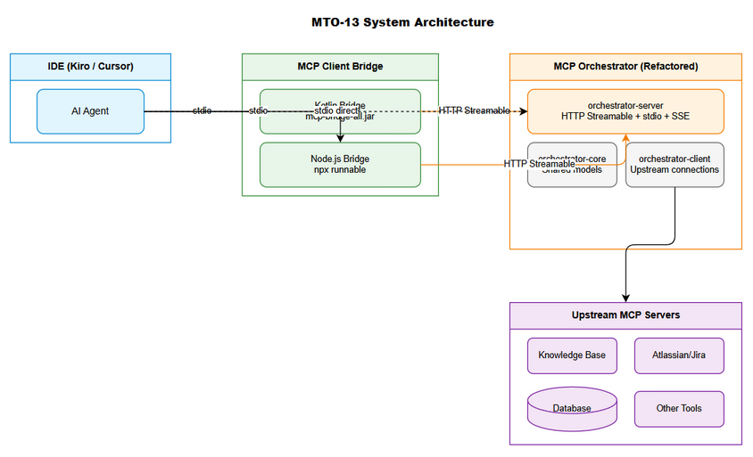
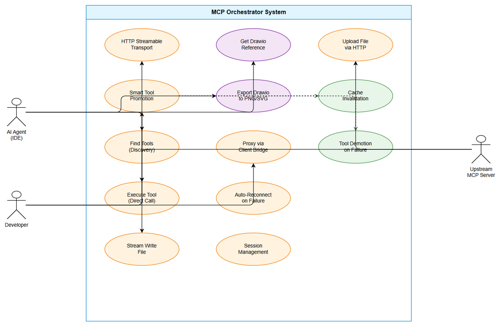
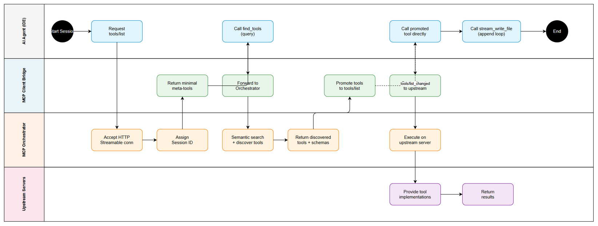
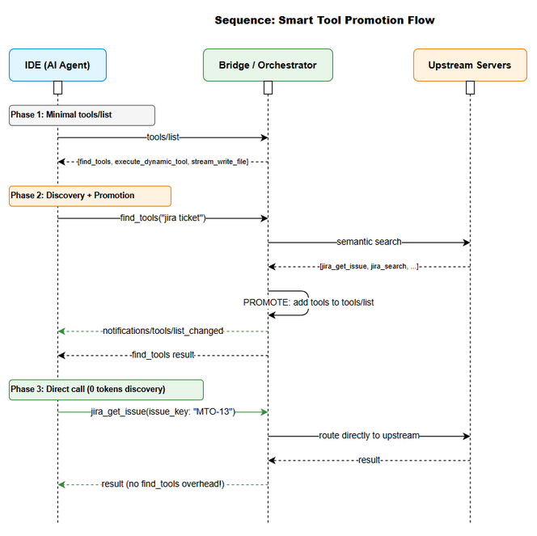
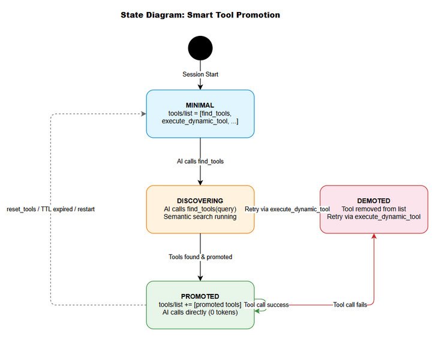

# Business Requirements Document (BRD)

## MCPOrchestration — MTO-13: Add HTTP Streamable Transport Mode Support

---

## Document Information

| Field | Value |
|-------|-------|
| Jira Ticket | MTO-13 |
| Title | Add HTTP Streamable Transport Mode Support |
| Author | BA Agent |
| Version | 1.0 |
| Date | 2026-05-06 |
| Status | Draft |

---

## Author Tracking

| Role | Name - Position | Responsibility |
|------|-----------------|----------------|
| Author | BA Agent – Business Analyst | Create document |
| Peer Reviewer | Duc Nguyen – Project Lead | Review document |

---

## Revision History

| Version | Date | Author | Changes |
|---------|------|--------|---------|
| 1.0 | 2026-05-06 | BA Agent | Initiate document — auto-generated from Jira ticket MTO-13 and linked tickets |

---

## Sign-Off

| Name | Signature and date |
|------|--------------------|
| | ☐ I agree and confirm all criteria on this BRD as expected requirements |
| | ☐ I agree and confirm all criteria on this BRD as expected requirements |

---

## 1. Introduction

### 1.1 Scope

This change request covers a major enhancement to the MCP Orchestrator system, introducing HTTP Streamable transport mode support per MCP specification 2025-03-26, along with supporting infrastructure changes. The scope includes 7 parts:

1. **Part A — HTTP Streamable Transport** (AC #1-7): Add a new transport mode (`httpstreamable`) to the MCP Orchestrator server, implementing the MCP spec 2025-03-26 Streamable HTTP transport with session management and stream resumability.
2. **Part B — Hidden Utility Tools** (AC #8-9): Implement two hidden tools (`get_drawio_reference` and `export_drawio`) that are only discoverable via `find_tools` but not listed in `tools/list`.
3. **Part C — Gradle Multi-Module Refactor** (AC #10-14): Restructure the project from a single-module Gradle application into a multi-module architecture with `orchestrator-core`, `orchestrator-server`, `orchestrator-client`, and `orchestrator-bridge`.
4. **Part D — MCP Client Bridge (Kotlin)** (AC #15-22): Implement a Kotlin-based MCP Client Bridge that communicates with the Orchestrator via HTTP Streamable transport while exposing a stdio interface to IDEs.
5. **Part E — MCP Client Bridge (Node.js)** (AC #23-30): Implement a TypeScript/Node.js-based MCP Client Bridge with identical functionality to the Kotlin bridge.
6. **Part F — Smart Tool Promotion** (AC #31-41): Implement progressive tool exposure (Level 4 token optimization) that reduces token usage by 73-80% through dynamic tool promotion.
7. **Part G — Stream Write Tool** (AC #42-50): Implement a direct-to-disk file write tool (`stream_write_file`) that writes content without buffering in RAM.

### 1.2 Out of Scope

- Migration of existing upstream MCP server configurations
- Changes to the Qdrant vector database or embedding model
- UI/frontend changes to IDE plugins (Kiro, Cursor)
- Authentication/authorization for HTTP Streamable endpoints (future enhancement)
- Load balancing or horizontal scaling of the Orchestrator
- Changes to the MCP protocol specification itself

### 1.3 Preliminary Requirements

1. **MTO-10** (Base Orchestrator) must be deployed — provides the foundation for all enhancements
2. **MTO-12** (Auto File Proxy) should be in progress or completed — file handling dependency
3. **JDK 21** runtime environment for Kotlin components
4. **Node.js 20+** runtime for the Node.js bridge implementation
5. **draw.io desktop app** installed for the `export_drawio` hidden tool
6. **Ktor 3.4.0** framework already in use — HTTP Streamable builds on existing Ktor/Netty server

---

## 2. Business Requirements

### 2.1 High Level Process Map

The system architecture introduces a new communication layer between IDEs and the MCP Orchestrator:

```
IDE (Kiro/Cursor) ←stdio→ MCP Client Bridge ←HTTP Streamable→ MCP Orchestrator (Kotlin)
                           (Kotlin OR Node.js)              (refactored to Gradle modules)

OR (without Bridge):

IDE (Kiro/Cursor) ←stdio→ MCP Orchestrator (Kotlin, stdio mode + Smart Tool Promotion)
```

**Key architectural decisions:**
- HTTP Streamable transport enables network-based communication (vs stdio's process-local limitation)
- Client Bridges act as protocol translators: stdio ↔ HTTP Streamable
- Smart Tool Promotion reduces token overhead by dynamically exposing tools only when needed
- Stream Write Tool enables efficient large file generation without memory pressure


*[Edit in draw.io](diagrams/architecture-overview.drawio)*


*[Edit in draw.io](diagrams/use-case.drawio)*


*[Edit in draw.io](diagrams/business-flow.drawio)*

### 2.2 List of User Stories / Use Cases

| # | Story / Use Case | Priority | Source Ticket |
|---|------------------|----------|---------------|
| 1 | As a developer, I want the MCP Orchestrator to support HTTP Streamable transport so that I can connect to it over the network instead of only via stdio | MUST HAVE | MTO-13 (Part A) |
| 2 | As a developer, I want hidden utility tools (get_drawio_reference, export_drawio) so that AI agents can generate and export diagrams without cluttering the tool list | SHOULD HAVE | MTO-13 (Part B) |
| 3 | As a developer, I want the project refactored into Gradle multi-module so that code is better organized and modules can be independently built/tested | MUST HAVE | MTO-13 (Part C) |
| 4 | As a developer, I want a Kotlin MCP Client Bridge so that IDEs can connect to the Orchestrator via HTTP Streamable through a stdio proxy | MUST HAVE | MTO-13 (Part D) |
| 5 | As a developer, I want a Node.js MCP Client Bridge so that I have a lightweight alternative to the Kotlin bridge without JVM dependency | SHOULD HAVE | MTO-13 (Part E) |
| 6 | As a developer, I want Smart Tool Promotion so that token usage is reduced by 73-80% through progressive tool exposure | MUST HAVE | MTO-13 (Part F) |
| 7 | As a developer, I want a stream_write_file tool so that AI agents can write large files incrementally without buffering entire content in RAM | MUST HAVE | MTO-13 (Part G) |

---

### 2.3 Details of User Stories

---

#### Business Flow


*[Edit in draw.io](diagrams/sequence-smart-promotion.drawio)*

**Step 1:** IDE starts the MCP Client Bridge process via stdio (or connects directly to Orchestrator in stdio mode)

**Step 2:** Bridge establishes HTTP Streamable connection to Orchestrator at configured URL (default: `http://localhost:8080/mcp`)

**Step 3:** IDE requests `tools/list` — receives only meta-tools (find_tools, execute_dynamic_tool) initially

**Step 4:** AI agent calls `find_tools` with a query — Orchestrator discovers relevant tools from upstream servers

**Step 5:** Bridge/Orchestrator promotes discovered tools into `tools/list` and sends `notifications/tools/list_changed`

**Step 6:** AI agent calls promoted tools directly — zero discovery overhead from second call onwards

**Step 7:** For file operations, agent uses `stream_write_file` to write content directly to disk in append mode

> **Note:** The Smart Tool Promotion mechanism ensures that only relevant tools are exposed to the AI, dramatically reducing token consumption while maintaining full functionality.

---


#### STORY 1: HTTP Streamable Transport (Part A)

> As a developer, I want the MCP Orchestrator to support HTTP Streamable transport so that I can connect to it over the network instead of only via stdio.

**Requirement Details:**

1. The MCP Orchestrator server must support a new transport mode configured as `transport: httpstreamable` in the application YAML configuration.
2. A single POST endpoint `/mcp` must accept JSON-RPC requests from clients.
3. The server must respond with either `application/json` (for single responses) or `text/event-stream` (for streaming responses) based on the request type.
4. Session management via `Mcp-Session-Id` header must be implemented for stateful interactions.
5. Stream resumability via `Last-Event-ID` header must be supported so clients can resume interrupted streams.
6. The implementation must be backward compatible — existing `stdio` and `sse` transport modes must continue to function without changes.
7. The existing `upload_file` tool must work correctly over HTTP Streamable transport.

**Data Fields:**

| Field | Type | Required | Description | Example |
|-------|------|----------|-------------|---------|
| transport | String (enum) | Yes | Transport mode configuration | `httpstreamable`, `stdio`, `sse` |
| Mcp-Session-Id | HTTP Header | Yes (after init) | Session identifier for stateful communication | `uuid-v4-string` |
| Last-Event-ID | HTTP Header | No | Last received event ID for stream resumption | `evt-42` |
| Content-Type | HTTP Header | Yes | Response content type | `application/json` or `text/event-stream` |

**Acceptance Criteria:**

1. Server supports `transport: httpstreamable` config option
2. Single POST endpoint `/mcp` receives JSON-RPC requests
3. Server responds with `application/json` (single) or `text/event-stream` (streaming)
4. Support `Mcp-Session-Id` header for session management
5. Support `Last-Event-ID` for stream resumability
6. Backward compatible — existing `stdio` and `sse` modes still work
7. `upload_file` tool works over HTTP Streamable

**Validation Rules:**

- `Mcp-Session-Id` must be a valid UUID v4 format
- `Last-Event-ID` must reference a previously sent event ID within the current session
- JSON-RPC requests must conform to JSON-RPC 2.0 specification
- Content-Type negotiation: if client sends `Accept: text/event-stream`, server MAY respond with SSE; otherwise responds with JSON

**Error Handling:**

- Invalid session ID → HTTP 404 with JSON-RPC error `SESSION_NOT_FOUND`
- Malformed JSON-RPC → HTTP 400 with JSON-RPC parse error
- Server overloaded → HTTP 503 with retry-after header
- Stream interrupted → Client reconnects with `Last-Event-ID`, server resumes from that point

---

#### STORY 2: Hidden Utility Tools (Part B)

> As a developer, I want hidden utility tools (get_drawio_reference, export_drawio) so that AI agents can generate and export diagrams without cluttering the default tool list.

**Requirement Details:**

1. **`get_drawio_reference`** — A hidden tool that returns the draw.io XML reference documentation (loaded from `.antigravity/steering/drawio.md`). This tool is only discoverable via `find_tools` and is NOT listed in the default `tools/list` response.
2. **`export_drawio`** — A hidden tool that accepts a `file_path` and `format` parameter, invokes the draw.io CLI to export the diagram, and returns `{output_path, bytes_written}`.

**Data Fields:**

| Field | Type | Required | Description | Example |
|-------|------|----------|-------------|---------|
| file_path | String | Yes | Path to the .drawio file to export | `documents/MTO-13/diagrams/use-case.drawio` |
| format | String (enum) | Yes | Export format | `png`, `svg`, `pdf` |
| output_path | String | No (response) | Path where exported file was saved | `documents/MTO-13/diagrams/use-case.png` |
| bytes_written | Integer | No (response) | Size of exported file in bytes | `45230` |

**Acceptance Criteria:**

8. `get_drawio_reference` — Hidden tool returns drawio XML reference. Only discoverable via `find_tools`.
9. `export_drawio` — Hidden tool accepts `file_path` and `format`, calls draw.io CLI, returns `{output_path, bytes_written}`.

**Validation Rules:**

- `file_path` must point to an existing `.drawio` file
- `format` must be one of: `png`, `svg`, `pdf`
- draw.io CLI must be discoverable on the system (search standard paths)

**Error Handling:**

- File not found → Error response with `FILE_NOT_FOUND` code
- draw.io CLI not installed → Error response with `CLI_NOT_FOUND` code and installation instructions
- Export failed → Error response with `EXPORT_FAILED` code and stderr output

---

#### STORY 3: Gradle Multi-Module Refactor (Part C)

> As a developer, I want the project refactored into Gradle multi-module so that code is better organized and modules can be independently built and tested.

**Requirement Details:**

1. The existing single-module project must be refactored into four Gradle modules:
   - `orchestrator-core` — Shared models, interfaces, and utility classes
   - `orchestrator-server` — MCP server logic (stdio + HTTP Streamable + SSE transports)
   - `orchestrator-client` — Upstream MCP client logic (connecting to upstream servers)
   - `orchestrator-bridge` — MCP Client Bridge (Kotlin implementation)
2. Shared models and interfaces must reside in `orchestrator-core` and be depended upon by other modules.
3. Server-specific logic (transport handling, protocol routing) must be in `orchestrator-server`.
4. Client/upstream connection logic must be in `orchestrator-client`.
5. All existing tests must pass after the refactor without modification.

**Project Structure:**

```
MCPOrchestration/
├── orchestrator-core/       ← shared models, interfaces
│   └── src/main/kotlin/com/orchestrator/mcp/core/
├── orchestrator-server/     ← MCP server (stdio + httpstreamable + sse)
│   └── src/main/kotlin/com/orchestrator/mcp/server/
├── orchestrator-client/     ← MCP client library (connect to upstream servers)
│   └── src/main/kotlin/com/orchestrator/mcp/client/
├── orchestrator-bridge/     ← MCP Client Bridge (Kotlin)
│   └── src/main/kotlin/com/orchestrator/mcp/bridge/
├── build.gradle.kts         ← root build file
└── settings.gradle.kts      ← module declarations
```

**Acceptance Criteria:**

10. Refactor into multi-module: `orchestrator-core`, `orchestrator-server`, `orchestrator-client`, `orchestrator-bridge`
11. Shared models/interfaces in `orchestrator-core`
12. Server logic in `orchestrator-server`
13. Upstream client logic in `orchestrator-client`
14. Existing tests still pass after refactor

**Validation Rules:**

- No circular dependencies between modules
- `orchestrator-core` must not depend on any other project module
- Fat JAR outputs: `orchestrator-server` → `mcp-orchestrator-all.jar`, `orchestrator-bridge` → `mcp-bridge-all.jar`

---

#### STORY 4: MCP Client Bridge — Kotlin Implementation (Part D)

> As a developer, I want a Kotlin MCP Client Bridge so that IDEs can connect to the Orchestrator via HTTP Streamable through a stdio proxy.

**Requirement Details:**

1. A Kotlin-based MCP server that exposes a stdio interface to IDEs while connecting to the Orchestrator via HTTP Streamable.
2. File content must be transmitted via HTTP binary (not base64 over stdio) for efficiency.
3. The bridge must proxy `find_tools` and `execute_dynamic_tool` calls to the Orchestrator over HTTP Streamable.
4. Token optimization via Smart Tool Promotion (see Part F) must be integrated.
5. The Orchestrator URL must be configurable (default: `http://localhost:8080/mcp`).
6. Auto-reconnect when the Orchestrator restarts.
7. Packaged as a fat JAR: `mcp-bridge-all.jar`.

**Data Fields:**

| Field | Type | Required | Description | Example |
|-------|------|----------|-------------|---------|
| orchestrator_url | String (URL) | Yes | URL of the MCP Orchestrator HTTP Streamable endpoint | `http://localhost:8080/mcp` |
| auto_reconnect | Boolean | No | Enable auto-reconnect on connection loss | `true` |
| max_reconnect_attempts | Integer | No | Maximum reconnection attempts | `5` |
| reconnect_interval_ms | Integer | No | Delay between reconnection attempts | `3000` |

**Acceptance Criteria:**

15. Kotlin MCP server runs stdio (module `orchestrator-bridge`)
16. Connects to Orchestrator via HTTP Streamable client
17. File content transmitted via HTTP binary (not base64 over stdio)
18. Proxy `find_tools` and `execute_dynamic_tool` via HTTP Streamable
19. Token optimization (see Part F)
20. Configurable Orchestrator URL: `http://localhost:8080/mcp`
21. Auto-reconnect when Orchestrator restarts
22. Fat JAR: `mcp-bridge-all.jar`

**Error Handling:**

- Orchestrator unreachable → Retry with exponential backoff, return error to IDE after max attempts
- Session expired → Re-initialize session transparently
- HTTP timeout → Return timeout error to IDE with suggestion to retry

---

#### STORY 5: MCP Client Bridge — Node.js Implementation (Part E)

> As a developer, I want a Node.js MCP Client Bridge so that I have a lightweight alternative to the Kotlin bridge without JVM dependency.

**Requirement Details:**

1. A TypeScript/Node.js MCP server that exposes a stdio interface to IDEs.
2. Connects to the Orchestrator via HTTP Streamable transport.
3. File content transmitted via HTTP binary for efficiency.
4. Proxies `find_tools` and `execute_dynamic_tool` calls.
5. Token optimization via Smart Tool Promotion integrated.
6. Orchestrator URL configurable via environment variable `ORCHESTRATOR_URL`.
7. Auto-reconnect capability.
8. Packaged as an `npx`-runnable package.

**Project Structure:**

```
mcp-client-bridge/
├── src/
│   ├── index.ts           ← Entry point
│   ├── bridge.ts          ← Core bridge logic
│   ├── file-handler.ts    ← HTTP binary file transfer
│   ├── token-optimizer.ts ← Token optimization logic
│   ├── tool-promoter.ts   ← Smart Tool Promotion
│   └── stream-write.ts    ← Direct-to-disk write
├── package.json
└── tsconfig.json
```

**Data Fields:**

| Field | Type | Required | Description | Example |
|-------|------|----------|-------------|---------|
| ORCHESTRATOR_URL | Env Variable | Yes | URL of the MCP Orchestrator | `http://localhost:8080/mcp` |
| RECONNECT_ENABLED | Env Variable | No | Enable auto-reconnect | `true` |
| MAX_RECONNECT | Env Variable | No | Max reconnection attempts | `5` |

**Acceptance Criteria:**

23. Node.js MCP server runs stdio
24. Connects to Orchestrator via HTTP Streamable
25. File content transmitted via HTTP binary
26. Proxy `find_tools` and `execute_dynamic_tool`
27. Token optimization (see Part F)
28. Configurable URL via env var `ORCHESTRATOR_URL`
29. Auto-reconnect
30. Packaging: `npx` runnable

**Error Handling:**

- Same error handling patterns as Kotlin bridge (Story 4)
- Additional: Node.js process crash recovery via uncaughtException handler

---


#### STORY 6: Smart Tool Promotion (Part F)

> As a developer, I want Smart Tool Promotion so that token usage is reduced by 73-80% through progressive tool exposure.

**Requirement Details:**

1. **Orchestrator stdio mode**: Starts with 6-7 meta-tools in `tools/list`. When AI calls `find_tools`, discovered tools are promoted into `tools/list` so AI can call them directly.
2. **Bridge mode**: Starts with 2 meta-tools (`find_tools`, `execute_dynamic_tool`). After first `find_tools` call, promotes discovered tools.
3. First `find_tools` call caches results and promotes tools into `tools/list`.
4. Sends `notifications/tools/list_changed` to IDE after promotion.
5. From second call onwards: AI calls tools directly → 0 tokens for discovery overhead.
6. Tool list grows incrementally based on actual usage needs.
7. Promoted tools use compact schema (minimal description, essential parameters only).
8. Cache invalidation triggers: restart, `reset_tools` call, TTL expiry (5 minutes).
9. Fallback: if a promoted tool fails → auto-demote and retry via `execute_dynamic_tool`.
10. Promoted tool succeeds → route directly to upstream server (bypass discovery).
11. Configuration: `smart-promotion.enabled: true` (default enabled).

**Smart Tool Promotion Flow:**


*[Edit in draw.io](diagrams/state-tool-promotion.drawio)*

**Data Fields:**

| Field | Type | Required | Description | Example |
|-------|------|----------|-------------|---------|
| smart-promotion.enabled | Boolean | No | Enable/disable smart promotion | `true` |
| smart-promotion.ttl_seconds | Integer | No | Cache TTL before invalidation | `300` (5 min) |
| smart-promotion.max_promoted | Integer | No | Maximum promoted tools at once | `50` |
| promoted_tool.name | String | Yes | Tool name as promoted | `jira_get_issue` |
| promoted_tool.schema | JSON | Yes | Compact input schema | `{...}` |
| promoted_tool.upstream_server | String | Yes | Source upstream server name | `atlassian` |

**Acceptance Criteria:**

31. Orchestrator stdio mode: Start with 6 meta-tools. After `find_tools` → promote tools into `tools/list` → AI calls directly.
32. Bridge: Start with 2 meta-tools, promote after `find_tools`.
33. First `find_tools` call → cache and promote tools into `tools/list`
34. Send `notifications/tools/list_changed` to IDE
35. From second call: AI calls tool directly → 0 tokens for discovery
36. Tool list grows incrementally based on need
37. Promoted tools have compact schema
38. Cache invalidation: restart, `reset_tools`, TTL 5 minutes
39. Fallback: promoted tool fails → auto demote and retry
40. Promoted tool succeeds → route directly to upstream
41. Config: `smart-promotion.enabled: true` (default)

**Validation Rules:**

- Promoted tool names must be unique within the session
- Compact schema must include at minimum: tool name, description (≤100 chars), required parameters
- TTL countdown resets on each successful tool call
- Maximum promoted tools limit prevents unbounded growth

**Error Handling:**

- Promoted tool execution fails → Auto-demote, retry via `execute_dynamic_tool`, log warning
- Cache corruption → Full cache reset, re-promote on next `find_tools`
- Upstream server disconnected → Demote all tools from that server, notify IDE

---

#### STORY 7: Stream Write Tool (Part G)

> As a developer, I want a stream_write_file tool so that AI agents can write large files incrementally without buffering entire content in RAM.

**Requirement Details:**

1. Tool name: `stream_write_file` — writes content directly to disk without buffering in RAM.
2. Available on BOTH the Orchestrator (as a built-in tool) AND the Bridge (as a local tool).
3. Input parameters: `file_path` (absolute), `content` (text), `mode` ("write" | "append"), `encoding` (utf-8 default).
4. Writes each chunk immediately upon receipt — does not accumulate content in memory.
5. Supports append mode — agent calls multiple times in a loop, each call appends to the file.
6. Response: `{file_path, bytes_written, total_size, mode}`.
7. Path validation: absolute path required, no directory traversal (`..`), parent directory must exist.
8. Comprehensive error handling with specific error codes.
9. Primary use case: Agent generates large files (BRD, TDD, code) in a loop — each iteration appends one section → RAM does not increase.

**Data Fields:**

| Field | Type | Required | Description | Example |
|-------|------|----------|-------------|---------|
| file_path | String | Yes | Absolute path to target file | `C:/projects/docs/BRD.md` |
| content | String | Yes | Text content to write | `## Section 1\n...` |
| mode | String (enum) | No | Write mode | `write` (default) or `append` |
| encoding | String | No | Character encoding | `utf-8` (default) |
| bytes_written | Integer | Response | Bytes written in this operation | `4096` |
| total_size | Integer | Response | Total file size after write | `32768` |

**Comparison with fsWrite:**

| Aspect | fsWrite (IDE tool) | stream_write_file (MCP tool) |
|--------|-------------------|------------------------------|
| Buffer | Entire content in RAM | Write immediately, flush immediately |
| Append | Not supported (overwrite only) | Supports append mode |
| Use case | Small files, single write | Large files, loop write |
| RAM impact | O(file_size) | O(chunk_size) |

**Acceptance Criteria:**

42. Tool name: `stream_write_file` — writes content directly to disk, NO RAM buffer
43. Available on BOTH Orchestrator (built-in tool) AND Bridge (local tool)
44. Input: `file_path` (absolute), `content` (text), `mode` ("write" | "append"), `encoding` (utf-8 default)
45. Writes each chunk immediately — does not accumulate content in memory
46. Supports append mode — agent calls multiple times in loop, each appends to file
47. Response: `{file_path, bytes_written, total_size, mode}`
48. Path validation: absolute path required, no traversal, parent dir must exist
49. Error handling: INVALID_PATH, OUTPUT_DIR_NOT_FOUND, OUTPUT_NOT_WRITABLE, WRITE_FAILED
50. Primary use case: Agent generates large file in loop — each iteration appends 1 section → RAM unchanged

**Implementation Reference (Kotlin):**

```kotlin
suspend fun streamWrite(filePath: String, content: String, mode: String) {
    val path = Path.of(filePath)
    FilePathValidator.validateOutputPath(filePath)
    val options = if (mode == "append") arrayOf(APPEND, CREATE) 
                  else arrayOf(CREATE, TRUNCATE_EXISTING)
    withContext(Dispatchers.IO) {
        Files.newBufferedWriter(path, Charsets.UTF_8, *options).use { writer ->
            writer.write(content)
            writer.flush()
        }
    }
}
```

**Implementation Reference (Node.js):**

```typescript
async function streamWrite(filePath: string, content: string, mode: string) {
    const flag = mode === 'append' ? 'a' : 'w';
    const fd = await fs.open(filePath, flag);
    await fd.write(content);
    await fd.close();
}
```

**Validation Rules:**

- `file_path` must be an absolute path (starts with `/` on Unix or drive letter on Windows)
- No path traversal sequences (`..`) allowed
- Parent directory must exist (tool does not create directories)
- `mode` must be either `write` or `append`
- `encoding` must be a valid charset name (default: `utf-8`)

**Error Handling:**

- `INVALID_PATH` — Path is not absolute, contains traversal, or is malformed
- `OUTPUT_DIR_NOT_FOUND` — Parent directory does not exist
- `OUTPUT_NOT_WRITABLE` — File or directory is read-only
- `WRITE_FAILED` — I/O error during write operation (disk full, permission denied, etc.)

---


## 3. Dependencies

| Dependency | Type | Related Ticket | Description |
|------------|------|----------------|-------------|
| MTO-10 Base Orchestrator | System | MTO-10 | Foundation MCP Orchestrator must be deployed — provides core tool discovery, execution, and upstream management |
| MTO-12 Auto File Proxy | System | MTO-12 | File proxy wrapper for upstream tools — in progress, needed for file content handling |
| Ktor 3.4.0 Framework | Infrastructure | N/A | HTTP server framework already in use — HTTP Streamable builds on existing Netty engine |
| MCP Kotlin SDK 0.12.0 | Infrastructure | N/A | MCP protocol implementation — provides server/client abstractions |
| JDK 21 | Infrastructure | N/A | Required runtime for Kotlin components (Orchestrator + Kotlin Bridge) |
| Node.js 20+ | Infrastructure | N/A | Required runtime for Node.js Bridge implementation |
| draw.io Desktop App | External | N/A | Required for `export_drawio` hidden tool — CLI used for diagram export |
| Qdrant Vector DB | Infrastructure | N/A | Vector database for tool embeddings — existing dependency from MTO-10 |
| OpenAI API | External | N/A | Text embedding generation for semantic tool discovery |

---

## 4. Stakeholders

| Role | Name / Team | Responsibility | Source |
|------|-------------|----------------|--------|
| Project Lead / Reporter | Duc Nguyen | Requirements definition, architecture decisions, review | MTO-13 Reporter |
| Development Team | Unassigned | Implementation of all 7 parts | MTO-13 Assignee |
| QA Team | TBD | Testing all acceptance criteria (50 ACs) | To be assigned |
| DevOps | TBD | CI/CD pipeline updates for multi-module build | To be assigned |

---

## 5. Risks and Assumptions

### 5.1 Risks

| Risk | Impact | Likelihood | Mitigation |
|------|--------|------------|------------|
| Gradle multi-module refactor breaks existing functionality | High | Medium | Comprehensive test suite must pass; incremental refactoring approach |
| HTTP Streamable transport introduces latency vs stdio | Medium | Low | Benchmark performance; HTTP is only for network scenarios, stdio remains for local |
| Smart Tool Promotion cache invalidation causes stale tools | Medium | Medium | TTL-based expiry (5 min); manual reset via `reset_tools`; auto-demote on failure |
| Node.js bridge diverges from Kotlin bridge behavior | Medium | Medium | Shared acceptance criteria; integration test suite covering both implementations |
| draw.io CLI not available on all developer machines | Low | Medium | Graceful degradation — `export_drawio` returns clear error with installation instructions |
| Stream write tool path traversal vulnerability | High | Low | Strict path validation — absolute paths only, no `..` sequences, parent dir must exist |
| Large number of promoted tools overwhelms IDE | Medium | Low | Max promoted tools limit; compact schemas; incremental promotion |

### 5.2 Assumptions

- The MCP specification 2025-03-26 for Streamable HTTP transport is stable and will not change significantly during implementation
- IDEs (Kiro, Cursor) support `notifications/tools/list_changed` for dynamic tool list updates
- The existing Ktor/Netty server can handle HTTP Streamable transport without significant architectural changes
- Developers have JDK 21 and/or Node.js 20+ available in their development environments
- The 73-80% token reduction estimate for Smart Tool Promotion is based on typical tool discovery patterns
- Qdrant vector database and OpenAI embedding service remain available and performant
- The `stream_write_file` tool will be used primarily by AI agents in automated workflows, not by human users directly

---

## 6. Non-Functional Requirements

| Category | Requirement | Details |
|----------|-------------|---------|
| Performance | HTTP Streamable latency | Response time for single JSON-RPC call via HTTP Streamable must be < 100ms (excluding upstream execution time) |
| Performance | Smart Tool Promotion | Token reduction of 73-80% compared to full tool list exposure |
| Performance | Stream Write | Write throughput must match native file I/O — no artificial buffering delays |
| Scalability | Concurrent sessions | HTTP Streamable must support multiple concurrent sessions (minimum 10 simultaneous clients) |
| Scalability | Tool promotion | System must handle up to 50 promoted tools per session without degradation |
| Reliability | Auto-reconnect | Bridge must auto-reconnect within 15 seconds of Orchestrator restart |
| Reliability | Stream resumability | Interrupted streams must be resumable via `Last-Event-ID` within session TTL |
| Compatibility | Backward compatibility | Existing stdio and SSE transport modes must continue to function unchanged |
| Compatibility | MCP Spec | Implementation must conform to MCP specification 2025-03-26 |
| Security | Path validation | `stream_write_file` must reject path traversal attempts and non-absolute paths |
| Security | Session isolation | HTTP Streamable sessions must be isolated — one client cannot access another's session |
| Maintainability | Module independence | Each Gradle module must be independently buildable and testable |
| Maintainability | Test coverage | All existing tests must pass after refactor; new features require corresponding tests |

---

## 7. Related Tickets

| Ticket Key | Summary | Status | Type | Relationship |
|------------|---------|--------|------|--------------|
| MTO-13 | Add HTTP Streamable transport mode support | Docs Review | Story | Main ticket |
| MTO-10 | Upgrade MCP Orchestrator: Local Embedding, pgvector, Tool Management & Auto-Approve | Ready for Product | Story | Dependency (must be deployed) |
| MTO-12 | Auto File Proxy - Wrapper tool for upstream MCP tools receiving file base64 content | Docs Review | Story | Dependency (in progress) |

---

## 8. Appendix

### Glossary

| Term | Definition |
|------|------------|
| MCP | Model Context Protocol — standard protocol for AI tool communication |
| HTTP Streamable | Transport mode per MCP spec 2025-03-26 using HTTP POST with optional SSE streaming |
| stdio | Standard input/output — process-local communication transport |
| SSE | Server-Sent Events — one-way server-to-client streaming over HTTP |
| Smart Tool Promotion | Progressive tool exposure mechanism that dynamically adds tools to `tools/list` based on usage |
| Bridge | Protocol translator between stdio (IDE-facing) and HTTP Streamable (Orchestrator-facing) |
| Fat JAR | Self-contained JAR file with all dependencies bundled |
| Token | Unit of text processed by AI models — fewer tokens = lower cost and faster responses |
| Upstream Server | External MCP server that provides actual tool implementations (Jira, KB, DB, etc.) |
| Tool Discovery | Process of finding relevant tools via semantic search (`find_tools`) |
| Tool Promotion | Moving a discovered tool from dynamic discovery to static `tools/list` for direct invocation |

### Reference Documents

| Document | Link / Location |
|----------|-----------------|
| MCP Specification 2025-03-26 (Transports) | https://modelcontextprotocol.io/specification/2025-03-26/basic/transports#streamable-http |
| MTO-10 BRD | `documents/MTO-10/BRD.md` |
| Project Structure (Code Intelligence) | `.analysis/code-intelligence/project-structure.md` |
| draw.io Steering File | `.antigravity/steering/drawio.md` |

### Technical Architecture Reference

**Current Project Structure (pre-refactor):**
- Single-module Gradle application
- Language: Kotlin 2.3.20, JVM 21
- Framework: Ktor 3.4.0 (Netty)
- DI: Koin 4.1.1
- MCP SDK: io.modelcontextprotocol:kotlin-sdk-server 0.12.0
- Transport: stdio (default), HTTP (Ktor/Netty)
- 44 main source files, 30 test files, 12 packages

**Target Project Structure (post-refactor):**
```
MCPOrchestration/
├── orchestrator-core/       ← shared models, interfaces
├── orchestrator-server/     ← MCP server (stdio + httpstreamable + sse)
├── orchestrator-client/     ← MCP client library (upstream connections)
├── orchestrator-bridge/     ← MCP Client Bridge (Kotlin)
└── build.gradle.kts         ← root build with version catalog
```

