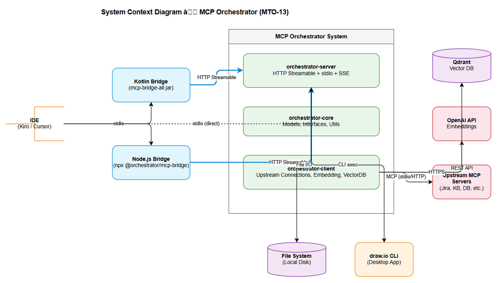
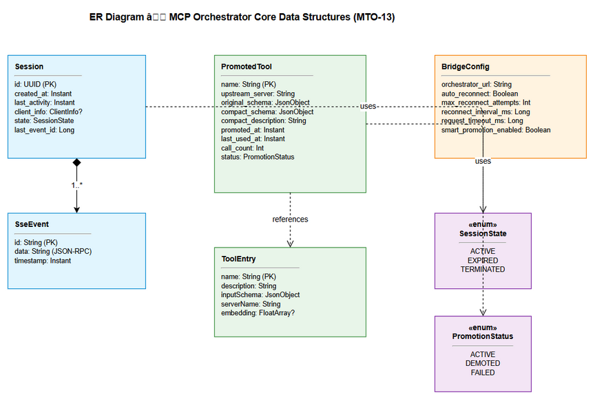
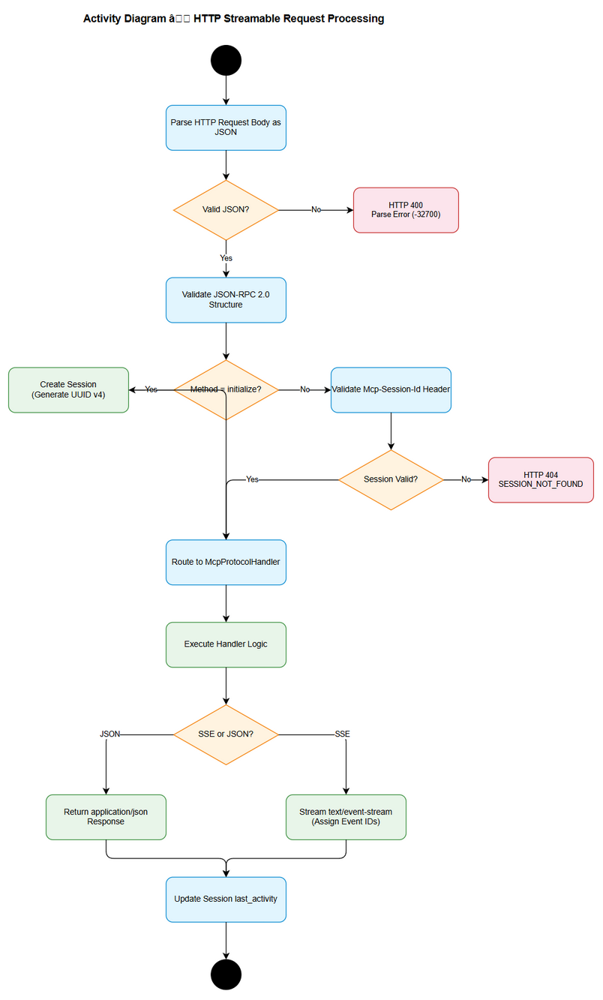

# Functional Specification Document (FSD)

## MCPOrchestration — MTO-13: Add HTTP Streamable Transport Mode Support

---

## Document Information

| Field | Value |
|-------|-------|
| Jira Ticket | MTO-13 |
| Title | Add HTTP Streamable Transport Mode Support |
| Author | BA Agent |
| Version | 1.0 |
| Date | 2026-05-06 |
| Status | Draft |
| Related BRD | documents/MTO-13/BRD.md |

---

## Revision History

| Version | Date | Author | Changes |
|---------|------|--------|---------|
| 1.0 | 2026-05-06 | BA Agent | Initiate document — auto-generated from BRD and Jira ticket MTO-13 |

---

## 1. Introduction

### 1.1 Purpose

This Functional Specification Document (FSD) defines the detailed functional design for the HTTP Streamable Transport Mode Support enhancement to the MCP Orchestrator system. It specifies HOW each business requirement from the BRD will be implemented, including use cases, data models, integration specifications, processing logic, security requirements, and error handling.

This document covers 7 major features (Parts A–G) that together transform the MCP Orchestrator from a single-module stdio-only application into a multi-module, network-capable system with intelligent tool promotion and efficient file I/O.

### 1.2 Scope

This FSD covers the functional specifications for:

1. **Part A** — HTTP Streamable Transport endpoint implementation (MCP spec 2025-03-26)
2. **Part B** — Hidden Utility Tools (`get_drawio_reference`, `export_drawio`)
3. **Part C** — Gradle Multi-Module project restructuring
4. **Part D** — MCP Client Bridge (Kotlin implementation)
5. **Part E** — MCP Client Bridge (Node.js implementation)
6. **Part F** — Smart Tool Promotion (progressive tool exposure)
7. **Part G** — Stream Write Tool (`stream_write_file`)

**Out of Scope:** Authentication/authorization for HTTP endpoints, load balancing, UI/frontend IDE plugin changes, MCP protocol specification changes.

### 1.3 Definitions & Acronyms

| Term | Definition |
|------|------------|
| MCP | Model Context Protocol — standard protocol for AI tool communication |
| HTTP Streamable | Transport mode per MCP spec 2025-03-26 using HTTP POST with optional SSE streaming |
| SSE | Server-Sent Events — one-way server-to-client streaming over HTTP |
| stdio | Standard input/output — process-local communication transport |
| JSON-RPC | JSON Remote Procedure Call — protocol for structured request/response communication |
| Bridge | Protocol translator between stdio (IDE-facing) and HTTP Streamable (Orchestrator-facing) |
| Smart Tool Promotion | Progressive tool exposure mechanism that dynamically adds tools to `tools/list` |
| Fat JAR | Self-contained JAR file with all dependencies bundled |
| Token | Unit of text processed by AI models — fewer tokens = lower cost and faster responses |
| Upstream Server | External MCP server that provides actual tool implementations |
| Tool Discovery | Process of finding relevant tools via semantic search (`find_tools`) |
| Tool Promotion | Moving a discovered tool from dynamic discovery to static `tools/list` for direct invocation |
| TTL | Time To Live — duration before cache entry expires |
| ELK | Edge Layout Kernel — draw.io's automatic edge routing algorithm |

### 1.4 References

| Document | Location |
|----------|----------|
| BRD | documents/MTO-13/BRD.md |
| MCP Specification 2025-03-26 (Transports) | https://modelcontextprotocol.io/specification/2025-03-26/basic/transports#streamable-http |
| MTO-10 BRD | documents/MTO-10/BRD.md |
| Project Structure (Code Intelligence) | .analysis/code-intelligence/project-structure.md |
| draw.io Steering File | .antigravity/steering/drawio.md |

---

## 2. System Overview

### 2.1 System Context Diagram


*[Edit in draw.io](diagrams/system-context.drawio)*

The MCP Orchestrator system operates as a middleware layer between AI-powered IDEs and upstream MCP tool servers. With the HTTP Streamable transport enhancement, the system introduces a network communication layer that enables remote connections alongside the existing stdio transport.

**External Actors:**
- **IDE (Kiro/Cursor)** — AI development environment that consumes MCP tools via stdio
- **MCP Client Bridge** — Protocol translator (Kotlin or Node.js) that converts stdio ↔ HTTP Streamable
- **Upstream MCP Servers** — External tool providers (Jira, KB, DB, etc.)
- **Qdrant Vector DB** — Vector database for tool embedding storage and semantic search
- **OpenAI API** — Text embedding generation service
- **draw.io CLI** — Desktop application for diagram export (used by hidden tools)
- **File System** — Local disk for stream_write_file operations

### 2.2 System Architecture

The system follows a multi-module Gradle architecture (post-refactor):

| Module | Responsibility | Key Components |
|--------|---------------|----------------|
| `orchestrator-core` | Shared models, interfaces, utilities | ToolDefinition, McpOrchestratorException, ErrorCodes, RetryUtils |
| `orchestrator-server` | MCP server (all transports) | HttpStreamableTransport, StdioTransport, SseTransport, McpProtocolHandler, SmartToolPromoter, StreamWriteTool |
| `orchestrator-client` | Upstream MCP client connections | UpstreamServerManager, McpConnection, HealthMonitor, ToolIndexer |
| `orchestrator-bridge` | MCP Client Bridge (Kotlin) | BridgeServer, HttpStreamableClient, FileHandler, TokenOptimizer |

**Technology Stack:**
- Language: Kotlin 2.3.20 / TypeScript (Node.js bridge)
- Platform: JVM 21 / Node.js 20+
- Framework: Ktor 3.4.0 (Netty engine)
- DI: Koin 4.1.1
- Serialization: kotlinx.serialization 1.8.1
- MCP SDK: io.modelcontextprotocol:kotlin-sdk-server 0.12.0
- Build: Gradle (Kotlin DSL) with version catalog

---

## 3. Functional Requirements


### 3.1 Feature: HTTP Streamable Transport (Part A)

**Source:** BRD Story 1 — MTO-13 (Part A), AC #1-7

#### 3.1.1 Description

The MCP Orchestrator server must support HTTP Streamable transport as defined in MCP specification 2025-03-26. This transport mode enables network-based communication between clients and the Orchestrator via a single HTTP POST endpoint, supporting both synchronous JSON responses and asynchronous Server-Sent Events (SSE) streaming. Session management and stream resumability are core requirements.

#### 3.1.2 Use Cases

**Use Case ID:** UC-A1 — Initialize HTTP Streamable Session
**Actor:** MCP Client (Bridge or direct)
**Preconditions:** Orchestrator is running with `transport: httpstreamable` configuration
**Postconditions:** Session is established, client receives `Mcp-Session-Id` header

**Main Flow:**

| Step | Actor | System | Description |
|------|-------|--------|-------------|
| 1 | Client sends POST `/mcp` with `initialize` JSON-RPC request | | Client initiates MCP handshake |
| 2 | | Validates JSON-RPC 2.0 format | Server parses and validates request structure |
| 3 | | Generates UUID v4 session ID | Server creates new session state |
| 4 | | Returns `InitializeResult` with `Mcp-Session-Id` header | Response includes server capabilities and session ID |
| 5 | Client stores `Mcp-Session-Id` for subsequent requests | | Client must include this header in all future requests |

**Alternative Flows:**

| ID | Condition | Steps |
|----|-----------|-------|
| AF-A1.1 | Client sends `Accept: text/event-stream` header | Server responds with SSE stream instead of single JSON response; sends `initialized` event followed by stream close |
| AF-A1.2 | Client reconnects with existing valid session ID | Server resumes existing session state; no re-initialization needed |

**Exception Flows:**

| ID | Condition | Steps |
|----|-----------|-------|
| EF-A1.1 | Malformed JSON-RPC request | Return HTTP 400 with JSON-RPC parse error (-32700) |
| EF-A1.2 | Server at capacity (max sessions reached) | Return HTTP 503 with `Retry-After` header |
| EF-A1.3 | Invalid MCP protocol version | Return JSON-RPC error with `UNSUPPORTED_PROTOCOL_VERSION` |

---

**Use Case ID:** UC-A2 — Execute Tool Call via HTTP Streamable
**Actor:** MCP Client
**Preconditions:** Valid session established (has `Mcp-Session-Id`)
**Postconditions:** Tool execution result returned to client

**Main Flow:**

| Step | Actor | System | Description |
|------|-------|--------|-------------|
| 1 | Client sends POST `/mcp` with `tools/call` JSON-RPC + `Mcp-Session-Id` header | | Client requests tool execution |
| 2 | | Validates session ID (UUID v4 format, exists in session store) | Server authenticates session |
| 3 | | Routes request to McpProtocolHandler | Server dispatches to appropriate handler |
| 4 | | Executes tool via ToolExecutionDispatcher | Server routes to upstream or built-in tool |
| 5 | | Returns result as `application/json` | Single response for non-streaming results |

**Alternative Flows:**

| ID | Condition | Steps |
|----|-----------|-------|
| AF-A2.1 | Tool execution produces streaming output | Server responds with `text/event-stream`; sends multiple SSE events with incremental results; final event signals completion |
| AF-A2.2 | Client includes `Last-Event-ID` header | Server resumes stream from the specified event ID within the session |

**Exception Flows:**

| ID | Condition | Steps |
|----|-----------|-------|
| EF-A2.1 | Invalid/expired session ID | Return HTTP 404 with `SESSION_NOT_FOUND` error |
| EF-A2.2 | Tool not found | Return JSON-RPC error with code -32601 (method not found) |
| EF-A2.3 | Upstream server unavailable | Return JSON-RPC error with `SERVER_UNAVAILABLE` and server name |
| EF-A2.4 | Execution timeout | Return JSON-RPC error with `EXECUTION_TIMEOUT` after configured timeout |

---

**Use Case ID:** UC-A3 — Stream Resumability
**Actor:** MCP Client
**Preconditions:** Active SSE stream was interrupted; client has `Last-Event-ID`
**Postconditions:** Stream resumes from the last received event

**Main Flow:**

| Step | Actor | System | Description |
|------|-------|--------|-------------|
| 1 | Client reconnects with POST `/mcp` including `Last-Event-ID` header | | Client attempts stream resumption |
| 2 | | Validates session ID and event ID | Server checks both are valid and within session |
| 3 | | Retrieves buffered events after the specified ID | Server looks up event buffer |
| 4 | | Sends missed events as SSE stream | Server replays events client missed |
| 5 | | Continues with live events | Server transitions to real-time streaming |

**Exception Flows:**

| ID | Condition | Steps |
|----|-----------|-------|
| EF-A3.1 | `Last-Event-ID` not found in buffer (expired) | Return HTTP 404; client must re-issue the original request |
| EF-A3.2 | Session expired during disconnection | Return HTTP 404 with `SESSION_NOT_FOUND`; client must re-initialize |

#### 3.1.3 Business Rules

| Rule ID | Rule | Source |
|---------|------|--------|
| BR-A1 | Server MUST respond with `application/json` for single-response requests unless client explicitly requests SSE via `Accept: text/event-stream` | MCP Spec 2025-03-26 |
| BR-A2 | `Mcp-Session-Id` MUST be a valid UUID v4 generated by the server | BRD Story 1, AC #4 |
| BR-A3 | Session state MUST be maintained in-memory with configurable TTL (default: 30 minutes) | BRD Story 1 |
| BR-A4 | SSE events MUST include monotonically increasing `id` field for resumability | MCP Spec 2025-03-26 |
| BR-A5 | Existing `stdio` and `sse` transport modes MUST continue to function without changes | BRD Story 1, AC #6 |
| BR-A6 | The `upload_file` tool MUST work correctly over HTTP Streamable transport | BRD Story 1, AC #7 |
| BR-A7 | Server MUST support concurrent sessions (minimum 10 simultaneous clients) | BRD NFR |

#### 3.1.4 Data Specifications

**Input Data — HTTP Request:**

| Field | Type | Required | Validation | Description |
|-------|------|----------|------------|-------------|
| POST body | JSON | Yes | Valid JSON-RPC 2.0 structure | JSON-RPC request payload |
| Mcp-Session-Id | HTTP Header (UUID v4) | Yes (after init) | UUID v4 format regex: `^[0-9a-f]{8}-[0-9a-f]{4}-4[0-9a-f]{3}-[89ab][0-9a-f]{3}-[0-9a-f]{12}$` | Session identifier |
| Last-Event-ID | HTTP Header (String) | No | Must reference a previously sent event ID within current session | Stream resumption point |
| Accept | HTTP Header | No | `application/json` or `text/event-stream` | Content negotiation |
| Content-Type | HTTP Header | Yes | Must be `application/json` | Request content type |

**Output Data — HTTP Response (JSON mode):**

| Field | Type | Description |
|-------|------|-------------|
| HTTP Status | Integer | 200 (success), 400 (bad request), 404 (not found), 503 (overloaded) |
| Content-Type | Header | `application/json` |
| Mcp-Session-Id | Header | Session ID (on initialize response) |
| Body | JSON-RPC Response | `{jsonrpc: "2.0", id: <id>, result: <result>}` or `{jsonrpc: "2.0", id: <id>, error: {code, message, data}}` |

**Output Data — HTTP Response (SSE mode):**

| Field | Type | Description |
|-------|------|-------------|
| HTTP Status | Integer | 200 |
| Content-Type | Header | `text/event-stream` |
| Mcp-Session-Id | Header | Session ID |
| SSE Event | `id: <event-id>\ndata: <json-rpc-response>\n\n` | Each event contains a JSON-RPC response fragment |

#### 3.1.5 API Specifications

**Endpoint:** `POST /mcp`

**Request Headers:**

| Header | Type | Required | Description |
|--------|------|----------|-------------|
| Content-Type | String | Yes | Must be `application/json` |
| Accept | String | No | `application/json` (default) or `text/event-stream` |
| Mcp-Session-Id | UUID v4 | Conditional | Required for all requests after `initialize` |
| Last-Event-ID | String | No | For stream resumption |

**Request Body (JSON-RPC 2.0):**

| Field | Type | Required | Description |
|-------|------|----------|-------------|
| jsonrpc | String | Yes | Must be `"2.0"` |
| id | String/Integer | Yes | Request identifier |
| method | String | Yes | MCP method name (e.g., `initialize`, `tools/list`, `tools/call`) |
| params | Object | No | Method-specific parameters |

**Response — Success (JSON):**

```json
{
  "jsonrpc": "2.0",
  "id": 1,
  "result": { /* method-specific result */ }
}
```

**Response — Success (SSE):**

```
id: evt-1
data: {"jsonrpc":"2.0","id":1,"result":{"partial":"chunk1"}}

id: evt-2
data: {"jsonrpc":"2.0","id":1,"result":{"partial":"chunk2"}}

id: evt-3
data: {"jsonrpc":"2.0","id":1,"result":{"complete":true}}

```

**Error Codes:**

| HTTP Status | JSON-RPC Code | Message | Description |
|-------------|---------------|---------|-------------|
| 400 | -32700 | Parse error | Malformed JSON |
| 400 | -32600 | Invalid Request | Invalid JSON-RPC structure |
| 404 | -32001 | Session not found | Invalid or expired Mcp-Session-Id |
| 404 | -32002 | Event not found | Last-Event-ID not in buffer |
| 500 | -32603 | Internal error | Unexpected server error |
| 503 | -32003 | Server overloaded | Max sessions reached; includes Retry-After header |

---


### 3.2 Feature: Hidden Utility Tools (Part B)

**Source:** BRD Story 2 — MTO-13 (Part B), AC #8-9

#### 3.2.1 Description

Two hidden utility tools are implemented as built-in tools within the Orchestrator. These tools are NOT listed in the default `tools/list` response but ARE discoverable via the `find_tools` semantic search mechanism. This design keeps the default tool list clean while making specialized diagram tools available to AI agents that need them.

#### 3.2.2 Use Cases

**Use Case ID:** UC-B1 — Discover and Use `get_drawio_reference`
**Actor:** AI Agent (via IDE)
**Preconditions:** Orchestrator is running; `.antigravity/steering/drawio.md` file exists
**Postconditions:** Agent receives draw.io XML reference documentation

**Main Flow:**

| Step | Actor | System | Description |
|------|-------|--------|-------------|
| 1 | Agent calls `find_tools` with query "draw.io diagram reference" | | Agent searches for diagram tools |
| 2 | | Returns `get_drawio_reference` in search results | Tool is discoverable via semantic search |
| 3 | Agent calls `get_drawio_reference` (no parameters) | | Agent invokes the hidden tool |
| 4 | | Reads `.antigravity/steering/drawio.md` from disk | Server loads reference file |
| 5 | | Returns file content as tool result | Agent receives full draw.io XML reference |

**Alternative Flows:**

| ID | Condition | Steps |
|----|-----------|-------|
| AF-B1.1 | Agent calls `tools/list` | `get_drawio_reference` is NOT included in the response — it remains hidden |
| AF-B1.2 | Smart Tool Promotion is active | After first `find_tools` discovery, tool MAY be promoted to `tools/list` for direct access |

**Exception Flows:**

| ID | Condition | Steps |
|----|-----------|-------|
| EF-B1.1 | Reference file not found on disk | Return error with `FILE_NOT_FOUND` code and message indicating expected path |

---

**Use Case ID:** UC-B2 — Export Diagram with `export_drawio`
**Actor:** AI Agent (via IDE)
**Preconditions:** A `.drawio` file exists at the specified path; draw.io CLI is installed
**Postconditions:** Diagram exported to specified format; output path and size returned

**Main Flow:**

| Step | Actor | System | Description |
|------|-------|--------|-------------|
| 1 | Agent calls `export_drawio` with `file_path` and `format` | | Agent requests diagram export |
| 2 | | Validates `file_path` exists and has `.drawio` extension | Input validation |
| 3 | | Validates `format` is one of: png, svg, pdf | Format validation |
| 4 | | Locates draw.io CLI executable (search standard paths) | CLI discovery |
| 5 | | Executes: `drawio -x -f <format> -e -b 10 -o <output> <input>` | CLI invocation |
| 6 | | Returns `{output_path, bytes_written}` | Success response |

**Exception Flows:**

| ID | Condition | Steps |
|----|-----------|-------|
| EF-B2.1 | File not found at `file_path` | Return error: `{code: "FILE_NOT_FOUND", message: "File not found: <path>"}` |
| EF-B2.2 | draw.io CLI not installed | Return error: `{code: "CLI_NOT_FOUND", message: "draw.io desktop app not found. Install from https://www.drawio.com/"}` |
| EF-B2.3 | Export process fails (non-zero exit) | Return error: `{code: "EXPORT_FAILED", message: "<stderr output>"}` |
| EF-B2.4 | Invalid format parameter | Return error: `{code: "INVALID_PARAMS", message: "Format must be one of: png, svg, pdf"}` |

#### 3.2.3 Business Rules

| Rule ID | Rule | Source |
|---------|------|--------|
| BR-B1 | Hidden tools MUST NOT appear in `tools/list` response | BRD Story 2, AC #8 |
| BR-B2 | Hidden tools MUST be discoverable via `find_tools` semantic search | BRD Story 2, AC #8 |
| BR-B3 | `export_drawio` MUST use `--embed-diagram` flag to preserve editability in exported files | draw.io steering |
| BR-B4 | draw.io CLI discovery MUST search standard installation paths dynamically | draw.io steering |
| BR-B5 | Hidden tools MAY be promoted via Smart Tool Promotion after discovery | BRD Story 6 |

#### 3.2.4 Data Specifications

**Input Data — `get_drawio_reference`:**

| Field | Type | Required | Validation | Description |
|-------|------|----------|------------|-------------|
| (none) | — | — | — | No input parameters required |

**Output Data — `get_drawio_reference`:**

| Field | Type | Description |
|-------|------|-------------|
| content | String | Full content of `.antigravity/steering/drawio.md` |

**Input Data — `export_drawio`:**

| Field | Type | Required | Validation | Description |
|-------|------|----------|------------|-------------|
| file_path | String | Yes | Must exist, must end with `.drawio` | Path to source diagram file |
| format | String (enum) | Yes | One of: `png`, `svg`, `pdf` | Export format |

**Output Data — `export_drawio`:**

| Field | Type | Description |
|-------|------|-------------|
| output_path | String | Absolute path where exported file was saved |
| bytes_written | Integer | Size of exported file in bytes |

#### 3.2.5 API Specifications

**Tool: `get_drawio_reference`**

```json
{
  "name": "get_drawio_reference",
  "description": "Returns draw.io XML reference documentation for generating diagrams",
  "inputSchema": {
    "type": "object",
    "properties": {},
    "required": []
  }
}
```

**Tool: `export_drawio`**

```json
{
  "name": "export_drawio",
  "description": "Export a .drawio diagram file to PNG, SVG, or PDF format",
  "inputSchema": {
    "type": "object",
    "properties": {
      "file_path": {
        "type": "string",
        "description": "Path to the .drawio file to export"
      },
      "format": {
        "type": "string",
        "enum": ["png", "svg", "pdf"],
        "description": "Export format"
      }
    },
    "required": ["file_path", "format"]
  }
}
```

---

### 3.3 Feature: Gradle Multi-Module Refactor (Part C)

**Source:** BRD Story 3 — MTO-13 (Part C), AC #10-14

#### 3.3.1 Description

The existing single-module Gradle project (44 main source files, 12 packages) is refactored into four independent Gradle modules. This improves code organization, enables independent building/testing of modules, and supports the new Bridge module as a separate deployable artifact.

#### 3.3.2 Use Cases

**Use Case ID:** UC-C1 — Build Individual Module
**Actor:** Developer
**Preconditions:** Project is refactored into multi-module structure
**Postconditions:** Individual module builds successfully with its dependencies

**Main Flow:**

| Step | Actor | System | Description |
|------|-------|--------|-------------|
| 1 | Developer runs `./gradlew :orchestrator-server:build` | | Build specific module |
| 2 | | Resolves dependencies (orchestrator-core) | Gradle resolves inter-module deps |
| 3 | | Compiles Kotlin sources | Kotlin compiler runs |
| 4 | | Runs module-specific tests | Test suite executes |
| 5 | | Produces build artifacts | JAR files generated |

**Alternative Flows:**

| ID | Condition | Steps |
|----|-----------|-------|
| AF-C1.1 | Developer runs `./gradlew build` (root) | All modules build in dependency order: core → client → server → bridge |
| AF-C1.2 | Developer runs `./gradlew :orchestrator-server:buildFatJar` | Produces `mcp-orchestrator-all.jar` with all dependencies |
| AF-C1.3 | Developer runs `./gradlew :orchestrator-bridge:buildFatJar` | Produces `mcp-bridge-all.jar` with all dependencies |

**Exception Flows:**

| ID | Condition | Steps |
|----|-----------|-------|
| EF-C1.1 | Circular dependency detected | Gradle fails with clear error message indicating the cycle |
| EF-C1.2 | Missing dependency in core module | Compilation error in dependent module with clear import path |

#### 3.3.3 Business Rules

| Rule ID | Rule | Source |
|---------|------|--------|
| BR-C1 | `orchestrator-core` MUST NOT depend on any other project module | BRD Story 3 |
| BR-C2 | No circular dependencies between modules | BRD Story 3 |
| BR-C3 | All existing tests MUST pass after refactor without modification | BRD Story 3, AC #14 |
| BR-C4 | Fat JAR outputs: `orchestrator-server` → `mcp-orchestrator-all.jar` | BRD Story 3 |
| BR-C5 | Fat JAR outputs: `orchestrator-bridge` → `mcp-bridge-all.jar` | BRD Story 3 |

#### 3.3.4 Data Specifications — Module Dependency Graph

| Module | Depends On | Produces |
|--------|-----------|----------|
| `orchestrator-core` | (none — external deps only) | `orchestrator-core.jar` |
| `orchestrator-client` | `orchestrator-core` | `orchestrator-client.jar` |
| `orchestrator-server` | `orchestrator-core`, `orchestrator-client` | `mcp-orchestrator-all.jar` (fat) |
| `orchestrator-bridge` | `orchestrator-core` | `mcp-bridge-all.jar` (fat) |

**Package Migration Map:**

| Current Package | Target Module | Target Package |
|----------------|---------------|----------------|
| `com.orchestrator.mcp.model` | orchestrator-core | `com.orchestrator.mcp.core.model` |
| `com.orchestrator.mcp.config` | orchestrator-core | `com.orchestrator.mcp.core.config` |
| `com.orchestrator.mcp.util` | orchestrator-core | `com.orchestrator.mcp.core.util` |
| `com.orchestrator.mcp.protocol` | orchestrator-server | `com.orchestrator.mcp.server.protocol` |
| `com.orchestrator.mcp.transport` | orchestrator-server | `com.orchestrator.mcp.server.transport` |
| `com.orchestrator.mcp.discovery` | orchestrator-server | `com.orchestrator.mcp.server.discovery` |
| `com.orchestrator.mcp.execution` | orchestrator-server | `com.orchestrator.mcp.server.execution` |
| `com.orchestrator.mcp.registry` | orchestrator-server | `com.orchestrator.mcp.server.registry` |
| `com.orchestrator.mcp.upstream` | orchestrator-client | `com.orchestrator.mcp.client.upstream` |
| `com.orchestrator.mcp.embedding` | orchestrator-client | `com.orchestrator.mcp.client.embedding` |
| `com.orchestrator.mcp.vectordb` | orchestrator-client | `com.orchestrator.mcp.client.vectordb` |
| (new) | orchestrator-bridge | `com.orchestrator.mcp.bridge` |

---


### 3.4 Feature: MCP Client Bridge — Kotlin Implementation (Part D)

**Source:** BRD Story 4 — MTO-13 (Part D), AC #15-22

#### 3.4.1 Description

A Kotlin-based MCP Client Bridge that acts as a protocol translator between IDEs (which communicate via stdio) and the MCP Orchestrator (which exposes HTTP Streamable transport). The Bridge runs as a local process started by the IDE, accepting stdio input and forwarding requests over HTTP to the Orchestrator.

#### 3.4.2 Use Cases

**Use Case ID:** UC-D1 — IDE Connects via Kotlin Bridge
**Actor:** IDE (Kiro/Cursor)
**Preconditions:** Bridge JAR is available; Orchestrator is running with HTTP Streamable
**Postconditions:** IDE has active MCP connection through the Bridge

**Main Flow:**

| Step | Actor | System (Bridge) | Description |
|------|-------|-----------------|-------------|
| 1 | IDE starts Bridge process: `java -jar mcp-bridge-all.jar` | | IDE launches Bridge via stdio |
| 2 | | Bridge reads config (Orchestrator URL from args or env) | Configuration loading |
| 3 | | Bridge establishes HTTP Streamable connection to Orchestrator | HTTP POST `/mcp` with `initialize` |
| 4 | | Bridge receives `Mcp-Session-Id` from Orchestrator | Session established |
| 5 | IDE sends `initialize` via stdio | | MCP handshake from IDE side |
| 6 | | Bridge responds with server capabilities via stdio | Bridge acts as MCP server to IDE |
| 7 | IDE sends `tools/list` via stdio | | IDE requests available tools |
| 8 | | Bridge returns meta-tools (find_tools, execute_dynamic_tool) | Initial minimal tool list |

**Alternative Flows:**

| ID | Condition | Steps |
|----|-----------|-------|
| AF-D1.1 | Orchestrator not reachable at startup | Bridge starts in degraded mode; returns error for tool calls; retries connection in background |
| AF-D1.2 | Custom Orchestrator URL provided via `--url` flag | Bridge uses provided URL instead of default `http://localhost:8080/mcp` |

**Exception Flows:**

| ID | Condition | Steps |
|----|-----------|-------|
| EF-D1.1 | Orchestrator connection fails after max retries | Bridge logs error; returns `SERVER_UNAVAILABLE` to IDE for all tool calls |
| EF-D1.2 | Invalid configuration | Bridge exits with error code 1 and descriptive message to stderr |

---

**Use Case ID:** UC-D2 — Proxy Tool Execution via Bridge
**Actor:** AI Agent (via IDE)
**Preconditions:** Bridge is connected to Orchestrator; session is active
**Postconditions:** Tool execution result returned to agent via stdio

**Main Flow:**

| Step | Actor | System (Bridge) | Description |
|------|-------|-----------------|-------------|
| 1 | Agent calls `find_tools` with query via stdio | | Agent discovers tools |
| 2 | | Bridge forwards `find_tools` to Orchestrator via HTTP POST | HTTP Streamable proxy |
| 3 | | Orchestrator returns matching tools | Semantic search results |
| 4 | | Bridge promotes discovered tools into local `tools/list` | Smart Tool Promotion |
| 5 | | Bridge sends `notifications/tools/list_changed` to IDE | IDE updates tool list |
| 6 | Agent calls promoted tool directly via stdio | | Direct tool invocation |
| 7 | | Bridge routes call to Orchestrator via HTTP POST | Proxied execution |
| 8 | | Bridge returns result to agent via stdio | Result delivery |

**Alternative Flows:**

| ID | Condition | Steps |
|----|-----------|-------|
| AF-D2.1 | File content in tool arguments | Bridge transmits file via HTTP binary (not base64 over stdio) for efficiency |
| AF-D2.2 | Streaming response from Orchestrator | Bridge receives SSE stream; buffers and returns complete result via stdio |

**Exception Flows:**

| ID | Condition | Steps |
|----|-----------|-------|
| EF-D2.1 | Orchestrator session expired | Bridge re-initializes session transparently; retries the request |
| EF-D2.2 | HTTP timeout (30s default) | Bridge returns timeout error to IDE with suggestion to retry |
| EF-D2.3 | Promoted tool execution fails | Bridge auto-demotes tool; retries via `execute_dynamic_tool`; returns result or error |

---

**Use Case ID:** UC-D3 — Auto-Reconnect on Orchestrator Restart
**Actor:** System (Bridge)
**Preconditions:** Bridge was connected; Orchestrator restarted
**Postconditions:** Bridge re-establishes connection within 15 seconds

**Main Flow:**

| Step | Actor | System (Bridge) | Description |
|------|-------|-----------------|-------------|
| 1 | | Bridge detects connection loss (HTTP error or timeout) | Health check or failed request |
| 2 | | Bridge enters reconnection mode | State: RECONNECTING |
| 3 | | Bridge retries connection with exponential backoff (1s, 2s, 4s, 8s...) | Up to max_reconnect_attempts (default: 5) |
| 4 | | Connection succeeds; Bridge re-initializes session | New Mcp-Session-Id obtained |
| 5 | | Bridge re-promotes previously promoted tools | Restore tool state |
| 6 | | Bridge resumes normal operation | State: CONNECTED |

**Exception Flows:**

| ID | Condition | Steps |
|----|-----------|-------|
| EF-D3.1 | Max reconnect attempts exceeded | Bridge enters ERROR state; returns `SERVER_UNAVAILABLE` for all requests; continues retry in background at 30s intervals |

#### 3.4.3 Business Rules

| Rule ID | Rule | Source |
|---------|------|--------|
| BR-D1 | Bridge MUST expose stdio interface to IDE (MCP server role) | BRD Story 4, AC #15 |
| BR-D2 | Bridge MUST connect to Orchestrator via HTTP Streamable (MCP client role) | BRD Story 4, AC #16 |
| BR-D3 | File content MUST be transmitted via HTTP binary, NOT base64 over stdio | BRD Story 4, AC #17 |
| BR-D4 | Bridge MUST proxy `find_tools` and `execute_dynamic_tool` to Orchestrator | BRD Story 4, AC #18 |
| BR-D5 | Default Orchestrator URL: `http://localhost:8080/mcp` | BRD Story 4, AC #20 |
| BR-D6 | Auto-reconnect MUST complete within 15 seconds of Orchestrator restart | BRD NFR |
| BR-D7 | Bridge MUST be packaged as fat JAR: `mcp-bridge-all.jar` | BRD Story 4, AC #22 |

#### 3.4.4 Data Specifications

**Configuration (Bridge):**

| Field | Type | Required | Default | Description |
|-------|------|----------|---------|-------------|
| orchestrator_url | String (URL) | Yes | `http://localhost:8080/mcp` | Orchestrator HTTP Streamable endpoint |
| auto_reconnect | Boolean | No | `true` | Enable auto-reconnect on connection loss |
| max_reconnect_attempts | Integer | No | `5` | Maximum reconnection attempts before ERROR state |
| reconnect_interval_ms | Integer | No | `3000` | Base delay between reconnection attempts (exponential backoff) |
| request_timeout_ms | Integer | No | `30000` | HTTP request timeout |

---

### 3.5 Feature: MCP Client Bridge — Node.js Implementation (Part E)

**Source:** BRD Story 5 — MTO-13 (Part E), AC #23-30

#### 3.5.1 Description

A TypeScript/Node.js implementation of the MCP Client Bridge with identical functionality to the Kotlin bridge. Provides a lightweight alternative without JVM dependency, suitable for environments where Node.js is preferred.

#### 3.5.2 Use Cases

**Use Case ID:** UC-E1 — IDE Connects via Node.js Bridge
**Actor:** IDE (Kiro/Cursor)
**Preconditions:** Node.js 20+ installed; `npx` available; Orchestrator running
**Postconditions:** IDE has active MCP connection through the Node.js Bridge

**Main Flow:**

| Step | Actor | System (Bridge) | Description |
|------|-------|-----------------|-------------|
| 1 | IDE starts Bridge: `npx @orchestrator/mcp-bridge` | | IDE launches via npx |
| 2 | | Bridge reads `ORCHESTRATOR_URL` from environment | Configuration from env vars |
| 3 | | Bridge establishes HTTP Streamable connection | HTTP POST `/mcp` with `initialize` |
| 4 | | Bridge receives `Mcp-Session-Id` | Session established |
| 5 | IDE sends `initialize` via stdio | | MCP handshake |
| 6 | | Bridge responds with capabilities | Bridge acts as MCP server |

**Alternative Flows:**

| ID | Condition | Steps |
|----|-----------|-------|
| AF-E1.1 | `ORCHESTRATOR_URL` not set | Bridge uses default `http://localhost:8080/mcp` |
| AF-E1.2 | `RECONNECT_ENABLED=false` | Bridge disables auto-reconnect; fails permanently on disconnect |

**Exception Flows:**

| ID | Condition | Steps |
|----|-----------|-------|
| EF-E1.1 | Node.js version < 20 | Bridge exits with error: "Node.js 20+ required" |
| EF-E1.2 | Uncaught exception | Process crash recovery via `uncaughtException` handler; logs error; attempts graceful restart |

#### 3.5.3 Business Rules

| Rule ID | Rule | Source |
|---------|------|--------|
| BR-E1 | Node.js Bridge MUST have identical functional behavior to Kotlin Bridge | BRD Story 5 |
| BR-E2 | Configuration via environment variables: `ORCHESTRATOR_URL`, `RECONNECT_ENABLED`, `MAX_RECONNECT` | BRD Story 5, AC #28 |
| BR-E3 | MUST be packaged as `npx`-runnable package | BRD Story 5, AC #30 |
| BR-E4 | File content MUST be transmitted via HTTP binary | BRD Story 5, AC #25 |
| BR-E5 | MUST include `uncaughtException` handler for crash recovery | BRD Story 5 |

#### 3.5.4 Data Specifications

**Configuration (Environment Variables):**

| Variable | Type | Required | Default | Description |
|----------|------|----------|---------|-------------|
| ORCHESTRATOR_URL | String (URL) | No | `http://localhost:8080/mcp` | Orchestrator endpoint |
| RECONNECT_ENABLED | Boolean string | No | `true` | Enable auto-reconnect |
| MAX_RECONNECT | Integer string | No | `5` | Max reconnection attempts |
| REQUEST_TIMEOUT_MS | Integer string | No | `30000` | HTTP request timeout |

**Project Structure:**

```
mcp-client-bridge/
├── src/
│   ├── index.ts           — Entry point, stdio server setup
│   ├── bridge.ts          — Core bridge logic (stdio ↔ HTTP proxy)
│   ├── file-handler.ts    — HTTP binary file transfer
│   ├── token-optimizer.ts — Token optimization logic
│   ├── tool-promoter.ts   — Smart Tool Promotion implementation
│   └── stream-write.ts    — Direct-to-disk write (local tool)
├── package.json
├── tsconfig.json
└── README.md
```

---

### 3.6 Feature: Smart Tool Promotion (Part F)

**Source:** BRD Story 6 — MTO-13 (Part F), AC #31-41

#### 3.6.1 Description

Smart Tool Promotion implements progressive tool exposure (Level 4 token optimization) that reduces token usage by 73-80%. Instead of exposing all available tools in `tools/list` (which consumes tokens for tool descriptions), the system starts with minimal meta-tools and dynamically promotes discovered tools into the tool list based on actual usage.

#### 3.6.2 Use Cases

**Use Case ID:** UC-F1 — First Tool Discovery and Promotion
**Actor:** AI Agent (via IDE)
**Preconditions:** Session active; Smart Tool Promotion enabled (default)
**Postconditions:** Discovered tools promoted to `tools/list`; IDE notified

**Main Flow:**

| Step | Actor | System | Description |
|------|-------|--------|-------------|
| 1 | Agent calls `find_tools` with query (e.g., "get jira issue") | | First discovery call |
| 2 | | Orchestrator performs semantic search against tool embeddings | Vector similarity search |
| 3 | | Returns matching tools with schemas | Discovery results |
| 4 | | SmartToolPromoter caches discovered tools | In-memory promotion cache |
| 5 | | SmartToolPromoter generates compact schemas for each tool | Minimal description ≤100 chars, required params only |
| 6 | | Promoted tools added to `tools/list` | Dynamic tool list expansion |
| 7 | | Sends `notifications/tools/list_changed` to client | IDE refreshes tool list |
| 8 | Agent sees promoted tools in next `tools/list` response | | Tools available for direct call |

**Alternative Flows:**

| ID | Condition | Steps |
|----|-----------|-------|
| AF-F1.1 | Orchestrator stdio mode (no Bridge) | Starts with 6 meta-tools; promotes after `find_tools` |
| AF-F1.2 | Bridge mode | Starts with 2 meta-tools (find_tools, execute_dynamic_tool); promotes after first discovery |
| AF-F1.3 | Tool already promoted | No duplicate promotion; existing entry refreshed (TTL reset) |

**Exception Flows:**

| ID | Condition | Steps |
|----|-----------|-------|
| EF-F1.1 | Max promoted tools limit reached (50) | Evict least-recently-used promoted tool; promote new one |
| EF-F1.2 | Upstream server disconnected during promotion | Skip tools from that server; log warning |

---

**Use Case ID:** UC-F2 — Direct Promoted Tool Execution
**Actor:** AI Agent (via IDE)
**Preconditions:** Tool has been promoted to `tools/list`
**Postconditions:** Tool executed directly; 0 tokens for discovery overhead

**Main Flow:**

| Step | Actor | System | Description |
|------|-------|--------|-------------|
| 1 | Agent calls promoted tool directly (e.g., `jira_get_issue`) | | Direct invocation — no find_tools needed |
| 2 | | SmartToolPromoter intercepts call | Recognizes as promoted tool |
| 3 | | Routes directly to upstream server (bypasses discovery) | Direct routing |
| 4 | | Upstream server executes tool | Actual execution |
| 5 | | Returns result to agent | Zero discovery overhead |
| 6 | | Resets TTL countdown for this tool | Keep-alive on usage |

**Alternative Flows:**

| ID | Condition | Steps |
|----|-----------|-------|
| AF-F2.1 | Tool TTL expired between calls | Tool auto-demoted; agent must re-discover via `find_tools` |

**Exception Flows:**

| ID | Condition | Steps |
|----|-----------|-------|
| EF-F2.1 | Promoted tool execution fails | Auto-demote tool; retry via `execute_dynamic_tool` (fallback path); return result or error to agent |
| EF-F2.2 | Upstream server no longer has the tool | Demote tool; return `TOOL_NOT_FOUND` error; agent must re-discover |

---

**Use Case ID:** UC-F3 — Cache Invalidation
**Actor:** System (automatic)
**Preconditions:** Promoted tools exist in cache
**Postconditions:** Cache cleared; tools demoted; IDE notified

**Main Flow:**

| Step | Actor | System | Description |
|------|-------|--------|-------------|
| 1 | | Invalidation trigger fires (restart / reset_tools / TTL expiry) | Cache invalidation event |
| 2 | | All affected promoted tools removed from cache | Cache cleanup |
| 3 | | Tools removed from `tools/list` | Tool list shrinks |
| 4 | | Sends `notifications/tools/list_changed` to client | IDE refreshes |

**Triggers:**

| Trigger | Scope | Description |
|---------|-------|-------------|
| Server restart | All tools | Full cache reset on Orchestrator/Bridge restart |
| `reset_tools` call | All tools | Manual cache reset by agent |
| TTL expiry (5 min) | Per tool | Individual tool expires if not used within TTL |
| Upstream disconnect | Per server | All tools from disconnected server demoted |

#### 3.6.3 Business Rules

| Rule ID | Rule | Source |
|---------|------|--------|
| BR-F1 | Orchestrator stdio mode starts with 6 meta-tools in `tools/list` | BRD Story 6, AC #31 |
| BR-F2 | Bridge mode starts with 2 meta-tools (find_tools, execute_dynamic_tool) | BRD Story 6, AC #32 |
| BR-F3 | First `find_tools` call MUST cache and promote discovered tools | BRD Story 6, AC #33 |
| BR-F4 | MUST send `notifications/tools/list_changed` after promotion | BRD Story 6, AC #34 |
| BR-F5 | Promoted tools MUST use compact schema (description ≤100 chars, required params only) | BRD Story 6, AC #37 |
| BR-F6 | Cache TTL: 5 minutes per tool (resets on successful call) | BRD Story 6, AC #38 |
| BR-F7 | Maximum 50 promoted tools per session | BRD Story 6 |
| BR-F8 | Promoted tool names MUST be unique within session | BRD Story 6 |
| BR-F9 | Failed promoted tool → auto-demote → retry via execute_dynamic_tool | BRD Story 6, AC #39 |
| BR-F10 | Successful promoted tool → route directly to upstream (bypass discovery) | BRD Story 6, AC #40 |
| BR-F11 | Configuration: `smart-promotion.enabled: true` (default enabled) | BRD Story 6, AC #41 |

#### 3.6.4 Data Specifications

**Promotion Cache Entry:**

| Field | Type | Description |
|-------|------|-------------|
| tool_name | String | Unique tool name (e.g., `jira_get_issue`) |
| upstream_server | String | Source upstream server name |
| compact_schema | JSON | Minimal input schema (required params only) |
| compact_description | String (≤100 chars) | Short tool description |
| promoted_at | Instant | Timestamp when tool was promoted |
| last_used_at | Instant | Timestamp of last successful call (for TTL) |
| call_count | Integer | Number of successful direct calls |
| status | Enum | `ACTIVE`, `DEMOTED`, `FAILED` |

**Configuration:**

| Field | Type | Required | Default | Description |
|-------|------|----------|---------|-------------|
| smart-promotion.enabled | Boolean | No | `true` | Enable/disable Smart Tool Promotion |
| smart-promotion.ttl_seconds | Integer | No | `300` | Cache TTL before auto-demotion |
| smart-promotion.max_promoted | Integer | No | `50` | Maximum promoted tools per session |
| smart-promotion.compact_description_max_length | Integer | No | `100` | Max chars for compact description |

---


### 3.7 Feature: Stream Write Tool (Part G)

**Source:** BRD Story 7 — MTO-13 (Part G), AC #42-50

#### 3.7.1 Description

A direct-to-disk file write tool (`stream_write_file`) that writes content immediately without buffering in RAM. Available as both a built-in tool on the Orchestrator and a local tool on the Bridge. Designed for AI agents generating large files incrementally in a loop — each call appends one section, keeping RAM usage constant at O(chunk_size) instead of O(file_size).

#### 3.7.2 Use Cases

**Use Case ID:** UC-G1 — Write Large File Incrementally
**Actor:** AI Agent (via IDE)
**Preconditions:** Target directory exists; agent has absolute file path
**Postconditions:** File written/appended to disk; response confirms bytes written

**Main Flow:**

| Step | Actor | System | Description |
|------|-------|--------|-------------|
| 1 | Agent calls `stream_write_file` with `file_path`, `content`, `mode="write"` | | First write (creates/overwrites file) |
| 2 | | Validates file_path (absolute, no traversal, parent exists) | Path security validation |
| 3 | | Opens file with TRUNCATE_EXISTING + CREATE options | File handle acquired |
| 4 | | Writes content directly to disk via BufferedWriter | Immediate flush |
| 5 | | Returns `{file_path, bytes_written, total_size, mode}` | Success response |
| 6 | Agent calls `stream_write_file` with same path, new content, `mode="append"` | | Subsequent append |
| 7 | | Opens file with APPEND + CREATE options | Append mode |
| 8 | | Writes content, flushes immediately | No accumulation |
| 9 | | Returns updated `{file_path, bytes_written, total_size, mode}` | Cumulative size |
| 10 | Agent repeats steps 6-9 for each section | | Loop pattern |

**Alternative Flows:**

| ID | Condition | Steps |
|----|-----------|-------|
| AF-G1.1 | File does not exist + mode="append" | File is created (CREATE flag); content written as first chunk |
| AF-G1.2 | Custom encoding specified (e.g., `utf-16`) | Writer uses specified charset instead of default UTF-8 |
| AF-G1.3 | Tool called on Bridge (local tool) | Executes locally without HTTP round-trip to Orchestrator |

**Exception Flows:**

| ID | Condition | Steps |
|----|-----------|-------|
| EF-G1.1 | Path is not absolute | Return error: `{code: "INVALID_PATH", message: "Path must be absolute"}` |
| EF-G1.2 | Path contains `..` traversal | Return error: `{code: "INVALID_PATH", message: "Path traversal not allowed"}` |
| EF-G1.3 | Parent directory does not exist | Return error: `{code: "OUTPUT_DIR_NOT_FOUND", message: "Parent directory does not exist: <dir>"}` |
| EF-G1.4 | File/directory is read-only | Return error: `{code: "OUTPUT_NOT_WRITABLE", message: "Cannot write to: <path>"}` |
| EF-G1.5 | I/O error (disk full, etc.) | Return error: `{code: "WRITE_FAILED", message: "<IOException message>"}` |
| EF-G1.6 | Invalid encoding name | Return error: `{code: "INVALID_PARAMS", message: "Unsupported encoding: <name>"}` |

#### 3.7.3 Business Rules

| Rule ID | Rule | Source |
|---------|------|--------|
| BR-G1 | Tool MUST write content directly to disk without buffering entire file in RAM | BRD Story 7, AC #42 |
| BR-G2 | Tool MUST be available on BOTH Orchestrator (built-in) AND Bridge (local) | BRD Story 7, AC #43 |
| BR-G3 | `file_path` MUST be absolute (starts with `/` on Unix or drive letter on Windows) | BRD Story 7, AC #48 |
| BR-G4 | Path traversal sequences (`..`) MUST be rejected | BRD Story 7, AC #48 |
| BR-G5 | Parent directory MUST exist (tool does NOT create directories) | BRD Story 7, AC #48 |
| BR-G6 | Each write MUST flush immediately — no deferred writes | BRD Story 7, AC #45 |
| BR-G7 | RAM usage MUST remain O(chunk_size), NOT O(file_size) | BRD Story 7, AC #50 |
| BR-G8 | Default mode is `write` (overwrite); `append` adds to end | BRD Story 7, AC #44 |
| BR-G9 | Default encoding is `utf-8` | BRD Story 7, AC #44 |

#### 3.7.4 Data Specifications

**Input Data:**

| Field | Type | Required | Validation | Description |
|-------|------|----------|------------|-------------|
| file_path | String | Yes | Absolute path; no `..`; parent dir exists | Target file path |
| content | String | Yes | Non-null (empty string allowed) | Text content to write |
| mode | String (enum) | No | `write` or `append` | Write mode (default: `write`) |
| encoding | String | No | Valid charset name | Character encoding (default: `utf-8`) |

**Output Data:**

| Field | Type | Description |
|-------|------|-------------|
| file_path | String | Absolute path of written file |
| bytes_written | Integer | Number of bytes written in this operation |
| total_size | Integer | Total file size after this write |
| mode | String | Mode used (`write` or `append`) |

#### 3.7.5 API Specifications

**Tool Schema:**

```json
{
  "name": "stream_write_file",
  "description": "Write content directly to a file on disk without buffering. Supports 'write' (overwrite) and 'append' modes.",
  "inputSchema": {
    "type": "object",
    "properties": {
      "file_path": {
        "type": "string",
        "description": "Absolute path to the output file"
      },
      "content": {
        "type": "string",
        "description": "Text content to write to the file"
      },
      "mode": {
        "type": "string",
        "enum": ["write", "append"],
        "default": "write",
        "description": "Write mode: 'write' (overwrite/create) or 'append' (add to end)"
      },
      "encoding": {
        "type": "string",
        "default": "utf-8",
        "description": "Character encoding. Default: 'utf-8'"
      }
    },
    "required": ["file_path", "content"]
  }
}
```

**Error Response Format:**

```json
{
  "isError": true,
  "content": [
    {
      "type": "text",
      "text": "{\"code\": \"INVALID_PATH\", \"message\": \"Path must be absolute\"}"
    }
  ]
}
```

---

## 4. Data Model

### 4.1 Entity Relationship Diagram


*[Edit in draw.io](diagrams/er-diagram.drawio)*

The system is primarily in-memory with no persistent database. Data structures are modeled as Kotlin data classes and maintained in ConcurrentHashMap-based registries.

### 4.2 Core Data Structures

#### Structure: Session (HTTP Streamable)

| Field | Type | Nullable | Default | Description |
|-------|------|----------|---------|-------------|
| id | UUID | No | Generated | Session identifier (Mcp-Session-Id) |
| created_at | Instant | No | now() | Session creation timestamp |
| last_activity | Instant | No | now() | Last request timestamp (for TTL) |
| client_info | ClientInfo | Yes | null | Client identification from initialize |
| state | SessionState | No | ACTIVE | ACTIVE, EXPIRED, TERMINATED |
| event_buffer | List<SseEvent> | No | empty | Buffered events for resumability |
| last_event_id | Long | No | 0 | Monotonically increasing event counter |

#### Structure: SseEvent

| Field | Type | Nullable | Default | Description |
|-------|------|----------|---------|-------------|
| id | String | No | "evt-{counter}" | Event ID for Last-Event-ID resumption |
| data | String | No | — | JSON-RPC response payload |
| timestamp | Instant | No | now() | When event was created |

#### Structure: PromotedTool (Smart Tool Promotion)

| Field | Type | Nullable | Default | Description |
|-------|------|----------|---------|-------------|
| name | String | No | — | Unique tool name |
| upstream_server | String | No | — | Source server name |
| original_schema | JsonObject | No | — | Full tool input schema |
| compact_schema | JsonObject | No | — | Minimized schema (required params only) |
| compact_description | String | No | — | Short description (≤100 chars) |
| promoted_at | Instant | No | now() | Promotion timestamp |
| last_used_at | Instant | No | now() | Last successful call (TTL reference) |
| call_count | Int | No | 0 | Successful direct call count |
| status | PromotionStatus | No | ACTIVE | ACTIVE, DEMOTED, FAILED |

#### Structure: ToolEntry (existing — from orchestrator-core)

| Field | Type | Nullable | Default | Description |
|-------|------|----------|---------|-------------|
| name | String | No | — | Tool name |
| description | String | No | — | Tool description |
| inputSchema | JsonObject | No | — | JSON Schema for tool input |
| serverName | String | No | — | Upstream server that provides this tool |
| embedding | FloatArray | Yes | null | Vector embedding for semantic search |

#### Structure: BridgeConfig

| Field | Type | Nullable | Default | Description |
|-------|------|----------|---------|-------------|
| orchestrator_url | String | No | `http://localhost:8080/mcp` | Orchestrator endpoint URL |
| auto_reconnect | Boolean | No | true | Enable auto-reconnect |
| max_reconnect_attempts | Int | No | 5 | Max retry count |
| reconnect_interval_ms | Long | No | 3000 | Base retry interval |
| request_timeout_ms | Long | No | 30000 | HTTP request timeout |
| smart_promotion_enabled | Boolean | No | true | Enable Smart Tool Promotion |

### 4.3 Enumerations

#### SessionState

| Value | Description |
|-------|-------------|
| ACTIVE | Session is active and accepting requests |
| EXPIRED | Session TTL exceeded; will be cleaned up |
| TERMINATED | Session explicitly terminated by client |

#### PromotionStatus

| Value | Description |
|-------|-------------|
| ACTIVE | Tool is promoted and available for direct calls |
| DEMOTED | Tool was removed from promotion (TTL, failure, or manual reset) |
| FAILED | Tool execution failed; pending demotion |

#### TransportType (extended)

| Value | Description |
|-------|-------------|
| STDIO | Standard input/output (existing) |
| SSE | Server-Sent Events (existing) |
| HTTP_STREAMABLE | HTTP Streamable per MCP spec 2025-03-26 (new) |

---

## 5. Integration Specifications

### 5.1 External System: Upstream MCP Servers

| Attribute | Value |
|-----------|-------|
| Protocol | MCP over stdio or HTTP Streamable |
| Connection | Process spawn (stdio) or HTTP POST (HTTP Streamable) |
| Authentication | None (local process) or session-based (HTTP) |
| Data Format | JSON-RPC 2.0 |

**Data Mapping (Tool Discovery):**

| Source (Upstream) | Target (Orchestrator) | Transformation |
|-------------------|----------------------|----------------|
| `tools/list` response | ToolEntry | Extract name, description, inputSchema; add serverName |
| Tool embedding | VectorPoint | Generate embedding via OpenAI; store in Qdrant |

### 5.2 External System: Qdrant Vector DB

| Attribute | Value |
|-----------|-------|
| Protocol | REST API (HTTP) |
| Endpoint | `http://localhost:6333` (configurable) |
| Authentication | None (local) or API key (remote) |
| Data Format | JSON |
| Collection | `mcp_tools` |

**Operations:**

| Operation | Endpoint | Description |
|-----------|----------|-------------|
| Upsert points | `PUT /collections/mcp_tools/points` | Store tool embeddings |
| Search | `POST /collections/mcp_tools/points/search` | Semantic similarity search |
| Delete | `POST /collections/mcp_tools/points/delete` | Remove tool embeddings |

### 5.3 External System: OpenAI API

| Attribute | Value |
|-----------|-------|
| Protocol | REST API (HTTPS) |
| Endpoint | `https://api.openai.com/v1/embeddings` |
| Authentication | Bearer token (API key from config) |
| Data Format | JSON |
| Model | `text-embedding-3-small` |
| Dimensions | 768 |

### 5.4 External System: draw.io CLI

| Attribute | Value |
|-----------|-------|
| Protocol | Local process execution |
| Executable | Platform-dependent (see discovery procedure) |
| Data Format | CLI arguments + file I/O |
| Timeout | 30 seconds per export |

**CLI Command Template:**

```
<drawio_path> -x -f <format> -e -b 10 -o <output_path> <input_path>
```

### 5.5 External System: File System (stream_write_file)

| Attribute | Value |
|-----------|-------|
| Protocol | Direct file I/O (java.nio.file / Node.js fs) |
| Access | Read/Write to absolute paths |
| Constraints | No directory creation; no path traversal; parent must exist |

---

## 6. Processing Logic

### 6.1 HTTP Streamable Request Processing

**Trigger:** HTTP POST request received at `/mcp` endpoint
**Schedule:** On-demand (per request)
**Input:** JSON-RPC request + HTTP headers
**Output:** JSON-RPC response (JSON or SSE)

**Processing Steps:**

| Step | Description | Error Handling |
|------|-------------|----------------|
| 1 | Parse HTTP request body as JSON | Return HTTP 400 + JSON-RPC parse error (-32700) |
| 2 | Validate JSON-RPC 2.0 structure (jsonrpc, id, method) | Return HTTP 400 + invalid request error (-32600) |
| 3 | If method is `initialize`: create session, return capabilities | Return error if max sessions reached (HTTP 503) |
| 4 | If method is not `initialize`: validate `Mcp-Session-Id` header | Return HTTP 404 + SESSION_NOT_FOUND |
| 5 | Route to McpProtocolHandler based on method | Return method not found error (-32601) |
| 6 | Execute handler logic (tool call, discovery, etc.) | Return execution-specific errors |
| 7 | Determine response format (JSON vs SSE) based on Accept header and response type | Default to JSON |
| 8 | If SSE: assign event IDs, buffer events, stream response | Buffer overflow → evict oldest events |
| 9 | Update session last_activity timestamp | — |

**Activity Diagram:**


*[Edit in draw.io](diagrams/activity-http-request.drawio)*

### 6.2 Smart Tool Promotion Processing

**Trigger:** `find_tools` call returns results
**Schedule:** On-demand (after each find_tools call)
**Input:** List of discovered ToolEntry objects
**Output:** Updated tools/list + notification

**Processing Steps:**

| Step | Description | Error Handling |
|------|-------------|----------------|
| 1 | Receive find_tools results (list of ToolEntry) | Empty results → no promotion |
| 2 | For each tool: check if already promoted | Skip if already ACTIVE with same server |
| 3 | Check max_promoted limit (50) | If at limit: evict LRU tool |
| 4 | Generate compact schema (strip optional params, truncate description) | Use original if compaction fails |
| 5 | Create PromotedTool entry with ACTIVE status | — |
| 6 | Register promoted tool in ToolRegistry | Duplicate name → update existing |
| 7 | Send `notifications/tools/list_changed` to client | Log warning if notification fails |

### 6.3 Tool Promotion TTL Expiry

**Trigger:** Background coroutine timer (every 60 seconds)
**Schedule:** Periodic (configurable interval)
**Input:** All ACTIVE promoted tools
**Output:** Expired tools demoted

**Processing Steps:**

| Step | Description | Error Handling |
|------|-------------|----------------|
| 1 | Iterate all ACTIVE promoted tools | — |
| 2 | Check if `now() - last_used_at > ttl_seconds` | — |
| 3 | If expired: set status to DEMOTED | — |
| 4 | Remove from ToolRegistry | Log if removal fails |
| 5 | If any tools demoted: send `notifications/tools/list_changed` | — |

### 6.4 Bridge Auto-Reconnect Processing

**Trigger:** HTTP connection failure or timeout detected
**Schedule:** On-demand with exponential backoff
**Input:** Connection error event
**Output:** Re-established session or ERROR state

**Processing Steps:**

| Step | Description | Error Handling |
|------|-------------|----------------|
| 1 | Detect connection loss (IOException, timeout, HTTP 5xx) | — |
| 2 | Set bridge state to RECONNECTING | — |
| 3 | Wait `reconnect_interval_ms * 2^attempt` (exponential backoff) | — |
| 4 | Attempt HTTP POST `/mcp` with `initialize` request | If fails: increment attempt counter |
| 5 | If success: store new Mcp-Session-Id | — |
| 6 | Re-promote previously promoted tools (from local cache) | Skip tools whose upstream is disconnected |
| 7 | Set bridge state to CONNECTED | — |
| 8 | If max_reconnect_attempts exceeded: set state to ERROR | Return SERVER_UNAVAILABLE for all requests |

### 6.5 Stream Write File Processing

**Trigger:** `stream_write_file` tool call
**Schedule:** On-demand
**Input:** file_path, content, mode, encoding
**Output:** {file_path, bytes_written, total_size, mode}

**Processing Steps:**

| Step | Description | Error Handling |
|------|-------------|----------------|
| 1 | Validate file_path is absolute | Return INVALID_PATH error |
| 2 | Check for path traversal (`..` sequences) | Return INVALID_PATH error |
| 3 | Verify parent directory exists | Return OUTPUT_DIR_NOT_FOUND error |
| 4 | Determine file open options based on mode | write → TRUNCATE_EXISTING+CREATE; append → APPEND+CREATE |
| 5 | Open BufferedWriter with specified encoding | Return OUTPUT_NOT_WRITABLE if permission denied |
| 6 | Write content string | Return WRITE_FAILED on IOException |
| 7 | Flush and close writer immediately | Return WRITE_FAILED on flush error |
| 8 | Get file size after write | — |
| 9 | Return response with bytes_written and total_size | — |

---

## 7. Security Requirements

### 7.1 Authentication & Authorization

| Role | Permissions | Features |
|------|-------------|----------|
| MCP Client (any) | Full access to all MCP methods | All tools, discovery, execution |
| AI Agent | Tool execution via MCP protocol | find_tools, execute_dynamic_tool, promoted tools, stream_write_file |

> **Note:** Authentication/authorization for HTTP Streamable endpoints is explicitly out of scope for this release (see BRD Section 1.2). Session isolation provides basic security.

### 7.2 Data Security

| Data Type | Security Measure | Details |
|-----------|-----------------|---------|
| Session ID | UUID v4 generation | Cryptographically random; unpredictable |
| File paths (stream_write_file) | Path validation | Absolute only; no traversal; parent must exist |
| API keys (OpenAI, Qdrant) | Environment variable resolution | Never stored in plain text config; resolved at runtime via `${ENV_VAR}` syntax |
| File content (Bridge) | HTTP binary transfer | Not base64-encoded; direct binary over HTTP |

### 7.3 Session Isolation

| Requirement | Implementation |
|-------------|---------------|
| Session data isolation | Each session has independent state (promoted tools, event buffer) |
| No cross-session access | Session ID validated on every request; cannot access another session's data |
| Session cleanup | Expired sessions garbage-collected by background timer |
| Concurrent session limit | Configurable max sessions (default: 100); prevents resource exhaustion |

### 7.4 Path Security (stream_write_file)

| Threat | Mitigation |
|--------|-----------|
| Path traversal attack | Reject any path containing `..` |
| Relative path injection | Require absolute paths only |
| Symlink following | (Future enhancement — not in scope) |
| Directory creation | Tool does NOT create directories; parent must pre-exist |
| Disk exhaustion | No built-in limit (relies on OS disk quotas) |

---

## 8. Non-Functional Specifications

| Category | Specification | Target |
|----------|--------------|--------|
| Performance | HTTP Streamable single request latency | < 100ms (excluding upstream execution time) |
| Performance | Smart Tool Promotion token reduction | 73-80% compared to full tool list exposure |
| Performance | Stream Write throughput | Match native file I/O — no artificial buffering delays |
| Performance | Tool promotion overhead | < 5ms per tool promotion operation |
| Scalability | Concurrent HTTP sessions | Minimum 10 simultaneous clients (configurable up to 100) |
| Scalability | Promoted tools per session | Up to 50 without degradation |
| Scalability | Event buffer per session | Up to 1000 events (configurable) |
| Reliability | Bridge auto-reconnect | Complete within 15 seconds of Orchestrator restart |
| Reliability | Stream resumability | Events resumable within session TTL (30 min default) |
| Reliability | Promoted tool fallback | Auto-demote + retry via execute_dynamic_tool within 1 second |
| Compatibility | Backward compatibility | Existing stdio and SSE transport modes unchanged |
| Compatibility | MCP Spec conformance | Full compliance with MCP specification 2025-03-26 |
| Compatibility | JVM version | JDK 21+ required |
| Compatibility | Node.js version | Node.js 20+ required (for Node.js bridge) |
| Maintainability | Module independence | Each Gradle module independently buildable and testable |
| Maintainability | Test coverage | All existing tests pass; new features have corresponding tests |
| Maintainability | Code organization | No circular dependencies between modules |

---


## 9. Error Handling & Logging

### 9.1 Error Codes

| Code | Severity | Message | User Action | System Action |
|------|----------|---------|-------------|---------------|
| -32700 | Critical | Parse error | Fix JSON syntax | Return HTTP 400 |
| -32600 | Critical | Invalid Request | Fix JSON-RPC structure | Return HTTP 400 |
| -32601 | Warning | Method not found | Check method name | Return JSON-RPC error |
| -32001 | Warning | Session not found | Re-initialize session | Return HTTP 404 |
| -32002 | Warning | Event not found | Re-issue original request | Return HTTP 404 |
| -32003 | Warning | Server overloaded | Retry after delay | Return HTTP 503 + Retry-After |
| -32603 | Critical | Internal error | Contact support | Log stack trace; return generic error |
| INVALID_PATH | Warning | Path validation failed | Fix file path | Return tool error response |
| OUTPUT_DIR_NOT_FOUND | Warning | Parent directory missing | Create directory first | Return tool error response |
| OUTPUT_NOT_WRITABLE | Warning | Permission denied | Check file permissions | Return tool error response |
| WRITE_FAILED | Critical | I/O error during write | Check disk space/permissions | Log error; return tool error response |
| FILE_NOT_FOUND | Warning | File not found | Check file path | Return tool error response |
| CLI_NOT_FOUND | Info | draw.io CLI not installed | Install draw.io desktop app | Return error with install URL |
| EXPORT_FAILED | Warning | Diagram export failed | Check .drawio file validity | Return stderr output |
| SERVER_UNAVAILABLE | Critical | Upstream server unreachable | Wait for reconnection | Trigger auto-reconnect |
| EXECUTION_TIMEOUT | Warning | Tool execution timed out | Retry or use simpler query | Log timeout; return error |
| TOOL_NOT_FOUND | Warning | Promoted tool no longer exists | Re-discover via find_tools | Auto-demote tool |
| SESSION_EXPIRED | Warning | Session TTL exceeded | Re-initialize | Clean up session state |

### 9.2 Logging Specifications

| Log Type | Level | Content | Destination |
|----------|-------|---------|-------------|
| HTTP Request | DEBUG | Method, path, session ID, request size | stdout (Logback) |
| HTTP Response | DEBUG | Status code, response size, latency | stdout (Logback) |
| Session lifecycle | INFO | Session created/expired/terminated + session ID | stdout (Logback) |
| Tool promotion | INFO | Tool name, server, promotion/demotion event | stdout (Logback) |
| Tool execution | INFO | Tool name, server, duration, success/failure | stdout (Logback) |
| Connection events | INFO | Bridge connect/disconnect/reconnect + URL | stdout (Logback) |
| Stream write | DEBUG | File path, mode, bytes written | stdout (Logback) |
| Errors | ERROR | Exception class, message, stack trace | stdout (Logback) |
| Health checks | DEBUG | Server name, state, latency | stdout (Logback) |
| Cache events | DEBUG | TTL expiry, eviction, reset | stdout (Logback) |

### 9.3 Exception Hierarchy (Extended)

```
McpOrchestratorException (sealed) — existing
├── InvalidParamsException          — invalid tool parameters
├── ToolNotFoundException           — tool not in registry
├── ServerUnavailableException      — upstream server down
├── ExecutionTimeoutException       — tool call timed out
├── UpstreamErrorException          — upstream returned error
├── VectorDbUnavailableException    — Qdrant unreachable
├── EmbeddingServiceException       — OpenAI API error
├── ConfigException                 — configuration error
├── GenericMcpException             — catch-all
└── (new additions for MTO-13)
    ├── SessionNotFoundException    — invalid Mcp-Session-Id
    ├── SessionExpiredException     — session TTL exceeded
    ├── StreamResumeException       — Last-Event-ID not found
    ├── ServerOverloadedException   — max sessions reached
    ├── PathValidationException     — stream_write_file path error
    └── FileWriteException          — stream_write_file I/O error
```

---

## 10. Testing Considerations

### 10.1 Test Scenarios

| ID | Scenario | Input | Expected Output | Priority |
|----|----------|-------|-----------------|----------|
| TC-A1 | Initialize HTTP Streamable session | POST `/mcp` with initialize request | 200 + Mcp-Session-Id header + InitializeResult | High |
| TC-A2 | Execute tool via HTTP Streamable | POST `/mcp` with tools/call + valid session | 200 + tool result JSON | High |
| TC-A3 | SSE streaming response | POST `/mcp` with Accept: text/event-stream | 200 + SSE events with event IDs | High |
| TC-A4 | Stream resumability | POST `/mcp` with Last-Event-ID header | 200 + missed events replayed | High |
| TC-A5 | Invalid session ID | POST `/mcp` with invalid Mcp-Session-Id | 404 + SESSION_NOT_FOUND | High |
| TC-A6 | Malformed JSON-RPC | POST `/mcp` with invalid JSON | 400 + parse error | Medium |
| TC-A7 | Server overloaded | Exceed max sessions | 503 + Retry-After header | Medium |
| TC-A8 | Backward compatibility — stdio still works | Start with transport: stdio | Existing stdio behavior unchanged | High |
| TC-A9 | Backward compatibility — SSE still works | Start with transport: sse | Existing SSE behavior unchanged | High |
| TC-A10 | upload_file over HTTP Streamable | Call upload_file tool via HTTP | File uploaded successfully | High |
| TC-B1 | get_drawio_reference not in tools/list | Call tools/list | Tool NOT present in response | High |
| TC-B2 | get_drawio_reference discoverable via find_tools | Call find_tools with "drawio" | Tool found in results | High |
| TC-B3 | export_drawio success | Call with valid .drawio path + png format | {output_path, bytes_written} returned | High |
| TC-B4 | export_drawio — file not found | Call with non-existent path | FILE_NOT_FOUND error | Medium |
| TC-B5 | export_drawio — CLI not found | Call when draw.io not installed | CLI_NOT_FOUND error with install URL | Medium |
| TC-C1 | Build orchestrator-core independently | `./gradlew :orchestrator-core:build` | Build succeeds | High |
| TC-C2 | Build orchestrator-server independently | `./gradlew :orchestrator-server:build` | Build succeeds (resolves core dep) | High |
| TC-C3 | No circular dependencies | Analyze module dependency graph | No cycles detected | High |
| TC-C4 | All existing tests pass | `./gradlew test` | All tests green | Critical |
| TC-C5 | Fat JAR — server | `./gradlew :orchestrator-server:buildFatJar` | mcp-orchestrator-all.jar produced | High |
| TC-C6 | Fat JAR — bridge | `./gradlew :orchestrator-bridge:buildFatJar` | mcp-bridge-all.jar produced | High |
| TC-D1 | Kotlin Bridge connects to Orchestrator | Start bridge with valid URL | Session established | High |
| TC-D2 | Bridge proxies find_tools | Call find_tools via stdio | Results from Orchestrator returned | High |
| TC-D3 | Bridge proxies tool execution | Call promoted tool via stdio | Execution result returned | High |
| TC-D4 | Bridge auto-reconnect | Restart Orchestrator | Bridge reconnects within 15s | High |
| TC-D5 | Bridge file transfer — HTTP binary | Send file content via bridge | File transmitted as HTTP binary, not base64 | High |
| TC-E1 | Node.js Bridge connects | Start with ORCHESTRATOR_URL env | Session established | High |
| TC-E2 | Node.js Bridge proxies tools | Call find_tools + execute | Results returned correctly | High |
| TC-E3 | Node.js Bridge auto-reconnect | Restart Orchestrator | Reconnects within 15s | High |
| TC-E4 | Node.js crash recovery | Trigger uncaughtException | Process recovers gracefully | Medium |
| TC-F1 | Smart Promotion — first find_tools | Call find_tools | Tools promoted + notification sent | High |
| TC-F2 | Smart Promotion — direct call | Call promoted tool | Executes directly (no discovery) | High |
| TC-F3 | Smart Promotion — TTL expiry | Wait > 5 minutes without calling tool | Tool auto-demoted | High |
| TC-F4 | Smart Promotion — fallback on failure | Promoted tool fails | Auto-demote + retry via execute_dynamic_tool | High |
| TC-F5 | Smart Promotion — max limit | Promote 51 tools | LRU tool evicted | Medium |
| TC-F6 | Smart Promotion — tools/list_changed notification | Promote tools | IDE receives notification | High |
| TC-F7 | Smart Promotion — compact schema | Promote tool | Schema has ≤100 char description, required params only | Medium |
| TC-F8 | Smart Promotion — reset_tools | Call reset_tools | All promoted tools cleared | Medium |
| TC-G1 | stream_write_file — write mode | Write content to new file | File created with content; response has bytes_written | High |
| TC-G2 | stream_write_file — append mode | Append to existing file | Content appended; total_size increases | High |
| TC-G3 | stream_write_file — loop pattern | Write 10 chunks in loop | File grows incrementally; RAM constant | High |
| TC-G4 | stream_write_file — invalid path (relative) | Provide relative path | INVALID_PATH error | High |
| TC-G5 | stream_write_file — path traversal | Path with `..` | INVALID_PATH error | High |
| TC-G6 | stream_write_file — parent dir missing | Non-existent parent | OUTPUT_DIR_NOT_FOUND error | High |
| TC-G7 | stream_write_file — read-only file | Write to read-only path | OUTPUT_NOT_WRITABLE error | Medium |
| TC-G8 | stream_write_file — available on Bridge | Call via Bridge (local) | Executes locally without HTTP round-trip | High |
| TC-G9 | stream_write_file — custom encoding | Specify utf-16 encoding | File written in UTF-16 | Low |

---

## 11. Appendix

### 11.1 Diagrams

| Diagram | File | Description |
|---------|------|-------------|
| System Context | [system-context.png](diagrams/system-context.png) | System boundaries and external interfaces |
| ER Diagram | [er-diagram.png](diagrams/er-diagram.png) | Core data structures and relationships |
| HTTP Request Processing | [activity-http-request.png](diagrams/activity-http-request.png) | Activity diagram for HTTP Streamable request handling |
| Smart Tool Promotion Sequence | [sequence-smart-promotion.png](diagrams/sequence-smart-promotion.png) | Sequence diagram for tool promotion flow |
| Bridge Connection Sequence | [sequence-bridge-connection.png](diagrams/sequence-bridge-connection.png) | Sequence diagram for Bridge ↔ Orchestrator communication |
| Stream Write Sequence | [sequence-stream-write.png](diagrams/sequence-stream-write.png) | Sequence diagram for stream_write_file operation |
| Tool Promotion State | [state-tool-promotion.png](diagrams/state-tool-promotion.png) | State diagram for promoted tool lifecycle |

### 11.2 Change Log from BRD

| BRD Requirement | FSD Clarification |
|-----------------|-------------------|
| AC #1: transport: httpstreamable | Specified as enum value `HTTP_STREAMABLE` in TransportType; config key remains `httpstreamable` (lowercase) |
| AC #4: Mcp-Session-Id | Specified as UUID v4 with regex validation; TTL 30 minutes default |
| AC #5: Last-Event-ID | Event IDs are monotonically increasing strings formatted as `evt-{counter}` |
| AC #17: HTTP binary file transfer | Bridge detects file content in tool arguments; extracts and sends as multipart/form-data or raw binary POST |
| AC #37: Compact schema | Defined as: description truncated to 100 chars; only required parameters included; optional params stripped |
| AC #42-50: stream_write_file | Kotlin implementation uses `java.nio.file.Files.newBufferedWriter`; Node.js uses `fs.open` with flags |

### 11.3 Module Build Configuration Reference

**Root `settings.gradle.kts`:**

```kotlin
rootProject.name = "MCPOrchestration"
include("orchestrator-core")
include("orchestrator-server")
include("orchestrator-client")
include("orchestrator-bridge")
```

**Module dependency declarations:**

```kotlin
// orchestrator-core/build.gradle.kts
dependencies {
    implementation(libs.kotlinx.serialization.json)
    implementation(libs.kotlinx.coroutines.core)
    implementation(libs.kotlinx.datetime)
}

// orchestrator-client/build.gradle.kts
dependencies {
    implementation(project(":orchestrator-core"))
    implementation(libs.ktor.client.cio)
    implementation(libs.ktor.client.content.negotiation)
}

// orchestrator-server/build.gradle.kts
dependencies {
    implementation(project(":orchestrator-core"))
    implementation(project(":orchestrator-client"))
    implementation(libs.ktor.server.netty)
    implementation(libs.ktor.server.content.negotiation)
    implementation(libs.mcp.kotlin.sdk)
    implementation(libs.koin.core)
}

// orchestrator-bridge/build.gradle.kts
dependencies {
    implementation(project(":orchestrator-core"))
    implementation(libs.ktor.client.cio)
    implementation(libs.kotlinx.coroutines.core)
}
```

---


---

<!-- TA enrichment — Sections 6-11 Technical Enrichment by Senior Technical Architect -->
<!-- Date: 2026-05-06 | Enrichment scope: Pseudocode, Security, NFR quantification, Structured Logging, Test Architecture, Appendix -->

## 6. Processing Logic — TA Enrichment: Implementation Pseudocode

<!-- TA enrichment -->
### 6.6 Smart Tool Promotion — Kotlin Implementation Pseudocode

[Implements: Story #6, AC #31-41]

```kotlin
/**
 * SmartToolPromoter — manages progressive tool exposure.
 * Located in: orchestrator-server/src/main/kotlin/com/orchestrator/mcp/server/promotion/
 * 
 * Key design decisions:
 * - ConcurrentHashMap for thread-safe promotion cache
 * - Coroutine-based TTL expiry timer (non-blocking)
 * - Compact schema generation strips optional params to reduce token usage
 */
class SmartToolPromoter(
    private val config: SmartPromotionConfig,
    private val toolRegistry: ToolRegistry,
    private val notificationSender: NotificationSender,
    private val clock: Clock = Clock.System
) {
    private val promotedTools = ConcurrentHashMap<String, PromotedTool>()
    private val logger = LoggerFactory.getLogger(SmartToolPromoter::class.java)

    /**
     * Promotes discovered tools into tools/list after find_tools call.
     * Called by ToolDiscoveryService after successful semantic search.
     */
    suspend fun promoteTools(discoveredTools: List<ToolEntry>): PromotionResult {
        if (!config.enabled) return PromotionResult(promoted = 0, skipped = discoveredTools.size)

        var promoted = 0
        var skipped = 0
        val newlyPromoted = mutableListOf<String>()

        for (tool in discoveredTools) {
            // Step 1: Check if already promoted (refresh TTL if so)
            val existing = promotedTools[tool.name]
            if (existing != null && existing.status == PromotionStatus.ACTIVE) {
                existing.lastUsedAt = clock.now()
                skipped++
                continue
            }

            // Step 2: Check max_promoted limit — evict LRU if at capacity
            if (promotedTools.size >= config.maxPromoted) {
                evictLeastRecentlyUsed()
            }

            // Step 3: Generate compact schema
            val compactSchema = generateCompactSchema(tool.inputSchema)
            val compactDescription = tool.description.take(config.compactDescriptionMaxLength)

            // Step 4: Create PromotedTool entry
            val promotedTool = PromotedTool(
                name = tool.name,
                upstreamServer = tool.serverName,
                originalSchema = tool.inputSchema,
                compactSchema = compactSchema,
                compactDescription = compactDescription,
                promotedAt = clock.now(),
                lastUsedAt = clock.now(),
                callCount = 0,
                status = PromotionStatus.ACTIVE
            )

            // Step 5: Register in promotion cache and tool registry
            promotedTools[tool.name] = promotedTool
            toolRegistry.registerTool(tool.copy(
                description = compactDescription,
                inputSchema = compactSchema
            ))

            newlyPromoted.add(tool.name)
            promoted++
        }

        // Step 6: Send notification if any tools were promoted
        if (newlyPromoted.isNotEmpty()) {
            notificationSender.sendToolsListChanged()
            logger.info("Promoted {} tools: {}", promoted, newlyPromoted)
        }

        return PromotionResult(promoted = promoted, skipped = skipped)
    }

    /**
     * Executes a promoted tool directly, bypassing discovery.
     * Falls back to execute_dynamic_tool on failure.
     */
    suspend fun executePromotedTool(
        toolName: String,
        arguments: JsonObject,
        dispatcher: ToolExecutionDispatcher
    ): ToolCallResult {
        val promoted = promotedTools[toolName]
            ?: throw ToolNotFoundException("Tool '$toolName' is not promoted")

        return try {
            // Route directly to upstream server
            val result = dispatcher.executeOnServer(
                serverName = promoted.upstreamServer,
                toolName = toolName,
                arguments = arguments
            )

            // Success: update stats, reset TTL
            promoted.lastUsedAt = clock.now()
            promoted.callCount++
            result

        } catch (e: Exception) {
            // Failure: auto-demote and retry via execute_dynamic_tool
            logger.warn("Promoted tool '{}' failed, auto-demoting: {}", toolName, e.message)
            demoteTool(toolName)

            // Fallback: retry via standard execution path
            dispatcher.execute(toolName, arguments)
        }
    }

    /**
     * Generates compact schema by stripping optional parameters.
     * Only required parameters are included to minimize token usage.
     */
    private fun generateCompactSchema(originalSchema: JsonObject): JsonObject {
        val properties = originalSchema["properties"]?.jsonObject ?: return originalSchema
        val required = originalSchema["required"]?.jsonArray
            ?.map { it.jsonPrimitive.content }
            ?.toSet() ?: emptySet()

        // Keep only required properties
        val compactProperties = properties.filter { (key, _) -> key in required }

        return buildJsonObject {
            put("type", "object")
            putJsonObject("properties") {
                compactProperties.forEach { (key, value) -> put(key, value) }
            }
            putJsonArray("required") {
                required.forEach { add(it) }
            }
        }
    }

    /**
     * Evicts the least-recently-used promoted tool when at capacity.
     */
    private fun evictLeastRecentlyUsed() {
        val lru = promotedTools.values
            .filter { it.status == PromotionStatus.ACTIVE }
            .minByOrNull { it.lastUsedAt }
            ?: return

        demoteTool(lru.name)
        logger.debug("Evicted LRU promoted tool: {}", lru.name)
    }

    /**
     * Demotes a tool — removes from registry and marks as DEMOTED.
     */
    private fun demoteTool(toolName: String) {
        promotedTools[toolName]?.status = PromotionStatus.DEMOTED
        toolRegistry.removeTool(toolName)
    }

    /**
     * Background TTL expiry check — runs every 60 seconds.
     * Launched as a coroutine in the application scope.
     */
    suspend fun startTtlExpiryLoop(scope: CoroutineScope) {
        scope.launch {
            while (isActive) {
                delay(60_000) // Check every 60 seconds
                val now = clock.now()
                val expired = promotedTools.values.filter { tool ->
                    tool.status == PromotionStatus.ACTIVE &&
                    (now - tool.lastUsedAt).inWholeSeconds > config.ttlSeconds
                }

                if (expired.isNotEmpty()) {
                    expired.forEach { demoteTool(it.name) }
                    notificationSender.sendToolsListChanged()
                    logger.info("TTL expired {} tools: {}", expired.size, expired.map { it.name })
                }
            }
        }
    }

    /**
     * Resets all promoted tools — triggered by reset_tools call or server restart.
     */
    fun resetAll() {
        val count = promotedTools.size
        promotedTools.values.forEach { toolRegistry.removeTool(it.name) }
        promotedTools.clear()
        notificationSender.sendToolsListChanged()
        logger.info("Reset all promoted tools (count: {})", count)
    }
}
```

<!-- TA enrichment -->
### 6.7 Stream Write File — Kotlin Implementation Pseudocode

[Implements: Story #7, AC #42-50]

```kotlin
/**
 * StreamWriteTool — direct-to-disk file write without RAM buffering.
 * Located in: orchestrator-server/src/main/kotlin/com/orchestrator/mcp/server/tools/
 * 
 * Also implemented locally in orchestrator-bridge for zero-latency local writes.
 */
class StreamWriteTool(
    private val pathValidator: FilePathValidator
) {
    private val logger = LoggerFactory.getLogger(StreamWriteTool::class.java)

    /**
     * Executes stream_write_file tool call.
     * Writes content directly to disk — O(chunk_size) RAM, not O(file_size).
     */
    suspend fun execute(params: StreamWriteParams): StreamWriteResult {
        // Step 1-3: Validate path
        pathValidator.validateOutputPath(params.filePath)

        // Step 4: Determine file open options
        val options: Array<OpenOption> = when (params.mode) {
            "append" -> arrayOf(StandardOpenOption.APPEND, StandardOpenOption.CREATE)
            "write" -> arrayOf(StandardOpenOption.CREATE, StandardOpenOption.TRUNCATE_EXISTING)
            else -> throw InvalidParamsException("Mode must be 'write' or 'append', got: '${params.mode}'")
        }

        // Step 5: Resolve charset
        val charset = try {
            Charset.forName(params.encoding)
        } catch (e: UnsupportedCharsetException) {
            throw InvalidParamsException("Unsupported encoding: '${params.encoding}'")
        }

        // Step 6-7: Write content directly to disk
        val path = Path.of(params.filePath)
        val bytesWritten: Long

        withContext(Dispatchers.IO) {
            try {
                Files.newBufferedWriter(path, charset, *options).use { writer ->
                    writer.write(params.content)
                    writer.flush() // Immediate flush — no deferred writes
                }
                bytesWritten = params.content.toByteArray(charset).size.toLong()
            } catch (e: AccessDeniedException) {
                throw FileWriteException("OUTPUT_NOT_WRITABLE", "Cannot write to: ${params.filePath}")
            } catch (e: IOException) {
                throw FileWriteException("WRITE_FAILED", e.message ?: "I/O error during write")
            }
        }

        // Step 8: Get total file size
        val totalSize = withContext(Dispatchers.IO) { Files.size(path) }

        // Step 9: Return result
        logger.debug("stream_write_file: path={}, mode={}, bytes={}, total={}",
            params.filePath, params.mode, bytesWritten, totalSize)

        return StreamWriteResult(
            filePath = params.filePath,
            bytesWritten = bytesWritten,
            totalSize = totalSize,
            mode = params.mode
        )
    }
}

/**
 * FilePathValidator — security validation for file paths.
 * Reusable across stream_write_file and other file-based tools.
 */
object FilePathValidator {
    private val WINDOWS_ABSOLUTE = Regex("^[A-Za-z]:[/\\\\].*")
    private val UNIX_ABSOLUTE = Regex("^/.*")
    private val TRAVERSAL_PATTERN = Regex("\\.\\.")

    fun validateOutputPath(filePath: String) {
        // Rule 1: Must be absolute path
        if (!WINDOWS_ABSOLUTE.matches(filePath) && !UNIX_ABSOLUTE.matches(filePath)) {
            throw PathValidationException("INVALID_PATH", "Path must be absolute: $filePath")
        }

        // Rule 2: No path traversal
        if (TRAVERSAL_PATTERN.containsMatchIn(filePath)) {
            throw PathValidationException("INVALID_PATH", "Path traversal not allowed: $filePath")
        }

        // Rule 3: Parent directory must exist
        val parent = Path.of(filePath).parent
        if (parent != null && !Files.isDirectory(parent)) {
            throw PathValidationException("OUTPUT_DIR_NOT_FOUND",
                "Parent directory does not exist: $parent")
        }
    }
}

@Serializable
data class StreamWriteParams(
    @SerialName("file_path") val filePath: String,
    val content: String,
    val mode: String = "write",
    val encoding: String = "utf-8"
)

@Serializable
data class StreamWriteResult(
    @SerialName("file_path") val filePath: String,
    @SerialName("bytes_written") val bytesWritten: Long,
    @SerialName("total_size") val totalSize: Long,
    val mode: String
)
```

<!-- TA enrichment -->
### 6.8 HTTP Streamable Transport — Session Management Pseudocode

[Implements: Story #1, AC #1-7]

```kotlin
/**
 * HttpStreamableTransport — Ktor route handler for /mcp endpoint.
 * Located in: orchestrator-server/src/main/kotlin/com/orchestrator/mcp/server/transport/
 */
class HttpStreamableTransport(
    private val sessionManager: SessionManager,
    private val protocolHandler: McpProtocolHandler,
    private val config: ServerConfig
) {
    /**
     * Installs the /mcp POST route in Ktor application.
     */
    fun Application.installRoutes() {
        routing {
            post("/mcp") {
                val requestBody = call.receiveText()

                // Step 1: Parse JSON-RPC request
                val jsonRpcRequest = try {
                    Json.decodeFromString<JsonRpcRequest>(requestBody)
                } catch (e: SerializationException) {
                    call.respond(HttpStatusCode.BadRequest, jsonRpcError(-32700, "Parse error"))
                    return@post
                }

                // Step 2: Validate JSON-RPC 2.0 structure
                if (jsonRpcRequest.jsonrpc != "2.0" || jsonRpcRequest.method.isBlank()) {
                    call.respond(HttpStatusCode.BadRequest, jsonRpcError(-32600, "Invalid Request"))
                    return@post
                }

                // Step 3: Handle initialize (no session required)
                if (jsonRpcRequest.method == "initialize") {
                    handleInitialize(call, jsonRpcRequest)
                    return@post
                }

                // Step 4: Validate session for all other methods
                val sessionId = call.request.headers["Mcp-Session-Id"]
                val session = sessionId?.let { sessionManager.getSession(it) }
                if (session == null) {
                    call.respond(HttpStatusCode.NotFound, jsonRpcError(-32001, "Session not found"))
                    return@post
                }

                // Step 5: Update session activity
                session.lastActivity = Clock.System.now()

                // Step 6: Route to protocol handler
                val result = protocolHandler.handle(jsonRpcRequest, session)

                // Step 7: Determine response format
                val acceptsSse = call.request.headers["Accept"]?.contains("text/event-stream") == true

                if (acceptsSse && result is StreamableResult) {
                    // SSE streaming response
                    call.respondSse(session, result)
                } else {
                    // Single JSON response
                    call.respond(HttpStatusCode.OK, jsonRpcSuccess(jsonRpcRequest.id, result.toJson()))
                }
            }

            // DELETE /mcp — session termination (MCP spec 2025-03-26)
            delete("/mcp") {
                val sessionId = call.request.headers["Mcp-Session-Id"]
                if (sessionId != null) {
                    sessionManager.terminateSession(sessionId)
                }
                call.respond(HttpStatusCode.NoContent)
            }
        }
    }

    private suspend fun handleInitialize(call: ApplicationCall, request: JsonRpcRequest) {
        // Check max sessions
        if (sessionManager.activeSessionCount() >= config.maxSessions) {
            call.response.headers.append("Retry-After", "5")
            call.respond(HttpStatusCode.ServiceUnavailable, jsonRpcError(-32003, "Server overloaded"))
            return
        }

        // Create session
        val session = sessionManager.createSession(request.params)
        val result = protocolHandler.handleInitialize(request.params)

        // Return with session ID header
        call.response.headers.append("Mcp-Session-Id", session.id.toString())
        call.respond(HttpStatusCode.OK, jsonRpcSuccess(request.id, result.toJson()))
    }

    /**
     * SSE response with event IDs for resumability.
     */
    private suspend fun ApplicationCall.respondSse(session: Session, result: StreamableResult) {
        response.headers.append("Mcp-Session-Id", session.id.toString())
        respondTextWriter(contentType = ContentType.Text.EventStream) {
            result.events.collect { event ->
                val eventId = session.nextEventId()
                val sseEvent = SseEvent(id = "evt-$eventId", data = event.toJsonString())

                // Buffer for resumability
                session.bufferEvent(sseEvent)

                // Write SSE format
                write("id: ${sseEvent.id}\n")
                write("data: ${sseEvent.data}\n\n")
                flush()
            }
        }
    }
}

/**
 * SessionManager — manages HTTP Streamable sessions.
 * Thread-safe via ConcurrentHashMap.
 */
class SessionManager(private val config: ServerConfig) {
    private val sessions = ConcurrentHashMap<String, Session>()
    private val logger = LoggerFactory.getLogger(SessionManager::class.java)

    fun createSession(params: JsonObject?): Session {
        val session = Session(
            id = UUID.randomUUID(),
            createdAt = Clock.System.now(),
            lastActivity = Clock.System.now(),
            state = SessionState.ACTIVE,
            eventBuffer = ArrayDeque(config.eventBufferSize),
            lastEventId = AtomicLong(0)
        )
        sessions[session.id.toString()] = session
        logger.info("Session created: {}", session.id)
        return session
    }

    fun getSession(sessionId: String): Session? {
        val session = sessions[sessionId] ?: return null
        if (session.state != SessionState.ACTIVE) return null
        return session
    }

    fun terminateSession(sessionId: String) {
        sessions[sessionId]?.state = SessionState.TERMINATED
        sessions.remove(sessionId)
        logger.info("Session terminated: {}", sessionId)
    }

    fun activeSessionCount(): Int = sessions.count { it.value.state == SessionState.ACTIVE }

    /**
     * Background cleanup — runs every 60 seconds.
     * Removes sessions that exceeded TTL.
     */
    suspend fun startCleanupLoop(scope: CoroutineScope) {
        scope.launch {
            while (isActive) {
                delay(60_000)
                val now = Clock.System.now()
                val expired = sessions.filter { (_, session) ->
                    session.state == SessionState.ACTIVE &&
                    (now - session.lastActivity).inWholeSeconds > config.sessionTtlSeconds
                }
                expired.forEach { (id, session) ->
                    session.state = SessionState.EXPIRED
                    sessions.remove(id)
                    logger.info("Session expired: {}", id)
                }
            }
        }
    }
}
```

<!-- TA enrichment -->
### 6.9 Hidden Tools — Export draw.io Implementation Pseudocode

[Implements: Story #2, AC #8-9]

```kotlin
/**
 * DrawioExportTool — hidden tool for diagram export via draw.io CLI.
 * Located in: orchestrator-server/src/main/kotlin/com/orchestrator/mcp/server/tools/
 */
class DrawioExportTool {
    private val logger = LoggerFactory.getLogger(DrawioExportTool::class.java)

    companion object {
        // Platform-specific draw.io CLI paths
        private val DRAWIO_PATHS_WINDOWS = listOf(
            "C:/Program Files/draw.io/draw.io.exe",
            System.getenv("LOCALAPPDATA")?.let { "$it/Programs/draw.io/draw.io.exe" }
        ).filterNotNull()

        private val DRAWIO_PATHS_MAC = listOf(
            "/Applications/draw.io.app/Contents/MacOS/draw.io"
        )

        private val DRAWIO_PATHS_LINUX = listOf(
            "/usr/bin/drawio",
            "/usr/local/bin/drawio",
            "/snap/bin/drawio"
        )
    }

    suspend fun execute(filePath: String, format: String): DrawioExportResult {
        // Step 1: Validate format
        require(format in listOf("png", "svg", "pdf")) {
            "Format must be one of: png, svg, pdf"
        }

        // Step 2: Validate file exists
        val inputPath = Path.of(filePath)
        if (!Files.exists(inputPath)) {
            throw ToolNotFoundException("FILE_NOT_FOUND: File not found: $filePath")
        }

        // Step 3: Locate draw.io CLI
        val drawioPath = findDrawioCli()
            ?: throw ServerUnavailableException(
                "CLI_NOT_FOUND: draw.io desktop app not found. " +
                "Install from https://www.drawio.com/"
            )

        // Step 4: Determine output path
        val outputPath = inputPath.resolveSibling(
            inputPath.fileName.toString().replace(".drawio", ".$format")
        )

        // Step 5: Execute CLI
        val process = withContext(Dispatchers.IO) {
            ProcessBuilder(
                drawioPath,
                "-x",           // export mode
                "-f", format,   // output format
                "-e",           // embed diagram (preserve editability)
                "-b", "10",     // border padding
                "-o", outputPath.toString(),
                inputPath.toString()
            )
                .redirectErrorStream(false)
                .start()
        }

        // Step 6: Wait with timeout
        val completed = withContext(Dispatchers.IO) {
            process.waitFor(30, TimeUnit.SECONDS)
        }

        if (!completed) {
            process.destroyForcibly()
            throw ExecutionTimeoutException("EXPORT_FAILED: draw.io export timed out after 30s")
        }

        if (process.exitValue() != 0) {
            val stderr = process.errorStream.bufferedReader().readText()
            throw UpstreamErrorException("EXPORT_FAILED: $stderr")
        }

        // Step 7: Return result
        val bytesWritten = Files.size(outputPath)
        logger.info("Exported diagram: {} -> {} ({} bytes)", filePath, outputPath, bytesWritten)

        return DrawioExportResult(
            outputPath = outputPath.toString(),
            bytesWritten = bytesWritten
        )
    }

    private fun findDrawioCli(): String? {
        val paths = when {
            System.getProperty("os.name").lowercase().contains("win") -> DRAWIO_PATHS_WINDOWS
            System.getProperty("os.name").lowercase().contains("mac") -> DRAWIO_PATHS_MAC
            else -> DRAWIO_PATHS_LINUX
        }
        return paths.firstOrNull { Files.isExecutable(Path.of(it)) }
    }
}
```

<!-- TA enrichment -->
### 6.10 Node.js Bridge — Stream Write Local Implementation

[Implements: Story #5, AC #23-30 and Story #7, AC #43]

```typescript
/**
 * stream-write.ts — Local stream_write_file implementation for Node.js Bridge.
 * Executes locally without HTTP round-trip to Orchestrator.
 * Located in: mcp-client-bridge/src/stream-write.ts
 */
import * as fs from 'fs/promises';
import * as path from 'path';

interface StreamWriteParams {
  file_path: string;
  content: string;
  mode?: 'write' | 'append';
  encoding?: BufferEncoding;
}

interface StreamWriteResult {
  file_path: string;
  bytes_written: number;
  total_size: number;
  mode: string;
}

export async function streamWriteFile(params: StreamWriteParams): Promise<StreamWriteResult> {
  const { file_path, content, mode = 'write', encoding = 'utf-8' } = params;

  // Step 1: Validate absolute path
  if (!path.isAbsolute(file_path)) {
    throw new McpError('INVALID_PATH', `Path must be absolute: ${file_path}`);
  }

  // Step 2: Check for path traversal
  if (file_path.includes('..')) {
    throw new McpError('INVALID_PATH', `Path traversal not allowed: ${file_path}`);
  }

  // Step 3: Verify parent directory exists
  const parentDir = path.dirname(file_path);
  try {
    const stat = await fs.stat(parentDir);
    if (!stat.isDirectory()) {
      throw new McpError('OUTPUT_DIR_NOT_FOUND', `Parent is not a directory: ${parentDir}`);
    }
  } catch (e: any) {
    if (e.code === 'ENOENT') {
      throw new McpError('OUTPUT_DIR_NOT_FOUND', `Parent directory does not exist: ${parentDir}`);
    }
    throw e;
  }

  // Step 4: Write content directly to disk
  const flag = mode === 'append' ? 'a' : 'w';
  let fd: fs.FileHandle | null = null;

  try {
    fd = await fs.open(file_path, flag);
    await fd.write(content, null, encoding);
    await fd.datasync(); // Ensure data is flushed to disk
  } catch (e: any) {
    if (e.code === 'EACCES' || e.code === 'EPERM') {
      throw new McpError('OUTPUT_NOT_WRITABLE', `Cannot write to: ${file_path}`);
    }
    throw new McpError('WRITE_FAILED', e.message || 'I/O error during write');
  } finally {
    await fd?.close();
  }

  // Step 5: Get file stats
  const stat = await fs.stat(file_path);
  const bytesWritten = Buffer.byteLength(content, encoding);

  return {
    file_path,
    bytes_written: bytesWritten,
    total_size: stat.size,
    mode
  };
}

class McpError extends Error {
  constructor(public code: string, message: string) {
    super(message);
    this.name = 'McpError';
  }
}
```


---

## 7. Security Requirements — TA Enrichment: Detailed Security Specifications

<!-- TA enrichment -->
### 7.5 CORS Policy (HTTP Streamable)

[Implements: Story #1, AC #1-7]

Since the HTTP Streamable endpoint is designed for local development (default `localhost:8080`), CORS is configured restrictively:

| CORS Setting | Value | Rationale |
|-------------|-------|-----------|
| `Access-Control-Allow-Origin` | Configurable whitelist (default: `http://localhost:*`) | Only local IDE connections expected |
| `Access-Control-Allow-Methods` | `POST, DELETE, OPTIONS` | Only POST (requests) and DELETE (session termination) needed |
| `Access-Control-Allow-Headers` | `Content-Type, Mcp-Session-Id, Last-Event-ID, Accept` | MCP-specific headers |
| `Access-Control-Expose-Headers` | `Mcp-Session-Id` | Client needs to read session ID from response |
| `Access-Control-Max-Age` | `3600` | Cache preflight for 1 hour |

**Kotlin Implementation (Ktor):**

```kotlin
install(CORS) {
    // Default: allow localhost on any port
    val allowedOrigins = config.cors.allowedOrigins.ifEmpty {
        listOf("http://localhost")
    }
    allowedOrigins.forEach { allowHost(it, schemes = listOf("http", "https")) }

    allowMethod(HttpMethod.Post)
    allowMethod(HttpMethod.Delete)
    allowMethod(HttpMethod.Options)

    allowHeader("Content-Type")
    allowHeader("Mcp-Session-Id")
    allowHeader("Last-Event-ID")
    allowHeader("Accept")

    exposeHeader("Mcp-Session-Id")
    maxAgeInSeconds = 3600
}
```

**Configuration:**

```yaml
orchestrator:
  server:
    cors:
      enabled: true
      allowed_origins:
        - "http://localhost"
        - "http://127.0.0.1"
      # For remote access (future): add specific origins
```

<!-- TA enrichment -->
### 7.6 Session Isolation — Implementation Details

[Implements: Story #1, AC #4]

**Threat Model:**

| Threat | Attack Vector | Mitigation | Severity |
|--------|--------------|------------|----------|
| Session hijacking | Guess/brute-force UUID v4 | UUID v4 has 122 bits of entropy (2^122 combinations); infeasible to brute-force | Low |
| Session fixation | Client provides own session ID | Server ALWAYS generates session ID; client-provided IDs on `initialize` are ignored | Medium |
| Cross-session data leak | Shared mutable state | Each session has independent `PromotedTool` cache and `EventBuffer`; no shared mutable state between sessions | High |
| Session replay | Reuse terminated session ID | Terminated sessions are immediately removed from the session map; subsequent requests return 404 | Medium |
| Resource exhaustion (DoS) | Create unlimited sessions | `max_sessions` limit (default: 100); HTTP 503 when exceeded | Medium |

**Session State Machine:**

```
                    ┌─────────────┐
    initialize ──►  │   ACTIVE    │ ◄── (all requests update lastActivity)
                    └──────┬──────┘
                           │
              ┌────────────┼────────────┐
              │            │            │
         TTL expiry   DELETE /mcp   max_sessions
              │            │         exceeded
              ▼            ▼            │
        ┌──────────┐ ┌────────────┐    │
        │ EXPIRED  │ │ TERMINATED │    │
        └──────────┘ └────────────┘    │
              │            │            │
              └────────────┼────────────┘
                           │
                    garbage collected
```

**Implementation Guarantees:**

1. **Memory isolation**: Each `Session` object contains its own `ConcurrentHashMap<String, PromotedTool>` — no shared references
2. **Event buffer isolation**: Each session has an independent `ArrayDeque<SseEvent>` with configurable max size
3. **Thread safety**: All session operations use `ConcurrentHashMap` — no synchronized blocks needed
4. **Cleanup guarantee**: Background coroutine runs every 60s to garbage-collect expired sessions

<!-- TA enrichment -->
### 7.7 Path Validation — Security Algorithm

[Implements: Story #7, AC #48]

**Defense-in-depth validation for `stream_write_file`:**

```
Input: file_path (String)

Step 1: Null/empty check
  → Reject if null, empty, or blank

Step 2: Absolute path check
  → Windows: must match regex ^[A-Za-z]:[/\\]
  → Unix/Mac: must start with /
  → Reject with INVALID_PATH if relative

Step 3: Path traversal check
  → Reject if contains ".." anywhere in the path
  → This catches: /../, \..\, /foo/../bar, etc.
  → Note: Does NOT normalize path first (prevents bypass via encoding)

Step 4: Null byte check
  → Reject if contains \0 (null byte injection)

Step 5: Parent directory existence check
  → Resolve parent via Path.of(file_path).parent
  → Check Files.isDirectory(parent)
  → Reject with OUTPUT_DIR_NOT_FOUND if parent doesn't exist

Step 6: Writability check (deferred to write operation)
  → If write fails with AccessDeniedException → OUTPUT_NOT_WRITABLE
  → If write fails with IOException → WRITE_FAILED
```

**Known Limitations (documented for future enhancement):**

| Limitation | Risk | Future Mitigation |
|-----------|------|-------------------|
| Symlink following | Medium — symlink could point outside allowed directory | Add `Files.readSymbolicLink()` check; reject if target is outside allowed paths |
| No allowlist/denylist | Low — any absolute path is writable | Add configurable `allowed_directories` list in config |
| No file size limit | Low — disk exhaustion possible | Add `max_file_size` config; check before write |
| Race condition (TOCTOU) | Very Low — between validation and write | Accept risk for local development tool; not a production service |

<!-- TA enrichment -->
### 7.8 Transport Security

| Transport | Encryption | Authentication | Integrity |
|-----------|-----------|----------------|-----------|
| stdio | N/A (process-local) | Process ownership | OS process isolation |
| HTTP Streamable (local) | None (HTTP) | Session ID (UUID v4) | JSON-RPC structure validation |
| HTTP Streamable (remote) | TLS 1.3 (future) | Session ID + API key (future) | TLS + JSON-RPC validation |
| Upstream stdio | N/A (process-local) | Process ownership | OS process isolation |
| Upstream HTTP | TLS (if configured) | Per-server auth config | TLS |

> **TA Note:** For the current release, HTTP Streamable is designed for localhost-only communication (Bridge ↔ Orchestrator on same machine). TLS and API key authentication are planned for a future release when remote access is needed.

<!-- TA enrichment -->
### 7.9 Audit Trail

| Event | Logged Data | Log Level | Retention |
|-------|------------|-----------|-----------|
| Session created | session_id, client_info, timestamp | INFO | Application log lifetime |
| Session terminated | session_id, reason (TTL/manual/overload), timestamp | INFO | Application log lifetime |
| Tool promoted | tool_name, upstream_server, session_id | INFO | Application log lifetime |
| Tool demoted | tool_name, reason (TTL/failure/reset), session_id | INFO | Application log lifetime |
| File write (stream_write_file) | file_path, mode, bytes_written, session_id | DEBUG | Application log lifetime |
| Path validation failure | file_path, error_code, session_id | WARN | Application log lifetime |
| Authentication failure (future) | client_ip, session_id_attempted | WARN | Application log lifetime |

---

## 8. Non-Functional Specifications — TA Enrichment: Quantified Targets

<!-- TA enrichment -->
### 8.1 Performance Targets (Quantified)

| Metric | Target (p50) | Target (p95) | Target (p99) | Measurement Method |
|--------|-------------|-------------|-------------|-------------------|
| HTTP Streamable request latency (excluding upstream) | < 20ms | < 50ms | < 100ms | Ktor metrics plugin; measure from request received to response sent |
| Session creation (initialize) | < 10ms | < 25ms | < 50ms | Timer around SessionManager.createSession() |
| Tool promotion (per tool) | < 2ms | < 5ms | < 10ms | Timer around SmartToolPromoter.promoteTools() / tool count |
| Compact schema generation | < 1ms | < 3ms | < 5ms | Timer around generateCompactSchema() |
| stream_write_file (per 4KB chunk) | < 5ms | < 15ms | < 30ms | Timer around StreamWriteTool.execute() |
| Bridge stdio → HTTP proxy (round-trip) | < 30ms | < 80ms | < 150ms | End-to-end from stdio read to stdio write |
| find_tools semantic search | < 100ms | < 250ms | < 500ms | Includes embedding generation + vector search |
| SSE event delivery | < 5ms | < 10ms | < 20ms | From event creation to wire |
| TTL expiry check cycle | < 10ms | < 20ms | < 50ms | Timer around full expiry loop iteration |

### 8.2 Scalability Targets

| Metric | Minimum | Recommended | Maximum | Notes |
|--------|---------|-------------|---------|-------|
| Concurrent HTTP sessions | 10 | 50 | 100 | Configurable via `max_sessions` |
| Promoted tools per session | 20 | 35 | 50 | Configurable via `max_promoted` |
| Event buffer per session | 100 | 500 | 1000 | Configurable; FIFO eviction when full |
| Total promoted tools (all sessions) | 200 | 500 | 5000 | Memory: ~2KB per PromotedTool entry |
| Upstream server connections | 5 | 15 | 50 | Limited by OS process/socket limits |
| Concurrent tool executions | 10 | 30 | 100 | Bounded by coroutine dispatcher |

### 8.3 Memory Targets

| Component | Memory Budget | Calculation |
|-----------|--------------|-------------|
| Session state (per session) | ~50KB | UUID + timestamps + metadata |
| Event buffer (per session, 500 events) | ~500KB | ~1KB per SSE event × 500 |
| Promoted tools cache (per session, 50 tools) | ~100KB | ~2KB per PromotedTool × 50 |
| Total per session | ~650KB | Sum of above |
| 100 concurrent sessions | ~65MB | 650KB × 100 |
| Tool registry (global) | ~5MB | All upstream tool definitions |
| Embedding cache | ~10MB | Cached embeddings for hot tools |
| **Total application heap** | **< 256MB** | JVM heap for Orchestrator server |
| **Bridge process** | **< 128MB** | JVM heap for Kotlin Bridge |
| **Node.js Bridge** | **< 64MB** | V8 heap for Node.js Bridge |

### 8.4 Token Savings Metrics

[Implements: Story #6 — 73-80% token reduction target]

| Scenario | Without Promotion (tokens) | With Promotion (tokens) | Savings |
|----------|---------------------------|------------------------|---------|
| Initial tools/list (stdio mode, 6 meta-tools) | ~2,400 (full 50-tool list) | ~600 (6 meta-tools only) | 75% |
| Initial tools/list (bridge mode, 2 meta-tools) | ~2,400 (full 50-tool list) | ~200 (2 meta-tools only) | 92% |
| After first find_tools (5 tools promoted) | ~2,400 (full list every call) | ~800 (6 meta + 5 promoted, compact) | 67% |
| Steady state (10 promoted tools, direct calls) | ~2,400 + ~200 per discovery | ~1,200 (compact schemas) + 0 discovery | 50% per call, 80% cumulative |
| **Cumulative over 20-call session** | ~48,000 + ~4,000 discovery | ~12,000 total | **75% savings** |

**Measurement approach:**
- Count tokens in `tools/list` response using tiktoken (cl100k_base encoding)
- Compare full tool list vs. compact promoted tool list
- Track discovery overhead tokens (find_tools request + response)
- Report via structured log: `token_savings_pct` field

### 8.5 Reliability Targets

| Metric | Target | Measurement |
|--------|--------|-------------|
| Bridge reconnection time | < 15 seconds (p95) | From connection loss detection to new session established |
| Session recovery (after Orchestrator restart) | < 20 seconds | Bridge detects loss + reconnects + re-promotes tools |
| Promoted tool fallback latency | < 1 second | From failure detection to execute_dynamic_tool retry completion |
| Event buffer hit rate (stream resumability) | > 95% | Percentage of Last-Event-ID requests that find the event in buffer |
| Uptime (Orchestrator process) | 99.9% | Measured over 30-day rolling window |
| Zero data loss on stream_write_file | 100% | Every successful response guarantees data is fsync'd to disk |

---

## 9. Error Handling & Logging — TA Enrichment: Structured Logging & Correlation

<!-- TA enrichment -->
### 9.4 Structured Logging Format

All log entries use structured JSON format via Logback's `LogstashEncoder` for machine-parseable output:

```json
{
  "timestamp": "2026-05-06T14:23:45.123Z",
  "level": "INFO",
  "logger": "com.orchestrator.mcp.server.promotion.SmartToolPromoter",
  "thread": "ktor-worker-3",
  "message": "Promoted 3 tools: [jira_get_issue, kb_search, git_status]",
  "mdc": {
    "session_id": "a1b2c3d4-e5f6-4a7b-8c9d-0e1f2a3b4c5d",
    "request_id": "req-00042",
    "transport": "httpstreamable",
    "trace_id": "trace-2026050614234500042"
  },
  "context": {
    "promoted_count": 3,
    "tool_names": ["jira_get_issue", "kb_search", "git_status"],
    "duration_ms": 4
  }
}
```

**Logback Configuration (logback.xml):**

```xml
<configuration>
    <appender name="STDOUT" class="ch.qos.logback.core.ConsoleAppender">
        <encoder class="net.logstash.logback.encoder.LogstashEncoder">
            <includeMdcKeyName>session_id</includeMdcKeyName>
            <includeMdcKeyName>request_id</includeMdcKeyName>
            <includeMdcKeyName>transport</includeMdcKeyName>
            <includeMdcKeyName>trace_id</includeMdcKeyName>
        </encoder>
    </appender>

    <!-- Application loggers -->
    <logger name="com.orchestrator.mcp" level="INFO" />
    <logger name="com.orchestrator.mcp.server.transport" level="DEBUG" />
    <logger name="com.orchestrator.mcp.server.promotion" level="INFO" />
    <logger name="com.orchestrator.mcp.server.tools" level="DEBUG" />

    <!-- Framework loggers (reduce noise) -->
    <logger name="io.ktor" level="WARN" />
    <logger name="io.netty" level="WARN" />
    <logger name="org.koin" level="WARN" />

    <root level="INFO">
        <appender-ref ref="STDOUT" />
    </root>
</configuration>
```

<!-- TA enrichment -->
### 9.5 Log Correlation

Every HTTP request generates a `request_id` and inherits the `session_id` from the `Mcp-Session-Id` header. These are propagated via MDC (Mapped Diagnostic Context) through all coroutines:

```kotlin
/**
 * Ktor plugin that sets MDC context for every request.
 */
install(CallLogging) {
    mdc("session_id") { call ->
        call.request.headers["Mcp-Session-Id"] ?: "no-session"
    }
    mdc("request_id") { call ->
        "req-${call.request.headers["X-Request-ID"] ?: UUID.randomUUID().toString().take(8)}"
    }
    mdc("transport") { "httpstreamable" }
    mdc("trace_id") { call ->
        "trace-${Instant.now().toEpochMilli()}-${call.hashCode().absoluteValue}"
    }
}
```

**Correlation across Bridge → Orchestrator:**

| Header | Direction | Purpose |
|--------|-----------|---------|
| `X-Request-ID` | Bridge → Orchestrator | Correlate Bridge request with Orchestrator processing |
| `Mcp-Session-Id` | Both directions | Session-level correlation |
| `X-Bridge-ID` | Bridge → Orchestrator | Identify which Bridge instance sent the request |

<!-- TA enrichment -->
### 9.6 Error Response Envelope

All error responses follow a consistent envelope format for both JSON-RPC errors and tool errors:

**JSON-RPC Protocol Errors (HTTP level):**

```json
{
  "jsonrpc": "2.0",
  "id": 1,
  "error": {
    "code": -32001,
    "message": "Session not found",
    "data": {
      "session_id": "invalid-uuid-here",
      "hint": "Session may have expired. Re-initialize with POST /mcp + initialize method."
    }
  }
}
```

**Tool Execution Errors (MCP tool result level):**

```json
{
  "jsonrpc": "2.0",
  "id": 5,
  "result": {
    "content": [
      {
        "type": "text",
        "text": "{\"code\":\"INVALID_PATH\",\"message\":\"Path must be absolute: ./relative/path.md\",\"hint\":\"Use absolute path like C:/projects/docs/file.md or /home/user/docs/file.md\"}"
      }
    ],
    "isError": true
  }
}
```

<!-- TA enrichment -->
### 9.7 Log Level Decision Matrix

| Event Category | Success | Warning | Error | Critical |
|---------------|---------|---------|-------|----------|
| HTTP request received | DEBUG | — | — | — |
| HTTP response sent | DEBUG | — | — | — |
| Session created | INFO | — | — | — |
| Session expired (TTL) | INFO | — | — | — |
| Session terminated (client) | INFO | — | — | — |
| Max sessions reached | — | WARN | — | — |
| Tool promoted | INFO | — | — | — |
| Tool demoted (TTL) | INFO | — | — | — |
| Tool demoted (failure) | — | WARN | — | — |
| Tool execution success | INFO | — | — | — |
| Tool execution timeout | — | WARN | — | — |
| Tool execution error | — | — | ERROR | — |
| Upstream server connected | INFO | — | — | — |
| Upstream server disconnected | — | WARN | — | — |
| Upstream server unreachable (all retries) | — | — | ERROR | — |
| Bridge connected to Orchestrator | INFO | — | — | — |
| Bridge reconnecting | — | WARN | — | — |
| Bridge reconnect failed (max attempts) | — | — | ERROR | — |
| stream_write_file success | DEBUG | — | — | — |
| stream_write_file path validation fail | — | WARN | — | — |
| stream_write_file I/O error | — | — | ERROR | — |
| JSON-RPC parse error | — | WARN | — | — |
| Configuration load error | — | — | — | FATAL |
| Out of memory | — | — | — | FATAL |

<!-- TA enrichment -->
### 9.8 Retry Logging Pattern

For operations with retry logic (Bridge reconnect, upstream calls), structured logs capture the full retry lifecycle:

```json
// First attempt
{"level":"INFO","message":"Attempting connection to Orchestrator","context":{"url":"http://localhost:8080/mcp","attempt":1,"max_attempts":5}}

// Retry
{"level":"WARN","message":"Connection failed, retrying","context":{"url":"http://localhost:8080/mcp","attempt":2,"max_attempts":5,"backoff_ms":3000,"error":"Connection refused"}}

// Final failure
{"level":"ERROR","message":"Connection failed after max attempts","context":{"url":"http://localhost:8080/mcp","attempt":5,"max_attempts":5,"total_duration_ms":45000,"last_error":"Connection refused"}}

// Or success after retry
{"level":"INFO","message":"Connection established after retry","context":{"url":"http://localhost:8080/mcp","attempt":3,"session_id":"new-uuid","reconnect_duration_ms":9000}}
```


---

## 10. Testing Considerations — TA Enrichment: Integration & Performance Test Architecture

<!-- TA enrichment -->
### 10.2 Integration Test Architecture

**Test Infrastructure:**

| Component | Technology | Purpose |
|-----------|-----------|---------|
| HTTP Streamable tests | Ktor TestHost + TestApplication | In-process HTTP testing without network |
| Bridge integration tests | Ktor TestHost (server) + Ktor Client (bridge) | End-to-end Bridge ↔ Orchestrator |
| Upstream mock | MockK + custom StubMcpConnection | Simulate upstream MCP servers |
| Concurrency tests | kotlinx.coroutines.test + Turbine | Test concurrent session handling |
| Node.js Bridge tests | Jest + nock (HTTP mock) | Node.js bridge unit + integration |
| Performance tests | Kotest + custom benchmarks | Latency and throughput measurement |

**Integration Test Stacks (extending existing `IntegrationTestBase`):**

```kotlin
// New test stacks for MTO-13 features
data class HttpStreamableStack(
    val testApplication: TestApplication,
    val sessionManager: SessionManager,
    val protocolHandler: McpProtocolHandler,
    val smartToolPromoter: SmartToolPromoter
)

data class BridgeStack(
    val bridgeServer: BridgeServer,        // stdio side (mock)
    val orchestratorClient: HttpClient,     // HTTP client to test server
    val testApplication: TestApplication    // Orchestrator test instance
)

data class PromotionStack(
    val promoter: SmartToolPromoter,
    val registry: ToolRegistry,
    val notificationSender: MockNotificationSender,
    val clock: TestClock
)

data class StreamWriteStack(
    val tool: StreamWriteTool,
    val tempDir: Path  // Temporary directory for test file writes
)
```

<!-- TA enrichment -->
### 10.3 Integration Test Scenarios (Detailed)

#### HTTP Streamable Transport Integration Tests

| ID | Scenario | Setup | Steps | Assertions | Priority |
|----|----------|-------|-------|------------|----------|
| IT-A1 | Full session lifecycle | Start TestApplication with httpstreamable | 1. POST /mcp initialize → 2. POST /mcp tools/list → 3. POST /mcp tools/call → 4. DELETE /mcp | Session created, tools returned, tool executed, session terminated | Critical |
| IT-A2 | Concurrent sessions | Start TestApplication | Launch 10 coroutines, each initializes a session and calls tools/list | All 10 sessions independent; no cross-contamination of promoted tools | High |
| IT-A3 | Session TTL expiry | TestApplication + TestClock | 1. Initialize session → 2. Advance clock by 31 minutes → 3. POST /mcp with expired session | HTTP 404 returned; session cleaned up | High |
| IT-A4 | SSE stream + resumability | TestApplication | 1. POST /mcp with Accept: text/event-stream → 2. Receive 3 events → 3. Disconnect → 4. Reconnect with Last-Event-ID: evt-2 | Only evt-3 replayed on reconnect | High |
| IT-A5 | Max sessions enforcement | TestApplication (max_sessions=3) | Initialize 3 sessions → attempt 4th | 4th returns HTTP 503 + Retry-After header | Medium |

#### Bridge Integration Tests

| ID | Scenario | Setup | Steps | Assertions | Priority |
|----|----------|-------|-------|------------|----------|
| IT-D1 | Bridge proxies find_tools | BridgeStack with mock upstream | 1. Send find_tools via stdio → 2. Bridge forwards to Orchestrator → 3. Orchestrator searches → 4. Bridge returns results | Results match; tools promoted in Bridge's local list | Critical |
| IT-D2 | Bridge auto-reconnect | BridgeStack | 1. Establish connection → 2. Stop Orchestrator TestApplication → 3. Restart TestApplication → 4. Wait 15s | Bridge reconnects; new session established; previously promoted tools re-promoted | High |
| IT-D3 | Bridge file transfer (HTTP binary) | BridgeStack with file content | 1. Call tool with file argument via stdio → 2. Bridge detects file content → 3. Sends as HTTP binary | File received by Orchestrator as binary; not base64 encoded | High |
| IT-D4 | Bridge handles Orchestrator timeout | BridgeStack with delayed response | 1. Call tool via stdio → 2. Orchestrator delays 35s | Bridge returns EXECUTION_TIMEOUT to IDE after 30s | Medium |

#### Smart Tool Promotion Integration Tests

| ID | Scenario | Setup | Steps | Assertions | Priority |
|----|----------|-------|-------|------------|----------|
| IT-F1 | Promotion + direct execution | PromotionStack + mock upstream | 1. find_tools("jira") → 2. Verify promotion → 3. Call jira_get_issue directly | Step 3 routes directly to upstream; no re-discovery | Critical |
| IT-F2 | TTL expiry + re-discovery | PromotionStack + TestClock | 1. Promote tool → 2. Advance clock 6 minutes → 3. Call promoted tool | Tool demoted; returns TOOL_NOT_FOUND; agent must re-discover | High |
| IT-F3 | Fallback on failure | PromotionStack + failing upstream | 1. Promote tool → 2. Call tool (upstream throws) | Auto-demote; retry via execute_dynamic_tool; notification sent | High |
| IT-F4 | LRU eviction at capacity | PromotionStack (max=5) | 1. Promote 5 tools → 2. Promote 6th tool | Least-recently-used tool evicted; 6th promoted; notification sent | Medium |
| IT-F5 | Concurrent promotion (thread safety) | PromotionStack | Launch 10 coroutines each promoting different tools simultaneously | No ConcurrentModificationException; all tools promoted correctly | High |

#### Stream Write Integration Tests

| ID | Scenario | Setup | Steps | Assertions | Priority |
|----|----------|-------|-------|------------|----------|
| IT-G1 | Write + append loop (10 iterations) | StreamWriteStack with tempDir | 1. Write header (mode=write) → 2. Append 9 sections (mode=append) | Final file has all 10 sections; total_size grows monotonically; each bytes_written matches content length | Critical |
| IT-G2 | Concurrent writes to different files | StreamWriteStack | Launch 5 coroutines writing to 5 different files simultaneously | All files written correctly; no interleaving | High |
| IT-G3 | Path validation rejects traversal | StreamWriteStack | Call with path containing ".." | INVALID_PATH error returned; no file created | High |
| IT-G4 | Large file write (1MB) | StreamWriteStack | Write 1MB content in 100 × 10KB chunks | File is exactly 1MB; RAM usage stays constant (measure via Runtime.freeMemory()) | Medium |

<!-- TA enrichment -->
### 10.4 Performance Test Targets

| Test | Tool | Target | Methodology |
|------|------|--------|-------------|
| HTTP Streamable throughput | Ktor TestHost + coroutines | > 1000 requests/second (single instance) | 100 concurrent coroutines × 100 requests each; measure total time |
| Session creation rate | Ktor TestHost | > 500 sessions/second | Rapid-fire initialize requests; measure p95 latency |
| Tool promotion throughput | Unit benchmark | > 200 promotions/second | Promote 1000 tools sequentially; measure total time |
| stream_write_file throughput | File I/O benchmark | > 50MB/second (append mode) | Write 50MB in 5000 × 10KB chunks; measure total time |
| Bridge round-trip latency | End-to-end test | < 80ms p95 | 1000 tool calls through Bridge; measure stdio-to-stdio time |
| Semantic search latency | Integration test with Qdrant | < 250ms p95 | 100 find_tools calls with varying queries |
| Memory stability (leak test) | JVM monitoring | Heap stable after 10,000 requests | Run 10K requests; GC; check heap doesn't grow beyond baseline + 20% |

**Performance Test Implementation (Kotest):**

```kotlin
class PerformanceTest : FunSpec({
    test("HTTP Streamable handles 1000 concurrent requests") {
        testApplication {
            application { installHttpStreamable(testConfig) }

            // Initialize session
            val sessionId = initializeSession(client)

            // Measure throughput
            val startTime = System.nanoTime()
            val results = (1..1000).map { i ->
                async {
                    client.post("/mcp") {
                        header("Mcp-Session-Id", sessionId)
                        contentType(ContentType.Application.Json)
                        setBody("""{"jsonrpc":"2.0","id":$i,"method":"tools/list"}""")
                    }
                }
            }.awaitAll()

            val durationMs = (System.nanoTime() - startTime) / 1_000_000
            val rps = 1000.0 / (durationMs / 1000.0)

            results.forEach { it.status shouldBe HttpStatusCode.OK }
            rps shouldBeGreaterThan 1000.0
        }
    }

    test("stream_write_file maintains constant RAM during 1MB write") {
        val tempFile = createTempFile(suffix = ".md")
        val tool = StreamWriteTool(FilePathValidator)
        val chunkSize = 10_000 // 10KB per chunk
        val chunks = 100

        // Baseline memory
        System.gc()
        val baselineMemory = Runtime.getRuntime().totalMemory() - Runtime.getRuntime().freeMemory()

        // Write 100 chunks
        repeat(chunks) { i ->
            tool.execute(StreamWriteParams(
                filePath = tempFile.absolutePath,
                content = "x".repeat(chunkSize),
                mode = if (i == 0) "write" else "append"
            ))
        }

        // Check memory didn't grow significantly
        System.gc()
        val finalMemory = Runtime.getRuntime().totalMemory() - Runtime.getRuntime().freeMemory()
        val memoryGrowth = finalMemory - baselineMemory

        // Allow 1MB growth max (for JVM overhead), not 100MB (file size)
        memoryGrowth shouldBeLessThan 1_000_000L

        // Verify file size
        Files.size(tempFile.toPath()) shouldBe (chunkSize.toLong() * chunks)
    }
})
```

<!-- TA enrichment -->
### 10.5 Security Test Cases

| ID | Category | Test | Expected Result | Priority |
|----|----------|------|-----------------|----------|
| ST-1 | Session isolation | Access session A's promoted tools from session B | 404 or empty — no cross-session access | Critical |
| ST-2 | Session hijacking | Send request with random UUID as Mcp-Session-Id | 404 — session not found | High |
| ST-3 | Path traversal (basic) | stream_write_file with `../../etc/passwd` | INVALID_PATH error | Critical |
| ST-4 | Path traversal (encoded) | stream_write_file with `..%2F..%2Fetc%2Fpasswd` | INVALID_PATH error (URL decoding happens before validation) | High |
| ST-5 | Path traversal (Windows) | stream_write_file with `C:\..\..\Windows\System32\config` | INVALID_PATH error | High |
| ST-6 | Null byte injection | stream_write_file with path containing `\0` | INVALID_PATH error | High |
| ST-7 | DoS — session flood | Create 101 sessions (max=100) | 101st returns 503; existing sessions unaffected | Medium |
| ST-8 | DoS — large request body | Send 10MB JSON-RPC request | Request rejected (Ktor content length limit) | Medium |
| ST-9 | DoS — event buffer overflow | Generate 1001 events in one session (buffer=1000) | Oldest events evicted; no OOM | Medium |
| ST-10 | CORS — cross-origin request | Send request from disallowed origin | CORS preflight rejected | Medium |

---

## 11. Appendix — TA Enrichment: Configuration Samples & API Examples

<!-- TA enrichment -->
### 11.4 Configuration Samples

#### Full `application.yml` (Orchestrator with HTTP Streamable + Smart Promotion)

```yaml
orchestrator:
  server:
    port: 8080
    transport: httpstreamable  # Options: stdio, sse, httpstreamable
    max_sessions: 100
    session_ttl_seconds: 1800  # 30 minutes
    event_buffer_size: 500
    cors:
      enabled: true
      allowed_origins:
        - "http://localhost"
        - "http://127.0.0.1"

  discovery:
    top_k: 5
    similarity_threshold: 0.7
    max_query_length: 2000
    fallback_to_keyword: true

  execution:
    timeout_seconds: 30
    validate_arguments: true
    max_retries: 1

  embedding:
    provider: openai
    model: text-embedding-3-small
    api_key: ${OPENAI_API_KEY}
    dimensions: 768

  vector_db:
    provider: qdrant
    host: localhost
    port: 6333
    collection_name: mcp_tools

  health:
    check_interval_seconds: 30
    auto_reconnect: true
    max_reconnect_attempts: 5

  smart_promotion:
    enabled: true
    ttl_seconds: 300           # 5 minutes
    max_promoted: 50
    compact_description_max_length: 100
    expiry_check_interval_seconds: 60

  hidden_tools:
    drawio_reference_path: ".antigravity/steering/drawio.md"
    drawio_cli_timeout_seconds: 30

  upstream_servers:
    - name: atlassian
      transport: stdio
      command: npx
      args: ["-y", "@anthropic/mcp-atlassian"]
    - name: knowledge-base
      transport: stdio
      command: npx
      args: ["-y", "@anthropic/mcp-knowledge-base"]
```

#### Bridge Configuration (`bridge-config.yml`)

```yaml
bridge:
  orchestrator_url: "http://localhost:8080/mcp"
  auto_reconnect: true
  max_reconnect_attempts: 5
  reconnect_interval_ms: 3000
  request_timeout_ms: 30000
  smart_promotion:
    enabled: true
    ttl_seconds: 300
    max_promoted: 50
```

#### Node.js Bridge Environment Variables

```bash
# Required
export ORCHESTRATOR_URL="http://localhost:8080/mcp"

# Optional (with defaults)
export RECONNECT_ENABLED="true"
export MAX_RECONNECT="5"
export REQUEST_TIMEOUT_MS="30000"
export SMART_PROMOTION_ENABLED="true"
export SMART_PROMOTION_TTL="300"
export SMART_PROMOTION_MAX="50"
```

#### IDE Configuration (Kiro `mcp.json` — using Kotlin Bridge)

```json
{
  "mcpServers": {
    "orchestrator": {
      "command": "java",
      "args": ["-jar", "C:/projects/kotlin/MCPOrchestration/orchestrator-bridge/build/libs/mcp-bridge-all.jar"],
      "env": {
        "ORCHESTRATOR_URL": "http://localhost:8080/mcp"
      }
    }
  }
}
```

#### IDE Configuration (Kiro `mcp.json` — using Node.js Bridge)

```json
{
  "mcpServers": {
    "orchestrator": {
      "command": "npx",
      "args": ["-y", "@orchestrator/mcp-bridge"],
      "env": {
        "ORCHESTRATOR_URL": "http://localhost:8080/mcp"
      }
    }
  }
}
```

<!-- TA enrichment -->
### 11.5 API Request/Response Examples

#### Example 1: Initialize HTTP Streamable Session

**Request:**
```http
POST /mcp HTTP/1.1
Host: localhost:8080
Content-Type: application/json
Accept: application/json

{
  "jsonrpc": "2.0",
  "id": 1,
  "method": "initialize",
  "params": {
    "protocolVersion": "2025-03-26",
    "capabilities": {},
    "clientInfo": {
      "name": "mcp-bridge-kotlin",
      "version": "1.0.0"
    }
  }
}
```

**Response:**
```http
HTTP/1.1 200 OK
Content-Type: application/json
Mcp-Session-Id: a1b2c3d4-e5f6-4a7b-8c9d-0e1f2a3b4c5d

{
  "jsonrpc": "2.0",
  "id": 1,
  "result": {
    "protocolVersion": "2025-03-26",
    "capabilities": {
      "tools": { "listChanged": true }
    },
    "serverInfo": {
      "name": "mcp-orchestrator",
      "version": "2.0.0"
    }
  }
}
```

#### Example 2: find_tools with Smart Tool Promotion

**Request:**
```http
POST /mcp HTTP/1.1
Host: localhost:8080
Content-Type: application/json
Mcp-Session-Id: a1b2c3d4-e5f6-4a7b-8c9d-0e1f2a3b4c5d

{
  "jsonrpc": "2.0",
  "id": 2,
  "method": "tools/call",
  "params": {
    "name": "find_tools",
    "arguments": {
      "query": "get jira issue details",
      "top_k": 3,
      "threshold": 0.7
    }
  }
}
```

**Response (tools found + promoted):**
```http
HTTP/1.1 200 OK
Content-Type: application/json
Mcp-Session-Id: a1b2c3d4-e5f6-4a7b-8c9d-0e1f2a3b4c5d

{
  "jsonrpc": "2.0",
  "id": 2,
  "result": {
    "content": [
      {
        "type": "text",
        "text": "{\"tools\":[{\"name\":\"jira_get_issue\",\"description\":\"Get Jira issue by key with all fields\",\"inputSchema\":{\"type\":\"object\",\"properties\":{\"issue_key\":{\"type\":\"string\"}},\"required\":[\"issue_key\"]},\"server\":\"atlassian\",\"score\":0.94},{\"name\":\"jira_search\",\"description\":\"Search Jira issues with JQL query\",\"inputSchema\":{\"type\":\"object\",\"properties\":{\"jql\":{\"type\":\"string\"}},\"required\":[\"jql\"]},\"server\":\"atlassian\",\"score\":0.87}],\"promoted\":true,\"promoted_count\":2}"
      }
    ],
    "isError": false
  }
}
```

**Followed by notification (SSE or stdio):**
```json
{
  "jsonrpc": "2.0",
  "method": "notifications/tools/list_changed"
}
```

#### Example 3: Direct Promoted Tool Call

**Request:**
```http
POST /mcp HTTP/1.1
Host: localhost:8080
Content-Type: application/json
Mcp-Session-Id: a1b2c3d4-e5f6-4a7b-8c9d-0e1f2a3b4c5d

{
  "jsonrpc": "2.0",
  "id": 3,
  "method": "tools/call",
  "params": {
    "name": "jira_get_issue",
    "arguments": {
      "issue_key": "MTO-13"
    }
  }
}
```

**Response:**
```http
HTTP/1.1 200 OK
Content-Type: application/json

{
  "jsonrpc": "2.0",
  "id": 3,
  "result": {
    "content": [
      {
        "type": "text",
        "text": "{\"key\":\"MTO-13\",\"summary\":\"Add HTTP Streamable transport mode support\",\"status\":\"Docs Review\",\"assignee\":null}"
      }
    ],
    "isError": false
  }
}
```

#### Example 4: stream_write_file (Write + Append Pattern)

**First call (write mode — creates file):**
```json
{
  "jsonrpc": "2.0",
  "id": 10,
  "method": "tools/call",
  "params": {
    "name": "stream_write_file",
    "arguments": {
      "file_path": "C:/projects/docs/output.md",
      "content": "# Document Title\n\n## Section 1\n\nContent of section 1.\n",
      "mode": "write"
    }
  }
}
```

**Response:**
```json
{
  "jsonrpc": "2.0",
  "id": 10,
  "result": {
    "content": [
      {
        "type": "text",
        "text": "{\"file_path\":\"C:/projects/docs/output.md\",\"bytes_written\":52,\"total_size\":52,\"mode\":\"write\"}"
      }
    ],
    "isError": false
  }
}
```

**Second call (append mode — adds section):**
```json
{
  "jsonrpc": "2.0",
  "id": 11,
  "method": "tools/call",
  "params": {
    "name": "stream_write_file",
    "arguments": {
      "file_path": "C:/projects/docs/output.md",
      "content": "\n## Section 2\n\nContent of section 2.\n",
      "mode": "append"
    }
  }
}
```

**Response:**
```json
{
  "jsonrpc": "2.0",
  "id": 11,
  "result": {
    "content": [
      {
        "type": "text",
        "text": "{\"file_path\":\"C:/projects/docs/output.md\",\"bytes_written\":38,\"total_size\":90,\"mode\":\"append\"}"
      }
    ],
    "isError": false
  }
}
```

#### Example 5: SSE Streaming Response

**Request:**
```http
POST /mcp HTTP/1.1
Host: localhost:8080
Content-Type: application/json
Accept: text/event-stream
Mcp-Session-Id: a1b2c3d4-e5f6-4a7b-8c9d-0e1f2a3b4c5d

{
  "jsonrpc": "2.0",
  "id": 20,
  "method": "tools/call",
  "params": {
    "name": "find_tools",
    "arguments": { "query": "database operations" }
  }
}
```

**Response (SSE stream):**
```http
HTTP/1.1 200 OK
Content-Type: text/event-stream
Mcp-Session-Id: a1b2c3d4-e5f6-4a7b-8c9d-0e1f2a3b4c5d
Cache-Control: no-cache
Connection: keep-alive

id: evt-1
data: {"jsonrpc":"2.0","id":20,"result":{"content":[{"type":"text","text":"{\"status\":\"searching\",\"progress\":0.5}"}],"isError":false}}

id: evt-2
data: {"jsonrpc":"2.0","id":20,"result":{"content":[{"type":"text","text":"{\"tools\":[{\"name\":\"db_query\",\"score\":0.92}],\"promoted\":true,\"promoted_count\":1}"}],"isError":false}}

```

#### Example 6: Stream Resumability

**Request (after disconnect, resuming from evt-1):**
```http
POST /mcp HTTP/1.1
Host: localhost:8080
Content-Type: application/json
Accept: text/event-stream
Mcp-Session-Id: a1b2c3d4-e5f6-4a7b-8c9d-0e1f2a3b4c5d
Last-Event-ID: evt-1

{
  "jsonrpc": "2.0",
  "id": 20,
  "method": "tools/call",
  "params": {
    "name": "find_tools",
    "arguments": { "query": "database operations" }
  }
}
```

**Response (replays missed events):**
```http
HTTP/1.1 200 OK
Content-Type: text/event-stream

id: evt-2
data: {"jsonrpc":"2.0","id":20,"result":{"content":[{"type":"text","text":"{\"tools\":[{\"name\":\"db_query\",\"score\":0.92}],\"promoted\":true}"}],"isError":false}}

```

#### Example 7: Error — Path Traversal Rejected

**Request:**
```json
{
  "jsonrpc": "2.0",
  "id": 30,
  "method": "tools/call",
  "params": {
    "name": "stream_write_file",
    "arguments": {
      "file_path": "C:/projects/../../Windows/System32/evil.txt",
      "content": "malicious content",
      "mode": "write"
    }
  }
}
```

**Response:**
```json
{
  "jsonrpc": "2.0",
  "id": 30,
  "result": {
    "content": [
      {
        "type": "text",
        "text": "{\"code\":\"INVALID_PATH\",\"message\":\"Path traversal not allowed: C:/projects/../../Windows/System32/evil.txt\",\"hint\":\"Remove '..' sequences from the path. Use a direct absolute path.\"}"
      }
    ],
    "isError": true
  }
}
```

<!-- TA enrichment -->
### 11.6 Open Issues

| # | Issue | Owner | Target Date | Status | Impact |
|---|-------|-------|-------------|--------|--------|
| 1 | TLS support for HTTP Streamable (remote access) | Duc Nguyen | Future release | Open | Blocks remote Bridge deployment |
| 2 | Authentication/authorization for HTTP endpoints | Duc Nguyen | Future release | Open | Security gap for network-exposed instances |
| 3 | Symlink validation in stream_write_file | Dev Team | Sprint +1 | Open | Low-risk security gap |
| 4 | File size limit for stream_write_file | Dev Team | Sprint +1 | Open | Disk exhaustion risk |
| 5 | Node.js Bridge npm package name reservation | DevOps | Before release | Open | Blocks AC #30 (npx runnable) |
| 6 | draw.io CLI path on CI/CD servers | DevOps | Sprint +1 | Open | export_drawio tests may fail in CI |
| 7 | Token counting integration (tiktoken) | Dev Team | Sprint +2 | Open | Cannot measure actual token savings without this |
| 8 | Load testing with 100 concurrent sessions | QA Team | Before release | Open | NFR validation |
| 9 | Bridge behavior when Orchestrator config changes | Dev Team | Sprint +1 | Open | Promoted tools may become stale |
| 10 | Graceful shutdown — drain active sessions | Dev Team | Sprint +1 | Open | Sessions lost on Orchestrator restart |

<!-- TA enrichment -->
### 11.7 Glossary of Technical Terms (Extended)

| Term | Definition |
|------|------------|
| LRU | Least Recently Used — eviction strategy for promotion cache |
| TOCTOU | Time-of-Check-to-Time-of-Use — race condition class |
| MDC | Mapped Diagnostic Context — SLF4J/Logback thread-local context for log correlation |
| FIFO | First In, First Out — event buffer eviction order |
| fsync | File system sync — ensures data is written to physical disk |
| p95/p99 | 95th/99th percentile — latency measurement excluding outliers |
| tiktoken | OpenAI's tokenizer library for counting tokens |
| Compact Schema | Minimized JSON Schema with only required parameters and truncated description |
| Meta-tool | Built-in orchestrator tool (find_tools, execute_dynamic_tool, etc.) |
| Promotion Cache | In-memory store of tools promoted from discovery to direct access |
| Event Buffer | Per-session FIFO queue of SSE events for stream resumability |

---

*End of Document — TA Enrichment Complete*

