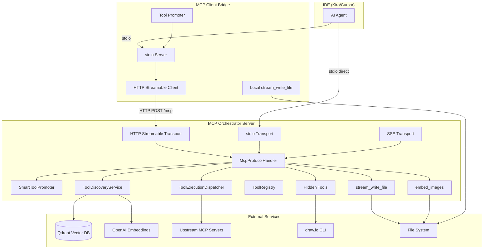
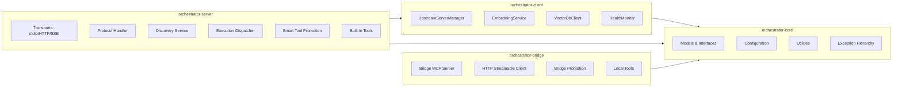
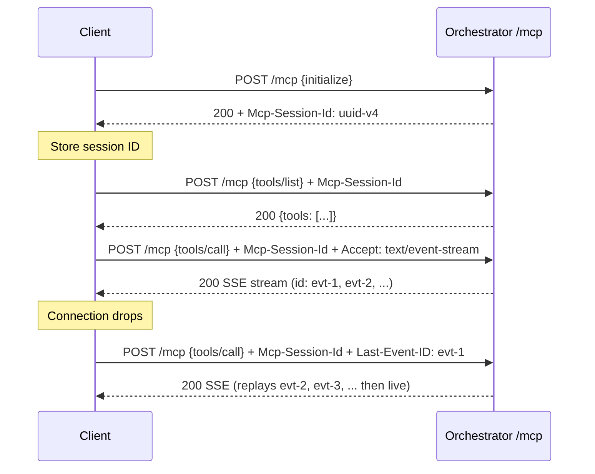
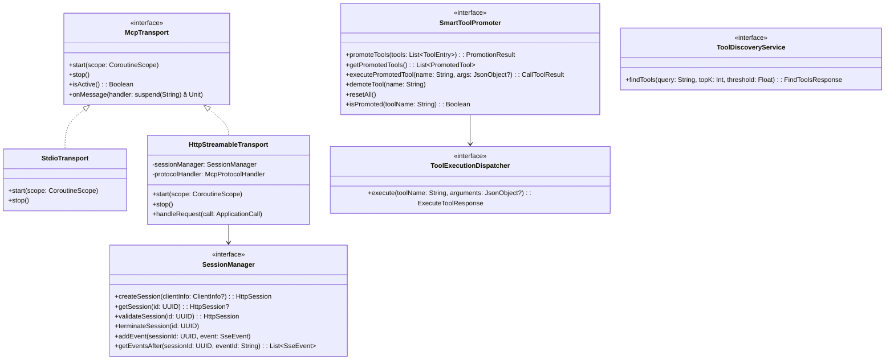
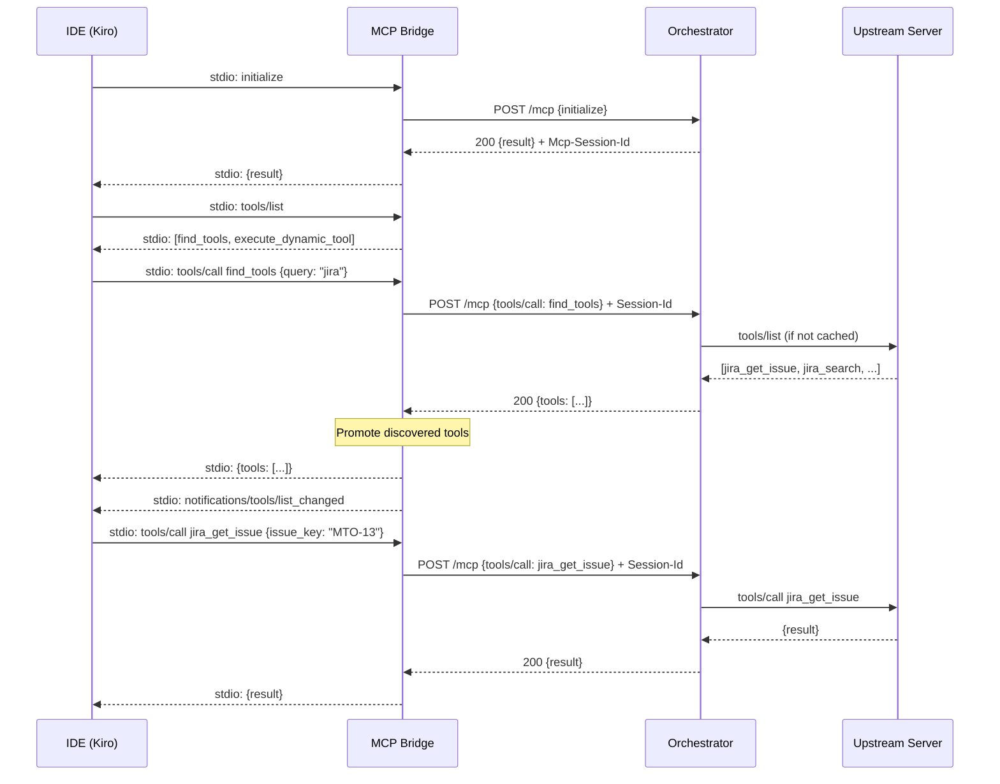
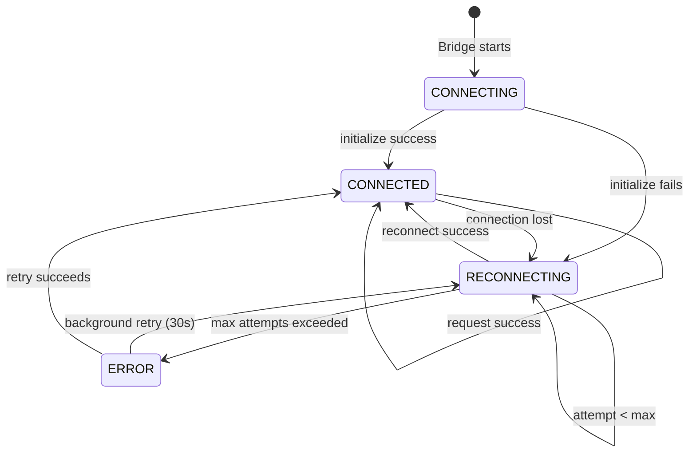
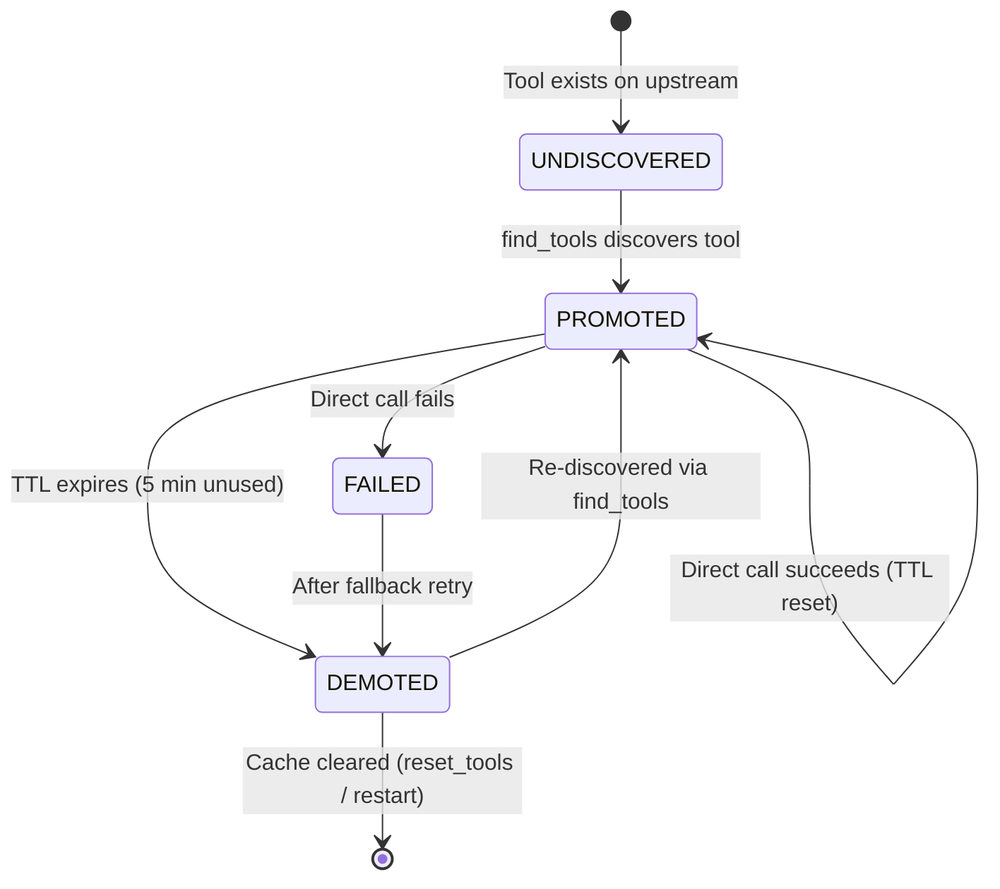

# Technical Design Document (TDD)

## MCPOrchestration — MTO-13: HTTP Streamable Transport & Multi-Module Architecture

---

## Document Information

| Field | Value |
|-------|-------|
| Jira Ticket | MTO-13 |
| Title | HTTP Streamable Transport Mode Support |
| Author | SA Agent |
| Version | 1.0 |
| Date | 2026-05-06 |
| Status | Draft |
| Related BRD | documents/MTO-13/BRD.md |
| Related FSD | documents/MTO-13/FSD.md |

---

## Revision History

| Version | Date | Author | Changes |
|---------|------|--------|---------|
| 1.0 | 2026-05-06 | SA Agent | Initial TDD — covers all 9 parts (A–I), 56 acceptance criteria |

---

## 1. Introduction

### 1.1 Purpose

This Technical Design Document specifies the detailed technical architecture, API contracts, class designs, and implementation strategies for MTO-13. It covers 9 parts spanning HTTP Streamable transport, hidden utility tools, Gradle multi-module refactoring, MCP Client Bridges (Kotlin + Node.js), Smart Tool Promotion, and three already-implemented features (Stream Write, Embed Images, Large-Text Input Proxy).

### 1.2 Scope

| Part | Feature | AC Range | Status |
|------|---------|----------|--------|
| A | HTTP Streamable Transport | #1–7 | To Implement |
| B | Hidden Utility Tools | #8–9 | To Implement |
| C | Gradle Multi-Module Refactor | #10–14 | To Implement |
| D | MCP Client Bridge — Kotlin | #15–22 | To Implement |
| E | MCP Client Bridge — Node.js | #23–30 | To Implement |
| F | Smart Tool Promotion | #31–41 | To Implement |
| G | Stream Write Tool | #42–50 | ✅ IMPLEMENTED |
| H | Embed Images Tool | #51–53 | ✅ IMPLEMENTED |
| I | Large-Text Input Proxy | #54–56 | ✅ IMPLEMENTED |

### 1.3 Technology Stack

| Category | Technology | Version |
|----------|-----------|---------|
| Language | Kotlin | 2.3.20 |
| JVM | JDK | 21 |
| Server Framework | Ktor (Netty) | 3.4.0 |
| HTTP Client | Ktor Client (CIO) | 3.4.0 |
| MCP Protocol | MCP Kotlin SDK | 0.12.0 |
| DI | Koin | 4.1.1 |
| Serialization | kotlinx.serialization-json | 1.8.1 |
| YAML | kaml | 0.77.0 |
| Coroutines | kotlinx.coroutines | 1.10.2 |
| Logging | Logback Classic | 1.5.18 |
| Vector DB | Qdrant | 1.9+ |
| Embeddings | OpenAI text-embedding-3-small | 768 dims |
| Node.js (Part E) | TypeScript + Node.js | 20+ |
| Testing | Kotest + MockK + Ktor TestHost | 5.9.1 / 1.14.2 / 3.4.0 |

### 1.4 Design Principles

1. **Interface/Impl Pattern** — All services use interface + implementation (existing convention)
2. **Sealed Exception Hierarchy** — Typed exceptions for each error category
3. **Coroutine-based Concurrency** — Non-blocking I/O via `kotlinx.coroutines`
4. **Transport Abstraction** — `McpTransport` interface with stdio/HTTP/SSE implementations
5. **File ≤ 200 lines, Function ≤ 20 lines** — Per Kotlin code standards
6. **encodeDefaults = true** — For all protocol/API serialization

### 1.5 References

| Document | Location |
|----------|----------|
| BRD | documents/MTO-13/BRD.md |
| FSD | documents/MTO-13/FSD.md |
| MCP Spec 2025-03-26 | https://modelcontextprotocol.io/specification/2025-03-26/basic/transports#streamable-http |
| Project Structure | .analysis/code-intelligence/project-structure.md |
| Kotlin Code Standards | .antigravity/steering/kotlin-code-standards.md |

---


## 2. System Architecture

### 2.1 High-Level Architecture

The system transforms from a single-module stdio-only application into a multi-module, network-capable system with intelligent tool promotion.



*[Edit in draw.io](diagrams/architecture.drawio)*

### 2.2 Module Architecture (Post-Refactor)



### 2.3 Deployment Architecture

| Artifact | Module | Packaging | Runtime |
|----------|--------|-----------|---------|
| `mcp-orchestrator-all.jar` | orchestrator-server | Fat JAR | JDK 21 |
| `mcp-bridge-all.jar` | orchestrator-bridge | Fat JAR | JDK 21 |
| `@orchestrator/mcp-bridge` | mcp-client-bridge (Node.js) | npm package | Node.js 20+ |

### 2.4 Communication Patterns

| Path | Protocol | Format | Use Case |
|------|----------|--------|----------|
| IDE → Bridge | stdio | JSON-RPC 2.0 | All MCP communication |
| Bridge → Orchestrator | HTTP POST `/mcp` | JSON-RPC 2.0 + SSE | Network MCP |
| IDE → Orchestrator (direct) | stdio | JSON-RPC 2.0 | Local mode |
| Orchestrator → Upstream | stdio / HTTP | JSON-RPC 2.0 | Tool execution |
| Orchestrator → Qdrant | HTTP REST | JSON | Vector search |
| Orchestrator → OpenAI | HTTPS REST | JSON | Embeddings |

---


## 3. API Design

### 3.1 Part A — HTTP Streamable Transport Endpoint

#### 3.1.1 Endpoint: `POST /mcp`

**Request Headers:**

| Header | Type | Required | Description |
|--------|------|----------|-------------|
| Content-Type | String | Yes | `application/json` |
| Accept | String | No | `application/json` (default) or `text/event-stream` |
| Mcp-Session-Id | UUID v4 | After init | Session identifier |
| Last-Event-ID | String | No | Stream resumption point |

**Request Body (JSON-RPC 2.0):**

```json
{
  "jsonrpc": "2.0",
  "id": 1,
  "method": "initialize",
  "params": {
    "protocolVersion": "2025-03-26",
    "capabilities": {},
    "clientInfo": { "name": "kiro", "version": "1.0.0" }
  }
}
```

**Response — JSON mode (Content-Type: application/json):**

```json
{
  "jsonrpc": "2.0",
  "id": 1,
  "result": {
    "protocolVersion": "2025-03-26",
    "capabilities": { "tools": { "listChanged": true } },
    "serverInfo": { "name": "mcp-orchestrator", "version": "1.0.0" }
  }
}
```

**Response — SSE mode (Content-Type: text/event-stream):**

```
id: evt-1
data: {"jsonrpc":"2.0","id":1,"result":{"partial":"chunk1"}}

id: evt-2
data: {"jsonrpc":"2.0","id":1,"result":{"complete":true}}

```

**Error Responses:**

| HTTP Status | JSON-RPC Code | Condition |
|-------------|---------------|-----------|
| 400 | -32700 | Malformed JSON |
| 400 | -32600 | Invalid JSON-RPC structure |
| 404 | -32001 | Invalid/expired session ID |
| 404 | -32002 | Last-Event-ID not in buffer |
| 500 | -32603 | Internal server error |
| 503 | -32003 | Max sessions reached (Retry-After header) |

#### 3.1.2 Session Management



### 3.2 Part B — Hidden Utility Tools

#### 3.2.1 Tool: `get_drawio_reference`

```json
{
  "name": "get_drawio_reference",
  "description": "Returns draw.io XML reference documentation for generating diagrams",
  "inputSchema": { "type": "object", "properties": {}, "required": [] }
}
```

**Response:** Full content of `.antigravity/steering/drawio.md`

**Visibility:** NOT in `tools/list`. Discoverable via `find_tools` only.

#### 3.2.2 Tool: `export_drawio`

```json
{
  "name": "export_drawio",
  "description": "Export a .drawio diagram file to PNG, SVG, or PDF format",
  "inputSchema": {
    "type": "object",
    "properties": {
      "file_path": { "type": "string", "description": "Path to the .drawio file" },
      "format": { "type": "string", "enum": ["png", "svg", "pdf"] }
    },
    "required": ["file_path", "format"]
  }
}
```

**Success Response:**
```json
{ "output_path": "/abs/path/diagram.png", "bytes_written": 45230 }
```

**Error Codes:** `FILE_NOT_FOUND`, `CLI_NOT_FOUND`, `EXPORT_FAILED`, `INVALID_PARAMS`

### 3.3 Part F — Smart Tool Promotion API

#### 3.3.1 Notification: `notifications/tools/list_changed`

Sent to client after tool promotion/demotion:
```json
{ "jsonrpc": "2.0", "method": "notifications/tools/list_changed" }
```

#### 3.3.2 Tool: `reset_tools` (existing)

Clears all promoted tools and resets cache:
```json
{
  "name": "reset_tools",
  "inputSchema": {
    "type": "object",
    "properties": {
      "server_name": { "type": "string", "description": "Optional: reset only tools from this server" }
    }
  }
}
```

### 3.4 Part G — Stream Write Tool API (IMPLEMENTED)

```json
{
  "name": "stream_write_file",
  "description": "Write content directly to a file on disk without buffering.",
  "inputSchema": {
    "type": "object",
    "properties": {
      "file_path": { "type": "string", "description": "Absolute path to the output file" },
      "content": { "type": "string", "description": "Text content to write" },
      "mode": { "type": "string", "enum": ["write", "append"], "default": "write" },
      "encoding": { "type": "string", "default": "utf-8" }
    },
    "required": ["file_path", "content"]
  }
}
```

**Implementation:** `src/main/kotlin/com/orchestrator/mcp/protocol/StreamWriteToolRegistrar.kt`

### 3.5 Part H — Embed Images Tool API (IMPLEMENTED)

```json
{
  "name": "embed_images",
  "description": "Read markdown and replace image refs with base64 data URIs.",
  "inputSchema": {
    "type": "object",
    "properties": {
      "file_path": { "type": "string", "description": "Absolute path to markdown file" },
      "output_path": { "type": "string", "description": "Optional output path" }
    },
    "required": ["file_path"]
  }
}
```

**Implementation:** `src/main/kotlin/com/orchestrator/mcp/protocol/EmbedImagesToolRegistrar.kt`

### 3.6 Part I — Large-Text Input Proxy (IMPLEMENTED)

The Large-Text Input Proxy is part of the FileProxy subsystem. It detects parameters that accept large text content (markdown, HTML, source code) and routes them through the file proxy mechanism for efficient transfer.

**Detection Logic:** `src/main/kotlin/com/orchestrator/mcp/fileproxy/FileProxyDetector.kt`
- Detects params by name: `markdown`, `body`, `text`, `html`, `source`, `template`, `code`, `script`, `yaml`, `json_content`
- Detects by description keywords: "markdown", "document content", "full content", etc.
- Confidence: 0.75 (lower than binary file params at 0.9–0.95)
- Threshold: `maxLength > 10000` or no maxLength constraint

---


## 4. Database Design

### 4.1 Overview

The MCP Orchestrator is primarily an **in-memory system** with no persistent relational database for its core functionality. Data structures are maintained in `ConcurrentHashMap`-based registries and coroutine-scoped state.

**Existing database dependency** (from `build.gradle.kts`): PostgreSQL + HikariCP are present for the `AgentLogService` (execution logging), not for core MCP operations.

### 4.2 In-Memory Data Structures

#### 4.2.1 Session Store (Part A — NEW)

```kotlin
// In-memory session management for HTTP Streamable transport
private val sessions = ConcurrentHashMap<UUID, HttpSession>()

data class HttpSession(
    val id: UUID,
    val createdAt: Instant,
    var lastActivity: Instant,
    val clientInfo: ClientInfo?,
    var state: SessionState = SessionState.ACTIVE,
    val eventBuffer: MutableList<SseEvent> = mutableListOf(),
    var lastEventId: Long = 0L
)

data class SseEvent(
    val id: String,       // "evt-{counter}"
    val data: String,     // JSON-RPC response payload
    val timestamp: Instant
)

enum class SessionState { ACTIVE, EXPIRED, TERMINATED }
```

**Configuration:**
- Max sessions: 100 (configurable)
- Session TTL: 30 minutes
- Event buffer size: 1000 events per session
- Cleanup interval: 60 seconds (background coroutine)

#### 4.2.2 Promotion Cache (Part F — NEW)

```kotlin
private val promotedTools = ConcurrentHashMap<String, PromotedTool>()

data class PromotedTool(
    val name: String,
    val upstreamServer: String,
    val originalSchema: JsonObject,
    val compactSchema: JsonObject,
    val compactDescription: String,  // ≤100 chars
    val promotedAt: Instant,
    var lastUsedAt: Instant,
    var callCount: Int = 0,
    var status: PromotionStatus = PromotionStatus.ACTIVE
)

enum class PromotionStatus { ACTIVE, DEMOTED, FAILED }
```

**Configuration:**
- TTL: 300 seconds (5 minutes)
- Max promoted: 50 tools per session
- Eviction: LRU when at capacity
- Cleanup interval: 60 seconds

#### 4.2.3 Existing Registries (Unchanged)

| Registry | Implementation | Key | Value |
|----------|---------------|-----|-------|
| ToolRegistry | `ConcurrentHashMap<String, ToolEntry>` | tool name | ToolEntry |
| VectorDB (Qdrant) | External service | vector point ID | embedding + metadata |
| Detection Cache | `ConcurrentHashMap<String, List<DetectionResult>>` | server::tool::direction | detection results |

### 4.3 Agent Log Database (Existing — PostgreSQL)

The `agent_log` table stores execution logs for agent activity tracking. This is the only persistent database table used by the Orchestrator.

```sql
CREATE TABLE IF NOT EXISTS agent_log (
    id SERIAL PRIMARY KEY,
    ticket_key VARCHAR(20) NOT NULL,
    agent_name VARCHAR(10) NOT NULL,
    step VARCHAR(50) NOT NULL,
    status VARCHAR(10) NOT NULL,
    message TEXT NOT NULL,
    artifacts JSONB,
    created_at TIMESTAMP DEFAULT NOW()
);

CREATE INDEX idx_agent_log_ticket ON agent_log(ticket_key);
CREATE INDEX idx_agent_log_agent ON agent_log(agent_name);
```

---

## 5. Class/Module Design

### 5.1 Module Structure (Post-Refactor — Part C)

```
MCPOrchestration/
├── orchestrator-core/
│   └── src/main/kotlin/com/orchestrator/mcp/core/
│       ├── model/
│       │   ├── ToolDefinition.kt
│       │   ├── ToolEntry.kt
│       │   ├── ErrorCodes.kt
│       │   └── Exceptions.kt
│       ├── config/
│       │   ├── OrchestratorConfig.kt
│       │   ├── ConfigurationManager.kt
│       │   └── ConfigValidator.kt
│       └── util/
│           └── RetryUtils.kt
├── orchestrator-client/
│   └── src/main/kotlin/com/orchestrator/mcp/client/
│       ├── upstream/
│       │   ├── UpstreamServerManager.kt
│       │   ├── UpstreamServerManagerImpl.kt
│       │   ├── McpConnection.kt
│       │   ├── StdioMcpConnection.kt
│       │   ├── HttpMcpConnection.kt
│       │   └── HealthMonitor.kt
│       ├── embedding/
│       │   ├── EmbeddingService.kt
│       │   └── OpenAiEmbeddingService.kt
│       └── vectordb/
│           ├── VectorDbClient.kt
│           ├── QdrantVectorDbClient.kt
│           └── FaissVectorDbClient.kt
├── orchestrator-server/
│   └── src/main/kotlin/com/orchestrator/mcp/server/
│       ├── transport/
│       │   ├── McpTransport.kt
│       │   ├── StdioTransport.kt
│       │   ├── HttpStreamableTransport.kt  ← NEW (Part A)
│       │   └── SseTransport.kt
│       ├── protocol/
│       │   ├── McpProtocolHandler.kt
│       │   ├── McpServerFactory.kt
│       │   ├── McpToolRegistrar.kt
│       │   └── McpToolSchemas.kt
│       ├── session/
│       │   ├── SessionManager.kt          ← NEW (Part A)
│       │   ├── SessionManagerImpl.kt      ← NEW (Part A)
│       │   └── SessionCleanupJob.kt       ← NEW (Part A)
│       ├── promotion/
│       │   ├── SmartToolPromoter.kt       ← NEW (Part F)
│       │   ├── SmartToolPromoterImpl.kt   ← NEW (Part F)
│       │   ├── PromotionCache.kt          ← NEW (Part F)
│       │   └── CompactSchemaGenerator.kt  ← NEW (Part F)
│       ├── discovery/
│       │   ├── ToolDiscoveryService.kt
│       │   ├── ToolDiscoveryServiceImpl.kt
│       │   └── KeywordSearchEngine.kt
│       ├── execution/
│       │   ├── ToolExecutionDispatcher.kt
│       │   └── ToolExecutionDispatcherImpl.kt
│       ├── registry/
│       │   ├── ToolRegistry.kt
│       │   ├── ToolRegistryImpl.kt
│       │   └── ToolIndexer.kt
│       ├── tools/
│       │   ├── StreamWriteToolRegistrar.kt     ← EXISTING (Part G)
│       │   ├── EmbedImagesToolRegistrar.kt     ← EXISTING (Part H)
│       │   ├── HiddenToolRegistrar.kt          ← NEW (Part B)
│       │   └── AgentLogToolRegistrar.kt
│       └── fileproxy/                          ← EXISTING (Part I)
│           ├── FileProxyDetector.kt
│           ├── FileProxyService.kt
│           ├── FileProxyServiceImpl.kt
│           └── ...
└── orchestrator-bridge/
    └── src/main/kotlin/com/orchestrator/mcp/bridge/
        ├── BridgeApplication.kt               ← NEW (Part D)
        ├── BridgeConfig.kt                    ← NEW (Part D)
        ├── BridgeServer.kt                    ← NEW (Part D)
        ├── HttpStreamableClient.kt            ← NEW (Part D)
        ├── BridgeToolPromoter.kt              ← NEW (Part D)
        ├── FileTransferHandler.kt             ← NEW (Part D)
        ├── ReconnectionManager.kt             ← NEW (Part D)
        └── LocalStreamWriteTool.kt            ← NEW (Part D)
```

### 5.2 Class Diagram — Core Interfaces



### 5.3 Part A — HTTP Streamable Transport Classes

```kotlin
// orchestrator-server/src/.../server/transport/HttpStreamableTransport.kt
class HttpStreamableTransport(
    private val sessionManager: SessionManager,
    private val protocolHandler: McpProtocolHandler,
    private val config: ServerConfig
) : McpTransport {

    suspend fun handleRequest(call: ApplicationCall) // ≤20 lines
    private suspend fun handleInitialize(call: ApplicationCall, request: JsonRpcRequest)
    private suspend fun handleSessionRequest(call: ApplicationCall, request: JsonRpcRequest, session: HttpSession)
    private suspend fun respondJson(call: ApplicationCall, response: JsonRpcResponse)
    private suspend fun respondSse(call: ApplicationCall, session: HttpSession, events: Flow<SseEvent>)
}

// orchestrator-server/src/.../server/session/SessionManager.kt
interface SessionManager {
    fun createSession(clientInfo: ClientInfo? = null): HttpSession
    fun getSession(id: UUID): HttpSession?
    fun validateSession(id: UUID): HttpSession
    fun terminateSession(id: UUID)
    fun addEvent(sessionId: UUID, event: SseEvent)
    fun getEventsAfter(sessionId: UUID, lastEventId: String): List<SseEvent>
    fun getActiveSessionCount(): Int
}

// orchestrator-server/src/.../server/session/SessionManagerImpl.kt
class SessionManagerImpl(
    private val config: SessionConfig,
    private val clock: Clock = Clock.System
) : SessionManager {
    private val sessions = ConcurrentHashMap<UUID, HttpSession>()
    // Implementation with TTL cleanup
}
```

### 5.4 Part B — Hidden Tool Classes

```kotlin
// orchestrator-server/src/.../server/tools/HiddenToolRegistrar.kt
object HiddenToolRegistrar {
    fun registerHiddenTools(discoveryService: ToolDiscoveryService)
    // Registers tools in discovery index but NOT in tools/list
}

// Hidden tools are registered as ToolEntry in the vector DB
// but excluded from McpServerFactory.create() tool registration
```

### 5.5 Part D — Bridge Classes

```kotlin
// orchestrator-bridge/src/.../bridge/BridgeApplication.kt
fun main(args: Array<String>) {
    val config = BridgeConfig.load(args)
    val bridge = BridgeServer(config)
    bridge.start()
}

// orchestrator-bridge/src/.../bridge/BridgeServer.kt
class BridgeServer(private val config: BridgeConfig) {
    private val httpClient: HttpStreamableClient
    private val promoter: BridgeToolPromoter
    private val reconnectionManager: ReconnectionManager

    fun start() // Start stdio server + connect to orchestrator
    fun stop()
}

// orchestrator-bridge/src/.../bridge/HttpStreamableClient.kt
class HttpStreamableClient(private val config: BridgeConfig) {
    private var sessionId: UUID? = null
    suspend fun initialize(): InitializeResult
    suspend fun sendRequest(method: String, params: JsonObject?): JsonRpcResponse
    suspend fun sendRequestSse(method: String, params: JsonObject?): Flow<SseEvent>
}

// orchestrator-bridge/src/.../bridge/ReconnectionManager.kt
class ReconnectionManager(
    private val config: BridgeConfig,
    private val client: HttpStreamableClient
) {
    suspend fun reconnect(): Boolean  // Exponential backoff
    fun getState(): BridgeState
}
```

### 5.6 Part F — Smart Tool Promotion Classes

```kotlin
// orchestrator-server/src/.../server/promotion/SmartToolPromoter.kt
interface SmartToolPromoter {
    suspend fun promoteTools(discoveredTools: List<ToolEntry>): PromotionResult
    fun getPromotedTools(): List<PromotedTool>
    suspend fun executePromotedTool(name: String, args: JsonObject?): CallToolResult
    fun demoteTool(name: String)
    fun resetAll()
    fun isPromoted(toolName: String): Boolean
}

// orchestrator-server/src/.../server/promotion/SmartToolPromoterImpl.kt
class SmartToolPromoterImpl(
    private val config: SmartPromotionConfig,
    private val executionDispatcher: ToolExecutionDispatcher,
    private val notificationSender: NotificationSender,
    private val clock: Clock = Clock.System
) : SmartToolPromoter {
    private val cache = PromotionCache(config.maxPromoted)
    // TTL expiry via background coroutine
}

// orchestrator-server/src/.../server/promotion/CompactSchemaGenerator.kt
object CompactSchemaGenerator {
    fun generate(tool: ToolEntry): Pair<String, JsonObject>
    // Truncates description to ≤100 chars
    // Strips optional parameters from schema
}

// orchestrator-server/src/.../server/promotion/PromotionCache.kt
class PromotionCache(private val maxSize: Int) {
    private val tools = ConcurrentHashMap<String, PromotedTool>()
    fun put(tool: PromotedTool): PromotedTool?  // Returns evicted tool if at capacity
    fun get(name: String): PromotedTool?
    fun remove(name: String): PromotedTool?
    fun evictExpired(ttlSeconds: Long, clock: Clock): List<PromotedTool>
    fun clear(): Int
}
```

### 5.7 Exception Hierarchy (Extended)

```kotlin
// orchestrator-core/src/.../core/model/Exceptions.kt
sealed class McpOrchestratorException(
    val errorCode: String,
    override val message: String,
    override val cause: Throwable? = null
) : Exception(message, cause)

// Existing exceptions (unchanged)
class InvalidParamsException(message: String) : McpOrchestratorException("INVALID_PARAMS", message)
class ToolNotFoundException(message: String) : McpOrchestratorException("TOOL_NOT_FOUND", message)
class ServerUnavailableException(message: String) : McpOrchestratorException("SERVER_UNAVAILABLE", message)
class ExecutionTimeoutException(message: String) : McpOrchestratorException("EXECUTION_TIMEOUT", message)
class UpstreamErrorException(message: String) : McpOrchestratorException("UPSTREAM_ERROR", message)
class VectorDbUnavailableException(message: String) : McpOrchestratorException("VECTOR_DB_UNAVAILABLE", message)
class EmbeddingServiceException(message: String) : McpOrchestratorException("EMBEDDING_ERROR", message)
class ConfigException(message: String) : McpOrchestratorException("CONFIG_ERROR", message)
class GenericMcpException(message: String) : McpOrchestratorException("INTERNAL_ERROR", message)

// NEW exceptions for MTO-13
class SessionNotFoundException(message: String) : McpOrchestratorException("SESSION_NOT_FOUND", message)
class SessionExpiredException(message: String) : McpOrchestratorException("SESSION_EXPIRED", message)
class StreamResumeException(message: String) : McpOrchestratorException("EVENT_NOT_FOUND", message)
class ServerOverloadedException(message: String) : McpOrchestratorException("SERVER_OVERLOADED", message)
class PathValidationException(message: String) : McpOrchestratorException("INVALID_PATH", message)
class FileWriteException(message: String) : McpOrchestratorException("WRITE_FAILED", message)
```

### 5.8 DI Configuration (Koin — Extended)

```kotlin
// orchestrator-server/src/.../server/di/ServerModule.kt
val serverModule = module {
    // Existing bindings
    single<ConfigurationManager> { ConfigurationManagerImpl(get()) }
    single<ToolRegistry> { ToolRegistryImpl() }
    single<ToolDiscoveryService> { ToolDiscoveryServiceImpl(get(), get(), get()) }
    single<ToolExecutionDispatcher> { ToolExecutionDispatcherImpl(get(), get(), get()) }

    // NEW — Session management (Part A)
    single<SessionManager> { SessionManagerImpl(get()) }
    single { SessionCleanupJob(get(), get()) }

    // NEW — HTTP Streamable transport (Part A)
    single { HttpStreamableTransport(get(), get(), get()) }

    // NEW — Smart Tool Promotion (Part F)
    single<SmartToolPromoter> { SmartToolPromoterImpl(get(), get(), get()) }
    single { PromotionCache(get<SmartPromotionConfig>().maxPromoted) }
    single { CompactSchemaGenerator }

    // NEW — Hidden tools (Part B)
    single { HiddenToolRegistrar }
}
```

---


## 6. Integration Design

### 6.1 HTTP Streamable Connection Flow



### 6.2 Bridge Auto-Reconnect Flow



**Reconnection Strategy:**
- Exponential backoff: 1s, 2s, 4s, 8s, 16s (max 5 attempts)
- On success: re-initialize session, re-promote cached tools
- On max exceeded: ERROR state, return `SERVER_UNAVAILABLE` for all requests
- Background retry: every 30 seconds in ERROR state

### 6.3 Smart Tool Promotion Flow



### 6.4 File Transfer via Bridge (Part D, AC #17)

For file content parameters detected by `FileProxyDetector`:

1. Bridge receives tool call with file content in arguments (via stdio)
2. Bridge detects large content parameter (>10KB or file-type param)
3. Bridge extracts content, sends as HTTP binary body (multipart/form-data)
4. Orchestrator receives binary, reconstructs tool arguments
5. Orchestrator forwards to upstream server

**Benefit:** Avoids base64 encoding overhead (33% size increase) over stdio.

### 6.5 External System Integration Summary

| System | Protocol | Timeout | Retry | Circuit Breaker |
|--------|----------|---------|-------|-----------------|
| Qdrant | HTTP REST | 5s | 2 attempts | No |
| OpenAI | HTTPS REST | 10s | 3 attempts (exp backoff) | No |
| Upstream MCP (stdio) | Process stdio | 30s | 1 retry | Auto-reconnect |
| Upstream MCP (HTTP) | HTTP POST | 30s | 1 retry | Auto-reconnect |
| draw.io CLI | Process exec | 30s | No retry | No |
| File System | Direct I/O | N/A | No retry | No |

---

## 7. Security Design

### 7.1 Authentication & Authorization

| Aspect | Design |
|--------|--------|
| HTTP Streamable auth | **Out of scope** for this release. Session isolation provides basic security. |
| Session ID | UUID v4 (cryptographically random) — unpredictable |
| API keys | Resolved from environment variables at runtime (`${ENV_VAR}` syntax) |
| File access | Path validation (absolute only, no traversal) |

### 7.2 Session Isolation

- Each HTTP session has independent state (promoted tools, event buffer)
- Session ID validated on every request — cannot access another session's data
- Expired sessions garbage-collected by background timer (60s interval)
- Concurrent session limit: 100 (configurable) — prevents resource exhaustion

### 7.3 Path Security (stream_write_file + embed_images)

| Threat | Mitigation | Implementation |
|--------|-----------|----------------|
| Path traversal | Reject `..` sequences | `FilePathValidator.validateOutputPath()` |
| Relative path injection | Require absolute paths | Check starts with `/` or drive letter |
| Symlink following | Not in scope (future) | — |
| Directory creation | Tool does NOT create dirs | Parent must pre-exist |
| Disk exhaustion | No built-in limit | Relies on OS quotas |

### 7.4 Input Validation

| Input | Validation |
|-------|-----------|
| JSON-RPC body | Valid JSON-RPC 2.0 structure |
| Mcp-Session-Id | UUID v4 regex: `^[0-9a-f]{8}-...-[0-9a-f]{12}$` |
| Last-Event-ID | Must exist in session's event buffer |
| Tool arguments | Validated by upstream tool schema |
| file_path (stream_write) | Absolute, no `..`, parent exists |
| format (export_drawio) | Enum: png, svg, pdf |

---

## 8. Performance & Scalability

### 8.1 Performance Targets

| Metric | Target | Measurement |
|--------|--------|-------------|
| HTTP Streamable request latency | < 100ms (excluding upstream) | Time from request receipt to response start |
| Tool promotion overhead | < 5ms per tool | Time to generate compact schema + register |
| Token reduction (Smart Promotion) | 73–80% | Compared to full tool list in every request |
| Stream write throughput | Native file I/O speed | No artificial buffering delays |
| Bridge reconnect time | < 15 seconds | From Orchestrator restart to reconnected |
| Session creation | < 1ms | UUID generation + HashMap put |

### 8.2 Caching Strategy

| Cache | Location | TTL | Eviction | Size |
|-------|----------|-----|----------|------|
| Promoted tools | In-memory (ConcurrentHashMap) | 5 min per tool | LRU at capacity | 50 tools/session |
| Session state | In-memory (ConcurrentHashMap) | 30 min | Background cleanup | 100 sessions |
| SSE event buffer | Per-session list | Session TTL | Oldest events when >1000 | 1000 events/session |
| Tool embeddings | Qdrant (external) | Permanent | Manual re-index | Unlimited |
| Detection cache | In-memory (ConcurrentHashMap) | Server lifetime | On upstream disconnect | Per-server |

### 8.3 Connection Pooling

| Connection | Pool | Config |
|-----------|------|--------|
| Ktor HTTP Client (CIO) | Built-in CIO pool | maxConnections=100, connectTimeout=5s |
| PostgreSQL (HikariCP) | HikariCP | maxPoolSize=5, connectionTimeout=10s |
| Qdrant HTTP | Shared Ktor client | Same CIO pool |
| OpenAI HTTP | Shared Ktor client | Same CIO pool |

### 8.4 Scalability Considerations

- **Horizontal scaling:** Not in scope (single-instance design). Sessions are in-memory.
- **Vertical scaling:** Increase max sessions, event buffer size via config.
- **Memory footprint:** ~50MB base + ~1KB per session + ~2KB per promoted tool.
- **Concurrent requests:** Ktor/Netty handles via coroutines (non-blocking).

---

## 9. Monitoring & Observability

### 9.1 Logging Standards

| Category | Level | Format | Example |
|----------|-------|--------|---------|
| HTTP requests | DEBUG | `[HTTP] {method} {path} session={id} size={bytes}` | `[HTTP] POST /mcp session=abc-123 size=256` |
| Session lifecycle | INFO | `[Session] {event} id={id}` | `[Session] created id=abc-123` |
| Tool promotion | INFO | `[Promotion] {event} tool={name} server={server}` | `[Promotion] promoted tool=jira_get_issue server=atlassian` |
| Tool execution | INFO | `[Execution] tool={name} duration={ms}ms status={ok/error}` | `[Execution] tool=jira_get_issue duration=245ms status=ok` |
| Bridge connection | INFO | `[Bridge] {event} url={url}` | `[Bridge] connected url=http://localhost:8080/mcp` |
| Stream write | DEBUG | `[StreamWrite] {mode} {bytes} bytes to {path}` | `[StreamWrite] append 4096 bytes to /tmp/doc.md` |
| Errors | ERROR | `[Error] {class}: {message}` + stack trace | Standard Logback format |

### 9.2 Metrics (Structured Logging)

| Metric | Type | Description |
|--------|------|-------------|
| `mcp.sessions.active` | Gauge | Current active HTTP sessions |
| `mcp.sessions.created` | Counter | Total sessions created |
| `mcp.promotion.count` | Gauge | Currently promoted tools |
| `mcp.promotion.hits` | Counter | Direct promoted tool calls |
| `mcp.promotion.misses` | Counter | Fallback to execute_dynamic_tool |
| `mcp.http.latency` | Histogram | HTTP request processing time |
| `mcp.tools.execution_time` | Histogram | Tool execution duration |

### 9.3 Health Check

The existing `HealthMonitor` provides periodic health checks for upstream servers. For HTTP Streamable mode, add:

```kotlin
// GET /health (simple HTTP health endpoint)
{
  "status": "healthy",
  "sessions": { "active": 3, "max": 100 },
  "promoted_tools": 12,
  "upstreams": { "connected": 5, "total": 6 }
}
```

---

## 10. Deployment

### 10.1 Environment Configuration

**application.yml (extended):**

```yaml
orchestrator:
  server:
    port: 8080
    transport: httpstreamable  # NEW: stdio | sse | httpstreamable
    max_sessions: 100          # NEW
    session_ttl_minutes: 30    # NEW
    event_buffer_size: 1000    # NEW
  smart-promotion:             # NEW section
    enabled: true
    ttl_seconds: 300
    max_promoted: 50
    compact_description_max_length: 100
  discovery:
    top_k: 5
    similarity_threshold: 0.7
  execution:
    timeout_seconds: 30
  embedding:
    provider: openai
    model: text-embedding-3-small
    api_key: ${OPENAI_API_KEY}
  vector_db:
    provider: qdrant
    host: localhost
    port: 6333
  health:
    check_interval_seconds: 30
    auto_reconnect: true
```

### 10.2 Build Commands (Post-Refactor)

| Command | Description |
|---------|-------------|
| `./gradlew build` | Build all modules + run tests |
| `./gradlew :orchestrator-server:buildFatJar` | Build `mcp-orchestrator-all.jar` |
| `./gradlew :orchestrator-bridge:buildFatJar` | Build `mcp-bridge-all.jar` |
| `./gradlew :orchestrator-core:test` | Test core module only |

### 10.3 Runtime Commands

```bash
# Orchestrator — HTTP Streamable mode
java -jar mcp-orchestrator-all.jar --config application.yml

# Kotlin Bridge
java -jar mcp-bridge-all.jar --url http://localhost:8080/mcp

# Node.js Bridge
ORCHESTRATOR_URL=http://localhost:8080/mcp npx @orchestrator/mcp-bridge
```

### 10.4 Feature Flags

| Flag | Default | Description |
|------|---------|-------------|
| `smart-promotion.enabled` | `true` | Enable/disable Smart Tool Promotion |
| `server.transport` | `stdio` | Transport mode selection |
| `hidden-tools.enabled` | `true` | Enable hidden tools (get_drawio_reference, export_drawio) |

### 10.5 Rollback Strategy

1. **Gradle multi-module (Part C):** Revert to single-module by reverting `settings.gradle.kts` changes
2. **HTTP Streamable (Part A):** Set `transport: stdio` to disable HTTP endpoint
3. **Smart Promotion (Part F):** Set `smart-promotion.enabled: false`
4. **Bridge (Part D/E):** Simply don't start the bridge process; use direct stdio

### 10.6 Migration Plan

**Phase 1:** Gradle multi-module refactor (Part C) — no functional changes
**Phase 2:** HTTP Streamable transport (Part A) + Session management
**Phase 3:** Hidden tools (Part B) + Smart Tool Promotion (Part F)
**Phase 4:** Kotlin Bridge (Part D) + Node.js Bridge (Part E)

Each phase is independently deployable and backward-compatible.

---


## 11. Part E — Node.js Bridge Technical Design

### 11.1 Project Structure

```
mcp-client-bridge/
├── src/
│   ├── index.ts              # Entry point — stdio server setup
│   ├── bridge.ts             # Core bridge logic (stdio ↔ HTTP proxy)
│   ├── http-client.ts        # HTTP Streamable client (fetch-based)
│   ├── file-handler.ts       # HTTP binary file transfer
│   ├── tool-promoter.ts      # Smart Tool Promotion implementation
│   ├── stream-write.ts       # Local stream_write_file tool
│   ├── reconnection.ts       # Auto-reconnect with exponential backoff
│   ├── config.ts             # Environment variable configuration
│   └── types.ts              # TypeScript type definitions
├── package.json
├── tsconfig.json
├── vitest.config.ts
└── README.md
```

### 11.2 Technology Stack (Node.js)

| Category | Technology | Version |
|----------|-----------|---------|
| Runtime | Node.js | 20+ |
| Language | TypeScript | 5.x |
| MCP SDK | @modelcontextprotocol/sdk | latest |
| HTTP Client | Native fetch (Node.js 20+) | built-in |
| Stdio | process.stdin / process.stdout | built-in |
| Testing | Vitest | latest |
| Package Manager | npm | 10+ |

### 11.3 Key Implementation Details

```typescript
// src/config.ts
export interface BridgeConfig {
  orchestratorUrl: string;      // ORCHESTRATOR_URL env var
  reconnectEnabled: boolean;    // RECONNECT_ENABLED env var
  maxReconnect: number;         // MAX_RECONNECT env var
  requestTimeoutMs: number;     // REQUEST_TIMEOUT_MS env var
}

export function loadConfig(): BridgeConfig {
  return {
    orchestratorUrl: process.env.ORCHESTRATOR_URL ?? 'http://localhost:8080/mcp',
    reconnectEnabled: process.env.RECONNECT_ENABLED !== 'false',
    maxReconnect: parseInt(process.env.MAX_RECONNECT ?? '5'),
    requestTimeoutMs: parseInt(process.env.REQUEST_TIMEOUT_MS ?? '30000'),
  };
}

// src/stream-write.ts (local tool — identical to Kotlin implementation)
export async function streamWrite(filePath: string, content: string, mode: string): Promise<WriteResult> {
  // Validate absolute path
  if (!path.isAbsolute(filePath)) throw new Error('INVALID_PATH: Path must be absolute');
  if (filePath.includes('..')) throw new Error('INVALID_PATH: Path traversal not allowed');

  const parentDir = path.dirname(filePath);
  if (!fs.existsSync(parentDir)) throw new Error('OUTPUT_DIR_NOT_FOUND');

  const flag = mode === 'append' ? 'a' : 'w';
  const fd = await fs.promises.open(filePath, flag);
  await fd.write(content);
  await fd.close();

  const stats = await fs.promises.stat(filePath);
  return { file_path: filePath, bytes_written: Buffer.byteLength(content), total_size: stats.size, mode };
}
```

### 11.4 Packaging

```json
{
  "name": "@orchestrator/mcp-bridge",
  "version": "1.0.0",
  "bin": { "mcp-bridge": "./dist/index.js" },
  "engines": { "node": ">=20.0.0" },
  "scripts": {
    "build": "tsc",
    "start": "node dist/index.js",
    "test": "vitest"
  }
}
```

**Usage:** `npx @orchestrator/mcp-bridge` or `ORCHESTRATOR_URL=http://host:8080/mcp npx @orchestrator/mcp-bridge`

---

## 12. Existing Implementation Documentation

### 12.1 Part G — Stream Write Tool (IMPLEMENTED)

**Status:** ✅ Fully implemented and operational

**Source File:** `src/main/kotlin/com/orchestrator/mcp/protocol/StreamWriteToolRegistrar.kt`

**Implementation Summary:**
- Registered as built-in tool via `McpServerFactory.create()`
- Uses `java.nio.file.Files.newBufferedWriter` with immediate flush
- Path validation via `FilePathValidator.validateOutputPath()`
- Supports `write` (TRUNCATE_EXISTING + CREATE) and `append` (APPEND + CREATE) modes
- Returns `{file_path, bytes_written, total_size, mode}` as JSON
- Error handling: catches `McpOrchestratorException` and generic `Exception`
- Error codes: `INVALID_PARAMS`, `INVALID_PATH`, `OUTPUT_DIR_NOT_FOUND`, `OUTPUT_NOT_WRITABLE`, `WRITE_FAILED`

**Key Design Decisions:**
- `withContext(Dispatchers.IO)` for non-blocking file I/O
- Content size calculated from `content.toByteArray(Charsets.UTF_8).size`
- Total file size read after write via `Files.size()`
- No encoding parameter implementation yet (always UTF-8) — noted for future enhancement

### 12.2 Part H — Embed Images Tool (IMPLEMENTED)

**Status:** ✅ Fully implemented and operational

**Source File:** `src/main/kotlin/com/orchestrator/mcp/protocol/EmbedImagesToolRegistrar.kt`

**Implementation Summary:**
- Registered as built-in tool via `McpServerFactory.create()`
- Regex pattern: `!\[([^\]]*)\]\(([^)]+)\)` matches markdown image references
- Resolves relative image paths against source file's parent directory
- Converts images to base64 data URIs: `data:{mimeType};base64,{encoded}`
- Supports: png, jpg/jpeg, gif, svg, webp, bmp
- Optional `output_path` parameter — if provided, saves result to file; otherwise returns content in response
- Skips already-embedded data URIs (starts with `data:`)
- Reports: `{images_embedded, images_failed}` counts

**Key Design Decisions:**
- `withContext(Dispatchers.IO)` for file reading
- Graceful degradation: failed images keep original reference (no crash)
- MIME type detection by file extension
- Path resolution: relative paths resolved against markdown file's directory

### 12.3 Part I — Large-Text Input Proxy (IMPLEMENTED)

**Status:** ✅ Fully implemented as part of FileProxy subsystem

**Source Files:**
- `src/main/kotlin/com/orchestrator/mcp/fileproxy/FileProxyDetector.kt` — Detection logic
- `src/main/kotlin/com/orchestrator/mcp/fileproxy/FileProxyServiceImpl.kt` — Proxy handling
- `src/main/kotlin/com/orchestrator/mcp/fileproxy/InputFileProxyHandler.kt` — Input handling

**Implementation Summary:**
- Detects large-text parameters by name: `markdown`, `body`, `text`, `html`, `source`, `template`, `code`, `script`, `yaml`, `json_content`
- Detects by description keywords: "markdown", "document content", "full content", "text content", etc.
- Confidence level: 0.75 (lower than binary file params at 0.9–0.95)
- Threshold: params with `maxLength > 10000` or no maxLength constraint
- Large-text params (confidence 0.75) are read as raw text, NOT base64 encoded
- Detection results cached in `ConcurrentHashMap` per server::tool::direction

**Key Design Decisions:**
- Heuristic-based detection (no explicit configuration needed)
- Three detection methods: `SCHEMA_TYPE`, `NAME_PATTERN`, `DESCRIPTION_KEYWORD`
- Cache invalidation on upstream server disconnect
- Separate handling for binary files (base64) vs large text (raw)

---

## 13. Gradle Multi-Module Configuration (Part C)

### 13.1 settings.gradle.kts

```kotlin
rootProject.name = "MCPOrchestration"

include("orchestrator-core")
include("orchestrator-server")
include("orchestrator-client")
include("orchestrator-bridge")
```

### 13.2 Module Dependencies

```kotlin
// orchestrator-core/build.gradle.kts
plugins {
    alias(libs.plugins.kotlinJvm)
    alias(libs.plugins.kotlinSerialization)
}

dependencies {
    implementation(libs.kotlinx.serialization.json)
    implementation(libs.kotlinx.coroutines.core)
    implementation(libs.kotlinx.datetime)
    implementation(libs.kaml)
    implementation(libs.logback.classic)
}

// orchestrator-client/build.gradle.kts
plugins {
    alias(libs.plugins.kotlinJvm)
    alias(libs.plugins.kotlinSerialization)
}

dependencies {
    implementation(project(":orchestrator-core"))
    implementation(libs.ktor.client.core)
    implementation(libs.ktor.client.cio)
    implementation(libs.ktor.client.content.negotiation)
    implementation(libs.ktor.client.logging)
    implementation(libs.ktor.serialization.kotlinx.json)
    implementation(libs.kotlinx.coroutines.core)
}

// orchestrator-server/build.gradle.kts
plugins {
    alias(libs.plugins.kotlinJvm)
    alias(libs.plugins.kotlinSerialization)
    alias(libs.plugins.ktor)
    application
}

application {
    mainClass.set("com.orchestrator.mcp.server.Main")
}

dependencies {
    implementation(project(":orchestrator-core"))
    implementation(project(":orchestrator-client"))
    implementation(libs.mcp.sdk.server)
    implementation(libs.ktor.server.core)
    implementation(libs.ktor.server.netty)
    implementation(libs.ktor.server.content.negotiation)
    implementation(libs.ktor.server.status.pages)
    implementation(libs.ktor.serialization.kotlinx.json)
    implementation(libs.koin.core)
    implementation(libs.koin.ktor)
    implementation(libs.kotlinx.io.core)
    implementation(libs.postgresql)
    implementation(libs.hikaricp)
}

ktor {
    fatJar {
        archiveFileName.set("mcp-orchestrator-all.jar")
    }
}

// orchestrator-bridge/build.gradle.kts
plugins {
    alias(libs.plugins.kotlinJvm)
    alias(libs.plugins.kotlinSerialization)
    alias(libs.plugins.ktor)
    application
}

application {
    mainClass.set("com.orchestrator.mcp.bridge.Main")
}

dependencies {
    implementation(project(":orchestrator-core"))
    implementation(libs.ktor.client.core)
    implementation(libs.ktor.client.cio)
    implementation(libs.ktor.client.content.negotiation)
    implementation(libs.ktor.serialization.kotlinx.json)
    implementation(libs.mcp.sdk.server)
    implementation(libs.kotlinx.coroutines.core)
    implementation(libs.logback.classic)
}

ktor {
    fatJar {
        archiveFileName.set("mcp-bridge-all.jar")
    }
}
```

### 13.3 Package Migration Rules

| Rule | Description |
|------|-------------|
| No circular deps | `core` depends on nothing; `client` depends on `core`; `server` depends on `core` + `client`; `bridge` depends on `core` |
| Import path changes | `com.orchestrator.mcp.model.*` → `com.orchestrator.mcp.core.model.*` |
| Test migration | Tests follow their source module |
| Shared test fixtures | Move to `orchestrator-core/src/testFixtures/` |

---

## 14. Testing Strategy

### 14.1 Test Categories

| Category | Module | Framework | Focus |
|----------|--------|-----------|-------|
| Unit Tests | All | Kotest + MockK | Individual class behavior |
| Integration Tests | server | Ktor TestHost | HTTP endpoint + protocol |
| E2E Tests | server | Ktor TestHost | Full request flow |
| Bridge Tests | bridge | Kotest + MockK | Bridge proxy logic |
| Node.js Tests | mcp-client-bridge | Vitest | Node.js bridge logic |

### 14.2 Key Test Scenarios

| ID | Part | Scenario | Type |
|----|------|----------|------|
| TC-A1 | A | Initialize HTTP Streamable session | Integration |
| TC-A2 | A | Execute tool via HTTP Streamable | Integration |
| TC-A3 | A | SSE streaming response | Integration |
| TC-A4 | A | Stream resumability (Last-Event-ID) | Integration |
| TC-A5 | A | Invalid session → 404 | Integration |
| TC-B1 | B | Hidden tool NOT in tools/list | Unit |
| TC-B2 | B | Hidden tool discoverable via find_tools | Integration |
| TC-C1 | C | Build each module independently | Build |
| TC-C4 | C | All existing tests pass | Regression |
| TC-D1 | D | Bridge connects to Orchestrator | Integration |
| TC-D4 | D | Bridge auto-reconnect | Integration |
| TC-F1 | F | First find_tools promotes tools | Unit |
| TC-F2 | F | Direct promoted tool call | Unit |
| TC-F3 | F | TTL expiry demotes tool | Unit |
| TC-F4 | F | Fallback on promoted tool failure | Unit |
| TC-G1 | G | stream_write_file write mode | Unit |
| TC-G2 | G | stream_write_file append mode | Unit |
| TC-G4 | G | Invalid path rejected | Unit |

### 14.3 Test Infrastructure

```kotlin
// Existing IntegrationTestBase provides reusable stacks:
// - DiscoveryStack: mock embedding + vector DB + registry
// - ExecutionStack: mock upstream + registry + config
// - ProtocolStack: full MCP server with mocked deps
// - IndexerStack: mock embedding + vector DB

// NEW test stacks for MTO-13:
data class SessionStack(
    val sessionManager: SessionManager,
    val transport: HttpStreamableTransport,
    val config: ServerConfig
)

data class PromotionStack(
    val promoter: SmartToolPromoter,
    val registry: ToolRegistry,
    val dispatcher: ToolExecutionDispatcher
)
```

---

## 15. Acceptance Criteria Traceability

| AC # | Part | Requirement | TDD Section |
|------|------|-------------|-------------|
| 1 | A | Server supports `transport: httpstreamable` | §3.1, §10.1 |
| 2 | A | Single POST endpoint `/mcp` | §3.1.1 |
| 3 | A | Responds with JSON or SSE | §3.1.1 |
| 4 | A | Mcp-Session-Id header | §3.1.2, §5.3 |
| 5 | A | Last-Event-ID resumability | §3.1.2, §5.3 |
| 6 | A | Backward compatible (stdio/sse) | §10.4 |
| 7 | A | upload_file works over HTTP | §6.4 |
| 8 | B | get_drawio_reference hidden tool | §3.2.1, §5.4 |
| 9 | B | export_drawio hidden tool | §3.2.2, §5.4 |
| 10 | C | Multi-module refactor | §5.1, §13.1 |
| 11 | C | Shared models in core | §5.1, §13.2 |
| 12 | C | Server logic in server module | §5.1 |
| 13 | C | Client logic in client module | §5.1 |
| 14 | C | Existing tests pass | §14.2 (TC-C4) |
| 15 | D | Kotlin Bridge stdio server | §5.5 |
| 16 | D | Connects via HTTP Streamable | §5.5, §6.1 |
| 17 | D | HTTP binary file transfer | §6.4 |
| 18 | D | Proxy find_tools/execute_dynamic_tool | §6.1 |
| 19 | D | Token optimization (Smart Promotion) | §5.6, §6.3 |
| 20 | D | Configurable URL | §5.5 |
| 21 | D | Auto-reconnect | §6.2 |
| 22 | D | Fat JAR mcp-bridge-all.jar | §10.2 |
| 23 | E | Node.js stdio server | §11.1 |
| 24 | E | Connects via HTTP Streamable | §11.3 |
| 25 | E | HTTP binary file transfer | §11.3 |
| 26 | E | Proxy find_tools/execute_dynamic_tool | §11.3 |
| 27 | E | Token optimization | §11.3 |
| 28 | E | Configurable URL via env var | §11.3 |
| 29 | E | Auto-reconnect | §11.3 |
| 30 | E | npx runnable | §11.4 |
| 31 | F | Orchestrator stdio: 6 meta-tools | §5.6 |
| 32 | F | Bridge: 2 meta-tools | §5.6 |
| 33 | F | find_tools caches and promotes | §5.6, §6.3 |
| 34 | F | notifications/tools/list_changed | §3.3.1 |
| 35 | F | Direct call: 0 discovery tokens | §6.3 |
| 36 | F | Incremental tool list growth | §6.3 |
| 37 | F | Compact schema (≤100 chars) | §5.6 |
| 38 | F | Cache invalidation (TTL 5 min) | §6.3, §8.2 |
| 39 | F | Fallback: demote + retry | §6.3 |
| 40 | F | Direct routing on success | §6.3 |
| 41 | F | Config: smart-promotion.enabled | §10.1 |
| 42 | G | stream_write_file: no RAM buffer | §12.1 |
| 43 | G | Available on Orchestrator + Bridge | §12.1, §11.3 |
| 44 | G | Input: file_path, content, mode, encoding | §3.4 |
| 45 | G | Immediate write per chunk | §12.1 |
| 46 | G | Append mode | §12.1 |
| 47 | G | Response: file_path, bytes_written, total_size, mode | §3.4 |
| 48 | G | Path validation | §12.1 |
| 49 | G | Error codes | §12.1 |
| 50 | G | Loop pattern: RAM unchanged | §12.1 |
| 51 | H | embed_images: replace refs with base64 | §12.2 |
| 52 | H | Optional output_path | §3.5, §12.2 |
| 53 | H | Reports images_embedded/failed | §12.2 |
| 54 | I | Large-text detection by param name | §12.3 |
| 55 | I | Large-text detection by description | §12.3 |
| 56 | I | Raw text transfer (not base64) | §12.3 |

---

## 16. Appendix

### 16.1 Configuration Reference (Complete)

```yaml
orchestrator:
  server:
    port: 8080
    transport: httpstreamable    # stdio | sse | httpstreamable
    max_sessions: 100
    session_ttl_minutes: 30
    event_buffer_size: 1000
  smart-promotion:
    enabled: true
    ttl_seconds: 300
    max_promoted: 50
    compact_description_max_length: 100
  discovery:
    top_k: 5
    similarity_threshold: 0.7
    max_query_length: 2000
    fallback_to_keyword: true
  execution:
    timeout_seconds: 30
    validate_arguments: true
    max_retries: 1
  embedding:
    provider: openai
    model: text-embedding-3-small
    api_key: ${OPENAI_API_KEY}
    dimensions: 768
  vector_db:
    provider: qdrant
    host: localhost
    port: 6333
    collection_name: mcp_tools
  health:
    check_interval_seconds: 30
    auto_reconnect: true
    max_reconnect_attempts: 5
  hidden-tools:
    enabled: true
    drawio_reference_path: .antigravity/steering/drawio.md
```

### 16.2 Error Code Reference

| Code | HTTP | JSON-RPC | Description |
|------|------|----------|-------------|
| PARSE_ERROR | 400 | -32700 | Malformed JSON |
| INVALID_REQUEST | 400 | -32600 | Invalid JSON-RPC |
| METHOD_NOT_FOUND | — | -32601 | Unknown MCP method |
| SESSION_NOT_FOUND | 404 | -32001 | Invalid session ID |
| EVENT_NOT_FOUND | 404 | -32002 | Last-Event-ID expired |
| SERVER_OVERLOADED | 503 | -32003 | Max sessions reached |
| INTERNAL_ERROR | 500 | -32603 | Unexpected error |
| INVALID_PARAMS | — | — | Tool parameter validation |
| INVALID_PATH | — | — | Path validation failed |
| OUTPUT_DIR_NOT_FOUND | — | — | Parent directory missing |
| OUTPUT_NOT_WRITABLE | — | — | Permission denied |
| WRITE_FAILED | — | — | I/O error |
| FILE_NOT_FOUND | — | — | File does not exist |
| CLI_NOT_FOUND | — | — | draw.io not installed |
| EXPORT_FAILED | — | — | Diagram export error |
| SERVER_UNAVAILABLE | — | — | Upstream unreachable |
| EXECUTION_TIMEOUT | — | — | Tool call timed out |
| TOOL_NOT_FOUND | — | — | Tool not in registry |

### 16.3 Diagrams Index

| Diagram | File | Description |
|---------|------|-------------|
| Architecture | diagrams/architecture.drawio | System architecture with all components |
| Component | diagrams/component.drawio | Module dependencies and packages |
| Sequence — HTTP Session | diagrams/sequence-http-session.drawio | HTTP Streamable session lifecycle |
| Sequence — Smart Promotion | diagrams/sequence-smart-promotion.drawio | Tool promotion flow |
| Sequence — Bridge Connection | diagrams/sequence-bridge-connection.drawio | Bridge ↔ Orchestrator communication |
| Class Diagram | diagrams/class-diagram.drawio | Key interfaces and relationships |

---

*End of Technical Design Document*
