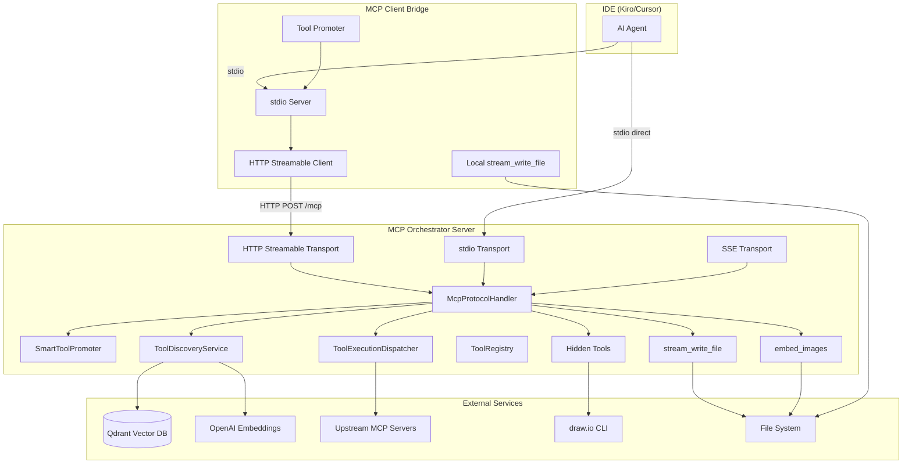
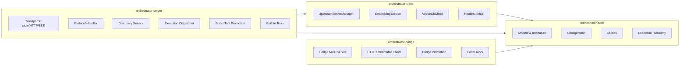
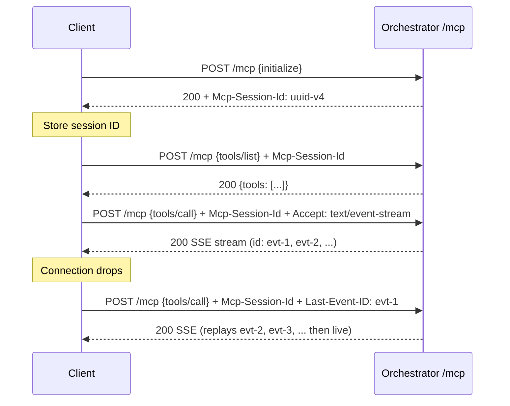
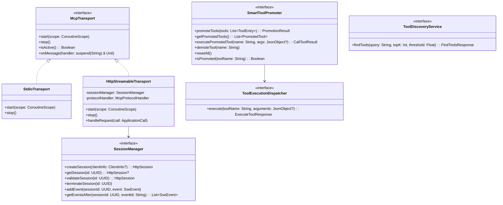

# Technical Design Document (TDD)

## MCPOrchestration — MTO-13: HTTP Streamable Transport & Multi-Module Architecture

---

## Document Information

| Field | Value |
|-------|-------|
| Jira Ticket | MTO-13 |
| Title | HTTP Streamable Transport Mode Support |
| Author | SA Agent |
| Version | 1.0 |
| Date | 2026-05-06 |
| Status | Draft |
| Related BRD | documents/MTO-13/BRD.md |
| Related FSD | documents/MTO-13/FSD.md |

---

## Revision History

| Version | Date | Author | Changes |
|---------|------|--------|---------|
| 1.0 | 2026-05-06 | SA Agent | Initial TDD — covers all 9 parts (A–I), 56 acceptance criteria |

---

## 1. Introduction

### 1.1 Purpose

This Technical Design Document specifies the detailed technical architecture, API contracts, class designs, and implementation strategies for MTO-13. It covers 9 parts spanning HTTP Streamable transport, hidden utility tools, Gradle multi-module refactoring, MCP Client Bridges (Kotlin + Node.js), Smart Tool Promotion, and three already-implemented features (Stream Write, Embed Images, Large-Text Input Proxy).

### 1.2 Scope

| Part | Feature | AC Range | Status |
|------|---------|----------|--------|
| A | HTTP Streamable Transport | #1–7 | To Implement |
| B | Hidden Utility Tools | #8–9 | To Implement |
| C | Gradle Multi-Module Refactor | #10–14 | To Implement |
| D | MCP Client Bridge — Kotlin | #15–22 | To Implement |
| E | MCP Client Bridge — Node.js | #23–30 | To Implement |
| F | Smart Tool Promotion | #31–41 | To Implement |
| G | Stream Write Tool | #42–50 | ✅ IMPLEMENTED |
| H | Embed Images Tool | #51–53 | ✅ IMPLEMENTED |
| I | Large-Text Input Proxy | #54–56 | ✅ IMPLEMENTED |

### 1.3 Technology Stack

| Category | Technology | Version |
|----------|-----------|---------|
| Language | Kotlin | 2.3.20 |
| JVM | JDK | 21 |
| Server Framework | Ktor (Netty) | 3.4.0 |
| HTTP Client | Ktor Client (CIO) | 3.4.0 |
| MCP Protocol | MCP Kotlin SDK | 0.12.0 |
| DI | Koin | 4.1.1 |
| Serialization | kotlinx.serialization-json | 1.8.1 |
| YAML | kaml | 0.77.0 |
| Coroutines | kotlinx.coroutines | 1.10.2 |
| Logging | Logback Classic | 1.5.18 |
| Vector DB | Qdrant | 1.9+ |
| Embeddings | OpenAI text-embedding-3-small | 768 dims |
| Node.js (Part E) | TypeScript + Node.js | 20+ |
| Testing | Kotest + MockK + Ktor TestHost | 5.9.1 / 1.14.2 / 3.4.0 |

### 1.4 Design Principles

1. **Interface/Impl Pattern** — All services use interface + implementation (existing convention)
2. **Sealed Exception Hierarchy** — Typed exceptions for each error category
3. **Coroutine-based Concurrency** — Non-blocking I/O via `kotlinx.coroutines`
4. **Transport Abstraction** — `McpTransport` interface with stdio/HTTP/SSE implementations
5. **File ≤ 200 lines, Function ≤ 20 lines** — Per Kotlin code standards
6. **encodeDefaults = true** — For all protocol/API serialization

### 1.5 References

| Document | Location |
|----------|----------|
| BRD | documents/MTO-13/BRD.md |
| FSD | documents/MTO-13/FSD.md |
| MCP Spec 2025-03-26 | https://modelcontextprotocol.io/specification/2025-03-26/basic/transports#streamable-http |
| Project Structure | .analysis/code-intelligence/project-structure.md |
| Kotlin Code Standards | .antigravity/steering/kotlin-code-standards.md |

---


## 2. System Architecture

### 2.1 High-Level Architecture

The system transforms from a single-module stdio-only application into a multi-module, network-capable system with intelligent tool promotion.



*[Edit in draw.io](diagrams/architecture.drawio)*

### 2.2 Module Architecture (Post-Refactor)



### 2.3 Deployment Architecture

| Artifact | Module | Packaging | Runtime |
|----------|--------|-----------|---------|
| `mcp-orchestrator-all.jar` | orchestrator-server | Fat JAR | JDK 21 |
| `mcp-bridge-all.jar` | orchestrator-bridge | Fat JAR | JDK 21 |
| `@orchestrator/mcp-bridge` | mcp-client-bridge (Node.js) | npm package | Node.js 20+ |

### 2.4 Communication Patterns

| Path | Protocol | Format | Use Case |
|------|----------|--------|----------|
| IDE → Bridge | stdio | JSON-RPC 2.0 | All MCP communication |
| Bridge → Orchestrator | HTTP POST `/mcp` | JSON-RPC 2.0 + SSE | Network MCP |
| IDE → Orchestrator (direct) | stdio | JSON-RPC 2.0 | Local mode |
| Orchestrator → Upstream | stdio / HTTP | JSON-RPC 2.0 | Tool execution |
| Orchestrator → Qdrant | HTTP REST | JSON | Vector search |
| Orchestrator → OpenAI | HTTPS REST | JSON | Embeddings |

---


## 3. API Design

### 3.1 Part A — HTTP Streamable Transport Endpoint

#### 3.1.1 Endpoint: `POST /mcp`

**Request Headers:**

| Header | Type | Required | Description |
|--------|------|----------|-------------|
| Content-Type | String | Yes | `application/json` |
| Accept | String | No | `application/json` (default) or `text/event-stream` |
| Mcp-Session-Id | UUID v4 | After init | Session identifier |
| Last-Event-ID | String | No | Stream resumption point |

**Request Body (JSON-RPC 2.0):**

```json
{
  "jsonrpc": "2.0",
  "id": 1,
  "method": "initialize",
  "params": {
    "protocolVersion": "2025-03-26",
    "capabilities": {},
    "clientInfo": { "name": "kiro", "version": "1.0.0" }
  }
}
```

**Response — JSON mode (Content-Type: application/json):**

```json
{
  "jsonrpc": "2.0",
  "id": 1,
  "result": {
    "protocolVersion": "2025-03-26",
    "capabilities": { "tools": { "listChanged": true } },
    "serverInfo": { "name": "mcp-orchestrator", "version": "1.0.0" }
  }
}
```

**Response — SSE mode (Content-Type: text/event-stream):**

```
id: evt-1
data: {"jsonrpc":"2.0","id":1,"result":{"partial":"chunk1"}}

id: evt-2
data: {"jsonrpc":"2.0","id":1,"result":{"complete":true}}

```

**Error Responses:**

| HTTP Status | JSON-RPC Code | Condition |
|-------------|---------------|-----------|
| 400 | -32700 | Malformed JSON |
| 400 | -32600 | Invalid JSON-RPC structure |
| 404 | -32001 | Invalid/expired session ID |
| 404 | -32002 | Last-Event-ID not in buffer |
| 500 | -32603 | Internal server error |
| 503 | -32003 | Max sessions reached (Retry-After header) |

#### 3.1.2 Session Management



### 3.2 Part B — Hidden Utility Tools

#### 3.2.1 Tool: `get_drawio_reference`

```json
{
  "name": "get_drawio_reference",
  "description": "Returns draw.io XML reference documentation for generating diagrams",
  "inputSchema": { "type": "object", "properties": {}, "required": [] }
}
```

**Response:** Full content of `.antigravity/steering/drawio.md`

**Visibility:** NOT in `tools/list`. Discoverable via `find_tools` only.

#### 3.2.2 Tool: `export_drawio`

```json
{
  "name": "export_drawio",
  "description": "Export a .drawio diagram file to PNG, SVG, or PDF format",
  "inputSchema": {
    "type": "object",
    "properties": {
      "file_path": { "type": "string", "description": "Path to the .drawio file" },
      "format": { "type": "string", "enum": ["png", "svg", "pdf"] }
    },
    "required": ["file_path", "format"]
  }
}
```

**Success Response:**
```json
{ "output_path": "/abs/path/diagram.png", "bytes_written": 45230 }
```

**Error Codes:** `FILE_NOT_FOUND`, `CLI_NOT_FOUND`, `EXPORT_FAILED`, `INVALID_PARAMS`

### 3.3 Part F — Smart Tool Promotion API

#### 3.3.1 Notification: `notifications/tools/list_changed`

Sent to client after tool promotion/demotion:
```json
{ "jsonrpc": "2.0", "method": "notifications/tools/list_changed" }
```

#### 3.3.2 Tool: `reset_tools` (existing)

Clears all promoted tools and resets cache:
```json
{
  "name": "reset_tools",
  "inputSchema": {
    "type": "object",
    "properties": {
      "server_name": { "type": "string", "description": "Optional: reset only tools from this server" }
    }
  }
}
```

### 3.4 Part G — Stream Write Tool API (IMPLEMENTED)

```json
{
  "name": "stream_write_file",
  "description": "Write content directly to a file on disk without buffering.",
  "inputSchema": {
    "type": "object",
    "properties": {
      "file_path": { "type": "string", "description": "Absolute path to the output file" },
      "content": { "type": "string", "description": "Text content to write" },
      "mode": { "type": "string", "enum": ["write", "append"], "default": "write" },
      "encoding": { "type": "string", "default": "utf-8" }
    },
    "required": ["file_path", "content"]
  }
}
```

**Implementation:** `src/main/kotlin/com/orchestrator/mcp/protocol/StreamWriteToolRegistrar.kt`

### 3.5 Part H — Embed Images Tool API (IMPLEMENTED)

```json
{
  "name": "embed_images",
  "description": "Read markdown and replace image refs with base64 data URIs.",
  "inputSchema": {
    "type": "object",
    "properties": {
      "file_path": { "type": "string", "description": "Absolute path to markdown file" },
      "output_path": { "type": "string", "description": "Optional output path" }
    },
    "required": ["file_path"]
  }
}
```

**Implementation:** `src/main/kotlin/com/orchestrator/mcp/protocol/EmbedImagesToolRegistrar.kt`

### 3.6 Part I — Large-Text Input Proxy (IMPLEMENTED)

The Large-Text Input Proxy is part of the FileProxy subsystem. It detects parameters that accept large text content (markdown, HTML, source code) and routes them through the file proxy mechanism for efficient transfer.

**Detection Logic:** `src/main/kotlin/com/orchestrator/mcp/fileproxy/FileProxyDetector.kt`
- Detects params by name: `markdown`, `body`, `text`, `html`, `source`, `template`, `code`, `script`, `yaml`, `json_content`
- Detects by description keywords: "markdown", "document content", "full content", etc.
- Confidence: 0.75 (lower than binary file params at 0.9–0.95)
- Threshold: `maxLength > 10000` or no maxLength constraint

---


## 4. Database Design

### 4.1 Overview

The MCP Orchestrator is primarily an **in-memory system** with no persistent relational database for its core functionality. Data structures are maintained in `ConcurrentHashMap`-based registries and coroutine-scoped state.

**Existing database dependency** (from `build.gradle.kts`): PostgreSQL + HikariCP are present for the `AgentLogService` (execution logging), not for core MCP operations.

### 4.2 In-Memory Data Structures

#### 4.2.1 Session Store (Part A — NEW)

```kotlin
// In-memory session management for HTTP Streamable transport
private val sessions = ConcurrentHashMap<UUID, HttpSession>()

data class HttpSession(
    val id: UUID,
    val createdAt: Instant,
    var lastActivity: Instant,
    val clientInfo: ClientInfo?,
    var state: SessionState = SessionState.ACTIVE,
    val eventBuffer: MutableList<SseEvent> = mutableListOf(),
    var lastEventId: Long = 0L
)

data class SseEvent(
    val id: String,       // "evt-{counter}"
    val data: String,     // JSON-RPC response payload
    val timestamp: Instant
)

enum class SessionState { ACTIVE, EXPIRED, TERMINATED }
```

**Configuration:**
- Max sessions: 100 (configurable)
- Session TTL: 30 minutes
- Event buffer size: 1000 events per session
- Cleanup interval: 60 seconds (background coroutine)

#### 4.2.2 Promotion Cache (Part F — NEW)

```kotlin
private val promotedTools = ConcurrentHashMap<String, PromotedTool>()

data class PromotedTool(
    val name: String,
    val upstreamServer: String,
    val originalSchema: JsonObject,
    val compactSchema: JsonObject,
    val compactDescription: String,  // ≤100 chars
    val promotedAt: Instant,
    var lastUsedAt: Instant,
    var callCount: Int = 0,
    var status: PromotionStatus = PromotionStatus.ACTIVE
)

enum class PromotionStatus { ACTIVE, DEMOTED, FAILED }
```

**Configuration:**
- TTL: 300 seconds (5 minutes)
- Max promoted: 50 tools per session
- Eviction: LRU when at capacity
- Cleanup interval: 60 seconds

#### 4.2.3 Existing Registries (Unchanged)

| Registry | Implementation | Key | Value |
|----------|---------------|-----|-------|
| ToolRegistry | `ConcurrentHashMap<String, ToolEntry>` | tool name | ToolEntry |
| VectorDB (Qdrant) | External service | vector point ID | embedding + metadata |
| Detection Cache | `ConcurrentHashMap<String, List<DetectionResult>>` | server::tool::direction | detection results |

### 4.3 Agent Log Database (Existing — PostgreSQL)

The `agent_log` table stores execution logs for agent activity tracking. This is the only persistent database table used by the Orchestrator.

```sql
CREATE TABLE IF NOT EXISTS agent_log (
    id SERIAL PRIMARY KEY,
    ticket_key VARCHAR(20) NOT NULL,
    agent_name VARCHAR(10) NOT NULL,
    step VARCHAR(50) NOT NULL,
    status VARCHAR(10) NOT NULL,
    message TEXT NOT NULL,
    artifacts JSONB,
    created_at TIMESTAMP DEFAULT NOW()
);

CREATE INDEX idx_agent_log_ticket ON agent_log(ticket_key);
CREATE INDEX idx_agent_log_agent ON agent_log(agent_name);
```

---

## 5. Class/Module Design

### 5.1 Module Structure (Post-Refactor — Part C)

```
MCPOrchestration/
├── orchestrator-core/
│   └── src/main/kotlin/com/orchestrator/mcp/core/
│       ├── model/
│       │   ├── ToolDefinition.kt
│       │   ├── ToolEntry.kt
│       │   ├── ErrorCodes.kt
│       │   └── Exceptions.kt
│       ├── config/
│       │   ├── OrchestratorConfig.kt
│       │   ├── ConfigurationManager.kt
│       │   └── ConfigValidator.kt
│       └── util/
│           └── RetryUtils.kt
├── orchestrator-client/
│   └── src/main/kotlin/com/orchestrator/mcp/client/
│       ├── upstream/
│       │   ├── UpstreamServerManager.kt
│       │   ├── UpstreamServerManagerImpl.kt
│       │   ├── McpConnection.kt
│       │   ├── StdioMcpConnection.kt
│       │   ├── HttpMcpConnection.kt
│       │   └── HealthMonitor.kt
│       ├── embedding/
│       │   ├── EmbeddingService.kt
│       │   └── OpenAiEmbeddingService.kt
│       └── vectordb/
│           ├── VectorDbClient.kt
│           ├── QdrantVectorDbClient.kt
│           └── FaissVectorDbClient.kt
├── orchestrator-server/
│   └── src/main/kotlin/com/orchestrator/mcp/server/
│       ├── transport/
│       │   ├── McpTransport.kt
│       │   ├── StdioTransport.kt
│       │   ├── HttpStreamableTransport.kt  ← NEW (Part A)
│       │   └── SseTransport.kt
│       ├── protocol/
│       │   ├── McpProtocolHandler.kt
│       │   ├── McpServerFactory.kt
│       │   ├── McpToolRegistrar.kt
│       │   └── McpToolSchemas.kt
│       ├── session/
│       │   ├── SessionManager.kt          ← NEW (Part A)
│       │   ├── SessionManagerImpl.kt      ← NEW (Part A)
│       │   └── SessionCleanupJob.kt       ← NEW (Part A)
│       ├── promotion/
│       │   ├── SmartToolPromoter.kt       ← NEW (Part F)
│       │   ├── SmartToolPromoterImpl.kt   ← NEW (Part F)
│       │   ├── PromotionCache.kt          ← NEW (Part F)
│       │   └── CompactSchemaGenerator.kt  ← NEW (Part F)
│       ├── discovery/
│       │   ├── ToolDiscoveryService.kt
│       │   ├── ToolDiscoveryServiceImpl.kt
│       │   └── KeywordSearchEngine.kt
│       ├── execution/
│       │   ├── ToolExecutionDispatcher.kt
│       │   └── ToolExecutionDispatcherImpl.kt
│       ├── registry/
│       │   ├── ToolRegistry.kt
│       │   ├── ToolRegistryImpl.kt
│       │   └── ToolIndexer.kt
│       ├── tools/
│       │   ├── StreamWriteToolRegistrar.kt     ← EXISTING (Part G)
│       │   ├── EmbedImagesToolRegistrar.kt     ← EXISTING (Part H)
│       │   ├── HiddenToolRegistrar.kt          ← NEW (Part B)
│       │   └── AgentLogToolRegistrar.kt
│       └── fileproxy/                          ← EXISTING (Part I)
│           ├── FileProxyDetector.kt
│           ├── FileProxyService.kt
│           ├── FileProxyServiceImpl.kt
│           └── ...
└── orchestrator-bridge/
    └── src/main/kotlin/com/orchestrator/mcp/bridge/
        ├── BridgeApplication.kt               ← NEW (Part D)
        ├── BridgeConfig.kt                    ← NEW (Part D)
        ├── BridgeServer.kt                    ← NEW (Part D)
        ├── HttpStreamableClient.kt            ← NEW (Part D)
        ├── BridgeToolPromoter.kt              ← NEW (Part D)
        ├── FileTransferHandler.kt             ← NEW (Part D)
        ├── ReconnectionManager.kt             ← NEW (Part D)
        └── LocalStreamWriteTool.kt            ← NEW (Part D)
```

### 5.2 Class Diagram — Core Interfaces



### 5.3 Part A — HTTP Streamable Transport Classes

```kotlin
// orchestrator-server/src/.../server/transport/HttpStreamableTransport.kt
class HttpStreamableTransport(
    private val sessionManager: SessionManager,
    private val protocolHandler: McpProtocolHandler,
    private val config: ServerConfig
) : McpTransport {

    suspend fun handleRequest(call: ApplicationCall) // ≤20 lines
    private suspend fun handleInitialize(call: ApplicationCall, request: JsonRpcRequest)
    private suspend fun handleSessionRequest(call: ApplicationCall, request: JsonRpcRequest, session: HttpSession)
    private suspend fun respondJson(call: ApplicationCall, response: JsonRpcResponse)
    private suspend fun respondSse(call: ApplicationCall, session: HttpSession, events: Flow<SseEvent>)
}

// orchestrator-server/src/.../server/session/SessionManager.kt
interface SessionManager {
    fun createSession(clientInfo: ClientInfo? = null): HttpSession
    fun getSession(id: UUID): HttpSession?
    fun validateSession(id: UUID): HttpSession
    fun terminateSession(id: UUID)
    fun addEvent(sessionId: UUID, event: SseEvent)
    fun getEventsAfter(sessionId: UUID, lastEventId: String): List<SseEvent>
    fun getActiveSessionCount(): Int
}

// orchestrator-server/src/.../server/session/SessionManagerImpl.kt
class SessionManagerImpl(
    private val config: SessionConfig,
    private val clock: Clock = Clock.System
) : SessionManager {
    private val sessions = ConcurrentHashMap<UUID, HttpSession>()
    // Implementation with TTL cleanup
}
```

### 5.4 Part B — Hidden Tool Classes

```kotlin
// orchestrator-server/src/.../server/tools/HiddenToolRegistrar.kt
object HiddenToolRegistrar {
    fun registerHiddenTools(discoveryService: ToolDiscoveryService)
    // Registers tools in discovery index but NOT in tools/list
}

// Hidden tools are registered as ToolEntry in the vector DB
// but excluded from McpServerFactory.create() tool registration
```

### 5.5 Part D — Bridge Classes

```kotlin
// orchestrator-bridge/src/.../bridge/BridgeApplication.kt
fun main(args: Array<String>) {
    val config = BridgeConfig.load(args)
    val bridge = BridgeServer(config)
    bridge.start()
}

// orchestrator-bridge/src/.../bridge/BridgeServer.kt
class BridgeServer(private val config: BridgeConfig) {
    private val httpClient: HttpStreamableClient
    private val promoter: BridgeToolPromoter
    private val reconnectionManager: ReconnectionManager

    fun start() // Start stdio server + connect to orchestrator
    fun stop()
}

// orchestrator-bridge/src/.../bridge/HttpStreamableClient.kt
class HttpStreamableClient(private val config: BridgeConfig) {
    private var sessionId: UUID? = null
    suspend fun initialize(): InitializeResult
    suspend fun sendRequest(method: String, params: JsonObject?): JsonRpcResponse
    suspend fun sendRequestSse(method: String, params: JsonObject?): Flow<SseEvent>
}

// orchestrator-bridge/src/.../bridge/ReconnectionManager.kt
class ReconnectionManager(
    private val config: BridgeConfig,
    private val client: HttpStreamableClient
) {
    suspend fun reconnect(): Boolean  // Exponential backoff
    fun getState(): BridgeState
}
```

### 5.6 Part F — Smart Tool Promotion Classes

```kotlin
// orchestrator-server/src/.../server/promotion/SmartToolPromoter.kt
interface SmartToolPromoter {
    suspend fun promoteTools(discoveredTools: List<ToolEntry>): PromotionResult
    fun getPromotedTools(): List<PromotedTool>
    suspend fun executePromotedTool(name: String, args: JsonObject?): CallToolResult
    fun demoteTool(name: String)
    fun resetAll()
    fun isPromoted(toolName: String): Boolean
}

// orchestrator-server/src/.../server/promotion/SmartToolPromoterImpl.kt
class SmartToolPromoterImpl(
    private val config: SmartPromotionConfig,
    private val executionDispatcher: ToolExecutionDispatcher,
    private val notificationSender: NotificationSender,
    private val clock: Clock = Clock.System
) : SmartToolPromoter {
    private val cache = PromotionCache(config.maxPromoted)
    // TTL expiry via background coroutine
}

// orchestrator-server/src/.../server/promotion/CompactSchemaGenerator.kt
object CompactSchemaGenerator {
    fun generate(tool: ToolEntry): Pair<String, JsonObject>
    // Truncates description to ≤100 chars
    // Strips optional parameters from schema
}

// orchestrator-server/src/.../server/promotion/PromotionCache.kt
class PromotionCache(private val maxSize: Int) {
    private val tools = ConcurrentHashMap<String, PromotedTool>()
    fun put(tool: PromotedTool): PromotedTool?  // Returns evicted tool if at capacity
    fun get(name: String): PromotedTool?
    fun remove(name: String): PromotedTool?
    fun evictExpired(ttlSeconds: Long, clock: Clock): List<PromotedTool>
    fun clear(): Int
}
```

### 5.7 Exception Hierarchy (Extended)

```kotlin
// orchestrator-core/src/.../core/model/Exceptions.kt
sealed class McpOrchestratorException(
    val errorCode: String,
    override val message: String,
    override val cause: Throwable? = null
) : Exception(message, cause)

// Existing exceptions (unchanged)
class InvalidParamsException(message: String) : McpOrchestratorException("INVALID_PARAMS", message)
class ToolNotFoundException(message: String) : McpOrchestratorException("TOOL_NOT_FOUND", message)
class ServerUnavailableException(message: String) : McpOrchestratorException("SERVER_UNAVAILABLE", message)
class ExecutionTimeoutException(message: String) : McpOrchestratorException("EXECUTION_TIMEOUT", message)
class UpstreamErrorException(message: String) : McpOrchestratorException("UPSTREAM_ERROR", message)
class VectorDbUnavailableException(message: String) : McpOrchestratorException("VECTOR_DB_UNAVAILABLE", message)
class EmbeddingServiceException(message: String) : McpOrchestratorException("EMBEDDING_ERROR", message)
class ConfigException(message: String) : McpOrchestratorException("CONFIG_ERROR", message)
class GenericMcpException(message: String) : McpOrchestratorException("INTERNAL_ERROR", message)

// NEW exceptions for MTO-13
class SessionNotFoundException(message: String) : McpOrchestratorException("SESSION_NOT_FOUND", message)
class SessionExpiredException(message: String) : McpOrchestratorException("SESSION_EXPIRED", message)
class StreamResumeException(message: String) : McpOrchestratorException("EVENT_NOT_FOUND", message)
class ServerOverloadedException(message: String) : McpOrchestratorException("SERVER_OVERLOADED", message)
class PathValidationException(message: String) : McpOrchestratorException("INVALID_PATH", message)
class FileWriteException(message: String) : McpOrchestratorException("WRITE_FAILED", message)
```

### 5.8 DI Configuration (Koin — Extended)

```kotlin
// orchestrator-server/src/.../server/di/ServerModule.kt
val serverModule = module {
    // Existing bindings
    single<ConfigurationManager> { ConfigurationManagerImpl(get()) }
    single<ToolRegistry> { ToolRegistryImpl() }
    single<ToolDiscoveryService> { ToolDiscoveryServiceImpl(get(), get(), get()) }
    single<ToolExecutionDispatcher> { ToolExecutionDispatcherImpl(get(), get(), get()) }

    // NEW — Session management (Part A)
    single<SessionManager> { SessionManagerImpl(get()) }
    single { SessionCleanupJob(get(), get()) }

    // NEW — HTTP Streamable transport (Part A)
    single { HttpStreamableTransport(get(), get(), get()) }

    // NEW — Smart Tool Promotion (Part F)
    single<SmartToolPromoter> { SmartToolPromoterImpl(get(), get(), get()) }
    single { PromotionCache(get<SmartPromotionConfig>().maxPromoted) }
    single { CompactSchemaGenerator }

    // NEW — Hidden tools (Part B)
    single { HiddenToolRegistrar }
}
```

---


## 6. Integration Design

### 6.1 HTTP Streamable Connection Flow

```mermaid
sequenceDiagram
    participant IDE as IDE (Kiro)
    participant Bridge as MCP Bridge
    participant Orch as Orchestrator
    participant Upstream as Upstream Server

    IDE->>Bridge: stdio: initialize

---

*Full document available at: documents/MTO-13/TDD.md*
