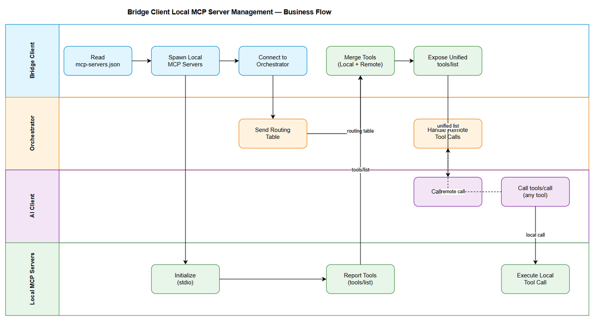

# Business Requirements Document (BRD)

## MCP Tool Orchestration — MTO-131: Bridge Client Local MCP Server Management

---

## Document Information

| Field | Value |
|-------|-------|
| Jira Ticket | MTO-131 |
| Title | Bridge Client Local MCP Server Management |
| Author | BA Agent |
| Version | 1.0 |
| Date | 2026-05-17 |
| Status | Draft |

---

## Author Tracking

| Role | Name - Position | Responsibility |
|------|-----------------|----------------|
| Author | BA Agent – Business Analyst | Create document |
| Peer Reviewer | SM Agent – Scrum Master | Review document |

---

## Revision History

| Version | Date | Author | Changes |
|---------|------|--------|---------|
| 1.0 | 2026-05-17 | BA Agent | Initiate document — auto-generated from Jira Epic MTO-131 and 8 child Stories |

---

## Sign-Off

| Name | Signature and date |
|------|--------------------|
| | ☐ I agree and confirm all criteria on this BRD as expected requirements |
| | ☐ I agree and confirm all criteria on this BRD as expected requirements |

---

## 1. Introduction

### 1.1 Scope

This Epic introduces **Local MCP Server Management** capabilities to all bridge clients (Node.js, Python, Kotlin). Bridge clients will be able to spawn and manage MCP servers locally on the client machine, route tool calls intelligently between local and remote servers, and provide a unified tool registry to AI clients. This optimization reduces network payload, decreases latency for local tools, and enables offline capabilities (e.g., local embedding with all-MiniLM-L6-v2).

**Key capabilities:**
- Orchestrator sends routing table to bridge clients (which tools are local vs remote)
- Bridge spawns/manages local MCP server processes from `mcp-servers.json` config
- Bridge merges local + remote tools into a single unified `tools/list`
- Smart routing: local tools called directly (zero network), remote tools proxied to orchestrator
- Local embedding fallback using all-MiniLM-L6-v2 ONNX model

### 1.2 Out of Scope

- Server-side orchestrator changes beyond the Routing Table API endpoint
- Authentication/authorization for local MCP servers (local servers are trusted)
- Remote embedding model hosting (only local fallback is in scope)
- Bridge client UI/dashboard for monitoring local servers
- Auto-discovery of MCP servers on the network (only config-based)
- Changes to the MCP protocol specification itself

### 1.3 Preliminary Requirements

- Existing bridge clients (Node.js, Python, Kotlin) must be functional and deployed
- Orchestrator must support SSE/HTTP transport for bridge communication
- draw.io desktop app or CLI available for diagram export (optional)
- ONNX Runtime available for target platforms (Node.js, Python, JVM)

---

## 2. Business Requirements

### 2.1 High Level Process Map

The Bridge Client Local MCP Server Management feature follows this high-level flow:

1. **Startup**: Bridge reads `mcp-servers.json` → spawns local MCP servers
2. **Connection**: Bridge connects to remote Orchestrator → receives routing table
3. **Discovery**: Bridge queries local servers for tools → merges with remote tools → exposes unified `tools/list`
4. **Execution**: AI client calls tool → Bridge routes to local or remote based on routing table
5. **Embedding**: If embedding needed → check MCP config → fallback to local all-MiniLM-L6-v2



### 2.2 List of User Stories / Use Cases

| # | Story / Use Case | Priority | Source Ticket |
|---|------------------|----------|---------------|
| 1 | As an orchestrator admin, I want to send a routing table to bridge clients so that bridges know which tools are local vs remote | MUST HAVE | MTO-132 |
| 2 | As a bridge client, I want to spawn and manage local MCP server processes so that I can call local tools without network overhead | MUST HAVE | MTO-133 |
| 3 | As an AI client, I want to see a unified tools/list that includes both local and remote tools so that I don't need to know where tools are hosted | MUST HAVE | MTO-134 |
| 4 | As a bridge client, I want to intelligently route tool calls to local or remote servers so that local tools execute with zero network latency | MUST HAVE | MTO-135 |
| 5 | As a bridge client, I want to use a local embedding model as fallback so that semantic search works offline | SHOULD HAVE | MTO-136 |
| 6 | As a Node.js bridge user, I want the bridge to support local MCP server management | MUST HAVE | MTO-137 |
| 7 | As a Python bridge user, I want the bridge to support local MCP server management | MUST HAVE | MTO-138 |
| 8 | As a Kotlin bridge user, I want the bridge to support local MCP server management | MUST HAVE | MTO-139 |

---

### 2.3 Details of User Stories

---

#### Business Flow

**Step 1:** Bridge client starts and reads `mcp-servers.json` configuration file from working directory or `~/.mcp-bridge/`

**Step 2:** Bridge spawns each configured local MCP server as a child process (stdio transport)

**Step 3:** Bridge waits for local servers to initialize (configurable timeout, default 30s)

**Step 4:** Bridge connects to remote Orchestrator via SSE/HTTP

**Step 5:** Orchestrator sends routing table to bridge (JSON format with tool→location mapping)

**Step 6:** Bridge queries each local server for available tools via `tools/list`

**Step 7:** Bridge merges local tools + remote tools into unified registry (local-first priority by default)

**Step 8:** AI client connects to bridge and calls `tools/list` → receives unified tool list

**Step 9:** AI client calls a tool → Bridge checks routing table → routes to local server or remote orchestrator

**Step 10:** Response returned to AI client in identical format regardless of execution location

> **Note:** If a local server crashes, bridge monitors health and restarts (configurable max retries). If restart fails, tool is marked unavailable.

---

#### STORY 1: Routing Table API

> As an orchestrator admin, I want to send a routing table to bridge clients so that bridges know which tools are local vs remote.

**Requirement Details:**

1. Orchestrator exposes a new endpoint/message that returns routing configuration
2. Routing table includes tool name → location mapping (local/remote)
3. Routing table includes server metadata (which MCP server owns which tool)
4. Bridge receives routing table on initial connection (handshake phase)
5. Routing table can be refreshed on-demand when orchestrator config changes
6. Format is JSON, compatible with all bridge client implementations

**Data Fields:**

| Field | Type | Required | Description | Example |
|-------|------|----------|-------------|---------|
| version | string | Yes | Routing table version for cache invalidation | "1.0.3" |
| tools | object | Yes | Map of tool name to routing info | See below |
| tools[name].location | enum | Yes | Where tool should be executed | "local" or "remote" |
| tools[name].server | string | Yes | MCP server that owns this tool | "filesystem-server" |
| tools[name].priority | enum | No | Override priority for conflicts | "local-first" |
| updatedAt | string | Yes | ISO timestamp of last update | "2026-05-17T12:00:00Z" |

**Acceptance Criteria:**

1. Orchestrator returns valid JSON routing table on bridge connection
2. Routing table contains all registered tools with location info
3. Bridge can request routing table refresh at any time
4. Routing table version changes when orchestrator config changes
5. Invalid/malformed routing table is rejected with clear error message
6. Bridge continues with cached routing table if refresh fails

---

#### STORY 2: Bridge Local Server Manager

> As a bridge client, I want to spawn and manage local MCP server processes so that I can call local tools without network overhead.

**Requirement Details:**

1. Bridge reads `mcp-servers.json` config file (Kiro/Claude Desktop format) on startup
2. Bridge spawns configured local MCP servers as child processes (stdio transport)
3. Bridge monitors process health (restart on crash, configurable max retries)
4. Bridge gracefully shuts down all local servers on exit (SIGTERM → wait → SIGKILL)
5. Support for both stdio and SSE transport for local servers
6. Process lifecycle events are logged (start, ready, crash, restart, stop)
7. Config hot-reload: detect `mcp-servers.json` changes and restart affected servers

**Data Fields:**

| Field | Type | Required | Description | Example |
|-------|------|----------|-------------|---------|
| mcpServers | object | Yes | Map of server name to config | See below |
| mcpServers[name].command | string | Yes | Executable command | "node" |
| mcpServers[name].args | string[] | No | Command arguments | ["path/to/server.js"] |
| mcpServers[name].env | object | No | Environment variables | {"API_KEY": "xxx"} |
| mcpServers[name].transport | enum | No | Transport type (default: stdio) | "stdio" or "sse" |
| mcpServers[name].timeout | number | No | Init timeout in ms (default: 30000) | 30000 |
| mcpServers[name].maxRetries | number | No | Max restart attempts (default: 3) | 3 |

**Acceptance Criteria:**

1. Bridge successfully spawns all configured servers on startup
2. Bridge detects server crash within 5 seconds and initiates restart
3. Bridge stops restarting after maxRetries exceeded and marks server as failed
4. Bridge gracefully shuts down all servers on process exit (no orphan processes)
5. Config file changes trigger restart of only affected servers (not all)
6. Bridge works on Windows, Linux, and macOS
7. Server initialization timeout is enforced (server marked failed if not ready in time)

**Error Handling:**

- Server command not found: Log error, mark server as failed, continue with other servers
- Server crashes immediately on start: Retry up to maxRetries, then mark as permanently failed
- Config file invalid JSON: Log error, keep existing config, notify via event
- Permission denied: Log error with clear message about required permissions

---

#### STORY 3: Unified Tool Registry

> As an AI client, I want to see a single unified `tools/list` that includes both local and remote tools so that I don't need to know where tools are hosted.

**Requirement Details:**

1. Bridge discovers tools from all local MCP servers (via `tools/list` to each)
2. Bridge receives remote tools list from orchestrator
3. Bridge merges both lists into a unified tool registry
4. Unified `tools/list` response includes all tools with consistent schema
5. Tool name conflicts resolved with configurable priority (local-first default)
6. Tool descriptions include optional source metadata for debugging
7. Registry updates when local servers restart or orchestrator pushes updates

**Acceptance Criteria:**

1. AI client receives complete tool list from single `tools/list` call
2. Tool schema is identical regardless of local/remote source
3. Name conflicts resolved according to priority config (no duplicates in output)
4. Registry refreshes within 5 seconds of local server restart
5. Registry refreshes when orchestrator sends routing table update
6. Empty local server list still returns all remote tools correctly

**Validation Rules:**

- Tool names must be unique in the unified registry (conflicts resolved by priority)
- Tool input schemas must be valid JSON Schema
- Tool descriptions must not exceed 1000 characters

---

#### STORY 4: Smart Router

> As a bridge client, I want to intelligently route tool calls to either local servers or the remote orchestrator so that local tools execute with zero network latency.

**Requirement Details:**

1. Bridge intercepts all `tools/call` requests from AI client
2. Bridge checks routing table to determine tool location
3. Local tools: call local MCP server directly via stdio/SSE
4. Remote tools: proxy request to orchestrator (existing HTTP behavior)
5. Response format is identical regardless of local/remote execution
6. Timeout handling: local calls have shorter timeout (5s default), remote calls keep existing timeout
7. Error handling: if local server is down, optionally fallback to remote (configurable)
8. Metrics: track call count, latency per tool (local vs remote)

**Acceptance Criteria:**

1. Local tool calls complete without any network traffic to orchestrator
2. Remote tool calls are proxied transparently to orchestrator
3. Response format is identical for local and remote calls
4. Local call timeout (5s) is enforced independently of remote timeout
5. Fallback to remote works when configured and local server is down
6. Metrics are accessible via bridge status endpoint or log
7. Unknown tool name returns clear error (not routed anywhere)

**Error Handling:**

- Tool not found in routing table: Return error "Tool not found: {name}"
- Local server down + no fallback: Return error "Local server unavailable: {server}"
- Local server down + fallback enabled: Route to remote, log warning
- Remote orchestrator down: Return error "Remote orchestrator unavailable"
- Timeout exceeded: Return error with timeout duration and tool name

---

#### STORY 5: Local Embedding Fallback

> As a bridge client, I want to use a local embedding model (all-MiniLM-L6-v2) as fallback when no remote embedding service is configured, so that semantic search works offline.

**Requirement Details:**

1. Bridge checks for embedding MCP server in config first
2. If no embedding server configured, download all-MiniLM-L6-v2 from HuggingFace
3. Model is cached locally after first download (~80MB)
4. Bridge exposes `embed` tool that uses local model
5. Embedding dimensions: 384 (all-MiniLM-L6-v2 output)
6. Support batch embedding (multiple texts in one call)
7. Performance target: <100ms per embedding on modern hardware
8. Graceful degradation: if model download fails, disable embedding (don't crash)

**Data Fields:**

| Field | Type | Required | Description | Example |
|-------|------|----------|-------------|---------|
| texts | string[] | Yes | Texts to embed | ["hello world", "test"] |
| model | string | No | Model name (default: all-MiniLM-L6-v2) | "all-MiniLM-L6-v2" |

**Acceptance Criteria:**

1. Embedding works offline after initial model download
2. Model download is automatic on first use (no manual setup)
3. Cached model is reused across bridge restarts
4. Batch embedding of 10 texts completes in <1 second
5. Embedding dimensions are exactly 384
6. Bridge starts successfully even if model download fails (embedding disabled)
7. Embedding results are consistent (same input → same output)

---

#### STORY 6: Node.js Bridge Implementation

> As a Node.js bridge client user, I want the bridge to support local MCP server management so that I can run tools locally with the Node.js bridge.

**Requirement Details:**

1. Node.js bridge (`mcp-client-bridge`) implements Local Server Manager
2. Node.js bridge implements Unified Tool Registry
3. Node.js bridge implements Smart Router
4. Node.js bridge implements Local Embedding Fallback
5. All features work on Windows, Linux, macOS
6. npm package updated with new dependencies (onnxruntime-node)
7. Configuration via `mcp-servers.json` in working directory or `~/.mcp-bridge/`

**Acceptance Criteria:**

1. `npm install mcp-client-bridge` installs all required dependencies
2. Bridge spawns local servers using `child_process.spawn()`
3. File watcher detects config changes via `fs.watch()`
4. ONNX Runtime loads and runs all-MiniLM-L6-v2 model
5. Unit tests cover all new components (>80% coverage)
6. Integration tests pass with real local MCP servers
7. No breaking changes to existing bridge API

---

#### STORY 7: Python Bridge Implementation

> As a Python bridge client user, I want the bridge to support local MCP server management so that I can run tools locally with the Python bridge.

**Requirement Details:**

1. Python bridge (`mcp-bridge-python`) implements all core features
2. Uses `asyncio.create_subprocess_exec()` for process management
3. ONNX Runtime via `onnxruntime` package
4. Python 3.10+ required
5. Configuration via `mcp-servers.json`

**Acceptance Criteria:**

1. `pip install mcp-bridge-python` installs all required dependencies
2. Bridge spawns local servers using asyncio subprocess
3. All features work on Windows, Linux, macOS
4. Unit tests (pytest) cover all new components (>80% coverage)
5. Integration tests pass with real local MCP servers
6. No breaking changes to existing bridge API

---

#### STORY 8: Kotlin Bridge Implementation

> As a Kotlin bridge client user, I want the bridge to support local MCP server management so that I can run tools locally with the Kotlin bridge.

**Requirement Details:**

1. Kotlin bridge implements all core features
2. Uses `ProcessBuilder` for process management
3. ONNX Runtime via `com.microsoft.onnxruntime:onnxruntime` dependency
4. Kotlin 1.9+ / JVM 17+ required
5. Uses coroutines for async process management

**Acceptance Criteria:**

1. Gradle dependency resolves and builds successfully
2. Bridge spawns local servers using ProcessBuilder
3. File watcher uses `java.nio.file.WatchService`
4. All features work on Windows, Linux, macOS (JVM)
5. Unit tests (JUnit 5 + MockK) cover all new components (>80% coverage)
6. Integration tests pass with real local MCP servers
7. No breaking changes to existing bridge API

---

## 3. Dependencies

| Dependency | Type | Related Ticket | Description |
|------------|------|----------------|-------------|
| Existing Bridge Clients | System | N/A | Node.js, Python, Kotlin bridges must be functional |
| MCP Orchestrator | System | N/A | Must support SSE/HTTP transport for routing table delivery |
| ONNX Runtime | External | MTO-136 | Required for local embedding model execution |
| HuggingFace Model Hub | External | MTO-136 | Source for all-MiniLM-L6-v2 model download |
| draw.io Desktop | Infrastructure | N/A | Optional — for diagram export to PNG |
| MCP Protocol | External | N/A | Bridge must comply with MCP protocol for tools/list and tools/call |

---

## 4. Stakeholders

| Role | Name / Team | Responsibility | Source |
|------|-------------|----------------|--------|
| Product Owner | Duc Nguyen Minh | Define requirements, accept deliverables | Epic reporter |
| Developer | Dev Team | Implement bridge features | Assignees |
| QA | QA Team | Test all bridge implementations | N/A |
| DevOps | DevOps Team | Package and release bridges | N/A |

---

## 5. Risks and Assumptions

### 5.1 Risks

| Risk | Impact | Likelihood | Mitigation |
|------|--------|------------|------------|
| ONNX Runtime compatibility issues across platforms | High | Medium | Test on all 3 OS early; provide fallback without embedding |
| Local server process management differs significantly across OS | Medium | High | Use platform-agnostic abstractions; extensive cross-platform testing |
| Model download fails in restricted networks | Medium | Medium | Support manual model placement; clear error messages |
| Tool name conflicts between local and remote | Low | High | Configurable priority with clear documentation |
| Local server memory consumption too high | Medium | Low | Document resource requirements; configurable server limits |
| Config hot-reload causes race conditions | Medium | Medium | Use file locks; debounce config changes |

### 5.2 Assumptions

- All bridge clients have access to the local filesystem for `mcp-servers.json`
- Local MCP servers follow the standard MCP protocol (stdio or SSE transport)
- Network connectivity to orchestrator is available (for remote tools)
- Target machines have sufficient resources to run local MCP servers + embedding model
- ONNX Runtime is available and functional on all target platforms
- Bridge clients run with sufficient permissions to spawn child processes

---

## 6. Non-Functional Requirements

| Category | Requirement | Details |
|----------|-------------|---------|
| Performance | Local tool call latency < 50ms | Direct stdio communication, no network overhead |
| Performance | Embedding latency < 100ms per text | ONNX Runtime optimized inference |
| Performance | Tool registry refresh < 5 seconds | After local server restart or config change |
| Reliability | Local server auto-restart on crash | Configurable max retries (default: 3) |
| Reliability | Graceful degradation | Bridge continues if local server fails (tool marked unavailable) |
| Scalability | Support up to 20 local MCP servers | Concurrent process management |
| Security | Local servers are trusted (no auth) | Same-machine communication only |
| Security | Config file permissions enforced | mcp-servers.json should be readable only by bridge user |
| Compatibility | Cross-platform support | Windows, Linux, macOS for all 3 bridge implementations |
| Maintainability | Consistent architecture across bridges | Same design patterns in Node.js, Python, Kotlin |

---

## 7. Related Tickets

| Ticket Key | Summary | Status | Type | Relationship |
|------------|---------|--------|------|--------------|
| MTO-131 | Bridge Client Local MCP Server Management | Docs Review | Epic | Main ticket |
| MTO-132 | Routing Table API — Orchestrator sends routing config to bridge | To Do | Story | Child of MTO-131 |
| MTO-133 | Bridge Local Server Manager — Spawn/manage local MCP processes | To Do | Story | Child of MTO-131 |
| MTO-134 | Unified Tool Registry — Merge local + remote tools | To Do | Story | Child of MTO-131 |
| MTO-135 | Smart Router — Route tool calls to local or remote | To Do | Story | Child of MTO-131 |
| MTO-136 | Local Embedding Fallback — all-MiniLM-L6-v2 | To Do | Story | Child of MTO-131 |
| MTO-137 | Node.js Bridge Implementation — Local MCP support | To Do | Story | Child of MTO-131 |
| MTO-138 | Python Bridge Implementation — Local MCP support | To Do | Story | Child of MTO-131 |
| MTO-139 | Kotlin Bridge Implementation — Local MCP support | To Do | Story | Child of MTO-131 |

---

## 8. Appendix

### Architecture Vision

```
AI Client (Claude/GPT)
    ↓ tools/list (unified: local + remote)
Bridge Client
    ├── Local MCP Servers (spawned by bridge)
    │   ├── filesystem-server (local)
    │   ├── database-mcp (local DB)
    │   └── embedding-server (local model)
    │
    └── Remote Orchestrator (via HTTP/SSE)
        ├── atlassian (needs server credentials)
        ├── kb-server (shared knowledge)
        └── other remote tools
```

### Routing Table Example

```json
{
  "version": "1.0.0",
  "updatedAt": "2026-05-17T12:00:00Z",
  "tools": {
    "read_file": { "location": "local", "server": "filesystem-server" },
    "write_file": { "location": "local", "server": "filesystem-server" },
    "db_query": { "location": "local", "server": "database-mcp" },
    "embed": { "location": "local", "server": "embedding-server" },
    "jira_search": { "location": "remote", "server": "atlassian" },
    "kb_search": { "location": "remote", "server": "kb-server" },
    "jira_create_issue": { "location": "remote", "server": "atlassian" }
  }
}
```

### mcp-servers.json Example (Kiro Format)

```json
{
  "mcpServers": {
    "filesystem-server": {
      "command": "node",
      "args": ["node_modules/@anthropic-ai/mcp-filesystem/dist/index.js", "/workspace"],
      "env": {}
    },
    "database-mcp": {
      "command": "python",
      "args": ["-m", "mcp_database", "--db", "sqlite:///local.db"],
      "env": {}
    },
    "embedding-server": {
      "command": "node",
      "args": ["node_modules/mcp-embedding/dist/index.js"],
      "env": { "MODEL_PATH": "~/.mcp-bridge/models/all-MiniLM-L6-v2" }
    }
  }
}
```

### Glossary

| Term | Definition |
|------|------------|
| MCP | Model Context Protocol — standard protocol for AI tool communication |
| Bridge Client | Client-side proxy that connects AI clients to MCP servers |
| Orchestrator | Server-side component that manages remote MCP servers |
| Routing Table | Configuration that maps tool names to execution locations |
| ONNX | Open Neural Network Exchange — cross-platform ML model format |
| all-MiniLM-L6-v2 | Lightweight sentence embedding model (384 dimensions) |
| stdio | Standard input/output — transport for local MCP server communication |
| SSE | Server-Sent Events — transport for remote orchestrator communication |

### Diagram Index

| # | Diagram | Image | Source (editable) |
|---|---------|-------|-------------------|
| 1 | Business Flow | [business-flow.png](diagrams/business-flow.png) | [business-flow.drawio](diagrams/business-flow.drawio) |
| 2 | Use Case Diagram | [use-case.png](diagrams/use-case.png) | [use-case.drawio](diagrams/use-case.drawio) |
