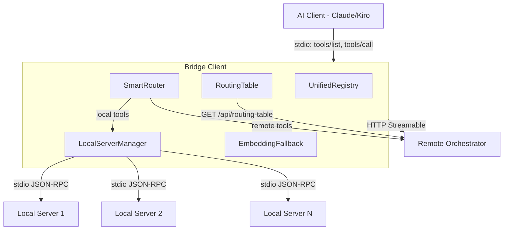
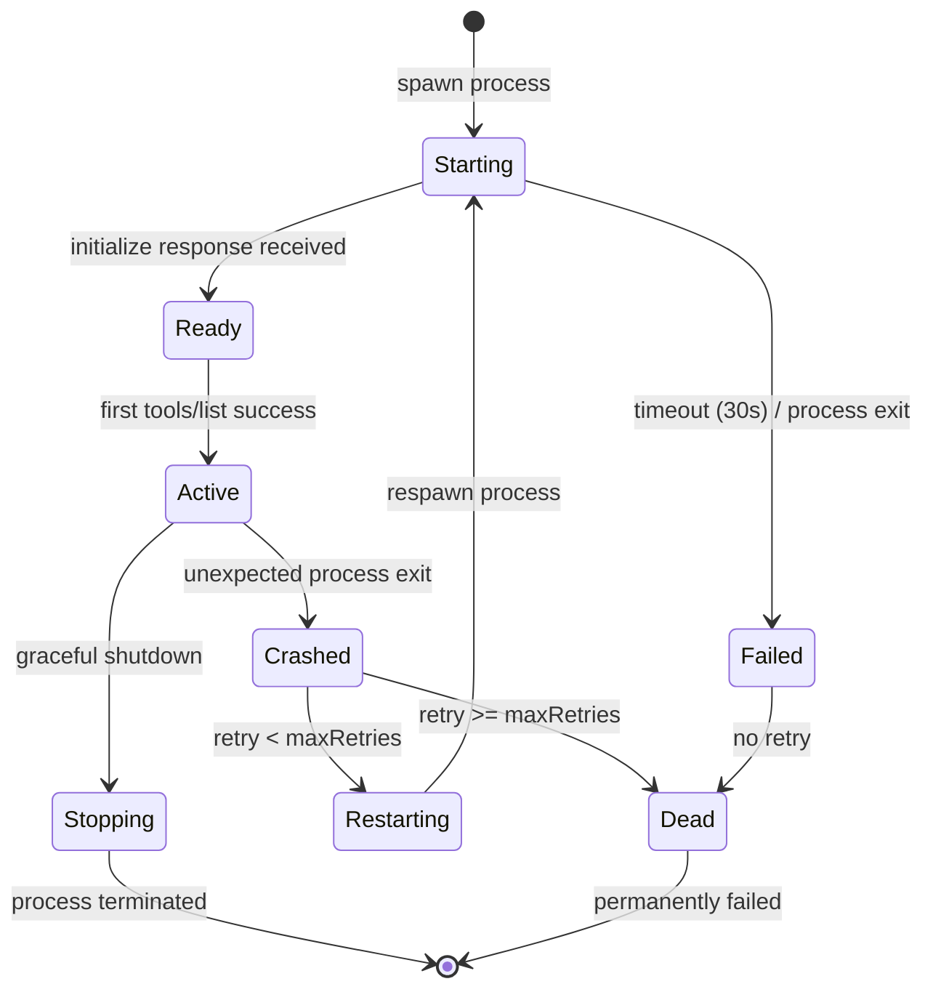
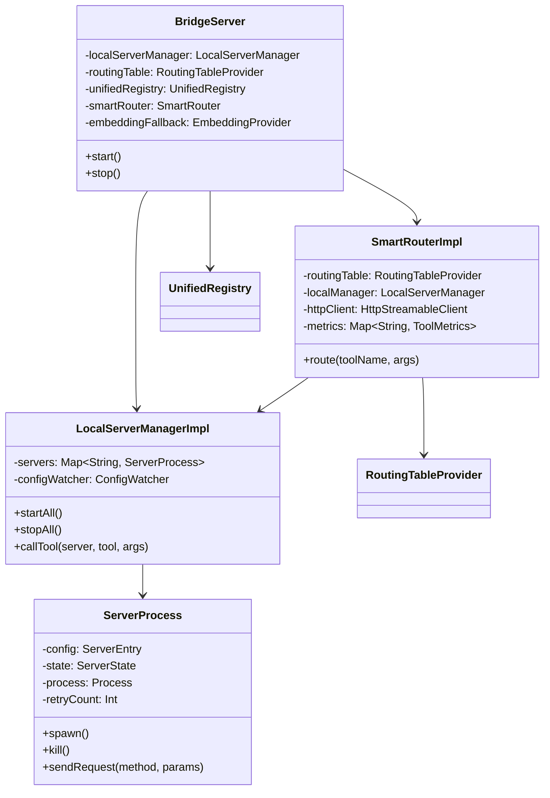
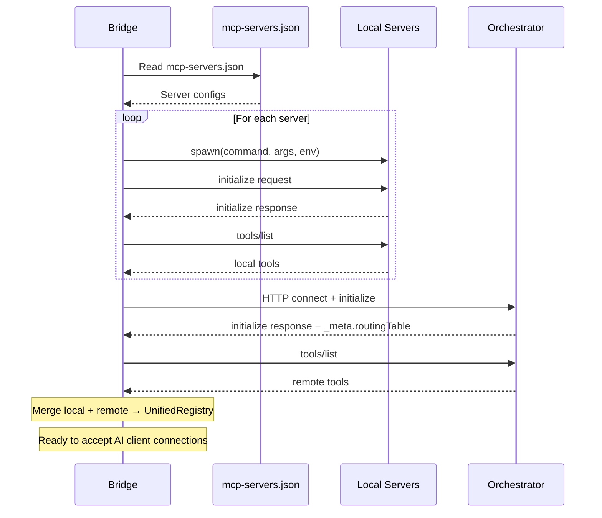
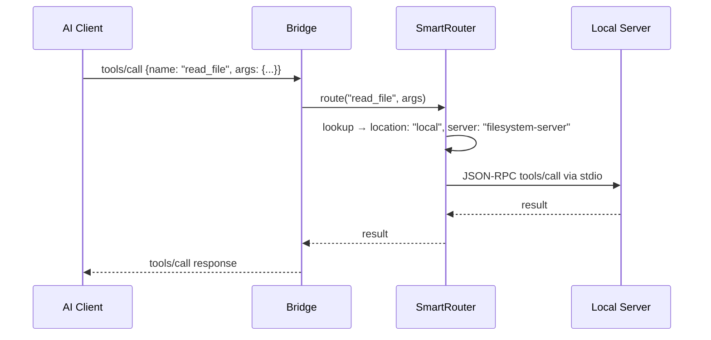

# Technical Design Document (TDD)

## MCP Tool Orchestration — MTO-131: Bridge Client Local MCP Server Management

---

## Document Information

| Field | Value |
|-------|-------|
| Jira Ticket | MTO-131 |
| Title | Bridge Client Local MCP Server Management |
| Author | SA Agent |
| Version | 1.0 |
| Date | 2026-07-06 |
| Status | Draft |
| Related BRD | documents/MTO-131/BRD.md |
| Related FSD | documents/MTO-131/FSD.md |

---

## 1. Introduction

### 1.1 Purpose

This TDD specifies the implementation design for local MCP server management across all three bridge clients (Node.js, Python, Kotlin). It covers process spawning, routing, tool merging, and embedding fallback.

### 1.2 Technology Stack

| Bridge | Language | Process API | File Watch | ONNX Runtime | MCP SDK |
|--------|----------|-------------|------------|--------------|---------|
| Node.js | TypeScript 5.x | `child_process.spawn` | `fs.watch` | `onnxruntime-node` | `@modelcontextprotocol/sdk` |
| Python | Python 3.10+ | `asyncio.create_subprocess_exec` | `watchfiles` | `onnxruntime` | `mcp` (PyPI) |
| Kotlin | Kotlin 2.3.20 / JVM 21 | `ProcessBuilder` | `java.nio.file.WatchService` | `com.microsoft.onnxruntime` | `io.modelcontextprotocol:kotlin-sdk` |

### 1.3 Design Principles

- **Consistent architecture** across all 3 bridges (same components, same state machine)
- **Interface/Impl pattern** — all core components are interfaces (testable, mockable)
- **Graceful degradation** — bridge works if any local server fails
- **Zero breaking changes** — new feature is additive to existing bridge API

### 1.4 Constraints

- Local servers are trusted (no auth for stdio communication)
- ONNX model download requires internet on first use only
- Bridge must remain a single-process application (no daemon)

---

## 2. System Architecture

### 2.1 Architecture Overview



### 2.2 Component Responsibilities

| Component | Responsibility | Implements |
|-----------|---------------|------------|
| `LocalServerManager` | Spawn, monitor, restart local MCP server processes | MTO-133 |
| `RoutingTable` | Fetch, cache, refresh tool→location mapping from orchestrator | MTO-132 |
| `UnifiedRegistry` | Merge local + remote tools into single tools/list | MTO-134 |
| `SmartRouter` | Route tools/call to correct destination (local stdio or remote HTTP) | MTO-135 |
| `EmbeddingFallback` | Provide local embedding when no remote embedding server available | MTO-136 |
| `ConfigWatcher` | Detect mcp-servers.json changes, trigger server restarts | MTO-133 |

### 2.3 Communication Patterns

| From | To | Protocol | Pattern |
|------|----|----------|---------|
| AI Client | Bridge | stdio JSON-RPC | Sync request/response |
| Bridge | Local MCP Server | stdio JSON-RPC | Sync request/response |
| Bridge | Remote Orchestrator | HTTP Streamable | Sync request/response |
| Orchestrator | Bridge | HTTP response `_meta` | Push (on initialize) |
| Bridge | Orchestrator | GET /api/routing-table | Poll (every 60s) |

---

## 3. API Design

### 3.1 Routing Table API (Orchestrator-side, new endpoint)

| Attribute | Value |
|-----------|-------|
| Method | GET |
| Path | `/api/routing-table` |
| Auth | Bearer Token (existing bridge token) |
| Cache | ETag + If-None-Match (304 Not Modified) |

**Response — 200 OK:**

```json
{
  "version": "1.0.0",
  "updatedAt": "2026-05-17T12:00:00Z",
  "defaultLocation": "remote",
  "tools": {
    "read_file": { "location": "local", "server": "filesystem-server" },
    "jira_search": { "location": "remote", "server": "atlassian" },
    "embed": { "location": "local", "server": "embedding-server", "fallback": "remote" }
  }
}
```

**Delivery mechanisms:**
1. `initialize` response → `_meta.routingTable` (primary, on connect)
2. `GET /api/routing-table` (refresh, polled every 60s)

### 3.2 Unified tools/list (Bridge → AI Client)

No API change. Existing `tools/list` handler returns merged tools from local + remote. Source metadata added to `_meta` for debugging only.

### 3.3 Routed tools/call (Bridge internal logic)

Existing `tools/call` handler enhanced with routing lookup:

```
1. name = request.params.name
2. route = SmartRouter.resolve(name)
3. if route.location == LOCAL → forward to LocalServerManager.call(route.server, request)
4. if route.location == REMOTE → proxy to HttpStreamableClient.callTool(name, args)
5. if route == null → return error "Tool not found: {name}"
```

---

## 4. State Machine — Server Lifecycle



| State | Description | Transitions |
|-------|-------------|-------------|
| `STARTING` | Process spawned, waiting for `initialize` response | → READY, → FAILED |
| `READY` | Initialized, querying tools | → ACTIVE |
| `ACTIVE` | Healthy, serving tool calls | → CRASHED, → STOPPING |
| `CRASHED` | Unexpected exit detected | → RESTARTING, → DEAD |
| `RESTARTING` | Backoff delay before respawn | → STARTING |
| `STOPPING` | Graceful shutdown in progress | → terminated |
| `DEAD` | Max retries exceeded, permanently failed | terminal |
| `FAILED` | Init timeout or immediate crash | → DEAD |

---

## 5. Class / Module Design

### 5.1 File Structure (per bridge)

```
bridge/src/
├── local/
│   ├── LocalServerManager.{ts,py,kt}    # Manages all local server processes
│   ├── ServerProcess.{ts,py,kt}         # Single server process + state machine
│   └── ConfigWatcher.{ts,py,kt}         # File watcher with debounce
├── routing/
│   ├── RoutingTable.{ts,py,kt}          # Fetch, cache, parse routing config
│   └── SmartRouter.{ts,py,kt}           # O(1) lookup + call forwarding
├── registry/
│   └── UnifiedRegistry.{ts,py,kt}       # Merge local + remote tool lists
└── embedding/
    ├── EmbeddingFallback.{ts,py,kt}     # Priority: MCP server > local ONNX
    └── OnnxInference.{ts,py,kt}         # ONNX Runtime wrapper
```

### 5.2 Key Interfaces (Kotlin example, same contract for all bridges)

```kotlin
interface LocalServerManager {
    suspend fun startAll()
    suspend fun stopAll()
    suspend fun callTool(serverName: String, toolName: String, args: JsonObject): JsonObject
    fun getTools(serverName: String): List<ToolDefinition>
    fun getAllTools(): List<ToolDefinition>
    fun getServerState(serverName: String): ServerState
}

interface RoutingTableProvider {
    suspend fun fetch(): RoutingTable
    suspend fun refresh()
    fun getCached(): RoutingTable
    fun resolve(toolName: String): ToolRoute?
}

interface UnifiedRegistry {
    fun merge(localTools: List<ToolDefinition>, remoteTools: List<ToolDefinition>): List<ToolDefinition>
    fun getAll(): List<ToolDefinition>
    fun refresh()
}

interface SmartRouter {
    suspend fun route(toolName: String, args: JsonObject): JsonObject
    fun getMetrics(): Map<String, ToolMetrics>
}

interface EmbeddingProvider {
    suspend fun embed(texts: List<String>): List<FloatArray>
    fun isAvailable(): Boolean
    fun dimensions(): Int  // 384
}
```

### 5.3 Class Diagram



### 5.4 Error Handling

| Exception | Condition | Recovery |
|-----------|-----------|----------|
| `ServerSpawnException` | Command not found / permission denied | Mark DEAD, log error |
| `ServerTimeoutException` | No initialize response in 30s | Mark FAILED, skip |
| `ServerCrashException` | Unexpected process exit | Retry with backoff |
| `RoutingTableException` | Malformed JSON / HTTP error | Keep cached version |
| `ToolNotFoundException` | Tool not in routing table | Return error to AI client |
| `LocalCallException` | Local server down + no fallback | Return error |
| `ModelDownloadException` | ONNX model download failed | Disable embedding |

---

## 6. Local Server Manager — Implementation Details

### 6.1 Process Spawning

| Bridge | API | stdin/stdout | Signal |
|--------|-----|-------------|--------|
| Node.js | `child_process.spawn(cmd, args, { stdio: ['pipe','pipe','pipe'], env })` | pipe | `process.kill(pid, 'SIGTERM')` |
| Python | `asyncio.create_subprocess_exec(cmd, *args, stdin=PIPE, stdout=PIPE, env=env)` | pipe | `process.terminate()` |
| Kotlin | `ProcessBuilder(cmd, *args).redirectErrorStream(false).start()` | pipe | `process.destroy()` / `destroyForcibly()` |

### 6.2 Health Monitoring

- **Heartbeat**: Send `tools/list` every 30s (configurable `healthCheckIntervalMs`)
- **Detection**: If no response in 5s → mark unhealthy
- **Action**: After 2 consecutive failures → trigger restart

### 6.3 Restart Policy

```
retryDelay = min(baseDelay * 2^retryCount, maxDelay)
baseDelay = 1000ms
maxDelay = 30000ms
maxRetries = 3 (configurable per server)
```

| Retry | Delay | Total elapsed |
|-------|-------|---------------|
| 1 | 1s | 1s |
| 2 | 2s | 3s |
| 3 | 4s | 7s |
| DEAD | — | — |

### 6.4 Graceful Shutdown Sequence

```
1. Send SIGTERM (or process.terminate())
2. Wait 5 seconds for process to exit
3. If still running → SIGKILL (or destroyForcibly())
4. Clean up stdio pipes
5. Remove tools from registry
```

### 6.5 Config Hot-Reload

```
1. ConfigWatcher monitors mcp-servers.json (fs.watch / watchfiles / WatchService)
2. On change → debounce 1 second (ignore rapid successive changes)
3. Parse new config → diff against current config
4. For each CHANGED server: stop old → start new
5. For each REMOVED server: stop
6. For each ADDED server: start
7. Trigger UnifiedRegistry.refresh()
```

---

## 7. Routing Table — Implementation Details

### 7.1 Fetch Strategy

```
Priority:
1. initialize response _meta.routingTable (on first connect)
2. GET /api/routing-table (poll every 60s)
3. Cached last-valid table (on disconnect)
```

### 7.2 Cache Strategy

| Scenario | Behavior |
|----------|----------|
| Fresh fetch success | Replace cache, update ETag |
| 304 Not Modified | Keep cache, reset poll timer |
| Fetch error (network) | Keep cache, log warning, retry next interval |
| Malformed response | Keep cache, log error |
| No cache + fetch error | Use `defaultLocation: "remote"` for all tools |

### 7.3 Refresh Triggers

1. Timer: every 60s (configurable `routing.refreshIntervalMs`)
2. On-demand: after local server restart (tools may have changed)
3. On-demand: manual refresh via bridge status API

---

## 8. Smart Router — Implementation Details

### 8.1 Lookup Algorithm

```typescript
// O(1) Map lookup
const route = routingTable.tools[toolName];
if (!route) {
  // Check defaultLocation
  if (routingTable.defaultLocation === "local") return callLocal(toolName, args);
  if (routingTable.defaultLocation === "remote") return callRemote(toolName, args);
  throw new ToolNotFoundException(toolName);
}
if (route.location === "local") return callLocal(route.server, toolName, args);
if (route.location === "remote") return callRemote(toolName, args);
```

### 8.2 Fallback Logic

```
if (route.fallback && localCallFailed) {
  if (route.fallback === "remote") return callRemote(toolName, args);
  if (route.fallback === "local") return callLocal(toolName, args);
}
```

### 8.3 Metrics Collection

```kotlin
data class ToolMetrics(
    val callCount: Long = 0,
    val errorCount: Long = 0,
    val totalLatencyMs: Long = 0,
    val lastCallAt: Instant? = null
) {
    val avgLatencyMs: Long get() = if (callCount > 0) totalLatencyMs / callCount else 0
}
```

---

## 9. Unified Registry — Merge Algorithm

```
1. Collect local tools: for each active local server → tools/list → flatten
2. Collect remote tools: from orchestrator tools/list response
3. Build merged map (key = tool name):
   - If tool exists in both local and remote:
     - conflictResolution == "local-first" → keep local (default)
     - conflictResolution == "remote-first" → keep remote
     - conflictResolution == "priority" → compare route.priority field
4. Return merged list (no duplicates)
```

---

## 10. Embedding Fallback — Implementation Details

### 10.1 Priority Chain

```
1. Check: is "embed" tool available in local MCP servers? → use it
2. Check: is ONNX model cached at ~/.mcp-bridge/models/all-MiniLM-L6-v2/? → load + infer
3. Download model from HuggingFace → cache → load → infer
4. If all fail → disable embedding, log error
```

### 10.2 ONNX Runtime Configuration

| Property | Value |
|----------|-------|
| Model | `all-MiniLM-L6-v2` (ONNX format) |
| Size | ~80MB (model + tokenizer) |
| Output dimensions | 384 |
| Max batch size | 32 texts |
| Max sequence length | 256 tokens |
| Cache path | `~/.mcp-bridge/models/all-MiniLM-L6-v2/` |
| Download URL | `https://huggingface.co/sentence-transformers/all-MiniLM-L6-v2/resolve/main/onnx/model.onnx` |

### 10.3 Per-Bridge Runtime

| Bridge | Package | Tokenizer |
|--------|---------|-----------|
| Node.js | `onnxruntime-node` | `tokenizer.json` (included) |
| Python | `onnxruntime` | `tokenizers` (HuggingFace) |
| Kotlin | `com.microsoft.onnxruntime:onnxruntime:1.18+` | `tokenizer.json` (manual) |

### 10.4 Inference Pipeline

```
1. Tokenize input texts (WordPiece, max 256 tokens, pad/truncate)
2. Create ONNX input tensors: input_ids, attention_mask, token_type_ids
3. Run inference session
4. Extract last_hidden_state → mean pooling → normalize
5. Return float[texts.length][384]
```

---

## 11. Configuration

### 11.1 mcp-servers.json (User config, per-project or global)

```json
{
  "mcpServers": {
    "filesystem-server": {
      "command": "node",
      "args": ["node_modules/@anthropic-ai/mcp-filesystem/dist/index.js", "/workspace"],
      "env": {},
      "timeout": 30000,
      "maxRetries": 3
    },
    "database-mcp": {
      "command": "python",
      "args": ["-m", "mcp_database", "--db", "sqlite:///local.db"],
      "disabled": false
    }
  }
}
```

**Config search order:** `./mcp-servers.json` → `~/.mcp-bridge/mcp-servers.json`

### 11.2 Bridge Config Additions (CLI args / env vars)

| Arg | Env Var | Default | Description |
|-----|---------|---------|-------------|
| `--local-servers` | `MCP_LOCAL_SERVERS` | `true` | Enable local server management |
| `--config-path` | `MCP_CONFIG_PATH` | `./mcp-servers.json` | Path to mcp-servers.json |
| `--health-interval` | `MCP_HEALTH_INTERVAL` | `30000` | Health check interval (ms) |
| `--routing-refresh` | `MCP_ROUTING_REFRESH` | `60000` | Routing table refresh interval (ms) |
| `--embedding-model` | `MCP_EMBEDDING_MODEL` | `all-MiniLM-L6-v2` | Fallback embedding model |
| `--model-cache` | `MCP_MODEL_CACHE` | `~/.mcp-bridge/models/` | Model cache directory |

### 11.3 Orchestrator Config Addition (application.yml)

```yaml
routing:
  enabled: true
  refreshIntervalMs: 60000
  localServers:
    - name: filesystem-server
      tools: [read_file, write_file, list_directory]
    - name: database-mcp
      tools: [execute_sql, list_tables]
```

---

## 12. Sequence Diagrams

### 12.1 Startup Sequence



### 12.2 Tool Call — Local Path



---

## 13. Performance & Scalability

### 13.1 Performance Targets

| Operation | Target | How |
|-----------|--------|-----|
| Local tool call (bridge overhead) | < 5ms | Direct stdio pipe, no serialization overhead |
| Routing lookup | < 1ms | O(1) Map/Dict lookup |
| Embedding (single text) | < 100ms | ONNX Runtime optimized |
| Embedding (batch 32) | < 500ms | Batched inference |
| Config reload | < 2s | Only restart changed servers |
| Startup (5 servers) | < 10s | Parallel spawn + init |

### 13.2 Memory Budget

| Component | Estimate |
|-----------|----------|
| Per local server process | 20-100MB (depends on server) |
| ONNX model loaded | ~150MB (model + runtime) |
| Routing table cache | < 1KB |
| Tool registry | < 10KB |
| Bridge base (no servers) | ~50MB |

---

## 14. Testing Strategy

### 14.1 Unit Tests

| Component | Test Focus | Mock |
|-----------|-----------|------|
| `SmartRouter` | Routing logic, fallback, metrics | Mock LocalServerManager, HttpClient |
| `UnifiedRegistry` | Merge algorithm, conflict resolution | Mock tool lists |
| `RoutingTable` | Parse, cache, refresh logic | Mock HTTP responses |
| `ServerProcess` | State machine transitions | Mock process spawn |
| `ConfigWatcher` | Debounce, diff detection | Mock filesystem |
| `EmbeddingFallback` | Priority chain, batch handling | Mock ONNX session |

### 14.2 Integration Tests

| Test | Setup | Validates |
|------|-------|-----------|
| Local server spawn + call | Real MCP server (echo-server) | Full stdio lifecycle |
| Routing table fetch | Mock HTTP server | ETag caching, refresh |
| Unified tools/list | Real local + mock remote | Merge correctness |
| Embedding inference | Real ONNX model | Output dimensions = 384 |

---

## 15. Deployment & Rollout

### 15.1 Feature Flags

| Flag | Default | Description |
|------|---------|-------------|
| `--local-servers` | `true` | Master switch for local server feature |
| `--embedding-fallback` | `true` | Enable/disable ONNX embedding |
| `--config-watch` | `true` | Enable/disable hot-reload |

### 15.2 Rollout Plan

1. **Phase 1**: Node.js bridge (MTO-137) — most users, fastest iteration
2. **Phase 2**: Python bridge (MTO-138) — asyncio implementation
3. **Phase 3**: Kotlin bridge (MTO-139) — coroutine implementation
4. **Phase 4**: Orchestrator routing table endpoint (MTO-132)

### 15.3 Backward Compatibility

- Bridges without `mcp-servers.json` → no local servers spawned, 100% remote (existing behavior)
- Orchestrator without `/api/routing-table` → all tools treated as remote (existing behavior)
- No breaking changes to existing `tools/list` or `tools/call` contracts

---

## 16. Open Questions

| # | Question | Status | Answer |
|---|----------|--------|--------|
| 1 | Should routing table support regex patterns for tool names? | Open | — |
| 2 | Should bridge expose a local HTTP status endpoint for monitoring? | Open | — |
| 3 | Should ONNX model auto-update when new version available? | Resolved | No — manual update only |
