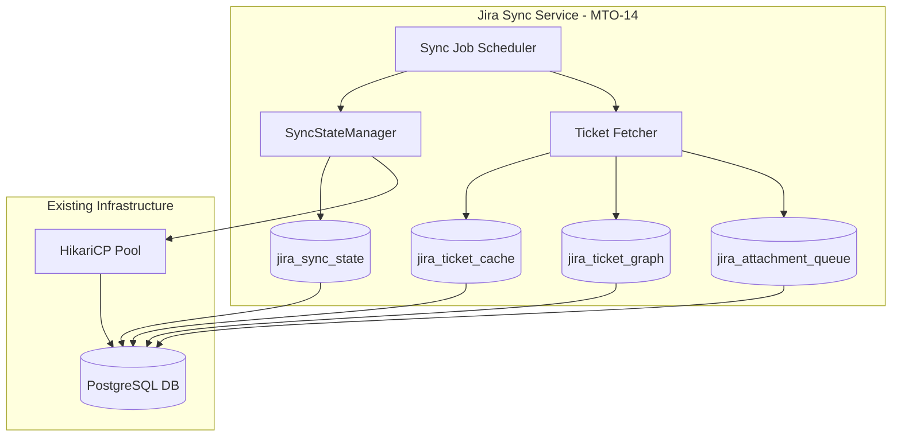
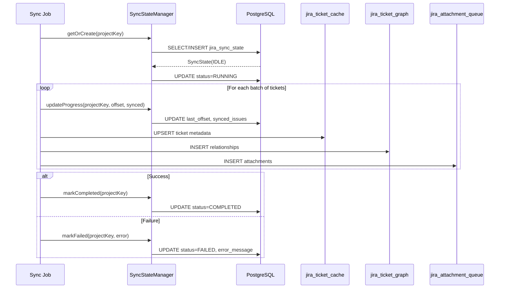
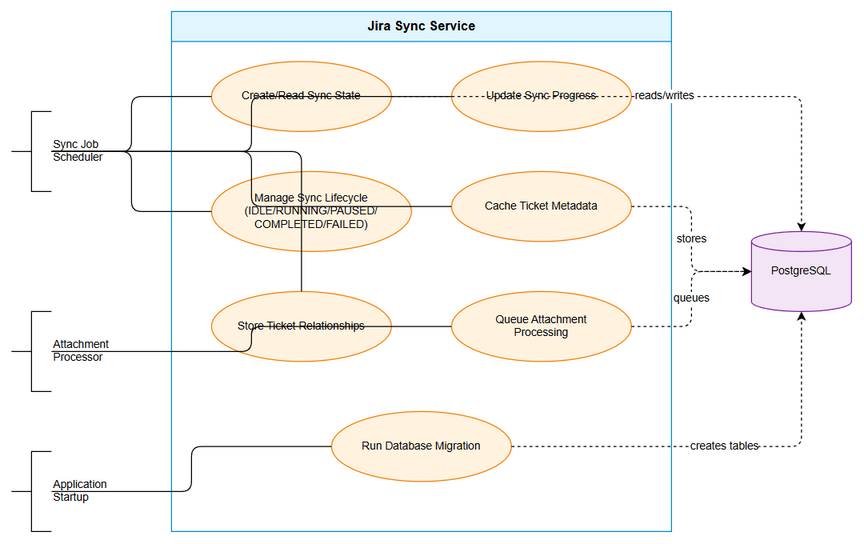
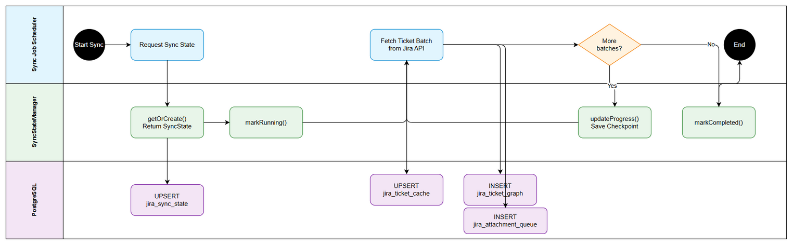
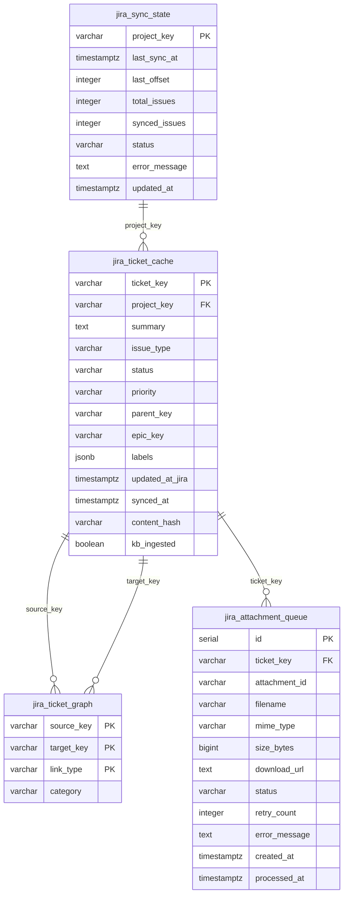
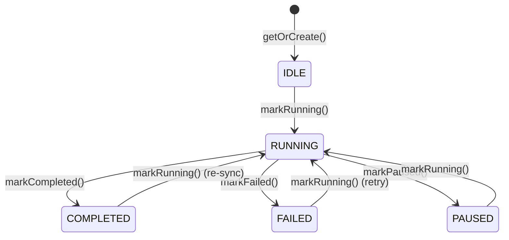

# Business Requirements Document (BRD)

## Jira Project Sync Service — MTO-15: Database Schema & Sync State Management

---

## Document Information

| Field | Value |
|-------|-------|
| Jira Ticket | MTO-15 |
| Title | Database Schema & Sync State Management |
| Author | BA Agent |
| Version | 1.0 |
| Date | 2025-07-14 |
| Status | Draft |
| Parent Epic | MTO-14 — Jira Project Sync Service: Background Job for Automated KB Ingestion |

---

## Author Tracking

| Role | Name - Position | Responsibility |
|------|-----------------|----------------|
| Author | BA Agent – Business Analyst | Create document |
| Peer Reviewer | SA Agent – Solution Architect | Review document |

---

## Revision History

| Version | Date | Author | Changes |
|---------|------|--------|---------|
| 1.0 | 2025-07-14 | BA Agent | Initiate document — auto-generated from Jira ticket MTO-15 and epic MTO-14 context |

---

## Sign-Off

| Name | Signature and date |
|------|--------------------|
| | ☐ I agree and confirm all criteria on this BRD as expected requirements |
| | ☐ I agree and confirm all criteria on this BRD as expected requirements |

---

## 1. Introduction

### 1.1 Scope

This document defines the business requirements for designing and implementing the database schema and sync state management layer for the Jira Project Sync Service (Epic MTO-14). The scope includes:

- **4 PostgreSQL tables** to support resumable synchronization, ticket caching, relationship graphing, and attachment processing
- **SyncStateManager class** (Kotlin) providing a programmatic interface for managing sync lifecycle states
- **Database migration scripts** following the existing project pattern (manual SQL via HikariCP, similar to `V2__create_file_proxy_registry.sql`)
- **Performance indexes** for efficient querying by project key, status, and timestamps

This is a **foundational story** — it provides the data persistence layer that all other MTO-14 stories depend on.

### 1.2 Out of Scope

- Jira API integration and data fetching logic (separate story under MTO-14)
- Knowledge Base ingestion pipeline (separate story under MTO-14)
- Background job scheduling and orchestration (separate story under MTO-14)
- UI/dashboard for monitoring sync progress
- Multi-tenant or multi-database support
- Data archival or purging strategies (may be addressed in future iterations)

### 1.3 Preliminary Requirement

- PostgreSQL database instance is available and accessible (already in use by the project for `server_config`, `tool_toggle_state`, `file_proxy_registry` tables)
- HikariCP connection pool is configured and operational (existing in `orchestrator-server` module)
- Kotlin 2.3.20 + Ktor 3.4.0 runtime environment (existing project stack)
- Koin DI framework for service registration (existing pattern)

---

## 2. Business Requirements

### 2.1 High Level Process Map

The Database Schema & Sync State Management provides the persistence foundation for the Jira Project Sync Service. It enables:

1. **Resumable synchronization** — Track sync progress so interrupted jobs can resume from the last checkpoint
2. **Ticket metadata caching** — Store Jira ticket data locally to avoid redundant API calls and enable offline analysis
3. **Relationship visualization** — Maintain a graph of ticket relationships for dependency analysis and visualization
4. **Attachment processing** — Queue and track attachment downloads/processing with retry capability

*[Edit in draw.io](diagrams/use-case.drawio)*

*[Edit in draw.io](diagrams/business-flow.drawio)*

### 2.2 List of User Stories / Use Cases

| # | Story / Use Case | Priority | Source Ticket |
|---|------------------|----------|---------------|
| 1 | As a Sync Service, I want a `jira_sync_state` table so that I can track and resume synchronization progress per project | MUST HAVE | MTO-15 |
| 2 | As a Sync Service, I want a `jira_ticket_cache` table so that I can store ticket metadata locally and detect changes via content hashing | MUST HAVE | MTO-15 |
| 3 | As a Sync Service, I want a `jira_ticket_graph` table so that I can persist ticket relationships for dependency visualization | MUST HAVE | MTO-15 |
| 4 | As a Sync Service, I want a `jira_attachment_queue` table so that I can queue and track attachment processing with retry support | MUST HAVE | MTO-15 |
| 5 | As a Sync Service, I want a SyncStateManager class so that I can programmatically manage sync lifecycle transitions | MUST HAVE | MTO-15 |
| 6 | As a Sync Service, I want database migration scripts so that the schema is created automatically on startup | MUST HAVE | MTO-15 |
| 7 | As a Sync Service, I want performance indexes so that queries by project_key, status, and timestamps are efficient | SHOULD HAVE | MTO-15 |

---

### 2.3 Details of User Stories

---

#### Business Flow

The database schema supports the following end-to-end sync lifecycle:

**Step 1:** Sync Job is triggered (manually or by scheduler) for a specific Jira project key.

**Step 2:** SyncStateManager retrieves or creates a sync state record for the project. If a previous sync was interrupted (status = PAUSED/FAILED), it reads the `last_offset` to determine where to resume.

**Step 3:** SyncStateManager transitions the state to RUNNING.

**Step 4:** For each batch of tickets fetched from Jira API:
- Ticket metadata is upserted into `jira_ticket_cache` with a `content_hash` for change detection
- Ticket relationships are inserted into `jira_ticket_graph`
- Attachments are queued in `jira_attachment_queue` with status PENDING
- Progress checkpoint is updated in `jira_sync_state` (offset + synced count)

**Step 5:** On successful completion, state transitions to COMPLETED. On failure, state transitions to FAILED with error message.

**Step 6:** Attachment processor picks up PENDING items from the queue, downloads/processes them, and updates status to DONE or FAILED (with retry_count increment).

> **Note:** The SyncStateManager provides atomic state transitions to prevent race conditions when multiple operations attempt to modify the same project's sync state.

---

#### STORY 1: Sync State Table (jira_sync_state)

> As a Sync Service, I want a `jira_sync_state` table so that I can track and resume synchronization progress per project.

**Requirement Details:**

1. The table must store one record per Jira project, using `project_key` as the primary key
2. Must track the last successful sync timestamp (`last_sync_at`) for incremental sync
3. Must store a resumable checkpoint (`last_offset`) so interrupted syncs can continue from where they stopped
4. Must track total issues in the project and how many have been synced for progress reporting
5. Must maintain a status field with defined lifecycle states: IDLE → RUNNING → COMPLETED/FAILED/PAUSED
6. Must store error messages when sync fails for debugging purposes
7. Must track when the record was last updated (`updated_at`) for staleness detection

**Data Fields:**

| Field | Type | Required | Description | Example |
|-------|------|----------|-------------|---------|
| project_key | VARCHAR(50) | Yes (PK) | Jira project key identifier | `MTO` |
| last_sync_at | TIMESTAMPTZ | No | Timestamp of last successful sync completion | `2025-07-14T10:30:00Z` |
| last_offset | INTEGER | Yes | Resumable checkpoint — last processed offset | `150` |
| total_issues | INTEGER | Yes | Total number of issues in the project | `342` |
| synced_issues | INTEGER | Yes | Number of issues successfully synced | `150` |
| status | VARCHAR(20) | Yes | Current sync lifecycle state | `RUNNING` |
| error_message | TEXT | No | Error details when status is FAILED | `Connection timeout after 30s` |
| updated_at | TIMESTAMPTZ | Yes | Last modification timestamp (auto-updated) | `2025-07-14T10:35:00Z` |

**Acceptance Criteria:**

1. Table is created with `project_key` as PRIMARY KEY
2. `status` field has a CHECK constraint limiting values to: `IDLE`, `RUNNING`, `PAUSED`, `COMPLETED`, `FAILED`
3. `last_offset` defaults to 0 for new records
4. `total_issues` and `synced_issues` default to 0
5. `status` defaults to `IDLE` for new records
6. `updated_at` defaults to `NOW()` and is updated on every modification
7. Table creation is idempotent (`CREATE TABLE IF NOT EXISTS`)

**Validation Rules:**

- `project_key` must be non-empty, max 50 characters
- `last_offset` must be >= 0
- `total_issues` must be >= 0
- `synced_issues` must be >= 0 and <= `total_issues`
- `status` must be one of the defined enum values

**Error Handling:**

- Duplicate `project_key` insert: Use `ON CONFLICT DO NOTHING` or handle at application level
- Invalid status transition: SyncStateManager enforces valid transitions (e.g., cannot go from COMPLETED to RUNNING without resetting)

---

#### STORY 2: Ticket Cache Table (jira_ticket_cache)

> As a Sync Service, I want a `jira_ticket_cache` table so that I can store ticket metadata locally and detect changes via content hashing.

**Requirement Details:**

1. The table must cache essential Jira ticket metadata to avoid redundant API calls
2. Must use `ticket_key` as primary key (e.g., `MTO-15`)
3. Must store the `project_key` for filtering tickets by project
4. Must include a `content_hash` (SHA-256) to detect whether a ticket has changed since last sync
5. Must track whether the ticket has been ingested into the Knowledge Base (`kb_ingested` flag)
6. Must store the Jira-side `updated_at` timestamp for incremental sync queries
7. Must support JSONB storage for multi-value fields like labels

**Data Fields:**

| Field | Type | Required | Description | Example |
|-------|------|----------|-------------|---------|
| ticket_key | VARCHAR(50) | Yes (PK) | Jira issue key | `MTO-15` |
| project_key | VARCHAR(50) | Yes | Parent project key | `MTO` |
| summary | TEXT | Yes | Issue summary/title | `Database Schema & Sync State Management` |
| issue_type | VARCHAR(50) | Yes | Issue type | `Story` |
| status | VARCHAR(50) | Yes | Current Jira status | `In Progress` |
| priority | VARCHAR(20) | No | Issue priority | `High` |
| parent_key | VARCHAR(50) | No | Parent issue key (for subtasks) | `MTO-14` |
| epic_key | VARCHAR(50) | No | Epic link key | `MTO-14` |
| labels | JSONB | No | Array of labels | `["backend", "database", "foundation"]` |
| updated_at_jira | TIMESTAMPTZ | Yes | Last update time in Jira | `2025-07-14T08:00:00Z` |
| synced_at | TIMESTAMPTZ | Yes | When this record was last synced | `2025-07-14T10:30:00Z` |
| content_hash | VARCHAR(64) | Yes | SHA-256 hash of ticket content for change detection | `a1b2c3d4...` |
| kb_ingested | BOOLEAN | Yes | Whether ticket has been ingested into KB | `false` |

**Acceptance Criteria:**

1. Table is created with `ticket_key` as PRIMARY KEY
2. `project_key` is indexed for efficient project-level queries
3. `labels` field uses JSONB type for flexible array storage
4. `content_hash` is VARCHAR(64) to store SHA-256 hex string
5. `kb_ingested` defaults to `FALSE`
6. `synced_at` defaults to `NOW()`
7. UPSERT operations (INSERT ... ON CONFLICT UPDATE) work correctly for re-syncing existing tickets

**Validation Rules:**

- `ticket_key` must match pattern `[A-Z]+-\d+`
- `project_key` must be non-empty
- `content_hash` must be exactly 64 characters (SHA-256 hex)
- `labels` must be a valid JSON array or NULL

**Error Handling:**

- Hash collision (extremely unlikely with SHA-256): Log warning, proceed with update
- Invalid JSONB in labels: Reject insert, log error with ticket key

---

#### STORY 3: Ticket Graph Table (jira_ticket_graph)

> As a Sync Service, I want a `jira_ticket_graph` table so that I can persist ticket relationships for dependency visualization.

**Requirement Details:**

1. The table must store directed relationships between Jira tickets
2. Must use a composite primary key of (`source_key`, `target_key`, `link_type`) to prevent duplicate relationships
3. Must categorize relationships for filtering (e.g., `INWARD`, `OUTWARD`, `SUBTASK`)
4. Must support common Jira link types: blocks, is blocked by, relates to, duplicates, is duplicated by, parent/child
5. Must enable graph traversal queries for visualization tools

**Data Fields:**

| Field | Type | Required | Description | Example |
|-------|------|----------|-------------|---------|
| source_key | VARCHAR(50) | Yes (PK) | Source ticket key | `MTO-15` |
| target_key | VARCHAR(50) | Yes (PK) | Target ticket key | `MTO-14` |
| link_type | VARCHAR(100) | Yes (PK) | Jira link type name | `is child of` |
| category | VARCHAR(20) | Yes | Relationship category | `INWARD` |

**Acceptance Criteria:**

1. Composite PRIMARY KEY on (`source_key`, `target_key`, `link_type`)
2. `category` has a CHECK constraint: `INWARD`, `OUTWARD`, `SUBTASK`, `EPIC`
3. Index on `source_key` for forward traversal queries
4. Index on `target_key` for reverse traversal queries
5. UPSERT support for re-syncing relationships without duplicates
6. Table creation is idempotent

**Validation Rules:**

- `source_key` and `target_key` must match pattern `[A-Z]+-\d+`
- `source_key` must not equal `target_key` (no self-referencing)
- `link_type` must be non-empty
- `category` must be one of the defined values

**Error Handling:**

- Duplicate relationship insert: Use `ON CONFLICT DO NOTHING`
- Orphaned relationships (ticket deleted from cache): Handled by periodic cleanup job (future story)

---

#### STORY 4: Attachment Queue Table (jira_attachment_queue)

> As a Sync Service, I want a `jira_attachment_queue` table so that I can queue and track attachment processing with retry support.

**Requirement Details:**

1. The table must queue attachments discovered during ticket sync for asynchronous processing
2. Must use an auto-incrementing `id` as primary key (SERIAL)
3. Must track processing status with lifecycle: PENDING → DOWNLOADING → PROCESSING → DONE/FAILED
4. Must support retry logic with a `retry_count` field
5. Must store attachment metadata (filename, MIME type, size) for filtering and prioritization
6. Must store the download URL for the attachment processor to retrieve the file

**Data Fields:**

| Field | Type | Required | Description | Example |
|-------|------|----------|-------------|---------|
| id | SERIAL | Yes (PK) | Auto-increment identifier | `1` |
| ticket_key | VARCHAR(50) | Yes | Parent ticket key | `MTO-15` |
| attachment_id | VARCHAR(50) | Yes | Jira attachment ID | `10234` |
| filename | VARCHAR(500) | Yes | Original filename | `architecture-diagram.png` |
| mime_type | VARCHAR(100) | No | MIME content type | `image/png` |
| size_bytes | BIGINT | No | File size in bytes | `245760` |
| download_url | TEXT | Yes | URL to download the attachment | `https://jira.example.com/...` |
| status | VARCHAR(20) | Yes | Processing lifecycle state | `PENDING` |
| retry_count | INTEGER | Yes | Number of retry attempts | `0` |
| error_message | TEXT | No | Error details on failure | `Download timeout` |
| created_at | TIMESTAMPTZ | Yes | When the queue entry was created | `2025-07-14T10:30:00Z` |
| processed_at | TIMESTAMPTZ | No | When processing completed | `2025-07-14T10:35:00Z` |

**Acceptance Criteria:**

1. `id` is SERIAL PRIMARY KEY (auto-increment)
2. `status` has CHECK constraint: `PENDING`, `DOWNLOADING`, `PROCESSING`, `DONE`, `FAILED`
3. `retry_count` defaults to 0
4. `status` defaults to `PENDING`
5. `created_at` defaults to `NOW()`
6. Index on `status` for queue polling (find PENDING items)
7. Index on `ticket_key` for finding all attachments of a ticket
8. Unique constraint on (`ticket_key`, `attachment_id`) to prevent duplicate queue entries

**Validation Rules:**

- `ticket_key` must match pattern `[A-Z]+-\d+`
- `attachment_id` must be non-empty
- `filename` must be non-empty, max 500 characters
- `size_bytes` must be >= 0 when provided
- `retry_count` must be >= 0
- `download_url` must be a valid URL format

**Error Handling:**

- Duplicate attachment queue entry: Use `ON CONFLICT DO NOTHING` on unique constraint
- Max retry exceeded: Application logic caps retries (not enforced at DB level)
- Invalid MIME type: Store as-is, validation at application level

---

#### STORY 5: SyncStateManager Class

> As a Sync Service, I want a SyncStateManager class so that I can programmatically manage sync lifecycle transitions.

**Requirement Details:**

1. Must provide a Kotlin class/interface following the existing Interface/Impl pattern in the project
2. Must expose the following methods:
   - `getOrCreate(projectKey: String): SyncState` — Retrieve existing state or create new with IDLE status
   - `updateProgress(projectKey: String, offset: Int, synced: Int)` — Update checkpoint atomically
   - `markRunning(projectKey: String)` — Transition to RUNNING state
   - `markPaused(projectKey: String)` — Transition to PAUSED state
   - `markCompleted(projectKey: String)` — Transition to COMPLETED, update `last_sync_at`
   - `markFailed(projectKey: String, error: String)` — Transition to FAILED, store error message
3. Must use coroutines with `Dispatchers.IO` for database operations (existing pattern)
4. Must use HikariDataSource for connection management (existing pattern)
5. Must be registered in Koin DI module (existing pattern)
6. Must enforce valid state transitions (e.g., cannot mark COMPLETED if not RUNNING)

**Data Fields (SyncState data class):**

| Field | Type | Required | Description | Example |
|-------|------|----------|-------------|---------|
| projectKey | String | Yes | Jira project key | `MTO` |
| lastSyncAt | Instant? | No | Last successful sync time | `2025-07-14T10:30:00Z` |
| lastOffset | Int | Yes | Current checkpoint offset | `150` |
| totalIssues | Int | Yes | Total issues in project | `342` |
| syncedIssues | Int | Yes | Issues synced so far | `150` |
| status | SyncStatus | Yes | Current lifecycle state | `RUNNING` |
| errorMessage | String? | No | Error details | `null` |
| updatedAt | Instant | Yes | Last modification time | `2025-07-14T10:35:00Z` |

**Acceptance Criteria:**

1. `getOrCreate` returns existing record if project_key exists, otherwise creates new record with defaults
2. `updateProgress` atomically updates `last_offset`, `synced_issues`, and `updated_at`
3. `markRunning` only succeeds if current status is IDLE, PAUSED, or FAILED (allows retry)
4. `markPaused` only succeeds if current status is RUNNING
5. `markCompleted` only succeeds if current status is RUNNING, also sets `last_sync_at = NOW()`
6. `markFailed` only succeeds if current status is RUNNING or DOWNLOADING
7. All methods update `updated_at` timestamp
8. Invalid state transitions throw an appropriate exception
9. All database operations use `withContext(Dispatchers.IO)` for non-blocking execution

**Validation Rules:**

- `projectKey` must be non-empty, max 50 characters
- `offset` must be >= 0
- `synced` must be >= 0
- `error` message must be non-empty when marking failed

**Error Handling:**

- Project not found in `getOrCreate`: Create new record (never throws for missing project)
- Invalid state transition: Throw `IllegalStateException` with descriptive message
- Database connection failure: Let exception propagate (caller handles retry via RetryUtils)
- Concurrent modification: Use optimistic locking or `WHERE status = expected_status` in UPDATE

---

#### STORY 6: Database Migration Scripts

> As a Sync Service, I want database migration scripts so that the schema is created automatically on startup.

**Requirement Details:**

1. Must follow the existing migration pattern in the project (manual SQL scripts executed via HikariCP on startup)
2. Must be idempotent — safe to run multiple times (`CREATE TABLE IF NOT EXISTS`, `CREATE INDEX IF NOT EXISTS`)
3. Must be placed in the standard location: `orchestrator-server/src/main/resources/db/`
4. Must follow the naming convention: `V{N}__create_jira_sync_tables.sql`
5. Must include table comments for documentation
6. Must include all indexes defined in the table specifications

**Acceptance Criteria:**

1. Migration script creates all 4 tables with correct schemas
2. All CHECK constraints are applied
3. All indexes are created
4. Script is idempotent (can run multiple times without error)
5. Script follows existing naming convention (`V{N}__description.sql`)
6. Table and column comments are included
7. Migration is executed during application startup (integrated with existing DatabaseInitializer pattern)

**Validation Rules:**

- SQL syntax must be valid PostgreSQL 14+
- All table/column names use snake_case
- All constraints have explicit names (e.g., `chk_sync_status`, `pk_jira_sync_state`)

---

#### STORY 7: Performance Indexes

> As a Sync Service, I want performance indexes so that queries by project_key, status, and timestamps are efficient.

**Requirement Details:**

1. Must create indexes that support the primary query patterns:
   - Find sync state by project_key (covered by PK)
   - Find all tickets for a project (`jira_ticket_cache.project_key`)
   - Find tickets updated after a timestamp (`jira_ticket_cache.updated_at_jira`)
   - Find tickets not yet ingested into KB (`jira_ticket_cache.kb_ingested`)
   - Find pending attachments (`jira_attachment_queue.status`)
   - Find attachments for a ticket (`jira_attachment_queue.ticket_key`)
   - Graph traversal by source/target (`jira_ticket_graph.source_key`, `target_key`)
2. Must use partial indexes where appropriate (e.g., `WHERE kb_ingested = FALSE`)

**Data Fields (Index Specifications):**

| Table | Index Name | Columns | Type | Condition |
|-------|-----------|---------|------|-----------|
| jira_ticket_cache | idx_ticket_cache_project | project_key | B-tree | — |
| jira_ticket_cache | idx_ticket_cache_updated | updated_at_jira | B-tree | — |
| jira_ticket_cache | idx_ticket_cache_not_ingested | kb_ingested | Partial | WHERE kb_ingested = FALSE |
| jira_ticket_graph | idx_ticket_graph_source | source_key | B-tree | — |
| jira_ticket_graph | idx_ticket_graph_target | target_key | B-tree | — |
| jira_attachment_queue | idx_attachment_queue_status | status | B-tree | — |
| jira_attachment_queue | idx_attachment_queue_ticket | ticket_key | B-tree | — |
| jira_attachment_queue | idx_attachment_queue_pending | status, created_at | Partial | WHERE status = 'PENDING' |

**Acceptance Criteria:**

1. All indexes are created with `CREATE INDEX IF NOT EXISTS`
2. Partial indexes use appropriate WHERE clauses
3. Index names follow convention: `idx_{table_short}_{column(s)}`
4. No duplicate indexes on primary key columns
5. Indexes do not significantly impact write performance for the expected workload (< 1000 tickets per project)

---

## 3. Dependencies

| Dependency | Type | Related Ticket | Description |
|------------|------|----------------|-------------|
| PostgreSQL Database | Infrastructure | N/A | Existing PostgreSQL instance used by the project (server_config, tool_toggle_state, file_proxy_registry tables already exist) |
| HikariCP Connection Pool | Infrastructure | N/A | Existing connection pool configured in orchestrator-server module |
| Koin DI Framework | System | N/A | Existing DI framework for registering SyncStateManager |
| kotlinx.coroutines | System | N/A | Existing coroutines library for async database operations |
| kotlinx.datetime | System | N/A | Existing date/time library for Instant types |

---

## 4. Stakeholders

| Role | Name / Team | Responsibility | Source |
|------|-------------|----------------|--------|
| Developer | Dev Agent | Implement database schema and SyncStateManager class | Ticket assignee |
| Solution Architect | SA Agent | Review schema design, validate patterns | Technical review |
| QA | QA Agent | Verify migration scripts, test state transitions | Quality assurance |
| DevOps | DevOps Agent | Ensure migration runs in CI/CD pipeline | Deployment |

---

## 5. Risks and Assumptions

### 5.1 Risks

| Risk | Impact | Likelihood | Mitigation |
|------|--------|------------|------------|
| Concurrent sync jobs for same project cause race conditions | High | Medium | Use optimistic locking (WHERE status = expected) in state transitions |
| Large projects (>10K tickets) cause memory pressure during sync | Medium | Low | Batch processing with configurable batch size; checkpoint after each batch |
| Schema migration fails on existing database with conflicting table names | High | Low | Use IF NOT EXISTS; check for existing tables before creation |
| Attachment queue grows unbounded for projects with many attachments | Medium | Medium | Implement TTL cleanup for DONE/FAILED entries (future story) |
| Content hash computation is expensive for large ticket descriptions | Low | Low | SHA-256 is fast; hash only key fields (summary + description + status) |

### 5.2 Assumptions

- PostgreSQL version 14+ is available (supports JSONB, partial indexes, TIMESTAMPTZ)
- The existing HikariCP pool has sufficient connections for sync operations (default pool size is adequate)
- Only one sync job runs per project at a time (enforced by SyncStateManager status check)
- Jira ticket keys follow the standard format `[A-Z]+-\d+`
- The Knowledge Base ingestion flag (`kb_ingested`) is updated by a separate downstream process
- Attachment download URLs are valid for the duration of the sync job (Jira doesn't expire them quickly)

---

## 6. Non-Functional Requirements

| Category | Requirement | Details |
|----------|-------------|---------|
| Performance | Sync state updates must complete within 50ms | Single-row UPDATE with PK lookup; HikariCP connection reuse |
| Performance | Ticket cache UPSERT must handle 100 tickets/second | Batch INSERT with ON CONFLICT; indexed lookups |
| Performance | Attachment queue polling must return within 10ms | Partial index on status = PENDING |
| Reliability | Sync must be resumable after crash/restart | Checkpoint stored in jira_sync_state.last_offset; status preserved |
| Reliability | No data loss on application crash | All writes are committed transactions; no in-memory-only state |
| Scalability | Support up to 50 concurrent projects being tracked | One row per project in sync_state; no contention between projects |
| Scalability | Support up to 100,000 tickets in cache | Indexed queries; no full table scans for normal operations |
| Data Integrity | All state transitions must be atomic | Single UPDATE statement with WHERE clause for expected state |
| Data Integrity | Content hash must detect any field change | SHA-256 over concatenated key fields |
| Maintainability | Schema changes must be backward-compatible | Additive migrations only; no column drops without deprecation period |

---

## 7. Related Tickets

| Ticket Key | Summary | Status | Type | Relationship |
|------------|---------|--------|------|--------------|
| MTO-15 | Database Schema & Sync State Management | To Do | Story | Main ticket |
| MTO-14 | Jira Project Sync Service: Background Job for Automated KB Ingestion | To Do | Epic | Parent epic |

---

## 8. Appendix

### Database Schema Diagram (ER)

### State Machine: Sync Status Lifecycle

### Glossary

| Term | Definition |
|------|------------|
| Sync State | A record tracking the progress and status of a Jira project synchronization job |
| Content Hash | SHA-256 hash of ticket key fields used to detect changes without comparing all fields |
| Checkpoint | The `last_offset` value that allows a sync job to resume from where it was interrupted |
| KB Ingestion | The process of storing ticket content into the Knowledge Base for AI agent retrieval |
| Attachment Queue | A FIFO queue of Jira attachments waiting to be downloaded and processed |
| Composite PK | A primary key consisting of multiple columns (used in jira_ticket_graph) |

### Reference Documents

| Document | Link / Location |
|----------|-----------------|
| Existing Migration Pattern | `orchestrator-server/src/main/resources/db/V2__create_file_proxy_registry.sql` |
| Existing DatabaseInitializer | `orchestrator-client/src/main/kotlin/com/orchestrator/mcp/client/vectordb/DatabaseInitializer.kt` |
| HikariCP Configuration | `orchestrator-server/src/main/kotlin/com/orchestrator/mcp/di/AppModule.kt` |
| Project Structure | `.analysis/code-intelligence/project-structure.md` |
| Epic Description | MTO-14 — Jira Project Sync Service: Background Job for Automated KB Ingestion |
