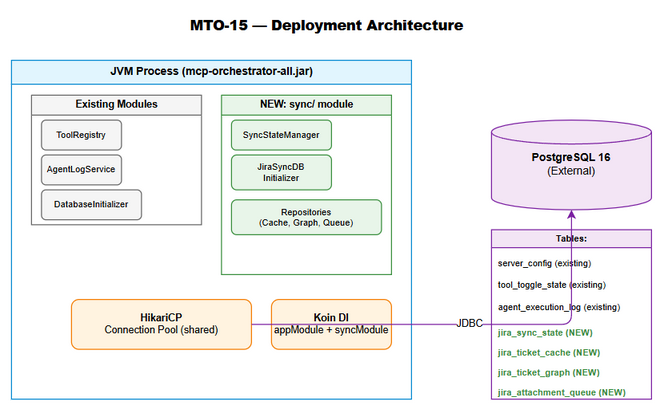

# Deployment Guide (DPG)

## MCPOrchestration — MTO-15: Database Schema & Sync State Management

---

## Document Information

| Field | Value |
|-------|-------|
| Jira Ticket | MTO-15 |
| Title | Database Schema & Sync State Management — Deployment Guide |
| Author | DevOps Agent |
| Version | 1.0 |
| Date | 2025-07-17 |
| Status | Final |
| Related TDD | TDD-v1-MTO-15.docx |
| Related FSD | FSD-v1-MTO-15.docx |

---

## Revision History

| Version | Date | Author | Changes |
|---------|------|--------|---------|
| 1.0 | 2025-07-17 | DevOps Agent | Initial deployment guide for DB schema & sync state module |

---

## 1. Deployment Overview

### 1.1 Summary

This deployment introduces the **Jira Sync State Management** persistence layer to the MCPOrchestration server. The change adds:

- 4 new PostgreSQL tables (`jira_sync_state`, `jira_ticket_cache`, `jira_ticket_graph`, `jira_attachment_queue`)
- 8 performance indexes (including 2 partial indexes)
- `SyncStateManager` service with state machine logic
- 3 repository classes for CRUD operations
- `JiraSyncDatabaseInitializer` for automatic schema migration on startup

### 1.2 Deployment Type

| Aspect | Value |
|--------|-------|
| Type | Rolling update (zero-downtime) |
| Risk Level | Low — additive schema changes only (no ALTER/DROP) |
| Rollback Complexity | Low — DROP TABLE IF EXISTS |
| Downtime Required | None |
| Data Migration | None (new tables, no existing data affected) |

### 1.3 Affected Components

| Component | Change Type | Impact |
|-----------|-------------|--------|
| `orchestrator-server` module | New classes added | New package `com.orchestrator.mcp.sync` |
| PostgreSQL database | New tables + indexes | 4 tables, 8 indexes created |
| `AppModule.kt` (Koin DI) | Extended | 6 new DI bindings added |
| Fat JAR (`mcp-orchestrator-all.jar`) | Rebuilt | Includes new sync classes |
| `application.yml` | No change | No new config required for this module |

---

## 2. Prerequisites

### 2.1 Infrastructure Requirements

| Requirement | Minimum | Recommended | Notes |
|-------------|---------|-------------|-------|
| PostgreSQL | 16.0 | 16.x latest | Required for JSONB, partial indexes, CHECK constraints |
| JVM | 21 | 21 LTS | GraalVM or OpenJDK |
| Disk Space (DB) | 50 MB | 200 MB | For tables + indexes (grows with synced projects) |
| RAM (JVM) | 512 MB | 1 GB | Existing requirement, no increase needed |
| HikariCP Pool | 5 connections | 10 connections | Existing pool shared with new tables |

### 2.2 Software Dependencies

| Dependency | Version | Already Present | Notes |
|------------|---------|-----------------|-------|
| Kotlin | 2.3.20 | ✅ Yes | No change |
| Ktor | 3.4.0 | ✅ Yes | No change |
| HikariCP | 6.2.1 | ✅ Yes | No change |
| PostgreSQL JDBC | 42.7.x | ✅ Yes | No change |
| Koin | 4.1.1 | ✅ Yes | No change |
| kotlinx.coroutines | 1.10.2 | ✅ Yes | No change |
| kotlinx.datetime | 0.6.2 | ✅ Yes | No change |

**No new dependencies introduced.** All libraries are already in `build.gradle.kts`.

### 2.3 Access Requirements

| Access | Purpose | Who |
|--------|---------|-----|
| PostgreSQL superuser or DDL privileges | CREATE TABLE, CREATE INDEX | DBA or deployment service account |
| Server filesystem | Deploy JAR file | DevOps |
| Application config | Verify DB connection string | DevOps |

---

## 3. Pre-Deployment Checklist

### 3.1 Verification Steps

| # | Check | Command / Action | Expected Result |
|---|-------|-----------------|-----------------|
| 1 | PostgreSQL is running | `pg_isready -h {host} -p 5432` | `accepting connections` |
| 2 | DB user has DDL privileges | `SELECT has_database_privilege(current_user, current_database(), 'CREATE')` | `true` |
| 3 | Existing tables intact | `\dt server_config; \dt tool_toggle_state; \dt file_proxy_registry;` | All 3 tables exist |
| 4 | No conflicting table names | `SELECT tablename FROM pg_tables WHERE tablename LIKE 'jira_%';` | Empty result (no existing jira_ tables) |
| 5 | HikariCP pool healthy | Check application logs for `HikariPool-1 - Start completed` | Pool started |
| 6 | Fat JAR built successfully | `./gradlew buildFatJar` | `BUILD SUCCESSFUL` |
| 7 | All tests pass | `./gradlew test` | 18/18 tests pass |
| 8 | JAR file exists | `ls build/libs/mcp-orchestrator-all.jar` | File present |
| 9 | Backup current JAR | `cp mcp-orchestrator-all.jar mcp-orchestrator-all.jar.bak` | Backup created |
| 10 | Backup database | `pg_dump -Fc {db_name} > backup_pre_mto15.dump` | Dump file created |

### 3.2 Configuration Verification

No new configuration is required for MTO-15. The module uses the existing `database` section in `application.yml`:

```yaml
orchestrator:
  database:
    url: "jdbc:postgresql://localhost:5432/mcp_orchestrator"
    username: "${DB_USERNAME:postgres}"
    password: "${DB_PASSWORD:postgres}"
    pool_size: 10
```

Verify these values are correct for the target environment.

---

## 4. Deployment Steps

### 4.1 Build Phase

```bash
# Step 1: Pull latest code from branch MTO-15
git checkout MTO-15
git pull origin MTO-15

# Step 2: Run full test suite
./gradlew clean test

# Step 3: Build fat JAR
./gradlew buildFatJar

# Step 4: Verify JAR contains sync classes
jar tf build/libs/mcp-orchestrator-all.jar | grep "sync/"
# Expected: com/orchestrator/mcp/sync/SyncStateManager.class
#           com/orchestrator/mcp/sync/SyncStateManagerImpl.class
#           com/orchestrator/mcp/sync/JiraSyncDatabaseInitializer.class
#           com/orchestrator/mcp/sync/TicketCacheRepository.class
#           ... (all sync classes)
```

### 4.2 Database Migration (Automatic)

The `JiraSyncDatabaseInitializer` executes automatically on application startup. It creates all 4 tables and 8 indexes using `IF NOT EXISTS` — safe for re-execution.

**Tables created:**

| Table | Purpose | Primary Key |
|-------|---------|-------------|
| `jira_sync_state` | Sync job lifecycle tracking | `project_key` (VARCHAR 50) |
| `jira_ticket_cache` | Cached Jira ticket metadata | `ticket_key` (VARCHAR 50) |
| `jira_ticket_graph` | Ticket relationship edges | Composite: `(source_key, target_key, link_type)` |
| `jira_attachment_queue` | Attachment download queue | `id` (SERIAL) |

**Indexes created:**

| Index | Table | Columns | Type |
|-------|-------|---------|------|
| `idx_ticket_cache_project` | jira_ticket_cache | project_key | B-tree |
| `idx_ticket_cache_updated` | jira_ticket_cache | updated_at_jira | B-tree |
| `idx_ticket_cache_not_ingested` | jira_ticket_cache | kb_ingested | Partial (WHERE = FALSE) |
| `idx_ticket_graph_source` | jira_ticket_graph | source_key | B-tree |
| `idx_ticket_graph_target` | jira_ticket_graph | target_key | B-tree |
| `idx_attachment_queue_status` | jira_attachment_queue | status | B-tree |
| `idx_attachment_queue_ticket` | jira_attachment_queue | ticket_key | B-tree |
| `idx_attachment_queue_pending` | jira_attachment_queue | (status, created_at) | Partial (WHERE status = 'PENDING') |

### 4.3 Application Deployment

```bash
# Step 1: Stop current application (graceful shutdown)
# Option A: If running as systemd service
sudo systemctl stop mcp-orchestrator

# Option B: If running as process
kill -SIGTERM $(pgrep -f "mcp-orchestrator-all.jar")

# Step 2: Deploy new JAR
cp build/libs/mcp-orchestrator-all.jar /opt/mcp-orchestrator/mcp-orchestrator-all.jar

# Step 3: Start application
# Option A: systemd
sudo systemctl start mcp-orchestrator

# Option B: Direct execution
java -jar /opt/mcp-orchestrator/mcp-orchestrator-all.jar \
  --config /opt/mcp-orchestrator/application.yml &

# Step 4: Wait for startup (typically 5-10 seconds)
sleep 10
```

### 4.4 Migration Verification

After startup, verify tables were created:

```sql
-- Verify all 4 tables exist
SELECT tablename FROM pg_tables 
WHERE schemaname = 'public' AND tablename LIKE 'jira_%'
ORDER BY tablename;

-- Expected output:
-- jira_attachment_queue
-- jira_sync_state
-- jira_ticket_cache
-- jira_ticket_graph

-- Verify indexes
SELECT indexname FROM pg_indexes 
WHERE tablename LIKE 'jira_%'
ORDER BY indexname;

-- Expected: 8 indexes listed

-- Verify constraints
SELECT conname, contype FROM pg_constraint 
WHERE conrelid IN (
  SELECT oid FROM pg_class WHERE relname LIKE 'jira_%'
)
ORDER BY conname;
```

---

## 5. Post-Deployment Verification

### 5.1 Health Check

| # | Check | Method | Expected |
|---|-------|--------|----------|
| 1 | Application started | Check logs for `Application started` | Present |
| 2 | DB schema initialized | Check logs for `Jira sync database schema initialized successfully` | Present |
| 3 | HikariCP pool active | Check logs for `HikariPool-1 - Start completed` | Present |
| 4 | No startup errors | `grep -i "error\|exception" app.log` | No critical errors |
| 5 | Existing features work | Send MCP `tools/list` request | Returns tool list |
| 6 | Sync tables accessible | `SELECT COUNT(*) FROM jira_sync_state;` | Returns 0 (empty) |

### 5.2 Smoke Test

```bash
# Test 1: Verify application responds to MCP protocol
echo '{"jsonrpc":"2.0","id":1,"method":"tools/list"}' | \
  java -jar mcp-orchestrator-all.jar --transport stdio

# Expected: JSON response with tools array

# Test 2: Verify DB tables via psql
psql -h localhost -U postgres -d mcp_orchestrator -c \
  "INSERT INTO jira_sync_state (project_key, status) VALUES ('TEST-DEPLOY', 'IDLE') 
   ON CONFLICT (project_key) DO NOTHING;
   SELECT * FROM jira_sync_state WHERE project_key = 'TEST-DEPLOY';
   DELETE FROM jira_sync_state WHERE project_key = 'TEST-DEPLOY';"

# Expected: INSERT, SELECT returns 1 row, DELETE succeeds
```

### 5.3 Performance Baseline

After deployment, capture baseline metrics:

```sql
-- Table sizes (should be minimal initially)
SELECT relname, pg_size_pretty(pg_total_relation_size(relid))
FROM pg_stat_user_tables
WHERE relname LIKE 'jira_%';

-- Connection pool stats (from HikariCP MBean or logs)
-- Active connections should not increase significantly
```

---

## 6. Rollback Plan

### 6.1 Rollback Triggers

| Condition | Action |
|-----------|--------|
| Application fails to start | Rollback immediately |
| DB migration fails (partial) | Rollback DB + JAR |
| Existing features broken | Rollback immediately |
| Performance degradation > 20% | Investigate, rollback if unresolvable |
| New sync tables cause lock contention | Rollback, investigate |

### 6.2 Rollback Steps

```bash
# Step 1: Stop application
sudo systemctl stop mcp-orchestrator
# or: kill -SIGTERM $(pgrep -f "mcp-orchestrator-all.jar")

# Step 2: Restore previous JAR
cp /opt/mcp-orchestrator/mcp-orchestrator-all.jar.bak \
   /opt/mcp-orchestrator/mcp-orchestrator-all.jar

# Step 3: Drop new tables (safe — no existing data depends on them)
psql -h localhost -U postgres -d mcp_orchestrator << 'EOF'
DROP TABLE IF EXISTS jira_attachment_queue CASCADE;
DROP TABLE IF EXISTS jira_ticket_graph CASCADE;
DROP TABLE IF EXISTS jira_ticket_cache CASCADE;
DROP TABLE IF EXISTS jira_sync_state CASCADE;
EOF

# Step 4: Restart with previous version
sudo systemctl start mcp-orchestrator

# Step 5: Verify rollback
psql -c "SELECT tablename FROM pg_tables WHERE tablename LIKE 'jira_%';"
# Expected: empty result
```

### 6.3 Rollback Verification

| # | Check | Expected After Rollback |
|---|-------|------------------------|
| 1 | Application starts | ✅ Starts normally |
| 2 | No jira_ tables | ✅ `SELECT ... LIKE 'jira_%'` returns empty |
| 3 | Existing features work | ✅ MCP tools/list responds |
| 4 | No error logs | ✅ Clean startup |

### 6.4 Data Recovery

If rollback is needed after data has been written to sync tables:

```bash
# Full database restore from pre-deployment backup
pg_restore -Fc -d mcp_orchestrator backup_pre_mto15.dump
```

**Note:** Since MTO-15 tables are new (no pre-existing data), rollback is always safe. No data loss risk.

---

## 7. Monitoring & Alerts

### 7.1 Log Monitoring

| Log Pattern | Meaning | Action |
|-------------|---------|--------|
| `Jira sync database schema initialized successfully` | Migration completed | None (expected) |
| `Failed to initialize Jira sync schema` | Migration failed | Check DB connectivity, permissions |
| `IllegalStateException: Invalid state transition` | State machine violation | Check calling code logic |
| `HikariPool-1 - Connection is not available` | Pool exhausted | Increase pool size or check for leaks |

### 7.2 Database Monitoring

```sql
-- Monitor table growth (run weekly)
SELECT relname, n_live_tup, n_dead_tup, last_vacuum, last_autovacuum
FROM pg_stat_user_tables
WHERE relname LIKE 'jira_%';

-- Monitor index usage (run after 1 week of operation)
SELECT indexrelname, idx_scan, idx_tup_read, idx_tup_fetch
FROM pg_stat_user_indexes
WHERE relname LIKE 'jira_%';

-- Check for unused indexes (after 1 month)
SELECT indexrelname FROM pg_stat_user_indexes
WHERE relname LIKE 'jira_%' AND idx_scan = 0;
```

---

## 8. Security Considerations

| Aspect | Implementation |
|--------|---------------|
| DB credentials | Stored in environment variables (`DB_USERNAME`, `DB_PASSWORD`) |
| SQL injection | All queries use PreparedStatement with parameterized queries |
| Access control | Application-level only (no row-level security needed for internal module) |
| Data sensitivity | Ticket metadata only (no credentials, no PII beyond Jira usernames) |
| Network | DB connection over private network (localhost or VPC) |
| Audit trail | `updated_at` timestamps on all mutable tables |

---

## 9. Deployment Diagram



---

## Appendix A: Complete DDL Script

For manual execution (if automatic migration fails):

```sql
-- V3__create_jira_sync_tables.sql
-- Run as: psql -h {host} -U {user} -d mcp_orchestrator -f V3__create_jira_sync_tables.sql

CREATE TABLE IF NOT EXISTS jira_sync_state (
    project_key VARCHAR(50) PRIMARY KEY,
    last_sync_at TIMESTAMPTZ,
    last_offset INTEGER NOT NULL DEFAULT 0,
    total_issues INTEGER NOT NULL DEFAULT 0,
    synced_issues INTEGER NOT NULL DEFAULT 0,
    status VARCHAR(20) NOT NULL DEFAULT 'IDLE',
    error_message TEXT,
    updated_at TIMESTAMPTZ NOT NULL DEFAULT NOW(),
    CONSTRAINT chk_sync_status CHECK (status IN ('IDLE','RUNNING','PAUSED','COMPLETED','FAILED')),
    CONSTRAINT chk_offset_non_negative CHECK (last_offset >= 0),
    CONSTRAINT chk_total_non_negative CHECK (total_issues >= 0),
    CONSTRAINT chk_synced_non_negative CHECK (synced_issues >= 0)
);

CREATE TABLE IF NOT EXISTS jira_ticket_cache (
    ticket_key VARCHAR(50) PRIMARY KEY,
    project_key VARCHAR(50) NOT NULL,
    summary TEXT NOT NULL,
    issue_type VARCHAR(50) NOT NULL,
    status VARCHAR(50) NOT NULL,
    priority VARCHAR(20),
    parent_key VARCHAR(50),
    epic_key VARCHAR(50),
    labels JSONB,
    updated_at_jira TIMESTAMPTZ NOT NULL,
    synced_at TIMESTAMPTZ NOT NULL DEFAULT NOW(),
    content_hash VARCHAR(64) NOT NULL,
    kb_ingested BOOLEAN NOT NULL DEFAULT FALSE
);

CREATE TABLE IF NOT EXISTS jira_ticket_graph (
    source_key VARCHAR(50) NOT NULL,
    target_key VARCHAR(50) NOT NULL,
    link_type VARCHAR(100) NOT NULL,
    category VARCHAR(20) NOT NULL,
    PRIMARY KEY (source_key, target_key, link_type),
    CONSTRAINT chk_graph_category CHECK (category IN ('INWARD','OUTWARD','SUBTASK','EPIC'))
);

CREATE TABLE IF NOT EXISTS jira_attachment_queue (
    id SERIAL PRIMARY KEY,
    ticket_key VARCHAR(50) NOT NULL,
    attachment_id VARCHAR(50) NOT NULL,
    filename VARCHAR(500) NOT NULL,
    mime_type VARCHAR(100),
    size_bytes BIGINT,
    download_url TEXT NOT NULL,
    status VARCHAR(20) NOT NULL DEFAULT 'PENDING',
    retry_count INTEGER NOT NULL DEFAULT 0,
    error_message TEXT,
    created_at TIMESTAMPTZ NOT NULL DEFAULT NOW(),
    processed_at TIMESTAMPTZ,
    CONSTRAINT chk_attachment_status CHECK (status IN ('PENDING','DOWNLOADING','PROCESSING','DONE','FAILED')),
    CONSTRAINT chk_retry_non_negative CHECK (retry_count >= 0),
    CONSTRAINT uq_ticket_attachment UNIQUE (ticket_key, attachment_id)
);

-- Performance indexes
CREATE INDEX IF NOT EXISTS idx_ticket_cache_project ON jira_ticket_cache (project_key);
CREATE INDEX IF NOT EXISTS idx_ticket_cache_updated ON jira_ticket_cache (updated_at_jira);
CREATE INDEX IF NOT EXISTS idx_ticket_cache_not_ingested ON jira_ticket_cache (kb_ingested) WHERE kb_ingested = FALSE;
CREATE INDEX IF NOT EXISTS idx_ticket_graph_source ON jira_ticket_graph (source_key);
CREATE INDEX IF NOT EXISTS idx_ticket_graph_target ON jira_ticket_graph (target_key);
CREATE INDEX IF NOT EXISTS idx_attachment_queue_status ON jira_attachment_queue (status);
CREATE INDEX IF NOT EXISTS idx_attachment_queue_ticket ON jira_attachment_queue (ticket_key);
CREATE INDEX IF NOT EXISTS idx_attachment_queue_pending ON jira_attachment_queue (status, created_at) WHERE status = 'PENDING';
```

---

## Appendix B: Diagram Index

| # | Diagram | Image | Source (editable) |
|---|---------|-------|-------------------|
| 1 | Deployment Architecture | [tdd-deployment.png](diagrams/tdd-deployment.png) | [tdd-deployment.drawio](diagrams/tdd-deployment.drawio) |
