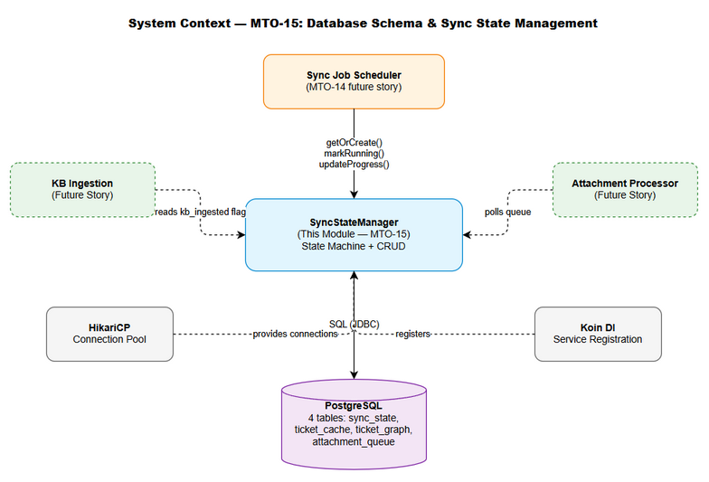
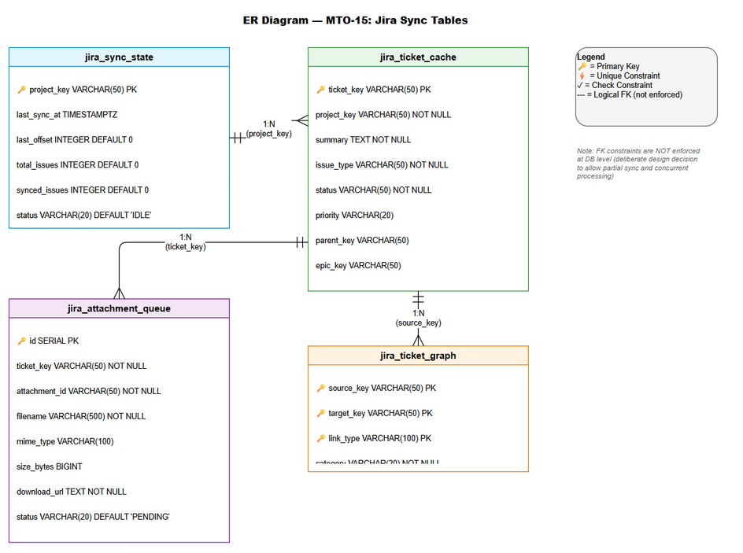
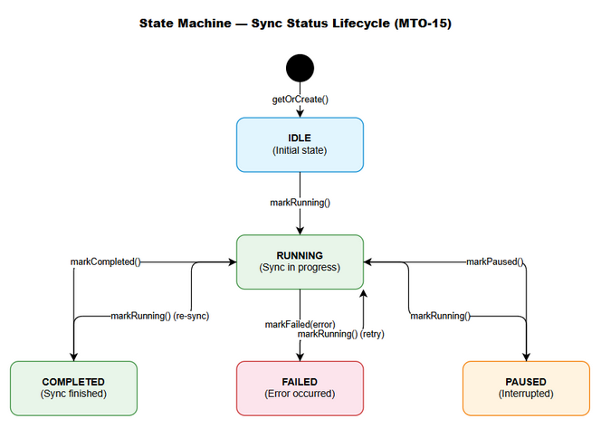
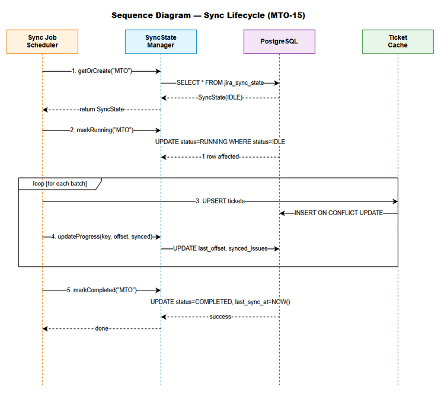

# Functional Specification Document (FSD)

## Jira Project Sync Service — MTO-15: Database Schema & Sync State Management

---

## Document Information

| Field | Value |
|-------|-------|
| Jira Ticket | MTO-15 |
| Title | Database Schema & Sync State Management |
| Author | TA Agent |
| Version | 1.0 |
| Date | 2025-07-14 |
| Status | Draft |
| Related BRD | BRD-v1-MTO-15.docx |
| Parent Epic | MTO-14 — Jira Project Sync Service: Background Job for Automated KB Ingestion |

---

## Revision History

| Version | Date | Author | Changes |
|---------|------|--------|---------|
| 1.0 | 2025-07-14 | TA Agent | Initiate document — full FSD creation from BRD with technical enrichment |

---

## 1. Introduction

### 1.1 Purpose

This FSD specifies the functional and technical design for the database schema and sync state management layer of the Jira Project Sync Service (MTO-14). It defines:

- 4 PostgreSQL tables providing persistence for sync state, ticket caching, relationship graphing, and attachment processing
- A `SyncStateManager` Kotlin class implementing the sync lifecycle state machine
- Database migration scripts following the project's existing pattern (manual SQL via HikariCP `DatabaseInitializer`)
- Performance indexes optimized for the primary query patterns

This is a **foundational story** — all other MTO-14 stories depend on this data persistence layer.

[Implements: Story #1–#7 from BRD MTO-15]

### 1.2 Scope

**In Scope:**
- Design and implementation of 4 PostgreSQL tables: `jira_sync_state`, `jira_ticket_cache`, `jira_ticket_graph`, `jira_attachment_queue`
- `SyncStateManager` interface and implementation class with state machine enforcement
- Migration script integrated into existing `DatabaseInitializer` pattern (extending the class or creating a new `JiraSyncDatabaseInitializer`)
- Performance indexes including partial indexes for common query patterns
- Integration with existing HikariCP connection pool and Koin DI

**Out of Scope:**
- Jira API integration and data fetching logic
- Knowledge Base ingestion pipeline
- Background job scheduling and orchestration
- UI/dashboard for monitoring sync progress
- Data archival or purging strategies

### 1.3 Definitions & Acronyms

| Term | Definition |
|------|------------|
| Sync State | A record tracking the progress and status of a Jira project synchronization job |
| Content Hash | SHA-256 hash of ticket key fields used to detect changes without full comparison |
| Checkpoint | The `last_offset` value allowing a sync job to resume from interruption point |
| KB Ingestion | Process of storing ticket content into the Knowledge Base for AI agent retrieval |
| Attachment Queue | FIFO queue of Jira attachments waiting to be downloaded and processed |
| Composite PK | Primary key consisting of multiple columns (used in `jira_ticket_graph`) |
| HikariCP | High-performance JDBC connection pool library |
| UPSERT | INSERT with ON CONFLICT UPDATE — atomic insert-or-update operation |
| Partial Index | PostgreSQL index with a WHERE clause, indexing only rows matching the condition |
| JSONB | PostgreSQL binary JSON type supporting indexing and efficient querying |
| Optimistic Locking | Concurrency control using WHERE clause on expected state to prevent race conditions |

### 1.4 References

| Document | Location |
|----------|----------|
| BRD | BRD-v1-MTO-15.docx |
| Existing DatabaseInitializer | orchestrator-client/src/main/kotlin/com/orchestrator/mcp/client/vectordb/DatabaseInitializer.kt |
| Existing Migration V2 | orchestrator-server/src/main/resources/db/V2__create_file_proxy_registry.sql |
| Project Structure | .analysis/code-intelligence/project-structure.md |
| Epic Description | MTO-14 — Jira Project Sync Service |

---

## 2. System Overview

### 2.1 System Context Diagram


*[Edit in draw.io](diagrams/fsd-system-context.drawio)*

The Database Schema & Sync State Management module sits within the `orchestrator-server` module and provides the persistence layer for the Jira Sync Service. It interacts with:

- **Sync Job Scheduler** (upstream consumer) — triggers sync operations and queries state
- **SyncStateManager** (this module) — manages lifecycle transitions atomically
- **PostgreSQL Database** (infrastructure) — stores all sync data in 4 tables
- **HikariCP Connection Pool** (infrastructure) — provides database connections
- **Koin DI** (framework) — registers services for dependency injection

### 2.2 System Architecture

```
orchestrator-server/
├── src/main/kotlin/com/orchestrator/mcp/
│   ├── sync/
│   │   ├── model/
│   │   │   ├── SyncState.kt              # Data class for sync state record
│   │   │   ├── SyncStatus.kt             # Enum: IDLE, RUNNING, PAUSED, COMPLETED, FAILED
│   │   │   ├── TicketCache.kt            # Data class for cached ticket metadata
│   │   │   ├── TicketRelation.kt         # Data class for ticket graph edge
│   │   │   └── AttachmentQueueItem.kt    # Data class for queued attachment
│   │   ├── SyncStateManager.kt           # Interface — sync lifecycle operations
│   │   ├── SyncStateManagerImpl.kt       # Implementation with state machine + optimistic locking
│   │   └── JiraSyncDatabaseInitializer.kt # Migration executor (follows DatabaseInitializer pattern)
│   └── di/
│       └── AppModule.kt                   # Koin bindings (extended with sync module)
├── src/main/resources/db/
│   └── V3__create_jira_sync_tables.sql    # Migration script (all 4 tables + indexes)
└── src/test/kotlin/com/orchestrator/mcp/sync/
    ├── SyncStateManagerImplTest.kt        # Unit tests for state machine
    └── JiraSyncDatabaseInitializerTest.kt # Integration test for migration
```

**Architecture Patterns Applied:**

| Pattern | Implementation |
|---------|---------------|
| Interface/Impl | `SyncStateManager` / `SyncStateManagerImpl` (existing project pattern) |
| Coroutines + Dispatchers.IO | All DB operations are non-blocking (existing pattern) |
| Koin DI | Singleton registration in `AppModule.kt` (existing pattern) |
| Idempotent Migrations | `CREATE TABLE IF NOT EXISTS` (existing pattern from V2) |
| Optimistic Locking | `WHERE status = :expectedStatus` in UPDATE statements |
| Data Classes | Immutable Kotlin data classes for all domain models |

### 2.3 Entity Relationship Overview


*[Edit in draw.io](diagrams/fsd-er-diagram.drawio)*

The 4 tables have the following relationships:
- `jira_sync_state` ← one per project, tracks overall sync progress
- `jira_ticket_cache` ← many per project (FK: `project_key`), caches ticket metadata
- `jira_ticket_graph` ← many-to-many between tickets, stores relationships
- `jira_attachment_queue` ← many per ticket (FK: `ticket_key`), queues attachments


---

## 3. Functional Requirements

### 3.1 Feature: Sync State Table (jira_sync_state)

**Source:** BRD Story #1 — Sync State Table

#### 3.1.1 Description

The `jira_sync_state` table stores one record per Jira project, tracking the synchronization lifecycle. It enables resumable sync by persisting checkpoint offsets and status transitions. The table is the central coordination point — the Sync Job Scheduler reads it to determine whether to start, resume, or skip a project sync.

#### 3.1.2 Use Case

**Use Case ID:** UC-01
**Actor:** Sync Job Scheduler
**Preconditions:** PostgreSQL database is accessible, HikariCP pool is initialized
**Postconditions:** Sync state record exists for the project with correct status

**Main Flow:**

| Step | Actor | System | Description |
|------|-------|--------|-------------|
| 1 | Sync Job Scheduler | | Calls `SyncStateManager.getOrCreate(projectKey)` |
| 2 | | SyncStateManager | Queries `jira_sync_state` by `project_key` |
| 3 | | SyncStateManager | If record exists → returns current `SyncState` |
| 4 | | SyncStateManager | If no record → INSERTs new row with status=IDLE, offset=0 |
| 5 | Sync Job Scheduler | | Calls `markRunning(projectKey)` to begin sync |
| 6 | | SyncStateManager | UPDATEs status to RUNNING (with optimistic lock on current status) |
| 7 | Sync Job Scheduler | | Periodically calls `updateProgress(projectKey, offset, synced)` |
| 8 | | SyncStateManager | UPDATEs `last_offset`, `synced_issues`, `updated_at` atomically |
| 9 | Sync Job Scheduler | | On completion, calls `markCompleted(projectKey)` |
| 10 | | SyncStateManager | UPDATEs status to COMPLETED, sets `last_sync_at = NOW()` |

**Alternative Flows:**

| ID | Condition | Steps |
|----|-----------|-------|
| AF-01 | Sync interrupted (crash/restart) | On restart, `getOrCreate` returns record with status=RUNNING and `last_offset > 0`. Scheduler resumes from `last_offset`. |
| AF-02 | Previous sync FAILED | `getOrCreate` returns FAILED status. Scheduler calls `markRunning` (allowed from FAILED state) to retry. |
| AF-03 | Sync paused by operator | Scheduler calls `markPaused(projectKey)`. Status transitions to PAUSED. Resume via `markRunning`. |

**Exception Flows:**

| ID | Condition | Steps |
|----|-----------|-------|
| EF-01 | Invalid state transition (e.g., COMPLETED → PAUSED) | `SyncStateManager` throws `IllegalStateException`. Caller logs error and skips. |
| EF-02 | Database connection failure | Exception propagates to caller. Caller uses `RetryUtils` for exponential backoff. |
| EF-03 | Concurrent modification (race condition) | UPDATE with `WHERE status = :expected` affects 0 rows. Throws `IllegalStateException("Concurrent modification detected")`. |

#### 3.1.3 Business Rules

| Rule ID | Rule | Source |
|---------|------|--------|
| BR-01 | Only one sync state record per project_key (enforced by PK) | BRD Story #1 AC-1 |
| BR-02 | Status transitions must follow the state machine: IDLE→RUNNING, RUNNING→{COMPLETED,FAILED,PAUSED}, PAUSED→RUNNING, FAILED→RUNNING | BRD Story #5 AC-3–6 |
| BR-03 | `last_offset` must be monotonically increasing during a sync run (never decrease) | BRD Story #1 |
| BR-04 | `synced_issues` must be ≤ `total_issues` at all times | BRD Story #1 Validation |
| BR-05 | `updated_at` is automatically set to NOW() on every modification | BRD Story #1 AC-6 |

#### 3.1.4 Data Specifications

**Input Data (for getOrCreate):**

| Field | Type | Required | Validation | Description |
|-------|------|----------|------------|-------------|
| projectKey | String | Yes | Non-empty, max 50 chars, pattern `[A-Z]+` | Jira project key identifier |

**Output Data (SyncState):**

| Field | Type | Description |
|-------|------|-------------|
| projectKey | String | Jira project key (PK) |
| lastSyncAt | Instant? | Timestamp of last successful sync completion |
| lastOffset | Int | Resumable checkpoint — last processed offset |
| totalIssues | Int | Total number of issues in the project |
| syncedIssues | Int | Number of issues successfully synced |
| status | SyncStatus | Current lifecycle state (enum) |
| errorMessage | String? | Error details when status is FAILED |
| updatedAt | Instant | Last modification timestamp |

#### 3.1.5 API Contract (Functional View)

> **Note:** This is an internal Kotlin API (not HTTP). The SyncStateManager is injected via Koin DI.

**Interface: SyncStateManager**

| Method | Input | Output | Business Rule | Description |
|--------|-------|--------|---------------|-------------|
| `getOrCreate(projectKey: String)` | projectKey | `SyncState` | BR-01 | Get existing or create new with IDLE status |
| `markRunning(projectKey: String)` | projectKey | `Unit` | BR-02 | Transition to RUNNING (from IDLE/PAUSED/FAILED) |
| `markPaused(projectKey: String)` | projectKey | `Unit` | BR-02 | Transition to PAUSED (from RUNNING only) |
| `markCompleted(projectKey: String)` | projectKey | `Unit` | BR-02 | Transition to COMPLETED (from RUNNING only) |
| `markFailed(projectKey: String, error: String)` | projectKey, error | `Unit` | BR-02 | Transition to FAILED (from RUNNING) |
| `updateProgress(projectKey: String, offset: Int, synced: Int)` | projectKey, offset, synced | `Unit` | BR-03, BR-04 | Update checkpoint atomically |

**Business Error Scenarios:**

| Scenario | Exception | Trigger Condition |
|----------|-----------|-------------------|
| Invalid state transition | `IllegalStateException` | Calling `markPaused` when status ≠ RUNNING |
| Concurrent modification | `IllegalStateException` | Another process modified the record between read and write |
| Project key too long | `IllegalArgumentException` | projectKey exceeds 50 characters |
| Negative offset | `IllegalArgumentException` | offset < 0 in `updateProgress` |


---

### 3.2 Feature: Ticket Cache Table (jira_ticket_cache)

**Source:** BRD Story #2 — Ticket Cache Table

#### 3.2.1 Description

The `jira_ticket_cache` table stores essential Jira ticket metadata locally. It serves two purposes: (1) avoid redundant Jira API calls by caching ticket data, and (2) detect changes via SHA-256 content hashing for incremental sync. Each ticket is stored once, with UPSERT semantics for re-syncing.

#### 3.2.2 Use Case

**Use Case ID:** UC-02
**Actor:** Sync Job (Ticket Fetcher component)
**Preconditions:** `jira_sync_state` record exists with status=RUNNING for the project
**Postconditions:** Ticket metadata is cached with current content hash and sync timestamp

**Main Flow:**

| Step | Actor | System | Description |
|------|-------|--------|-------------|
| 1 | Ticket Fetcher | | Fetches batch of tickets from Jira API |
| 2 | Ticket Fetcher | | Computes SHA-256 hash of each ticket's key fields (summary + description + status + labels) |
| 3 | Ticket Fetcher | | Calls UPSERT for each ticket in the batch |
| 4 | | PostgreSQL | Executes `INSERT ... ON CONFLICT (ticket_key) DO UPDATE SET ...` |
| 5 | | PostgreSQL | Updates `synced_at`, `content_hash`, and all metadata fields |
| 6 | Ticket Fetcher | | After batch completes, updates sync progress via `SyncStateManager.updateProgress()` |

**Alternative Flows:**

| ID | Condition | Steps |
|----|-----------|-------|
| AF-01 | Content hash unchanged (ticket not modified) | UPSERT still executes but only updates `synced_at`. No downstream KB re-ingestion triggered. |
| AF-02 | Ticket deleted in Jira | Not handled in this story. Future cleanup job will detect orphaned cache entries. |
| AF-03 | Batch partially fails | Successfully cached tickets remain. Failed tickets are retried in next batch. Progress checkpoint reflects last fully-processed batch. |

**Exception Flows:**

| ID | Condition | Steps |
|----|-----------|-------|
| EF-01 | Invalid JSONB in labels field | Reject the single ticket insert, log error with ticket key. Continue with remaining batch. |
| EF-02 | Database connection lost mid-batch | Transaction rolls back. Sync state remains at previous checkpoint. Retry on next scheduler run. |

#### 3.2.3 Business Rules

| Rule ID | Rule | Source |
|---------|------|--------|
| BR-06 | `ticket_key` is unique (PK) — one cache entry per Jira ticket | BRD Story #2 AC-1 |
| BR-07 | `content_hash` is SHA-256 hex (exactly 64 characters) | BRD Story #2 AC-4 |
| BR-08 | `kb_ingested` defaults to FALSE — set to TRUE by downstream KB ingestion process | BRD Story #2 AC-5 |
| BR-09 | UPSERT semantics: existing tickets are updated, new tickets are inserted | BRD Story #2 AC-7 |
| BR-10 | `labels` must be a valid JSON array or NULL | BRD Story #2 Validation |

#### 3.2.4 Data Specifications

**Input Data (UPSERT):**

| Field | Type | Required | Validation | Description |
|-------|------|----------|------------|-------------|
| ticketKey | String | Yes | Pattern `[A-Z]+-\d+`, max 50 chars | Jira issue key |
| projectKey | String | Yes | Non-empty, max 50 chars | Parent project key |
| summary | String | Yes | Non-empty | Issue summary/title |
| issueType | String | Yes | Non-empty, max 50 chars | Issue type (Story, Bug, etc.) |
| status | String | Yes | Non-empty, max 50 chars | Current Jira status |
| priority | String? | No | Max 20 chars | Issue priority |
| parentKey | String? | No | Pattern `[A-Z]+-\d+` if present | Parent issue key |
| epicKey | String? | No | Pattern `[A-Z]+-\d+` if present | Epic link key |
| labels | List<String>? | No | Valid JSON array | Array of labels |
| updatedAtJira | Instant | Yes | Valid timestamp | Last update time in Jira |
| contentHash | String | Yes | Exactly 64 hex chars | SHA-256 hash |

**Output Data (TicketCache):**

| Field | Type | Description |
|-------|------|-------------|
| ticketKey | String | Jira issue key (PK) |
| projectKey | String | Parent project key |
| summary | String | Issue summary/title |
| issueType | String | Issue type |
| status | String | Current Jira status |
| priority | String? | Issue priority |
| parentKey | String? | Parent issue key |
| epicKey | String? | Epic link key |
| labels | List<String>? | Array of labels |
| updatedAtJira | Instant | Last update time in Jira |
| syncedAt | Instant | When this record was last synced |
| contentHash | String | SHA-256 hash of content |
| kbIngested | Boolean | Whether ingested into KB |

#### 3.2.5 API Contract (Functional View)

> **Note:** These are internal repository methods, not HTTP endpoints.

**Repository: TicketCacheRepository**

| Method | Input | Output | Business Rule | Description |
|--------|-------|--------|---------------|-------------|
| `upsert(ticket: TicketCache)` | TicketCache | `Unit` | BR-06, BR-09 | Insert or update ticket cache entry |
| `upsertBatch(tickets: List<TicketCache>)` | List<TicketCache> | `Int` (count) | BR-09 | Batch upsert, returns count of affected rows |
| `findByProject(projectKey: String)` | projectKey | `List<TicketCache>` | — | Get all cached tickets for a project |
| `findNotIngested(projectKey: String)` | projectKey | `List<TicketCache>` | BR-08 | Get tickets not yet ingested into KB |
| `markIngested(ticketKey: String)` | ticketKey | `Unit` | BR-08 | Set `kb_ingested = TRUE` |
| `findByHash(projectKey: String, hash: String)` | projectKey, hash | `TicketCache?` | BR-07 | Find ticket by content hash (change detection) |

**Business Error Scenarios:**

| Scenario | Exception | Trigger Condition |
|----------|-----------|-------------------|
| Invalid ticket key format | `IllegalArgumentException` | ticketKey doesn't match `[A-Z]+-\d+` |
| Invalid content hash length | `IllegalArgumentException` | contentHash length ≠ 64 |
| Invalid JSONB labels | `DataIntegrityViolationException` | labels is not a valid JSON array |


---

### 3.3 Feature: Ticket Graph Table (jira_ticket_graph)

**Source:** BRD Story #3 — Ticket Graph Table

#### 3.3.1 Description

The `jira_ticket_graph` table stores directed relationships between Jira tickets as a graph structure. Each edge represents a link (e.g., "blocks", "is child of", "relates to") with a category classification. This enables dependency visualization, impact analysis, and graph traversal queries.

#### 3.3.2 Use Case

**Use Case ID:** UC-03
**Actor:** Sync Job (Relationship Extractor component)
**Preconditions:** Tickets are being synced; Jira API returns link data for each ticket
**Postconditions:** All ticket relationships are persisted in the graph table

**Main Flow:**

| Step | Actor | System | Description |
|------|-------|--------|-------------|
| 1 | Relationship Extractor | | Parses Jira ticket links from API response |
| 2 | Relationship Extractor | | For each link, determines source_key, target_key, link_type, category |
| 3 | Relationship Extractor | | Calls UPSERT for each relationship |
| 4 | | PostgreSQL | Executes `INSERT ... ON CONFLICT DO NOTHING` (composite PK prevents duplicates) |

**Alternative Flows:**

| ID | Condition | Steps |
|----|-----------|-------|
| AF-01 | Relationship already exists | `ON CONFLICT DO NOTHING` — no error, no update needed |
| AF-02 | Bidirectional link (e.g., "blocks" / "is blocked by") | Stored as two separate directed edges with different `link_type` values |
| AF-03 | Ticket not yet in cache | Graph edge is still inserted — `source_key`/`target_key` are not FK-constrained to `jira_ticket_cache` |

**Exception Flows:**

| ID | Condition | Steps |
|----|-----------|-------|
| EF-01 | Self-referencing link (source = target) | Rejected at application level before INSERT. Log warning. |
| EF-02 | Invalid ticket key format | Rejected at application level. Log error with link details. |

#### 3.3.3 Business Rules

| Rule ID | Rule | Source |
|---------|------|--------|
| BR-11 | Composite PK on (source_key, target_key, link_type) prevents duplicate edges | BRD Story #3 AC-1 |
| BR-12 | Category must be one of: INWARD, OUTWARD, SUBTASK, EPIC | BRD Story #3 AC-2 |
| BR-13 | Self-referencing edges (source_key = target_key) are not allowed | BRD Story #3 Validation |
| BR-14 | Graph edges are not FK-constrained — allows storing relationships for tickets not yet cached | Design decision |

#### 3.3.4 Data Specifications

**Input Data (INSERT):**

| Field | Type | Required | Validation | Description |
|-------|------|----------|------------|-------------|
| sourceKey | String | Yes | Pattern `[A-Z]+-\d+`, max 50 chars | Source ticket key |
| targetKey | String | Yes | Pattern `[A-Z]+-\d+`, max 50 chars | Target ticket key |
| linkType | String | Yes | Non-empty, max 100 chars | Jira link type name |
| category | String | Yes | One of: INWARD, OUTWARD, SUBTASK, EPIC | Relationship category |

**Output Data (TicketRelation):**

| Field | Type | Description |
|-------|------|-------------|
| sourceKey | String | Source ticket key |
| targetKey | String | Target ticket key |
| linkType | String | Jira link type name |
| category | RelationCategory | Relationship category (enum) |

#### 3.3.5 API Contract (Functional View)

**Repository: TicketGraphRepository**

| Method | Input | Output | Business Rule | Description |
|--------|-------|--------|---------------|-------------|
| `insertRelation(relation: TicketRelation)` | TicketRelation | `Unit` | BR-11, BR-13 | Insert edge (ON CONFLICT DO NOTHING) |
| `insertBatch(relations: List<TicketRelation>)` | List<TicketRelation> | `Int` | BR-11 | Batch insert, returns count of new edges |
| `findOutgoing(sourceKey: String)` | sourceKey | `List<TicketRelation>` | — | Get all outgoing edges from a ticket |
| `findIncoming(targetKey: String)` | targetKey | `List<TicketRelation>` | — | Get all incoming edges to a ticket |
| `findAllForProject(projectKey: String)` | projectKey | `List<TicketRelation>` | — | Get all edges where source or target belongs to project (JOIN with ticket_cache) |
| `deleteBySource(sourceKey: String)` | sourceKey | `Int` | — | Delete all outgoing edges (for re-sync) |

**Business Error Scenarios:**

| Scenario | Exception | Trigger Condition |
|----------|-----------|-------------------|
| Self-referencing edge | `IllegalArgumentException` | sourceKey == targetKey |
| Invalid category | `IllegalArgumentException` | category not in allowed set |


---

### 3.4 Feature: Attachment Queue Table (jira_attachment_queue)

**Source:** BRD Story #4 — Attachment Queue Table

#### 3.4.1 Description

The `jira_attachment_queue` table implements a persistent work queue for Jira attachment processing. When tickets are synced, their attachments are queued for asynchronous download and processing. The queue supports retry logic with a `retry_count` field and status lifecycle tracking.

#### 3.4.2 Use Case

**Use Case ID:** UC-04
**Actor:** Sync Job (Attachment Discoverer) + Attachment Processor
**Preconditions:** Ticket sync is in progress; attachments are discovered in Jira API response
**Postconditions:** Attachments are queued for processing with PENDING status

**Main Flow:**

| Step | Actor | System | Description |
|------|-------|--------|-------------|
| 1 | Attachment Discoverer | | Extracts attachment metadata from Jira ticket API response |
| 2 | Attachment Discoverer | | Calls INSERT for each attachment (ON CONFLICT DO NOTHING on unique constraint) |
| 3 | | PostgreSQL | Inserts queue entry with status=PENDING, retry_count=0 |
| 4 | Attachment Processor | | Polls queue: `SELECT ... WHERE status = 'PENDING' ORDER BY created_at LIMIT N` |
| 5 | Attachment Processor | | Updates status to DOWNLOADING |
| 6 | Attachment Processor | | Downloads file from `download_url` |
| 7 | Attachment Processor | | Updates status to PROCESSING |
| 8 | Attachment Processor | | Processes file (e.g., extract text, store in KB) |
| 9 | Attachment Processor | | Updates status to DONE, sets `processed_at = NOW()` |

**Alternative Flows:**

| ID | Condition | Steps |
|----|-----------|-------|
| AF-01 | Attachment already queued (duplicate) | `ON CONFLICT (ticket_key, attachment_id) DO NOTHING` — idempotent |
| AF-02 | Download fails but retry_count < max | Status → FAILED, retry_count++. Next poll cycle picks it up again as PENDING (application logic resets status). |
| AF-03 | Large attachment (>10MB) | Processed same as small attachments. Size is stored for monitoring/alerting. |

**Exception Flows:**

| ID | Condition | Steps |
|----|-----------|-------|
| EF-01 | Download URL expired | Status → FAILED, error_message = "URL expired". Requires re-sync to get fresh URL. |
| EF-02 | Max retries exceeded (retry_count ≥ 3) | Status remains FAILED. Not retried automatically. Requires manual intervention or re-sync. |
| EF-03 | Disk space exhausted during download | Status → FAILED, error_message = "Disk space exhausted". Alert triggered. |

#### 3.4.3 Business Rules

| Rule ID | Rule | Source |
|---------|------|--------|
| BR-15 | Unique constraint on (ticket_key, attachment_id) prevents duplicate queue entries | BRD Story #4 AC-8 |
| BR-16 | Status lifecycle: PENDING → DOWNLOADING → PROCESSING → DONE/FAILED | BRD Story #4 AC-2 |
| BR-17 | `retry_count` defaults to 0, incremented on each failure | BRD Story #4 AC-3 |
| BR-18 | Max retry count is 3 (enforced at application level, not DB constraint) | Design decision |
| BR-19 | `created_at` defaults to NOW(), immutable after creation | BRD Story #4 AC-5 |
| BR-20 | `processed_at` is set only when status transitions to DONE | BRD Story #4 AC-5 |

#### 3.4.4 Data Specifications

**Input Data (Queue Entry):**

| Field | Type | Required | Validation | Description |
|-------|------|----------|------------|-------------|
| ticketKey | String | Yes | Pattern `[A-Z]+-\d+`, max 50 chars | Parent ticket key |
| attachmentId | String | Yes | Non-empty, max 50 chars | Jira attachment ID |
| filename | String | Yes | Non-empty, max 500 chars | Original filename |
| mimeType | String? | No | Max 100 chars | MIME content type |
| sizeBytes | Long? | No | ≥ 0 | File size in bytes |
| downloadUrl | String | Yes | Valid URL format | URL to download the attachment |

**Output Data (AttachmentQueueItem):**

| Field | Type | Description |
|-------|------|-------------|
| id | Int | Auto-increment identifier (SERIAL PK) |
| ticketKey | String | Parent ticket key |
| attachmentId | String | Jira attachment ID |
| filename | String | Original filename |
| mimeType | String? | MIME content type |
| sizeBytes | Long? | File size in bytes |
| downloadUrl | String | Download URL |
| status | AttachmentStatus | Processing lifecycle state (enum) |
| retryCount | Int | Number of retry attempts |
| errorMessage | String? | Error details on failure |
| createdAt | Instant | When the queue entry was created |
| processedAt | Instant? | When processing completed |

#### 3.4.5 API Contract (Functional View)

**Repository: AttachmentQueueRepository**

| Method | Input | Output | Business Rule | Description |
|--------|-------|--------|---------------|-------------|
| `enqueue(item: AttachmentQueueItem)` | AttachmentQueueItem | `Unit` | BR-15 | Insert queue entry (ON CONFLICT DO NOTHING) |
| `enqueueBatch(items: List<AttachmentQueueItem>)` | List | `Int` | BR-15 | Batch insert, returns count of new entries |
| `pollPending(limit: Int)` | limit | `List<AttachmentQueueItem>` | BR-16 | Get oldest PENDING items (ordered by created_at) |
| `updateStatus(id: Int, status: AttachmentStatus, error: String?)` | id, status, error | `Unit` | BR-16 | Update status and optionally set error_message |
| `markDone(id: Int)` | id | `Unit` | BR-20 | Set status=DONE, processed_at=NOW() |
| `incrementRetry(id: Int, error: String)` | id, error | `Unit` | BR-17 | Increment retry_count, set error_message, reset status to PENDING |
| `findByTicket(ticketKey: String)` | ticketKey | `List<AttachmentQueueItem>` | — | Get all queue entries for a ticket |
| `countByStatus(status: AttachmentStatus)` | status | `Int` | — | Count entries by status (monitoring) |

**Business Error Scenarios:**

| Scenario | Exception | Trigger Condition |
|----------|-----------|-------------------|
| Queue entry not found | `NoSuchElementException` | id does not exist in table |
| Invalid status transition | `IllegalStateException` | e.g., DONE → DOWNLOADING |


---

### 3.5 Feature: SyncStateManager Class

**Source:** BRD Story #5 — SyncStateManager Class

#### 3.5.1 Description

The `SyncStateManager` is the primary programmatic interface for managing sync lifecycle transitions. It encapsulates the state machine logic, enforces valid transitions via optimistic locking, and provides atomic progress updates. It follows the existing Interface/Impl pattern used throughout the project.

#### 3.5.2 Use Case

**Use Case ID:** UC-05
**Actor:** Sync Job Scheduler
**Preconditions:** Koin DI is initialized, HikariCP pool is available
**Postconditions:** Sync state transitions are atomic and consistent

**Main Flow:**

| Step | Actor | System | Description |
|------|-------|--------|-------------|
| 1 | Scheduler | | Injects `SyncStateManager` via Koin |
| 2 | Scheduler | | Calls `getOrCreate("MTO")` |
| 3 | | SyncStateManager | SELECT from `jira_sync_state` WHERE project_key = 'MTO' |
| 4 | | SyncStateManager | If not found → INSERT with defaults (IDLE, offset=0) |
| 5 | | SyncStateManager | Returns `SyncState` data class |
| 6 | Scheduler | | Evaluates status: if IDLE/FAILED → proceed; if RUNNING → skip (already running) |
| 7 | Scheduler | | Calls `markRunning("MTO")` |
| 8 | | SyncStateManager | UPDATE SET status='RUNNING' WHERE project_key='MTO' AND status IN ('IDLE','PAUSED','FAILED') |
| 9 | | SyncStateManager | If 0 rows affected → throw IllegalStateException |
| 10 | Scheduler | | Processes batches, calling `updateProgress` after each |
| 11 | Scheduler | | On success: `markCompleted("MTO")` |

**Alternative Flows:**

| ID | Condition | Steps |
|----|-----------|-------|
| AF-01 | Resume from crash | `getOrCreate` returns RUNNING with offset > 0. Scheduler resumes from that offset without calling `markRunning` again. |
| AF-02 | Manual pause requested | External process calls `markPaused`. Scheduler detects PAUSED on next progress check and stops gracefully. |

**Exception Flows:**

| ID | Condition | Steps |
|----|-----------|-------|
| EF-01 | Concurrent scheduler instances | Second instance calls `markRunning` but status is already RUNNING → 0 rows affected → IllegalStateException. Second instance backs off. |
| EF-02 | Database unavailable | All methods throw exception. Caller uses RetryUtils with exponential backoff. |

#### 3.5.3 Business Rules

| Rule ID | Rule | Source |
|---------|------|--------|
| BR-21 | `markRunning` only succeeds from IDLE, PAUSED, or FAILED states | BRD Story #5 AC-3 |
| BR-22 | `markPaused` only succeeds from RUNNING state | BRD Story #5 AC-4 |
| BR-23 | `markCompleted` only succeeds from RUNNING state; also sets `last_sync_at = NOW()` | BRD Story #5 AC-5 |
| BR-24 | `markFailed` only succeeds from RUNNING state; stores error message | BRD Story #5 AC-6 |
| BR-25 | All methods update `updated_at` timestamp | BRD Story #5 AC-7 |
| BR-26 | Invalid transitions throw `IllegalStateException` with descriptive message | BRD Story #5 AC-8 |
| BR-27 | All DB operations use `withContext(Dispatchers.IO)` | BRD Story #5 AC-9 |

#### 3.5.4 State Machine Diagram


*[Edit in draw.io](diagrams/fsd-state-sync.drawio)*

**Valid State Transitions:**

| From State | To State | Method | Condition |
|------------|----------|--------|-----------|
| (new) | IDLE | `getOrCreate` | Project not in table |
| IDLE | RUNNING | `markRunning` | — |
| RUNNING | COMPLETED | `markCompleted` | — |
| RUNNING | FAILED | `markFailed` | Error occurred |
| RUNNING | PAUSED | `markPaused` | Manual pause |
| PAUSED | RUNNING | `markRunning` | Resume |
| FAILED | RUNNING | `markRunning` | Retry |

**Invalid Transitions (throw IllegalStateException):**

- COMPLETED → RUNNING (must reset to IDLE first via future `reset` method)
- COMPLETED → PAUSED
- IDLE → COMPLETED
- IDLE → FAILED
- PAUSED → COMPLETED
- PAUSED → FAILED

#### 3.5.5 API Contract (Functional View)

**Interface: SyncStateManager**

```kotlin
interface SyncStateManager {
    suspend fun getOrCreate(projectKey: String): SyncState
    suspend fun markRunning(projectKey: String)
    suspend fun markPaused(projectKey: String)
    suspend fun markCompleted(projectKey: String)
    suspend fun markFailed(projectKey: String, error: String)
    suspend fun updateProgress(projectKey: String, offset: Int, synced: Int)
    suspend fun getStatus(projectKey: String): SyncStatus?
}
```

**Pseudocode for markRunning:**

```
suspend fun markRunning(projectKey: String) = withContext(Dispatchers.IO) {
    val allowedFromStates = listOf("IDLE", "PAUSED", "FAILED")
    val sql = """
        UPDATE jira_sync_state 
        SET status = 'RUNNING', updated_at = NOW(), error_message = NULL
        WHERE project_key = ? AND status = ANY(?)
    """
    val rowsAffected = dataSource.connection.use { conn ->
        conn.prepareStatement(sql).use { stmt ->
            stmt.setString(1, projectKey)
            stmt.setArray(2, conn.createArrayOf("VARCHAR", allowedFromStates.toTypedArray()))
            stmt.executeUpdate()
        }
    }
    if (rowsAffected == 0) {
        val current = getStatus(projectKey)
        throw IllegalStateException(
            "Cannot transition to RUNNING from $current for project $projectKey"
        )
    }
}
```

**Pseudocode for updateProgress:**

```
suspend fun updateProgress(projectKey: String, offset: Int, synced: Int) = withContext(Dispatchers.IO) {
    require(offset >= 0) { "Offset must be non-negative" }
    require(synced >= 0) { "Synced count must be non-negative" }
    val sql = """
        UPDATE jira_sync_state 
        SET last_offset = ?, synced_issues = ?, updated_at = NOW()
        WHERE project_key = ? AND status = 'RUNNING'
    """
    val rowsAffected = dataSource.connection.use { conn ->
        conn.prepareStatement(sql).use { stmt ->
            stmt.setInt(1, offset)
            stmt.setInt(2, synced)
            stmt.setString(3, projectKey)
            stmt.executeUpdate()
        }
    }
    if (rowsAffected == 0) {
        throw IllegalStateException("Cannot update progress: project $projectKey is not RUNNING")
    }
}
```


---

### 3.6 Feature: Database Migration Scripts

**Source:** BRD Story #6 — Database Migration Scripts

#### 3.6.1 Description

A single SQL migration script (`V3__create_jira_sync_tables.sql`) creates all 4 tables, constraints, and indexes. It follows the existing project pattern: manual SQL executed via `DatabaseInitializer` on application startup using HikariCP. The script is fully idempotent — safe to run multiple times.

#### 3.6.2 Use Case

**Use Case ID:** UC-06
**Actor:** Application Startup (JiraSyncDatabaseInitializer)
**Preconditions:** PostgreSQL is accessible, HikariCP pool is initialized
**Postconditions:** All 4 tables and indexes exist in the database

**Main Flow:**

| Step | Actor | System | Description |
|------|-------|--------|-------------|
| 1 | Application | | Starts up, Koin initializes all singletons |
| 2 | | JiraSyncDatabaseInitializer | `initialize()` is called (suspend function) |
| 3 | | JiraSyncDatabaseInitializer | Acquires connection from HikariCP pool |
| 4 | | JiraSyncDatabaseInitializer | Executes SQL statements within a transaction |
| 5 | | PostgreSQL | Creates tables IF NOT EXISTS |
| 6 | | PostgreSQL | Creates indexes IF NOT EXISTS |
| 7 | | JiraSyncDatabaseInitializer | Commits transaction |
| 8 | | JiraSyncDatabaseInitializer | Logs "Jira sync schema initialized successfully" |

**Alternative Flows:**

| ID | Condition | Steps |
|----|-----------|-------|
| AF-01 | Tables already exist | `IF NOT EXISTS` clauses skip creation. No error. |
| AF-02 | Partial failure (some tables exist, some don't) | Transaction ensures atomicity — either all created or none. |

**Exception Flows:**

| ID | Condition | Steps |
|----|-----------|-------|
| EF-01 | Database connection unavailable | Exception propagates. Application startup fails with clear error message. |
| EF-02 | SQL syntax error in migration | Transaction rolls back. Error logged with full SQL context. |
| EF-03 | Insufficient database permissions | Exception with "permission denied" message. Requires DBA intervention. |

#### 3.6.3 Business Rules

| Rule ID | Rule | Source |
|---------|------|--------|
| BR-28 | Migration must be idempotent (CREATE TABLE IF NOT EXISTS, CREATE INDEX IF NOT EXISTS) | BRD Story #6 AC-4 |
| BR-29 | Migration runs within a single transaction (all-or-nothing) | BRD Story #6 AC-2 |
| BR-30 | Migration follows naming convention: `V{N}__description.sql` | BRD Story #6 AC-5 |
| BR-31 | Migration is executed during application startup via DatabaseInitializer pattern | BRD Story #6 AC-7 |

#### 3.6.4 Migration Script Specification

**File:** `orchestrator-server/src/main/resources/db/V3__create_jira_sync_tables.sql`

**Execution Pattern (JiraSyncDatabaseInitializer):**

```kotlin
class JiraSyncDatabaseInitializer(private val dataSource: HikariDataSource) {
    private val log = LoggerFactory.getLogger(javaClass)

    suspend fun initialize() = withContext(Dispatchers.IO) {
        log.info("Initializing Jira sync database schema...")
        dataSource.connection.use { conn ->
            conn.autoCommit = false
            try {
                conn.createStatement().use { stmt ->
                    // Execute V3 migration SQL statements
                    stmt.execute(CREATE_JIRA_SYNC_STATE)
                    stmt.execute(CREATE_JIRA_TICKET_CACHE)
                    stmt.execute(CREATE_JIRA_TICKET_GRAPH)
                    stmt.execute(CREATE_JIRA_ATTACHMENT_QUEUE)
                    stmt.execute(CREATE_INDEXES)
                }
                conn.commit()
                log.info("Jira sync database schema initialized successfully.")
            } catch (e: Exception) {
                conn.rollback()
                log.error("Failed to initialize Jira sync schema", e)
                throw e
            }
        }
    }
}
```

---

### 3.7 Feature: Performance Indexes

**Source:** BRD Story #7 — Performance Indexes

#### 3.7.1 Description

Performance indexes are created alongside the tables to optimize the primary query patterns. This includes standard B-tree indexes for foreign key lookups and partial indexes for filtered queries (e.g., finding only PENDING attachments or un-ingested tickets).

#### 3.7.2 Use Case

**Use Case ID:** UC-07
**Actor:** Database Query Optimizer
**Preconditions:** Tables are created
**Postconditions:** All indexes exist, query plans use index scans

**Main Flow:**

| Step | Actor | System | Description |
|------|-------|--------|-------------|
| 1 | | Migration Script | Creates indexes with `CREATE INDEX IF NOT EXISTS` |
| 2 | | PostgreSQL | Builds B-tree indexes on specified columns |
| 3 | | PostgreSQL | Builds partial indexes with WHERE clauses |
| 4 | Query Executor | | Executes query (e.g., `SELECT ... WHERE project_key = ?`) |
| 5 | | PostgreSQL | Query planner selects index scan over sequential scan |

#### 3.7.3 Index Specifications

| Table | Index Name | Columns | Type | Condition | Query Pattern |
|-------|-----------|---------|------|-----------|---------------|
| jira_ticket_cache | idx_ticket_cache_project | project_key | B-tree | — | Find all tickets for a project |
| jira_ticket_cache | idx_ticket_cache_updated | updated_at_jira | B-tree | — | Incremental sync (tickets updated after X) |
| jira_ticket_cache | idx_ticket_cache_not_ingested | kb_ingested | Partial | WHERE kb_ingested = FALSE | Find tickets needing KB ingestion |
| jira_ticket_graph | idx_ticket_graph_source | source_key | B-tree | — | Forward graph traversal |
| jira_ticket_graph | idx_ticket_graph_target | target_key | B-tree | — | Reverse graph traversal |
| jira_attachment_queue | idx_attachment_queue_status | status | B-tree | — | Count by status (monitoring) |
| jira_attachment_queue | idx_attachment_queue_ticket | ticket_key | B-tree | — | Find attachments for a ticket |
| jira_attachment_queue | idx_attachment_queue_pending | status, created_at | Partial | WHERE status = 'PENDING' | Poll pending items (FIFO) |

#### 3.7.4 Business Rules

| Rule ID | Rule | Source |
|---------|------|--------|
| BR-32 | All indexes use `CREATE INDEX IF NOT EXISTS` for idempotency | BRD Story #7 AC-1 |
| BR-33 | Partial indexes use appropriate WHERE clauses to minimize index size | BRD Story #7 AC-2 |
| BR-34 | Index names follow convention: `idx_{table_short}_{column(s)}` | BRD Story #7 AC-3 |
| BR-35 | No indexes on PK columns (already indexed by PK constraint) | BRD Story #7 AC-4 |


---

## 4. Data Model

> **Note:** This section defines the logical data model (entities, relationships, business attributes). Physical implementation (DDL scripts, indexes, migration plans, query patterns) is specified in the TDD §4.

### 4.1 Entity Relationship Diagram


*[Edit in draw.io](diagrams/fsd-er-diagram.drawio)*

### 4.2 Logical Entities

#### Entity: SyncState (jira_sync_state)

| Attribute | Type | Required | Business Rule | Description |
|-----------|------|----------|---------------|-------------|
| project_key | VARCHAR(50) | Yes (PK) | BR-01 | Jira project key identifier |
| last_sync_at | TIMESTAMPTZ | No | BR-23 | Timestamp of last successful sync completion |
| last_offset | INTEGER | Yes | BR-03 | Resumable checkpoint — last processed offset |
| total_issues | INTEGER | Yes | BR-04 | Total number of issues in the project |
| synced_issues | INTEGER | Yes | BR-04 | Number of issues successfully synced |
| status | VARCHAR(20) | Yes | BR-02 | Current sync lifecycle state |
| error_message | TEXT | No | BR-24 | Error details when status is FAILED |
| updated_at | TIMESTAMPTZ | Yes | BR-05 | Last modification timestamp |

**Constraints:**
- PK: `project_key`
- CHECK: `status IN ('IDLE', 'RUNNING', 'PAUSED', 'COMPLETED', 'FAILED')`
- DEFAULT: `last_offset = 0`, `total_issues = 0`, `synced_issues = 0`, `status = 'IDLE'`, `updated_at = NOW()`

#### Entity: TicketCache (jira_ticket_cache)

| Attribute | Type | Required | Business Rule | Description |
|-----------|------|----------|---------------|-------------|
| ticket_key | VARCHAR(50) | Yes (PK) | BR-06 | Jira issue key |
| project_key | VARCHAR(50) | Yes | — | Parent project key |
| summary | TEXT | Yes | — | Issue summary/title |
| issue_type | VARCHAR(50) | Yes | — | Issue type (Story, Bug, etc.) |
| status | VARCHAR(50) | Yes | — | Current Jira status |
| priority | VARCHAR(20) | No | — | Issue priority |
| parent_key | VARCHAR(50) | No | — | Parent issue key (subtasks) |
| epic_key | VARCHAR(50) | No | — | Epic link key |
| labels | JSONB | No | BR-10 | Array of labels |
| updated_at_jira | TIMESTAMPTZ | Yes | — | Last update time in Jira |
| synced_at | TIMESTAMPTZ | Yes | — | When this record was last synced |
| content_hash | VARCHAR(64) | Yes | BR-07 | SHA-256 hash for change detection |
| kb_ingested | BOOLEAN | Yes | BR-08 | Whether ingested into KB |

**Constraints:**
- PK: `ticket_key`
- DEFAULT: `kb_ingested = FALSE`, `synced_at = NOW()`

#### Entity: TicketRelation (jira_ticket_graph)

| Attribute | Type | Required | Business Rule | Description |
|-----------|------|----------|---------------|-------------|
| source_key | VARCHAR(50) | Yes (PK) | BR-11 | Source ticket key |
| target_key | VARCHAR(50) | Yes (PK) | BR-11 | Target ticket key |
| link_type | VARCHAR(100) | Yes (PK) | BR-11 | Jira link type name |
| category | VARCHAR(20) | Yes | BR-12 | Relationship category |

**Constraints:**
- Composite PK: `(source_key, target_key, link_type)`
- CHECK: `category IN ('INWARD', 'OUTWARD', 'SUBTASK', 'EPIC')`

#### Entity: AttachmentQueueItem (jira_attachment_queue)

| Attribute | Type | Required | Business Rule | Description |
|-----------|------|----------|---------------|-------------|
| id | SERIAL | Yes (PK) | — | Auto-increment identifier |
| ticket_key | VARCHAR(50) | Yes | — | Parent ticket key |
| attachment_id | VARCHAR(50) | Yes | BR-15 | Jira attachment ID |
| filename | VARCHAR(500) | Yes | — | Original filename |
| mime_type | VARCHAR(100) | No | — | MIME content type |
| size_bytes | BIGINT | No | — | File size in bytes |
| download_url | TEXT | Yes | — | URL to download attachment |
| status | VARCHAR(20) | Yes | BR-16 | Processing lifecycle state |
| retry_count | INTEGER | Yes | BR-17 | Number of retry attempts |
| error_message | TEXT | No | — | Error details on failure |
| created_at | TIMESTAMPTZ | Yes | BR-19 | When queue entry was created |
| processed_at | TIMESTAMPTZ | No | BR-20 | When processing completed |

**Constraints:**
- PK: `id` (SERIAL)
- UNIQUE: `(ticket_key, attachment_id)`
- CHECK: `status IN ('PENDING', 'DOWNLOADING', 'PROCESSING', 'DONE', 'FAILED')`
- DEFAULT: `retry_count = 0`, `status = 'PENDING'`, `created_at = NOW()`

### 4.3 Relationships

| From Entity | To Entity | Cardinality | Description |
|-------------|-----------|-------------|-------------|
| SyncState | TicketCache | 1:N | One project has many cached tickets (logical FK: project_key) |
| TicketCache | TicketRelation | 1:N | One ticket can be source of many relationships |
| TicketCache | TicketRelation | 1:N | One ticket can be target of many relationships |
| TicketCache | AttachmentQueueItem | 1:N | One ticket can have many queued attachments |

> **Note:** Foreign key constraints are NOT enforced at the database level. This is a deliberate design decision to allow:
> - Graph edges for tickets not yet cached (partial sync)
> - Attachment queue entries for tickets being processed concurrently
> - Simpler migration and no cascade delete complexity


---

## 5. Integration Specifications

> **Note:** This section defines what external systems are involved and what data is exchanged (business view). Technical details (timeout, retry, circuit breaker, connection strings) are specified in the TDD §6.

### 5.1 External System: PostgreSQL Database

| Attribute | Value |
|-----------|-------|
| Purpose | Persistent storage for all sync state, ticket cache, graph, and attachment queue data |
| Direction | Bidirectional (read/write) |
| Data Format | SQL (relational tables) |
| Frequency | Real-time (on every sync operation) |
| Connection | HikariCP connection pool (existing infrastructure) |

**Data Exchange:**

| Our Data | External Data | Direction | Business Rule |
|----------|--------------|-----------|---------------|
| SyncState object | jira_sync_state row | Send/Receive | 1:1 mapping, all fields |
| TicketCache object | jira_ticket_cache row | Send/Receive | 1:1 mapping, labels → JSONB |
| TicketRelation object | jira_ticket_graph row | Send/Receive | 1:1 mapping |
| AttachmentQueueItem object | jira_attachment_queue row | Send/Receive | 1:1 mapping |

### 5.2 External System: HikariCP Connection Pool

| Attribute | Value |
|-----------|-------|
| Purpose | Provides pooled JDBC connections to PostgreSQL |
| Direction | Outbound (request connections) |
| Data Format | JDBC Connection objects |
| Frequency | On-demand (per database operation) |

**Integration Pattern:**
- `HikariDataSource` is injected via Koin DI (existing singleton)
- All operations use `dataSource.connection.use { ... }` pattern (auto-close)
- Connection is acquired from pool, used within `withContext(Dispatchers.IO)`, then returned

### 5.3 External System: Koin DI Framework

| Attribute | Value |
|-----------|-------|
| Purpose | Dependency injection for SyncStateManager and repositories |
| Direction | Inbound (receives registrations) |
| Data Format | Kotlin module definitions |
| Frequency | Once at startup |

**Registration:**
```kotlin
// In AppModule.kt (extended)
single<SyncStateManager> { SyncStateManagerImpl(get()) }
single { JiraSyncDatabaseInitializer(get()) }
single { TicketCacheRepository(get()) }
single { TicketGraphRepository(get()) }
single { AttachmentQueueRepository(get()) }
```

---

## 6. Processing Logic

### 6.1 Sync Lifecycle State Machine

**Trigger:** Sync Job Scheduler invokes SyncStateManager methods
**Schedule:** Triggered by external scheduler (not part of this story)
**Input:** Project key + operation type
**Output:** Updated sync state in database

**Processing Steps:**

| Step | Description | Error Handling |
|------|-------------|----------------|
| 1 | Validate input (projectKey non-empty, ≤50 chars) | Throw `IllegalArgumentException` |
| 2 | Acquire DB connection from HikariCP pool | Let `SQLException` propagate (caller retries) |
| 3 | Execute SQL with optimistic locking (WHERE status = expected) | If 0 rows → throw `IllegalStateException` |
| 4 | Return result or throw exception | Caller handles via try/catch |

### 6.2 Content Hash Computation

**Trigger:** Ticket data received from Jira API
**Input:** Ticket fields (summary, description, status, labels, priority)
**Output:** 64-character hex string (SHA-256)

**Processing Steps:**

| Step | Description | Error Handling |
|------|-------------|----------------|
| 1 | Concatenate key fields: `"$summary|$description|$status|$labels|$priority"` | Use empty string for null fields |
| 2 | Encode concatenated string as UTF-8 bytes | — |
| 3 | Compute SHA-256 digest | — |
| 4 | Convert digest to lowercase hex string (64 chars) | — |

**Pseudocode:**

```kotlin
fun computeContentHash(ticket: JiraTicket): String {
    val content = buildString {
        append(ticket.summary ?: "")
        append("|")
        append(ticket.description ?: "")
        append("|")
        append(ticket.status ?: "")
        append("|")
        append(ticket.labels?.sorted()?.joinToString(",") ?: "")
        append("|")
        append(ticket.priority ?: "")
    }
    val digest = MessageDigest.getInstance("SHA-256")
    val hashBytes = digest.digest(content.toByteArray(Charsets.UTF_8))
    return hashBytes.joinToString("") { "%02x".format(it) }
}
```

### 6.3 Attachment Queue Processing

**Trigger:** Attachment Processor polls queue periodically
**Schedule:** Every 30 seconds (configurable)
**Input:** PENDING queue entries
**Output:** Processed attachments (DONE) or failed entries (FAILED)

**Processing Steps:**

| Step | Description | Error Handling |
|------|-------------|----------------|
| 1 | Poll: `SELECT ... WHERE status = 'PENDING' ORDER BY created_at LIMIT 10` | Empty result → sleep and retry |
| 2 | Update status to DOWNLOADING | If fails → skip item, retry next cycle |
| 3 | Download file from `download_url` | Timeout/error → increment retry, set FAILED |
| 4 | Update status to PROCESSING | — |
| 5 | Process file (extract text, store) | Error → increment retry, set FAILED |
| 6 | Update status to DONE, set `processed_at` | — |

**Activity Diagram:**


*[Edit in draw.io](diagrams/fsd-sequence-sync.drawio)*


---

## 7. Security Requirements

> **Note:** This section defines business-level security requirements. Technical implementation details are specified in the TDD §7.

### 7.1 Authentication & Authorization

| Role | Permissions | Features |
|------|-------------|----------|
| Sync Job Scheduler | Read/Write all sync tables | Full CRUD on all 4 tables via SyncStateManager |
| Attachment Processor | Read/Write attachment queue | Poll PENDING, update status |
| KB Ingestion Service | Read ticket cache, Write kb_ingested flag | Query un-ingested tickets, mark as ingested |
| Monitoring/Admin | Read-only all tables | Query status, counts, progress |

> **Note:** This is an internal service — no external user authentication. Access control is at the application level (only registered Koin services can access repositories).

### 7.2 Data Sensitivity Classification

| Data Type | Classification | Business Requirement |
|-----------|---------------|---------------------|
| Jira ticket metadata (summary, status) | Internal | Cached from Jira — same sensitivity as Jira project |
| Attachment download URLs | Confidential | Contains authenticated URLs — must not be logged or exposed |
| Sync error messages | Internal | May contain stack traces — useful for debugging |
| Content hashes | Public | SHA-256 hashes reveal no content |

### 7.3 Audit Trail

| Event | Logged Fields | Retention | Business Reason |
|-------|--------------|-----------|-----------------|
| Sync state transition | project_key, from_status, to_status, timestamp | 90 days | Debugging sync issues |
| Sync failure | project_key, error_message, timestamp | 90 days | Root cause analysis |
| Attachment processing failure | ticket_key, attachment_id, error, retry_count | 30 days | Retry monitoring |

> **Note:** Audit logging is via SLF4J/Logback (existing infrastructure). No separate audit table in this story.

---

## 8. Non-Functional Requirements

> **Note:** This section defines business-level NFR targets. Technical implementation is specified in the TDD §8–§9.

| Category | Business Requirement | Acceptance Criteria |
|----------|---------------------|---------------------|
| Performance | Sync state updates must be fast | Single-row UPDATE completes within 50ms (p99) |
| Performance | Ticket cache UPSERT must handle batch loads | 100 tickets/second sustained throughput |
| Performance | Attachment queue polling must be responsive | Poll query returns within 10ms (p99) |
| Reliability | Sync must survive application crashes | Checkpoint in `last_offset` allows resume; no data loss |
| Reliability | No data loss on crash | All writes are committed transactions |
| Scalability | Support multiple projects | Up to 50 concurrent projects tracked (one row each in sync_state) |
| Scalability | Support large projects | Up to 100,000 tickets in cache per project |
| Data Integrity | State transitions must be atomic | Single UPDATE with WHERE clause (optimistic locking) |
| Data Integrity | Content hash must detect changes | SHA-256 over key fields — collision probability negligible |
| Maintainability | Schema changes backward-compatible | Additive migrations only; no column drops |
| Idempotency | Migration safe to re-run | All DDL uses IF NOT EXISTS |

---

## 9. Error Handling (User-Facing)

> **Note:** This is an internal service with no direct user-facing UI. Error handling is at the API/service level.

### 9.1 Error Scenarios

| Scenario | Severity | Response | Expected Behavior |
|----------|----------|----------|-------------------|
| Invalid state transition | Warning | `IllegalStateException` | Caller logs warning, skips operation. No retry needed. |
| Database connection timeout | Critical | `SQLException` | Caller uses RetryUtils (exponential backoff, max 3 retries). If all retries fail, sync job marks itself as FAILED. |
| Concurrent modification detected | Warning | `IllegalStateException` | Caller backs off and retries once. If still fails, logs and skips. |
| Invalid input (null projectKey, negative offset) | Error | `IllegalArgumentException` | Caller fixes input. No retry. Programming error. |
| Migration script failure | Critical | `SQLException` | Application startup fails. Requires manual intervention (check DB permissions, connectivity). |
| Content hash computation error | Error | `RuntimeException` | Skip ticket, log error. Continue with remaining batch. |

### 9.2 Notification Requirements

| Event | Who is Notified | Channel | Timing |
|-------|----------------|---------|--------|
| Sync job FAILED | Operations team | Application logs (Logback) | Immediate (log level ERROR) |
| Attachment max retries exceeded | Operations team | Application logs (Logback) | Immediate (log level WARN) |
| Migration failure on startup | DevOps | Application logs + startup failure | Immediate |

---

## 10. Testing Considerations

### 10.1 Test Scenarios

| ID | Scenario | Input | Expected Output | Priority |
|----|----------|-------|-----------------|----------|
| TC-01 | Create new sync state | projectKey = "MTO" | SyncState(IDLE, offset=0) | High |
| TC-02 | Get existing sync state | projectKey = "MTO" (exists) | Returns existing record | High |
| TC-03 | Valid transition IDLE → RUNNING | markRunning("MTO") | status = RUNNING | High |
| TC-04 | Invalid transition COMPLETED → PAUSED | markPaused("MTO") when COMPLETED | IllegalStateException | High |
| TC-05 | Update progress atomically | updateProgress("MTO", 100, 50) | offset=100, synced=50 | High |
| TC-06 | Concurrent modification detection | Two threads call markRunning | One succeeds, one throws | High |
| TC-07 | Ticket cache UPSERT (new) | Insert new ticket | Row created with kb_ingested=false | High |
| TC-08 | Ticket cache UPSERT (existing) | Update existing ticket | Row updated, synced_at refreshed | High |
| TC-09 | Content hash change detection | Same ticket, different summary | Different content_hash | Medium |
| TC-10 | Graph edge insert (new) | Insert new relationship | Row created | Medium |
| TC-11 | Graph edge insert (duplicate) | Insert same relationship again | No error, no duplicate | Medium |
| TC-12 | Self-referencing edge rejected | sourceKey = targetKey | IllegalArgumentException | Medium |
| TC-13 | Attachment queue enqueue | New attachment | status=PENDING, retry=0 | High |
| TC-14 | Attachment duplicate prevention | Same ticket_key + attachment_id | No duplicate, no error | Medium |
| TC-15 | Poll pending attachments | 5 PENDING items | Returns oldest 5 by created_at | High |
| TC-16 | Migration idempotency | Run migration twice | No error, tables unchanged | High |
| TC-17 | Partial index effectiveness | Query WHERE kb_ingested = FALSE | Uses idx_ticket_cache_not_ingested | Low |
| TC-18 | Batch UPSERT performance | 100 tickets in one batch | Completes within 1 second | Medium |
| TC-19 | markCompleted sets last_sync_at | markCompleted("MTO") | last_sync_at = NOW() | High |
| TC-20 | markFailed stores error message | markFailed("MTO", "timeout") | error_message = "timeout" | High |

---

## 11. Appendix

### 11.1 Diagram Index

| # | Diagram | Image | Source (editable) |
|---|---------|-------|-------------------|
| 1 | System Context | [fsd-system-context.png](diagrams/fsd-system-context.png) | [fsd-system-context.drawio](diagrams/fsd-system-context.drawio) |
| 2 | ER Diagram | [fsd-er-diagram.png](diagrams/fsd-er-diagram.png) | [fsd-er-diagram.drawio](diagrams/fsd-er-diagram.drawio) |
| 3 | Sync Sequence | [fsd-sequence-sync.png](diagrams/fsd-sequence-sync.png) | [fsd-sequence-sync.drawio](diagrams/fsd-sequence-sync.drawio) |
| 4 | State Machine | [fsd-state-sync.png](diagrams/fsd-state-sync.png) | [fsd-state-sync.drawio](diagrams/fsd-state-sync.drawio) |

### 11.2 SQL DDL Reference

```sql
-- V3__create_jira_sync_tables.sql

-- Table 1: jira_sync_state
CREATE TABLE IF NOT EXISTS jira_sync_state (
    project_key VARCHAR(50) PRIMARY KEY,
    last_sync_at TIMESTAMPTZ,
    last_offset INTEGER NOT NULL DEFAULT 0,
    total_issues INTEGER NOT NULL DEFAULT 0,
    synced_issues INTEGER NOT NULL DEFAULT 0,
    status VARCHAR(20) NOT NULL DEFAULT 'IDLE',
    error_message TEXT,
    updated_at TIMESTAMPTZ NOT NULL DEFAULT NOW(),
    CONSTRAINT chk_sync_status CHECK (status IN ('IDLE', 'RUNNING', 'PAUSED', 'COMPLETED', 'FAILED')),
    CONSTRAINT chk_offset_non_negative CHECK (last_offset >= 0),
    CONSTRAINT chk_total_non_negative CHECK (total_issues >= 0),
    CONSTRAINT chk_synced_non_negative CHECK (synced_issues >= 0)
);

COMMENT ON TABLE jira_sync_state IS 'Tracks synchronization progress per Jira project';
COMMENT ON COLUMN jira_sync_state.project_key IS 'Jira project key (e.g., MTO)';
COMMENT ON COLUMN jira_sync_state.last_offset IS 'Resumable checkpoint — last processed offset';
COMMENT ON COLUMN jira_sync_state.status IS 'Lifecycle state: IDLE, RUNNING, PAUSED, COMPLETED, FAILED';

-- Table 2: jira_ticket_cache
CREATE TABLE IF NOT EXISTS jira_ticket_cache (
    ticket_key VARCHAR(50) PRIMARY KEY,
    project_key VARCHAR(50) NOT NULL,
    summary TEXT NOT NULL,
    issue_type VARCHAR(50) NOT NULL,
    status VARCHAR(50) NOT NULL,
    priority VARCHAR(20),
    parent_key VARCHAR(50),
    epic_key VARCHAR(50),
    labels JSONB,
    updated_at_jira TIMESTAMPTZ NOT NULL,
    synced_at TIMESTAMPTZ NOT NULL DEFAULT NOW(),
    content_hash VARCHAR(64) NOT NULL,
    kb_ingested BOOLEAN NOT NULL DEFAULT FALSE
);

COMMENT ON TABLE jira_ticket_cache IS 'Local cache of Jira ticket metadata for change detection';
COMMENT ON COLUMN jira_ticket_cache.content_hash IS 'SHA-256 hash of key fields for change detection';
COMMENT ON COLUMN jira_ticket_cache.kb_ingested IS 'Whether ticket has been ingested into Knowledge Base';

-- Table 3: jira_ticket_graph
CREATE TABLE IF NOT EXISTS jira_ticket_graph (
    source_key VARCHAR(50) NOT NULL,
    target_key VARCHAR(50) NOT NULL,
    link_type VARCHAR(100) NOT NULL,
    category VARCHAR(20) NOT NULL,
    PRIMARY KEY (source_key, target_key, link_type),
    CONSTRAINT chk_graph_category CHECK (category IN ('INWARD', 'OUTWARD', 'SUBTASK', 'EPIC'))
);

COMMENT ON TABLE jira_ticket_graph IS 'Directed graph of ticket relationships for dependency visualization';
COMMENT ON COLUMN jira_ticket_graph.category IS 'Relationship category: INWARD, OUTWARD, SUBTASK, EPIC';

-- Table 4: jira_attachment_queue
CREATE TABLE IF NOT EXISTS jira_attachment_queue (
    id SERIAL PRIMARY KEY,
    ticket_key VARCHAR(50) NOT NULL,
    attachment_id VARCHAR(50) NOT NULL,
    filename VARCHAR(500) NOT NULL,
    mime_type VARCHAR(100),
    size_bytes BIGINT,
    download_url TEXT NOT NULL,
    status VARCHAR(20) NOT NULL DEFAULT 'PENDING',
    retry_count INTEGER NOT NULL DEFAULT 0,
    error_message TEXT,
    created_at TIMESTAMPTZ NOT NULL DEFAULT NOW(),
    processed_at TIMESTAMPTZ,
    CONSTRAINT chk_attachment_status CHECK (status IN ('PENDING', 'DOWNLOADING', 'PROCESSING', 'DONE', 'FAILED')),
    CONSTRAINT chk_retry_non_negative CHECK (retry_count >= 0),
    CONSTRAINT uq_ticket_attachment UNIQUE (ticket_key, attachment_id)
);

COMMENT ON TABLE jira_attachment_queue IS 'Queue for asynchronous attachment download and processing';
COMMENT ON COLUMN jira_attachment_queue.status IS 'Lifecycle: PENDING, DOWNLOADING, PROCESSING, DONE, FAILED';

-- Performance Indexes
CREATE INDEX IF NOT EXISTS idx_ticket_cache_project ON jira_ticket_cache (project_key);
CREATE INDEX IF NOT EXISTS idx_ticket_cache_updated ON jira_ticket_cache (updated_at_jira);
CREATE INDEX IF NOT EXISTS idx_ticket_cache_not_ingested ON jira_ticket_cache (kb_ingested) WHERE kb_ingested = FALSE;
CREATE INDEX IF NOT EXISTS idx_ticket_graph_source ON jira_ticket_graph (source_key);
CREATE INDEX IF NOT EXISTS idx_ticket_graph_target ON jira_ticket_graph (target_key);
CREATE INDEX IF NOT EXISTS idx_attachment_queue_status ON jira_attachment_queue (status);
CREATE INDEX IF NOT EXISTS idx_attachment_queue_ticket ON jira_attachment_queue (ticket_key);
CREATE INDEX IF NOT EXISTS idx_attachment_queue_pending ON jira_attachment_queue (status, created_at) WHERE status = 'PENDING';
```

### 11.3 Kotlin Data Classes Reference

```kotlin
// SyncStatus.kt
enum class SyncStatus {
    IDLE, RUNNING, PAUSED, COMPLETED, FAILED
}

// SyncState.kt
data class SyncState(
    val projectKey: String,
    val lastSyncAt: Instant?,
    val lastOffset: Int,
    val totalIssues: Int,
    val syncedIssues: Int,
    val status: SyncStatus,
    val errorMessage: String?,
    val updatedAt: Instant
)

// RelationCategory.kt
enum class RelationCategory {
    INWARD, OUTWARD, SUBTASK, EPIC
}

// TicketRelation.kt
data class TicketRelation(
    val sourceKey: String,
    val targetKey: String,
    val linkType: String,
    val category: RelationCategory
)

// AttachmentStatus.kt
enum class AttachmentStatus {
    PENDING, DOWNLOADING, PROCESSING, DONE, FAILED
}

// AttachmentQueueItem.kt
data class AttachmentQueueItem(
    val id: Int = 0,
    val ticketKey: String,
    val attachmentId: String,
    val filename: String,
    val mimeType: String?,
    val sizeBytes: Long?,
    val downloadUrl: String,
    val status: AttachmentStatus = AttachmentStatus.PENDING,
    val retryCount: Int = 0,
    val errorMessage: String? = null,
    val createdAt: Instant = Clock.System.now(),
    val processedAt: Instant? = null
)

// TicketCache.kt
data class TicketCache(
    val ticketKey: String,
    val projectKey: String,
    val summary: String,
    val issueType: String,
    val status: String,
    val priority: String?,
    val parentKey: String?,
    val epicKey: String?,
    val labels: List<String>?,
    val updatedAtJira: Instant,
    val syncedAt: Instant = Clock.System.now(),
    val contentHash: String,
    val kbIngested: Boolean = false
)
```

### 11.4 Change Log from BRD

| Item | BRD Specification | FSD Clarification |
|------|-------------------|-------------------|
| FK constraints | Not specified | Deliberately omitted — allows partial sync and concurrent processing |
| SyncStateManager.getStatus() | Not in BRD | Added for monitoring/admin queries |
| TicketCacheRepository | Not in BRD | Added as separate repository class (separation of concerns) |
| TicketGraphRepository | Not in BRD | Added as separate repository class |
| AttachmentQueueRepository | Not in BRD | Added as separate repository class |
| Content hash fields | "summary + description + status" | Extended to include labels + priority for better change detection |
| Max retry count | Not specified in BRD | Set to 3 (application-level enforcement) |
| Attachment queue polling interval | Not specified | Set to 30 seconds (configurable) |

---

*End of Document*
