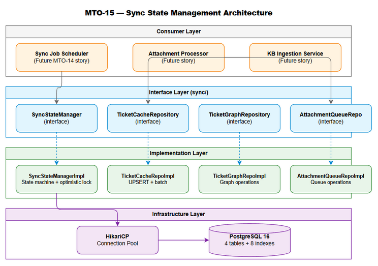
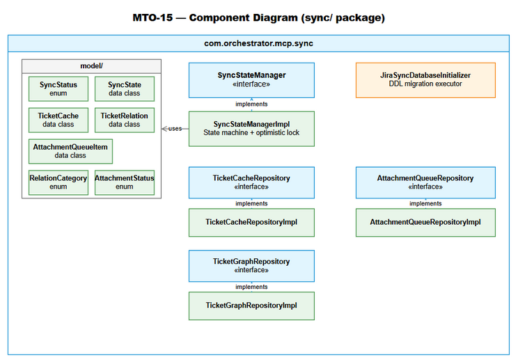
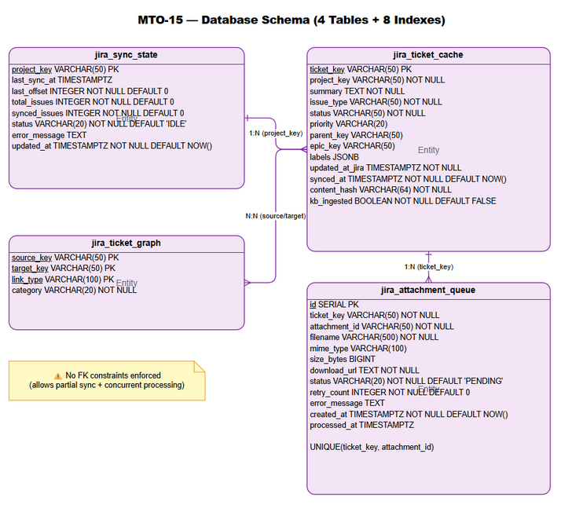
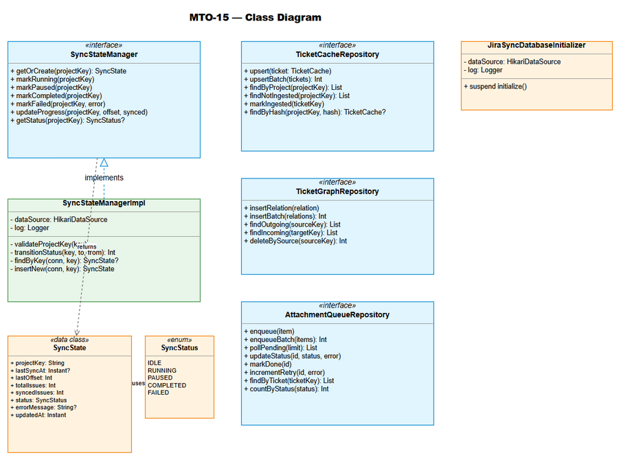
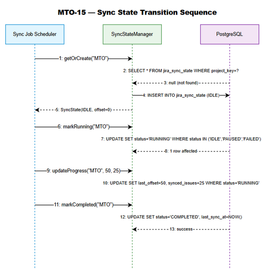

# Technical Design Document (TDD)

## MCPOrchestration — MTO-15: Database Schema & Sync State Management

---

## Document Information

| Field | Value |
|-------|-------|
| Jira Ticket | MTO-15 |
| Title | Database Schema & Sync State Management |
| Author | SA Agent |
| Version | 1.0 |
| Date | 2025-07-14 |
| Status | Draft |
| Related BRD | BRD-v1-MTO-15.docx |
| Related FSD | FSD-v1-MTO-15.docx |

---

## Author Tracking

| Role | Name - Position | Responsibility |
|------|-----------------|----------------|
| Author | SA Agent – Solution Architect | Create document |
| Peer Reviewer | Tech Lead – Senior Engineer | Review document |

---

## Revision History

| Version | Date | Author | Changes |
|---------|------|--------|---------|
| 1.0 | 2025-07-14 | SA Agent | Initiate document — auto-generated from BRD and FSD |

---

## Sign-Off

| Name | Signature and date |
|------|--------------------|
| | ☐ I agree and confirm the technical design in this TDD |
| | ☐ I agree and confirm the technical design in this TDD |

---

## 1. Introduction

> **Scope Boundary:** This TDD specifies HOW to implement the requirements defined in the FSD. It does NOT repeat functional requirements, business rules, use cases, or UI specifications — refer to the FSD for those. This document focuses on: technology choices, architecture decisions, implementation patterns, and deployment concerns.

### 1.1 Purpose

This TDD provides the technical design for the Database Schema & Sync State Management module (MTO-15), the foundational persistence layer for the Jira Project Sync Service (MTO-14 epic). It specifies:

- Physical database schema implementation (4 PostgreSQL tables + 8 indexes)
- `SyncStateManager` class design with state machine and optimistic locking
- `JiraSyncDatabaseInitializer` migration executor following existing project patterns
- Repository classes for each table with UPSERT and batch operations
- Integration with existing HikariCP, Koin DI, and coroutine infrastructure
- Testing strategy using Kotest + MockK (unit) and Testcontainers (integration)

### 1.2 Scope

**Technical scope:**
- Package `com.orchestrator.mcp.sync/` — all new classes for this feature
- Migration script `V3__create_jira_sync_tables.sql`
- Extension of `AppModule.kt` with new Koin bindings
- Unit tests for state machine logic
- Integration tests for database operations with Testcontainers PostgreSQL

**Out of technical scope:**
- Jira API client implementation (future MTO-14 stories)
- Background job scheduler (future story)
- KB ingestion pipeline (future story)
- HTTP endpoints (this is internal Kotlin API only)

### 1.3 Technology Stack

| Layer | Technology | Version |
|-------|-----------|---------|
| Language | Kotlin | 2.3.20 |
| Platform | JVM | 21 |
| Framework | Ktor (Netty) | 3.4.0 |
| DI | Koin | 4.1.1 |
| Database | PostgreSQL | 16+ |
| Connection Pool | HikariCP | 6.2.1 |
| Coroutines | kotlinx.coroutines | 1.10.2 |
| Date/Time | kotlinx.datetime | 0.6.2 |
| Serialization | kotlinx.serialization-json | 1.8.1 |
| Logging | Logback Classic | 1.5.18 |
| Build Tool | Gradle (Kotlin DSL) | 8.x |
| Testing | Kotest | 5.9.1 |
| Testing | MockK | 1.14.2 |
| Testing | Testcontainers | 1.21.1 |

### 1.4 Design Principles

- **Interface/Impl Pattern** — All services expose an interface for testability and DI (existing project convention)
- **Coroutines + Dispatchers.IO** — All blocking DB operations wrapped in `withContext(Dispatchers.IO)` (existing pattern)
- **Optimistic Locking** — State transitions use `WHERE status = :expected` to prevent race conditions without pessimistic locks
- **Idempotent Migrations** — All DDL uses `IF NOT EXISTS` for safe re-execution
- **Immutable Data Classes** — Domain models are Kotlin `data class` with `val` properties
- **Single Responsibility** — Each repository handles one table; SyncStateManager handles lifecycle logic only
- **SOLID Compliance** — Interface segregation (separate repos), dependency inversion (inject via Koin)

### 1.5 Constraints

- Must integrate with existing `HikariDataSource` singleton (already in Koin)
- Must follow existing `DatabaseInitializer` pattern (no Flyway/Liquibase — manual SQL execution)
- No new external dependencies beyond what's already in `build.gradle.kts`
- File size limit: each `.kt` file ≤ 200 lines, each function ≤ 20 lines
- All DB operations must be non-blocking (suspend functions with Dispatchers.IO)
- PostgreSQL-specific features allowed (JSONB, partial indexes, CHECK constraints)

### 1.6 References

| Document | Location |
|----------|----------|
| BRD | BRD-v1-MTO-15.docx |
| FSD | FSD-v1-MTO-15.docx |
| Existing DatabaseInitializer | orchestrator-client/src/main/kotlin/.../vectordb/DatabaseInitializer.kt |
| Existing AgentLogService | orchestrator-server/src/main/kotlin/.../logging/AgentLogService.kt |
| Project Structure | .analysis/code-intelligence/project-structure.md |

---

## 2. System Architecture

### 2.1 Architecture Overview

The Database Schema & Sync State Management module is a persistence layer within the `orchestrator-server` module. It provides internal Kotlin APIs (no HTTP endpoints) for managing Jira synchronization state, ticket caching, relationship graphing, and attachment queuing.

The module follows a layered architecture:
- **Interface Layer** — `SyncStateManager` interface exposed to upstream consumers (Sync Job Scheduler)
- **Implementation Layer** — `SyncStateManagerImpl` with state machine logic + 4 Repository classes
- **Data Layer** — PostgreSQL tables accessed via HikariCP JDBC connections
- **Model Layer** — Immutable Kotlin data classes and enums



### 2.2 Component Diagram

The module consists of 6 primary components organized in the `com.orchestrator.mcp.sync` package:



| Component | Responsibility | Technology |
|-----------|---------------|------------|
| SyncStateManager | Lifecycle state machine, optimistic locking, progress tracking | Kotlin coroutines + JDBC |
| JiraSyncDatabaseInitializer | Execute DDL migration on startup | HikariCP + raw SQL |
| TicketCacheRepository | CRUD + UPSERT for ticket metadata cache | JDBC PreparedStatement |
| TicketGraphRepository | Insert/query directed graph edges | JDBC + composite PK |
| AttachmentQueueRepository | Queue operations (enqueue, poll, status update) | JDBC + partial indexes |
| Koin Module Extension | DI registration for all sync components | Koin 4.1.1 |

### 2.3 Deployment Architecture

This module deploys as part of the existing `mcp-orchestrator-all.jar` fat JAR. No separate deployment artifact is needed.


**Runtime topology:**
- Single JVM process (`mcp-orchestrator-all.jar`)
- PostgreSQL database (external, shared with existing tables)
- HikariCP connection pool (existing singleton, shared across all DB operations)

### 2.4 Communication Patterns

| From | To | Protocol | Pattern | Description |
|------|----|----------|---------|-------------|
| Sync Job Scheduler | SyncStateManager | Kotlin suspend call | Sync (coroutine) | State transitions and progress updates |
| SyncStateManager | PostgreSQL | JDBC over TCP | Sync (Dispatchers.IO) | SQL queries via HikariCP |
| Ticket Fetcher | TicketCacheRepository | Kotlin suspend call | Sync (coroutine) | Batch UPSERT of ticket metadata |
| Relationship Extractor | TicketGraphRepository | Kotlin suspend call | Sync (coroutine) | Insert graph edges |
| Attachment Discoverer | AttachmentQueueRepository | Kotlin suspend call | Sync (coroutine) | Enqueue attachments |
| Attachment Processor | AttachmentQueueRepository | Kotlin suspend call | Sync (coroutine) | Poll + status updates |
| Application Startup | JiraSyncDatabaseInitializer | Kotlin suspend call | Sync (coroutine) | Execute migration DDL |

---

## 3. API Design

> **Note:** This module exposes internal Kotlin APIs only (no HTTP endpoints). The "API" here refers to the public interface methods that upstream consumers (Sync Job Scheduler, Attachment Processor) will call via Koin DI injection.

### 3.1 API Overview

| # | Interface | Method | Description | Source |
|---|-----------|--------|-------------|--------|
| 1 | SyncStateManager | `getOrCreate(projectKey)` | Get or create sync state | UC-01 |
| 2 | SyncStateManager | `markRunning(projectKey)` | Transition to RUNNING | UC-01, UC-05 |
| 3 | SyncStateManager | `markPaused(projectKey)` | Transition to PAUSED | UC-05 |
| 4 | SyncStateManager | `markCompleted(projectKey)` | Transition to COMPLETED | UC-01, UC-05 |
| 5 | SyncStateManager | `markFailed(projectKey, error)` | Transition to FAILED | UC-05 |
| 6 | SyncStateManager | `updateProgress(projectKey, offset, synced)` | Update checkpoint | UC-01 |
| 7 | SyncStateManager | `getStatus(projectKey)` | Query current status | UC-05 |
| 8 | TicketCacheRepository | `upsert(ticket)` | Insert/update single ticket | UC-02 |
| 9 | TicketCacheRepository | `upsertBatch(tickets)` | Batch insert/update | UC-02 |
| 10 | TicketCacheRepository | `findByProject(projectKey)` | Get all tickets for project | UC-02 |
| 11 | TicketCacheRepository | `findNotIngested(projectKey)` | Get un-ingested tickets | UC-02 |
| 12 | TicketCacheRepository | `markIngested(ticketKey)` | Mark ticket as KB-ingested | UC-02 |
| 13 | TicketGraphRepository | `insertRelation(relation)` | Insert graph edge | UC-03 |
| 14 | TicketGraphRepository | `insertBatch(relations)` | Batch insert edges | UC-03 |
| 15 | TicketGraphRepository | `findOutgoing(sourceKey)` | Get outgoing edges | UC-03 |
| 16 | TicketGraphRepository | `findIncoming(targetKey)` | Get incoming edges | UC-03 |
| 17 | TicketGraphRepository | `deleteBySource(sourceKey)` | Delete outgoing edges | UC-03 |
| 18 | AttachmentQueueRepository | `enqueue(item)` | Add to queue | UC-04 |
| 19 | AttachmentQueueRepository | `enqueueBatch(items)` | Batch enqueue | UC-04 |
| 20 | AttachmentQueueRepository | `pollPending(limit)` | Poll oldest PENDING | UC-04 |
| 21 | AttachmentQueueRepository | `updateStatus(id, status, error)` | Update processing status | UC-04 |
| 22 | AttachmentQueueRepository | `markDone(id)` | Mark as DONE | UC-04 |
| 23 | AttachmentQueueRepository | `incrementRetry(id, error)` | Increment retry count | UC-04 |

### 3.2 SyncStateManager Interface Contract

**Implements:** UC-01, UC-05, BR-01 through BR-27

```kotlin
interface SyncStateManager {
    /** Get existing sync state or create new with IDLE status. Thread-safe via UPSERT. */
    suspend fun getOrCreate(projectKey: String): SyncState

    /** Transition to RUNNING. Allowed from: IDLE, PAUSED, FAILED. */
    suspend fun markRunning(projectKey: String)

    /** Transition to PAUSED. Allowed from: RUNNING only. */
    suspend fun markPaused(projectKey: String)

    /** Transition to COMPLETED. Allowed from: RUNNING only. Sets last_sync_at. */
    suspend fun markCompleted(projectKey: String)

    /** Transition to FAILED. Allowed from: RUNNING only. Stores error message. */
    suspend fun markFailed(projectKey: String, error: String)

    /** Update progress checkpoint atomically. Only when RUNNING. */
    suspend fun updateProgress(projectKey: String, offset: Int, synced: Int)

    /** Query current status. Returns null if project not tracked. */
    suspend fun getStatus(projectKey: String): SyncStatus?
}
```

**Error Contract:**

| Method | Exception | Condition |
|--------|-----------|-----------|
| All methods | `IllegalArgumentException` | projectKey is blank or > 50 chars |
| `markRunning` | `IllegalStateException` | Current status not in {IDLE, PAUSED, FAILED} |
| `markPaused` | `IllegalStateException` | Current status ≠ RUNNING |
| `markCompleted` | `IllegalStateException` | Current status ≠ RUNNING |
| `markFailed` | `IllegalStateException` | Current status ≠ RUNNING |
| `updateProgress` | `IllegalArgumentException` | offset < 0 or synced < 0 |
| `updateProgress` | `IllegalStateException` | Current status ≠ RUNNING |

### 3.3 Repository Interface Contracts

**TicketCacheRepository:**

```kotlin
interface TicketCacheRepository {
    suspend fun upsert(ticket: TicketCache)
    suspend fun upsertBatch(tickets: List<TicketCache>): Int
    suspend fun findByProject(projectKey: String): List<TicketCache>
    suspend fun findNotIngested(projectKey: String): List<TicketCache>
    suspend fun markIngested(ticketKey: String)
    suspend fun findByHash(projectKey: String, hash: String): TicketCache?
}
```

**TicketGraphRepository:**

```kotlin
interface TicketGraphRepository {
    suspend fun insertRelation(relation: TicketRelation)
    suspend fun insertBatch(relations: List<TicketRelation>): Int
    suspend fun findOutgoing(sourceKey: String): List<TicketRelation>
    suspend fun findIncoming(targetKey: String): List<TicketRelation>
    suspend fun findAllForProject(projectKey: String): List<TicketRelation>
    suspend fun deleteBySource(sourceKey: String): Int
}
```

**AttachmentQueueRepository:**

```kotlin
interface AttachmentQueueRepository {
    suspend fun enqueue(item: AttachmentQueueItem)
    suspend fun enqueueBatch(items: List<AttachmentQueueItem>): Int
    suspend fun pollPending(limit: Int): List<AttachmentQueueItem>
    suspend fun updateStatus(id: Int, status: AttachmentStatus, error: String? = null)
    suspend fun markDone(id: Int)
    suspend fun incrementRetry(id: Int, error: String)
    suspend fun findByTicket(ticketKey: String): List<AttachmentQueueItem>
    suspend fun countByStatus(status: AttachmentStatus): Int
}
```

---

## 4. Database Design

> **Prerequisite:** Logical data model (entities, relationships, business attributes) is defined in FSD §4. This section specifies the physical implementation: DDL scripts, indexes, migration plans, and query performance patterns.

### 4.1 Schema Overview



The physical schema consists of 4 tables in the default PostgreSQL schema:

| Table | Purpose | PK Type | Estimated Rows |
|-------|---------|---------|----------------|
| `jira_sync_state` | One row per project — sync lifecycle tracking | Natural (project_key) | 10-50 |
| `jira_ticket_cache` | Cached Jira ticket metadata | Natural (ticket_key) | 10,000-100,000 |
| `jira_ticket_graph` | Directed relationship edges between tickets | Composite (source, target, type) | 50,000-500,000 |
| `jira_attachment_queue` | Work queue for attachment processing | Surrogate (SERIAL id) | 1,000-50,000 |

### 4.2 DDL Scripts

#### Table: jira_sync_state

```sql
CREATE TABLE IF NOT EXISTS jira_sync_state (
    project_key VARCHAR(50) PRIMARY KEY,
    last_sync_at TIMESTAMPTZ,
    last_offset INTEGER NOT NULL DEFAULT 0,
    total_issues INTEGER NOT NULL DEFAULT 0,
    synced_issues INTEGER NOT NULL DEFAULT 0,
    status VARCHAR(20) NOT NULL DEFAULT 'IDLE',
    error_message TEXT,
    updated_at TIMESTAMPTZ NOT NULL DEFAULT NOW(),
    CONSTRAINT chk_sync_status CHECK (status IN ('IDLE', 'RUNNING', 'PAUSED', 'COMPLETED', 'FAILED')),
    CONSTRAINT chk_offset_non_negative CHECK (last_offset >= 0),
    CONSTRAINT chk_total_non_negative CHECK (total_issues >= 0),
    CONSTRAINT chk_synced_non_negative CHECK (synced_issues >= 0)
);

COMMENT ON TABLE jira_sync_state IS 'Tracks synchronization progress per Jira project';
COMMENT ON COLUMN jira_sync_state.project_key IS 'Jira project key (e.g., MTO)';
COMMENT ON COLUMN jira_sync_state.last_offset IS 'Resumable checkpoint — last processed offset';
COMMENT ON COLUMN jira_sync_state.status IS 'Lifecycle state: IDLE, RUNNING, PAUSED, COMPLETED, FAILED';
```

#### Table: jira_ticket_cache

```sql
CREATE TABLE IF NOT EXISTS jira_ticket_cache (
    ticket_key VARCHAR(50) PRIMARY KEY,
    project_key VARCHAR(50) NOT NULL,
    summary TEXT NOT NULL,
    issue_type VARCHAR(50) NOT NULL,
    status VARCHAR(50) NOT NULL,
    priority VARCHAR(20),
    parent_key VARCHAR(50),
    epic_key VARCHAR(50),
    labels JSONB,
    created_at TIMESTAMPTZ,
    updated_at_jira TIMESTAMPTZ NOT NULL,
    synced_at TIMESTAMPTZ NOT NULL DEFAULT NOW(),
    content_hash VARCHAR(64) NOT NULL,
    description TEXT,
    comments_json JSONB,
    kb_ingested BOOLEAN NOT NULL DEFAULT FALSE
);

COMMENT ON TABLE jira_ticket_cache IS 'Local cache of Jira ticket metadata for change detection';
COMMENT ON COLUMN jira_ticket_cache.content_hash IS 'SHA-256 hash of key fields for change detection';
COMMENT ON COLUMN jira_ticket_cache.kb_ingested IS 'Whether ticket has been ingested into Knowledge Base';
COMMENT ON COLUMN jira_ticket_cache.created_at IS 'Jira ticket creation timestamp (MTO-18 required field)';
COMMENT ON COLUMN jira_ticket_cache.description IS 'Full ticket description for deep content crawl (MTO-18)';
COMMENT ON COLUMN jira_ticket_cache.comments_json IS 'JSONB array of comments for deep content crawl (MTO-18)';
```

#### Table: jira_ticket_graph

```sql
CREATE TABLE IF NOT EXISTS jira_ticket_graph (
    source_key VARCHAR(50) NOT NULL,
    target_key VARCHAR(50) NOT NULL,
    link_type VARCHAR(100) NOT NULL,
    category VARCHAR(20) NOT NULL,
    PRIMARY KEY (source_key, target_key, link_type),
    CONSTRAINT chk_graph_category CHECK (category IN ('INWARD', 'OUTWARD', 'SUBTASK', 'EPIC'))
);

COMMENT ON TABLE jira_ticket_graph IS 'Directed graph of ticket relationships for dependency visualization';
COMMENT ON COLUMN jira_ticket_graph.category IS 'Relationship category: INWARD, OUTWARD, SUBTASK, EPIC';
```

#### Table: jira_attachment_queue

```sql
CREATE TABLE IF NOT EXISTS jira_attachment_queue (
    id SERIAL PRIMARY KEY,
    ticket_key VARCHAR(50) NOT NULL,
    attachment_id VARCHAR(50) NOT NULL,
    filename VARCHAR(500) NOT NULL,
    mime_type VARCHAR(100),
    size_bytes BIGINT,
    download_url TEXT NOT NULL,
    status VARCHAR(20) NOT NULL DEFAULT 'PENDING',
    retry_count INTEGER NOT NULL DEFAULT 0,
    error_message TEXT,
    created_at TIMESTAMPTZ NOT NULL DEFAULT NOW(),
    processed_at TIMESTAMPTZ,
    CONSTRAINT chk_attachment_status CHECK (status IN ('PENDING', 'DOWNLOADING', 'PROCESSING', 'DONE', 'FAILED')),
    CONSTRAINT chk_retry_non_negative CHECK (retry_count >= 0),
    CONSTRAINT uq_ticket_attachment UNIQUE (ticket_key, attachment_id)
);

COMMENT ON TABLE jira_attachment_queue IS 'Queue for asynchronous attachment download and processing';
COMMENT ON COLUMN jira_attachment_queue.status IS 'Lifecycle: PENDING, DOWNLOADING, PROCESSING, DONE, FAILED';
```

#### Indexes

```sql
-- jira_ticket_cache indexes
CREATE INDEX IF NOT EXISTS idx_ticket_cache_project ON jira_ticket_cache (project_key);
CREATE INDEX IF NOT EXISTS idx_ticket_cache_updated ON jira_ticket_cache (updated_at_jira);
CREATE INDEX IF NOT EXISTS idx_ticket_cache_not_ingested ON jira_ticket_cache (kb_ingested) WHERE kb_ingested = FALSE;
CREATE INDEX IF NOT EXISTS idx_ticket_cache_labels ON jira_ticket_cache USING GIN (labels);

-- jira_ticket_graph indexes
CREATE INDEX IF NOT EXISTS idx_ticket_graph_source ON jira_ticket_graph (source_key);
CREATE INDEX IF NOT EXISTS idx_ticket_graph_target ON jira_ticket_graph (target_key);

-- jira_attachment_queue indexes
CREATE INDEX IF NOT EXISTS idx_attachment_queue_status ON jira_attachment_queue (status);
CREATE INDEX IF NOT EXISTS idx_attachment_queue_ticket ON jira_attachment_queue (ticket_key);
CREATE INDEX IF NOT EXISTS idx_attachment_queue_pending ON jira_attachment_queue (status, created_at) WHERE status = 'PENDING';
```

### 4.3 Migration Plan

| Order | Script | Description | Estimated Time | Rollback |
|-------|--------|-------------|----------------|----------|
| 1 | V3__create_jira_sync_tables.sql | Create all 4 tables + 8 indexes | < 1 second | DROP TABLE IF EXISTS (reverse order) |

**Migration execution pattern:**

```kotlin
class JiraSyncDatabaseInitializer(private val dataSource: HikariDataSource) {
    private val log = LoggerFactory.getLogger(javaClass)

    suspend fun initialize() = withContext(Dispatchers.IO) {
        log.info("Initializing Jira sync database schema...")
        dataSource.connection.use { conn ->
            conn.autoCommit = false
            try {
                conn.createStatement().use { stmt ->
                    stmt.execute(CREATE_JIRA_SYNC_STATE)
                    stmt.execute(CREATE_JIRA_TICKET_CACHE)
                    stmt.execute(CREATE_JIRA_TICKET_GRAPH)
                    stmt.execute(CREATE_JIRA_ATTACHMENT_QUEUE)
                    stmt.execute(CREATE_INDEXES)
                }
                conn.commit()
                log.info("Jira sync database schema initialized successfully.")
            } catch (e: Exception) {
                conn.rollback()
                log.error("Failed to initialize Jira sync schema", e)
                throw e
            }
        }
    }
}
```

**Rollback script (manual, for emergency use):**

```sql
-- V3__rollback_jira_sync_tables.sql
DROP TABLE IF EXISTS jira_attachment_queue CASCADE;
DROP TABLE IF EXISTS jira_ticket_graph CASCADE;
DROP TABLE IF EXISTS jira_ticket_cache CASCADE;
DROP TABLE IF EXISTS jira_sync_state CASCADE;
```

### 4.4 Query Patterns

| Operation | Query Pattern | Expected Performance | Index Used |
|-----------|--------------|---------------------|------------|
| Get sync state | `SELECT * FROM jira_sync_state WHERE project_key = ?` | < 1ms (PK lookup) | PK |
| Update sync status | `UPDATE jira_sync_state SET status=? WHERE project_key=? AND status=?` | < 5ms | PK |
| Upsert ticket | `INSERT INTO jira_ticket_cache ... ON CONFLICT (ticket_key) DO UPDATE` | < 5ms | PK |
| Batch upsert (100) | Same as above in loop with single transaction | < 100ms | PK |
| Find tickets by project | `SELECT * FROM jira_ticket_cache WHERE project_key = ?` | < 50ms (1000 rows) | idx_ticket_cache_project |
| Find un-ingested | `SELECT * FROM jira_ticket_cache WHERE project_key=? AND kb_ingested=FALSE` | < 10ms | idx_ticket_cache_not_ingested |
| Insert graph edge | `INSERT INTO jira_ticket_graph ... ON CONFLICT DO NOTHING` | < 1ms | PK |
| Find outgoing edges | `SELECT * FROM jira_ticket_graph WHERE source_key = ?` | < 5ms | idx_ticket_graph_source |
| Poll pending attachments | `SELECT * FROM jira_attachment_queue WHERE status='PENDING' ORDER BY created_at LIMIT ?` | < 10ms | idx_attachment_queue_pending |
| Count by status | `SELECT COUNT(*) FROM jira_attachment_queue WHERE status = ?` | < 5ms | idx_attachment_queue_status |

---

## 5. Class / Module Design

### 5.1 Package Structure

```
com.orchestrator.mcp.sync/
├── model/
│   ├── SyncState.kt              # Data class — sync state record (≤30 lines)
│   ├── SyncStatus.kt             # Enum — IDLE, RUNNING, PAUSED, COMPLETED, FAILED (≤10 lines)
│   ├── TicketCache.kt            # Data class — cached ticket metadata (≤30 lines)
│   ├── TicketRelation.kt         # Data class — graph edge (≤15 lines)
│   ├── RelationCategory.kt       # Enum — INWARD, OUTWARD, SUBTASK, EPIC (≤10 lines)
│   ├── AttachmentQueueItem.kt    # Data class — queue entry (≤30 lines)
│   └── AttachmentStatus.kt       # Enum — PENDING, DOWNLOADING, PROCESSING, DONE, FAILED (≤10 lines)
├── SyncStateManager.kt           # Interface — 7 suspend methods (≤25 lines)
├── SyncStateManagerImpl.kt       # Implementation — state machine + optimistic locking (≤180 lines)
├── JiraSyncDatabaseInitializer.kt # Migration executor (≤80 lines)
├── TicketCacheRepository.kt      # Interface — 6 methods (≤20 lines)
├── TicketCacheRepositoryImpl.kt  # Implementation — UPSERT + batch (≤180 lines)
├── TicketGraphRepository.kt      # Interface — 6 methods (≤20 lines)
├── TicketGraphRepositoryImpl.kt  # Implementation — graph operations (≤150 lines)
├── AttachmentQueueRepository.kt  # Interface — 8 methods (≤25 lines)
└── AttachmentQueueRepositoryImpl.kt # Implementation — queue operations (≤180 lines)
```

**Total new files:** 15 (7 model + 4 interfaces + 4 implementations)
**Estimated total lines:** ~800 (all files ≤ 200 lines each)

### 5.2 Class Diagram



### 5.3 Key Interfaces

**SyncStateManager** (see §3.2 for full contract)

**JiraSyncDatabaseInitializer:**

```kotlin
class JiraSyncDatabaseInitializer(private val dataSource: HikariDataSource) {
    suspend fun initialize()  // Execute V3 migration DDL
}
```

### 5.4 Implementation Details — SyncStateManagerImpl

```kotlin
class SyncStateManagerImpl(
    private val dataSource: HikariDataSource
) : SyncStateManager {

    private val log = LoggerFactory.getLogger(javaClass)

    override suspend fun getOrCreate(projectKey: String): SyncState =
        withContext(Dispatchers.IO) {
            validateProjectKey(projectKey)
            dataSource.connection.use { conn ->
                // Try SELECT first
                val existing = findByKey(conn, projectKey)
                if (existing != null) return@withContext existing
                // INSERT new with IDLE status
                insertNew(conn, projectKey)
            }
        }

    override suspend fun markRunning(projectKey: String) =
        withContext(Dispatchers.IO) {
            validateProjectKey(projectKey)
            val allowed = listOf("IDLE", "PAUSED", "FAILED")
            val rows = transitionStatus(projectKey, "RUNNING", allowed)
            if (rows == 0) throwInvalidTransition(projectKey, "RUNNING")
        }

    // ... similar for markPaused, markCompleted, markFailed

    override suspend fun updateProgress(
        projectKey: String, offset: Int, synced: Int
    ) = withContext(Dispatchers.IO) {
        require(offset >= 0) { "Offset must be non-negative" }
        require(synced >= 0) { "Synced count must be non-negative" }
        val sql = """
            UPDATE jira_sync_state 
            SET last_offset = ?, synced_issues = ?, updated_at = NOW()
            WHERE project_key = ? AND status = 'RUNNING'
        """.trimIndent()
        val rows = dataSource.connection.use { conn ->
            conn.prepareStatement(sql).use { stmt ->
                stmt.setInt(1, offset)
                stmt.setInt(2, synced)
                stmt.setString(3, projectKey)
                stmt.executeUpdate()
            }
        }
        if (rows == 0) {
            throw IllegalStateException(
                "Cannot update progress: project $projectKey is not RUNNING"
            )
        }
    }

    private fun validateProjectKey(key: String) {
        require(key.isNotBlank()) { "Project key must not be blank" }
        require(key.length <= 50) { "Project key exceeds 50 characters" }
    }

    private fun transitionStatus(
        projectKey: String, toStatus: String, fromStatuses: List<String>
    ): Int {
        val sql = """
            UPDATE jira_sync_state 
            SET status = ?, updated_at = NOW(), error_message = NULL
            WHERE project_key = ? AND status = ANY(?)
        """.trimIndent()
        return dataSource.connection.use { conn ->
            conn.prepareStatement(sql).use { stmt ->
                stmt.setString(1, toStatus)
                stmt.setString(2, projectKey)
                stmt.setArray(3, conn.createArrayOf("VARCHAR", fromStatuses.toTypedArray()))
                stmt.executeUpdate()
            }
        }
    }

    private fun throwInvalidTransition(projectKey: String, target: String) {
        val current = runBlocking { getStatus(projectKey) }
        throw IllegalStateException(
            "Cannot transition to $target from $current for project $projectKey"
        )
    }
}
```

### 5.5 Design Patterns

| Pattern | Where Used | Rationale |
|---------|-----------|-----------|
| Interface/Impl | All services and repositories | Testability via MockK; Koin DI binding |
| Optimistic Locking | SyncStateManagerImpl transitions | Prevent race conditions without DB-level locks |
| Repository | TicketCache/Graph/AttachmentQueue | Separation of concerns — each repo handles one table |
| Template Method | JiraSyncDatabaseInitializer.initialize() | Same pattern as existing DatabaseInitializer |
| UPSERT (Idempotent Write) | TicketCacheRepository, TicketGraphRepository | Safe re-execution, no duplicate errors |
| Work Queue | AttachmentQueueRepository | Persistent FIFO queue with status lifecycle |

### 5.6 Error Handling

| Exception | Context | When Thrown | Recovery |
|-----------|---------|------------|----------|
| `IllegalArgumentException` | Input validation | Blank/oversized projectKey, negative offset | Caller fixes input (programming error) |
| `IllegalStateException` | State machine | Invalid transition or concurrent modification | Caller logs warning, skips or retries once |
| `SQLException` | Database operations | Connection failure, constraint violation | Propagates to caller; RetryUtils handles |
| `DataIntegrityViolationException` | JSONB validation | Invalid labels JSON in ticket cache | Skip single ticket, log error, continue batch |

### 5.7 Koin DI Registration

```kotlin
// Extension to existing AppModule.kt
val syncModule = module {
    single { JiraSyncDatabaseInitializer(get()) }
    single<SyncStateManager> { SyncStateManagerImpl(get()) }
    single<TicketCacheRepository> { TicketCacheRepositoryImpl(get()) }
    single<TicketGraphRepository> { TicketGraphRepositoryImpl(get()) }
    single<AttachmentQueueRepository> { AttachmentQueueRepositoryImpl(get()) }
}
```

**Startup initialization order:**
1. HikariDataSource created (existing)
2. `JiraSyncDatabaseInitializer.initialize()` called (new — after existing DatabaseInitializer)
3. All repository singletons available via Koin

---

## 6. Integration Design

> **Prerequisite:** Business integration requirements are defined in FSD §5. This section specifies the technical implementation.

### 6.1 External System: PostgreSQL Database

| Attribute | Value |
|-----------|-------|
| Protocol | JDBC (PostgreSQL driver) |
| Connection | Via HikariCP pool (existing singleton) |
| Authentication | Username/password from `application.yml` |
| Timeout | Connection acquire: 30s (HikariCP default) |
| Retry Policy | No retry at repository level — caller uses RetryUtils |
| Circuit Breaker | Not applicable (single DB, HikariCP handles pool exhaustion) |

**Connection Configuration (existing in application.yml):**

```yaml
orchestrator:
  database:
    url: "jdbc:postgresql://localhost:5432/mcp_orchestrator"
    username: "${DB_USERNAME:postgres}"
    password: "${DB_PASSWORD:postgres}"
    pool:
      maximum_pool_size: 10
      minimum_idle: 2
      idle_timeout_ms: 600000
      connection_timeout_ms: 30000
```

**Data Mapping (Kotlin ↔ PostgreSQL):**

| Kotlin Type | PostgreSQL Type | Transformation |
|-------------|----------------|----------------|
| `String` | `VARCHAR(N)` | Direct mapping |
| `Int` | `INTEGER` | Direct mapping |
| `Long` | `BIGINT` | Direct mapping |
| `Boolean` | `BOOLEAN` | Direct mapping |
| `Instant` (kotlinx.datetime) | `TIMESTAMPTZ` | `Timestamp.from(instant.toJavaInstant())` |
| `List<String>?` | `JSONB` | `Json.encodeToString(list)` / `Json.decodeFromString(jsonStr)` |
| `SyncStatus` (enum) | `VARCHAR(20)` | `.name` / `SyncStatus.valueOf(str)` |
| `RelationCategory` (enum) | `VARCHAR(20)` | `.name` / `RelationCategory.valueOf(str)` |
| `AttachmentStatus` (enum) | `VARCHAR(20)` | `.name` / `AttachmentStatus.valueOf(str)` |

### 6.2 External System: HikariCP Connection Pool

| Attribute | Value |
|-----------|-------|
| Protocol | In-process (JVM library) |
| Integration | Koin DI injection of `HikariDataSource` |
| Pattern | `dataSource.connection.use { conn -> ... }` (auto-close) |
| Threading | All DB calls wrapped in `withContext(Dispatchers.IO)` |

**Sequence Diagram — Sync State Transition:**



### 6.3 External System: Koin DI Framework

| Attribute | Value |
|-----------|-------|
| Protocol | In-process (JVM library) |
| Integration | Module registration at startup |
| Pattern | `single<Interface> { Impl(get()) }` |

**Registration sequence:**
1. `Application.kt` → `startKoin { modules(appModule, syncModule) }`
2. Koin resolves `HikariDataSource` (existing binding)
3. Koin creates `JiraSyncDatabaseInitializer(dataSource)` singleton
4. Application calls `get<JiraSyncDatabaseInitializer>().initialize()`
5. Koin creates repository singletons on first access

---

## 7. Security Design

> **Prerequisite:** Business security requirements are defined in FSD §7.

### 7.1 Authentication

This module is an internal service — no external authentication. Access is controlled at the application level:
- Only Koin-registered services can obtain repository instances
- No HTTP endpoints exposed (internal Kotlin API only)
- Database credentials managed via environment variables (`DB_USERNAME`, `DB_PASSWORD`)

### 7.2 Authorization

| Role | Access | Enforcement |
|------|--------|-------------|
| Sync Job Scheduler | Full CRUD on all tables | Application-level (Koin DI injection) |
| Attachment Processor | Read/Write attachment queue | Application-level |
| KB Ingestion Service | Read ticket cache, write kb_ingested | Application-level |
| External users | No access | No HTTP endpoints |

### 7.3 Data Protection

| Data Type | At Rest | In Transit | In Logs |
|-----------|---------|------------|---------|
| Jira ticket metadata | Plain (PostgreSQL) | TLS (if remote DB) | Allowed (internal data) |
| Attachment download URLs | Plain (PostgreSQL) | TLS | **EXCLUDED** (contains auth tokens) |
| Sync error messages | Plain (PostgreSQL) | TLS | Allowed (debugging) |
| Content hashes (SHA-256) | Plain | TLS | Allowed (non-reversible) |
| Database credentials | Environment variables | N/A | **EXCLUDED** |

### 7.4 Input Validation

| Field | Validation | Enforcement |
|-------|-----------|-------------|
| projectKey | Non-blank, ≤50 chars, pattern `[A-Z]+` | `validateProjectKey()` in SyncStateManagerImpl |
| ticketKey | Non-blank, ≤50 chars, pattern `[A-Z]+-\d+` | Repository-level validation |
| contentHash | Exactly 64 hex characters | `require(hash.length == 64)` |
| offset | ≥ 0 | `require(offset >= 0)` |
| synced | ≥ 0 | `require(synced >= 0)` |
| labels (JSONB) | Valid JSON array or null | PostgreSQL JSONB type enforcement |
| category | One of: INWARD, OUTWARD, SUBTASK, EPIC | Kotlin enum + CHECK constraint |
| status | One of: IDLE, RUNNING, PAUSED, COMPLETED, FAILED | Kotlin enum + CHECK constraint |

---

## 8. Performance & Scalability

> **Prerequisite:** Business NFR targets are defined in FSD §8.

### 8.1 Caching Strategy

| Cache | What | TTL | Eviction | Technology |
|-------|------|-----|----------|------------|
| N/A | No application-level caching needed | — | — | — |

**Rationale:** All queries are simple PK lookups or indexed queries with < 10ms response time. Adding a cache layer would introduce complexity (invalidation, consistency) without meaningful performance gain for this workload.

### 8.2 Connection Pooling

| Resource | Min | Max | Timeout | Idle Timeout |
|----------|-----|-----|---------|-------------|
| PostgreSQL (HikariCP) | 2 | 10 | 30,000ms | 600,000ms |

**Shared pool:** The sync module shares the existing HikariCP pool with other modules (tool registry, agent logging). The pool size of 10 is sufficient for:
- 1-2 concurrent sync jobs (each holds connection briefly per operation)
- Background attachment processor (1 connection per poll cycle)
- Existing modules (tool toggle, agent log)

### 8.3 Performance Targets

| Operation | Target (p99) | Measurement | Bottleneck |
|-----------|-------------|-------------|------------|
| Single sync state update | < 5ms | JDBC round-trip | Network latency to DB |
| Batch UPSERT (100 tickets) | < 200ms | Single transaction | Sequential PreparedStatement execution |
| Attachment queue poll | < 10ms | Partial index scan | Index on (status, created_at) |
| Graph edge insert (single) | < 2ms | PK lookup + insert | Composite PK check |
| Migration execution (cold start) | < 500ms | DDL execution | Table creation (one-time) |

### 8.4 Scalability Considerations

| Dimension | Current Design | Future Scaling Path |
|-----------|---------------|---------------------|
| Projects | 50 concurrent (one row each) | No change needed — PK lookup is O(1) |
| Tickets per project | 100,000 | Partition by project_key if > 1M |
| Graph edges | 500,000 | Partition by source_key prefix if > 5M |
| Attachment queue | 50,000 active | Archive DONE entries to separate table if > 100K |
| Concurrent sync jobs | 1 per project (optimistic lock) | No change — lock prevents concurrent runs |

---

## 9. Monitoring & Observability

### 9.1 Logging

| Log Event | Level | Fields | Destination |
|-----------|-------|--------|-------------|
| Schema initialization start | INFO | — | Logback (stdout + file) |
| Schema initialization success | INFO | — | Logback |
| Schema initialization failure | ERROR | exception, SQL context | Logback |
| State transition | INFO | projectKey, fromStatus, toStatus | Logback |
| Invalid state transition | WARN | projectKey, currentStatus, attemptedTarget | Logback |
| Concurrent modification detected | WARN | projectKey, targetStatus | Logback |
| Batch UPSERT completed | DEBUG | projectKey, count, durationMs | Logback |
| Attachment queue poll | DEBUG | pendingCount, polledCount | Logback |
| Attachment processing failure | WARN | ticketKey, attachmentId, error, retryCount | Logback |

### 9.2 Metrics

| Metric | Type | Description | Alert Threshold |
|--------|------|-------------|-----------------|
| `sync.state.transitions.total` | Counter | Total state transitions (by project, from, to) | — |
| `sync.state.failures.total` | Counter | Failed transitions (invalid state) | > 10/minute |
| `sync.tickets.upserted.total` | Counter | Tickets upserted (by project) | — |
| `sync.tickets.batch.duration_ms` | Histogram | Batch UPSERT duration | p99 > 500ms |
| `sync.attachments.pending` | Gauge | Current PENDING attachment count | > 1000 |
| `sync.attachments.failed` | Counter | Failed attachment processing | > 50/hour |
| `sync.db.connection.acquire_ms` | Histogram | HikariCP connection acquire time | p99 > 5000ms |

> **Note:** Metrics are emitted via SLF4J structured logging (existing pattern). Future story may add Micrometer/Prometheus integration.

### 9.3 Health Checks

| Check | Method | Expected Response | Failure Action |
|-------|--------|-------------------|----------------|
| Database connectivity | `SELECT 1` via HikariCP | Success within 5s | Log ERROR, retry |
| Sync tables exist | `SELECT COUNT(*) FROM jira_sync_state` | No exception | Re-run migration |

---

## 10. Deployment Considerations

### 10.1 Environment Configuration

| Property | DEV | SIT | UAT | PROD |
|----------|-----|-----|-----|------|
| DB URL | localhost:5432 | sit-db:5432 | uat-db:5432 | prod-db:5432 |
| DB Pool Max | 5 | 10 | 10 | 20 |
| DB Pool Min | 1 | 2 | 2 | 5 |
| Log Level (sync) | DEBUG | INFO | INFO | INFO |

### 10.2 Feature Flags

| Flag | Default | Description |
|------|---------|-------------|
| `sync.enabled` | `true` | Master switch for sync module initialization |
| `sync.attachment_processing.enabled` | `true` | Enable/disable attachment queue processing |

**Implementation:** Feature flags are read from `application.yml` at startup. If `sync.enabled = false`, the `JiraSyncDatabaseInitializer` is not called and sync repositories are not registered in Koin.

### 10.3 Rollback Strategy

| Scenario | Rollback Action | Data Impact |
|----------|----------------|-------------|
| Bug in SyncStateManager logic | Redeploy previous JAR version | No data loss — tables remain |
| Schema migration issue | Run rollback SQL (DROP tables) | **Data loss** — all sync state lost |
| Performance regression | Redeploy previous JAR + keep tables | No data loss |

**Rollback procedure:**
1. Stop application
2. If schema rollback needed: execute `V3__rollback_jira_sync_tables.sql`
3. Deploy previous JAR version
4. Start application (previous version won't call V3 migration)

### 10.4 Backward Compatibility

- **Database:** New tables only — no modification to existing tables. Fully backward-compatible.
- **Code:** New package `sync/` — no modification to existing classes. Fully backward-compatible.
- **Configuration:** New optional section in `application.yml`. Missing section = sync disabled.
- **Startup:** New initialization step added AFTER existing `DatabaseInitializer`. If it fails, application logs error but existing functionality is unaffected (sync module simply unavailable).

---

## 11. Testing Strategy

### 11.1 Test Architecture

| Level | Framework | Scope | Mocking |
|-------|-----------|-------|---------|
| Unit Tests | Kotest 5.9.1 + MockK 1.14.2 | SyncStateManagerImpl logic | Mock HikariDataSource, Connection, PreparedStatement |
| Integration Tests | Kotest + Testcontainers 1.21.1 | Full DB operations | Real PostgreSQL container, no mocks |

### 11.2 Unit Test Design — SyncStateManagerImpl

**Test class:** `SyncStateManagerImplTest.kt`

| Test Case | Input | Expected | BR |
|-----------|-------|----------|-----|
| getOrCreate — new project | "MTO" (not in DB) | INSERT + return SyncState(IDLE) | BR-01 |
| getOrCreate — existing project | "MTO" (exists) | Return existing record | BR-01 |
| markRunning — from IDLE | status=IDLE | UPDATE to RUNNING | BR-21 |
| markRunning — from PAUSED | status=PAUSED | UPDATE to RUNNING | BR-21 |
| markRunning — from FAILED | status=FAILED | UPDATE to RUNNING | BR-21 |
| markRunning — from COMPLETED | status=COMPLETED | IllegalStateException | BR-21 |
| markPaused — from RUNNING | status=RUNNING | UPDATE to PAUSED | BR-22 |
| markPaused — from IDLE | status=IDLE | IllegalStateException | BR-22 |
| markCompleted — from RUNNING | status=RUNNING | UPDATE to COMPLETED + set last_sync_at | BR-23 |
| markFailed — from RUNNING | status=RUNNING | UPDATE to FAILED + store error | BR-24 |
| updateProgress — valid | offset=100, synced=50 | UPDATE offset and synced | BR-03, BR-04 |
| updateProgress — negative offset | offset=-1 | IllegalArgumentException | BR-03 |
| updateProgress — not RUNNING | status=IDLE | IllegalStateException | — |
| validateProjectKey — blank | "" | IllegalArgumentException | — |
| validateProjectKey — too long | 51 chars | IllegalArgumentException | — |
| concurrent modification | 0 rows affected | IllegalStateException | BR-26 |

**Mocking strategy:**
```kotlin
class SyncStateManagerImplTest : FunSpec({
    val dataSource = mockk<HikariDataSource>()
    val connection = mockk<Connection>()
    val statement = mockk<PreparedStatement>()
    val manager = SyncStateManagerImpl(dataSource)

    beforeEach {
        every { dataSource.connection } returns connection
        every { connection.prepareStatement(any()) } returns statement
        every { connection.close() } just Runs
    }
})
```

### 11.3 Integration Test Design — Database Operations

**Test class:** `JiraSyncDatabaseIntegrationTest.kt`

**Infrastructure:** Testcontainers PostgreSQL 16

```kotlin
class JiraSyncDatabaseIntegrationTest : FunSpec({
    val postgres = PostgreSQLContainer("postgres:16-alpine")
    lateinit var dataSource: HikariDataSource

    beforeSpec {
        postgres.start()
        dataSource = HikariDataSource().apply {
            jdbcUrl = postgres.jdbcUrl
            username = postgres.username
            password = postgres.password
        }
        // Run migration
        JiraSyncDatabaseInitializer(dataSource).initialize()
    }

    afterSpec {
        dataSource.close()
        postgres.stop()
    }
})
```

| Test Case | Scope | Validates |
|-----------|-------|-----------|
| Migration creates all 4 tables | DDL | Tables exist after initialize() |
| Migration is idempotent | DDL | Second initialize() doesn't throw |
| UPSERT inserts new ticket | TicketCacheRepo | Row created with correct values |
| UPSERT updates existing ticket | TicketCacheRepo | Row updated, synced_at refreshed |
| Batch UPSERT (100 tickets) | TicketCacheRepo | All 100 rows created, < 1s |
| Graph edge insert + duplicate | TicketGraphRepo | First succeeds, second is no-op |
| Self-referencing edge rejected | TicketGraphRepo | IllegalArgumentException |
| Attachment enqueue + poll | AttachmentQueueRepo | FIFO ordering by created_at |
| State transition full lifecycle | SyncStateManager | IDLE→RUNNING→COMPLETED |
| Concurrent modification | SyncStateManager | Second thread gets IllegalStateException |
| Partial index used for poll | EXPLAIN ANALYZE | idx_attachment_queue_pending in plan |
| CHECK constraint enforcement | DDL | Invalid status INSERT throws |

### 11.4 Test Data

**Fixtures:**
- `TestFixtures.kt` — factory methods for creating test data classes
- No CSV files needed (data classes are simple, created inline)

---

## 12. Implementation Checklist

### 12.1 Files to Create

| # | File Path | Type | Lines (est.) | Priority |
|---|-----------|------|-------------|----------|
| 1 | `sync/model/SyncStatus.kt` | Enum | 10 | P0 |
| 2 | `sync/model/SyncState.kt` | Data class | 25 | P0 |
| 3 | `sync/model/AttachmentStatus.kt` | Enum | 10 | P0 |
| 4 | `sync/model/AttachmentQueueItem.kt` | Data class | 30 | P0 |
| 5 | `sync/model/RelationCategory.kt` | Enum | 10 | P0 |
| 6 | `sync/model/TicketRelation.kt` | Data class | 15 | P0 |
| 7 | `sync/model/TicketCache.kt` | Data class | 30 | P0 |
| 8 | `sync/SyncStateManager.kt` | Interface | 25 | P0 |
| 9 | `sync/SyncStateManagerImpl.kt` | Implementation | 180 | P0 |
| 10 | `sync/JiraSyncDatabaseInitializer.kt` | Migration | 80 | P0 |
| 11 | `sync/TicketCacheRepository.kt` | Interface | 20 | P1 |
| 12 | `sync/TicketCacheRepositoryImpl.kt` | Implementation | 180 | P1 |
| 13 | `sync/TicketGraphRepository.kt` | Interface | 20 | P1 |
| 14 | `sync/TicketGraphRepositoryImpl.kt` | Implementation | 150 | P1 |
| 15 | `sync/AttachmentQueueRepository.kt` | Interface | 25 | P1 |
| 16 | `sync/AttachmentQueueRepositoryImpl.kt` | Implementation | 180 | P1 |

**Base path:** `orchestrator-server/src/main/kotlin/com/orchestrator/mcp/`

### 12.2 Files to Modify

| # | File Path | Change | Impact |
|---|-----------|--------|--------|
| 1 | `di/AppModule.kt` | Add `syncModule` import and include | Low — additive only |
| 2 | `Application.kt` | Call `JiraSyncDatabaseInitializer.initialize()` after existing init | Low — additive only |

### 12.3 Test Files to Create

| # | File Path | Type | Lines (est.) |
|---|-----------|------|-------------|
| 1 | `sync/SyncStateManagerImplTest.kt` | Unit test | 150 |
| 2 | `sync/JiraSyncDatabaseIntegrationTest.kt` | Integration test | 180 |
| 3 | `sync/TicketCacheRepositoryImplTest.kt` | Integration test | 120 |
| 4 | `sync/TicketGraphRepositoryImplTest.kt` | Integration test | 100 |
| 5 | `sync/AttachmentQueueRepositoryImplTest.kt` | Integration test | 130 |

**Base path:** `orchestrator-server/src/test/kotlin/com/orchestrator/mcp/`

### 12.4 Implementation Order

```
Phase 1 (Foundation):
  1. Model classes (all 7 files) — no dependencies
  2. JiraSyncDatabaseInitializer — depends on HikariDataSource only
  3. SyncStateManager interface + impl — depends on models + HikariDataSource

Phase 2 (Repositories):
  4. TicketCacheRepository interface + impl
  5. TicketGraphRepository interface + impl
  6. AttachmentQueueRepository interface + impl

Phase 3 (Integration):
  7. Koin module extension (syncModule)
  8. Application.kt startup integration

Phase 4 (Testing):
  9. Unit tests for SyncStateManagerImpl
  10. Integration tests with Testcontainers
```

---

## 13. Appendix

### 13.1 Glossary

| Term | Definition |
|------|------------|
| Optimistic Locking | Concurrency control using WHERE clause on expected state — no DB-level locks |
| UPSERT | INSERT ... ON CONFLICT ... DO UPDATE — atomic insert-or-update |
| Partial Index | PostgreSQL index with WHERE clause — indexes only matching rows |
| Composite PK | Primary key consisting of multiple columns |
| HikariCP | High-performance JDBC connection pool library |
| Dispatchers.IO | Kotlin coroutine dispatcher optimized for blocking I/O operations |
| Testcontainers | Library that provides throwaway Docker containers for integration testing |

### 13.2 Open Questions

| # | Question | Status | Answer |
|---|----------|--------|--------|
| 1 | Should COMPLETED state allow transition back to IDLE for re-sync? | Open | Future story may add `reset()` method |
| 2 | Should attachment queue have a dead-letter mechanism? | Open | Current design: FAILED items stay in table. Future story may archive. |
| 3 | Should we add a `created_at` column to `jira_sync_state`? | Resolved | No — `updated_at` with DEFAULT NOW() serves as creation timestamp for new rows |

### 13.3 Diagram Index

| # | Diagram | Image | Source (editable) |
|---|---------|-------|-------------------|
| 1 | Architecture Overview | [tdd-architecture.png](diagrams/tdd-architecture.png) | [tdd-architecture.drawio](diagrams/tdd-architecture.drawio) |
| 2 | Component Diagram | [tdd-component.png](diagrams/tdd-component.png) | [tdd-component.drawio](diagrams/tdd-component.drawio) |
| 3 | Class Diagram | [tdd-class-diagram.png](diagrams/tdd-class-diagram.png) | [tdd-class-diagram.drawio](diagrams/tdd-class-diagram.drawio) |
| 4 | Database Schema | [tdd-db-schema.png](diagrams/tdd-db-schema.png) | [tdd-db-schema.drawio](diagrams/tdd-db-schema.drawio) |
| 5 | API Sequence | [tdd-api-sequence.png](diagrams/tdd-api-sequence.png) | [tdd-api-sequence.drawio](diagrams/tdd-api-sequence.drawio) |
| 6 | Deployment Diagram | [tdd-deployment.png](diagrams/tdd-deployment.png) | [tdd-deployment.drawio](diagrams/tdd-deployment.drawio) |

---

*End of Document*
