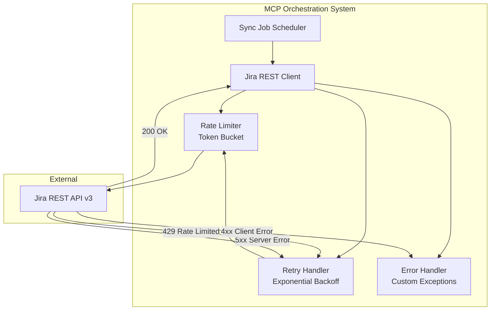
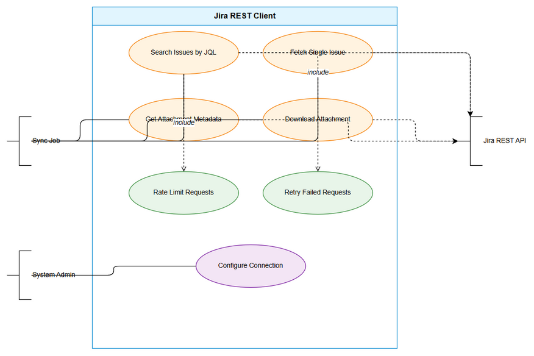
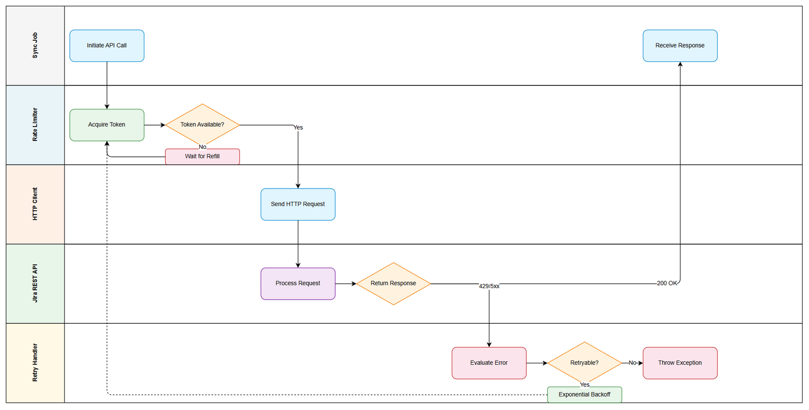
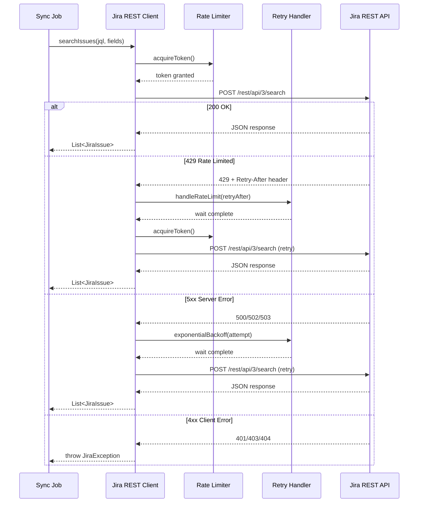

# Business Requirements Document (BRD)

## Jira Project Sync Service — MTO-16: Jira REST Client — Direct API Integration

---

## Document Information

| Field | Value |
|-------|-------|
| Jira Ticket | MTO-16 |
| Title | Jira REST Client — Direct API Integration |
| Author | BA Agent |
| Version | 1.0 |
| Date | 2025-07-14 |
| Status | Draft |
| Parent Epic | MTO-14 — Jira Project Sync Service: Background Job for Automated KB Ingestion |

---

## Author Tracking

| Role | Name - Position | Responsibility |
|------|-----------------|----------------|
| Author | BA Agent – Business Analyst | Create document |
| Peer Reviewer | SA Agent – Solution Architect | Review document |

---

## Revision History

| Version | Date | Author | Changes |
|---------|------|--------|---------|
| 1.0 | 2025-07-14 | BA Agent | Initiate document — auto-generated from Jira ticket MTO-16 and epic MTO-14 context |

---

## Sign-Off

| Name | Signature and date |
|------|--------------------|
| | ☐ I agree and confirm all criteria on this BRD as expected requirements |
| | ☐ I agree and confirm all criteria on this BRD as expected requirements |

---

## 1. Introduction

### 1.1 Scope

This document defines the business requirements for building a dedicated Jira REST API client that communicates directly with Jira Cloud/Server APIs. This client bypasses the MCP Atlassian connector to provide efficient, high-throughput access for the background sync job (Epic MTO-14).

The scope includes:

- **Ktor HTTP Client** with JSON serialization (kotlinx.serialization), Basic Auth, configurable base URL, connection pooling, and timeout management
- **4 API endpoint methods**: `searchIssues`, `getIssue`, `getAttachments`, `downloadAttachment`
- **Rate limiting** via token bucket algorithm (10 requests/second default) with 429 response handling
- **Retry logic** with exponential backoff (1s initial, 30s max, 3 retries max) for transient failures
- **Custom error handling** with typed exceptions and structured error parsing
- **Environment-based configuration** for all connection parameters

This is a **foundation story** — it provides the HTTP communication layer that the sync job orchestrator and ticket fetcher depend on.

### 1.2 Out of Scope

- Jira webhook integration (push-based notifications)
- OAuth 2.0 authentication (only Basic Auth with API token is in scope)
- Jira write operations (create/update/delete issues)
- Jira Cloud-specific features (Connect apps, Forge apps)
- Caching of API responses (handled by MTO-15 ticket cache layer)
- Background job scheduling and orchestration (separate story under MTO-14)
- Knowledge Base ingestion pipeline (separate story under MTO-14)
- UI/dashboard for monitoring API health

### 1.3 Preliminary Requirement

- Ktor Client library (CIO engine) is available in the project (already declared in `orchestrator-server/build.gradle.kts`)
- kotlinx.serialization is available for JSON parsing (already in project dependencies)
- Jira Cloud/Server instance is accessible with valid API credentials
- Environment variables for Jira connection can be configured in deployment environment
- PostgreSQL database is available for sync state tracking (MTO-15 dependency)

---

## 2. Business Requirements

### 2.1 High Level Process Map

The Jira REST Client provides a reliable, rate-limited HTTP communication layer between the MCP Orchestration system and Jira's REST API. It serves as the data acquisition component for the broader Jira Project Sync Service.




*[Edit in draw.io](diagrams/use-case.drawio)*


*[Edit in draw.io](diagrams/business-flow.drawio)*


### 2.2 List of User Stories / Use Cases

| # | Story / Use Case | Priority | Source Ticket |
|---|------------------|----------|---------------|
| 1 | As a sync job, I want to search Jira issues by JQL so that I can discover tickets to sync | MUST HAVE | MTO-16 |
| 2 | As a sync job, I want to fetch a single Jira issue with full details so that I can cache its data locally | MUST HAVE | MTO-16 |
| 3 | As a sync job, I want to retrieve attachment metadata for an issue so that I can queue attachments for download | MUST HAVE | MTO-16 |
| 4 | As a sync job, I want to download attachment binary content so that I can store and process attachments | MUST HAVE | MTO-16 |
| 5 | As a sync job, I want the client to respect Jira's rate limits so that the system does not get blocked | MUST HAVE | MTO-16 |
| 6 | As a sync job, I want failed requests to be retried with exponential backoff so that transient failures are handled gracefully | MUST HAVE | MTO-16 |
| 7 | As a system administrator, I want to configure Jira connection parameters via environment variables so that deployment is flexible | MUST HAVE | MTO-16 |

---

### 2.3 Details of User Stories

---

#### Business Flow

The Jira REST Client operates as follows:

**Step 1:** Sync Job Scheduler triggers a sync cycle and calls the Jira REST Client methods

**Step 2:** Client checks the token bucket rate limiter — if tokens available, proceed; otherwise wait until a token is available

**Step 3:** Client constructs the HTTP request with Basic Auth headers and JSON body (if POST)

**Step 4:** Client sends the request to Jira REST API via Ktor HTTP Client

**Step 5:** If response is 200 OK — deserialize JSON response and return typed result

**Step 6:** If response is 429 Too Many Requests — extract `Retry-After` header, wait the specified duration, then retry (up to max retries)

**Step 7:** If response is 5xx Server Error — apply exponential backoff and retry (up to max retries)

**Step 8:** If response is 4xx Client Error (not 429) — throw appropriate custom exception immediately (no retry)

**Step 9:** If max retries exhausted — throw exception with full context (correlation ID, attempt count, last error)

> **Note:** All API calls are coroutine-based (suspend functions) to support non-blocking I/O within the Ktor framework.



---

#### STORY 1: Search Jira Issues by JQL

> As a sync job, I want to search Jira issues by JQL so that I can discover tickets to sync.

**Requirement Details:**

1. Implement `searchIssues(jql: String, fields: List<String>, startAt: Int, maxResults: Int)` method
2. Use Jira REST API v3 endpoint: `POST /rest/api/3/search`
3. Support pagination via `startAt` and `maxResults` parameters
4. Allow field selection to minimize response payload size
5. Return deserialized response containing issues list, total count, and pagination metadata
6. Request body must be JSON with `jql`, `fields`, `startAt`, `maxResults` properties

**Data Fields:**

| Field | Type | Required | Description | Example |
|-------|------|----------|-------------|---------|
| jql | String | Yes | JQL query string | `"project = CRP AND updated >= -1d"` |
| fields | List\<String\> | No | Fields to return (empty = all) | `["summary", "status", "assignee"]` |
| startAt | Int | No | Pagination offset (default: 0) | `0` |
| maxResults | Int | No | Page size (default: 50, max: 100) | `50` |

**Response Data:**

| Field | Type | Description |
|-------|------|-------------|
| issues | List\<JiraIssue\> | List of matching issues |
| total | Int | Total number of matching issues |
| startAt | Int | Current offset |
| maxResults | Int | Requested page size |

**Acceptance Criteria:**

1. Given a valid JQL query, when `searchIssues` is called, then it returns a paginated list of issues matching the query
2. Given `startAt=0` and `maxResults=50`, when there are 120 matching issues, then the response contains 50 issues with `total=120`
3. Given specific fields are requested, when the API responds, then only those fields are present in the response
4. Given an invalid JQL query, when the API returns 400, then a `JiraClientException` is thrown with the error message from Jira
5. Given the API returns 429, when the client receives the response, then it waits for `Retry-After` duration and retries

**Validation Rules:**

- `jql` must not be blank/empty
- `maxResults` must be between 1 and 100 (Jira API limit)
- `startAt` must be >= 0
- `fields` list items must not contain empty strings

**Error Handling:**

- 400 Bad Request (invalid JQL): Throw `JiraClientException` with Jira's error messages
- 401 Unauthorized: Throw `JiraAuthException` indicating invalid credentials
- 403 Forbidden: Throw `JiraAuthException` indicating insufficient permissions
- 429 Too Many Requests: Retry after `Retry-After` header value
- 5xx Server Error: Retry with exponential backoff

---

#### STORY 2: Fetch Single Jira Issue

> As a sync job, I want to fetch a single Jira issue with full details so that I can cache its data locally.

**Requirement Details:**

1. Implement `getIssue(issueKey: String, fields: List<String>, expand: List<String>)` method
2. Use Jira REST API v3 endpoint: `GET /rest/api/3/issue/{issueKey}`
3. Support field selection via `fields` query parameter
4. Support expand parameter for additional data (changelog, renderedFields, transitions)
5. Return fully deserialized `JiraIssue` object with all requested fields

**Data Fields:**

| Field | Type | Required | Description | Example |
|-------|------|----------|-------------|---------|
| issueKey | String | Yes | Jira issue key | `"MTO-16"` |
| fields | List\<String\> | No | Fields to return | `["summary", "description", "status"]` |
| expand | List\<String\> | No | Sections to expand | `["changelog", "renderedFields"]` |

**Acceptance Criteria:**

1. Given a valid issue key, when `getIssue` is called, then it returns the full issue data with requested fields
2. Given `expand=["changelog"]`, when the API responds, then the changelog section is included in the response
3. Given a non-existent issue key, when the API returns 404, then a `JiraNotFoundException` is thrown
4. Given the issue key format is invalid, when validation runs, then a `JiraClientException` is thrown before making the API call

**Validation Rules:**

- `issueKey` must match pattern `[A-Z]+-\d+` (e.g., MTO-16, CRP-84)
- `fields` list items must not contain empty strings
- `expand` values must be from allowed set: `changelog`, `renderedFields`, `transitions`, `operations`, `editmeta`

**Error Handling:**

- 404 Not Found: Throw `JiraNotFoundException` with the issue key
- 401/403: Throw `JiraAuthException`
- 429: Retry with rate limit handling
- 5xx: Retry with exponential backoff

---

#### STORY 3: Retrieve Attachment Metadata

> As a sync job, I want to retrieve attachment metadata for an issue so that I can queue attachments for download.

**Requirement Details:**

1. Implement `getAttachments(issueKey: String)` method
2. Use Jira REST API v3 endpoint: `GET /rest/api/3/issue/{issueKey}?fields=attachment`
3. Return list of attachment metadata objects (filename, size, MIME type, download URL, author, created date)
4. This is a specialized variant of `getIssue` that only fetches the attachment field for efficiency

**Data Fields (Response):**

| Field | Type | Description | Example |
|-------|------|-------------|---------|
| id | String | Attachment ID | `"10001"` |
| filename | String | Original filename | `"screenshot.png"` |
| mimeType | String | MIME type | `"image/png"` |
| size | Long | File size in bytes | `245760` |
| content | String | Download URL | `"https://jira.example.com/secure/attachment/10001/screenshot.png"` |
| author | JiraUser | Who uploaded | `{displayName: "John Doe"}` |
| created | String | ISO 8601 timestamp | `"2025-07-10T14:30:00.000+0000"` |

**Acceptance Criteria:**

1. Given an issue with 3 attachments, when `getAttachments` is called, then it returns a list of 3 attachment metadata objects
2. Given an issue with no attachments, when `getAttachments` is called, then it returns an empty list
3. Given a non-existent issue key, when the API returns 404, then a `JiraNotFoundException` is thrown
4. Each attachment metadata must include: id, filename, mimeType, size, content URL, author, created date

**Validation Rules:**

- `issueKey` must match pattern `[A-Z]+-\d+`
- Response attachment objects must have non-null `content` URL for download

**Error Handling:**

- 404 Not Found: Throw `JiraNotFoundException`
- 401/403: Throw `JiraAuthException`
- 429/5xx: Standard retry logic applies

---

#### STORY 4: Download Attachment Binary Content

> As a sync job, I want to download attachment binary content so that I can store and process attachments.

**Requirement Details:**

1. Implement `downloadAttachment(url: String)` method
2. Perform HTTP GET on the attachment content URL (provided by `getAttachments` response)
3. Return binary content as `ByteArray` or streaming `ByteReadChannel`
4. Support large file downloads without loading entire content into memory
5. Include Basic Auth headers on download requests (Jira requires authentication for attachment downloads)

**Data Fields:**

| Field | Type | Required | Description | Example |
|-------|------|----------|-------------|---------|
| url | String | Yes | Full attachment download URL | `"https://jira.example.com/secure/attachment/10001/file.pdf"` |

**Acceptance Criteria:**

1. Given a valid attachment URL, when `downloadAttachment` is called, then it returns the binary content of the attachment
2. Given the attachment URL is inaccessible (404), when the download fails, then a `JiraNotFoundException` is thrown
3. Given a large attachment (>10MB), when downloading, then the client streams the content without buffering the entire file in memory
4. Given the download URL requires authentication, when the request is made, then Basic Auth headers are included

**Validation Rules:**

- `url` must be a valid HTTP/HTTPS URL
- `url` must belong to the configured Jira base URL domain (security check to prevent SSRF)

**Error Handling:**

- 404 Not Found: Throw `JiraNotFoundException` with the URL
- 401/403: Throw `JiraAuthException`
- Connection timeout: Throw `JiraTimeoutException`
- 429/5xx: Standard retry logic applies

---

#### STORY 5: Rate Limiting (Token Bucket)

> As a sync job, I want the client to respect Jira's rate limits so that the system does not get blocked.

**Requirement Details:**

1. Implement token bucket rate limiter with configurable rate (default: 10 requests/second)
2. Each API call must acquire a token before executing
3. If no tokens available, the caller suspends (coroutine-friendly) until a token is replenished
4. When Jira responds with 429, extract `Retry-After` header and pause all requests for that duration
5. Rate limiter must be thread-safe for concurrent coroutine access
6. Token bucket refills at a constant rate (e.g., 10 tokens/second = 1 token every 100ms)

**Data Fields (Configuration):**

| Field | Type | Required | Description | Default |
|-------|------|----------|-------------|---------|
| JIRA_RATE_LIMIT | Int | No | Max requests per second | `10` |
| burstCapacity | Int | No | Max burst tokens | `10` |
| refillRate | Double | No | Tokens added per second | `10.0` |

**Acceptance Criteria:**

1. Given rate limit is 10 req/s, when 15 requests are submitted simultaneously, then only 10 execute immediately and 5 wait for token replenishment
2. Given Jira returns 429 with `Retry-After: 5`, when the response is received, then all subsequent requests are paused for 5 seconds
3. Given the rate limiter is idle for 2 seconds, when a burst of 10 requests arrives, then all 10 execute immediately (bucket is full)
4. Given concurrent coroutines call the rate limiter, when tokens are limited, then access is fair and thread-safe (no race conditions)

**Validation Rules:**

- `JIRA_RATE_LIMIT` must be > 0
- `Retry-After` header value must be parsed as seconds (integer) or HTTP-date format
- Burst capacity must be >= 1

**Error Handling:**

- If `Retry-After` header is missing on 429 response: Use default backoff of 60 seconds
- If `Retry-After` value is unparseable: Use default backoff of 60 seconds

---

#### STORY 6: Retry Logic with Exponential Backoff

> As a sync job, I want failed requests to be retried with exponential backoff so that transient failures are handled gracefully.

**Requirement Details:**

1. Implement retry wrapper with exponential backoff strategy
2. Initial delay: 1 second, multiplied by 2 on each retry
3. Maximum delay cap: 30 seconds (prevents excessively long waits)
4. Maximum retry attempts: 3 (configurable via `JIRA_MAX_RETRIES`)
5. Retry on: HTTP 429 (rate limited) and 5xx (server errors)
6. Do NOT retry on: 4xx client errors (except 429) — these indicate permanent failures
7. Add jitter (±20%) to backoff delay to prevent thundering herd
8. Log each retry attempt with correlation ID, attempt number, and delay duration

**Data Fields (Configuration):**

| Field | Type | Required | Description | Default |
|-------|------|----------|-------------|---------|
| JIRA_MAX_RETRIES | Int | No | Maximum retry attempts | `3` |
| initialDelay | Long | No | Initial backoff delay (ms) | `1000` |
| maxDelay | Long | No | Maximum backoff delay (ms) | `30000` |
| multiplier | Double | No | Backoff multiplier | `2.0` |
| jitterFactor | Double | No | Jitter range (±%) | `0.2` |

**Acceptance Criteria:**

1. Given a 503 response on first attempt, when retry logic executes, then the request is retried after ~1 second
2. Given 3 consecutive 503 responses, when all retries are exhausted, then the original exception is thrown with retry context
3. Given a 404 response, when the error handler evaluates, then no retry is attempted and the exception is thrown immediately
4. Given a 429 response with `Retry-After: 10`, when retry logic executes, then the retry waits 10 seconds (not exponential backoff)
5. Given retry delays of 1s, 2s, 4s, when jitter is applied, then actual delays are within ±20% of those values
6. Given `JIRA_MAX_RETRIES=0`, when a retryable error occurs, then no retry is attempted

**Validation Rules:**

- `JIRA_MAX_RETRIES` must be >= 0
- `initialDelay` must be > 0
- `maxDelay` must be >= `initialDelay`
- `multiplier` must be > 1.0

**Error Handling:**

- After max retries exhausted: Throw the last exception wrapped with retry metadata (attempt count, total elapsed time)
- Retry timeout (total time > configured timeout): Abort retries and throw `JiraTimeoutException`

---

#### STORY 7: Environment-Based Configuration

> As a system administrator, I want to configure Jira connection parameters via environment variables so that deployment is flexible.

**Requirement Details:**

1. All Jira client configuration must be loadable from environment variables
2. Provide sensible defaults for optional parameters
3. Validate configuration at startup — fail fast if required values are missing
4. Support the existing project pattern of YAML config with env var resolution (e.g., `${JIRA_BASE_URL}`)
5. Configuration class must be immutable after initialization (data class)

**Data Fields (Configuration):**

| Field | Env Variable | Type | Required | Description | Default |
|-------|-------------|------|----------|-------------|---------|
| baseUrl | JIRA_BASE_URL | String | Yes | Jira instance URL | — |
| email | JIRA_EMAIL | String | Yes | Authentication email | — |
| apiToken | JIRA_API_TOKEN | String | Yes | Jira API token | — |
| rateLimit | JIRA_RATE_LIMIT | Int | No | Max requests/second | `10` |
| timeoutMs | JIRA_TIMEOUT_MS | Long | No | Request timeout (ms) | `30000` |
| maxRetries | JIRA_MAX_RETRIES | Int | No | Max retry attempts | `3` |
| connectTimeoutMs | JIRA_CONNECT_TIMEOUT_MS | Long | No | Connection timeout (ms) | `10000` |
| socketTimeoutMs | JIRA_SOCKET_TIMEOUT_MS | Long | No | Socket timeout (ms) | `30000` |

**Acceptance Criteria:**

1. Given `JIRA_BASE_URL`, `JIRA_EMAIL`, and `JIRA_API_TOKEN` are set, when the client initializes, then it connects successfully
2. Given `JIRA_BASE_URL` is not set, when the client initializes, then it throws a `ConfigException` with a clear error message
3. Given `JIRA_RATE_LIMIT=5`, when the client initializes, then the rate limiter is configured for 5 requests/second
4. Given `JIRA_TIMEOUT_MS=60000`, when a request takes longer than 60 seconds, then it times out
5. Given no optional env vars are set, when the client initializes, then default values are used for all optional parameters

**Validation Rules:**

- `JIRA_BASE_URL` must be a valid URL starting with `http://` or `https://`
- `JIRA_BASE_URL` must not have a trailing slash
- `JIRA_EMAIL` must be a valid email format
- `JIRA_API_TOKEN` must not be empty
- `JIRA_RATE_LIMIT` must be between 1 and 100
- `JIRA_TIMEOUT_MS` must be between 1000 and 300000 (1s to 5min)
- `JIRA_MAX_RETRIES` must be between 0 and 10

**Error Handling:**

- Missing required env var: Throw `ConfigException` listing all missing variables
- Invalid value format: Throw `ConfigException` with the variable name and expected format
- URL validation failure: Throw `ConfigException` with specific URL format guidance

---

## 3. Dependencies

| Dependency | Type | Related Ticket | Description |
|------------|------|----------------|-------------|
| Ktor Client (CIO) | System | N/A | HTTP client library — already in project dependencies |
| kotlinx.serialization | System | N/A | JSON serialization — already in project dependencies |
| kotlinx.coroutines | System | N/A | Async/suspend function support — already in project dependencies |
| Jira REST API v3 | External | N/A | Jira Cloud/Server REST API endpoint |
| MTO-15 (Sync State DB) | Story | MTO-15 | Provides sync state persistence — client status tracking |
| MTO-14 (Epic) | Epic | MTO-14 | Parent epic — Jira Project Sync Service |
| Jira API Credentials | Infrastructure | N/A | Valid Jira email + API token must be provisioned |

---

## 4. Stakeholders

| Role | Name / Team | Responsibility | Source |
|------|-------------|----------------|--------|
| Developer | Development Team | Implement the Jira REST Client | Ticket assignee |
| Solution Architect | SA Agent | Review technical design and integration patterns | Peer reviewer |
| DevOps | DevOps Team | Configure environment variables in deployment | Infrastructure |
| QA | QA Agent | Validate retry logic, rate limiting, error handling | Testing |

---

## 5. Risks and Assumptions

### 5.1 Risks

| Risk | Impact | Likelihood | Mitigation |
|------|--------|------------|------------|
| Jira API rate limits are stricter than expected | High | Medium | Make rate limit configurable; implement adaptive rate limiting based on 429 responses |
| Jira API v3 schema changes without notice | Medium | Low | Use lenient JSON parsing (ignoreUnknownKeys); version-pin API calls |
| Network instability causes frequent timeouts | Medium | Medium | Exponential backoff with jitter; configurable timeout values |
| API token rotation causes auth failures during sync | High | Low | Log clear auth error messages; support runtime credential refresh in future iteration |
| Large attachment downloads consume excessive memory | High | Medium | Stream downloads instead of buffering; implement size limits |

### 5.2 Assumptions

- Jira Cloud REST API v3 is the target API version (not v2)
- Basic Auth with email + API token is sufficient for all required operations
- The Jira instance allows programmatic access via API tokens
- Rate limit of 10 requests/second is within Jira's allowed limits for the account tier
- Attachment downloads are authenticated with the same credentials as API calls
- The sync job runs as a single instance (no distributed rate limiting needed)
- kotlinx.serialization can handle all Jira API response formats (including ADF — Atlassian Document Format)

---

## 6. Non-Functional Requirements

| Category | Requirement | Details |
|----------|-------------|---------|
| Performance | Request throughput | Support up to 10 requests/second sustained throughput (configurable) |
| Performance | Response timeout | Default 30s per request; configurable via `JIRA_TIMEOUT_MS` |
| Performance | Connection pooling | Reuse HTTP connections via Ktor CIO engine connection pool |
| Reliability | Retry on transient failures | Exponential backoff (1s, 2s, 4s) with max 3 retries on 429/5xx |
| Reliability | Graceful degradation | Rate limiter suspends callers rather than rejecting requests |
| Security | Credential storage | API token stored in environment variable, never logged or serialized |
| Security | SSRF prevention | Attachment download URLs validated against configured base URL domain |
| Security | TLS | All API communication over HTTPS (TLS 1.2+) |
| Observability | Structured logging | All requests logged with correlation ID, duration, status code |
| Observability | Error context | Exceptions include correlation ID, attempt count, endpoint, and error details |
| Scalability | Configurable limits | Rate limit, timeout, retries all configurable without code changes |
| Maintainability | Interface/Impl pattern | Client exposed via interface for testability and future alternative implementations |

---

## 7. Related Tickets

| Ticket Key | Summary | Status | Type | Relationship |
|------------|---------|--------|------|--------------|
| MTO-16 | Jira REST Client — Direct API Integration | In Progress | Story | Main ticket |
| MTO-14 | Jira Project Sync Service: Background Job for Automated KB Ingestion | In Progress | Epic | Parent epic |
| MTO-15 | Database Schema & Sync State Management | To Do | Story | Sibling — provides persistence layer |
| MTO-17 | Sync Job Orchestrator (assumed) | To Do | Story | Sibling — consumes this client |

---

## 8. Appendix

### Glossary

| Term | Definition |
|------|------------|
| JQL | Jira Query Language — SQL-like syntax for searching Jira issues |
| Token Bucket | Rate limiting algorithm that allows bursts up to bucket capacity, refilling at a constant rate |
| Exponential Backoff | Retry strategy where delay doubles after each failed attempt |
| Jitter | Random variation added to backoff delay to prevent synchronized retries (thundering herd) |
| CIO | Coroutine-based I/O — Ktor's non-blocking HTTP client engine |
| ADF | Atlassian Document Format — JSON-based rich text format used in Jira descriptions |
| Correlation ID | Unique identifier attached to a request for tracing across logs |
| SSRF | Server-Side Request Forgery — attack where server is tricked into making requests to unintended URLs |
| Basic Auth | HTTP authentication using Base64-encoded `email:token` in Authorization header |

### Reference Documents

| Document | Link / Location |
|----------|-----------------|
| Jira REST API v3 Documentation | https://developer.atlassian.com/cloud/jira/platform/rest/v3/ |
| Ktor Client Documentation | https://ktor.io/docs/client-overview.html |
| MTO-14 Epic (Parent) | Jira: MTO-14 |
| MTO-15 BRD (Database Schema) | documents/MTO-15/BRD.md |
| Project Structure | .analysis/code-intelligence/project-structure.md |

### API Endpoint Reference

| Method | Endpoint | HTTP Method | Description |
|--------|----------|-------------|-------------|
| searchIssues | /rest/api/3/search | POST | Search issues by JQL with pagination |
| getIssue | /rest/api/3/issue/{issueKey} | GET | Fetch single issue with field/expand options |
| getAttachments | /rest/api/3/issue/{issueKey}?fields=attachment | GET | Get attachment metadata for an issue |
| downloadAttachment | {attachment.content URL} | GET | Download attachment binary content |

### Custom Exception Hierarchy

```
JiraClientException (sealed)
├── JiraAuthException          — 401/403 authentication/authorization failures
├── JiraRateLimitException     — 429 rate limit exceeded (includes retryAfter value)
├── JiraNotFoundException      — 404 resource not found
├── JiraTimeoutException       — Request/connection timeout
├── JiraServerException        — 5xx server-side errors
└── JiraValidationException    — Client-side input validation failures
```

### Configuration YAML Example

```yaml
jira:
  base_url: ${JIRA_BASE_URL}
  email: ${JIRA_EMAIL}
  api_token: ${JIRA_API_TOKEN}
  rate_limit: ${JIRA_RATE_LIMIT:-10}
  timeout_ms: ${JIRA_TIMEOUT_MS:-30000}
  max_retries: ${JIRA_MAX_RETRIES:-3}
  connect_timeout_ms: ${JIRA_CONNECT_TIMEOUT_MS:-10000}
  socket_timeout_ms: ${JIRA_SOCKET_TIMEOUT_MS:-30000}
```
