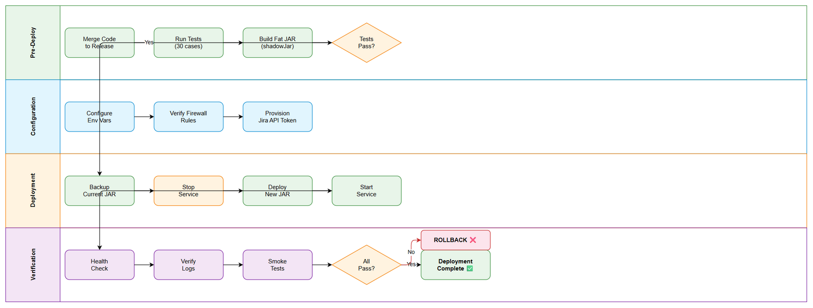
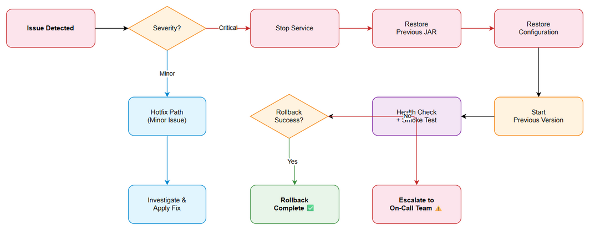

# Deployment Guide (DPG)

## MCP Orchestration Server — MTO-16: Jira REST Client — Direct API Integration

---

## Document Information

| Field | Value |
|-------|-------|
| Jira Ticket | MTO-16 |
| Title | Jira REST Client — Direct API Integration |
| Author | DevOps Agent |
| Version | 1.0 |
| Date | 2025-07-15 |
| Status | Draft |
| Related TDD | TDD-v1-MTO-16.docx |

---

## Revision History

| Version | Date | Author | Changes |
|---------|------|--------|---------|
| 1.0 | 2025-07-15 | DevOps Agent | Initiate document — auto-generated from TDD and project context |

---

## Sign-Off

| Name | Role | Signature and date |
|------|------|--------------------|
| | Dev Lead | ☐ Approved for deployment |
| | QA Lead | ☐ Testing completed |
| | Ops Lead | ☐ Infrastructure ready |

---

## 1. Overview

### 1.1 Feature Summary

The Jira REST Client module (`com.orchestrator.mcp.jira`) provides a dedicated HTTP communication layer that integrates directly with Jira Cloud/Server REST API v3. It enables high-throughput, resilient access for the background sync job (Epic MTO-14), bypassing the MCP Atlassian connector. The module includes:

- 4 API methods: `searchIssues`, `getIssue`, `getAttachments`, `downloadAttachment`
- Token bucket rate limiting (10 req/s default, coroutine-safe)
- Exponential backoff retry with jitter for transient failures
- Sealed exception hierarchy for structured error handling
- Environment-based configuration with fail-fast validation

### 1.2 Deployment Scope

| Item | Type | Description |
|------|------|-------------|
| `com.orchestrator.mcp.jira` package | New Module | Jira REST Client — 15 Kotlin source files |
| Environment Variables | New Configuration | 8 new env vars for Jira connectivity |
| Koin DI Module | Modified | `jiraModule` registered in AppModule |
| Fat JAR artifact | Modified | `mcp-orchestrator-all.jar` includes new module |
| Database | No Change | No database migrations required |

### 1.3 Target Environments

| Environment | URL | Deploy Order | Approval Required |
|-------------|-----|-------------|-------------------|
| DEV | http://localhost:9180 | 1st | No |
| SIT | https://sit-orchestrator.internal | 2nd | No |
| UAT | https://uat-orchestrator.internal | 3rd | QA Sign-off |
| PROD | https://orchestrator.internal | 4th | PM + Business Sign-off |

---

## 2. Prerequisites

### 2.1 Infrastructure

| Requirement | Status | Notes |
|-------------|--------|-------|
| JVM 21 runtime available | Ready | Already deployed in all environments |
| Outbound HTTPS access to Jira Cloud | Pending | Firewall rule for `*.atlassian.net:443` |
| Network access to Jira instance | Pending | Verify from each environment |
| Sufficient memory (additional ~50MB heap) | Ready | Current allocation sufficient |

### 2.2 Software Dependencies

| Dependency | Version | Status |
|-----------|---------|--------|
| JDK | 21 (Temurin) | Installed |
| Kotlin | 2.3.20 | Bundled in fat JAR |
| Ktor Client CIO | 3.4.0 | Bundled in fat JAR |
| kotlinx.serialization | 1.8.1 | Bundled in fat JAR |
| Koin | 4.1.1 | Bundled in fat JAR |
| Logback | 1.5.18 | Bundled in fat JAR |

### 2.3 Access Requirements

| Access | Type | Who Needs It |
|--------|------|-------------|
| Jira Cloud API Token | API Token (Basic Auth) | Service account |
| Jira Cloud email | Service account email | DevOps team |
| Server SSH access | Key-based | DevOps team |
| CI/CD pipeline | Service account | Automated |

### 2.4 Backup Requirements

- [ ] Application backup (previous version `mcp-orchestrator-all.jar` saved)
- [ ] Configuration backup (current environment variables exported)
- [ ] No database backup needed (no DB changes in this release)

---

## 3. Pre-Deployment Checklist

| # | Item | Responsible | Status |
|---|------|-------------|--------|
| 1 | Code merged to release branch | Developer | ☐ |
| 2 | All 30 unit/integration tests passed | QA | ☐ |
| 3 | Jira API credentials provisioned | DevOps | ☐ |
| 4 | Environment variables configured | DevOps | ☐ |
| 5 | Firewall rules for Jira Cloud access | Network Team | ☐ |
| 6 | Previous JAR artifact backed up | DevOps | ☐ |
| 7 | Rollback plan reviewed | Team | ☐ |
| 8 | Deployment window confirmed | PM | ☐ |
| 9 | Monitoring/alerting configured | DevOps | ☐ |
| 10 | Jira API connectivity verified from target env | DevOps | ☐ |

---

## 4. Database Migration

### 4.1 Migration Scripts

**No database migration required for MTO-16.**

This module is a pure HTTP client library with in-memory data structures. All persistence is handled by the downstream Ticket Cache module (MTO-15).

### 4.2 Verification

N/A — No database changes.

---

## 5. Application Deployment

### 5.1 Deployment Flow



### 5.2 Build Artifact

```bash
# Build the fat JAR (includes all dependencies)
./gradlew :orchestrator-server:shadowJar

# Output: orchestrator-server/build/libs/mcp-orchestrator-all.jar
# Verify artifact exists
ls -la orchestrator-server/build/libs/mcp-orchestrator-all.jar
```

### 5.3 Deployment Steps

| Step | Action | Command | Verification |
|------|--------|---------|-------------|
| 1 | Backup current JAR | `cp mcp-orchestrator-all.jar mcp-orchestrator-all.jar.bak` | File exists with previous timestamp |
| 2 | Stop existing service | `systemctl stop mcp-orchestrator` | `systemctl status` shows inactive |
| 3 | Deploy new artifact | `cp build/mcp-orchestrator-all.jar /opt/mcp-orchestrator/` | File size matches build output |
| 4 | Set environment variables | See Section 6.1 | `env | grep JIRA_` shows all vars |
| 5 | Start service | `systemctl start mcp-orchestrator` | `systemctl status` shows active |
| 6 | Verify startup logs | `journalctl -u mcp-orchestrator -f` | No ERROR/FATAL in logs |
| 7 | Health check | `curl http://localhost:9180/health` | 200 OK response |

### 5.4 Detailed Deployment Commands

```bash
# Step 1: Backup current version
TIMESTAMP=$(date +%Y%m%d_%H%M%S)
cp /opt/mcp-orchestrator/mcp-orchestrator-all.jar \
   /opt/mcp-orchestrator/backups/mcp-orchestrator-all-${TIMESTAMP}.jar

# Step 2: Stop service gracefully
sudo systemctl stop mcp-orchestrator
sleep 5
# Verify process is stopped
pgrep -f "mcp-orchestrator" && echo "WARNING: Process still running" || echo "OK: Process stopped"

# Step 3: Deploy new artifact
cp orchestrator-server/build/libs/mcp-orchestrator-all.jar /opt/mcp-orchestrator/mcp-orchestrator-all.jar
chmod 755 /opt/mcp-orchestrator/mcp-orchestrator-all.jar

# Step 4: Configure environment variables (see Section 6)
# Ensure /etc/mcp-orchestrator/env.conf is updated

# Step 5: Start service
sudo systemctl start mcp-orchestrator

# Step 6: Monitor startup (wait up to 30s)
for i in $(seq 1 30); do
  if curl -s http://localhost:9180/health > /dev/null 2>&1; then
    echo "Service is UP after ${i}s"
    break
  fi
  sleep 1
done

# Step 7: Verify Jira client initialization
journalctl -u mcp-orchestrator --since "1 minute ago" | grep -i "jira"
```

---

## 6. Configuration Changes

### 6.1 New Environment Variables

| Variable | Description | Required | DEV | SIT | UAT | PROD |
|----------|-------------|----------|-----|-----|-----|------|
| `JIRA_BASE_URL` | Jira instance base URL | **Yes** | `https://dev-project.atlassian.net` | `https://sit-project.atlassian.net` | `https://uat-project.atlassian.net` | `${VAULT_JIRA_BASE_URL}` |
| `JIRA_EMAIL` | Service account email | **Yes** | `dev-bot@company.com` | `sit-bot@company.com` | `uat-bot@company.com` | `${VAULT_JIRA_EMAIL}` |
| `JIRA_API_TOKEN` | Jira API token (secret) | **Yes** | `${DEV_JIRA_TOKEN}` | `${SIT_JIRA_TOKEN}` | `${UAT_JIRA_TOKEN}` | `${VAULT_JIRA_API_TOKEN}` |
| `JIRA_RATE_LIMIT` | Max requests/second | No | `10` | `10` | `10` | `5` |
| `JIRA_TIMEOUT_MS` | Request timeout (ms) | No | `30000` | `30000` | `30000` | `30000` |
| `JIRA_MAX_RETRIES` | Max retry attempts | No | `3` | `3` | `3` | `3` |
| `JIRA_CONNECT_TIMEOUT_MS` | Connection timeout (ms) | No | `10000` | `10000` | `10000` | `10000` |
| `JIRA_SOCKET_TIMEOUT_MS` | Socket timeout (ms) | No | `30000` | `30000` | `30000` | `30000` |

### 6.2 Environment File Template

Create/update `/etc/mcp-orchestrator/env.conf`:

```bash
# === Jira REST Client Configuration (MTO-16) ===
# Required — Jira instance URL (no trailing slash)
JIRA_BASE_URL=https://your-instance.atlassian.net

# Required — Service account email for Basic Auth
JIRA_EMAIL=service-account@company.com

# Required — Jira API token (generate at https://id.atlassian.com/manage-profile/security/api-tokens)
# SECURITY: Never commit this value to source control
JIRA_API_TOKEN=your-api-token-here

# Optional — Rate limiting (default: 10 req/s)
JIRA_RATE_LIMIT=10

# Optional — Timeouts (defaults shown)
JIRA_TIMEOUT_MS=30000
JIRA_CONNECT_TIMEOUT_MS=10000
JIRA_SOCKET_TIMEOUT_MS=30000

# Optional — Retry configuration (default: 3)
JIRA_MAX_RETRIES=3
```

### 6.3 Systemd Service File Update

Update `/etc/systemd/system/mcp-orchestrator.service` to include env file:

```ini
[Unit]
Description=MCP Orchestrator Server
After=network.target postgresql.service

[Service]
Type=simple
User=mcp-orchestrator
Group=mcp-orchestrator
WorkingDirectory=/opt/mcp-orchestrator
EnvironmentFile=/etc/mcp-orchestrator/env.conf
ExecStart=/usr/bin/java -Xmx512m -jar mcp-orchestrator-all.jar
Restart=on-failure
RestartSec=10
StandardOutput=journal
StandardError=journal

[Install]
WantedBy=multi-user.target
```

### 6.4 Configuration Validation

The Jira client performs fail-fast validation at startup. If any required environment variable is missing or invalid, the application will fail to start with a clear error message:

```
JiraValidationException: Required environment variable 'JIRA_BASE_URL' is not set
```

**Validation Rules:**
- `JIRA_BASE_URL`: Must start with `http://` or `https://`, no trailing slash
- `JIRA_EMAIL`: Must not be blank
- `JIRA_API_TOKEN`: Must not be blank
- `JIRA_RATE_LIMIT`: Must be 1–100
- `JIRA_MAX_RETRIES`: Must be 0–10
- `JIRA_TIMEOUT_MS`: Must be > 0
- `JIRA_CONNECT_TIMEOUT_MS`: Must be > 0
- `JIRA_SOCKET_TIMEOUT_MS`: Must be > 0

---

## 7. Post-Deployment Verification

### 7.1 Health Checks

| Check | Endpoint/Command | Expected Result | Timeout |
|-------|-----------------|-----------------|---------|
| Application health | `GET http://localhost:9180/health` | 200 OK | 30s |
| Process running | `systemctl status mcp-orchestrator` | active (running) | 5s |
| Port listening | `ss -tlnp | grep 9180` | LISTEN on 0.0.0.0:9180 | 5s |
| Jira connectivity | Check startup logs for Jira module init | No JiraValidationException | 10s |

### 7.2 Smoke Tests

| # | Scenario | Steps | Expected Result |
|---|----------|-------|----------------|
| 1 | Jira client initialization | Start application with valid env vars | Logs show "JiraModule initialized" without errors |
| 2 | Configuration validation | Start with missing `JIRA_BASE_URL` | Application fails fast with clear error message |
| 3 | Rate limiter active | Check logs for rate limiter initialization | Logs show "TokenBucketRateLimiter: rate=10/s, burst=10" |
| 4 | API connectivity (DEV only) | Trigger a test JQL search | Returns valid response or expected auth error |

### 7.3 Log Verification

| Log Entry | Level | Expected | Location |
|-----------|-------|----------|----------|
| Application started on port 9180 | INFO | Within 30s of start | `journalctl -u mcp-orchestrator` |
| Jira module registered in Koin | INFO | During startup | `journalctl -u mcp-orchestrator` |
| No JiraValidationException | — | No ERROR entries | `journalctl -u mcp-orchestrator` |
| HttpClient configured (CIO engine) | DEBUG | During startup | `journalctl -u mcp-orchestrator` |

### 7.4 Monitoring Dashboard

- [ ] Application metrics visible in dashboard
- [ ] Error rate within normal range (0% expected for new module)
- [ ] JVM heap usage stable (no memory leak from HTTP client)
- [ ] No unexpected alerts triggered
- [ ] Outbound HTTP connection count to Jira within expected range

---

## 8. Rollback Plan

### 8.1 Rollback Flow



### 8.2 Rollback Decision Criteria

| Condition | Action |
|-----------|--------|
| Application fails to start after deployment | Immediate rollback |
| Health check fails after 60s | Immediate rollback |
| JiraValidationException on startup (config issue) | Fix config first, rollback if unfixable |
| Existing functionality broken (regression) | Immediate rollback |
| Jira API connectivity fails (external issue) | Investigate — may not require rollback |
| Performance degradation > 50% | Immediate rollback |

### 8.3 Rollback Steps

| Step | Action | Command | Verification |
|------|--------|---------|-------------|
| 1 | Stop current service | `sudo systemctl stop mcp-orchestrator` | Process stopped |
| 2 | Restore previous JAR | `cp /opt/mcp-orchestrator/backups/mcp-orchestrator-all-{TIMESTAMP}.jar /opt/mcp-orchestrator/mcp-orchestrator-all.jar` | File restored |
| 3 | Remove Jira env vars (optional) | Comment out JIRA_* vars in env.conf | Vars removed |
| 4 | Reload systemd | `sudo systemctl daemon-reload` | No errors |
| 5 | Start previous version | `sudo systemctl start mcp-orchestrator` | Service active |
| 6 | Verify health | `curl http://localhost:9180/health` | 200 OK |
| 7 | Verify no regression | Run existing smoke tests | All pass |

### 8.4 Rollback Time Estimate

| Action | Estimated Time |
|--------|---------------|
| Stop service | 10 seconds |
| Restore JAR | 5 seconds |
| Restore config | 10 seconds |
| Start service | 30 seconds |
| Verification | 60 seconds |
| **Total** | **~2 minutes** |

---

## 9. Environment-Specific Notes

### 9.1 DEV

- Auto-deployed on merge to `develop` branch
- Jira credentials point to development Jira project
- Rate limit: 10 req/s (full speed for testing)
- Can test with real Jira API calls
- No approval required

### 9.2 SIT

- Deployed after DEV verification passes
- Uses dedicated SIT Jira service account
- Integration tests run against real Jira instance
- Rate limit: 10 req/s
- No approval required

### 9.3 UAT

- Deployed after SIT sign-off
- Uses UAT Jira service account with restricted permissions
- Business stakeholders verify sync behavior
- Rate limit: 10 req/s
- **Requires QA sign-off**

### 9.4 PROD

- **Deployment Window:** Weekdays, 22:00–02:00 (off-peak hours)
- **Approval Required From:** PM + Tech Lead + Business Owner
- **Communication Plan:** Notify #ops-deployments Slack channel 1 hour before
- **On-Call Contact:** DevOps Lead (phone on deployment ticket)
- **Rate Limit:** 5 req/s (conservative for production Jira instance)
- **Secrets:** All credentials from HashiCorp Vault — never in env files
- **Monitoring:** Enhanced alerting for first 24 hours post-deployment

---

## 10. Appendix

### Contacts

| Role | Name | Contact |
|------|------|---------|
| DevOps Lead | DevOps Team | devops@company.com |
| Dev Lead | Development Team | dev-lead@company.com |
| QA Lead | QA Team | qa-lead@company.com |

### Related Tickets

| Ticket | Summary | Relationship |
|--------|---------|-------------|
| MTO-16 | Jira REST Client — Direct API Integration | Main ticket |
| MTO-14 | Jira Project Sync Service (Epic) | Parent epic |
| MTO-15 | Database Schema & Sync State Management | Sibling — persistence layer |
| MTO-17 | Sync Job Orchestrator | Sibling — consumes this client |

### Artifact Checksums

```bash
# Generate checksum after build
sha256sum orchestrator-server/build/libs/mcp-orchestrator-all.jar > mcp-orchestrator-all.jar.sha256

# Verify after deployment
sha256sum -c mcp-orchestrator-all.jar.sha256
```
