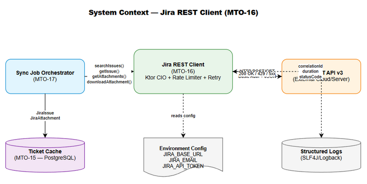
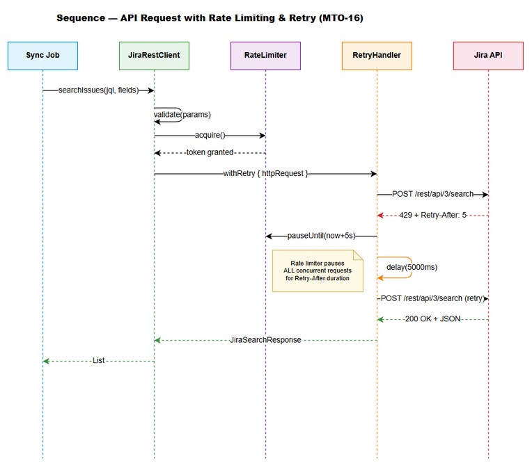
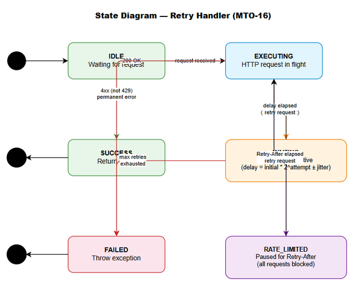

# Functional Specification Document (FSD)

## Jira Project Sync Service — MTO-16: Jira REST Client — Direct API Integration

---

## Document Information

| Field | Value |
|-------|-------|
| Jira Ticket | MTO-16 |
| Title | Jira REST Client — Direct API Integration |
| Author | TA Agent |
| Version | 1.0 |
| Date | 2025-07-14 |
| Status | Draft |
| Related BRD | BRD-v1-MTO-16.docx |
| Parent Epic | MTO-14 — Jira Project Sync Service: Background Job for Automated KB Ingestion |

---

## Revision History

| Version | Date | Author | Changes |
|---------|------|--------|---------|
| 1.0 | 2025-07-14 | TA Agent | Initiate document — full FSD with technical enrichment from BRD MTO-16 |

---

## 1. Introduction

### 1.1 Purpose

This FSD specifies the functional and technical design for a dedicated Jira REST API client that communicates directly with Jira Cloud/Server REST API v3. This client provides efficient, high-throughput access for the background sync job (Epic MTO-14), bypassing the MCP Atlassian connector.

The specification covers:

- Ktor HTTP Client (CIO engine) with JSON serialization, Basic Auth, connection pooling, and timeout management
- 4 API endpoint methods: `searchIssues`, `getIssue`, `getAttachments`, `downloadAttachment`
- Token bucket rate limiting (10 req/s default) with 429 response handling
- Exponential backoff retry logic (1s initial, 30s max, 3 retries) for transient failures
- Custom sealed exception hierarchy with structured error parsing
- Environment-based configuration with fail-fast validation

[Implements: Stories #1–#7 from BRD MTO-16]

### 1.2 Scope

**In Scope:**
- Design and implementation of `JiraRestClient` interface and `JiraRestClientImpl` class
- `TokenBucketRateLimiter` coroutine-safe rate limiting component
- `RetryHandler` with exponential backoff and jitter
- `JiraClientConfig` data class with environment variable resolution
- Custom sealed exception hierarchy (`JiraClientException`)
- Integration with existing Koin DI and Ktor CIO HttpClient patterns

**Out of Scope:**
- Jira webhook integration (push-based notifications)
- OAuth 2.0 authentication (only Basic Auth with API token)
- Jira write operations (create/update/delete issues)
- Caching of API responses (handled by MTO-15 ticket cache layer)
- Background job scheduling and orchestration (separate story under MTO-14)
- Knowledge Base ingestion pipeline (separate story under MTO-14)

### 1.3 Definitions & Acronyms

| Term | Definition |
|------|------------|
| JQL | Jira Query Language — SQL-like syntax for searching Jira issues |
| Token Bucket | Rate limiting algorithm allowing bursts up to bucket capacity, refilling at constant rate |
| Exponential Backoff | Retry strategy where delay doubles after each failed attempt |
| Jitter | Random variation (±20%) added to backoff delay to prevent thundering herd |
| CIO | Coroutine-based I/O — Ktor's non-blocking HTTP client engine |
| ADF | Atlassian Document Format — JSON-based rich text format used in Jira descriptions |
| Correlation ID | Unique identifier attached to a request for tracing across logs |
| SSRF | Server-Side Request Forgery — attack where server makes requests to unintended URLs |
| Basic Auth | HTTP authentication using Base64-encoded `email:token` in Authorization header |

### 1.4 References

| Document | Location |
|----------|----------|
| BRD | BRD-v1-MTO-16.docx |
| MTO-15 FSD (Database Schema) | FSD-v1-MTO-15.docx |
| Project Structure | .analysis/code-intelligence/project-structure.md |
| Jira REST API v3 Docs | https://developer.atlassian.com/cloud/jira/platform/rest/v3/ |
| Ktor Client Docs | https://ktor.io/docs/client-overview.html |
| Existing HTTP Pattern | orchestrator-client/.../HttpMcpConnection.kt |

---

## 2. System Overview

### 2.1 System Context Diagram


*[Edit in draw.io](diagrams/fsd-system-context.drawio)*

The Jira REST Client sits within the MCP Orchestration system as a dedicated HTTP communication layer between the Sync Job Orchestrator and Jira's REST API v3. It encapsulates all concerns related to authentication, rate limiting, retry logic, and error handling.

### 2.2 System Architecture

The client follows the existing project patterns:

- **Interface/Impl pattern**: `JiraRestClient` interface + `JiraRestClientImpl` implementation (consistent with `ToolRegistry`/`ToolRegistryImpl`, `McpConnection`/`HttpMcpConnection`)
- **Koin DI**: All components registered as singletons in `AppModule.kt`
- **Ktor CIO HttpClient**: Reuses the same engine pattern as `HttpMcpConnection`
- **kotlinx.serialization**: JSON parsing with `ignoreUnknownKeys = true` for forward compatibility
- **Coroutine-based**: All API methods are `suspend` functions for non-blocking I/O
- **Structured logging**: SLF4J/Logback with correlation IDs

**Package location:** `com.orchestrator.mcp.jira`


---

## 3. Functional Requirements

### 3.1 Feature: Search Jira Issues by JQL

**Source:** BRD MTO-16, Story #1

#### 3.1.1 Description

Provides a method to search Jira issues using JQL (Jira Query Language) with pagination support. The sync job uses this to discover tickets that need synchronization based on project, update time, or other criteria.

#### 3.1.2 Use Case

**Use Case ID:** UC-01
**Actor:** Sync Job Orchestrator
**Preconditions:**
- JiraRestClient is initialized with valid configuration
- Rate limiter has available tokens
- Network connectivity to Jira instance is available

**Postconditions:**
- Paginated list of matching issues returned
- Rate limiter token consumed
- Request logged with correlation ID and duration

**Main Flow:**

| Step | Actor | System | Description |
|------|-------|--------|-------------|
| 1 | Sync Job | | Calls `searchIssues(jql, fields, startAt, maxResults)` |
| 2 | | JiraRestClient | Validates input parameters (jql not blank, maxResults 1-100) |
| 3 | | RateLimiter | Acquires token from bucket (suspends if empty) |
| 4 | | HttpClient | Constructs POST request with Basic Auth + JSON body |
| 5 | | HttpClient | Sends request to `POST /rest/api/3/search` |
| 6 | | JiraRestClient | Deserializes JSON response to `JiraSearchResponse` |
| 7 | | JiraRestClient | Returns result with issues list, total, pagination metadata |

**Alternative Flows:**

| ID | Condition | Steps |
|----|-----------|-------|
| AF-01 | Rate limiter has no tokens | Step 3: Caller coroutine suspends until token replenished (max wait = bucket refill time) |
| AF-02 | Response has fewer issues than maxResults | Step 6: Normal — indicates last page of results |
| AF-03 | Empty result set (total = 0) | Step 6: Returns empty list with total = 0 |

**Exception Flows:**

| ID | Condition | Steps |
|----|-----------|-------|
| EF-01 | Invalid JQL syntax (400) | Step 5→ Jira returns 400 → throw `JiraValidationException` with Jira error messages |
| EF-02 | Authentication failure (401) | Step 5→ throw `JiraAuthException("Invalid credentials")` — no retry |
| EF-03 | Permission denied (403) | Step 5→ throw `JiraAuthException("Insufficient permissions for JQL query")` — no retry |
| EF-04 | Rate limited (429) | Step 5→ extract `Retry-After` header → RetryHandler waits → retry request |
| EF-05 | Server error (5xx) | Step 5→ RetryHandler applies exponential backoff → retry up to max attempts |
| EF-06 | Connection timeout | Step 5→ throw `JiraTimeoutException` → RetryHandler retries |
| EF-07 | Max retries exhausted | After EF-04/05/06 retries fail → throw last exception with retry context |

#### 3.1.3 Business Rules

| Rule ID | Rule | Source |
|---------|------|--------|
| BR-01 | JQL query string must not be blank or empty | BRD Story #1, Validation Rules |
| BR-02 | maxResults must be between 1 and 100 (Jira API limit) | BRD Story #1, Validation Rules |
| BR-03 | startAt must be >= 0 | BRD Story #1, Validation Rules |
| BR-04 | fields list items must not contain empty strings | BRD Story #1, Validation Rules |
| BR-05 | All requests must acquire rate limiter token before execution | BRD Story #5 |
| BR-06 | 429 responses trigger rate-limit-aware retry (use Retry-After header) | BRD Story #5 |
| BR-07 | 5xx responses trigger exponential backoff retry | BRD Story #6 |
| BR-08 | 4xx responses (except 429) are not retried | BRD Story #6 |

#### 3.1.4 Data Specifications

**Input Data:**

| Field | Type | Required | Validation | Description |
|-------|------|----------|------------|-------------|
| jql | String | Yes | Not blank, max 10000 chars | JQL query string |
| fields | List\<String\> | No | Items not blank | Fields to return (empty = all) |
| startAt | Int | No | >= 0, default 0 | Pagination offset |
| maxResults | Int | No | 1-100, default 50 | Page size |

**Output Data:**

| Field | Type | Description |
|-------|------|-------------|
| issues | List\<JiraIssue\> | List of matching issues with requested fields |
| total | Int | Total number of matching issues across all pages |
| startAt | Int | Current pagination offset |
| maxResults | Int | Requested page size |

#### 3.1.5 API Contract (Functional View)

**Endpoint:** `POST /rest/api/3/search`
**Purpose:** Search Jira issues by JQL with pagination and field selection

**Request Body (JSON):**

```json
{
  "jql": "project = CRP AND updated >= -1d",
  "fields": ["summary", "status", "assignee", "updated"],
  "startAt": 0,
  "maxResults": 50
}
```

**Response Body (JSON):**

```json
{
  "expand": "schema,names",
  "startAt": 0,
  "maxResults": 50,
  "total": 120,
  "issues": [
    {
      "id": "10001",
      "key": "CRP-42",
      "self": "https://jira.example.com/rest/api/3/issue/10001",
      "fields": {
        "summary": "Implement login page",
        "status": { "name": "In Progress", "id": "3" },
        "assignee": { "displayName": "John Doe", "emailAddress": "john@example.com" },
        "updated": "2025-07-14T10:30:00.000+0000"
      }
    }
  ]
}
```

**Business Error Scenarios:**

| Scenario | User Message | Trigger Condition |
|----------|-------------|-------------------|
| Invalid JQL | "JQL syntax error: {jira_error_messages}" | Jira returns 400 with errorMessages array |
| No permission | "Insufficient permissions to execute JQL query" | Jira returns 403 |
| Auth failure | "Invalid Jira credentials — check JIRA_EMAIL and JIRA_API_TOKEN" | Jira returns 401 |


---

### 3.2 Feature: Fetch Single Jira Issue

**Source:** BRD MTO-16, Story #2

#### 3.2.1 Description

Retrieves a single Jira issue by its key with full details, supporting field selection and expand parameters. Used by the sync job to fetch complete ticket data for local caching.

#### 3.2.2 Use Case

**Use Case ID:** UC-02
**Actor:** Sync Job Orchestrator
**Preconditions:**
- JiraRestClient is initialized with valid configuration
- Issue key is known (from searchIssues result or external input)

**Postconditions:**
- Full issue data returned with requested fields and expanded sections
- Rate limiter token consumed

**Main Flow:**

| Step | Actor | System | Description |
|------|-------|--------|-------------|
| 1 | Sync Job | | Calls `getIssue(issueKey, fields, expand)` |
| 2 | | JiraRestClient | Validates issueKey matches `[A-Z]+-\d+` pattern |
| 3 | | RateLimiter | Acquires token from bucket |
| 4 | | HttpClient | Constructs GET request with query params: `fields`, `expand` |
| 5 | | HttpClient | Sends request to `GET /rest/api/3/issue/{issueKey}` |
| 6 | | JiraRestClient | Deserializes JSON response to `JiraIssue` |
| 7 | | JiraRestClient | Returns fully populated issue object |

**Alternative Flows:**

| ID | Condition | Steps |
|----|-----------|-------|
| AF-01 | No fields specified | Step 4: Omit `fields` query param — Jira returns all fields |
| AF-02 | expand=["changelog"] | Step 4: Add `expand=changelog` — response includes changelog section |

**Exception Flows:**

| ID | Condition | Steps |
|----|-----------|-------|
| EF-01 | Issue not found (404) | Step 5→ throw `JiraNotFoundException(issueKey)` — no retry |
| EF-02 | Invalid issue key format | Step 2→ throw `JiraValidationException("Invalid issue key format: {key}")` — before API call |
| EF-03 | Invalid expand value | Step 2→ throw `JiraValidationException("Invalid expand value: {value}")` |
| EF-04 | Auth failure (401/403) | Step 5→ throw `JiraAuthException` — no retry |
| EF-05 | Rate limited (429) | Step 5→ RetryHandler handles with Retry-After |
| EF-06 | Server error (5xx) | Step 5→ RetryHandler applies exponential backoff |

#### 3.2.3 Business Rules

| Rule ID | Rule | Source |
|---------|------|--------|
| BR-09 | issueKey must match regex `[A-Z]+-\d+` | BRD Story #2 |
| BR-10 | expand values must be from allowed set: changelog, renderedFields, transitions, operations, editmeta | BRD Story #2 |
| BR-11 | Validation occurs before API call (fail-fast) | BRD Story #2 |

#### 3.2.4 Data Specifications

**Input Data:**

| Field | Type | Required | Validation | Description |
|-------|------|----------|------------|-------------|
| issueKey | String | Yes | Regex `[A-Z]+-\d+` | Jira issue key (e.g., "MTO-16") |
| fields | List\<String\> | No | Items not blank | Fields to return |
| expand | List\<String\> | No | Values in allowed set | Sections to expand |

**Output Data:**

| Field | Type | Description |
|-------|------|-------------|
| id | String | Jira internal issue ID |
| key | String | Issue key (e.g., "MTO-16") |
| self | String | API URL for this issue |
| fields | JsonObject | Map of field name → field value |
| changelog | ChangeLog? | Present only if expand includes "changelog" |

#### 3.2.5 API Contract (Functional View)

**Endpoint:** `GET /rest/api/3/issue/{issueKey}?fields={fields}&expand={expand}`
**Purpose:** Fetch a single issue with full details for local caching

**Query Parameters:**

| Parameter | Type | Required | Description |
|-----------|------|----------|-------------|
| fields | String (comma-separated) | No | Fields to include in response |
| expand | String (comma-separated) | No | Sections to expand (changelog, renderedFields, etc.) |

**Response Body (JSON):**

```json
{
  "id": "10001",
  "key": "MTO-16",
  "self": "https://jira.example.com/rest/api/3/issue/10001",
  "fields": {
    "summary": "Jira REST Client — Direct API Integration",
    "description": { "type": "doc", "version": 1, "content": [...] },
    "status": { "name": "In Progress", "id": "3" },
    "issuetype": { "name": "Story", "id": "10001" },
    "priority": { "name": "High", "id": "2" },
    "assignee": { "displayName": "Dev Team", "emailAddress": "dev@example.com" },
    "created": "2025-07-10T09:00:00.000+0000",
    "updated": "2025-07-14T10:30:00.000+0000"
  },
  "changelog": {
    "startAt": 0,
    "maxResults": 20,
    "total": 5,
    "histories": [...]
  }
}
```

**Business Error Scenarios:**

| Scenario | User Message | Trigger Condition |
|----------|-------------|-------------------|
| Issue not found | "Jira issue not found: {issueKey}" | Jira returns 404 |
| Invalid key format | "Invalid issue key format: {key}. Expected pattern: PROJECT-123" | Regex validation fails |


---

### 3.3 Feature: Retrieve Attachment Metadata

**Source:** BRD MTO-16, Story #3

#### 3.3.1 Description

Retrieves attachment metadata for a specific Jira issue. This is a specialized variant of `getIssue` that only fetches the `attachment` field for efficiency. Returns a list of attachment metadata objects containing filename, size, MIME type, download URL, author, and creation date.

#### 3.3.2 Use Case

**Use Case ID:** UC-03
**Actor:** Sync Job Orchestrator
**Preconditions:**
- JiraRestClient is initialized
- Issue key is known and valid

**Postconditions:**
- List of attachment metadata returned (may be empty)
- Rate limiter token consumed

**Main Flow:**

| Step | Actor | System | Description |
|------|-------|--------|-------------|
| 1 | Sync Job | | Calls `getAttachments(issueKey)` |
| 2 | | JiraRestClient | Validates issueKey format |
| 3 | | RateLimiter | Acquires token |
| 4 | | HttpClient | Sends `GET /rest/api/3/issue/{issueKey}?fields=attachment` |
| 5 | | JiraRestClient | Extracts `fields.attachment` array from response |
| 6 | | JiraRestClient | Deserializes to `List<JiraAttachment>` |
| 7 | | JiraRestClient | Returns attachment metadata list |

**Alternative Flows:**

| ID | Condition | Steps |
|----|-----------|-------|
| AF-01 | Issue has no attachments | Step 5: `fields.attachment` is empty array → return emptyList() |

**Exception Flows:**

| ID | Condition | Steps |
|----|-----------|-------|
| EF-01 | Issue not found (404) | throw `JiraNotFoundException(issueKey)` |
| EF-02 | Auth failure (401/403) | throw `JiraAuthException` |
| EF-03 | Rate limited (429) / Server error (5xx) | Standard retry logic |

#### 3.3.3 Business Rules

| Rule ID | Rule | Source |
|---------|------|--------|
| BR-12 | issueKey must match `[A-Z]+-\d+` | BRD Story #3 |
| BR-13 | Response attachment objects must have non-null content URL | BRD Story #3 |
| BR-14 | Attachments without valid content URL are filtered out with warning log | Defensive design |

#### 3.3.4 Data Specifications

**Input Data:**

| Field | Type | Required | Validation | Description |
|-------|------|----------|------------|-------------|
| issueKey | String | Yes | Regex `[A-Z]+-\d+` | Jira issue key |

**Output Data:**

| Field | Type | Description |
|-------|------|-------------|
| id | String | Attachment ID |
| filename | String | Original filename |
| mimeType | String | MIME type (e.g., "image/png") |
| size | Long | File size in bytes |
| content | String | Download URL (authenticated) |
| author | JiraUser | Who uploaded the attachment |
| created | Instant | ISO 8601 creation timestamp |

#### 3.3.5 API Contract (Functional View)

**Endpoint:** `GET /rest/api/3/issue/{issueKey}?fields=attachment`
**Purpose:** Retrieve attachment metadata for download queue processing

**Response Body (JSON — attachment array):**

```json
{
  "fields": {
    "attachment": [
      {
        "id": "10001",
        "filename": "architecture-diagram.png",
        "mimeType": "image/png",
        "size": 245760,
        "content": "https://jira.example.com/secure/attachment/10001/architecture-diagram.png",
        "author": {
          "displayName": "John Doe",
          "emailAddress": "john@example.com"
        },
        "created": "2025-07-10T14:30:00.000+0000"
      }
    ]
  }
}
```

**Business Error Scenarios:**

| Scenario | User Message | Trigger Condition |
|----------|-------------|-------------------|
| Issue not found | "Jira issue not found: {issueKey}" | 404 response |
| Attachment URL missing | Warning log: "Attachment {id} has null content URL — skipping" | Defensive filter |

---

### 3.4 Feature: Download Attachment Binary Content

**Source:** BRD MTO-16, Story #4

#### 3.4.1 Description

Downloads the binary content of a Jira attachment given its content URL. Supports streaming for large files to avoid memory exhaustion. Includes SSRF protection by validating the download URL belongs to the configured Jira base URL domain.

#### 3.4.2 Use Case

**Use Case ID:** UC-04
**Actor:** Sync Job Orchestrator
**Preconditions:**
- Attachment content URL obtained from `getAttachments` response
- URL belongs to configured Jira base URL domain

**Postconditions:**
- Binary content returned as ByteArray (small files) or ByteReadChannel (large files)
- Rate limiter token consumed

**Main Flow:**

| Step | Actor | System | Description |
|------|-------|--------|-------------|
| 1 | Sync Job | | Calls `downloadAttachment(url)` |
| 2 | | JiraRestClient | Validates URL is valid HTTP/HTTPS |
| 3 | | JiraRestClient | Validates URL domain matches `JIRA_BASE_URL` domain (SSRF check) |
| 4 | | RateLimiter | Acquires token |
| 5 | | HttpClient | Sends `GET {url}` with Basic Auth headers |
| 6 | | HttpClient | Streams response body |
| 7 | | JiraRestClient | Returns `ByteArray` content |

**Alternative Flows:**

| ID | Condition | Steps |
|----|-----------|-------|
| AF-01 | File > 10MB | Step 6: Use streaming `ByteReadChannel` instead of buffering entire content |

**Exception Flows:**

| ID | Condition | Steps |
|----|-----------|-------|
| EF-01 | URL domain mismatch (SSRF) | Step 3→ throw `JiraValidationException("URL domain does not match configured Jira base URL")` — no API call |
| EF-02 | Attachment not found (404) | Step 5→ throw `JiraNotFoundException(url)` |
| EF-03 | Connection timeout | Step 5→ throw `JiraTimeoutException` → retry |
| EF-04 | Auth failure (401/403) | Step 5→ throw `JiraAuthException` |

#### 3.4.3 Business Rules

| Rule ID | Rule | Source |
|---------|------|--------|
| BR-15 | URL must be valid HTTP or HTTPS | BRD Story #4 |
| BR-16 | URL domain must match configured JIRA_BASE_URL domain (SSRF prevention) | BRD Story #4 |
| BR-17 | Basic Auth headers included on download requests | BRD Story #4 |
| BR-18 | Large files (>10MB) streamed without full buffering | BRD Story #4 |

#### 3.4.4 Data Specifications

**Input Data:**

| Field | Type | Required | Validation | Description |
|-------|------|----------|------------|-------------|
| url | String | Yes | Valid HTTP/HTTPS URL, domain matches JIRA_BASE_URL | Attachment download URL |

**Output Data:**

| Field | Type | Description |
|-------|------|-------------|
| content | ByteArray | Binary content of the attachment |
| contentType | String | MIME type from response Content-Type header |
| contentLength | Long | File size from response Content-Length header |

#### 3.4.5 API Contract (Functional View)

**Endpoint:** `GET {attachment.content URL}`
**Purpose:** Download attachment binary content for local storage/processing

**Request Headers:**

| Header | Value | Description |
|--------|-------|-------------|
| Authorization | `Basic {base64(email:token)}` | Authentication |
| Accept | `*/*` | Accept any content type |

**Response:** Binary stream with `Content-Type` and `Content-Length` headers

**Business Error Scenarios:**

| Scenario | User Message | Trigger Condition |
|----------|-------------|-------------------|
| SSRF blocked | "Download URL domain does not match Jira base URL" | Domain validation fails |
| File not found | "Attachment not found at URL: {url}" | 404 response |
| Download timeout | "Attachment download timed out after {timeout}ms" | Socket timeout exceeded |


---

### 3.5 Feature: Rate Limiting (Token Bucket)

**Source:** BRD MTO-16, Story #5

#### 3.5.1 Description

Implements a coroutine-safe token bucket rate limiter that controls the rate of outgoing API requests to Jira. The rate limiter ensures the system does not exceed Jira's rate limits and handles 429 responses by pausing all requests for the duration specified in the `Retry-After` header.

#### 3.5.2 Use Case

**Use Case ID:** UC-05
**Actor:** JiraRestClient (internal component)
**Preconditions:**
- TokenBucketRateLimiter initialized with configured rate (default: 10 req/s)
- Bucket has capacity for burst tokens

**Postconditions:**
- Token consumed on successful acquisition
- Caller proceeds with API request

**Main Flow:**

| Step | Actor | System | Description |
|------|-------|--------|-------------|
| 1 | JiraRestClient | | Calls `rateLimiter.acquire()` before each API request |
| 2 | | RateLimiter | Checks if tokens available in bucket |
| 3 | | RateLimiter | If available: decrement token count, return immediately |
| 4 | JiraRestClient | | Proceeds with HTTP request |

**Alternative Flows:**

| ID | Condition | Steps |
|----|-----------|-------|
| AF-01 | No tokens available | Step 2: Caller coroutine suspends → waits for next token refill (100ms at 10 req/s) → resumes |
| AF-02 | Bucket idle for >1s | Step 2: Bucket is full (10 tokens) → burst of 10 requests can proceed immediately |
| AF-03 | 429 received with Retry-After | RateLimiter enters "paused" state → ALL callers suspend for Retry-After duration → resume |

**Exception Flows:**

| ID | Condition | Steps |
|----|-----------|-------|
| EF-01 | Retry-After header missing on 429 | Use default pause of 60 seconds |
| EF-02 | Retry-After value unparseable | Use default pause of 60 seconds, log warning |

#### 3.5.3 Business Rules

| Rule ID | Rule | Source |
|---------|------|--------|
| BR-19 | Default rate: 10 requests/second (configurable via JIRA_RATE_LIMIT) | BRD Story #5 |
| BR-20 | Burst capacity equals rate limit (10 tokens max in bucket) | BRD Story #5 |
| BR-21 | Token refill rate: 1 token per (1000/rateLimit) ms | BRD Story #5 |
| BR-22 | 429 response pauses ALL requests for Retry-After duration | BRD Story #5 |
| BR-23 | Rate limiter must be thread-safe for concurrent coroutine access | BRD Story #5 |
| BR-24 | Missing/unparseable Retry-After defaults to 60 seconds | BRD Story #5 |

#### 3.5.4 Data Specifications

**Configuration Data:**

| Field | Type | Required | Validation | Default | Description |
|-------|------|----------|------------|---------|-------------|
| rateLimit | Int | No | 1-100 | 10 | Max requests per second |
| burstCapacity | Int | No | >= 1 | = rateLimit | Max burst tokens |
| refillRateMs | Long | Computed | N/A | 1000/rateLimit | Milliseconds between token refills |

**State Data (Internal):**

| Field | Type | Description |
|-------|------|-------------|
| availableTokens | AtomicInteger | Current tokens in bucket |
| lastRefillTime | AtomicLong | Timestamp of last token refill |
| pausedUntil | AtomicLong | Timestamp until which all requests are paused (from 429) |

#### 3.5.5 API Contract (Functional View)

> Rate limiting is an internal component — no external API endpoint. The contract is the internal interface:

```kotlin
interface RateLimiter {
    /** Acquire a token. Suspends if no tokens available. */
    suspend fun acquire()
    
    /** Pause all requests until the specified instant (from 429 Retry-After). */
    fun pauseUntil(resumeAt: Instant)
    
    /** Check if rate limiter is currently paused (429 backoff active). */
    fun isPaused(): Boolean
}
```

**Pseudocode — Token Acquisition:**

```
suspend fun acquire() {
    while (true) {
        // Check if globally paused (429 backoff)
        val pauseEnd = pausedUntil.get()
        if (pauseEnd > currentTimeMillis()) {
            delay(pauseEnd - currentTimeMillis())
        }
        
        // Try to refill tokens based on elapsed time
        refillTokens()
        
        // Try to acquire a token
        val current = availableTokens.get()
        if (current > 0 && availableTokens.compareAndSet(current, current - 1)) {
            return  // Token acquired
        }
        
        // No token available — wait for next refill
        delay(refillRateMs)
    }
}
```

---

### 3.6 Feature: Retry Logic with Exponential Backoff

**Source:** BRD MTO-16, Story #6

#### 3.6.1 Description

Implements a retry wrapper that automatically retries failed HTTP requests using exponential backoff with jitter. Retries are applied only to transient failures (429, 5xx, timeouts) — permanent failures (4xx except 429) are not retried.

#### 3.6.2 Use Case

**Use Case ID:** UC-06
**Actor:** JiraRestClient (internal component)
**Preconditions:**
- RetryHandler initialized with configured parameters
- HTTP request has failed with a retryable status code

**Postconditions:**
- Request succeeds on retry → result returned
- OR max retries exhausted → last exception thrown with retry context

**Main Flow:**

| Step | Actor | System | Description |
|------|-------|--------|-------------|
| 1 | JiraRestClient | | Wraps API call in `retryHandler.withRetry { ... }` |
| 2 | | RetryHandler | Executes the block |
| 3 | | RetryHandler | If success → return result |
| 4 | | RetryHandler | If retryable error → calculate delay with backoff + jitter |
| 5 | | RetryHandler | Log retry attempt (correlation ID, attempt #, delay) |
| 6 | | RetryHandler | Suspend for calculated delay |
| 7 | | RetryHandler | Retry the block (go to step 2) |
| 8 | | RetryHandler | If max retries reached → throw last exception with context |

**Alternative Flows:**

| ID | Condition | Steps |
|----|-----------|-------|
| AF-01 | 429 with Retry-After header | Step 4: Use Retry-After value instead of exponential backoff |
| AF-02 | JIRA_MAX_RETRIES=0 | Step 4: No retry attempted, throw immediately |

**Exception Flows:**

| ID | Condition | Steps |
|----|-----------|-------|
| EF-01 | Non-retryable error (4xx except 429) | Step 2→ throw immediately, no retry |
| EF-02 | Max retries exhausted | Step 8→ throw last exception wrapped with RetryExhaustedException |
| EF-03 | Total retry time exceeds timeout | Abort retries → throw JiraTimeoutException |

#### 3.6.3 Business Rules

| Rule ID | Rule | Source |
|---------|------|--------|
| BR-25 | Initial delay: 1000ms | BRD Story #6 |
| BR-26 | Delay multiplier: 2.0 (1s → 2s → 4s → 8s → ...) | BRD Story #6 |
| BR-27 | Maximum delay cap: 30000ms | BRD Story #6 |
| BR-28 | Maximum retry attempts: 3 (configurable via JIRA_MAX_RETRIES) | BRD Story #6 |
| BR-29 | Jitter: ±20% of calculated delay | BRD Story #6 |
| BR-30 | Retry on: 429, 5xx, connection timeout | BRD Story #6 |
| BR-31 | No retry on: 4xx (except 429) — permanent failures | BRD Story #6 |
| BR-32 | 429 with Retry-After overrides exponential backoff | BRD Story #5+6 |
| BR-33 | Each retry logged with correlation ID, attempt number, delay | BRD Story #6 |

#### 3.6.4 Data Specifications

**Configuration Data:**

| Field | Type | Required | Validation | Default | Description |
|-------|------|----------|------------|---------|-------------|
| maxRetries | Int | No | 0-10 | 3 | Maximum retry attempts |
| initialDelayMs | Long | No | > 0 | 1000 | Initial backoff delay |
| maxDelayMs | Long | No | >= initialDelayMs | 30000 | Maximum backoff delay cap |
| multiplier | Double | No | > 1.0 | 2.0 | Backoff multiplier |
| jitterFactor | Double | No | 0.0-1.0 | 0.2 | Jitter range (±%) |

**Retry Context (attached to final exception):**

| Field | Type | Description |
|-------|------|-------------|
| attemptCount | Int | Total attempts made (1 + retries) |
| totalElapsedMs | Long | Total time spent including delays |
| lastStatusCode | Int | HTTP status code of last failed attempt |
| correlationId | String | Request correlation ID for log tracing |

#### 3.6.5 API Contract (Functional View)

> Retry logic is an internal component. The contract is the internal interface:

```kotlin
interface RetryHandler {
    /**
     * Execute block with retry logic.
     * @param context Descriptive context for logging (e.g., "searchIssues(project=CRP)")
     * @param block The suspend function to execute and potentially retry
     * @return Result of successful block execution
     * @throws JiraClientException if all retries exhausted
     */
    suspend fun <T> withRetry(context: String, block: suspend () -> T): T
}
```

**Pseudocode — Exponential Backoff with Jitter:**

```
suspend fun <T> withRetry(context: String, block: suspend () -> T): T {
    var attempt = 0
    var lastException: JiraClientException? = null
    val startTime = currentTimeMillis()
    
    while (attempt <= config.maxRetries) {
        try {
            return block()
        } catch (e: JiraClientException) {
            if (!isRetryable(e)) throw e
            
            lastException = e
            attempt++
            
            if (attempt > config.maxRetries) break
            
            val baseDelay = min(
                config.initialDelayMs * config.multiplier.pow(attempt - 1),
                config.maxDelayMs.toDouble()
            ).toLong()
            
            val jitter = baseDelay * config.jitterFactor * (random.nextDouble() * 2 - 1)
            val actualDelay = (baseDelay + jitter).toLong().coerceAtLeast(0)
            
            logger.warn("Retry {}/{} for {} after {}ms (status={})",
                attempt, config.maxRetries, context, actualDelay, e.statusCode)
            
            delay(actualDelay)
        }
    }
    
    throw RetryExhaustedException(
        cause = lastException!!,
        attempts = attempt,
        elapsedMs = currentTimeMillis() - startTime
    )
}

fun isRetryable(e: JiraClientException): Boolean = when (e) {
    is JiraRateLimitException -> true   // 429
    is JiraServerException -> true      // 5xx
    is JiraTimeoutException -> true     // timeout
    else -> false                       // 4xx (auth, not found, validation)
}
```

---

### 3.7 Feature: Environment-Based Configuration

**Source:** BRD MTO-16, Story #7

#### 3.7.1 Description

All Jira client configuration is loaded from environment variables with sensible defaults for optional parameters. Configuration is validated at startup with fail-fast behavior — if required values are missing or invalid, the application fails immediately with a clear error message.

#### 3.7.2 Use Case

**Use Case ID:** UC-07
**Actor:** System Administrator / DevOps
**Preconditions:**
- Environment variables are set in deployment environment
- Application is starting up

**Postconditions:**
- `JiraClientConfig` data class created with validated values
- Client ready to make API calls

**Main Flow:**

| Step | Actor | System | Description |
|------|-------|--------|-------------|
| 1 | DevOps | | Sets environment variables (JIRA_BASE_URL, JIRA_EMAIL, JIRA_API_TOKEN) |
| 2 | | Application | Reads `application.yml` with env var placeholders (`${JIRA_BASE_URL}`) |
| 3 | | ConfigLoader | Resolves env var placeholders to actual values |
| 4 | | ConfigValidator | Validates all required values present |
| 5 | | ConfigValidator | Validates value formats (URL, email, ranges) |
| 6 | | ConfigLoader | Creates immutable `JiraClientConfig` data class |
| 7 | | Koin DI | Registers config as singleton |

**Alternative Flows:**

| ID | Condition | Steps |
|----|-----------|-------|
| AF-01 | Optional env vars not set | Step 3: Use default values (rateLimit=10, timeoutMs=30000, maxRetries=3) |

**Exception Flows:**

| ID | Condition | Steps |
|----|-----------|-------|
| EF-01 | Required env var missing | Step 4→ throw `ConfigException("Missing required: JIRA_BASE_URL, JIRA_EMAIL")` — lists ALL missing |
| EF-02 | Invalid URL format | Step 5→ throw `ConfigException("JIRA_BASE_URL must start with http:// or https://")` |
| EF-03 | Invalid email format | Step 5→ throw `ConfigException("JIRA_EMAIL must be a valid email address")` |
| EF-04 | Value out of range | Step 5→ throw `ConfigException("JIRA_RATE_LIMIT must be between 1 and 100, got: 200")` |

#### 3.7.3 Business Rules

| Rule ID | Rule | Source |
|---------|------|--------|
| BR-34 | JIRA_BASE_URL required, must be valid URL (http/https), no trailing slash | BRD Story #7 |
| BR-35 | JIRA_EMAIL required, must be valid email format | BRD Story #7 |
| BR-36 | JIRA_API_TOKEN required, must not be empty | BRD Story #7 |
| BR-37 | JIRA_RATE_LIMIT optional, range 1-100, default 10 | BRD Story #7 |
| BR-38 | JIRA_TIMEOUT_MS optional, range 1000-300000, default 30000 | BRD Story #7 |
| BR-39 | JIRA_MAX_RETRIES optional, range 0-10, default 3 | BRD Story #7 |
| BR-40 | JIRA_CONNECT_TIMEOUT_MS optional, range 1000-60000, default 10000 | BRD Story #7 |
| BR-41 | JIRA_SOCKET_TIMEOUT_MS optional, range 1000-300000, default 30000 | BRD Story #7 |
| BR-42 | Config is immutable after initialization (data class) | BRD Story #7 |
| BR-43 | Fail-fast: ALL missing required vars reported in single exception | BRD Story #7 |

#### 3.7.4 Data Specifications

**Configuration Data:**

| Field | Env Variable | Type | Required | Validation | Default | Description |
|-------|-------------|------|----------|------------|---------|-------------|
| baseUrl | JIRA_BASE_URL | String | Yes | Valid URL, http/https, no trailing slash | — | Jira instance URL |
| email | JIRA_EMAIL | String | Yes | Valid email format | — | Authentication email |
| apiToken | JIRA_API_TOKEN | String | Yes | Not empty | — | Jira API token |
| rateLimit | JIRA_RATE_LIMIT | Int | No | 1-100 | 10 | Max requests/second |
| timeoutMs | JIRA_TIMEOUT_MS | Long | No | 1000-300000 | 30000 | Request timeout |
| maxRetries | JIRA_MAX_RETRIES | Int | No | 0-10 | 3 | Max retry attempts |
| connectTimeoutMs | JIRA_CONNECT_TIMEOUT_MS | Long | No | 1000-60000 | 10000 | Connection timeout |
| socketTimeoutMs | JIRA_SOCKET_TIMEOUT_MS | Long | No | 1000-300000 | 30000 | Socket timeout |

#### 3.7.5 API Contract (Functional View)

> Configuration is an internal component. The contract is the data class:

```kotlin
@Serializable
data class JiraClientConfig(
    val baseUrl: String,
    val email: String,
    val apiToken: String,
    val rateLimit: Int = 10,
    val timeoutMs: Long = 30000,
    val maxRetries: Int = 3,
    val connectTimeoutMs: Long = 10000,
    val socketTimeoutMs: Long = 30000
)
```

**YAML Configuration (application.yml section):**

```yaml
jira:
  base_url: ${JIRA_BASE_URL}
  email: ${JIRA_EMAIL}
  api_token: ${JIRA_API_TOKEN}
  rate_limit: ${JIRA_RATE_LIMIT:10}
  timeout_ms: ${JIRA_TIMEOUT_MS:30000}
  max_retries: ${JIRA_MAX_RETRIES:3}
  connect_timeout_ms: ${JIRA_CONNECT_TIMEOUT_MS:10000}
  socket_timeout_ms: ${JIRA_SOCKET_TIMEOUT_MS:30000}
```


---

## 4. Data Model

> **Note:** This section defines the logical data model (entities, relationships, business attributes). Physical implementation (DDL scripts, indexes, migration plans) is specified in the TDD §4.

### 4.1 Entity Relationship Diagram

> This module does not persist data to a database. The data model describes the in-memory domain objects used for API communication.

### 4.2 Logical Entities

#### Entity: JiraSearchResponse

| Attribute | Type | Required | Business Rule | Description |
|-----------|------|----------|---------------|-------------|
| issues | List\<JiraIssue\> | Yes | — | Matching issues for current page |
| total | Int | Yes | — | Total matching issues across all pages |
| startAt | Int | Yes | — | Current pagination offset |
| maxResults | Int | Yes | — | Requested page size |

#### Entity: JiraIssue

| Attribute | Type | Required | Business Rule | Description |
|-----------|------|----------|---------------|-------------|
| id | String | Yes | — | Jira internal issue ID |
| key | String | Yes | BR-09 | Issue key (e.g., "MTO-16") |
| self | String | Yes | — | API URL for this issue |
| fields | JsonObject | Yes | — | Dynamic field map (varies by request) |
| changelog | ChangeLog? | No | — | Present when expand=changelog |

#### Entity: JiraAttachment

| Attribute | Type | Required | Business Rule | Description |
|-----------|------|----------|---------------|-------------|
| id | String | Yes | — | Attachment ID |
| filename | String | Yes | — | Original filename |
| mimeType | String | Yes | — | MIME type |
| size | Long | Yes | — | File size in bytes |
| content | String | Yes | BR-13 | Download URL (must not be null) |
| author | JiraUser | Yes | — | Uploader information |
| created | String | Yes | — | ISO 8601 creation timestamp |

#### Entity: JiraUser

| Attribute | Type | Required | Business Rule | Description |
|-----------|------|----------|---------------|-------------|
| displayName | String | Yes | — | User display name |
| emailAddress | String? | No | — | User email (may be hidden by privacy settings) |
| accountId | String | Yes | — | Jira account ID |

#### Entity: JiraClientConfig

| Attribute | Type | Required | Business Rule | Description |
|-----------|------|----------|---------------|-------------|
| baseUrl | String | Yes | BR-34 | Jira instance URL |
| email | String | Yes | BR-35 | Authentication email |
| apiToken | String | Yes | BR-36 | Jira API token |
| rateLimit | Int | No | BR-37 | Max requests/second (default: 10) |
| timeoutMs | Long | No | BR-38 | Request timeout ms (default: 30000) |
| maxRetries | Int | No | BR-39 | Max retry attempts (default: 3) |
| connectTimeoutMs | Long | No | BR-40 | Connection timeout ms (default: 10000) |
| socketTimeoutMs | Long | No | BR-41 | Socket timeout ms (default: 30000) |

**Relationships:**

| From Entity | To Entity | Cardinality | Description |
|-------------|-----------|-------------|-------------|
| JiraSearchResponse | JiraIssue | 1:N | Search response contains multiple issues |
| JiraIssue | JiraAttachment | 1:N | Issue may have multiple attachments |
| JiraAttachment | JiraUser | N:1 | Each attachment has one author |

---

## 5. Integration Specifications

> **Note:** This section defines what external systems are involved and what data is exchanged (business view). Technical details (timeout, retry, circuit breaker) are specified in the TDD §6.

### 5.1 External System: Jira REST API v3

| Attribute | Value |
|-----------|-------|
| Purpose | Source of truth for project issues, attachments, and metadata |
| Direction | Outbound (read-only) |
| Data Format | JSON (application/json) |
| Frequency | On-demand (triggered by sync job scheduler) |
| Authentication | Basic Auth (email + API token, Base64 encoded) |
| Base URL | Configurable via `JIRA_BASE_URL` environment variable |
| API Version | v3 (REST API) |

**Data Exchange:**

| Our Data | External Data | Direction | Business Rule |
|----------|--------------|-----------|---------------|
| JQL query string | Search results (issues) | Send/Receive | BR-01: JQL not blank |
| Issue key | Full issue details | Send/Receive | BR-09: Key format validated |
| Issue key | Attachment metadata list | Send/Receive | BR-12: Key format validated |
| Attachment URL | Binary file content | Send/Receive | BR-16: SSRF domain check |

### 5.2 Internal Integration: Sync Job Orchestrator (MTO-17)

| Attribute | Value |
|-----------|-------|
| Purpose | Orchestrates sync cycles, calls JiraRestClient methods |
| Direction | Inbound (receives calls) |
| Data Format | Kotlin suspend function calls (in-process) |
| Frequency | Per sync cycle (configurable interval) |

### 5.3 Internal Integration: Ticket Cache (MTO-15)

| Attribute | Value |
|-----------|-------|
| Purpose | Stores fetched issue data for local access |
| Direction | Downstream consumer of JiraRestClient output |
| Data Format | JiraIssue objects → database records |
| Frequency | After each successful API call |

---

## 6. Processing Logic

### 6.1 API Request Processing Pipeline

**Trigger:** Any JiraRestClient method call (searchIssues, getIssue, getAttachments, downloadAttachment)
**Input:** Method parameters (JQL, issue key, URL, etc.)
**Output:** Deserialized response object or exception

**Processing Steps:**

| Step | Description | Error Handling |
|------|-------------|----------------|
| 1 | Validate input parameters | Throw JiraValidationException immediately |
| 2 | Acquire rate limiter token | Suspend until token available |
| 3 | Generate correlation ID (UUID) | — |
| 4 | Construct HTTP request (method, URL, headers, body) | — |
| 5 | Execute request within retry wrapper | RetryHandler manages retries |
| 6 | Check response status code | Route to error handler if non-2xx |
| 7 | Deserialize response body | Throw JiraClientException if parse fails |
| 8 | Log success (correlation ID, duration, status) | — |
| 9 | Return typed result | — |

### 6.2 Rate Limit Enforcement Flow

**Trigger:** Every outgoing API request
**Schedule:** Continuous (token refill every 100ms at 10 req/s)

**Processing Steps:**

| Step | Description | Error Handling |
|------|-------------|----------------|
| 1 | Check if globally paused (429 backoff active) | Suspend until pause expires |
| 2 | Calculate tokens to refill based on elapsed time | — |
| 3 | Attempt atomic token acquisition (CAS) | If fails, retry from step 1 |
| 4 | If token acquired → proceed | — |
| 5 | If no token → suspend for refill interval | — |

### 6.3 Error Classification and Routing

**Trigger:** Non-2xx HTTP response received

| Status Code | Exception Type | Retryable | Action |
|-------------|---------------|-----------|--------|
| 400 | JiraValidationException | No | Parse error messages from response body |
| 401 | JiraAuthException | No | "Invalid credentials" |
| 403 | JiraAuthException | No | "Insufficient permissions" |
| 404 | JiraNotFoundException | No | Include resource identifier |
| 429 | JiraRateLimitException | Yes | Extract Retry-After, pause rate limiter |
| 500 | JiraServerException | Yes | Include response body excerpt |
| 502 | JiraServerException | Yes | "Bad gateway" |
| 503 | JiraServerException | Yes | "Service unavailable" |
| Timeout | JiraTimeoutException | Yes | Include timeout duration |

---

## 7. Security Requirements

> **Note:** This section defines business-level security requirements. Technical implementation (JWT config, encryption) is specified in the TDD §7.

### 7.1 Authentication & Authorization

| Role | Permissions | Features |
|------|-------------|----------|
| Sync Job (service account) | Read issues, Read attachments | All 4 API methods |
| System Administrator | Configure credentials | Environment variable management |

### 7.2 Data Sensitivity Classification

| Data Type | Classification | Business Requirement |
|-----------|---------------|---------------------|
| JIRA_API_TOKEN | Restricted | Must never be logged, serialized, or exposed in error messages |
| JIRA_EMAIL | Internal | Used for auth header construction only |
| Issue content | Internal | May contain business-sensitive project data |
| Attachment content | Confidential | May contain sensitive documents |

### 7.3 Security Controls

| Control | Implementation | Business Rule |
|---------|---------------|---------------|
| Credential protection | API token never logged or included in exceptions | BR-36 |
| SSRF prevention | Download URLs validated against configured base URL domain | BR-16 |
| TLS enforcement | All API communication over HTTPS (TLS 1.2+) | NFR |
| Input validation | All user-provided parameters validated before API call | BR-01..04, BR-09..12 |
| Auth header construction | Base64(email:token) — computed per request, not cached in plaintext | Security best practice |

### 7.4 Audit Trail

| Event | Logged Fields | Retention | Business Reason |
|-------|--------------|-----------|-----------------|
| API request | correlationId, method, endpoint, duration, statusCode | Application logs | Debugging, performance monitoring |
| Auth failure | correlationId, endpoint, statusCode (NOT credentials) | Application logs | Security monitoring |
| Rate limit hit | correlationId, retryAfter, pauseDuration | Application logs | Capacity planning |
| Retry attempt | correlationId, attempt#, delay, statusCode | Application logs | Reliability monitoring |

---

## 8. Non-Functional Requirements

> **Note:** This section defines business-level NFR targets. Technical implementation is specified in the TDD §8–§9.

| Category | Business Requirement | Acceptance Criteria |
|----------|---------------------|---------------------|
| Performance | Sustained throughput | Support 10 requests/second sustained (configurable up to 100) |
| Performance | Request latency | Individual request completes within configured timeout (default 30s) |
| Performance | Connection reuse | HTTP connections pooled and reused (no per-request TCP handshake) |
| Reliability | Transient failure recovery | 429 and 5xx errors automatically retried with backoff (up to 3 retries) |
| Reliability | Graceful degradation | Rate limiter suspends callers rather than rejecting — no request loss |
| Availability | Startup validation | Fail-fast on invalid configuration — clear error message within 1s |
| Security | Credential safety | API token never appears in logs, exceptions, or serialized output |
| Security | SSRF protection | Attachment downloads restricted to configured Jira domain |
| Observability | Request tracing | Every request has unique correlation ID in logs |
| Observability | Error context | Exceptions include correlation ID, attempt count, endpoint |
| Scalability | Configurable limits | Rate limit, timeout, retries configurable via environment variables |
| Maintainability | Interface/Impl | Client exposed via interface for testability and mock injection |
| Maintainability | Coroutine-based | All I/O operations are non-blocking suspend functions |

---

## 9. Error Handling (User-Facing)

> **Note:** This module is a backend service component — "user-facing" means the calling sync job code.

### 9.1 Error Scenarios

| Scenario | Severity | Caller Message | Expected Behavior |
|----------|----------|----------------|-------------------|
| Invalid JQL | Warning | JiraValidationException with Jira error messages | Caller logs and skips this query |
| Auth failure | Critical | JiraAuthException with credential guidance | Caller halts sync, alerts admin |
| Issue not found | Info | JiraNotFoundException with issue key | Caller marks issue as deleted |
| Rate limited | Warning | JiraRateLimitException (after retries exhausted) | Caller backs off entire sync cycle |
| Server error | Warning | JiraServerException (after retries exhausted) | Caller retries sync cycle later |
| Timeout | Warning | JiraTimeoutException | Caller retries with longer timeout or skips |
| Config invalid | Critical | ConfigException with all validation errors | Application fails to start |

### 9.2 Exception Hierarchy

```kotlin
sealed class JiraClientException(
    message: String,
    val statusCode: Int?,
    val correlationId: String?,
    cause: Throwable? = null
) : Exception(message, cause)

class JiraAuthException(message: String, statusCode: Int, correlationId: String?)
    : JiraClientException(message, statusCode, correlationId)

class JiraRateLimitException(
    message: String,
    val retryAfterSeconds: Long,
    correlationId: String?
) : JiraClientException(message, 429, correlationId)

class JiraNotFoundException(message: String, correlationId: String?)
    : JiraClientException(message, 404, correlationId)

class JiraTimeoutException(message: String, val timeoutMs: Long, correlationId: String?)
    : JiraClientException(message, null, correlationId)

class JiraServerException(message: String, statusCode: Int, correlationId: String?)
    : JiraClientException(message, statusCode, correlationId)

class JiraValidationException(message: String, val errors: List<String>)
    : JiraClientException(message, 400, null)

class RetryExhaustedException(
    cause: JiraClientException,
    val attempts: Int,
    val elapsedMs: Long
) : JiraClientException(
    "All ${attempts} retry attempts exhausted after ${elapsedMs}ms",
    cause.statusCode,
    cause.correlationId,
    cause
)
```

---

## 10. Testing Considerations

### 10.1 Test Scenarios

| ID | Scenario | Input | Expected Output | Priority |
|----|----------|-------|-----------------|----------|
| TC-01 | Search issues — happy path | Valid JQL, fields, pagination | JiraSearchResponse with issues | High |
| TC-02 | Search issues — invalid JQL | Blank JQL string | JiraValidationException | High |
| TC-03 | Search issues — 429 rate limited | API returns 429 + Retry-After: 5 | Retry after 5s, then success | High |
| TC-04 | Get issue — happy path | Valid issue key "MTO-16" | JiraIssue with fields | High |
| TC-05 | Get issue — not found | Non-existent key "XYZ-999" | JiraNotFoundException | High |
| TC-06 | Get issue — invalid key format | "invalid-key" | JiraValidationException | Medium |
| TC-07 | Get attachments — with attachments | Issue with 3 attachments | List of 3 JiraAttachment | High |
| TC-08 | Get attachments — empty | Issue with no attachments | Empty list | Medium |
| TC-09 | Download attachment — happy path | Valid attachment URL | ByteArray content | High |
| TC-10 | Download attachment — SSRF blocked | URL with different domain | JiraValidationException | High |
| TC-11 | Rate limiter — burst | 15 concurrent requests, limit=10 | 10 immediate, 5 delayed | High |
| TC-12 | Rate limiter — 429 pause | 429 with Retry-After: 5 | All requests paused 5s | High |
| TC-13 | Retry — exponential backoff | 3x 503 then 200 | Delays: ~1s, ~2s, ~4s, success | High |
| TC-14 | Retry — max exhausted | 4x 503 (maxRetries=3) | RetryExhaustedException | High |
| TC-15 | Retry — no retry on 404 | 404 response | JiraNotFoundException immediately | High |
| TC-16 | Config — valid | All env vars set | JiraClientConfig created | High |
| TC-17 | Config — missing required | JIRA_BASE_URL missing | ConfigException listing missing vars | High |
| TC-18 | Config — invalid URL | "not-a-url" | ConfigException with URL guidance | Medium |
| TC-19 | Auth failure | 401 response | JiraAuthException, no retry | High |
| TC-20 | Connection timeout | Slow server | JiraTimeoutException, retry | Medium |

---

## 11. Appendix

### 11.1 Sequence Diagram — API Request with Retry


*[Edit in draw.io](diagrams/fsd-sequence-api.drawio)*

### 11.2 State Diagram — Retry Handler States


*[Edit in draw.io](diagrams/fsd-state-retry.drawio)*

### 11.3 Diagram Index

| # | Diagram | Image | Source (editable) |
|---|---------|-------|-------------------|
| 1 | System Context | [fsd-system-context.png](diagrams/fsd-system-context.png) | [fsd-system-context.drawio](diagrams/fsd-system-context.drawio) |
| 2 | Sequence — API Request with Retry | [fsd-sequence-api.png](diagrams/fsd-sequence-api.png) | [fsd-sequence-api.drawio](diagrams/fsd-sequence-api.drawio) |
| 3 | State — Retry Handler | [fsd-state-retry.png](diagrams/fsd-state-retry.png) | [fsd-state-retry.drawio](diagrams/fsd-state-retry.drawio) |

### 11.4 Change Log from BRD

| Item | BRD Statement | FSD Clarification |
|------|---------------|-------------------|
| Exception hierarchy | BRD lists 6 exception types | FSD adds `RetryExhaustedException` as 7th type for retry context |
| Rate limiter pause | BRD mentions "pause all requests" | FSD specifies coroutine suspension with `pausedUntil` atomic timestamp |
| Download streaming | BRD mentions ByteReadChannel | FSD specifies ByteArray return with streaming internal implementation |
| Config validation | BRD says "fail fast" | FSD specifies ALL missing vars reported in single exception (not one-by-one) |
| Jitter implementation | BRD says "±20%" | FSD specifies formula: `baseDelay * 0.2 * (random * 2 - 1)` |

