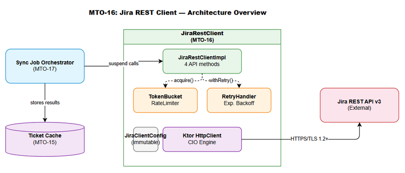
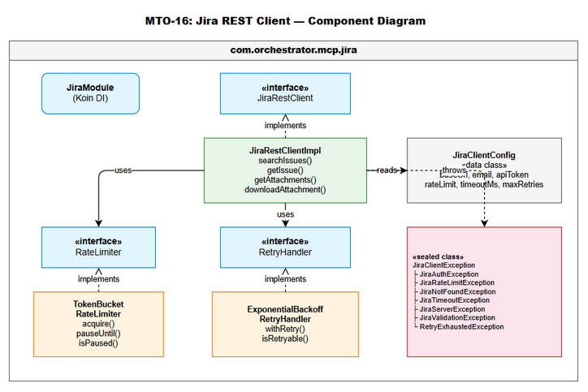
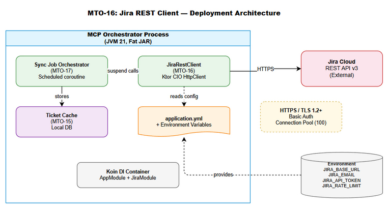
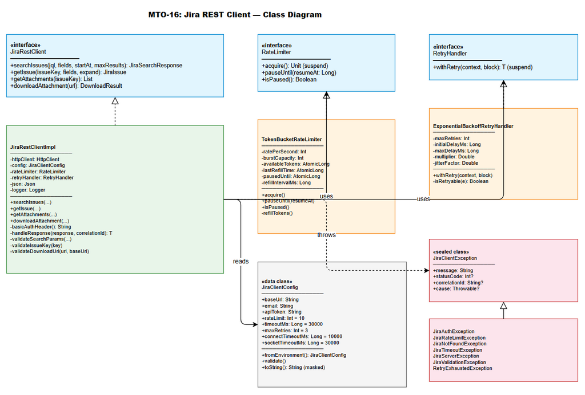
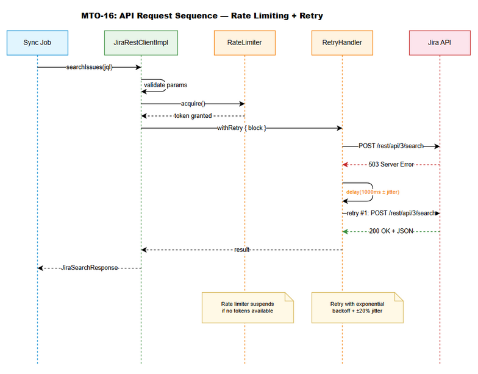
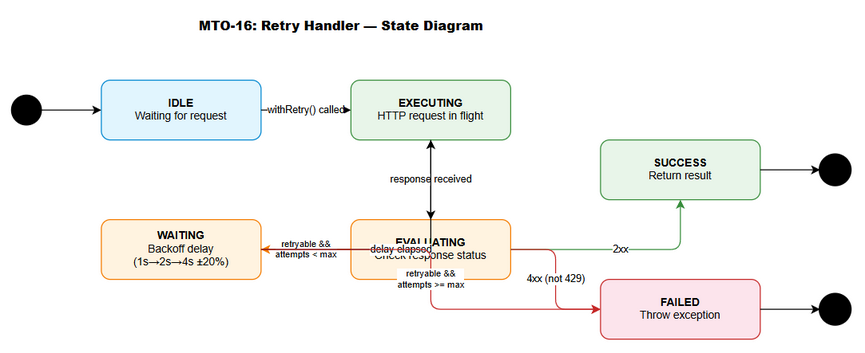

# Technical Design Document (TDD)

## Jira Project Sync Service — MTO-16: Jira REST Client — Direct API Integration

---

## Document Information

| Field | Value |
|-------|-------|
| Jira Ticket | MTO-16 |
| Title | Jira REST Client — Direct API Integration |
| Author | SA Agent |
| Version | 1.0 |
| Date | 2025-07-14 |
| Status | Draft |
| Related BRD | BRD-v1-MTO-16.docx |
| Related FSD | FSD-v1-MTO-16.docx |

---

## Author Tracking

| Role | Name - Position | Responsibility |
|------|-----------------|----------------|
| Author | SA Agent – Solution Architect | Create document |
| Peer Reviewer | TA Agent – Technical Architect | Review document |

---

## Revision History

| Version | Date | Author | Changes |
|---------|------|--------|---------|
| 1.0 | 2025-07-14 | SA Agent | Initiate document — auto-generated from BRD and FSD |

---

## Sign-Off

| Name | Signature and date |
|------|--------------------|
| | ☐ I agree and confirm the technical design in this TDD |
| | ☐ I agree and confirm the technical design in this TDD |

---

## 1. Introduction

> **Scope Boundary:** This TDD specifies HOW to implement the requirements defined in the FSD. It does NOT repeat functional requirements, business rules, use cases, or UI specifications — refer to the FSD for those. This document focuses on: technology choices, architecture decisions, implementation patterns, and deployment concerns.

### 1.1 Purpose

This TDD provides the detailed technical design for the Jira REST Client module (`com.orchestrator.mcp.jira`), a dedicated HTTP communication layer that integrates directly with Jira Cloud/Server REST API v3. The client provides high-throughput, resilient access for the background sync job (Epic MTO-14), bypassing the MCP Atlassian connector.

### 1.2 Scope

This document covers the technical implementation of:

- `JiraRestClient` interface and `JiraRestClientImpl` — Ktor CIO HttpClient with Basic Auth, JSON serialization
- `TokenBucketRateLimiter` — coroutine-safe rate limiting with 429 pause support
- `RetryHandler` — exponential backoff with jitter for transient failure recovery
- `JiraClientConfig` — environment-based configuration with fail-fast validation
- Sealed exception hierarchy — 7 typed exceptions for structured error handling
- Koin DI integration — singleton registration following existing project patterns

### 1.3 Technology Stack

| Layer | Technology | Version |
|-------|-----------|---------|
| Language | Kotlin | 2.3.20 |
| Platform | JVM | 21 |
| HTTP Client | Ktor Client (CIO engine) | 3.4.0 |
| Serialization | kotlinx.serialization-json | 1.8.1 |
| YAML Config | kaml | 0.77.0 |
| DI Framework | Koin | 4.1.1 |
| Coroutines | kotlinx.coroutines | 1.10.2 |
| Date/Time | kotlinx.datetime | 0.6.2 |
| Logging | SLF4J + Logback | 1.5.18 |
| Testing | JUnit 5 + Kotest + MockK | 5.11.4 / 5.9.1 / 1.14.2 |
| Integration Testing | Testcontainers + WireMock | 1.21.1 |
| Build Tool | Gradle (Kotlin DSL) | 8.x |

### 1.4 Design Principles

- **Interface/Impl Separation**: All public components exposed via interfaces for testability and mock injection
- **Coroutine-First**: All I/O operations are non-blocking `suspend` functions using Ktor CIO engine
- **Fail-Fast Configuration**: Invalid config detected at startup, not at first API call
- **Structured Error Handling**: Sealed exception hierarchy enables exhaustive `when` matching
- **Single Responsibility**: Each class has one clear purpose (rate limiting, retry, HTTP, config)
- **Immutability**: Configuration and response DTOs are immutable data classes
- **Defensive Programming**: Input validation before API calls, SSRF protection on downloads

### 1.5 Constraints

- Must use existing Ktor CIO engine (already in project dependencies) — no OkHttp or Apache HttpClient
- Must integrate with existing Koin DI container (`AppModule.kt`)
- Must follow existing package naming convention: `com.orchestrator.mcp.{module}`
- Must use kotlinx.serialization (not Jackson/Gson) for JSON — consistent with project
- Rate limiting must be coroutine-safe (no blocking `Thread.sleep`)
- API token must never appear in logs, exceptions, or serialized output

### 1.6 References

| Document | Location |
|----------|----------|
| BRD | BRD-v1-MTO-16.docx |
| FSD | FSD-v1-MTO-16.docx |
| Project Structure | .analysis/code-intelligence/project-structure.md |
| Existing HTTP Pattern | orchestrator-client/.../HttpMcpConnection.kt |
| Existing Retry Pattern | orchestrator-core/.../RetryUtils.kt |
| Jira REST API v3 | https://developer.atlassian.com/cloud/jira/platform/rest/v3/ |

---

## 2. System Architecture

### 2.1 Architecture Overview

The Jira REST Client is a self-contained module within the MCP Orchestration system. It sits between the Sync Job Orchestrator (MTO-17) and the external Jira REST API, encapsulating all HTTP communication concerns.



**Key architectural decisions:**

1. **Layered design**: Config → Client → RateLimiter → RetryHandler → HttpClient → Jira API
2. **Composition over inheritance**: Components are composed via constructor injection, not class hierarchy
3. **Coroutine suspension for backpressure**: Rate limiter suspends callers rather than rejecting — zero request loss
4. **Single HttpClient instance**: Connection pooling via Ktor CIO engine (max 100 connections, 45s keep-alive)

### 2.2 Component Diagram



| Component | Responsibility | Technology |
|-----------|---------------|------------|
| JiraRestClientImpl | Orchestrates API calls: validate → rate limit → retry → HTTP → deserialize | Ktor HttpClient, kotlinx.serialization |
| TokenBucketRateLimiter | Controls request rate, handles 429 pause | Kotlin coroutines, AtomicLong |
| RetryHandler | Exponential backoff with jitter for transient failures | Kotlin coroutines, kotlin.math |
| JiraClientConfig | Immutable configuration loaded from YAML/env vars | kaml, data class |
| JiraExceptions | Sealed exception hierarchy for typed error handling | Kotlin sealed class |
| JiraModule (Koin) | DI registration of all Jira client components | Koin module DSL |

### 2.3 Deployment Architecture



The Jira REST Client deploys as part of the MCP Orchestrator fat JAR (`mcp-orchestrator-all.jar`). No separate deployment artifact is needed.

**Runtime topology:**

```
┌─────────────────────────────────────────────────┐
│ MCP Orchestrator Process (JVM 21)               │
│                                                 │
│  ┌─────────────────┐  ┌──────────────────────┐ │
│  │ Sync Job        │  │ JiraRestClient       │ │
│  │ Orchestrator    │──│ (CIO HttpClient)     │─┼──→ Jira Cloud API
│  │ (MTO-17)        │  │                      │ │     (HTTPS/TLS 1.2+)
│  └─────────────────┘  └──────────────────────┘ │
│                                                 │
│  ┌─────────────────┐                           │
│  │ Ticket Cache    │                           │
│  │ (MTO-15)        │                           │
│  └─────────────────┘                           │
└─────────────────────────────────────────────────┘
```

### 2.4 Communication Patterns

| From | To | Protocol | Pattern | Description |
|------|----|----------|---------|-------------|
| Sync Job Orchestrator | JiraRestClient | In-process | Sync (suspend) | Kotlin suspend function calls |
| JiraRestClient | Jira REST API | HTTPS | Request/Response | Ktor CIO with connection pooling |
| JiraRestClient | TokenBucketRateLimiter | In-process | Sync (suspend) | Coroutine suspension for backpressure |
| JiraRestClient | RetryHandler | In-process | Sync (suspend) | Wraps HTTP calls with retry logic |

---

## 3. API Design

> **Prerequisite:** Functional API contracts (parameters, business errors, data flows) are defined in FSD §3.1–3.7. This section specifies the technical implementation: HTTP client configuration, request construction, response deserialization, and error code mapping.

### 3.1 API Overview

| # | Method | Jira Endpoint | HTTP Method | Description | Source |
|---|--------|---------------|-------------|-------------|--------|
| 1 | `searchIssues` | `/rest/api/3/search` | POST | Search issues by JQL with pagination | UC-01 |
| 2 | `getIssue` | `/rest/api/3/issue/{key}` | GET | Fetch single issue with field selection | UC-02 |
| 3 | `getAttachments` | `/rest/api/3/issue/{key}?fields=attachment` | GET | Retrieve attachment metadata | UC-03 |
| 4 | `downloadAttachment` | `{attachment.content URL}` | GET | Download binary attachment content | UC-04 |

---

### 3.2 API: searchIssues

**Implements:** UC-01, BR-01..BR-08

| Attribute | Value |
|-----------|-------|
| Method | POST |
| Path | `{baseUrl}/rest/api/3/search` |
| Auth | Basic Auth (Base64 email:token) |
| Content-Type | application/json |
| Rate Limited | Yes (token bucket) |
| Retryable | Yes (429, 5xx, timeout) |

**Request Headers:**

| Header | Required | Value |
|--------|----------|-------|
| Authorization | Yes | `Basic {Base64(email:apiToken)}` |
| Content-Type | Yes | `application/json` |
| X-Correlation-ID | Yes | UUID generated per request |

**Request Body (kotlinx.serialization):**

```kotlin
@Serializable
data class JiraSearchRequest(
    val jql: String,
    val fields: List<String> = emptyList(),
    val startAt: Int = 0,
    val maxResults: Int = 50
)
```

**Response Deserialization:**

```kotlin
@Serializable
data class JiraSearchResponse(
    val startAt: Int,
    val maxResults: Int,
    val total: Int,
    val issues: List<JiraIssue>
)
```

**Error Mapping:**

| HTTP Status | Exception | Retryable | Notes |
|-------------|-----------|-----------|-------|
| 200 | — | — | Success |
| 400 | `JiraValidationException` | No | Parse `errorMessages` array from body |
| 401 | `JiraAuthException` | No | Invalid credentials |
| 403 | `JiraAuthException` | No | Insufficient permissions |
| 429 | `JiraRateLimitException` | Yes | Extract `Retry-After` header |
| 5xx | `JiraServerException` | Yes | Include status code + body excerpt |
| Timeout | `JiraTimeoutException` | Yes | Include timeout duration |

---

### 3.3 API: getIssue

**Implements:** UC-02, BR-09..BR-11

| Attribute | Value |
|-----------|-------|
| Method | GET |
| Path | `{baseUrl}/rest/api/3/issue/{issueKey}` |
| Auth | Basic Auth |
| Rate Limited | Yes |
| Retryable | Yes (429, 5xx, timeout) |

**Query Parameters (URL-encoded):**

| Parameter | Type | Construction |
|-----------|------|-------------|
| fields | String | `fields.joinToString(",")` |
| expand | String | `expand.joinToString(",")` |

**Input Validation (before HTTP call):**

```kotlin
fun validateIssueKey(key: String) {
    require(key.matches(Regex("[A-Z]+-\\d+"))) {
        "Invalid issue key format: $key. Expected: PROJECT-123"
    }
}

fun validateExpand(expand: List<String>) {
    val allowed = setOf("changelog", "renderedFields", "transitions", "operations", "editmeta")
    val invalid = expand.filter { it !in allowed }
    require(invalid.isEmpty()) { "Invalid expand values: $invalid" }
}
```

**Response Deserialization:**

```kotlin
@Serializable
data class JiraIssue(
    val id: String,
    val key: String,
    val self: String,
    val fields: JsonObject,
    val changelog: JsonObject? = null
)
```

---

### 3.4 API: getAttachments

**Implements:** UC-03, BR-12..BR-14

| Attribute | Value |
|-----------|-------|
| Method | GET |
| Path | `{baseUrl}/rest/api/3/issue/{issueKey}?fields=attachment` |
| Auth | Basic Auth |
| Rate Limited | Yes |
| Retryable | Yes |

**Response Processing:**

```kotlin
// Extract attachment array from nested response
val issueResponse = httpClient.get(url) { ... }
val body = issueResponse.body<JsonObject>()
val attachmentArray = body["fields"]?.jsonObject?.get("attachment")?.jsonArray
    ?: return emptyList()

// Deserialize and filter (BR-14: skip null content URLs)
return attachmentArray
    .map { json.decodeFromJsonElement<JiraAttachment>(it) }
    .filter { attachment ->
        if (attachment.content.isNullOrBlank()) {
            logger.warn("Attachment ${attachment.id} has null content URL — skipping")
            false
        } else true
    }
```

**Response DTO:**

```kotlin
@Serializable
data class JiraAttachment(
    val id: String,
    val filename: String,
    val mimeType: String,
    val size: Long,
    val content: String,  // Download URL
    val author: JiraUser,
    val created: String   // ISO 8601
)

@Serializable
data class JiraUser(
    val displayName: String,
    val emailAddress: String? = null,
    val accountId: String
)
```

---

### 3.5 API: downloadAttachment

**Implements:** UC-04, BR-15..BR-18

| Attribute | Value |
|-----------|-------|
| Method | GET |
| Path | `{attachment.content URL}` (full URL from getAttachments) |
| Auth | Basic Auth |
| Rate Limited | Yes |
| Retryable | Yes (timeout, 5xx) |

**SSRF Validation (BR-16):**

```kotlin
fun validateDownloadUrl(url: String, configuredBaseUrl: String) {
    val downloadHost = Url(url).host
    val configuredHost = Url(configuredBaseUrl).host
    require(downloadHost == configuredHost) {
        "Download URL domain ($downloadHost) does not match configured Jira base URL ($configuredHost)"
    }
}
```

**Response Handling:**

```kotlin
suspend fun downloadAttachment(url: String): DownloadResult {
    validateDownloadUrl(url, config.baseUrl)
    
    return rateLimiter.acquire().let {
        retryHandler.withRetry("downloadAttachment($url)") {
            val response = httpClient.get(url) {
                header("Authorization", basicAuthHeader())
                header("Accept", "*/*")
            }
            DownloadResult(
                content = response.readBytes(),
                contentType = response.contentType()?.toString() ?: "application/octet-stream",
                contentLength = response.contentLength() ?: 0L
            )
        }
    }
}

data class DownloadResult(
    val content: ByteArray,
    val contentType: String,
    val contentLength: Long
)
```

---

## 4. Database Design

> **Note:** This module does NOT persist data to a database. All data structures are in-memory domain objects for API communication. The downstream Ticket Cache (MTO-15) handles persistence.

### 4.1 Schema Overview

No database schema required for this module. Data flows:

```
Jira API → JSON Response → kotlinx.serialization → Data Classes (in-memory) → Caller (Sync Job)
```

### 4.2 Data Transfer Objects

All DTOs are defined in Section 3 (API Design). They are:
- `JiraSearchRequest` — outbound request body
- `JiraSearchResponse` — search result container
- `JiraIssue` — single issue representation
- `JiraAttachment` — attachment metadata
- `JiraUser` — user reference
- `DownloadResult` — binary download response

### 4.3 Serialization Strategy

| Concern | Decision | Rationale |
|---------|----------|-----------|
| JSON library | kotlinx.serialization | Project standard, compile-time safe |
| Unknown keys | `ignoreUnknownKeys = true` | Forward compatibility with Jira API changes |
| Null handling | Explicit nullable types | Kotlin null safety, no runtime surprises |
| Date format | ISO 8601 strings | Jira API native format, parse on demand |
| Enum handling | Not used (JsonObject for dynamic fields) | Jira fields are dynamic, not fixed enum |

---

## 5. Class / Module Design

### 5.1 Package Structure

```
com.orchestrator.mcp.jira/
├── JiraRestClient.kt              # Interface — 4 public API methods
├── JiraRestClientImpl.kt          # Implementation — HTTP orchestration
├── config/
│   └── JiraClientConfig.kt        # Immutable config data class + validation
├── ratelimit/
│   ├── RateLimiter.kt             # Interface
│   └── TokenBucketRateLimiter.kt  # Coroutine-safe token bucket implementation
├── retry/
│   ├── RetryHandler.kt            # Interface
│   └── ExponentialBackoffRetryHandler.kt  # Backoff + jitter implementation
├── model/
│   ├── JiraSearchRequest.kt       # Request DTO
│   ├── JiraSearchResponse.kt      # Response DTO
│   ├── JiraIssue.kt               # Issue DTO
│   ├── JiraAttachment.kt          # Attachment metadata DTO
│   ├── JiraUser.kt                # User reference DTO
│   └── DownloadResult.kt          # Binary download result
├── exception/
│   ├── JiraClientException.kt     # Sealed base class
│   ├── JiraAuthException.kt       # 401/403
│   ├── JiraRateLimitException.kt  # 429
│   ├── JiraNotFoundException.kt   # 404
│   ├── JiraTimeoutException.kt    # Timeout
│   ├── JiraServerException.kt     # 5xx
│   ├── JiraValidationException.kt # Input validation
│   └── RetryExhaustedException.kt # All retries failed
└── di/
    └── JiraModule.kt              # Koin module registration
```

### 5.2 Key Interfaces

```kotlin
/**
 * Jira REST API client interface.
 * All methods are suspend functions for non-blocking I/O.
 * Thread-safe for concurrent coroutine access.
 */
interface JiraRestClient {
    
    /**
     * Search issues by JQL with pagination.
     * @throws JiraValidationException if jql is blank or maxResults out of range
     * @throws JiraAuthException if credentials are invalid
     * @throws RetryExhaustedException if all retries fail
     */
    suspend fun searchIssues(
        jql: String,
        fields: List<String> = emptyList(),
        startAt: Int = 0,
        maxResults: Int = 50
    ): JiraSearchResponse

    /**
     * Fetch a single issue by key.
     * @throws JiraValidationException if issueKey format is invalid
     * @throws JiraNotFoundException if issue does not exist
     */
    suspend fun getIssue(
        issueKey: String,
        fields: List<String> = emptyList(),
        expand: List<String> = emptyList()
    ): JiraIssue

    /**
     * Retrieve attachment metadata for an issue.
     * @throws JiraValidationException if issueKey format is invalid
     * @throws JiraNotFoundException if issue does not exist
     */
    suspend fun getAttachments(issueKey: String): List<JiraAttachment>

    /**
     * Download attachment binary content.
     * @throws JiraValidationException if URL domain doesn't match configured base URL (SSRF)
     * @throws JiraNotFoundException if attachment not found
     */
    suspend fun downloadAttachment(url: String): DownloadResult
}
```

```kotlin
/**
 * Coroutine-safe rate limiter interface.
 */
interface RateLimiter {
    /** Acquire a token. Suspends if no tokens available. */
    suspend fun acquire()
    
    /** Pause all requests until the specified instant (from 429 Retry-After). */
    fun pauseUntil(resumeAt: Long)
    
    /** Check if rate limiter is currently paused. */
    fun isPaused(): Boolean
}
```

```kotlin
/**
 * Retry handler interface for transient failure recovery.
 */
interface RetryHandler {
    /**
     * Execute block with retry logic.
     * @param context Descriptive context for logging
     * @param block The suspend function to execute and potentially retry
     * @return Result of successful block execution
     * @throws JiraClientException if all retries exhausted or non-retryable error
     */
    suspend fun <T> withRetry(context: String, block: suspend () -> T): T
}
```

### 5.3 Class Diagram



### 5.4 Design Patterns

| Pattern | Where Used | Rationale |
|---------|-----------|-----------|
| Interface/Impl | JiraRestClient, RateLimiter, RetryHandler | Testability, mock injection, SRP |
| Strategy | RetryHandler (pluggable retry strategies) | Different retry policies for different contexts |
| Template Method | `withRetry` wraps arbitrary suspend blocks | Reusable retry logic across all API methods |
| Token Bucket | TokenBucketRateLimiter | Industry-standard rate limiting with burst support |
| Sealed Class | JiraClientException hierarchy | Exhaustive error handling via `when` expressions |
| Builder | Ktor HttpClient configuration | Fluent, readable client setup |
| Composition | JiraRestClientImpl composes RateLimiter + RetryHandler | Loose coupling, independent testing |

### 5.5 Error Handling

| Exception | HTTP Status | Error Code | When Thrown |
|-----------|-------------|------------|------------|
| JiraValidationException | 400 / pre-call | JIRA_VALIDATION | Input validation fails (blank JQL, invalid key format, SSRF) |
| JiraAuthException | 401, 403 | JIRA_AUTH | Invalid credentials or insufficient permissions |
| JiraNotFoundException | 404 | JIRA_NOT_FOUND | Issue or attachment does not exist |
| JiraRateLimitException | 429 | JIRA_RATE_LIMIT | Rate limit exceeded (after retries exhausted) |
| JiraServerException | 5xx | JIRA_SERVER | Jira server error (after retries exhausted) |
| JiraTimeoutException | — | JIRA_TIMEOUT | Connection or socket timeout (after retries exhausted) |
| RetryExhaustedException | varies | JIRA_RETRY_EXHAUSTED | All retry attempts failed |

### 5.6 Implementation Details — JiraRestClientImpl

```kotlin
class JiraRestClientImpl(
    private val httpClient: HttpClient,
    private val config: JiraClientConfig,
    private val rateLimiter: RateLimiter,
    private val retryHandler: RetryHandler
) : JiraRestClient {

    private val logger = LoggerFactory.getLogger(JiraRestClientImpl::class.java)
    private val json = Json { ignoreUnknownKeys = true; encodeDefaults = true }

    override suspend fun searchIssues(
        jql: String,
        fields: List<String>,
        startAt: Int,
        maxResults: Int
    ): JiraSearchResponse {
        // Validate inputs (BR-01..BR-04)
        validateSearchParams(jql, fields, startAt, maxResults)
        
        val correlationId = UUID.randomUUID().toString()
        val startTime = System.currentTimeMillis()
        
        return rateLimiter.acquire().let {
            retryHandler.withRetry("searchIssues(jql=${jql.take(50)})") {
                val response = httpClient.post("${config.baseUrl}/rest/api/3/search") {
                    header("Authorization", basicAuthHeader())
                    header("X-Correlation-ID", correlationId)
                    contentType(ContentType.Application.Json)
                    setBody(json.encodeToString(
                        JiraSearchRequest.serializer(),
                        JiraSearchRequest(jql, fields, startAt, maxResults)
                    ))
                }
                handleResponse(response, correlationId)
            }
        }.also {
            logger.info("searchIssues completed [correlationId=$correlationId, duration=${System.currentTimeMillis() - startTime}ms, total=${it.total}]")
        }
    }

    private fun basicAuthHeader(): String {
        val credentials = "${config.email}:${config.apiToken}"
        return "Basic ${Base64.getEncoder().encodeToString(credentials.toByteArray())}"
    }

    private suspend inline fun <reified T> handleResponse(
        response: HttpResponse,
        correlationId: String
    ): T {
        return when (response.status.value) {
            in 200..299 -> json.decodeFromString(response.bodyAsText())
            400 -> throw parseValidationError(response, correlationId)
            401 -> throw JiraAuthException("Invalid credentials", 401, correlationId)
            403 -> throw JiraAuthException("Insufficient permissions", 403, correlationId)
            404 -> throw JiraNotFoundException("Resource not found", correlationId)
            429 -> {
                val retryAfter = response.headers["Retry-After"]?.toLongOrNull() ?: 60
                rateLimiter.pauseUntil(System.currentTimeMillis() + retryAfter * 1000)
                throw JiraRateLimitException("Rate limited", retryAfter, correlationId)
            }
            in 500..599 -> throw JiraServerException(
                "Server error: ${response.status}", response.status.value, correlationId
            )
            else -> throw JiraServerException(
                "Unexpected status: ${response.status}", response.status.value, correlationId
            )
        }
    }
}
```

---

## 6. Integration Design

> **Prerequisite:** Business integration requirements are defined in FSD §5. This section specifies the technical implementation: protocols, timeouts, retry policies, connection pooling, and sequence diagrams.

### 6.1 External System: Jira REST API v3

| Attribute | Value |
|-----------|-------|
| Protocol | HTTPS (TLS 1.2+) |
| Base URL | Configurable via `JIRA_BASE_URL` env var |
| Authentication | Basic Auth (Base64 email:apiToken) |
| Content-Type | application/json (requests), varies (downloads) |
| Connection Timeout | 10,000ms (configurable: `JIRA_CONNECT_TIMEOUT_MS`) |
| Socket Timeout | 30,000ms (configurable: `JIRA_SOCKET_TIMEOUT_MS`) |
| Request Timeout | 30,000ms (configurable: `JIRA_TIMEOUT_MS`) |
| Retry Policy | Max 3 retries, exponential backoff 1s→2s→4s, max 30s, ±20% jitter |
| Rate Limit | 10 req/s default (configurable: `JIRA_RATE_LIMIT`) |
| Connection Pool | Max 100 connections, 45s keep-alive, 5s idle timeout |

**Ktor HttpClient Configuration:**

```kotlin
val httpClient = HttpClient(CIO) {
    engine {
        maxConnectionsCount = 100
        endpoint {
            connectTimeout = config.connectTimeoutMs
            socketTimeout = config.socketTimeoutMs
            keepAliveTime = 45_000
            connectAttempts = 1  // Retry handled by RetryHandler, not engine
        }
    }
    install(HttpTimeout) {
        requestTimeoutMillis = config.timeoutMs
        connectTimeoutMillis = config.connectTimeoutMs
        socketTimeoutMillis = config.socketTimeoutMs
    }
    install(ContentNegotiation) {
        json(Json {
            ignoreUnknownKeys = true
            encodeDefaults = true
            isLenient = false
        })
    }
    install(Logging) {
        logger = Logger.DEFAULT
        level = LogLevel.INFO  // Log request/response metadata, not bodies
        sanitizeHeader { header -> header == "Authorization" }
    }
}
```

### 6.2 Sequence Diagram — API Request with Rate Limiting and Retry



**Flow description:**

1. Caller invokes `searchIssues(jql, fields, startAt, maxResults)`
2. JiraRestClientImpl validates input parameters
3. Acquires rate limiter token (may suspend if bucket empty)
4. Wraps HTTP call in `retryHandler.withRetry { ... }`
5. Constructs and sends HTTP request via Ktor CIO
6. On success (2xx): deserializes response, returns to caller
7. On retryable error (429/5xx/timeout): RetryHandler calculates backoff, suspends, retries
8. On non-retryable error (4xx except 429): throws typed exception immediately
9. On retry exhaustion: throws RetryExhaustedException with context

### 6.3 Internal Integration: Koin DI Module

```kotlin
val jiraModule = module {
    // Configuration — loaded once at startup
    single<JiraClientConfig> {
        JiraClientConfig.fromEnvironment()
    }
    
    // Rate limiter — singleton shared across all requests
    single<RateLimiter> {
        TokenBucketRateLimiter(
            ratePerSecond = get<JiraClientConfig>().rateLimit,
            burstCapacity = get<JiraClientConfig>().rateLimit
        )
    }
    
    // Retry handler — singleton with config-driven parameters
    single<RetryHandler> {
        ExponentialBackoffRetryHandler(
            maxRetries = get<JiraClientConfig>().maxRetries,
            initialDelayMs = 1000L,
            maxDelayMs = 30_000L,
            multiplier = 2.0,
            jitterFactor = 0.2
        )
    }
    
    // HTTP Client — singleton with connection pooling
    single<HttpClient> {
        createJiraHttpClient(get<JiraClientConfig>())
    }
    
    // Jira REST Client — main entry point
    single<JiraRestClient> {
        JiraRestClientImpl(
            httpClient = get(),
            config = get(),
            rateLimiter = get(),
            retryHandler = get()
        )
    }
}
```

**Registration in AppModule.kt:**

```kotlin
// In existing AppModule.kt, add:
val appModule = module {
    includes(jiraModule)  // Add Jira client module
    // ... existing modules
}
```

---

## 7. Security Design

> **Prerequisite:** Business security requirements are defined in FSD §7. This section specifies the technical implementation.

### 7.1 Authentication

| Aspect | Implementation |
|--------|---------------|
| Mechanism | HTTP Basic Auth |
| Header Format | `Authorization: Basic {Base64(email:apiToken)}` |
| Credential Source | Environment variables (`JIRA_EMAIL`, `JIRA_API_TOKEN`) |
| Credential Lifecycle | Loaded at startup, held in memory (JiraClientConfig), never serialized |
| Header Construction | Computed per-request from config (not cached as string) |

### 7.2 Authorization

| Role | Access | Jira Permissions Required |
|------|--------|--------------------------|
| Sync Job (service account) | Read issues, Read attachments | Browse Projects, Read Issues |
| System Administrator | Configure credentials | Environment variable access |

### 7.3 Data Protection

| Data Type | At Rest | In Transit | In Logs | In Exceptions |
|-----------|---------|------------|---------|---------------|
| API Token | Memory only (JiraClientConfig) | TLS 1.2+ (Basic Auth header) | ❌ NEVER logged | ❌ NEVER included |
| Email | Memory only | TLS 1.2+ (Basic Auth header) | ❌ Not logged | ❌ Not included |
| Issue content | Not persisted by this module | TLS 1.2+ | Summary only (first 50 chars) | Not included |
| Attachment binary | Not persisted by this module | TLS 1.2+ | Filename + size only | Not included |

**Credential Protection Implementation:**

```kotlin
// In JiraClientConfig — override toString to mask sensitive fields
data class JiraClientConfig(
    val baseUrl: String,
    val email: String,
    val apiToken: String,
    // ... other fields
) {
    override fun toString(): String = "JiraClientConfig(baseUrl=$baseUrl, email=***@***, apiToken=***)"
}

// In Ktor Logging plugin — sanitize Authorization header
install(Logging) {
    sanitizeHeader { header -> header == "Authorization" }
}
```

### 7.4 Input Validation & SSRF Prevention

| Validation | Implementation | Business Rule |
|-----------|---------------|---------------|
| JQL not blank | `require(jql.isNotBlank())` | BR-01 |
| maxResults range | `require(maxResults in 1..100)` | BR-02 |
| Issue key format | `require(key.matches(Regex("[A-Z]+-\\d+")))` | BR-09 |
| Download URL domain | `require(Url(url).host == Url(config.baseUrl).host)` | BR-16 |
| URL scheme | `require(url.startsWith("http://") \|\| url.startsWith("https://"))` | BR-15 |

---

## 8. Performance & Scalability

> **Prerequisite:** Business NFR targets are defined in FSD §8. This section specifies how to achieve those targets.

### 8.1 Connection Pooling

| Resource | Min | Max | Keep-Alive | Idle Timeout |
|----------|-----|-----|-----------|-------------|
| Ktor CIO connections | 0 (on-demand) | 100 | 45,000ms | 5,000ms |

**Rationale:** CIO engine manages connection pool automatically. Max 100 connections supports 10 req/s with headroom for concurrent retries and burst traffic.

### 8.2 Rate Limiting Performance

| Metric | Target | Implementation |
|--------|--------|---------------|
| Token acquisition latency | < 1ms (when tokens available) | AtomicLong CAS operation |
| Suspension overhead | < 100ms (one refill interval) | `delay(refillRateMs)` |
| Burst handling | 10 immediate requests | Full bucket = rateLimit tokens |
| 429 pause accuracy | ±100ms of Retry-After | `delay(retryAfterMs)` |

### 8.3 Retry Performance Impact

| Scenario | Worst-Case Latency | Calculation |
|----------|-------------------|-------------|
| Success on 1st attempt | < 30s (timeout) | Single request |
| Success on 2nd attempt | ~31s | 1st attempt + 1s backoff + 2nd attempt |
| Success on 3rd attempt | ~33s | 1st + 1s + 2nd + 2s + 3rd |
| All retries exhausted | ~37s | 1st + 1s + 2nd + 2s + 3rd + 4s + final |

### 8.4 Performance Targets

| Operation | Target | Measurement |
|-----------|--------|-------------|
| searchIssues (happy path) | < 2s p95 | Ktor request duration metric |
| getIssue (happy path) | < 1s p95 | Ktor request duration metric |
| getAttachments (happy path) | < 1s p95 | Ktor request duration metric |
| downloadAttachment (< 1MB) | < 5s p95 | Ktor request duration metric |
| Rate limiter acquire (tokens available) | < 1ms | AtomicLong CAS timing |
| Config validation at startup | < 100ms | Startup log timing |

---

## 9. Monitoring & Observability

### 9.1 Logging

| Log Event | Level | Fields | Example |
|-----------|-------|--------|---------|
| API request start | DEBUG | correlationId, method, endpoint | `[cid=abc123] POST /rest/api/3/search` |
| API request success | INFO | correlationId, method, duration, statusCode, resultSize | `[cid=abc123] 200 OK in 450ms (120 issues)` |
| API request failure | WARN | correlationId, method, statusCode, errorMessage | `[cid=abc123] 429 Rate Limited (Retry-After: 5s)` |
| Retry attempt | WARN | correlationId, attempt, maxRetries, delay, statusCode | `[cid=abc123] Retry 1/3 after 1200ms (status=503)` |
| Retry exhausted | ERROR | correlationId, attempts, totalElapsed, lastStatus | `[cid=abc123] All 3 retries exhausted after 7200ms` |
| Rate limiter paused | WARN | retryAfterSeconds, pauseUntil | `Rate limiter paused for 5s (429 received)` |
| Rate limiter resumed | INFO | pauseDuration | `Rate limiter resumed after 5s pause` |
| Config loaded | INFO | baseUrl, rateLimit, timeout (NO credentials) | `Jira config: url=https://jira.example.com, rate=10/s` |
| Config validation failed | ERROR | missingVars, invalidVars | `Missing: JIRA_BASE_URL, JIRA_API_TOKEN` |

### 9.2 Metrics (Future — when metrics infrastructure available)

| Metric | Type | Description | Alert Threshold |
|--------|------|-------------|-----------------|
| `jira.requests.total` | Counter | Total API requests by method and status | — |
| `jira.requests.duration` | Histogram | Request duration in ms | p95 > 5000ms |
| `jira.retries.total` | Counter | Total retry attempts | > 10/min |
| `jira.ratelimit.pauses` | Counter | Number of 429-triggered pauses | > 5/hour |
| `jira.ratelimit.tokens` | Gauge | Available tokens in bucket | < 2 |
| `jira.errors.total` | Counter | Errors by exception type | auth > 0 |

### 9.3 Health Checks

| Check | Implementation | Expected Response |
|-------|---------------|-------------------|
| Jira connectivity | `GET {baseUrl}/rest/api/3/serverInfo` | 200 OK with version info |
| Rate limiter status | `rateLimiter.isPaused()` | false (not paused) |
| Config validity | `config.isValid()` | true |

---

## 10. Deployment Considerations

### 10.1 Environment Configuration

| Property | DEV | SIT | UAT | PROD |
|----------|-----|-----|-----|------|
| JIRA_BASE_URL | https://dev-jira.example.com | https://sit-jira.example.com | https://uat-jira.example.com | https://jira.example.com |
| JIRA_EMAIL | sync-dev@example.com | sync-sit@example.com | sync-uat@example.com | sync-prod@example.com |
| JIRA_API_TOKEN | (dev token) | (sit token) | (uat token) | (prod token) |
| JIRA_RATE_LIMIT | 10 | 10 | 10 | 10 |
| JIRA_TIMEOUT_MS | 30000 | 30000 | 30000 | 30000 |
| JIRA_MAX_RETRIES | 3 | 3 | 3 | 3 |
| JIRA_CONNECT_TIMEOUT_MS | 10000 | 10000 | 10000 | 10000 |
| JIRA_SOCKET_TIMEOUT_MS | 30000 | 30000 | 30000 | 30000 |

### 10.2 YAML Configuration (application.yml)

```yaml
jira:
  base_url: ${JIRA_BASE_URL}
  email: ${JIRA_EMAIL}
  api_token: ${JIRA_API_TOKEN}
  rate_limit: ${JIRA_RATE_LIMIT:10}
  timeout_ms: ${JIRA_TIMEOUT_MS:30000}
  max_retries: ${JIRA_MAX_RETRIES:3}
  connect_timeout_ms: ${JIRA_CONNECT_TIMEOUT_MS:10000}
  socket_timeout_ms: ${JIRA_SOCKET_TIMEOUT_MS:30000}
```

### 10.3 Feature Flags

| Flag | Default | Description |
|------|---------|-------------|
| `jira.client.enabled` | true | Enable/disable Jira client (for graceful degradation) |
| `jira.client.retry.enabled` | true | Enable/disable retry logic (useful for debugging) |
| `jira.client.ratelimit.enabled` | true | Enable/disable rate limiting (useful for load testing) |

### 10.4 Rollback Strategy

This module is a library component within the fat JAR. Rollback = redeploy previous JAR version.

**Rollback triggers:**
- Authentication failures in production (wrong credentials configured)
- Rate limiting causing sync job timeouts
- Unexpected Jira API changes breaking deserialization

**Rollback steps:**
1. Redeploy previous `mcp-orchestrator-all.jar` version
2. Verify sync job resumes with previous Jira client behavior
3. Investigate root cause before re-deploying new version

### 10.5 Dependencies & Build

**New dependencies to add to `build.gradle.kts`:**

```kotlin
// No new dependencies needed — all already in project:
// - io.ktor:ktor-client-cio (existing)
// - io.ktor:ktor-client-content-negotiation (existing)
// - io.ktor:ktor-serialization-kotlinx-json (existing)
// - io.ktor:ktor-client-logging (existing)
// - org.jetbrains.kotlinx:kotlinx-serialization-json (existing)
// - com.charleskorn.kaml:kaml (existing)
// - io.insert-koin:koin-core (existing)

// Test dependencies (existing):
// - io.ktor:ktor-client-mock (for unit tests)
// - org.wiremock:wiremock (for integration tests)
// - org.testcontainers:testcontainers (for IT infrastructure)
```

---

## 11. Appendix

### 11.1 Implementation Checklist

| # | Task | Package/File | Priority | Estimated Effort |
|---|------|-------------|----------|-----------------|
| 1 | Create `JiraClientConfig` data class + validation | `config/JiraClientConfig.kt` | High | 2h |
| 2 | Create sealed exception hierarchy (7 classes) | `exception/*.kt` | High | 1h |
| 3 | Create DTO models (6 data classes) | `model/*.kt` | High | 1h |
| 4 | Implement `TokenBucketRateLimiter` | `ratelimit/TokenBucketRateLimiter.kt` | High | 3h |
| 5 | Implement `ExponentialBackoffRetryHandler` | `retry/ExponentialBackoffRetryHandler.kt` | High | 2h |
| 6 | Implement `JiraRestClientImpl` (4 API methods) | `JiraRestClientImpl.kt` | High | 4h |
| 7 | Create Koin module (`JiraModule.kt`) | `di/JiraModule.kt` | Medium | 1h |
| 8 | Add YAML config section to `application.yml` | `resources/application.yml` | Medium | 0.5h |
| 9 | Unit tests — config validation | `test/.../config/` | High | 2h |
| 10 | Unit tests — rate limiter | `test/.../ratelimit/` | High | 3h |
| 11 | Unit tests — retry handler | `test/.../retry/` | High | 2h |
| 12 | Unit tests — client (Ktor mock) | `test/.../` | High | 3h |
| 13 | Integration tests — WireMock | `test/.../integration/` | High | 4h |
| 14 | Update AppModule.kt to include jiraModule | `AppModule.kt` | Medium | 0.5h |
| | **Total** | | | **~29h** |

### 11.2 State Diagram — Retry Handler



**States:**

| State | Description |
|-------|-------------|
| IDLE | Waiting for next request |
| EXECUTING | HTTP request in flight |
| EVALUATING | Checking response status |
| WAITING | Backoff delay before retry |
| SUCCESS | Request completed successfully |
| FAILED | All retries exhausted |

**Transitions:**

| From | To | Trigger |
|------|----|---------|
| IDLE | EXECUTING | `withRetry()` called |
| EXECUTING | EVALUATING | Response received or timeout |
| EVALUATING | SUCCESS | 2xx response |
| EVALUATING | FAILED | Non-retryable error (4xx except 429) |
| EVALUATING | WAITING | Retryable error AND attempts < max |
| EVALUATING | FAILED | Retryable error AND attempts >= max |
| WAITING | EXECUTING | Backoff delay elapsed |

### 11.3 TokenBucketRateLimiter Implementation Detail

```kotlin
class TokenBucketRateLimiter(
    private val ratePerSecond: Int,
    private val burstCapacity: Int = ratePerSecond
) : RateLimiter {

    private val availableTokens = AtomicLong(burstCapacity.toLong())
    private val lastRefillTime = AtomicLong(System.currentTimeMillis())
    private val pausedUntil = AtomicLong(0L)
    private val refillIntervalMs = 1000L / ratePerSecond
    private val logger = LoggerFactory.getLogger(TokenBucketRateLimiter::class.java)

    override suspend fun acquire() {
        while (true) {
            // Check global pause (429 backoff)
            val pauseEnd = pausedUntil.get()
            val now = System.currentTimeMillis()
            if (pauseEnd > now) {
                logger.debug("Rate limiter paused, waiting ${pauseEnd - now}ms")
                delay(pauseEnd - now)
                continue
            }

            // Refill tokens based on elapsed time
            refillTokens()

            // Try to acquire token (CAS)
            val current = availableTokens.get()
            if (current > 0 && availableTokens.compareAndSet(current, current - 1)) {
                return  // Token acquired
            }

            // No token — wait for next refill
            delay(refillIntervalMs)
        }
    }

    private fun refillTokens() {
        val now = System.currentTimeMillis()
        val lastRefill = lastRefillTime.get()
        val elapsed = now - lastRefill
        val tokensToAdd = elapsed / refillIntervalMs

        if (tokensToAdd > 0 && lastRefillTime.compareAndSet(lastRefill, now)) {
            val newTokens = minOf(
                availableTokens.get() + tokensToAdd,
                burstCapacity.toLong()
            )
            availableTokens.set(newTokens)
        }
    }

    override fun pauseUntil(resumeAt: Long) {
        logger.warn("Rate limiter paused until ${Instant.fromEpochMilliseconds(resumeAt)}")
        pausedUntil.set(resumeAt)
    }

    override fun isPaused(): Boolean = pausedUntil.get() > System.currentTimeMillis()
}
```

### 11.4 ExponentialBackoffRetryHandler Implementation Detail

```kotlin
class ExponentialBackoffRetryHandler(
    private val maxRetries: Int = 3,
    private val initialDelayMs: Long = 1000L,
    private val maxDelayMs: Long = 30_000L,
    private val multiplier: Double = 2.0,
    private val jitterFactor: Double = 0.2
) : RetryHandler {

    private val logger = LoggerFactory.getLogger(ExponentialBackoffRetryHandler::class.java)
    private val random = java.util.Random()

    override suspend fun <T> withRetry(context: String, block: suspend () -> T): T {
        var attempt = 0
        var lastException: JiraClientException? = null
        val startTime = System.currentTimeMillis()

        while (attempt <= maxRetries) {
            try {
                return block()
            } catch (e: JiraClientException) {
                if (!isRetryable(e)) throw e

                lastException = e
                attempt++

                if (attempt > maxRetries) break

                val baseDelay = minOf(
                    initialDelayMs * multiplier.pow((attempt - 1).toDouble()),
                    maxDelayMs.toDouble()
                ).toLong()

                val jitter = (baseDelay * jitterFactor * (random.nextDouble() * 2 - 1)).toLong()
                val actualDelay = (baseDelay + jitter).coerceAtLeast(0L)

                logger.warn(
                    "Retry {}/{} for {} after {}ms [status={}, correlationId={}]",
                    attempt, maxRetries, context, actualDelay,
                    e.statusCode, e.correlationId
                )

                delay(actualDelay)
            }
        }

        throw RetryExhaustedException(
            cause = lastException!!,
            attempts = attempt,
            elapsedMs = System.currentTimeMillis() - startTime
        )
    }

    private fun isRetryable(e: JiraClientException): Boolean = when (e) {
        is JiraRateLimitException -> true   // 429
        is JiraServerException -> true      // 5xx
        is JiraTimeoutException -> true     // timeout
        else -> false                       // 4xx (auth, not found, validation)
    }
}
```

### 11.5 Glossary

| Term | Definition |
|------|------------|
| CIO | Coroutine-based I/O — Ktor's non-blocking HTTP client engine |
| Token Bucket | Rate limiting algorithm: tokens refill at constant rate, requests consume tokens |
| Exponential Backoff | Retry delay doubles after each attempt (1s → 2s → 4s) |
| Jitter | Random ±20% variation on backoff delay to prevent thundering herd |
| SSRF | Server-Side Request Forgery — prevented by URL domain validation |
| Correlation ID | UUID attached to each request for distributed tracing |
| CAS | Compare-And-Swap — atomic operation for lock-free concurrency |

### 11.6 Open Questions

| # | Question | Status | Answer |
|---|----------|--------|--------|
| 1 | Should rate limiter be shared across multiple JiraRestClient instances? | Resolved | Yes — singleton via Koin DI |
| 2 | Should we support OAuth 2.0 in addition to Basic Auth? | Deferred | Out of scope per BRD — future enhancement |
| 3 | Should download streaming use ByteReadChannel for very large files? | Resolved | Return ByteArray for simplicity; streaming is internal implementation detail |
| 4 | Should we add circuit breaker pattern? | Deferred | Not in scope — rate limiter + retry provides sufficient resilience |

---

## ⛔ MANDATORY: Diagram Requirements

### Required draw.io Diagrams

| # | Diagram | File | Section | Status |
|---|---------|------|---------|--------|
| 1 | Architecture Overview | `diagrams/tdd-architecture.drawio` + `.png` | §2.1 | ✅ |
| 2 | Component Diagram | `diagrams/tdd-component.drawio` + `.png` | §2.2 | ✅ |
| 3 | Deployment Diagram | `diagrams/tdd-deployment.drawio` + `.png` | §2.3 | ✅ |
| 4 | API Sequence (rate limit + retry) | `diagrams/tdd-sequence-api.drawio` + `.png` | §6.2 | ✅ |
| 5 | Class Diagram | `diagrams/tdd-class-diagram.drawio` + `.png` | §5.3 | ✅ |
| 6 | State Diagram (retry handler) | `diagrams/tdd-state-retry.drawio` + `.png` | §11.2 | ✅ |

### Diagram Index

| # | Diagram | Image | Source (editable) |
|---|---------|-------|-------------------|
| 1 | Architecture Overview | [tdd-architecture.png](diagrams/tdd-architecture.png) | [tdd-architecture.drawio](diagrams/tdd-architecture.drawio) |
| 2 | Component Diagram | [tdd-component.png](diagrams/tdd-component.png) | [tdd-component.drawio](diagrams/tdd-component.drawio) |
| 3 | Deployment Diagram | [tdd-deployment.png](diagrams/tdd-deployment.png) | [tdd-deployment.drawio](diagrams/tdd-deployment.drawio) |
| 4 | API Sequence | [tdd-sequence-api.png](diagrams/tdd-sequence-api.png) | [tdd-sequence-api.drawio](diagrams/tdd-sequence-api.drawio) |
| 5 | Class Diagram | [tdd-class-diagram.png](diagrams/tdd-class-diagram.png) | [tdd-class-diagram.drawio](diagrams/tdd-class-diagram.drawio) |
| 6 | State — Retry Handler | [tdd-state-retry.png](diagrams/tdd-state-retry.png) | [tdd-state-retry.drawio](diagrams/tdd-state-retry.drawio) |
