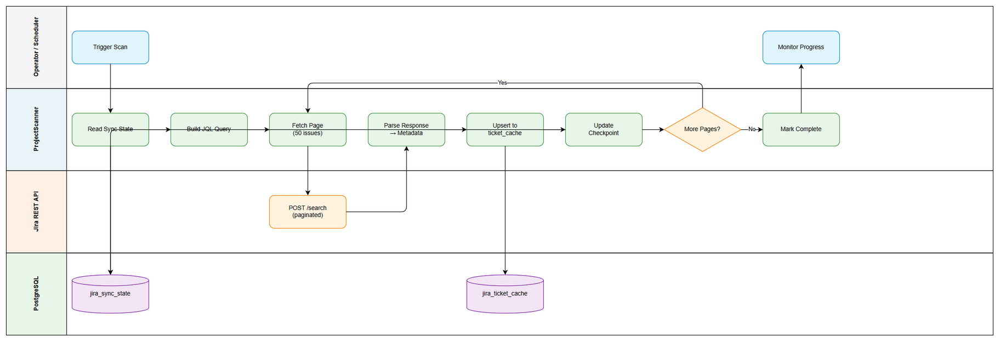

# Business Requirements Document (BRD)

## MCPOrchestration — MTO-17: Project Scanner — Breadth-First Incremental Scan

---

## Document Information

| Field | Value |
|-------|-------|
| Jira Ticket | MTO-17 |
| Title | Project Scanner — Breadth-First Incremental Scan |
| Author | BA Agent |
| Version | 1.0 |
| Date | 2026-05-07 |
| Status | Draft |

---

## Author Tracking

| Role | Name - Position | Responsibility |
|------|-----------------|----------------|
| Author | BA Agent – Business Analyst | Create document |
| Peer Reviewer | SA Agent – Solution Architect | Review document |

---

## Revision History

| Version | Date | Author | Changes |
|---------|------|--------|---------|
| 1.0 | 2026-05-07 | BA Agent | Initiate document — auto-generated from Jira ticket MTO-17 and linked tickets |

---

## Sign-Off

| Name | Signature and date |
|------|--------------------|
| | ☐ I agree and confirm all criteria on this BRD as expected requirements |
| | ☐ I agree and confirm all criteria on this BRD as expected requirements |

---

## 1. Introduction

### 1.1 Scope

Implement a **ProjectScanner** component that performs breadth-first scanning of an entire Jira project using JQL queries. The scanner fetches lightweight metadata for all tickets, supports **incremental synchronization** (only fetching tickets updated since last sync), and is **resumable** (can restart from the last checkpoint after interruption). It uses Kotlin Coroutines with configurable concurrency via Semaphore.

This component is part of the Jira Project Sync Service within the MCP Orchestration platform, enabling AI agents to have up-to-date knowledge of project tickets without requiring real-time API calls for each query.

### 1.2 Out of Scope

- Deep content fetching (full description, comments, attachments) — handled by a separate Deep Fetcher component
- Ticket graph relationship building — handled by a separate Graph Builder component
- Attachment downloading and processing — handled by Attachment Queue Processor
- UI/Dashboard for monitoring sync progress
- Multi-project parallel scanning (single project per scan job in this story)

### 1.3 Preliminary Requirements

| # | Requirement | Source | Status |
|---|-------------|--------|--------|
| 1 | Database tables (`jira_sync_state`, `jira_ticket_cache`) must exist | MTO-15 | Docs Review |
| 2 | `JiraRestClient.searchIssues()` must be available | MTO-16 | Done |
| 3 | `SyncStateManager` CRUD operations must be functional | MTO-15 | Docs Review |

---

## 2. Business Requirements

### 2.1 High Level Process Map

The Project Scanner operates as a background coroutine job that:
1. Reads the current sync state for a project (last sync time, last offset)
2. Constructs a JQL query targeting tickets updated since last sync
3. Fetches pages of 50 issues at a time from Jira REST API
4. Parses responses into lightweight metadata objects
5. Upserts metadata into the local cache database
6. Updates sync state checkpoint after each page
7. Repeats until all pages are consumed

### 2.2 List of User Stories / Use Cases

| # | Story / Use Case | Priority | Source Ticket |
|---|------------------|----------|---------------|
| 1 | As a system operator, I want to scan an entire Jira project so that all ticket metadata is cached locally | MUST HAVE | MTO-17 |
| 2 | As a system operator, I want incremental scanning so that only recently updated tickets are fetched, reducing API calls | MUST HAVE | MTO-17 |
| 3 | As a system operator, I want resumable scanning so that interrupted scans continue from the last checkpoint | MUST HAVE | MTO-17 |
| 4 | As a system operator, I want concurrent page processing so that scanning completes faster | SHOULD HAVE | MTO-17 |
| 5 | As a system operator, I want progress tracking so that I can monitor scan completion percentage | SHOULD HAVE | MTO-17 |
| 6 | As a system operator, I want graceful error handling so that partial failures don't lose already-synced data | MUST HAVE | MTO-17 |

---

### 2.3 Details of User Stories

---

#### Business Flow

**Step 1:** System operator triggers a project scan (or scheduler triggers automatically)

**Step 2:** ProjectScanner reads `jira_sync_state` for the target project to determine `last_sync_time` and `last_offset`

**Step 3:** Scanner constructs JQL query:
- Full scan: `project = "{KEY}" ORDER BY updated DESC`
- Incremental: `project = "{KEY}" AND updated > "{last_sync_time}" ORDER BY updated DESC`

**Step 4:** Scanner fetches first page (50 issues) starting from `last_offset`

**Step 5:** Response is parsed into `JiraTicketMetadata` objects (lightweight: summary, status, type, priority, assignee, links, parent, updated)

**Step 6:** Metadata is upserted into `jira_ticket_cache` using INSERT ON CONFLICT logic

**Step 7:** Sync state is updated with new offset and synced count

**Step 8:** Steps 4-7 repeat with concurrent processing (Semaphore-controlled) until no more results

**Step 9:** Sync state is marked as completed with final timestamp

> **Note:** If the process is interrupted at any point, it can resume from the last saved offset in `jira_sync_state`.

---

#### STORY 1: Full Project Scan

> As a system operator, I want to scan an entire Jira project so that all ticket metadata is cached locally

**Requirement Details:**

1. Scanner accepts a project key (e.g., "MTO") as input
2. Constructs JQL: `project = "{KEY}" ORDER BY updated DESC`
3. Fetches all tickets using pagination (50 issues per page)
4. Stores lightweight metadata for each ticket in `jira_ticket_cache`
5. Handles projects with hundreds or thousands of tickets via pagination

**Data Fields — JiraTicketMetadata:**

| Field | Type | Required | Description | Example |
|-------|------|----------|-------------|---------|
| issue_key | String | Yes | Unique Jira issue key | "MTO-17" |
| project_key | String | Yes | Project identifier | "MTO" |
| summary | String | Yes | Ticket title | "Project Scanner..." |
| status | String | Yes | Current status name | "To Do" |
| issue_type | String | Yes | Issue type name | "Story" |
| priority | String | Yes | Priority level | "High" |
| assignee | String? | No | Assigned user display name | "Duc Nguyen" |
| links | List<TicketLink> | No | Issue links (blocks, relates to) | [{type: "blocks", key: "MTO-18"}] |
| parent | String? | No | Parent issue key (for subtasks) | "MTO-14" |
| updated_at | Instant | Yes | Last update timestamp | "2026-05-07T10:00:00Z" |

**Acceptance Criteria:**

1. Given a valid project key, when scan is triggered, then all tickets in the project are fetched via pagination
2. Given a project with 200 tickets, when scan completes, then `jira_ticket_cache` contains 200 records with correct metadata
3. Given pagination of 50 issues/page, when fetching a 200-ticket project, then exactly 4 API calls are made

---

#### STORY 2: Incremental Scanning

> As a system operator, I want incremental scanning so that only recently updated tickets are fetched, reducing API calls

**Requirement Details:**

1. Scanner checks `jira_sync_state.last_sync_time` for the project
2. If `last_sync_time` exists, constructs JQL with filter: `updated > "{last_sync_time}"`
3. Only tickets modified after the last sync are fetched
4. Significantly reduces API calls for subsequent syncs (e.g., 5 updated tickets vs 200 total)

**Acceptance Criteria:**

1. Given a project previously synced at T1, when 5 tickets are updated after T1, then incremental scan fetches only those 5 tickets
2. Given no previous sync state exists, when scan is triggered, then a full scan is performed
3. Given incremental scan completes, when `last_sync_time` is updated, then it reflects the scan completion time

---

#### STORY 3: Resumable Scanning

> As a system operator, I want resumable scanning so that interrupted scans continue from the last checkpoint

**Requirement Details:**

1. After each page is processed, `jira_sync_state.last_offset` is updated
2. If scan is interrupted (crash, network failure, manual stop), the offset is preserved
3. On restart, scanner reads `last_offset` and resumes from that position
4. No duplicate processing of already-synced pages

**Acceptance Criteria:**

1. Given a scan interrupted after processing 100 of 200 tickets, when scan is restarted, then it resumes from offset 100
2. Given a checkpoint is saved after each page, when process crashes mid-page, then at most 50 tickets need re-processing
3. Given a completed scan, when restarted, then `last_offset` is reset and incremental logic applies

---

#### STORY 4: Concurrent Processing

> As a system operator, I want concurrent page processing so that scanning completes faster

**Requirement Details:**

1. Uses Kotlin Coroutines with `CoroutineScope` and `SupervisorJob`
2. Concurrency controlled by `Semaphore` (configurable, default: 5 concurrent requests)
3. One coroutine failure does not cancel other in-flight requests (SupervisorJob)
4. Structured concurrency: entire scope is cancelled when the scan job is stopped

**Acceptance Criteria:**

1. Given default concurrency of 5, when scanning a large project, then up to 5 API requests execute simultaneously
2. Given one page fetch fails, when other pages are in-flight, then they complete successfully
3. Given scan job is cancelled, when coroutines are in-flight, then all are cancelled via structured concurrency

---

#### STORY 5: Progress Tracking

> As a system operator, I want progress tracking so that I can monitor scan completion percentage

**Requirement Details:**

1. `jira_sync_state` tracks `total_issues` (from first API response) and `synced_issues`
2. Progress percentage = `synced_issues / total_issues * 100`
3. Progress is updated after each batch upsert

**Acceptance Criteria:**

1. Given a scan in progress, when querying sync state, then `total_issues` and `synced_issues` are available
2. Given 100 of 200 tickets synced, when progress is calculated, then it shows 50%
3. Given scan completes, when checking state, then `synced_issues == total_issues`

---

#### STORY 6: Graceful Error Handling

> As a system operator, I want graceful error handling so that partial failures don't lose already-synced data

**Requirement Details:**

1. Network errors: delegate retry to `JiraRestClient` (exponential backoff)
2. Partial failure: save checkpoint, mark state as failed with error message
3. Rate limit (429): pause execution, wait for `Retry-After` duration, then resume
4. Individual ticket parse errors: log and skip, don't fail entire batch

**Error Handling:**

| Error Scenario | System Behavior |
|----------------|-----------------|
| Network timeout | JiraRestClient retries (max 3), then scanner saves checkpoint and marks failed |
| HTTP 429 (Rate Limit) | Pause all coroutines, wait Retry-After seconds, resume |
| HTTP 5xx (Server Error) | JiraRestClient retries, then scanner saves checkpoint |
| JSON parse error (single ticket) | Log warning, skip ticket, continue batch |
| Database write error | Retry once, then save checkpoint and mark failed |
| Coroutine cancellation | Save current offset, mark state as interrupted |

**Acceptance Criteria:**

1. Given a network error on page 3 of 4, when error occurs, then pages 1-2 data is preserved in cache
2. Given rate limit hit, when 429 response received, then scanner pauses and resumes after delay
3. Given one malformed ticket in a batch of 50, when parsing fails, then other 49 tickets are processed normally

---

## 3. Dependencies

| Dependency | Type | Related Ticket | Description |
|------------|------|----------------|-------------|
| Database Schema | System | MTO-15 | `jira_sync_state` and `jira_ticket_cache` tables must exist |
| Jira REST Client | System | MTO-16 | `JiraRestClient.searchIssues()` for API calls |
| SyncStateManager | System | MTO-15 | CRUD operations for sync state management |
| Kotlin Coroutines | Infrastructure | N/A | kotlinx.coroutines library (already in project) |
| PostgreSQL | Infrastructure | N/A | Database for storing cached data |

---

## 4. Stakeholders

| Role | Name / Team | Responsibility | Source |
|------|-------------|----------------|--------|
| Reporter | Duc Nguyen | Define requirements, accept deliverable | Jira reporter |
| Developer | TBD | Implement ProjectScanner | Jira assignee |
| Architect | SA Agent | Technical design review | Pipeline |

---

## 5. Risks and Assumptions

### 5.1 Risks

| Risk | Impact | Likelihood | Mitigation |
|------|--------|------------|------------|
| Jira API rate limiting during large project scans | Medium | High | Configurable concurrency, respect Retry-After headers |
| Database connection pool exhaustion during concurrent upserts | Medium | Low | Use connection pooling, batch upserts |
| Stale data if incremental sync misses edge cases (ticket updated during scan) | Low | Medium | Use `updated > last_sync_time - 1min` buffer |
| Memory pressure with very large projects (10k+ tickets) | Medium | Low | Stream processing, don't hold all pages in memory |

### 5.2 Assumptions

- Jira REST API v3 is available and accessible with valid credentials
- PostgreSQL database is running and accessible
- MTO-15 (Database Schema) will be completed before or in parallel with this story
- MTO-16 (Jira REST Client) is already Done and available for use
- Network connectivity to Jira is generally stable (transient failures handled by retry)
- Project sizes are typically < 5000 tickets (design should handle larger but optimize for this range)

---

## 6. Non-Functional Requirements

| Category | Requirement | Details |
|----------|-------------|---------|
| Performance | Scan throughput ≥ 200 tickets/minute | With default concurrency of 5 and 50 issues/page |
| Performance | Page fetch latency < 5s per page | Under normal network conditions |
| Reliability | Zero data loss on interruption | Checkpoint saved after each page |
| Scalability | Handle projects with up to 10,000 tickets | Pagination + streaming, no full in-memory load |
| Concurrency | Configurable parallelism (1-20 concurrent requests) | Default: 5, adjustable via configuration |
| Resilience | Auto-retry on transient failures | Max 3 retries with exponential backoff |
| Observability | Progress tracking via sync state | Percentage completion queryable at any time |

---

## 7. Related Tickets

| Ticket Key | Summary | Status | Type | Relationship |
|------------|---------|--------|------|--------------|
| MTO-17 | Project Scanner — Breadth-First Incremental Scan | Docs Review | Story | Main ticket |
| MTO-15 | Database Schema & Sync State Management | Docs Review | Story | Blocked by (tables needed) |
| MTO-16 | Jira REST Client — Direct API Integration | Done | Story | Blocked by (client needed) |
| MTO-14 | Jira Project Sync Service (Epic) | To Do | Epic | Parent epic |

---

## 8. Appendix

### Glossary

| Term | Definition |
|------|------------|
| JQL | Jira Query Language — query syntax for searching Jira issues |
| Breadth-First Scan | Scanning all tickets at metadata level before deep-fetching any individual ticket |
| Incremental Sync | Only fetching data that changed since the last synchronization |
| Checkpoint | A saved position (offset) that allows resuming an interrupted operation |
| Upsert | INSERT if not exists, UPDATE if exists (INSERT ON CONFLICT DO UPDATE) |
| Semaphore | Concurrency primitive that limits the number of simultaneous operations |
| SupervisorJob | Kotlin coroutine job where child failure doesn't cancel siblings |

### Reference Documents

| Document | Link / Location |
|----------|-----------------|
| MTO-15 BRD | documents/MTO-15/BRD.md |
| MTO-16 BRD | documents/MTO-16/BRD.md |
| Jira REST API v3 | https://developer.atlassian.com/cloud/jira/platform/rest/v3/ |
| Kotlin Coroutines Guide | https://kotlinlang.org/docs/coroutines-guide.html |

### Diagram Index

| # | Diagram | Image | Source (editable) |
|---|---------|-------|-------------------|
| 1 | Business Flow | [business-flow.png](diagrams/business-flow.png) | [business-flow.drawio](diagrams/business-flow.drawio) |
| 2 | Use Case Diagram | [use-case.png](diagrams/use-case.png) | [use-case.drawio](diagrams/use-case.drawio) |
