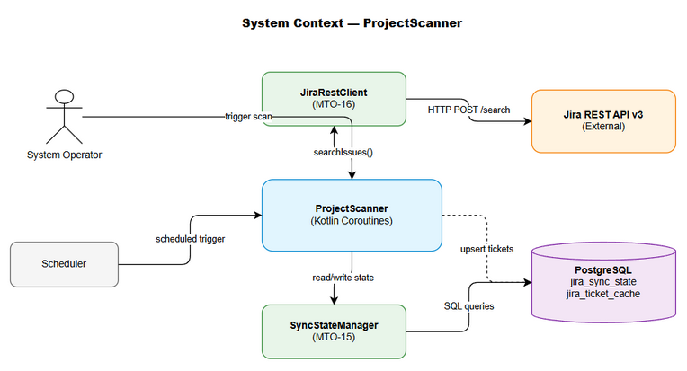
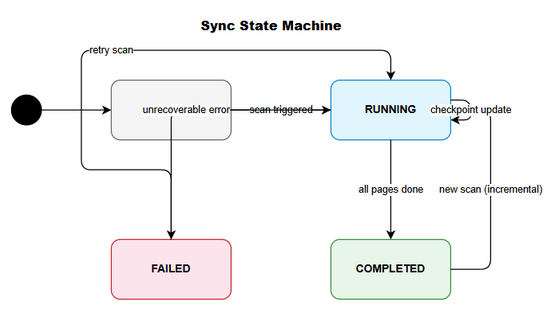
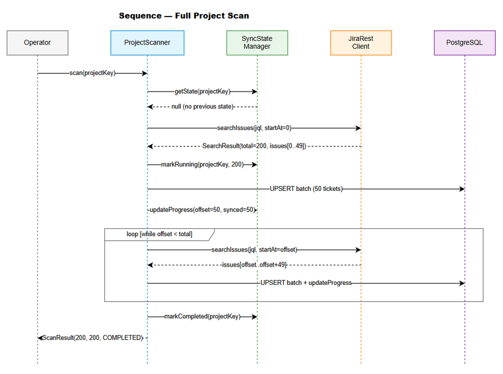
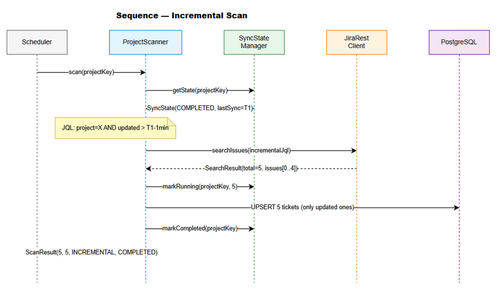

# Functional Specification Document (FSD)

## MCPOrchestration — MTO-17: Project Scanner — Breadth-First Incremental Scan

---

## Document Information

| Field | Value |
|-------|-------|
| Jira Ticket | MTO-17 |
| Title | Project Scanner — Breadth-First Incremental Scan |
| Author | BA Agent + TA Agent |
| Version | 1.0 |
| Date | 2026-05-07 |
| Status | Draft |
| Related BRD | BRD-v1-MTO-17.docx |

---

## Revision History

| Version | Date | Author | Changes |
|---------|------|--------|---------|
| 1.0 | 2026-05-07 | BA Agent | Initiate document |
| 1.0 | 2026-05-07 | TA Agent | Technical enrichment — API contracts, pseudocode, integration specs |

---

## 1. Introduction

### 1.1 Purpose

This FSD specifies the functional behavior of the **ProjectScanner** component — a coroutine-based service that performs breadth-first scanning of Jira projects, fetching lightweight ticket metadata and caching it locally in PostgreSQL. It supports incremental synchronization and resumable operation.

### 1.2 Scope

- Full project scan via JQL pagination
- Incremental scan (only updated tickets)
- Resumable scan (checkpoint-based recovery)
- Concurrent page processing with configurable parallelism
- Progress tracking and error handling

### 1.3 Definitions & Acronyms

| Term | Definition |
|------|------------|
| JQL | Jira Query Language |
| Breadth-First Scan | Scan all tickets at metadata level before deep-fetching |
| Checkpoint | Saved offset position for resumability |
| Upsert | INSERT ON CONFLICT DO UPDATE |
| Semaphore | Concurrency-limiting primitive |

### 1.4 References

| Document | Location |
|----------|----------|
| BRD | BRD-v1-MTO-17.docx |
| MTO-15 (DB Schema) | documents/MTO-15/BRD.md |
| MTO-16 (Jira Client) | documents/MTO-16/BRD.md |

---

## 2. System Overview

### 2.1 System Context Diagram



The ProjectScanner interacts with:
- **Jira REST API** — source of ticket data (via JiraRestClient from MTO-16)
- **PostgreSQL** — stores sync state and cached ticket metadata (schema from MTO-15)
- **Operator/Scheduler** — triggers scan operations
- **SyncStateManager** — manages checkpoint state (from MTO-15)

### 2.2 System Architecture

```
┌─────────────────────────────────────────────────────┐
│                  ProjectScanner                       │
│                                                      │
│  ┌──────────┐  ┌──────────────┐  ┌──────────────┐  │
│  │ ScanJob  │→ │ PageFetcher  │→ │ BatchUpserter│  │
│  │ (entry)  │  │ (concurrent) │  │ (DB write)   │  │
│  └──────────┘  └──────────────┘  └──────────────┘  │
│       ↕               ↕                  ↕          │
│  ┌──────────────────────────────────────────────┐   │
│  │           SyncStateManager (MTO-15)          │   │
│  └──────────────────────────────────────────────┘   │
└─────────────────────────────────────────────────────┘
         ↕                    ↕
   ┌───────────┐      ┌──────────────┐
   │ Jira API  │      │  PostgreSQL  │
   │ (MTO-16)  │      │  (MTO-15)   │
   └───────────┘      └──────────────┘
```

---

## 3. Functional Requirements

### 3.1 Feature: Full Project Scan

**Source:** BRD Story 1

#### 3.1.1 Description

Scan all tickets in a Jira project by executing a JQL query with pagination. Each page of 50 issues is fetched, parsed into lightweight metadata, and upserted into the local cache.

#### 3.1.2 Use Case

**Use Case ID:** UC-01
**Actor:** System Operator / Scheduler
**Preconditions:**
- Valid project key provided
- JiraRestClient is configured and connected
- Database tables exist (jira_sync_state, jira_ticket_cache)

**Postconditions:**
- All ticket metadata cached in jira_ticket_cache
- jira_sync_state marked as COMPLETED with timestamp

**Main Flow:**

| Step | Actor | System | Description |
|------|-------|--------|-------------|
| 1 | Operator | | Triggers scan with project key |
| 2 | | ProjectScanner | Reads sync state for project |
| 3 | | ProjectScanner | Determines scan type (full vs incremental) |
| 4 | | ProjectScanner | Constructs JQL query |
| 5 | | ProjectScanner | Marks state as RUNNING with total_issues from first response |
| 6 | | JiraRestClient | Fetches page (50 issues) from Jira API |
| 7 | | ProjectScanner | Parses response → List<JiraTicketMetadata> |
| 8 | | ProjectScanner | Upserts batch into jira_ticket_cache |
| 9 | | ProjectScanner | Updates checkpoint (offset, synced_count) |
| 10 | | ProjectScanner | Repeats steps 6-9 until no more pages |
| 11 | | ProjectScanner | Marks state as COMPLETED |

**Alternative Flows:**

| ID | Condition | Steps |
|----|-----------|-------|
| AF-01 | Previous sync state exists with last_sync_time | Use incremental JQL (see UC-02) |
| AF-02 | Previous sync interrupted (state = RUNNING) | Resume from last_offset (see UC-03) |

**Exception Flows:**

| ID | Condition | Steps |
|----|-----------|-------|
| EF-01 | Network error during fetch | JiraRestClient retries (max 3). If all fail → save checkpoint, mark FAILED |
| EF-02 | Rate limit (HTTP 429) | Pause all coroutines, wait Retry-After seconds, resume |
| EF-03 | Database write error | Retry once. If fails → save checkpoint, mark FAILED |
| EF-04 | Single ticket parse error | Log warning, skip ticket, continue batch |

#### 3.1.3 Business Rules

| Rule ID | Rule | Source |
|---------|------|--------|
| BR-01 | Page size is fixed at 50 issues per request | Jira API best practice |
| BR-02 | JQL ordering is always `ORDER BY updated DESC` | Ensures most recent changes processed first |
| BR-03 | Upsert only updates if `updated_at > existing updated_at` | Prevents overwriting newer data with stale data |
| BR-04 | Concurrency default is 5, configurable 1-20 | Balance between speed and API limits |
| BR-05 | Checkpoint saved after EACH page (not batch of pages) | Minimizes re-work on failure |
| BR-06 | SupervisorJob ensures one failure doesn't cancel siblings | Fault isolation |

#### 3.1.4 Data Specifications

**Input Data:**

| Field | Type | Required | Validation | Description |
|-------|------|----------|------------|-------------|
| projectKey | String | Yes | Non-empty, matches `[A-Z][A-Z0-9_]+` | Jira project key |
| concurrency | Int | No | 1-20, default 5 | Max concurrent requests |
| forceFullScan | Boolean | No | Default false | Skip incremental, do full scan |

**Output Data (JiraTicketMetadata):**

| Field | Type | Description |
|-------|------|-------------|
| issueKey | String | Unique issue identifier (e.g., "MTO-17") |
| projectKey | String | Project key extracted from issue key |
| summary | String | Ticket title/summary |
| status | String | Current status name |
| issueType | String | Issue type (Story, Task, Bug, Epic) |
| priority | String | Priority level (Highest, High, Medium, Low, Lowest) |
| assignee | String? | Assigned user display name, null if unassigned |
| links | List<TicketLink> | Issue links with type and target key |
| parent | String? | Parent issue key (for subtasks/stories in epics) |
| updatedAt | Instant | Last modification timestamp |

#### 3.1.5 API Contract (Internal Service API)

**Function:** `ProjectScanner.scan(projectKey: String, options: ScanOptions): ScanResult`

**Input Parameters:**

| Parameter | Type | Required | Business Rule | Description |
|-----------|------|----------|---------------|-------------|
| projectKey | String | Yes | BR-01 | Target Jira project |
| options.concurrency | Int | No | BR-04 | Concurrent request limit |
| options.forceFullScan | Boolean | No | — | Override incremental behavior |

**Output Data:**

| Field | Type | Description |
|-------|------|-------------|
| totalIssues | Int | Total tickets found in project |
| syncedIssues | Int | Tickets successfully synced |
| skippedIssues | Int | Tickets skipped due to parse errors |
| duration | Duration | Total scan duration |
| scanType | ScanType | FULL or INCREMENTAL |
| status | ScanStatus | COMPLETED, FAILED, INTERRUPTED |

**Business Error Scenarios:**

| Scenario | Error | Trigger Condition |
|----------|-------|-------------------|
| Invalid project key | InvalidProjectKeyException | Project key doesn't match pattern |
| Project not found in Jira | ProjectNotFoundException | JQL returns 0 results and no previous state |
| All retries exhausted | ScanFailedException | Network errors persist after max retries |
| Scan already running | ScanAlreadyRunningException | State shows RUNNING for same project |

---

### 3.2 Feature: Incremental Scanning

**Source:** BRD Story 2

#### 3.2.1 Description

When a previous successful scan exists, only fetch tickets updated since `last_sync_time`. This dramatically reduces API calls for subsequent syncs.

#### 3.2.2 Use Case

**Use Case ID:** UC-02
**Actor:** Scheduler (automated)
**Preconditions:**
- Previous scan completed successfully (state = COMPLETED)
- `last_sync_time` is set in jira_sync_state

**Postconditions:**
- Only updated tickets are fetched and upserted
- `last_sync_time` updated to current scan completion time

**Main Flow:**

| Step | Actor | System | Description |
|------|-------|--------|-------------|
| 1 | Scheduler | | Triggers periodic scan |
| 2 | | ProjectScanner | Reads sync state, finds last_sync_time |
| 3 | | ProjectScanner | Constructs JQL: `project = "X" AND updated > "last_sync_time" ORDER BY updated DESC` |
| 4 | | ProjectScanner | Fetches pages (likely fewer than full scan) |
| 5 | | ProjectScanner | Upserts updated tickets |
| 6 | | ProjectScanner | Updates last_sync_time to now |

**Alternative Flows:**

| ID | Condition | Steps |
|----|-----------|-------|
| AF-01 | No previous state exists | Fall back to full scan (UC-01) |
| AF-02 | forceFullScan = true | Ignore last_sync_time, do full scan |

#### 3.2.3 Business Rules

| Rule ID | Rule | Source |
|---------|------|--------|
| BR-07 | Incremental JQL uses `updated > "{last_sync_time}"` | Jira API filter |
| BR-08 | Add 1-minute buffer: `updated > "{last_sync_time - 1min}"` | Prevent edge-case misses |
| BR-09 | If 0 results returned, still update last_sync_time | Confirms sync is current |

---

### 3.3 Feature: Resumable Scanning

**Source:** BRD Story 3

#### 3.3.1 Description

If a scan is interrupted (crash, network failure, manual stop), it can resume from the last saved checkpoint without re-processing already-synced pages.

#### 3.3.2 Use Case

**Use Case ID:** UC-03
**Actor:** System (automatic on restart)
**Preconditions:**
- Previous scan state = RUNNING (interrupted)
- `last_offset` > 0 in jira_sync_state

**Postconditions:**
- Scan resumes from last_offset
- No duplicate processing of completed pages

**Main Flow:**

| Step | Actor | System | Description |
|------|-------|--------|-------------|
| 1 | System | | Detects RUNNING state on startup |
| 2 | | ProjectScanner | Reads last_offset from sync state |
| 3 | | ProjectScanner | Constructs same JQL as original scan |
| 4 | | ProjectScanner | Sets startAt = last_offset |
| 5 | | ProjectScanner | Continues pagination from offset |
| 6 | | ProjectScanner | Completes remaining pages |
| 7 | | ProjectScanner | Marks COMPLETED |

**Exception Flows:**

| ID | Condition | Steps |
|----|-----------|-------|
| EF-01 | Offset is stale (tickets changed during downtime) | Upsert handles duplicates gracefully via BR-03 |

#### 3.3.3 Business Rules

| Rule ID | Rule | Source |
|---------|------|--------|
| BR-10 | Resume uses same JQL as original scan | Consistency |
| BR-11 | Upsert is idempotent — re-processing a page is safe | No data corruption |
| BR-12 | If state is RUNNING for > 1 hour, consider it stale and restart | Prevent stuck state |

---

### 3.4 Feature: Concurrent Processing

**Source:** BRD Story 4

#### 3.4.1 Description

Multiple pages can be fetched and processed concurrently using Kotlin Coroutines with Semaphore-based throttling.

#### 3.4.2 Use Case

**Use Case ID:** UC-04
**Actor:** ProjectScanner (internal)
**Preconditions:**
- Scan is in progress
- Multiple pages remain to be fetched

**Main Flow:**

| Step | Actor | System | Description |
|------|-------|--------|-------------|
| 1 | | ProjectScanner | Creates CoroutineScope with SupervisorJob |
| 2 | | ProjectScanner | Creates Semaphore(concurrency) |
| 3 | | ProjectScanner | Launches coroutine per page, each acquires semaphore permit |
| 4 | | JiraRestClient | Fetches page (limited by semaphore) |
| 5 | | ProjectScanner | Processes and upserts page results |
| 6 | | ProjectScanner | Releases semaphore permit |
| 7 | | ProjectScanner | Updates checkpoint after each page completes |

**Alternative Flows:**

| ID | Condition | Steps |
|----|-----------|-------|
| AF-01 | One coroutine fails | SupervisorJob: other coroutines continue. Failed page retried or skipped. |
| AF-02 | Scan cancelled | CoroutineScope cancelled → all children cancelled via structured concurrency |

#### 3.4.3 Business Rules

| Rule ID | Rule | Source |
|---------|------|--------|
| BR-13 | Semaphore permits = configurable concurrency (default 5) | Prevent API overload |
| BR-14 | SupervisorJob: child failure doesn't cancel siblings | Fault isolation |
| BR-15 | Structured concurrency: scope cancel → all children cancel | Clean shutdown |

---

### 3.5 Feature: Progress Tracking

**Source:** BRD Story 5

#### 3.5.1 Description

Track scan progress as percentage of total issues synced, queryable at any time via SyncStateManager.

#### 3.5.2 Business Rules

| Rule ID | Rule | Source |
|---------|------|--------|
| BR-16 | total_issues set from first API response `total` field | Jira search response |
| BR-17 | synced_issues incremented after each batch upsert | Accurate progress |
| BR-18 | Progress = synced_issues / total_issues * 100 | Percentage calculation |

---

## 4. Data Model

### 4.1 Entity Relationship Diagram

The ProjectScanner uses tables defined in MTO-15. Key entities:

### 4.2 Logical Entities

#### Entity: SyncState (jira_sync_state)

| Attribute | Type | Required | Business Rule | Description |
|-----------|------|----------|---------------|-------------|
| project_key | String (PK) | Yes | — | Jira project identifier |
| last_sync_time | Instant? | No | BR-07, BR-08 | Last successful sync completion time |
| last_offset | Int | Yes | BR-10 | Pagination offset for resumability |
| status | Enum | Yes | — | IDLE, RUNNING, COMPLETED, FAILED |
| total_issues | Int | No | BR-16 | Total issues in project (from API) |
| synced_issues | Int | No | BR-17 | Issues synced so far |
| error_message | String? | No | — | Error details if FAILED |
| started_at | Instant? | No | BR-12 | When current/last scan started |

#### Entity: TicketCache (jira_ticket_cache)

| Attribute | Type | Required | Business Rule | Description |
|-----------|------|----------|---------------|-------------|
| issue_key | String (PK) | Yes | — | Unique Jira issue key |
| project_key | String | Yes | — | Project identifier |
| summary | String | Yes | — | Ticket title |
| status | String | Yes | — | Current status name |
| issue_type | String | Yes | — | Story/Task/Bug/Epic |
| priority | String | Yes | — | Priority level |
| assignee | String? | No | — | Assigned user |
| updated_at | Instant | Yes | BR-03 | Last update timestamp |
| content_hash | String? | No | — | Hash for change detection |
| metadata_json | JSONB | No | — | Additional metadata (links, parent) |
| synced_at | Instant | Yes | — | When this record was last synced |

**Relationships:**

| From Entity | To Entity | Cardinality | Description |
|-------------|-----------|-------------|-------------|
| SyncState | TicketCache | 1:N | One sync state per project, many cached tickets |

---

## 5. Integration Specifications

### 5.1 External System: Jira REST API v3

| Attribute | Value |
|-----------|-------|
| Purpose | Source of ticket metadata |
| Direction | Inbound (read-only) |
| Data Format | JSON |
| Frequency | On-demand + scheduled (configurable interval) |
| Authentication | Basic Auth (email + API token) |

**Data Exchange:**

| Our Data | External Data | Direction | Business Rule |
|----------|--------------|-----------|---------------|
| JiraTicketMetadata | Jira Issue (search result) | Receive | Map fields per §3.1.4 |
| JQL query string | Search endpoint input | Send | Constructed per BR-01, BR-07 |
| startAt, maxResults | Pagination params | Send | 50 per page, offset from checkpoint |

**Jira Search Response Mapping:**

| Jira Field Path | Our Field | Transformation |
|-----------------|-----------|----------------|
| `key` | issueKey | Direct |
| `fields.summary` | summary | Direct |
| `fields.status.name` | status | Direct |
| `fields.issuetype.name` | issueType | Direct |
| `fields.priority.name` | priority | Direct |
| `fields.assignee.displayName` | assignee | Null if unassigned |
| `fields.issuelinks[]` | links | Map to TicketLink(type, targetKey) |
| `fields.parent.key` | parent | Null if no parent |
| `fields.updated` | updatedAt | Parse ISO-8601 to Instant |

### 5.2 Internal System: PostgreSQL (via SyncStateManager)

| Attribute | Value |
|-----------|-------|
| Purpose | Persist sync state and cached ticket data |
| Direction | Bidirectional |
| Data Format | SQL (Exposed ORM) |
| Frequency | Real-time (per page processed) |

---

## 6. Processing Logic

### 6.1 Scan Orchestration

**Trigger:** Manual invocation or scheduled timer
**Input:** projectKey, ScanOptions
**Output:** ScanResult

**Processing Steps (Pseudocode):**

```kotlin
suspend fun scan(projectKey: String, options: ScanOptions): ScanResult {
    // 1. Check for existing running scan
    val state = syncStateManager.getState(projectKey)
    if (state?.status == RUNNING && !isStale(state)) {
        throw ScanAlreadyRunningException(projectKey)
    }
    
    // 2. Determine scan type and starting offset
    val (jql, startOffset) = when {
        state?.status == RUNNING -> // Resume
            Pair(buildJql(projectKey, state.lastSyncTime), state.lastOffset)
        options.forceFullScan || state?.lastSyncTime == null -> // Full scan
            Pair(buildFullJql(projectKey), 0)
        else -> // Incremental
            Pair(buildIncrementalJql(projectKey, state.lastSyncTime), 0)
    }
    
    // 3. First fetch to get total count
    val firstPage = jiraClient.searchIssues(jql, startAt = startOffset, maxResults = 50)
    val totalIssues = firstPage.total
    syncStateManager.markRunning(projectKey, totalIssues)
    
    // 4. Process pages concurrently
    val semaphore = Semaphore(options.concurrency)
    val scope = CoroutineScope(SupervisorJob() + Dispatchers.IO)
    var syncedCount = state?.syncedIssues ?: 0
    var currentOffset = startOffset
    
    // Process first page
    val firstBatch = parseMetadata(firstPage.issues)
    upsertBatch(firstBatch)
    syncedCount += firstBatch.size
    currentOffset += 50
    syncStateManager.updateProgress(projectKey, currentOffset, syncedCount)
    
    // 5. Process remaining pages
    while (currentOffset < totalIssues) {
        semaphore.acquire()
        scope.launch {
            try {
                val page = jiraClient.searchIssues(jql, startAt = currentOffset, maxResults = 50)
                val batch = parseMetadata(page.issues)
                upsertBatch(batch)
                syncedCount += batch.size
                syncStateManager.updateProgress(projectKey, currentOffset + 50, syncedCount)
            } finally {
                semaphore.release()
            }
        }
        currentOffset += 50
    }
    
    // 6. Wait for all coroutines to complete
    scope.coroutineContext.job.children.forEach { it.join() }
    
    // 7. Mark completed
    syncStateManager.markCompleted(projectKey)
    
    return ScanResult(totalIssues, syncedCount, scanType, COMPLETED, elapsed)
}
```

### 6.2 JQL Construction

```kotlin
fun buildFullJql(projectKey: String): String =
    """project = "$projectKey" ORDER BY updated DESC"""

fun buildIncrementalJql(projectKey: String, lastSyncTime: Instant): String {
    val buffered = lastSyncTime.minus(1.minutes) // BR-08: 1-min buffer
    val formatted = buffered.format(jiraDateFormat) // "yyyy-MM-dd HH:mm"
    return """project = "$projectKey" AND updated > "$formatted" ORDER BY updated DESC"""
}
```

### 6.3 Upsert Logic

```kotlin
suspend fun upsertBatch(batch: List<JiraTicketMetadata>) {
    // INSERT ON CONFLICT (issue_key) DO UPDATE
    // Only update if updated_at > existing updated_at (BR-03)
    database.transaction {
        batch.forEach { ticket ->
            JiraTicketCacheTable.upsert(
                conflictColumn = JiraTicketCacheTable.issueKey,
                updateWhere = { JiraTicketCacheTable.updatedAt less ticket.updatedAt }
            ) {
                it[issueKey] = ticket.issueKey
                it[projectKey] = ticket.projectKey
                it[summary] = ticket.summary
                it[status] = ticket.status
                it[issueType] = ticket.issueType
                it[priority] = ticket.priority
                it[assignee] = ticket.assignee
                it[updatedAt] = ticket.updatedAt
                it[metadataJson] = Json.encodeToString(ticket.metadata)
                it[syncedAt] = Clock.System.now()
            }
        }
    }
}
```

### 6.4 Error Handling Flow

```kotlin
// Rate limit handling
suspend fun handleRateLimit(retryAfter: Duration) {
    logger.warn("Rate limited. Pausing for $retryAfter")
    delay(retryAfter)
    // Resume automatically after delay
}

// Checkpoint on failure
suspend fun handleScanFailure(projectKey: String, offset: Int, error: Throwable) {
    syncStateManager.updateProgress(projectKey, offset, syncedCount)
    syncStateManager.markFailed(projectKey, error.message ?: "Unknown error")
    throw ScanFailedException(projectKey, error)
}
```

---

## 7. Security Requirements

### 7.1 Authentication & Authorization

| Role | Permissions | Features |
|------|-------------|----------|
| System (internal) | Execute scan | ProjectScanner.scan() |
| Operator | Trigger scan, view progress | Scan API, progress query |

### 7.2 Data Sensitivity Classification

| Data Type | Classification | Business Requirement |
|-----------|---------------|---------------------|
| Jira API Token | Restricted | Stored in env var, never logged |
| Ticket metadata | Internal | Cached locally, no PII beyond assignee name |
| Sync state | Internal | Operational data |

---

## 8. Non-Functional Requirements

| Category | Business Requirement | Acceptance Criteria |
|----------|---------------------|---------------------|
| Performance | Scan throughput ≥ 200 tickets/min | With concurrency=5, 50/page, measured end-to-end |
| Performance | Page fetch latency < 5s | Under normal network conditions |
| Reliability | Zero data loss on interruption | Checkpoint after each page, verified by resume test |
| Scalability | Handle projects up to 10,000 tickets | Pagination + streaming, no full in-memory load |
| Resilience | Auto-retry transient failures | Max 3 retries with exponential backoff |
| Observability | Progress queryable at any time | Via SyncStateManager.getState() |

---

## 9. Error Handling

### 9.1 Error Scenarios

| Scenario | Severity | System Behavior | Recovery |
|----------|----------|-----------------|----------|
| Network timeout | Warning | Retry via JiraRestClient (max 3) | Auto-retry, then checkpoint + FAILED |
| HTTP 429 Rate Limit | Warning | Pause all coroutines, wait Retry-After | Auto-resume after delay |
| HTTP 5xx Server Error | Warning | Retry via JiraRestClient | Auto-retry, then checkpoint + FAILED |
| JSON parse error (single ticket) | Info | Log warning, skip ticket | Continue batch processing |
| Database write error | Critical | Retry once | Checkpoint + FAILED if retry fails |
| Scan already running | Warning | Reject new scan request | Wait for current scan or force restart |
| Invalid project key | Error | Reject immediately | Return validation error |

---

## 10. State Diagram



**Sync State Transitions:**

| From | To | Trigger |
|------|-----|---------|
| IDLE | RUNNING | Scan triggered |
| RUNNING | COMPLETED | All pages processed |
| RUNNING | FAILED | Unrecoverable error |
| RUNNING | RUNNING | Checkpoint update (offset changes) |
| FAILED | RUNNING | Scan retried |
| COMPLETED | RUNNING | New scan triggered (incremental) |

---

## 11. Sequence Diagrams

### 11.1 Full Scan Sequence



### 11.2 Incremental Scan Sequence



---

## 12. Appendix

### Diagram Index

| # | Diagram | Image | Source (editable) |
|---|---------|-------|-------------------|
| 1 | System Context | [system-context.png](diagrams/system-context.png) | [system-context.drawio](diagrams/system-context.drawio) |
| 2 | State Diagram | [state-sync.png](diagrams/state-sync.png) | [state-sync.drawio](diagrams/state-sync.drawio) |
| 3 | Sequence - Full Scan | [sequence-full-scan.png](diagrams/sequence-full-scan.png) | [sequence-full-scan.drawio](diagrams/sequence-full-scan.drawio) |
| 4 | Sequence - Incremental Scan | [sequence-incremental-scan.png](diagrams/sequence-incremental-scan.png) | [sequence-incremental-scan.drawio](diagrams/sequence-incremental-scan.drawio) |

### Change Log from BRD

- Added detailed pseudocode for scan orchestration, JQL construction, and upsert logic
- Added state diagram for sync state machine
- Added sequence diagrams for full and incremental scan flows
- Specified Jira response field mapping
- Added ScanAlreadyRunningException for concurrent scan prevention
