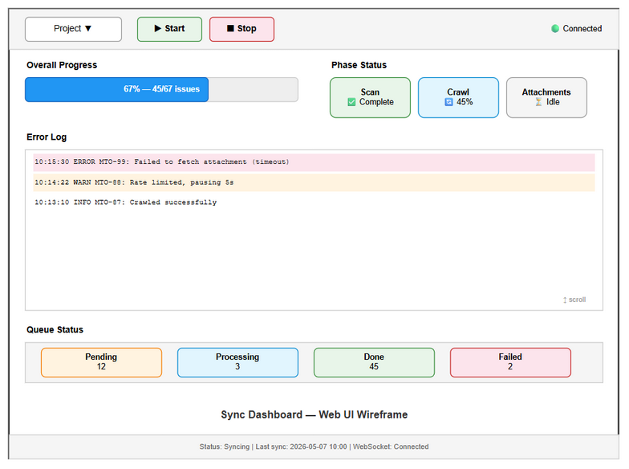

# User Guide (UG)

## Jira Project Sync Service — MTO-21: Web Dashboard — Sync Status & Monitoring

---

## Document Information

| Field | Value |
|-------|-------|
| Jira Ticket | MTO-21 |
| Title | Web Dashboard — Sync Status & Monitoring |
| Author | DEV Agent |
| Reviewer | BA Agent |
| Version | 1.0 |
| Date | 2025-07-15 |
| Status | Final |
| Related BRD | BRD-v1-MTO-21.docx |
| Related FSD | FSD-v1-MTO-21.docx |
| Related TDD | TDD-v1-MTO-21.docx |

---

## Revision History

| Version | Date | Author | Changes |
|---------|------|--------|---------|
| 1.0 | 2025-07-15 | DEV Agent | Initial document |
| 1.1 | 2025-07-16 | UI Agent + DEV Agent | Replaced ASCII art with draw.io wireframe (ug-dashboard-layout) |

---

## 1. Introduction

### 1.1 Purpose

This guide explains how to access and use the **Sync Dashboard** — a web-based monitoring interface for the Jira Project Sync Service. It provides real-time visibility into sync operations, queue status, and error logs.

### 1.2 Audience

| Audience | What They Need |
|----------|---------------|
| End User / Operator | How to access the dashboard, start/stop syncs, and monitor progress |
| Developer | REST API endpoints for programmatic access |
| DevOps | WebSocket integration and monitoring setup |

### 1.3 Prerequisites

| Prerequisite | Version | Required |
|-------------|---------|----------|
| Modern browser | Chrome/Firefox/Safari/Edge (latest 2 versions) | Yes |
| MCP Orchestrator running | — | Yes |
| Network access to server | Port 8080 (default) | Yes |

---

## 2. Getting Started

### 2.1 Accessing the Dashboard

Open your browser and navigate to:

```
http://localhost:8080/sync
```

The dashboard loads as a single-page HTML application with real-time updates via WebSocket.

### 2.2 Dashboard Layout



The dashboard is organized into the following areas:

| Area | Position | Description |
|------|----------|-------------|
| Toolbar | Top | Project selector, Start/Stop buttons, connection indicator |
| Progress Bar | Upper-left | Overall sync progress with percentage and issue count |
| Phase Cards | Upper-right | Individual phase status (Scan, Crawl, Attachments) |
| Error Log | Center | Scrollable list of recent errors/warnings (max 100 entries) |
| Queue Status | Lower | Attachment queue counts (Pending, Processing, Done, Failed) |
| Status Bar | Bottom | Connection status, last sync time, WebSocket state |

### 2.3 Responsive Design

| Viewport | Layout |
|----------|--------|
| Desktop (> 1024px) | Full 2-column layout |
| Tablet (768–1024px) | Compact 2-column |
| Mobile (< 768px) | Single column, stacked |

---

## 3. User Interface Guide

### 3.1 Project Selector

The dropdown at the top shows all configured Jira projects. Select a project to view its sync status.

### 3.2 Start/Stop Sync

| Button | Action | When Available |
|--------|--------|----------------|
| ▶ Start | Triggers incremental sync for selected project | When status is idle/completed/error |
| ⏹ Stop | Gracefully stops running sync | When status is syncing |

### 3.3 Progress Bar

- Shows overall sync progress as percentage
- Animated during active sync
- Color: blue (syncing), green (completed), red (error)
- Displays `{synced}/{total} issues`

### 3.4 Phase Status Cards

Three cards showing individual phase progress:

| Phase | Description | Status Icons |
|-------|-------------|-------------|
| Scan | Breadth-first metadata fetch | ⏳ Idle, 🔄 Syncing, ✅ Complete, ❌ Error |
| Crawl | Deep content fetch + KB ingestion | Same icons |
| Attachments | File download + text extraction | Same icons |

### 3.5 Error Log

- Scrollable list of recent errors and warnings
- Maximum 100 entries displayed
- Each entry shows: timestamp, severity, message
- Auto-scrolls to newest entry
- Errors highlighted in red, warnings in yellow

### 3.6 Queue Status

Shows attachment queue counts:
- **Pending**: Items waiting to be processed
- **Processing**: Items currently being downloaded/extracted
- **Done**: Successfully processed items
- **Failed**: Items that failed after max retries

---

## 4. Real-Time Updates (WebSocket)

### 4.1 How It Works

The dashboard connects to `ws://localhost:8080/sync/live` for real-time event streaming. No manual refresh needed — all data updates automatically.

### 4.2 Event Types

| Event | What Updates | Frequency |
|-------|-------------|-----------|
| `progress` | Progress bar, synced count | Every 5 seconds during sync |
| `error` | Error log | Immediately on error |
| `completed` | Status cards, progress bar | On sync completion |
| `attachment_processed` | Queue status counts | Per attachment |
| `heartbeat` | Connection indicator | Every 30 seconds |

### 4.3 Connection Status

The dashboard shows a connection indicator:
- 🟢 Connected (receiving events)
- 🔴 Disconnected (auto-reconnects in 5s)

---

## 5. REST API Reference

### 5.1 GET /sync/status — All Projects

```bash
curl http://localhost:8080/sync/status
```

Response:
```json
[
  {
    "projectKey": "MTO",
    "status": "syncing",
    "progress": 67.5,
    "syncedIssues": 45,
    "totalIssues": 67,
    "lastSyncTime": "2026-05-07T10:00:00Z",
    "errors": 3
  }
]
```

### 5.2 GET /sync/status/{projectKey} — Detailed Status

```bash
curl http://localhost:8080/sync/status/MTO
```

Response:
```json
{
  "projectKey": "MTO",
  "status": "syncing",
  "progress": 67.5,
  "phases": {
    "scan": { "status": "completed", "progress": 100, "itemsScanned": 67, "totalItems": 67 },
    "crawl": { "status": "syncing", "progress": 45.0, "issuesCrawled": 30, "totalIssues": 67 },
    "attachments": { "status": "idle", "progress": 0, "processed": 0, "total": 15, "failed": 0 }
  },
  "recentErrors": [
    { "message": "Failed to fetch MTO-99", "timestamp": "2026-05-07T10:15:30Z", "issueKey": "MTO-99" }
  ]
}
```

### 5.3 POST /sync/start — Start Sync

```bash
curl -X POST http://localhost:8080/sync/start \
  -H "Content-Type: application/json" \
  -d '{"projectKey": "MTO", "fullSync": false}'
```

| Status | Response | Condition |
|--------|----------|-----------|
| 200 | `{ "status": "started", "message": "Sync started for MTO" }` | Success |
| 400 | `{ "error": "projectKey is required" }` | Missing field |
| 404 | `{ "error": "Project not found: XYZ" }` | Unknown project |
| 409 | `{ "error": "Sync already running for MTO" }` | Already running |

### 5.4 POST /sync/stop — Stop Sync

```bash
curl -X POST http://localhost:8080/sync/stop \
  -H "Content-Type: application/json" \
  -d '{"projectKey": "MTO"}'
```

| Status | Response | Condition |
|--------|----------|-----------|
| 200 | `{ "status": "stopped" }` | Success |
| 409 | `{ "error": "No sync running for MTO" }` | Not running |

---

## 6. Troubleshooting

### 6.1 Common Issues

| # | Symptom | Cause | Solution |
|---|---------|-------|----------|
| 1 | Dashboard shows blank page | JavaScript error | Open browser console (F12), check for errors |
| 2 | "Disconnected" indicator | WebSocket connection lost | Check server is running, refresh page |
| 3 | Progress not updating | WebSocket not connected | Check connection indicator, refresh |
| 4 | Start button disabled | Sync already running | Wait for current sync or click Stop |
| 5 | 404 on /sync | Static files not served | Verify `sync-dashboard.html` in resources/static/ |
| 6 | CORS error | Accessing from different origin | Access via same host:port as server |

### 6.2 Browser Requirements

| Browser | Minimum Version | WebSocket Support |
|---------|----------------|-------------------|
| Chrome | 90+ | ✅ |
| Firefox | 88+ | ✅ |
| Safari | 14+ | ✅ |
| Edge | 90+ | ✅ |

### 6.3 FAQ

**Q: Can multiple users view the dashboard simultaneously?**
A: Yes. Up to 50 concurrent WebSocket connections are supported.

**Q: Does the dashboard require authentication?**
A: No. It's designed as an internal monitoring tool. Restrict access via network/firewall rules.

**Q: Can I embed the dashboard in another application?**
A: Yes. The dashboard is a standalone HTML page. You can iframe it or use the REST API directly.

**Q: How do I access the dashboard remotely?**
A: Replace `localhost` with the server's IP/hostname: `http://server-ip:8080/sync`

**Q: What happens if I close the browser tab?**
A: The WebSocket disconnects. Sync operations continue running on the server. Reopen the tab to reconnect.

---

## 7. Appendix

### 7.1 Glossary

| Term | Definition |
|------|------------|
| WebSocket | Bidirectional communication protocol for real-time updates |
| Heartbeat | Periodic ping to keep WebSocket connection alive |
| Phase | Individual stage of sync: scan, crawl, attachments |

### 7.2 Diagram Index

| # | Diagram | Image | Source (editable) |
|---|---------|-------|-------------------|
| 1 | Dashboard Layout | [ug-dashboard-layout.png](diagrams/ug-dashboard-layout.png) | [ug-dashboard-layout.drawio](diagrams/ug-dashboard-layout.drawio) |

### 7.3 Related Documents

| Document | Location |
|----------|----------|
| BRD | BRD-v1-MTO-21.docx |
| FSD | FSD-v1-MTO-21.docx |
| TDD | TDD-v1-MTO-21.docx |
| DPG | DPG-v1-MTO-21.docx |
