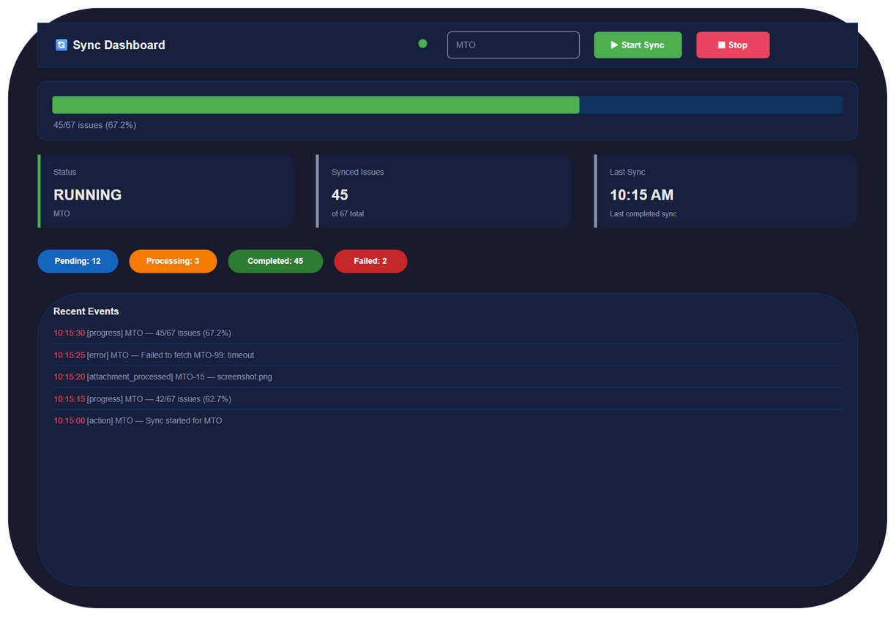

# UI Specification Document

## MTO-21: Web Dashboard — Sync Status & Monitoring

---

## Document Information

| Field | Value |
|-------|-------|
| Ticket | MTO-21 |
| Feature | Sync Dashboard — Real-time Sync Status & Control |
| Tech Stack | HTML + Vanilla JS + CSS (single-page static file served by Ktor HttpServer) |
| Theme | Dark (custom — navy/crimson palette) |
| Endpoint | `/sync/dashboard` (orchestrator-server, port 9180) |
| Status | **Implemented** |
| Source File | `orchestrator-server/src/main/resources/static/sync-dashboard.html` |

---

## Design System

```css
:root {
    --bg: #1a1a2e;
    --surface: #16213e;
    --card: #0f3460;
    --accent: #e94560;
    --success: #4caf50;
    --warning: #ff9800;
    --text: #eaeaea;
    --muted: #8892b0;
    --radius: 8px;
}
```

### Color Palette

| Token | Value | Usage |
|-------|-------|-------|
| --bg | #1a1a2e | Page background |
| --surface | #16213e | Cards, panels, header |
| --card | #0f3460 | Progress bar background, dividers |
| --accent | #e94560 | Stop button, error indicators, timestamps |
| --success | #4caf50 | Start button, active status, progress fill |
| --warning | #ff9800 | Processing badge |
| --text | #eaeaea | Primary text |
| --muted | #8892b0 | Secondary text, labels, borders |

### Typography

| Element | Font | Size | Weight |
|---------|------|------|--------|
| H1 (title) | System font stack | 1.5rem | 700 |
| Card value | System font stack | 1.5rem | 700 |
| Card label | System font stack | 0.85rem | 400 |
| Body/log | System font stack | 0.85rem | 400 |
| Badge | System font stack | 0.8rem | 600 |

### Component Patterns

| Component | Style |
|-----------|-------|
| Button (start) | `background: var(--success); color: #fff; border-radius: var(--radius); padding: 8px 16px; font-weight: 600; border: none;` |
| Button (stop) | `background: var(--accent); color: #fff; border-radius: var(--radius); padding: 8px 16px; font-weight: 600; border: none;` |
| Input | `padding: 8px 16px; border-radius: var(--radius); border: 1px solid var(--muted); background: var(--surface); color: var(--text); font-size: 0.9rem;` |
| Card | `background: var(--surface); border-radius: var(--radius); padding: 20px; border-left: 4px solid var(--muted);` |
| Card (active) | Same + `border-left-color: var(--success);` |
| Card (error) | Same + `border-left-color: var(--accent);` |
| Badge | `padding: 6px 14px; border-radius: 20px; font-size: 0.8rem; font-weight: 600; color: #fff;` |
| Progress bar | `height: 24px; background: var(--card); border-radius: 12px; overflow: hidden;` |
| Progress fill | `background: linear-gradient(90deg, var(--success), #81c784); border-radius: 12px; transition: width 0.5s ease;` |

---

## Layout Structure

- **No sidebar** — single-page centered layout
- **Max-width:** 1200px, centered with `margin: 0 auto`
- **Padding:** 24px
- **Sections stacked vertically:** Header → Progress → Status Cards → Queue Badges → Error Log

---

## Screen: Sync Dashboard

### Purpose
Single-page real-time monitoring dashboard for Jira-to-KB sync operations. Displays sync progress, status, queue metrics, and event log with WebSocket live updates.

### URL
`http://localhost:9180/sync/dashboard`

### Wireframe

**Draw.io source:** [diagrams/ui-sync-dashboard.drawio](diagrams/ui-sync-dashboard.drawio)



### UI Elements

| ID | Element | Type | Behavior |
|----|---------|------|----------|
| SD-01 | Dashboard title | H1 text | Static: "🔄 Sync Dashboard" |
| SD-02 | WebSocket indicator | Dot (10px circle) | Green = connected, Red = disconnected |
| SD-03 | Project input | Text input | Enter project key (e.g., "MTO"), used for API calls |
| SD-04 | Start Sync button | Primary button (green) | POST /sync/start with projectKey |
| SD-05 | Stop button | Danger button (red) | POST /sync/stop with projectKey |
| SD-06 | Progress bar | Animated bar | Width = percentage, gradient fill, smooth transition |
| SD-07 | Progress text | Label | Shows "X/Y issues (Z%)" |
| SD-08 | Status card | Card with left border | Shows current sync status (IDLE/RUNNING/COMPLETED/FAILED) |
| SD-09 | Synced Issues card | Card with left border | Shows synced count + "of N total" |
| SD-10 | Last Sync card | Card with left border | Shows timestamp of last completed sync |
| SD-11 | Pending badge | Pill badge (blue #1565c0) | Attachment queue: pending count |
| SD-12 | Processing badge | Pill badge (orange #f57c00) | Attachment queue: processing count |
| SD-13 | Completed badge | Pill badge (green #2e7d32) | Attachment queue: completed count |
| SD-14 | Failed badge | Pill badge (red #c62828) | Attachment queue: failed count |
| SD-15 | Error log section | Scrollable list (max-height 300px) | Max 50 entries, newest first |
| SD-16 | Log entry | List item | Format: `[timestamp] [type] project — message` |

### Data Source

| Field | API | Format |
|-------|-----|--------|
| Status | GET /sync/status/{projectKey} → status | Enum badge |
| Progress | GET /sync/status/{projectKey} → percentage | Percentage bar |
| Synced count | GET /sync/status/{projectKey} → syncedIssues | Integer |
| Total count | GET /sync/status/{projectKey} → totalIssues | Integer |
| Last sync | GET /sync/status/{projectKey} → lastSyncAt | Relative time |
| Real-time events | EventSource /sync/live | JSON stream |

### User Interactions

| # | Action | Trigger | Result | API Call |
|---|--------|---------|--------|----------|
| 1 | Start sync | Click "▶ Start Sync" | Sends start request, log entry added | POST /sync/start |
| 2 | Stop sync | Click "⏹ Stop" | Sends stop request, log entry added | POST /sync/stop |
| 3 | Change project | Edit project input | Triggers pollStatus() on blur/enter | GET /sync/status/{key} |
| 4 | Receive progress | WebSocket event | Progress bar + cards update | — (push) |
| 5 | Receive error | WebSocket event | Log entry added at top (red timestamp) | — (push) |
| 6 | Receive completed | WebSocket event | Status → COMPLETED, progress → 100% | — (push) |

### WebSocket Events Handled

| Event Type | UI Update |
|-----------|-----------|
| progress | Update progress bar width, progress text, synced count |
| error | Add error entry to log, set status card to "error" state |
| completed | Set progress to 100%, update last sync time, status → COMPLETED |
| attachment_processed | Update queue badge counters |
| heartbeat | Keep connection alive (no visual change) |

### States

| State | Visual |
|-------|--------|
| Idle | Progress bar empty, status = "IDLE" (gray border), no animation |
| Syncing | Progress bar filling (green gradient), status = "RUNNING" (green border) |
| Completed | Progress bar 100%, status = "COMPLETED", last sync time updated |
| Error/Failed | Status card red border, status = "FAILED" |
| WS Connected | Green dot indicator |
| WS Disconnected | Red dot indicator, auto-reconnect after 3s |

---

## Component Hierarchy

```
SyncDashboard (IIFE)
├── Header (.header)
│   ├── Title (h1: "🔄 Sync Dashboard")
│   ├── WebSocket Indicator (.ws-status)
│   ├── ProjectInput (#project-input)
│   ├── StartButton (#btn-start)
│   └── StopButton (#btn-stop)
├── ProgressSection (.progress-section)
│   ├── ProgressBar (.progress-bar > .progress-fill)
│   └── ProgressText (#progress-text)
├── StatusCards (.status-cards)
│   ├── StatusCard (#card-status)
│   ├── SyncedCard (#card-synced)
│   └── LastSyncCard (#card-last-sync)
├── QueueStatus (.queue-status)
│   ├── PendingBadge (#badge-pending)
│   ├── ProcessingBadge (#badge-processing)
│   ├── CompletedBadge (#badge-completed)
│   └── FailedBadge (#badge-failed)
└── ErrorLog (.error-log)
    ├── Title (h3: "Recent Events")
    └── EventList (#error-list)
```

---

## User Interaction Flows

### Flow 1: Page Load

```
[Browser → /sync/dashboard] → init()
    → connectWebSocket() (EventSource /sync/live)
    → bindButtons() (Start/Stop click handlers)
    → pollStatus() (GET /sync/status/{projectKey})
    → setInterval(pollStatus, 10000) (fallback polling)
```

### Flow 2: Start Sync

```
[Click "▶ Start Sync"]
    → POST /sync/start { projectKey: "MTO", fullSync: false }
    → Success: log entry "Sync started"
    → WebSocket streams progress events
    → Progress bar animates, cards update
```

### Flow 3: WebSocket Reconnect

```
[Connection drops]
    → Red dot indicator
    → ws.close()
    → setTimeout(connectWebSocket, 3000)
    → Reconnect → Green dot
```

### Flow 4: Stop Sync

```
[Click "⏹ Stop"]
    → POST /sync/stop { projectKey: "MTO" }
    → Success: log entry "Sync stopped"
    → WebSocket sends completed event with status "stopped"
```

---

## Responsive Behavior

| Breakpoint | Layout Change |
|-----------|--------------|
| > 1024px | Full layout: 3-column status cards, inline header controls |
| 768-1024px | 2-column cards, header wraps |
| < 768px | Single column, stacked cards, stacked header controls |

---

## Accessibility (WCAG 2.1 AA)

| Requirement | Implementation |
|-------------|----------------|
| Color contrast | --text #eaeaea on --surface #16213e = 9.2:1 ✓ |
| Keyboard navigation | All buttons/inputs focusable via Tab |
| Screen reader | Buttons have descriptive text |
| Touch targets | Buttons min 36px height |

---

## Implementation Notes for DEV

### File Location
```
orchestrator-server/src/main/resources/static/sync-dashboard.html
```

### Key Patterns
- Single HTML file (inline CSS + JS)
- EventSource (SSE) for real-time updates at `/sync/live`
- Polling fallback every 10s via `GET /sync/status/{projectKey}`
- Auto-reconnect on connection drop (3s delay)
- Max 50 log entries displayed

### Theme Note
Uses **different palette** than MTO-38/39 (navy/crimson vs GitHub-dark). Intentional visual differentiation for the sync monitoring context.

---

## Diagrams Checklist

| # | Diagram | File | Status |
|---|---------|------|--------|
| 1 | Sync Dashboard wireframe | diagrams/ui-sync-dashboard.drawio | ✅ |
| 2 | Sync Dashboard PNG | diagrams/ui-sync-dashboard.png | ✅ |
