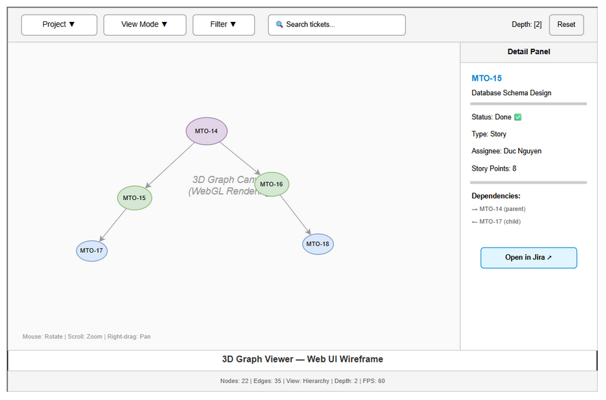

# User Guide (UG)

## Jira Project Sync Service — MTO-22: 3D Graph Visualization — Force-Directed Graph Views

---

## Document Information

| Field | Value |
|-------|-------|
| Jira Ticket | MTO-22 |
| Title | 3D Graph Visualization — Force-Directed Graph Views |
| Author | DEV Agent |
| Reviewer | BA Agent |
| Version | 1.0 |
| Date | 2025-07-15 |
| Status | Final |
| Related BRD | BRD-v1-MTO-22.docx |
| Related FSD | FSD-v1-MTO-22.docx |
| Related TDD | TDD-v1-MTO-22.docx |

---

## Revision History

| Version | Date | Author | Changes |
|---------|------|--------|---------|
| 1.0 | 2025-07-15 | DEV Agent | Initial document |
| 1.1 | 2025-07-16 | UI Agent + DEV Agent | Replaced ASCII art with draw.io wireframe (ug-graph-viewer-layout) |

---

## 1. Introduction

### 1.1 Purpose

This guide explains how to use the **3D Graph Visualization** — an interactive WebGL-based viewer that renders Jira ticket relationships as a force-directed 3D graph. It supports 7 view modes, filtering, search, and click-to-detail interactions.

### 1.2 Audience

| Audience | What They Need |
|----------|---------------|
| End User | How to navigate the 3D graph, use view modes, filter, and search |
| Project Manager | How to analyze dependencies, identify blockers, and understand project structure |
| Developer | REST API for graph data, customization options |

### 1.3 Prerequisites

| Prerequisite | Version | Required |
|-------------|---------|----------|
| Modern browser with WebGL | Chrome/Firefox/Safari/Edge | Yes |
| MCP Orchestrator running | — | Yes |
| Project synced (MTO-17 + MTO-18) | — | Yes (for graph data) |
| Minimum viewport | 768px width | Yes |

---

## 2. Getting Started

### 2.1 Accessing the Graph Viewer

Open your browser and navigate to:

```
http://localhost:8080/sync/graph-viewer
```

Or access directly with a project:

```
http://localhost:8080/sync/graph-viewer?project=MTO
```

### 2.2 First-Time Setup

1. Ensure at least one project has been synced (run `jira_project_sync` first)
2. Open the graph viewer URL
3. Select a project from the dropdown
4. The graph loads and renders automatically

### 2.3 System Requirements

| Component | Minimum | Recommended |
|-----------|---------|-------------|
| Browser | WebGL 2.0 support | Chrome 90+ |
| GPU | Integrated graphics | Dedicated GPU |
| Memory | 4 GB RAM | 8 GB RAM |
| Viewport | 768px width | 1920px+ |
| Network | Stable connection | Low-latency |

---

## 3. User Interface Guide

### 3.1 Screen Layout



The graph viewer is organized into the following areas:

| Area | Position | Description |
|------|----------|-------------|
| Toolbar | Top | Project selector, View Mode, Filter, Search box, Depth control, Reset |
| 3D Canvas | Center-left | WebGL rendering area for the force-directed graph |
| Detail Panel | Right | Appears on node click — shows ticket info, dependencies, Jira link |
| Status Bar | Bottom | Node/edge counts, current view mode, depth, FPS |

**Navigation controls** are displayed at the bottom of the canvas area (Mouse: Rotate, Scroll: Zoom, Right-drag: Pan).

### 3.2 Navigation Controls

| Action | Mouse | Trackpad | Keyboard |
|--------|-------|----------|----------|
| Rotate | Left-click + drag | Two-finger drag | — |
| Zoom | Scroll wheel | Pinch | +/- keys |
| Pan | Right-click + drag | — | Arrow keys |
| Reset view | Double-click background | — | R key |

### 3.3 Node Interactions

| Action | Trigger | Result |
|--------|---------|--------|
| Hover | Mouse over node | Highlights node + 1-hop neighbors, dims others |
| Click | Left-click node | Opens detail panel with ticket info |
| Double-click | Double-click node | Centers camera on node |
| Dismiss panel | Click background or Escape | Closes detail panel |

---

## 4. View Modes

### 4.1 Overview

Select view mode from the toolbar dropdown. Each mode changes node colors, sizes, and grouping:

| # | View Mode | Color By | Best For |
|---|-----------|----------|----------|
| 1 | **Hierarchy** (default) | Issue Type | Understanding project structure |
| 2 | **Functional** | Component/Label | Identifying functional areas |
| 3 | **Business** | Epic parent | Seeing business feature groups |
| 4 | **Complexity** | Dependency depth | Finding complex/risky areas |
| 5 | **Timeline** | Status | Tracking progress |
| 6 | **Dependency** | Critical path | Identifying blockers |
| 7 | **Team** | Assignee | Workload distribution |

### 4.2 Hierarchy View

**Colors:**
| Issue Type | Color |
|-----------|-------|
| Epic | Purple (#9C27B0) |
| Story | Green (#4CAF50) |
| Task | Blue (#2196F3) |
| Bug | Red (#F44336) |

**Node Size:** Epic = large (8), Story = medium (5), Task = small (4), Bug = medium (5)

### 4.3 Timeline View

**Colors:**
| Status | Color |
|--------|-------|
| To Do | Gray (#9E9E9E) |
| In Progress | Blue (#2196F3) |
| Done | Green (#4CAF50) |

### 4.4 Complexity View

**Colors by dependency depth:**
| Depth | Color | Meaning |
|-------|-------|---------|
| 0 (no deps) | Green (#4CAF50) | Independent, low risk |
| 1-2 | Yellow (#FFEB3B) | Some dependencies |
| 3-4 | Orange (#FF9800) | Complex |
| 5+ | Red (#F44336) | Highly complex, high risk |

**Node Size:** Scaled by story points (min 3, max 15)

### 4.5 Dependency View

**Colors:**
| Category | Color | Meaning |
|----------|-------|---------|
| Normal | Gray (#9E9E9E) | No blocking issues |
| Critical path | Red (#F44336) | On critical path |
| Blocked | Orange (#FF9800) | Blocked by another ticket |

### 4.6 Team View

**Colors:** Auto-generated HSL colors per assignee (each person gets a unique hue)

---

## 5. Filtering & Search

### 5.1 Filter Panel

Click the Filter button to open the filter panel:

| Filter | Options | Logic |
|--------|---------|-------|
| Type | Epic, Story, Task, Bug | OR within field |
| Status | To Do, In Progress, Done, etc. | OR within field |
| Assignee | List of team members | OR within field |
| Label | Project labels | OR within field |

**Between different filters:** AND logic (e.g., Type=Story AND Status=In Progress)

**Effect:** Non-matching nodes and their edges are hidden from the graph.

### 5.2 Search

Type in the search box to find tickets:

| Input | Behavior |
|-------|----------|
| Ticket key (e.g., "MTO-15") | Exact match, camera animates to node |
| Partial summary (e.g., "database") | Fuzzy match, highlights matching nodes |
| Multiple matches | Dropdown list for selection |

**Keyboard shortcut:** Ctrl+F or / to focus search box

---

## 6. Subgraph View

### 6.1 Viewing a Ticket's Neighborhood

To focus on a specific ticket and its relationships:

1. Search for the ticket (e.g., "MTO-15")
2. Double-click the node
3. Or navigate directly: `http://localhost:8080/sync/graph-viewer?project=MTO&issue=MTO-15&depth=3`

### 6.2 Depth Control

| Depth | Shows |
|-------|-------|
| 1 | Direct connections only |
| 2 (default) | Connections of connections |
| 3 | Three hops out |
| 4-5 | Wider neighborhood (may be large) |

The center node is displayed larger with a distinct border.

---

## 7. REST API (for Developers)

### 7.1 GET /sync/graph/{projectKey}

Full project graph data:

```bash
curl "http://localhost:8080/sync/graph/MTO?view=hierarchy"
```

Query parameters:
| Param | Default | Values |
|-------|---------|--------|
| view | hierarchy | hierarchy, functional, business, complexity, timeline, dependency, team |

### 7.2 GET /sync/graph/{projectKey}/{issueKey}

Subgraph centered on a specific issue:

```bash
curl "http://localhost:8080/sync/graph/MTO/MTO-15?depth=3&view=dependency"
```

Query parameters:
| Param | Default | Description |
|-------|---------|-------------|
| depth | 2 | BFS hops (1-5) |
| view | hierarchy | View mode |

### 7.3 Response Format

```json
{
  "nodes": [
    {
      "id": "MTO-14",
      "label": "Jira Project Sync Service",
      "type": "Epic",
      "status": "To Do",
      "priority": "High",
      "assignee": "Duc Nguyen",
      "storyPoints": 13,
      "group": "infrastructure",
      "color": "#9C27B0",
      "size": 8
    }
  ],
  "edges": [
    {
      "source": "MTO-14",
      "target": "MTO-15",
      "type": "parent",
      "label": "has child",
      "color": "#999",
      "width": 2
    }
  ],
  "metadata": {
    "projectKey": "MTO",
    "view": "hierarchy",
    "totalNodes": 22,
    "totalEdges": 35,
    "lastSynced": "2026-05-07T10:00:00Z"
  }
}
```

---

## 8. Troubleshooting

### 8.1 Common Issues

| # | Symptom | Cause | Solution |
|---|---------|-------|----------|
| 1 | Black/blank canvas | WebGL not supported | Update browser or enable hardware acceleration |
| 2 | Graph not loading | No sync data | Run `jira_project_sync` first |
| 3 | Very slow rendering | Too many nodes (1000+) | Use subgraph view or filter to reduce nodes |
| 4 | Nodes overlapping | Layout not stabilized | Wait 2-3 seconds for force simulation to settle |
| 5 | Colors not changing | View mode not applied | Re-select view mode from dropdown |
| 6 | Search not finding ticket | Ticket not synced | Verify ticket exists in cache: check sync status |
| 7 | High memory usage | Large graph in memory | Close other tabs, use subgraph view |

### 8.2 Performance Tips

| Scenario | Recommendation |
|----------|---------------|
| Project with 500+ tickets | Use subgraph view (depth 2-3) |
| Slow animation | Reduce browser zoom, close other GPU-heavy tabs |
| Mobile device | Use 2D fallback or filter to < 100 nodes |

### 8.3 FAQ

**Q: Can I export the graph as an image?**
A: Right-click the canvas → "Save image as" captures the current view as PNG.

**Q: Does the graph update in real-time during sync?**
A: No. Refresh the page after sync completes to see updated graph data.

**Q: Can I rearrange nodes manually?**
A: Yes. Click and drag a node to reposition it. The force simulation will adjust around it.

**Q: What's the maximum graph size supported?**
A: Up to 1000 nodes render smoothly. The API truncates at 1000 nodes with a warning. Use filters or subgraph for larger projects.

**Q: Can I share a specific graph view?**
A: Yes. Copy the URL with parameters: `http://localhost:8080/sync/graph-viewer?project=MTO&issue=MTO-15&depth=3&view=dependency`

---

## 9. Appendix

### 9.1 Edge Types & Styling

| Edge Type | Color | Width | Style |
|-----------|-------|-------|-------|
| parent (has child) | Gray (#999) | 2 | Solid |
| blocks | Red (#F44336) | 3 | Solid |
| relates-to | Blue (#2196F3) | 1 | Dashed |
| epic | Purple (#9C27B0) | 2 | Solid |
| subtask | Gray (#999) | 1 | Dotted |

### 9.2 Glossary

| Term | Definition |
|------|------------|
| Force-Directed Graph | Layout algorithm where nodes repel and edges attract |
| WebGL | Browser API for GPU-accelerated 3D rendering |
| BFS | Breadth-First Search — traversal algorithm for subgraph extraction |
| Subgraph | Subset of the full graph centered on a specific node |

### 9.3 Diagram Index

| # | Diagram | Image | Source (editable) |
|---|---------|-------|-------------------|
| 1 | Graph Viewer Layout | [ug-graph-viewer-layout.png](diagrams/ug-graph-viewer-layout.png) | [ug-graph-viewer-layout.drawio](diagrams/ug-graph-viewer-layout.drawio) |

### 9.4 Related Documents

| Document | Location |
|----------|----------|
| BRD | BRD-v1-MTO-22.docx |
| FSD | FSD-v1-MTO-22.docx |
| TDD | TDD-v1-MTO-22.docx |
| DPG | DPG-v1-MTO-22.docx |
