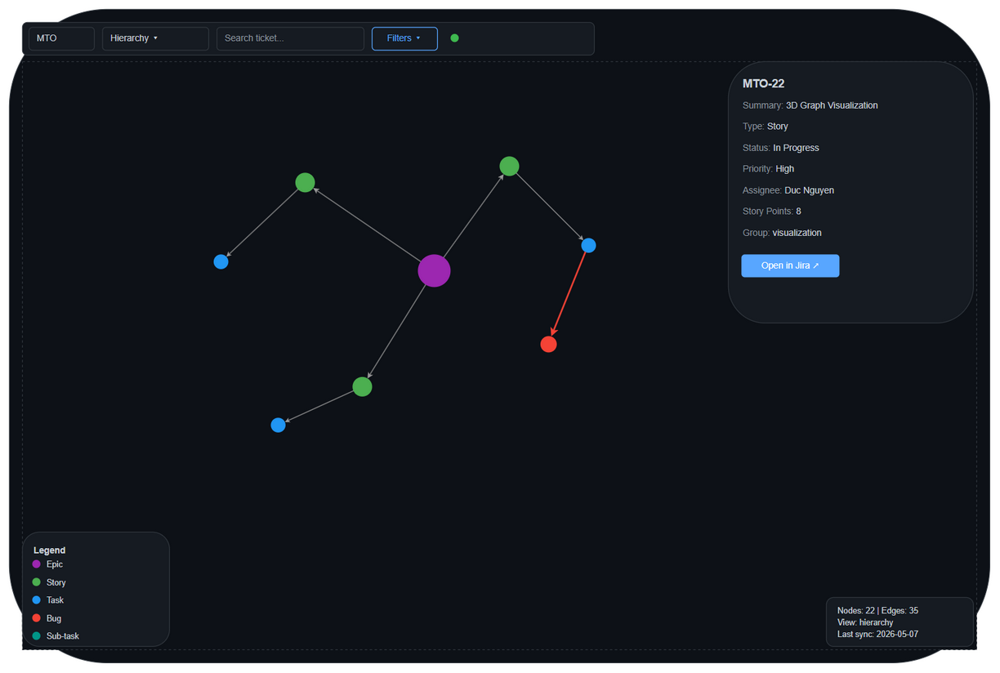
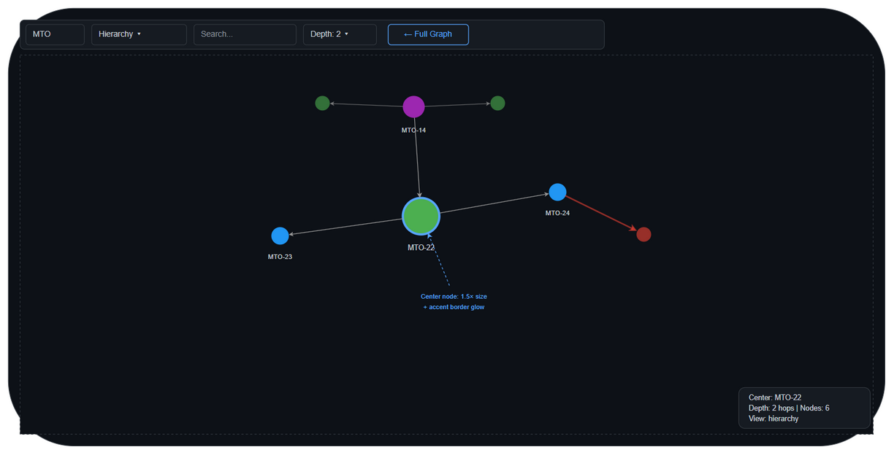

# UI Specification Document

## MTO-22: 3D Force Graph Visualization — 7 View Modes

---

## Document Information

| Field | Value |
|-------|-------|
| Ticket | MTO-22 |
| Feature | 3D Graph Visualization — Force-Directed Graph Views |
| Tech Stack | HTML + Vanilla JS + 3d-force-graph.js (CDN) |
| Theme | Dark (GitHub-inspired) |
| Endpoint | `/sync/graph-viewer` (orchestrator-server) |
| Status | **Partially Implemented** — 3 of 7 view modes active |
| Source File | `orchestrator-server/src/main/resources/static/graph-viewer.html` |

---

## Design System

```css
:root {
    --bg: #0d1117;
    --surface: #161b22;
    --surface-hover: #1c2128;
    --border: #30363d;
    --text: #c9d1d9;
    --muted: #8b949e;
    --accent: #58a6ff;
}
```

### Color Palettes by View Mode

#### Hierarchy (Issue Type)
| Type | Color | Hex |
|------|-------|-----|
| Epic | Purple | #9C27B0 |
| Story | Green | #4CAF50 |
| Task | Blue | #2196F3 |
| Bug | Red | #F44336 |
| Sub-task | Teal | #009688 |

#### Functional (Component/Label)
Auto-generated HSL: `hsl(index * 137.5, 70%, 60%)`

#### Business (Epic Parent)
Auto-generated HSL: `hsl(index * 137.5, 60%, 55%)`

#### Complexity (Dependency Depth)
| Depth | Color | Hex |
|-------|-------|-----|
| 0 (leaf) | Green | #4CAF50 |
| 1-2 | Yellow | #FFEB3B |
| 3-4 | Orange | #FF9800 |
| 5+ | Red | #F44336 |

#### Timeline (Status)
| Status | Color | Hex |
|--------|-------|-----|
| To Do | Gray | #9E9E9E |
| In Progress | Blue | #2196F3 |
| Done | Green | #4CAF50 |

#### Dependency (Critical Path)
| Category | Color | Hex |
|----------|-------|-----|
| Normal | Gray | #9E9E9E |
| Critical path | Red | #F44336 |
| Blocked | Orange | #FF9800 |

#### Team (Assignee)
Auto-generated HSL: `hsl(index * 137.5, 65%, 55%)`

---

## Layout Structure

### Layout

- **Controls** (fixed, top-left): Project input + View Mode select + Search input + Filter toggle button
- **Filter Panel** (collapsible, below controls): Type checkboxes, Status checkboxes, Assignee dropdown, Apply/Reset buttons
- **3D Graph Canvas** (full viewport WebGL): Interactive force-directed graph
- **Details Panel** (fixed, right side, shown on click): Node info — ID, Summary, Type, Status, Priority, Assignee, Story Points, "Open in Jira" link
- **Legend** (fixed, bottom-left): Auto-generated from current view mode colors
- **Stats Bar** (fixed, bottom-right): Node count, Edge count, View mode, Last synced time

---

## Screen: Full Project Graph (7 View Modes)

### Purpose
Visualize all Jira tickets in a project as an interactive 3D force-directed graph with 7 different perspectives (view modes) for analyzing project structure, dependencies, team allocation, complexity, and timeline.

### URL
`http://localhost:8080/sync/graph-viewer` (orchestrator-server)

### Wireframe — Full View

**Draw.io source:** [diagrams/ui-graph-viewer-full.drawio](diagrams/ui-graph-viewer-full.drawio)



### UI Elements

| ID | Element | Type | Behavior |
|----|---------|------|----------|
| GV-01 | Project input | Text input | Enter project key, triggers reload on Enter/blur |
| GV-02 | View mode select | Dropdown | 7 options: hierarchy, functional, business, complexity, timeline, dependency, team |
| GV-03 | Search input | Text input | Searches nodes by id or label, animates camera to match |
| GV-04 | Filter toggle | Button | Expands/collapses filter panel |
| GV-05 | Filter panel | Collapsible panel | Checkboxes for type, status; dropdown for assignee |
| GV-06 | 3D Graph canvas | WebGL (3d-force-graph) | Full viewport, interactive |
| GV-07 | Details panel | Fixed right panel | Shows on node click, includes "Open in Jira" link |
| GV-08 | Legend | Fixed bottom-left | Auto-generated from current view mode colors |
| GV-09 | Stats bar | Fixed bottom-right | Node count, edge count, view mode, last sync time |

### View Mode Behaviors

| Mode | Color By | Size By | Group By | Edge Emphasis |
|------|----------|---------|----------|---------------|
| hierarchy | Issue type | Type (Epic=8, Story=5, Task=4) | — | Parent edges |
| functional | Component/label | Default (5) | First label | — |
| business | Epic parent | Default (5) | Epic parent key | Parent edges |
| complexity | Dependency depth | Story points × 1.5 (min 3, max 15) | — | All edges |
| timeline | Status | Default (5) | — | — |
| dependency | Critical path | Default (5) | — | Blocking edges (thick red) |
| team | Assignee | Default (5) | Assignee name | — |

### Node Sizing Rules

| View Mode | Logic |
|-----------|-------|
| hierarchy | Epic=8, Story=5, Task=4, Bug=5, Sub-task=3 |
| complexity | `Math.min(15, Math.max(3, storyPoints * 1.5))` |
| All others | Default = 5 |

### Edge Styling

| Relationship Type | Color | Width | Arrow |
|-------------------|-------|-------|-------|
| parent (has child) | #999999 | 2 | Yes (length=4) |
| blocks | #f44336 | 3 | Yes (length=6) |
| relates-to | #2196f3 | 1 | Yes (length=4) |
| is-blocked-by | #FF9800 | 2 | Yes (length=4) |

---

## Screen: Subgraph View (N-hop)

### Purpose
Focus on a single ticket and its N-hop neighborhood (BFS traversal).

### URL
API: `GET /sync/graph/{projectKey}/{issueKey}?depth=2&view=hierarchy`

### Wireframe

**Draw.io source:** [diagrams/ui-graph-subgraph.drawio](diagrams/ui-graph-subgraph.drawio)



### Additional UI Elements (Subgraph)

| ID | Element | Type | Behavior |
|----|---------|------|----------|
| SG-01 | Depth selector | Dropdown | Options: 1, 2, 3, 4, 5. Default: 2 |
| SG-02 | Back to full graph | Link/button | Returns to full project graph |
| SG-03 | Center node indicator | Visual | Center node has 1.5× size and distinct glow/border |

---

## Component Hierarchy

```
GraphViewerApp (IIFE)
├── Controls
│   ├── ProjectInput (#project-select)
│   ├── ViewModeSelect (#view-select)
│   │   ├── option: Hierarchy
│   │   ├── option: Functional
│   │   ├── option: Business
│   │   ├── option: Complexity
│   │   ├── option: Timeline
│   │   ├── option: Dependency
│   │   └── option: Team
│   ├── SearchInput (#search)
│   ├── FilterToggle (#filter-toggle)
│   └── FilterPanel (#filter-panel, collapsible)
│       ├── TypeCheckboxes (Epic, Story, Task, Bug, Sub-task)
│       ├── StatusCheckboxes (To Do, In Progress, Done)
│       ├── AssigneeDropdown
│       └── ActionButtons (Apply, Reset)
├── GraphContainer (#graph-container)
│   └── ForceGraph3D instance (WebGL canvas)
├── DetailsPanel (#details-panel)
│   ├── NodeTitle (h3 — ticket key)
│   ├── FieldList
│   │   ├── Summary
│   │   ├── Type
│   │   ├── Status
│   │   ├── Priority
│   │   ├── Assignee
│   │   ├── Story Points
│   │   └── Group
│   └── JiraLink (anchor, opens new tab)
├── Legend (#legend)
│   └── LegendItem[] (.item with colored .dot + label)
└── StatsBar (#stats)
    ├── NodeCount
    ├── EdgeCount
    ├── ViewMode
    └── LastSynced
```

---

## User Interaction Flows

### Flow 1: Initial Load

```
[Page loads] → DOMContentLoaded
    → init()
    → Create ForceGraph3D instance with config
    → bindControls() — attach all event listeners
    → loadGraph() with defaults (project=MTO, view=hierarchy)
    → API: GET /sync/graph/MTO?view=hierarchy
    → Response: { nodes[], edges[], metadata }
    → graph.graphData({ nodes, links: edges })
    → updateStats(metadata)
    → updateLegend(nodes) — extract unique groups + colors
    → Graph renders, physics simulation runs
    → Stabilizes in ~3 seconds
```

### Flow 2: Switch View Mode

```
[User selects "Complexity" from dropdown]
    → view-select.onchange fires
    → loadGraph()
    → API: GET /sync/graph/MTO?view=complexity
    → New data: nodes have different colors (green→red gradient) and sizes (by story points)
    → Graph re-renders with new visual properties
    → Legend updates to show complexity scale
    → Stats updates view mode label
```

### Flow 3: Click Node → Details + Open Jira

```
[User clicks node "MTO-22"]
    → onNodeClick(node) fires
    → showDetails(node)
    → Details panel visible with all fields
    → "Open in Jira" link: https://jiraassist.atlassian.net/browse/MTO-22
    → Click link → opens in new tab
```

### Flow 4: Hover → Highlight Connected

```
[User hovers over "MTO-14"]
    → onNodeHover(node) fires
    → highlightConnected(node)
    → Find all 1-hop neighbors via edges
    → Connected nodes: keep original color
    → Non-connected nodes: color = #333333 (dimmed)
    → Connected edges: color = #ffffff (white)
    → Non-connected edges: color = #222222 (dimmed)

[Mouse leaves]
    → onNodeHover(null)
    → Restore all original colors
```

### Flow 5: Filter Nodes

```
[User clicks "Filters" button]
    → Filter panel expands below controls
    → User unchecks "Task" and "Sub-task"
    → Clicks "Apply"
    → Client-side filter: hide nodes where type ∈ {Task, Sub-task}
    → Hide edges connected to hidden nodes
    → Graph re-renders with filtered data
    → Stats updates (filtered count)
```

### Flow 6: Search with Camera Animation

```
[User types "sync" in search input]
    → oninput fires
    → searchNode("sync")
    → Find first node where id or label contains "sync" (case-insensitive)
    → Found: "MTO-14" (label: "Jira Project Sync Service")
    → graph.cameraPosition(
        { x: node.x, y: node.y, z: node.z + 200 },
        node,  // lookAt
        1000   // transition ms
      )
    → showDetails(found)
```

### Flow 7: Navigate to Subgraph

```
[User double-clicks node "MTO-14"]
    → OR: details panel has "Focus" button
    → loadSubgraph("MTO", "MTO-14", depth=2)
    → API: GET /sync/graph/MTO/MTO-14?depth=2&view=hierarchy
    → Graph re-renders with only N-hop neighborhood
    → Center node rendered at 1.5× size
    → "← Full Graph" button appears in controls
    → Stats shows "Center: MTO-14 | Depth: 2"
```

---

## API Contracts

### GET /sync/graph/{projectKey}

| Param | Type | Required | Default | Description |
|-------|------|----------|---------|-------------|
| projectKey | Path | Yes | — | Jira project key (e.g., MTO) |
| view | Query | No | hierarchy | View mode enum |

**Response (200 OK):**
```json
{
  "nodes": [{
    "id": "MTO-14",
    "label": "Jira Project Sync Service",
    "type": "Epic",
    "status": "To Do",
    "priority": "High",
    "assignee": "Duc Nguyen",
    "storyPoints": 13,
    "group": "infrastructure",
    "color": "#9C27B0",
    "size": 8
  }],
  "edges": [{
    "source": "MTO-14",
    "target": "MTO-15",
    "type": "parent",
    "label": "has child",
    "color": "#999",
    "width": 2
  }],
  "metadata": {
    "projectKey": "MTO",
    "viewMode": "hierarchy",
    "nodeCount": 22,
    "edgeCount": 35,
    "lastSynced": "2026-05-07T10:00:00Z"
  }
}
```

### GET /sync/graph/{projectKey}/{issueKey}

| Param | Type | Required | Default | Description |
|-------|------|----------|---------|-------------|
| projectKey | Path | Yes | — | Jira project key |
| issueKey | Path | Yes | — | Center issue key |
| depth | Query | No | 2 | BFS hop count (1-5) |
| view | Query | No | hierarchy | View mode |

**Response:** Same schema as full graph, but filtered to N-hop subgraph.

---

## Implementation Notes for DEV

### File Location
```
orchestrator-server/src/main/resources/static/graph-viewer.html
```

### Current State vs. Target

| Feature | Current | Target |
|---------|---------|--------|
| View modes | 3 (hierarchy, dependency, team) | 7 (+functional, business, complexity, timeline) |
| Filter panel | None | Type, Status, Assignee filters |
| Details panel | Basic (5 fields) | Extended (7 fields + Jira link) |
| Subgraph view | None | Double-click or "Focus" button |
| Search | Basic (first match) | Enhanced (dropdown for multiple matches) |
| Depth selector | None | Dropdown (1-5) for subgraph |

### Changes Required to Existing File

1. **Add 4 view mode options** to `#view-select` dropdown:
   ```html
   <option value="functional">Functional</option>
   <option value="business">Business</option>
   <option value="complexity">Complexity</option>
   <option value="timeline">Timeline</option>
   ```

2. **Add filter toggle button** after search input:
   ```html
   <button id="filter-toggle">Filters</button>
   ```

3. **Add filter panel** (collapsible div below controls):
   ```html
   <div id="filter-panel" class="hidden">...</div>
   ```

4. **Enhance showDetails()** — add assignee, storyPoints, Jira link

5. **Add client-side filtering** — filter graphData before passing to graph

6. **Add subgraph support** — double-click handler, depth selector, back button

### External Dependencies
| Library | CDN URL | Purpose |
|---------|---------|---------|
| 3d-force-graph | `https://unpkg.com/3d-force-graph@1` | 3D WebGL graph rendering (includes three.js) |

### Performance Targets (from FSD)
| Metric | Target |
|--------|--------|
| API response (500 nodes) | < 500ms |
| Frontend render (500 nodes) | > 30 FPS |
| Layout stabilization | < 3 seconds |
| Browser memory (500 nodes) | < 200MB |
| Min viewport width | 768px |

### Graph Physics Configuration
```javascript
// Tuned for visual stability + performance
.d3AlphaDecay(0.02)      // Slow decay = smoother settling
.d3VelocityDecay(0.3)    // Medium friction
.warmupTicks(100)         // Pre-compute 100 ticks before render
.cooldownTicks(200)       // Stop simulation after 200 ticks
```

### CSS Classes to Add

```css
/* Filter panel */
#filter-panel {
    position: fixed;
    top: 52px;
    left: 16px;
    background: var(--surface);
    border: 1px solid var(--border);
    border-radius: 8px;
    padding: 16px;
    z-index: 99;
    display: flex;
    gap: 16px;
    flex-wrap: wrap;
}
#filter-panel.hidden { display: none; }
#filter-panel label {
    display: flex;
    align-items: center;
    gap: 4px;
    font-size: 0.8rem;
    color: var(--text);
    cursor: pointer;
}
#filter-panel input[type="checkbox"] {
    accent-color: var(--accent);
}

/* Enhanced details panel */
#details-panel .jira-link {
    display: inline-block;
    margin-top: 12px;
    padding: 6px 12px;
    background: var(--accent);
    color: #fff;
    border-radius: 6px;
    text-decoration: none;
    font-size: 0.8rem;
}
#details-panel .jira-link:hover {
    background: #79b8ff;
}

/* Filter toggle button */
#filter-toggle {
    padding: 6px 12px;
    border-radius: 6px;
    border: 1px solid var(--border);
    background: var(--surface);
    color: var(--text);
    font-size: 0.85rem;
    cursor: pointer;
}
#filter-toggle:hover {
    background: var(--surface-hover, #1c2128);
}
#filter-toggle.active {
    border-color: var(--accent);
    color: var(--accent);
}
```

---

## Shared Implementation Note (MTO-38 ↔ MTO-22)

Both `kb-server` and `orchestrator-server` serve the same `graph-viewer.html` file. The implementations are currently **identical** (3 view modes). The MTO-22 enhancement (7 view modes + filters) should be applied to **both** files to maintain consistency.

| Server | File | Port | API Base |
|--------|------|------|----------|
| orchestrator-server | `src/main/resources/static/graph-viewer.html` | 8080 | `/sync/graph/` |
| kb-server | `src/main/resources/static/graph-viewer.html` | 9181 | `/sync/graph/` |

After MTO-22 is complete, sync the updated HTML to both locations.
