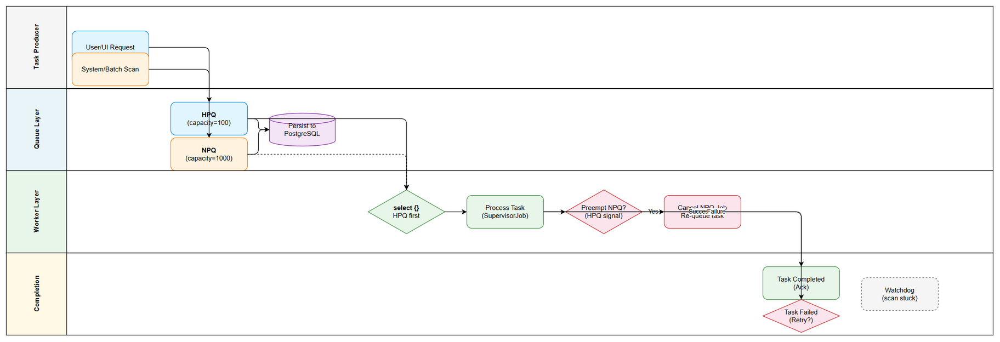

# Business Requirements Document (BRD)

## MCPOrchestration — MTO-25: KB Refinery — Dual-Priority Queue (Kotlin Channels)

---

## Document Information

| Field | Value |
|-------|-------|
| Jira Ticket | MTO-25 |
| Title | KB Refinery — Dual-Priority Queue (Kotlin Channels) |
| Author | BA Agent |
| Version | 1.0 |
| Date | 2026-05-08 |
| Status | Draft |
| Parent Epic | MTO-24 (Knowledge Base Refinery - AI-Powered Data Extraction, Masking & Access Control) |

---

## Author Tracking

| Role | Name - Position | Responsibility |
|------|-----------------|----------------|
| Author | BA Agent – Business Analyst | Create document |
| Peer Reviewer | SA Agent – Solution Architect | Review document |

---

## Revision History

| Version | Date | Author | Changes |
|---------|------|--------|---------|
| 1.0 | 2026-05-08 | BA Agent | Initiate document — auto-generated from Jira ticket MTO-25 |

---

## Sign-Off

| Name | Signature and date |
|------|--------------------|
| | ☐ I agree and confirm all criteria on this BRD as expected requirements |
| | ☐ I agree and confirm all criteria on this BRD as expected requirements |

---

## 1. Introduction

### 1.1 Scope

This document defines the business requirements for implementing a **Dual-Priority Queue** system using Kotlin Channels within the KB Refinery module of MCPOrchestration. The queue system enables prioritized task processing where user-initiated (high-priority) requests preempt batch/system (normal-priority) tasks, ensuring responsive user experience while maintaining background processing throughput.

The system is part of the larger KB Refinery epic (MTO-24) which provides AI-powered data extraction, masking, and access control capabilities. The Dual-Priority Queue serves as the task scheduling backbone for all KB Refinery operations.

### 1.2 Out of Scope

- AI data extraction logic (handled by other MTO-24 sub-tickets)
- Data masking and access control policies
- UI/Frontend for queue monitoring (future ticket)
- Distributed queue across multiple JVM instances (single-instance only for v1)
- Message broker integration (Kafka, RabbitMQ) — uses in-process Kotlin Channels only

### 1.3 Preliminary Requirement

- PostgreSQL database available with migration support (Flyway)
- Kotlin Coroutines runtime configured in the application
- Koin DI framework configured
- HikariCP connection pool configured
- Existing `orchestrator-server` module operational

---

## 2. Business Requirements

### 2.1 High Level Process Map

The Dual-Priority Queue system processes tasks from two distinct sources:

1. **User/UI Requests (High Priority)** — Real-time requests from users that require immediate processing (e.g., extract data from a specific document, process a user-uploaded file)
2. **System/Batch Scans (Normal Priority)** — Background tasks that scan existing tickets, perform periodic data extraction, or run scheduled maintenance operations

The system ensures high-priority tasks always take precedence over normal-priority tasks, with the ability to preempt (pause/cancel) running normal-priority tasks when high-priority work arrives.

### 2.2 List of User Stories / Use Cases

| # | Story / Use Case | Priority | Source Ticket |
|---|------------------|----------|---------------|
| 1 | As a system operator, I want high-priority tasks to be processed immediately so that user-facing operations have minimal latency | MUST HAVE | MTO-25 |
| 2 | As a system operator, I want normal-priority batch tasks to be processed when no high-priority work exists so that background scanning continues efficiently | MUST HAVE | MTO-25 |
| 3 | As a system operator, I want running normal-priority tasks to be preempted when high-priority work arrives so that user requests are never blocked by batch operations | MUST HAVE | MTO-25 |
| 4 | As a system operator, I want preempted tasks to be automatically re-queued so that no work is lost | MUST HAVE | MTO-25 |
| 5 | As a system operator, I want task state tracked in PostgreSQL so that I can monitor queue health and recover from crashes | MUST HAVE | MTO-25 |
| 6 | As a system operator, I want a watchdog to detect stuck tasks and re-queue or fail them so that the system self-heals | MUST HAVE | MTO-25 |
| 7 | As a system operator, I want failed tasks to be retried with exponential backoff so that transient errors are handled gracefully | SHOULD HAVE | MTO-25 |
| 8 | As a system operator, I want worker crash recovery so that in-progress tasks are not permanently lost | MUST HAVE | MTO-25 |

---

### 2.3 Details of User Stories

---

#### Business Flow

**Step 1:** Task arrives (either from User/UI as high-priority or from System/Batch as normal-priority)

**Step 2:** Task is enqueued into the appropriate Kotlin Channel (HPQ capacity=100 or NPQ capacity=1000)

**Step 3:** Task state is persisted to PostgreSQL with status=Pending

**Step 4:** Worker coroutine selects next task (HPQ has priority via `select {}` expression)

**Step 5:** If HPQ has a task AND worker is currently processing NPQ task → preempt NPQ task (cancel Job)

**Step 6:** Preempted NPQ task is re-queued (status reverts to Pending, pushed back to NPQ channel)

**Step 7:** Worker processes the selected task (status=Processing)

**Step 8:** On completion → status=Completed; On failure → retry logic (exponential backoff, max 3 retries)

**Step 9:** Watchdog coroutine periodically scans for stuck tasks (Processing > 5 minutes) and re-queues or marks as Failed

> **Note:** Manual acknowledgment pattern ensures tasks are only marked Completed after successful processing confirmation.

---

#### STORY 1: High-Priority Task Immediate Processing

> As a system operator, I want high-priority tasks to be processed immediately so that user-facing operations have minimal latency.

**Requirement Details:**

1. High-Priority Queue (HPQ) implemented as a Kotlin `Channel<QueueTask>` with capacity 100
2. HPQ tasks originate from user/UI interactions (real-time requests)
3. Worker MUST check HPQ before NPQ on every task selection cycle
4. HPQ tasks should begin processing within 100ms of enqueue (under normal load)
5. If HPQ is full (100 items), the enqueue operation suspends until space is available (backpressure)

**Acceptance Criteria:**

1. GIVEN a high-priority task is enqueued WHEN the worker is idle THEN the task begins processing within 100ms
2. GIVEN a high-priority task is enqueued WHEN the worker is processing a normal-priority task THEN the normal-priority task is preempted and the high-priority task begins processing
3. GIVEN the HPQ is at capacity (100) WHEN a new high-priority task arrives THEN the enqueue call suspends (does not drop the task)

---

#### STORY 2: Normal-Priority Batch Processing

> As a system operator, I want normal-priority batch tasks to be processed when no high-priority work exists so that background scanning continues efficiently.

**Requirement Details:**

1. Normal-Priority Queue (NPQ) implemented as a Kotlin `Channel<QueueTask>` with capacity 1000
2. NPQ tasks originate from system batch scans (e.g., scanning old Jira tickets)
3. NPQ tasks are only processed when HPQ is empty
4. NPQ provides high throughput for bulk operations during idle periods
5. If NPQ is full (1000 items), the enqueue operation suspends (backpressure)

**Acceptance Criteria:**

1. GIVEN no high-priority tasks exist WHEN a normal-priority task is enqueued THEN it is processed by the worker
2. GIVEN the NPQ has 500 pending tasks WHEN no high-priority tasks arrive THEN all 500 tasks are processed sequentially
3. GIVEN the NPQ is at capacity (1000) WHEN a new normal-priority task arrives THEN the enqueue call suspends

---

#### STORY 3: Preemption of Normal-Priority Tasks

> As a system operator, I want running normal-priority tasks to be preempted when high-priority work arrives so that user requests are never blocked by batch operations.

**Requirement Details:**

1. Worker uses `SupervisorJob` to manage task execution
2. When HPQ receives a signal while NPQ task is running → worker cancels the NPQ task's Job
3. Cancellation is cooperative (task checks `isActive` or uses `ensureActive()`)
4. Preemption latency target: < 500ms from HPQ signal to NPQ task cancellation
5. Only NPQ tasks can be preempted; HPQ tasks are never preempted

**Acceptance Criteria:**

1. GIVEN a normal-priority task is running WHEN a high-priority task arrives in HPQ THEN the normal-priority task is cancelled within 500ms
2. GIVEN a high-priority task is running WHEN another high-priority task arrives THEN the running task is NOT preempted (queued instead)
3. GIVEN preemption occurs THEN the worker immediately begins processing the high-priority task

---

#### STORY 4: Re-queue Preempted Tasks

> As a system operator, I want preempted tasks to be automatically re-queued so that no work is lost.

**Requirement Details:**

1. When an NPQ task is preempted (Job cancelled), it is pushed back to the NPQ channel
2. Task state in PostgreSQL reverts to Pending
3. Task's `retry_count` is NOT incremented for preemption (preemption ≠ failure)
4. Re-queued tasks maintain their original position priority (FIFO within NPQ)
5. A task can be preempted multiple times without penalty

**Acceptance Criteria:**

1. GIVEN a task is preempted WHEN it is re-queued THEN its status in PostgreSQL is Pending
2. GIVEN a task is preempted WHEN it is re-queued THEN its retry_count remains unchanged
3. GIVEN a task has been preempted 5 times THEN it is still eligible for processing (no preemption limit)

---

#### STORY 5: PostgreSQL State Tracking

> As a system operator, I want task state tracked in PostgreSQL so that I can monitor queue health and recover from crashes.

**Requirement Details:**

1. State tracking table `queue_tasks` with columns:
   - `task_id` (UUID, PK)
   - `task_type` (VARCHAR — identifies the task handler)
   - `payload` (JSONB — task-specific data)
   - `status` (ENUM: Pending, Processing, Completed, Failed)
   - `priority` (ENUM: High, Normal)
   - `created_at` (TIMESTAMP)
   - `started_at` (TIMESTAMP, nullable)
   - `completed_at` (TIMESTAMP, nullable)
   - `retry_count` (INT, default 0)
   - `error_message` (TEXT, nullable)
   - `worker_id` (VARCHAR, nullable — identifies which worker instance)
2. Manual Acknowledgment: task is only marked Completed after explicit ack from worker
3. All state transitions are atomic (single UPDATE statement)

**Data Fields:**

| Field | Type | Required | Description | Example |
|-------|------|----------|-------------|---------|
| task_id | UUID | Yes | Unique task identifier | `550e8400-e29b-41d4-a716-446655440000` |
| task_type | VARCHAR(100) | Yes | Task handler identifier | `jira_ticket_scan` |
| payload | JSONB | Yes | Task-specific data | `{"ticketKey": "PROJ-123"}` |
| status | VARCHAR(20) | Yes | Current task status | `Pending` |
| priority | VARCHAR(10) | Yes | Task priority level | `High` |
| created_at | TIMESTAMP | Yes | When task was created | `2026-05-08T10:00:00Z` |
| started_at | TIMESTAMP | No | When processing began | `2026-05-08T10:00:01Z` |
| completed_at | TIMESTAMP | No | When processing finished | `2026-05-08T10:00:05Z` |
| retry_count | INT | Yes | Number of retry attempts | `0` |
| error_message | TEXT | No | Last error description | `Connection timeout` |
| worker_id | VARCHAR(50) | No | Worker instance identifier | `worker-1` |

**Acceptance Criteria:**

1. GIVEN a task is enqueued THEN a row is inserted into `queue_tasks` with status=Pending
2. GIVEN a worker picks up a task THEN status is updated to Processing with started_at and worker_id
3. GIVEN a task completes successfully THEN status is updated to Completed with completed_at
4. GIVEN a task fails THEN status is updated to Failed with error_message populated
5. GIVEN the application restarts THEN tasks with status=Processing are recoverable

---

#### STORY 6: Watchdog for Stuck Tasks

> As a system operator, I want a watchdog to detect stuck tasks and re-queue or fail them so that the system self-heals.

**Requirement Details:**

1. Watchdog runs as a dedicated coroutine with configurable scan interval (default: 60 seconds)
2. Detects tasks with status=Processing AND started_at > 5 minutes ago
3. For stuck tasks with retry_count < 3: re-queue (status → Pending, clear worker_id)
4. For stuck tasks with retry_count >= 3: mark as Failed
5. Watchdog logs all actions for observability

**Acceptance Criteria:**

1. GIVEN a task has been Processing for > 5 minutes WHEN watchdog runs THEN the task is re-queued (if retries < 3)
2. GIVEN a task has been Processing for > 5 minutes AND retry_count >= 3 WHEN watchdog runs THEN the task is marked Failed
3. GIVEN the watchdog detects a stuck task THEN it logs the action with task_id and reason

---

#### STORY 7: Retry with Exponential Backoff

> As a system operator, I want failed tasks to be retried with exponential backoff so that transient errors are handled gracefully.

**Requirement Details:**

1. Maximum 3 retry attempts per task
2. Backoff formula: `delay = baseDelay * 2^(retryCount)` where baseDelay = 1 second
   - Retry 1: 2 seconds delay
   - Retry 2: 4 seconds delay
   - Retry 3: 8 seconds delay
3. After max retries exhausted → task status = Failed permanently
4. Each retry increments `retry_count` in PostgreSQL
5. Retry delay is implemented via `delay()` in the worker coroutine

**Acceptance Criteria:**

1. GIVEN a task fails for the first time THEN it is retried after 2 seconds
2. GIVEN a task fails for the second time THEN it is retried after 4 seconds
3. GIVEN a task fails for the third time THEN it is retried after 8 seconds
4. GIVEN a task has failed 3 times THEN it is marked as Failed permanently (no more retries)

---

#### STORY 8: Worker Crash Recovery

> As a system operator, I want worker crash recovery so that in-progress tasks are not permanently lost.

**Requirement Details:**

1. On application startup, scan `queue_tasks` for tasks with status=Processing
2. These tasks were interrupted by a crash — re-queue them (status → Pending)
3. Increment retry_count for crash-recovered tasks
4. If retry_count >= 3 after increment → mark as Failed instead of re-queuing
5. Worker registers a unique `worker_id` on startup for identification

**Acceptance Criteria:**

1. GIVEN the application crashed WHEN it restarts THEN all Processing tasks are detected
2. GIVEN a Processing task is detected on startup WHEN retry_count < 3 THEN it is re-queued
3. GIVEN a Processing task is detected on startup WHEN retry_count >= 3 THEN it is marked Failed
4. GIVEN crash recovery completes THEN all recovered tasks have their retry_count incremented

---

## 3. Dependencies

| Dependency | Type | Related Ticket | Description |
|------------|------|----------------|-------------|
| PostgreSQL Database | Infrastructure | N/A | Required for state tracking table |
| Kotlin Coroutines | System | N/A | Core runtime for channels and workers |
| Koin DI | System | N/A | Dependency injection for queue components |
| HikariCP | System | N/A | Connection pooling for DB operations |
| Flyway | System | N/A | Database migration for queue_tasks table |
| MTO-24 Epic | External | MTO-24 | Parent epic — KB Refinery architecture |

---

## 4. Stakeholders

| Role | Name / Team | Responsibility | Source |
|------|-------------|----------------|--------|
| Product Owner | Duc Nguyen | Define requirements, accept deliverables | Jira reporter |
| Solution Architect | SA Agent | Technical design and review | Team |
| Developer | DEV Agent | Implementation | Team |
| QA Engineer | QA Agent | Testing and verification | Team |

---

## 5. Risks and Assumptions

### 5.1 Risks

| Risk | Impact | Likelihood | Mitigation |
|------|--------|------------|------------|
| Channel backpressure causes caller suspension | Medium | Medium | Monitor queue depths, alert when > 80% capacity |
| Preemption causes data corruption in partially-processed tasks | High | Low | Tasks must be idempotent; use transaction boundaries |
| Watchdog false positives (marks healthy long-running tasks as stuck) | Medium | Medium | Configurable timeout per task_type; heartbeat mechanism |
| PostgreSQL connection exhaustion under high load | High | Low | HikariCP pool sizing; connection timeout configuration |
| Worker crash during state transition leaves inconsistent state | High | Low | Atomic DB updates; crash recovery on startup |

### 5.2 Assumptions

- Single JVM instance (no distributed coordination needed for v1)
- Tasks are idempotent (safe to re-execute after preemption or crash)
- PostgreSQL is available and responsive (< 50ms for state updates)
- Task processing time is typically < 5 minutes (watchdog threshold)
- The application has a graceful shutdown hook to drain queues

---

## 6. Non-Functional Requirements

| Category | Requirement | Details |
|----------|-------------|---------|
| Performance | HPQ task pickup latency < 100ms | From enqueue to worker start |
| Performance | Preemption latency < 500ms | From HPQ signal to NPQ cancellation |
| Performance | State update latency < 50ms | PostgreSQL write for status change |
| Throughput | Process ≥ 100 tasks/minute under normal load | NPQ batch processing rate |
| Reliability | Zero task loss on crash | All Processing tasks recovered on restart |
| Reliability | Max 3 retries with exponential backoff | Handles transient failures |
| Availability | Watchdog scan every 60 seconds | Detects stuck tasks within 2 minutes |
| Scalability | HPQ capacity: 100 tasks | Buffered channel for high-priority |
| Scalability | NPQ capacity: 1000 tasks | Buffered channel for normal-priority |
| Observability | All state transitions logged | INFO level with task_id, status, duration |

---

## 7. Related Tickets

| Ticket Key | Summary | Status | Type | Relationship |
|------------|---------|--------|------|--------------|
| MTO-25 | KB Refinery — Dual-Priority Queue (Kotlin Channels) | To Do | Story | Main ticket |
| MTO-24 | Knowledge Base Refinery - AI-Powered Data Extraction, Masking & Access Control | To Do | Epic | Parent epic |

---

## 8. Appendix

### Glossary

| Term | Definition |
|------|------------|
| HPQ | High-Priority Queue — Kotlin Channel with capacity 100 for user/UI tasks |
| NPQ | Normal-Priority Queue — Kotlin Channel with capacity 1000 for batch/system tasks |
| Preemption | Cancelling a running NPQ task to process an HPQ task |
| Watchdog | Background coroutine that detects and handles stuck tasks |
| Manual Acknowledgment | Pattern where task completion requires explicit confirmation from worker |
| SupervisorJob | Kotlin coroutine Job that doesn't cancel siblings on child failure |
| Exponential Backoff | Retry delay that doubles with each attempt |

### Diagram Index

| # | Diagram | Image | Source (editable) |
|---|---------|-------|-------------------|
| 1 | Business Flow | [business-flow.png](diagrams/business-flow.png) | [business-flow.drawio](diagrams/business-flow.drawio) |
| 2 | Use Case Diagram | [use-case.png](diagrams/use-case.png) | [use-case.drawio](diagrams/use-case.drawio) |
