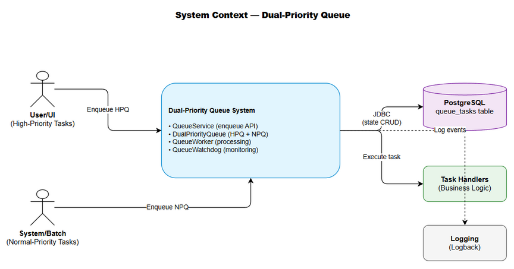
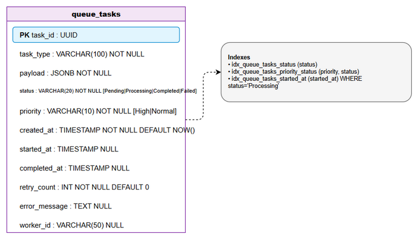
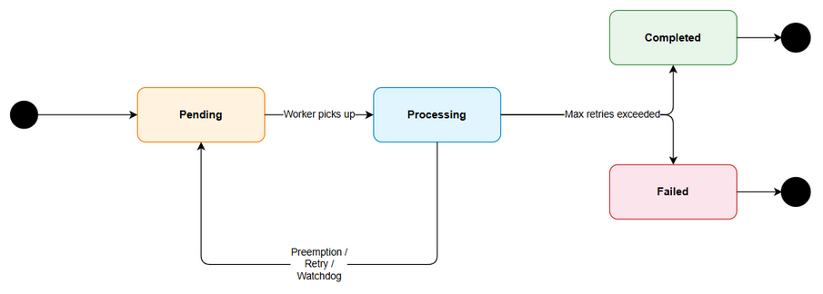

# Functional Specification Document (FSD)

## MCPOrchestration — MTO-25: KB Refinery — Dual-Priority Queue (Kotlin Channels)

---

## Document Information

| Field | Value |
|-------|-------|
| Jira Ticket | MTO-25 |
| Title | KB Refinery — Dual-Priority Queue (Kotlin Channels) |
| Author | BA Agent + TA Agent |
| Version | 1.0 |
| Date | 2026-05-08 |
| Status | Draft |
| Related BRD | BRD-v1-MTO-25.docx |

---

## Revision History

| Version | Date | Author | Changes |
|---------|------|--------|---------|
| 1.0 | 2026-05-08 | BA Agent + TA Agent | Initiate document — auto-generated from BRD and Jira ticket MTO-25 |

---

## 1. Introduction

### 1.1 Purpose

This FSD specifies the functional behavior of the Dual-Priority Queue system for the KB Refinery module. It defines use cases, business rules, data specifications, processing logic, and integration points that developers and testers need to implement and verify the system.

### 1.2 Scope

- Dual Kotlin Channel-based queue (HPQ + NPQ)
- Worker coroutine with preemption capability
- PostgreSQL state tracking with manual acknowledgment
- Watchdog coroutine for stuck task detection
- Retry logic with exponential backoff
- Crash recovery on application startup

### 1.3 Definitions & Acronyms

| Term | Definition |
|------|------------|
| HPQ | High-Priority Queue — Kotlin Channel(100) for user/UI tasks |
| NPQ | Normal-Priority Queue — Kotlin Channel(1000) for batch tasks |
| Preemption | Cancelling running NPQ task when HPQ task arrives |
| Watchdog | Background coroutine scanning for stuck tasks |
| Manual Ack | Task only marked complete after explicit worker confirmation |
| SupervisorJob | Coroutine Job that isolates child failures |

### 1.4 References

| Document | Location |
|----------|----------|
| BRD | BRD-v1-MTO-25.docx |
| Project Structure | .analysis/code-intelligence/project-structure.md |

---

## 2. System Overview

### 2.1 System Context Diagram



The Dual-Priority Queue system sits between task producers (User/UI requests and System/Batch scanners) and task consumers (Worker coroutines). It uses PostgreSQL for persistent state tracking and provides observability through structured logging.

**External Actors:**
- **User/UI** — Submits high-priority tasks via API calls
- **System/Batch Scanner** — Submits normal-priority tasks from scheduled scans
- **PostgreSQL** — Persists task state for durability and crash recovery
- **Logging System** — Receives structured log events for observability

### 2.2 System Architecture

The queue system consists of 5 core components:
1. **QueueService** — Public API for enqueuing tasks
2. **DualPriorityQueue** — Manages HPQ and NPQ Kotlin Channels
3. **QueueWorker** — Processes tasks with preemption support
4. **TaskStateRepository** — PostgreSQL CRUD for queue_tasks table
5. **QueueWatchdog** — Monitors and recovers stuck tasks

---

## 3. Functional Requirements

### 3.1 Feature: Task Enqueue

**Source:** BRD Story 1, Story 2

#### 3.1.1 Description

The system provides a unified API to enqueue tasks with a specified priority. Tasks are routed to the appropriate channel (HPQ or NPQ) and persisted to PostgreSQL atomically.

#### 3.1.2 Use Case: UC-01 — Enqueue High-Priority Task

**Use Case ID:** UC-01
**Actor:** User/UI (via API call)
**Preconditions:** Queue system is running, PostgreSQL is available
**Postconditions:** Task is in HPQ channel AND persisted in queue_tasks with status=Pending

**Main Flow:**

| Step | Actor | System | Description |
|------|-------|--------|-------------|
| 1 | User/UI | | Calls `enqueue(task, Priority.HIGH)` |
| 2 | | QueueService | Validates task payload (non-null, valid task_type) |
| 3 | | TaskStateRepository | INSERT into queue_tasks (status=Pending, priority=High) |
| 4 | | DualPriorityQueue | Send task to HPQ channel |
| 5 | | QueueService | Return task_id to caller |

**Alternative Flows:**

| ID | Condition | Steps |
|----|-----------|-------|
| AF-01.1 | HPQ channel is full (100 items) | Step 4 suspends until space available (backpressure). Caller coroutine is suspended. |
| AF-01.2 | Task already exists (duplicate task_id) | Return existing task_id, skip enqueue |

**Exception Flows:**

| ID | Condition | Steps |
|----|-----------|-------|
| EF-01.1 | PostgreSQL unavailable | Throw QueuePersistenceException, task NOT enqueued to channel |
| EF-01.2 | Invalid payload (null or empty) | Throw InvalidTaskException with validation details |

#### 3.1.3 Use Case: UC-02 — Enqueue Normal-Priority Task

**Use Case ID:** UC-02
**Actor:** System/Batch Scanner
**Preconditions:** Queue system is running, PostgreSQL is available
**Postconditions:** Task is in NPQ channel AND persisted in queue_tasks with status=Pending

**Main Flow:**

| Step | Actor | System | Description |
|------|-------|--------|-------------|
| 1 | System | | Calls `enqueue(task, Priority.NORMAL)` |
| 2 | | QueueService | Validates task payload |
| 3 | | TaskStateRepository | INSERT into queue_tasks (status=Pending, priority=Normal) |
| 4 | | DualPriorityQueue | Send task to NPQ channel |
| 5 | | QueueService | Return task_id to caller |

**Alternative Flows:**

| ID | Condition | Steps |
|----|-----------|-------|
| AF-02.1 | NPQ channel is full (1000 items) | Step 4 suspends until space available |

**Exception Flows:**

| ID | Condition | Steps |
|----|-----------|-------|
| EF-02.1 | PostgreSQL unavailable | Throw QueuePersistenceException |

#### 3.1.4 Business Rules

| Rule ID | Rule | Source |
|---------|------|--------|
| BR-01 | Task must be persisted to DB BEFORE being sent to channel | BRD Story 5 — ensures crash recovery |
| BR-02 | Enqueue is atomic: if DB insert fails, channel send must not happen | BRD Story 5 |
| BR-03 | HPQ capacity = 100, NPQ capacity = 1000 | BRD Story 1, 2 |
| BR-04 | Duplicate task_id detection via DB unique constraint | BRD Story 5 |

#### 3.1.5 API Contract (Functional View)

**Endpoint:** `QueueService.enqueue(task: QueueTask, priority: Priority): UUID`
**Purpose:** Enqueue a task for processing

**Input Parameters:**

| Parameter | Type | Required | Business Rule | Description |
|-----------|------|----------|---------------|-------------|
| task | QueueTask | Yes | BR-02 | Task with type and payload |
| priority | Priority | Yes | BR-03 | HIGH or NORMAL |

**Output Data:**

| Field | Type | Description |
|-------|------|-------------|
| task_id | UUID | Unique identifier for the enqueued task |

**Business Error Scenarios:**

| Scenario | Error | Trigger Condition |
|----------|-------|-------------------|
| Invalid task | InvalidTaskException | Null payload or empty task_type |
| DB unavailable | QueuePersistenceException | PostgreSQL connection failure |
| Channel full | Suspension (not error) | Channel at capacity — caller suspends |

---

### 3.2 Feature: Task Processing (Worker)

**Source:** BRD Story 1, 2, 3

#### 3.2.1 Description

The QueueWorker continuously selects tasks from channels, prioritizing HPQ over NPQ. It processes tasks using registered task handlers and supports cooperative cancellation for preemption.

#### 3.2.2 Use Case: UC-03 — Process Next Task

**Use Case ID:** UC-03
**Actor:** QueueWorker (internal)
**Preconditions:** Worker is running, at least one task in HPQ or NPQ
**Postconditions:** Task processed, status updated to Completed or Failed

**Main Flow:**

| Step | Actor | System | Description |
|------|-------|--------|-------------|
| 1 | | QueueWorker | Use `select {}` to receive from HPQ first, then NPQ |
| 2 | | TaskStateRepository | UPDATE status=Processing, set started_at, worker_id |
| 3 | | QueueWorker | Look up TaskHandler by task_type |
| 4 | | TaskHandler | Execute task logic within SupervisorJob |
| 5 | | TaskStateRepository | UPDATE status=Completed, set completed_at |
| 6 | | QueueWorker | Loop back to Step 1 |

**Alternative Flows:**

| ID | Condition | Steps |
|----|-----------|-------|
| AF-03.1 | Both channels empty | Worker suspends on `select {}` until a task arrives |
| AF-03.2 | HPQ task arrives during NPQ processing | Trigger preemption (UC-04) |

**Exception Flows:**

| ID | Condition | Steps |
|----|-----------|-------|
| EF-03.1 | TaskHandler throws exception | Increment retry_count, apply retry logic (UC-06) |
| EF-03.2 | No TaskHandler registered for task_type | Mark task as Failed with error "Unknown task_type: {type}" |

#### 3.2.3 Use Case: UC-04 — Preempt Normal-Priority Task

**Use Case ID:** UC-04
**Actor:** QueueWorker (triggered by HPQ signal)
**Preconditions:** NPQ task is currently being processed, HPQ task arrives
**Postconditions:** NPQ task cancelled and re-queued, HPQ task begins processing

**Main Flow:**

| Step | Actor | System | Description |
|------|-------|--------|-------------|
| 1 | | DualPriorityQueue | HPQ receives new task, signals preemption |
| 2 | | QueueWorker | Cancel current NPQ task's Job (cooperative cancellation) |
| 3 | | QueueWorker | Catch CancellationException from NPQ task |
| 4 | | TaskStateRepository | UPDATE NPQ task status=Pending, clear started_at, worker_id |
| 5 | | DualPriorityQueue | Re-send NPQ task to NPQ channel |
| 6 | | QueueWorker | Pick up HPQ task and process (UC-03 from Step 2) |

**Alternative Flows:**

| ID | Condition | Steps |
|----|-----------|-------|
| AF-04.1 | NPQ task completes before cancellation takes effect | No preemption needed, HPQ task processed next naturally |

#### 3.2.4 Business Rules

| Rule ID | Rule | Source |
|---------|------|--------|
| BR-05 | HPQ always has priority over NPQ in select {} | BRD Story 1 |
| BR-06 | Only NPQ tasks can be preempted, never HPQ | BRD Story 3 |
| BR-07 | Preemption does NOT increment retry_count | BRD Story 4 |
| BR-08 | Preempted task status reverts to Pending | BRD Story 4 |
| BR-09 | Worker uses SupervisorJob for task isolation | BRD Story 3 |

---

### 3.3 Feature: Watchdog

**Source:** BRD Story 6

#### 3.3.1 Description

A dedicated coroutine that periodically scans the queue_tasks table for tasks stuck in Processing state beyond the configured timeout threshold.

#### 3.3.2 Use Case: UC-05 — Detect and Recover Stuck Tasks

**Use Case ID:** UC-05
**Actor:** QueueWatchdog (internal, scheduled)
**Preconditions:** Watchdog coroutine is running
**Postconditions:** Stuck tasks are either re-queued or marked Failed

**Main Flow:**

| Step | Actor | System | Description |
|------|-------|--------|-------------|
| 1 | | QueueWatchdog | Wait for scan interval (60 seconds) |
| 2 | | TaskStateRepository | SELECT tasks WHERE status=Processing AND started_at < NOW() - 5min |
| 3 | | QueueWatchdog | For each stuck task: check retry_count |
| 4a | | TaskStateRepository | If retry_count < 3: UPDATE status=Pending, increment retry_count, clear worker_id |
| 4b | | TaskStateRepository | If retry_count >= 3: UPDATE status=Failed, set error_message="Stuck task exceeded max retries" |
| 5 | | QueueWatchdog | Log action for each recovered task |
| 6 | | QueueWatchdog | Loop back to Step 1 |

#### 3.3.3 Business Rules

| Rule ID | Rule | Source |
|---------|------|--------|
| BR-10 | Stuck threshold = 5 minutes (configurable) | BRD Story 6 |
| BR-11 | Watchdog scan interval = 60 seconds (configurable) | BRD Story 6 |
| BR-12 | Stuck task with retries < 3 → re-queue | BRD Story 6 |
| BR-13 | Stuck task with retries >= 3 → mark Failed | BRD Story 6 |

---

### 3.4 Feature: Retry with Exponential Backoff

**Source:** BRD Story 7

#### 3.4.1 Use Case: UC-06 — Retry Failed Task

**Use Case ID:** UC-06
**Actor:** QueueWorker (internal)
**Preconditions:** Task processing threw an exception, retry_count < 3
**Postconditions:** Task re-queued with incremented retry_count after delay

**Main Flow:**

| Step | Actor | System | Description |
|------|-------|--------|-------------|
| 1 | | QueueWorker | Catch exception from TaskHandler |
| 2 | | QueueWorker | Calculate delay: baseDelay * 2^retryCount (1s, 2s, 4s, 8s) |
| 3 | | QueueWorker | delay(calculatedDelay) |
| 4 | | TaskStateRepository | UPDATE retry_count++, status=Pending, clear started_at |
| 5 | | DualPriorityQueue | Re-send task to original channel (HPQ or NPQ) |

**Alternative Flows:**

| ID | Condition | Steps |
|----|-----------|-------|
| AF-06.1 | retry_count >= 3 | Mark task as Failed permanently, do NOT re-queue |

#### 3.4.2 Business Rules

| Rule ID | Rule | Source |
|---------|------|--------|
| BR-14 | Max retries = 3 | BRD Story 7 |
| BR-15 | Backoff formula: 1s * 2^retryCount | BRD Story 7 |
| BR-16 | After max retries → status=Failed permanently | BRD Story 7 |

---

### 3.5 Feature: Crash Recovery

**Source:** BRD Story 8

#### 3.5.1 Use Case: UC-07 — Recover Tasks on Startup

**Use Case ID:** UC-07
**Actor:** Application (on startup)
**Preconditions:** Application just started, PostgreSQL available
**Postconditions:** All previously-Processing tasks are recovered

**Main Flow:**

| Step | Actor | System | Description |
|------|-------|--------|-------------|
| 1 | | Application | Startup hook triggers crash recovery |
| 2 | | TaskStateRepository | SELECT tasks WHERE status=Processing |
| 3 | | CrashRecoveryService | For each task: increment retry_count |
| 4a | | TaskStateRepository | If retry_count < 3: UPDATE status=Pending |
| 4b | | TaskStateRepository | If retry_count >= 3: UPDATE status=Failed |
| 5 | | DualPriorityQueue | Re-enqueue recovered tasks to appropriate channel |
| 6 | | Application | Log recovery summary |

#### 3.5.2 Business Rules

| Rule ID | Rule | Source |
|---------|------|--------|
| BR-17 | Crash recovery runs BEFORE worker starts processing | BRD Story 8 |
| BR-18 | Crash-recovered tasks increment retry_count | BRD Story 8 |
| BR-19 | Worker registers unique worker_id on startup | BRD Story 8 |

---

## 4. Data Model

### 4.1 Entity Relationship Diagram



### 4.2 Logical Entities

#### Entity: QueueTask

| Attribute | Type | Required | Business Rule | Description |
|-----------|------|----------|---------------|-------------|
| task_id | UUID | Yes | BR-04 | Unique task identifier (PK) |
| task_type | String(100) | Yes | — | Identifies which TaskHandler processes this |
| payload | JSON | Yes | BR-02 | Task-specific data |
| status | Enum | Yes | BR-08 | Pending, Processing, Completed, Failed |
| priority | Enum | Yes | BR-03 | High, Normal |
| created_at | Timestamp | Yes | — | When task was created |
| started_at | Timestamp | No | — | When processing began |
| completed_at | Timestamp | No | — | When processing finished |
| retry_count | Integer | Yes | BR-14 | Number of retry attempts (default 0) |
| error_message | String | No | — | Last error description |
| worker_id | String(50) | No | BR-19 | Which worker instance owns this task |

**Relationships:**

| From Entity | To Entity | Cardinality | Description |
|-------------|-----------|-------------|-------------|
| QueueTask | TaskHandler | N:1 | Each task_type maps to one handler |

---

## 5. Integration Specifications

### 5.1 External System: PostgreSQL

| Attribute | Value |
|-----------|-------|
| Purpose | Persistent state tracking for queue tasks |
| Direction | Bidirectional |
| Data Format | SQL (JDBC) |
| Frequency | Real-time (on every state transition) |

**Data Exchange:**

| Our Data | External Data | Direction | Business Rule |
|----------|--------------|-----------|---------------|
| QueueTask state | queue_tasks table | Send/Receive | BR-01, BR-02 |

### 5.2 Internal Integration: Task Handlers

| Attribute | Value |
|-----------|-------|
| Purpose | Execute task-specific business logic |
| Direction | Outbound (Worker → Handler) |
| Pattern | Strategy pattern via task_type registry |
| Frequency | On-demand (per task) |

---

## 6. Processing Logic

### 6.1 Worker Task Selection (select {} loop)

**Trigger:** Worker coroutine is idle (no task being processed)
**Schedule:** Continuous loop
**Input:** HPQ channel, NPQ channel
**Output:** Selected task for processing

**Processing Steps:**

| Step | Description | Error Handling |
|------|-------------|----------------|
| 1 | Enter `select {}` block | — |
| 2 | Check HPQ.onReceive first | If HPQ empty, fall through |
| 3 | Check NPQ.onReceive second | If both empty, suspend |
| 4 | Return selected task | — |

**Pseudocode:**

```kotlin
while (isActive) {
    val task = select<QueueTask> {
        highPriorityChannel.onReceive { it }
        normalPriorityChannel.onReceive { it }
    }
    processTask(task)
}
```

### 6.2 Preemption Signal Flow

**Trigger:** HPQ receives a task while NPQ task is being processed
**Input:** HPQ signal, current NPQ Job
**Output:** NPQ task cancelled, HPQ task processed

**Processing Steps:**

| Step | Description | Error Handling |
|------|-------------|----------------|
| 1 | HPQ task enqueued → signal sent to preemption channel | — |
| 2 | Worker detects signal, cancels current NPQ Job | CancellationException caught |
| 3 | NPQ task re-queued (status=Pending) | If re-queue fails, log error |
| 4 | Worker picks up HPQ task | Normal processing flow |

### 6.3 Exponential Backoff Calculation

**Trigger:** Task processing fails with exception
**Input:** Current retry_count, base delay (1 second)
**Output:** Delay duration before retry

**Formula:** `delay = baseDelay * 2^(retryCount)`

| Retry # | retry_count | Delay |
|---------|-------------|-------|
| 1st | 0→1 | 2 seconds |
| 2nd | 1→2 | 4 seconds |
| 3rd | 2→3 | 8 seconds |
| Exhausted | 3 | No retry — mark Failed |

---

## 7. Security Requirements

### 7.1 Authentication & Authorization

| Role | Permissions | Features |
|------|-------------|----------|
| System (internal) | Full access | Enqueue, process, monitor all tasks |
| API Caller | Enqueue only | Submit tasks via QueueService API |

### 7.2 Data Sensitivity Classification

| Data Type | Classification | Business Requirement |
|-----------|---------------|---------------------|
| Task payload (JSONB) | Internal | May contain ticket data — no PII in v1 |
| Task metadata | Internal | Operational data only |
| Error messages | Internal | May contain stack traces — sanitize in logs |

---

## 8. Non-Functional Requirements

| Category | Business Requirement | Acceptance Criteria |
|----------|---------------------|---------------------|
| Performance | HPQ tasks processed immediately | Pickup latency < 100ms |
| Performance | Preemption is fast | Cancellation latency < 500ms |
| Performance | DB operations are fast | State update < 50ms |
| Throughput | Batch processing efficient | ≥ 100 tasks/minute (NPQ) |
| Reliability | No task loss | Zero tasks lost on crash |
| Availability | Self-healing | Watchdog detects stuck tasks within 2 minutes |
| Scalability | Buffered channels | HPQ=100, NPQ=1000 capacity |

---

## 9. Error Handling (User-Facing)

### 9.1 Error Scenarios

| Scenario | Severity | Message | Expected Behavior |
|----------|----------|---------|-------------------|
| PostgreSQL unavailable | Critical | QueuePersistenceException | Task not enqueued, caller gets exception |
| Invalid task payload | Warning | InvalidTaskException | Immediate rejection with validation details |
| Channel full (backpressure) | Info | (suspension, no error) | Caller coroutine suspends until space available |
| Unknown task_type | Warning | "Unknown task_type: {type}" | Task marked Failed immediately |
| Max retries exceeded | Info | "Task {id} failed after 3 retries" | Task marked Failed permanently |
| Worker crash | Critical | (detected on restart) | Crash recovery re-queues tasks |

---

## 10. State Diagram



### Task Status Transitions

```
Pending → Processing    (Worker picks up task)
Processing → Completed  (Task handler succeeds + manual ack)
Processing → Pending    (Preemption OR watchdog re-queue OR retry)
Processing → Failed     (Max retries exceeded OR watchdog + max retries)
Failed → (terminal)     (No further transitions)
Completed → (terminal)  (No further transitions)
```

**Transition Rules:**

| From | To | Trigger | Condition |
|------|-----|---------|-----------|
| Pending | Processing | Worker selects task | — |
| Processing | Completed | TaskHandler returns success | Manual ack |
| Processing | Pending | Preemption | HPQ task arrives |
| Processing | Pending | Retry | Exception + retry_count < 3 |
| Processing | Pending | Watchdog | Stuck > 5min + retry_count < 3 |
| Processing | Failed | Exception | retry_count >= 3 |
| Processing | Failed | Watchdog | Stuck > 5min + retry_count >= 3 |

---

## 11. Appendix

### Diagrams

| # | Diagram | Image | Source (editable) |
|---|---------|-------|-------------------|
| 1 | System Context | [system-context.png](diagrams/system-context.png) | [system-context.drawio](diagrams/system-context.drawio) |
| 2 | ER Diagram | [er-diagram.png](diagrams/er-diagram.png) | [er-diagram.drawio](diagrams/er-diagram.drawio) |
| 3 | Task State Diagram | [state-task.png](diagrams/state-task.png) | [state-task.drawio](diagrams/state-task.drawio) |
| 4 | Sequence — Enqueue & Process | [sequence-enqueue.png](diagrams/sequence-enqueue.png) | [sequence-enqueue.drawio](diagrams/sequence-enqueue.drawio) |
| 5 | Sequence — Preemption | [sequence-preemption.png](diagrams/sequence-preemption.png) | [sequence-preemption.drawio](diagrams/sequence-preemption.drawio) |
