# Technical Design Document (TDD)

## MCPOrchestration — MTO-25: KB Server Separation (Option C)

---

## Document Information

| Field | Value |
|-------|-------|
| Jira Ticket | MTO-25 |
| Title | KB Server — Separate MCP Server for Knowledge Base |
| Author | SA Agent |
| Version | 2.0 |
| Date | 2026-05-10 |
| Status | Draft |
| Related Documents | KB-SERVER-ARCHITECTURE-REVIEW.md, BRD-v1-MTO-25, FSD-v1-MTO-25 |

---

## Revision History

| Version | Date | Author | Changes |
|---------|------|--------|---------|
| 1.0 | 2026-05-08 | SA Agent | Initial TDD for Dual-Priority Queue only |
| 2.0 | 2026-05-10 | SA Agent | Complete rewrite — KB Server separation (Option C approved) |

---

## 1. Introduction

### 1.1 Purpose

This TDD specifies the technical design for separating all Knowledge Base (KB) components from `orchestrator-server` into a standalone `kb-server` Gradle subproject that runs as an independent MCP server. This implements **Option C** from the Architecture Review.

### 1.2 Scope

- New `kb-server` Gradle subproject with its own `build.gradle.kts`
- Migration of 13 packages from `orchestrator-server` to `kb-server`
- 11 MCP tools exposed by `kb-server`
- MCP protocol communication between orchestrator and kb-server
- Database schema separation (Phase 1: shared DB, separate schema)
- Dual-priority queue (MTO-25 core feature) implemented within kb-server

### 1.3 Design Principles

| Principle | Application |
|-----------|-------------|
| Separation of Concerns | KB logic fully isolated from orchestrator routing logic |
| Interface/Impl Pattern | All services use interface + implementation (existing pattern) |
| Koin DI | Dependency injection via Koin modules (existing pattern) |
| MCP Protocol | KB tools discoverable and executable via standard MCP |
| Crash Safety | DB-first persistence before channel operations |
| Cooperative Cancellation | Kotlin coroutines with SupervisorJob isolation |

### 1.4 Technology Stack

| Layer | Technology | Version |
|-------|-----------|---------|
| Language | Kotlin | 2.3.20 |
| Platform | JVM | 21 |
| MCP SDK | io.modelcontextprotocol:kotlin-sdk-server | 0.12.0 |
| Coroutines | kotlinx.coroutines | 1.10.2 |
| Serialization | kotlinx.serialization-json | 1.8.1 |
| DI | Koin | 4.1.1 |
| HTTP Client | Ktor Client CIO | 3.4.0 |
| Database | PostgreSQL + HikariCP | 42.7.5 / 5.1.0 |
| LLM | LangChain4j (Ollama/OpenAI) | 1.0.0-beta1 |
| YAML | kaml | 0.77.0 |
| Logging | Logback Classic | 1.5.18 |
| Testing | Kotest + MockK + Testcontainers | 5.9.1 / 1.14.2 / 1.21.4 |
| Build | Gradle (Kotlin DSL) + Shadow | 9.0.0-beta12 |

---

## 2. System Architecture

### 2.1 High-Level Architecture

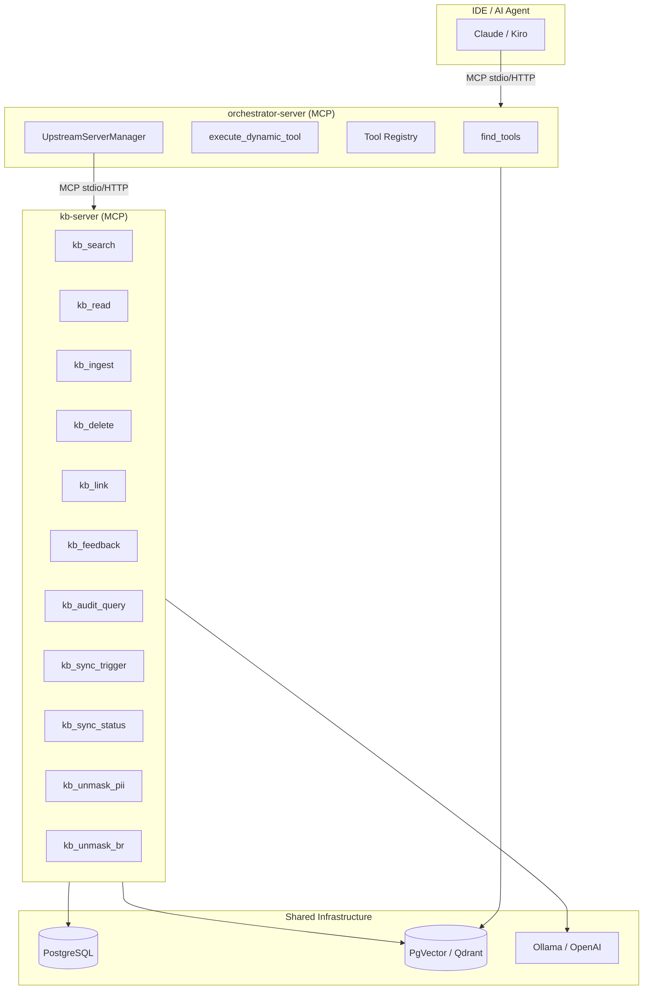

### 2.2 Component Responsibilities

| Component | Responsibility |
|-----------|---------------|
| `orchestrator-server` | MCP tool routing, discovery, execution dispatch, upstream management |
| `kb-server` | KB storage, search, ingestion pipeline, security, audit, sync |
| `orchestrator-core` | Shared config models, exceptions, utilities |
| `orchestrator-client` | Shared clients (embedding, vector DB, upstream connections) |

### 2.3 Communication Pattern

- **Transport**: MCP protocol over stdio (dev) or HTTP Streamable (prod)
- **Discovery**: Orchestrator connects to kb-server as upstream, indexes its 11 tools
- **Execution**: `execute_dynamic_tool` routes KB tool calls to kb-server via `McpConnection`
- **Transparency**: Agents see no difference — tools are discovered via `find_tools` as before


---

## 3. Module Structure (Gradle Multi-Project)

### 3.1 Project Layout

```
MCPOrchestration/
├── orchestrator-core/          # Shared: config, exceptions, utilities
├── orchestrator-client/        # Shared: embedding, vectordb, upstream clients
├── orchestrator-server/        # MCP Orchestrator (tool routing only)
├── orchestrator-bridge/        # Bridge for IDE integration
├── kb-server/                  # ← NEW: Knowledge Base MCP Server
│   ├── build.gradle.kts
│   └── src/
│       ├── main/kotlin/com/orchestrator/mcp/kb/
│       │   ├── KbMain.kt
│       │   ├── KbApplication.kt
│       │   ├── config/
│       │   ├── di/
│       │   ├── protocol/
│       │   ├── store/
│       │   ├── masking/
│       │   ├── segmentation/
│       │   ├── brmasking/
│       │   ├── security/
│       │   ├── audit/
│       │   ├── linking/
│       │   ├── network/
│       │   ├── feedback/
│       │   ├── queue/
│       │   ├── crawler/
│       │   ├── scanner/
│       │   └── ocr/
│       └── main/resources/
│           ├── application.yml
│           └── logback.xml
└── settings.gradle.kts         # include("kb-server")
```

### 3.2 settings.gradle.kts Update

```kotlin
rootProject.name = "mcp-orchestrator"

include("orchestrator-core")
include("orchestrator-client")
include("orchestrator-server")
include("orchestrator-bridge")
include("kb-server")  // ← NEW
```

### 3.3 kb-server/build.gradle.kts

```kotlin
plugins {
    alias(libs.plugins.kotlinJvm)
    alias(libs.plugins.kotlinSerialization)
    alias(libs.plugins.shadow)
    application
}

application {
    mainClass.set("com.orchestrator.mcp.kb.KbMainKt")
}

dependencies {
    // Shared project modules
    implementation(project(":orchestrator-core"))
    implementation(project(":orchestrator-client"))

    // MCP SDK
    implementation(libs.mcp.sdk.server)
    implementation(libs.kotlinx.io.core)

    // Ktor Client (for LLM API calls, Jira API)
    implementation(libs.ktor.client.core)
    implementation(libs.ktor.client.cio)
    implementation(libs.ktor.client.content.negotiation)
    implementation(libs.ktor.serialization.kotlinx.json)

    // KotlinX
    implementation(libs.kotlinx.coroutines.core)
    implementation(libs.kotlinx.serialization.json)
    implementation(libs.kotlinx.datetime)

    // DI
    implementation(libs.koin.core)

    // Database
    implementation(libs.postgresql)
    implementation(libs.hikaricp)

    // LangChain4j (Segmentation + BR Masking)
    implementation("dev.langchain4j:langchain4j:1.0.0-beta1")
    implementation("dev.langchain4j:langchain4j-open-ai:1.0.0-beta1")
    implementation("dev.langchain4j:langchain4j-ollama:1.0.0-beta1")

    // Document Processing
    implementation("org.apache.pdfbox:pdfbox:3.0.4")
    implementation("org.apache.poi:poi-ooxml:5.3.0")

    // Logging
    implementation(libs.logback.classic)

    // YAML
    implementation(libs.kaml)

    // Testing
    testImplementation(libs.junit.jupiter)
    testImplementation(libs.kotest.runner.junit5)
    testImplementation(libs.kotest.assertions.core)
    testImplementation(libs.mockk)
    testImplementation(libs.kotlinx.coroutines.test)
    testImplementation("org.testcontainers:postgresql:1.21.4")
    testImplementation(libs.koin.test)
}

tasks.shadowJar {
    archiveBaseName.set("kb-server")
    archiveClassifier.set("all")
    archiveVersion.set("")
    mergeServiceFiles()
}
```

---

## 4. Package Design

### 4.1 Package Structure

```
com.orchestrator.mcp.kb/
├── KbMain.kt                          # Entry point (stdio/HTTP bootstrap)
├── KbApplication.kt                   # Application lifecycle management
├── config/
│   ├── KbConfig.kt                    # @Serializable KB config data classes
│   └── KbConfigLoader.kt             # YAML config loading
├── di/
│   ├── KbAppModule.kt                 # Root Koin module
│   ├── KbStoreModule.kt              # Store + repository bindings
│   ├── KbPipelineModule.kt           # Masking + segmentation + OCR
│   ├── KbSecurityModule.kt           # RLS + BR access + PII access
│   ├── KbQueueModule.kt              # Queue + worker + watchdog
│   └── KbSyncModule.kt              # Crawler + scanner
├── protocol/
│   ├── KbMcpServerFactory.kt         # Creates MCP Server with KB tools
│   ├── KbToolRegistrar.kt            # Registers all 11 KB tools
│   └── handlers/
│       ├── KbSearchHandler.kt
│       ├── KbReadHandler.kt
│       ├── KbIngestHandler.kt
│       ├── KbDeleteHandler.kt
│       ├── KbLinkHandler.kt
│       ├── KbFeedbackHandler.kt
│       ├── KbAuditHandler.kt
│       ├── KbSyncTriggerHandler.kt
│       ├── KbSyncStatusHandler.kt
│       ├── KbUnmaskPiiHandler.kt
│       └── KbUnmaskBrHandler.kt
├── store/
│   ├── model/
│   │   ├── KbEntry.kt
│   │   ├── PiiMapping.kt
│   │   └── BrSensitivityLevel.kt
│   ├── repository/
│   │   ├── KbEntryRepository.kt
│   │   ├── KbEntryRepositoryImpl.kt
│   │   ├── PiiMappingRepository.kt
│   │   └── PiiMappingRepositoryImpl.kt
│   └── encryption/
│       └── EncryptionService.kt
├── masking/
│   ├── PiiMaskingEngine.kt
│   ├── PiiMaskingEngineImpl.kt
│   ├── model/MaskingResult.kt
│   └── strategy/                      # Strategy pattern implementations
├── segmentation/
│   ├── ContentSegmentationService.kt
│   ├── ContentSegmentationServiceImpl.kt
│   ├── model/SegmentationResult.kt
│   └── provider/ChatModelFactory.kt
├── brmasking/
│   ├── BrMaskingService.kt
│   ├── BrMaskingServiceImpl.kt
│   └── crypto/BrEncryptionService.kt
├── security/
│   ├── RoleContextService.kt
│   ├── RoleContextServiceImpl.kt
│   ├── RlsConnectionWrapper.kt
│   ├── model/KbRole.kt
│   ├── br/
│   │   ├── BrAccessService.kt
│   │   ├── BrDlpService.kt
│   │   ├── BrKeyManagement.kt
│   │   ├── BrRateLimit.kt
│   │   └── BrSession.kt
│   └── pii/
│       └── PiiAccessService.kt
├── audit/
│   ├── AuditService.kt
│   ├── AuditServiceImpl.kt
│   ├── AuditQueryService.kt
│   ├── ResponseShaper.kt
│   ├── model/AuditEvent.kt
│   └── repository/AuditRepository.kt
├── linking/
│   ├── EntityLinkingService.kt
│   ├── EntityLinkingServiceImpl.kt
│   ├── model/EntityLink.kt
│   └── repository/EntityLinkRepository.kt
├── network/
│   ├── NetworkService.kt
│   ├── NetworkServiceImpl.kt
│   └── model/NetworkGraph.kt
├── feedback/
│   ├── FeedbackService.kt
│   ├── FeedbackServiceImpl.kt
│   ├── model/Feedback.kt
│   └── repository/FeedbackRepository.kt
├── queue/
│   ├── QueueService.kt
│   ├── QueueServiceImpl.kt
│   ├── DualPriorityQueue.kt
│   ├── QueueWorker.kt
│   ├── QueueWatchdog.kt
│   ├── CrashRecoveryService.kt
│   ├── TaskHandler.kt
│   ├── QueueExceptions.kt
│   ├── model/
│   │   ├── QueueTask.kt
│   │   ├── Priority.kt
│   │   └── TaskStatus.kt
│   └── repository/
│       └── QueueTaskRepository.kt
├── crawler/
│   ├── TicketCrawler.kt
│   ├── TicketCrawlerImpl.kt
│   ├── KBIngestor.kt
│   ├── ContentFetcher.kt
│   ├── AdfParser.kt
│   └── GraphBuilder.kt
├── scanner/
│   ├── ProjectScanner.kt
│   ├── ProjectScannerImpl.kt
│   ├── PageFetcher.kt
│   ├── BatchUpserter.kt
│   └── JqlBuilder.kt
└── ocr/
    ├── OcrService.kt
    ├── OcrServiceImpl.kt
    └── extractor/ImageTextExtractor.kt
```

### 4.2 Package Mapping (Migration)

| Source (orchestrator-server) | Target (kb-server) |
|------------------------------|-------------------|
| `com.orchestrator.mcp.kbstore.*` | `com.orchestrator.mcp.kb.store.*` |
| `com.orchestrator.mcp.masking.*` | `com.orchestrator.mcp.kb.masking.*` |
| `com.orchestrator.mcp.segmentation.*` | `com.orchestrator.mcp.kb.segmentation.*` |
| `com.orchestrator.mcp.brmasking.*` | `com.orchestrator.mcp.kb.brmasking.*` |
| `com.orchestrator.mcp.security.*` | `com.orchestrator.mcp.kb.security.*` |
| `com.orchestrator.mcp.audit.*` | `com.orchestrator.mcp.kb.audit.*` |
| `com.orchestrator.mcp.linking.*` | `com.orchestrator.mcp.kb.linking.*` |
| `com.orchestrator.mcp.network.*` | `com.orchestrator.mcp.kb.network.*` |
| `com.orchestrator.mcp.feedback.*` | `com.orchestrator.mcp.kb.feedback.*` |
| `com.orchestrator.mcp.queue.*` | `com.orchestrator.mcp.kb.queue.*` |
| `com.orchestrator.mcp.crawler.*` | `com.orchestrator.mcp.kb.crawler.*` |
| `com.orchestrator.mcp.scanner.*` | `com.orchestrator.mcp.kb.scanner.*` |
| `com.orchestrator.mcp.ocr.*` | `com.orchestrator.mcp.kb.ocr.*` |


---

## 5. Class Design

### 5.1 Entry Point & Application Lifecycle

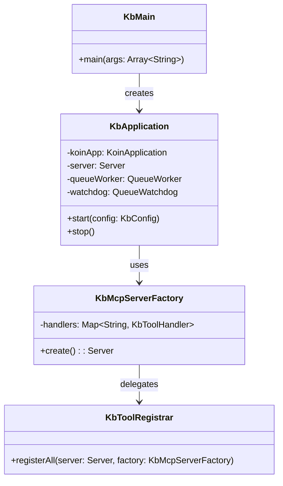

#### KbMain.kt

```kotlin
package com.orchestrator.mcp.kb

fun main(args: Array<String>) {
    val configPath = args.firstOrNull { it.startsWith("--config=") }
        ?.removePrefix("--config=")
    val transport = args.firstOrNull { it.startsWith("--transport=") }
        ?.removePrefix("--transport=") ?: "stdio"

    val app = KbApplication()
    app.start(configPath, transport)
}
```

#### KbApplication.kt

```kotlin
package com.orchestrator.mcp.kb

import com.orchestrator.mcp.kb.config.KbConfigLoader
import com.orchestrator.mcp.kb.di.kbAppModule
import com.orchestrator.mcp.kb.protocol.KbMcpServerFactory
import com.orchestrator.mcp.kb.queue.CrashRecoveryService
import com.orchestrator.mcp.kb.queue.QueueWatchdog
import com.orchestrator.mcp.kb.queue.QueueWorker
import io.modelcontextprotocol.kotlin.sdk.server.StdioServerTransport
import kotlinx.coroutines.runBlocking
import org.koin.core.context.startKoin
import org.koin.core.context.stopKoin
import org.slf4j.LoggerFactory

class KbApplication {
    private val logger = LoggerFactory.getLogger(KbApplication::class.java)

    fun start(configPath: String?, transport: String) {
        val config = KbConfigLoader.load(configPath)

        val koinApp = startKoin { modules(kbAppModule(config)) }
        val koin = koinApp.koin

        // Crash recovery before worker starts (BR-17)
        val crashRecovery = koin.get<CrashRecoveryService>()
        runBlocking { crashRecovery.recover() }

        // Start queue worker and watchdog
        val worker = koin.get<QueueWorker>()
        val watchdog = koin.get<QueueWatchdog>()
        worker.start()
        watchdog.start()

        // Create and start MCP server
        val serverFactory = koin.get<KbMcpServerFactory>()
        val server = serverFactory.create()

        when (transport) {
            "stdio" -> startStdio(server)
            "http" -> startHttp(server, config.server.port)
            else -> error("Unknown transport: $transport")
        }
    }

    private fun startStdio(server: io.modelcontextprotocol.kotlin.sdk.server.Server) {
        val transport = StdioServerTransport()
        runBlocking {
            server.connect(transport)
            logger.info("KB Server started (stdio transport)")
            // Block until transport closes
            transport.awaitClose()
        }
    }

    private fun startHttp(server: io.modelcontextprotocol.kotlin.sdk.server.Server, port: Int) {
        // HTTP Streamable transport (similar to orchestrator-server)
        logger.info("KB Server started (HTTP transport, port=$port)")
        // Implementation uses Ktor server with MCP HTTP Streamable
    }
}
```

### 5.2 MCP Server Factory & Tool Registration

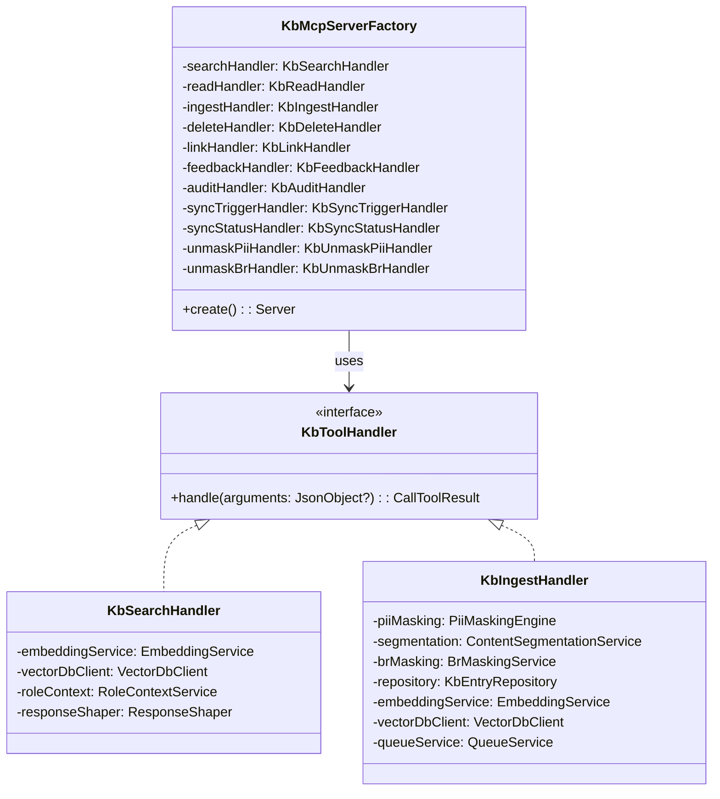

#### KbMcpServerFactory.kt

```kotlin
package com.orchestrator.mcp.kb.protocol

import io.modelcontextprotocol.kotlin.sdk.server.Server
import io.modelcontextprotocol.kotlin.sdk.server.ServerOptions
import io.modelcontextprotocol.kotlin.sdk.types.*
import kotlinx.serialization.json.*
import org.slf4j.LoggerFactory

class KbMcpServerFactory(
    private val searchHandler: KbSearchHandler,
    private val readHandler: KbReadHandler,
    private val ingestHandler: KbIngestHandler,
    private val deleteHandler: KbDeleteHandler,
    private val linkHandler: KbLinkHandler,
    private val feedbackHandler: KbFeedbackHandler,
    private val auditHandler: KbAuditHandler,
    private val syncTriggerHandler: KbSyncTriggerHandler,
    private val syncStatusHandler: KbSyncStatusHandler,
    private val unmaskPiiHandler: KbUnmaskPiiHandler,
    private val unmaskBrHandler: KbUnmaskBrHandler
) {
    private val logger = LoggerFactory.getLogger(KbMcpServerFactory::class.java)

    fun create(): Server {
        val server = Server(
            serverInfo = Implementation(name = "kb-server", version = "1.0.0"),
            options = ServerOptions(
                capabilities = ServerCapabilities(
                    tools = ServerCapabilities.Tools(listChanged = false)
                )
            )
        )

        KbToolRegistrar.registerAll(server, this)
        logger.info("KB MCP Server created with 11 tools registered")
        return server
    }

    // Handler accessors for KbToolRegistrar
    internal fun handlers() = mapOf(
        "kb_search" to searchHandler,
        "kb_read" to readHandler,
        "kb_ingest" to ingestHandler,
        "kb_delete" to deleteHandler,
        "kb_link" to linkHandler,
        "kb_feedback" to feedbackHandler,
        "kb_audit_query" to auditHandler,
        "kb_sync_trigger" to syncTriggerHandler,
        "kb_sync_status" to syncStatusHandler,
        "kb_unmask_pii" to unmaskPiiHandler,
        "kb_unmask_br" to unmaskBrHandler
    )
}
```

### 5.3 Queue System Class Design

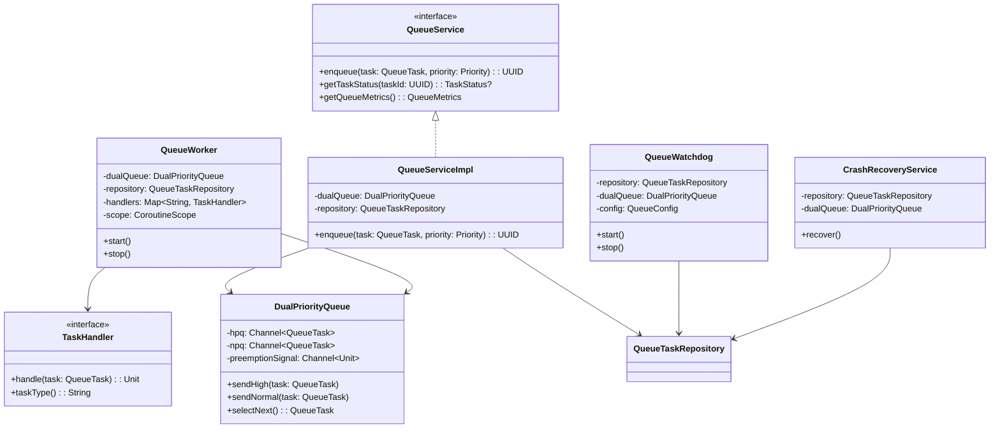

### 5.4 Security & Access Control

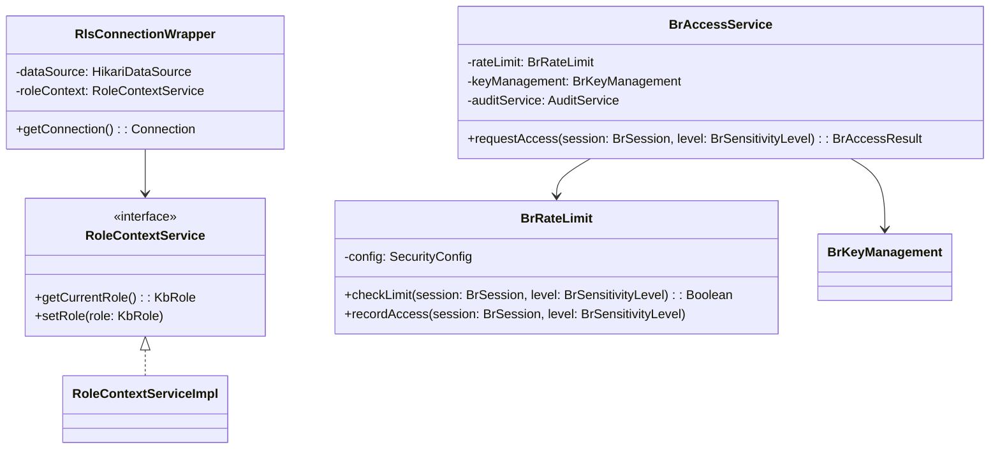


---

## 6. MCP Tool Specifications (API Design)

### 6.1 Tool Overview

| # | Tool Name | Category | Description |
|---|-----------|----------|-------------|
| 1 | `kb_search` | Read | Semantic search KB entries by query text |
| 2 | `kb_read` | Read | Read a specific KB entry by issue_key |
| 3 | `kb_ingest` | Write | Ingest content into KB (handles masking + segmentation) |
| 4 | `kb_delete` | Write | Delete a KB entry by issue_key |
| 5 | `kb_link` | Read | Find semantically similar entries |
| 6 | `kb_feedback` | Write | Submit feedback on a KB entry |
| 7 | `kb_audit_query` | Read | Query audit logs (admin only) |
| 8 | `kb_sync_trigger` | Write | Trigger Jira project sync |
| 9 | `kb_sync_status` | Read | Check sync progress |
| 10 | `kb_unmask_pii` | Read (restricted) | Unmask PII for authorized users |
| 11 | `kb_unmask_br` | Read (restricted) | Unmask business rules for authorized users |

### 6.2 Tool: kb_search

**Input Schema:**

```json
{
  "name": "kb_search",
  "description": "Search knowledge base entries semantically. Returns matching entries ranked by relevance. Content is filtered by caller's role (RLS).",
  "inputSchema": {
    "type": "object",
    "properties": {
      "query": {
        "type": "string",
        "description": "Natural language search query",
        "maxLength": 2000
      },
      "project_key": {
        "type": "string",
        "description": "Filter by Jira project key (optional)"
      },
      "top_k": {
        "type": "integer",
        "default": 5,
        "minimum": 1,
        "maximum": 20,
        "description": "Maximum number of results to return"
      },
      "include_technical": {
        "type": "boolean",
        "default": true,
        "description": "Include technical/code content in results"
      },
      "tags": {
        "type": "string",
        "description": "Comma-separated tags to filter by"
      }
    },
    "required": ["query"]
  }
}
```

**Success Response:**

```json
{
  "content": [{
    "type": "text",
    "text": "{\"results\":[{\"issue_key\":\"MTO-25\",\"title\":\"KB Refinery BRD\",\"content\":\"...\",\"score\":0.92,\"tags\":[\"brd\",\"kb\"],\"created_at\":\"2026-05-08T10:00:00Z\"}],\"total\":1}"
  }],
  "isError": false
}
```

**Error Response:**

```json
{
  "content": [{"type": "text", "text": "{\"error\":{\"code\":\"KB_VALIDATION_ERROR\",\"message\":\"Query must not be empty\"}}"}],
  "isError": true
}
```

### 6.3 Tool: kb_read

**Input Schema:**

```json
{
  "name": "kb_read",
  "description": "Read a specific KB entry by issue key. Returns content filtered by caller's role.",
  "inputSchema": {
    "type": "object",
    "properties": {
      "issue_key": {
        "type": "string",
        "description": "Jira issue key (e.g., MTO-25)"
      },
      "include_links": {
        "type": "boolean",
        "default": false,
        "description": "Include semantically linked entries"
      },
      "include_feedback": {
        "type": "boolean",
        "default": false,
        "description": "Include feedback/corrections for this entry"
      }
    },
    "required": ["issue_key"]
  }
}
```

**Success Response:**

```json
{
  "content": [{
    "type": "text",
    "text": "{\"entry\":{\"issue_key\":\"MTO-25\",\"title\":\"KB Refinery BRD\",\"content\":\"...\",\"tags\":[\"brd\"],\"created_at\":\"2026-05-08T10:00:00Z\",\"last_synced_at\":\"2026-05-10T08:00:00Z\"},\"links\":[],\"feedback\":[]}"
  }],
  "isError": false
}
```

### 6.4 Tool: kb_ingest

**Input Schema:**

```json
{
  "name": "kb_ingest",
  "description": "Ingest content into the knowledge base. Handles PII masking, content segmentation, BR masking, embedding generation, and vector indexing automatically.",
  "inputSchema": {
    "type": "object",
    "properties": {
      "title": {
        "type": "string",
        "description": "Entry title (e.g., 'MTO-25 BRD — KB Refinery')"
      },
      "content": {
        "type": "string",
        "description": "Full content to ingest (markdown, plain text, etc.)"
      },
      "issue_key": {
        "type": "string",
        "description": "Jira issue key for linking"
      },
      "tags": {
        "type": "string",
        "description": "Comma-separated tags (e.g., 'brd, kb, architecture')"
      },
      "priority": {
        "type": "string",
        "enum": ["high", "normal"],
        "default": "normal",
        "description": "Queue priority for processing"
      }
    },
    "required": ["title", "content"]
  }
}
```

**Success Response:**

```json
{
  "content": [{
    "type": "text",
    "text": "{\"status\":\"queued\",\"task_id\":\"550e8400-e29b-41d4-a716-446655440000\",\"priority\":\"normal\",\"message\":\"Content queued for ingestion\"}"
  }],
  "isError": false
}
```

### 6.5 Tool: kb_delete

**Input Schema:**

```json
{
  "name": "kb_delete",
  "description": "Delete a KB entry by issue key. Removes from database and vector index.",
  "inputSchema": {
    "type": "object",
    "properties": {
      "issue_key": {
        "type": "string",
        "description": "Jira issue key of entry to delete"
      }
    },
    "required": ["issue_key"]
  }
}
```

### 6.6 Tool: kb_link

**Input Schema:**

```json
{
  "name": "kb_link",
  "description": "Find semantically similar KB entries to a given entry or query. Uses vector similarity for entity linking.",
  "inputSchema": {
    "type": "object",
    "properties": {
      "issue_key": {
        "type": "string",
        "description": "Find entries similar to this issue"
      },
      "query": {
        "type": "string",
        "description": "Or find entries similar to this text query"
      },
      "top_k": {
        "type": "integer",
        "default": 5,
        "description": "Maximum number of similar entries"
      },
      "min_score": {
        "type": "number",
        "default": 0.7,
        "description": "Minimum similarity score threshold"
      }
    }
  }
}
```

### 6.7 Tool: kb_feedback

**Input Schema:**

```json
{
  "name": "kb_feedback",
  "description": "Submit feedback or correction for a KB entry. Used by agents to improve KB quality.",
  "inputSchema": {
    "type": "object",
    "properties": {
      "issue_key": {
        "type": "string",
        "description": "Issue key of the entry to provide feedback on"
      },
      "feedback_type": {
        "type": "string",
        "enum": ["correction", "outdated", "incomplete", "positive"],
        "description": "Type of feedback"
      },
      "content": {
        "type": "string",
        "description": "Feedback details or corrected content"
      },
      "agent_name": {
        "type": "string",
        "description": "Name of the agent providing feedback"
      }
    },
    "required": ["issue_key", "feedback_type", "content"]
  }
}
```

### 6.8 Tool: kb_audit_query

**Input Schema:**

```json
{
  "name": "kb_audit_query",
  "description": "Query audit logs for KB access events. Restricted to admin role.",
  "inputSchema": {
    "type": "object",
    "properties": {
      "event_type": {
        "type": "string",
        "enum": ["search", "read", "ingest", "delete", "unmask_pii", "unmask_br"],
        "description": "Filter by event type"
      },
      "issue_key": {
        "type": "string",
        "description": "Filter by issue key"
      },
      "from_date": {
        "type": "string",
        "description": "Start date (ISO 8601)"
      },
      "to_date": {
        "type": "string",
        "description": "End date (ISO 8601)"
      },
      "limit": {
        "type": "integer",
        "default": 50,
        "description": "Maximum number of audit events"
      }
    }
  }
}
```

### 6.9 Tool: kb_sync_trigger

**Input Schema:**

```json
{
  "name": "kb_sync_trigger",
  "description": "Trigger a Jira project sync to update KB entries from Jira tickets.",
  "inputSchema": {
    "type": "object",
    "properties": {
      "project_key": {
        "type": "string",
        "description": "Jira project key to sync (e.g., 'MTO')"
      },
      "full_sync": {
        "type": "boolean",
        "default": false,
        "description": "Force full re-sync (ignores last_synced_at)"
      },
      "priority": {
        "type": "string",
        "enum": ["high", "normal"],
        "default": "normal",
        "description": "Queue priority for sync tasks"
      }
    },
    "required": ["project_key"]
  }
}
```

### 6.10 Tool: kb_sync_status

**Input Schema:**

```json
{
  "name": "kb_sync_status",
  "description": "Check the current sync progress and queue status.",
  "inputSchema": {
    "type": "object",
    "properties": {
      "project_key": {
        "type": "string",
        "description": "Filter by project key (optional)"
      }
    }
  }
}
```

**Success Response:**

```json
{
  "content": [{
    "type": "text",
    "text": "{\"queue\":{\"hpq_depth\":2,\"npq_depth\":45,\"processing\":1,\"completed_today\":120,\"failed_today\":3},\"sync\":{\"last_sync\":\"2026-05-10T08:00:00Z\",\"status\":\"idle\",\"tickets_synced\":450}}"
  }],
  "isError": false
}
```

### 6.11 Tool: kb_unmask_pii

**Input Schema:**

```json
{
  "name": "kb_unmask_pii",
  "description": "Unmask PII data for a specific KB entry. Requires elevated permissions. Rate-limited and audited.",
  "inputSchema": {
    "type": "object",
    "properties": {
      "issue_key": {
        "type": "string",
        "description": "Issue key containing masked PII"
      },
      "pii_token": {
        "type": "string",
        "description": "Specific PII token to unmask (e.g., '[EMAIL_1]')"
      },
      "reason": {
        "type": "string",
        "description": "Business justification for unmasking"
      }
    },
    "required": ["issue_key", "pii_token", "reason"]
  }
}
```

### 6.12 Tool: kb_unmask_br

**Input Schema:**

```json
{
  "name": "kb_unmask_br",
  "description": "Unmask business rules for a specific KB entry. Requires BR access session. Rate-limited and audited.",
  "inputSchema": {
    "type": "object",
    "properties": {
      "issue_key": {
        "type": "string",
        "description": "Issue key containing masked business rules"
      },
      "session_token": {
        "type": "string",
        "description": "BR access session token"
      },
      "sensitivity_level": {
        "type": "integer",
        "minimum": 1,
        "maximum": 3,
        "description": "BR sensitivity level to unmask (1=low, 2=medium, 3=high)"
      },
      "reason": {
        "type": "string",
        "description": "Business justification for unmasking"
      }
    },
    "required": ["issue_key", "session_token", "sensitivity_level", "reason"]
  }
}
```


---

## 7. Database Design

### 7.1 Schema Strategy

**Phase 1:** Shared PostgreSQL instance, KB tables in `kb` schema.

```sql
CREATE SCHEMA IF NOT EXISTS kb;
```

### 7.2 DDL — KB Tables

#### kb.kb_entries

```sql
CREATE TABLE kb.kb_entries (
    id              BIGSERIAL PRIMARY KEY,
    issue_key       VARCHAR(50) NOT NULL,
    project_key     VARCHAR(20) NOT NULL,
    title           VARCHAR(500) NOT NULL,
    content         TEXT NOT NULL,
    content_hash    VARCHAR(64) NOT NULL,
    tags            TEXT[],
    business_rules  TEXT,                    -- AES-256-GCM encrypted
    br_level        SMALLINT DEFAULT 0,      -- 0=none, 1=low, 2=medium, 3=high
    created_at      TIMESTAMPTZ NOT NULL DEFAULT NOW(),
    updated_at      TIMESTAMPTZ NOT NULL DEFAULT NOW(),
    last_synced_at  TIMESTAMPTZ,
    source_type     VARCHAR(20) DEFAULT 'manual', -- manual, jira_sync, api
    CONSTRAINT uq_kb_entries_issue_key UNIQUE (issue_key)
);

CREATE INDEX idx_kb_entries_project ON kb.kb_entries(project_key);
CREATE INDEX idx_kb_entries_tags ON kb.kb_entries USING GIN(tags);
CREATE INDEX idx_kb_entries_content_hash ON kb.kb_entries(project_key, content_hash);
CREATE INDEX idx_kb_entries_updated ON kb.kb_entries(updated_at DESC);
```

#### kb.pii_mapping

```sql
CREATE TABLE kb.pii_mapping (
    id              BIGSERIAL PRIMARY KEY,
    issue_key       VARCHAR(50) NOT NULL,
    pii_token       VARCHAR(50) NOT NULL,     -- e.g., [EMAIL_1], [PHONE_2]
    original_value  TEXT NOT NULL,             -- AES-256-GCM encrypted
    pii_type        VARCHAR(30) NOT NULL,      -- email, phone, bank_account, id_card, name
    created_at      TIMESTAMPTZ NOT NULL DEFAULT NOW(),
    CONSTRAINT uq_pii_mapping UNIQUE (issue_key, pii_token)
);

CREATE INDEX idx_pii_mapping_issue ON kb.pii_mapping(issue_key);
```

#### kb.queue_tasks

```sql
CREATE TABLE kb.queue_tasks (
    task_id         UUID PRIMARY KEY DEFAULT gen_random_uuid(),
    task_type       VARCHAR(100) NOT NULL,
    payload         JSONB NOT NULL,
    status          VARCHAR(20) NOT NULL DEFAULT 'Pending',
    priority        VARCHAR(10) NOT NULL DEFAULT 'Normal',
    created_at      TIMESTAMPTZ NOT NULL DEFAULT NOW(),
    started_at      TIMESTAMPTZ,
    completed_at    TIMESTAMPTZ,
    retry_count     INTEGER NOT NULL DEFAULT 0,
    error_message   TEXT,
    worker_id       VARCHAR(50),
    CONSTRAINT chk_status CHECK (status IN ('Pending', 'Processing', 'Completed', 'Failed')),
    CONSTRAINT chk_priority CHECK (priority IN ('High', 'Normal'))
);

CREATE INDEX idx_queue_tasks_status ON kb.queue_tasks(status);
CREATE INDEX idx_queue_tasks_priority_status ON kb.queue_tasks(priority, status);
CREATE INDEX idx_queue_tasks_stuck ON kb.queue_tasks(status, started_at)
    WHERE status = 'Processing';
```

#### kb.entity_links

```sql
CREATE TABLE kb.entity_links (
    id              BIGSERIAL PRIMARY KEY,
    source_key      VARCHAR(50) NOT NULL,
    target_key      VARCHAR(50) NOT NULL,
    link_type       VARCHAR(30) NOT NULL,     -- semantic, explicit, dependency
    score           REAL NOT NULL,
    created_at      TIMESTAMPTZ NOT NULL DEFAULT NOW(),
    CONSTRAINT uq_entity_link UNIQUE (source_key, target_key, link_type)
);

CREATE INDEX idx_entity_links_source ON kb.entity_links(source_key);
CREATE INDEX idx_entity_links_target ON kb.entity_links(target_key);
```

#### kb.pii_access_audit

```sql
CREATE TABLE kb.pii_access_audit (
    id              BIGSERIAL PRIMARY KEY,
    issue_key       VARCHAR(50) NOT NULL,
    pii_token       VARCHAR(50) NOT NULL,
    accessed_by     VARCHAR(100) NOT NULL,
    access_reason   TEXT NOT NULL,
    accessed_at     TIMESTAMPTZ NOT NULL DEFAULT NOW(),
    ip_address      VARCHAR(45)
);

CREATE INDEX idx_pii_audit_issue ON kb.pii_access_audit(issue_key);
CREATE INDEX idx_pii_audit_date ON kb.pii_access_audit(accessed_at DESC);
```

#### kb.br_access_audit

```sql
CREATE TABLE kb.br_access_audit (
    id              BIGSERIAL PRIMARY KEY,
    issue_key       VARCHAR(50) NOT NULL,
    sensitivity_level SMALLINT NOT NULL,
    session_id      VARCHAR(100) NOT NULL,
    accessed_by     VARCHAR(100) NOT NULL,
    access_reason   TEXT NOT NULL,
    accessed_at     TIMESTAMPTZ NOT NULL DEFAULT NOW(),
    result          VARCHAR(20) NOT NULL      -- granted, denied, rate_limited
);

CREATE INDEX idx_br_audit_session ON kb.br_access_audit(session_id);
CREATE INDEX idx_br_audit_date ON kb.br_access_audit(accessed_at DESC);
```

#### kb.feedback

```sql
CREATE TABLE kb.feedback (
    id              BIGSERIAL PRIMARY KEY,
    issue_key       VARCHAR(50) NOT NULL,
    feedback_type   VARCHAR(20) NOT NULL,     -- correction, outdated, incomplete, positive
    content         TEXT NOT NULL,
    agent_name      VARCHAR(50),
    status          VARCHAR(20) NOT NULL DEFAULT 'pending', -- pending, applied, rejected
    created_at      TIMESTAMPTZ NOT NULL DEFAULT NOW(),
    resolved_at     TIMESTAMPTZ
);

CREATE INDEX idx_feedback_issue ON kb.feedback(issue_key);
CREATE INDEX idx_feedback_status ON kb.feedback(status);
```

### 7.3 Row-Level Security (RLS)

```sql
-- Enable RLS on kb_entries
ALTER TABLE kb.kb_entries ENABLE ROW LEVEL SECURITY;

-- Policy: Developers can read all non-BR content
CREATE POLICY kb_developer_read ON kb.kb_entries
    FOR SELECT
    USING (
        current_setting('kb.role', true) IN ('developer', 'admin', 'ba', 'qa')
        OR br_level = 0
    );

-- Policy: Only admin/ba can see BR content
CREATE POLICY kb_br_read ON kb.kb_entries
    FOR SELECT
    USING (
        current_setting('kb.role', true) IN ('admin', 'ba')
        OR br_level = 0
    );

-- Policy: Only admin can delete
CREATE POLICY kb_admin_delete ON kb.kb_entries
    FOR DELETE
    USING (current_setting('kb.role', true) = 'admin');
```

### 7.4 Migration Script (Phase 1)

```sql
-- V1__create_kb_schema.sql (Flyway or manual)
BEGIN;

CREATE SCHEMA IF NOT EXISTS kb;

-- Move existing tables if they exist in public schema
DO $$
BEGIN
    IF EXISTS (SELECT 1 FROM information_schema.tables WHERE table_schema = 'public' AND table_name = 'kb_entries') THEN
        ALTER TABLE public.kb_entries SET SCHEMA kb;
    END IF;
    IF EXISTS (SELECT 1 FROM information_schema.tables WHERE table_schema = 'public' AND table_name = 'pii_mapping') THEN
        ALTER TABLE public.pii_mapping SET SCHEMA kb;
    END IF;
    IF EXISTS (SELECT 1 FROM information_schema.tables WHERE table_schema = 'public' AND table_name = 'queue_tasks') THEN
        ALTER TABLE public.queue_tasks SET SCHEMA kb;
    END IF;
    IF EXISTS (SELECT 1 FROM information_schema.tables WHERE table_schema = 'public' AND table_name = 'entity_links') THEN
        ALTER TABLE public.entity_links SET SCHEMA kb;
    END IF;
    IF EXISTS (SELECT 1 FROM information_schema.tables WHERE table_schema = 'public' AND table_name = 'feedback') THEN
        ALTER TABLE public.feedback SET SCHEMA kb;
    END IF;
END $$;

COMMIT;
```

### 7.5 Task State Diagram

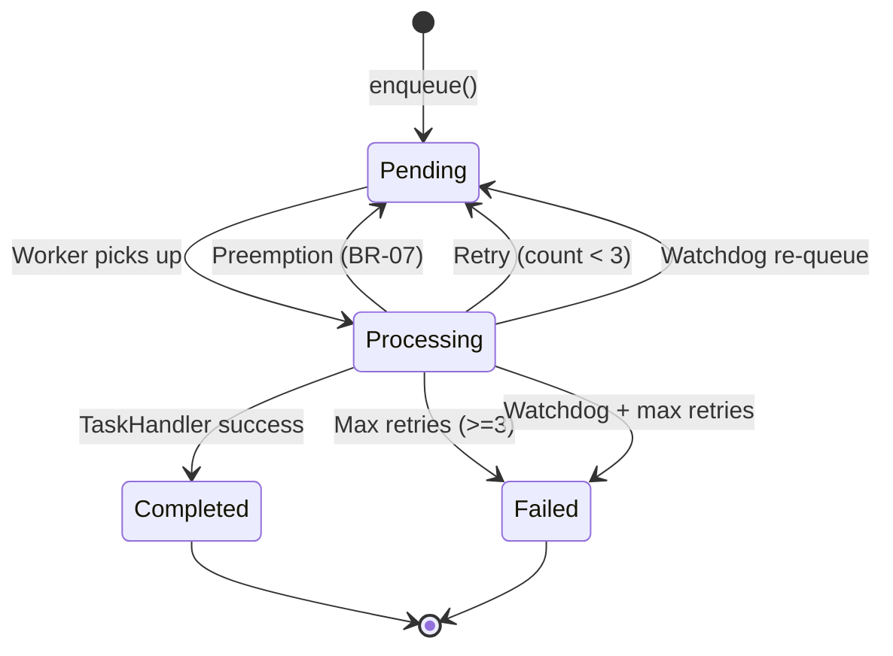


---

## 8. Sequence Diagrams

### 8.1 KB Search Flow

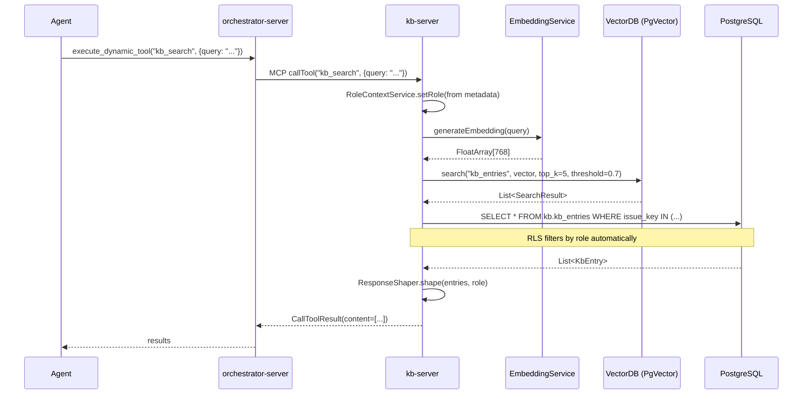

### 8.2 KB Ingest Flow (via Queue)

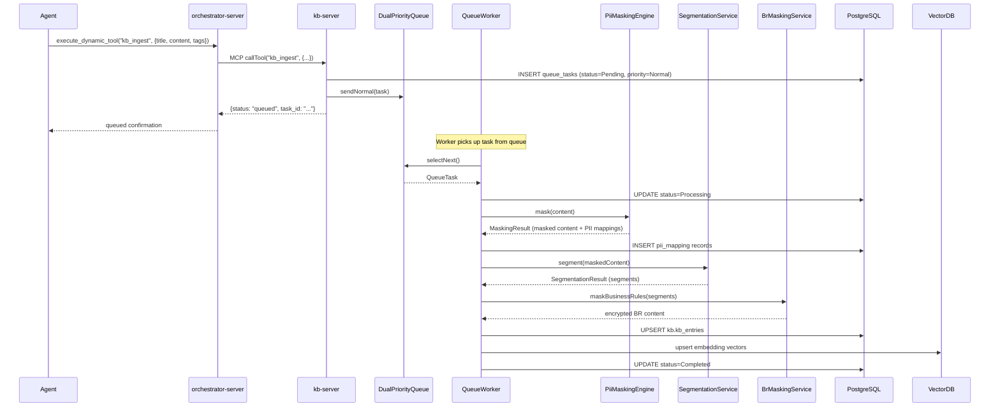

### 8.3 Preemption Flow

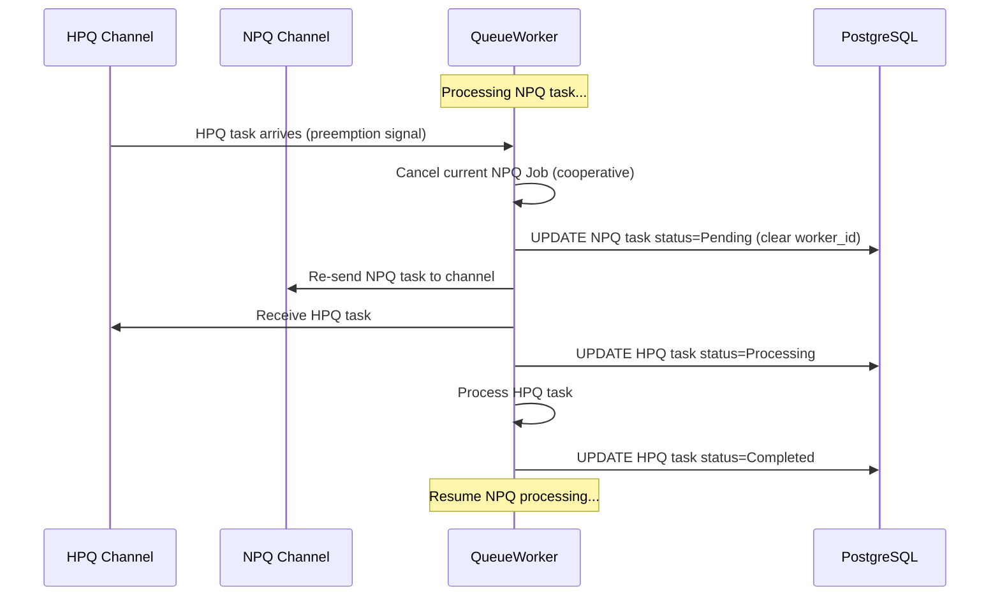

### 8.4 Crash Recovery Flow

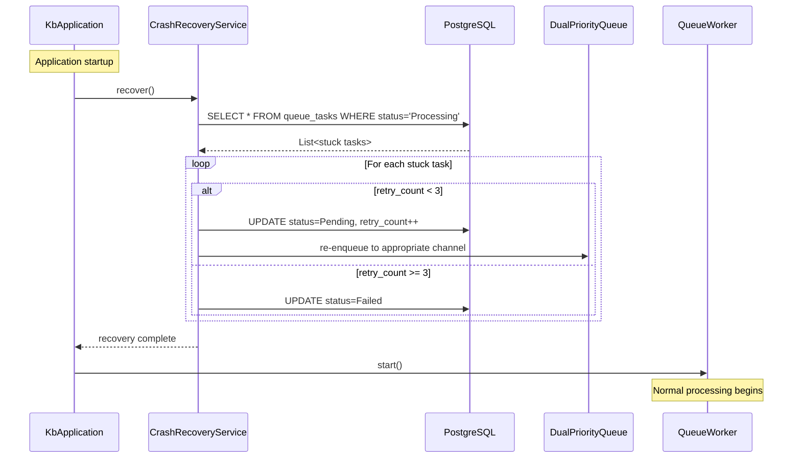

### 8.5 Unmask PII Flow

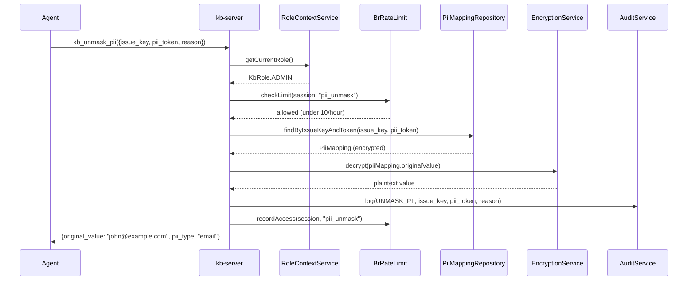


---

## 9. Configuration Design

### 9.1 KB Server Configuration (application.yml)

```yaml
kb:
  server:
    port: 8081
    transport: stdio  # stdio | http

  database:
    url: "jdbc:postgresql://localhost:5432/mcp_orchestrator"
    schema: "kb"
    username: "${KB_DB_USER:kb_app}"
    password: "${KB_DB_PASSWORD}"
    pool:
      maximum_size: 10
      minimum_idle: 2
      idle_timeout_ms: 600000
      connection_timeout_ms: 30000

  embedding:
    provider: "ollama"  # openai | ollama | lmstudio
    model: "nomic-embed-text"
    base_url: "http://localhost:11434"
    dimensions: 768
    cache_enabled: true
    cache_max_size: 200
    cache_ttl_minutes: 10

  vector_db:
    provider: "pgvector"  # pgvector | qdrant
    collection_name: "kb_entries"
    # PgVector uses same DB connection
    # Qdrant config (if provider=qdrant):
    host: "localhost"
    port: 6333

  segmentation:
    provider: "ollama"
    model_name: "llama3"
    temperature: 0.1
    timeout_seconds: 30
    max_segment_length: 2000
    br_local_only: true

  masking:
    strategies:
      - email
      - phone
      - bank_account
      - id_card
      - name
    placeholder_format: "[{TYPE}_{INDEX}]"

  security:
    encryption_key: "${KB_ENCRYPTION_KEY}"
    br_encryption_key: "${BR_ENCRYPTION_KEY}"
    default_role: "developer"
    session_ttl_minutes: 30
    rate_limit:
      pii_unmask_per_hour: 10
      br_level1_per_hour: 5
      br_level2_per_hour: 15
      br_level3_per_hour: 30

  queue:
    hpq_capacity: 100
    npq_capacity: 1000
    worker_count: 2
    watchdog_interval_seconds: 60
    stuck_threshold_minutes: 5
    max_retries: 3
    base_delay_ms: 1000

  sync:
    jira_base_url: "${JIRA_BASE_URL}"
    jira_token: "${JIRA_API_TOKEN}"
    jira_email: "${JIRA_EMAIL}"
    batch_size: 50
    rate_limit_per_second: 5

  audit:
    enabled: true
    retention_days: 90
```

### 9.2 KbConfig Data Classes

```kotlin
package com.orchestrator.mcp.kb.config

import kotlinx.serialization.SerialName
import kotlinx.serialization.Serializable

@Serializable
data class KbConfig(
    val kb: KbSettings = KbSettings()
)

@Serializable
data class KbSettings(
    val server: KbServerConfig = KbServerConfig(),
    val database: KbDatabaseConfig = KbDatabaseConfig(),
    val embedding: KbEmbeddingConfig = KbEmbeddingConfig(),
    @SerialName("vector_db")
    val vectorDb: KbVectorDbConfig = KbVectorDbConfig(),
    val segmentation: KbSegmentationConfig = KbSegmentationConfig(),
    val masking: KbMaskingConfig = KbMaskingConfig(),
    val security: KbSecurityConfig = KbSecurityConfig(),
    val queue: KbQueueConfig = KbQueueConfig(),
    val sync: KbSyncConfig = KbSyncConfig(),
    val audit: KbAuditConfig = KbAuditConfig()
)

@Serializable
data class KbServerConfig(
    val port: Int = 8081,
    val transport: String = "stdio"
)

@Serializable
data class KbDatabaseConfig(
    val url: String = "jdbc:postgresql://localhost:5432/mcp_orchestrator",
    val schema: String = "kb",
    val username: String = "kb_app",
    val password: String = "",
    val pool: KbPoolConfig = KbPoolConfig()
)

@Serializable
data class KbPoolConfig(
    @SerialName("maximum_size")
    val maximumSize: Int = 10,
    @SerialName("minimum_idle")
    val minimumIdle: Int = 2,
    @SerialName("idle_timeout_ms")
    val idleTimeoutMs: Long = 600000,
    @SerialName("connection_timeout_ms")
    val connectionTimeoutMs: Long = 30000
)

@Serializable
data class KbQueueConfig(
    @SerialName("hpq_capacity")
    val hpqCapacity: Int = 100,
    @SerialName("npq_capacity")
    val npqCapacity: Int = 1000,
    @SerialName("worker_count")
    val workerCount: Int = 2,
    @SerialName("watchdog_interval_seconds")
    val watchdogIntervalSeconds: Int = 60,
    @SerialName("stuck_threshold_minutes")
    val stuckThresholdMinutes: Int = 5,
    @SerialName("max_retries")
    val maxRetries: Int = 3,
    @SerialName("base_delay_ms")
    val baseDelayMs: Long = 1000
)

@Serializable
data class KbSecurityConfig(
    @SerialName("encryption_key")
    val encryptionKey: String = "",
    @SerialName("br_encryption_key")
    val brEncryptionKey: String = "",
    @SerialName("default_role")
    val defaultRole: String = "developer",
    @SerialName("session_ttl_minutes")
    val sessionTtlMinutes: Int = 30,
    @SerialName("rate_limit")
    val rateLimit: KbRateLimitConfig = KbRateLimitConfig()
)

@Serializable
data class KbRateLimitConfig(
    @SerialName("pii_unmask_per_hour")
    val piiUnmaskPerHour: Int = 10,
    @SerialName("br_level1_per_hour")
    val brLevel1PerHour: Int = 5,
    @SerialName("br_level2_per_hour")
    val brLevel2PerHour: Int = 15,
    @SerialName("br_level3_per_hour")
    val brLevel3PerHour: Int = 30
)
```

### 9.3 Orchestrator Configuration Update

Add kb-server as upstream in orchestrator's `application.yml`:

```yaml
orchestrator:
  upstream_servers:
    # ... existing servers ...
    - name: "kb-server"
      transport: "stdio"
      command: "java"
      args: ["-jar", "kb-server/build/libs/kb-server-all.jar", "--transport=stdio"]
      # For HTTP mode:
      # transport: "http"
      # url: "http://localhost:8081/mcp"
```


---

## 10. Error Handling Strategy

### 10.1 Exception Hierarchy (kb-server)

```kotlin
package com.orchestrator.mcp.kb

/**
 * Sealed exception hierarchy for KB Server.
 * Maps to MCP error responses with specific error codes.
 */
sealed class KbException(
    val errorCode: String,
    override val message: String,
    override val cause: Throwable? = null
) : Exception(message, cause)

class KbNotFoundException(issueKey: String) :
    KbException("KB_NOT_FOUND", "No entry found for '$issueKey'")

class KbAccessDeniedException(reason: String) :
    KbException("KB_ACCESS_DENIED", "Access denied: $reason")

class KbRateLimitedException(limit: Int, window: String) :
    KbException("KB_RATE_LIMITED", "Rate limit exceeded: $limit per $window")

class KbValidationException(details: String) :
    KbException("KB_VALIDATION_ERROR", "Validation failed: $details")

class KbEncryptionException(cause: Throwable) :
    KbException("KB_ENCRYPTION_ERROR", "Encryption/decryption failure", cause)

class KbLlmTimeoutException(timeoutSeconds: Int) :
    KbException("KB_LLM_TIMEOUT", "LLM provider timed out after ${timeoutSeconds}s")

class KbQueueFullException(channel: String, capacity: Int) :
    KbException("KB_QUEUE_FULL", "$channel queue at capacity ($capacity)")

class KbInternalException(message: String, cause: Throwable? = null) :
    KbException("KB_INTERNAL_ERROR", message, cause)
```

### 10.2 Error Response Format

All KB tools return errors in standard MCP format:

```kotlin
private fun errorResult(exception: KbException): CallToolResult {
    val errorJson = json.encodeToString(
        JsonObject.serializer(),
        buildJsonObject {
            putJsonObject("error") {
                put("code", exception.errorCode)
                put("message", exception.message)
            }
        }
    )
    return CallToolResult(
        content = listOf(TextContent(text = errorJson)),
        isError = true
    )
}
```

### 10.3 Error Code Mapping

| Error Code | HTTP Equiv | Trigger | Recovery |
|-----------|-----------|---------|----------|
| `KB_NOT_FOUND` | 404 | Entry not in DB | Caller retries with different key |
| `KB_ACCESS_DENIED` | 403 | Role insufficient | Caller needs elevated permissions |
| `KB_RATE_LIMITED` | 429 | Rate limit exceeded | Wait and retry after window |
| `KB_VALIDATION_ERROR` | 400 | Invalid input | Fix input and retry |
| `KB_ENCRYPTION_ERROR` | 500 | Key mismatch/corruption | Admin intervention |
| `KB_LLM_TIMEOUT` | 504 | LLM provider slow | Auto-retry via queue |
| `KB_QUEUE_FULL` | 503 | Channel at capacity | Backpressure — caller waits |
| `KB_INTERNAL_ERROR` | 500 | Unexpected failure | Log + alert |

### 10.4 Queue Error Handling

| Scenario | Handling | Business Rule |
|----------|----------|---------------|
| Task handler throws exception | Retry with exponential backoff | BR-14, BR-15 |
| Max retries exceeded (>=3) | Mark Failed permanently | BR-16 |
| Preemption cancellation | Re-queue without incrementing retry | BR-07 |
| DB unavailable during enqueue | Throw QueuePersistenceException | BR-01, BR-02 |
| Unknown task_type | Mark Failed immediately | EF-03.2 |
| Watchdog detects stuck task | Re-queue or fail based on retry count | BR-12, BR-13 |

---

## 11. Dependency Injection (Koin Modules)

### 11.1 Module Structure

```kotlin
package com.orchestrator.mcp.kb.di

import org.koin.dsl.module

fun kbAppModule(config: KbConfig) = listOf(
    kbConfigModule(config),
    kbInfraModule(),
    kbStoreModule(),
    kbPipelineModule(),
    kbSecurityModule(),
    kbQueueModule(),
    kbSyncModule(),
    kbProtocolModule()
)

fun kbConfigModule(config: KbConfig) = module {
    single { config }
    single { config.kb }
    single { config.kb.database }
    single { config.kb.queue }
    single { config.kb.security }
}

fun kbInfraModule() = module {
    // HikariDataSource
    single { DatabaseFactory.createDataSource(get<KbDatabaseConfig>()) }
    // EmbeddingService (from orchestrator-client)
    single<EmbeddingService> { OllamaEmbeddingService(get(), get<KbEmbeddingConfig>()) }
    // VectorDbClient (from orchestrator-client)
    single<VectorDbClient> { PgVectorDbClient(get(), get<KbVectorDbConfig>()) }
}

fun kbStoreModule() = module {
    single { EncryptionService(get<KbSecurityConfig>().encryptionKey) }
    single<KbEntryRepository> { KbEntryRepositoryImpl(get(), get()) }
    single<PiiMappingRepository> { PiiMappingRepositoryImpl(get(), get()) }
}

fun kbPipelineModule() = module {
    single<PiiMaskingEngine> { PiiMaskingEngineImpl(get<KbMaskingConfig>()) }
    single<ContentSegmentationService> { ContentSegmentationServiceImpl(get()) }
    single<BrMaskingService> { BrMaskingServiceImpl(get(), get()) }
    single<OcrService> { OcrServiceImpl() }
}

fun kbSecurityModule() = module {
    single<RoleContextService> { RoleContextServiceImpl(get()) }
    single { RlsConnectionWrapper(get(), get()) }
    single { BrRateLimit(get<KbSecurityConfig>().rateLimit) }
    single { BrKeyManagement(get<KbSecurityConfig>().brEncryptionKey) }
    single<BrAccessService> { BrAccessServiceImpl(get(), get(), get()) }
    single<AuditService> { AuditServiceImpl(get()) }
    single<AuditQueryService> { AuditQueryServiceImpl(get()) }
    single { ResponseShaper() }
}

fun kbQueueModule() = module {
    single { DualPriorityQueue(get<KbQueueConfig>()) }
    single<QueueTaskRepository> { QueueTaskRepositoryImpl(get()) }
    single<QueueService> { QueueServiceImpl(get(), get()) }
    single { QueueWorker(get(), get(), get(), getAll()) }
    single { QueueWatchdog(get(), get(), get()) }
    single { CrashRecoveryService(get(), get()) }
}

fun kbSyncModule() = module {
    single<TicketCrawler> { TicketCrawlerImpl(get(), get(), get(), get()) }
    single<ProjectScanner> { ProjectScannerImpl(get(), get(), get()) }
    single<EntityLinkingService> { EntityLinkingServiceImpl(get(), get(), get()) }
    single<NetworkService> { NetworkServiceImpl(get()) }
    single<FeedbackService> { FeedbackServiceImpl(get()) }
}

fun kbProtocolModule() = module {
    // Tool handlers
    single { KbSearchHandler(get(), get(), get(), get()) }
    single { KbReadHandler(get(), get(), get()) }
    single { KbIngestHandler(get(), get()) }
    single { KbDeleteHandler(get(), get(), get()) }
    single { KbLinkHandler(get(), get()) }
    single { KbFeedbackHandler(get()) }
    single { KbAuditHandler(get(), get()) }
    single { KbSyncTriggerHandler(get(), get(), get()) }
    single { KbSyncStatusHandler(get(), get()) }
    single { KbUnmaskPiiHandler(get(), get(), get(), get()) }
    single { KbUnmaskBrHandler(get(), get(), get(), get()) }
    // Factory
    single { KbMcpServerFactory(get(), get(), get(), get(), get(), get(), get(), get(), get(), get(), get()) }
}
```


---

## 12. Security Design

### 12.1 Authentication & Authorization Model

KB Server uses a **role-based access control** model. The caller's role is determined from MCP request metadata:

| Role | Permissions | How Determined |
|------|-------------|----------------|
| `admin` | Full access (read, write, delete, unmask all) | Explicit role in request metadata |
| `ba` | Read, write, unmask BR (level 1-2) | Agent name = "BA" |
| `developer` | Read, write (no unmask) | Default role |
| `qa` | Read only | Agent name = "QA" |
| `system` | Full access (internal operations) | Internal queue worker |

### 12.2 Encryption Architecture

```
┌─────────────────────────────────────────────────────┐
│ KB Server Encryption Layers                          │
│                                                      │
│  Layer 1: PII Encryption (AES-256-GCM)              │
│  ├── Key: KB_ENCRYPTION_KEY (env var)               │
│  ├── Scope: pii_mapping.original_value              │
│  └── Purpose: Protect personal data at rest         │
│                                                      │
│  Layer 2: BR Encryption (AES-256-GCM)               │
│  ├── Key: BR_ENCRYPTION_KEY (env var)               │
│  ├── Scope: kb_entries.business_rules               │
│  └── Purpose: Protect business logic at rest        │
│                                                      │
│  Layer 3: Transport (TLS)                            │
│  ├── Scope: HTTP transport in production            │
│  └── Purpose: Protect data in transit               │
│                                                      │
│  Layer 4: Database (PostgreSQL SSL)                   │
│  ├── Scope: DB connections                          │
│  └── Purpose: Protect DB traffic                    │
└─────────────────────────────────────────────────────┘
```

### 12.3 Rate Limiting

| Operation | Limit | Window | Enforcement |
|-----------|-------|--------|-------------|
| PII unmask | 10 | per hour | Per session |
| BR unmask (level 1) | 5 | per hour | Per session |
| BR unmask (level 2) | 15 | per hour | Per session |
| BR unmask (level 3) | 30 | per hour | Per session |
| KB ingest | No limit | — | Backpressure via queue |
| KB search | No limit | — | Vector DB handles load |

### 12.4 Audit Trail

Every sensitive operation is logged to `kb.pii_access_audit` or `kb.br_access_audit`:

- Who accessed (agent/user identity)
- What was accessed (issue_key, token/level)
- When (timestamp)
- Why (business reason provided by caller)
- Result (granted/denied/rate_limited)

### 12.5 Key Management

| Key | Storage | Rotation | Access |
|-----|---------|----------|--------|
| `KB_ENCRYPTION_KEY` | Environment variable | Manual (quarterly) | kb-server only |
| `BR_ENCRYPTION_KEY` | Environment variable | Manual (quarterly) | kb-server only |
| `KB_DB_PASSWORD` | Environment variable | Automated (monthly) | kb-server only |
| `JIRA_API_TOKEN` | Environment variable | Per Jira policy | kb-server only |

**Important:** Orchestrator does NOT have access to KB encryption keys. All encryption/decryption is isolated within kb-server.

---

## 13. Performance & Scalability

### 13.1 Performance Targets

| Metric | Target | Measurement |
|--------|--------|-------------|
| KB search latency (p95) | < 100ms | Vector search + DB fetch |
| KB read latency (p95) | < 50ms | Single DB query |
| KB ingest (queue acceptance) | < 10ms | Enqueue only (async processing) |
| KB ingest (full pipeline) | < 15s | Masking + segmentation + embedding |
| Preemption latency | < 500ms | HPQ signal to NPQ cancellation |
| Queue throughput (NPQ) | ≥ 100 tasks/min | Batch processing rate |
| Orchestrator → KB routing overhead | < 10ms | MCP protocol overhead |

### 13.2 Caching Strategy

| Cache | What | Where | TTL | Eviction |
|-------|------|-------|-----|----------|
| Embedding cache | text → vector | In-memory (ConcurrentHashMap) | 10 min | LRU (200 entries) |
| Role context | session → role | ThreadLocal | Request scope | Per-request |
| Rate limit counters | session → count | In-memory (ConcurrentHashMap) | 1 hour | Time-based |

### 13.3 Connection Pooling

```kotlin
// HikariCP configuration for kb-server
val hikariConfig = HikariConfig().apply {
    jdbcUrl = config.database.url
    username = config.database.username
    password = config.database.password
    schema = config.database.schema
    maximumPoolSize = config.database.pool.maximumSize  // 10
    minimumIdle = config.database.pool.minimumIdle      // 2
    idleTimeout = config.database.pool.idleTimeoutMs    // 10 min
    connectionTimeout = config.database.pool.connectionTimeoutMs // 30s
    poolName = "kb-server-pool"
}
```

### 13.4 Scalability Approach

| Dimension | Strategy |
|-----------|----------|
| Vertical | Increase worker_count (2 → 4) for more concurrent processing |
| Horizontal | Run multiple kb-server instances behind load balancer |
| Queue | Increase channel capacity (HPQ: 100→200, NPQ: 1000→5000) |
| Database | Read replicas for search queries |
| Vector DB | Qdrant cluster mode for distributed vector search |
| LLM | Multiple Ollama instances or switch to cloud API |

---

## 14. Monitoring & Observability

### 14.1 Structured Logging

```xml
<!-- kb-server/src/main/resources/logback.xml -->
<configuration>
    <appender name="STDOUT" class="ch.qos.logback.core.ConsoleAppender">
        <encoder>
            <pattern>%d{ISO8601} [%thread] %-5level %logger{36} - %msg%n</pattern>
        </encoder>
    </appender>

    <logger name="com.orchestrator.mcp.kb" level="INFO"/>
    <logger name="com.orchestrator.mcp.kb.queue" level="DEBUG"/>
    <logger name="com.orchestrator.mcp.kb.security" level="INFO"/>

    <root level="WARN">
        <appender-ref ref="STDOUT"/>
    </root>
</configuration>
```

### 14.2 Key Log Events

| Event | Level | Logger | Context |
|-------|-------|--------|---------|
| Tool call received | INFO | `kb.protocol` | tool_name, arguments summary |
| Task enqueued | INFO | `kb.queue` | task_id, task_type, priority |
| Task completed | INFO | `kb.queue` | task_id, duration_ms |
| Task failed | WARN | `kb.queue` | task_id, error, retry_count |
| Preemption triggered | INFO | `kb.queue` | npq_task_id, hpq_task_id |
| Watchdog recovery | WARN | `kb.queue` | task_id, action (re-queue/fail) |
| PII unmask | INFO | `kb.security` | issue_key, pii_token, agent |
| BR unmask | INFO | `kb.security` | issue_key, level, agent |
| Rate limit hit | WARN | `kb.security` | session, limit, window |
| LLM timeout | WARN | `kb.segmentation` | model, timeout_seconds |
| Crash recovery | INFO | `kb.queue` | recovered_count, failed_count |

### 14.3 Health Check Endpoint

```kotlin
// GET /health (HTTP mode only)
data class HealthResponse(
    val status: String,  // "healthy" | "degraded" | "unhealthy"
    val components: Map<String, ComponentHealth>
)

data class ComponentHealth(
    val status: String,
    val details: Map<String, Any> = emptyMap()
)

// Example response:
{
  "status": "healthy",
  "components": {
    "database": { "status": "up", "details": { "pool_active": 3, "pool_idle": 7 } },
    "vector_db": { "status": "up" },
    "llm_provider": { "status": "up", "details": { "model": "llama3" } },
    "queue": { "status": "up", "details": { "hpq_depth": 0, "npq_depth": 12, "processing": 1 } }
  }
}
```


---

## 15. Testing Strategy

### 15.1 Test Pyramid

| Level | Scope | Framework | Count (est.) |
|-------|-------|-----------|-------------|
| Unit | Individual classes/functions | Kotest + MockK | ~60 tests |
| Integration | DB + services | Kotest + Testcontainers | ~20 tests |
| MCP Protocol | Tool registration + execution | Kotest + MCP SDK | ~15 tests |
| E2E | Full pipeline (orchestrator → kb-server) | Kotest + Docker | ~10 tests |

### 15.2 Unit Test Structure

```
kb-server/src/test/kotlin/com/orchestrator/mcp/kb/
├── queue/
│   ├── DualPriorityQueueTest.kt
│   ├── QueueServiceImplTest.kt
│   ├── QueueWorkerTest.kt
│   ├── QueueWatchdogTest.kt
│   └── CrashRecoveryServiceTest.kt
├── masking/
│   └── PiiMaskingEngineImplTest.kt
├── store/
│   ├── KbEntryRepositoryImplTest.kt
│   └── EncryptionServiceTest.kt
├── security/
│   ├── RoleContextServiceImplTest.kt
│   ├── BrRateLimitTest.kt
│   └── BrAccessServiceImplTest.kt
├── protocol/
│   └── handlers/
│       ├── KbSearchHandlerTest.kt
│       ├── KbIngestHandlerTest.kt
│       └── KbUnmaskPiiHandlerTest.kt
└── config/
    └── KbConfigLoaderTest.kt
```

### 15.3 Key Unit Test Examples

```kotlin
// DualPriorityQueueTest.kt
class DualPriorityQueueTest : FunSpec({
    test("HPQ task is selected before NPQ task") {
        val queue = DualPriorityQueue(testConfig)
        val hpqTask = createTask(Priority.HIGH)
        val npqTask = createTask(Priority.NORMAL)

        queue.sendNormal(npqTask)
        queue.sendHigh(hpqTask)

        val selected = queue.selectNext()
        selected.taskId shouldBe hpqTask.taskId
    }

    test("selectNext suspends when both channels empty") {
        val queue = DualPriorityQueue(testConfig)
        val job = launch { queue.selectNext() }
        delay(100)
        job.isActive shouldBe true
        job.cancel()
    }

    test("channel backpressure when at capacity") {
        val config = testConfig.copy(hpqCapacity = 1)
        val queue = DualPriorityQueue(config)
        queue.sendHigh(createTask(Priority.HIGH))
        // Second send should suspend
        val job = launch { queue.sendHigh(createTask(Priority.HIGH)) }
        delay(50)
        job.isActive shouldBe true
        job.cancel()
    }
})
```

```kotlin
// QueueWorkerTest.kt
class QueueWorkerTest : FunSpec({
    test("preemption cancels NPQ task and processes HPQ") {
        val queue = mockk<DualPriorityQueue>()
        val repo = mockk<QueueTaskRepository>(relaxed = true)
        val handler = mockk<TaskHandler>()

        // Setup: NPQ task is processing, HPQ arrives
        coEvery { handler.handle(any()) } coAnswers {
            delay(5000) // Long-running NPQ task
        }

        val worker = QueueWorker(queue, repo, mapOf("test" to handler))
        // ... verify preemption behavior
    }

    test("retry with exponential backoff on failure") {
        // Verify delay = 1s * 2^retryCount
        // retry 0→1: 2s delay
        // retry 1→2: 4s delay
        // retry 2→3: 8s delay, then mark Failed
    }
})
```

### 15.4 Integration Test (Testcontainers)

```kotlin
// KbStoreIntegrationTest.kt
class KbStoreIntegrationTest : FunSpec({
    val postgres = PostgreSQLContainer("pgvector/pgvector:pg16")
        .withDatabaseName("kb_test")
        .withUsername("test")
        .withPassword("test")

    beforeSpec { postgres.start() }
    afterSpec { postgres.stop() }

    test("upsert and find by issue key") {
        val dataSource = createDataSource(postgres)
        val repo = KbEntryRepositoryImpl(dataSource, EncryptionService("test-key"))

        val entry = KbEntry(
            issueKey = "MTO-25",
            projectKey = "MTO",
            title = "Test Entry",
            content = "Test content",
            contentHash = "abc123",
            tags = listOf("test")
        )

        repo.upsert(entry)
        val found = repo.findByIssueKey("MTO-25")

        found shouldNotBe null
        found!!.title shouldBe "Test Entry"
    }
})
```

### 15.5 MCP Protocol Test

```kotlin
// KbMcpServerFactoryTest.kt
class KbMcpServerFactoryTest : FunSpec({
    test("all 11 KB tools are registered") {
        val factory = createTestFactory()
        val server = factory.create()

        // Verify tools/list returns all KB tools
        val tools = server.listTools()
        tools.size shouldBe 11
        tools.map { it.name } shouldContainAll listOf(
            "kb_search", "kb_read", "kb_ingest", "kb_delete",
            "kb_link", "kb_feedback", "kb_audit_query",
            "kb_sync_trigger", "kb_sync_status",
            "kb_unmask_pii", "kb_unmask_br"
        )
    }

    test("kb_search returns results for valid query") {
        val factory = createTestFactory(
            searchHandler = mockSearchHandler(results = listOf(testEntry))
        )
        val server = factory.create()

        val result = server.callTool("kb_search", buildJsonObject {
            put("query", "test query")
        })

        result.isError shouldBe false
        // Parse and verify response content
    }
})
```

### 15.6 E2E Test (Cross-Server)

```kotlin
// KbE2eTest.kt
class KbE2eTest : FunSpec({
    // Requires both orchestrator-server and kb-server running
    // Use Docker Compose or process-based setup

    test("full pipeline: ingest → search → read") {
        // 1. Call find_tools("ingest knowledge base")
        // 2. Verify kb_ingest is returned
        // 3. Call execute_dynamic_tool("kb_ingest", {title, content})
        // 4. Wait for queue processing
        // 5. Call execute_dynamic_tool("kb_search", {query})
        // 6. Verify ingested content is found
        // 7. Call execute_dynamic_tool("kb_read", {issue_key})
        // 8. Verify full content returned
    }
})
```

---

## 16. Deployment

### 16.1 Build & Package

```bash
# Build kb-server fat JAR
./gradlew :kb-server:shadowJar
# Output: kb-server/build/libs/kb-server-all.jar

# Run standalone (stdio)
java -jar kb-server/build/libs/kb-server-all.jar --transport=stdio

# Run standalone (HTTP)
java -jar kb-server/build/libs/kb-server-all.jar --transport=http --config=kb-config.yml
```

### 16.2 Environment Configuration

| Environment | Transport | KB Server | Orchestrator Config |
|-------------|-----------|-----------|---------------------|
| Development | stdio | Subprocess of orchestrator | `command: "java", args: ["-jar", "kb-server-all.jar"]` |
| Staging | HTTP | Separate process, same host | `url: "http://localhost:8081/mcp"` |
| Production | HTTP | Separate container/instance | `url: "http://kb-server:8081/mcp"` |

### 16.3 Docker Compose (Development)

```yaml
version: '3.8'
services:
  orchestrator:
    build:
      context: .
      dockerfile: orchestrator-server/Dockerfile
    ports: ["8080:8080"]
    environment:
      - UPSTREAM_KB_URL=http://kb-server:8081/mcp
    depends_on: [kb-server, postgres]

  kb-server:
    build:
      context: .
      dockerfile: kb-server/Dockerfile
    ports: ["8081:8081"]
    environment:
      - KB_DB_URL=jdbc:postgresql://postgres:5432/mcp_orchestrator
      - KB_DB_USER=kb_app
      - KB_DB_PASSWORD=${DB_PASSWORD}
      - KB_ENCRYPTION_KEY=${KB_ENCRYPTION_KEY}
      - BR_ENCRYPTION_KEY=${BR_ENCRYPTION_KEY}
      - OLLAMA_BASE_URL=http://ollama:11434
    depends_on: [postgres, ollama]

  postgres:
    image: pgvector/pgvector:pg16
    ports: ["5432:5432"]
    environment:
      POSTGRES_DB: mcp_orchestrator
      POSTGRES_USER: kb_app
      POSTGRES_PASSWORD: ${DB_PASSWORD}
    volumes:
      - pgdata:/var/lib/postgresql/data
      - ./kb-server/src/main/resources/db/init.sql:/docker-entrypoint-initdb.d/init.sql

  ollama:
    image: ollama/ollama:latest
    ports: ["11434:11434"]
    volumes:
      - ollama_models:/root/.ollama

volumes:
  pgdata:
  ollama_models:
```

### 16.4 Dockerfile (kb-server)

```dockerfile
FROM eclipse-temurin:21-jre-alpine
WORKDIR /app
COPY kb-server/build/libs/kb-server-all.jar app.jar
COPY kb-server/src/main/resources/application.yml config.yml
EXPOSE 8081
ENTRYPOINT ["java", "-jar", "app.jar", "--transport=http", "--config=config.yml"]
```

### 16.5 Rollback Strategy

| Scenario | Action |
|----------|--------|
| KB Server fails to start | Orchestrator continues without KB tools (graceful degradation) |
| KB Server crashes at runtime | Orchestrator marks kb-server as DISCONNECTED, auto-reconnect |
| Bad deployment | Revert to previous JAR version, restart |
| Database migration failure | Rollback SQL script (reverse ALTER TABLE SET SCHEMA) |


---

## 17. Migration Plan (Code-Level Steps)

### 17.1 Phase 1: Skeleton (Sprint 1, Week 1)

#### Step 1.1: Create kb-server subproject

```bash
# Create directory structure
mkdir -p kb-server/src/main/kotlin/com/orchestrator/mcp/kb
mkdir -p kb-server/src/main/resources
mkdir -p kb-server/src/test/kotlin/com/orchestrator/mcp/kb
```

**Files to create:**
- `kb-server/build.gradle.kts` (Section 3.3)
- `settings.gradle.kts` — add `include("kb-server")`
- `kb-server/src/main/kotlin/com/orchestrator/mcp/kb/KbMain.kt`
- `kb-server/src/main/kotlin/com/orchestrator/mcp/kb/KbApplication.kt`
- `kb-server/src/main/resources/application.yml`
- `kb-server/src/main/resources/logback.xml`

**Verification:** `./gradlew :kb-server:build` passes

#### Step 1.2: Create protocol skeleton

**Files to create:**
- `kb-server/.../protocol/KbMcpServerFactory.kt` (empty, no tools yet)
- `kb-server/.../protocol/KbToolRegistrar.kt` (empty)

**Verification:** `./gradlew :kb-server:shadowJar` produces `kb-server-all.jar`

#### Step 1.3: Verify stdio transport

```bash
echo '{"jsonrpc":"2.0","id":1,"method":"initialize","params":{}}' | \
  java -jar kb-server/build/libs/kb-server-all.jar --transport=stdio
```

**Expected:** Server responds with `initialize` result containing `serverInfo.name = "kb-server"`

### 17.2 Phase 1: Core Store Migration (Sprint 1, Week 2)

#### Step 2.1: Move kbstore package

```
orchestrator-server/.../kbstore/ → kb-server/.../store/
```

**Rename packages:**
- `com.orchestrator.mcp.kbstore.*` → `com.orchestrator.mcp.kb.store.*`

**Files moved:**
- `config/KbStoreConfig.kt` → `kb-server/.../store/config/`
- `di/KbStoreModule.kt` → `kb-server/.../di/KbStoreModule.kt`
- `encryption/EncryptionService.kt` → `kb-server/.../store/encryption/`
- `model/KbEntry.kt` → `kb-server/.../store/model/`
- `model/PiiMapping.kt` → `kb-server/.../store/model/`
- `model/BrSensitivityLevel.kt` → `kb-server/.../store/model/`
- `repository/KbEntryRepository.kt` → `kb-server/.../store/repository/`
- `repository/KbEntryRepositoryImpl.kt` → `kb-server/.../store/repository/`
- `repository/PiiMappingRepository.kt` → `kb-server/.../store/repository/`
- `repository/PiiMappingRepositoryImpl.kt` → `kb-server/.../store/repository/`

**Verification:** Unit tests pass in kb-server

#### Step 2.2: Move security package

```
orchestrator-server/.../security/ → kb-server/.../security/
```

**Files moved:**
- `RoleContextService.kt`, `RoleContextServiceImpl.kt`
- `RlsConnectionWrapper.kt`, `RlsDatabaseInitializer.kt`, `RlsMigrationSql.kt`
- `model/KbRole.kt`
- `config/RlsConfig.kt`
- `di/securityModule.kt`
- `br/*` (BrAccessService, BrDlpService, BrKeyManagement, BrRateLimit, BrSession)
- `pii/*` (PiiAccessService)

**Verification:** Security tests pass

### 17.3 Phase 2: Pipeline Migration (Sprint 2)

#### Step 3.1: Move masking package

```
orchestrator-server/.../masking/ → kb-server/.../masking/
```

#### Step 3.2: Move segmentation package

```
orchestrator-server/.../segmentation/ → kb-server/.../segmentation/
```

#### Step 3.3: Move brmasking package

```
orchestrator-server/.../brmasking/ → kb-server/.../brmasking/
```

#### Step 3.4: Move queue package

```
orchestrator-server/.../queue/ → kb-server/.../queue/
```

**This is the MTO-25 core feature.** All queue classes move as-is with package rename.

#### Step 3.5: Move crawler + scanner

```
orchestrator-server/.../crawler/ → kb-server/.../crawler/
orchestrator-server/.../scanner/ → kb-server/.../scanner/
```

#### Step 3.6: Move OCR

```
orchestrator-server/.../ocr/ → kb-server/.../ocr/
```

**Verification after each step:** `./gradlew :kb-server:test` passes

### 17.4 Phase 2: Tool Registration (Sprint 2, Week 2)

#### Step 4.1: Implement tool handlers

Create all 11 handler classes in `kb-server/.../protocol/handlers/`:
- Each handler implements `KbToolHandler` interface
- Each handler delegates to the appropriate service

#### Step 4.2: Register tools in KbToolRegistrar

```kotlin
object KbToolRegistrar {
    fun registerAll(server: Server, factory: KbMcpServerFactory) {
        val handlers = factory.handlers()
        handlers.forEach { (name, handler) ->
            server.addTool(
                name = name,
                description = toolDescriptions[name]!!,
                inputSchema = toolSchemas[name]!!
            ) { request ->
                handler.handle(request.arguments)
            }
        }
    }
}
```

#### Step 4.3: Wire Koin DI

Create all Koin modules (Section 11) and wire in `kbAppModule()`.

**Verification:** `./gradlew :kb-server:test` — all tools registered and callable

### 17.5 Phase 3: Integration & Cleanup (Sprint 3)

#### Step 5.1: Move remaining packages

```
orchestrator-server/.../audit/ → kb-server/.../audit/
orchestrator-server/.../linking/ → kb-server/.../linking/
orchestrator-server/.../network/ → kb-server/.../network/
orchestrator-server/.../feedback/ → kb-server/.../feedback/
```

#### Step 5.2: Configure orchestrator upstream

Add kb-server to orchestrator's `application.yml` upstream_servers.

#### Step 5.3: Remove KB packages from orchestrator-server

- Delete all moved packages from `orchestrator-server/src/main/kotlin/`
- Remove KB Koin module includes from `AppModule.kt`
- Remove KB-specific dependencies from `orchestrator-server/build.gradle.kts`
  - Remove: LangChain4j, PDFBox, POI (if only used by KB)
- Update `orchestrator-server` tests to not reference KB classes

**Verification:** `./gradlew build` — entire project builds clean

#### Step 5.4: End-to-end integration test

1. Start kb-server (HTTP mode, port 8081)
2. Start orchestrator-server (configured with kb-server upstream)
3. Verify: `find_tools("knowledge base")` returns KB tools
4. Verify: `execute_dynamic_tool("kb_ingest", {...})` routes to kb-server
5. Verify: `execute_dynamic_tool("kb_search", {...})` returns results

### 17.6 Migration Checklist

| # | Task | Sprint | Status |
|---|------|--------|--------|
| 1 | Create kb-server skeleton | S1W1 | ☐ |
| 2 | Verify build + shadow JAR | S1W1 | ☐ |
| 3 | Move kbstore package | S1W2 | ☐ |
| 4 | Move security package | S1W2 | ☐ |
| 5 | Move masking package | S2W1 | ☐ |
| 6 | Move segmentation package | S2W1 | ☐ |
| 7 | Move brmasking package | S2W1 | ☐ |
| 8 | Move queue package | S2W1 | ☐ |
| 9 | Move crawler + scanner | S2W1 | ☐ |
| 10 | Move OCR package | S2W1 | ☐ |
| 11 | Implement tool handlers | S2W2 | ☐ |
| 12 | Register tools in KbToolRegistrar | S2W2 | ☐ |
| 13 | Wire Koin DI | S2W2 | ☐ |
| 14 | Move audit + linking + network + feedback | S3W1 | ☐ |
| 15 | Configure orchestrator upstream | S3W1 | ☐ |
| 16 | Remove KB from orchestrator-server | S3W1 | ☐ |
| 17 | E2E integration tests | S3W2 | ☐ |
| 18 | Docker Compose setup | S3W2 | ☐ |
| 19 | Documentation update | S3W2 | ☐ |

---

## 18. Dual-Priority Queue Implementation Details

### 18.1 DualPriorityQueue.kt

```kotlin
package com.orchestrator.mcp.kb.queue

import com.orchestrator.mcp.kb.config.KbQueueConfig
import com.orchestrator.mcp.kb.queue.model.Priority
import com.orchestrator.mcp.kb.queue.model.QueueTask
import kotlinx.coroutines.channels.Channel
import kotlinx.coroutines.selects.select

class DualPriorityQueue(config: KbQueueConfig) {
    private val hpq = Channel<QueueTask>(capacity = config.hpqCapacity)
    private val npq = Channel<QueueTask>(capacity = config.npqCapacity)
    val preemptionSignal = Channel<Unit>(Channel.CONFLATED)

    suspend fun sendHigh(task: QueueTask) {
        hpq.send(task)
        preemptionSignal.trySend(Unit) // Signal preemption
    }

    suspend fun sendNormal(task: QueueTask) {
        npq.send(task)
    }

    suspend fun selectNext(): QueueTask = select {
        hpq.onReceive { it }  // HPQ always checked first (BR-05)
        npq.onReceive { it }
    }

    fun hpqDepth(): Int = hpq.toString().let { /* approximate */ 0 }
    fun npqDepth(): Int = npq.toString().let { /* approximate */ 0 }
}
```

### 18.2 QueueWorker.kt (Preemption Logic)

```kotlin
package com.orchestrator.mcp.kb.queue

import kotlinx.coroutines.*
import kotlinx.coroutines.selects.select
import org.slf4j.LoggerFactory

class QueueWorker(
    private val dualQueue: DualPriorityQueue,
    private val repository: QueueTaskRepository,
    private val config: KbQueueConfig,
    private val handlers: Map<String, TaskHandler>
) {
    private val logger = LoggerFactory.getLogger(QueueWorker::class.java)
    private val scope = CoroutineScope(SupervisorJob() + Dispatchers.Default)
    private val workerId = "worker-${System.currentTimeMillis()}"

    fun start() {
        repeat(config.workerCount) { index ->
            scope.launch { workerLoop("$workerId-$index") }
        }
        logger.info("QueueWorker started with ${config.workerCount} workers")
    }

    private suspend fun workerLoop(id: String) {
        while (isActive) {
            val task = dualQueue.selectNext()
            processWithPreemption(task, id)
        }
    }

    private suspend fun processWithPreemption(task: QueueTask, workerId: String) {
        repository.updateStatus(task.taskId, TaskStatus.Processing, workerId)

        if (task.priority == Priority.NORMAL) {
            // NPQ tasks can be preempted
            val job = scope.launch { executeTask(task) }
            select<Unit> {
                job.onJoin { /* Task completed normally */ }
                dualQueue.preemptionSignal.onReceive {
                    // Preemption! Cancel NPQ task (BR-06)
                    job.cancel()
                    repository.updateStatus(task.taskId, TaskStatus.Pending)
                    dualQueue.sendNormal(task) // Re-queue (BR-08)
                    logger.info("Preempted NPQ task ${task.taskId}")
                }
            }
        } else {
            // HPQ tasks cannot be preempted
            executeTask(task)
        }
    }

    private suspend fun executeTask(task: QueueTask) {
        val handler = handlers[task.taskType]
            ?: run {
                repository.markFailed(task.taskId, "Unknown task_type: ${task.taskType}")
                return
            }
        try {
            handler.handle(task)
            repository.updateStatus(task.taskId, TaskStatus.Completed)
        } catch (e: CancellationException) {
            throw e // Propagate for preemption (BR-07: no retry increment)
        } catch (e: Exception) {
            handleFailure(task, e)
        }
    }

    private suspend fun handleFailure(task: QueueTask, error: Exception) {
        val newRetryCount = task.retryCount + 1
        if (newRetryCount >= config.maxRetries) {
            repository.markFailed(task.taskId, error.message ?: "Unknown error")
            logger.warn("Task ${task.taskId} failed permanently after ${config.maxRetries} retries")
        } else {
            // Exponential backoff: baseDelay * 2^retryCount (BR-15)
            val delay = config.baseDelayMs * (1L shl newRetryCount.coerceAtMost(10))
            delay(delay)
            repository.updateForRetry(task.taskId, newRetryCount)
            val updatedTask = task.copy(retryCount = newRetryCount)
            when (task.priority) {
                Priority.HIGH -> dualQueue.sendHigh(updatedTask)
                Priority.NORMAL -> dualQueue.sendNormal(updatedTask)
            }
            logger.info("Task ${task.taskId} retrying (attempt $newRetryCount, delay=${delay}ms)")
        }
    }

    fun stop() { scope.cancel() }
}
```

### 18.3 QueueWatchdog.kt

```kotlin
package com.orchestrator.mcp.kb.queue

import kotlinx.coroutines.*
import org.slf4j.LoggerFactory

class QueueWatchdog(
    private val repository: QueueTaskRepository,
    private val dualQueue: DualPriorityQueue,
    private val config: KbQueueConfig
) {
    private val logger = LoggerFactory.getLogger(QueueWatchdog::class.java)
    private val scope = CoroutineScope(SupervisorJob() + Dispatchers.Default)

    fun start() {
        scope.launch { watchLoop() }
        logger.info("QueueWatchdog started (interval=${config.watchdogIntervalSeconds}s, threshold=${config.stuckThresholdMinutes}min)")
    }

    private suspend fun watchLoop() {
        while (isActive) {
            delay(config.watchdogIntervalSeconds * 1000L)
            recoverStuckTasks()
        }
    }

    private suspend fun recoverStuckTasks() {
        val stuckTasks = repository.findStuckTasks(config.stuckThresholdMinutes)
        for (task in stuckTasks) {
            if (task.retryCount < config.maxRetries) {
                repository.updateForRetry(task.taskId, task.retryCount + 1)
                when (task.priority) {
                    Priority.HIGH -> dualQueue.sendHigh(task)
                    Priority.NORMAL -> dualQueue.sendNormal(task)
                }
                logger.warn("Watchdog re-queued stuck task ${task.taskId} (retry ${task.retryCount + 1})")
            } else {
                repository.markFailed(task.taskId, "Stuck task exceeded max retries")
                logger.warn("Watchdog marked task ${task.taskId} as Failed (max retries)")
            }
        }
        if (stuckTasks.isNotEmpty()) {
            logger.info("Watchdog recovered ${stuckTasks.size} stuck tasks")
        }
    }

    fun stop() { scope.cancel() }
}
```


---

## 19. Integration with Orchestrator

### 19.1 Orchestrator Changes Required

| File | Change | Reason |
|------|--------|--------|
| `application.yml` | Add kb-server to `upstream_servers` | Connect to KB server |
| `AppModule.kt` | Remove KB Koin module includes | KB logic moved out |
| `build.gradle.kts` | Remove LangChain4j, PDFBox, POI deps | No longer needed |
| `McpServerFactory.kt` | No change | Already routes via `execute_dynamic_tool` |
| `UpstreamServerManagerImpl.kt` | No change | Already handles upstream connections |

### 19.2 Orchestrator upstream_servers Configuration

```yaml
orchestrator:
  upstream_servers:
    - name: "kb-server"
      transport: "stdio"
      command: "java"
      args: ["-jar", "kb-server/build/libs/kb-server-all.jar", "--transport=stdio"]
      auto_approve:
        - "kb_search"
        - "kb_read"
        - "kb_ingest"
        - "kb_delete"
        - "kb_link"
        - "kb_feedback"
        - "kb_audit_query"
        - "kb_sync_trigger"
        - "kb_sync_status"
        - "kb_unmask_pii"
        - "kb_unmask_br"
```

### 19.3 Agent Transparency

Agents interact with KB tools exactly as before:

```
// Before (in-process):
Agent → find_tools("search knowledge base") → orchestrator returns kb_search
Agent → execute_dynamic_tool("kb_search", {query: "..."}) → orchestrator processes internally

// After (separate server):
Agent → find_tools("search knowledge base") → orchestrator returns kb_search (from kb-server index)
Agent → execute_dynamic_tool("kb_search", {query: "..."}) → orchestrator routes to kb-server via MCP
```

**No agent prompt changes required.**

---

## 20. Risk Assessment & Mitigations

| # | Risk | Probability | Impact | Mitigation |
|---|------|-------------|--------|------------|
| 1 | Network latency between servers | Low | Low | Same host in dev; internal network in prod |
| 2 | KB server crash affects agents | Medium | Medium | Orchestrator handles upstream failures gracefully (existing `HealthMonitor` pattern) |
| 3 | Configuration drift | Medium | Medium | Shared `orchestrator-core` config models |
| 4 | Migration breaks existing tests | High | Medium | Incremental migration with CI at each step |
| 5 | Increased operational complexity | Medium | Low | Docker Compose for dev; clear documentation |
| 6 | LLM provider timeout blocks queue | Medium | Medium | SupervisorJob isolation + configurable timeout |
| 7 | Database schema migration data loss | Low | High | Backup before migration; `ALTER TABLE SET SCHEMA` is non-destructive |

---

## 21. Success Criteria

| # | Criteria | Measurement | Target |
|---|----------|-------------|--------|
| 1 | All KB tools discoverable | `find_tools("kb")` returns 11 tools | 11/11 |
| 2 | All KB operations work via MCP | Integration tests pass | 100% |
| 3 | Orchestrator startup time reduced | Measure with/without KB | < 4s (from ~8s) |
| 4 | KB Server independently deployable | `java -jar kb-server-all.jar` works | ✅ |
| 5 | No agent workflow changes | Existing agent prompts work unchanged | ✅ |
| 6 | Test coverage maintained | All existing tests pass in new location | 100% |
| 7 | Queue processes tasks correctly | HPQ priority, preemption, retry, watchdog | All BRs pass |
| 8 | Security isolation | Orchestrator has no access to encryption keys | ✅ |

---

## 22. Appendix

### 22.1 Shared Module Dependency Graph

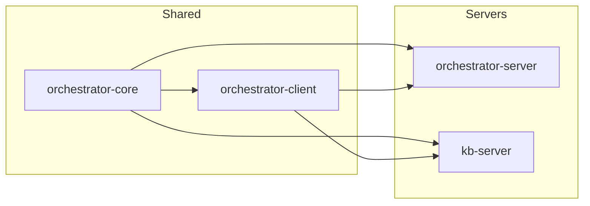

### 22.2 KB Server Internal Dependency Graph

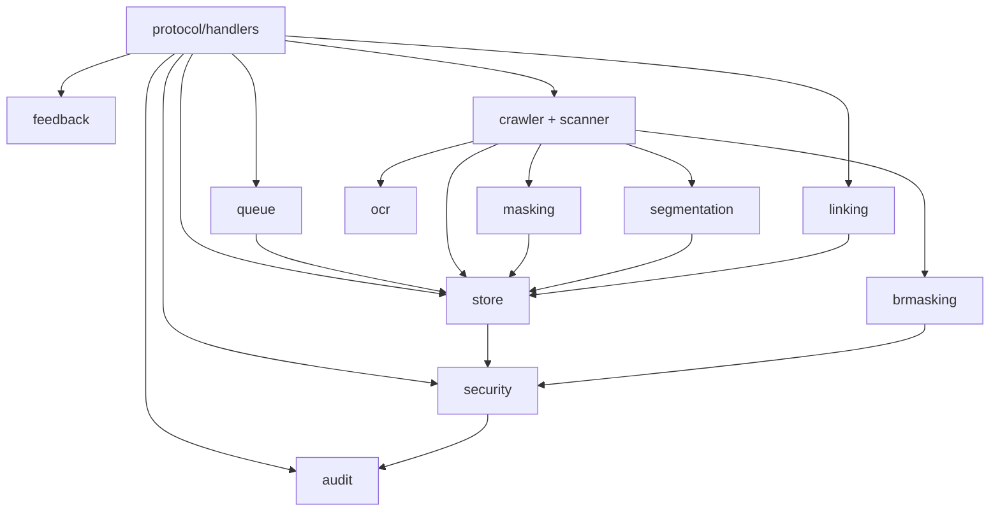

### 22.3 FSD Requirement Traceability

| FSD Requirement | TDD Section | Implementation |
|-----------------|-------------|----------------|
| UC-01: Enqueue High-Priority Task | §18.1, §18.2 | `QueueService.enqueue(task, Priority.HIGH)` |
| UC-02: Enqueue Normal-Priority Task | §18.1, §18.2 | `QueueService.enqueue(task, Priority.NORMAL)` |
| UC-03: Process Next Task | §18.2 | `QueueWorker.workerLoop()` |
| UC-04: Preempt Normal-Priority Task | §18.2 | `QueueWorker.processWithPreemption()` |
| UC-05: Detect and Recover Stuck Tasks | §18.3 | `QueueWatchdog.recoverStuckTasks()` |
| UC-06: Retry Failed Task | §18.2 | `QueueWorker.handleFailure()` |
| UC-07: Recover Tasks on Startup | §5.1 | `CrashRecoveryService.recover()` |
| BR-01: DB before channel | §18.2 | `QueueServiceImpl.enqueue()` |
| BR-05: HPQ priority in select | §18.1 | `DualPriorityQueue.selectNext()` |
| BR-07: Preemption no retry increment | §18.2 | CancellationException propagated |
| BR-10: Stuck threshold 5min | §18.3 | `config.stuckThresholdMinutes` |
| BR-14: Max retries 3 | §18.2 | `config.maxRetries` |
| BR-15: Exponential backoff | §18.2 | `baseDelay * 2^retryCount` |
| BR-17: Recovery before worker | §5.1 | `KbApplication.start()` order |

### 22.4 Architecture Review Decision Reference

| Decision | Option Chosen | Rationale |
|----------|---------------|-----------|
| KB separation approach | Option C: Separate MCP Server | Full isolation, independent scaling, transparent to agents |
| Database strategy (Phase 1) | Shared DB, separate schema | Minimal migration effort, no data copy needed |
| Transport (dev) | stdio subprocess | Simpler debugging, no port management |
| Transport (prod) | HTTP Streamable | Independent scaling, load balancing |
| Vector DB ownership | Separate collections | `kb_entries` for KB, `mcp_tools` for orchestrator |
| Jira sync ownership | KB Server | Sync is KB's responsibility |
| OCR location | KB Server | Part of ingestion pipeline |

---

*End of Technical Design Document*
