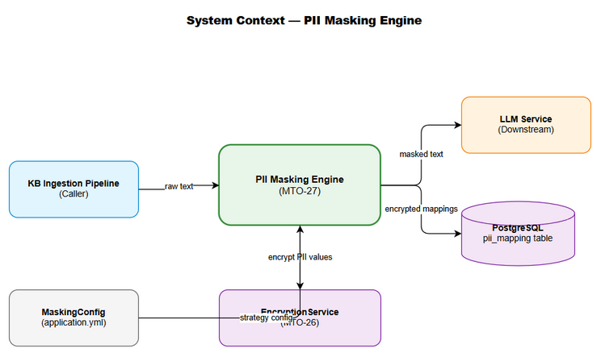
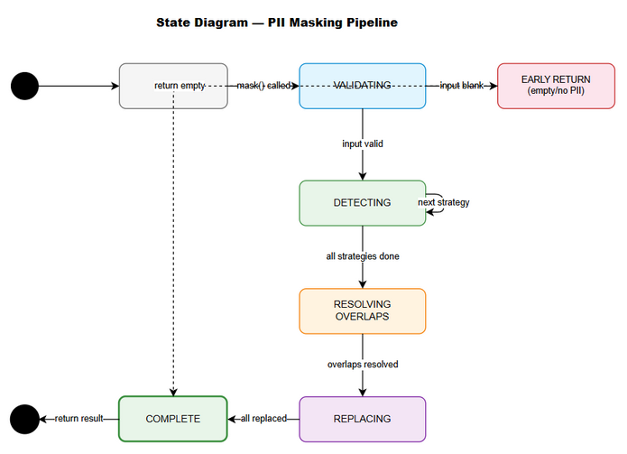

# Functional Specification Document (FSD)

## MCPOrchestration — MTO-27: KB Refinery — PII Masking Engine (Regex-based, VN patterns)

---

## Document Information

| Field | Value |
|-------|-------|
| Jira Ticket | MTO-27 |
| Title | KB Refinery — PII Masking Engine (Regex-based, VN patterns) |
| Author | BA Agent + TA Agent |
| Version | 1.0 |
| Date | 2026-05-08 |
| Status | Draft |
| Related BRD | BRD-v1-MTO-27.docx |

---

## Revision History

| Version | Date | Author | Changes |
|---------|------|--------|---------|
| 1.0 | 2026-05-08 | BA Agent | Initiate document from BRD |
| 1.1 | 2026-05-08 | TA Agent | Enriched with API contracts, pseudocode, technical details |

---

## 1. Introduction

### 1.1 Purpose

Tài liệu này mô tả chi tiết functional specifications cho PII Masking Engine — component phát hiện và mask thông tin cá nhân (PII) trong text tiếng Việt context tài chính, sử dụng regex patterns và heuristic detection.

### 1.2 Scope

- PiiMaskingEngine interface và implementation
- 5 PII detection strategies (Email, Phone, Bank Account, ID Card, Name)
- MaskingResult model và integration với MTO-26 PiiMapping
- Configuration system cho enable/disable strategies
- Koin DI module registration

### 1.3 Definitions & Acronyms

| Term | Definition |
|------|------------|
| PII | Personally Identifiable Information |
| CMND | Chứng Minh Nhân Dân (9-digit ID) |
| CCCD | Căn Cước Công Dân (12-digit ID) |
| STK | Số Tài Khoản (bank account number) |
| Strategy | Design pattern — interchangeable algorithm |
| Masking | Replace sensitive data with placeholder tokens |

### 1.4 References

| Document | Location |
|----------|----------|
| BRD | BRD-v1-MTO-27.docx |
| MTO-26 TDD | TDD-v1-MTO-26.docx |

---

## 2. System Overview

### 2.1 System Context Diagram



PII Masking Engine nhận raw text từ KB Ingestion Pipeline, xử lý qua strategy chain, trả về masked text + mappings. Masked text gửi sang LLM, mappings encrypt và persist vào DB.

### 2.2 System Architecture

PII Masking Engine là một module trong `orchestrator-server`, nằm trong package `com.orchestrator.mcp.masking`. Module sử dụng Strategy pattern với Koin DI để register và manage các detection strategies.

**Components:**
- `PiiMaskingEngine` — main interface, orchestrates strategy execution
- `PiiDetectionStrategy` — interface cho mỗi PII type detector
- `MaskingConfig` — configuration data class
- `MaskingModule` — Koin DI module

---

## 3. Functional Requirements

### 3.1 Feature: PII Masking Core Engine

**Source:** BRD Story 6, Story 7

#### 3.1.1 Description

Core engine nhận text input, iterate qua registered strategies theo priority order, collect tất cả PII matches, replace với placeholders, và return MaskingResult.

#### 3.1.2 Use Case

**Use Case ID:** UC-01
**Actor:** KB Ingestion Pipeline (system)
**Preconditions:** PiiMaskingEngine đã được initialize với strategies via Koin DI
**Postconditions:** MaskingResult chứa masked text và complete mapping list

**Main Flow:**

| Step | Actor | System | Description |
|------|-------|--------|-------------|
| 1 | Pipeline | | Gọi `engine.mask(rawText)` |
| 2 | | Engine | Validate input (non-null, non-empty) |
| 3 | | Engine | Iterate strategies by priority (1→5) |
| 4 | | Strategy | Mỗi strategy scan text, return List<PiiMatch> |
| 5 | | Engine | Filter overlapping matches (first-match-wins) |
| 6 | | Engine | Sort matches by position (descending) for safe replacement |
| 7 | | Engine | Replace each match with placeholder, build PiiMapping |
| 8 | | Engine | Return MaskingResult(maskedText, mappings) |

**Alternative Flows:**

| ID | Condition | Steps |
|----|-----------|-------|
| AF-1 | Input text is empty/blank | Return MaskingResult(originalText, emptyList) immediately |
| AF-2 | No PII detected | Return MaskingResult(originalText, emptyList) |
| AF-3 | Strategy disabled in config | Skip that strategy, continue with next |

**Exception Flows:**

| ID | Condition | Steps |
|----|-----------|-------|
| EF-1 | Strategy throws exception | Log error, skip strategy, continue with remaining |
| EF-2 | Regex timeout (catastrophic backtracking) | Timeout after 5s per strategy, skip, log warning |

#### 3.1.3 Business Rules

| Rule ID | Rule | Source |
|---------|------|--------|
| BR-1 | Strategies execute in priority order (1=highest) | BRD §2.3 |
| BR-2 | First-match-wins for overlapping regions | BRD §5.1 |
| BR-3 | Placeholder format: [PII_{TYPE}_{NN}] with zero-padded counter | BRD Story 1-5 |
| BR-4 | Counter resets per mask() call (per text input) | BRD Story 1 |
| BR-5 | PII original values NEVER appear in logs | BRD §6 NFR |
| BR-6 | Disabled strategies are skipped entirely | BRD Story 6 |

#### 3.1.4 Data Specifications

**Input Data:**

| Field | Type | Required | Validation | Description |
|-------|------|----------|------------|-------------|
| text | String | Yes | Non-null, non-blank | Raw text to mask |

**Output Data:**

| Field | Type | Description |
|-------|------|-------------|
| maskedText | String | Text with PII replaced by placeholders |
| mappings | List<PiiMapping> | Ordered list of placeholder→original mappings |

**PiiMapping Structure (from MTO-26):**

| Field | Type | Description |
|-------|------|-------------|
| placeholder | String | e.g., "[PII_PHONE_01]" |
| originalValue | String | Original PII text (to be encrypted before persist) |
| piiType | PiiType (enum) | NAME, ID_CARD, PHONE, BANK_ACCOUNT, EMAIL |

#### 3.1.5 API Contract (Functional View)

**Interface:** `PiiMaskingEngine`

```kotlin
interface PiiMaskingEngine {
    fun mask(text: String): MaskingResult
}
```

**Input Parameters:**

| Parameter | Type | Required | Business Rule | Description |
|-----------|------|----------|---------------|-------------|
| text | String | Yes | BR-4 (counter resets) | Raw text containing potential PII |

**Output Data:**

| Field | Type | Description |
|-------|------|-------------|
| maskedText | String | Text with all detected PII replaced |
| mappings | List<PiiMapping> | Complete mapping list for persistence |

**Business Error Scenarios:**

| Scenario | Behavior | Trigger Condition |
|----------|----------|-------------------|
| Empty input | Return unchanged text + empty mappings | text.isBlank() |
| Strategy failure | Skip failed strategy, continue | Strategy throws exception |
| All strategies disabled | Return unchanged text + empty mappings | Config disables all |

---

### 3.2 Feature: Email Detection Strategy

**Source:** BRD Story 4

#### 3.2.1 Description

Detect email addresses using standard email regex pattern. Highest priority (1) due to most specific pattern with lowest false positive rate.

#### 3.2.2 Use Case

**Use Case ID:** UC-02
**Actor:** PiiMaskingEngine (internal)
**Preconditions:** Strategy enabled in config
**Postconditions:** All email addresses in text identified with positions

**Main Flow:**

| Step | Actor | System | Description |
|------|-------|--------|-------------|
| 1 | Engine | | Calls `strategy.detect(text)` |
| 2 | | Strategy | Apply email regex to text |
| 3 | | Strategy | For each match, create PiiMatch(start, end, value, type=EMAIL) |
| 4 | | Strategy | Return List<PiiMatch> |

#### 3.2.3 Business Rules

| Rule ID | Rule | Source |
|---------|------|--------|
| BR-EMAIL-1 | Pattern: `[a-zA-Z0-9._%+-]+@[a-zA-Z0-9.-]+\.[a-zA-Z]{2,}` | BRD Story 4 |
| BR-EMAIL-2 | Placeholder: [PII_EMAIL_NN] | BRD Story 4 |
| BR-EMAIL-3 | Priority: 1 (highest) | BRD Appendix |

---

### 3.3 Feature: Phone Number Detection Strategy

**Source:** BRD Story 2

#### 3.3.1 Description

Detect Vietnamese phone numbers (10 digits starting with 0). Priority 2.

#### 3.3.2 Use Case

**Use Case ID:** UC-03
**Actor:** PiiMaskingEngine (internal)
**Preconditions:** Strategy enabled in config
**Postconditions:** All VN phone numbers identified

**Main Flow:**

| Step | Actor | System | Description |
|------|-------|--------|-------------|
| 1 | Engine | | Calls `strategy.detect(text)` |
| 2 | | Strategy | Apply phone regex `\b0\d{9}\b` |
| 3 | | Strategy | Filter: exclude matches already claimed by higher-priority strategy |
| 4 | | Strategy | Return List<PiiMatch> |

#### 3.3.3 Business Rules

| Rule ID | Rule | Source |
|---------|------|--------|
| BR-PHONE-1 | Pattern: `\b0\d{9}\b` | BRD Story 2 |
| BR-PHONE-2 | Must start with 0 | BRD Story 2 |
| BR-PHONE-3 | Placeholder: [PII_PHONE_NN] | BRD Story 2 |
| BR-PHONE-4 | Priority: 2 | BRD Appendix |

---

### 3.4 Feature: Bank Account Detection Strategy (Context-Aware)

**Source:** BRD Story 3

#### 3.4.1 Description

Detect bank account numbers (10-19 digits) ONLY when context keywords are present nearby. Priority 3. This is the most complex strategy due to context-awareness requirement.

#### 3.4.2 Use Case

**Use Case ID:** UC-04
**Actor:** PiiMaskingEngine (internal)
**Preconditions:** Strategy enabled, context keywords configured
**Postconditions:** Bank account numbers with context identified

**Main Flow:**

| Step | Actor | System | Description |
|------|-------|--------|-------------|
| 1 | Engine | | Calls `strategy.detect(text)` |
| 2 | | Strategy | Find all digit sequences matching `\b\d{10,19}\b` |
| 3 | | Strategy | For each match, check context window (±50 chars) |
| 4 | | Strategy | If context keyword found → include as PiiMatch |
| 5 | | Strategy | If no context keyword → skip (not a bank account) |
| 6 | | Strategy | Return List<PiiMatch> (only context-confirmed) |

**Alternative Flows:**

| ID | Condition | Steps |
|----|-----------|-------|
| AF-1 | Number is 10 digits starting with 0 | Already matched by Phone strategy (higher priority) — skip |
| AF-2 | Context keyword in different sentence | Check if within 50-char window regardless of sentence boundary |

#### 3.4.3 Business Rules

| Rule ID | Rule | Source |
|---------|------|--------|
| BR-BANK-1 | Pattern: `\b\d{10,19}\b` | BRD Story 3 |
| BR-BANK-2 | Context keywords: "tài khoản", "STK", "account", "số TK", "bank account" | BRD Story 3 |
| BR-BANK-3 | Context window: 50 characters before/after match | BRD Story 3 |
| BR-BANK-4 | Placeholder: [PII_ACCOUNT_NN] | BRD Story 3 |
| BR-BANK-5 | Priority: 3 | BRD Appendix |
| BR-BANK-6 | Case-insensitive keyword matching | Implied |

---

### 3.5 Feature: ID Card Detection Strategy

**Source:** BRD Story 1

#### 3.5.1 Description

Detect CMND (9 digits) and CCCD (12 digits) numbers. Priority 4.

#### 3.5.2 Use Case

**Use Case ID:** UC-05
**Actor:** PiiMaskingEngine (internal)
**Preconditions:** Strategy enabled
**Postconditions:** All 9-digit and 12-digit numbers identified

**Main Flow:**

| Step | Actor | System | Description |
|------|-------|--------|-------------|
| 1 | Engine | | Calls `strategy.detect(text)` |
| 2 | | Strategy | Apply regex `\b\d{9}\b|\b\d{12}\b` |
| 3 | | Strategy | Filter: exclude matches already claimed (phone, bank account) |
| 4 | | Strategy | Return List<PiiMatch> |

#### 3.5.3 Business Rules

| Rule ID | Rule | Source |
|---------|------|--------|
| BR-ID-1 | Pattern: `\b\d{9}\b` (CMND) or `\b\d{12}\b` (CCCD) | BRD Story 1 |
| BR-ID-2 | Placeholder: [PII_ID_NN] | BRD Story 1 |
| BR-ID-3 | Priority: 4 | BRD Appendix |
| BR-ID-4 | Accepts false positives (any 9/12 digit number) | BRD AC-1.3 |

---

### 3.6 Feature: Vietnamese Name Detection Strategy (Heuristic)

**Source:** BRD Story 5

#### 3.6.1 Description

Detect Vietnamese person names using heuristic: prefix indicator followed by 2-4 capitalized Vietnamese words. Priority 5 (lowest) due to highest false positive/negative risk.

#### 3.6.2 Use Case

**Use Case ID:** UC-06
**Actor:** PiiMaskingEngine (internal)
**Preconditions:** Strategy enabled, prefix list configured
**Postconditions:** Names with prefix indicators identified

**Main Flow:**

| Step | Actor | System | Description |
|------|-------|--------|-------------|
| 1 | Engine | | Calls `strategy.detect(text)` |
| 2 | | Strategy | Apply regex with prefix indicators |
| 3 | | Strategy | For each match, extract name portion (exclude prefix) |
| 4 | | Strategy | Validate: 2-4 words, each capitalized, Vietnamese chars |
| 5 | | Strategy | Return List<PiiMatch> (name portion only, not prefix) |

#### 3.6.3 Business Rules

| Rule ID | Rule | Source |
|---------|------|--------|
| BR-NAME-1 | Prefixes: Ông, Bà, Anh, Chị, KH, Khách hàng, Mr., Mrs., Ms. | BRD Story 5 |
| BR-NAME-2 | Name = 2-4 capitalized Vietnamese words after prefix | BRD Story 5 |
| BR-NAME-3 | Support Vietnamese diacritics (À-Ỹ, à-ỹ) | BRD AC-5.5 |
| BR-NAME-4 | Placeholder: [PII_NAME_NN] | BRD Story 5 |
| BR-NAME-5 | Priority: 5 (lowest) | BRD Appendix |
| BR-NAME-6 | Only mask the name portion, keep prefix visible | BRD AC-5.1 |

---

## 4. Data Model

### 4.1 Logical Entities

#### Entity: MaskingResult

| Attribute | Type | Required | Business Rule | Description |
|-----------|------|----------|---------------|-------------|
| maskedText | String | Yes | BR-3 | Text with placeholders |
| mappings | List<PiiMapping> | Yes | BR-4 | Ordered mapping list |

#### Entity: PiiMatch (Internal)

| Attribute | Type | Required | Business Rule | Description |
|-----------|------|----------|---------------|-------------|
| startIndex | Int | Yes | — | Start position in original text |
| endIndex | Int | Yes | — | End position (exclusive) |
| originalValue | String | Yes | — | Matched text |
| piiType | PiiType | Yes | — | Type of PII detected |

#### Entity: PiiDetectionStrategy (Interface)

| Attribute | Type | Required | Description |
|-----------|------|----------|-------------|
| piiType | PiiType | Yes | Type this strategy detects |
| priority | Int | Yes | Execution order (1=first) |
| detect(text) | List<PiiMatch> | Yes | Scan text and return matches |

#### Entity: MaskingConfig

| Attribute | Type | Required | Description |
|-----------|------|----------|-------------|
| enabledStrategies | Set<PiiType> | Yes | Which strategies are active |
| customPatterns | Map<PiiType, String> | No | Override default regex patterns |
| contextWindow | Int | No | Characters for context search (default: 50) |
| contextKeywords | List<String> | No | Keywords for bank account context |

**Relationships:**

| From Entity | To Entity | Cardinality | Description |
|-------------|-----------|-------------|-------------|
| PiiMaskingEngine | PiiDetectionStrategy | 1:N | Engine has multiple strategies |
| PiiMaskingEngine | MaskingConfig | 1:1 | Engine configured by one config |
| MaskingResult | PiiMapping (MTO-26) | 1:N | Result contains multiple mappings |

---

## 5. Integration Specifications

### 5.1 External System: MTO-26 (KB Entries Schema)

| Attribute | Value |
|-----------|-------|
| Purpose | Provide PiiMapping model and EncryptionService for persisting masked data |
| Direction | Outbound (masking engine produces data for MTO-26 to persist) |
| Data Format | Kotlin data classes (in-process) |
| Frequency | Real-time (per mask() call) |

**Data Exchange:**

| Our Data | External Data | Direction | Business Rule |
|----------|--------------|-----------|---------------|
| MaskingResult.mappings | PiiMapping entities | Send | Each mapping → encrypt originalValue → persist |
| PiiType enum | PiiType enum (MTO-26) | Shared | Must use same enum values |

### 5.2 External System: LLM Service (Downstream Consumer)

| Attribute | Value |
|-----------|-------|
| Purpose | Receive masked text for processing (LLM never sees PII) |
| Direction | Outbound (masked text sent to LLM) |
| Data Format | String (masked text) |
| Frequency | Real-time |

---

## 6. Processing Logic

### 6.1 Masking Pipeline Process

**Trigger:** `PiiMaskingEngine.mask(text)` called by KB Ingestion Pipeline
**Input:** Raw text (String)
**Output:** MaskingResult(maskedText, mappings)

**Processing Steps:**

| Step | Description | Error Handling |
|------|-------------|----------------|
| 1 | Validate input: if blank, return early | Return unchanged text + empty list |
| 2 | Initialize counters map: Map<PiiType, Int> | — |
| 3 | Collect all matches from all enabled strategies | Skip failed strategy, log error |
| 4 | Sort matches by startIndex ascending | — |
| 5 | Remove overlapping matches (keep first by priority) | — |
| 6 | Sort remaining matches by startIndex descending | — |
| 7 | For each match (reverse order): replace with placeholder | — |
| 8 | Build PiiMapping for each replacement | — |
| 9 | Return MaskingResult | — |

**Pseudocode:**

```
function mask(text: String): MaskingResult
    if text.isBlank() then return MaskingResult(text, emptyList)
    
    // Step 1: Collect all matches from enabled strategies
    allMatches = mutableListOf<PiiMatch>()
    for strategy in strategies.sortedBy { it.priority }
        if strategy.piiType in config.enabledStrategies then
            matches = strategy.detect(text)
            allMatches.addAll(matches)
    
    // Step 2: Remove overlapping matches (first-match-wins by priority)
    resolvedMatches = removeOverlaps(allMatches)
    
    // Step 3: Replace matches with placeholders (reverse order for safe indexing)
    resolvedMatches.sortByDescending { it.startIndex }
    maskedText = text
    mappings = mutableListOf<PiiMapping>()
    counters = mutableMapOf<PiiType, Int>()
    
    for match in resolvedMatches
        counter = counters.getOrDefault(match.piiType, 0) + 1
        counters[match.piiType] = counter
        placeholder = "[PII_${match.piiType.name}_${counter.toString().padStart(2, '0')}]"
        maskedText = maskedText.replaceRange(match.startIndex, match.endIndex, placeholder)
        mappings.add(PiiMapping(placeholder, match.originalValue, match.piiType))
    
    // Step 4: Reverse mappings to match text order (we built them in reverse)
    return MaskingResult(maskedText, mappings.reversed())
```

### 6.2 Overlap Resolution Process

**Trigger:** Multiple strategies detect overlapping text regions
**Input:** List<PiiMatch> from all strategies
**Output:** List<PiiMatch> with no overlaps

**Pseudocode:**

```
function removeOverlaps(matches: List<PiiMatch>): List<PiiMatch>
    // Sort by startIndex, then by priority (lower = higher priority)
    sorted = matches.sortedWith(compareBy({ it.startIndex }, { it.priority }))
    resolved = mutableListOf<PiiMatch>()
    lastEnd = -1
    
    for match in sorted
        if match.startIndex >= lastEnd then
            resolved.add(match)
            lastEnd = match.endIndex
        // else: overlapping with previous match → skip (first-match-wins)
    
    return resolved
```

### 6.3 Context-Aware Detection (Bank Account)

**Trigger:** Bank account strategy detects digit sequence
**Input:** Text + match position
**Output:** Boolean (has context or not)

**Pseudocode:**

```
function hasContext(text: String, matchStart: Int, matchEnd: Int): Boolean
    windowStart = max(0, matchStart - config.contextWindow)
    windowEnd = min(text.length, matchEnd + config.contextWindow)
    window = text.substring(windowStart, windowEnd).lowercase()
    
    return config.contextKeywords.any { keyword -> keyword.lowercase() in window }
```

---

## 7. Security Requirements

### 7.1 Data Sensitivity Classification

| Data Type | Classification | Business Requirement |
|-----------|---------------|---------------------|
| Original PII values | Restricted | Must be encrypted before persistence (MTO-26) |
| Masked text | Internal | Safe for LLM processing |
| PiiMapping list | Confidential | Contains original values until encrypted |
| MaskingConfig | Internal | Contains regex patterns (not sensitive) |

### 7.2 Security Rules

| Rule | Description |
|------|-------------|
| SEC-1 | PII original values MUST NOT appear in any log output |
| SEC-2 | MaskingResult.mappings MUST be encrypted before persistence |
| SEC-3 | In-memory PII values should be cleared after use (best effort) |
| SEC-4 | Regex patterns themselves are not sensitive (public knowledge) |

---

## 8. Non-Functional Requirements

| Category | Business Requirement | Acceptance Criteria |
|----------|---------------------|---------------------|
| Performance | Fast masking for real-time pipeline | 1KB text < 10ms, 100KB text < 100ms |
| Reliability | No data loss during masking | Original text fully recoverable from masked + mappings |
| Scalability | Handle concurrent masking requests | Thread-safe, stateless per call |
| Maintainability | Easy to add new PII types | New strategy class + DI registration only |

---

## 9. Error Handling

### 9.1 Error Scenarios

| Scenario | Severity | Behavior | Recovery |
|----------|----------|----------|----------|
| Null/blank input | Info | Return unchanged text + empty mappings | Automatic |
| Strategy regex timeout | Warning | Skip strategy, continue with others | Log + continue |
| Strategy throws exception | Warning | Skip strategy, continue with others | Log + continue |
| All strategies fail | Warning | Return unchanged text + empty mappings | Log all errors |
| Invalid regex in custom config | Critical | Fail fast at startup (config validation) | Fix config |

---

## 10. State Diagram



**States:**
- IDLE → Waiting for mask() call
- VALIDATING → Checking input
- DETECTING → Running strategies
- RESOLVING → Removing overlaps
- REPLACING → Building masked text
- COMPLETE → Returning result

---

## 11. Appendix

### Diagram Index

| # | Diagram | Image | Source (editable) |
|---|---------|-------|-------------------|
| 1 | System Context | [system-context.png](diagrams/system-context.png) | [system-context.drawio](diagrams/system-context.drawio) |
| 2 | Sequence — Masking Flow | [sequence-masking.png](diagrams/sequence-masking.png) | [sequence-masking.drawio](diagrams/sequence-masking.drawio) |
| 3 | State — Pipeline States | [state-masking-pipeline.png](diagrams/state-masking-pipeline.png) | [state-masking-pipeline.drawio](diagrams/state-masking-pipeline.drawio) |
