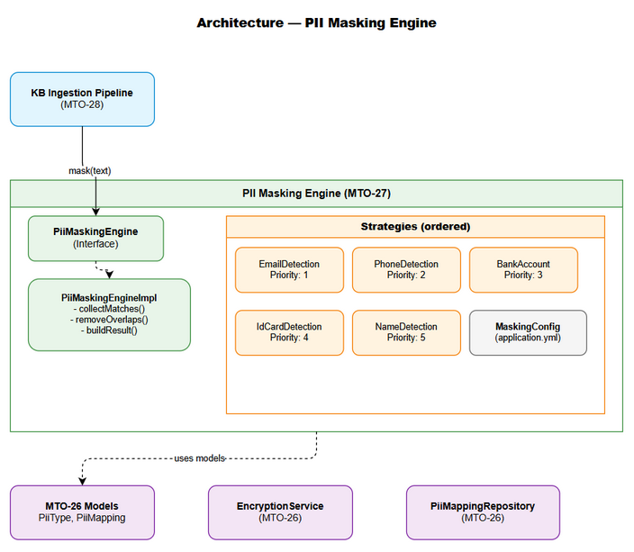
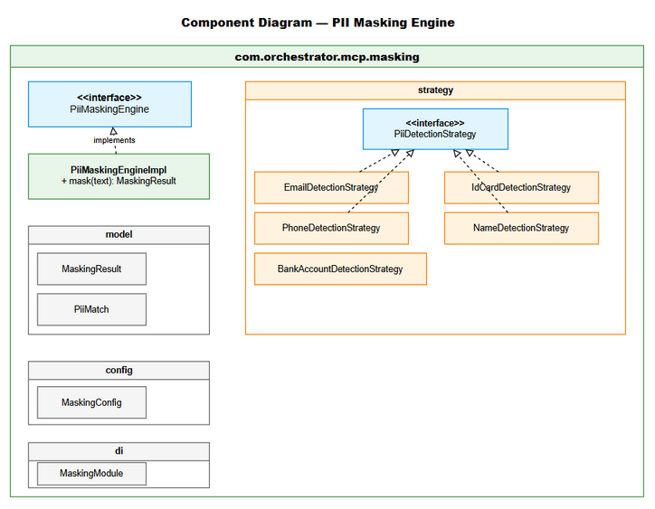
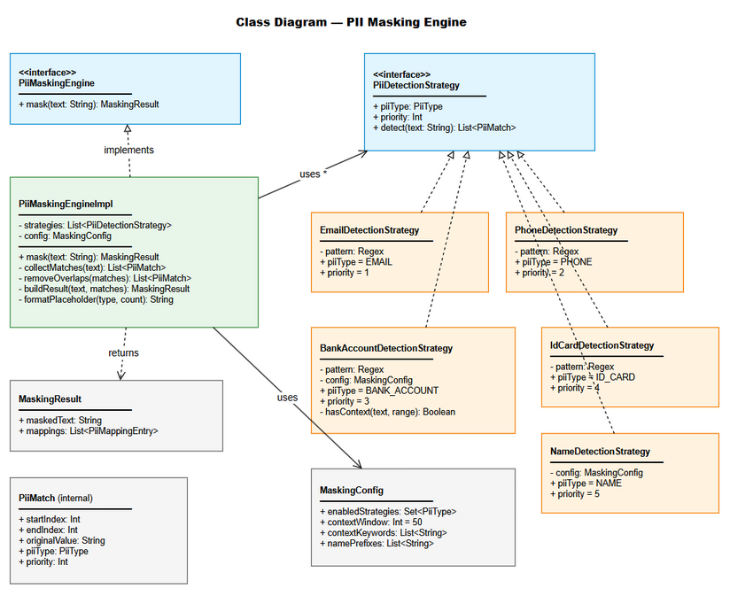

# Technical Design Document (TDD)

## MCPOrchestration — MTO-27: KB Refinery — PII Masking Engine (Regex-based, VN patterns)

---

## Document Information

| Field | Value |
|-------|-------|
| Jira Ticket | MTO-27 |
| Title | KB Refinery — PII Masking Engine (Regex-based, VN patterns) |
| Author | SA Agent |
| Version | 1.0 |
| Date | 2026-05-08 |
| Status | Draft |
| Related BRD | BRD-v1-MTO-27.docx |
| Related FSD | FSD-v1-MTO-27.docx |

---

## Revision History

| Version | Date | Author | Changes |
|---------|------|--------|---------|
| 1.0 | 2026-05-08 | SA Agent | Initiate document from BRD + FSD |

---

## 1. Introduction

### 1.1 Purpose

Technical design cho PII Masking Engine — module phát hiện và mask PII trong text tiếng Việt context tài chính, sử dụng Strategy pattern với regex-based detection.

### 1.2 Scope

- Package `com.orchestrator.mcp.masking` — all classes
- Koin DI module registration
- Integration với MTO-26 models (PiiMapping, PiiType)
- Unit tests cho mỗi strategy
- Configuration via application.yml

### 1.3 Technology Stack

| Layer | Technology | Version |
|-------|-----------|---------|
| Language | Kotlin | 2.0+ |
| Platform | JVM | 21 |
| DI | Koin | 4.1.1 |
| Serialization | kotlinx.serialization | 1.8.1 |
| Testing | Kotest + MockK | 5.9.1 / 1.14.2 |
| Build | Gradle (Kotlin DSL) | 8.x |

### 1.4 Design Principles

- **SOLID** — Single Responsibility (1 strategy per PII type), Open/Closed (new strategies without modifying engine)
- **Strategy Pattern** — Interchangeable detection algorithms
- **Interface-first** — All components testable via interfaces
- **Immutability** — Data classes are immutable; no shared mutable state
- **Fail-safe** — Strategy failure doesn't crash the pipeline

### 1.5 Constraints

- File ≤ 200 lines (Kotlin code standards)
- Function ≤ 20 lines
- No external NLP libraries (regex + heuristic only)
- Must integrate with MTO-26 PiiMapping model without modification
- Thread-safe (stateless per mask() call)

---

## 2. System Architecture

### 2.1 Architecture Overview



PII Masking Engine is a single-module library within `orchestrator-server`. It follows a pipeline architecture where text flows through ordered strategies, each detecting a specific PII type.

**Key architectural decisions:**
- **In-process library** (not a separate service) — low latency, no network overhead
- **Strategy chain** — ordered execution with overlap resolution
- **Stateless per call** — thread-safe without synchronization
- **Configuration-driven** — strategies can be enabled/disabled at runtime

### 2.2 Component Diagram



| Component | Responsibility | Technology |
|-----------|---------------|------------|
| PiiMaskingEngine | Orchestrate strategy execution, build result | Kotlin interface + impl |
| PiiDetectionStrategy | Detect specific PII type in text | Kotlin interface |
| EmailDetectionStrategy | Detect email addresses | Kotlin Regex |
| PhoneDetectionStrategy | Detect VN phone numbers | Kotlin Regex |
| BankAccountDetectionStrategy | Detect bank accounts (context-aware) | Kotlin Regex + context check |
| IdCardDetectionStrategy | Detect CMND/CCCD numbers | Kotlin Regex |
| NameDetectionStrategy | Detect VN person names (heuristic) | Kotlin Regex |
| MaskingConfig | Hold configuration (enabled strategies, patterns) | @Serializable data class |
| MaskingModule | Koin DI module registration | Koin module DSL |

---

## 3. API Design

### 3.1 API Overview

This is an in-process library API (no HTTP endpoints). The API is the Kotlin interface.

| # | Interface | Method | Description | Source |
|---|-----------|--------|-------------|--------|
| 1 | PiiMaskingEngine | mask(text: String): MaskingResult | Main masking entry point | UC-01 |
| 2 | PiiDetectionStrategy | detect(text: String): List<PiiMatch> | Strategy detection method | UC-02..06 |

### 3.2 Interface: PiiMaskingEngine

```kotlin
package com.orchestrator.mcp.masking

interface PiiMaskingEngine {
    /**
     * Mask all detected PII in the given text.
     * @param text Raw text potentially containing PII
     * @return MaskingResult with masked text and mapping list
     */
    fun mask(text: String): MaskingResult
}
```

### 3.3 Interface: PiiDetectionStrategy

```kotlin
package com.orchestrator.mcp.masking.strategy

interface PiiDetectionStrategy {
    /** The PII type this strategy detects */
    val piiType: PiiType
    
    /** Execution priority (lower = higher priority, executed first) */
    val priority: Int
    
    /**
     * Detect PII matches in the given text.
     * @param text Text to scan
     * @return List of detected PII matches with positions
     */
    fun detect(text: String): List<PiiMatch>
}
```

---

## 4. Database Design

No new database tables required. MTO-27 uses models from MTO-26:
- `PiiMapping` data class → persisted to `pii_mapping` table (MTO-26)
- `PiiType` enum → shared between MTO-26 and MTO-27

---

## 5. Class / Module Design

### 5.1 Package Structure

```
com.orchestrator.mcp.masking/
├── PiiMaskingEngine.kt              # Interface (≤30 lines)
├── PiiMaskingEngineImpl.kt          # Implementation (≤150 lines)
├── model/
│   ├── MaskingResult.kt             # Data class (≤20 lines)
│   ├── PiiMatch.kt                  # Internal match data class (≤20 lines)
│   └── PiiPattern.kt                # Pattern definition data class (≤30 lines)
├── strategy/
│   ├── PiiDetectionStrategy.kt      # Interface (≤20 lines)
│   ├── EmailDetectionStrategy.kt    # Email regex (≤60 lines)
│   ├── PhoneDetectionStrategy.kt    # Phone regex (≤60 lines)
│   ├── BankAccountDetectionStrategy.kt  # Context-aware (≤100 lines)
│   ├── IdCardDetectionStrategy.kt   # ID card regex (≤60 lines)
│   └── NameDetectionStrategy.kt     # Heuristic (≤100 lines)
├── config/
│   └── MaskingConfig.kt             # @Serializable config (≤50 lines)
└── di/
    └── MaskingModule.kt             # Koin module (≤40 lines)
```

### 5.2 Key Classes

#### MaskingResult

```kotlin
package com.orchestrator.mcp.masking.model

data class MaskingResult(
    val maskedText: String,
    val mappings: List<PiiMappingEntry>
)

data class PiiMappingEntry(
    val placeholder: String,      // e.g., "[PII_PHONE_01]"
    val originalValue: String,    // Original PII text
    val piiType: PiiType          // Enum from MTO-26
)
```

#### PiiMatch (Internal)

```kotlin
package com.orchestrator.mcp.masking.model

internal data class PiiMatch(
    val startIndex: Int,
    val endIndex: Int,
    val originalValue: String,
    val piiType: PiiType,
    val priority: Int             // From strategy priority
)
```

#### MaskingConfig

```kotlin
package com.orchestrator.mcp.masking.config

@Serializable
data class MaskingConfig(
    val enabledStrategies: Set<PiiType> = PiiType.entries.toSet(),
    val contextWindow: Int = 50,
    val contextKeywords: List<String> = listOf(
        "tài khoản", "STK", "account", "số TK", "bank account"
    ),
    val namePrefixes: List<String> = listOf(
        "Ông", "Bà", "Anh", "Chị", "KH", "Khách hàng", "Mr.", "Mrs.", "Ms."
    )
)
```

#### PiiMaskingEngineImpl

```kotlin
package com.orchestrator.mcp.masking

class PiiMaskingEngineImpl(
    private val strategies: List<PiiDetectionStrategy>,
    private val config: MaskingConfig
) : PiiMaskingEngine {

    override fun mask(text: String): MaskingResult {
        if (text.isBlank()) return MaskingResult(text, emptyList())
        
        val allMatches = collectMatches(text)
        val resolved = removeOverlaps(allMatches)
        return buildResult(text, resolved)
    }
    
    private fun collectMatches(text: String): List<PiiMatch> {
        return strategies
            .filter { it.piiType in config.enabledStrategies }
            .sortedBy { it.priority }
            .flatMap { strategy -> 
                runCatching { strategy.detect(text) }
                    .getOrElse { emptyList() }
            }
    }
    
    private fun removeOverlaps(matches: List<PiiMatch>): List<PiiMatch> {
        val sorted = matches.sortedWith(compareBy({ it.startIndex }, { it.priority }))
        val resolved = mutableListOf<PiiMatch>()
        var lastEnd = -1
        for (match in sorted) {
            if (match.startIndex >= lastEnd) {
                resolved.add(match)
                lastEnd = match.endIndex
            }
        }
        return resolved
    }
    
    private fun buildResult(text: String, matches: List<PiiMatch>): MaskingResult {
        val counters = mutableMapOf<PiiType, Int>()
        val mappings = mutableListOf<PiiMappingEntry>()
        var maskedText = text
        
        // Process in reverse order for safe string replacement
        for (match in matches.sortedByDescending { it.startIndex }) {
            val count = counters.merge(match.piiType, 1, Int::plus)!!
            val placeholder = formatPlaceholder(match.piiType, count)
            maskedText = maskedText.replaceRange(match.startIndex, match.endIndex, placeholder)
            mappings.add(PiiMappingEntry(placeholder, match.originalValue, match.piiType))
        }
        
        return MaskingResult(maskedText, mappings.reversed())
    }
    
    private fun formatPlaceholder(type: PiiType, count: Int): String {
        val typeLabel = when (type) {
            PiiType.NAME -> "NAME"
            PiiType.ID_CARD -> "ID"
            PiiType.PHONE -> "PHONE"
            PiiType.BANK_ACCOUNT -> "ACCOUNT"
            PiiType.EMAIL -> "EMAIL"
        }
        return "[PII_${typeLabel}_${count.toString().padStart(2, '0')}]"
    }
}
```

#### EmailDetectionStrategy

```kotlin
package com.orchestrator.mcp.masking.strategy

class EmailDetectionStrategy : PiiDetectionStrategy {
    override val piiType = PiiType.EMAIL
    override val priority = 1
    
    private val pattern = Regex("[a-zA-Z0-9._%+\\-]+@[a-zA-Z0-9.\\-]+\\.[a-zA-Z]{2,}")
    
    override fun detect(text: String): List<PiiMatch> {
        return pattern.findAll(text).map { match ->
            PiiMatch(
                startIndex = match.range.first,
                endIndex = match.range.last + 1,
                originalValue = match.value,
                piiType = piiType,
                priority = priority
            )
        }.toList()
    }
}
```

#### PhoneDetectionStrategy

```kotlin
package com.orchestrator.mcp.masking.strategy

class PhoneDetectionStrategy : PiiDetectionStrategy {
    override val piiType = PiiType.PHONE
    override val priority = 2
    
    private val pattern = Regex("\\b0\\d{9}\\b")
    
    override fun detect(text: String): List<PiiMatch> {
        return pattern.findAll(text).map { match ->
            PiiMatch(
                startIndex = match.range.first,
                endIndex = match.range.last + 1,
                originalValue = match.value,
                piiType = piiType,
                priority = priority
            )
        }.toList()
    }
}
```

#### BankAccountDetectionStrategy

```kotlin
package com.orchestrator.mcp.masking.strategy

class BankAccountDetectionStrategy(
    private val config: MaskingConfig
) : PiiDetectionStrategy {
    override val piiType = PiiType.BANK_ACCOUNT
    override val priority = 3
    
    private val pattern = Regex("\\b\\d{10,19}\\b")
    
    override fun detect(text: String): List<PiiMatch> {
        return pattern.findAll(text)
            .filter { match -> hasContext(text, match.range) }
            .map { match ->
                PiiMatch(
                    startIndex = match.range.first,
                    endIndex = match.range.last + 1,
                    originalValue = match.value,
                    piiType = piiType,
                    priority = priority
                )
            }.toList()
    }
    
    private fun hasContext(text: String, matchRange: IntRange): Boolean {
        val windowStart = maxOf(0, matchRange.first - config.contextWindow)
        val windowEnd = minOf(text.length, matchRange.last + 1 + config.contextWindow)
        val window = text.substring(windowStart, windowEnd).lowercase()
        return config.contextKeywords.any { it.lowercase() in window }
    }
}
```

#### IdCardDetectionStrategy

```kotlin
package com.orchestrator.mcp.masking.strategy

class IdCardDetectionStrategy : PiiDetectionStrategy {
    override val piiType = PiiType.ID_CARD
    override val priority = 4
    
    private val pattern = Regex("\\b\\d{9}\\b|\\b\\d{12}\\b")
    
    override fun detect(text: String): List<PiiMatch> {
        return pattern.findAll(text).map { match ->
            PiiMatch(
                startIndex = match.range.first,
                endIndex = match.range.last + 1,
                originalValue = match.value,
                piiType = piiType,
                priority = priority
            )
        }.toList()
    }
}
```

#### NameDetectionStrategy

```kotlin
package com.orchestrator.mcp.masking.strategy

class NameDetectionStrategy(
    private val config: MaskingConfig
) : PiiDetectionStrategy {
    override val piiType = PiiType.NAME
    override val priority = 5
    
    override fun detect(text: String): List<PiiMatch> {
        val prefixPattern = config.namePrefixes.joinToString("|") { Regex.escape(it) }
        val regex = Regex(
            "(?:$prefixPattern)\\s+([A-ZÀ-Ỹ][a-zà-ỹ]+(?:\\s+[A-ZÀ-Ỹ][a-zà-ỹ]+){1,3})"
        )
        return regex.findAll(text).map { match ->
            val nameGroup = match.groups[1]!!
            PiiMatch(
                startIndex = nameGroup.range.first,
                endIndex = nameGroup.range.last + 1,
                originalValue = nameGroup.value,
                piiType = piiType,
                priority = priority
            )
        }.toList()
    }
}
```

#### MaskingModule (Koin DI)

```kotlin
package com.orchestrator.mcp.masking.di

val maskingModule = module {
    single<MaskingConfig> { MaskingConfig() }
    
    single<List<PiiDetectionStrategy>> {
        listOf(
            EmailDetectionStrategy(),
            PhoneDetectionStrategy(),
            BankAccountDetectionStrategy(get()),
            IdCardDetectionStrategy(),
            NameDetectionStrategy(get())
        )
    }
    
    single<PiiMaskingEngine> {
        PiiMaskingEngineImpl(
            strategies = get(),
            config = get()
        )
    }
}
```

### 5.3 Design Patterns

| Pattern | Where Used | Rationale |
|---------|-----------|-----------|
| Strategy | PiiDetectionStrategy implementations | Each PII type has different detection logic; new types added without modifying engine |
| Chain of Responsibility | Strategy execution order | Priority-based processing with overlap resolution |
| Builder | MaskingResult construction | Accumulate mappings during replacement |
| Factory | MaskingModule (Koin) | Centralized object creation and wiring |

### 5.4 Class Diagram



---

## 6. Integration Design

### 6.1 Integration with MTO-26

| Attribute | Value |
|-----------|-------|
| Type | In-process (same JVM) |
| Protocol | Direct Kotlin function calls |
| Dependency | MTO-26 provides PiiType enum, PiiMapping model |
| Coupling | Loose — only depends on shared model interfaces |

**Integration Flow:**
1. Caller invokes `engine.mask(text)` → gets `MaskingResult`
2. Caller maps `MaskingResult.mappings` → `PiiMapping` entities (adding issueKey, timestamps)
3. Caller encrypts `originalValue` via `EncryptionService` (MTO-26)
4. Caller persists via `PiiMappingRepository.insert()` (MTO-26)

### 6.2 Integration with KB Ingestion Pipeline (MTO-28)

| Attribute | Value |
|-----------|-------|
| Type | In-process (same JVM) |
| Protocol | Direct Kotlin function calls via Koin DI |
| Direction | MTO-28 calls MTO-27 |

---

## 7. Security Design

### 7.1 Data Protection

| Data Type | At Rest | In Transit | In Logs |
|-----------|---------|------------|---------|
| Original PII values | N/A (in-memory only) | N/A (in-process) | ❌ NEVER logged |
| Masked text | N/A | N/A | ✅ Safe to log |
| PiiMapping.originalValue | Encrypted (AES-256-GCM via MTO-26) | N/A | ❌ NEVER logged |
| MaskingConfig | Plain (no secrets) | N/A | ✅ Safe to log |

### 7.2 Security Rules

| Rule | Implementation |
|------|---------------|
| SEC-1: No PII in logs | Logger only outputs masked text; strategies never log match values |
| SEC-2: Encrypt before persist | Caller responsibility (MTO-26 EncryptionService) |
| SEC-3: No PII in exceptions | Exception messages use placeholder references, not original values |

---

## 8. Performance & Scalability

### 8.1 Performance Targets

| Operation | Target | Strategy |
|-----------|--------|----------|
| mask(1KB text) | < 10ms | Compiled regex patterns (created once, reused) |
| mask(100KB text) | < 100ms | Linear O(n) scanning per strategy |
| mask(1MB text) | < 1s | No backtracking-prone patterns |

### 8.2 Performance Design Decisions

| Decision | Rationale |
|----------|-----------|
| Pre-compiled Regex | Regex objects created at strategy construction, not per call |
| Stateless strategies | No synchronization needed; thread-safe by design |
| Reverse-order replacement | Avoids index shifting during string manipulation |
| Early return for blank text | Skip all processing for empty input |

### 8.3 Regex Safety

All regex patterns are designed to avoid catastrophic backtracking:
- No nested quantifiers (`(a+)+`)
- No overlapping alternatives with quantifiers
- Word boundary anchors (`\b`) limit match scope
- Maximum match length bounded (19 digits for bank account)

---

## 9. Monitoring & Observability

### 9.1 Logging

| Log Event | Level | Fields | Destination |
|-----------|-------|--------|-------------|
| Masking started | DEBUG | textLength, enabledStrategies | Application log |
| Strategy completed | DEBUG | strategyName, matchCount | Application log |
| Strategy failed | WARN | strategyName, errorMessage (no PII) | Application log |
| Masking completed | INFO | textLength, totalMasked, duration | Application log |

### 9.2 Metrics (Future)

| Metric | Type | Description |
|--------|------|-------------|
| masking_duration_ms | Histogram | Time to complete mask() call |
| masking_pii_detected | Counter | Total PII items detected (by type) |
| masking_strategy_errors | Counter | Strategy failures (by strategy) |

---

## 10. Implementation Checklist

### Files to Create

| # | File | Package | Lines (est.) | Priority |
|---|------|---------|-------------|----------|
| 1 | PiiMaskingEngine.kt | masking | ~15 | P0 |
| 2 | PiiMaskingEngineImpl.kt | masking | ~120 | P0 |
| 3 | MaskingResult.kt | masking.model | ~15 | P0 |
| 4 | PiiMatch.kt | masking.model | ~15 | P0 |
| 5 | PiiDetectionStrategy.kt | masking.strategy | ~15 | P0 |
| 6 | EmailDetectionStrategy.kt | masking.strategy | ~30 | P0 |
| 7 | PhoneDetectionStrategy.kt | masking.strategy | ~30 | P0 |
| 8 | BankAccountDetectionStrategy.kt | masking.strategy | ~50 | P0 |
| 9 | IdCardDetectionStrategy.kt | masking.strategy | ~30 | P0 |
| 10 | NameDetectionStrategy.kt | masking.strategy | ~50 | P1 |
| 11 | MaskingConfig.kt | masking.config | ~30 | P0 |
| 12 | MaskingModule.kt | masking.di | ~25 | P0 |

### Files to Modify

| # | File | Change | Priority |
|---|------|--------|----------|
| 1 | AppModule.kt | Import maskingModule | P0 |
| 2 | application.yml | Add masking config section | P1 |

### Test Files to Create

| # | File | Tests | Priority |
|---|------|-------|----------|
| 1 | EmailDetectionStrategyTest.kt | 5 tests | P0 |
| 2 | PhoneDetectionStrategyTest.kt | 5 tests | P0 |
| 3 | BankAccountDetectionStrategyTest.kt | 6 tests | P0 |
| 4 | IdCardDetectionStrategyTest.kt | 5 tests | P0 |
| 5 | NameDetectionStrategyTest.kt | 6 tests | P1 |
| 6 | PiiMaskingEngineImplTest.kt | 10 tests | P0 |

---

## 11. Appendix

### Diagram Index

| # | Diagram | Image | Source (editable) |
|---|---------|-------|-------------------|
| 1 | Architecture Overview | [architecture.png](diagrams/architecture.png) | [architecture.drawio](diagrams/architecture.drawio) |
| 2 | Component Diagram | [component.png](diagrams/component.png) | [component.drawio](diagrams/component.drawio) |
| 3 | Class Diagram | [class-diagram.png](diagrams/class-diagram.png) | [class-diagram.drawio](diagrams/class-diagram.drawio) |

### Open Questions

| # | Question | Status | Answer |
|---|----------|--------|--------|
| 1 | Should phone pattern exclude landline (02x)? | Resolved | Include all 0x patterns |
| 2 | Should ID card require context like bank account? | Resolved | No — accept false positives for safety |
| 3 | Max text size limit? | Resolved | No hard limit; performance degrades linearly |
