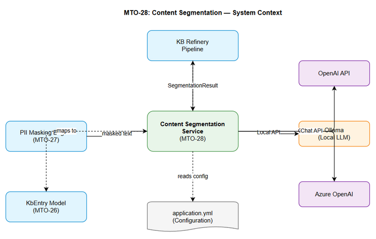
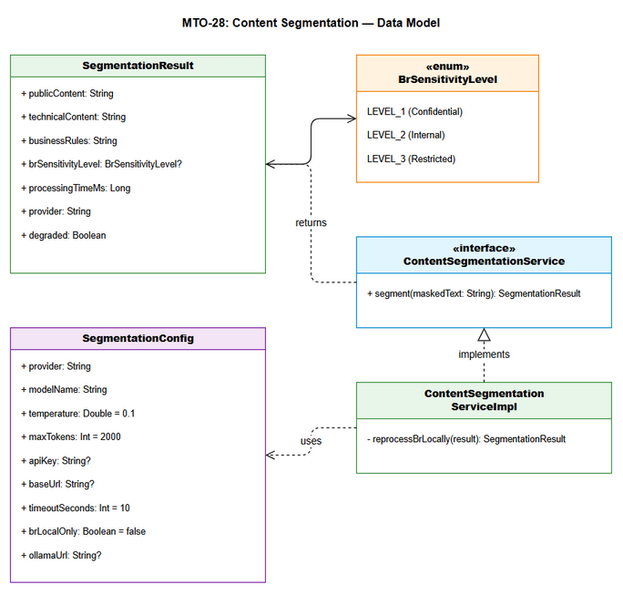
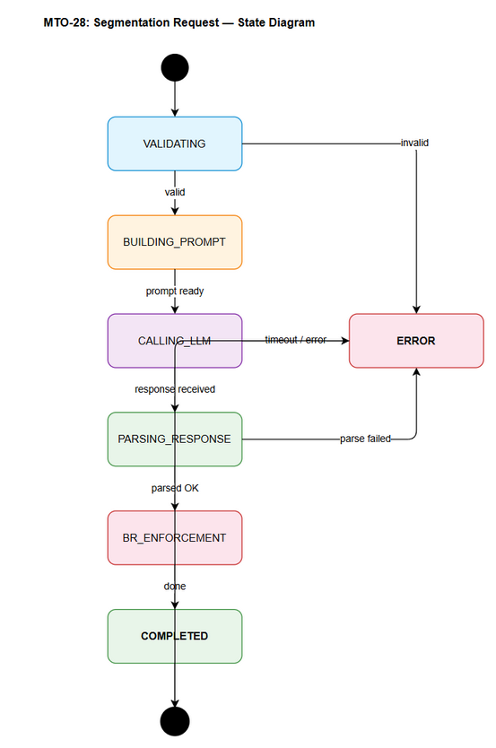
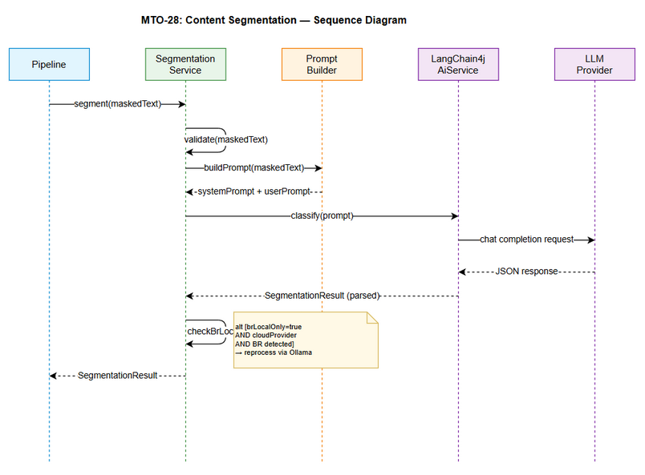

# Functional Specification Document (FSD)

## MCPOrchestration — MTO-28: KB Refinery — LangChain4j Content Segmentation

---

## Document Information

| Field | Value |
|-------|-------|
| Jira Ticket | MTO-28 |
| Title | KB Refinery — LangChain4j Content Segmentation |
| Author | BA Agent + TA Agent |
| Version | 1.0 |
| Date | 2026-05-08 |
| Status | Draft |
| Related BRD | BRD-v1-MTO-28.docx |

---

## Revision History

| Version | Date | Author | Changes |
|---------|------|--------|---------|
| 1.0 | 2026-05-08 | BA Agent | Initiate document — functional specification from BRD |
| 1.1 | 2026-05-08 | TA Agent | Technical enrichment — API contracts, pseudocode, integration specs |

---

## 1. Introduction

### 1.1 Purpose

This FSD specifies the functional behavior of the Content Segmentation Service, which uses LangChain4j to classify PII-masked text into three content layers (Public Metadata, Technical Content, Business Rules) with sensitivity level classification for business rules.

### 1.2 Scope

- ContentSegmentationService interface and implementation
- LangChain4j AiService integration for LLM-based classification
- Prompt engineering with few-shot examples
- Multi-provider LLM support (OpenAI, Ollama, Azure)
- BR sensitivity level classification (Level 1-3)
- Local-only enforcement for sensitive business rules

### 1.3 Definitions & Acronyms

| Term | Definition |
|------|------------|
| BR | Business Rules |
| LLM | Large Language Model |
| PII | Personally Identifiable Information |
| AiService | LangChain4j declarative interface pattern for LLM interaction |
| Few-shot | Prompt technique providing example input/output pairs |
| Segmentation | Classification of text into distinct content categories |

### 1.4 References

| Document | Location |
|----------|----------|
| BRD | BRD-v1-MTO-28.docx |
| MTO-26 (KbEntry Model) | documents/MTO-26/ |
| MTO-27 (PII Masking) | documents/MTO-27/ |
| LangChain4j Docs | https://docs.langchain4j.dev/ |

---

## 2. System Overview

### 2.1 System Context Diagram



The Content Segmentation Service operates within the KB Refinery pipeline:
- **Input**: Receives masked text from PII Masking Engine (MTO-27)
- **Processing**: Uses LangChain4j to interact with configured LLM provider
- **Output**: Returns SegmentationResult to pipeline for KB storage with access controls

### 2.2 System Architecture

The service follows the existing MCPOrchestration architecture patterns:
- Interface/Implementation separation
- Koin DI for dependency injection
- Coroutine-based async processing
- YAML-based configuration

---

## 3. Functional Requirements

### 3.1 Feature: Content Segmentation

**Source:** BRD Story 1

#### 3.1.1 Description

The core segmentation function receives PII-masked text and classifies it into three distinct content categories using an LLM. The classification is performed via a carefully engineered prompt that includes few-shot examples for the financial domain.

#### 3.1.2 Use Case: UC-01 — Segment Masked Text

**Use Case ID:** UC-01
**Actor:** KB Refinery Pipeline
**Preconditions:**
- Masked text is available (output from MTO-27 PiiMaskingEngine)
- At least one LLM provider is configured and accessible
- SegmentationConfig is valid

**Postconditions:**
- SegmentationResult is returned with classified content
- BR sensitivity level is assigned if business rules are detected

**Main Flow:**

| Step | Actor | System | Description |
|------|-------|--------|-------------|
| 1 | Pipeline | | Calls `segment(maskedText: String)` |
| 2 | | Service | Validates input (non-empty, within max length) |
| 3 | | PromptBuilder | Constructs system prompt with role definition and few-shot examples |
| 4 | | PromptBuilder | Constructs user prompt with masked text and classification instructions |
| 5 | | AiService | Sends prompt to configured LLM provider via LangChain4j |
| 6 | | AiService | Receives structured JSON response from LLM |
| 7 | | Service | Parses JSON into SegmentationResult |
| 8 | | Service | Validates result (all fields present, sensitivity level valid) |
| 9 | | Service | Returns SegmentationResult to caller |

**Alternative Flows:**

| ID | Condition | Steps |
|----|-----------|-------|
| AF-01 | No business rules detected in text | Steps 1-8, brSensitivityLevel = null, businessRules = "" |
| AF-02 | BR local-only enabled AND cloud provider used | After Step 7, re-process BR section via local Ollama, merge results |
| AF-03 | Text contains only metadata (no technical/BR content) | Steps 1-8, technicalContent = "", businessRules = "" |

**Exception Flows:**

| ID | Condition | Steps |
|----|-----------|-------|
| EF-01 | Input text is empty or null | Return error: INVALID_INPUT |
| EF-02 | Input text exceeds max length (10,000 chars) | Truncate to max length, log warning, proceed |
| EF-03 | LLM provider timeout (>10s) | Return error: LLM_TIMEOUT, include partial result if available |
| EF-04 | LLM returns invalid JSON | Retry once with stricter prompt, if still invalid return error: INVALID_LLM_RESPONSE |
| EF-05 | LLM provider unavailable | Return error: PROVIDER_UNAVAILABLE |
| EF-06 | Ollama unavailable when br-local-only=true | Log error, return result without BR re-processing, flag as degraded |

#### 3.1.3 Business Rules

| Rule ID | Rule | Source |
|---------|------|--------|
| BR-01 | Public Metadata includes: ticket ID, summary, creation date, status, labels, assignee, priority | BRD Story 1 |
| BR-02 | Technical Content includes: system logs, code (Java/SQL/Kotlin), configs, stack traces, error messages, architecture descriptions | BRD Story 1 |
| BR-03 | Business Rules includes: interest rate formulas, loan conditions, risk thresholds, branching rules, commission rates, SLA definitions | BRD Story 1 |
| BR-04 | BR Sensitivity Level 1 (Confidential): formulas with specific numbers (rates, percentages, fees) | BRD Story 3 |
| BR-05 | BR Sensitivity Level 2 (Internal): conditions and thresholds (approval criteria, risk scores) | BRD Story 3 |
| BR-06 | BR Sensitivity Level 3 (Restricted): general processes and SLAs | BRD Story 3 |
| BR-07 | When br-local-only=true, BR content MUST NOT be sent to cloud LLM | BRD Story 4 |
| BR-08 | Temperature for classification SHOULD be 0.1 (low randomness for consistent results) | BRD Story 2 |
| BR-09 | Max tokens per request SHOULD be 2000 | BRD Story 2 |
| BR-10 | Segmentation MUST complete within 10 seconds | BRD NFR |

#### 3.1.4 Data Specifications

**Input Data:**

| Field | Type | Required | Validation | Description |
|-------|------|----------|------------|-------------|
| maskedText | String | Yes | Non-empty, max 10,000 chars | PII-masked text from MTO-27 |

**Output Data (SegmentationResult):**

| Field | Type | Required | Description |
|-------|------|----------|-------------|
| publicContent | String | Yes | Extracted public metadata (may be empty) |
| technicalContent | String | Yes | Extracted technical content (may be empty) |
| businessRules | String | Yes | Extracted business rules (may be empty) |
| brSensitivityLevel | BrSensitivityLevel? | No | Null if no BR detected; Level1/Level2/Level3 otherwise |
| processingTimeMs | Long | Yes | Time taken for segmentation in milliseconds |
| provider | String | Yes | LLM provider used (openai/ollama/azure) |
| degraded | Boolean | Yes | True if BR local-only enforcement failed (Ollama unavailable) |

**BrSensitivityLevel Enum:**

| Value | Label | Description |
|-------|-------|-------------|
| LEVEL_1 | Confidential | Interest rates, fees, commissions, pricing |
| LEVEL_2 | Internal | Approval conditions, risk thresholds, scoring |
| LEVEL_3 | Restricted | General processes, SLAs, standard procedures |

#### 3.1.5 API Contract (Functional View)

> **Note:** This is an internal service API (Kotlin interface), not an HTTP endpoint.

**Interface:** `ContentSegmentationService`

**Method:** `suspend fun segment(maskedText: String): SegmentationResult`

**Input Parameters:**

| Parameter | Type | Required | Business Rule | Description |
|-----------|------|----------|---------------|-------------|
| maskedText | String | Yes | BR-10 (max 10s) | PII-masked text to classify |

**Output Data:**

| Field | Type | Description |
|-------|------|-------------|
| SegmentationResult | Data class | Contains all classified content + metadata |

**Business Error Scenarios:**

| Scenario | Error Type | Trigger Condition |
|----------|-----------|-------------------|
| Empty input | INVALID_INPUT | maskedText is blank |
| LLM timeout | LLM_TIMEOUT | Provider doesn't respond within 10s |
| Invalid response | INVALID_LLM_RESPONSE | LLM returns non-parseable JSON |
| Provider down | PROVIDER_UNAVAILABLE | Cannot connect to LLM provider |

---

### 3.2 Feature: LLM Provider Configuration

**Source:** BRD Story 2

#### 3.2.1 Description

The service supports multiple LLM providers configurable via YAML. Configuration includes provider selection, model parameters, and connection details.

#### 3.2.2 Use Case: UC-02 — Configure LLM Provider

**Use Case ID:** UC-02
**Actor:** System Administrator
**Preconditions:** application.yml is accessible
**Postconditions:** Service uses configured provider for segmentation

**Main Flow:**

| Step | Actor | System | Description |
|------|-------|--------|-------------|
| 1 | Admin | | Edits application.yml segmentation section |
| 2 | | ConfigManager | Loads and validates segmentation config on startup |
| 3 | | ConfigManager | Resolves environment variables (API keys) |
| 4 | | DI Module | Creates appropriate LangChain4j ChatLanguageModel |
| 5 | | Service | Uses configured model for all segmentation requests |

**Alternative Flows:**

| ID | Condition | Steps |
|----|-----------|-------|
| AF-01 | Ollama provider selected | Create OllamaChatModel with local URL |
| AF-02 | Azure provider selected | Create AzureOpenAiChatModel with Azure endpoint |

**Exception Flows:**

| ID | Condition | Steps |
|----|-----------|-------|
| EF-01 | Invalid provider name | Fail fast on startup with clear error message |
| EF-02 | Missing API key for cloud provider | Fail fast on startup: "API key required for {provider}" |
| EF-03 | Ollama URL unreachable | Log warning, service starts but segmentation will fail |

#### 3.2.3 Business Rules

| Rule ID | Rule | Source |
|---------|------|--------|
| BR-11 | Supported providers: openai, ollama, azure | BRD Story 2 |
| BR-12 | Default temperature: 0.1 | BRD Story 2 |
| BR-13 | Default max tokens: 2000 | BRD Story 2 |
| BR-14 | API keys MUST use environment variable substitution | BRD Story 2 |
| BR-15 | Provider change requires only config change, no code change | BRD Story 2 |

#### 3.2.4 Data Specifications — Configuration

**SegmentationConfig:**

| Field | Type | Required | Default | Description |
|-------|------|----------|---------|-------------|
| provider | String | Yes | "openai" | LLM provider: openai, ollama, azure |
| modelName | String | Yes | "gpt-4o-mini" | Model identifier |
| temperature | Double | No | 0.1 | Randomness (0.0-1.0) |
| maxTokens | Int | No | 2000 | Max response tokens |
| apiKey | String | Conditional | — | Required for openai/azure, env var reference |
| baseUrl | String | Conditional | — | Required for ollama, optional for others |
| timeoutSeconds | Int | No | 10 | Request timeout |
| brLocalOnly | Boolean | No | false | Enforce local LLM for BR content |
| ollamaUrl | String | Conditional | "http://localhost:11434" | Ollama endpoint (required when brLocalOnly=true) |
| ollamaModel | String | Conditional | "llama3" | Ollama model for BR re-processing |

---

### 3.3 Feature: BR Sensitivity Classification

**Source:** BRD Story 3

#### 3.3.1 Description

When business rules are detected in the segmented content, the system classifies them into one of three sensitivity levels based on the content's confidentiality requirements.

#### 3.3.2 Use Case: UC-03 — Classify BR Sensitivity

**Use Case ID:** UC-03
**Actor:** KB Refinery Pipeline (automatic, part of UC-01)
**Preconditions:** Business rules content has been extracted from text
**Postconditions:** brSensitivityLevel is assigned to SegmentationResult

**Main Flow:**

| Step | Actor | System | Description |
|------|-------|--------|-------------|
| 1 | | LLM | Analyzes extracted business rules content |
| 2 | | LLM | Matches content against sensitivity criteria in prompt |
| 3 | | LLM | Returns sensitivity level as part of JSON response |
| 4 | | Service | Maps string level to BrSensitivityLevel enum |

**Alternative Flows:**

| ID | Condition | Steps |
|----|-----------|-------|
| AF-01 | No business rules in text | Skip classification, set brSensitivityLevel = null |
| AF-02 | Multiple sensitivity levels in same text | Use highest (most restrictive) level |

#### 3.3.3 Business Rules

| Rule ID | Rule | Source |
|---------|------|--------|
| BR-16 | Level 1 keywords: lãi suất, phí, commission, tỷ lệ, formula, rate | BRD Story 3 |
| BR-17 | Level 2 keywords: điều kiện duyệt, ngưỡng, threshold, scoring, approval | BRD Story 3 |
| BR-18 | Level 3 keywords: SLA, quy trình, process, workflow | BRD Story 3 |
| BR-19 | When multiple levels detected, use most restrictive (lowest number) | FSD AF-02 |

---

### 3.4 Feature: Local-Only BR Enforcement

**Source:** BRD Story 4

#### 3.4.1 Description

When configured, the service ensures that business rules content is never processed by cloud LLM providers. If the initial segmentation uses a cloud provider and detects BR content, the BR section is re-processed using local Ollama.

#### 3.4.2 Use Case: UC-04 — Enforce Local-Only BR Processing

**Use Case ID:** UC-04
**Actor:** System (automatic enforcement)
**Preconditions:**
- `brLocalOnly = true` in configuration
- Initial segmentation completed with cloud provider
- Business rules content detected in result

**Postconditions:** BR content has been processed only by local LLM

**Main Flow:**

| Step | Actor | System | Description |
|------|-------|--------|-------------|
| 1 | | Service | Checks if brLocalOnly=true AND provider is cloud |
| 2 | | Service | Checks if businessRules in result is non-empty |
| 3 | | Service | Creates separate prompt with ONLY the BR text |
| 4 | | OllamaModel | Re-classifies BR content locally |
| 5 | | Service | Replaces BR section and sensitivity level in result |
| 6 | | Service | Sets result.provider = "ollama" for BR section |

**Exception Flows:**

| ID | Condition | Steps |
|----|-----------|-------|
| EF-01 | Ollama unavailable | Set result.degraded = true, keep cloud-processed BR, log security warning |

---

## 4. Data Model

### 4.1 Entity Relationship Diagram



### 4.2 Logical Entities

#### Entity: SegmentationResult

| Attribute | Type | Required | Business Rule | Description |
|-----------|------|----------|---------------|-------------|
| publicContent | String | Yes | BR-01 | Extracted public metadata |
| technicalContent | String | Yes | BR-02 | Extracted technical content |
| businessRules | String | Yes | BR-03 | Extracted business rules |
| brSensitivityLevel | BrSensitivityLevel? | No | BR-04,05,06 | Sensitivity classification |
| processingTimeMs | Long | Yes | BR-10 | Processing duration |
| provider | String | Yes | BR-11 | Provider used |
| degraded | Boolean | Yes | — | Degraded mode flag |

#### Entity: SegmentationConfig

| Attribute | Type | Required | Business Rule | Description |
|-----------|------|----------|---------------|-------------|
| provider | String | Yes | BR-11 | LLM provider name |
| modelName | String | Yes | — | Model identifier |
| temperature | Double | No | BR-12 | LLM temperature |
| maxTokens | Int | No | BR-13 | Max response tokens |
| apiKey | String | Conditional | BR-14 | API key (env var) |
| baseUrl | String | Conditional | — | Provider base URL |
| timeoutSeconds | Int | No | BR-10 | Request timeout |
| brLocalOnly | Boolean | No | BR-07 | Local-only enforcement |
| ollamaUrl | String | Conditional | — | Ollama endpoint |
| ollamaModel | String | Conditional | — | Ollama model name |

#### Entity: BrSensitivityLevel (Enum)

| Value | Business Rule | Description |
|-------|---------------|-------------|
| LEVEL_1 | BR-04 | Confidential — rates, fees, commissions |
| LEVEL_2 | BR-05 | Internal — conditions, thresholds |
| LEVEL_3 | BR-06 | Restricted — processes, SLAs |

**Relationships:**

| From Entity | To Entity | Cardinality | Description |
|-------------|-----------|-------------|-------------|
| SegmentationResult | BrSensitivityLevel | N:1 | Each result has at most one sensitivity level |
| SegmentationConfig | ContentSegmentationService | 1:1 | Config drives service behavior |

---

## 5. Integration Specifications

### 5.1 External System: LLM Provider (OpenAI)

| Attribute | Value |
|-----------|-------|
| Purpose | Text classification via GPT models |
| Direction | Outbound |
| Data Format | JSON (OpenAI Chat Completions API) |
| Frequency | On-demand (per segmentation request) |

**Data Exchange:**

| Our Data | External Data | Direction | Business Rule |
|----------|--------------|-----------|---------------|
| System prompt + user prompt | Chat completion response | Send/Receive | BR-08, BR-09 |
| maskedText (in user prompt) | Classified JSON | Send/Receive | BR-01,02,03 |

### 5.2 External System: Ollama (Local LLM)

| Attribute | Value |
|-----------|-------|
| Purpose | Local LLM for BR-sensitive content |
| Direction | Outbound |
| Data Format | JSON (Ollama API, OpenAI-compatible) |
| Frequency | On-demand (when brLocalOnly=true and BR detected) |

**Data Exchange:**

| Our Data | External Data | Direction | Business Rule |
|----------|--------------|-----------|---------------|
| BR classification prompt | Classified BR JSON | Send/Receive | BR-07 |

### 5.3 Internal System: PII Masking Engine (MTO-27)

| Attribute | Value |
|-----------|-------|
| Purpose | Provides masked text as input |
| Direction | Inbound |
| Data Format | String (masked text) |
| Frequency | Per-ticket processing |

---

## 6. Processing Logic

### 6.1 Content Segmentation Process

**Trigger:** Pipeline calls `segment(maskedText)`
**Input:** Masked text string
**Output:** SegmentationResult

**Processing Steps:**

| Step | Description | Error Handling |
|------|-------------|----------------|
| 1 | Validate input (non-empty, ≤10,000 chars) | Return INVALID_INPUT error |
| 2 | Build system prompt with role + few-shot examples | N/A (static template) |
| 3 | Build user prompt with masked text | N/A |
| 4 | Call LLM via LangChain4j AiService | Timeout → LLM_TIMEOUT |
| 5 | Parse JSON response into SegmentationResult | Invalid JSON → retry once |
| 6 | Validate result fields | Missing fields → INVALID_LLM_RESPONSE |
| 7 | Check BR local-only enforcement | Ollama unavailable → degraded mode |
| 8 | Record processing time | N/A |
| 9 | Return SegmentationResult | N/A |

**Pseudocode:**

```kotlin
suspend fun segment(maskedText: String): SegmentationResult {
    // Step 1: Validate
    require(maskedText.isNotBlank()) { "Input text must not be blank" }
    val text = if (maskedText.length > MAX_LENGTH) maskedText.take(MAX_LENGTH) else maskedText
    
    val startTime = System.currentTimeMillis()
    
    // Steps 2-4: Call LLM via AiService
    val llmResponse = withTimeout(config.timeoutSeconds * 1000L) {
        aiService.classify(text)
    }
    
    // Steps 5-6: Parse and validate
    val result = parseResponse(llmResponse)
    
    // Step 7: BR local-only enforcement
    val finalResult = if (config.brLocalOnly && isCloudProvider() && result.businessRules.isNotEmpty()) {
        reprocessBrLocally(result)
    } else {
        result
    }
    
    // Step 8: Record timing
    return finalResult.copy(
        processingTimeMs = System.currentTimeMillis() - startTime,
        provider = config.provider
    )
}
```

### 6.2 BR Local-Only Re-processing

**Trigger:** brLocalOnly=true AND cloud provider used AND BR content detected
**Input:** SegmentationResult with BR content from cloud
**Output:** Updated SegmentationResult with locally-processed BR

**Pseudocode:**

```kotlin
private suspend fun reprocessBrLocally(result: SegmentationResult): SegmentationResult {
    return try {
        val localResult = ollamaAiService.classifyBr(result.businessRules)
        result.copy(
            businessRules = localResult.businessRules,
            brSensitivityLevel = localResult.brSensitivityLevel,
            provider = "${config.provider}+ollama"
        )
    } catch (e: Exception) {
        logger.warn("Ollama unavailable for BR re-processing, using degraded mode", e)
        result.copy(degraded = true)
    }
}
```

---

## 7. Security Requirements

### 7.1 Authentication & Authorization

| Role | Permissions | Access |
|------|-------------|--------|
| KB Refinery Pipeline | Execute segmentation | Internal service call |
| System Administrator | Configure providers | application.yml access |

### 7.2 Data Sensitivity Classification

| Data Type | Classification | Business Requirement |
|-----------|---------------|---------------------|
| Masked text (input) | Internal | Already PII-masked, safe for cloud LLM |
| Public Metadata (output) | Public | Can be stored openly |
| Technical Content (output) | Internal | Standard access controls |
| Business Rules (output) | Confidential/Internal/Restricted | Based on brSensitivityLevel |
| API Keys | Secret | Environment variables only |

### 7.3 Audit Trail

| Event | Logged Fields | Retention | Business Reason |
|-------|--------------|-----------|-----------------|
| Segmentation request | timestamp, textLength, provider | 90 days | Operational monitoring |
| BR local-only enforcement | timestamp, originalProvider, reprocessed | 90 days | Security compliance |
| Degraded mode activated | timestamp, reason, ollamaStatus | 90 days | Security incident tracking |
| Provider error | timestamp, provider, errorType | 90 days | Troubleshooting |

---

## 8. Non-Functional Requirements

| Category | Business Requirement | Acceptance Criteria |
|----------|---------------------|---------------------|
| Performance | Segmentation < 10 seconds | p95 latency < 10s for text ≤ 10,000 chars |
| Performance | Token efficiency | Prompt + response < 4,000 tokens |
| Reliability | Graceful degradation | Service returns error result, never crashes |
| Availability | Service available when LLM is available | No additional availability requirements beyond LLM |
| Scalability | Handle concurrent requests | Support 10 concurrent segmentation requests |
| Testability | Mockable LLM interaction | Interface-based design enables unit testing |

---

## 9. Error Handling (User-Facing)

### 9.1 Error Scenarios

| Scenario | Severity | Error Code | Expected Behavior |
|----------|----------|-----------|-------------------|
| Empty input text | Warning | INVALID_INPUT | Return error immediately, no LLM call |
| LLM timeout | Critical | LLM_TIMEOUT | Return timeout error after 10s |
| Invalid LLM response | Warning | INVALID_LLM_RESPONSE | Retry once, then return error |
| Provider unavailable | Critical | PROVIDER_UNAVAILABLE | Return error, log for monitoring |
| Ollama unavailable (br-local-only) | Warning | BR_LOCAL_DEGRADED | Continue with degraded flag, log security warning |
| Text exceeds max length | Info | INPUT_TRUNCATED | Truncate and proceed, log warning |

---

## 10. Testing Considerations

### 10.1 Test Scenarios

| ID | Scenario | Input | Expected Output | Priority |
|----|----------|-------|-----------------|----------|
| TC-01 | Mixed content segmentation | Text with metadata + code + BR | All 3 sections populated, correct sensitivity | High |
| TC-02 | Metadata-only text | "Ticket MTO-100, Status: Open" | publicContent populated, others empty | High |
| TC-03 | Technical-only text | Stack trace + code snippet | technicalContent populated, others empty | High |
| TC-04 | BR Level 1 detection | "lãi suất = base + 2.5%" | brSensitivityLevel = LEVEL_1 | High |
| TC-05 | BR Level 2 detection | "điều kiện duyệt: thu nhập >= 10M" | brSensitivityLevel = LEVEL_2 | High |
| TC-06 | BR Level 3 detection | "SLA xử lý: 3 ngày" | brSensitivityLevel = LEVEL_3 | Medium |
| TC-07 | Empty input | "" | INVALID_INPUT error | High |
| TC-08 | LLM timeout | Slow provider (>10s) | LLM_TIMEOUT error | High |
| TC-09 | BR local-only enforcement | Cloud + BR detected + brLocalOnly=true | Re-processed via Ollama | High |
| TC-10 | Ollama unavailable | brLocalOnly=true, Ollama down | degraded=true | Medium |
| TC-11 | Provider configuration | Each provider type | Correct model instantiation | Medium |
| TC-12 | Max length input | 10,001 char text | Truncated, processed successfully | Low |

---

## 11. Appendix

### State Diagram — Segmentation Request Lifecycle



### Sequence Diagram — Main Segmentation Flow



### Diagram Index

| # | Diagram | Image | Source (editable) |
|---|---------|-------|-------------------|
| 1 | System Context | [system-context.png](diagrams/system-context.png) | [system-context.drawio](diagrams/system-context.drawio) |
| 2 | ER Diagram | [er-diagram.png](diagrams/er-diagram.png) | [er-diagram.drawio](diagrams/er-diagram.drawio) |
| 3 | State Diagram | [state-segmentation.png](diagrams/state-segmentation.png) | [state-segmentation.drawio](diagrams/state-segmentation.drawio) |
| 4 | Sequence Diagram | [sequence-segmentation.png](diagrams/sequence-segmentation.png) | [sequence-segmentation.drawio](diagrams/sequence-segmentation.drawio) |

### Open Issues

| # | Question | Status | Answer |
|---|----------|--------|--------|
| 1 | Should segmentation results be cached for identical inputs? | Open | — |
| 2 | What is the fallback if all LLM providers are unavailable? | Resolved | Return PROVIDER_UNAVAILABLE error |
| 3 | Should the service support batch segmentation? | Open | Not in scope for MTO-28 |
