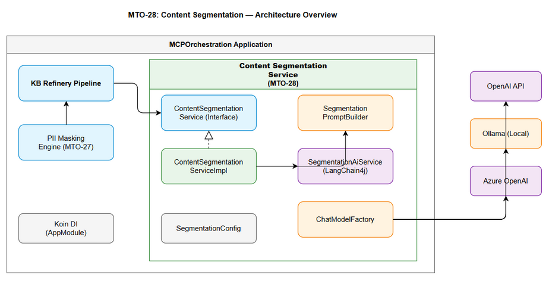
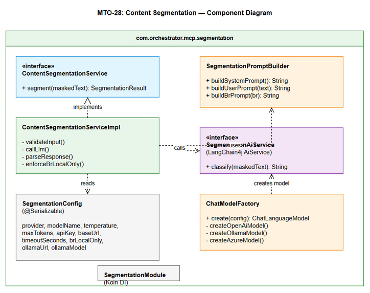
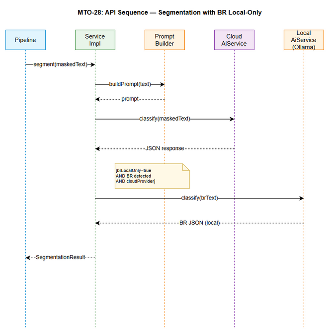

# Technical Design Document (TDD)

## MCPOrchestration — MTO-28: KB Refinery — LangChain4j Content Segmentation

---

## Document Information

| Field | Value |
|-------|-------|
| Jira Ticket | MTO-28 |
| Title | KB Refinery — LangChain4j Content Segmentation |
| Author | SA Agent |
| Version | 1.0 |
| Date | 2026-05-08 |
| Status | Draft |
| Related BRD | BRD-v1-MTO-28.docx |
| Related FSD | FSD-v1-MTO-28.docx |

---

## Author Tracking

| Role | Name - Position | Responsibility |
|------|-----------------|----------------|
| Author | SA Agent – Solution Architect | Create document |
| Peer Reviewer | TA Agent – Technical Architect | Review document |

---

## Revision History

| Version | Date | Author | Changes |
|---------|------|--------|---------|
| 1.0 | 2026-05-08 | SA Agent | Initiate document — technical design from FSD |

---

## Sign-Off

| Name | Signature and date |
|------|--------------------|
| | ☐ I agree and confirm the technical design in this TDD |
| | ☐ I agree and confirm the technical design in this TDD |

---

## 1. Introduction

### 1.1 Purpose

This TDD specifies the technical implementation of the Content Segmentation Service using LangChain4j for LLM-based text classification. It covers architecture decisions, class design, integration patterns, and deployment configuration.

### 1.2 Scope

- LangChain4j integration with Kotlin coroutines
- Multi-provider LLM support (OpenAI, Ollama, Azure)
- Prompt engineering implementation
- Configuration management
- Koin DI module
- Error handling and resilience patterns

### 1.3 Technology Stack

| Layer | Technology | Version |
|-------|-----------|---------|
| Language | Kotlin | 2.3.20 |
| Platform | JVM | 21 |
| LLM Framework | LangChain4j | 1.0.0-beta1 |
| DI | Koin | 4.1.1 |
| Serialization | kotlinx.serialization | 1.8.1 |
| Coroutines | kotlinx.coroutines | 1.10.2 |
| HTTP Client | Ktor Client (CIO) | 3.4.0 |
| Logging | Logback | 1.5.18 |
| Testing | Kotest + MockK | 5.9.1 / 1.14.2 |

### 1.4 Design Principles

- **Interface-first**: All services defined as interfaces with separate implementations
- **SOLID**: Single responsibility per class, dependency inversion via Koin
- **Coroutine-native**: All I/O operations are suspend functions
- **Fail-fast configuration**: Invalid config detected at startup
- **Graceful degradation**: LLM failures don't crash the pipeline

### 1.5 Constraints

- File ≤ 200 lines
- Function ≤ 20 lines
- Must integrate with existing Koin DI setup in AppModule.kt
- Must follow existing package naming conventions
- LangChain4j Java API must be wrapped for Kotlin coroutine compatibility

### 1.6 References

| Document | Location |
|----------|----------|
| BRD | BRD-v1-MTO-28.docx |
| FSD | FSD-v1-MTO-28.docx |
| Project Structure | .analysis/code-intelligence/project-structure.md |

---

## 2. System Architecture

### 2.1 Architecture Overview

The Content Segmentation Service is a new module within the MCPOrchestration application. It integrates with the existing architecture by:
- Registering in the Koin DI container
- Following the Interface/Impl pattern used throughout the project
- Using the existing configuration management approach (YAML + env vars)



### 2.2 Component Diagram



| Component | Responsibility | Technology |
|-----------|---------------|------------|
| ContentSegmentationService | Public API interface | Kotlin interface |
| ContentSegmentationServiceImpl | Orchestrates segmentation flow | Kotlin + Coroutines |
| SegmentationPromptBuilder | Constructs system/user prompts | Kotlin (pure) |
| SegmentationAiService | LangChain4j AiService interface | LangChain4j annotations |
| SegmentationConfig | Configuration data class | kotlinx.serialization |
| SegmentationModule | Koin DI bindings | Koin |
| ChatModelFactory | Creates provider-specific ChatLanguageModel | LangChain4j |

### 2.3 Deployment Architecture

The segmentation service deploys as part of the existing MCPOrchestration fat JAR. No separate deployment needed.

| Environment | LLM Provider | Notes |
|-------------|-------------|-------|
| Development | Ollama (local) | No API key needed |
| Testing | MockK (mocked) | No real LLM calls |
| Staging | OpenAI (gpt-4o-mini) | Low-cost model |
| Production | Configurable | Per-deployment choice |

### 2.4 Communication Patterns

| From | To | Protocol | Pattern | Description |
|------|----|----------|---------|-------------|
| Pipeline | SegmentationService | In-process | Sync (suspend) | Direct Kotlin function call |
| SegmentationService | OpenAI | HTTPS | Async | REST API via LangChain4j |
| SegmentationService | Ollama | HTTP | Async | Local REST API via LangChain4j |
| SegmentationService | Azure | HTTPS | Async | REST API via LangChain4j |

---

## 3. API Design

### 3.1 API Overview

This is an internal Kotlin API (not HTTP endpoint). The service is consumed programmatically within the KB Refinery pipeline.

| # | Interface Method | Description | Source |
|---|-----------------|-------------|--------|
| 1 | `segment(maskedText: String): SegmentationResult` | Main segmentation entry point | UC-01 |

### 3.2 Internal API: ContentSegmentationService

**Implements:** UC-01, UC-03, UC-04

```kotlin
interface ContentSegmentationService {
    /**
     * Segments masked text into Public Metadata, Technical Content, and Business Rules.
     * 
     * @param maskedText PII-masked text from MTO-27 (max 10,000 chars)
     * @return SegmentationResult with classified content and metadata
     * @throws SegmentationException on unrecoverable errors
     */
    suspend fun segment(maskedText: String): SegmentationResult
}
```

**Error Responses:**

| Exception | Error Code | When Thrown |
|-----------|-----------|------------|
| InvalidInputException | INVALID_INPUT | maskedText is blank |
| LlmTimeoutException | LLM_TIMEOUT | Provider doesn't respond within timeout |
| InvalidLlmResponseException | INVALID_LLM_RESPONSE | LLM returns unparseable response after retry |
| ProviderUnavailableException | PROVIDER_UNAVAILABLE | Cannot connect to LLM provider |

---

## 4. Database Design

No database changes required. SegmentationResult is an in-memory data class passed through the pipeline. The downstream KB storage (separate ticket) handles persistence.

---

## 5. Class / Module Design

### 5.1 Package Structure

```
com.orchestrator.mcp.segmentation/
├── ContentSegmentationService.kt          # Interface (public API)
├── ContentSegmentationServiceImpl.kt      # Implementation
├── model/
│   ├── SegmentationResult.kt             # Result data class
│   ├── BrSensitivityLevel.kt            # Enum
│   └── SegmentationException.kt          # Sealed exception hierarchy
├── prompt/
│   ├── SegmentationPromptBuilder.kt      # Prompt construction
│   └── SegmentationAiService.kt          # LangChain4j AiService interface
├── provider/
│   └── ChatModelFactory.kt              # Creates ChatLanguageModel per provider
├── config/
│   └── SegmentationConfig.kt            # @Serializable config data class
└── di/
    └── SegmentationModule.kt            # Koin module
```

### 5.2 Key Interfaces and Classes

#### ContentSegmentationService.kt

```kotlin
package com.orchestrator.mcp.segmentation

import com.orchestrator.mcp.segmentation.model.SegmentationResult

interface ContentSegmentationService {
    suspend fun segment(maskedText: String): SegmentationResult
}
```

#### SegmentationResult.kt

```kotlin
package com.orchestrator.mcp.segmentation.model

import kotlinx.serialization.Serializable

@Serializable
data class SegmentationResult(
    val publicContent: String,
    val technicalContent: String,
    val businessRules: String,
    val brSensitivityLevel: BrSensitivityLevel? = null,
    val processingTimeMs: Long = 0,
    val provider: String = "",
    val degraded: Boolean = false
)
```

#### BrSensitivityLevel.kt

```kotlin
package com.orchestrator.mcp.segmentation.model

import kotlinx.serialization.Serializable

@Serializable
enum class BrSensitivityLevel(val label: String, val description: String) {
    LEVEL_1("Confidential", "Interest rates, fees, commissions, pricing"),
    LEVEL_2("Internal", "Approval conditions, risk thresholds, scoring"),
    LEVEL_3("Restricted", "General processes, SLAs, standard procedures")
}
```

#### SegmentationConfig.kt

```kotlin
package com.orchestrator.mcp.segmentation.config

import kotlinx.serialization.Serializable

@Serializable
data class SegmentationConfig(
    val provider: String = "openai",
    val modelName: String = "gpt-4o-mini",
    val temperature: Double = 0.1,
    val maxTokens: Int = 2000,
    val apiKey: String? = null,
    val baseUrl: String? = null,
    val timeoutSeconds: Int = 10,
    val brLocalOnly: Boolean = false,
    val ollamaUrl: String = "http://localhost:11434",
    val ollamaModel: String = "llama3"
)
```

#### SegmentationAiService.kt (LangChain4j Interface)

```kotlin
package com.orchestrator.mcp.segmentation.prompt

import dev.langchain4j.service.SystemMessage
import dev.langchain4j.service.UserMessage

interface SegmentationAiService {
    @SystemMessage("""
    You are a Financial Domain Content Classifier. Your task is to analyze text from 
    financial institution tickets and classify content into exactly 3 categories.
    
    Output MUST be valid JSON with this exact structure:
    {
      "publicContent": "...",
      "technicalContent": "...",
      "businessRules": "...",
      "brSensitivityLevel": "LEVEL_1" | "LEVEL_2" | "LEVEL_3" | null
    }
    
    Classification rules:
    - publicContent: Ticket metadata (ID, summary, dates, status, labels, assignee, priority)
    - technicalContent: Code, logs, stack traces, configs, SQL, error messages, architecture
    - businessRules: Interest rates, loan conditions, risk thresholds, fees, SLAs, processes
    
    Sensitivity levels for businessRules:
    - LEVEL_1 (Confidential): Specific numbers for rates, fees, commissions, pricing formulas
    - LEVEL_2 (Internal): Conditions, thresholds, scoring criteria, approval rules
    - LEVEL_3 (Restricted): General processes, SLAs, workflow definitions
    - null: When no business rules are found
    
    If multiple sensitivity levels apply, use the MOST RESTRICTIVE (lowest number).
    """)
    @UserMessage("Classify the following masked text:\n\n{{maskedText}}")
    fun classify(@dev.langchain4j.service.V("maskedText") maskedText: String): String
}
```

#### ChatModelFactory.kt

```kotlin
package com.orchestrator.mcp.segmentation.provider

import com.orchestrator.mcp.segmentation.config.SegmentationConfig
import dev.langchain4j.model.chat.ChatLanguageModel

class ChatModelFactory {
    fun create(config: SegmentationConfig): ChatLanguageModel {
        return when (config.provider.lowercase()) {
            "openai" -> createOpenAiModel(config)
            "ollama" -> createOllamaModel(config)
            "azure" -> createAzureModel(config)
            else -> throw IllegalArgumentException(
                "Unsupported provider: ${config.provider}. Supported: openai, ollama, azure"
            )
        }
    }
    
    private fun createOpenAiModel(config: SegmentationConfig): ChatLanguageModel {
        // Uses dev.langchain4j.model.openai.OpenAiChatModel
        TODO("Implementation with OpenAI builder")
    }
    
    private fun createOllamaModel(config: SegmentationConfig): ChatLanguageModel {
        // Uses dev.langchain4j.model.ollama.OllamaChatModel
        TODO("Implementation with Ollama builder")
    }
    
    private fun createAzureModel(config: SegmentationConfig): ChatLanguageModel {
        // Uses dev.langchain4j.model.azure.AzureOpenAiChatModel
        TODO("Implementation with Azure builder")
    }
}
```

#### ContentSegmentationServiceImpl.kt

```kotlin
package com.orchestrator.mcp.segmentation

import com.orchestrator.mcp.segmentation.config.SegmentationConfig
import com.orchestrator.mcp.segmentation.model.*
import com.orchestrator.mcp.segmentation.prompt.SegmentationAiService
import kotlinx.coroutines.withTimeout
import kotlinx.serialization.json.Json
import org.slf4j.LoggerFactory

class ContentSegmentationServiceImpl(
    private val config: SegmentationConfig,
    private val aiService: SegmentationAiService,
    private val localAiService: SegmentationAiService? // For BR local-only
) : ContentSegmentationService {

    private val logger = LoggerFactory.getLogger(this::class.java)
    private val json = Json { ignoreUnknownKeys = true }

    override suspend fun segment(maskedText: String): SegmentationResult {
        validateInput(maskedText)
        val text = truncateIfNeeded(maskedText)
        val startTime = System.currentTimeMillis()
        
        val rawResponse = callLlm(text)
        val result = parseResponse(rawResponse)
        val finalResult = enforceBrLocalOnly(result)
        
        return finalResult.copy(
            processingTimeMs = System.currentTimeMillis() - startTime,
            provider = config.provider
        )
    }
    
    private fun validateInput(text: String) { /* ... */ }
    private fun truncateIfNeeded(text: String): String { /* ... */ }
    private suspend fun callLlm(text: String): String { /* ... */ }
    private fun parseResponse(raw: String): SegmentationResult { /* ... */ }
    private suspend fun enforceBrLocalOnly(result: SegmentationResult): SegmentationResult { /* ... */ }
}
```

#### SegmentationModule.kt (Koin)

```kotlin
package com.orchestrator.mcp.segmentation.di

import com.orchestrator.mcp.segmentation.ContentSegmentationService
import com.orchestrator.mcp.segmentation.ContentSegmentationServiceImpl
import com.orchestrator.mcp.segmentation.config.SegmentationConfig
import com.orchestrator.mcp.segmentation.provider.ChatModelFactory
import org.koin.dsl.module

val segmentationModule = module {
    single { SegmentationConfig() } // Loaded from OrchestratorConfig
    single { ChatModelFactory() }
    single<ContentSegmentationService> {
        ContentSegmentationServiceImpl(
            config = get(),
            aiService = get(), // Created by ChatModelFactory
            localAiService = null // Created only if brLocalOnly=true
        )
    }
}
```

### 5.3 Design Patterns

| Pattern | Where Used | Rationale |
|---------|-----------|-----------|
| Interface/Impl | ContentSegmentationService | Testability, DI, SOLID |
| Factory | ChatModelFactory | Multi-provider support without conditionals in service |
| Strategy | Provider selection | Each provider has different config/initialization |
| Builder | SegmentationPromptBuilder | Complex prompt construction with few-shot examples |
| Template Method | AiService interface | LangChain4j pattern for declarative LLM interaction |

### 5.4 Error Handling

```kotlin
sealed class SegmentationException(message: String, cause: Throwable? = null) 
    : Exception(message, cause) {
    
    class InvalidInputException(message: String) : SegmentationException(message)
    class LlmTimeoutException(timeoutMs: Long) : SegmentationException("LLM timeout after ${timeoutMs}ms")
    class InvalidLlmResponseException(raw: String, cause: Throwable?) : SegmentationException("Invalid LLM response: ${raw.take(100)}", cause)
    class ProviderUnavailableException(provider: String, cause: Throwable?) : SegmentationException("Provider unavailable: $provider", cause)
}
```

---

## 6. Integration Design

### 6.1 External System: LLM Providers (via LangChain4j)

| Attribute | Value |
|-----------|-------|
| Protocol | HTTPS (OpenAI/Azure), HTTP (Ollama) |
| Library | LangChain4j 1.0.0-beta1 |
| Authentication | Bearer token (OpenAI), API key (Azure), None (Ollama) |
| Timeout | Configurable (default 10s) |
| Retry Policy | 1 retry on invalid JSON response |
| Circuit Breaker | Not implemented (single-call service) |

**Sequence Diagram:**



### 6.2 LangChain4j Integration Details

**Dependency (build.gradle.kts):**

```kotlin
dependencies {
    implementation("dev.langchain4j:langchain4j:1.0.0-beta1")
    implementation("dev.langchain4j:langchain4j-open-ai:1.0.0-beta1")
    implementation("dev.langchain4j:langchain4j-ollama:1.0.0-beta1")
    implementation("dev.langchain4j:langchain4j-azure-open-ai:1.0.0-beta1")
}
```

**AiService Creation:**

```kotlin
val aiService = AiServices.builder(SegmentationAiService::class.java)
    .chatLanguageModel(chatModel)
    .build()
```

**Coroutine Wrapping:**

LangChain4j is blocking Java API. Wrap in `withContext(Dispatchers.IO)`:

```kotlin
private suspend fun callLlm(text: String): String = withContext(Dispatchers.IO) {
    withTimeout(config.timeoutSeconds * 1000L) {
        aiService.classify(text)
    }
}
```

---

## 7. Security Design

### 7.1 Authentication

| Provider | Auth Method | Key Storage |
|----------|------------|-------------|
| OpenAI | Bearer token in Authorization header | Env var: `OPENAI_API_KEY` |
| Azure | API key in header | Env var: `AZURE_OPENAI_KEY` |
| Ollama | None (local) | N/A |

### 7.2 Data Protection

| Data Type | At Rest | In Transit | In Logs |
|-----------|---------|------------|---------|
| Masked text (input) | N/A (in-memory) | TLS 1.2+ (to cloud) | Text length only |
| API keys | Env vars | TLS 1.2+ | Excluded |
| Business Rules | N/A (in-memory) | Local only (if brLocalOnly) | Excluded |
| SegmentationResult | N/A (in-memory) | N/A (in-process) | Summary only |

### 7.3 BR Local-Only Enforcement

```kotlin
private suspend fun enforceBrLocalOnly(result: SegmentationResult): SegmentationResult {
    if (!config.brLocalOnly) return result
    if (result.businessRules.isBlank()) return result
    if (config.provider == "ollama") return result // Already local
    
    // Re-process BR via local Ollama
    return try {
        val localResult = callLocalLlm(result.businessRules)
        result.copy(
            businessRules = localResult.businessRules,
            brSensitivityLevel = localResult.brSensitivityLevel,
            provider = "${config.provider}+ollama"
        )
    } catch (e: Exception) {
        logger.warn("BR local-only enforcement failed: Ollama unavailable", e)
        result.copy(degraded = true)
    }
}
```

### 7.4 Input Validation

| Field | Validation | Sanitization |
|-------|-----------|--------------|
| maskedText | Non-blank, max 10,000 chars | Truncate if over limit |
| config.provider | Must be: openai, ollama, azure | Lowercase comparison |
| config.temperature | 0.0 ≤ t ≤ 1.0 | Clamp to range |
| config.maxTokens | 100 ≤ t ≤ 8000 | Clamp to range |
| config.timeoutSeconds | 1 ≤ t ≤ 60 | Clamp to range |

---

## 8. Performance & Scalability

### 8.1 Performance Targets

| Operation | Target | Measurement |
|-----------|--------|-------------|
| Full segmentation (cloud) | < 10s p95 | End-to-end including LLM call |
| Full segmentation (local) | < 30s p95 | Ollama is slower |
| Prompt construction | < 5ms | In-memory string operations |
| Response parsing | < 10ms | JSON deserialization |
| BR re-processing | < 15s | Additional Ollama call |

### 8.2 Token Optimization

| Component | Estimated Tokens |
|-----------|-----------------|
| System prompt (with few-shot) | ~800 tokens |
| User prompt (10K chars input) | ~2,500 tokens |
| Response | ~500 tokens |
| **Total per request** | **~3,800 tokens** |

Strategy: Keep system prompt concise, use structured output format to minimize response tokens.

### 8.3 Concurrency

- Service is stateless → safe for concurrent use
- LangChain4j ChatLanguageModel is thread-safe
- Use `Dispatchers.IO` for blocking LLM calls (default 64 threads)
- No connection pooling needed (LangChain4j manages HTTP connections)

---

## 9. Monitoring & Observability

### 9.1 Logging

| Log Event | Level | Fields | Destination |
|-----------|-------|--------|-------------|
| Segmentation started | INFO | textLength, provider | stdout/logback |
| Segmentation completed | INFO | textLength, processingTimeMs, brLevel | stdout/logback |
| LLM timeout | WARN | provider, timeoutMs | stdout/logback |
| Invalid LLM response | WARN | responsePreview (first 100 chars) | stdout/logback |
| Provider unavailable | ERROR | provider, errorMessage | stdout/logback |
| BR local-only degraded | WARN | reason, ollamaStatus | stdout/logback |
| Config loaded | INFO | provider, model, brLocalOnly | stdout/logback |

### 9.2 Metrics (Future)

| Metric | Type | Description |
|--------|------|-------------|
| segmentation_requests_total | Counter | Total segmentation requests |
| segmentation_duration_ms | Histogram | Processing time distribution |
| segmentation_errors_total | Counter | Error count by type |
| segmentation_br_level | Counter | BR sensitivity level distribution |
| segmentation_token_usage | Histogram | Token usage per request |

---

## 10. Deployment Considerations

### 10.1 Environment Configuration

**application.yml addition:**

```yaml
orchestrator:
  segmentation:
    provider: "openai"                    # openai | ollama | azure
    model-name: "gpt-4o-mini"            # Model identifier
    temperature: 0.1                      # Low for classification
    max-tokens: 2000                      # Response limit
    api-key: "${OPENAI_API_KEY}"          # Env var reference
    base-url: null                        # Override for custom endpoints
    timeout-seconds: 10                   # Request timeout
    br-local-only: false                  # Enforce local LLM for BR
    ollama-url: "http://localhost:11434"  # Ollama endpoint
    ollama-model: "llama3"               # Ollama model for BR
```

### 10.2 Feature Flags

| Flag | Default | Description |
|------|---------|-------------|
| segmentation.enabled | true | Enable/disable segmentation in pipeline |
| segmentation.br-local-only | false | Enforce local LLM for business rules |

### 10.3 Rollback Strategy

1. Set `segmentation.enabled = false` in config
2. Pipeline skips segmentation, passes raw text to KB storage
3. No data migration needed (segmentation is stateless)

---

## 11. Implementation Checklist

### Files to Create

| # | File | Package | Lines (est.) | Priority |
|---|------|---------|-------------|----------|
| 1 | ContentSegmentationService.kt | segmentation | ~15 | P0 |
| 2 | ContentSegmentationServiceImpl.kt | segmentation | ~120 | P0 |
| 3 | SegmentationResult.kt | segmentation.model | ~20 | P0 |
| 4 | BrSensitivityLevel.kt | segmentation.model | ~15 | P0 |
| 5 | SegmentationException.kt | segmentation.model | ~20 | P0 |
| 6 | SegmentationConfig.kt | segmentation.config | ~25 | P0 |
| 7 | SegmentationAiService.kt | segmentation.prompt | ~50 | P0 |
| 8 | SegmentationPromptBuilder.kt | segmentation.prompt | ~80 | P1 |
| 9 | ChatModelFactory.kt | segmentation.provider | ~80 | P0 |
| 10 | SegmentationModule.kt | segmentation.di | ~30 | P0 |

### Files to Modify

| # | File | Change | Priority |
|---|------|--------|----------|
| 1 | build.gradle.kts | Add LangChain4j dependencies | P0 |
| 2 | AppModule.kt | Include segmentationModule | P0 |
| 3 | OrchestratorConfig.kt | Add segmentation config section | P0 |
| 4 | application.yml | Add segmentation config defaults | P0 |

### Dependencies to Add (build.gradle.kts)

```kotlin
// LangChain4j
implementation("dev.langchain4j:langchain4j:1.0.0-beta1")
implementation("dev.langchain4j:langchain4j-open-ai:1.0.0-beta1")
implementation("dev.langchain4j:langchain4j-ollama:1.0.0-beta1")
implementation("dev.langchain4j:langchain4j-azure-open-ai:1.0.0-beta1")
```

---

## 12. Appendix

### Glossary

| Term | Definition |
|------|------------|
| AiService | LangChain4j pattern: annotated interface auto-implemented by framework |
| ChatLanguageModel | LangChain4j abstraction for chat-based LLM interaction |
| Few-shot | Prompt technique: provide examples to guide LLM output format |
| Suspend function | Kotlin coroutine function that can be paused/resumed |

### Open Questions

| # | Question | Status | Answer |
|---|----------|--------|--------|
| 1 | LangChain4j version stability (beta) | Resolved | Use 1.0.0-beta1, pin version |
| 2 | Kotlin coroutine compatibility | Resolved | Wrap blocking calls in Dispatchers.IO |
| 3 | Token counting for cost monitoring | Open | Future enhancement |

### Diagram Index

| # | Diagram | Image | Source (editable) |
|---|---------|-------|-------------------|
| 1 | Architecture Overview | [architecture.png](diagrams/architecture.png) | [architecture.drawio](diagrams/architecture.drawio) |
| 2 | Component Diagram | [component.png](diagrams/component.png) | [component.drawio](diagrams/component.drawio) |
| 3 | Class Diagram | [class-diagram.png](diagrams/class-diagram.png) | [class-diagram.drawio](diagrams/class-diagram.drawio) |
| 4 | API Sequence | [api-sequence-segmentation.png](diagrams/api-sequence-segmentation.png) | [api-sequence-segmentation.drawio](diagrams/api-sequence-segmentation.drawio) |
