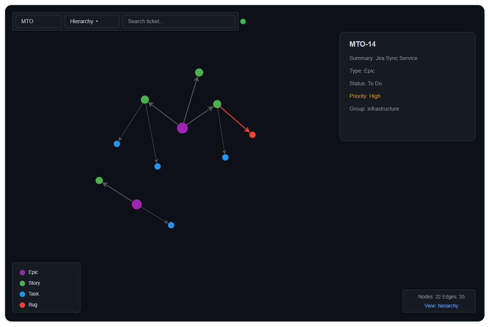

# UI Specification Document

## MTO-38: KB Server — 3D Force Graph Viewer

---

## Document Information

| Field | Value |
|-------|-------|
| Ticket | MTO-38 |
| Feature | KB Server Graph Viewer (Knowledge Base Visualization) |
| Tech Stack | HTML + Vanilla JS + 3d-force-graph.js (CDN) |
| Theme | Dark (GitHub-inspired) |
| Endpoint | `/graph` (kb-server, port 9181) |
| Status | **Implemented** — documenting existing design |
| Source File | `kb-server/src/main/resources/static/graph-viewer.html` |

---

## Design System

```css
:root {
    --bg: #0d1117;
    --surface: #161b22;
    --border: #30363d;
    --text: #c9d1d9;
    --muted: #8b949e;
    --accent: #58a6ff;
}
```

### Component Patterns (Existing)

| Component | Style |
|-----------|-------|
| Controls container | `position: fixed; top: 16px; left: 16px; display: flex; gap: 8px;` |
| Input/Select | `padding: 6px 12px; border-radius: 6px; border: 1px solid var(--border); background: var(--surface); color: var(--text); font-size: 0.85rem;` |
| Details panel | `position: fixed; top: 60px; right: 16px; width: 300px; background: var(--surface); border: 1px solid var(--border); border-radius: 8px; padding: 16px;` |
| Legend | `position: fixed; bottom: 16px; left: 16px; background: var(--surface); border: 1px solid var(--border); border-radius: 8px; padding: 12px;` |
| Stats bar | `position: fixed; bottom: 16px; right: 16px; background: var(--surface); border: 1px solid var(--border); border-radius: 8px; padding: 8px 12px;` |

---

## Layout Structure

### Layout

- **Controls** (top-left, fixed): Project input + View mode select + Search input + WebSocket indicator
- **3D Graph Canvas** (full viewport): WebGL canvas with interactive force-directed graph
- **Details Panel** (top-right, fixed, shown on click): Node info — ID, Summary, Type, Status, Priority, Group
- **Legend** (bottom-left, fixed): Auto-generated color legend from node groups
- **Stats Bar** (bottom-right, fixed): Node count, Edge count, current view mode

---

## Screen: 3D Force Graph Visualization

### Purpose
Visualize Knowledge Base entries as an interactive 3D force-directed graph showing relationships between KB entries (tickets, documents, concepts).

### URL
`http://localhost:9181/graph` (kb-server HTTP mode)

### Wireframe

**Draw.io source:** [diagrams/ui-graph-viewer.drawio](diagrams/ui-graph-viewer.drawio)



### UI Elements

| ID | Element | Type | Behavior |
|----|---------|------|----------|
| GV-01 | Project input | Text input | Enter project key (e.g., "MTO"), triggers graph reload on change |
| GV-02 | View mode select | Dropdown | Options: Hierarchy, Dependency, Team. Changes graph coloring/grouping |
| GV-03 | Search input | Text input | Type ticket key or summary, camera animates to matching node |
| GV-04 | 3D Graph canvas | WebGL canvas | Full viewport, interactive (rotate/zoom/pan via mouse) |
| GV-05 | Details panel | Fixed panel (right) | Shows on node click, hidden by default |
| GV-06 | Legend | Fixed panel (bottom-left) | Auto-generated from node groups/colors |
| GV-07 | Stats bar | Fixed panel (bottom-right) | Shows node count, edge count, current view mode |

### Graph Interactions

| Interaction | Input | Behavior |
|-------------|-------|----------|
| Rotate | Left-click + drag | Rotates 3D scene |
| Zoom | Scroll wheel | Zooms in/out |
| Pan | Right-click + drag | Pans camera |
| Click node | Left-click on node | Shows details panel with node info |
| Hover node | Mouse over node | Highlights node + 1-hop neighbors, dims others |
| Hover off | Mouse leaves node | Restores all node colors |
| Search | Type in search input | Finds matching node, animates camera to it |

### Graph Configuration (3d-force-graph.js)

```javascript
ForceGraph3D()(container)
    .backgroundColor('#0d1117')
    .nodeLabel(n => `${n.id}: ${n.label}`)
    .nodeColor(n => n.color)
    .nodeVal(n => n.size)
    .linkColor(l => l.color)
    .linkWidth(l => l.width)
    .linkLabel(l => l.label)
    .linkDirectionalArrowLength(4)
    .linkDirectionalArrowRelPos(1)
    .d3AlphaDecay(0.02)
    .d3VelocityDecay(0.3)
    .warmupTicks(100)
    .cooldownTicks(200)
```

### Data Source

| Field | API | Format |
|-------|-----|--------|
| Graph data | GET /sync/graph/{projectKey}?view={mode} | JSON: { nodes[], edges[], metadata } |
| Node fields | nodes[].id, label, type, status, priority, group, color, size | — |
| Edge fields | edges[].source, target, type, label, color, width | — |
| Metadata | metadata.nodeCount, edgeCount, viewMode | — |

### View Modes (kb-server — 3 modes)

| Mode | Color By | Description |
|------|----------|-------------|
| hierarchy | Issue Type | Epic=purple, Story=green, Task=blue, Bug=red |
| dependency | Relationship | Normal=gray, Critical=red, Blocked=orange |
| team | Assignee | Auto-generated HSL colors per assignee |

### Node Color Scheme

| Type | Color | Hex |
|------|-------|-----|
| Epic | Purple | #9C27B0 |
| Story | Green | #4CAF50 |
| Task | Blue | #2196F3 |
| Bug | Red | #F44336 |

### Edge Styling

| Relationship | Color | Width |
|-------------|-------|-------|
| parent (has child) | Gray | 2px |
| blocks | Red (#f44336) | 3px |
| relates-to | Blue (#2196f3) | 1px |

---

## Component Hierarchy

```
GraphViewerApp (IIFE)
├── Controls
│   ├── ProjectInput (#project-select)
│   ├── ViewModeSelect (#view-select)
│   └── SearchInput (#search)
├── GraphContainer (#graph-container)
│   └── ForceGraph3D instance (WebGL canvas)
├── DetailsPanel (#details-panel)
│   ├── NodeTitle (h3)
│   └── FieldList (.field × N)
├── Legend (#legend)
│   └── LegendItem[] (.item with .dot + label)
└── StatsBar (#stats)
```

---

## User Interaction Flows

### Flow 1: Load Graph

```
[Page loads] → DOMContentLoaded
    → init() called
    → ForceGraph3D instance created
    → bindControls() attaches event listeners
    → loadGraph() called
    → API: GET /sync/graph/MTO?view=hierarchy
    → Graph renders with nodes + edges
    → Legend auto-populated from node groups
    → Stats updated (node/edge count)
```

### Flow 2: Change View Mode

```
[User selects "Dependency" from dropdown]
    → view-select.onchange fires
    → loadGraph() called
    → API: GET /sync/graph/MTO?view=dependency
    → Graph re-renders with new colors/grouping
    → Legend updates
    → Stats updates
```

### Flow 3: Click Node for Details

```
[User clicks on node "MTO-14"]
    → onNodeClick callback fires
    → showDetails(node) called
    → Details panel becomes visible (remove .hidden class)
    → Panel shows: ID, Summary, Type, Status, Priority, Group
```

### Flow 4: Hover Highlight

```
[User hovers over node "MTO-14"]
    → onNodeHover callback fires
    → highlightConnected(node) called
    → Connected nodes keep original color
    → Non-connected nodes dimmed to #333333
    → Connected edges turn white, others dim to #222222

[User moves mouse away]
    → onNodeHover(null) fires
    → All nodes/edges restore original colors
```

### Flow 5: Search

```
[User types "MTO-14" in search input]
    → oninput fires (no debounce)
    → searchNode("MTO-14") called
    → Find node matching id or label (case-insensitive)
    → Camera animates to node position (1000ms transition)
    → showDetails(found) called
```

---

## Implementation Notes for DEV

### File Location
```
kb-server/src/main/resources/static/graph-viewer.html
```

### Serving Configuration
- Served as static file by Ktor at `/graph` or `/sync/graph-viewer`
- API endpoint: `/sync/graph/{projectKey}?view={mode}`
- Port: 9181 (kb-server HTTP mode)

### External Dependencies
| Library | CDN URL | Purpose |
|---------|---------|---------|
| 3d-force-graph | `https://unpkg.com/3d-force-graph@1` | 3D WebGL graph rendering |

### Performance Targets
| Metric | Target |
|--------|--------|
| API response (500 nodes) | < 500ms |
| Render FPS (500 nodes) | > 30 FPS |
| Layout stabilization | < 3 seconds |
| Browser memory | < 200MB |

### Known Limitations (Current Implementation)
1. Only 3 view modes (hierarchy, dependency, team) — MTO-22 has 7
2. No filter controls (type, status, assignee)
3. No "Open in Jira" link in details panel
4. Search has no dropdown for multiple matches
5. No responsive handling (assumes desktop viewport)
6. Project input is free-text (no validation or autocomplete)

---

## Future Enhancements (from MTO-22 FSD)

| Enhancement | Priority | Description |
|-------------|----------|-------------|
| 4 additional view modes | Should Have | functional, business, complexity, timeline |
| Filter controls | Should Have | Filter by type, status, assignee |
| Open in Jira link | Nice to Have | Click node → open Jira ticket in new tab |
| Multiple search results | Nice to Have | Dropdown when multiple nodes match |
| Subgraph view | Should Have | GET /sync/graph/{project}/{issueKey}?depth=N |
| Responsive | Low | Mobile/tablet support |
