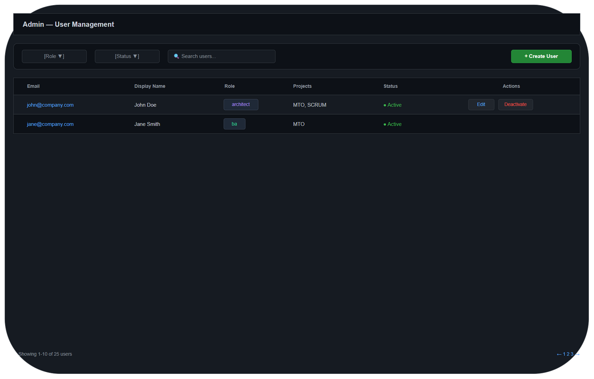
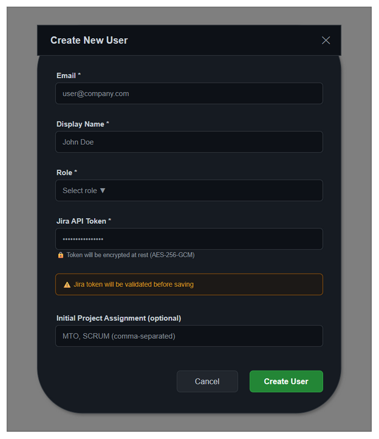
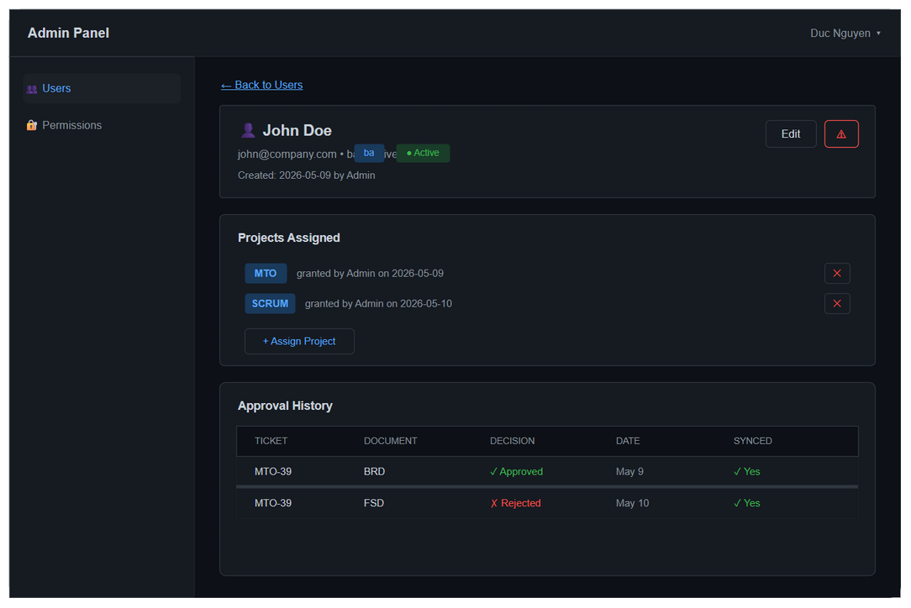
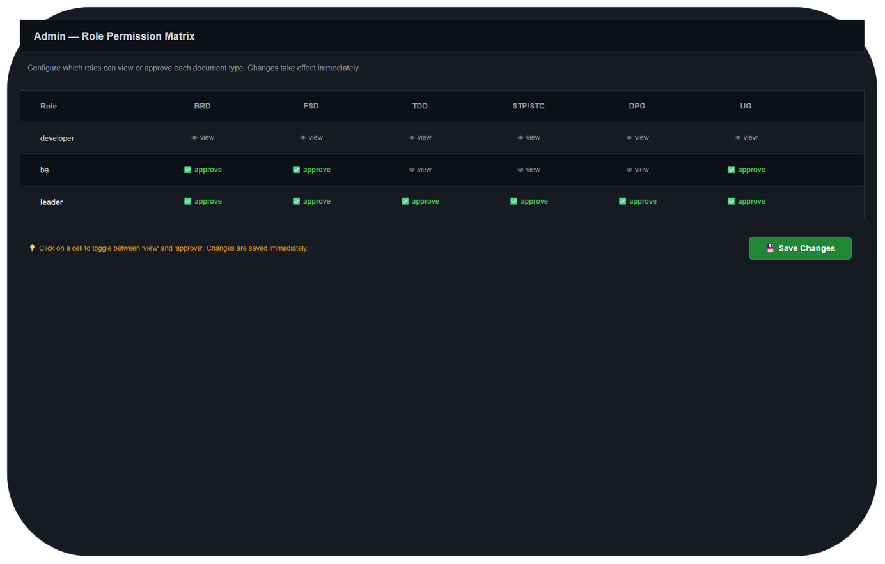
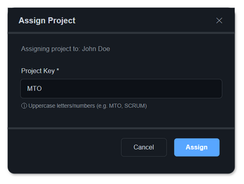

# UI Specification Document

## MTO-39: Admin UI — User Management & Permission Matrix

---

## Document Information

| Field | Value |
|-------|-------|
| Ticket | MTO-39 |
| Feature | User Management & Document Approval — Admin UI |
| Tech Stack | HTML + Vanilla JS (single-page static file served by Ktor HttpServer) |
| Theme | Dark (GitHub-inspired) |
| Endpoint | `/admin` |
| Access | leader, system_owner roles only |

---

## Design System

```css
:root {
    --bg: #0d1117;
    --surface: #161b22;
    --surface-hover: #1c2128;
    --border: #30363d;
    --text: #c9d1d9;
    --text-secondary: #8b949e;
    --accent: #58a6ff;
    --accent-hover: #79b8ff;
    --success: #3fb950;
    --warning: #d29922;
    --danger: #f85149;
    --danger-hover: #da3633;
    --font-family: -apple-system, BlinkMacSystemFont, 'Segoe UI', Roboto, sans-serif;
    --font-size-sm: 0.75rem;
    --font-size-base: 0.875rem;
    --font-size-lg: 1rem;
    --font-size-xl: 1.25rem;
    --radius-sm: 4px;
    --radius-md: 6px;
    --radius-lg: 8px;
    --spacing-xs: 4px;
    --spacing-sm: 8px;
    --spacing-md: 16px;
    --spacing-lg: 24px;
    --spacing-xl: 32px;
}
```

### Component Patterns

| Component | Style |
|-----------|-------|
| Button (primary) | `background: var(--accent); color: #fff; border-radius: var(--radius-md); padding: 8px 16px;` |
| Button (danger) | `background: var(--danger); color: #fff; border-radius: var(--radius-md);` |
| Button (ghost) | `background: transparent; border: 1px solid var(--border); color: var(--text);` |
| Input | `background: var(--bg); border: 1px solid var(--border); border-radius: var(--radius-md); padding: 8px 12px; color: var(--text);` |
| Select | Same as Input |
| Table | `border-collapse: collapse; width: 100%; background: var(--surface);` |
| Table header | `background: var(--bg); border-bottom: 1px solid var(--border); padding: 12px 16px; text-align: left; color: var(--text-secondary); font-size: var(--font-size-sm); text-transform: uppercase;` |
| Table row | `border-bottom: 1px solid var(--border); padding: 12px 16px;` |
| Table row hover | `background: var(--surface-hover);` |
| Card | `background: var(--surface); border: 1px solid var(--border); border-radius: var(--radius-lg); padding: var(--spacing-lg);` |
| Modal | `background: var(--surface); border: 1px solid var(--border); border-radius: var(--radius-lg); box-shadow: 0 16px 32px rgba(0,0,0,0.5); max-width: 500px;` |
| Badge (active) | `background: rgba(63,185,80,0.15); color: var(--success); border-radius: 12px; padding: 2px 8px; font-size: var(--font-size-sm);` |
| Badge (inactive) | `background: rgba(248,81,73,0.15); color: var(--danger); border-radius: 12px; padding: 2px 8px;` |
| Badge (role) | `background: rgba(88,166,255,0.15); color: var(--accent); border-radius: 12px; padding: 2px 8px;` |

---

## Layout Structure

### Layout

- **Header**: fixed, height 56px — Logo/Title (left), Current User + Logout (right)
- **Sidebar**: width 220px, left side — navigation menu items
- **Main Content**: fills remaining space — varies by page/route

### Navigation

| Menu Item | Route | Icon |
|-----------|-------|------|
| Users | `/admin#users` | 👥 |
| Permissions | `/admin#permissions` | 🔐 |

---

## Screen 1: User List Page

### Purpose
Display all user accounts with filtering, search, and CRUD actions.

### URL
`/admin#users` (default view)

### Wireframe

**Draw.io source:** [diagrams/ui-user-list.drawio](diagrams/ui-user-list.drawio)



### UI Elements

| ID | Element | Type | Behavior |
|----|---------|------|----------|
| UL-01 | Search input | Text input | Filters table by email or display_name (debounce 300ms) |
| UL-02 | Role filter | Select dropdown | Options: All, developer, ba, architect, qa, devops, leader, system_owner |
| UL-03 | Status filter | Select dropdown | Options: All, Active, Inactive |
| UL-04 | Create User button | Primary button | Opens Create User modal |
| UL-05 | User table | Data table | Sortable columns: email, name, role, status |
| UL-06 | Edit button (per row) | Icon button | Opens Edit User modal pre-filled |
| UL-07 | Deactivate button | Icon button (danger) | Shows confirmation dialog, calls DELETE /admin/users/{id} |
| UL-08 | Reactivate button | Icon button (shown for inactive) | Calls PUT /admin/users/{id} with active=true |
| UL-09 | Row click | Table row | Navigates to User Detail page |

### Data Source

| Field | API | Format |
|-------|-----|--------|
| Email | GET /admin/users → [].email | String |
| Name | GET /admin/users → [].display_name | String |
| Role | GET /admin/users → [].role | Badge |
| Status | GET /admin/users → [].active | Badge (green=active, red=inactive) |
| Created | GET /admin/users → [].created_at | Relative time (e.g., "2 days ago") |

### API Calls

| Action | Method | Endpoint | Params |
|--------|--------|----------|--------|
| Load users | GET | /admin/users | ?role={filter}&active={filter} |
| Deactivate | DELETE | /admin/users/{id} | — |
| Reactivate | PUT | /admin/users/{id} | { active: true } |

---

## Screen 2: Create/Edit User Modal

### Purpose
Form to create a new user or edit an existing user's details.

### Trigger
- Create: Click "+ Create User" button
- Edit: Click ✏️ icon on user row

### Wireframe

**Draw.io source:** [diagrams/ui-create-user-modal.drawio](diagrams/ui-create-user-modal.drawio)



### UI Elements

| ID | Element | Type | Validation | Behavior |
|----|---------|------|------------|----------|
| CF-01 | Email input | Text (email) | Required, valid email format, max 255 chars | Disabled in edit mode |
| CF-02 | Display Name input | Text | Required, 2-100 chars | — |
| CF-03 | Role select | Dropdown | Required, one of 7 roles | — |
| CF-04 | Jira Token input | Password | Required on create, optional on edit | Masked display |
| CF-05 | Cancel button | Ghost button | — | Closes modal, no changes |
| CF-06 | Submit button | Primary button | All validations pass | POST (create) or PUT (edit) |
| CF-07 | Error message | Alert banner | — | Shows API error (e.g., duplicate email) |

### Form Validation

| Field | Rule | Error Message |
|-------|------|---------------|
| Email | Required + email format | "Valid email address required" |
| Email | Unique (server-side) | "User with email {email} already exists" |
| Display Name | 2-100 chars | "Name must be 2-100 characters" |
| Role | Must select one | "Please select a role" |
| Jira Token | Non-empty on create | "Jira API token is required" |
| Jira Token | Valid (server-side) | "Jira token validation failed" |

### API Calls

| Action | Method | Endpoint | Body |
|--------|--------|----------|------|
| Create | POST | /admin/users | { email, display_name, role, jira_token } |
| Update | PUT | /admin/users/{id} | { display_name?, role?, jira_token? } |

### States

| State | Behavior |
|-------|----------|
| Loading | Submit button disabled, shows spinner |
| Success | Modal closes, table refreshes, toast "User created successfully" |
| Error | Error banner shown above form with API error message |

---

## Screen 3: User Detail Page

### Purpose
View detailed user information including project assignments and approval history.

### URL
`/admin#users/{id}`

### Wireframe

**Draw.io source:** [diagrams/ui-user-detail.drawio](diagrams/ui-user-detail.drawio)



### UI Elements

| ID | Element | Type | Behavior |
|----|---------|------|----------|
| UD-01 | Back link | Text link | Returns to User List |
| UD-02 | User info card | Card | Shows email, role badge, status badge, created info |
| UD-03 | Edit button | Ghost button | Opens Edit User modal |
| UD-04 | Deactivate button | Danger icon | Confirmation → deactivate |
| UD-05 | Projects list | List with remove buttons | Shows assigned projects |
| UD-06 | Remove project (✕) | Icon button | Confirmation → DELETE /admin/users/{id}/projects/{key} |
| UD-07 | Assign Project button | Ghost button | Opens Project Assignment modal |
| UD-08 | Approval history table | Data table | Read-only, sorted by date desc |

### Data Source

| Section | API | Fields |
|---------|-----|--------|
| User info | GET /admin/users/{id} | email, display_name, role, active, created_at, created_by |
| Projects | GET /admin/users/{id}/projects | [].project_key, [].granted_by, [].granted_at |
| Approvals | GET /admin/users/{id}/approvals | [].ticket_key, [].document_type, [].decision, [].created_at, [].jira_synced |

---

## Screen 4: Permission Matrix Page

### Purpose
View and edit the role-permission matrix (which roles can approve which document types).

### URL
`/admin#permissions`

### Wireframe

**Draw.io source:** [diagrams/ui-permission-matrix.drawio](diagrams/ui-permission-matrix.drawio)



### UI Elements

| ID | Element | Type | Behavior |
|----|---------|------|----------|
| PM-01 | Permission grid | Table with checkboxes | Each cell is a toggle: view-only ↔ can_approve |
| PM-02 | Cell toggle | Checkbox/icon | Click toggles between 👁 (view) and ✓ (approve) |
| PM-03 | Save button | Primary button | Only visible when changes exist. Calls PUT /admin/roles/{role}/permissions |
| PM-04 | Reset button | Ghost button | Reverts unsaved changes |
| PM-05 | Change indicator | Highlight | Modified cells have accent border |

### Interaction Flow

1. Page loads → GET /admin/roles → populate grid
2. User clicks a cell → toggles can_approve (visual change, not saved yet)
3. Modified cells highlighted with accent color border
4. "Save Changes" button appears
5. Click Save → PUT for each modified role → success toast
6. On error → revert cell, show error message

### API Calls

| Action | Method | Endpoint | Body |
|--------|--------|----------|------|
| Load matrix | GET | /admin/roles | — |
| Save changes | PUT | /admin/roles/{role}/permissions | { permissions: [{ document_type, can_view, can_approve }] } |

### Business Rules

- Only `system_owner` can modify the matrix (leader can view but not edit)
- `leader` and `system_owner` rows cannot be reduced below "approve all" (safety)
- Changes take effect immediately after save (no restart needed)

---

## Screen 5: Project Assignment Modal

### Purpose
Assign a Jira project key to a user.

### Trigger
Click "+ Assign Project" on User Detail page.

### Wireframe

**Draw.io source:** [diagrams/ui-project-assignment.drawio](diagrams/ui-project-assignment.drawio)



### UI Elements

| ID | Element | Type | Validation | Behavior |
|----|---------|------|------------|----------|
| PA-01 | User context | Text | — | Shows which user is being assigned |
| PA-02 | Project Key input | Text | Required, pattern [A-Z][A-Z0-9_]+, max 20 chars | Auto-uppercase |
| PA-03 | Cancel button | Ghost button | — | Closes modal |
| PA-04 | Assign button | Primary button | Validation passes | POST /admin/users/{id}/projects |
| PA-05 | Error message | Alert | — | Shows "Already assigned" or format error |

### API Calls

| Action | Method | Endpoint | Body |
|--------|--------|----------|------|
| Assign | POST | /admin/users/{id}/projects | { project_key: "MTO" } |

---

## Component Hierarchy

```
AdminApp
├── Header
│   ├── Logo + Title ("Admin Panel")
│   └── UserMenu (current user display + logout)
├── Sidebar
│   ├── NavItem (Users) — active state
│   └── NavItem (Permissions)
├── MainContent
│   ├── UserListPage
│   │   ├── PageHeader ("User Management")
│   │   ├── FilterBar
│   │   │   ├── SearchInput
│   │   │   ├── RoleFilter (select)
│   │   │   ├── StatusFilter (select)
│   │   │   └── CreateUserButton
│   │   └── UserTable
│   │       ├── TableHeader (sortable)
│   │       └── TableRow[] (with action buttons)
│   ├── UserDetailPage
│   │   ├── BackLink
│   │   ├── UserInfoCard
│   │   ├── ProjectsSection
│   │   │   ├── ProjectBadge[] (with remove)
│   │   │   └── AssignProjectButton
│   │   └── ApprovalHistoryTable
│   └── PermissionMatrixPage
│       ├── PageHeader
│       ├── PermissionGrid
│       │   ├── GridHeader (document types)
│       │   └── GridRow[] (role + toggles)
│       ├── Legend
│       └── SaveBar (conditional)
└── Modals
    ├── CreateUserModal
    │   ├── ModalHeader
    │   ├── UserForm
    │   │   ├── EmailInput
    │   │   ├── DisplayNameInput
    │   │   ├── RoleSelect
    │   │   └── JiraTokenInput
    │   ├── ErrorBanner (conditional)
    │   └── ModalFooter (Cancel + Submit)
    ├── EditUserModal (same as Create, pre-filled)
    ├── ProjectAssignmentModal
    │   ├── ModalHeader
    │   ├── UserContext
    │   ├── ProjectKeyInput
    │   └── ModalFooter
    └── ConfirmDialog (for deactivate/remove)
```

---

## User Interaction Flows

### Flow 1: Create New User

```
[User List Page] → Click "+ Create User"
    → [Create User Modal opens]
    → Fill email, name, role, token
    → Click "Create User"
    → [Loading state: button disabled + spinner]
    → API: POST /admin/users
    → Success: Modal closes, table refreshes, toast shown
    → Error: Error banner in modal (e.g., "duplicate email")
```

### Flow 2: Edit User

```
[User List Page] → Click ✏️ on row
    → [Edit User Modal opens, pre-filled]
    → Modify fields (email disabled)
    → Click "Save Changes"
    → API: PUT /admin/users/{id}
    → Success: Modal closes, table refreshes
    → Error: Error banner
```

### Flow 3: Deactivate User

```
[User List Page] → Click 🗑️ on row
    → [Confirm Dialog: "Deactivate user john@co.com?"]
    → Click "Confirm"
    → API: DELETE /admin/users/{id}
    → Success: Row updates to "Inactive" status, toast shown
    → Error (last admin): Error toast "Cannot deactivate last system_owner"
```

### Flow 4: Assign Project

```
[User Detail Page] → Click "+ Assign Project"
    → [Project Assignment Modal opens]
    → Type project key (auto-uppercase)
    → Click "Assign"
    → API: POST /admin/users/{id}/projects
    → Success: Modal closes, project list refreshes
    → Error: "Already assigned" or "Invalid format"
```

### Flow 5: Edit Permission Matrix

```
[Permission Matrix Page] → Click cell (e.g., ba × TDD)
    → Cell toggles: 👁 → ✓ (highlighted as modified)
    → "Save Changes" button appears
    → Click "Save Changes"
    → API: PUT /admin/roles/ba/permissions
    → Success: Highlight removed, toast "Permissions updated"
    → Error: Cell reverts, error toast
```

### Flow 6: View User Detail

```
[User List Page] → Click on row (not action buttons)
    → Navigate to /admin#users/{id}
    → [User Detail Page loads]
    → API: GET /admin/users/{id}
    → API: GET /admin/users/{id}/projects
    → API: GET /admin/users/{id}/approvals (if endpoint exists)
    → Display user info, projects, approval history
```

---

## Responsive Considerations

| Breakpoint | Behavior |
|-----------|----------|
| ≥1200px | Full layout: sidebar (220px) + content |
| 900-1199px | Sidebar collapses to icons only (56px) |
| <900px | Not supported (desktop-first per BRD §1.2) |

---

## Accessibility Notes

| Requirement | Implementation |
|-------------|---------------|
| Keyboard navigation | All interactive elements focusable via Tab |
| Modal focus trap | Focus stays within modal when open |
| ARIA labels | Buttons with icons have aria-label |
| Color contrast | All text meets WCAG AA (4.5:1 ratio) |
| Screen reader | Table headers use `<th scope="col">` |
| Status announcements | Toast messages use `role="alert"` |

---

## Implementation Notes for DEV

### File Structure
```
orchestrator-server/src/main/resources/static/
└── admin.html          (single-page app, all screens via hash routing)
```

### Routing (hash-based)
```javascript
// Hash routes
#users          → UserListPage
#users/{id}     → UserDetailPage
#permissions    → PermissionMatrixPage
```

### Key Implementation Patterns
1. **Single HTML file** — all CSS inline in `<style>`, all JS in `<script>`
2. **No framework** — vanilla JS with DOM manipulation
3. **Hash routing** — `window.onhashchange` for navigation
4. **Fetch API** — all API calls use native `fetch()`
5. **Template literals** — for HTML rendering (no template engine)
6. **Event delegation** — attach listeners to containers, not individual elements
7. **State management** — simple module-level variables for current page state

### CSS Variables to Reuse
All CSS variables from the Design System section above — consistent with existing `graph-viewer.html`.

### Existing Patterns to Follow
- Same dark theme as `graph-viewer.html` (identical CSS variables)
- Same font stack: `-apple-system, BlinkMacSystemFont, 'Segoe UI', Roboto, sans-serif`
- Same border-radius: `6px` for inputs/buttons, `8px` for cards/panels
- Same spacing: `16px` standard padding, `8px` gaps
