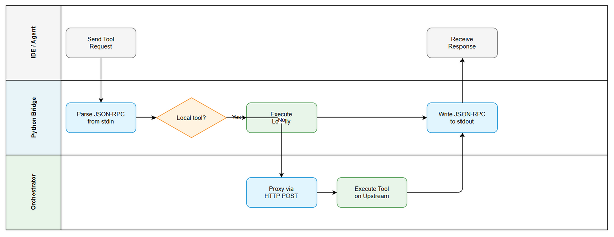
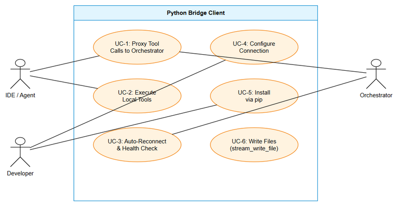

# Business Requirements Document (BRD)

## MCPOrchestration — MTO-42: Python Bridge Client — MCP Orchestrator Connector

---

## Document Information

| Field | Value |
|-------|-------|
| Jira Ticket | MTO-42 |
| Title | Python Bridge Client — MCP Orchestrator Connector |
| Author | BA Agent |
| Version | 1.0 |
| Date | 2026-05-10 |
| Status | Draft |

---

## Author Tracking

| Role | Name - Position | Responsibility |
|------|-----------------|----------------|
| Author | BA Agent – Business Analyst | Create document |
| Peer Reviewer | Duc Nguyen – Project Lead | Review document |

---

## Revision History

| Version | Date | Author | Changes |
|---------|------|--------|---------|
| 1.0 | 2026-05-10 | BA Agent | Initiate document — auto-generated from Jira ticket MTO-42 |

---

## 1. Introduction

### 1.1 Scope

This change request implements a **Python-based MCP Bridge Client** that connects to the MCP Orchestrator Server via HTTP Streamable transport and exposes tools to IDEs via stdio. The scope covers:

1. **Python MCP Server (stdio)** — JSON-RPC 2.0 server reading from stdin, writing to stdout
2. **HTTP Streamable Client** — Connects to Orchestrator at configurable URL using httpx
3. **Tool Proxying** — Proxies `find_tools` and `execute_dynamic_tool` to Orchestrator
4. **Local Tools** — `stream_write_file` and `embed_images` executed locally (no network)
5. **Auto-Reconnect** — Exponential backoff (max 15s) on connection loss
6. **Health Check** — Periodic ping every 30s (per MTO-46)
7. **Configuration** — CLI args (`--url`, `--timeout`) + environment variables
8. **Packaging** — pip-installable package via `pyproject.toml`

### 1.2 Out of Scope

- Changes to the MCP Orchestrator server
- Python SDK for MCP protocol (uses raw JSON-RPC implementation)
- GUI or web interface
- Windows service / systemd integration
- Python 2.x support

### 1.3 Preliminary Requirements

1. **MTO-13** (HTTP Streamable Transport) — provides the Orchestrator endpoint
2. **MTO-46** (Health Check) — defines the ping/reconnect protocol
3. **MTO-41** (Epic) — parent epic for all bridge clients
4. Python 3.10+ runtime
5. Reference implementation: Node.js bridge (`mcp-client-bridge/src/`)

---

## 2. Business Requirements

### 2.1 High Level Process Map

```
┌──────────────────┐  stdio (JSON-RPC)  ┌─────────────────────────┐  HTTP Streamable  ┌──────────────┐
│   IDE / Agent    │◄──────────────────►│  Python Bridge Client    │◄────────────────►│ Orchestrator │
│ (Kiro, Cursor,   │                    │  (mcp-bridge-python)     │                   │   Server     │
│  Claude Desktop) │                    │                          │                   └──────────────┘
└──────────────────┘                    │  Local Tools:            │
                                        │  - stream_write_file     │
                                        │  - embed_images          │
                                        └─────────────────────────┘
```





### 2.2 List of User Stories / Use Cases

| # | Story / Use Case | Priority | Source Ticket |
|---|------------------|----------|---------------|
| 1 | As a data scientist, I want a Python bridge so that I can use MCP tools from Jupyter notebooks and Python scripts | MUST HAVE | MTO-42 |
| 2 | As a DevOps engineer, I want the bridge pip-installable so that I can include it in CI/CD pipelines | MUST HAVE | MTO-42 |
| 3 | As a developer, I want the bridge to auto-reconnect so that temporary server outages don't require manual restart | MUST HAVE | MTO-42 |
| 4 | As a developer, I want local file tools (stream_write_file, embed_images) so that file operations don't go over the network | SHOULD HAVE | MTO-42 |
| 5 | As a developer, I want configurable connection settings so that I can point to different Orchestrator instances | MUST HAVE | MTO-42 |

---

### 2.3 Details of User Stories

---

#### STORY 1: Python MCP Bridge Server (stdio)

> As a data scientist, I want a Python bridge so that I can use MCP tools from Jupyter notebooks and Python scripts.

**Requirement Details:**

1. Python asyncio-based MCP server reading JSON-RPC from stdin, writing to stdout
2. Exposes meta-tools: `find_tools`, `execute_dynamic_tool`, `toggle_tool`, `reset_tools`, `manage_auto_approve`, `agent_log`
3. Proxies all tool calls to Orchestrator via HTTP Streamable
4. Supports Python 3.10+ (uses match statements, type hints, async/await)
5. Single entry point: `python -m mcp_bridge` or `mcp-bridge-python` CLI command

**Acceptance Criteria:**

1. Bridge starts as stdio MCP server (reads stdin, writes stdout)
2. Connects to Orchestrator via HTTP Streamable at configured URL
3. Exposes `find_tools` and `execute_dynamic_tool` as MCP tools
4. Proxies tool calls to Orchestrator and returns results
5. Supports Python 3.10+ with asyncio
6. Entry point: `python -m mcp_bridge` or `mcp-bridge-python` command

---

#### STORY 2: Pip-Installable Package

> As a DevOps engineer, I want the bridge pip-installable so that I can include it in CI/CD pipelines.

**Requirement Details:**

1. Package uses `pyproject.toml` (PEP 621) for metadata
2. Dependencies: `httpx` (HTTP client), no other heavy dependencies
3. CLI entry point registered via `[project.scripts]`
4. Installable via `pip install .` or `pip install mcp-bridge-python`
5. Compatible with virtual environments and Docker

**Acceptance Criteria:**

7. Package defined in `pyproject.toml` with proper metadata
8. `pip install .` installs the bridge and creates CLI command
9. Minimal dependencies: httpx only (+ standard library)
10. Works in virtualenv, Docker, and CI/CD environments

---

#### STORY 3: Auto-Reconnect & Health Check

> As a developer, I want the bridge to auto-reconnect so that temporary server outages don't require manual restart.

**Requirement Details:**

1. Implements health check per MTO-46 specification (ping every 30s)
2. Exponential backoff reconnection: 1s, 2s, 4s, 8s, 15s (cap)
3. State machine: CONNECTED → DISCONNECTED → RECONNECTING → CONNECTED
4. Tool calls during reconnect return error (not queued)
5. All state transitions logged to stderr

**Acceptance Criteria:**

11. Health check ping every 30s (configurable via --ping-interval)
12. Auto-reconnect with exponential backoff (1s base, 15s cap)
13. State transitions logged: `[mcp-bridge] State: X → Y`
14. Tool calls during DISCONNECTED/RECONNECTING return error
15. Reconnect runs indefinitely until success

---

#### STORY 4: Local Tools

> As a developer, I want local file tools so that file operations don't go over the network.

**Requirement Details:**

1. `stream_write_file` — Write content to file (write/append/create modes)
2. `embed_images` — Replace image references in markdown with base64 data URIs
3. Both tools execute locally (no network call to Orchestrator)
4. Path resolution: absolute paths or relative to workspace root

**Acceptance Criteria:**

16. `stream_write_file` supports write, append, create modes
17. `embed_images` replaces local image refs with base64
18. Both tools work without Orchestrator connection
19. Relative paths resolved from workspace root (from IDE roots)

---

#### STORY 5: Configuration

> As a developer, I want configurable connection settings so that I can point to different Orchestrator instances.

**Requirement Details:**

1. CLI flags: `--url`, `--timeout`, `--ping-interval`, `--reconnect-delay`
2. Environment variables: `ORCHESTRATOR_URL`, `PING_INTERVAL`, `PING_TIMEOUT`
3. Precedence: CLI > env var > default
4. Defaults: URL=http://localhost:8080/mcp, timeout=30s, ping=30s

**Acceptance Criteria:**

20. CLI flag `--url` sets Orchestrator URL
21. CLI flag `--timeout` sets request timeout
22. Environment variable `ORCHESTRATOR_URL` as alternative
23. Sensible defaults (localhost:8080/mcp, 30s timeout)
24. Invalid config produces clear error and exits

---

## 3. Dependencies

| Dependency | Type | Related Ticket | Description |
|------------|------|----------------|-------------|
| MTO-13 HTTP Streamable | System | MTO-13 | Orchestrator endpoint this bridge connects to |
| MTO-46 Health Check | System | MTO-46 | Health check protocol specification |
| MTO-41 Epic | System | MTO-41 | Parent epic for all bridge clients |
| Python 3.10+ | Infrastructure | N/A | Runtime requirement |
| httpx | Library | N/A | Async HTTP client for Python |
| Node.js Bridge | Reference | MTO-13 | Reference implementation for behavior parity |

---

## 4. Stakeholders

| Role | Name / Team | Responsibility | Source |
|------|-------------|----------------|--------|
| Project Lead | Duc Nguyen | Requirements, architecture, review | MTO-42 Reporter |
| Development Team | Unassigned | Implementation | MTO-42 Assignee |

---

## 5. Risks and Assumptions

### 5.1 Risks

| Risk | Impact | Likelihood | Mitigation |
|------|--------|------------|------------|
| Python asyncio complexity for stdio + HTTP | Medium | Medium | Use well-tested patterns from httpx; reference Node.js implementation |
| httpx version compatibility | Low | Low | Pin httpx version in pyproject.toml |
| Windows stdin/stdout binary mode issues | Medium | Medium | Use sys.stdin.buffer / sys.stdout.buffer |

### 5.2 Assumptions

- Python 3.10+ is available on target systems
- httpx provides stable async HTTP client functionality
- IDE stdio transport works identically for Python as for Node.js/Kotlin bridges
- JSON-RPC 2.0 over stdio is the standard MCP transport

---

## 6. Non-Functional Requirements

| Category | Requirement | Details |
|----------|-------------|---------|
| Performance | Tool call latency < 100ms overhead | Bridge adds minimal overhead to Orchestrator response time |
| Startup | Bridge ready in < 2s | Fast startup for CI/CD use cases |
| Memory | < 50MB RSS | Lightweight for container deployments |
| Compatibility | Python 3.10, 3.11, 3.12, 3.13 | Support latest 4 Python versions |
| Packaging | pip installable | Standard Python packaging (pyproject.toml) |

---

## 7. Related Tickets

| Ticket Key | Summary | Status | Type | Relationship |
|------------|---------|--------|------|--------------|
| MTO-42 | Python Bridge Client | Docs Review | Story | Main ticket |
| MTO-41 | Multi-Language Bridge Epic | To Do | Epic | Parent |
| MTO-46 | Health Check | Docs Review | Story | Dependency (protocol) |
| MTO-13 | HTTP Streamable + Bridges | Done | Story | Predecessor |
| MTO-43 | Bash Bridge | To Do | Story | Sibling |
| MTO-44 | PowerShell Bridge | To Do | Story | Sibling |
| MTO-45 | CMD Bridge | To Do | Story | Sibling |

---

## 8. Appendix

### Glossary

| Term | Definition |
|------|------------|
| Bridge Client | Lightweight MCP server (stdio) that proxies to Orchestrator (HTTP Streamable) |
| httpx | Modern async HTTP client for Python |
| pyproject.toml | Python packaging standard (PEP 621) |
| stdio | Standard input/output transport for MCP |

### Reference: Node.js Bridge Architecture

The Python bridge mirrors the Node.js bridge (`mcp-client-bridge/src/`):
- `index.ts` → `__main__.py` (entry point)
- `bridge-server.ts` → `bridge_server.py` (MCP server)
- `http-streamable-client.ts` → `http_client.py` (HTTP client)
- `reconnection-manager.ts` → `reconnection.py` (reconnect logic)
- `local-stream-write.ts` → `local_tools.py` (local tools)
- `bridge-config.ts` → `config.py` (configuration)

### Diagram Index

| # | Diagram | Image | Source (editable) |
|---|---------|-------|-------------------|
| 1 | Business Flow | [business-flow.png](diagrams/business-flow.png) | [business-flow.drawio](diagrams/business-flow.drawio) |
| 2 | Use Case Diagram | [use-case.png](diagrams/use-case.png) | [use-case.drawio](diagrams/use-case.drawio) |
