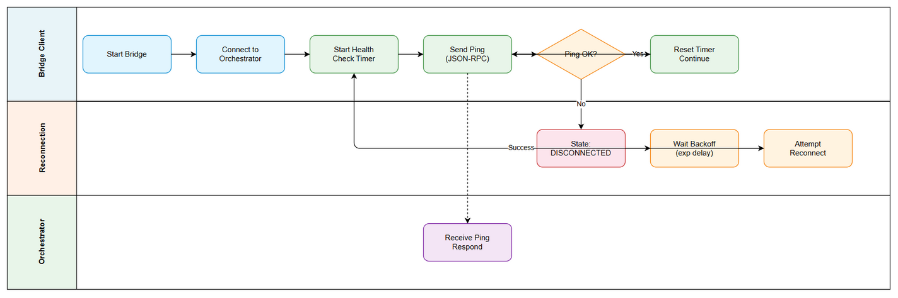
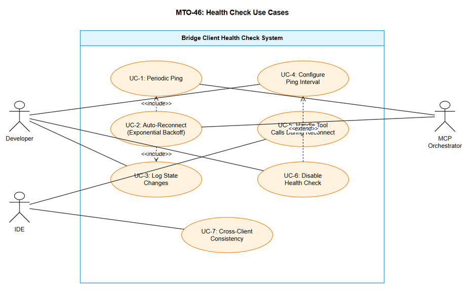

# Business Requirements Document (BRD)

## MCPOrchestration — MTO-46: Bridge Client Health Check — Periodic Ping & Auto-Reconnect

---

## Document Information

| Field | Value |
|-------|-------|
| Jira Ticket | MTO-46 |
| Title | Bridge Client Health Check — Periodic Ping & Auto-Reconnect |
| Author | BA Agent |
| Version | 1.0 |
| Date | 2026-05-10 |
| Status | Draft |

---

## Author Tracking

| Role | Name - Position | Responsibility |
|------|-----------------|----------------|
| Author | BA Agent – Business Analyst | Create document |
| Peer Reviewer | Duc Nguyen – Project Lead | Review document |

---

## Revision History

| Version | Date | Author | Changes |
|---------|------|--------|---------|
| 1.0 | 2026-05-10 | BA Agent | Initiate document — auto-generated from Jira ticket MTO-46 |

---

## Sign-Off

| Name | Signature and date |
|------|--------------------|
| | ☐ I agree and confirm all criteria on this BRD as expected requirements |
| | ☐ I agree and confirm all criteria on this BRD as expected requirements |

---

## 1. Introduction

### 1.1 Scope

This change request adds a **periodic health check (ping)** mechanism with **automatic reconnection** to ALL MCP bridge clients. The scope covers:

1. **Health Check Protocol** — Periodic JSON-RPC `ping` method sent every configurable interval (default 30s) to detect server availability
2. **Auto-Reconnect** — Exponential backoff reconnection loop triggered when ping fails, with state machine tracking (CONNECTED → DISCONNECTED → RECONNECTING → CONNECTED)
3. **Affected Clients** — Node.js bridge (`mcp-client-bridge`), Kotlin bridge (`orchestrator-bridge`), and all new bridge clients (Python, Bash, PowerShell, CMD) under Epic MTO-41

### 1.2 Out of Scope

- Changes to the MCP Orchestrator server itself (server already responds to JSON-RPC requests)
- Adding a dedicated `ping` endpoint on the server (reuses existing JSON-RPC infrastructure)
- Load balancing or failover to multiple Orchestrator instances
- Health check for upstream MCP servers (only bridge→Orchestrator connection)
- UI/IDE plugin changes to display connection status
- Authentication/authorization changes

### 1.3 Preliminary Requirements

1. **MTO-13** (HTTP Streamable Transport + Bridge Clients) must be deployed — provides the bridge infrastructure
2. **MTO-41** (Epic: Multi-Language MCP Bridge Clients) — parent epic for Python, Bash, PowerShell, CMD bridges
3. Existing `ReconnectionManager` in both Node.js and Kotlin bridges — will be enhanced (not replaced)
4. HTTP Streamable endpoint available at configurable URL (default: `http://localhost:8080/mcp`)

---

## 2. Business Requirements

### 2.1 High Level Process Map

The health check mechanism operates as a background process within each bridge client:

```
┌─────────────────────────────────────────────────────────────────────┐
│ Bridge Client (Node.js / Kotlin / Python / Bash / PowerShell / CMD) │
│                                                                     │
│  ┌──────────────┐    ping OK     ┌──────────────┐                  │
│  │  CONNECTED   │◄──────────────│  Health Check │ (every 30s)      │
│  │              │───────────────►│    Timer      │                  │
│  └──────┬───────┘    ping FAIL   └──────────────┘                  │
│         │                                                           │
│         ▼                                                           │
│  ┌──────────────┐                ┌──────────────┐                  │
│  │ DISCONNECTED │───────────────►│ RECONNECTING │                  │
│  │              │                │ (exp backoff)│                  │
│  └──────────────┘                └──────┬───────┘                  │
│                                         │ success                   │
│                                         ▼                           │
│                                  ┌──────────────┐                  │
│                                  │  CONNECTED   │                  │
│                                  │ (reset timer)│                  │
│                                  └──────────────┘                  │
└─────────────────────────────────────────────────────────────────────┘
                          │
                          │ JSON-RPC ping
                          ▼
              ┌───────────────────────┐
              │   MCP Orchestrator    │
              │  (HTTP Streamable)    │
              └───────────────────────┘
```





### 2.2 List of User Stories / Use Cases

| # | Story / Use Case | Priority | Source Ticket |
|---|------------------|----------|---------------|
| 1 | As a developer, I want the bridge to periodically ping the Orchestrator so that connection loss is detected proactively (not on next tool call) | MUST HAVE | MTO-46 |
| 2 | As a developer, I want the bridge to auto-reconnect with exponential backoff when ping fails so that service resumes without manual intervention | MUST HAVE | MTO-46 |
| 3 | As a developer, I want connection state changes logged so that I can diagnose connectivity issues | MUST HAVE | MTO-46 |
| 4 | As a developer, I want the ping interval to be configurable so that I can tune it for my environment | SHOULD HAVE | MTO-46 |
| 5 | As a developer, I want health check to work identically across all bridge clients (Node.js, Kotlin, Python, Bash, PowerShell, CMD) so that behavior is consistent | MUST HAVE | MTO-46 |

---

### 2.3 Details of User Stories

---

#### Business Flow

**Step 1:** Bridge client starts and establishes initial connection to Orchestrator (existing behavior from MTO-13)

**Step 2:** After successful connection, health check timer starts with configured interval (default 30s)

**Step 3:** On each timer tick, bridge sends a JSON-RPC `ping` request to Orchestrator

**Step 4:** If ping succeeds (any valid JSON-RPC response), timer resets and continues

**Step 5:** If ping fails (timeout, connection refused, HTTP error), bridge transitions to DISCONNECTED state

**Step 6:** Bridge immediately enters reconnection loop with exponential backoff (1s, 2s, 4s, 8s, 15s cap)

**Step 7:** On successful reconnect, bridge transitions back to CONNECTED, resets attempt counter, restarts health check timer

**Step 8:** All state transitions are logged: `[mcp-bridge] State: CONNECTED → DISCONNECTED → RECONNECTING → CONNECTED`

> **Note:** During DISCONNECTED/RECONNECTING states, any tool calls from the IDE will receive an error response indicating the bridge is reconnecting. The bridge does NOT queue requests.

---

#### STORY 1: Periodic Health Check (Ping)

> As a developer, I want the bridge to periodically ping the Orchestrator so that connection loss is detected proactively (not on next tool call).

**Requirement Details:**

1. Bridge sends a JSON-RPC request with method `ping` to the Orchestrator at a configurable interval
2. The ping request is a standard JSON-RPC 2.0 call: `{"jsonrpc": "2.0", "id": N, "method": "ping"}`
3. Any valid JSON-RPC response (success or error) counts as "ping OK" — it means the server is reachable
4. Ping timeout is separate from the interval: default 5s timeout for each ping attempt
5. Ping runs in background — does NOT block tool calls from the IDE
6. Ping timer starts only after initial connection is established (not during startup)
7. If bridge is in RECONNECTING state, ping timer is paused (reconnection loop handles recovery)

**Data Fields:**

| Field | Type | Required | Description | Example |
|-------|------|----------|-------------|---------|
| ping_interval_ms | Integer | No (config) | Interval between pings in milliseconds | `30000` (30s) |
| ping_timeout_ms | Integer | No (config) | Timeout for each ping request | `5000` (5s) |
| method | String | Yes (request) | JSON-RPC method name for ping | `"ping"` |
| jsonrpc | String | Yes (request) | JSON-RPC version | `"2.0"` |
| id | Integer | Yes (request) | Request ID (incrementing) | `1`, `2`, `3`... |

**Acceptance Criteria:**

1. Bridge sends JSON-RPC `ping` request every 30s (default) to Orchestrator
2. Ping interval is configurable via `--ping-interval` CLI flag (Node.js, Python, Bash, PowerShell, CMD) or config property (Kotlin)
3. Any valid JSON-RPC response = ping OK (server is alive)
4. Ping timeout = 5s; if no response within 5s, ping is considered failed
5. Ping does NOT block concurrent tool calls
6. Ping timer starts only after CONNECTED state is reached

**Validation Rules:**

- `ping_interval_ms` must be ≥ 5000 (minimum 5s to avoid flooding)
- `ping_interval_ms` must be ≤ 300000 (maximum 5 minutes)
- `ping_timeout_ms` must be < `ping_interval_ms` (timeout must be shorter than interval)

**Error Handling:**

- Ping timeout (no response in 5s) → Treat as ping failure → trigger reconnect
- Connection refused → Treat as ping failure → trigger reconnect
- HTTP 503 (server overloaded) → Treat as ping OK (server is alive, just busy)
- Network error (DNS, routing) → Treat as ping failure → trigger reconnect

---

#### STORY 2: Auto-Reconnect with Exponential Backoff

> As a developer, I want the bridge to auto-reconnect with exponential backoff when ping fails so that service resumes without manual intervention.

**Requirement Details:**

1. When ping fails, bridge transitions from CONNECTED → DISCONNECTED → RECONNECTING
2. Reconnection uses exponential backoff: base delay × 2^attempt (base = 1000ms)
3. Maximum delay capped at 15000ms (15s) per existing `ReconnectionManager` behavior
4. On successful reconnect: reset attempt counter to 0, transition to CONNECTED, restart ping timer
5. Reconnection loop runs indefinitely until success (no max attempts for health-check-triggered reconnect)
6. During reconnection, tool calls return error: `{"error": "Bridge is reconnecting to Orchestrator"}`

**Data Fields:**

| Field | Type | Required | Description | Example |
|-------|------|----------|-------------|---------|
| base_reconnect_delay_ms | Integer | No (config) | Base delay for exponential backoff | `1000` (1s) |
| max_reconnect_delay_ms | Integer | No (config) | Maximum delay cap | `15000` (15s) |
| attempt | Integer | Internal | Current reconnection attempt number | `0`, `1`, `2`... |
| state | Enum | Internal | Current bridge connection state | `CONNECTED`, `DISCONNECTED`, `RECONNECTING` |

**Acceptance Criteria:**

7. Ping failure triggers state transition: CONNECTED → DISCONNECTED
8. Bridge immediately starts reconnection loop (DISCONNECTED → RECONNECTING)
9. Exponential backoff: delays are 1s, 2s, 4s, 8s, 15s, 15s, 15s... (capped at 15s)
10. Successful reconnect resets attempt counter and restarts ping timer
11. No maximum attempt limit for health-check-triggered reconnects (runs until success)
12. Tool calls during DISCONNECTED/RECONNECTING return clear error message

**Validation Rules:**

- `base_reconnect_delay_ms` must be ≥ 500 (minimum 0.5s)
- `max_reconnect_delay_ms` must be ≥ `base_reconnect_delay_ms`
- State transitions must be atomic (no race conditions between ping timer and reconnect loop)

**Error Handling:**

- Reconnect attempt fails → increment attempt counter, wait backoff delay, retry
- Reconnect succeeds but next ping immediately fails → re-enter reconnect loop (server may be flapping)
- Bridge process killed during reconnect → clean shutdown, no zombie timers

---

#### STORY 3: Connection State Logging

> As a developer, I want connection state changes logged so that I can diagnose connectivity issues.

**Requirement Details:**

1. All state transitions are logged to stderr (standard for MCP bridge logging)
2. Log format: `[mcp-bridge] State: {OLD_STATE} → {NEW_STATE}`
3. Additional context logged: reason for transition, attempt number, delay before next retry
4. Log levels: INFO for state changes, WARN for ping failures, ERROR for repeated failures (>5 attempts)

**Data Fields:**

| Field | Type | Required | Description | Example |
|-------|------|----------|-------------|---------|
| old_state | Enum | Yes (log) | Previous connection state | `CONNECTED` |
| new_state | Enum | Yes (log) | New connection state | `DISCONNECTED` |
| reason | String | Yes (log) | Reason for state change | `"ping timeout"`, `"reconnect success"` |
| attempt | Integer | No (log) | Current attempt number (during reconnect) | `3` |
| next_delay_ms | Integer | No (log) | Delay before next reconnect attempt | `8000` |

**Acceptance Criteria:**

13. State changes logged to stderr: `[mcp-bridge] State: CONNECTED → DISCONNECTED (reason: ping timeout)`
14. Reconnect attempts logged: `[mcp-bridge] Reconnecting in 4000ms (attempt 3)`
15. Successful reconnect logged: `[mcp-bridge] State: RECONNECTING → CONNECTED (after 3 attempts)`
16. Log level escalation: WARN after 3 failed attempts, ERROR after 5 failed attempts

**Error Handling:**

- Logging itself should never throw or crash the bridge
- If stderr is unavailable, silently skip logging

---

#### STORY 4: Configurable Ping Interval

> As a developer, I want the ping interval to be configurable so that I can tune it for my environment.

**Requirement Details:**

1. Default ping interval: 30000ms (30 seconds)
2. Configurable via CLI flag `--ping-interval <ms>` for all bridge clients
3. For Kotlin bridge: also configurable via `application.yml` property `bridge.ping-interval-ms`
4. Validation: minimum 5s, maximum 5 minutes
5. Setting interval to 0 disables health check entirely (opt-out)

**Data Fields:**

| Field | Type | Required | Description | Example |
|-------|------|----------|-------------|---------|
| --ping-interval | CLI flag | No | Ping interval in milliseconds | `--ping-interval 60000` |
| bridge.ping-interval-ms | YAML property | No | Kotlin bridge config | `ping-interval-ms: 60000` |
| PING_INTERVAL | Env variable | No | Alternative config via env var | `PING_INTERVAL=60000` |

**Acceptance Criteria:**

17. Default ping interval = 30000ms (30s)
18. CLI flag `--ping-interval <ms>` overrides default
19. Environment variable `PING_INTERVAL` as alternative configuration
20. Value 0 disables health check entirely
21. Invalid values (< 5000 or > 300000) produce clear error message at startup

**Validation Rules:**

- `ping_interval` = 0 → health check disabled (valid)
- `ping_interval` ∈ [5000, 300000] → valid
- `ping_interval` < 5000 (and ≠ 0) → error: "Ping interval must be at least 5000ms"
- `ping_interval` > 300000 → error: "Ping interval must be at most 300000ms (5 minutes)"

---

#### STORY 5: Cross-Client Consistency

> As a developer, I want health check to work identically across all bridge clients so that behavior is consistent.

**Requirement Details:**

1. All bridge clients (Node.js, Kotlin, Python, Bash, PowerShell, CMD) implement the same health check protocol
2. Same JSON-RPC `ping` method, same state machine, same exponential backoff parameters
3. Same CLI flags: `--ping-interval`, `--orchestrator-url`
4. Same log format: `[mcp-bridge] State: X → Y`
5. Same error responses during DISCONNECTED/RECONNECTING states
6. Implementation differences allowed only where language constraints require it (e.g., Bash uses `curl` for HTTP, Python uses `httpx`)

**Acceptance Criteria:**

22. All 6 bridge clients implement identical health check behavior
23. Same state machine: CONNECTED ↔ DISCONNECTED ↔ RECONNECTING
24. Same exponential backoff parameters (base=1s, max=15s)
25. Same CLI interface: `--ping-interval`, `--orchestrator-url`
26. Same log format across all clients
27. Integration test verifies all clients behave identically given same server conditions

---

## 3. Dependencies

| Dependency | Type | Related Ticket | Description |
|------------|------|----------------|-------------|
| MTO-13 HTTP Streamable + Bridges | System | MTO-13 | Provides bridge infrastructure (Node.js + Kotlin) that this feature enhances |
| MTO-41 Multi-Language Bridge Epic | System | MTO-41 | Parent epic — Python, Bash, PowerShell, CMD bridges will include health check |
| MTO-42 Python Bridge | System | MTO-42 | New bridge client that must include health check from day one |
| MTO-43 Bash Bridge | System | MTO-43 | New bridge client that must include health check from day one |
| MTO-44 PowerShell Bridge | System | MTO-44 | New bridge client that must include health check from day one |
| MTO-45 CMD Bridge | System | MTO-45 | New bridge client that must include health check from day one |
| Existing ReconnectionManager | Internal | N/A | Node.js (`reconnection-manager.ts`) and Kotlin (`ReconnectionManager.kt`) — will be enhanced |
| JSON-RPC 2.0 Protocol | Standard | N/A | Ping uses standard JSON-RPC request/response format |

---

## 4. Stakeholders

| Role | Name / Team | Responsibility | Source |
|------|-------------|----------------|--------|
| Project Lead / Reporter | Duc Nguyen | Requirements definition, architecture decisions, review | MTO-46 Reporter |
| Development Team | Unassigned | Implementation across all bridge clients | MTO-46 Assignee |
| QA Team | TBD | Testing health check behavior, failure scenarios | To be assigned |

---

## 5. Risks and Assumptions

### 5.1 Risks

| Risk | Impact | Likelihood | Mitigation |
|------|--------|------------|------------|
| Ping floods Orchestrator under high bridge count | Medium | Low | Default 30s interval is conservative; configurable for tuning |
| Race condition between ping timer and tool call | High | Medium | Use mutex/lock for state transitions; ping and tool calls share connection state |
| Bash/CMD bridges have limited async capabilities | Medium | High | Use background processes (`&` in Bash) or polling loops; accept slightly different timing precision |
| Server responds to ping but fails on actual tool calls | Low | Low | Ping only checks connectivity, not full functionality; tool call errors handled separately |
| Exponential backoff causes long reconnect delays after brief outage | Medium | Medium | Cap at 15s; reset counter on success; first retry is immediate (1s) |

### 5.2 Assumptions

- The MCP Orchestrator server responds to any JSON-RPC request (including unknown methods like `ping`) with a valid JSON-RPC response (error response is acceptable — it proves server is alive)
- All bridge clients have access to a timer/scheduler mechanism (setTimeout in Node.js, ScheduledExecutorService in Kotlin, sleep loops in Bash/CMD)
- stderr is available for logging in all environments (IDE stdio transport uses stdin/stdout, stderr is free)
- Network latency between bridge and Orchestrator is typically < 100ms (local or LAN deployment)
- The existing `ReconnectionManager` pattern (exponential backoff, state enum) is the correct foundation to build upon

---

## 6. Non-Functional Requirements

| Category | Requirement | Details |
|----------|-------------|---------|
| Performance | Ping overhead < 1ms CPU per interval | Ping is a single small HTTP request; should not impact tool call performance |
| Performance | Ping response time < 5s | Timeout threshold; faster responses expected (< 100ms typical) |
| Reliability | Auto-reconnect success rate > 99% | Given server is available, reconnect should succeed within 3 attempts |
| Reliability | No false disconnects | Single ping failure should NOT trigger reconnect; consider 2-3 consecutive failures |
| Resource Usage | Memory overhead < 1KB per bridge | Timer + state variable only; no buffering |
| Observability | All state transitions logged | Enables debugging without attaching debugger |
| Compatibility | Works on Windows, macOS, Linux | All bridge clients must work cross-platform |
| Configuration | Zero-config default | Works out of the box with 30s interval; no mandatory configuration |

---

## 7. Related Tickets

| Ticket Key | Summary | Status | Type | Relationship |
|------------|---------|--------|------|--------------|
| MTO-46 | Bridge Client Health Check — Periodic Ping & Auto-Reconnect | Docs Review | Story | Main ticket |
| MTO-41 | Multi-Language MCP Bridge Clients — Python, Bash, PowerShell, CMD | To Do | Epic | Parent epic |
| MTO-42 | Python MCP Bridge Client | To Do | Story | Sibling — must include health check |
| MTO-43 | Bash MCP Bridge Client | To Do | Story | Sibling — must include health check |
| MTO-44 | PowerShell MCP Bridge Client | To Do | Story | Sibling — must include health check |
| MTO-45 | CMD MCP Bridge Client | To Do | Story | Sibling — must include health check |
| MTO-13 | HTTP Streamable Transport + Bridge Clients | Done | Story | Predecessor — provides bridge infrastructure |

---

## 8. Appendix

### Glossary

| Term | Definition |
|------|------------|
| Bridge Client | A lightweight MCP server that exposes stdio interface to IDEs while connecting to Orchestrator via HTTP Streamable |
| Health Check | Periodic verification that the Orchestrator server is reachable and responsive |
| Ping | A JSON-RPC request with method `ping` used to verify server availability |
| Exponential Backoff | Reconnection strategy where delay doubles after each failed attempt (1s, 2s, 4s, 8s, 15s cap) |
| State Machine | The connection lifecycle: CONNECTED → DISCONNECTED → RECONNECTING → CONNECTED |
| JSON-RPC 2.0 | The protocol used for communication between bridge and Orchestrator |

### Reference Documents

| Document | Link / Location |
|----------|-----------------|
| MTO-13 BRD | BRD-v1-MTO-13.docx |
| MTO-13 FSD | FSD-v1-MTO-13.docx |
| Node.js Bridge Source | mcp-client-bridge/src/ |
| Kotlin Bridge Source | orchestrator-bridge/src/main/kotlin/.../bridge/ |
| MCP Specification 2025-03-26 | https://spec.modelcontextprotocol.io/specification/2025-03-26/ |

### Existing Code Reference

**Node.js ReconnectionManager** (`mcp-client-bridge/src/reconnection-manager.ts`):
- States: `DISCONNECTED`, `CONNECTING`, `CONNECTED`, `RECONNECTING`
- Backoff: `baseReconnectDelayMs * 2^attempt`, capped at `maxReconnectDelayMs`
- Initial connection: 3 attempts with backoff
- Background reconnect loop: runs until `client.isConnected`

**Kotlin ReconnectionManager** (`orchestrator-bridge/src/.../ReconnectionManager.kt`):
- Same state machine and backoff logic as Node.js
- Uses Kotlin coroutines for async operations

**Enhancement needed:** Both managers currently only reconnect on initial connection failure or explicit disconnect. They do NOT proactively detect server unavailability. This ticket adds the proactive detection via periodic ping.

### Diagram Index

| # | Diagram | Image | Source (editable) |
|---|---------|-------|-------------------|
| 1 | Business Flow | [business-flow.png](diagrams/business-flow.png) | [business-flow.drawio](diagrams/business-flow.drawio) |
| 2 | Use Case Diagram | [use-case.png](diagrams/use-case.png) | [use-case.drawio](diagrams/use-case.drawio) |
