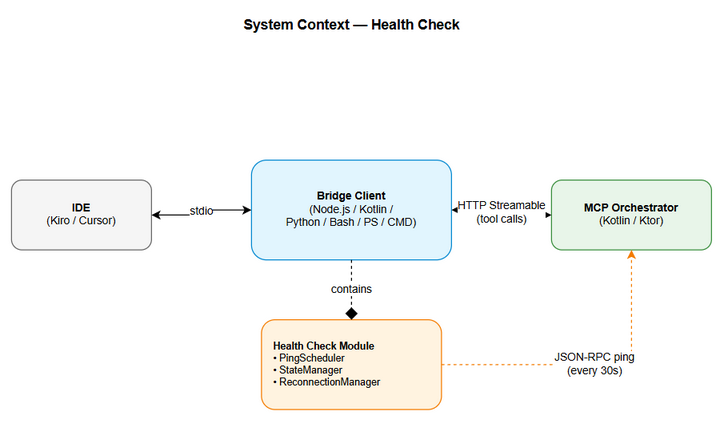
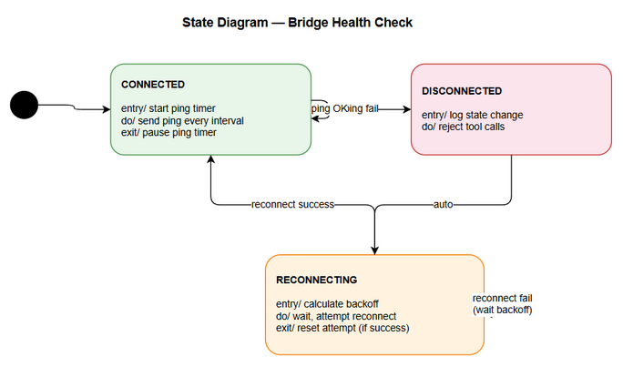

# Functional Specification Document (FSD)

## MCPOrchestration — MTO-46: Bridge Client Health Check — Periodic Ping & Auto-Reconnect

---

## Document Information

| Field | Value |
|-------|-------|
| Jira Ticket | MTO-46 |
| Title | Bridge Client Health Check — Periodic Ping & Auto-Reconnect |
| Author | BA Agent + TA Agent |
| Version | 1.0 |
| Date | 2026-05-10 |
| Status | Draft |
| Related BRD | BRD-v1-MTO-46.docx |

---

## Revision History

| Version | Date | Author | Changes |
|---------|------|--------|---------|
| 1.0 | 2026-05-10 | BA Agent | Initiate document — functional specification from BRD |
| 1.0 | 2026-05-10 | TA Agent | Technical enrichment — API contracts, pseudocode, integration specs |

---

## 1. Introduction

### 1.1 Purpose

This FSD specifies the functional behavior of the Health Check (periodic ping) and Auto-Reconnect mechanism for all MCP bridge clients. It defines the state machine, protocol interactions, configuration options, and cross-client consistency requirements.

### 1.2 Scope

Enhances existing bridge clients (Node.js, Kotlin) and defines requirements for new bridge clients (Python, Bash, PowerShell, CMD) to include proactive health monitoring of the Orchestrator connection.

### 1.3 Definitions & Acronyms

| Term | Definition |
|------|------------|
| Bridge Client | Lightweight MCP server exposing stdio to IDEs, connecting to Orchestrator via HTTP Streamable |
| Health Check | Periodic ping to verify Orchestrator availability |
| Ping | JSON-RPC 2.0 request with method `ping` |
| Exponential Backoff | Reconnection delay strategy: delay = base × 2^attempt, capped at max |
| State Machine | Connection lifecycle: CONNECTED ↔ DISCONNECTED ↔ RECONNECTING |

### 1.4 References

| Document | Location |
|----------|----------|
| BRD | BRD-v1-MTO-46.docx |
| MTO-13 FSD | FSD-v1-MTO-13.docx |
| Node.js Bridge Source | mcp-client-bridge/src/ |
| Kotlin Bridge Source | orchestrator-bridge/src/main/kotlin/.../bridge/ |

---

## 2. System Overview

### 2.1 System Context Diagram



The health check operates within the bridge client layer between IDE and Orchestrator:

```
┌──────────┐  stdio   ┌──────────────────────────────────┐  HTTP Streamable  ┌──────────────┐
│   IDE    │◄────────►│       Bridge Client               │◄────────────────►│ Orchestrator │
│(Kiro/etc)│          │  ┌─────────────────────────────┐  │                   │   Server     │
└──────────┘          │  │ Health Check Module          │  │                   └──────────────┘
                      │  │ - PingScheduler              │  │
                      │  │ - StateManager               │  │
                      │  │ - ReconnectionManager (enh.) │  │
                      │  └─────────────────────────────┘  │
                      └──────────────────────────────────┘
```

### 2.2 System Architecture

The health check is implemented as a module within each bridge client that:
1. Schedules periodic ping requests via the existing HTTP Streamable connection
2. Monitors responses and detects failures
3. Triggers the enhanced ReconnectionManager on failure
4. Reports state changes via stderr logging

---

## 3. Functional Requirements

### 3.1 Feature: Periodic Health Check (Ping)

**Source:** BRD Story 1

#### 3.1.1 Description

The bridge client sends a JSON-RPC `ping` request to the Orchestrator at a configurable interval. The ping verifies that the HTTP Streamable connection is alive and the server is responsive. Any valid JSON-RPC response (including error responses like "method not found") confirms server availability.

#### 3.1.2 Use Case

**Use Case ID:** UC-1
**Actor:** Bridge Client (automated)
**Preconditions:** Bridge is in CONNECTED state; health check is enabled (interval > 0)
**Postconditions:** Bridge remains in CONNECTED state (ping OK) or transitions to DISCONNECTED (ping fail)

**Main Flow:**

| Step | Actor | System | Description |
|------|-------|--------|-------------|
| 1 | | Timer fires | Health check interval elapsed |
| 2 | | Bridge | Sends JSON-RPC ping request to Orchestrator |
| 3 | | Orchestrator | Returns JSON-RPC response (success or method-not-found error) |
| 4 | | Bridge | Receives valid response → ping OK |
| 5 | | Bridge | Resets timer for next interval |

**Alternative Flows:**

| ID | Condition | Steps |
|----|-----------|-------|
| AF-1 | HTTP 503 response | Treat as ping OK (server alive but busy); reset timer |
| AF-2 | Health check disabled (interval=0) | Timer never starts; no ping sent |
| AF-3 | Bridge in RECONNECTING state | Timer paused; ping not sent until CONNECTED |

**Exception Flows:**

| ID | Condition | Steps |
|----|-----------|-------|
| EF-1 | Ping timeout (no response in 5s) | Mark ping as failed → trigger UC-2 (reconnect) |
| EF-2 | Connection refused | Mark ping as failed → trigger UC-2 (reconnect) |
| EF-3 | Network error (DNS, routing) | Mark ping as failed → trigger UC-2 (reconnect) |
| EF-4 | Consecutive failure threshold | After N consecutive failures (configurable, default 1), transition to DISCONNECTED |

#### 3.1.3 Business Rules

| Rule ID | Rule | Source |
|---------|------|--------|
| BR-1 | Ping interval must be ≥ 5000ms or exactly 0 (disabled) | BRD AC-17, AC-21 |
| BR-2 | Ping interval must be ≤ 300000ms (5 minutes) | BRD AC-21 |
| BR-3 | Ping timeout must be < ping interval | BRD Story 1 |
| BR-4 | Any valid JSON-RPC response = server alive | BRD AC-3 |
| BR-5 | HTTP 503 = server alive (busy, not dead) | BRD Story 1 Error Handling |
| BR-6 | Ping must not block tool calls | BRD AC-5 |
| BR-7 | Ping timer starts only after CONNECTED state | BRD AC-6 |

#### 3.1.4 Data Specifications

**Ping Request (Output to Orchestrator):**

| Field | Type | Required | Validation | Description |
|-------|------|----------|------------|-------------|
| jsonrpc | String | Y | Must be "2.0" | JSON-RPC version |
| id | Integer | Y | Incrementing, > 0 | Request identifier |
| method | String | Y | Must be "ping" | RPC method name |

**Ping Response (Input from Orchestrator):**

| Field | Type | Description |
|-------|------|-------------|
| jsonrpc | String | "2.0" |
| id | Integer | Matches request ID |
| result | Any | Success response (may be empty object) |
| error | Object | Error response (e.g., method not found) — still counts as "alive" |

#### 3.1.5 API Contract (Functional View)

**Endpoint:** `POST /mcp` (existing HTTP Streamable endpoint)
**Purpose:** Verify Orchestrator is alive and responsive

**Request:**
```json
{
  "jsonrpc": "2.0",
  "id": 42,
  "method": "ping"
}
```

**Success Response:**
```json
{
  "jsonrpc": "2.0",
  "id": 42,
  "result": {}
}
```

**Error Response (still counts as alive):**
```json
{
  "jsonrpc": "2.0",
  "id": 42,
  "error": {
    "code": -32601,
    "message": "Method not found: ping"
  }
}
```

**Business Error Scenarios:**

| Scenario | Behavior | Trigger Condition |
|----------|----------|-------------------|
| Server unreachable | Transition to DISCONNECTED | Connection refused or timeout |
| Server overloaded | Stay CONNECTED | HTTP 503 response |
| Invalid response | Transition to DISCONNECTED | Non-JSON or malformed response |

---

### 3.2 Feature: Auto-Reconnect with Exponential Backoff

**Source:** BRD Story 2

#### 3.2.1 Description

When a ping failure is detected, the bridge transitions through a state machine (CONNECTED → DISCONNECTED → RECONNECTING) and attempts to re-establish the HTTP Streamable connection using exponential backoff delays.

#### 3.2.2 Use Case

**Use Case ID:** UC-2
**Actor:** Bridge Client (automated, triggered by UC-1 failure)
**Preconditions:** Ping has failed; bridge was in CONNECTED state
**Postconditions:** Bridge returns to CONNECTED state (success) or remains in RECONNECTING (ongoing)

**Main Flow:**

| Step | Actor | System | Description |
|------|-------|--------|-------------|
| 1 | | Bridge | Ping failed → transition to DISCONNECTED |
| 2 | | Bridge | Pause ping timer |
| 3 | | Bridge | Transition to RECONNECTING |
| 4 | | Bridge | Calculate backoff delay: base × 2^attempt (cap at max) |
| 5 | | Bridge | Wait for backoff delay |
| 6 | | Bridge | Reset HTTP session |
| 7 | | Bridge | Attempt initialize() on HTTP Streamable client |
| 8 | | Orchestrator | Responds to initialize request |
| 9 | | Bridge | Success → transition to CONNECTED |
| 10 | | Bridge | Reset attempt counter to 0 |
| 11 | | Bridge | Restart ping timer |

**Alternative Flows:**

| ID | Condition | Steps |
|----|-----------|-------|
| AF-1 | Reconnect attempt fails | Increment attempt counter → go to step 4 (loop) |
| AF-2 | Bridge process shutting down | Cancel reconnect loop; clean exit |

**Exception Flows:**

| ID | Condition | Steps |
|----|-----------|-------|
| EF-1 | Reconnect succeeds but next ping immediately fails | Re-enter reconnect loop (server flapping) |
| EF-2 | Tool call arrives during RECONNECTING | Return error: "Bridge is reconnecting to Orchestrator" |

#### 3.2.3 Business Rules

| Rule ID | Rule | Source |
|---------|------|--------|
| BR-8 | Backoff formula: delay = base_delay × 2^attempt | BRD AC-9 |
| BR-9 | Maximum delay capped at 15000ms | BRD AC-9 |
| BR-10 | Base delay = 1000ms | BRD AC-9 |
| BR-11 | No maximum attempt limit for health-check reconnects | BRD AC-11 |
| BR-12 | Successful reconnect resets attempt counter to 0 | BRD AC-10 |
| BR-13 | Tool calls during reconnect return error (not queued) | BRD AC-12 |

#### 3.2.4 State Machine

```
                    ┌─────────────────────────────────────────┐
                    │                                         │
                    ▼                                         │
┌──────────────┐  ping fail  ┌──────────────┐  immediate  ┌──────────────┐
│  CONNECTED   │────────────►│ DISCONNECTED │────────────►│ RECONNECTING │
│              │             │              │             │              │
└──────────────┘             └──────────────┘             └──────┬───────┘
       ▲                                                         │
       │                    reconnect success                    │
       └─────────────────────────────────────────────────────────┘
                                                          │
                                                          │ reconnect fail
                                                          ▼
                                                   (wait backoff,
                                                    retry from
                                                    RECONNECTING)
```

**State Transition Table:**

| Current State | Event | Next State | Action |
|---------------|-------|------------|--------|
| CONNECTED | Ping OK | CONNECTED | Reset timer |
| CONNECTED | Ping fail | DISCONNECTED | Pause timer, log |
| DISCONNECTED | Auto | RECONNECTING | Start reconnect loop |
| RECONNECTING | Reconnect success | CONNECTED | Reset counter, restart timer |
| RECONNECTING | Reconnect fail | RECONNECTING | Increment attempt, wait backoff |
| RECONNECTING | Shutdown | DISCONNECTED | Clean exit |
| Any | Tool call (while not CONNECTED) | Same | Return error response |



---

### 3.3 Feature: Connection State Logging

**Source:** BRD Story 3

#### 3.3.1 Description

All connection state transitions are logged to stderr with a consistent format across all bridge clients. Log severity escalates with repeated failures.

#### 3.3.2 Use Case

**Use Case ID:** UC-3
**Actor:** Bridge Client (automated)
**Preconditions:** State transition occurs
**Postconditions:** Log entry written to stderr

**Main Flow:**

| Step | Actor | System | Description |
|------|-------|--------|-------------|
| 1 | | Bridge | State transition detected |
| 2 | | Bridge | Format log message with state, reason, context |
| 3 | | Bridge | Write to stderr |

#### 3.3.3 Business Rules

| Rule ID | Rule | Source |
|---------|------|--------|
| BR-14 | Log format: `[mcp-bridge] State: {OLD} → {NEW} (reason: {reason})` | BRD AC-13 |
| BR-15 | Reconnect log: `[mcp-bridge] Reconnecting in {delay}ms (attempt {N})` | BRD AC-14 |
| BR-16 | Success log: `[mcp-bridge] State: RECONNECTING → CONNECTED (after {N} attempts)` | BRD AC-15 |
| BR-17 | WARN level after 3 consecutive failures | BRD AC-16 |
| BR-18 | ERROR level after 5 consecutive failures | BRD AC-16 |
| BR-19 | Logging must never throw or crash the bridge | BRD Story 3 |

#### 3.3.4 Log Message Catalog

| Event | Level | Format |
|-------|-------|--------|
| State change | INFO | `[mcp-bridge] State: {old} → {new} (reason: {reason})` |
| Reconnect attempt | INFO | `[mcp-bridge] Reconnecting in {delay}ms (attempt {N})` |
| Reconnect success | INFO | `[mcp-bridge] State: RECONNECTING → CONNECTED (after {N} attempts)` |
| 3+ failures | WARN | `[mcp-bridge] WARN: {N} consecutive ping failures` |
| 5+ failures | ERROR | `[mcp-bridge] ERROR: {N} consecutive ping failures, still reconnecting` |
| Health check disabled | INFO | `[mcp-bridge] Health check disabled (interval=0)` |
| Health check started | INFO | `[mcp-bridge] Health check started (interval={N}ms)` |

---

### 3.4 Feature: Configuration

**Source:** BRD Story 4

#### 3.4.1 Description

The ping interval and related parameters are configurable via CLI flags, environment variables, and (for Kotlin) YAML properties. Configuration follows a precedence hierarchy.

#### 3.4.2 Use Case

**Use Case ID:** UC-4
**Actor:** Developer
**Preconditions:** Bridge client starting up
**Postconditions:** Health check configured with validated parameters

**Main Flow:**

| Step | Actor | System | Description |
|------|-------|--------|-------------|
| 1 | Developer | | Provides configuration (CLI flag, env var, or config file) |
| 2 | | Bridge | Parses configuration in precedence order |
| 3 | | Bridge | Validates values against rules |
| 4 | | Bridge | Applies configuration to health check module |
| 5 | | Bridge | Logs effective configuration |

**Exception Flows:**

| ID | Condition | Steps |
|----|-----------|-------|
| EF-1 | Invalid value (< 5000 and ≠ 0) | Print error message, exit with code 1 |
| EF-2 | Invalid value (> 300000) | Print error message, exit with code 1 |

#### 3.4.3 Business Rules

| Rule ID | Rule | Source |
|---------|------|--------|
| BR-20 | Config precedence: CLI flag > env var > config file > default | BRD AC-18, AC-19 |
| BR-21 | Default ping interval = 30000ms | BRD AC-17 |
| BR-22 | Value 0 = health check disabled | BRD AC-20 |
| BR-23 | Valid range: 0 or [5000, 300000] | BRD AC-21 |

#### 3.4.4 Configuration Matrix

| Parameter | CLI Flag | Env Variable | Kotlin YAML | Default |
|-----------|----------|--------------|-------------|---------|
| Ping interval | `--ping-interval` | `PING_INTERVAL` | `bridge.ping-interval-ms` | `30000` |
| Ping timeout | `--ping-timeout` | `PING_TIMEOUT` | `bridge.ping-timeout-ms` | `5000` |
| Base reconnect delay | `--reconnect-delay` | `RECONNECT_DELAY` | `bridge.base-reconnect-delay-ms` | `1000` |
| Max reconnect delay | `--max-reconnect-delay` | `MAX_RECONNECT_DELAY` | `bridge.max-reconnect-delay-ms` | `15000` |

---

### 3.5 Feature: Tool Call Handling During Reconnect

**Source:** BRD Story 2, AC-12

#### 3.5.1 Description

When the bridge is in DISCONNECTED or RECONNECTING state, any tool calls from the IDE receive an immediate error response rather than being queued or timing out.

#### 3.5.2 Use Case

**Use Case ID:** UC-5
**Actor:** IDE (via stdio)
**Preconditions:** Bridge is in DISCONNECTED or RECONNECTING state
**Postconditions:** IDE receives error response

**Main Flow:**

| Step | Actor | System | Description |
|------|-------|--------|-------------|
| 1 | IDE | | Sends tool call request via stdio |
| 2 | | Bridge | Checks current state |
| 3 | | Bridge | State ≠ CONNECTED → return error |
| 4 | IDE | | Receives error, can retry later |

#### 3.5.3 Error Response Format

```json
{
  "content": [
    {
      "type": "text",
      "text": "Bridge is reconnecting to Orchestrator. Current state: RECONNECTING (attempt 3). Please retry in a few seconds."
    }
  ],
  "isError": true
}
```

---

## 4. Data Model

### 4.1 Health Check State (In-Memory)

| Attribute | Type | Description |
|-----------|------|-------------|
| state | Enum(CONNECTED, DISCONNECTED, RECONNECTING) | Current connection state |
| lastPingAt | Timestamp | When last ping was sent |
| lastPongAt | Timestamp | When last successful response received |
| consecutiveFailures | Integer | Number of consecutive ping failures |
| reconnectAttempt | Integer | Current reconnect attempt number |
| pingIntervalMs | Integer | Configured ping interval |
| pingTimeoutMs | Integer | Configured ping timeout |
| baseReconnectDelayMs | Integer | Base delay for backoff |
| maxReconnectDelayMs | Integer | Maximum delay cap |
| healthCheckEnabled | Boolean | Whether health check is active |
| pingId | Integer | Incrementing ping request ID |

### 4.2 Configuration Data

| Attribute | Type | Source | Default |
|-----------|------|--------|---------|
| pingIntervalMs | Integer | CLI/env/config | 30000 |
| pingTimeoutMs | Integer | CLI/env/config | 5000 |
| baseReconnectDelayMs | Integer | CLI/env/config | 1000 |
| maxReconnectDelayMs | Integer | CLI/env/config | 15000 |

---

## 5. Integration Specifications

### 5.1 External System: MCP Orchestrator

| Attribute | Value |
|-----------|-------|
| Purpose | Target of health check pings; the server being monitored |
| Direction | Outbound (bridge → Orchestrator) |
| Data Format | JSON-RPC 2.0 over HTTP |
| Frequency | Every 30s (configurable) |
| Protocol | HTTP POST to `/mcp` endpoint |

**Data Exchange:**

| Bridge Data | Orchestrator Data | Direction | Business Rule |
|-------------|------------------|-----------|---------------|
| Ping request (JSON-RPC) | Ping response (JSON-RPC) | Send/Receive | BR-4: Any valid response = alive |
| Initialize request | Initialize response | Send/Receive | Used during reconnect |

### 5.2 External System: IDE (Kiro, Cursor, etc.)

| Attribute | Value |
|-----------|-------|
| Purpose | Consumer of bridge services; receives error during reconnect |
| Direction | Inbound (IDE → bridge) |
| Data Format | JSON-RPC 2.0 over stdio |
| Frequency | On-demand (tool calls) |

---

## 6. Processing Logic

### 6.1 Health Check Loop

**Trigger:** Bridge reaches CONNECTED state
**Schedule:** Every `pingIntervalMs` milliseconds
**Input:** Current state, HTTP client
**Output:** State transition (or no change)

**Processing Steps:**

| Step | Description | Error Handling |
|------|-------------|----------------|
| 1 | Check state == CONNECTED | If not CONNECTED, skip (timer should be paused) |
| 2 | Send JSON-RPC ping request | Set timeout = pingTimeoutMs |
| 3 | Wait for response | On timeout → step 5 |
| 4 | Valid response received → reset consecutiveFailures to 0 | — |
| 5 | Failure detected → increment consecutiveFailures | — |
| 6 | If consecutiveFailures >= threshold → trigger reconnect | Transition to DISCONNECTED |

**Pseudocode:**

```
function healthCheckLoop():
    while healthCheckEnabled AND state == CONNECTED:
        sleep(pingIntervalMs)
        
        if state != CONNECTED:
            break  // state changed externally
        
        try:
            response = httpClient.sendWithTimeout(
                request: { jsonrpc: "2.0", id: nextPingId(), method: "ping" },
                timeout: pingTimeoutMs
            )
            
            if isValidJsonRpcResponse(response) OR response.status == 503:
                consecutiveFailures = 0
                lastPongAt = now()
            else:
                consecutiveFailures++
        catch (TimeoutException | ConnectionException | IOException):
            consecutiveFailures++
        
        if consecutiveFailures >= failureThreshold:
            transitionTo(DISCONNECTED)
            startReconnectLoop()
            break
```

### 6.2 Reconnection Loop

**Trigger:** State transitions to DISCONNECTED
**Input:** Current attempt counter, backoff parameters
**Output:** State transition to CONNECTED (success) or continued RECONNECTING

**Pseudocode:**

```
function reconnectLoop():
    transitionTo(RECONNECTING)
    
    while state == RECONNECTING:
        delay = min(baseReconnectDelayMs * 2^reconnectAttempt, maxReconnectDelayMs)
        log("[mcp-bridge] Reconnecting in {delay}ms (attempt {reconnectAttempt})")
        
        sleep(delay)
        
        httpClient.resetSession()
        success = httpClient.initialize()
        
        if success:
            transitionTo(CONNECTED)
            reconnectAttempt = 0
            consecutiveFailures = 0
            startHealthCheckLoop()
            log("[mcp-bridge] State: RECONNECTING → CONNECTED (after {attempt} attempts)")
            return
        else:
            reconnectAttempt++
```

### 6.3 Configuration Validation

**Trigger:** Bridge startup
**Input:** Raw configuration values
**Output:** Validated configuration or error exit

**Pseudocode:**

```
function validateConfig(pingInterval, pingTimeout, baseDelay, maxDelay):
    if pingInterval == 0:
        return Config(healthCheckEnabled=false)
    
    if pingInterval < 5000:
        error("Ping interval must be at least 5000ms (got {pingInterval})")
        exit(1)
    
    if pingInterval > 300000:
        error("Ping interval must be at most 300000ms (got {pingInterval})")
        exit(1)
    
    if pingTimeout >= pingInterval:
        error("Ping timeout ({pingTimeout}) must be less than interval ({pingInterval})")
        exit(1)
    
    if baseDelay < 500:
        error("Base reconnect delay must be at least 500ms")
        exit(1)
    
    if maxDelay < baseDelay:
        error("Max reconnect delay must be >= base delay")
        exit(1)
    
    return Config(
        healthCheckEnabled=true,
        pingIntervalMs=pingInterval,
        pingTimeoutMs=pingTimeout,
        baseReconnectDelayMs=baseDelay,
        maxReconnectDelayMs=maxDelay
    )
```

---

## 7. Security Requirements

### 7.1 Authentication & Authorization

No additional authentication required. Health check uses the same HTTP Streamable session as regular tool calls. The `Mcp-Session-Id` header is included in ping requests.

### 7.2 Data Sensitivity

| Data Type | Classification | Requirement |
|-----------|---------------|-------------|
| Ping request/response | Internal | No sensitive data in ping payload |
| Connection state | Internal | Logged to stderr only (not transmitted) |
| Configuration | Internal | No secrets in health check config |

---

## 8. Non-Functional Requirements

| Category | Requirement | Acceptance Criteria |
|----------|-------------|---------------------|
| Performance | Ping overhead < 1ms CPU | Measured via profiling; single HTTP request |
| Performance | Ping response < 5s | Timeout threshold; typical < 100ms |
| Reliability | No false disconnects from single failure | Configurable threshold (default: 1 failure triggers reconnect, but can be set higher) |
| Reliability | Reconnect success within 3 attempts (when server available) | > 99% success rate |
| Resource | Memory < 1KB per bridge instance | Timer + state + counter only |
| Compatibility | Cross-platform: Windows, macOS, Linux | All 6 bridge clients tested on all 3 OS |
| Timing | Ping interval accuracy ± 100ms | Timer precision acceptable for all languages |

---

## 9. Error Handling (User-Facing)

### 9.1 Error Scenarios

| Scenario | Severity | User Message | Expected Behavior |
|----------|----------|-------------|-------------------|
| Orchestrator unreachable | Warning | "Bridge is reconnecting to Orchestrator" | Auto-reconnect; tool calls return error |
| Invalid config value | Critical | "Ping interval must be at least 5000ms" | Bridge exits with code 1 |
| Reconnect taking long (>5 attempts) | Warning | Logged to stderr (ERROR level) | Continue reconnecting; user can restart bridge |

### 9.2 Notification Requirements

| Event | Who is Notified | Channel | Timing |
|-------|----------------|---------|--------|
| State: CONNECTED → DISCONNECTED | Developer | stderr log | Immediate |
| Reconnect success | Developer | stderr log | Immediate |
| 5+ consecutive failures | Developer | stderr log (ERROR) | Immediate |

---

## 10. Testing Considerations

### 10.1 Test Scenarios

| ID | Scenario | Input | Expected Output | Priority |
|----|----------|-------|-----------------|----------|
| TC-1 | Ping succeeds | Server running, bridge connected | State remains CONNECTED, timer resets | High |
| TC-2 | Ping timeout | Server stopped | State → DISCONNECTED → RECONNECTING | High |
| TC-3 | Reconnect success | Server restarted after stop | State → CONNECTED, counter reset | High |
| TC-4 | Exponential backoff | Multiple reconnect failures | Delays: 1s, 2s, 4s, 8s, 15s, 15s... | High |
| TC-5 | Tool call during reconnect | IDE calls tool while RECONNECTING | Error response returned | High |
| TC-6 | Config: interval=0 | --ping-interval 0 | Health check disabled, no pings sent | Medium |
| TC-7 | Config: invalid value | --ping-interval 1000 | Error message, exit code 1 | Medium |
| TC-8 | HTTP 503 response | Server overloaded | Treated as ping OK, stay CONNECTED | Medium |
| TC-9 | Cross-client consistency | Same server conditions | All 6 clients behave identically | High |
| TC-10 | Server flapping | Server up/down rapidly | Reconnect loop handles correctly | Medium |

---

## 11. Appendix

### Implementation Notes per Client

| Client | Language | Timer Mechanism | HTTP Library | Async Model |
|--------|----------|----------------|--------------|-------------|
| Node.js | TypeScript | `setInterval` / `setTimeout` | Built-in `fetch` | Event loop |
| Kotlin | Kotlin | `ScheduledExecutorService` or coroutine `delay` | Ktor Client | Coroutines |
| Python | Python 3.x | `asyncio.sleep` in task | `httpx` | asyncio |
| Bash | Bash 4+ | `sleep` in background loop | `curl` | Background process (`&`) |
| PowerShell | PowerShell 7+ | `Start-Sleep` in background job | `Invoke-RestMethod` | PowerShell Jobs |
| CMD | Batch/CMD | `timeout /t` in loop | `curl` (bundled) | Single-threaded loop |

### Diagram Index

| # | Diagram | Image | Source (editable) |
|---|---------|-------|-------------------|
| 1 | System Context | [system-context.png](diagrams/system-context.png) | [system-context.drawio](diagrams/system-context.drawio) |
| 2 | State Diagram | [state-health-check.png](diagrams/state-health-check.png) | [state-health-check.drawio](diagrams/state-health-check.drawio) |
| 3 | Sequence — Ping OK | [sequence-ping-ok.png](diagrams/sequence-ping-ok.png) | [sequence-ping-ok.drawio](diagrams/sequence-ping-ok.drawio) |
| 4 | Sequence — Ping Fail & Reconnect | [sequence-reconnect.png](diagrams/sequence-reconnect.png) | [sequence-reconnect.drawio](diagrams/sequence-reconnect.drawio) |
